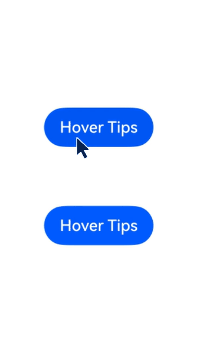

# Tips控制
<!--Kit: ArkUI-->
<!--Subsystem: ArkUI-->
<!--Owner: @liyi0309-->
<!--Designer: @liyi0309-->
<!--Tester: @lxl007-->
<!--Adviser: @Brilliantry_Rui-->

为组件绑定Tips悬浮气泡，当鼠标悬浮在组件上时，自动显示提示信息；鼠标离开组件时，悬浮气泡自动隐藏。

>  **说明：**
>
>  - 本模块同时支持ArkTS-Dyn、ArkTS-Sta。
>
>  - 从API version 19开始支持。后续版本如有新增内容，则采用上角标单独标记该内容的起始版本。
>
> - 本模块接口仅可在Stage模型下使用。
>
> - Tips控制依赖设备可以触发[悬浮事件](./ts-universal-events-hover.md)，对于无法触发[悬浮事件](./ts-universal-events-hover.md)的硬件设备无法使用Tips控制。

## bindTips

ArkTS-Dyn: bindTips(message: TipsMessageType, options?: TipsOptions): T

ArkTS-Sta: bindTips(message: TipsMessageType | undefined, options?: TipsOptions): this

为组件绑定Tips悬浮气泡。

> **说明：**
>
> 当绑定bindTips的组件设置通用属性[enabled](ts-universal-attributes-enable.md#enabled)为false时，仍支持弹出悬浮气泡。

**原子化服务API（仅ArkTS-Dyn）：** 从API version 19开始，该接口支持在原子化服务中使用。

**系统能力：** SystemCapability.ArkUI.ArkUI.Full

**模型约束：** 此接口仅可在Stage模型下使用。

**ArkTS-Dyn起始版本：** 19

**ArkTS-Sta起始版本：** 23

**参数：**

| 参数名 | 类型                                                         | 必填 | 说明                                                         |
| ------ | ------------------------------------------------------------ | ---- | ------------------------------------------------------------ |
| message|  ArkTS-Dyn: [TipsMessageType](#tipsmessagetype)<br/>ArkTS-Sta: [TipsMessageType](#tipsmessagetype) \| undefined                                                     | 是   | 悬浮气泡信息内容。设置为undefined时，默认不显示信息内容。 |
| options  | [TipsOptions](#tipsoptions类型说明) | 否   | 配置悬浮气泡的参数。<br/>默认值：<br/>{<br/>appearingTime: 700,<br/>disappearingTime: 300,<br/>appearingTimeWithContinuousOperation: 300,<br/>disappearingTimeWithContinuousOperation: 0, enableArrow: true,<br/>arrowPointPosition: ArrowPointPosition.CENTER,<br/>arrowWidth: 16,arrowHeight: 8,<br/>showAtAnchor: TipsAnchorType.TARGET<br/>} |

**返回值：**

|类型|说明|
|---|---|
|ArkTS-Dyn: T<br/>ArkTS-Sta: this|返回当前组件。|

## TipsOptions类型说明

悬浮气泡自定义参数。

**系统能力：** SystemCapability.ArkUI.ArkUI.Full

| 名称                                  | 类型                                                         | 只读 | 可选 | 说明                                                      |
| ------------------------------------- | ------------------------------------------------------------ | ---- | ---- | ------------------------------------------------------------ |
| appearingTime         |           ArkTS-Dyn: number<br/>ArkTS-Sta: int   | 否    | 是  |设置悬浮气泡的显示时延。显示时延的最大值为4000ms，设置超过4000ms的值以4000ms为准。<br/>默认值：700<br/>单位：ms<br/>**原子化服务API（仅ArkTS-Dyn）：** 从API version 19开始，该接口支持在原子化服务中使用。 <br/> **ArkTS-Dyn起始版本：** 19 <br/> **ArkTS-Sta起始版本：** 23 |
| disappearingTime                 |   ArkTS-Dyn: number<br/>ArkTS-Sta: int   | 否   | 是  | 设置悬浮气泡的隐藏时延。隐藏时延的最大值为4000ms，设置超过4000ms的值以4000ms为准。<br/>默认值：300<br/>单位：ms<br/>**原子化服务API（仅ArkTS-Dyn）：** 从API version 19开始，该接口支持在原子化服务中使用。  <br/> **ArkTS-Dyn起始版本：** 19 <br/> **ArkTS-Sta起始版本：** 23  |
| appearingTimeWithContinuousOperation    |     ArkTS-Dyn: number<br/>ArkTS-Sta: int   | 否   | 是  | 多个组件连续弹出悬浮气泡时，悬浮气泡的显示时延。显示时延的最大值为4000ms，设置超过4000ms的值以4000ms为准。 <br/>默认值：300<br/>单位：ms<br/>**原子化服务API（仅ArkTS-Dyn）：** 从API version 19开始，该接口支持在原子化服务中使用。  <br/> **ArkTS-Dyn起始版本：** 19 <br/> **ArkTS-Sta起始版本：** 23  |
| disappearingTimeWithContinuousOperation |     ArkTS-Dyn: number<br/>ArkTS-Sta: int   | 否   | 是  | 多个组件连续弹出悬浮气泡时，悬浮气泡的隐藏时延。隐藏时延的最大值为4000ms，设置超过4000ms的值以4000ms为准。 <br/>默认值：0<br/>单位：ms<br/>**原子化服务API（仅ArkTS-Dyn）：** 从API version 19开始，该接口支持在原子化服务中使用。  <br/> **ArkTS-Dyn起始版本：** 19 <br/> **ArkTS-Sta起始版本：** 23  |
| enableArrow        | boolean                                                      | 否   | 是  | 设置是否显示气泡箭头。<br/>默认值：true<br/>true：显示箭头；false：不显示箭头。<br/>**说明：** <br/>当页面可用空间无法让气泡完全避让时，气泡会覆盖到组件上并且不显示气泡箭头。<br/>**原子化服务API（仅ArkTS-Dyn）：** 从API version 19开始，该接口支持在原子化服务中使用。 <br/> **ArkTS-Dyn起始版本：** 19 <br/> **ArkTS-Sta起始版本：** 23 |
| arrowPointPosition     | [ArrowPointPosition](ts-appendix-enums.md#arrowpointposition11) | 否   | 是  | 气泡箭头相对于父组件显示位置，气泡箭头在垂直和水平方向上有 "Start"、"Center"、"End"三个位置点可选。所有位置点均位于父组件区域范围内，不会超出父组件的边界范围，也不会覆盖圆角范围。<br/>默认值：ArrowPointPosition.CENTER<br/>**原子化服务API（仅ArkTS-Dyn）：** 从API version 19开始，该接口支持在原子化服务中使用。 <br/> **ArkTS-Dyn起始版本：** 19 <br/> **ArkTS-Sta起始版本：** 23 |
| arrowWidth           | [Dimension](ts-types.md#dimension10)                  | 否   | 是  | 设置气泡箭头宽度。若所设置的宽度超过所在边的长度减去两倍的气泡圆角大小，则不绘制气泡箭头。<br/>默认值：16<br/>单位：vp<br/>**说明：**<br />不支持设置百分比。<br/>**原子化服务API（仅ArkTS-Dyn）：** 从API version 19开始，该接口支持在原子化服务中使用。 <br/> **ArkTS-Dyn起始版本：** 19 <br/> **ArkTS-Sta起始版本：** 23 |
| arrowHeight          | [Dimension](ts-types.md#dimension10)                  | 否   | 是  | 设置气泡箭头高度。<br/>默认值：8<br/>单位：vp<br/>**说明：**<br />不支持设置百分比。<br/>**原子化服务API（仅ArkTS-Dyn）：** 从API version 19开始，该接口支持在原子化服务中使用。 <br/> **ArkTS-Dyn起始版本：** 19 <br/> **ArkTS-Sta起始版本：** 23 |
| showAtAnchor<sup>20+</sup> | [TipsAnchorType](ts-appendix-enums.md#tipsanchortype20)                  | 否   | 是  | 设置Tips跟随类型。<br/>**模型约束：** 此接口仅可在Stage模型下使用。<br/>默认值：TipsAnchorType.TARGET<br/>**说明：**<br />Tips的跟随类型为TipsAnchorType.CURSOR时，Tips不显示箭头。<br/>**原子化服务API（仅ArkTS-Dyn）：** 从API version 20开始，该接口支持在原子化服务中使用。  <br/> **ArkTS-Dyn起始版本：** 20 <br/> **ArkTS-Sta起始版本：** 23  |

## TipsMessageType

type TipsMessageType = ResourceStr | StyledString

悬浮气泡信息类型。

**原子化服务API（仅ArkTS-Dyn）：** 从API version 19开始，该接口支持在原子化服务中使用。

**系统能力：** SystemCapability.ArkUI.ArkUI.Full

**ArkTS-Dyn起始版本：** 19

**ArkTS-Sta起始版本：** 23

| 类型                                                       | 说明                                           |
| ---------------------------------------------------------- | ---------------------------------------------- |
| [ResourceStr](ts-types.md#resourcestr)                     | 字符串类型，用于描述字符串入参可以使用的类型。 |
| [StyledString](ts-universal-styled-string.md#styledstring) | 属性字符串。                                   |

## 示例
示例效果请以真机运行为准，当前DevEco Studio预览器不支持。
### 示例1（悬浮气泡的显示和消失）

此示例为[bindTips](#bindtips)通过绑定[Button](./ts-basic-components-button.md)，在悬停态时产生悬浮气泡。

ArkTS-Dyn示例：

```ts
// xxx.ets
/**
 * 示例用途：演示bindTips方法的基本用法，为按钮组件绑定悬浮气泡
 * 功能说明：当鼠标悬停在按钮上时显示Tips气泡，离开时自动隐藏
 * 
 * 关键参数说明：
 * - message: "Tips" - 悬浮气泡显示的文本内容
 * - appearingTime: 700 - 悬浮气泡显示延迟时间（毫秒）
 * - disappearingTime: 300 - 悬浮气泡隐藏延迟时间（毫秒）
 * - appearingTimeWithContinuousOperation: 300 - 连续操作时气泡显示延迟时间（毫秒）
 * - disappearingTimeWithContinuousOperation: 0 - 连续操作时气泡隐藏延迟时间（毫秒）
 * - enableArrow: true - 是否显示气泡箭头
 * 
 * 回调函数：无回调函数，通过鼠标悬停事件自动触发显示和隐藏
 */
@Entry
@Component
struct TipsExample {
  build() {
    Flex({ direction: FlexDirection.Column }) {
      Button('Hover Tips')
        .bindTips("Tips", {
          appearingTime: 700,
          disappearingTime: 300,
          appearingTimeWithContinuousOperation: 300,
          disappearingTimeWithContinuousOperation: 0,
          enableArrow: true,
        })
        .position({ x: 100, y: 250 })
    }.width('100%').padding({ top: 5 })
  }
}
```

ArkTS-Sta示例：

```ts
'use static'
// xxx.ets

/**
 * 示例用途：演示bindTips方法在ArkTS-Sta中的基本用法，为按钮组件绑定悬浮气泡
 * 功能说明：当鼠标悬停在按钮上时显示Tips气泡，离开时自动隐藏
 * 
 * 关键参数说明：
 * - message: "Tips" - 悬浮气泡显示的文本内容
 * - appearingTime: 700 - 悬浮气泡显示延迟时间（毫秒）
 * - disappearingTime: 300 - 悬浮气泡隐藏延迟时间（毫秒）
 * - appearingTimeWithContinuousOperation: 300 - 连续操作时气泡显示延迟时间（毫秒）
 * - disappearingTimeWithContinuousOperation: 0 - 连续操作时气泡隐藏延迟时间（毫秒）
 * - enableArrow: true - 是否显示气泡箭头
 * 
 * 类型约束说明：
 * - position参数需要明确类型为Position
 * - padding参数需要明确类型为Padding
 * 
 * 回调函数：无回调函数，通过鼠标悬停事件自动触发显示和隐藏
 */
import { Entry, Component, Flex, FlexDirection, Button,
  Position, Padding } from '@kit.ArkUI';
@Entry
@Component
struct TipsExample {
  build() {
    Flex({ direction: FlexDirection.Column }) {
      Button('Hover Tips')
        .bindTips("Tips", {
          appearingTime: 700,
          disappearingTime: 300,
          appearingTimeWithContinuousOperation: 300,
          disappearingTimeWithContinuousOperation: 0,
          enableArrow: true,
        })
        .position({ x: 100, y: 250 } as Position)
    }.width('100%').padding({ top: 5 } as Padding)
  }
}
```


### 示例2（多个悬浮气泡的显示和消失）

此示例展示了如何使用[bindTips](#bindtips)配置多个悬浮气泡依次显示和消失。

ArkTS-Dyn示例：

```ts
// xxx.ets

/**
 * 示例用途：演示多个组件绑定bindTips的连续显示和隐藏效果
 * 功能说明：当鼠标在不同按钮间移动时，悬浮气泡按照配置的时延依次显示和隐藏
 * 
 * 关键参数说明：
 * - appearingTime: 700 - 悬浮气泡显示延迟时间（毫秒）
 * - disappearingTime: 300 - 悬浮气泡隐藏延迟时间（毫秒）
 * - appearingTimeWithContinuousOperation: 300 - 连续操作时气泡显示延迟时间（毫秒）
 *   当从一个按钮移动到另一个按钮时，新气泡的显示延迟时间
 * - disappearingTimeWithContinuousOperation: 0 - 连续操作时气泡隐藏延迟时间（毫秒）
 *   当从一个按钮移动到另一个按钮时，原气泡的隐藏延迟时间
 * - enableArrow: true - 是否显示气泡箭头
 * 
 * 连续操作场景说明：
 * - appearingTimeWithContinuousOperation 和 disappearingTimeWithContinuousOperation
 *   用于控制多个组件间的气泡切换行为，实现更流畅的用户体验
 * 
 * 回调函数：无回调函数，通过鼠标悬停事件自动触发显示和隐藏
 */
@Entry
@Component
struct TipsExample {
  build() {
    Flex({ direction: FlexDirection.Column }) {
      Button('Hover Tips')
        .bindTips("Tips", {
          appearingTime: 700,
          disappearingTime: 300,
          appearingTimeWithContinuousOperation: 300,
          disappearingTimeWithContinuousOperation: 0,
          enableArrow: true,
        })
        .position({ x: 100, y: 250 })

      Button('Hover Tips')
        .bindTips("Tips", {
          appearingTime: 700,
          disappearingTime: 300,
          appearingTimeWithContinuousOperation: 300,
          disappearingTimeWithContinuousOperation: 0,
          enableArrow: true,
        })
        .position({ x: 100, y: 350 })


    }.width('100%').padding({ top: 5 })
  }
}
```

ArkTS-Sta示例：

```ts
'use static'
// xxx.ets

/**
 * 示例用途：演示多个组件绑定bindTips在ArkTS-Sta中的连续显示和隐藏效果
 * 功能说明：当鼠标在不同按钮间移动时，悬浮气泡按照配置的时延依次显示和隐藏
 * 
 * 关键参数说明：
 * - appearingTime: 700 - 悬浮气泡显示延迟时间（毫秒）
 * - disappearingTime: 300 - 悬浮气泡隐藏延迟时间（毫秒）
 * - appearingTimeWithContinuousOperation: 300 - 连续操作时气泡显示延迟时间（毫秒）
 *   当从一个按钮移动到另一个按钮时，新气泡的显示延迟时间
 * - disappearingTimeWithContinuousOperation: 0 - 连续操作时气泡隐藏延迟时间（毫秒）
 *   当从一个按钮移动到另一个按钮时，原气泡的隐藏延迟时间
 * - enableArrow: true - 是否显示气泡箭头
 * 
 * 连续操作场景说明：
 * - appearingTimeWithContinuousOperation 和 disappearingTimeWithContinuousOperation
 *   用于控制多个组件间的气泡切换行为，实现更流畅的用户体验
 * 
 * 类型约束说明：
 * - position参数需要明确类型为Position
 * - padding参数需要明确类型为Padding
 * 
 * 回调函数：无回调函数，通过鼠标悬停事件自动触发显示和隐藏
 */
import { Entry, Component, Flex, FlexDirection, Button,
  Position, Padding } from '@kit.ArkUI';

@Entry
@Component
struct TipsExample {
  build() {
    Flex({ direction: FlexDirection.Column }) {
      Button('Hover Tips')
        .bindTips("Tips", {
          appearingTime: 700,
          disappearingTime: 300,
          appearingTimeWithContinuousOperation: 300,
          disappearingTimeWithContinuousOperation: 0,
          enableArrow: true,
        })
        .position({ x: 100, y: 250 } as Position)

      Button('Hover Tips')
        .bindTips("Tips", {
          appearingTime: 700,
          disappearingTime: 300,
          appearingTimeWithContinuousOperation: 300,
          disappearingTimeWithContinuousOperation: 0,
          enableArrow: true,
        })
        .position({ x: 100, y: 350 } as Position)

    }.width('100%').padding({ top: 5 } as Padding)
  }
}
```

