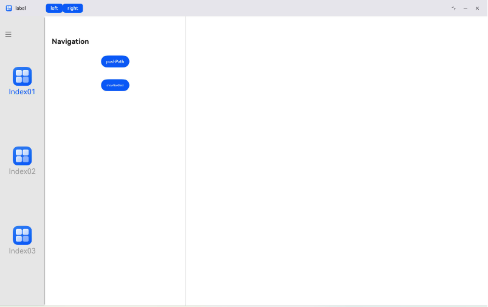

# 工具栏设置
<!--Kit: ArkUI-->
<!--Subsystem: ArkUI-->
<!--Owner: @pengzhiwen3-->
<!--Designer: @dutie123-->
<!--Tester: @songyanhong-->
<!--Adviser: @Brilliantry_Rui-->

为组件设置对应的工具栏。toolbar是组件通用属性，可在窗口顶部标题栏相应分栏位置创建由ToolBarItem构成的自定义工具栏，适用于需要在标题栏区域添加自定义操作项（如按钮、滑动条、搜索栏等）的场景。

>  **说明：**
>
> - 本模块首批接口从API version 20开始支持。后续版本的新增接口，采用上角标单独标记接口的起始版本。
>
> - 本模块接口仅可在Stage模型下使用。
>
> - 该toolbar为组件通用属性，请注意与[Navigation](ts-basic-components-navigation.md)组件自身的toolbar属性进行区分。

## toolbar

toolbar(value: CustomBuilder): T

为绑定该属性的组件，在窗口顶部标题栏相应分栏创建由[ToolBarItem](ts-basic-components-toolbaritem.md)构成的工具栏，分栏位置由绑定该属性的组件所在分栏决定。[CustomBuilder](ts-types.md#custombuilder8)必须由[ToolBarItem](ts-basic-components-toolbaritem.md)构成，该工具栏才能生效。适用于在分栏导航场景下，需要在标题栏区域集成快捷操作入口（如收藏、分享、编辑等操作按钮）的应用。

> **说明：**
>
> 该接口不支持在[attributeModifier](ts-universal-attributes-attribute-modifier.md#attributemodifier)中调用。

**系统能力：** SystemCapability.ArkUI.ArkUI.Full

**参数：** 

| 参数名 | 类型                                        | 必填 | 说明                                            |
| ------ | ------------------------------------------- | ---- | ----------------------------------------------- |
| value  | [CustomBuilder](ts-types.md#custombuilder8) | 是   | 为当前组件配置CustomBuilder类型的自定义工具栏。CustomBuilder必须由[ToolBarItem](ts-basic-components-toolbaritem.md)构成，该工具栏才能生效。 |

**返回值：**

| 类型 | 说明 |
| -------- | -------- |
| T | 返回当前组件。 |

>  **说明：**
>  1. toolbar仅支持固定标题栏，不支持悬浮标题栏（悬浮标题栏仅在三键导航模式下涉及，三键导航模式即设备底部显示返回、主屏、多任务三个虚拟导航按键的导航模式）。
>
>  2. toolbar支持自定义组件布局，可将其置于特定分栏位置（左侧或右侧）。但需注意，当元素总宽度超过可用空间时，将导致布局截断或焦点框遮挡等现象，从而使部分操作项不可见或引发交互冲突。此时，元素不会自动缩略，建议根据分栏可用宽度控制元素数量，避免元素总宽度超出可用空间。
>
>  3. toolbar当前仅支持单行布局，不支持多行布局，因此应避免在一个toolbar中放置多行布局的元素。
>
>  4. toolbar仅支持在[NavigationMode](ts-basic-components-navigation.md#navigationmode9枚举说明)为Split的场景中使用。
>
>  5. 标题栏高度会根据toolbar内的[ToolBarItem](ts-basic-components-toolbaritem.md)组件在有限范围内浮动：
>     * [ToolBarItem](ts-basic-components-toolbaritem.md)组件与标题栏默认存在4vp的margin（外边距）。
>     * 当[ToolBarItem](ts-basic-components-toolbaritem.md)组件的最大高度小于等于48vp时，标题栏高度会调整为56vp，此设置适用于标题栏、工具栏、搜索栏等通用组件。
>     * 当[ToolBarItem](ts-basic-components-toolbaritem.md)组件的最大高度介于48vp到56vp之间时，标题栏高度会调整为64vp，此设置适用于图标与文字同时呈现的工具栏。
>     * 当[ToolBarItem](ts-basic-components-toolbaritem.md)组件的最大高度超过56vp时，标题栏高度会调整为72vp。如果[ToolBarItem](ts-basic-components-toolbaritem.md)组件的最大高度超过64vp，则标题栏的高度保持为72vp，超出的区域会发生裁剪。

## 示例

该示例通过为[Navigation](ts-basic-components-navigation.md)下的[Button](ts-basic-components-button.md)组件绑定toolbar通用属性，为标题栏NavBar分栏开头位置添加包含两个[Button](ts-basic-components-button.md)组件的工具栏项。为[NavDestination](ts-basic-components-navdestination.md)下的[Text](ts-basic-components-text.md)组件绑定toolbar通用属性，为标题栏NavDestination分栏末尾位置添加包含一个滑动条组件和一个搜索栏组件的工具栏项。

```ts
// xxx.ets
@Entry
@Component
struct ToolbarExample {
  normalIcon: Resource = $r('app.media.startIcon')
  selectedIcon: Resource = $r("app.media.startIcon")
  @State arr: number[] = [1, 2, 3]
  @State current: number = 1
  @Provide('navPathStack') navPathStack: NavPathStack = new NavPathStack()

  @Builder
  MyToolbar() {
    ToolBarItem({ placement: ToolBarItemPlacement.TOP_BAR_LEADING }) {
      Button("left").height("30vp")
    }

    ToolBarItem({ placement: ToolBarItemPlacement.TOP_BAR_LEADING }) {
      Button("right").height("30vp")
    }
  }

  @Builder
  MyToolbarNavDest() {
    ToolBarItem({ placement: ToolBarItemPlacement.TOP_BAR_TRAILING }) {
      Slider().width("120vp")
    }

    ToolBarItem({ placement: ToolBarItemPlacement.TOP_BAR_TRAILING }) {
      Search().width("120vp")
    }
  }

  @Builder
  PageNavDest(name: string) {
    NavDestination() {
      Column() {
        Text("add toolbar")
          .fontSize(30)
          .toolbar(this.MyToolbarNavDest())
      }
      .backgroundColor(Color.Gray)
    }
  }

  build() {
    SideBarContainer(SideBarContainerType.Embed) {
      Column() {
        ForEach(this.arr, (item: number) => {
          Column({ space: 5 }) {
            Image(this.current === item ? this.selectedIcon : this.normalIcon).width(64).height(64)
            Text("Index0" + item)
              .fontSize(25)
              .fontColor(this.current === item ? '#0A59F7' : '#999')
              .fontFamily('source-sans-pro,cursive,sans-serif')
          }
          .onClick(() => {
            this.current = item;
          })
        }, (item: number) => item.toString())
      }.width('100%')
      .justifyContent(FlexAlign.SpaceEvenly)
      .backgroundColor('#19000000')

      Navigation(this.navPathStack) {
        Column() {
          Button('pushPath', { stateEffect: true, type: ButtonType.Capsule })
            .width('20%')
            .height(40)
            .margin(20)
            .toolbar(this.MyToolbar())
          Button('showNavDest', { stateEffect: true, type: ButtonType.Capsule })
            .width('20%')
            .height(40)
            .margin(20)
            .onClick(() => {
              this.navPathStack.pushPath({ name: '1' });
            })
        }
        .width('100%')
        .height('100%')
      }
      .navBarPosition(NavBarPosition.Start)
      .navBarWidth("50%")
      .navBarWidthRange(["25%", "70%"])
      .hideBackButton(true)
      .navDestination(this.PageNavDest)
      .height('100%')
      .title('Navigation')
    }
    .sideBarWidth(150)
    .minSideBarWidth(50)
    .maxSideBarWidth(300)
    .minContentWidth(0)
    .onChange((value: boolean) => {
      console.info('status:' + value);
    })
    .divider({
      strokeWidth: '1vp',
      color: Color.Gray,
      startMargin: '4vp',
      endMargin: '4vp'
    })
  }
}
```
