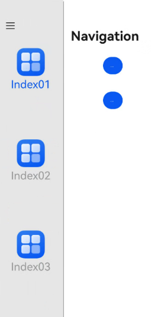

# 工具栏设置
<!--Kit: ArkUI-->
<!--Subsystem: ArkUI-->
<!--Owner: @jiangtao92-->
<!--Designer: @piggyguy-->
<!--Tester: @songyanhong-->
<!--Adviser: @HelloCrease-->

设置组件对应的工具栏。

>  **说明：**
>
>  从API version 20开始支持。后续版本如有新增内容，则采用上角标单独标记该内容的起始版本。
>
>  该toolbar为组件通用属性，请注意与[Navigtion](ts-basic-components-navigation.md)组件自身的toolbar属性进行区分。

## toolbar

toolbar(value: CustomBuilder): T

为绑定该属性的组件，在窗口顶部标题栏相应分栏创建与该组件绑定的由[ToolBarItem](ts-basic-components-toolbaritem.md)构成的工具栏，分栏位置依据绑定该属性的组件所在分栏位置确定。[CustomBuilder](ts-types.md#custombuilder8)必须由[ToolBarItem](ts-basic-components-toolbaritem.md)构成，该工具栏才能生效。

**系统能力：** SystemCapability.ArkUI.ArkUI.Full

**参数：** 

| 参数名 | 类型                                        | 必填 | 说明                                            |
| ------ | ------------------------------------------- | ---- | ----------------------------------------------- |
| value  | [CustomBuilder](ts-types.md#custombuilder8) | 是   | 为当前组件配置CustomBuilder类型的自定义工具栏。 |

**返回值：**

| 类型 | 说明 |
| -------- | -------- |
| T | 返回当前组件。 |

>  **说明：**
>  1. toolbar仅支持固定标题栏，不支持悬浮标题栏（仅限三键模式）。
>
>  2. toolbar支持自定义组件布局，可将其置于特定分栏位置（左侧或右侧）。但需注意，当元素数量超过可用空间时，将导致布局截断或焦点框遮挡等现象，从而使部分操作项不可见或引发交互冲突。此时，元素不会自动缩略，建议合理控制元素数量。
>
>  3. toolbar当前仅支持单行布局，不支持多行布局，因此应避免在一个toolbar中放置多行布局的元素。
>
>  4. toolbar仅支持在[NavigationMode](ts-basic-components-navigation.md#navigationmode9枚举说明)为Split的场景中使用。当[NavigationMode](ts-basic-components-navigation.md#navigationmode9枚举说明)设置为Stack或Auto时，无法应用toolbar。
>
>  5. 标题栏高度会根据toolbar内的[ToolBarItem](ts-basic-components-toolbaritem.md)组件在有限范围内浮动：
>     * [ToolBarItem](ts-basic-components-toolbaritem.md)组件的会与标题栏默认存在4VP的margin（外边距）。
>     * 当[ToolBarItem](ts-basic-components-toolbaritem.md)组件的最大高度小于等于48VP时，标题栏高度会调整为56VP，此设置适用于标题栏、工具栏、搜索栏等通用组件。
>     * 当[ToolBarItem](ts-basic-components-toolbaritem.md)组件的最大高度介于48VP到56VP之间时，标题栏高度会调整为64VP，此设置适用于图标与文字同时呈现的工具栏。
>     * 当[ToolBarItem](ts-basic-components-toolbaritem.md)组件的最大高度超过56VP时，标题栏高度会调整为72VP。如果[ToolBarItem](ts-basic-components-toolbaritem.md)组件的最大高度超过64VP，则标题栏的高度保持为72VP，超出的区域会发生裁剪。

## 示例

该示例通过为[Navigtion](ts-basic-components-navigation.md)下的[Button](ts-basic-components-button.md)组件绑定toolbar通用属性，为标题栏Navbar分栏开头位置添加包含两个[Button](ts-basic-components-button.md)组件工具栏项。为[NavDestination](ts-basic-components-navdestination.md)下的[Text](ts-basic-components-text.md)组件绑定toolbar通用属性，为标题栏NavDestination分栏末尾位置添加包含一个滑动条组件和一个搜索栏组件工具栏项。

```ts
// xxx.ets
@Entry
@Component
struct SideBarContainerExample {
  normalIcon: Resource = $r("app.media.startIcon")
  selectedIcon: Resource = $r("app.media.startIcon")
  @State arr: number[] = [1, 2, 3]
  @State current: number = 1
  @Provide('navPathStack') navPathStack: NavPathStack = new NavPathStack()

  @Builder
  MyToolBar() {
    ToolBarItem({ placement: ToolBarItemPlacement.TOP_BAR_LEADING }) {
      Button("left").height("30vp")
    }

    ToolBarItem({ placement: ToolBarItemPlacement.TOP_BAR_LEADING }) {
      Button("right").height("30vp")
    }
  }

  @Builder
  MyToolbarNavDest() {
    ToolBarItem({ placement: ToolBarItemPlacement.TOP_BAR_TRAILING }) {
      Slider().width("120vp")
    }

    ToolBarItem({ placement: ToolBarItemPlacement.TOP_BAR_TRAILING }) {
      Search().width("120vp")
    }
  }

  @Builder
  PageNavDest(name: string) {
    NavDestination() {
      Column() {
        Text("add toolbar")
          .fontSize(30)
          .toolbar(this.MyToolbarNavDest())
      }
      .backgroundColor(Color.Grey)
    }
  }

  build() {
    SideBarContainer(SideBarContainerType.Embed) {
      Column() {
        ForEach(this.arr, (item: number) => {
          Column({ space: 5 }) {
            Image(this.current === item ? this.selectedIcon : this.normalIcon).width(64).height(64)
            Text("Index0" + item)
              .fontSize(25)
              .fontColor(this.current === item ? '#0A59F7' : '#999')
              .fontFamily('source-sans-pro,cursive,sans-serif')
          }
          .onClick(() => {
            this.current = item
          })
        }, (item: number) => item.toString())
      }.width('100%')
      .justifyContent(FlexAlign.SpaceEvenly)
      .backgroundColor('#19000000')

      Navigation(this.navPathStack) {
        Column() {
          Button('pushPath', { stateEffect: true, type: ButtonType.Capsule })
            .width('20%')
            .height(40)
            .margin(20)
            .toolbar(this.MyToolBar)
          Button('showNavDest', { stateEffect: true, type: ButtonType.Capsule })
            .width('20%')
            .height(40)
            .margin(20)
            .onClick(() => {
              this.navPathStack.pushPath({ name: "1" })
            })
        }
        .width('100%')
        .height('100%')
      }
      .navBarPosition(NavBarPosition.Start)
      .navBarWidth("50%")
      .navBarWidthRange(["25%", "70%"])
      .hideBackButton(true)
      .navDestination(this.PageNavDest)
      .height('100%')
      .title('Navigation')
    }
    .sideBarWidth(150)
    .minSideBarWidth(50)
    .maxSideBarWidth(300)
    .minContentWidth(0)
    .onChange((value: boolean) => {
      console.info('status:' + value)
    })
    .divider({
      strokeWidth: '1vp',
      color: Color.Gray,
      startMargin: '4vp',
      endMargin: '4vp'
    })
  }
}
```
