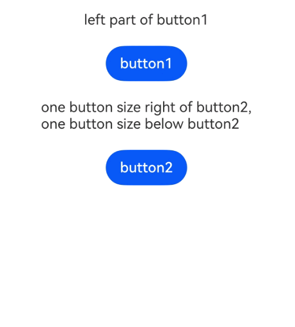

# 触摸热区设置
<!--Kit: ArkUI-->
<!--Subsystem: ArkUI-->
<!--Owner: @jiangtao92-->
<!--Designer: @piggyguy-->
<!--Tester: @songyanhong-->
<!--Adviser: @Brilliantry_Rui-->

设置组件的响应热区。在ArkUI开发框架中，处理触屏事件和鼠标事件时，会在事件触发前进行按压点与组件响应热区的[触摸测试](../../../ui/arkts-interaction-basic-principles.md#触摸测试)，以收集需响应事件的组件。基于测试结果，框架会分发相应的事件。影响[点击事件](ts-universal-events-click.md)、[触摸事件](ts-universal-events-touch.md)、[拖拽事件](ts-universal-events-drag-drop.md)、[鼠标事件](ts-universal-mouse-key.md)、[轴事件](ts-universal-events-axis.md)、[悬浮事件](ts-universal-events-hover.md)、[无障碍悬浮事件](ts-universal-accessibility-hover-event.md)和[手势事件](ts-gesture-settings.md)的分发。


>  **说明：**
>
> - 从API version 8开始支持。后续版本如有新增内容，则采用上角标单独标记该内容的起始版本。
> - 设置触摸热区属性时，手指需在热区内按下，随后抬起时若满足事件响应条件，事件将被触发。此外，在当前手势结束前，若条件满足，可持续触发的事件也会被激活。

## responseRegion

responseRegion(value: Array&lt;Rectangle&gt; | Rectangle): T

设置一个或多个触摸热区。

**卡片能力：** 从API version 9开始，该接口支持在ArkTS卡片中使用。

**原子化服务API：** 从API version 11开始，该接口支持在原子化服务中使用。

**系统能力：** SystemCapability.ArkUI.ArkUI.Full

**参数：**

| 参数名 | 类型                                                         | 必填 | 说明                                                         |
| ------ | ------------------------------------------------------------ | ---- | ------------------------------------------------------------ |
| value  | Array&lt;[Rectangle](#rectangle对象说明)&gt;&nbsp;\|&nbsp;[Rectangle](#rectangle对象说明) | 是   | 触摸热区，包括位置和大小。<br/>默认触摸热区为整个组件，默认值：<br/>{<br/>x：0,<br/>y：0,<br/>width：'100%',<br/>height：'100%'<br/>}<br/> |

**返回值：**

| 类型 | 说明 |
| -------- | -------- |
| T | 返回当前组件。 |

## mouseResponseRegion<sup>10+</sup>

mouseResponseRegion(value: Array&lt;Rectangle&gt; | Rectangle): T

设置一个或多个鼠标触摸热区。

**原子化服务API：** 从API version 11开始，该接口支持在原子化服务中使用。

**系统能力：** SystemCapability.ArkUI.ArkUI.Full

**参数：**

| 参数名 | 类型                                                         | 必填 | 说明                                                         |
| ------ | ------------------------------------------------------------ | ---- | ------------------------------------------------------------ |
| value  | Array&lt;[Rectangle](#rectangle对象说明)&gt;&nbsp;\|&nbsp;[Rectangle](#rectangle对象说明) | 是   | 鼠标触摸热区，包括位置和大小。<br/>默认触摸热区为整个组件，默认值：<br/>{<br/>x：0,<br/>y：0,<br/>width：'100%',<br/>height：'100%'<br/>} |

**返回值：**

| 类型 | 说明 |
| -------- | -------- |
| T | 返回当前组件。 |

## responseRegionList<sup>23+</sup>

responseRegionList(regions: Array&lt;ResponseRegion&gt;): T

设置组件的触摸热区列表。调用该接口时，[responseRegion](#responseregion)与[mouseResponseRegion](#mouseresponseregion10)接口不再生效。

**原子化服务API：** 从API version 23开始，该接口支持在原子化服务中使用。

**系统能力：** SystemCapability.ArkUI.ArkUI.Full

**参数：**

| 参数名 | 类型                                                         | 必填 | 说明                                                         |
| ------ | ------------------------------------------------------------ | ---- | ------------------------------------------------------------ |
| regions  | Array&lt;[ResponseRegion](#responseregion23对象说明)&gt;&nbsp; | 是   | 组件的触摸热区数组。<br/>每个触摸热区均包括输入工具类型、位置和大小。<br/>默认值：<br/>[{<br/>tool：ResponseRegionSupportedTool.ALL,<br/>x：LengthMetrics.vp(0),<br/>y：LengthMetrics.vp(0),<br/>width：LengthMetrics.percent(1),<br/>height：LengthMetrics.percent(1)<br/>}] |

**返回值：**

| 类型 | 说明 |
| -------- | -------- |
| T | 返回当前组件。 |

## Rectangle对象说明

**卡片能力：** 从API version 9开始，该接口支持在ArkTS卡片中使用。

**原子化服务API：** 从API version 11开始，该接口支持在原子化服务中使用。

**系统能力：** SystemCapability.ArkUI.ArkUI.Full

| 名称        | 类型                        | 只读    |  可选   |  说明                             |
| ------ | ----------------------------- | -----| -----|-------------------------------- |
| x      | [Length](ts-types.md#length)  | 否   | 是   |触摸点相对于组件左上角的x轴坐标。<br/>默认值：0vp |
| y      | [Length](ts-types.md#length)  | 否   | 是   |触摸点相对于组件左上角的y轴坐标。<br/>默认值：0vp |
| width  | [Length](ts-types.md#length)  | 否   | 是   |触摸热区的宽度。<br/>默认值：'100%' |
| height | [Length](ts-types.md#length) | 否   | 是   |触摸热区的高度。<br/>默认值：'100%' |

  >  **说明：**
  >
  >  x和y可以设置正负值百分比。当x设置为'100%'时表示热区往右偏移组件本身宽度大小，当x设置为'-100%'时表示热区往左偏移组件本身宽度大小。当y设置为'100%'时表示热区往下偏移组件本身高度大小，当y设置为'-100%'时表示热区往上偏移组件本身高度大小。
  >
  >  width和height只能设置正值百分比。width：'100%'表示热区宽度设置为该组件本身的宽度。比如组件本身宽度是100vp，那么'100%'表示热区宽度也为100vp。height：'100%'表示热区高度设置为该组件本身的高度。
  >
  >  百分比相对于组件自身宽高进行计算。
  >
  >  当父组件设置[clip](ts-universal-attributes-sharp-clipping.md#clip12)(true)时，子组件的响应会受到父组件触摸热区的影响，不在父组件触摸热区内的子组件无法响应手势和事件。
  >
  >  width和height不支持calc()的动态计算。

## ResponseRegion<sup>23+</sup>对象说明

由输入工具类型、触摸位置和大小组成的触摸热区。

  >  **说明：**
  >
  > - 当父组件设置[clip](ts-universal-attributes-sharp-clipping.md#clip12)为true时，子组件的响应会受到父组件触摸热区的影响，不在父组件触摸热区内的子组件无法响应手势和事件。
  >  
  > - 如果触摸热区未配置输入工具类型，触摸位置和大小均采用默认值。
  >  
  > - x和y的计算结果为正值时，分别代表向右偏移和向下偏移；当计算结果为负值时，分别代表向左偏移和向上偏移。
  >
  > - width和height采用string类型时，string需采用小写字符否则不生效，支持calc()的动态计算。指定calc()的入参字符串格式为'宽高缩放比例 ± 宽高增量'，宽高缩放比例为百分比，宽高增量单位为px或vp。例如'calc(80% + 10vp)'中，80%为宽高缩放比例、10vp为宽高增量。width和height采用LengthMetrics类型且单位为percent时，相对于组件自身宽高进行计算，percent(1)代表100%。当计算结果为负值时，采用默认值。

**原子化服务API：** 从API version 23开始，该接口支持在原子化服务中使用。

**系统能力：** SystemCapability.ArkUI.ArkUI.Full

| 名称        | 类型                        | 只读    |  可选   |  说明                             |
| ------ | ----------------------------- | -----| -----|-------------------------------- |
| tool   | [ResponseRegionSupportedTool](#responseregionsupportedtool23)  | 否   | 是   |触摸热区适用的输入工具类型。<br/>默认值：ResponseRegionSupportedTool.ALL |
| x      | [LengthMetrics](../js-apis-arkui-graphics.md#lengthmetrics12)  | 否   | 是   |触摸点相对于组件左上角的x轴坐标。<br/>默认值：LengthMetrics.vp(0) |
| y      | [LengthMetrics](../js-apis-arkui-graphics.md#lengthmetrics12)  | 否   | 是   |触摸点相对于组件左上角的y轴坐标。<br/>默认值：LengthMetrics.vp(0) |
| width  | [LengthMetrics](../js-apis-arkui-graphics.md#lengthmetrics12) \| string | 否   | 是   |触摸热区的宽度。<br/>默认值：LengthMetrics.percent(1) |
| height | [LengthMetrics](../js-apis-arkui-graphics.md#lengthmetrics12) \| string | 否   | 是   |触摸热区的高度。<br/>默认值：LengthMetrics.percent(1) |

## ResponseRegionSupportedTool<sup>23+</sup>

触摸热区适用的输入工具类型。

**原子化服务API：** 从API version 23开始，该接口支持在原子化服务中使用。

**系统能力：** SystemCapability.ArkUI.ArkUI.Full

| 名称   | 值 | 说明                             |
| ------ | -----|------------------------------- |
| ALL    | 0 | 所有输入工具类型。   |
| FINGER | 1 | 手指。   |
| PEN    | 2 | 手写笔。 |
| MOUSE  | 3 | 鼠标。   |


## 示例

### 示例1（通过responseRegion接口设置触摸热区）

该示例通过responseRegion设置按钮的触摸热区以响应点击事件。

```ts
// xxx.ets
@Entry
@Component
struct TouchTargetExample {
  @State text: string = "";

  build() {
    Column({ space: 20 }) {
      Text("{x:0,y:0,width:'50%',height:'100%'}")
      // 热区宽度为按钮的一半，点击右侧无响应
      Button("button1")
        .responseRegion({ x: 0, y: 0, width: '50%', height: '100%' })
        .onClick(() => {
          this.text = 'button1 clicked'
        })

      // 为一个组件添加多个热区
      Text("[{x:'100%',y:0,width:'50%',height:'100%'}," +
      "\n{ x: 0, y: 0, width: '50%', height: '100%' }]")
      Button("button2")
        .responseRegion([
          { x: '100%', y: 0, width: '50%', height: '100%' }, // 第一个热区宽度为按钮的一半，点击按钮右侧宽度一半区域，点击事件生效
          { x: 0, y: 0, width: '50%', height: '100%' } // 第二个热区宽度为按钮的一半，点击button2左半边，点击事件生效
        ])
        .onClick(() => {
          this.text = 'button2 clicked'
        })
      // 热区大小为整个按钮，且下移一个按钮高度，点击button3下方按钮大小区域，点击事件生效
      Text("{x:0,y:'100%',width:'100%',height:'100%'}")
      Button("button3")
        .responseRegion({ x: 0, y: '100%', width: '100%', height: '100%' })
        .onClick(() => {
          this.text = 'button3 clicked'
        })

      Text(this.text).margin({ top: 50 })
    }.width('100%').margin({ top: 10 })
  }
}
```


### 示例2（通过responseRegionList接口设置触摸热区）

从API version 23开始，该示例通过responseRegionList设置按钮的触摸热区以响应点击事件。

```ts
// xxx.ets
import { LengthMetrics } from '@kit.ArkUI';

@Entry
@Component
struct TouchTargetExample {
  @State text: string = "";

  build() {
    Column({ space: 20 }) {
      Text("left part of button1")
      // 热区宽度为按钮的一半，点击右侧无响应
      Button("button1")
        .responseRegionList([{
          x: LengthMetrics.vp(0),
          y: LengthMetrics.vp(0),
          width: LengthMetrics.percent(0.5),
          height: LengthMetrics.percent(1),
        }])
        .onClick(() => {
          this.text = 'button1 clicked'
        })

      // 热区一的大小为整个按钮，且右移一个按钮宽度，点击button2左边按钮大小区域，点击事件生效
      // 热区二的大小为整个按钮，且下移一个按钮高度，鼠标点击button2下方按钮大小区域，点击事件生效
      Text("one button size right of button2," + "\n one button size below button2")
      Button("button2")
        .responseRegionList([{
          x: LengthMetrics.percent(1),
          y: LengthMetrics.vp(0),
          width: LengthMetrics.percent(1),
          height: LengthMetrics.percent(1),
        }, {
          tool: ResponseRegionSupportedTool.MOUSE,
          x: LengthMetrics.vp(0),
          y: LengthMetrics.percent(1),
          width: 'calc(100% + 0vp)',
          height: 'calc(100% - 0px)',
        }])
        .onClick(() => {
          this.text = 'button2 clicked'
        })

      Text(this.text).margin({ top: 50 })
    }.width('100%').margin({ top: 10 })
  }
}
```


