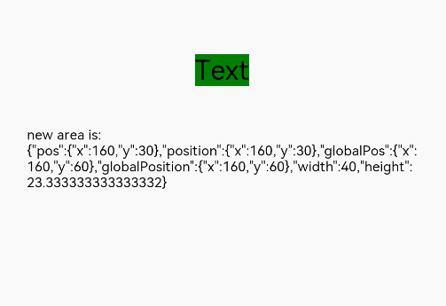

# 组件区域变化事件
<!--Kit: ArkUI-->
<!--Subsystem: ArkUI-->
<!--Owner: @yihao-lin-->
<!--Designer: @piggyguy-->
<!--Tester: @songyanhong-->
<!--Adviser: @Brilliantry_Rui-->

组件区域变化事件指组件显示的尺寸、位置等发生变化时触发的事件。

>  **说明：**
>
> - 本模块同时支持ArkTS-Dyn、ArkTS-Sta。
>
> - 从API version 8开始支持。后续版本如有新增内容，则采用上角标单独标记该内容的起始版本。
>
> - onAreaChange回调执行仅与本组件有关，对祖先或子孙组件上的onAreaChange的回调没有严格的执行顺序和限制保证。

## onAreaChange

ArkTS-Dyn: onAreaChange(event: (oldValue: Area, newValue: Area) => void): T

ArkTS-Sta: onAreaChange(event: ((oldValue: Area, newValue: Area) => void) | undefined): this

组件区域变化时触发该回调。仅会响应由布局变化所导致的组件大小、位置发生变化时的回调。

由绘制变化所导致的渲染属性变化不会响应回调，如[translate](ts-universal-attributes-transformation.md#translate)、[offset](ts-universal-attributes-location.md#offset)、[markAnchor](ts-universal-attributes-location.md#markanchor)、[scale](ts-universal-attributes-transformation.md#scale)、[transform](ts-universal-attributes-transformation.md#transform)。若组件自身位置由绘制变化决定也不会响应回调，如[bindSheet](ts-universal-attributes-sheet-transition.md#bindsheet)。

>  **说明：**
>
> 当组件同时绑定onAreaChange事件和[position](ts-universal-attributes-location.md#position)属性时，onAreaChange事件响应设置[Position](ts-types.md#position)类型的position属性变化，不响应设置[Edges](ts-types.md#edges12)和[LocalizedEdges](ts-types.md#localizededges12)类型的position属性变化。

**原子化服务API：** 从API version 11开始，该接口支持在原子化服务中使用。

**系统能力：** SystemCapability.ArkUI.ArkUI.Full

**ArkTS-Dyn起始版本：** 8

**ArkTS-Sta起始版本：** 23

**参数：**

| 参数名   | 类型                      | 必填 | 说明                                                         |
| -------- | ------------------------- | ---- | ------------------------------------------------------------ |
| event | ArkTS-Dyn: (oldValue: [Area](ts-types.md#area8), newValue: [Area](ts-types.md#area8)) => void<br/>ArkTS-Sta: ((oldValue: [Area](ts-types.md#area8), newValue: [Area](ts-types.md#area8)) => void) \| undefined  | 是   | 返回目标元素位置信息变化情况，oldValue为目标元素变化之前的宽高以及目标元素相对父元素和页面左上角的坐标位置。newValue为目标元素变化之后的宽高以及目标元素相对父元素和页面左上角的坐标位置。 |

**返回值：**

| 类型 | 说明 |
| -------- | -------- |
| ArkTS-Dyn: T<br/>ArkTS-Sta: this | 返回当前组件。 |

## onAreaChange

ArkTS-Dyn: onAreaChange(event: AreaChangeCallback, options?: AreaChangeOptions): T

ArkTS-Sta: onAreaChange(event: AreaChangeCallback, options?: AreaChangeOptions): this

组件区域变化时触发该回调，可通过[AreaChangeOptions](#areachangeoptions)中的expectedUpdateInterval设置触发回调的间隔。仅会响应由布局变化所导致的组件大小、位置发生变化时的回调。

**原子化服务API：** 从API版本26.0.0开始，该接口支持在原子化服务中使用。

**系统能力：** SystemCapability.ArkUI.ArkUI.Full

**模型约束：** 此接口仅可在Stage模型下使用。

**ArkTS-Dyn起始版本：** 26.0.0

**ArkTS-Sta起始版本：** 26.0.0

**参数：** 

| 参数名   | 类型                      | 必填 | 说明                                                         |
| -------- | ------------------------- | ---- | ------------------------------------------------------------ |
| event | [AreaChangeCallback](#areachangecallback) | 是   | onAreaChange事件的回调函数。组件显示的尺寸、位置发生变化时触发该回调。 |
| options | [AreaChangeOptions](#areachangeoptions) | 否   | 区域变化相关的参数。缺省时，expectedUpdateInterval时间间隔按照0处理。 |

**返回值：**

| 类型 | 说明 |
| -------- | -------- |
| ArkTS-Dyn: T<br/>ArkTS-Sta: this | 返回当前组件。 |

## AreaChangeCallback

type AreaChangeCallback = (oldValue: Area, newValue: Area) => void

组件区域变化事件的回调类型。

**原子化服务API：** 从API版本26.0.0开始，该接口支持在原子化服务中使用。

**系统能力：** SystemCapability.ArkUI.ArkUI.Full

**模型约束：** 此接口仅可在Stage模型下使用。

**ArkTS-Dyn起始版本：** 26.0.0

**ArkTS-Sta起始版本：** 26.0.0

**参数：**

| 参数名            | 类型               | 必填      | 说明                                       |
| ------------- | ------------------ | ------------- | ---------------------- |
| oldValue | [Area](ts-types.md#area8) | 是 | 区域变化前的信息，包括：目标元素的宽度、高度、相对于父元素的坐标和目标元素左上角在当前窗口坐标系中的位置坐标。 |
| newValue | [Area](ts-types.md#area8) | 是 | 区域变化后的信息，包括：目标元素的宽度、高度、相对于父元素的坐标和目标元素左上角在当前窗口坐标系中的位置坐标。 |

## AreaChangeOptions

区域变化相关的参数。

**原子化服务API：** 从API版本26.0.0开始，该接口支持在原子化服务中使用。

**系统能力：** SystemCapability.ArkUI.ArkUI.Full

**模型约束：** 此接口仅可在Stage模型下使用。

**ArkTS-Dyn起始版本：** 26.0.0

**ArkTS-Sta起始版本：** 26.0.0

| 名称 | 类型                                                | 只读 | 可选 | 说明                                                         |
| ------ | --------------------------------------------------- | ---- | -------- | ------------------------------------------------------------ |
| expectedUpdateInterval | ArkTS-Dyn: number</br>ArkTS-Sta: int | 否 | 是 | 区域变化的计算时间间隔，单位为ms。当该字段大于2^31-1时，默认取值为2^31-1。<br/>默认值：1000 |

## 示例

### 示例1（使用onAreaChange监听区域变化）

该示例通过Text组件设置组件区域变化事件，当Text布局变化时可以触发onAreaChange事件，获取相关参数。

```ts
// xxx.ets
@Entry
@Component
struct AreaExample {
  @State value: string = 'Text'
  @State sizeValue: string = ''

  build() {
    Column() {
      Text(this.value)
        .backgroundColor(Color.Green)
        .margin(30)
        .fontSize(20)
        .onClick(() => {
          this.value = this.value + 'Text'
        })
        .onAreaChange((oldValue: Area, newValue: Area) => {
          console.info(`Ace: on area change, oldValue is ${JSON.stringify(oldValue)} value is ${JSON.stringify(newValue)}`)
          this.sizeValue = JSON.stringify(newValue)
        })
      Text('new area is: \n' + this.sizeValue).margin({ right: 30, left: 30 })
    }
    .width('100%').height('100%').margin({ top: 30 })
  }
}
```



### 示例2（使用onAreaChange自定义间隔监听区域变化）

该示例通过设置[expectedUpdateInterval](#areachangeoptions)，当Text布局变化时可以触发[onAreaChange](#onareachange-1)事件，达到间隔回调的效果。

从API版本26.0.0开始，新增[onAreaChange](#onareachange-1)、[AreaChangeCallback](#areachangecallback)和[AreaChangeOptions](#areachangeoptions)。

ArkTS-Dyn示例：

```ts
// xxx.ets
@Entry
@Component
struct AreaExample {
  @State value: string = 'Text';
  @State sizeValue: string = '';

  build() {
    Column() {
      Text(this.value)
        .backgroundColor(Color.Green)
        .margin(30)
        .fontSize(20)
        .onClick(() => {
          this.value = this.value + 'Text'
        })
        // 当设置expectedUpdateInterval时，区域变化的回调会按照设置的时间间隔触发。
        .onAreaChange((oldValue: Area, newValue: Area) => {
          console.info(`ACE: on area change, oldValue is ${JSON.stringify(oldValue)} newValue is ${JSON.stringify(newValue)}`)
          this.sizeValue = JSON.stringify(newValue)
        }, {expectedUpdateInterval: 1000})
      Text('new area is: \n' + this.sizeValue).margin({ right: 30, left: 30 })
    }
    .width('100%').height('100%').margin({ top: 30 })
  }
}
```

ArkTS-Sta示例：

```ts
// xxx.ets
import { Entry, Text, Column, Component, Button, ClickEvent, Color, AreaChangeCallback, AreaChangeOptions, Area, State, Observed } from '@kit.ArkUI';

@Entry
@Component
struct AreaExample {
  @State value: string = 'Text';
  @State sizeValue: string = '';

  build() {
    Column() {
      Text(this.value)
        .backgroundColor(Color.Green)
        .margin(30)
        .fontSize(20)
        .onClick(() => {
          this.value = this.value + 'Text'
        })
        //当设置expectedUpdateInterval时，区域变化的回调会按照设置的时间间隔触发
        .onAreaChange((oldValue: Area, newValue: Area) => {
          console.info(`Ace: on area change, oldValue is ${JSON.stringify(oldValue)} newValue is ${JSON.stringify(newValue)}`)
          this.sizeValue = JSON.stringify(newValue)
        } as AreaChangeCallback, {expectedUpdateInterval: 1000} as AreaChangeOptions)
      Text('new area is: \n' + this.sizeValue).margin({ right: 30, left: 30 })
    }
    .width('100%').height('100%').margin({ top: 30 })
  }
}
```