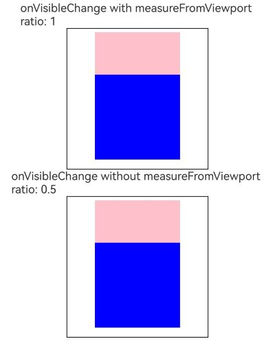
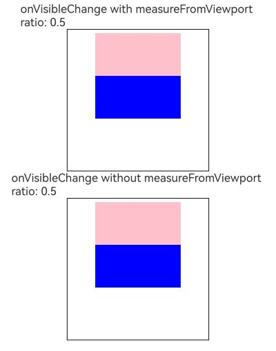

# 组件可见区域变化事件
<!--Kit: ArkUI-->
<!--Subsystem: ArkUI-->
<!--Owner: @yihao-lin-->
<!--Designer: @piggyguy-->
<!--Tester: @songyanhong-->
<!--Adviser: @HelloCrease-->

组件可见区域变化事件是组件在屏幕中的显示区域面积变化时触发的事件，提供了判断组件是否完全或部分显示在屏幕中的能力，适用于广告曝光埋点之类的场景。

> **说明：**
>
>  从API version 9开始支持。后续版本如有新增内容，则采用上角标单独标记该内容的起始版本。

## onVisibleAreaChange

onVisibleAreaChange(ratios: Array&lt;number&gt;, event: VisibleAreaChangeCallback): T

组件可见区域变化时触发该回调。

**原子化服务API：** 从API version 11开始，该接口支持在原子化服务中使用。

**系统能力：** SystemCapability.ArkUI.ArkUI.Full

**参数：** 

| 参数名 | 类型                                                | 必填 | 说明                                                         |
| ------ | --------------------------------------------------- | ---- | ------------------------------------------------------------ |
| ratios | Array&lt;number&gt;                                 | 是   | 阈值数组。其中，每个阈值代表组件可见面积（即组件在屏幕显示区的面积，只计算父组件内的面积，超出父组件部分不会计算）与组件自身面积的比值。当组件可见面积与自身面积的比值接近阈值时，均会触发该回调。每个阈值的取值范围为[0.0, 1.0]，如果开发者设置的阈值超出该范围，则会实际取值0.0或1.0。<br/>**说明：** <br/>当数值接近边界0和1时，将会按照误差不超过0.001的规则进行舍入。例如，0.9997会被近似为1。 |
| event  | [VisibleAreaChangeCallback](./ts-universal-component-visible-area-change-event.md#visibleareachangecallback12) | 是   | 组件可见区域变化事件的回调。 |

**返回值：**

| 类型 | 说明 |
| -------- | -------- |
| T | 返回当前组件。 |

> **说明：**
>- 从API version 20开始，该接口支持在[attributeModifier](ts-universal-attributes-attribute-modifier.md#attributemodifier)中调用。
>
>- 仅提供自身节点相对于所有祖先节点（直到window边界）的相对裁切面积与自身面积的比值及其变化趋势。
> 
>- 不支持兄弟组件对自身节点的遮挡计算，不支持所有祖先的兄弟节点对自身节点的遮挡计算，不支持窗口遮挡计算，不支持组件旋转计算，如[Stack](ts-container-stack.md)、[Z序控制](ts-universal-attributes-z-order.md)、[rotate](ts-universal-attributes-transformation.md#rotate)等。
>
>- 不支持非挂树节点的可见面积变化计算。例如，预加载的节点、通过[overlay](ts-universal-attributes-overlay.md#overlay)能力挂载的自定义节点。
>
>- 不支持[scale](ts-universal-attributes-transformation.md#scale)属性，如果想要支持[scale](ts-universal-attributes-transformation.md#scale)，则需使用[onVisibleAreaChange<sup>21+</sup>](#onvisibleareachange21)，将measureFromViewport设置为true。

## onVisibleAreaChange<sup>21+</sup>

onVisibleAreaChange(ratios: Array&lt;number&gt;, event: VisibleAreaChangeCallback, measureFromViewport: boolean): T

组件可见区域变化时触发该回调。可以通过measureFromViewport设置可见区域计算模式。

**原子化服务API：** 从API version 21开始，该接口支持在原子化服务中使用。

**系统能力：** SystemCapability.ArkUI.ArkUI.Full

**参数：** 

| 参数名 | 类型                                                | 必填 | 说明                                                         |
| ------ | --------------------------------------------------- | ---- | ------------------------------------------------------------ |
| ratios | Array&lt;number&gt;                                 | 是   | 阈值数组。其中，每个阈值代表组件可见面积与组件自身面积的比值。当组件可见面积与自身面积的比值接近阈值时，均会触发该回调。每个阈值的取值范围为[0.0, 1.0]，如果开发者设置的阈值超出该范围，则会实际取值0.0或1.0。<br/>**说明：**<br/>当数值接近边界0和1时，将会按照误差不超过0.001的规则进行舍入。例如，0.9997会被近似为1。 |
| event  | [VisibleAreaChangeCallback](./ts-universal-component-visible-area-change-event.md#visibleareachangecallback12) | 是   | 组件可见区域变化事件的回调。 |
| measureFromViewport  | boolean | 是  | 设置可见区域计算模式。<br/>当measureFromViewport设置为true时，系统在计算该组件的可见区域时，会考虑父组件的[clip](./ts-universal-attributes-sharp-clipping.md#clip12) 属性设置。如果父组件的[clip](./ts-universal-attributes-sharp-clipping.md#clip12)为false，则认为其内的子组件可以超出其区域进行显示，因此超出父组件的区域也将被视为可见区域纳入计算；如果父组件的[clip](./ts-universal-attributes-sharp-clipping.md#clip12)设置为true，则组件超出父组件的区域会被裁剪，无法显示，因此会被视为不可见区域进行计算。而当measureFromViewport设置为false时，则不考虑[clip](./ts-universal-attributes-sharp-clipping.md#clip12)的影响，直接将组件超出父组件的部分视为不可见区域。<br/>measureFromViewport设置为true时，祖先节点设置[scale](ts-universal-attributes-transformation.md#scale)属性，组件可见比例会被正确计算。 |

**返回值：**

| 类型 | 说明 |
| -------- | -------- |
| T | 返回当前组件。 |

> **说明：**
>
>
>- 仅提供自身节点相对于所有祖先节点（直到window边界）的相对裁切面积与自身面积的比值及其变化趋势。
> 
>- 不支持兄弟组件对自身节点的遮挡计算，不支持所有祖先的兄弟节点对自身节点的遮挡计算，不支持窗口遮挡计算，不支持组件旋转计算，如[Stack](ts-container-stack.md)、[Z序控制](ts-universal-attributes-z-order.md)、[rotate](ts-universal-attributes-transformation.md#rotate)等。
>
>- 不支持非挂树节点的可见面积变化计算。例如，预加载的节点、通过[overlay](ts-universal-attributes-overlay.md#overlay)能力挂载的自定义节点。

## onVisibleAreaApproximateChange<sup>17+</sup>

onVisibleAreaApproximateChange(options: VisibleAreaEventOptions, event: VisibleAreaChangeCallback | undefined): void

设置onVisibleAreaApproximateChange事件的回调参数，限制它的执行间隔。

**原子化服务API：** 从API version 17开始，该接口支持在原子化服务中使用。

**系统能力：** SystemCapability.ArkUI.ArkUI.Full

**参数：**

| 参数名 | 类型   | 必填 | 说明                       |
| ------ | ------ | ---- | -------------------------- |
| options  | [VisibleAreaEventOptions](#visibleareaeventoptions12) | 是   | 可见区域变化相关的参数。 |
| event  | [VisibleAreaChangeCallback](#visibleareachangecallback12)   \| undefined | 是   | onVisibleAreaChange事件的回调函数。当组件可见面积与自身面积的比值接近options中设置的阈值时触发该回调。 |

>**说明：**
>
>- 此接口与[onVisibleAreaChange](./ts-universal-component-visible-area-change-event.md#onvisibleareachange)接口存在如下差异：onVisibleAreaChange在每一帧都会进行可见区域比例的计算，如果注册节点太多，系统功耗存在劣化。而此接口降低了可见区域比例计算的频度，计算间隔由[VisibleAreaEventOptions](#visibleareaeventoptions12)的expectedUpdateInterval参数决定。
>
>- 当前接口的可见区域回调阈值默认包含0。例如，开发者设置回调阈值为[0.5]，实际生效的阈值为[0.0, 0.5]。
>
>- 从API version 18开始，支持在自定义组件中调用该接口。
>
>- 不支持[scale](ts-universal-attributes-transformation.md#scale)属性，如果想要支持[scale](ts-universal-attributes-transformation.md#scale)，则需将[VisibleAreaEventOptions](#visibleareaeventoptions12)的measureFromViewport设置为true。

## VisibleAreaEventOptions<sup>12+</sup>

关于区域变化相关的参数。

**系统能力：** SystemCapability.ArkUI.ArkUI.Full

| 名称 | 类型                                                | 只读 | 可选 | 说明                                                         |
| ------ | --------------------------------------------------- | ---- | -------- | ------------------------------------------------------------ |
| ratios | Array&lt;number&gt;                                 | 否 | 否   | 阈值数组。其中，每个阈值代表组件可见面积（即组件在屏幕显示区的面积，只计算父组件内的面积，超出父组件部分不会计算）与组件自身面积的比值。每个阈值的取值范围为[0.0, 1.0]，如果开发者设置的阈值超出该范围，则会实际取值0.0或1.0。<br/>**原子化服务API：** 从API version 12开始，该接口支持在原子化服务中使用。 |
| expectedUpdateInterval | number | 否 | 是 | 定义了开发者期望的计算间隔，单位为ms。<br/>默认值：1000 <br/>**原子化服务API：** 从API version 12开始，该接口支持在原子化服务中使用。|
| measureFromViewport<sup>21+</sup> | boolean | 否 | 是 | 设置可见区域计算模式。<br/>当measureFromViewport设置为true时，系统在计算该组件的可见区域时，会考虑父组件的[clip](./ts-universal-attributes-sharp-clipping.md#clip12) 属性设置。如果父组件的[clip](./ts-universal-attributes-sharp-clipping.md#clip12)为false，则认为其内的子组件可以超出其区域进行显示，因此超出父组件的区域也将被视为可见区域纳入计算；如果父组件的[clip](./ts-universal-attributes-sharp-clipping.md#clip12)设置为true，则组件超出父组件的区域会被裁剪，无法显示，因此会被视为不可见区域进行计算。而当measureFromViewport设置为false时，则不考虑[clip](./ts-universal-attributes-sharp-clipping.md#clip12)的影响，直接将组件超出父组件的部分视为不可见区域。<br/>默认值：false <br/>measureFromViewport设置为true时，祖先节点设置[scale](ts-universal-attributes-transformation.md#scale)属性，组件可见比例会被正确计算。<br/>**原子化服务API：** 从API version 21开始，该接口支持在原子化服务中使用。|

## VisibleAreaChangeCallback<sup>12+</sup>

type VisibleAreaChangeCallback = (isExpanding: boolean, currentRatio: number) => void

组件可见区域变化事件的回调类型。

**原子化服务API：** 从API version 12开始，该接口支持在原子化服务中使用。

**系统能力：** SystemCapability.ArkUI.ArkUI.Full

**参数：**

| 参数名            | 类型               | 必填      | 说明                                       |
| ------------- | ------------------   | ------------- | ---------------------- |
| isExpanding | boolean | 是 | 视组件的可见面积与自身面积的比值与上一次回调相比的情况而定，比值变大为true，比值变小为false。 |
| currentRatio | number | 是 | 触发回调时，组件可见面积与自身面积的比值。 |

## 示例

### 示例1 (使用onVisibleAreaChange来监听区域变化)

该示例对组件设置[onVisibleAreaChange](#onvisibleareachange)事件，当组件完全显示或者完全消失时触发回调。

```ts
// xxx.ets
@Entry
@Component
struct ScrollExample {
  scroller: Scroller = new Scroller()
  private arr: number[] = [0, 1, 2, 3, 4, 5, 6, 7, 8, 9]
  @State testTextStr: string = 'test'
  @State testRowStr: string = 'test'

  build() {
    Column() {
      Column() {
        Text(this.testTextStr)
          .fontSize(20)

        Text(this.testRowStr)
          .fontSize(20)
      }
      .height(100)
      .backgroundColor(Color.Gray)
      .opacity(0.3)

      Scroll(this.scroller) {
        Column() {
          Text("Test Text Visible Change")
            .fontSize(20)
            .height(200)
            .margin({ top: 50, bottom: 20 })
            .backgroundColor(Color.Green)
              // 通过设置ratios为[0.0, 1.0]，实现当组件完全显示或完全消失在屏幕中时触发回调。
            .onVisibleAreaChange([0.0, 1.0], (isExpanding: boolean, currentRatio: number) => {
              console.info('Test Text isExpanding: ' + isExpanding + ', currentRatio:' + currentRatio)
              if (isExpanding && currentRatio >= 1.0) {
                console.info('Test Text is fully visible. currentRatio:' + currentRatio)
                this.testTextStr = 'Test Text is fully visible'
              }

              if (!isExpanding && currentRatio <= 0.0) {
                console.info('Test Text is completely invisible.')
                this.testTextStr = 'Test Text is completely invisible'
              }
            })

          Row() {
            Text('Test Row Visible  Change')
              .fontSize(20)
              .margin({ bottom: 20 })

          }
          .height(200)
          .backgroundColor(Color.Yellow)
          .onVisibleAreaChange([0.0, 1.0], (isExpanding: boolean, currentRatio: number) => {
            console.info('Test Row isExpanding:' + isExpanding + ', currentRatio:' + currentRatio)
            if (isExpanding && currentRatio >= 1.0) {
              console.info('Test Row is fully visible.')
              this.testRowStr = 'Test Row is fully visible'
            }

            if (!isExpanding && currentRatio <= 0.0) {
              console.info('Test Row is completely invisible.')
              this.testRowStr = 'Test Row is completely invisible'
            }
          })

          ForEach(this.arr, (item:number) => {
            Text(item.toString())
              .width('90%')
              .height(150)
              .backgroundColor(0xFFFFFF)
              .borderRadius(15)
              .fontSize(16)
              .textAlign(TextAlign.Center)
              .margin({ top: 10 })
          }, (item:number) => (item.toString()))

        }.width('100%')
      }
      .backgroundColor(0x317aff)
      .scrollable(ScrollDirection.Vertical)
      .scrollBar(BarState.On)
      .scrollBarColor(Color.Gray)
      .scrollBarWidth(10)
      .onWillScroll((xOffset: number, yOffset: number, scrollState: ScrollState) => {
        console.info(xOffset + ' ' + yOffset)
      })
      .onScrollEdge((side: Edge) => {
        console.info('To the edge')
      })
      .onScrollStop(() => {
        console.info('Scroll Stop')
      })

    }.width('100%').height('100%').backgroundColor(0xDCDCDC)
  }
}
```

### 示例2 (使用onVisibleAreaApproximateChange来监听区域变化)

从API version 17开始，该示例对组件设置[onVisibleAreaApproximateChange](#onvisibleareaapproximatechange17)事件，当组件完全显示或者完全消失时触发回调。

```ts
// xxx.ets
@Entry
@Component
struct ScrollExample {
  scroller: Scroller = new Scroller()
  private arr: number[] = [0, 1, 2, 3, 4, 5, 6, 7, 8, 9]
  @State testTextStr: string = 'test'
  @State testRowStr: string = 'test'

  build() {
    Column() {
      Column() {
        Text(this.testTextStr)
          .fontSize(20)

        Text(this.testRowStr)
          .fontSize(20)
      }
      .height(100)
      .backgroundColor(Color.Gray)
      .opacity(0.3)

      Scroll(this.scroller) {
        Column() {
          Text("Test Text Visible Change")
            .fontSize(20)
            .height(200)
            .margin({ top: 50, bottom: 20 })
            .backgroundColor(Color.Green)
              // 通过设置ratios为[0.0, 1.0]，实现当组件完全显示或完全消失在屏幕中时触发回调。
            .onVisibleAreaApproximateChange({ratios: [0.0, 1.0], expectedUpdateInterval: 1000}, (isExpanding: boolean, currentRatio: number) => {
              console.info('Test Text isExpanding: ' + isExpanding + ', currentRatio:' + currentRatio)
              if (isExpanding && currentRatio >= 1.0) {
                console.info('Test Text is fully visible. currentRatio:' + currentRatio)
                this.testTextStr = 'Test Text is fully visible'
              }

              if (!isExpanding && currentRatio <= 0.0) {
                console.info('Test Text is completely invisible.')
                this.testTextStr = 'Test Text is completely invisible'
              }
            })

          Row() {
            Text('Test Row Visible  Change')
              .fontSize(20)
              .margin({ bottom: 20 })

          }
          .height(200)
          .backgroundColor(Color.Yellow)
          .onVisibleAreaChange([0.0, 1.0], (isExpanding: boolean, currentRatio: number) => {
            console.info('Test Row isExpanding:' + isExpanding + ', currentRatio:' + currentRatio)
            if (isExpanding && currentRatio >= 1.0) {
              console.info('Test Row is fully visible.')
              this.testRowStr = 'Test Row is fully visible'
            }

            if (!isExpanding && currentRatio <= 0.0) {
              console.info('Test Row is completely invisible.')
              this.testRowStr = 'Test Row is completely invisible'
            }
          })

          ForEach(this.arr, (item:number) => {
            Text(item.toString())
              .width('90%')
              .height(150)
              .backgroundColor(0xFFFFFF)
              .borderRadius(15)
              .fontSize(16)
              .textAlign(TextAlign.Center)
              .margin({ top: 10 })
          }, (item:number) => (item.toString()))

        }.width('100%')
      }
      .backgroundColor(0x317aff)
      .scrollable(ScrollDirection.Vertical)
      .scrollBar(BarState.On)
      .scrollBarColor(Color.Gray)
      .scrollBarWidth(10)
      .onWillScroll((xOffset: number, yOffset: number, scrollState: ScrollState) => {
        console.info(xOffset + ' ' + yOffset)
      })
      .onScrollEdge((side: Edge) => {
        console.info('To the edge')
      })
      .onScrollStop(() => {
        console.info('Scroll Stop')
      })

    }.width('100%').height('100%').backgroundColor(0xDCDCDC)
  }
}
```


### 示例3 (设置measureFromViewport子组件超出父组件显示)

从API version 21开始，该示例展示onVisibleAreaChange事件设置measureFromViewport参数效果对比，主要差异体现在回调返回值组件可见比例（currentRatio）的不同，设置measureFromViewport为true时，返回的组件可见比例（currentRatio）更符合实际效果。该示例在不同设备上currentRatio会有有微小差异。

```ts
@Entry
@Component
struct OnVisibleAreaChangeSample {
  @State ratio1: number = 0.0;
  @State ratio2: number = 0.0;

  build() {
    Column() {
      Text(`onVisibleChange with measureFromViewport \nratio: ${this.ratio1}`)
      Column() {
        Row() {
          Row() {

          }
          .backgroundColor(Color.Blue)
          .height(120)
          .width(120)
          .offset({ x: 0, y: 60 })
          // measureFromViewport设置为true，父组件未设置clip(true)，超出父组件的区域被视为可见区域。
          // .onVisibleAreaApproximateChange({ratios: [0.0, 1.0], expectedUpdateInterval: 500, measureFromViewport: true}, (isExpanding: boolean, currentRatio: number) => {
          .onVisibleAreaChange([0.0, 1.0], (isExpanding: boolean, currentRatio: number) => {
            this.ratio1 = currentRatio
          }, true)
        }
        .backgroundColor(Color.Pink)
        .height(120)
        .width(120)
      }
      .padding(5)
      .borderWidth(1)
      .height(200)
      .width(200)

      Text(`onVisibleChange without measureFromViewport \nratio: ${this.ratio2}`)
      Column() {
        Row() {
          Row() {

          }
          .backgroundColor(Color.Blue)
          .height(120)
          .width(120)
          .offset({ x: 0, y: 60 })
          // 不设置measureFromViewport，measureFromViewport默认为false，父组件未设置clip(true)，超出父组件的区域被视为不可见区域。
          // .onVisibleAreaApproximateChange({ratios: [0.0, 1.0], expectedUpdateInterval: 500, measureFromViewport: true}, (isExpanding: boolean, currentRatio: number) => {
          .onVisibleAreaChange([0.0, 1.0], (isExpanding: boolean, currentRatio: number) => {
            this.ratio2 = currentRatio
          })
        }
        .backgroundColor(Color.Pink)
        .height(120)
        .width(120)
      }
      .padding(5)
      .borderWidth(1)
      .height(200)
      .width(200)
    }
    .height('100%')
    .width('100%')
  }
}
```


### 示例4 (设置measureFromViewport子组件被父组件裁切超出父组件不显示)

从API version 21开始，该示例展示onVisibleAreaChange事件设置measureFromViewport参数效果对比，主要差异体现在回调返回值组件可见比例（currentRatio）的不同，设置measureFromViewport为true时，返回的组件可见比例（currentRatio）更符合实际效果。该示例在不同设备上currentRatio会有有微小差异。

```ts
@Entry
@Component
struct OnVisibleAreaChangeSample {
  @State ratio1: number = 0.0;
  @State ratio2: number = 0.0;

  build() {
    Column() {
      Text(`onVisibleChange with measureFromViewport \nratio: ${this.ratio1}`)
      Column() {
        Row() {
          Row() {

          }
          .backgroundColor(Color.Blue)
          .height(120)
          .width(120)
          .offset({ x: 0, y: 60 })
          // measureFromViewport设置为true，父组件设置clip(true)，超出父组件的区域被视为不可见区域。
          // .onVisibleAreaApproximateChange({ratios: [0.0, 1.0], expectedUpdateInterval: 500, measureFromViewport: true}, (isExpanding: boolean, currentRatio: number) => {
          .onVisibleAreaChange([0.0, 1.0], (isExpanding: boolean, currentRatio: number) => {
            this.ratio1 = currentRatio
          }, true)
        }
        .clip(true)
        .backgroundColor(Color.Pink)
        .height(120)
        .width(120)
      }
      .padding(5)
      .borderWidth(1)
      .height(200)
      .width(200)

      Text(`onVisibleChange without measureFromViewport \nratio: ${this.ratio2}`)
      Column() {
        Row() {
          Row() {

          }
          .backgroundColor(Color.Blue)
          .height(120)
          .width(120)
          .offset({ x: 0, y: 60 })
          // 不设置measureFromViewport，measureFromViewport默认为false，父组件设置clip(true)，超出父组件的区域被视为不可见区域。
          // .onVisibleAreaApproximateChange({ratios: [0.0, 1.0], expectedUpdateInterval: 500, measureFromViewport: true}, (isExpanding: boolean, currentRatio: number) => {
          .onVisibleAreaChange([0.0, 1.0], (isExpanding: boolean, currentRatio: number) => {
            this.ratio2 = currentRatio
          })
        }
        .clip(true)
        .backgroundColor(Color.Pink)
        .height(120)
        .width(120)
      }
      .padding(5)
      .borderWidth(1)
      .height(200)
      .width(200)
    }
    .height('100%')
    .width('100%')
  }
}
```
