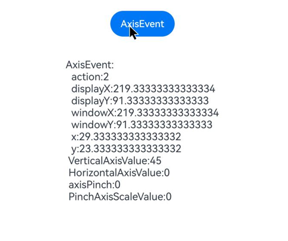

# 轴事件
<!--Kit: ArkUI-->
<!--Subsystem: ArkUI-->
<!--Owner: @yihao-lin-->
<!--Designer: @piggyguy-->
<!--Tester: @songyanhong-->
<!--Adviser: @Brilliantry_Rui-->

轴事件是指当鼠标或触控板等带指针输入设备的指针位于组件区域内时，因操作滚轮或触控板双指沿特定方向（轴）滑动时触发的事件。“轴”指二维坐标系中的方向，分为水平（X轴）和垂直（Y轴）。

>  **说明：**
>
> - 本模块同时支持ArkTS-Dyn、ArkTS-Sta。
>
> - 本模块首批接口从API version 17开始支持。后续版本的新增接口，采用上角标单独标记接口的起始版本。
>
> - 本模块接口仅可在Stage模型下使用。

## onAxisEvent

ArkTS-Dyn: onAxisEvent(event: Callback\<AxisEvent>): T

ArkTS-Sta: onAxisEvent(event: Callback\<AxisEvent> | undefined): this

鼠标滚轮滚动或触控板双指轻触滑动、双指捏合时触发该回调。

**原子化服务API（仅ArkTS-Dyn）：** 从API version 17开始，该接口支持在原子化服务中使用。

**系统能力：** SystemCapability.ArkUI.ArkUI.Full

**ArkTS-Dyn起始版本：** 17

**ArkTS-Sta起始版本：** 23

**参数：**

| 参数名 | 类型                              | 必填 | 说明                 |
| ------ | --------------------------------- | ---- | -------------------- |
| event  | ArkTS-Dyn: Callback\<[AxisEvent](#axisevent)> <br/>ArkTS-Sta: Callback\<[AxisEvent](#axisevent)> \|&nbsp;undefined | 是   | 获得[AxisEvent](#axisevent)对象。 |

**返回值：**

| 类型 | 说明 |
| -------- | -------- |
| ArkTS-Dyn: T<br/>ArkTS-Sta: this | 返回当前组件。 |

## AxisEvent

轴事件的对象说明，继承于[BaseEvent](ts-gesture-customize-judge.md#baseevent8)。

### 属性

**系统能力：** SystemCapability.ArkUI.ArkUI.Full

| 名称            | 类型  | 只读|可选                              | 说明                                                    |
| ------------------- | -----------------------|------|----- | -------------------------------------------------------- |
| action              | [AxisAction](ts-appendix-enums.md#axisaction17)         | 否   | 否   | 轴事件的动作类型。<br/>**原子化服务API（仅ArkTS-Dyn）：** 从API version 17开始，该接口支持在原子化服务中使用。                    <br/>**ArkTS-Dyn起始版本：** 17<br/>**ArkTS-Sta起始版本：** 23 |
| x                   | ArkTS-Dyn: number<br/>ArkTS-Sta: double                 | 否   | 否   | 鼠标光标在被点击元素为基准的[组件坐标系](../../../ui/arkui-glossary.md#组件坐标系)中的X坐标。<br/>单位：vp<br/>**原子化服务API（仅ArkTS-Dyn）：** 从API version 17开始，该接口支持在原子化服务中使用。  <br/>**ArkTS-Dyn起始版本：** 17<br/>**ArkTS-Sta起始版本：** 23 |
| y                   | ArkTS-Dyn: number<br/>ArkTS-Sta: double                 | 否   | 否   | 鼠标光标在被点击元素为基准的[组件坐标系](../../../ui/arkui-glossary.md#组件坐标系)中的Y坐标。<br/>单位：vp<br/>**原子化服务API（仅ArkTS-Dyn）：** 从API version 17开始，该接口支持在原子化服务中使用。  <br/>**ArkTS-Dyn起始版本：** 17<br/>**ArkTS-Sta起始版本：** 23 |
| windowX             | ArkTS-Dyn: number<br/>ArkTS-Sta: double                 | 否   | 否   | 鼠标光标在当前应用窗口坐标系中的X坐标。<br/>单位：vp<br/>**原子化服务API（仅ArkTS-Dyn）：** 从API version 17开始，该接口支持在原子化服务中使用。<br/>**ArkTS-Dyn起始版本：** 17<br/>**ArkTS-Sta起始版本：** 23 |
| windowY             | ArkTS-Dyn: number<br/>ArkTS-Sta: double                 | 否   | 否   | 鼠标光标在当前应用窗口坐标系中的Y坐标。<br/>单位：vp<br/>**原子化服务API（仅ArkTS-Dyn）：** 从API version 17开始，该接口支持在原子化服务中使用。<br/>**ArkTS-Dyn起始版本：** 17<br/>**ArkTS-Sta起始版本：** 23 |
| displayX            | ArkTS-Dyn: number<br/>ArkTS-Sta: double                 | 否   | 否   | 鼠标光标在当前应用屏幕坐标系中的X坐标。<br/>单位：vp<br/>**原子化服务API（仅ArkTS-Dyn）：** 从API version 17开始，该接口支持在原子化服务中使用。<br/>**ArkTS-Dyn起始版本：** 17<br/>**ArkTS-Sta起始版本：** 23 |
| displayY            | ArkTS-Dyn: number<br/>ArkTS-Sta: double                 | 否   | 否   | 鼠标光标在当前应用屏幕坐标系中的Y坐标。<br/>单位：vp<br/>**原子化服务API（仅ArkTS-Dyn）：** 从API version 17开始，该接口支持在原子化服务中使用。<br/>**ArkTS-Dyn起始版本：** 17<br/>**ArkTS-Sta起始版本：** 23 |
| scrollStep          | ArkTS-Dyn: number<br/>ArkTS-Sta: int                 | 否   | 是   | 鼠标轴滚动步长配置。<br/> **说明：** 仅支持鼠标滚轮，取值范围：[0~65535]<br/>**原子化服务API（仅ArkTS-Dyn）：** 从API version 17开始，该接口支持在原子化服务中使用。<br/>**ArkTS-Dyn起始版本：** 17<br/>**ArkTS-Sta起始版本：** 23 |
| propagation         | Callback\<void>        | 否   | 否   | 激活[事件冒泡](../../../ui/arkts-interaction-basic-principles.md#事件冒泡)。<br/>**原子化服务API（仅ArkTS-Dyn）：** 从API version 17开始，该接口支持在原子化服务中使用。<br/>**ArkTS模式：** 该接口仅适用于ArkTS-Dyn。<br/>**ArkTS-Dyn起始版本：** 17 |
| globalDisplayX<sup>20+</sup> | ArkTS-Dyn: number<br/>ArkTS-Sta: double | 否 | 是 | 鼠标光标在[全局坐标系](../../../windowmanager/window-terminology.md#global-coordinate-system全局坐标系)中的X坐标。<br/>单位：vp<br/>取值范围：[0, +∞)<br/>**原子化服务API（仅ArkTS-Dyn）：** 从API version 20开始，该接口支持在原子化服务中使用。<br/>**模型约束：** 此接口仅可在Stage模型下使用。  <br/>**ArkTS-Dyn起始版本：** 20<br/>**ArkTS-Sta起始版本：** 24 |
| globalDisplayY<sup>20+</sup> | ArkTS-Dyn: number<br/>ArkTS-Sta: double | 否 | 是 | 鼠标光标在[全局坐标系](../../../windowmanager/window-terminology.md#global-coordinate-system全局坐标系)中的Y坐标。<br/>单位：vp<br/>取值范围：[0, +∞)<br/>**原子化服务API（仅ArkTS-Dyn）：** 从API version 20开始，该接口支持在原子化服务中使用。<br/>**模型约束：** 此接口仅可在Stage模型下使用。  <br/>**ArkTS-Dyn起始版本：** 20<br/>**ArkTS-Sta起始版本：** 24 |
| eventHandleId<sup>24+</sup> | ArkTS-Dyn：number<br/>ArkTS-Sta：int | 否 | 是 | 用于事件处理的唯一标识。<br/> 取值范围：[0, +∞)<br/> **说明：** 在使用[postInputEventWithStrategy](../js-apis-arkui-builderNode.md#postinputeventwithstrategy24)接口分发事件时会使用该字段，事件每分发一次字段会增加100000。<br/> 多次使用相同的eventHandleId进行事件分发将导致事件响应异常。仅在构造事件的时候需要对此字段赋值，其余情况开发者无需处理。<br/>**原子化服务API（仅ArkTS-Dyn）：** 从API version 24开始，该接口支持在原子化服务中使用。<br/>**模型约束：** 此接口仅可在Stage模型下使用。<br/>**ArkTS-Dyn起始版本：** 24<br/>**ArkTS-Sta起始版本：** 24 |

### propagation<sup>23+</sup>

propagation(): void

激活事件冒泡。

**系统能力：** SystemCapability.ArkUI.ArkUI.Full

**ArkTS模式：** 该接口仅适用于ArkTS-Sta。

**ArkTS-Sta起始版本：** 23

### getHorizontalAxisValue

ArkTS-Dyn: getHorizontalAxisValue(): number

ArkTS-Sta: getHorizontalAxisValue(): double

获取此次轴事件的水平轴值。

**原子化服务API（仅ArkTS-Dyn）：** 从API version 17开始，该接口支持在原子化服务中使用。

**系统能力：** SystemCapability.ArkUI.ArkUI.Full

**ArkTS-Dyn起始版本：** 17

**ArkTS-Sta起始版本：** 23

**返回值：**

| 类型              |说明       |
| ------- | --------------------------------- |
| ArkTS-Dyn: number<br/>ArkTS-Sta: double | 水平轴值。<br>单位：vp |

### getVerticalAxisValue

ArkTS-Dyn: getVerticalAxisValue(): number

ArkTS-Sta: getVerticalAxisValue(): double

获取此次轴事件的垂直轴值。

**原子化服务API（仅ArkTS-Dyn）：** 从API version 17开始，该接口支持在原子化服务中使用。

**系统能力：** SystemCapability.ArkUI.ArkUI.Full

**ArkTS-Dyn起始版本：** 17

**ArkTS-Sta起始版本：** 23

**返回值：**

| 类型              |说明       |
| ------- | --------------------------------- |
| ArkTS-Dyn: number<br/>ArkTS-Sta: double | 垂直轴值。<br>单位：vp |

### getCurrentLocalPosition

ArkTS-Dyn: getCurrentLocalPosition?(): Coordinate2D
 
ArkTS-Sta: default getCurrentLocalPosition(): Coordinate2D

获取鼠标光标位置相对于当前组件实时位置的左上角坐标。

**原子化服务API（仅ArkTS-Dyn）：** 从API版本26.0.0开始，该接口支持在原子化服务中使用。

**系统能力：** SystemCapability.ArkUI.ArkUI.Full

**模型约束：** 此接口仅可在Stage模型下使用。

**ArkTS-Dyn起始版本：** 26.0.0

**ArkTS-Sta起始版本：** 26.0.0

**返回值：** 

| 类型    | 说明                                                  |
| ------- | ----------------------------------------------------- |
| [Coordinate2D](ts-types.md#coordinate2d) | 获取鼠标光标位置相对于当前组件实时位置的左上角坐标。|

### getPinchAxisScaleValue<sup>21+</sup>

ArkTS-Dyn: getPinchAxisScaleValue(): number

ArkTS-Sta: getPinchAxisScaleValue(): double

返回此次轴事件双指缩放的比例。

**原子化服务API（仅ArkTS-Dyn）：** 从API version 21开始，该接口支持在原子化服务中使用。

**系统能力：** SystemCapability.ArkUI.ArkUI.Full

**ArkTS-Dyn起始版本：** 21

**ArkTS-Sta起始版本：** 23

**返回值：**

| 类型              |说明       |
| ------- | --------------------------------- |
| ArkTS-Dyn: number<br/>ArkTS-Sta: double | 双指缩放比例。<br/> **说明：** 缩放比例指的是触控板双指缩放事件触发过程中双指当前的距离与双指最初按下时的距离的比值。<br/>默认值：0<br/>取值范围：[0, +∞)<br/> |

### hasAxis<sup>22+</sup>

hasAxis(axisType: AxisType): boolean

检测此轴事件是否包含指定的轴类型。

**原子化服务API（仅ArkTS-Dyn）：** 从API version 22开始，该接口支持在原子化服务中使用。

**系统能力：** SystemCapability.ArkUI.ArkUI.Full

**ArkTS-Dyn起始版本：** 22

**ArkTS-Sta起始版本：** 23

**参数：**

| 参数名 | 类型                              | 必填 | 说明                 |
| ------ | --------------------------------- | ---- | -------------------- |
| axisType  | [AxisType](ts-appendix-enums.md#axistype22) | 是   | 轴事件的轴类型。 |

**返回值：**

| 类型              |说明       |
| ------- | --------------------------------- |
| boolean | 此轴事件是否包含指定的轴类型。<br>true：包含指定的轴类型；false：不包含指定的轴类型。 |

## 示例

### 示例1（获取轴事件相关参数）

该示例中，对按钮设置轴事件，通过滚动鼠标滚轮可获取轴事件的相关参数。从API version 21开始，该示例通过[axisPinch](./ts-gesture-customize-judge.md#属性)和[getPinchAxisScaleValue](#getpinchaxisscalevalue21)获取双指缩放比例；从API version 22开始，该示例通过[hasAxis](#hasaxis22)判断轴事件是否包含指定的轴类型。

```ts
// xxx.ets
@Entry
@Component
struct AxisEventExample {
  @State text: string = ''

  build() {
    Column() {
      Row({ space: 20 }) {
        Button('AxisEvent').width(100).height(40)
          .onAxisEvent((event?: AxisEvent) => {
            if (event) {
              this.text =
                'AxisEvent:' + '\n  action:' + event.action + '\n  displayX:' + event.displayX + '\n  displayY:' +
                event.displayY + '\n  windowX:' + event.windowX + '\n  windowY:' + event.windowY + '\n  x:' + event.x +
                  '\n  y:' + event.y + '\n VerticalAxisValue:' + event.getVerticalAxisValue() +
                  '\n HorizontalAxisValue:' + event.getHorizontalAxisValue() + '\n axisPinch:' + event.axisPinch +
                  '\n PinchAxisScaleValue:' + event.getPinchAxisScaleValue() +
                  '\n HasAxis:' + event.hasAxis(AxisType.VERTICAL_AXIS);
            }
          })
      }.margin(20)

      Text(this.text).margin(15)
    }.width('100%')
  }
}
```

鼠标滚轮滚动时：



### 示例2（获取组件实时位置）

该示例通过[getCurrentLocalPosition](#getcurrentlocalposition)方法获取滚轮位置相对于当前组件实时位置左上角的坐标。

从API版本26.0.0开始，新增支持getCurrentLocalPosition接口。

ArkTS-Dyn示例：
```ts
// xxx.ets
@Entry
@Component
struct GetCurrentLocalPositionExample {
  @State positionText: string = '';
  @State textOffsetY: number = 0;

  build() {
    Column() {
      Button('获取滚轮位置相对于当前组件实时位置左上角的坐标').translate({ y: this.textOffsetY })
        .onAxisEvent((event?: AxisEvent) => {
          if (event) {
            this.textOffsetY = -200;
            setTimeout(() => {
              let localPos: Coordinate2D | undefined = event?.getCurrentLocalPosition?.();
              this.positionText = `相对于当前组件实时位置左上角的坐标:\n  x: ${localPos?.x}\n  y: ${localPos?.y}`;
            }, 2000);
          }
        })

      Text(this.positionText)
    }.width('100%')
  }
}
```

ArkTS-Sta示例：
```ts
import { Entry, Text, Button, State, Column, Component, AxisEvent, Coordinate2D, TranslateOptions } from '@kit.ArkUI';

@Entry
@Component
struct GetCurrentLocalPositionExample {
  @State positionText: string = '';
  @State textOffsetY: number = 0;

  build() {
    Column() {
      Button('获取滚轮位置相对于当前组件实时位置左上角的坐标').translate({ y: this.textOffsetY } as TranslateOptions)
        .onAxisEvent((event?: AxisEvent) => {
          if (event) {
            this.textOffsetY = -200;
            setTimeout(() => {
              let localPos: Coordinate2D | undefined = event?.getCurrentLocalPosition();
              this.positionText = `相对于当前组件实时位置左上角的坐标:\n  x: ${localPos?.x}\n  y: ${localPos?.y}`;
            }, 2000);
          }
        })

      Text(this.positionText)
    }.width('100%')
  }
}
```


