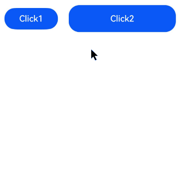

# 点击事件
<!--Kit: ArkUI-->
<!--Subsystem: ArkUI-->
<!--Owner: @yihao-lin-->
<!--Designer: @piggyguy-->
<!--Tester: @songyanhong-->
<!--Adviser: @Brilliantry_Rui-->

点击事件用于监听组件被点击时触发的交互行为，开发者可通过该事件获取点击位置、触发来源等点击事件信息，并可在支持的接口中设置点击手势移动阈值，适用于处理组件点击响应、区分触发来源和控制点击识别范围的场景。

>  **说明：**
>
> - 从API version 7开始支持。后续版本的新增接口，采用上角标单独标记接口的起始版本。
>
> - 点击事件遵循[触摸事件](../arkui-ts/ts-universal-events-touch.md)分发流程，触摸事件支持屏蔽、透传等自定义行为。
>
> - 事件分发可参考[事件交互流程](../../../ui/arkts-interaction-basic-principles.md#事件交互流程)，手势事件处理流程可参考[多层级手势事件](../../../ui/arkts-gesture-events-multi-level-gesture.md)。
>
> - 当该点击事件由键盘或者手柄触发时，不会触发[onGestureJudgeBegin](./ts-gesture-customize-judge.md#ongesturejudgebegin)，[onGestureRecognizerJudgeBegin](./ts-gesture-blocking-enhancement.md#ongesturerecognizerjudgebegin)和[willClick](../arkts-apis-uicontext-uiobserver.md#onwillclick12)的回调。

## onClick<sup>12+</sup>

onClick(event: Callback\<ClickEvent>, distanceThreshold: number): T

点击动作触发该回调。

当触发点击事件的设备类型为键盘或手柄时，事件的[SourceTool](ts-gesture-settings.md#sourcetool枚举说明9)值为Unknown；事件的[SourceType](ts-gesture-settings.md#sourcetype枚举说明8)值在键盘触发时为KEY，在手柄触发时为JOYSTICK。

新增distanceThreshold参数，设置点击手势移动阈值。手指移动超出阈值时，点击手势识别失败。

对于无手指移动距离限制的点击场景，建议使用原有接口。若需限制点击时手指移动范围，建议使用该接口。

**卡片能力：** 从API version 12开始，该接口支持在ArkTS卡片中使用。

>  **说明：**
>
>  - 从API version 12开始，在使用卡片能力时，存在以下限制：
>    1. 如果手指按下的持续时间超过800ms，不能触发点击事件。
>    2. 如果手指按下后移动位移超过20px，不能触发点击事件。
>
>  - 该接口不支持在[attributeModifier](ts-universal-attributes-attribute-modifier.md#attributemodifier)中调用。

**原子化服务API：** 从API version 12开始，该接口支持在原子化服务中使用。

**模型约束：** 此接口仅可在Stage模型下使用。

**系统能力：** SystemCapability.ArkUI.ArkUI.Full

**参数：**

| 参数名 | 类型                              | 必填 | 说明                 |
| ------ | --------------------------------- | ---- | -------------------- |
| event  | Callback\<[ClickEvent](#clickevent)> | 是   | 点击事件的回调函数，用于在点击动作触发时接收ClickEvent事件对象，可通过该对象获取点击位置、触发源等点击事件信息。 |
| distanceThreshold  | number | 是   | 点击事件移动阈值。当设置的值小于等于0时，会被转化为默认值。<br>默认值：2^31-1<br>单位：vp<br>**说明：**<br>当手指的移动距离超出开发者预设的移动阈值时，点击识别失败。如果初始化为默认阈值时，手指移动超过组件热区范围，点击识别失败。 |

>  **说明：**
>
>  如果执行滑动操作，但滑动距离未超过点击事件移动阈值，并且抬手时手指在组件热区范围内，也会触发点击事件。

**返回值：**

| 类型 | 说明 |
| -------- | -------- |
| T | 返回当前组件，用于支持链式调用。 |

## onClick

onClick(event: (event: ClickEvent) => void): T

点击动作触发该回调。对于无手指移动距离限制的点击场景，建议使用该接口；若需限制点击时手指移动范围，建议使用[onClick](#onclick12)接口。

触发点击事件的设备类型为键盘或手柄时，事件的SourceTool值为Unknown；事件的[SourceType](ts-gesture-settings.md#sourcetype枚举说明8)值在键盘触发时为KEY，在手柄触发时为JOYSTICK。

**卡片能力：** 从API version 9开始，该接口支持在ArkTS卡片中使用。

>  **说明：**
>
>  从API version 9开始，使用卡片能力时存在以下限制：
>  1. 如果手指按下的持续时间超过800ms，不能触发点击事件。
>  2. 如果手指按下后移动位移超过20px，不能触发点击事件。

**原子化服务API：** 从API version 11开始，该接口支持在原子化服务中使用。

**系统能力：** SystemCapability.ArkUI.ArkUI.Full

**参数：**

| 参数名 | 类型                              | 必填 | 说明                 |
| ------ | --------------------------------- | ---- | -------------------- |
| event  | (event: [ClickEvent](#clickevent)) => void | 是   | 点击事件的回调函数，用于在点击动作触发时接收ClickEvent事件对象，可通过该对象获取点击位置、触发源等点击事件信息。 |

**返回值：**

| 类型 | 说明 |
| -------- | -------- |
| T | 返回当前组件，用于支持链式调用。 |

## ClickEvent

继承于[BaseEvent](ts-gesture-customize-judge.md#baseevent8)。

### 属性

**系统能力：** SystemCapability.ArkUI.ArkUI.Full

<!--Table: 20%; 20%; 8%; 8%; 44%-->
| 名称            | 类型                         | 只读 | 可选        | 说明                                                     |
| ------------------- | ------------------------- | ------ | -------- | -------------------------------------------------------- |
| x                   | number                               | 否 | 否 | 点击位置在以被点击元素为基准的[组件坐标系](../../../ui/arkui-glossary.md#组件坐标系)中的X坐标。onClick的[distanceThreshold](ts-universal-events-click.md#onclick12)设置后，点击位置为抬手点。触发事件的是键盘或手柄时，点击位置为被点击元素的中心点。<br>单位：vp<br>**卡片能力：** 从API version 9开始，该接口支持在ArkTS卡片中使用。<br>**原子化服务API：** 从API version 11开始，该接口支持在原子化服务中使用。     |
| y                   | number                               | 否 | 否 | 点击位置在以被点击元素为基准的[组件坐标系](../../../ui/arkui-glossary.md#组件坐标系)中的Y坐标。onClick的distanceThreshold设置后，点击位置为抬手点。触发事件的是键盘或手柄时，点击位置为被点击元素的中心点。<br>单位：vp<br>**卡片能力：** 从API version 9开始，该接口支持在ArkTS卡片中使用。<br>**原子化服务API：** 从API version 11开始，该接口支持在原子化服务中使用。          |
| windowX<sup>10+</sup> | number                             | 否 | 否 | 点击位置在当前应用窗口坐标系中的X坐标。onClick的distanceThreshold设置后，点击位置为抬手点。<br>单位：vp<br>**原子化服务API：** 从API version 11开始，该接口支持在原子化服务中使用。<br>**模型约束：** 此接口仅可在Stage模型下使用。 |
| windowY<sup>10+</sup> | number                             | 否 | 否 | 点击位置在当前应用窗口坐标系中的Y坐标。onClick的distanceThreshold设置后，点击位置为抬手点。<br>单位：vp<br>**原子化服务API：** 从API version 11开始，该接口支持在原子化服务中使用。<br>**模型约束：** 此接口仅可在Stage模型下使用。 |
| displayX<sup>10+</sup> | number                            | 否 | 否 | 点击位置在当前应用屏幕坐标系中的X坐标。onClick的distanceThreshold设置后，点击位置为抬手点。<br>单位：vp<br>**原子化服务API：** 从API version 11开始，该接口支持在原子化服务中使用。<br>**模型约束：** 此接口仅可在Stage模型下使用。 |
| displayY<sup>10+</sup> | number                            | 否 | 否 | 点击位置在当前应用屏幕坐标系中的Y坐标。onClick的distanceThreshold设置后，点击位置为抬手点。<br>单位：vp<br>**原子化服务API：** 从API version 11开始，该接口支持在原子化服务中使用。<br>**模型约束：** 此接口仅可在Stage模型下使用。 |
| screenX<sup>(deprecated)</sup> | number                    | 否 | 否 | 点击位置在当前应用窗口坐标系中的X坐标。<br>单位：vp<br>**说明：** 从API version 7开始支持，从API version 10开始废弃，建议使用windowX替代。 |
| screenY<sup>(deprecated)</sup> | number                    | 否 | 否 | 点击位置在当前应用窗口坐标系中的Y坐标。<br>单位：vp<br>**说明：** 从API version 7开始支持，从API version 10开始废弃，建议使用windowY替代。 |
| preventDefault<sup>12+</sup>      | () => void | 否 | 否 | 阻止默认行为。<br> **说明：**&nbsp;该接口仅支持部分组件使用，当前支持组件：RichEditor、Hyperlink，不支持的组件使用时会抛出异常。暂不支持异步调用和提供Modifier接口。<br>**原子化服务API：** 从API version 12开始，该接口支持在原子化服务中使用。<br>**模型约束：** 此接口仅可在Stage模型下使用。|
| hand<sup>15+</sup> | [InteractionHand](./ts-appendix-enums.md#interactionhand15) | 否 | 是 | 表示事件是由左手点击还是右手点击触发。<br>**原子化服务API：** 从API version 15开始，该接口支持在原子化服务中使用。<br>**模型约束：** 此接口仅可在Stage模型下使用。 |
| globalDisplayX<sup>20+</sup> | number | 否 | 是 | 点击位置在[全局坐标系](../../../windowmanager/window-terminology.md#global-coordinate-system全局坐标系)中的X坐标。onClick的distanceThreshold设置后，点击位置为抬手点。<br>单位：vp<br>取值范围：(-∞, +∞)<br>**原子化服务API：** 从API version 20开始，该接口支持在原子化服务中使用。<br>**模型约束：** 此接口仅可在Stage模型下使用。 |
| globalDisplayY<sup>20+</sup> | number | 否 | 是 | 点击位置在[全局坐标系](../../../windowmanager/window-terminology.md#global-coordinate-system全局坐标系)中的Y坐标。onClick的distanceThreshold设置后，点击位置为抬手点。<br>单位：vp<br>取值范围：(-∞, +∞)<br>**原子化服务API：** 从API version 20开始，该接口支持在原子化服务中使用。<br>**模型约束：** 此接口仅可在Stage模型下使用。 |

**错误码：**

以下错误码的详细介绍请参见[交互事件错误码](../errorcode-event.md)。

| 错误码ID   | 错误信息 |
| --------- | ------- |
| 100017       | Component does not support prevent function. |

### getCurrentLocalPosition

getCurrentLocalPosition?(): Coordinate2D

获取点击位置相对于当前组件实时位置的左上角坐标，适用于组件发生位移、动画或布局变化后，需要获取点击点相对于组件当前位置坐标的场景。

**起始版本：** 26.0.0

**模型约束：** 此接口仅可在Stage模型下使用。

**原子化服务API：** 从API版本26.0.0开始，该接口支持在原子化服务中使用。

**系统能力：** SystemCapability.ArkUI.ArkUI.Full

**返回值：**

| 类型    | 说明                                                  |
| ------- | ----------------------------------------------------- |
| [Coordinate2D](ts-types.md#coordinate2d) | 点击位置相对于当前组件实时位置的左上角坐标。 |

## EventTarget<sup>8+</sup>

[BaseEvent](ts-gesture-customize-judge.md#baseevent8)中参数target的类型。

触发事件的元素对象的显示区域。

**系统能力：** SystemCapability.ArkUI.ArkUI.Full

| 名称   | 类型                    | 只读 | 可选 | 说明         |
| ---- | ------------------------- |-----|------| ---------- |
| area | [Area](ts-types.md#area8) | 否 | 否 | 目标元素的区域信息。<br>**卡片能力：** 从API version 9开始，该接口支持在ArkTS卡片中使用。<br>**原子化服务API：** 从API version 11开始，该接口支持在原子化服务中使用。 |
| id<sup>15+</sup> | string | 否 | 是 | 开发者设置的节点[id](ts-universal-attributes-component-id.md#id)。默认值：undefined <br>**卡片能力：** 从API version 15开始，该接口支持在ArkTS卡片中使用。<br>**原子化服务API：** 从API version 15开始，该接口支持在原子化服务中使用。<br>**模型约束：** 此接口仅可在Stage模型下使用。|

## 示例

### 示例1（获取点击事件相关参数）

该示例通过按钮设置点击事件[ClickEvent](#clickevent)，点击按钮可获取点击事件的相关参数。

```ts
// xxx.ets
@Entry
@Component
struct ClickExample {
  @State text: string = '';

  build() {
    Column() {
      Row({ space: 20 }) {
        Button('Click1').width(100).height(40).id('click1')
          .onClick((event?: ClickEvent) => {
            if (event) {
              this.text =
                `Click Point:\n  windowX:${event.windowX}\n  windowY:${event.windowY}\n  x:${event.x}\n  y:${event.y}\n target:\n  component globalPos:(${event.target.area.globalPosition.x},${event.target.area.globalPosition.y})\n  width:${event.target.area.width}\n  height:${event.target.area.height}\n  id:${event.target.id}\ntargetDisplayId:${event.targetDisplayId}\ntimestamp:${event.timestamp}`;
            }
          }, 20)
        Button('Click2').width(200).height(50).id('click2')
          .onClick((event?: ClickEvent) => {
            if (event) {
              this.text =
                `Click Point:\n  windowX:${event.windowX}\n  windowY:${event.windowY}\n  x:${event.x}\n  y:${event.y}\n target:\n  component globalPos:(${event.target.area.globalPosition.x},${event.target.area.globalPosition.y})\n  width:${event.target.area.width}\n  height:${event.target.area.height}\n  id:${event.target.id}\ntargetDisplayId:${event.targetDisplayId}\ntimestamp:${event.timestamp}`;
            }
          }, 20)
      }.margin(20)

      Text(this.text).margin(15)
    }.width('100%')
  }
}
```



### 示例2（获取组件实时位置）

该示例通过[getCurrentLocalPosition](#getcurrentlocalposition)方法获取当前组件基于其实时位置的左上角坐标。

从API版本26.0.0开始，新增支持getCurrentLocalPosition接口。

```ts
// xxx.ets
@Entry
@Component
struct GetCurrentLocalPositionExample {
  @State positionText: string = '';
  @State textOffsetY: number = 0;

  build() {
    Column() {
      Button('点击获取点击位置相对于当前组件实时位置左上角的坐标').translate({ y: this.textOffsetY })
        .onClick((event?: ClickEvent) => {
          if (event) {
            this.textOffsetY = -200;
            // 组件位置变化后，延迟获取点击位置相对于组件实时位置左上角的坐标。
            setTimeout(() => {
              let localPos: Coordinate2D | undefined = event.getCurrentLocalPosition?.();
              this.positionText = `相对于当前组件实时位置左上角的坐标:\n  x: ${localPos?.x}\n  y: ${localPos?.y}`;
            }, 2000);
          }
        })

      Text(this.positionText)
    }.width('100%')
  }
}
```


