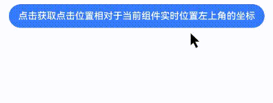

# 点击事件
<!--Kit: ArkUI-->
<!--Subsystem: ArkUI-->
<!--Owner: @yihao-lin-->
<!--Designer: @piggyguy-->
<!--Tester: @songyanhong-->
<!--Adviser: @Brilliantry_Rui-->

组件被点击时触发的事件。

>  **说明：**
>
> - 本模块同时支持ArkTS-Dyn、ArkTS-Sta。
>
> - 从API version 7开始支持。后续版本如有新增内容，则采用上角标单独标记该内容的起始版本。
>
> - 点击事件遵循[触摸事件](../arkui-ts/ts-universal-events-touch.md)分发流程，触摸事件支持屏蔽、透传等自定义行为。
>
> - 事件分发可参考[事件交互流程](../../../ui/arkts-interaction-basic-principles.md#事件交互流程)，手势事件处理流程可参考[多层级手势事件](../../../ui/arkts-gesture-events-multi-level-gesture.md)。
>
> - 当该点击事件由键盘或者手柄触发时，不会触发[onGestureJudgeBegin](./ts-gesture-customize-judge.md#ongesturejudgebegin)，[onGestureRecognizerJudgeBegin](./ts-gesture-blocking-enhancement.md#ongesturerecognizerjudgebegin)和[willClick](../arkts-apis-uicontext-uiobserver.md#onwillclick12)的回调。

## onClick<sup>12+</sup>

ArkTS-Dyn: onClick(event: Callback\<ClickEvent>, distanceThreshold: number): T

ArkTS-Sta: onClick(event: Callback\<ClickEvent> | undefined, distanceThreshold: double | undefined): this

点击动作触发该回调。

当触发点击事件的设备类型为键盘或手柄时，事件的[SourceTool](ts-gesture-settings.md#sourcetool枚举说明9)值为Unknown，事件的[SourceType](ts-gesture-settings.md#sourcetype枚举说明8)值为KEY，JOYSTICK。

新增distanceThreshold参数，设置点击手势移动阈值。手指移动超出阈值时，点击手势识别失败。

对于无手指移动距离限制的点击场景，建议使用原有接口。若需限制点击时手指移动范围，建议使用该接口。

**卡片能力（仅ArkTS-Dyn）：** 从API version 12开始，该接口支持在ArkTS卡片中使用。

>  **说明：**
>
>  - 从API version 12开始，在使用卡片能力时，存在以下限制：
>    1. 如果手指按下的持续时间超过800ms，不能触发点击事件。
>    2. 如果手指按下后移动位移超过20px，不能触发点击事件。
>
>  - 该接口不支持在[attributeModifier](ts-universal-attributes-attribute-modifier.md#attributemodifier)中调用。

**原子化服务API（仅ArkTS-Dyn）：** 从API version 12开始，该接口支持在原子化服务中使用。

**系统能力：** SystemCapability.ArkUI.ArkUI.Full

**ArkTS-Dyn起始版本：** 12

**ArkTS-Sta起始版本：** 23

**参数：**

| 参数名 | 类型                              | 必填 | 说明                 |
| ------ | --------------------------------- | ---- | -------------------- |
| event  | ArkTS-Dyn: Callback\<[ClickEvent](#clickevent)> <br/>ArkTS-Sta: Callback\<[ClickEvent](#clickevent)> \|&nbsp;undefined | 是   | 点击事件的回调函数。<br/>传入undefined时无效果。 |
| distanceThreshold  | ArkTS-Dyn: number <br/>ArkTS-Sta: double&nbsp;\|&nbsp;undefined | 是   | 点击事件移动阈值。当设置的值小于等于0时，会被转化为默认值。<br/>传入undefined时，会被转化为默认值。<br/>默认值：2^31-1<br/>单位：vp<br/>**说明：**<br/>当手指的移动距离超出开发者预设的移动阈值时，点击识别失败。如果初始化为默认阈值时，手指移动超过组件热区范围，点击识别失败。 |

>  **说明：**
>
>  如果执行滑动操作，但滑动距离未超过点击事件移动阈值，并且抬手时手指在组件热区范围内，也会触发点击事件。

**返回值：**

| 类型 | 说明 |
| -------- | -------- |
| ArkTS-Dyn: T<br/>ArkTS-Sta: this | 返回当前组件。 |

## onClick

ArkTS-Dyn: onClick(event: (event: ClickEvent) => void): T

ArkTS-Sta: onClick(event: ((event: ClickEvent) => void) | undefined): this

点击动作触发该回调。

触发点击事件的设备类型为键盘或手柄时，事件的SourceTool值为Unknown，事件的[SourceType](ts-gesture-settings.md#sourcetype枚举说明8)值为KEY，JOYSTICK。

**卡片能力（仅ArkTS-Dyn）：** 从API version 9开始，该接口支持在ArkTS卡片中使用。

>  **说明：**
>
>  从API version 9开始，使用卡片能力时存在以下限制：
>  1. 如果手指按下的持续时间超过800ms，不能触发点击事件。
>  2. 如果手指按下后移动位移超过20px，不能触发点击事件。

**原子化服务API（仅ArkTS-Dyn）：** 从API version 11开始，该接口支持在原子化服务中使用。

**系统能力：** SystemCapability.ArkUI.ArkUI.Full

**ArkTS-Dyn起始版本：** 7

**ArkTS-Sta起始版本：** 23

**参数：**

| 参数名 | 类型                              | 必填 | 说明                 |
| ------ | --------------------------------- | ---- | -------------------- |
| event  | ArkTS-Dyn: (event: [ClickEvent](#clickevent)) => void <br/>ArkTS-Sta: ((event: [ClickEvent](#clickevent)) => void) \|&nbsp;undefined | 是   | 点击事件的回调函数。<br/>传入undefined时无效果。 |

**返回值：**

| 类型 | 说明 |
| -------- | -------- |
| ArkTS-Dyn: T<br/>ArkTS-Sta: this | 返回当前组件。 |

## ClickEvent

继承于[BaseEvent](#baseevent8)。

### 属性

**系统能力：** SystemCapability.ArkUI.ArkUI.Full

<!--Table: 20%; 20%; 8%; 8%; 44%-->
| 名称            | 类型                         | 只读 | 可选        | 说明                                                     |
| ------------------- | ------------------------- | ------ | -------- | -------------------------------------------------------- |
| x                   | ArkTS-Dyn: number<br/>ArkTS-Sta: double                               | 否 | 否 | 点击位置在被点击元素为基准的[组件坐标系](../../../ui/arkui-glossary.md#组件坐标系)中的X坐标。onClick的[distanceThreshold](ts-universal-events-click.md#onclick12)设置后，点击位置为抬手点。触发事件的是键盘或手柄时，点击位置为被点击元素的中心点。<br/>单位：vp<br/>**卡片能力（仅ArkTS-Dyn）：** 从API version 9开始，该接口支持在ArkTS卡片中使用。<br/>**原子化服务API（仅ArkTS-Dyn）：** 从API version 11开始，该接口支持在原子化服务中使用。<br/>**ArkTS-Dyn起始版本：** 7<br/>**ArkTS-Sta起始版本：** 23     |
| y                   | ArkTS-Dyn: number<br/>ArkTS-Sta: double                               | 否 | 否 | 点击位置在被点击元素为基准的[组件坐标系](../../../ui/arkui-glossary.md#组件坐标系)中的Y坐标。onClick的distanceThreshold设置后，点击位置为抬手点。触发事件的是键盘或手柄时，点击位置为被点击元素的中心点。<br/>单位：vp<br/>**卡片能力（仅ArkTS-Dyn）：** 从API version 9开始，该接口支持在ArkTS卡片中使用。<br/>**原子化服务API（仅ArkTS-Dyn）：** 从API version 11开始，该接口支持在原子化服务中使用。<br/>**ArkTS-Dyn起始版本：** 7<br/>**ArkTS-Sta起始版本：** 23          |
| windowX<sup>10+</sup> | ArkTS-Dyn: number<br/>ArkTS-Sta: double                            | 否 | 否 | 点击位置在当前应用窗口坐标系中的X坐标。onClick的distanceThreshold设置后，点击位置为抬手点。<br/>单位：vp<br/>**原子化服务API（仅ArkTS-Dyn）：** 从API version 11开始，该接口支持在原子化服务中使用。<br/>**模型约束：** 此接口仅可在Stage模型下使用。<br/>**ArkTS-Dyn起始版本：** 10<br/>**ArkTS-Sta起始版本：** 23 |
| windowY<sup>10+</sup> | ArkTS-Dyn: number<br/>ArkTS-Sta: double                            | 否 | 否 | 点击位置在当前应用窗口坐标系中的Y坐标。onClick的distanceThreshold设置后，点击位置为抬手点。<br/>单位：vp<br/>**原子化服务API（仅ArkTS-Dyn）：** 从API version 11开始，该接口支持在原子化服务中使用。<br/>**模型约束：** 此接口仅可在Stage模型下使用。<br/>**ArkTS-Dyn起始版本：** 10<br/>**ArkTS-Sta起始版本：** 23 |
| displayX<sup>10+</sup> | ArkTS-Dyn: number<br/>ArkTS-Sta: double                           | 否 | 否 | 点击位置在当前应用屏幕坐标系中的X坐标。<br/>单位：vp<br/>**原子化服务API（仅ArkTS-Dyn）：** 从API version 11开始，该接口支持在原子化服务中使用。<br/>**模型约束：** 此接口仅可在Stage模型下使用。<br/>**ArkTS-Dyn起始版本：** 10<br/>**ArkTS-Sta起始版本：** 23 |
| displayY<sup>10+</sup> | ArkTS-Dyn: number<br/>ArkTS-Sta: double                           | 否 | 否 | 点击位置在当前应用屏幕坐标系中的Y坐标。<br/>单位：vp<br/>**原子化服务API（仅ArkTS-Dyn）：** 从API version 11开始，该接口支持在原子化服务中使用。<br/>**模型约束：** 此接口仅可在Stage模型下使用。<br/>**ArkTS-Dyn起始版本：** 10<br/>**ArkTS-Sta起始版本：** 23 |
| screenX<sup>(deprecated)</sup> | number                    | 否 | 否 | 点击位置在当前应用窗口坐标系中的X坐标。<br>单位：vp<br/>**说明：** 从API version 7开始支持，从API version 10开始废弃，建议使用windowX替代。<br/>**ArkTS模式：** 该字段仅适用于ArkTS-Dyn。<br/>**ArkTS-Dyn起始版本：** 7 |
| screenY<sup>(deprecated)</sup> | number                    | 否 | 否 | 点击位置在当前应用窗口坐标系中的Y坐标。<br>单位：vp<br/>**说明：** 从API version 7开始支持，从API version 10开始废弃，建议使用windowY替代。<br/>**ArkTS模式：** 该字段仅适用于ArkTS-Dyn。<br/>**ArkTS-Dyn起始版本：** 7 |
| preventDefault<sup>12+</sup>      | () => void | 否 | 否 | 阻止默认行为。<br/> **说明：**&nbsp;该接口仅支持部分组件使用，当前支持组件：RichEditor、Hyperlink，不支持的组件使用时会抛出异常。暂不支持异步调用和提供Modifier接口。<br/>**原子化服务API（仅ArkTS-Dyn）：** 从API version 12开始，该接口支持在原子化服务中使用。<br/>**模型约束：** 此接口仅可在Stage模型下使用。<br/>**ArkTS模式：** 该接口仅适用于ArkTS-Dyn。<br/>**ArkTS-Dyn起始版本：** 12|
| hand<sup>15+</sup> | [InteractionHand](./ts-appendix-enums.md#interactionhand15) | 否 | 是 | 表示事件是由左手点击还是右手点击触发。<br />**原子化服务API（仅ArkTS-Dyn）：** 从API version 15开始，该接口支持在原子化服务中使用。<br/>**模型约束：** 此接口仅可在Stage模型下使用。<br/>**ArkTS-Dyn起始版本：** 15<br/>**ArkTS-Sta起始版本：** 23 |
| globalDisplayX<sup>20+</sup> | ArkTS-Dyn: number<br/>ArkTS-Sta: double | 否 | 是 | 点击位置在[全局坐标系](../../../windowmanager/window-terminology.md#global-coordinate-system全局坐标系)中的X坐标。<br/>单位：vp<br/>取值范围：(-∞, +∞)<br/>**原子化服务API（仅ArkTS-Dyn）：** 从API version 20开始，该接口支持在原子化服务中使用。<br/>**模型约束：** 此接口仅可在Stage模型下使用。   <br/>**ArkTS-Dyn起始版本：** 20<br/>**ArkTS-Sta起始版本：** 24 |
| globalDisplayY<sup>20+</sup> | ArkTS-Dyn: number<br/>ArkTS-Sta: double | 否 | 是 | 点击位置在[全局坐标系](../../../windowmanager/window-terminology.md#global-coordinate-system全局坐标系)中的Y坐标。<br/>单位：vp<br/>取值范围：(-∞, +∞)<br/>**原子化服务API（仅ArkTS-Dyn）：** 从API version 20开始，该接口支持在原子化服务中使用。 <br/>**模型约束：** 此接口仅可在Stage模型下使用。  <br/>**ArkTS-Dyn起始版本：** 20<br/>**ArkTS-Sta起始版本：** 24 |

### preventDefault<sup>23+</sup>

preventDefault(): void

阻止默认事件。

> **说明：**
>
> 该接口仅支持部分组件使用，当前支持组件：[RichEditor](./ts-basic-components-richeditor.md)、[Hyperlink](./ts-container-hyperlink.md)，不支持的组件在使用时会抛出异常。暂不支持异步调用和提供Modifier接口。

**系统能力：** SystemCapability.ArkUI.ArkUI.Full

**ArkTS模式：** 该接口仅适用于ArkTS-Sta。

**ArkTS-Sta起始版本：** 23

**错误码：**

以下错误码的详细介绍请参见[交互事件错误码](../errorcode-event.md)。

| 错误码ID   | 错误信息 |
| --------- | ------- |
| 100017       | Component does not support prevent function. |

### getCurrentLocalPosition

ArkTS-Dyn: getCurrentLocalPosition?(): Coordinate2D
 
ArkTS-Sta: default getCurrentLocalPosition(): Coordinate2D

获取点击位置相对于当前组件实时位置的左上角坐标。

**原子化服务API（仅ArkTS-Dyn）：** 从API版本26.0.0开始，该接口支持在原子化服务中使用。

**系统能力：** SystemCapability.ArkUI.ArkUI.Full

**模型约束：** 此接口仅可在Stage模型下使用。

**ArkTS-Dyn起始版本：** 26.0.0

**ArkTS-Sta起始版本：** 26.0.0

**返回值：** 

| 类型    | 说明                                                  |
| ------- | ----------------------------------------------------- |
| [Coordinate2D](ts-types.md#coordinate2d) | 获取点击位置相对于当前组件实时位置的左上角坐标。|

## BaseEvent<sup>8+</sup>

基础事件类型。

### 属性

**系统能力：** SystemCapability.ArkUI.ArkUI.Full

<!--Table: 20%; 20%; 8%; 8%; 44%-->
| 名称    | 类型                                       | 只读 | 可选 | 说明         |
| ---------| ---------------------------------------- | ---- | ---- | -----------|
| target   | [EventTarget](#eventtarget8) | 否 | 否 | 触发手势事件的元素对象。<br/>**卡片能力（仅ArkTS-Dyn）：** 从API version 9开始，该接口支持在ArkTS卡片中使用。<br/>**原子化服务API（仅ArkTS-Dyn）：** 从API version 11开始，该接口支持在原子化服务中使用。<br/>**ArkTS-Dyn起始版本：** 8<br/>**ArkTS-Sta起始版本：** 23|
| timestamp| ArkTS-Dyn: number<br/>ArkTS-Sta: long | 否 | 否 | 事件时间戳，触发事件时距离系统启动的时间间隔。<br>单位：ns<br/>**卡片能力（仅ArkTS-Dyn）：** 从API version 9开始，该接口支持在ArkTS卡片中使用。<br/>**原子化服务API（仅ArkTS-Dyn）：** 从API version 11开始，该接口支持在原子化服务中使用。<br/>**ArkTS-Dyn起始版本：** 8<br/>**ArkTS-Sta起始版本：** 23 |
| source   | [SourceType](ts-gesture-settings.md#sourcetype枚举说明8) | 否 | 否 | 事件输入设备的类型。<br/>**卡片能力（仅ArkTS-Dyn）：** 从API version 9开始，该接口支持在ArkTS卡片中使用。<br/>**原子化服务API（仅ArkTS-Dyn）：** 从API version 11开始，该接口支持在原子化服务中使用。<br/>**ArkTS-Dyn起始版本：** 8<br/>**ArkTS-Sta起始版本：** 23  |
| pressure<sup>9+</sup> | ArkTS-Dyn: number<br/>ArkTS-Sta: double | 否 | 否 | 按压的压力大小。<br/>默认值：0<br/>取值范围：[0,1]，典型值0.913168，压感大小与数值正相关。在部分设备中，由于设备的硬件参数配置不同，可能会返回大于1的值。<br/>**卡片能力（仅ArkTS-Dyn）：** 从API version 9开始，该接口支持在ArkTS卡片中使用。<br/>**原子化服务API（仅ArkTS-Dyn）：** 从API version 11开始，该接口支持在原子化服务中使用。<br/>**ArkTS-Dyn起始版本：** 9<br/>**ArkTS-Sta起始版本：** 23  |
| tiltX<sup>9+</sup> | ArkTS-Dyn: number<br/>ArkTS-Sta: double | 否 | 否 | 手写笔在设备平面上的投影与设备平面X轴的夹角。<br/>单位：deg <br/>默认值：0<br/>**卡片能力（仅ArkTS-Dyn）：** 从API version 9开始，该接口支持在ArkTS卡片中使用。<br/>**原子化服务API（仅ArkTS-Dyn）：** 从API version 11开始，该接口支持在原子化服务中使用。<br/>**ArkTS-Dyn起始版本：** 9<br/>**ArkTS-Sta起始版本：** 23 |
| tiltY<sup>9+</sup> | ArkTS-Dyn: number<br/>ArkTS-Sta: double | 否 | 否 |手写笔在设备平面上的投影与设备平面Y轴的夹角。<br/>单位：deg <br/>默认值：0<br/>**卡片能力（仅ArkTS-Dyn）：** 从API version 9开始，该接口支持在ArkTS卡片中使用。<br/>**原子化服务API（仅ArkTS-Dyn）：** 从API version 11开始，该接口支持在原子化服务中使用。<br/>**ArkTS-Dyn起始版本：** 9<br/>**ArkTS-Sta起始版本：** 23 |
| rollAngle<sup>17+</sup> | ArkTS-Dyn: number<br/>ArkTS-Sta: double | 否 | 是 | 手写笔绕笔身长轴方向旋转的角度，类似于螺丝刀使用时旋转的角度。取值范围：[-179, 179]，其中[0, 179]对应正角度值为[0, 179]，[-179, -1]的部分实际值为[65357, 65535]。0为硬件参考基准，不代表笔身无旋转。正值表示从基准方向顺时针旋转（指从笔身指向笔尖方向，使用右手定则确定的旋转方向为顺时针方向），负值表示从基准方向逆时针旋转。当持续旋转超过±179时，数值跳变到对侧边界继续变化。<br/>单位：deg <br/>**卡片能力（仅ArkTS-Dyn）：** 从API version 17开始，该接口支持在ArkTS卡片中使用。<br/>**原子化服务API（仅ArkTS-Dyn）：** 从API version 17开始，该接口支持在原子化服务中使用。<br/>**模型约束：** 此接口仅可在Stage模型下使用。<br/>**ArkTS-Dyn起始版本：** 17<br/>**ArkTS-Sta起始版本：** 23 |
| sourceTool<sup>9+</sup> | [SourceTool](ts-gesture-settings.md#sourcetool枚举说明9) | 否 | 否 | 事件输入源的类型。<br/>**卡片能力（仅ArkTS-Dyn）：** 从API version 9开始，该接口支持在ArkTS卡片中使用。<br/>**原子化服务API（仅ArkTS-Dyn）：** 从API version 11开始，该接口支持在原子化服务中使用。<br/>**ArkTS-Dyn起始版本：** 9<br/>**ArkTS-Sta起始版本：** 23  |
| axisHorizontal<sup>12+</sup> | ArkTS-Dyn: number<br/>ArkTS-Sta: double | 否 | 是 | 水平轴值。<br/>默认值：0<br/>**说明：**<br/>当前仅在鼠标滚轮或触控板双指滑动触发的Pan手势，或使用Ctrl+鼠标滚轮触发的Pinch手势中可以获取。<br/>对于Shift+鼠标滚轮触发的横向滚动场景，axisHorizontal为0，滚动值体现在axisVertical中。<br/>**卡片能力（仅ArkTS-Dyn）：** 从API version 12开始，该接口支持在ArkTS卡片中使用。<br/>**原子化服务API（仅ArkTS-Dyn）：** 从API version 12开始，该接口支持在原子化服务中使用。<br/>**模型约束：** 此接口仅可在Stage模型下使用。<br/>**ArkTS-Dyn起始版本：** 12<br/>**ArkTS-Sta起始版本：** 23|
| axisVertical<sup>12+</sup> | ArkTS-Dyn: number<br/>ArkTS-Sta: double | 否 | 是 | 垂直轴值。<br/>默认值：0<br/>**说明：**<br/>当前仅在鼠标滚轮或触控板双指滑动触发的Pan手势，或使用Ctrl+鼠标滚轮触发的Pinch手势中可以获取。<br/>对于Shift+鼠标滚轮触发的横向滚动场景，滚动值体现在axisVertical中。<br/>**卡片能力（仅ArkTS-Dyn）：** 从API version 12开始，该接口支持在ArkTS卡片中使用。<br/>**原子化服务API（仅ArkTS-Dyn）：** 从API version 12开始，该接口支持在原子化服务中使用。<br/>**模型约束：** 此接口仅可在Stage模型下使用。<br/>**ArkTS-Dyn起始版本：** 12<br/>**ArkTS-Sta起始版本：** 23 |
| axisPinch<sup>21+</sup> | ArkTS-Dyn: number<br/>ArkTS-Sta: double | 否 | 是 |  双指缩放比例。<br/>默认值：0<br/>**说明：**<br/>仅在触控板上通过双指缩放操作触发的Pinch手势，或在轴事件中，可以获取该值；在其他场景下，获取到的将是默认值。<br/>缩放比例是指在双指缩放事件触发过程中，双指当前距离与最初按下时距离的比值。<br/>取值范围：[0, +∞)<br/>**卡片能力（仅ArkTS-Dyn）：** 从API version 21开始，该接口支持在ArkTS卡片中使用。<br/>**原子化服务API（仅ArkTS-Dyn）：** 从API version 21开始，该接口支持在原子化服务中使用。<br/>**模型约束：** 此接口仅可在Stage模型下使用。<br/>**ArkTS-Dyn起始版本：** 21<br/>**ArkTS-Sta起始版本：** 23 |
| deviceId<sup>12+</sup> | ArkTS-Dyn: number<br/>ArkTS-Sta: int | 否 | 是 | 触发当前事件的输入设备ID。<br/>默认值：0<br />取值范围：[0, +∞)<br/>**原子化服务API（仅ArkTS-Dyn）：** 从API version 12开始，该接口支持在原子化服务中使用。<br/>**模型约束：** 此接口仅可在Stage模型下使用。<br/>**ArkTS-Dyn起始版本：** 12<br/>**ArkTS-Sta起始版本：** 23|
| targetDisplayId<sup>15+</sup> | ArkTS-Dyn: number<br/>ArkTS-Sta: int | 否 | 是 | 事件发生的屏幕ID。  <br/>默认值：0<br />取值范围：[0, +∞)<br />**原子化服务API（仅ArkTS-Dyn）：** 从API version 15开始，该接口支持在原子化服务中使用。<br/>**模型约束：** 此接口仅可在Stage模型下使用。<br/>**ArkTS-Dyn起始版本：** 15<br/>**ArkTS-Sta起始版本：** 23 |
| getModifierKeyState<sup>23+</sup> | `getModifierKeyState?(keys: Array<string>): boolean` | 否 | 是 | 获取功能键按压状态。支持功能键'Ctrl'\|'Alt'\|'Shift'。<br/>**ArkTS模式：** 该接口仅适用于ArkTS-Sta。<br/>**ArkTS-Sta起始版本：** 23<br/>**说明：**<br/>此接口不支持在手写笔场景下使用。|

### getModifierKeyState<sup>12+</sup>

getModifierKeyState?(keys: Array\<string>): boolean

获取修饰键按压状态，可用于在手势事件处理中判断Ctrl、Alt、Shift修饰键是否被按下，以处理组合键交互逻辑。报错信息请参考以下错误码。支持修饰键'Ctrl'\|'Alt'\|'Shift'。

>  **说明：**
>
> 此接口不支持在手写笔场景下使用。

**模型约束：** 此接口仅可在Stage模型下使用。

**原子化服务API：** 从API version 12开始，该接口支持在原子化服务中使用。

**系统能力：** SystemCapability.ArkUI.ArkUI.Full

**参数：**

| 参数名 | 类型                              | 必填 | 说明                 |
| ------ | --------------------------------- | ---- | -------------------- |
| keys  | Array&lt;string&gt; | 是   | 修饰键列表，数组元素支持 'Ctrl'、'Alt'、'Shift'，用于查询指定修饰键是否均处于按压状态。 |

**返回值：**

| 类型 | 说明 |
| -------- | -------- |
| boolean | 返回修饰键按压状态。当修饰键均处于按压状态时返回true，否则返回false。 |

**错误码：**

以下错误码详细介绍请参考[通用错误码](../../errorcode-universal.md)。

| 错误码ID | 错误信息 |
| ------- | -------- |
| 401 | Parameter error. Possible causes: 1. Incorrect parameter types. 2. Parameter verification failed. |

## EventTarget<sup>8+</sup>

[BaseEvent](#baseevent8)中参数target的类型。

触发事件的元素对象的显示区域。

**系统能力：** SystemCapability.ArkUI.ArkUI.Full

| 名称   | 类型                    | 只读 | 可选 | 说明         |
| ---- | ------------------------- |-----|------| ---------- |
| area | [Area](ts-types.md#area8) | 否 | 否 | 目标元素的区域信息。<br/>**卡片能力（仅ArkTS-Dyn）：** 从API version 9开始，该接口支持在ArkTS卡片中使用。<br/>**原子化服务API（仅ArkTS-Dyn）：** 从API version 11开始，该接口支持在原子化服务中使用。<br/>**ArkTS-Dyn起始版本：** 8<br/>**ArkTS-Sta起始版本：** 23 |
| id<sup>15+</sup> | string | 否 | 是 | 开发者设置的节点[id](ts-universal-attributes-component-id.md#id)。默认值：undefined <br/>**卡片能力（仅ArkTS-Dyn）：** 从API version 15开始，该接口支持在ArkTS卡片中使用。<br/>**原子化服务API（仅ArkTS-Dyn）：** 从API version 15开始，该接口支持在原子化服务中使用。<br/>**模型约束：** 此接口仅可在Stage模型下使用。<br/>**ArkTS-Dyn起始版本：** 15<br/>**ArkTS-Sta起始版本：** 23 |

## 示例

### 示例1（获取点击事件相关参数）

该示例通过按钮设置点击事件，点击按钮可获取点击事件的相关参数。

```ts
// xxx.ets
@Entry
@Component
struct ClickExample {
  @State text: string = '';

  build() {
    Column() {
      Row({ space: 20 }) {
        Button('Click1').width(100).height(40).id('click1')
          .onClick((event?: ClickEvent) => {
            if (event) {
              this.text =
                `Click Point:\n  windowX:${event.windowX}\n  windowY:${event.windowY}\n  x:${event.x}\n  y:${event.y}\n target:\n  component globalPos:(${event.target.area.globalPosition.x},${event.target.area.globalPosition.y})\n  width:${event.target.area.width}\n  height:${event.target.area.height}\n  id:${event.target.id}\ntargetDisplayId:${event.targetDisplayId}\ntimestamp:${event.timestamp}`
            }
          }, 20)
        Button('Click2').width(200).height(50).id('click2')
          .onClick((event?: ClickEvent) => {
            if (event) {
              this.text =
                `Click Point:\n  windowX:${event.windowX}\n  windowY:${event.windowY}\n  x:${event.x}\n  y:${event.y}\n target:\n  component globalPos:(${event.target.area.globalPosition.x},${event.target.area.globalPosition.y})\n  width:${event.target.area.width}\n  height:${event.target.area.height}\n  id:${event.target.id}\ntargetDisplayId:${event.targetDisplayId}\ntimestamp:${event.timestamp}`
            }
          }, 20)
      }.margin(20)

      Text(this.text).margin(15)
    }.width('100%')
  }
}
```


### 示例2（获取组件实时位置）

该示例通过[getCurrentLocalPosition](#getcurrentlocalposition)方法获取点击位置相对于当前组件实时位置左上角的坐标。

从API版本26.0.0开始，新增支持getCurrentLocalPosition接口。

ArkTS-Dyn示例：
```ts
// xxx.ets
@Entry
@Component
struct GetCurrentLocalPositionExample {
  @State positionText: string = '';
  @State textOffsetY: number = 0;

  build() {
    Column() {
      Button('点击获取点击位置相对于当前组件实时位置左上角的坐标').translate({ y: this.textOffsetY })
        .onClick((event?: ClickEvent) => {
          if (event) {
            this.textOffsetY = -200;
            setTimeout(() => {
              let localPos: Coordinate2D | undefined = event?.getCurrentLocalPosition?.();
              this.positionText = `相对于当前组件实时位置左上角的坐标:\n  x: ${localPos?.x}\n  y: ${localPos?.y}`;
            }, 2000);
          }
        })

      Text(this.positionText)
    }.width('100%')
  }
}
```

ArkTS-Sta示例：
```ts
import { Entry, Text, Button, State, Column, Component, ClickEvent, Coordinate2D, TranslateOptions } from '@kit.ArkUI';

@Entry
@Component
struct GetCurrentLocalPositionExample {
  @State positionText: string = '';
  @State textOffsetY: number = 0;

  build() {
    Column() {
      Button('点击获取点击位置相对于当前组件实时位置左上角的坐标').translate({ y: this.textOffsetY } as TranslateOptions)
        .onClick((event?: ClickEvent) => {
          if (event) {
            this.textOffsetY = -200;
            setTimeout(() => {
              let localPos: Coordinate2D | undefined = event?.getCurrentLocalPosition();
              this.positionText = `相对于当前组件实时位置左上角的坐标:\n  x: ${localPos?.x}\n  y: ${localPos?.y}`;
            }, 2000);
          }
        })

      Text(this.positionText)
    }.width('100%')
  }
}
```

