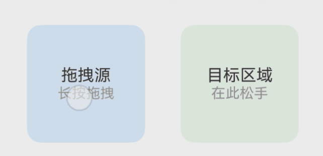

# 拖拽事件（系统接口）
<!--Kit: ArkUI-->
<!--Subsystem: ArkUI-->
<!--Owner: @yihao-lin-->
<!--Designer: @piggyguy-->
<!--Tester: @songyanhong-->
<!--Adviser: @Brilliantry_Rui-->

拖拽事件是指在用户界面中，当用户拖动某个对象（如文件、控件或元素）时触发的一系列事件。这些事件允许开发者自定义拖拽行为，实现诸如拖放、调整位置等功能。

>  **说明：**
>
> - 本模块同时支持ArkTS-Dyn、ArkTS-Sta。
>
> - 本模块首批接口从API version 8开始支持。后续版本的新增接口，采用上角标单独标记接口的起始版本。
>
> - 应用本身预置的资源文件（即应用在安装前的HAP包中已经存在的资源文件）仅支持本地应用内拖拽。
>
> - 本文仅介绍当前模块的系统接口，其他公开接口参见[拖拽事件](ts-universal-events-drag-drop.md)。

## DragEvent<sup>7+</sup>

拖拽事件信息。

### 属性

**系统能力：** SystemCapability.ArkUI.ArkUI.Full

| 名称 | 类型 | 只读  | 可选  | 说明 |
| --------- | ----------------------------------------- | --------- | --------- | ---------------------------------- |
| dragAnimationType | [DragAnimationType](#draganimationtype) | 否 | 是 | 设置拖拽动画类型。该属性仅支持在[onDragStart](ts-universal-events-drag-drop.md#ondragstart)阶段设置，可在[onDragStart](ts-universal-events-drag-drop.md#ondragstart)、[onDragEnter](ts-universal-events-drag-drop.md#ondragenter)、[onDragMove](ts-universal-events-drag-drop.md#ondragmove)、[onDragLeave](ts-universal-events-drag-drop.md#ondragleave)、[onDrop](ts-universal-events-drag-drop.md#ondrop)、[onDragEnd](ts-universal-events-drag-drop.md#ondragend10)回调中获取。<br> 默认值为DEFAULT。 <br>**模型约束：** 此接口仅可在Stage模型下使用。 <br>**系统接口：** 此接口为系统接口。<br/>**ArkTS-Dyn起始版本：** 26.0.0<br/>**ArkTS-Sta起始版本：** 26.0.0|

### enableInternalDropAnimation<sup>20+</sup>

enableInternalDropAnimation(configuration: string): void

使用系统的内置动效，且该动效只有系统应用可使用。仅支持在onDrop阶段使用。

**系统接口：** 此接口为系统接口。

**模型约束：** 此接口仅可在Stage模型下使用。

**系统能力：** SystemCapability.ArkUI.ArkUI.Full

**ArkTS-Dyn起始版本：** 20

**ArkTS-Sta起始版本：** 24

**参数：**
| 参数名    | 类型                                      | 必填 | 说明                               |
| --------- | ----------------------------------------- | ---- | ---------------------------------- |
| configuration | string | 是   | 动效配置参数，字符串内容为json格式。 |

**错误码：**

以下错误码的详细介绍请参见[通用错误码](../../errorcode-universal.md)和[拖拽事件错误码](../errorcode-drag-event.md)。

| 错误码ID   | 错误信息 |
| --------- | ------- |
| 202       | Permission verification failed, application which is not a system application uses system API. |
| 801       | Capability not supported.|
| 190003    | Operation not allowed for current phase. |

### executeFollowHandMorphDropAnimation

ArkTS-Dyn: executeFollowHandMorphDropAnimation(onAnimationFinished: Callback\<void\>, animationOption?: string): void

ArkTS-Sta: executeFollowHandMorphDropAnimation(onAnimationFinished: VoidCallback, animationOption?: string): void

执行跟手变形落位动效，动效执行完成后触发回调，该回调由系统在拖拽框架动效结束后触发。使用callback异步回调。

> **说明：**
>
> 1. 该接口仅在[dragAnimationType](#属性)设置为DragAnimationType.FOLLOW_HAND_MORPH时生效。
> 2. 不要在回调中实现与动效无关的逻辑，避免影响执行效率。

**模型约束：** 此接口仅可在Stage模型下使用。

**系统接口：** 此接口为系统接口。

**系统能力：** SystemCapability.ArkUI.ArkUI.Full

**ArkTS-Dyn起始版本：** 26.0.0

**ArkTS-Sta起始版本：** 26.0.0

**参数：**

| 参数名 | 类型 | 必填 | 说明 |
| --------- | ----------------------------------------- | ---- | ---------------------------------- |
| onAnimationFinished | ArkTS-Dyn: [Callback](../../../reference/apis-basic-services-kit/js-apis-base.md#callback)\<void\><br/>ArkTS-Sta: [VoidCallback](ts-types.md#voidcallback12) | 是 | 拖拽框架动效结束后触发的回调。 |
| animationOption | string | 否 | 落位动效参数。<br> 参数为JSON字符串格式，包含以下字段：<br> **CubicCurveEnable**: boolean，表示是否启用三次曲线动画。设置为true时启用三次曲线动画，设置为false时不启用。<br> **SpringEnable**: boolean，表示是否启用弹簧动画。设置为true时启用弹簧动画效果，设置为false时不启用。<br> **dropAnimationCurve**: number[]，表示落位动画曲线参数，其含义由SpringEnable和CubicCurveEnable决定（SpringEnable优先级更高）。当SpringEnable为true时，数组长度为3，格式为[response, dampingRatio, blendDuration]，对应[curves.springMotion](../../../reference/apis-arkui/js-apis-curve.md#curvesspringmotion9)的弹簧曲线参数；当SpringEnable为false且CubicCurveEnable为true时，数组长度为4，格式为[x1, y1, x2, y2]，对应[curves.cubicBezierCurve](../../../reference/apis-arkui/js-apis-curve.md#curvescubicbeziercurve9)的三次贝塞尔曲线控制点参数。<br> **说明：** SpringEnable优先级高于CubicCurveEnable，当两者同时为true时，以弹簧动画为准。当SpringEnable和CubicCurveEnable均未正确设置时，使用默认弹簧动效。<br> **dropPosition**: number[]，落位位置坐标。数组长度为2，格式为[x, y]，单位为px，表示拖拽元素落位时的目标位置坐标，取值范围为(-∞, +∞)。<br> **dropSize**: number[]，落位尺寸。数组长度为2，格式为[width, height]，单位为px，表示拖拽元素落位时的目标尺寸，取值范围为(0, +∞)。 |

## DragAnimationType

拖拽动画类型。

**模型约束：** 此接口仅可在Stage模型下使用。

**系统接口：** 此接口为系统接口。

**系统能力：** SystemCapability.ArkUI.ArkUI.Full

**ArkTS-Dyn起始版本：** 26.0.0

**ArkTS-Sta起始版本：** 26.0.0

| 名称 | 值 | 说明 |
| --------- | ------- | ---------------------------------- |
| DEFAULT | 0 | 使用默认拖拽动画。 |
| FOLLOW_HAND_MORPH | 1 | 使用跟手变形拖拽动画。 |

## DragController<sup>11+</sup>

提供发起主动拖拽的能力，当应用接收到触摸或长按等事件时可以主动发起拖拽的动作，并在其中携带拖拽信息。本文仅介绍DragController的系统接口，其他公开接口参见[DragController](../arkts-apis-uicontext-dragcontroller.md)。

### interruptFollowHandMorphDropAnimation

interruptFollowHandMorphDropAnimation(): boolean

中断待执行的跟手变形落位动效，并立即触发其收尾流程。


**模型约束：** 此接口仅可在Stage模型下使用。

**系统接口：** 此接口为系统接口。

**系统能力：** SystemCapability.ArkUI.ArkUI.Full

**ArkTS-Dyn起始版本：** 26.0.0

**ArkTS-Sta起始版本：** 26.0.0

**返回值：**

| 类型 | 说明 |
| -------- | -------- |
| boolean | 返回中断结果。<br>返回true表示中断成功，返回false表示当前不存在待中断的跟手变形落位动效。 |

## 示例

### 示例1（设置跟手变形拖拽动画）

该示例通过设置[dragAnimationType](#属性)为FOLLOW_HAND_MORPH实现跟手变形拖拽动画效果，并在拖拽结束时通过[executeFollowHandMorphDropAnimation](#executefollowhandmorphdropanimation)执行自定义落位动效。

从API版本26.0.0开始，新增[dragAnimationType](#属性)属性、[executeFollowHandMorphDropAnimation](#executefollowhandmorphdropanimation)方法、[interruptFollowHandMorphDropAnimation](#interruptfollowhandmorphdropanimation)方法。

ArkTS-Dyn示例：

```ts
// xxx.ets
// 动画参数类
class AnimationOption {
  CubicCurveEnable: boolean = false;
  SpringEnable: boolean = false;
  dropAnimationCurve: number[] = [];
  dropPosition: number[] = [];
  dropSize: number[] = [];
}

@Entry
@Component
struct FollowHandMorphDemo {
  @State dragInfo: string = '未拖拽';
  @State animationInfo: string = '';
  @State interruptResult: string = '';

  build() {
    Column({ space: 20 }) {
      Text('跟手变形拖拽动画示例')
        .fontSize(20)
        .fontWeight(FontWeight.Bold)

      Text('操作说明：长按左侧方块拖拽到右侧区域')
        .fontSize(14)
        .fontColor('#666666')

      Row({ space: 30 }) {
        // 拖拽源
        Column() {
          Text('拖拽源')
            .fontSize(14)
          Text('长按拖拽')
            .fontSize(12)
            .fontColor('#999999')
        }
        .width(100)
        .height(100)
        .backgroundColor('#DDEEFF')
        .borderRadius(12)
        .justifyContent(FlexAlign.Center)
        .draggable(true)
        .onDragStart((event: DragEvent) => {
          // 设置为跟手变形动画模式
          event.dragAnimationType = DragAnimationType.FOLLOW_HAND_MORPH;
          this.dragInfo = 'onDragStart: dragAnimationType=1';
        })

        // 目标区域
        Column() {
          Text('目标区域')
            .fontSize(14)
          Text('在此松手')
            .fontSize(12)
            .fontColor('#999999')
        }
        .width(100)
        .height(100)
        .backgroundColor('#EAF8EA')
        .borderRadius(12)
        .justifyContent(FlexAlign.Center)
        .onDrop((event: DragEvent) => {
          this.dragInfo = 'onDrop触发';

          // 构建动画参数
          let animationOption = new AnimationOption();
          animationOption.CubicCurveEnable = false;
          animationOption.SpringEnable = true;
          animationOption.dropAnimationCurve = [0.416, 0.99, 0];
          animationOption.dropPosition = [830, 600];
          animationOption.dropSize = [100, 100];

          // 执行跟手变形落位动效
          event.executeFollowHandMorphDropAnimation(() => {
            this.animationInfo = '跟手变形动效完成';
          }, JSON.stringify(animationOption));
        })
      }

      // 状态显示
      Column({ space: 8 }) {
        Text(`拖拽状态: ${this.dragInfo}`).fontSize(12)
        Text(`动效状态: ${this.animationInfo}`).fontSize(12)
        Text(`中断结果: ${this.interruptResult}`).fontSize(12)
      }
      .width('100%')
      .padding(12)
      .backgroundColor('#F7F7F7')
      .borderRadius(8)

      // 中断动画按钮
      Button('中断待执行的跟手变形动效')
        .onClick(() => {
          let result = this.getUIContext().getDragController().interruptFollowHandMorphDropAnimation();
          this.interruptResult = result ? '中断成功' : '无待中断的动效';
        })
    }
    .width('100%')
    .height('100%')
    .padding(20)
    .backgroundColor('#FFFFFF')
  }
}
```

ArkTS-Sta示例：

```ts
// xxx.ets
import { Column, Component, Entry, Row, Text, Button, State, DragEvent, DragItemInfo, ColumnOptions, RowOptions, FontWeight, FlexAlign, DragAnimationType } from '@kit.ArkUI';

// 动画参数类
class AnimationOption {
  CubicCurveEnable: boolean = false;
  SpringEnable: boolean = false;
  dropAnimationCurve: number[] = [];
  dropPosition: number[] = [];
  dropSize: number[] = [];
}

@Entry
@Component
struct FollowHandMorphDemo {
  @State dragInfo: string = '未拖拽';
  @State animationInfo: string = '';
  @State interruptResult: string = '';

  build() {
    Column({ space: 20 } as ColumnOptions) {
      Text('跟手变形拖拽动画示例')
        .fontSize(20)
        .fontWeight(FontWeight.Bold)

      Text('操作说明：长按左侧方块拖拽到右侧区域')
        .fontSize(14)
        .fontColor('#666666')

      Row({ space: 30 } as RowOptions) {
        // 拖拽源
        Column() {
          Text('拖拽源')
            .fontSize(14)
          Text('长按拖拽')
            .fontSize(12)
            .fontColor('#999999')
        }
        .width(100)
        .height(100)
        .backgroundColor('#DDEEFF')
        .borderRadius(12)
        .justifyContent(FlexAlign.Center)
        .draggable(true)
        .onDragStart((event: DragEvent) => {
          // 设置为跟手变形动画模式
          event.dragAnimationType = DragAnimationType.FOLLOW_HAND_MORPH;
          this.dragInfo = 'onDragStart: dragAnimationType=1';
          return {} as DragItemInfo
        })

        // 目标区域
        Column() {
          Text('目标区域')
            .fontSize(14)
          Text('在此松手')
            .fontSize(12)
            .fontColor('#999999')
        }
        .width(100)
        .height(100)
        .backgroundColor('#EAF8EA')
        .borderRadius(12)
        .justifyContent(FlexAlign.Center)
        .onDrop((event: DragEvent) => {
          this.dragInfo = 'onDrop触发';

          // 构建动画参数
          let animationOption = new AnimationOption();
          animationOption.CubicCurveEnable = false;
          animationOption.SpringEnable = true;
          animationOption.dropAnimationCurve = [0.416, 0.99, 0];
          animationOption.dropPosition = [830, 600];
          animationOption.dropSize = [100, 100];

          // 执行跟手变形落位动效
          event.executeFollowHandMorphDropAnimation(() => {
            this.animationInfo = '跟手变形动效完成';
          }, JSON.stringify(animationOption));
        })
      }

      // 状态显示
      Column({ space: 8 } as ColumnOptions) {
        Text(`拖拽状态: ${this.dragInfo}`).fontSize(12)
        Text(`动效状态: ${this.animationInfo}`).fontSize(12)
        Text(`中断结果: ${this.interruptResult}`).fontSize(12)
      }
      .width('100%')
      .padding(12)
      .backgroundColor('#F7F7F7')
      .borderRadius(8)

      // 中断动画按钮
      Button('中断待执行的跟手变形动效')
        .onClick(() => {
          let result = this.getUIContext().getDragController().interruptFollowHandMorphDropAnimation();
          this.interruptResult = result ? '中断成功' : '无待中断的动效';
        })
    }
    .width('100%')
    .height('100%')
    .padding(20)
    .backgroundColor('#FFFFFF')
  }
}
```

