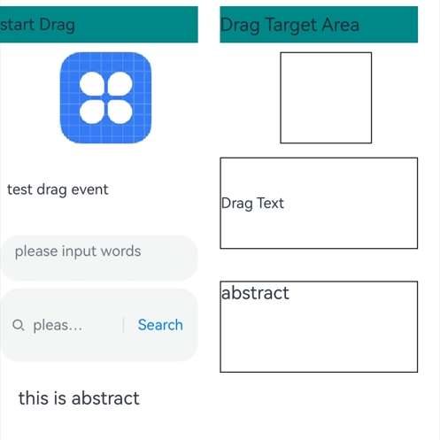
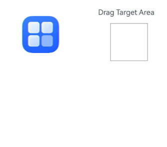
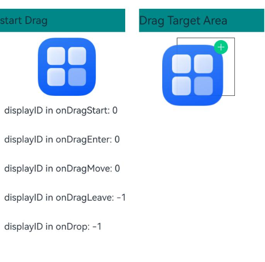
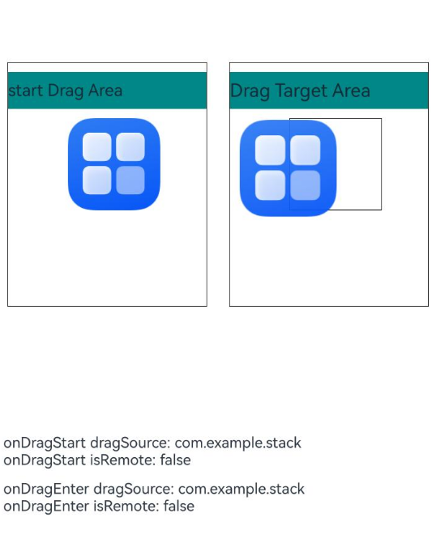
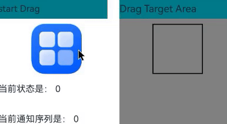
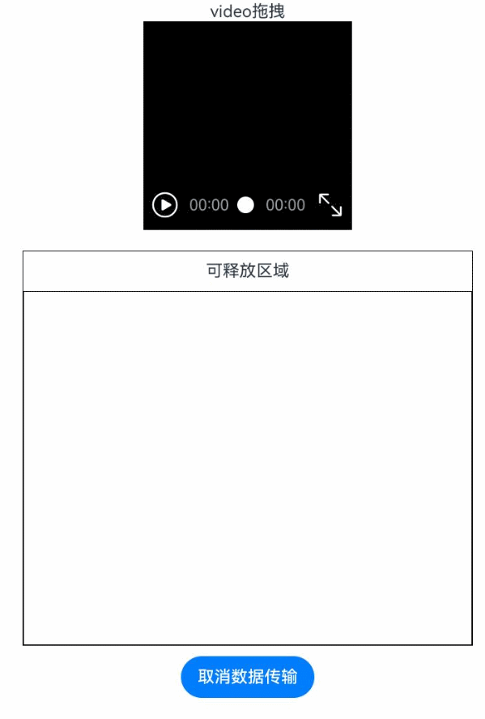
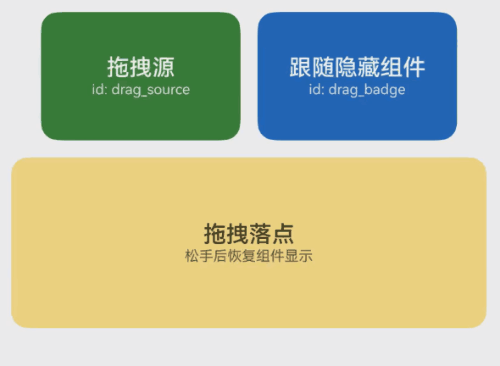

# 拖拽事件
<!--Kit: ArkUI-->
<!--Subsystem: ArkUI-->
<!--Owner: @yihao-lin-->
<!--Designer: @piggyguy-->
<!--Tester: @songyanhong-->
<!--Adviser: @Brilliantry_Rui-->

拖拽事件是指在用户界面中，当用户拖动某个对象（如文件、控件或元素）时触发的一系列事件。这些事件允许开发者自定义拖拽行为，实现诸如拖放、调整位置等功能。

>  **说明：**
>
> - 本模块同时支持ArkTS-Dyn、ArkTS-Sta。
>
> - 本模块首批接口从API version 8开始支持。后续版本的新增接口，采用上角标单独标记接口的起始版本。
>
> - 应用本身预置的资源文件（即应用在安装前的HAP包中已经存在的资源文件）仅支持本地应用内拖拽。

ArkUI框架对以下组件实现了默认的拖拽能力，支持对数据的拖出或拖入响应。开发者也可以通过实现通用拖拽事件来自定义拖拽能力。

- 默认支持拖出能力的组件（可从组件上拖出数据）：[Search](ts-basic-components-search.md)、[TextInput](ts-basic-components-textinput.md)、[TextArea](ts-basic-components-textarea.md)、[RichEditor](ts-basic-components-richeditor.md)、[Text](ts-basic-components-text.md)、[Image](ts-basic-components-image.md)、[Hyperlink](ts-container-hyperlink.md)，开发者可通过设置这些组件的[draggable](ts-universal-attributes-drag-drop.md#draggable)属性来控制对默认拖拽能力的使用。

- 默认支持拖入能力的组件（目标组件可响应拖入数据）：[Search](ts-basic-components-search.md)、[TextInput](ts-basic-components-textinput.md)、[TextArea](ts-basic-components-textarea.md)、[RichEditor](ts-basic-components-richeditor.md)，开发者可通过设置这些组件的[allowDrop](ts-universal-attributes-drag-drop.md#allowdrop)属性为null来禁用对默认拖入能力的支持。

其他支持拖出能力的组件需要开发者将[draggable](ts-universal-attributes-drag-drop.md#draggable)属性设置为true，并在[onDragStart](ts-universal-events-drag-drop.md#ondragstart)等接口中实现数据传输相关内容，才能正确处理拖拽能力。
<!--RP1--><!--RP1End-->

> **说明：**
>
> Text组件需配合[copyOption](ts-basic-components-text.md#copyoption9)一起使用，设置copyOptions为CopyOptions.InApp或者CopyOptions.LocalDevice。

## onDragStart

ArkTS-Dyn: onDragStart(event: (event: DragEvent, extraParams?: string) => CustomBuilder | DragItemInfo): T

ArkTS-Sta: onDragStart(event: ((event: DragEvent, extraParams?: string) => CustomBuilder | DragItemInfo) | undefined): this

在手势拖拽场景中，在可拖拽的组件上长按时间超过500ms，然后手指移动距离大于10vp时触发此回调；在鼠标拖拽场景中，鼠标左键在可拖拽的组件上按下并移动超过1vp时，即可触发此回调。

针对默认支持拖拽能力的组件，如果开发者设置了onDragStart，优先执行onDragStart，并根据执行情况决定是否使用系统默认的拖拽能力，具体规则为：
- 如果开发者返回了自定义预览图，则不再使用系统默认的拖拽预览图；
- 如果开发者设置了拖拽数据，则不再使用系统默认填充的拖拽数据。

文本类组件[Text](ts-basic-components-text.md)、[Search](ts-basic-components-search.md)、[TextInput](ts-basic-components-textinput.md)、[TextArea](ts-basic-components-textarea.md)、[RichEditor](ts-basic-components-richeditor.md)对选中的文本内容进行拖拽时，不支持自定义预览图。当onDragStart与菜单预览一起使用或使用了默认支持拖拽能力的组件时，预览及菜单项上的自定义内容不支持拖拽。

> **说明：**
>
> 从API version 13开始，该接口支持在[attributeModifier](ts-universal-attributes-attribute-modifier.md#attributemodifier)中调用。

**原子化服务API（仅ArkTS-Dyn）：** 从API version 11开始，该接口支持在原子化服务中使用。

**事件优先级：** 长按事件触发时间 < 500ms，长按事件优先拖拽事件响应，长按事件触发时间 >= 500ms，拖拽事件优先长按事件响应。

**系统能力：** SystemCapability.ArkUI.ArkUI.Full

**ArkTS-Dyn起始版本：** 8

**ArkTS-Sta起始版本：** 23

**参数：**

| 参数名      | 类型                            | 必填 | 说明               |
| ----------- | ------------------------------- | ---- | ------------------ |
| event    | ArkTS-Dyn: (event: [DragEvent](#dragevent7), extraParams?: string) => [CustomBuilder](ts-types.md#custombuilder8) &nbsp;\|&nbsp; [DragItemInfo](#dragiteminfo)<br/>ArkTS-Sta: ((event: [DragEvent](#dragevent7), extraParams?: string) => [CustomBuilder](ts-types.md#custombuilder8) &nbsp;\|&nbsp; [DragItemInfo](#dragiteminfo))&nbsp;\|&nbsp;undefined | 是   | 回调函数。<br/> **说明：**<br/> event参数为拖拽事件的信息。<br/> extraParams参数为拖拽事件的额外信息，需要解析为JSON格式，参考[extraParams](#extraparams说明)说明。<br/> CustomBuilder为拖拽过程中显示的组件信息，不支持全局builder。<br/>传入undefined时无效果。|

**返回值：**

| 类型 | 说明 |
| -------- | -------- |
| ArkTS-Dyn: T<br/>ArkTS-Sta: this | 返回当前组件。 |

## onDragEnter

ArkTS-Dyn: onDragEnter(event: (event: DragEvent, extraParams?: string) => void): T

ArkTS-Sta: onDragEnter(event: ((event: DragEvent, extraParams?: string) => void) | undefined): this

拖拽进入组件范围内时，触发回调，当监听了[onDrop](#ondrop)事件时，此事件才有效。

**原子化服务API（仅ArkTS-Dyn）：** 从API version 11开始，该接口支持在原子化服务中使用。

**系统能力：** SystemCapability.ArkUI.ArkUI.Full

**ArkTS-Dyn起始版本：** 8

**ArkTS-Sta起始版本：** 23

**参数：**

| 参数名      | 类型                            | 必填 | 说明                           |
| ----------- | ------------------------------- | ---- | ------------------------------ |
| event    | ArkTS-Dyn: (event: [DragEvent](#dragevent7), extraParams?: string) => void<br/>ArkTS-Sta: ((event: [DragEvent](#dragevent7), extraParams?: string) => void) \| undefined | 是   | 回调函数。<br/>**说明：**<br/> event为拖拽事件信息，包括拖拽点坐标。<br/> extraParams为拖拽事件额外信息，需要解析为Json格式，参考[extraParams](#extraparams说明)说明。<br/>传入undefined时无效果。|

**返回值：**

| 类型 | 说明 |
| -------- | -------- |
| ArkTS-Dyn: T<br/>ArkTS-Sta: this | 返回当前组件。 |

## onDragMove

ArkTS-Dyn: onDragMove(event: (event: DragEvent, extraParams?: string) => void): T

ArkTS-Sta: onDragMove(event: ((event: DragEvent, extraParams?: string) => void) | undefined): this

拖拽在组件范围内移动时，触发回调，当监听了[onDrop](#ondrop)事件时，此事件才有效。

**原子化服务API（仅ArkTS-Dyn）：** 从API version 11开始，该接口支持在原子化服务中使用。

**系统能力：** SystemCapability.ArkUI.ArkUI.Full

**ArkTS-Dyn起始版本：** 8

**ArkTS-Sta起始版本：** 23

**参数：**

| 参数名      | 类型                            | 必填 | 说明                           |
| ----------- | ------------------------------- | ---- | ------------------------------ |
| event    | ArkTS-Dyn: (event: [DragEvent](#dragevent7), extraParams?: string) => void<br/>ArkTS-Sta: ((event: [DragEvent](#dragevent7), extraParams?: string) => void) \| undefined | 是   | 回调函数。<br/>**说明：**<br/> event为拖拽事件信息，包括拖拽点坐标。<br/> extraParams为拖拽事件额外信息，需要解析为JSON格式，参考[extraParams](#extraparams说明)说明。<br/>传入undefined时无效果。|

**返回值：**

| 类型 | 说明 |
| -------- | -------- |
| ArkTS-Dyn: T<br/>ArkTS-Sta: this | 返回当前组件。 |

## onDragLeave

ArkTS-Dyn: onDragLeave(event: (event: DragEvent, extraParams?: string) => void): T

ArkTS-Sta: onDragLeave(event: ((event: DragEvent, extraParams?: string) => void) | undefined): this

拖拽离开组件范围内时，触发回调，当监听了[onDrop](#ondrop)事件时，此事件才有效。

**原子化服务API（仅ArkTS-Dyn）：** 从API version 11开始，该接口支持在原子化服务中使用。

**系统能力：** SystemCapability.ArkUI.ArkUI.Full

**ArkTS-Dyn起始版本：** 8

**ArkTS-Sta起始版本：** 23

**参数：**

| 参数名      | 类型                            | 必填 | 说明                           |
| ----------- | ------------------------------- | ---- | ------------------------------ |
| event    | ArkTS-Dyn: (event: [DragEvent](#dragevent7), extraParams?: string) => void<br/>ArkTS-Sta: ((event: [DragEvent](#dragevent7), extraParams?: string) => void) \| undefined | 是   | 回调函数。<br/>**说明：**<br/> event为拖拽事件信息，包括拖拽点坐标。<br/> extraParams为拖拽事件额外信息，需要解析为JSON格式，参考[extraParams](#extraparams说明)说明。<br/>传入undefined时无效果。|

**返回值：**

| 类型 | 说明 |
| -------- | -------- |
| ArkTS-Dyn: T<br/>ArkTS-Sta: this | 返回当前组件。 |

## onDrop

ArkTS-Dyn: onDrop(event: (event: DragEvent, extraParams?: string) => void): T

ArkTS-Sta: onDrop(event: ((event: DragEvent, extraParams?: string) => void) | undefined): this

绑定此事件的组件可作为释放目标。当在本组件范围内停止拖放行为时，将触发回调。如果开发者未在onDrop中主动调用event.setResult()来设置拖拽接收的结果，对于系统支持的默认可拖入组件，处理结果将以系统实际处理的数据为准。对于其他组件，系统将默认视为数据接收成功。

**原子化服务API（仅ArkTS-Dyn）：** 从API version 11开始，该接口支持在原子化服务中使用。

**系统能力：** SystemCapability.ArkUI.ArkUI.Full

**ArkTS-Dyn起始版本：** 8

**ArkTS-Sta起始版本：** 23

**参数：**

| 参数名      | 类型                            | 必填 | 说明                           |
| ----------- | ------------------------------- | ---- | ------------------------------ |
| event    | ArkTS-Dyn: (event: [DragEvent](#dragevent7), extraParams?: string) => void<br/>ArkTS-Sta: ((event: [DragEvent](#dragevent7), extraParams?: string) => void) \| undefined | 是   | 回调函数。<br/>**说明：**<br/> event为拖拽事件信息，包括拖拽点坐标。<br/> extraParams为拖拽事件额外信息，需要解析为JSON格式，参考[extraParams](#extraparams说明)说明。<br/>传入undefined时无效果。|

**返回值：**

| 类型 | 说明 |
| -------- | -------- |
| ArkTS-Dyn: T<br/>ArkTS-Sta: this | 返回当前组件。 |

## onDrop<sup>15+</sup>

ArkTS-Dyn: onDrop(eventCallback: OnDragEventCallback, dropOptions?: DropOptions): T

ArkTS-Sta: onDrop(eventCallback: OnDragEventCallback | undefined, dropOptions: DropOptions): this

绑定此事件的组件可作为拖拽释放目标，当在本组件范围内停止拖拽行为时，触发回调。如果开发者没有在onDrop中主动调用event.[setResult](ts-universal-events-drag-drop.md#setresult10)()设置拖拽接收的结果，若拖拽组件为系统支持默认拖入的组件，以系统实际处理数据结果为准，其它组件则系统按照数据接收成功处理。

**原子化服务API（仅ArkTS-Dyn）：** 从API version 15开始，该接口支持在原子化服务中使用。

**模型约束：** 此接口仅可在Stage模型下使用。

**系统能力：** SystemCapability.ArkUI.ArkUI.Full

**ArkTS-Dyn起始版本：** 15

**ArkTS-Sta起始版本：** 23

**参数：**

| 参数名      | 类型                            | 必填 | 说明                           |
| ----------- | ------------------------------- | ---- | ------------------------------ |
| eventCallback  | ArkTS-Dyn: [OnDragEventCallback](#ondrageventcallback15) <br/>ArkTS-Sta: [OnDragEventCallback](#ondrageventcallback15) \|&nbsp;undefined | 是   | 回调函数。<br/>传入undefined时无效果。|
| dropOptions  | [DropOptions](#dropoptions15)   | ArkTS-Dyn: 否<br/>ArkTS-Sta: 是   | 落入过程的参数。 |

**返回值：**

| 类型 | 说明 |
| -------- | -------- |
| ArkTS-Dyn: T<br/>ArkTS-Sta: this | 返回当前组件。 |

## onDragEnd<sup>10+</sup>

ArkTS-Dyn: onDragEnd(event: (event: DragEvent, extraParams?: string) => void): T

ArkTS-Sta: onDragEnd(event: ((event: DragEvent, extraParams?: string) => void) | undefined): this

绑定此事件的组件触发的拖拽结束后，触发回调。

**原子化服务API（仅ArkTS-Dyn）：** 从API version 11开始，该接口支持在原子化服务中使用。

**模型约束：** 此接口仅可在Stage模型下使用。

**系统能力：** SystemCapability.ArkUI.ArkUI.Full

**ArkTS-Dyn起始版本：** 10

**ArkTS-Sta起始版本：** 23

**参数：**

| 参数名      | 类型                            | 必填 | 说明                           |
| ----------- | ------------------------------- | ---- | ------------------------------ |
| event    | ArkTS-Dyn: (event: [DragEvent](#dragevent7), extraParams?: string) => void<br/>ArkTS-Sta: ((event: [DragEvent](#dragevent7), extraParams?: string) => void) \| undefined | 是   | 回调函数。<br/>**说明：**<br/> event为拖拽事件信息，在onDragEnd调用中不包括拖拽点坐标。<br/> extraParams为拖拽事件额外信息，需要解析为JSON格式，参考[extraParams](#extraparams说明)说明。<br/>传入undefined时无效果。|

**返回值：**

| 类型 | 说明 |
| -------- | -------- |
| ArkTS-Dyn: T<br/>ArkTS-Sta: this | 返回当前组件。 |

## onPreDrag<sup>12+</sup>

ArkTS-Dyn: onPreDrag(callback: Callback\<PreDragStatus>): T

ArkTS-Sta: onPreDrag(callback: Callback\<PreDragStatus> | undefined): this

绑定此事件的组件，当处于手势拖拽发起前的不同阶段时，触发回调。拖拽发起前的各阶段可参考[PreDragStatus](#predragstatus12枚举说明)。此接口不支持在鼠标拖拽中触发。

> **说明：**
>
> 从API version 20开始，该接口支持在[attributeModifier](ts-universal-attributes-attribute-modifier.md#attributemodifier)中调用。

**原子化服务API（仅ArkTS-Dyn）：** 从API version 12开始，该接口支持在原子化服务中使用。

**模型约束：** 此接口仅可在Stage模型下使用。

**系统能力：** SystemCapability.ArkUI.ArkUI.Full

**ArkTS-Dyn起始版本：** 12

**ArkTS-Sta起始版本：** 23

**参数：**

| 参数名      | 类型                            | 必填 | 说明                           |
| ----------- | ------------------------------- | ---- | ------------------------------ |
| callback    | ArkTS-Dyn: Callback<[PreDragStatus](#predragstatus12枚举说明)><br/> ArkTS-Sta: Callback<[PreDragStatus](#predragstatus12枚举说明)> \| undefined     | 是   | 回调函数。<br/>传入undefined时无效果。|

**返回值：**

| 类型 | 说明 |
| -------- | -------- |
| ArkTS-Dyn: T<br/>ArkTS-Sta: this | 返回当前组件。 |

## onDragSpringLoading<sup>20+</sup>

ArkTS-Dyn: onDragSpringLoading(callback: Callback\<SpringLoadingContext\> | null, configuration?: DragSpringLoadingConfiguration): T

ArkTS-Sta: onDragSpringLoading(callback: Callback\<SpringLoadingContext\> | null | undefined, configuration?: DragSpringLoadingConfiguration): this

绑定此事件的组件可作为具有悬停检测功能的拖拽响应目标。当拖拽对象悬停在目标上时，触发回调通知。此时只有一个目标可以成为响应方，并且子组件始终具有更高的响应优先级。

关于悬停检测的触发机制及详细使用方法，请参考开发指南[支持悬停检测](../../../ui/arkts-common-events-drag-event.md#支持悬停检测)。

**原子化服务API（仅ArkTS-Dyn）：** 从API version 20开始，该接口支持在原子化服务中使用。

**模型约束：** 此接口仅可在Stage模型下使用。

**系统能力：** SystemCapability.ArkUI.ArkUI.Full

**ArkTS-Dyn起始版本：** 20

**ArkTS-Sta起始版本：** 24

**参数：**

| 参数名        | 类型                                      | 必填 | 说明                                           |
| :------------ | ----------------------------------------- | ---- | ---------------------------------------------- |
| callback          | ArkTS-Dyn: Callback\<[SpringLoadingContext](../js-apis-arkui-dragController.md#springloadingcontext20)\> \| null<br/>ArkTS-Sta: Callback\<[SpringLoadingContext](../js-apis-arkui-dragController.md#springloadingcontext20)\> \| null \| undefined    | 是   | 悬停检测回调函数，为null时禁用悬停检测。<br/>传入undefined时无效果。 |
| configuration | [DragSpringLoadingConfiguration](../js-apis-arkui-dragController.md#dragspringloadingconfiguration20) | 否   | 悬停检测配置信息，为undefined时取[DragSpringLoadingConfiguration](../js-apis-arkui-dragController.md#dragspringloadingconfiguration20)默认值。  |

**返回值：**

| 类型 | 说明 |
| -------- | -------- |
| ArkTS-Dyn: T<br/>ArkTS-Sta: this | 返回当前组件。 |

## DragItemInfo

定义拖拽过程中拖拽项的相关信息。

**原子化服务API（仅ArkTS-Dyn）：** 从API version 11开始，该接口支持在原子化服务中使用。

**系统能力：** SystemCapability.ArkUI.ArkUI.Full

**ArkTS-Dyn起始版本：** 8

**ArkTS-Sta起始版本：** 23

| 名称      | 类型                  | 只读| 可选   | 说明                               |
| --------- | ---------------------------------------- | ---- | ---- | --------------------------------- |
| pixelMap  | [PixelMap](../../apis-image-kit/arkts-apis-image-PixelMap.md) | 否    |  是   |设置拖拽过程中显示的图片。 |
| builder   | [CustomBuilder](ts-types.md#custombuilder8) | 否    |  是   |拖拽过程中显示自定义组件，如果设置了pixelMap，则忽略此值。<br /> **说明：** <br/>不支持全局builder。如果builder中使用了[Image](ts-basic-components-image.md)组件，应尽量开启同步加载，即配置Image的[syncLoad](ts-basic-components-image.md#syncload8)为true。该builder只用于生成当次拖拽中显示的图片，builder的修改不会同步到当前正在拖拽的图片，对builder的修改需要在下一次拖拽时生效。<br/>builder传参时，建议传参格式为builder: ()=>{this.customBuilder()}，用以保证this指向的正确性。具体请参考[将@Builder装饰的函数当作CustomBuilder类型使用](../../../ui/state-management/arkts-builder.md#将builder装饰的函数当作custombuilder类型使用)。|
| extraInfo | string                                   | 否    |  是   |拖拽项的附加信息，用于描述拖拽项。                    |

## PreviewConfiguration<sup>15+</sup>

配置自定义拖拽过程中的预览图样式。

**原子化服务API（仅ArkTS-Dyn）：** 从API version 15开始，该接口支持在原子化服务中使用。

**模型约束：** 此接口仅可在Stage模型下使用。

**系统能力：** SystemCapability.ArkUI.ArkUI.Full

**ArkTS-Dyn起始版本：** 15

**ArkTS-Sta起始版本：** 23

| 名称       | 类型 | 只读 | 可选 | 说明                                                         |
| ---------- | ---- | ---- | ---- | ------------------------------------------------------------ |
| onlyForLifting | boolean | 否    | 是    | 自定义配置的预览图是否仅用于浮起。<br /> **说明：** <br/>默认值为false。true表示自定义预览图仅用于浮起，false表示可用于浮起和拖拽。设置为true时，如果发起长按拖拽，浮起时的预览图为自定义配置的预览图，拖拽时的预览图不使用[dragPreview](ts-universal-attributes-drag-drop.md#dragpreview11)属性，优先使用开发者在[onDragStart](ts-universal-events-drag-drop.md#ondragstart)中返回的预览图，如果[onDragStart](ts-universal-events-drag-drop.md#ondragstart)中没有返回预览图则使用组件自截图。|
| delayCreating  | boolean | 否    | 是    | 组件预览builder是否在设置时加载。<br/>默认值为false。true表示组件预览builder在设置时加载，false表示组件预览builder不在设置时加载。|

## extraParams说明

用于返回组件在拖拽中需要用到的额外信息。

extraParams是JSON对象转换的string字符串，可以通过JSON.parse转换的JSON对象获取如下属性。

| 名称          | 类型   | 描述                                       |
| ------------- | ------ | ---------------------------------------- |
| selectedIndex | number | 当拖拽事件设在父容器的子元素时，selectedIndex表示当前被拖拽子元素是父容器第selectedIndex个子元素，selectedIndex从0开始。<br/>仅在[ListItem](ts-container-listitem.md)组件的拖拽事件中生效，否则返回undefined。 |
| insertIndex   | number | 当前拖拽元素在List组件中放下时，insertIndex表示被拖拽元素插入该组件的第insertIndex个位置，insertIndex从0开始。<br/>仅在[List](ts-container-list.md)组件的拖拽事件中生效，否则返回undefined。 |

## DragEvent<sup>7+</sup>

**系统能力：** SystemCapability.ArkUI.ArkUI.Full

### 属性

**系统能力：** SystemCapability.ArkUI.ArkUI.Full


| 名称     | 类型  | 只读 | 可选 | 说明             |
| ------ | ------ | ----- | ---- | ------- |
| useCustomDropAnimation<sup>10+</sup> | boolean | 否 | 否 |当拖拽结束时，是否禁用系统默认落位动效。<br/>应用可将该值设定为true来禁用系统默认落位动效，并实现自己的自定义落位动效。<br/>当不配置或设置为false时，系统默认落位动效生效，当[setResult](#setresult10)设置为DRAG_SUCCESSFUL时，落位为缩小消失动效，不为DRAG_SUCCESSFUL时，则为放大消失动效。<br/>当未禁用系统默认落位动效时，应用不应再实现自定义动效，以避免动效上的冲突。<br/>默认值：false<br/>**原子化服务API（仅ArkTS-Dyn）：** 从API version 11开始，该接口支持在原子化服务中使用。<br/>**ArkTS-Dyn起始版本：** 10<br/>**ArkTS-Sta起始版本：** 23 |
| autoHideComponentUniqueIds | ArkTS-Dyn: number \| number[]<br/>ArkTS-Sta: int \| int[] | 否 | 是 |设置拖拽过程中需要自动隐藏的组件uniqueId，支持传入单个uniqueId或数组。<br/>仅在[onDragStart](#ondragstart)回调中设置生效。拖拽成功发起后，系统会在显示拖拽预览窗口前隐藏目标组件。<br/>若拖拽源本身也需要隐藏，需要同时传入拖拽源组件的uniqueId。<br/>组件的uniqueId可通过[UIContext.getFrameNodeById()](../arkts-apis-uicontext-uicontext.md#getframenodebyid12)配合[FrameNode.getUniqueId()](../js-apis-arkui-frameNode.md#getuniqueid12)获取。<br/>开发者应在[onDragEnd](#ondragend10)或[onDrop](#ondrop)中恢复组件显示状态。<br/>**原子化服务API（仅ArkTS-Dyn）：** 从API版本26.0.0开始，该接口支持在原子化服务中使用。<br/>**模型约束：** 此接口仅可在Stage模型下使用。 <br/>**ArkTS-Dyn起始版本：** 26.0.0<br/>**ArkTS-Sta起始版本：** 26.0.0|
|dragBehavior<sup>10+</sup> | [DragBehavior](#dragbehavior10) | 否 | 否 |切换复制和剪贴模式的角标显示状态。<br/>默认值：DragBehavior.COPY。<br/>**原子化服务API（仅ArkTS-Dyn）：** 从API version 11开始，该接口支持在原子化服务中使用。<br/>**模型约束：** 此接口仅可在Stage模型下使用。<br/>**ArkTS-Dyn起始版本：** 10<br/>**ArkTS-Sta起始版本：** 23 |
| getModifierKeyState<sup>23+</sup>| [ModifierKeyStateGetter](./ts-types.md#modifierkeystategetter23) | 否 | 是 | 获取功能键按压状态。支持功能键 'Ctrl' \| 'Alt' \| 'Shift'。<br/>**ArkTS模式：** 该接口仅适用于ArkTS-Sta。<br/>**ArkTS-Sta起始版本：** 23 |

### setData<sup>10+</sup>

setData(unifiedData: UnifiedData): void

向DragEvent中设置用于拖拽的数据。

**原子化服务API（仅ArkTS-Dyn）：** 从API version 11开始，该接口支持在原子化服务中使用。

**模型约束：** 此接口仅可在Stage模型下使用。

**系统能力：** SystemCapability.ArkUI.ArkUI.Full

**ArkTS-Dyn起始版本：** 10

**ArkTS-Sta起始版本：** 23

**参数：** 

| 参数名      | 类型                                                         | 必填 | 说明             |
| ----------- | ------------------------------------------------------------ | ---- | ---------------- |
| unifiedData | [UnifiedData](#unifieddata10) | 是   | 拖拽相关的数据。 |

### getData<sup>10+</sup>

ArkTS-Dyn: getData(): UnifiedData

ArkTS-Sta: getData(): UnifiedData | undefined

获取拖拽相关数据。

**原子化服务API（仅ArkTS-Dyn）：** 从API version 11开始，该接口支持在原子化服务中使用。

**模型约束：** 此接口仅可在Stage模型下使用。

**系统能力：** SystemCapability.ArkUI.ArkUI.Full

**ArkTS-Dyn起始版本：** 10

**ArkTS-Sta起始版本：** 23

**返回值：**

| 类型                                                         | 说明                                                         |
| ------------------------------------------------------------ | ------------------------------------------------------------ |
| ArkTS-Dyn: [UnifiedData](../../apis-arkdata/js-apis-data-unifiedDataChannel.md#unifieddata)<br/>ArkTS-Sta: [UnifiedData](../../apis-arkdata/js-apis-data-unifiedDataChannel.md#unifieddata) \| undefined | 从DragEvent中获取拖拽相关数据。数据获取结果请参考错误码说明。 |

**错误码：**

以下错误码的详细介绍请参见[拖拽事件错误码](../errorcode-drag-event.md)。

| 错误码ID   | 错误信息 |
| --------- | ------- |
| 190001    | Data not found.|
| 190002    | Data error. |

### getSummary<sup>10+</sup>

ArkTS-Dyn: getSummary(): Summary

ArkTS-Sta: getSummary(): Summary | undefined

获取所拖拽数据的概要，包括数据类型及大小信息；在延迟拖拽场景下，只能获取到数据类型信息。

**原子化服务API（仅ArkTS-Dyn）：** 从API version 11开始，该接口支持在原子化服务中使用。

**模型约束：** 此接口仅可在Stage模型下使用。

**系统能力：** SystemCapability.ArkUI.ArkUI.Full

**ArkTS-Dyn起始版本：** 10

**ArkTS-Sta起始版本：** 23

**返回值：**

| 类型                                                         | 说明                                  |
| ------------------------------------------------------------ | ------------------------------------- |
| ArkTS-Dyn: [Summary](#summary10)<br/>ArkTS-Sta: [Summary](#summary10) \| undefined | 拖拽相关数据的概要。 |

### setResult<sup>10+</sup>

setResult(dragResult: DragResult): void

在DragEvent中设置拖拽结果。

**原子化服务API（仅ArkTS-Dyn）：** 从API version 11开始，该接口支持在原子化服务中使用。

**模型约束：** 此接口仅可在Stage模型下使用。

**系统能力：** SystemCapability.ArkUI.ArkUI.Full

**ArkTS-Dyn起始版本：** 10

**ArkTS-Sta起始版本：** 23

**参数：** 

| 参数名     | 类型                                | 必填 | 说明       |
| ---------- | ----------------------------------- | ---- | ---------- |
| dragResult | [DragResult](#dragresult10枚举说明) | 是   | 拖拽结果。 |

### getResult<sup>10+</sup>

getResult(): DragResult

获取拖拽结果。

**原子化服务API（仅ArkTS-Dyn）：** 从API version 11开始，该接口支持在原子化服务中使用。

**模型约束：** 此接口仅可在Stage模型下使用。

**系统能力：** SystemCapability.ArkUI.ArkUI.Full

**ArkTS-Dyn起始版本：** 10

**ArkTS-Sta起始版本：** 23

**返回值：** 

| 类型                                | 说明                          |
| ----------------------------------- | ----------------------------- |
| [DragResult](#dragresult10枚举说明) | 从DragEvent中获取的拖拽结果。 |

### getPreviewRect<sup>10+</sup>

getPreviewRect(): Rectangle

获取拖拽预览图相对于当前窗口的位置，以及预览图尺寸信息。

**原子化服务API（仅ArkTS-Dyn）：** 从API version 11开始，该接口支持在原子化服务中使用。

**模型约束：** 此接口仅可在Stage模型下使用。

**系统能力：** SystemCapability.ArkUI.ArkUI.Full

**ArkTS-Dyn起始版本：** 10

**ArkTS-Sta起始版本：** 23

**返回值：**

| 类型                                                         | 说明                                                         |
| ------------------------------------------------------------ | ------------------------------------------------------------ |
| [Rectangle](ts-universal-attributes-touch-target.md#rectangle对象说明) | 拖拽预览图相对于当前窗口的位置，以及预览图尺寸信息，单位vp，其中x和y代表预览图左上角的窗口坐标，width和height代表预览图的尺寸。 |

### getVelocityX<sup>10+</sup>

ArkTS-Dyn: getVelocityX(): number

ArkTS-Sta: getVelocityX(): double

获取当前拖拽的x轴方向拖动速度。

**原子化服务API（仅ArkTS-Dyn）：** 从API version 11开始，该接口支持在原子化服务中使用。

**模型约束：** 此接口仅可在Stage模型下使用。

**系统能力：** SystemCapability.ArkUI.ArkUI.Full

**ArkTS-Dyn起始版本：** 10

**ArkTS-Sta起始版本：** 23

**返回值：**

| 类型   | 说明                                                         |
| ------ | ------------------------------------------------------------ |
| ArkTS-Dyn: number<br/>ArkTS-Sta: double | 当前拖拽的x轴方向拖动速度。坐标轴原点为屏幕左上角，单位为vp，分正负方向速度，从左往右为正，反之为负。 |

### getVelocityY<sup>10+</sup>

ArkTS-Dyn: getVelocityY(): number

ArkTS-Sta: getVelocityY(): double

获取当前拖拽的y轴方向拖动速度。

**原子化服务API（仅ArkTS-Dyn）：** 从API version 11开始，该接口支持在原子化服务中使用。

**模型约束：** 此接口仅可在Stage模型下使用。

**系统能力：** SystemCapability.ArkUI.ArkUI.Full

**ArkTS-Dyn起始版本：** 10

**ArkTS-Sta起始版本：** 23

**返回值：**

| 类型   | 说明                                                         |
| ------ | ------------------------------------------------------------ |
| ArkTS-Dyn: number<br/>ArkTS-Sta: double | 当前拖拽的y轴方向拖动速度。坐标轴原点为屏幕左上角，单位为vp，分正负方向速度，从上往下为正，反之为负。 |

### getVelocity<sup>10+</sup>

ArkTS-Dyn: getVelocity(): number

ArkTS-Sta: getVelocity(): double

获取当前拖拽的主方向拖动速度。

**原子化服务API（仅ArkTS-Dyn）：** 从API version 11开始，该接口支持在原子化服务中使用。

**模型约束：** 此接口仅可在Stage模型下使用。

**系统能力：** SystemCapability.ArkUI.ArkUI.Full

**ArkTS-Dyn起始版本：** 10

**ArkTS-Sta起始版本：** 23

**返回值：**

| 类型   | 说明                                                         |
| ------ | ------------------------------------------------------------ |
| ArkTS-Dyn: number<br/>ArkTS-Sta: double | 当前拖拽的主方向拖动速度。为xy轴方向速度的平方和的算术平方根，单位为vp。 |

### getWindowX<sup>10+</sup>

ArkTS-Dyn: getWindowX(): number

ArkTS-Sta: getWindowX(): double

获取拖拽点相对于窗口左上角的x轴坐标。

**原子化服务API（仅ArkTS-Dyn）：** 从API version 11开始，该接口支持在原子化服务中使用。

**模型约束：** 此接口仅可在Stage模型下使用。

**系统能力：** SystemCapability.ArkUI.ArkUI.Full

**ArkTS-Dyn起始版本：** 10

**ArkTS-Sta起始版本：** 23

**返回值：**

| 类型   | 说明                                            |
| ------ | ----------------------------------------------- |
| ArkTS-Dyn: number<br/>ArkTS-Sta: double | 当前拖拽点相对于窗口左上角的x轴坐标，单位为vp。 |

### getWindowY<sup>10+</sup>

ArkTS-Dyn: getWindowY(): number

ArkTS-Sta: getWindowY(): double

获取拖拽点相对于窗口左上角的y轴坐标。

**原子化服务API（仅ArkTS-Dyn）：** 从API version 11开始，该接口支持在原子化服务中使用。

**模型约束：** 此接口仅可在Stage模型下使用。

**系统能力：** SystemCapability.ArkUI.ArkUI.Full

**ArkTS-Dyn起始版本：** 10

**ArkTS-Sta起始版本：** 23

**返回值：**

| 类型   | 说明                                            |
| ------ | ----------------------------------------------- |
| ArkTS-Dyn: number<br/>ArkTS-Sta: double | 当前拖拽点相对于窗口左上角的y轴坐标，单位为vp。 |

### getDisplayX<sup>10+</sup>

ArkTS-Dyn: getDisplayX(): number

ArkTS-Sta: getDisplayX(): double

获取当前拖拽点相对于屏幕左上角的x轴坐标。

**原子化服务API（仅ArkTS-Dyn）：** 从API version 11开始，该接口支持在原子化服务中使用。

**模型约束：** 此接口仅可在Stage模型下使用。

**系统能力：** SystemCapability.ArkUI.ArkUI.Full

**ArkTS-Dyn起始版本：** 10

**ArkTS-Sta起始版本：** 23

**返回值：**

| 类型   | 说明                                            |
| ------ | ----------------------------------------------- |
| ArkTS-Dyn: number<br/>ArkTS-Sta: double | 当前拖拽点相对于屏幕左上角的x轴坐标，单位为vp。 |

### getDisplayY<sup>10+</sup>

ArkTS-Dyn: getDisplayY(): number

ArkTS-Sta: getDisplayY(): double

获取当前拖拽点相对于屏幕左上角的y轴坐标。

**原子化服务API（仅ArkTS-Dyn）：** 从API version 11开始，该接口支持在原子化服务中使用。

**模型约束：** 此接口仅可在Stage模型下使用。

**系统能力：** SystemCapability.ArkUI.ArkUI.Full

**ArkTS-Dyn起始版本：** 10

**ArkTS-Sta起始版本：** 23

**返回值：**

| 类型   | 说明                                            |
| ------ | ----------------------------------------------- |
| ArkTS-Dyn: number<br/>ArkTS-Sta: double | 当前拖拽点相对于屏幕左上角的y轴坐标，单位为vp。 |

### getModifierKeyState<sup>12+</sup>

getModifierKeyState?(keys: Array<string\>): boolean

获取功能键按压状态。

**原子化服务API（仅ArkTS-Dyn）：** 从API version 13开始，该接口支持在原子化服务中使用。

**模型约束：** 此接口仅可在Stage模型下使用。

**系统能力：** SystemCapability.ArkUI.ArkUI.Full

**ArkTS模式：** 该接口仅适用于ArkTS-Dyn。

**ArkTS-Dyn起始版本：** 12

**参数：**

| 参数名 | 类型                | 必填 | 说明                                                         |
| ------ | ------------------- | ---- | ------------------------------------------------------------ |
| keys   | Array&lt;string&gt; | 是   | 获取功能键按压状态。报错信息请参考以下错误码。支持功能键 'Ctrl' \| 'Alt' \| 'Shift'。<br/>**说明：**<br/>此接口不支持在手写笔场景下使用。 |

**错误码：**

以下错误码的详细介绍请参见[通用错误码](../../errorcode-universal.md)。

| 错误码ID   | 错误信息 |
| --------- | ------- |
| 401       | Parameter error. Possible causes: 1. Incorrect parameter types. 2. Parameter verification failed. |

**返回值：** 

| 类型    | 说明                                                  |
| ------- | ----------------------------------------------------- |
| boolean | 是否被按下，返回true表示被按下，返回false表示未被按下 |

### startDataLoading<sup>15+</sup>

ArkTS-Dyn: startDataLoading(options: DataSyncOptions): string

ArkTS-Sta: startDataLoading(options: DataSyncOptions): string | undefined

异步获取拖拽数据，并通知开发者当前数据同步进度，仅支持在onDrop阶段使用。

**原子化服务API（仅ArkTS-Dyn）：** 从API version 15开始，该接口支持在原子化服务中使用。

**模型约束：** 此接口仅可在Stage模型下使用。

**系统能力：** SystemCapability.ArkUI.ArkUI.Full

**ArkTS-Dyn起始版本：** 15

**ArkTS-Sta起始版本：** 23

**参数：** 

| 参数名  | 类型                                  | 必填 | 说明                                                         |
| ------- | ------------------------------------- | ---- | ------------------------------------------------------------ |
| options | [DataSyncOptions](#datasyncoptions15) | 是 | 获取拖拽数据时的参数，包含目标路径、文件冲突选项、进度条类型等。数据传输过程中可使用[cancelDataLoading](../arkts-apis-uicontext-dragcontroller.md#canceldataloading15)接口取消数据加载。 |

**错误码：**

以下错误码的详细介绍请参见[通用错误码](../../errorcode-universal.md)和[拖拽事件错误码](../errorcode-drag-event.md)。

| 错误码ID   | 错误信息 |
| --------- | ------- |
| 401       | Parameter error. |
| 190003    | Operation not allowed for current phase. |

**返回值：**

| 类型   | 说明                               |
| ------ | ---------------------------------- |
| ArkTS-Dyn: string<br/>ArkTS-Sta: string \| undefined | 拖拽数据的标识，用于区分每次拖拽。 |

### executeDropAnimation<sup>18+</sup>

ArkTS-Dyn: executeDropAnimation(customDropAnimation: Callback\<void\>): void

ArkTS-Sta: executeDropAnimation(customDropAnimation: [VoidCallback](ts-types.md#voidcallback12)): void

设置自定义落位动效的执行函数，仅在[useCustomDropAnimation](ts-universal-events-drag-drop.md#属性)为true时有效。

**原子化服务API（仅ArkTS-Dyn）：** 从API version 18开始，该接口支持在原子化服务中使用。

**模型约束：** 此接口仅可在Stage模型下使用。

**系统能力：** SystemCapability.ArkUI.ArkUI.Full

**ArkTS-Dyn起始版本：** 18

**ArkTS-Sta起始版本：** 23

**参数：** 

| 参数名     | 类型  | 必填 | 说明             |
| ------ | ------ | ---- | ---------------- |
| customDropAnimation | ArkTS-Dyn: [Callback\<void\>](../../../reference/apis-basic-services-kit/js-apis-base.md#callback)<br/>ArkTS-Sta: [VoidCallback](./ts-types.md#voidcallback12)  | 是 |在此回调函数中实现自定义落位动效。<br/> **说明：** <br/>1. 该接口仅在onDrop回调中使用有效。<br/> 2. 使用前需设置useCustomDropAnimation为true，否则该接口不生效。<br/> 3. 不要在动画callback中实现与动效无关的逻辑，避免影响执行效率。|

### getDisplayId<sup>20+</sup>

ArkTS-Dyn: getDisplayId(): number

ArkTS-Sta: getDisplayId(): int

获取当前拖拽事件发生时所在的屏幕ID，不支持在[onDragEnd](ts-universal-events-drag-drop.md#ondragend10)阶段使用。

**原子化服务API（仅ArkTS-Dyn）：** 从API version 20开始，该接口支持在原子化服务中使用。

**模型约束：** 此接口仅可在Stage模型下使用。

**系统能力：** SystemCapability.ArkUI.ArkUI.Full

**ArkTS-Dyn起始版本：** 20

**ArkTS-Sta起始版本：** 23

**返回值：** 

| 类型   | 说明                             |
| ------ | -------------------------------- |
| ArkTS-Dyn: number<br/>ArkTS-Sta: int | 当前拖拽事件发生时所在的屏幕ID。 |

### getDragSource<sup>20+</sup>

getDragSource(): string

获取拖起方包名。

**模型约束：** 此接口仅可在Stage模型下使用。

**原子化服务API（仅ArkTS-Dyn）：** 从API version 20开始，该接口支持在原子化服务中使用。

**系统能力：** SystemCapability.ArkUI.ArkUI.Full

**ArkTS-Dyn起始版本：** 20

**ArkTS-Sta起始版本：** 24

**返回值：**

| 类型   | 说明           |
| ------ | -------------- |
| string | 拖起方的包名。 |

### isRemote<sup>20+</sup>

isRemote(): boolean

获取是否是跨设备拖拽，跨设备拖拽时为true。

**模型约束：** 此接口仅可在Stage模型下使用。

**原子化服务API（仅ArkTS-Dyn）：** 从API version 20开始，该接口支持在原子化服务中使用。

**模型约束：** 此接口仅可在Stage模型下使用。

**系统能力：** SystemCapability.ArkUI.ArkUI.Full

**ArkTS-Dyn起始版本：** 20

**ArkTS-Sta起始版本：** 24

**返回值：**

| 类型    | 说明                                                         |
| ------- | ------------------------------------------------------------ |
| boolean | 是否是跨设备拖拽，返回true表示是跨设备拖拽，返回false表示不是跨设备拖拽。 |

### setDataLoadParams<sup>20+</sup>

setDataLoadParams(dataLoadParams: DataLoadParams): void

设置起拖方延迟提供数据。使用此方法向系统提供数据加载参数，而不是直接提供完整的数据对象。当用户在目标应用程序上落入时，系统将使用此参数从起拖方请求实际数据。与[setData](#setdata10)方法同时使用，以最后调用的方法为准。该接口仅在[onDragStart](ts-universal-events-drag-drop.md#ondragstart)回调中生效。

**模型约束：** 此接口仅可在Stage模型下使用。

**原子化服务API（仅ArkTS-Dyn）：** 从API version 20开始，该接口支持在原子化服务中使用。

**系统能力：** SystemCapability.ArkUI.ArkUI.Full

**ArkTS-Dyn起始版本：** 20

**ArkTS-Sta起始版本：** 24

**参数：** 

| 参数名   | 类型   | 必填    | 说明                                                         |
| -------| -------| ------- | ------------------------------------------------------------ |
| dataLoadParams | [DataLoadParams](#dataloadparams20) |  是 | 落入操作时使用的数据加载参数。 |

### getX<sup>(deprecated)</sup>

getX(): number

当前拖拽点相对于窗口左上角的x轴坐标，单位为vp。

> **说明：**
>
> 从API version 7开始支持，从API version 10开始废弃，建议使用[getWindowX](#getwindowx10)替代。

**系统能力：** SystemCapability.ArkUI.ArkUI.Full

**ArkTS模式：** 该接口仅适用于ArkTS-Dyn。

**ArkTS-Dyn起始版本：** 8

**返回值：**

| 类型   | 说明                                                |
| ------ | --------------------------------------------------- |
| number | 返回当前拖拽点相对于窗口左上角的x轴坐标。<br/>单位：vp |

### getY<sup>(deprecated)</sup>

getY(): number

当前拖拽点相对于窗口左上角的y轴坐标，单位为vp。

> **说明：**
>
> 从API version 7开始支持，从API version 10开始废弃，建议使用[getWindowY](#getwindowy10)替代。

**系统能力：** SystemCapability.ArkUI.ArkUI.Full

**ArkTS模式：** 该接口仅适用于ArkTS-Dyn。

**ArkTS-Dyn起始版本：** 8

**返回值：**

| 类型   | 说明                                                |
| ------ | --------------------------------------------------- |
| number | 返回当前拖拽点相对于窗口左上角的y轴坐标。<br/>单位：vp |

### getGlobalDisplayX<sup>20+</sup>

ArkTS-Dyn: getGlobalDisplayX(): number

ArkTS-Sta: getGlobalDisplayX(): double

当前拖拽点相对于全局屏幕的左上角的X坐标。

**原子化服务API（仅ArkTS-Dyn）：** 从API version 20开始，该接口支持在原子化服务中使用。

**模型约束：** 此接口仅可在Stage模型下使用。

**系统能力：** SystemCapability.ArkUI.ArkUI.Full

**ArkTS-Dyn起始版本：** 20

**ArkTS-Sta起始版本：** 24

**返回值：**

| 类型   | 说明                                                |
| ------ | --------------------------------------------------- |
| ArkTS-Dyn: number<br/>ArkTS-Sta: double | 返回当前拖拽点相对于全局屏幕的左上角的X坐标。<br/>单位：vp，取值范围：[0, +∞)|

### getGlobalDisplayY<sup>20+</sup>

ArkTS-Dyn: getGlobalDisplayY(): number

ArkTS-Sta: getGlobalDisplayY(): double

当前拖拽点相对于全局屏幕的左上角的Y坐标。

**原子化服务API（仅ArkTS-Dyn）：** 从API version 20开始，该接口支持在原子化服务中使用。

**模型约束：** 此接口仅可在Stage模型下使用。

**系统能力：** SystemCapability.ArkUI.ArkUI.Full

**ArkTS-Dyn起始版本：** 20

**ArkTS-Sta起始版本：** 24

**返回值：**

| 类型   | 说明                                                |
| ------ | --------------------------------------------------- |
| ArkTS-Dyn: number<br/>ArkTS-Sta: double | 返回当前拖拽点相对于全局屏幕的左上角的Y坐标。<br/>单位：vp<br/>取值范围：[0, +∞) |

## DragResult<sup>10+</sup>枚举说明

定义拖拽操作的结果及组件的落入选定状态。

**模型约束：** 此接口仅可在Stage模型下使用。

**系统能力：** SystemCapability.ArkUI.ArkUI.Full

| 名称   | 值 | 说明 |
| ----- | -- | --------------- |
| UNKNOWN<sup>23+</sup> | -1 |拖拽结果尚未设置，在[onDragStart](#ondragstart)，[onDragEnter](#ondragenter)，[onDragMove](#ondragmove)，[onDragLeave](#ondragleave)，[onDrop](#ondrop)中使用。<br/>**模型约束：** 此接口仅可在Stage模型下使用。<br/>**原子化服务API（仅ArkTS-Dyn）：** 从API version 24开始，该接口支持在原子化服务中使用。<br/>**ArkTS-Dyn起始版本：** 24<br/>**ArkTS-Sta起始版本：** 23 |
| DRAG_SUCCESSFUL | 0 |拖拽成功，在[onDrop](#ondrop)中使用。<br/>**原子化服务API（仅ArkTS-Dyn）：** 从API version 11开始，该接口支持在原子化服务中使用。<br/>**ArkTS-Dyn起始版本：** 10<br/>**ArkTS-Sta起始版本：** 23 |
| DRAG_FAILED | 1 |拖拽失败，在[onDrop](#ondrop)中使用。<br/>**原子化服务API（仅ArkTS-Dyn）：** 从API version 11开始，该接口支持在原子化服务中使用。<br/>**ArkTS-Dyn起始版本：** 10<br/>**ArkTS-Sta起始版本：** 23 |
| DRAG_CANCELED | 2 |拖拽取消，在[onDrop](#ondrop)中使用。<br/>**原子化服务API（仅ArkTS-Dyn）：** 从API version 11开始，该接口支持在原子化服务中使用。<br/>**ArkTS-Dyn起始版本：** 10<br/>**ArkTS-Sta起始版本：** 23 |
| DROP_ENABLED | 3 |组件允许落入，在[onDragEnter](#ondragenter)，[onDragMove](#ondragmove)，[onDragLeave](#ondragleave)中使用。<br/>**原子化服务API（仅ArkTS-Dyn）：** 从API version 11开始，该接口支持在原子化服务中使用。<br/>**ArkTS-Dyn起始版本：** 10<br/>**ArkTS-Sta起始版本：** 23 |
| DROP_DISABLED | 4 |组件不允许落入，在[onDragEnter](#ondragenter)，[onDragMove](#ondragmove)，[onDragLeave](#ondragleave)中使用。<br/>**原子化服务API（仅ArkTS-Dyn）：** 从API version 11开始，该接口支持在原子化服务中使用。<br/>**ArkTS-Dyn起始版本：** 10<br/>**ArkTS-Sta起始版本：** 23 |

## DragBehavior<sup>10+</sup>

当设置[DragResult](#dragresult10枚举说明)为DROP_ENABLED后，可设置DragBehavior为复制（COPY）或剪切（MOVE）。当DragBehavior为复制（COPY）时，拖拽对象的角标会显示加号；为剪切（MOVE）时，拖拽对象的角标不会显示加号。DragBehavior用来向开发者描述数据的处理方式是复制（COPY）还是剪切（MOVE），但无法最终决定对数据的实际处理方式。DragBehavior会通过onDragEnd带回给数据拖出方，发起拖拽的一方可通过DragBehavior来区分做出的是复制（COPY）还是剪切（MOVE）数据的不同行为。

**原子化服务API（仅ArkTS-Dyn）：** 从API version 11开始，该接口支持在原子化服务中使用。

**模型约束：** 此接口仅可在Stage模型下使用。

**系统能力：** SystemCapability.ArkUI.ArkUI.Full

**ArkTS-Dyn起始版本：** 10

**ArkTS-Sta起始版本：** 23

| 名称 | 值 | 说明 |
| ----- | -- | ----------------- |
| COPY | 0 |指定对数据的处理方式为复制。|
| MOVE| 1 |指定对数据的处理方式为剪切。|

## PreDragStatus<sup>12+</sup>枚举说明

定义拖拽手势触发前的各阶段状态。

**模型约束：** 此接口仅可在Stage模型下使用。

**系统能力：** SystemCapability.ArkUI.ArkUI.Full

| 名称 | 值 | 说明 |
| ---- | - | ----------------- |
| ACTION_DETECTING_STATUS | 0 | 拖拽手势启动阶段。(按下50ms时触发) <br/>**原子化服务API（仅ArkTS-Dyn）：** 从API version 12开始，该接口支持在原子化服务中使用。<br/>**ArkTS-Dyn起始版本：** 12<br/>**ArkTS-Sta起始版本：** 23|
| READY_TO_TRIGGER_DRAG_ACTION | 1 | 拖拽准备完成，可发起拖拽阶段。(按下500ms时触发)<br/>**原子化服务API（仅ArkTS-Dyn）：** 从API version 12开始，该接口支持在原子化服务中使用。<br/>**ArkTS-Dyn起始版本：** 12<br/>**ArkTS-Sta起始版本：** 23 |
| PREVIEW_LIFT_STARTED | 2 | 拖拽浮起动效发起阶段。(按下800ms时触发)<br/>**原子化服务API（仅ArkTS-Dyn）：** 从API version 12开始，该接口支持在原子化服务中使用。<br/>**ArkTS-Dyn起始版本：** 12<br/>**ArkTS-Sta起始版本：** 23 |
| PREVIEW_LIFT_FINISHED | 3 | 拖拽浮起动效结束阶段。(浮起动效完全结束时触发)<br/>**原子化服务API（仅ArkTS-Dyn）：** 从API version 12开始，该接口支持在原子化服务中使用。<br/>**ArkTS-Dyn起始版本：** 12<br/>**ArkTS-Sta起始版本：** 23 |
| PREVIEW_LANDING_STARTED | 4 | 拖拽落回动效发起阶段。(落回动效发起时触发)<br/>**原子化服务API（仅ArkTS-Dyn）：** 从API version 12开始，该接口支持在原子化服务中使用。<br/>**ArkTS-Dyn起始版本：** 12<br/>**ArkTS-Sta起始版本：** 23 |
| PREVIEW_LANDING_FINISHED | 5 | 拖拽落回动效结束阶段。(落回动效结束时触发) <br/>**原子化服务API（仅ArkTS-Dyn）：** 从API version 12开始，该接口支持在原子化服务中使用。<br/>**ArkTS-Dyn起始版本：** 12<br/>**ArkTS-Sta起始版本：** 23|
| ACTION_CANCELED_BEFORE_DRAG | 6 | 拖拽浮起落位动效中断。(已满足READY_TO_TRIGGER_DRAG_ACTION状态后，未达到动效阶段，手指抬手时触发) <br/>**原子化服务API（仅ArkTS-Dyn）：** 从API version 12开始，该接口支持在原子化服务中使用。<br/>**ArkTS-Dyn起始版本：** 12<br/>**ArkTS-Sta起始版本：** 23|
| PREPARING_FOR_DRAG_DETECTION<sup>18+</sup>  | 7 | 拖拽准备完成，可发起拖拽阶段。(按下350ms时触发) <br/>**原子化服务API（仅ArkTS-Dyn）：** 从API version 18开始，该接口支持在原子化服务中使用。<br/>**ArkTS-Dyn起始版本：** 18<br/>**ArkTS-Sta起始版本：** 23|

## UnifiedData<sup>10+</sup>

ArkTS-Dyn: type UnifiedData = UnifiedData

ArkTS-Sta: type UnifiedData = unifiedDataChannel.UnifiedData

拖拽相关的数据。

**原子化服务API（仅ArkTS-Dyn）：** 从API version 11开始，该接口支持在原子化服务中使用。

**模型约束：** 此接口仅可在Stage模型下使用。

**系统能力：** SystemCapability.ArkUI.ArkUI.Full

**ArkTS-Dyn起始版本：** 10

**ArkTS-Sta起始版本：** 23

| 类型 | 说明 |
| ----- | ----------------- |
| ArkTS-Dyn: [UnifiedData](../../apis-arkdata/js-apis-data-unifiedDataChannel.md#unifieddata)<br/>ArkTS-Sta: unifiedDataChannel.[UnifiedData](../../apis-arkdata/js-apis-data-unifiedDataChannel.md#unifieddata) |  拖拽相关的数据。|

## Summary<sup>10+</sup>

ArkTS-Dyn: type Summary = Summary

ArkTS-Sta: type Summary = unifiedDataChannel.Summary

拖拽相关数据的简介。

**原子化服务API（仅ArkTS-Dyn）：** 从API version 11开始，该接口支持在原子化服务中使用。

**模型约束：** 此接口仅可在Stage模型下使用。

**系统能力：** SystemCapability.ArkUI.ArkUI.Full

**ArkTS-Dyn起始版本：** 10

**ArkTS-Sta起始版本：** 23

| 类型 | 说明 |
| ----- | ----------------- |
| ArkTS-Dyn: [Summary](../../apis-arkdata/js-apis-data-unifiedDataChannel.md#summary)<br/>ArkTS-Sta: unifiedDataChannel.[Summary](../../apis-arkdata/js-apis-data-unifiedDataChannel.md#summary) | 拖拽相关数据的简介。|

## DataLoadParams<sup>20+</sup>

ArkTS-Dyn: type DataLoadParams = DataLoadParams

ArkTS-Sta: type DataLoadParams = unifiedDataChannel.DataLoadParams

落入操作时使用的数据加载参数。

**原子化服务API（仅ArkTS-Dyn）：** 从API version 20开始，该接口支持在原子化服务中使用。

**模型约束：** 此接口仅可在Stage模型下使用。

**系统能力：** SystemCapability.ArkUI.ArkUI.Full

**ArkTS-Dyn起始版本：** 20

**ArkTS-Sta起始版本：** 24

| 类型 | 说明 |
| ----- | ----------------- |
| ArkTS-Dyn: [DataLoadParams](../../apis-arkdata/js-apis-data-unifiedDataChannel.md#dataloadparams20)<br/>ArkTS-Sta: unifiedDataChannel.[DataLoadParams](../../apis-arkdata/js-apis-data-unifiedDataChannel.md#dataloadparams20) | 落入操作时使用的数据加载参数。|

## DataSyncOptions<sup>15+</sup>

ArkTS-Dyn: type DataSyncOptions = GetDataParams

ArkTS-Sta: type DataSyncOptions = unifiedDataChannel.GetDataParams

作为startDataLoading的入参对象。

**原子化服务API（仅ArkTS-Dyn）：** 从API version 15开始，该接口支持在原子化服务中使用。

**模型约束：** 此接口仅可在Stage模型下使用。

**系统能力：** SystemCapability.ArkUI.ArkUI.Full

**ArkTS-Dyn起始版本：** 15

**ArkTS-Sta起始版本：** 23

| 类型 | 说明 |
| ----- | ----------------- |
| ArkTS-Dyn: [GetDataParams](../../apis-arkdata/js-apis-data-unifiedDataChannel.md#getdataparams15)<br/>ArkTS-Sta: unifiedDataChannel.[GetDataParams](../../apis-arkdata/js-apis-data-unifiedDataChannel.md#getdataparams15) | 表示从[UDMF](../../apis-arkdata/capi-udmf.md)获取数据时的参数，包含目标路径、文件冲突选项、进度条类型等。|

## OnDragEventCallback<sup>15+</sup>

type OnDragEventCallback = (event: DragEvent, extraParams?: string) => void

拖拽事件的回调函数。

**原子化服务API（仅ArkTS-Dyn）：** 从API version 15开始，该接口支持在原子化服务中使用。

**模型约束：** 此接口仅可在Stage模型下使用。

**系统能力：** SystemCapability.ArkUI.ArkUI.Full

**ArkTS-Dyn起始版本：** 15

**ArkTS-Sta起始版本：** 23

**参数：**

| 参数名 | 类型 |必填 |说明 |
| ----- | ----------------- | ----- | ----- |
| event | [DragEvent](#dragevent7)| 是 |  event为拖拽事件信息，包括拖拽点坐标。|
| extraParams| string |否 | extraParams为拖拽事件额外信息，需要解析为JSON格式，参考[extraParams](#extraparams说明)说明。|

## DropOptions<sup>15+</sup>

设置落入过程的参数。

**原子化服务API（仅ArkTS-Dyn）：** 从API version 15开始，该接口支持在原子化服务中使用。

**模型约束：** 此接口仅可在Stage模型下使用。

**系统能力：** SystemCapability.ArkUI.ArkUI.Full

**ArkTS-Dyn起始版本：** 15

**ArkTS-Sta起始版本：** 23

| 名称     | 类型  | 只读 | 可选 | 说明           |
| ------ | ------ | ---------------- | ------ | ------ |
| disableDataPrefetch | boolean  | 否  | 是  | 设置拖拽是否提前获取数据。true表示不提前获取数据，false表示提前获取数据，默认值为false。<br/>**说明：**<br/> 当使用[startDataLoading](#startdataloading15)获取数据时需设置该参数为true，防止拖拽提前获取数据。 |

## DragSpringLoadingConfiguration<sup>20+</sup>

ArkTS-Dyn: type DragSpringLoadingConfiguration = DragSpringLoadingConfiguration

ArkTS-Sta: type DragSpringLoadingConfiguration = dragController.DragSpringLoadingConfiguration

定义拖拽的悬停检测配置参数的接口。

**原子化服务API（仅ArkTS-Dyn）：** 从API version 20开始，该接口支持在原子化服务中使用。

**模型约束：** 此接口仅可在Stage模型下使用。

**系统能力：** SystemCapability.ArkUI.ArkUI.Full

**ArkTS-Dyn起始版本：** 20

**ArkTS-Sta起始版本：** 24

| 类型 | 说明 |
| ----- | ----------------- |
| ArkTS-Dyn: [DragSpringLoadingConfiguration](../js-apis-arkui-dragController.md#dragspringloadingconfiguration20)<br/>ArkTS-Sta: dragController.[DragSpringLoadingConfiguration](../js-apis-arkui-dragController.md#dragspringloadingconfiguration20) | 定义拖拽的悬停检测配置参数的接口。|

## SpringLoadingContext<sup>20+</sup>

ArkTS-Dyn: type SpringLoadingContext = SpringLoadingContext

ArkTS-Sta: type SpringLoadingContext = dragController.SpringLoadingContext

定义回调上下文信息的类，用于在悬停检测回调中传递给应用程序，使其能访问拖拽状态。

**原子化服务API（仅ArkTS-Dyn）：** 从API version 20开始，该接口支持在原子化服务中使用。

**模型约束：** 此接口仅可在Stage模型下使用。

**系统能力：** SystemCapability.ArkUI.ArkUI.Full

**ArkTS-Dyn起始版本：** 20

**ArkTS-Sta起始版本：** 24

| 类型 | 说明 |
| ----- | ----------------- |
| ArkTS-Dyn: [SpringLoadingContext](../js-apis-arkui-dragController.md#springloadingcontext20)<br/>ArkTS-Sta: dragController.[SpringLoadingContext](../js-apis-arkui-dragController.md#springloadingcontext20) | 定义回调上下文信息的类，用于在悬停检测回调中传递给应用程序，以便应用程序能访问拖拽状态。|

## 示例

### 示例1（设置组件拖拽和落入）

示例1展示了部分组件（如Image和Text等）拖拽和可落入区域的设置。

```ts
// xxx.ets
import { unifiedDataChannel, uniformTypeDescriptor } from '@kit.ArkData';
import { BusinessError } from '@kit.BasicServicesKit';

@Entry
@Component
struct Index {
  @State targetImage: string = '';
  @State targetText: string = 'Drag Text';
  @State imageWidth: number = 100;
  @State imageHeight: number = 100;
  @State imgState: Visibility = Visibility.Visible;
  @State abstractContent: string = "abstract";
  @State textContent: string = "";
  @State backGroundColor: Color = Color.Transparent;

  @Builder
  pixelMapBuilder() {
    Column() {
      // $r('app.media.icon')需要替换为开发者所需的图像资源文件
      Image($r('app.media.icon'))
        .width(120)
        .height(120)
        .backgroundColor(Color.Yellow)
    }
  }

  // 获取Udmf数据
  getDataFromUdmfRetry(event: DragEvent, callback: (data: DragEvent) => void) {
    try {
      let data: UnifiedData = event.getData();
      if (!data) {
        return false;
      }
      let records: Array<unifiedDataChannel.UnifiedRecord> = data.getRecords();
      if (!records || records.length <= 0) {
        return false;
      }
      callback(event);
      return true;
    } catch (e) {
      console.error(`getData failed, code = ${(e as BusinessError).code}, message = ${(e as BusinessError).message}`);
      return false;
    }
  }

  // 首次获取Udmf数据失败后自动重试
  getDataFromUdmf(event: DragEvent, callback: (data: DragEvent) => void) {
    if (this.getDataFromUdmfRetry(event, callback)) {
      return;
    }
    setTimeout(() => {
      this.getDataFromUdmfRetry(event, callback);
    }, 1500);
  }

  // 根据拖拽发起前的不同阶段更改背景色
  private PreDragChange(preDragStatus: PreDragStatus): void {
    if (preDragStatus == PreDragStatus.READY_TO_TRIGGER_DRAG_ACTION) {
      this.backGroundColor = Color.Red;
    } else if (preDragStatus == PreDragStatus.ACTION_CANCELED_BEFORE_DRAG
      || preDragStatus == PreDragStatus.PREVIEW_LANDING_FINISHED) {
      this.backGroundColor = Color.Blue;
    }
  }

  build() {
    Row() {
      Column() {
        Text('start Drag')
          .fontSize(18)
          .width('100%')
          .height(40)
          .margin(10)
          .backgroundColor('#008888')
        // $r('app.media.icon')需要替换为开发者所需的图像资源文件
        Image($r('app.media.icon'))
          .width(100)
          .height(100)
          .draggable(true)
          .margin({ left: 15 })
          .visibility(this.imgState)
          .onDragEnd((event) => {
            // onDragEnd里取到的result值在接收方onDrop设置
            if (event.getResult() === DragResult.DRAG_SUCCESSFUL) {
              this.getUIContext().getPromptAction().showToast({ duration: 100, message: 'Drag Success' });
            } else if (event.getResult() === DragResult.DRAG_FAILED) {
              this.getUIContext().getPromptAction().showToast({ duration: 100, message: 'Drag failed' });
            }
          })
        Text('test drag event')
          .width('100%')
          .height(100)
          .draggable(true)
          .margin({ left: 15 })
          .copyOption(CopyOptions.InApp)
        TextArea({ placeholder: 'please input words' })
          .copyOption(CopyOptions.InApp)
          .width('100%')
          .height(50)
          .draggable(true)
        Search({ placeholder: 'please input you word' })
          .searchButton('Search')
          .width('100%')
          .height(80)
          .textFont({ size: 20 })

        Column() {
          Text('this is abstract')
            .fontSize(20)
            .width('100%')
        }
        .margin({ left: 40, top: 20 })
        .width('100%')
        .height(100)
        .onDragStart((event) => {
          this.backGroundColor = Color.Transparent;
          let data: unifiedDataChannel.PlainText = new unifiedDataChannel.PlainText();
          data.abstract = 'this is abstract';
          data.textContent = 'this is content this is content';
          (event as DragEvent).setData(new unifiedDataChannel.UnifiedData(data));
        })
        .onPreDrag((status: PreDragStatus) => {
          this.PreDragChange(status);
        })
        .backgroundColor(this.backGroundColor)
      }.width('45%')
      .height('100%')

      Column() {
        Text('Drag Target Area')
          .fontSize(20)
          .width('100%')
          .height(40)
          .margin(10)
          .backgroundColor('#008888')
        Image(this.targetImage)
          .width(this.imageWidth)
          .height(this.imageHeight)
          .draggable(true)
          .margin({ left: 15 })
          .border({ color: Color.Black, width: 1 })
          .allowDrop([uniformTypeDescriptor.UniformDataType.IMAGE])
          .onDrop((dragEvent?: DragEvent) => {
            this.getDataFromUdmf((dragEvent as DragEvent), (event: DragEvent) => {
              let records: Array<unifiedDataChannel.UnifiedRecord> = event.getData().getRecords();
              let rect: Rectangle = event.getPreviewRect();
              this.imageWidth = Number(rect.width);
              this.imageHeight = Number(rect.height);
              this.targetImage = (records[0] as unifiedDataChannel.Image).imageUri;
              event.useCustomDropAnimation = false;
              this.imgState = Visibility.None;
              // 显式设置result为successful，则将该值传递给拖出方的onDragEnd
              event.setResult(DragResult.DRAG_SUCCESSFUL);
            })
          })

        Text(this.targetText)
          .width('100%')
          .height(100)
          .border({ color: Color.Black, width: 1 })
          .margin(15)
          .allowDrop([uniformTypeDescriptor.UniformDataType.PLAIN_TEXT])
          .onDrop((dragEvent?: DragEvent) => {
            this.getDataFromUdmf((dragEvent as DragEvent), (event: DragEvent) => {
              let records: Array<unifiedDataChannel.UnifiedRecord> = event.getData().getRecords();
              let plainText: unifiedDataChannel.PlainText = records[0] as unifiedDataChannel.PlainText;
              this.targetText = plainText.textContent;
            })
          })

        Column() {
          Text(this.abstractContent).fontSize(20).width('100%')
          Text(this.textContent).fontSize(15).width('100%')
        }
        .width('100%')
        .height(100)
        .margin(20)
        .border({ color: Color.Black, width: 1 })
        .allowDrop([uniformTypeDescriptor.UniformDataType.PLAIN_TEXT])
        .onDrop((dragEvent?: DragEvent) => {
          this.getDataFromUdmf((dragEvent as DragEvent), (event: DragEvent) => {
            let records: Array<unifiedDataChannel.UnifiedRecord> = event.getData().getRecords();
            let plainText: unifiedDataChannel.PlainText = records[0] as unifiedDataChannel.PlainText;
            this.abstractContent = plainText.abstract as string;
            this.textContent = plainText.textContent;
          })
        })
      }.width('45%')
      .height('100%')
      .margin({ left: '5%' })
    }
    .height('100%')
  }
}
```
 

### 示例2（自定义落位动效）

从API version 18开始，示例2展示了通过自定义接口[executeDropAnimation](#executedropanimation18)，实现落位动效。
```ts
import { unifiedDataChannel, uniformTypeDescriptor } from '@kit.ArkData';

@Entry
@Component
struct DropAnimationExample {
  @State targetImage: string = '';
  @State imageWidth: number = 100;
  @State imageHeight: number = 100;
  @State imgState: Visibility = Visibility.Visible;
  customDropAnimation =
    () => {
      this.getUIContext().animateTo({ duration: 1000, curve: Curve.EaseOut, playMode: PlayMode.Normal }, () => {
        this.imageWidth = 200;
        this.imageHeight = 200;
        this.imgState = Visibility.None;
      })
    }

  build() {
    Row() {
      Column() {
        // $r('app.media.app_icon')需要替换为开发者所需的图像资源文件
        Image($r('app.media.app_icon'))
          .width(100)
          .height(100)
          .draggable(true)
          .margin({ left: 15, top: 40 })
          .visibility(this.imgState)
          .onDragStart((event) => {
          })
          .onDragEnd((event) => {
            if (event.getResult() === DragResult.DRAG_SUCCESSFUL) {
              console.info('Drag Success');
            } else if (event.getResult() === DragResult.DRAG_FAILED) {
              console.error('Drag failed');
            }
          })
      }.width('45%')
      .height('100%')

      Column() {
        Text('Drag Target Area')
          .fontSize(20)
          .width(180)
          .height(40)
          .textAlign(TextAlign.Center)
          .margin(10)
          .backgroundColor('rgb(240,250,255)')
        Column() {
          Image(this.targetImage)
            .width(this.imageWidth)
            .height(this.imageHeight)
        }
        .draggable(true)
        .margin({ left: 15 })
        .border({ color: Color.Black, width: 1 })
        .allowDrop([uniformTypeDescriptor.UniformDataType.IMAGE])
        // onDrop回调，获取拖拽图片的信息和尺寸并更新显示，同时启用并执行自定义下落动画
        .onDrop((dragEvent: DragEvent) => {
          let records: Array<unifiedDataChannel.UnifiedRecord> = dragEvent.getData().getRecords();
          let rect: Rectangle = dragEvent.getPreviewRect();
          this.imageWidth = Number(rect.width);
          this.imageHeight = Number(rect.height);
          this.targetImage = (records[0] as unifiedDataChannel.Image).imageUri;
          dragEvent.useCustomDropAnimation = true;
          dragEvent.executeDropAnimation(this.customDropAnimation)
        })
        .width(this.imageWidth)
        .height(this.imageHeight)
      }.width('45%')
      .height('100%')
      .margin({ left: '5%' })
    }
    .height('100%')
  }
}
```


### 示例3（拖拽异步获取数据）

从API version 15开始，示例3展示了通过[startDataLoading](#startdataloading15)实现拖拽异步获取数据。

```ts
import { unifiedDataChannel, uniformTypeDescriptor } from '@kit.ArkData';
import { fileUri, fileIo as fileIo } from '@kit.CoreFileKit';
import { common } from '@kit.AbilityKit';

@Entry
@Component
struct ImageExample {
  @State uri: string = "";
  @State blockArr: string[] = [];
  uiContext = this.getUIContext();
  udKey: string = '';

  build() {
    Column() {
      Text('Image拖拽')
        .fontSize('30dp')
      Flex({ direction: FlexDirection.Row, alignItems: ItemAlign.Center, justifyContent: FlexAlign.SpaceAround }) {
        // $r('app.media.startIcon')需要替换为开发者所需的图像资源文件
        Image($r('app.media.startIcon'))
          .width(100)
          .height(100)
          .border({ width: 1 })
          .draggable(true)
          .onDragStart((event: DragEvent) => {
            const context: Context | undefined = this.uiContext.getHostContext();
            if (context) {
              let data = context.resourceManager.getMediaContentSync($r('app.media.startIcon').id, 120);
              const arrayBuffer: ArrayBuffer = data.buffer.slice(data.byteOffset, data.byteLength + data.byteOffset);
              let filePath = context.filesDir + '/test.png';
              let file = fileIo.openSync(filePath, fileIo.OpenMode.CREATE | fileIo.OpenMode.READ_WRITE);
              fileIo.writeSync(file.fd, arrayBuffer);
              // 获取图片的uri
              let uri = fileUri.getUriFromPath(filePath);
              let image: unifiedDataChannel.Image = new unifiedDataChannel.Image();
              image.imageUri = uri;
              let dragData: unifiedDataChannel.UnifiedData = new unifiedDataChannel.UnifiedData(image);
              (event as DragEvent).setData(dragData);
            }
          })
      }
      .margin({ bottom: 20 })

      Row() {
        Column() {
          Text('可释放区域')
            .fontSize('15dp')
            .height('10%')
          List() {
            ForEach(this.blockArr, (item: string, index) => {
              ListItem() {
                Image(item)
                  .width(100)
                  .height(100)
                  .border({ width: 1 })
              }
              .margin({ left: 30, top: 30 })
            }, (item: string) => item)
          }
          .border({ width: 1 })
          .height('90%')
          .width('100%')
          .onDrop((event?: DragEvent, extraParams?: string) => {
            console.info("enter onDrop")
            let context = this.uiContext.getHostContext() as common.UIAbilityContext;
            let pathDir: string = context.distributedFilesDir;
            let destUri = fileUri.getUriFromPath(pathDir);
            // 创建DataProgressListener监听数据传输进度
            let progressListener: unifiedDataChannel.DataProgressListener =
              (progress: unifiedDataChannel.ProgressInfo, dragData: UnifiedData | null) => {
                if (dragData != null) {
                  // 获取数据记录数组
                  let arr: Array<unifiedDataChannel.UnifiedRecord> = dragData.getRecords();
                  if (arr.length > 0) {
                    // 检查首记录类型是否为IMAGE
                    if (arr[0].getType() === uniformTypeDescriptor.UniformDataType.IMAGE) {
                      // 类型匹配成功，记录数据Uri
                      let image = arr[0] as unifiedDataChannel.Image;
                      this.uri = image.imageUri;
                      this.blockArr.splice(JSON.parse(extraParams as string).insertIndex, 0, this.uri);
                    }
                  } else {
                    console.info('dragData arr is null');
                  }
                } else {
                  console.info('dragData is undefined');
                }
                console.info(`percentage: ${progress.progress}`);
              };
            // 设置异步数据加载参数项
            let options: DataSyncOptions = {
              destUri: destUri,
              fileConflictOptions: unifiedDataChannel.FileConflictOptions.OVERWRITE,
              progressIndicator: unifiedDataChannel.ProgressIndicator.DEFAULT,
              dataProgressListener: progressListener,
            }
            try {
              // 启动数据传输
              this.udKey = (event as DragEvent).startDataLoading(options);
              console.info(`udKey: ${this.udKey}`);
            } catch (e) {
              console.error(`startDataLoading errorCode: ${e.code}, errorMessage: ${e.message}`);
            }
          }, { disableDataPrefetch: true })
        }
        .height("50%")
        .width("90%")
        .border({ width: 1 })
      }

      Button('取消数据传输')
        .onClick(() => {
          try {
            this.getUIContext().getDragController().cancelDataLoading(this.udKey);
          } catch (e) {
            console.error(`cancelDataLoading errorCode: ${e.code}, errorMessage: ${e.message}`);
          }
        })
        .margin({ top: 10 })
    }.width('100%')
  }
}
```
### 示例4（获取当前拖拽的屏幕ID）

从API version 20开始，示例4展示了通过onDragXXX（不支持onDragEnd）接口获取到拖拽事件，并调用拖拽事件里的[getDisplayId](#getdisplayid20)接口获取屏幕ID。

```ts
import { unifiedDataChannel, uniformTypeDescriptor } from '@kit.ArkData';
import { BusinessError } from '@kit.BasicServicesKit';

@Entry
@Component
struct Index {
  @State targetImage: string = '';
  @State imageWidth: number = 100;
  @State imageHeight: number = 100;
  @State imgState: Visibility = Visibility.Visible;
  @State backGroundColor: Color = Color.Transparent;
  @State startDisplayId: number = -1;
  @State enterDisplayId: number = -1;
  @State moveDisplayId: number = -1;
  @State leaveDisplayId: number = -1;
  @State dropDisplayId: number = -1;

  @Builder
  pixelMapBuilder() {
    Column() {
      // $r('app.media.app_icon')需要替换为开发者所需的图像资源文件
      Image($r('app.media.app_icon'))
        .width(120)
        .height(120)
        .backgroundColor(Color.Yellow)
    }
  }

  getDataFromUdmfRetry(event: DragEvent, callback: (data: DragEvent) => void) {
    try {
      let data: UnifiedData = event.getData();
      if (!data) {
        return false;
      }
      let records: Array<unifiedDataChannel.UnifiedRecord> = data.getRecords();
      if (!records || records.length <= 0) {
        return false;
      }
      callback(event);
      return true;
    } catch (e) {
      console.error(`getData failed, code = ${(e as BusinessError).code}, message = ${(e as BusinessError).message}`);
      return false;
    }
  }

  getDataFromUdmf(event: DragEvent, callback: (data: DragEvent) => void) {
    if (this.getDataFromUdmfRetry(event, callback)) {
      return;
    }
    setTimeout(() => {
      this.getDataFromUdmfRetry(event, callback);
    }, 1500);
  }

  private PreDragChange(preDragStatus: PreDragStatus): void {
    if (preDragStatus == PreDragStatus.READY_TO_TRIGGER_DRAG_ACTION) {
      this.backGroundColor = Color.Red;
    } else if (preDragStatus == PreDragStatus.ACTION_CANCELED_BEFORE_DRAG
      || preDragStatus == PreDragStatus.PREVIEW_LANDING_FINISHED) {
      this.backGroundColor = Color.Blue;
    }
  }

  build() {
    Row() {
      Column() {
        Text('start Drag')
          .fontSize(18)
          .width('100%')
          .height(40)
          .margin(10)
          .backgroundColor('#008888')
        // $r('app.media.startIcon')需要替换为开发者所需的图像资源文件
        Image($r('app.media.startIcon'))
          .width(100)
          .height(100)
          .draggable(true)
          .margin({ left: 15 })
          .visibility(this.imgState)
          .onDragStart((event) => {
            let id = event.getDisplayId();
            this.startDisplayId = id;
          })

          .onDragEnd((event) => {
            if (event.getResult() === DragResult.DRAG_SUCCESSFUL) {
              this.getUIContext().getPromptAction().showToast({ duration: 100, message: 'Drag Success' });
            } else if (event.getResult() === DragResult.DRAG_FAILED) {
              this.getUIContext().getPromptAction().showToast({ duration: 100, message: 'Drag failed' });
            }
          })

        Text('displayID in onDragStart: ' + this.startDisplayId.toString())
          .width('100%')
          .height(50)
          .draggable(true)
          .margin({ left: 15 })
        Text('displayID in onDragEnter: ' + this.enterDisplayId.toString())
          .width('100%')
          .height(50)
          .draggable(true)
          .margin({ left: 15 })
        Text('displayID in onDragMove: ' + this.moveDisplayId.toString())
          .width('100%')
          .height(50)
          .draggable(true)
          .margin({ left: 15 })
        Text('displayID in onDragLeave: ' + this.leaveDisplayId.toString())
          .width('100%')
          .height(50)
          .draggable(true)
          .margin({ left: 15 })
        Text('displayID in onDrop: ' + this.dropDisplayId.toString())
          .width('100%')
          .height(50)
          .draggable(true)
          .margin({ left: 15 })
          .onPreDrag((status: PreDragStatus) => {
            this.PreDragChange(status);
          })
      }.width('45%')
      .height('100%')

      Column() {
        Text('Drag Target Area')
          .fontSize(20)
          .width('100%')
          .height(40)
          .margin(10)
          .backgroundColor('#008888')
        Image(this.targetImage)
          .width(this.imageWidth)
          .height(this.imageHeight)
          .draggable(true)
          .margin({ left: 15 })
          .border({ color: Color.Black, width: 1 })
          .allowDrop([uniformTypeDescriptor.UniformDataType.IMAGE])
          .onDragEnter((event) => {
            let id = event.getDisplayId();
            this.enterDisplayId = id;
          })
          .onDragMove((event) => {
            let id = event.getDisplayId();
            this.moveDisplayId = id;
          })
          .onDragLeave((event) => {
            let id = event.getDisplayId();
            this.leaveDisplayId = id;
          })
          .onDrop((dragEvent: DragEvent) => {
            let id = dragEvent.getDisplayId();
            this.dropDisplayId = id;
            this.getDataFromUdmf((dragEvent as DragEvent), (event: DragEvent) => {
              let records: Array<unifiedDataChannel.UnifiedRecord> = event.getData().getRecords();
              let rect: Rectangle = event.getPreviewRect();
              this.imageWidth = Number(rect.width);
              this.imageHeight = Number(rect.height);
              this.targetImage = (records[0] as unifiedDataChannel.Image).imageUri;
              event.useCustomDropAnimation = false;
              this.imgState = Visibility.None;
              event.setResult(DragResult.DRAG_SUCCESSFUL);
            })
          })
      }.width('45%')
      .height('100%')
      .margin({ left: '5%' })
    }
    .height('100%')
  }
}
```


### 示例5（获取包名和是否是跨设备）

从API version 20开始，示例5展示了通过onDragXXX接口获取到拖拽事件，调用拖拽事件里的[getDragSource](#getdragsource20)接口获取包名，调用isRemote接口获取是否是跨设备。

```ts
@Entry
@Component
struct Index {
  @State targetImage: string = '';
  @State startDragSource: string = '';
  @State startIsRemote: boolean = true;
  @State enterDragSource: string = '';
  @State enterIsRemote: boolean = true;

  build() {
    Column() {
      Row() {
        Column() {
          Text('start Drag Area')
            .fontSize(18)
            .width('100%')
            .height(40)
            .margin(10)
            .backgroundColor('#008888')
          // $r('app.media.startIcon')需要替换为开发者所需的图像资源文件
          Image($r('app.media.startIcon'))
            .onDragStart((event) => {
              this.startDragSource = (event as DragEvent).getDragSource();
              this.startIsRemote = (event as DragEvent).isRemote();
            })
            .width(100)
            .height(100)
            .draggable(true)
            .margin({ left: 15 })
        }
        .border({ color: Color.Black, width: 1 })
        .width('45%')
        .height('50%')

        Column() {
          Text('Drag Target Area')
            .fontSize(20)
            .width('100%')
            .height(40)
            .margin(10)
            .backgroundColor('#008888')
          Image(this.targetImage)
            .width(100)
            .height(100)
            .draggable(true)
            .margin({ left: 15 })
            .border({ color: Color.Black, width: 1 })
            .onDragEnter((event) => {
              this.enterDragSource = (event as DragEvent).getDragSource();
              this.enterIsRemote = (event as DragEvent).isRemote();
            })
            .onDrop(() => {
            })
        }
        .border({ color: Color.Black, width: 1 })
        .width('45%')
        .height('50%')
        .margin({ left: '5%' })
      }
      .height('70%')

      Text('onDragStart dragSource: ' + this.startDragSource.toString() + '\n' + 'onDragStart isRemote: ' +
      this.startIsRemote.toString())
        .width('100%')
        .height(50)
        .margin({ left: 15 })
      Text('onDragEnter dragSource: ' + this.enterDragSource.toString() + '\n' + 'onDragEnter isRemote: ' +
      this.enterIsRemote.toString())
        .width('100%')
        .height(50)
        .margin({ left: 15 })
    }
  }
}
```


### 示例6（拖拽支持悬停检测）

从API version 20开始，示例6展示了通过[onDragSpringLoading](#ondragspringloading20)接口注册回调，并调用[SpringLoadingContext](#springloadingcontext20)接口获取上下文（当前状态、通知序列）。

ArkTS-Dyn示例：

```ts
// xxx.ets
@Entry
@Component
struct Index {
  @State targetText: string = 'Drag Text';
  @State state: number = 0;
  @State currentNotifySequence: number = 0;
  @State config: DragSpringLoadingConfiguration = {
    stillTimeLimit: 200,
    updateInterval: 300,
    updateNotifyCount: 4,
    updateToFinishInterval: 300
  };

  build() {
    Row() {
      Column() {
        Text('start Drag')
          .fontSize(18)
          .width('100%')
          .height(40)
          .margin(10)
          .backgroundColor('#008888')
        // $r('app.media.startIcon')需要替换为开发者所需的图像资源文件
        Image($r('app.media.startIcon'))
          .id("ori_image")
          .width(100)
          .height(100)
          .draggable(true)
          .margin({ left: 15 })
        Text('当前状态是： ' + this.state)
          .fontSize(18)
          .width('100%')
          .height(40)
          .margin(10)
        Text('当前通知序列是： ' + this.currentNotifySequence)
          .fontSize(18)
          .width('100%')
          .height(40)
          .margin(10)
      }
      .width('45%')
      .height('100%')

      Column() {
        Text('Drag Target Area')
          .fontSize(20)
          .width('100%')
          .height(40)
          .margin(10)
          .backgroundColor('#008888')
          .id("text")
        Image("")
          .width(100)
          .height(100)
          .draggable(true)
          .margin({ left: 15 })
          .border({ color: Color.Black, width: 2 })
          .onDragSpringLoading((context: SpringLoadingContext) => {
            this.state = context.state;
            this.currentNotifySequence = context.currentNotifySequence;
          }, this.config)
      }
      .width('45%')
      .height('100%')
      .margin({ left: '5%' })
      .onDragSpringLoading((context: SpringLoadingContext) => {
        this.state = context.state;
        this.currentNotifySequence = context.currentNotifySequence;
      }, this.config)
      .id("column")
      .backgroundColor(Color.Grey)
    }
    .height('100%')
  }
}
```

ArkTS-Sta示例：

```ts
import { Entry, Component, State, $r, dragController, Column, Row, Text, Image } from '@kit.ArkUI';

@Entry
@Component
struct Index {
  @State targetText: string = 'Drag Text';
  @State state: number = 0;
  @State currentNotifySequence: number = 0;
  @State config: dragController.DragSpringLoadingConfiguration = {
    stillTimeLimit: 200,
    updateInterval: 300,
    updateNotifyCount: 4,
    updateToFinishInterval: 300
  } as dragController.DragSpringLoadingConfiguration;

  build() {
    Row() {
      Column() {
        Text('start Drag')
          .fontSize(18)
          .width('100%')
          .height(40)
          .margin(10)
          .backgroundColor('#008888')
        // $r('app.media.startIcon')需要替换为开发者所需的图像资源文件
        Image($r('app.media.startIcon'))
          .id("ori_image")
          .width(100)
          .height(100)
          .draggable(true)
          .margin({ left: 15 })
        Text('当前状态是： ' + this.state)
          .fontSize(18)
          .width('100%')
          .height(40)
          .margin(10)
        Text('当前通知序列是： ' + this.currentNotifySequence)
          .fontSize(18)
          .width('100%')
          .height(40)
          .margin(10)
      }
      .width('45%')
      .height('100%')

      Column() {
        Text('Drag Target Area')
          .fontSize(20)
          .width('100%')
          .height(40)
          .margin(10)
          .backgroundColor('#008888')
          .id("text")
        Image("")
          .width(100)
          .height(100)
          .draggable(true)
          .margin({ left: 15 })
          .border({ color: '#000000', width: 2 })
          .onDragSpringLoading((context: dragController.SpringLoadingContext): void => {
            this.state = context.state;
            this.currentNotifySequence = context.currentNotifySequence;
          }, this.config)
      }
      .width('45%')
      .height('100%')
      .margin({ left: '5%' })
      .onDragSpringLoading((context: dragController.SpringLoadingContext): void => {
        this.state = context.state;
        this.currentNotifySequence = context.currentNotifySequence;
      }, this.config)
      .id("column")
      .backgroundColor('#808080')
    }
    .height('100%')
  }
}
```


### 示例7（拖起方延迟提供数据）

从API version 20开始，示例7展示了在[onDragStart](#ondragstart)中调用[setDataLoadParams](#setdataloadparams20)延迟提供数据接口，并在[onDrop](#ondrop)中调用[startDataLoading](#startdataloading15)异步获取数据接口。

```ts
import { unifiedDataChannel, uniformDataStruct, uniformTypeDescriptor } from '@kit.ArkData';
import { fileUri, fileIo as fileIo } from '@kit.CoreFileKit';
import { common } from '@kit.AbilityKit';

@Entry
@Component
struct VideoExample {
  @State uri: string = "";
  @State blockArr: string[] = [];
  uiContext = this.getUIContext();
  udKey: string = '';

  build() {
    Column() {
      Text('video拖拽')
        .fontSize('30dp')
      Flex({ direction: FlexDirection.Row, alignItems: ItemAlign.Center, justifyContent: FlexAlign.SpaceAround }) {
        // $rawfile('test1.mp4')需要替换为开发者所需的资源文件
        Video({ src: $rawfile('test1.mp4'), controller: new VideoController() })
          .width(200)
          .height(200)
          .border({ width: 1 })
          .draggable(true)
          .onDragStart((event: DragEvent) => {
            const context: Context | undefined = this.uiContext.getHostContext();
            if (context) {
              let loadHandler: unifiedDataChannel.DataLoadHandler = (acceptableInfo) => {
                console.info(`acceptableInfo recordCount ${acceptableInfo?.recordCount}`);
                if (acceptableInfo?.types) {
                  console.info(`acceptableInfo types ${Array.from(acceptableInfo.types)}`);
                } else {
                  console.error('acceptableInfo types is undefined');
                }
                let data = context.resourceManager.getRawFdSync('test1.mp4');
                let filePath = context.filesDir + '/test1.mp4';
                let file: fileIo.File = null!;
                try {
                  file = fileIo.openSync(filePath, fileIo.OpenMode.CREATE | fileIo.OpenMode.READ_WRITE);
                  let bufferSize = data.length as number;
                  let buf = new ArrayBuffer(bufferSize);
                  fileIo.readSync(data.fd, buf, { offset: data.offset, length: bufferSize });
                  fileIo.writeSync(file.fd, buf, { offset: 0, length: bufferSize });
                } catch (error) {
                  console.error(`openSync errorCode: ${error.code}, errorMessage: ${error.message}`);
                } finally {
                  fileIo.closeSync(file.fd);
                }
                context.resourceManager.closeRawFdSync('test1.mp4')
                this.uri = fileUri.getUriFromPath(filePath);
                let videoMp: uniformDataStruct.FileUri = {
                  uniformDataType: 'general.file-uri',
                  oriUri: this.uri,
                  fileType: 'general.video',
                }
                let unifiedRecord = new unifiedDataChannel.UnifiedRecord();
                let unifiedData = new unifiedDataChannel.UnifiedData();
                unifiedRecord.addEntry(uniformTypeDescriptor.UniformDataType.FILE_URI, videoMp);
                unifiedData.addRecord(unifiedRecord);
                return unifiedData;
              }
              (event as DragEvent).setDataLoadParams({
                loadHandler: loadHandler,
                dataLoadInfo: { types: new Set([uniformTypeDescriptor.UniformDataType.FILE_URI]), recordCount: 1 }
              });
            }
          })
      }
      .margin({ bottom: 20 })

      Row() {
        Column() {
          Text('可释放区域')
            .fontSize('15dp')
            .height('10%')
          List() {
            ForEach(this.blockArr, (item: string, index) => {
              ListItem() {
                Video({ src: item, controller: new VideoController() })
                  .width(100)
                  .height(100)
                  .border({ width: 1 })
              }
              .margin({ left: 30, top: 30 })
            }, (item: string) => item)
          }
          .border({ width: 1 })
          .height('90%')
          .width('100%')
          .onDrop((event: DragEvent, extraParams?: string) => {
            let context = this.uiContext.getHostContext() as common.UIAbilityContext;
            let pathDir: string = context.distributedFilesDir;
            let destUri = fileUri.getUriFromPath(pathDir);
            let progressListener: unifiedDataChannel.DataProgressListener =
              (progress: unifiedDataChannel.ProgressInfo, dragData: UnifiedData | null) => {
                if (dragData != null) {
                  let arr: Array<unifiedDataChannel.UnifiedRecord> = dragData.getRecords();
                  if (arr.length > 0) {
                    if (arr[0].getType() === uniformTypeDescriptor.UniformDataType.VIDEO) {
                      this.blockArr.splice(JSON.parse(extraParams as string).insertIndex, 0, this.uri);
                    }
                  } else {
                    console.info('dragData arr is null');
                  }
                } else {
                  console.info('dragData is undefined');
                }
                console.info(`percentage: ${progress.progress}`);
              };
            let info: unifiedDataChannel.DataLoadInfo =
              { types: new Set([uniformTypeDescriptor.UniformDataType.VIDEO]), recordCount: 100 }
            let options: DataSyncOptions = {
              destUri: destUri,
              fileConflictOptions: unifiedDataChannel.FileConflictOptions.OVERWRITE,
              progressIndicator: unifiedDataChannel.ProgressIndicator.DEFAULT,
              dataProgressListener: progressListener,
              acceptableInfo: info,
            }
            try {
              this.udKey = (event as DragEvent).startDataLoading(options);
              console.info(`udKey: ${this.udKey}`);
            } catch (e) {
              console.error(`startDataLoading errorCode: ${e.code}, errorMessage: ${e.message}`);
            }
          }, { disableDataPrefetch: true })
        }
        .height("50%")
        .width("90%")
        .border({ width: 1 })
      }

      Button('取消数据传输')
        .onClick(() => {
          try {
            this.getUIContext().getDragController().cancelDataLoading(this.udKey);
          } catch (e) {
            console.error(`cancelDataLoading errorCode: ${e.code}, errorMessage: ${e.message}`);
          }
        })
        .margin({ top: 10 })
    }.width('100%')
  }
}
```


### 示例8（拖拽自动隐藏指定组件）

该示例通过DragEvent的[autoHideComponentUniqueIds](#属性)属性，在拖拽成功发起后自动隐藏指定组件。

从API版本26.0.0开始，DragEvent新增autoHideComponentUniqueIds属性。

ArkTS-Dyn示例：
```ts
import { unifiedDataChannel } from '@kit.ArkData';

@Entry
@Component
struct DragEventAutoHideSample {
  @State sourceVisibility: Visibility = Visibility.Visible;
  @State badgeVisibility: Visibility = Visibility.Visible;
  @State statusText: string = '状态：等待拖拽';

  private buildData(textValue: string): unifiedDataChannel.UnifiedData {
    let plainText = new unifiedDataChannel.PlainText();
    plainText.textContent = textValue;
    plainText.abstract = textValue;
    return new unifiedDataChannel.UnifiedData(plainText);
  }

  private collectHideIds(): number[] {
    let hideIds: number[] = [];
    let sourceNode = this.getUIContext().getFrameNodeById('drag_source');
    let badgeNode = this.getUIContext().getFrameNodeById('drag_badge');
    if (sourceNode?.getUniqueId() !== undefined) {
      hideIds.push(sourceNode.getUniqueId());
    }
    if (badgeNode?.getUniqueId() !== undefined) {
      hideIds.push(badgeNode.getUniqueId());
    }
    return hideIds;
  }

  private hideTargets(): void {
    this.sourceVisibility = Visibility.Hidden;
    this.badgeVisibility = Visibility.Hidden;
    this.statusText = '状态：拖拽中，目标组件已隐藏';
  }

  private restoreTargets(): void {
    this.sourceVisibility = Visibility.Visible;
    this.badgeVisibility = Visibility.Visible;
    this.statusText = '状态：拖拽结束，组件已恢复显示';
  }

  build() {
    Column({ space: 12 }) {
      Text(this.statusText)
        .width('100%')
        .fontSize(14)
        .fontColor('#BF360C');

      Row({ space: 12 }) {
        Column() {
          Text('拖拽源')
            .fontColor(Color.White)
            .fontWeight(FontWeight.Medium);
          Text('id: drag_source')
            .fontSize(10)
            .fontColor('#E8F5E9');
        }
          .id('drag_source')
          .width(140)
          .height(90)
          .backgroundColor('#2E7D32')
          .borderRadius(12)
          .justifyContent(FlexAlign.Center)
          .visibility(this.sourceVisibility)
          .draggable(true)
          .onDragStart((event: DragEvent) => {
            let hideIds = this.collectHideIds();
            event.autoHideComponentUniqueIds = hideIds;
            event.setData(this.buildData('drag event auto hide test data'));
            this.hideTargets();
            return () => {
              Text('拖拽预览');
            };
          })
          .onDragEnd(() => {
            this.restoreTargets();
          });

        Column() {
          Text('跟随隐藏组件')
            .fontColor(Color.White)
            .fontWeight(FontWeight.Medium);
          Text('id: drag_badge')
            .fontSize(10)
            .fontColor('#E3F2FD');
        }
          .id('drag_badge')
          .width(140)
          .height(90)
          .backgroundColor('#1565C0')
          .borderRadius(12)
          .justifyContent(FlexAlign.Center)
          .visibility(this.badgeVisibility);
      }

      Column() {
        Text('拖拽落点')
          .fontWeight(FontWeight.Medium);
        Text('松手后恢复组件显示')
          .fontSize(10)
          .fontColor('#6D4C41');
      }
        .width('100%')
        .height(120)
        .backgroundColor('#FFE082')
        .borderRadius(12)
        .justifyContent(FlexAlign.Center)
        .onDrop(() => {
          this.restoreTargets();
        });
    }
    .width('100%')
    .padding(16);
  }
}
```

ArkTS-Sta示例：

```ts
import { Entry, Component, Column, Row, Text, FlexAlign, FontWeight, Color, Builder } from '@ohos.arkui.component';
import { State } from '@ohos.arkui.stateManagement';
import { Visibility, type DragEvent, DragResult } from '@kit.ArkUI';
import { unifiedDataChannel } from '@kit.ArkData';

@Entry
@Component
struct DragEventAutoHideStaticSample {
  @State sourceVisibility: Visibility = Visibility.Visible;
  @State badgeVisibility: Visibility = Visibility.Visible;
  @State statusText: string = '状态：等待拖拽';

  private buildData(textValue: string): unifiedDataChannel.UnifiedData {
    let plainText: unifiedDataChannel.PlainText = new unifiedDataChannel.PlainText();
    plainText.textContent = textValue;
    plainText.abstract = textValue;
    return new unifiedDataChannel.UnifiedData(plainText);
  }

  private collectHideIds(): int[] {
    let hideIds: int[] = [];
    let sourceNode = this.getUIContext().getFrameNodeById('drag_source_sta');
    let badgeNode = this.getUIContext().getFrameNodeById('drag_badge_sta');
    if (sourceNode !== null && sourceNode !== undefined) {
      let uniqueId: int | undefined = sourceNode.getUniqueId();
      if (uniqueId !== undefined) {
        hideIds.push(uniqueId);
      }
    }
    if (badgeNode !== null && badgeNode !== undefined) {
      let uniqueId: int | undefined = badgeNode.getUniqueId();
      if (uniqueId !== undefined) {
        hideIds.push(uniqueId);
      }
    }
    return hideIds;
  }

  private hideTargets(): void {
    this.sourceVisibility = Visibility.Hidden;
    this.badgeVisibility = Visibility.Hidden;
    this.statusText = '状态：拖拽中，目标组件已隐藏';
  }

  private restoreTargets(): void {
    this.sourceVisibility = Visibility.Visible;
    this.badgeVisibility = Visibility.Visible;
    this.statusText = '状态：拖拽结束，组件已恢复显示';
  }

  build() {
    Column({ space: 12 }) {
      Text(this.statusText)
        .width('100%')
        .fontSize(14)
        .fontColor('#BF360C');

      Row({ space: 12 }) {
        Column() {
          Text('拖拽源')
            .fontColor(Color.White)
            .fontWeight(FontWeight.Medium);
          Text('id: drag_source_sta')
            .fontSize(10)
            .fontColor('#E8F5E9');
        }
          .id('drag_source_sta')
          .width(140)
          .height(90)
          .backgroundColor('#2E7D32')
          .borderRadius(12)
          .justifyContent(FlexAlign.Center)
          .visibility(this.sourceVisibility)
          .draggable(true)
          .onDragStart((event: DragEvent, extraParams?: string): Builder => {
            let hideIds: int[] = this.collectHideIds();
            event.autoHideComponentUniqueIds = hideIds;
            event.setData(this.buildData('drag event auto hide test data'));
            this.hideTargets();
            return (): void => {
              Text('拖拽预览');
            };
          })
          .onDragEnd((): void => {
            this.restoreTargets();
          });

        Column() {
          Text('跟随隐藏组件')
            .fontColor(Color.White)
            .fontWeight(FontWeight.Medium);
          Text('id: drag_badge_sta')
            .fontSize(10)
            .fontColor('#E3F2FD');
        }
          .id('drag_badge_sta')
          .width(140)
          .height(90)
          .backgroundColor('#1565C0')
          .borderRadius(12)
          .justifyContent(FlexAlign.Center)
          .visibility(this.badgeVisibility);
      }

      Column() {
        Text('拖拽落点')
          .fontWeight(FontWeight.Medium);
        Text('松手后恢复组件显示')
          .fontSize(10)
          .fontColor('#6D4C41');
      }
        .width('100%')
        .height(120)
        .backgroundColor('#FFE082')
        .borderRadius(12)
        .justifyContent(FlexAlign.Center)
        .onDrop((): void => {
          this.restoreTargets();
        });
    }
    .width('100%')
    .padding(16);
  }
}
```

