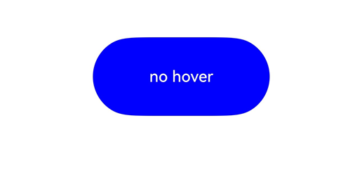
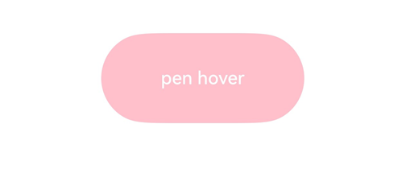

# 悬浮事件
<!--Kit: ArkUI-->
<!--Subsystem: ArkUI-->
<!--Owner: @yihao-lin-->
<!--Designer: @piggyguy-->
<!--Tester: @songyanhong-->
<!--Adviser: @Brilliantry_Rui-->

光标滑动或手写笔在屏幕上悬浮移动扫过组件时触发。

>  **说明：**
>
> - 本模块同时支持ArkTS-Dyn、ArkTS-Sta。
>
> - 从API version 8开始支持。后续版本如有新增内容，则采用上角标单独标记该内容的起始版本。
>
> - 目前支持通过外接鼠标以及触控板触发。部分手写笔<!--RP1--><!--RP1End-->不支持悬浮事件，具体取决于硬件能力。

## onHover

ArkTS-Dyn: onHover(event: (isHover: boolean, event: HoverEvent) => void): T

ArkTS-Sta: onHover(event: ((isHover: boolean, event: HoverEvent) => void) | undefined): this

鼠标或手写笔进入或退出组件时，触发hover事件。

**原子化服务API（仅ArkTS-Dyn）：** 从API version 11开始，该接口支持在原子化服务中使用。

**系统能力：** SystemCapability.ArkUI.ArkUI.Full

**ArkTS-Dyn起始版本：** 8

**ArkTS-Sta起始版本：** 23

**参数：**

| 参数名              | 类型                                | 必填 | 说明                                                         |
| ------------------- | ----------------------------------- | ---- | ------------------------------------------------------------ |
| event  | ArkTS-Dyn: (isHover: boolean, event: [HoverEvent](#hoverevent10对象说明)) => void<br/> ArkTS-Sta: ((isHover: boolean, event: [HoverEvent](#hoverevent10对象说明)) => void) \| undefined  | 是   | 鼠标的状态信息。<br />event表示设置阻塞事件冒泡属性，并获取鼠标或手写笔悬浮的位置坐标，从API version 11开始支持。<br />isHover表示鼠标或手写笔是否悬浮在组件上，进入时为true，&nbsp;离开时为false。<br/>传入undefined时无效果。 |

**返回值：**

| 类型 | 说明 |
| -------- | -------- |
| ArkTS-Dyn: T<br/>ArkTS-Sta: this | 返回当前组件。 |

## onHoverMove<sup>15+</sup>

ArkTS-Dyn: onHoverMove(event: Callback&lt;HoverEvent&gt;): T

ArkTS-Sta: onHoverMove(event: Callback&lt;HoverEvent&gt; | undefined): this

手写笔悬浮于组件上方时触发悬浮移动事件。

**原子化服务API（仅ArkTS-Dyn）：** 从API version 15开始，该接口支持在原子化服务中使用。

**模型约束：** 此接口仅可在Stage模型下使用。

**系统能力：** SystemCapability.ArkUI.ArkUI.Full

**ArkTS-Dyn起始版本：** 15

**ArkTS-Sta起始版本：** 23

**参数：**

| 参数名              | 类型                                | 必填 | 说明                                                         |
| ------------------- | ----------------------------------- | ---- | ------------------------------------------------------------ |
| event | ArkTS-Dyn: Callback\<[HoverEvent](#hoverevent10对象说明)> <br/>ArkTS-Sta: Callback\<[HoverEvent](#hoverevent10对象说明)> \|&nbsp;undefined | 是   |设置阻塞事件冒泡属性，并获取手写笔悬浮的位置坐标。<br/>传入undefined时无效果。         |

**返回值：**

| 类型 | 说明 |
| -------- | -------- |
| ArkTS-Dyn: T<br/>ArkTS-Sta: this | 返回当前组件。 |

## HoverEvent<sup>10+</sup>对象说明

继承于[BaseEvent](ts-gesture-customize-judge.md#baseevent8)。

### 属性

**模型约束：** 此接口仅可在Stage模型下使用。

**系统能力：** SystemCapability.ArkUI.ArkUI.Full

| 名称 | 类型 | 只读 | 可选 | 说明 |
| --------------- | ---------- | ----- | ----- | -------------------- |
| x<sup>15+</sup> |ArkTS-Dyn: number<br/>ArkTS-Sta: double|否|是|鼠标光标或手写笔位置在当前组件为基准的[组件坐标系](../../../ui/arkui-glossary.md#组件坐标系)中的X坐标。<br>单位：vp<br/>取值范围：[0, +∞)<br> **原子化服务API（仅ArkTS-Dyn）：**  从API version 15开始，该接口支持在原子化服务中使用。<br/>**ArkTS-Dyn起始版本：** 15<br/>**ArkTS-Sta起始版本：** 23|
| y<sup>15+</sup> |ArkTS-Dyn: number<br/>ArkTS-Sta: double|否|是|鼠标光标或手写笔位置在当前组件为基准的[组件坐标系](../../../ui/arkui-glossary.md#组件坐标系)中的Y坐标。<br>单位：vp<br/>取值范围：[0, +∞)<br> **原子化服务API（仅ArkTS-Dyn）：**  从API version 15开始，该接口支持在原子化服务中使用。<br/>**ArkTS-Dyn起始版本：** 15<br/>**ArkTS-Sta起始版本：** 23|
| windowX<sup>15+</sup> |ArkTS-Dyn: number<br/>ArkTS-Sta: double|否|是|鼠标光标或手写笔位置在当前应用窗口坐标系中的X坐标。<br>单位：vp<br/>取值范围：[0, +∞)<br> **原子化服务API（仅ArkTS-Dyn）：**  从API version 15开始，该接口支持在原子化服务中使用。<br/>**ArkTS-Dyn起始版本：** 15<br/>**ArkTS-Sta起始版本：** 23|
| windowY<sup>15+</sup> |ArkTS-Dyn: number<br/>ArkTS-Sta: double|否|是|鼠标光标或手写笔位置在当前应用窗口坐标系中的Y坐标。<br>单位：vp<br/>取值范围：[0, +∞)<br> **原子化服务API（仅ArkTS-Dyn）：**  从API version 15开始，该接口支持在原子化服务中使用。<br/>**ArkTS-Dyn起始版本：** 15<br/>**ArkTS-Sta起始版本：** 23|
| displayX<sup>15+</sup> |ArkTS-Dyn: number<br/>ArkTS-Sta: double|否|是|鼠标光标或手写笔位置在当前应用屏幕坐标系中的X坐标。<br>单位：vp<br/>取值范围：[0, +∞)<br> **原子化服务API（仅ArkTS-Dyn）：**  从API version 15开始，该接口支持在原子化服务中使用。<br/>**ArkTS-Dyn起始版本：** 15<br/>**ArkTS-Sta起始版本：** 23|
| displayY<sup>15+</sup> |ArkTS-Dyn: number<br/>ArkTS-Sta: double|否|是|鼠标光标或手写笔位置在当前应用屏幕坐标系中的Y坐标。<br>单位：vp<br/>取值范围：[0, +∞)<br> **原子化服务API（仅ArkTS-Dyn）：**  从API version 15开始，该接口支持在原子化服务中使用。<br/>**ArkTS-Dyn起始版本：** 15<br/>**ArkTS-Sta起始版本：** 23|
| stopPropagation | () => void |否|否| 阻塞[事件冒泡](../../../ui/arkts-interaction-basic-principles.md#事件冒泡)。 <br> **原子化服务API（仅ArkTS-Dyn）：**  从API version 11开始，该接口支持在原子化服务中使用。<br/>**ArkTS模式：** 该接口仅适用于ArkTS-Dyn。<br/>**ArkTS-Dyn起始版本：** 10|
| globalDisplayX<sup>20+</sup> | ArkTS-Dyn: number<br/>ArkTS-Sta: double |否|是| 鼠标光标或手写笔位置在[全局坐标系](../../../windowmanager/window-terminology.md#全局坐标系)中的X坐标。<br/>单位：vp<br/>取值范围：[0, +∞)<br/>**原子化服务API（仅ArkTS-Dyn）：** 从API version 20开始，该接口支持在原子化服务中使用。<br/>**模型约束：** 此接口仅可在Stage模型下使用。<br/>**ArkTS-Dyn起始版本：** 20<br/>**ArkTS-Sta起始版本：** 24 |
| globalDisplayY<sup>20+</sup> | ArkTS-Dyn: number<br/>ArkTS-Sta: double |否|是| 鼠标光标或手写笔位置在[全局坐标系](../../../windowmanager/window-terminology.md#全局坐标系)中的Y坐标。<br/>单位：vp<br/>取值范围：[0, +∞)<br/>**原子化服务API（仅ArkTS-Dyn）：** 从API version 20开始，该接口支持在原子化服务中使用。<br/>**模型约束：** 此接口仅可在Stage模型下使用。<br/>**ArkTS-Dyn起始版本：** 20<br/>**ArkTS-Sta起始版本：** 24 |

### stopPropagation<sup>23+</sup>

stopPropagation(): void

阻塞事件冒泡。

**系统能力：** SystemCapability.ArkUI.ArkUI.Full

**ArkTS模式：** 该接口仅适用于ArkTS-Sta。

**ArkTS-Sta起始版本：** 23

## 示例

### 示例1（使用onHover）

该示例通过按钮设置了悬浮事件[onHover](#onhover)，鼠标悬浮可触发该事件修改按钮颜色。

```ts
// xxx.ets
@Entry
@Component
struct HoverEventExample {
  @State hoverText: string = 'no hover';
  @State color: Color = Color.Blue;

  build() {
    Column({ space: 20 }) {
      Button(this.hoverText, { type: ButtonType.Capsule })
        .width(180).height(80)
        .backgroundColor(this.color)
        .onHover((isHover: boolean, event: HoverEvent) => {
          // 通过onHover事件动态修改按钮在是否有鼠标或手写笔悬浮时的文本内容与背景颜色
          // 通过event.sourceTool区分设备是鼠标还是手写笔
          if (isHover) {
            if (event.sourceTool == SourceTool.Pen) {
              this.hoverText = 'pen hover';
              this.color = Color.Pink;
            } else if (event.sourceTool == SourceTool.MOUSE) {
              this.hoverText = 'mouse hover';
              this.color = Color.Red;
            }
          } else {
            this.hoverText = 'no hover';
            this.color = Color.Blue;
          }
        })
    }.padding({ top: 30 }).width('100%')
  }
}
```

示意图：

未悬浮时的文本内容与背景颜色：

  

手写笔悬浮时改变文本内容与背景颜色：

  

### 示例2（使用onHoverMove）

从API version 15开始，该示例设置了按钮的[onHoverMove](#onhovermove15)事件。当手写笔悬浮在按钮时，UI界面会显示当前手写笔悬浮状的位置。

```ts
// xxx.ets
@Entry
@Component
struct OnHoverMoveEventExample {
  @State hoverMoveText: string = '';

  build() {
    Column({ space: 20 }) {
      Button('onHoverMove', { type: ButtonType.Capsule })
        .width(180).height(80)
        .onHoverMove((event: HoverEvent) => {
          this.hoverMoveText = 'onHoverMove:\nXY = (' + event.x + ', ' + event.y + ')' + 
                               '\nwindowXY = (' + event.windowX + ', ' + event.windowY + ')' +
                               '\ndisplayXY = (' + event.displayX + ', ' + event.displayY + ')';
        })

      Text(this.hoverMoveText)
    }.padding({ top: 30 }).width('100%')
  }
}
```

示意图：

手写笔悬浮在Button组件上时，UI不断刷新笔尖的位置信息：

