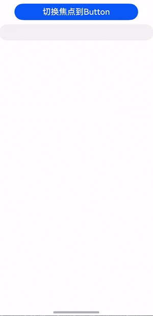

# 键盘判断事件
<!--Kit: ArkUI-->
<!--Subsystem: ArkUI-->
<!--Owner: @tzcurtain-->
<!--Designer: @xiangyuan6-->
<!--Tester: @jiaoaozihao-->
<!--Adviser: @Brilliantry_Rui-->

当组件获得焦点时，获焦组件触发该事件。系统会根据该事件回调函数返回值，判断是否需要键盘。

> **说明：**
>
> 本模块首批接口从API version 24开始支持。后续版本的新增接口，采用上角标单独标记接口的起始版本。

## onNeedSoftkeyboard

onNeedSoftkeyboard(onNeedSoftkeyboardCallback: OnNeedSoftkeyboardCallback | undefined): T

设置组件判断是否需要键盘时触发的回调。主要用于键盘接续场景，当焦点从输入框切换到其他组件时，如果切换后的组件回调函数[OnNeedSoftkeyboardCallback](#onneedsoftkeyboardcallback)的返回值设置为`true`，则表示该组件需要键盘，此时键盘将不会收起，如果返回值设置为`false`，则表示该组件不需要键盘，此时键盘将收起。

对于不能获焦的组件，本接口不生效。

输入框组件使用该接口并将返回值设置为`false`时，点击输入框将不会拉起键盘。

Web组件使用该方法时，如果返回值为`true`，Web组件会判断组件中是否有可编辑节点，如果有可编辑节点才会保留键盘，如果返回值为`false`，无论否有可编辑节点，键盘都不会保留。

XComponent组件使用该方法时，如果返回值为`true`且XComponent组件使用[OH_NativeXComponent_SetNeedSoftKeyboard](../capi-native-interface-xcomponent-h.md#oh_arkui_xcomponent_setneedsoftkeyboard)设置了需要键盘，才会保留键盘，如果返回值为`false`，无论组件如何设置，键盘都不会保留。

当接口返回`true`时，应用的自绘制输入框需要主动[attach](../../apis-ime-kit/js-apis-inputmethod.md#attach15)，建立输入法框架和输入法应用的通信，否则点击键盘会失去响应（失焦时输入法框架和输入法应用的通信会断开）。

**原子化服务API：** 从API version 24开始，该接口支持在原子化服务中使用。

**模型约束：** 此接口仅可在Stage模型下使用。

**系统能力：** SystemCapability.ArkUI.ArkUI.Full

**参数：**

| 参数名                     | 类型                                   | 必填 | 说明                                     |
| -------------------------- | ------------------------------------- | ---- | ---------------------------------------- |
| onNeedSoftkeyboardCallback | [OnNeedSoftkeyboardCallback](#onneedsoftkeyboardcallback) \| undefined | 是 | 事件触发时执行的回调，系统会根据回调的返回值决定是否需要键盘。<br> 设置为undefined时，不会触发回调，输入框类组件行为等同返回true。其他组件行为等同返回false。 |

**返回值：**

| 类型 | 说明 |
| -------- | -------- |
| T | 返回当前组件。 |

## OnNeedSoftkeyboardCallback

OnNeedSoftkeyboardCallback = () => boolean

当绑定该方法的组件判断是否需要键盘时，将触发此回调。

**原子化服务API：** 从API version 24开始，该接口支持在原子化服务中使用。

**模型约束：** 此接口仅可在Stage模型下使用。

**系统能力：** SystemCapability.ArkUI.ArkUI.Full

**返回值：**

| 类型 | 说明 |
| -------- | -------- |
| boolean | 是否需要键盘。<br/>若此回调的返回值为true，则表明该组件需要键盘；返回值为false，则表明该组件不需要键盘。 |

## 示例

### 示例1（设置键盘接续）

该示例通过[onNeedSoftkeyboard](#onneedsoftkeyboard)接口，设置按钮需要键盘。在从输入框拉起键盘后，点击按钮使焦点切换到按钮，此时键盘将不会收起，再次点击输入框可继续输入。

从API version 24开始，新增[onNeedSoftkeyboard](#onneedsoftkeyboard)接口。

```ts
@Entry
@Component
struct Index {
  build() {
    Column() {
      Button('切换焦点到Button')
        .onClick(() => {
          this.getUIContext().getFocusController().requestFocus('Button')
        })
        .key('Button')
        .fontSize(20)
        .width('80%')
        .margin('10')
        .onNeedSoftkeyboard((): boolean => {
          return true;
        })
      TextInput()
        .key('TextInput1')
    }
    .height('100%')
    .width('100%')
  }
}
```

 
