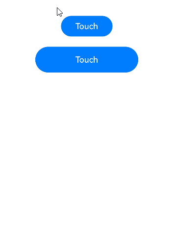
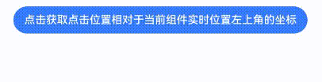

# 触摸事件
<!--Kit: ArkUI-->
<!--Subsystem: ArkUI-->
<!--Owner: @yihao-lin-->
<!--Designer: @piggyguy-->
<!--Tester: @songyanhong-->
<!--Adviser: @Brilliantry_Rui-->

由手指、手写笔或鼠标左键在组件上按下、滑动或抬起时触发。

> **说明：**
>
> - 本模块首批接口从API version 7开始支持。后续版本的新增接口，采用上角标单独标记接口的起始版本。
>
> - 事件分发可参考[事件交互流程](../../../ui/arkts-interaction-basic-principles.md#事件交互流程)，手势事件处理流程可参考[多层级手势事件](../../../ui/arkts-gesture-events-multi-level-gesture.md)。
>
> - 如需绑定手势事件可参考[绑定手势事件](./ts-gesture-settings.md)。

## onTouch

onTouch(event: (event: TouchEvent) => void): T

手指触摸动作触发该回调。触摸事件默认[冒泡](../../../ui/arkts-interaction-basic-principles.md#事件冒泡)，会被多个组件消费，如果需阻止冒泡，可参考[TouchEvent](#touchevent对象说明)的stopPropagation方法。鼠标左键按下时，对应的事件也会转换成触摸事件并触发该回调。

**原子化服务API：** 从API version 11开始，该接口支持在原子化服务中使用。

**系统能力：** SystemCapability.ArkUI.ArkUI.Full

**参数：**

| 参数名 | 类型                              | 必填 | 说明                 |
| ------ | --------------------------------- | ---- | -------------------- |
| event  | (event: [TouchEvent](#touchevent对象说明)) => void | 是   | 获得TouchEvent对象。 |

**返回值：**

| 类型 | 说明 |
| -------- | -------- |
| T | 返回当前组件。 |

## TouchEvent对象说明

继承于[BaseEvent](ts-gesture-customize-judge.md#baseevent8)。在非事件注入场景下，changedTouches是按屏幕刷新率重采样的点，而touches是按器件刷新率上报的点，因此changedTouches与touches的数据可能不同。

**系统能力：** SystemCapability.ArkUI.ArkUI.Full

| 名称                | 类型       | 只读 | 可选   | 说明                        |
| ------------------- | -----------|------|-------- | -------------------------- |
| type                | [TouchType](ts-appendix-enums.md#touchtype)      | 否 | 否 | 触摸事件的类型。<br/>**原子化服务API：** 从API version 11开始，该接口支持在原子化服务中使用。     |
| touches             | [TouchObject](#touchobject)[] | 否 | 否 | 全部屏幕触点（多指）的信息，每个元素代表一个触点。在使用该属性时，需要校验是否为空。<br/>**原子化服务API：** 从API version 11开始，该接口支持在原子化服务中使用。      |
| changedTouches      | [TouchObject](#touchobject)[] | 否 | 否 | 发生变化而产生事件的手指信息。在使用该属性时，需要校验是否为空。<br/>**原子化服务API：** 从API version 11开始，该接口支持在原子化服务中使用。 |
| stopPropagation      | () => void | 否 | 否 | 阻塞[事件冒泡](../../../ui/arkts-interaction-basic-principles.md#事件冒泡)。<br/>**原子化服务API：** 从API version 11开始，该接口支持在原子化服务中使用。 |
| preventDefault<sup>12+</sup>      | () => void | 否 | 否 |  阻止默认事件。<br/> **说明：** 该接口仅支持部分组件使用，当前支持组件：[Hyperlink](ts-container-hyperlink.md)，不支持的组件在使用时会抛出异常。暂不支持异步调用和提供Modifier接口。<br/> **原子化服务API：** 从API version 12开始，该接口支持在原子化服务中使用。<br/>**模型约束：** 此接口仅可在Stage模型下使用。 |
| eventHandleId<sup>24+</sup> | number | 否 | 是 | 用于事件处理的唯一标识。<br/> 取值范围：[0, +∞)<br/> **说明：** 在使用[postInputEventWithStrategy](../js-apis-arkui-builderNode.md#postinputeventwithstrategy24)接口分发事件时会使用该字段，事件每分发一次字段会增加100000。<br/> 多次使用相同的eventHandleId进行事件分发将导致事件响应异常。仅在构造事件的时候需要对此字段赋值，其余情况开发者无需处理。<br/>**原子化服务API：** 从API version 24开始，该接口支持在原子化服务中使用。 <br/>**模型约束：** 此接口仅可在Stage模型下使用。 |

**错误码：**

以下错误码的详细介绍请参见[交互事件错误码](../errorcode-event.md)。

| 错误码ID   | 错误信息 |
| --------- | ------- |
| 100017       | Component does not support prevent function. |

### getHistoricalPoints<sup>10+</sup>

getHistoricalPoints(): Array&lt;HistoricalPoint&gt;

获取当前帧的所有历史点。不同设备每帧的触摸事件频率不同，且该接口仅能在[TouchEvent](#touchevent对象说明)中调用，用于获取触发[onTouch](#ontouch)时当前帧历史点的相关信息。[onTouch](#ontouch)一帧通常只会调用一次，如果当前帧收到的[TouchEvent](#touchevent对象说明)数目大于1，会将该帧最后一个点通过[onTouch](#ontouch)返回，其余点作为历史点。如果多指在同一帧上报事件，可能触发多次onTouch。

**原子化服务API：** 从API version 11开始，该接口支持在原子化服务中使用。

**模型约束：** 此接口仅可在Stage模型下使用。

**系统能力：** SystemCapability.ArkUI.ArkUI.Full

**返回值：**

| 类型     | 说明                      |
| ------ | ----------------------- |
| Array&lt;[HistoricalPoint](#historicalpoint10对象说明)&gt; | 由历史点组成的数组。 |


## TouchObject

### 属性

**系统能力：** SystemCapability.ArkUI.ArkUI.Full

| 名称    | 类型                              | 只读 | 可选          | 说明                                  |
| ------- | ----------------------------------|-----| -------------- | ------------------------------------- |
| type    | [TouchType](ts-appendix-enums.md#touchtype) | 否 | 否 | 触摸事件的类型。<br/>**原子化服务API：** 从API version 11开始，该接口支持在原子化服务中使用。                      |
| id      | number                                      | 否 | 否 | 手指唯一标识符。<br/>**原子化服务API：** 从API version 11开始，该接口支持在原子化服务中使用。                      |
| x       | number                                      | 否 | 否 | 触摸点在事件响应组件为基准的[组件坐标系](../../../ui/arkui-glossary.md#组件坐标系)中的X坐标。<br/>单位：vp<br/>**原子化服务API：** 从API version 11开始，该接口支持在原子化服务中使用。<br/>**模型约束：** 此接口仅可在Stage模型下使用。 |
| y       | number                                      | 否 | 否 | 触摸点在事件响应组件为基准的[组件坐标系](../../../ui/arkui-glossary.md#组件坐标系)中的Y坐标。<br/>单位：vp<br/>**原子化服务API：** 从API version 11开始，该接口支持在原子化服务中使用。<br/>**模型约束：** 此接口仅可在Stage模型下使用。 |
| windowX<sup>10+</sup>  | number                       | 否 | 否 | 触摸点在当前应用窗口坐标系中的X坐标。<br/>单位：vp<br/>**原子化服务API：** 从API version 11开始，该接口支持在原子化服务中使用。<br/>**模型约束：** 此接口仅可在Stage模型下使用。   |
| windowY<sup>10+</sup>  | number                       | 否 | 否 | 触摸点在当前应用窗口坐标系中的Y坐标。<br/>单位：vp<br/>**原子化服务API：** 从API version 11开始，该接口支持在原子化服务中使用。<br/>**模型约束：** 此接口仅可在Stage模型下使用。   |
| displayX<sup>10+</sup> | number                       | 否 | 否 | 触摸点在当前应用屏幕坐标系中的X坐标。<br/>单位：vp<br/>**原子化服务API：** 从API version 11开始，该接口支持在原子化服务中使用。   |
| displayY<sup>10+</sup> | number                       | 否 | 否 | 触摸点在当前应用屏幕坐标系中的Y坐标。<br/>单位：vp<br/>**原子化服务API：** 从API version 11开始，该接口支持在原子化服务中使用。   |
| screenX<sup>(deprecated)</sup> | number               | 否 | 否 | 触摸点在当前应用窗口坐标系中的X坐标。<br/>单位：vp <br>**说明：** 从API version 7开始支持，从API version 10开始废弃，建议使用windowX替代。   |
| screenY<sup>(deprecated)</sup> | number               | 否 | 否 | 触摸点在当前应用窗口坐标系中的Y坐标。<br/>单位：vp <br>**说明：** 从API version 7开始支持，从API version 10开始废弃，建议使用windowY替代。   |
| pressedTime<sup>15+</sup> | number | 否 | 是 | 当前手指按下的时间。<br>单位：ns<br />**原子化服务API：** 从API version 15开始，该接口支持在原子化服务中使用。<br>**模型约束：** 此接口仅可在Stage模型下使用。 |
| pressure<sup>15+</sup> | number | 否 | 是 | 当前手指按压的压力值。<br/>取值范围：[0,65535)，压力越大，值越大。<br />**原子化服务API：** 从API version 15开始，该接口支持在原子化服务中使用。<br/>**模型约束：** 此接口仅可在Stage模型下使用。 |
| width<sup>15+</sup> | number | 否 | 是 | 当前手指按压区域的宽度。<br />单位：vp<br/>**原子化服务API：** 从API version 15开始，该接口支持在原子化服务中使用。<br/>**模型约束：** 此接口仅可在Stage模型下使用。 |
| height<sup>15+</sup> | number | 否 | 是 | 当前手指按压区域的高度。<br />单位：vp<br/>**原子化服务API：** 从API version 15开始，该接口支持在原子化服务中使用。<br/>**模型约束：** 此接口仅可在Stage模型下使用。 |
| hand<sup>15+</sup> | [InteractionHand](./ts-appendix-enums.md#interactionhand15) | 否 | 是 | 表示事件是由左手点击还是右手点击触发。<br />**原子化服务API：** 从API version 15开始，该接口支持在原子化服务中使用。<br/>**模型约束：** 此接口仅可在Stage模型下使用。 |
| globalDisplayX<sup>20+</sup> | number | 否 | 是 | 触摸点在[全局坐标系](../../../windowmanager/window-terminology.md#global-coordinate-system全局坐标系)中的X坐标。<br/>单位：vp<br/>取值范围：(-∞, +∞)<br/>**原子化服务API：** 从API version 20开始，该接口支持在原子化服务中使用。<br/>**模型约束：** 此接口仅可在Stage模型下使用。 |
| globalDisplayY<sup>20+</sup> | number | 否 | 是 | 触摸点在[全局坐标系](../../../windowmanager/window-terminology.md#global-coordinate-system全局坐标系)中的Y坐标。<br/>单位：vp<br/>取值范围：(-∞, +∞)<br/>**原子化服务API：** 从API version 20开始，该接口支持在原子化服务中使用。<br/>**模型约束：** 此接口仅可在Stage模型下使用。 |

### getCurrentLocalPosition

getCurrentLocalPosition?(): Coordinate2D

获取触摸位置相对于当前组件实时位置的左上角坐标。

**起始版本：** 26.0.0

**模型约束：** 此接口仅可在Stage模型下使用。

**原子化服务API：** 从API版本26.0.0开始，该接口支持在原子化服务中使用。

**系统能力：** SystemCapability.ArkUI.ArkUI.Full

**返回值：** 

| 类型    | 说明                                                  |
| ------- | ----------------------------------------------------- |
| [Coordinate2D](ts-types.md#coordinate2d) | 触摸位置相对于当前组件实时位置的左上角坐标。 |

## HistoricalPoint<sup>10+</sup>对象说明

历史点信息。

**原子化服务API：** 从API version 11开始，该接口支持在原子化服务中使用。

**模型约束：** 此接口仅可在Stage模型下使用。

**系统能力：** SystemCapability.ArkUI.ArkUI.Full

| 名称         | 类型                        | 只读 | 可选       | 说明                                                                         |
| ----------- | -----------------------------|------ | ----------|------------------------------------------------------------------- |
| touchObject | [TouchObject](#touchobject)  | 否 | 否 | 历史点对应触摸事件的基础信息。                                                   |
| size        | number                              | 否 | 否 | 历史点对应触摸事件中手指与屏幕的触摸区域大小。<br/>默认值：0                                     |
| force       | number                              | 否 | 否 | 历史点对应触摸事件的压力大小。<br/>默认值：0<br/>取值范围：[0,65535)，压力越大，值越大。|
| timestamp   | number                              | 否 | 否 | 历史点对应触摸事件的时间戳，表示触发事件时距离系统启动的时间间隔。<br>单位：ns           |

## 示例

### 示例1（获取触摸事件相关参数）

该示例中，按钮设置触摸事件，在点击按钮时可获取事件的相关参数。

```ts
// xxx.ets
@Entry
@Component
struct TouchExample {
  @State text: string = '';
  @State eventType: string = '';

  build() {
    Column() {
      Button('Touch').height(40).width(100)
        .onTouch((event?: TouchEvent) => {
          if (event && event.sourceTool === SourceTool.Finger) {
            if (event.type === TouchType.Down) {
              this.eventType = 'Down';
            }
            if (event.type === TouchType.Up) {
              this.eventType = 'Up';
            }
            if (event.type === TouchType.Move) {
              this.eventType = 'Move';
            }
            // 1.手指按住屏幕同时点击Home键返回桌面，此时会触发Cancel
            // 2.折叠屏手机，应用在按住屏幕的情况下折叠手机切换到外屏，此时会触发Cancel
            if (event.type === TouchType.Cancel) {
              this.eventType = 'Cancel';
            }
            if (event.touches) {
              this.text = 'TouchType:' + this.eventType
                + '\nDistance between touch point and touch element:'
                + '\n  x: ' + event.touches[0].x + '\n  y: ' + event.touches[0].y
                + '\n  width: ' + event.touches[0].width + '\n  height: ' + event.touches[0].height
                + '\n  pressedTime: ' + event.touches[0].pressedTime
                + '\n  pressure: ' + event.touches[0].pressure
                + '\nComponent globalPos:'
                + '\n  x: ' + event.target.area.globalPosition.x + '\n  y: ' + event.target.area.globalPosition.y
                + '\n  width: ' + event.target.area.width + '\n  height: ' + event.target.area.height
                + '\ntargetDisplayId: ' + event.targetDisplayId;
            }
          }
        })
      Button('Touch').height(50).width(200).margin(20)
        .onTouch((event?: TouchEvent) => {
          if (event) {
            if (event.type === TouchType.Down) {
              this.eventType = 'Down';
            }
            if (event.type === TouchType.Up) {
              this.eventType = 'Up';
            }
            if (event.type === TouchType.Move) {
              this.eventType = 'Move';
            }
            // 1.手指按住屏幕同时点击Home键返回桌面，此时会触发Cancel
            // 2.折叠屏手机，应用在按住屏幕的情况下折叠手机切换到外屏，此时会触发Cancel
            if (event.type === TouchType.Cancel) {
              this.eventType = 'Cancel';
            }
            if (event.touches) {
              this.text = 'TouchType:' + this.eventType
                + '\nDistance between touch point and touch element:'
                + '\n  x: ' + event.touches[0].x + '\n  y: ' + event.touches[0].y
                + '\n  width: ' + event.touches[0].width + '\n  height: ' + event.touches[0].height
                + '\n  pressedTime: ' + event.touches[0].pressedTime
                + '\n  pressure: ' + event.touches[0].pressure
                + '\nComponent globalPos:'
                + '\n  x: ' + event.target.area.globalPosition.x + '\n  y: ' + event.target.area.globalPosition.y
                + '\n  width: ' + event.target.area.width + '\n  height: ' + event.target.area.height
                + '\ntargetDisplayId: ' + event.targetDisplayId;
            }
          }
        })
      Text(this.text)
    }.width('100%').padding(30)
  }
}
```



### 示例2（获取组件实时位置）

该示例通过[getCurrentLocalPosition](#getcurrentlocalposition)方法获取当前组件基于其实时位置的左上角坐标。

从API版本26.0.0开始，新增支持getCurrentLocalPosition接口。

```ts
// xxx.ets
@Entry
@Component
struct GetCurrentLocalPositionExample {
  @State positionText: string = '';
  @State textOffsetY: number = 0;

  build() {
    Column() {
      Button('点击获取点击位置相对于当前组件实时位置左上角的坐标').translate({ y: this.textOffsetY })
        .onTouch((event?: TouchEvent) => {
          if (event) {
            this.textOffsetY = -200;
            setTimeout(() => {
              let localPos: Coordinate2D | undefined = event.touches[0].getCurrentLocalPosition?.();
              this.positionText = `相对于当前组件实时位置左上角的坐标:\n  x: ${localPos?.x}\n  y: ${localPos?.y}`;
            }, 2000);
          }
        })

      Text(this.positionText)
    }.width('100%')
  }
}
```


