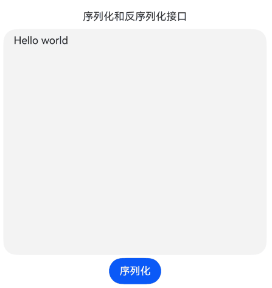

# 属性字符串 (系统接口)
<!--Kit: ArkUI-->
<!--Subsystem: ArkUI-->
<!--Owner: @hddgzw-->
<!--Designer: @xiangyuan6-->
<!--Tester: @jiaoaozihao-->
<!--Adviser: @Brilliantry_Rui-->

属性字符串是用于灵活应用和管理文本样式的对象，支持文本样式的序列化存储、跨进程传递和自定义样式扩展等功能。该对象可通过TextController中的[setStyledString](ts-basic-components-text.md#setstyledstring12)方法与Text组件绑定，也可通过RichEditorStyledStringController中的[setStyledString](ts-basic-components-richeditor.md#setstyledstring12)方法与RichEditor组件绑定，适用于需要在应用中持久化或跨组件共享复杂文本样式的场景。

>  **说明：**
>
> - 该组件从API version 13开始支持。后续版本的新增接口，采用上角标单独标记接口的起始版本。
>
> - 本模块接口仅可在Stage模型下使用。
>
> - 当前页面仅包含本模块的系统接口，其他公开接口参见[属性字符串](ts-universal-styled-string.md)。

## StyledString

### marshalling

static marshalling(styledString: StyledString): ArrayBuffer

序列化属性字符串。适用于将属性字符串持久化存储或跨进程、跨组件传递时使用。

**系统接口：** 此接口为系统接口。

**系统能力：** SystemCapability.ArkUI.ArkUI.Full

**参数：**

| 参数名 | 类型 | 必填 | 说明 |
| ----- | ----- | ---- | ---- |
| styledString | [StyledString](ts-universal-styled-string.md#styledstring) | 是  | 要序列化的属性字符串对象，包含文本内容及样式信息。 |

**返回值：**

| 类型              |说明       |
| ------- | --------------------------------- | 
| ArrayBuffer | 序列化后的buffer信息。<br>**说明：** <br>目前支持文本和图片。 |

### marshalling<sup>19+</sup>

static marshalling(styledString: StyledString, callback: StyledStringMarshallCallback): ArrayBuffer

序列化属性字符串，通过定义回调来序列化属性字符串的[StyledStringMarshallingValue](#styledstringmarshallingvalue19)。

当属性字符串包含UserDataSpan等自定义样式，需要自定义序列化逻辑时使用此方法；不包含自定义样式时使用基础版marshalling方法即可。

**系统接口：** 此接口为系统接口。

**系统能力：** SystemCapability.ArkUI.ArkUI.Full

**参数：**

| 参数名 | 类型 | 必填 | 说明 |
| ----- | ----- | ---- | ---- |
| styledString | [StyledString](ts-universal-styled-string.md#styledstring) | 是  | 待序列化的属性字符串对象，包含文本内容及样式信息。 |
| callback | [StyledStringMarshallCallback](#styledstringmarshallcallback19) | 是 | 用于序列化[StyledStringMarshallingValue](#styledstringmarshallingvalue19)的回调函数。回调函数签名：(marshallableVal: StyledStringMarshallingValue) => ArrayBuffer，其中marshallableVal为需要序列化的对象，返回值为序列化后的ArrayBuffer数据。 |

**返回值：**

| 类型              |说明       |
| ------- | --------------------------------- | 
| ArrayBuffer | 序列化后的buffer信息。<br>**说明：** <br>目前支持文本和图片。 |

### unmarshalling

static unmarshalling(buffer: ArrayBuffer): Promise\<StyledString>

反序列化后得到属性字符串。

适用于从已序列化的数据中恢复属性字符串时使用，如从本地存储读取或接收跨进程传递的数据后恢复属性字符串。

**系统接口：** 此接口为系统接口。

**系统能力：** SystemCapability.ArkUI.ArkUI.Full

**参数：**

| 参数名 | 类型 | 必填 | 说明 |
| ----- | ----- | ---- | ---- |
| buffer | ArrayBuffer | 是  | 属性字符串序列化后的数据。 |

**返回值：**

| 类型                             | 说明                  |
| -------------------------------- | --------------------- |
| Promise\<[StyledString](ts-universal-styled-string.md#styledstring)> |Promise对象，成功时返回属性字符串，失败时返回错误码，详见错误码部分。<br>**说明：** <br>目前支持文本和图片。 |

**错误码**：

以下错误码详细介绍请参考[通用错误码](../../errorcode-universal.md)和[属性字符串错误码](../errorcode-styled-string.md)。

| 错误码ID | 错误信息 |
| ------- | -------- |
| 401      | Parameter error. Possible causes: 1. Mandatory parameters are left unspecified; 2.Incorrect parameters types; 3. Parameter verification failed.   |
| 170002 | Styled string decode error. |

### unmarshalling<sup>19+</sup>

static unmarshalling(buffer: ArrayBuffer, callback: StyledStringUnmarshallCallback): Promise\<StyledString>

反序列化后得到属性字符串，通过定义回调来反序列化[StyledStringMarshallingValue](#styledstringmarshallingvalue19)。

当需要从序列化数据中恢复包含UserDataSpan等自定义样式的属性字符串时使用此方法；恢复不含自定义样式的属性字符串时使用基础版unmarshalling方法即可。

**系统接口：** 此接口为系统接口。

**系统能力：** SystemCapability.ArkUI.ArkUI.Full

**参数：**

| 参数名 | 类型 | 必填 | 说明 |
| ----- | ----- | ---- | ---- |
| buffer | ArrayBuffer | 是  | 属性字符串序列化后的数据。 |
| callback | [StyledStringUnmarshallCallback](#styledstringunmarshallcallback19) | 是 | 用于反序列化ArrayBuffer的回调函数。回调函数签名：(buf: ArrayBuffer) => StyledStringMarshallingValue，其中buf为序列化后的数据，返回值为反序列化得到的StyledStringMarshallingValue对象。 |

**返回值：**

| 类型                             | 说明                  |
| -------------------------------- | --------------------- |
| Promise\<[StyledString](ts-universal-styled-string.md#styledstring)> |Promise对象，成功时返回属性字符串，失败时返回错误码，详见错误码部分。<br>**说明：** <br>目前支持文本和图片。 |

**错误码**：

以下错误码详细介绍请参考[通用错误码](../../errorcode-universal.md)和[属性字符串错误码](../errorcode-styled-string.md)。

| 错误码ID | 错误信息 |
| ------- | -------- |
| 401      | Parameter error. Possible causes: 1. Mandatory parameters are left unspecified; 2.Incorrect parameters types; 3. Parameter verification failed.   |
| 170002 | Styled string decode error. |

## StyledStringMarshallingValue<sup>19+</sup>

type StyledStringMarshallingValue = UserDataSpan

属性字符串自定义序列化对象类型，需要开发者定义序列化和反序列化的方式。

**系统接口：** 此接口为系统接口。

**系统能力：** SystemCapability.ArkUI.ArkUI.Full

| 类型  | 说明   |
| ------ | ---------- |
| [UserDataSpan](ts-universal-styled-string.md#userdataspan) | UserDataSpan自定义数据片段。 |

## StyledStringMarshallCallback<sup>19+</sup>

type StyledStringMarshallCallback = (marshallableVal: StyledStringMarshallingValue) => ArrayBuffer

属性字符串[StyledStringMarshallingValue](#styledstringmarshallingvalue19)序列化回调类型。

**系统接口：** 此接口为系统接口。

**系统能力：** SystemCapability.ArkUI.ArkUI.Full

**参数：**

| 参数名  | 类型   | 必填 | 说明                          |
| ------- | ------ | ---- | --------------------------- |
| marshallableVal | [StyledStringMarshallingValue](#styledstringmarshallingvalue19)| 是 | 属性字符串中需要自定义序列化的UserDataSpan对象。开发者在回调函数中根据此参数的类型，选择对应的序列化接口将其转换为ArrayBuffer。 |

**返回值：**

| 类型                             | 说明                  |
| -------------------------------- | --------------------- |
| ArrayBuffer | [StyledStringMarshallingValue](#styledstringmarshallingvalue19)序列化后的数据。|

## StyledStringUnmarshallCallback<sup>19+</sup>

type StyledStringUnmarshallCallback = (buf: ArrayBuffer) => StyledStringMarshallingValue

属性字符串反序列化ArrayBuffer得到[StyledStringMarshallingValue](#styledstringmarshallingvalue19)回调类型。

**系统接口：** 此接口为系统接口。

**系统能力：** SystemCapability.ArkUI.ArkUI.Full

**参数：**

| 参数名  | 类型   | 必填 | 说明                          |
| ------- | ------ | ---- | --------------------------- |
| buf | ArrayBuffer | 是 | [StyledStringMarshallingValue](#styledstringmarshallingvalue19)序列化后的数据。 |

**返回值：**

| 类型                             | 说明                  |
| -------------------------------- | --------------------- |
| [StyledStringMarshallingValue](#styledstringmarshallingvalue19) | 反序列化得到的自定义数据片段对象，用于恢复用户自定义的样式数据。|

## 示例

### 示例1 (属性字符串序列化和反序列化)

该示例通过marshalling、unmarshalling方法实现了属性字符串序列化和反序列化的功能。

```ts
// xxx.ets
import { LengthMetrics } from '@kit.ArkUI';

@Entry
@Component
struct Index {
  @State textTitle: string = '序列化和反序列化接口';
  @State textResult: string = 'Hello world';
  @State serializeStr: string = '序列化';
  @State flag: boolean = false;
  private textAreaController: TextAreaController = new TextAreaController();
  private buff: Uint8Array = new Uint8Array();
  fontStyle: TextStyle = new TextStyle({
    fontWeight: FontWeight.Lighter,
    fontFamily: 'HarmonyOS Sans',
    fontColor: Color.Green,
    fontSize: LengthMetrics.vp(30),
    fontStyle: FontStyle.Normal
  });
  // 创建属性字符串对象
  styledString: StyledString = new StyledString('Hello world',
    [{
      start: 0,
      length: 11,
      styledKey: StyledStringKey.FONT,
      styledValue: this.fontStyle
    }]);

  @Builder
  controllableBuild() {
    Column() {
      TextArea({
        text: this.textResult,
        controller: this.textAreaController
      }).width('95%').height('40%').enableKeyboardOnFocus(false)

      Button(this.serializeStr)
        .margin(5)
        .onClick(async () => {
          this.flag = !this.flag;
          if (!this.flag) {
            console.info('Debug: 反序列化');
            // 反序列化ArrayBuffer，恢复属性字符串对象
            let styles: StyledString = await StyledString.unmarshalling(this.buff.buffer);
            this.textTitle = '调用unmarshalling接口后，反序列化的结果显示：';
            if (styles == undefined) {
              console.error('Debug: styledString 获取失败！！！');
              return;
            }
            this.textResult = styles.getString();
            console.info('Debug: this.textResult = ' + this.textResult);
            let stylesArr = styles.getStyles(0, this.textResult.length, StyledStringKey.FONT);
            console.info('Debug: stylesArr.length = ' + stylesArr.length);
            for (let i = 0; i < stylesArr.length; ++i) {
              console.info('Debug: style.start = ' + stylesArr[i].start);
              console.info('Debug: style.length = ' + stylesArr[i].length);
              console.info('Debug: style.styledKey = ' + stylesArr[i].styledKey);
              let font = stylesArr[i].styledValue as TextStyle;
              console.info('Debug: style.fontColor = ' + font.fontColor);
              console.info('Debug: style.fontSize = ' + font.fontSize);
              console.info('Debug: style.fontFamily = ' + font.fontFamily);
              console.info('Debug: style.fontStyle = ' + font.fontStyle);
            }
            let subStr = styles.subStyledString(0, 2);
            console.info('Debug: subStr = ' + subStr.getString());
            this.serializeStr = '序列化';
          } else {
            console.info('Debug: 序列化');
            // 序列化属性字符串，返回ArrayBuffer用于存储或传递
            let resultBuffer = StyledString.marshalling(this.styledString);
            this.buff = new Uint8Array(resultBuffer);
            this.textTitle = '调用marshalling接口后，序列化的结果显示：';
            this.textResult = this.buff.toString();
            console.info('Debug: buff = ' + this.buff.toString());
            this.serializeStr = '反序列化';
          }
        })
    }.margin(10)
  }

  build() {
    Column() {
      Blank().margin(30)
      Text(this.textTitle)
      this.controllableBuild()
    }
  }
}
```



### 示例2 (带UserDataSpan的属性字符串序列化和反序列化)

该示例通过marshalling、unmarshalling函数实现了属性字符串及其UserDataSpan序列化和反序列化的功能。

```ts
enum MyUserDataType {
  TYPE1 = 0,
  TYPE2
}

class MyUserData extends UserDataSpan {
  constructor() {
    super();
  }

  marshalling() {
    console.info('MyUserData marshalling...');
    const text = 'MyUserData1';
    const buffer = new ArrayBuffer(text.length + 1);
    const uint8View = new Uint8Array(buffer);
    // 写入类型
    uint8View[0] = MyUserDataType.TYPE1;
    for (let i = 0; i < text.length; i++) {
      uint8View[i + 1] = text.charCodeAt(i);
    }
    return uint8View.buffer;
  }

  unmarshalling() {
    console.info('MyUserData unmarshalling...');
    return new MyUserData();
  }
}

class MyUserData2 extends UserDataSpan {
  marshalling() {
    console.info('MyUserData2 marshalling...');
    const text = 'MyUserData2';
    const buffer = new ArrayBuffer(text.length + 1);
    const uint8View = new Uint8Array(buffer);
    uint8View[0] = MyUserDataType.TYPE2;
    for (let i = 0; i < text.length; i++) {
      uint8View[i + 1] = text.charCodeAt(i);
    }
    return uint8View.buffer;
  }

  unmarshalling() {
    console.info('MyUserData2 unmarshalling...');
    return new MyUserData2();
  }
}

@Entry
@Component
struct MarshallExample1 {
  controller: TextController = new TextController();

  build() {
    Column() {
      Text(undefined, { controller: this.controller })
      Button('Marshall&UnMarshall')
        .onClick(async () => {
          let myData = new MyUserData();
          let myData2 = new MyUserData2();
          let myStyledString = new MutableStyledString('12345', [{
            start: 0,
            length: 3,
            styledKey: StyledStringKey.USER_DATA,
            styledValue: myData
          }, {
            start: 3,
            length: 1,
            styledKey: StyledStringKey.USER_DATA,
            styledValue: myData2
          }]);

          let buffer = StyledString.marshalling(myStyledString, (marshallingValue: StyledStringMarshallingValue) => {
            // 根据UserDataSpan的具体类型，调用对应的序列化方法
            if (marshallingValue instanceof MyUserData) {
              console.info('StyledString.marshalling MyUserData');
              return marshallingValue.marshalling();
            } else if (marshallingValue instanceof MyUserData2) {
              console.info('StyledString.marshalling MyUserData2');
              return marshallingValue.marshalling();
            }
            console.info('StyledString.marshalling default');
            return new ArrayBuffer(10);
          });

          let newStyledString = await StyledString.unmarshalling(buffer, (value: ArrayBuffer) => {
            // 从buffer中读取类型标识，根据类型调用对应的反序列化方法
            const uint8View = new Uint8Array(value);
            let type = uint8View[0];
            console.info('unmarshalling length:' + uint8View.length);
            if (type == MyUserDataType.TYPE1) {
              console.info('unmarshalling type1:' + type);
              let myUserData = new MyUserData();
              return myUserData.unmarshalling();
            } else if (type == MyUserDataType.TYPE2) {
              console.info('unmarshalling type2:' + type);
              let myUserData = new MyUserData2();
              return myUserData.unmarshalling();
            }
            return new MyUserData();
          });
          if (newStyledString == undefined) {
            console.error('newStyledString 获取失败！');
            return;
          }
          this.controller.setStyledString(newStyledString);
        })
        .fontSize(20)
        .margin(10)
    }
    .justifyContent(FlexAlign.Center)
    .width('100%')
    .height('100%')
  }
}
```

