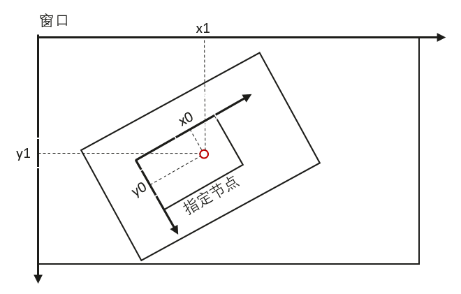
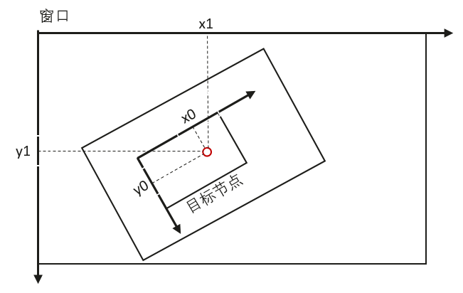

# native_node.h
<!--Kit: ArkUI-->
<!--Subsystem: ArkUI-->
<!--Owner: @piggyguy; @wangyang2022-->
<!--Designer: @piggyguy; @wangyang2022-->
<!--Tester: @fredyuan912-->
<!--Adviser: @Brilliantry_Rui-->

## 概述

提供NativeNode接口的类型定义。

**引用文件：** <arkui/native_node.h>

**库：** libace_ndk.z.so

**系统能力：** SystemCapability.ArkUI.ArkUI.Full

**起始版本：** 12

**相关模块：** [ArkUI_NativeModule](capi-arkui-nativemodule.md)

**相关示例：** <!--RP1-->[native_node_sample](https://gitcode.com/openharmony/applications_app_samples/tree/master/code/DocsSample/ArkUISample/native_node_sample)<!--RP1End-->

## 汇总

### 结构体

| 名称 | typedef关键字 | 描述                                                                           |
| -- | -- |------------------------------------------------------------------------------|
| [ArkUI_AttributeItem](capi-arkui-nativemodule-arkui-attributeitem.md) | ArkUI_AttributeItem | 定义[setAttribute](capi-arkui-nativemodule-arkui-nativenodeapi-1.md#setattribute)函数通用入参结构。 |
| [ArkUI_NodeComponentEvent](capi-arkui-nativemodule-arkui-nodecomponentevent.md) | ArkUI_NodeComponentEvent | 定义组件回调事件的参数类型。                                                               |
| [ArkUI_StringAsyncEvent](capi-arkui-nativemodule-arkui-stringasyncevent.md) | ArkUI_StringAsyncEvent | 定义组件回调事件使用字符串参数的类型。                                                          |
| [ArkUI_TextChangeEvent](capi-arkui-nativemodule-arkui-textchangeevent.md) | ArkUI_TextChangeEvent | 定义组件事件的混合类型数据。                                                               |
| [ArkUI_NativeNodeAPI_1](capi-arkui-nativemodule-arkui-nativenodeapi-1.md) | ArkUI_NativeNodeAPI_1 | ArkUI提供的Native侧Node类型接口集合。Node模块相关接口需要在主线程上调用。                               |
| [OH_ArkUI_TextEditorChangeEvent](capi-arkui-nativemodule-oh-arkui-texteditorchangeevent.md) | OH_ArkUI_TextEditorChangeEvent | 定义TextEditor组件文本内容变化事件的结构体。 |
| [ArkUI_NodeEvent](capi-arkui-nativemodule-arkui-nodeevent.md) | ArkUI_NodeEvent | 定义组件事件的通用结构类型。                                                               |
| [ArkUI_NodeCustomEvent](capi-arkui-nativemodule-arkui-nodecustomevent.md) | ArkUI_NodeCustomEvent | 定义自定义组件事件的通用结构类型。                                                            |
| [ArkUI_NodeAdapter*](capi-arkui-nativemodule-arkui-nodeadapter8h.md) | ArkUI_NodeAdapterHandle | 定义组件适配器对象，用于滚动类组件的元素懒加载。                                                     |
| [ArkUI_NodeAdapterEvent](capi-arkui-nativemodule-arkui-nodeadapterevent.md) | ArkUI_NodeAdapterEvent | 定义适配器事件对象。                                                                   |
| [ArkUI_NodeContentEvent](capi-arkui-nativemodule-arkui-nodecontentevent.md) | ArkUI_NodeContentEvent | 定义NodeContent事件的通用结构类型。                                                      |

### 枚举

| 名称 | typedef关键字 | 描述 |
| -- | -- | -- |
| [ArkUI_NodeType](#arkui_nodetype) | ArkUI_NodeType | 提供ArkUI在Native侧可创建组件类型。 |
| [ArkUI_NodeAttributeType](#arkui_nodeattributetype) | ArkUI_NodeAttributeType | 定义ArkUI在Native侧可以设置的属性样式集合。 |
| [ArkUI_NodeEventType](#arkui_nodeeventtype) | ArkUI_NodeEventType | 提供NativeNode组件支持的事件类型定义。 |
| [ArkUI_NodeDirtyFlag](#arkui_nodedirtyflag) | ArkUI_NodeDirtyFlag | 自定义组件调用<b>::markDirty</b>时，传递重新执行测量、布局或者绘制的标识类型。 |
| [ArkUI_NodeAdapterEventType](#arkui_nodeadaptereventtype) | ArkUI_NodeAdapterEventType | 定义节点适配器事件枚举值。 |
| [ArkUI_NodeContentEventType](#arkui_nodecontenteventtype) | ArkUI_NodeContentEventType | 定义NodeContent事件类型。 |
| [ArkUI_InspectorErrorCode](#arkui_inspectorerrorcode) | ArkUI_InspectorErrorCode | inspector错误码的枚举。 |

### 函数

<!--Table: 40%; 20%; 40%-->
| 名称 | typedef关键字 | 描述 |
| -- | -- | -- |
| [ArkUI_NodeEventType OH_ArkUI_NodeEvent_GetEventType(ArkUI_NodeEvent* event)](#oh_arkui_nodeevent_geteventtype) | - | 获取组件事件类型。 |
| [int32_t OH_ArkUI_NodeEvent_GetTargetId(ArkUI_NodeEvent* event)](#oh_arkui_nodeevent_gettargetid) | - | 获取事件自定义标识ID。该事件ID在调用[registerNodeEvent](capi-arkui-nativemodule-arkui-nativenodeapi-1.md#registernodeevent)函数时作为参数传递进来，可应用于同一事件入口函数[registerNodeEventReceiver](capi-arkui-nativemodule-arkui-nativenodeapi-1.md#registernodeeventreceiver)分发逻辑。 |
| [ArkUI_NodeHandle OH_ArkUI_NodeEvent_GetNodeHandle(ArkUI_NodeEvent* event)](#oh_arkui_nodeevent_getnodehandle) | - | 获取触发该事件的组件对象。 |
| [ArkUI_UIInputEvent* OH_ArkUI_NodeEvent_GetInputEvent(ArkUI_NodeEvent* event)](#oh_arkui_nodeevent_getinputevent) | - | 获取组件事件中的输入事件（如触碰事件）数据。 |
| [ArkUI_NodeComponentEvent* OH_ArkUI_NodeEvent_GetNodeComponentEvent(ArkUI_NodeEvent* event)](#oh_arkui_nodeevent_getnodecomponentevent) | - | 获取组件事件中的数字类型数据。 |
| [ArkUI_StringAsyncEvent* OH_ArkUI_NodeEvent_GetStringAsyncEvent(ArkUI_NodeEvent* event)](#oh_arkui_nodeevent_getstringasyncevent) | - | 获取组件事件中的字符串数据。 |
| [ArkUI_TextChangeEvent* OH_ArkUI_NodeEvent_GetTextChangeEvent(ArkUI_NodeEvent* event)](#oh_arkui_nodeevent_gettextchangeevent) | - | 获取组件事件中的ArkUI_TextChangeEvent数据。 |
| [void* OH_ArkUI_NodeEvent_GetUserData(ArkUI_NodeEvent* event)](#oh_arkui_nodeevent_getuserdata) | - | 获取组件事件中的用户自定义数据。该自定义参数在调用[registerNodeEvent](capi-arkui-nativemodule-arkui-nativenodeapi-1.md#registernodeevent)函数时作为参数传递进来，可应用于事件触发时的业务逻辑处理。 |
| [int32_t OH_ArkUI_NodeEvent_GetNumberValue(ArkUI_NodeEvent* event, int32_t index, ArkUI_NumberValue* value)](#oh_arkui_nodeevent_getnumbervalue) | - | 获取组件回调事件的数字类型参数。 |
| [int32_t OH_ArkUI_NodeEvent_GetStringValue(ArkUI_NodeEvent* event, int32_t index, char** string, int32_t* stringSize)](#oh_arkui_nodeevent_getstringvalue) | - | 获取组件回调事件的字符串类型参数，字符串数据仅在事件回调过程中有效，需要在事件回调外使用建议进行额外拷贝处理。 |
| [int32_t OH_ArkUI_NodeEvent_SetReturnNumberValue(ArkUI_NodeEvent* event, ArkUI_NumberValue* value, int32_t size)](#oh_arkui_nodeevent_setreturnnumbervalue) | - | 设置组件回调事件的返回值。 |
| [ArkUI_NodeAdapterHandle OH_ArkUI_NodeAdapter_Create()](#oh_arkui_nodeadapter_create) | - | 创建组件适配器对象。 |
| [void OH_ArkUI_NodeAdapter_Dispose(ArkUI_NodeAdapterHandle handle)](#oh_arkui_nodeadapter_dispose) | - | 销毁组件适配器对象。 |
| [int32_t OH_ArkUI_NodeAdapter_SetTotalNodeCount(ArkUI_NodeAdapterHandle handle, uint32_t size)](#oh_arkui_nodeadapter_settotalnodecount) | - | 设置Adapter中的元素总数。 |
| [uint32_t OH_ArkUI_NodeAdapter_GetTotalNodeCount(ArkUI_NodeAdapterHandle handle)](#oh_arkui_nodeadapter_gettotalnodecount) | - | 获取Adapter中的元素总数。 |
| [int32_t OH_ArkUI_NodeAdapter_RegisterEventReceiver(ArkUI_NodeAdapterHandle handle, void* userData, void (\*receiver)(ArkUI_NodeAdapterEvent* event))](#oh_arkui_nodeadapter_registereventreceiver) | - | 注册Adapter相关回调事件。 |
| [void OH_ArkUI_NodeAdapter_UnregisterEventReceiver(ArkUI_NodeAdapterHandle handle)](#oh_arkui_nodeadapter_unregistereventreceiver) | - | 注销Adapter相关回调事件。 |
| [int32_t OH_ArkUI_NodeAdapter_ReloadAllItems(ArkUI_NodeAdapterHandle handle)](#oh_arkui_nodeadapter_reloadallitems) | - | 通知Adapter进行全量元素变化。 |
| [int32_t OH_ArkUI_NodeAdapter_ReloadItem(ArkUI_NodeAdapterHandle handle, uint32_t startPosition, uint32_t itemCount)](#oh_arkui_nodeadapter_reloaditem) | - | 通知Adapter进行局部元素变化。 |
| [int32_t OH_ArkUI_NodeAdapter_RemoveItem(ArkUI_NodeAdapterHandle handle, uint32_t startPosition, uint32_t itemCount)](#oh_arkui_nodeadapter_removeitem) | - | 通知Adapter进行局部元素删除。 |
| [int32_t OH_ArkUI_NodeAdapter_InsertItem(ArkUI_NodeAdapterHandle handle, uint32_t startPosition, uint32_t itemCount)](#oh_arkui_nodeadapter_insertitem) | - | 通知Adapter进行局部元素插入。 |
| [int32_t OH_ArkUI_NodeAdapter_MoveItem(ArkUI_NodeAdapterHandle handle, uint32_t from, uint32_t to)](#oh_arkui_nodeadapter_moveitem) | - | 通知Adapter进行局部元素移位。 |
| [int32_t OH_ArkUI_NodeAdapter_GetAllItems(ArkUI_NodeAdapterHandle handle, ArkUI_NodeHandle** items, uint32_t* size)](#oh_arkui_nodeadapter_getallitems) | - | 获取存储在Adapter中的所有元素。接口调用会返回元素的数组对象指针，该指针指向的内存数据需要开发者手动释放。 |
| [void* OH_ArkUI_NodeAdapterEvent_GetUserData(ArkUI_NodeAdapterEvent* event)](#oh_arkui_nodeadapterevent_getuserdata) | - | 获取注册事件时传入的自定义数据。 |
| [ArkUI_NodeAdapterEventType OH_ArkUI_NodeAdapterEvent_GetType(ArkUI_NodeAdapterEvent* event)](#oh_arkui_nodeadapterevent_gettype) | - | 获取事件类型。 |
| [ArkUI_NodeHandle OH_ArkUI_NodeAdapterEvent_GetRemovedNode(ArkUI_NodeAdapterEvent* event)](#oh_arkui_nodeadapterevent_getremovednode) | - | 获取需要销毁的事件中待销毁的元素。 |
| [uint32_t OH_ArkUI_NodeAdapterEvent_GetItemIndex(ArkUI_NodeAdapterEvent* event)](#oh_arkui_nodeadapterevent_getitemindex) | - | 获取适配器事件时需要操作的元素序号。 |
| [ArkUI_NodeHandle OH_ArkUI_NodeAdapterEvent_GetHostNode(ArkUI_NodeAdapterEvent* event)](#oh_arkui_nodeadapterevent_gethostnode) | - | 获取使用该适配器的滚动类容器节点。 |
| [int32_t OH_ArkUI_NodeAdapterEvent_SetItem(ArkUI_NodeAdapterEvent* event, ArkUI_NodeHandle node)](#oh_arkui_nodeadapterevent_setitem) | - | 设置需要新增到Adapter中的组件。 |
| [int32_t OH_ArkUI_NodeAdapterEvent_SetNodeId(ArkUI_NodeAdapterEvent* event, int32_t id)](#oh_arkui_nodeadapterevent_setnodeid) | - | 设置生成的组件标识。 |
| [ArkUI_LayoutConstraint* OH_ArkUI_NodeCustomEvent_GetLayoutConstraintInMeasure(ArkUI_NodeCustomEvent* event)](#oh_arkui_nodecustomevent_getlayoutconstraintinmeasure) | - | 通过自定义组件事件获取测算过程中的约束尺寸。 |
| [ArkUI_IntOffset OH_ArkUI_NodeCustomEvent_GetPositionInLayout(ArkUI_NodeCustomEvent* event)](#oh_arkui_nodecustomevent_getpositioninlayout) | - | 通过自定义组件事件获取在布局阶段期望自身相对父组件的位置。 |
| [ArkUI_DrawContext* OH_ArkUI_NodeCustomEvent_GetDrawContextInDraw(ArkUI_NodeCustomEvent* event)](#oh_arkui_nodecustomevent_getdrawcontextindraw) | - | 通过自定义组件事件获取绘制上下文。请开发者在使用完成后及时释放获取的绘制上下文。|
| [int32_t OH_ArkUI_NodeCustomEvent_GetEventTargetId(ArkUI_NodeCustomEvent* event)](#oh_arkui_nodecustomevent_geteventtargetid) | - | 通过自定义组件事件获取自定义事件ID。 |
| [void* OH_ArkUI_NodeCustomEvent_GetUserData(ArkUI_NodeCustomEvent* event)](#oh_arkui_nodecustomevent_getuserdata) | - | 通过自定义组件事件获取自定义事件参数。 |
| [ArkUI_NodeHandle OH_ArkUI_NodeCustomEvent_GetNodeHandle(ArkUI_NodeCustomEvent* event)](#oh_arkui_nodecustomevent_getnodehandle) | - | 通过自定义组件事件获取组件对象。 |
| [ArkUI_NodeCustomEventType OH_ArkUI_NodeCustomEvent_GetEventType(ArkUI_NodeCustomEvent* event)](#oh_arkui_nodecustomevent_geteventtype) | - | 通过自定义组件事件获取事件类型。 |
| [int32_t OH_ArkUI_NodeCustomEvent_GetCustomSpanMeasureInfo(ArkUI_NodeCustomEvent* event, ArkUI_CustomSpanMeasureInfo* info)](#oh_arkui_nodecustomevent_getcustomspanmeasureinfo) | - | 通过自定义组件事件获取自定义段落组件的测量信息。 |
| [int32_t OH_ArkUI_NodeCustomEvent_SetCustomSpanMetrics(ArkUI_NodeCustomEvent* event, ArkUI_CustomSpanMetrics* metrics)](#oh_arkui_nodecustomevent_setcustomspanmetrics) | - | 通过自定义组件事件设置自定义段落的度量指标。 |
| [int32_t OH_ArkUI_NodeCustomEvent_GetCustomSpanDrawInfo(ArkUI_NodeCustomEvent* event, ArkUI_CustomSpanDrawInfo* info)](#oh_arkui_nodecustomevent_getcustomspandrawinfo) | - | 通过自定义组件事件获取自定义段落组件的绘制信息。 |
| [typedef void (\*ArkUI_NodeContentCallback)(ArkUI_NodeContentEvent* event)](#arkui_nodecontentcallback) | ArkUI_NodeContentCallback | 定义NodeContent事件的回调函数类型。 |
| [int32_t OH_ArkUI_NodeContent_RegisterCallback(ArkUI_NodeContentHandle content, ArkUI_NodeContentCallback callback)](#oh_arkui_nodecontent_registercallback) | - | 注册NodeContent事件函数。 |
| [ArkUI_NodeContentEventType OH_ArkUI_NodeContentEvent_GetEventType(ArkUI_NodeContentEvent* event)](#oh_arkui_nodecontentevent_geteventtype) | - | 获取触发NodeContent事件的事件类型。 |
| [ArkUI_NodeContentHandle OH_ArkUI_NodeContentEvent_GetNodeContentHandle(ArkUI_NodeContentEvent* event)](#oh_arkui_nodecontentevent_getnodecontenthandle) | - | 获取触发事件的NodeContent对象。 |
| [int32_t OH_ArkUI_NodeContent_SetUserData(ArkUI_NodeContentHandle content, void* userData)](#oh_arkui_nodecontent_setuserdata) | - | 在NodeContent对象上保存自定义数据。 |
| [void* OH_ArkUI_NodeContent_GetUserData(ArkUI_NodeContentHandle content)](#oh_arkui_nodecontent_getuserdata) | - | 获取在NodeContent对象上保存的自定义数据。 |
| [int32_t OH_ArkUI_NodeContent_AddNode(ArkUI_NodeContentHandle content, ArkUI_NodeHandle node)](#oh_arkui_nodecontent_addnode) | - | 将一个ArkUI组件节点添加到对应的NodeContent对象下。 |
| [int32_t OH_ArkUI_NodeContent_RemoveNode(ArkUI_NodeContentHandle content, ArkUI_NodeHandle node)](#oh_arkui_nodecontent_removenode) | - | 删除NodeContent对象下的一个ArkUI组件节点。 |
| [int32_t OH_ArkUI_NodeContent_InsertNode(ArkUI_NodeContentHandle content, ArkUI_NodeHandle node, int32_t position)](#oh_arkui_nodecontent_insertnode) | - | 将一个ArkUI组件节点插入到对应的NodeContent对象的特定位置下。 |
| [int32_t OH_ArkUI_NodeUtils_GetLayoutSize(ArkUI_NodeHandle node, ArkUI_IntSize* size)](#oh_arkui_nodeutils_getlayoutsize) | - | 获取组件布局区域的大小。布局区域大小不包含图形变化属性，如缩放。 |
| [int32_t OH_ArkUI_NodeUtils_GetLayoutPosition(ArkUI_NodeHandle node, ArkUI_IntOffset* localOffset)](#oh_arkui_nodeutils_getlayoutposition) | - | 获取组件布局区域相对父组件的位置。布局区域相对位置不包含图形变化属性，如平移。 |
| [int32_t OH_ArkUI_NodeUtils_GetLayoutPositionInWindow(ArkUI_NodeHandle node, ArkUI_IntOffset* globalOffset)](#oh_arkui_nodeutils_getlayoutpositioninwindow) | - | 获取组件布局区域相对窗口的位置。布局区域相对位置不包含图形变化属性，如平移。 |
| [int32_t OH_ArkUI_NodeUtils_GetLayoutPositionInScreen(ArkUI_NodeHandle node, ArkUI_IntOffset* screenOffset)](#oh_arkui_nodeutils_getlayoutpositioninscreen) | - | 获取组件布局区域相对屏幕的位置。布局区域相对位置不包含图形变化属性，如平移。 |
| [int32_t OH_ArkUI_NodeUtils_GetLayoutPositionInGlobalDisplay(ArkUI_NodeHandle node, ArkUI_IntOffset* offset)](#oh_arkui_nodeutils_getlayoutpositioninglobaldisplay) | - | 获取组件相对于全局屏幕的偏移。布局区域相对位置不包含图形变化属性，如平移。 |
| [int32_t OH_ArkUI_NodeUtils_GetPositionWithTranslateInWindow(ArkUI_NodeHandle node, ArkUI_IntOffset* translateOffset)](#oh_arkui_nodeutils_getpositionwithtranslateinwindow) | - | 获取组件在窗口中的位置，包含了图形平移变化属性。 |
| [int32_t OH_ArkUI_NodeUtils_GetPositionWithTranslateInScreen(ArkUI_NodeHandle node, ArkUI_IntOffset* translateOffset)](#oh_arkui_nodeutils_getpositionwithtranslateinscreen) | - | 获取组件在屏幕中的位置，包含了图形平移变化属性。 |
| [void OH_ArkUI_NodeUtils_AddCustomProperty(ArkUI_NodeHandle node, const char* name, const char* value)](#oh_arkui_nodeutils_addcustomproperty) | - | 设置组件的自定义属性。该接口仅在主线程生效。 |
| [void OH_ArkUI_NodeUtils_RemoveCustomProperty(ArkUI_NodeHandle node, const char* name)](#oh_arkui_nodeutils_removecustomproperty) | - | 移除组件已设置的自定义属性。 |
| [int32_t OH_ArkUI_NodeUtils_GetCustomProperty(ArkUI_NodeHandle node, const char* name, ArkUI_CustomProperty** handle)](#oh_arkui_nodeutils_getcustomproperty) | - | 获取组件的自定义属性的值。 |
| [ArkUI_NodeHandle OH_ArkUI_NodeUtils_GetParentInPageTree(ArkUI_NodeHandle node)](#oh_arkui_nodeutils_getparentinpagetree) | - | 获取父节点，可获取由ArkTs创建的组件节点。 |
| [int32_t OH_ArkUI_NodeUtils_GetActiveChildrenInfo(ArkUI_NodeHandle head, ArkUI_ActiveChildrenInfo** handle)](#oh_arkui_nodeutils_getactivechildreninfo) | - | 获取某个节点所有活跃的子节点。Span将不会被计入子节点的统计中。 |
| [ArkUI_NodeHandle OH_ArkUI_NodeUtils_GetCurrentPageRootNode(ArkUI_NodeHandle node)](#oh_arkui_nodeutils_getcurrentpagerootnode) | - | 获取当前页面的根节点。 |
| [bool OH_ArkUI_NodeUtils_IsCreatedByNDK(ArkUI_NodeHandle node)](#oh_arkui_nodeutils_iscreatedbyndk) | - | 获取组件是否由C-API创建的标签。 |
| [int32_t OH_ArkUI_NodeUtils_GetNodeType(ArkUI_NodeHandle node)](#oh_arkui_nodeutils_getnodetype) | - | 获取节点的类型。 |
| [int32_t OH_ArkUI_NodeUtils_GetWindowInfo(ArkUI_NodeHandle node, ArkUI_HostWindowInfo** info)](#oh_arkui_nodeutils_getwindowinfo) | - | 获取节点所属的窗口信息。 |
| [int32_t OH_ArkUI_NodeUtils_MoveTo(ArkUI_NodeHandle node, ArkUI_NodeHandle target_parent, int32_t index)](#oh_arkui_nodeutils_moveto) | - | 将节点移动到目标父节点下，作为子节点。 |
| [int32_t OH_ArkUI_NativeModule_InvalidateAttributes(ArkUI_NodeHandle node)](#oh_arkui_nativemodule_invalidateattributes) | - | 在当前帧触发节点属性更新。 |
| [int32_t OH_ArkUI_List_CloseAllSwipeActions(ArkUI_NodeHandle node, void* userData, void (\*onFinish)(void* userData))](#oh_arkui_list_closeallswipeactions) | - | 收起展开状态下的[ListItem](arkui-ts/ts-container-listitem.md)。 |
| [ArkUI_ContextHandle OH_ArkUI_GetContextByNode(ArkUI_NodeHandle node)](#oh_arkui_getcontextbynode) | - | 获取当前节点所在页面的UI的上下文实例对象指针。 |
| [int32_t OH_ArkUI_RegisterSystemColorModeChangeEvent(ArkUI_NodeHandle node,void* userData, void (\*onColorModeChange)(ArkUI_SystemColorMode colorMode, void* userData))](#oh_arkui_registersystemcolormodechangeevent) | - | 注册系统深浅色变更事件。同一组件仅能注册一个系统深浅变更回调。示例请参考：[添加事件监听](../../ui/ndk-add-component-events.md)。 |
| [void OH_ArkUI_UnregisterSystemColorModeChangeEvent(ArkUI_NodeHandle node)](#oh_arkui_unregistersystemcolormodechangeevent) | - | 注销系统深浅色变更事件。 |
| [int32_t OH_ArkUI_RegisterSystemFontStyleChangeEvent(ArkUI_NodeHandle node,void* userData, void (\*onFontStyleChange)(ArkUI_SystemFontStyleEvent* event, void* userData))](#oh_arkui_registersystemfontstylechangeevent) | - | 注册系统字体样式变更事件。同一组件仅能注册一个系统字体样式变更回调。 |
| [void OH_ArkUI_UnregisterSystemFontStyleChangeEvent(ArkUI_NodeHandle node)](#oh_arkui_unregistersystemfontstylechangeevent) | - | 注销系统字体样式变更事件。 |
| [float OH_ArkUI_SystemFontStyleEvent_GetFontSizeScale(const ArkUI_SystemFontStyleEvent* event)](#oh_arkui_systemfontstyleevent_getfontsizescale) | - | 获取系统字体样式变更事件的字体大小值。 |
| [float OH_ArkUI_SystemFontStyleEvent_GetFontWeightScale(const ArkUI_SystemFontStyleEvent* event)](#oh_arkui_systemfontstyleevent_getfontweightscale) | - | 获取系统字体样式变更事件的字体粗细值。 |
| [int32_t OH_ArkUI_RegisterLayoutCallbackOnNodeHandle(ArkUI_NodeHandle node,void* userData, void (\*onLayoutCompleted)(void* userData))](#oh_arkui_registerlayoutcallbackonnodehandle) | - | 注册指定节点的布局完成回调函数。 |
| [int32_t OH_ArkUI_RegisterDrawCallbackOnNodeHandle(ArkUI_NodeHandle node,void* userData, void (\*onDrawCompleted)(void* userData))](#oh_arkui_registerdrawcallbackonnodehandle) | - | 注册指定节点的绘制完成回调函数。 |
| [int32_t OH_ArkUI_UnregisterLayoutCallbackOnNodeHandle(ArkUI_NodeHandle node)](#oh_arkui_unregisterlayoutcallbackonnodehandle) | - | 取消注册指定节点的布局完成回调函数。 |
| [int32_t OH_ArkUI_UnregisterDrawCallbackOnNodeHandle(ArkUI_NodeHandle node)](#oh_arkui_unregisterdrawcallbackonnodehandle) | - | 取消注册指定节点的绘制完成回调函数。 |
| [int32_t OH_ArkUI_GetNodeSnapshot(ArkUI_NodeHandle node, ArkUI_SnapshotOptions* snapshotOptions,OH_PixelmapNative** pixelmap)](#oh_arkui_getnodesnapshot) | - | 获取给定组件的截图，若节点不在组件树上或尚未渲染，截图操作将会失败。当pixelmap不再使用时，应通过调用[OH_PixelmapNative_Release](../apis-image-kit/capi-pixelmap-native-h.md#oh_pixelmapnative_release)来释放。 |
| [int32_t OH_ArkUI_GetNodeSnapshotSizeLimitation(int32_t* maxWidth, int32_t* maxHeight)](#oh_arkui_getnodesnapshotsizelimitation) | - | 查询组件截图的尺寸限制。 |
| [int32_t OH_ArkUI_NodeUtils_GetAttachedNodeHandleById(const char* id, ArkUI_NodeHandle* node)](#oh_arkui_nodeutils_getattachednodehandlebyid) | - | 根据用户id获取目标节点。 |
| [int32_t OH_ArkUI_NodeUtils_GetNodeHandleByUniqueId(const uint32_t uniqueId, ArkUI_NodeHandle* node)](#oh_arkui_nodeutils_getnodehandlebyuniqueid) | - | 通过uniqueId获取节点。 |
| [int32_t OH_ArkUI_NodeUtils_GetNodeUniqueId(ArkUI_NodeHandle node, int32_t* uniqueId)](#oh_arkui_nodeutils_getnodeuniqueid) | - | 获取目标节点的uniqueId。 |
| [int32_t OH_ArkUI_NativeModule_AdoptChild(ArkUI_NodeHandle node, ArkUI_NodeHandle child)](#oh_arkui_nativemodule_adoptchild) | - | 当前节点接纳目标节点为附属节点。被接纳的节点不能已有父节点。调用该接口实际上不会将其添加为子节点，而是仅允许其接收对应子节点的生命周期回调。 |
| [int32_t OH_ArkUI_NativeModule_RemoveAdoptedChild(ArkUI_NodeHandle node, ArkUI_NodeHandle child)](#oh_arkui_nativemodule_removeadoptedchild) | - | 移除被接纳的目标附属节点。 |
| [int32_t OH_ArkUI_NativeModule_IsInRenderState(ArkUI_NodeHandle node, bool* isInRenderState)](#oh_arkui_nativemodule_isinrenderstate) | - | 获取节点是否处于渲染状态，如果一个节点的对应RenderNode在渲染树上，则处于渲染状态。 |
| [int32_t OH_ArkUI_NodeUtils_SetCrossLanguageOption(ArkUI_NodeHandle node, ArkUI_CrossLanguageOption* option)](#oh_arkui_nodeutils_setcrosslanguageoption) | - | 设置目标节点跨语言设置属性的能力。 |
| [int32_t OH_ArkUI_NodeUtils_GetCrossLanguageOption(ArkUI_NodeHandle node, ArkUI_CrossLanguageOption* option)](#oh_arkui_nodeutils_getcrosslanguageoption) | - | 获取目标节点跨语言设置属性的配置项。 |
| [int32_t OH_ArkUI_NodeUtils_GetFirstChildIndexWithoutExpand(ArkUI_NodeHandle node, uint32_t* index)](#oh_arkui_nodeutils_getfirstchildindexwithoutexpand) | - | 获取目标节点在树上的第一个子节点的下标。 |
| [int32_t OH_ArkUI_NodeUtils_GetLastChildIndexWithoutExpand(ArkUI_NodeHandle node, uint32_t* index)](#oh_arkui_nodeutils_getlastchildindexwithoutexpand) | - | 获取目标节点在树上的最后一个子节点的下标。 |
| [int32_t OH_ArkUI_NodeUtils_GetChildWithExpandMode(ArkUI_NodeHandle node, int32_t position,ArkUI_NodeHandle* subnode, uint32_t expandMode)](#oh_arkui_nodeutils_getchildwithexpandmode) | - | 用不同的展开模式获取对应下标的子节点。 |
| [int32_t OH_ArkUI_NodeUtils_GetPositionToParent(ArkUI_NodeHandle node, ArkUI_IntOffset* globalOffset)](#oh_arkui_nodeutils_getpositiontoparent) | - | 获取目标节点相对于父节点的偏移值，单位：px。 |
| [ArkUI_ErrorCode OH_ArkUI_AddSupportedUIStates(ArkUI_NodeHandle node, int32_t uiStates,void (statesChangeHandler)(int32_t currentStates, void* userData), bool excludeInner, void* userData)](#oh_arkui_addsupporteduistates) | - | 设置组件支持的[多态样式](arkui-ts/ts-universal-attributes-polymorphic-style.md)状态。为了更高效地处理，需传入所关注的状态值及对应的状态处理函数，当关注的状态发生时，处理函数会被执行。可在回调中根据当前状态调整UI样式。当在同一个节点上多次调用该方法时，将以最后一次传入的状态及处理函数为准。有些类型的组件节点，系统内部已有对某些状态的默认处理。例如，Button组件默认具备对PRESSED状态的样式变化，当在此类组件上使用此方法自定义状态处理时，会先应用系统默认样式变化，再执行自定义的样式处理，最终效果为两者叠加。可以通过指定excludeInner为true来禁用系统内部的默认样式效果，但这通常取决于系统内部实现规范是否允许。当调用该函数时，传入的statesChangeHandler函数会立即执行一次，且无需特意注册对NORMAL状态的监听，只要注册了非NORMAL状态，当状态从任意状态变化回NORMAL时，系统都会进行回调，以便应用进行样式复原。 |
| [ArkUI_ErrorCode OH_ArkUI_RemoveSupportedUIStates(ArkUI_NodeHandle node, int32_t uiStates)](#oh_arkui_removesupporteduistates) | - | 删除注册的状态处理。当通过OH_ArkUI_AddSupportedUIStates注册的状态都被删除时，所注册的stateChangeHandler也不会再被执行。 |
| [int32_t OH_ArkUI_RunTaskInScope(ArkUI_ContextHandle uiContext, void* userData, void(\*callback)(void* userData))](#oh_arkui_runtaskinscope) | - | 在目标UI上下文中执行传入的自定义回调函数。示例请参考：[在NDK中保证多实例场景功能正常](../../ui/ndk-scope-task.md)。 |
| [int32_t OH_ArkUI_PostAsyncUITask(ArkUI_ContextHandle context, void* asyncUITaskData, void (\*asyncUITask)(void\* asyncUITaskData), void (\*onFinish)(void\* asyncUITaskData))](#oh_arkui_postasyncuitask) | - | 将asyncUITask函数提交至ArkUI框架提供的非UI线程中执行，asyncUITask函数执行完毕后，在UI线程调用onFinish函数。适用于多线程创建UI组件的场景，开发者可使用此接口在非UI线程创建UI组件，随后在UI线程将创建完成的组件挂载至主树上。 |
| [int32_t OH_ArkUI_PostUITask(ArkUI_ContextHandle context, void* taskData, void (\*task)(void\* taskData))](#oh_arkui_postuitask) | - | 将task函数提交至UI线程中执行。适用于多线程创建UI组件的场景，当开发者在自建的线程中创建UI组件时，可以使用此接口将创建完成的组件挂载到UI线程的主树上。 |
| [int32_t OH_ArkUI_PostUITaskAndWait(ArkUI_ContextHandle context, void* taskData, void (\*task)(void\* taskData))](#oh_arkui_postuitaskandwait) | - | 将task函数提交至UI线程中执行，调用此接口的线程将阻塞，直至task函数执行完成。在UI线程调用此接口等同于同步调用task函数。适用于多线程创建UI组件的场景，当开发者在多线程创建组件过程中需要调用仅支持UI线程的函数时，使用此接口返回UI线程调用函数，调用完成后继续多线程创建组件。当UI线程负载较高时，调用此接口的非UI线程可能长时间阻塞，影响多线程创建UI组件的性能，不建议频繁使用。 |
| [int32_t OH_ArkUI_NativeModule_RegisterCommonEvent(ArkUI_NodeHandle node, ArkUI_NodeEventType eventType, void* userData, void (*callback)(ArkUI_NodeEvent* event))](#oh_arkui_nativemodule_registercommonevent) | - | 注册目标节点的基础事件回调。 |
| [int32_t OH_ArkUI_NativeModule_UnregisterCommonEvent(ArkUI_NodeHandle node, ArkUI_NodeEventType eventType)](#oh_arkui_nativemodule_unregistercommonevent) | - | 注销目标节点的基础事件回调。 |
| [int32_t OH_ArkUI_NativeModule_RegisterCommonVisibleAreaApproximateChangeEvent(ArkUI_NodeHandle node, float* ratios, int32_t size, float expectedUpdateInterval, void* userData, void (*callback)(ArkUI_NodeEvent* event))](#oh_arkui_nativemodule_registercommonvisibleareaapproximatechangeevent) | - | 注册限制回调间隔的可见区域变化的基础事件回调。 |
| [int32_t OH_ArkUI_NativeModule_UnregisterCommonVisibleAreaApproximateChangeEvent(ArkUI_NodeHandle node)](#oh_arkui_nativemodule_unregistercommonvisibleareaapproximatechangeevent) | - | 注销限制回调间隔的可见区域变化的基础事件回调。 |
| [int32_t OH_ArkUI_Swiper_FinishAnimation(ArkUI_NodeHandle node)](#oh_arkui_swiper_finishanimation) | - | 停止指定的Swiper节点正在执行的翻页动画。 |
| [int32_t OH_ArkUI_SetForceDarkConfig(ArkUI_ContextHandle uiContext, bool forceDark, ArkUI_NodeType nodeType, uint32_t (*colorInvertFunc)(uint32_t color))](#oh_arkui_setforcedarkconfig) | - | 为组件和实例设置反色算法。 |
| [ArkUI_TouchTestInfo* OH_ArkUI_NodeEvent_GetTouchTestInfo(ArkUI_NodeEvent* nodeEvent)](#oh_arkui_nodeevent_gettouchtestinfo) | - | 获取组件事件中的触摸测试信息。 |
| [OH_ArkUI_TextEditorChangeEvent* OH_ArkUI_NodeEvent_GetTextEditorOnWillChangeEvent(ArkUI_NodeEvent* event)](#oh_arkui_nodeevent_gettexteditoronwillchangeevent) | - | 获取组件事件中的TextEditor组件文本内容变化数据。 |
| [int32_t OH_ArkUI_NativeModule_ConvertPositionToWindow(ArkUI_NodeHandle currentNode, ArkUI_IntOffset localPosition, ArkUI_IntOffset* windowPosition)](#oh_arkui_nativemodule_convertpositiontowindow) | - | 将点的坐标从目标节点的坐标系转换至当前窗口的坐标系。|
| [int32_t OH_ArkUI_NativeModule_ConvertPositionFromWindow(ArkUI_NodeHandle targetNode, ArkUI_IntOffset windowPosition, ArkUI_IntOffset* localPosition)](#oh_arkui_nativemodule_convertpositionfromwindow) | - | 将点的坐标从当前窗口的坐标系转换至目标节点的坐标系。 |
| [int32_t OH_ArkUI_Swiper_StartFakeDrag(ArkUI_NodeHandle node, bool* isSuccessful)](#oh_arkui_swiper_startfakedrag) | - | 启动Swiper节点的模拟拖拽操作。调用[OH_ArkUI_Swiper_FakeDragBy](capi-native-node-h.md#oh_arkui_swiper_fakedragby)模拟拖拽动作。调用[OH_ArkUI_Swiper_StopFakeDrag](capi-native-node-h.md#oh_arkui_swiper_stopfakedrag)停止模拟拖拽。<br> 模拟拖拽操作可以被真实拖拽操作打断。如果需要在模拟拖拽期间忽略用户的拖拽事件，请使用[NODE_SWIPER_DISABLE_SWIPE](./capi-native-node-h-nodeattributetype-navigationrelatedcomponents.md#node_swiper_disable_swipe)。 |
| [int32_t OH_ArkUI_Swiper_FakeDragBy(ArkUI_NodeHandle node, float offset, bool* isConsumedOffset)](#oh_arkui_swiper_fakedragby) | - | 通过设置Swiper节点的偏移量模拟拖拽效果。该接口调用前，必须先调用[OH_ArkUI_Swiper_StartFakeDrag](capi-native-node-h.md#oh_arkui_swiper_startfakedrag)启动模拟拖拽。 |
| [int32_t OH_ArkUI_Swiper_StopFakeDrag(ArkUI_NodeHandle node, bool* isSuccessful)](#oh_arkui_swiper_stopfakedrag) | - | 停止对Swiper节点的模拟拖拽。 |
| [int32_t OH_ArkUI_Swiper_IsFakeDragging(ArkUI_NodeHandle node, bool* isFakeDragging)](#oh_arkui_swiper_isfakedragging) | - | 获取Swiper节点的模拟拖拽状态。 |
| [int32_t OH_ArkUI_Swiper_ShowPrevious(ArkUI_NodeHandle node)](#oh_arkui_swiper_showprevious) | - | 显示Swiper节点的上一页。 |
| [int32_t OH_ArkUI_Swiper_ShowNext(ArkUI_NodeHandle node)](#oh_arkui_swiper_shownext) | - | 显示Swiper节点的下一页。 |
| [int32_t OH_ArkUI_NativeModule_AtomicServiceMenuBarSetVisible(ArkUI_ContextHandle uiContext, bool visible)](#oh_arkui_nativemodule_atomicservicemenubarsetvisible) | - | 设置菜单栏的可见性。 |
| [int32_t OH_ArkUI_NativeModule_GetPageRootNodeHandleByContext(ArkUI_ContextHandle context, ArkUI_NodeHandle* rootNode)](#oh_arkui_nativemodule_getpagerootnodehandlebycontext) | - | 获得指定的UIContext对应窗口中的页面根节点。 |
| [int32_t OH_ArkUI_NativeModule_RegisterCommonAreaApproximateChangeEvent(ArkUI_NodeHandle node, float expectedUpdateInterval, void* userData, void (*callback)(ArkUI_NodeEvent* event))](#oh_arkui_nativemodule_registercommonareaapproximatechangeevent) | - | 注册组件尺寸与区域变化的监听事件。可在任意时机对有效的[ArkUI_NodeHandle](capi-arkui-nativemodule-arkui-node8h.md)组件节点调用该函数。新注册的回调会替换该事件此前已注册的回调，并从下一帧开始生效。当回调不再需要时，请调用[OH_ArkUI_NativeModule_UnregisterCommonAreaApproximateChangeEvent](#oh_arkui_nativemodule_unregistercommonareaapproximatechangeevent)进行注销。否则，回调会在节点释放时自动注销。 |
| [int32_t OH_ArkUI_NativeModule_UnregisterCommonAreaApproximateChangeEvent(ArkUI_NodeHandle node)](#oh_arkui_nativemodule_unregistercommonareaapproximatechangeevent) | - | 解除组件上的尺寸与区域变化监听回调绑定。 |
| [ArkUI_GestureCollectInterceptInfo* OH_ArkUI_NodeEvent_GetGestureCollectInterceptInfo(ArkUI_NodeEvent* nodeEvent)](#oh_arkui_nodeevent_getgesturecollectinterceptinfo) | - | 从指定的ArkUI_NodeEvent对象中获取ArkUI_GestureCollectInterceptInfo对象。<br>**起始版本：** 26.0.0 |
| [ArkUI_ErrorCode OH_ArkUI_NativeModule_SetChildMountPolicy(ArkUI_NodeHandle node, OH_ArkUI_NodeMountPolicy policy)](#oh_arkui_nativemodule_setchildmountpolicy) | - | 设置目标节点的子节点挂载策略。<br>**起始版本：** 26.0.0 |
| [ArkUI_ErrorCode OH_ArkUI_NativeModule_GetChildMountPolicy(ArkUI_NodeHandle node, OH_ArkUI_NodeMountPolicy policy)](#oh_arkui_nativemodule_getchildmountpolicy) | - | 获取目标节点当前的子节点挂载策略。目标节点的默认子节点挂载策略为[OH_ARKUI_NODE_MOUNT_POLICY_SINGLE_IF_RENDER_NODE](./capi-native-type-h.md#oh_arkui_nodemountpolicy)。 <br>**起始版本：** 26.0.0 |

### 宏定义

| 名称 | 描述 |
| -------- | -------- |
| MAX_NODE_SCOPE_NUM 1000| 定义组件最大方法数量。 |
| MAX_COMPONENT_EVENT_ARG_NUM 12| 定义组件事件最大参数数量。 |

## 枚举类型说明

### ArkUI_NodeType

```c
enum ArkUI_NodeType
```

**描述：**


提供ArkUI在Native侧可创建组件类型。

**起始版本：** 12

| 枚举项 | 描述                                   |
| -- |--------------------------------------|
| ARKUI_NODE_CUSTOM = 0 | 自定义节点。                               |
| ARKUI_NODE_TEXT = 1 | 文本。                                  |
| ARKUI_NODE_SPAN = 2 | 文本段落。                                |
| ARKUI_NODE_IMAGE_SPAN = 3 | 文本图片段落。                              |
| ARKUI_NODE_IMAGE = 4 | 图片。                                  |
| ARKUI_NODE_TOGGLE = 5 | 状态开关。                                |
| ARKUI_NODE_LOADING_PROGRESS = 6 | 等待图标。                                |
| ARKUI_NODE_TEXT_INPUT = 7 | 单行文本输入。                              |
| ARKUI_NODE_TEXT_AREA = 8 | 多行文本。                                |
| ARKUI_NODE_BUTTON = 9 | 按钮。                                  |
| ARKUI_NODE_PROGRESS = 10 | 进度条。                                 |
| ARKUI_NODE_CHECKBOX = 11 | 复选框。                                 |
| ARKUI_NODE_XCOMPONENT = 12 | SURFACE类型XComponent。                 |
| ARKUI_NODE_DATE_PICKER = 13 | 日期选择器组件。                             |
| ARKUI_NODE_TIME_PICKER = 14 | 时间选择组件。                              |
| ARKUI_NODE_TEXT_PICKER = 15 | 滑动选择文本内容的组件。                         |
| ARKUI_NODE_CALENDAR_PICKER = 16 | 日历选择器组件。                             |
| ARKUI_NODE_SLIDER = 17 | 滑动条组件。                               |
| ARKUI_NODE_RADIO = 18 | 单选框。                                 |
| ARKUI_NODE_IMAGE_ANIMATOR = 19 | 帧动画组件。                               |
| ARKUI_NODE_XCOMPONENT_TEXTURE = 20 | TEXTURE类型XComponent。<br>**起始版本：** 18 |
| ARKUI_NODE_CHECKBOX_GROUP = 21 | 复选框组。<br>**起始版本：** 15                |
| ARKUI_NODE_TEXT_EDITOR = 22 | 文本编辑器。<br>**起始版本：** 24 |
| ARKUI_NODE_STACK = MAX_NODE_SCOPE_NUM | 堆叠容器。                                |
| ARKUI_NODE_SWIPER = 1001 | 翻页容器。                                |
| ARKUI_NODE_SCROLL = 1002 | 滚动容器。                                |
| ARKUI_NODE_LIST = 1003 | 列表。                                  |
| ARKUI_NODE_LIST_ITEM = 1004 | 列表项。                                 |
| ARKUI_NODE_LIST_ITEM_GROUP = 1005 | 列表item分组。                            |
| ARKUI_NODE_COLUMN = 1006 | 垂直布局容器。                              |
| ARKUI_NODE_ROW = 1007 | 水平布局容器。                              |
| ARKUI_NODE_FLEX = 1008 | 弹性布局容器。                              |
| ARKUI_NODE_REFRESH = 1009 | 刷新组件。                                |
| ARKUI_NODE_WATER_FLOW = 1010 | 瀑布流容器。                               |
| ARKUI_NODE_FLOW_ITEM = 1011| 瀑布流子组件。                              |
| ARKUI_NODE_RELATIVE_CONTAINER = 1012 | 相对布局组件。                              |
| ARKUI_NODE_GRID = 1013 | 网格容器。                                |
| ARKUI_NODE_GRID_ITEM = 1014 | 网格子组件。                               |
| ARKUI_NODE_CUSTOM_SPAN = 1015 | 自定义文本段落。不支持通用属性的设置和获取，支持获取和设置该类型组件节点信息的方法包括[OH_ArkUI_NodeCustomEvent_GetCustomSpanMeasureInfo](#oh_arkui_nodecustomevent_getcustomspanmeasureinfo)、[OH_ArkUI_NodeCustomEvent_SetCustomSpanMetrics](#oh_arkui_nodecustomevent_setcustomspanmetrics)、[OH_ArkUI_NodeCustomEvent_GetCustomSpanDrawInfo](#oh_arkui_nodecustomevent_getcustomspandrawinfo)方法。<!--RP2-->具体使用方法可参考[text_capi_sample](https://gitcode.com/openharmony/applications_app_samples/blob/master/code/DocsSample/ArkUISample/native_node_sample/entry/src/main/cpp/TextMaker.cpp)。<!--RP2End--> |
| ARKUI_NODE_EMBEDDED_COMPONENT = 1016 | 同应用进程嵌入式组件。 <br>**起始版本：** 20  |
| ARKUI_NODE_UNDEFINED = 1017 | 组件类型未定义。在反色接口中代表全部组件类型。 <br>**起始版本：** 20  |
| ARKUI_NODE_PICKER = 1018 | Picker容器，用于实现用户选择操作的组件。 <br>**起始版本：** 23  |
| ARKUI_NODE_ARC_LIST = 1019 | 弧形列表。<br>**起始版本：** 26.0.0 |
| ARKUI_NODE_ARC_LIST_ITEM = 1020 | 弧形列表项。 <br>**起始版本：** 26.0.0 |
| ARKUI_NODE_ARC_SCROLL_BAR = 1021 | 弧形滚动条。 <br>**起始版本：** 26.0.0 |

### ArkUI_NodeAttributeType

```c
enum ArkUI_NodeAttributeType
```

**描述：**


定义ArkUI在Native侧可以设置的属性样式集合。

**起始版本：** 12

<!--Table: 30%; 70%-->
| 枚举项 | 描述 |
| -- | -- |
| [基础属性](./capi-native-node-h-nodeattributetype-base.md) | 定义ArkUI在Native侧可以设置的基础属性集合，包含背景、背景图片样式和组件标识等属性设置。 |
| [通用属性](./capi-native-node-h-nodeattributetype-common.md) | 定义ArkUI在Native侧可以设置的通用属性样式集合。 |
| [布局属性](./capi-native-node-h-nodeattributetype-layoutattributes.md) | 定义ArkUI在Native侧可以设置的布局相关属性集合，包含尺寸、百分比尺寸、内外边距、边框、位置、对齐、方向、约束、Flex参数、布局规则及布局类组件相关属性设置。 |
| [布局类组件相关属性](./capi-native-node-h-nodeattributetype-layoutcomponent.md) | 定义ArkUI在Native侧可以设置的布局类组件相关属性集合。 |
| [动效、视效相关属性](./capi-native-node-h-nodeattributetype-animator.md) | 定义ArkUI在Native侧可以设置的动效、视效相关属性样式集合，包含图形变换、渐变、阴影、模糊和转场等属性设置。 |
| [交互类相关属性](./capi-native-node-h-nodeattributetype-interaction.md) | 定义ArkUI在Native侧可以设置的交互类相关属性集合，包含触摸测试、响应热区、焦点控制、安全区域扩展、可见区域监听和走焦等属性设置。 |
| [表单类组件相关属性](./capi-native-node-h-nodeattributetype-form.md) | 定义ArkUI在Native侧可以设置的表单类组件相关属性样式集合，包含Toggle、Button、CheckBox、CheckBoxGroup、Slider、Radio等组件属性设置。 |
| [滚动容器类组件相关属性](./capi-native-node-h-nodeattributetype-scrollablecontainer.md) | 定义ArkUI在Native侧可以设置的滚动容器类组件相关属性样式集合，包含Scroll、List、ListItem、ListItemGroup、Refresh、WaterFlow、Grid、GridItem等组件属性设置。 |
| [导航类组件相关属性](./capi-native-node-h-nodeattributetype-navigationrelatedcomponents.md) | 定义ArkUI在Native侧可以设置的导航类组件相关属性样式集合，包含Swiper组件属性设置。 |
| [信息展示类组件相关属性](./capi-native-node-h-nodeattributetype-informationdisplay.md) | 定义ArkUI在Native侧可以设置信息展示类组件相关属性样式集合，包含LoadingProgress、Progress等组件属性设置。 |
| [信息选择类组件相关属性](./capi-native-node-h-nodeattributetype-informationselection.md) | 定义ArkUI在Native侧可以设置信息选择类组件相关属性样式集合，包含DatePicker、TimePicker、TextPicker、CalendarPicker等组件属性设置。 |
| [无障碍相关属性](./capi-native-node-h-nodeattributetype-accessibility.md) | 定义ArkUI在Native侧可以设置的无障碍相关属性集合，包含无障碍文本、说明、模式、状态、信息等属性设置。 |
| [文本显示类组件相关属性](./capi-native-node-h-nodeattributetype-text.md) | 定义ArkUI在Native侧可以设置的文本类组件相关属性样式集合，包含Text、Span、ImageSpan等组件属性设置。 |
| [文本输入类组件相关属性](./capi-native-node-h-nodeattributetype-textinputcategory.md) | 定义ArkUI在Native侧可以设置的文本输入类组件相关属性样式集合，包含TextInput组件属性设置。 |
| [富文本类组件相关属性](./capi-native-node-h-nodeattributetype-richeditor.md) | 定义ArkUI在Native侧可以设置的富文本类组件相关属性样式集合，包含TextEditor组件属性设置。 |
| [图类组件相关属性](./capi-native-node-h-nodeattributetype-image.md) | 定义ArkUI在Native侧可以设置的图类组件相关属性样式集合，包含Image和ImageAnimator组件属性设置。 |
| [XComponent组件相关属性](./capi-native-node-h-nodeattributetype-xcomponent.md) | 定义ArkUI在Native侧可以设置的XComponent组件相关属性集合。 |
| [EmbeddedComponent组件相关属性](./capi-native-node-h-nodeattributetype-embeddedcomponent.md) | 定义ArkUI在Native侧可以设置的EmbeddedComponent组件相关属性样式集合。 |
| [其他](./capi-native-node-h-nodeattributetype-other.md) | 定义ArkUI在Native侧可以设置的其他属性样式集合，包含组件交互、获焦、离屏渲染和点击距离等属性设置。 |

### ArkUI_NodeEventType

```c
enum ArkUI_NodeEventType
```

**描述：**


提供NativeNode组件支持的事件类型定义。

**起始版本：** 12

<!--Table: 30%; 70%-->
| 枚举项 | 描述  |
| -- |---------------------------------------------------------------------------------------------------------------------------------------------------------------------------------------------------------------------------------------------------------------------------------------------------------------------------------------------------------------------------------------------------------------------------------------------------------------------------------------------------------------------------------------------------------------------------------------------------------------------------------------------------------------------------------------------------------------------------------------------------------------------------------------------------------------------------------------------------------------------------------------------------------------------------------------------------------------------------------------------------------------------------------------------------------------------------------------------------------------------------------------------------------------------------------------------------------------------------------------------------------------------------------------------------------------------------------------------------------------------------------------------------|
| NODE_TOUCH_EVENT = 0 | 手势事件类型。事件回调发生时，事件参数[ArkUI_NodeEvent](capi-arkui-nativemodule-arkui-nodeevent.md)对象中的联合体类型为[ArkUI_UIInputEvent](capi-arkui-eventmodule-arkui-uiinputevent.md)。 |
| NODE_EVENT_ON_APPEAR = 1 | 挂载事件。触发该事件的条件：组件挂载显示时触发此回调。<br> 事件回调发生时，事件参数[ArkUI_NodeEvent](capi-arkui-nativemodule-arkui-nodeevent.md)对象中的联合体类型为[ArkUI_NodeComponentEvent](capi-arkui-nativemodule-arkui-nodecomponentevent.md)。<br> [ArkUI_NodeComponentEvent](capi-arkui-nativemodule-arkui-nodecomponentevent.md)中不包含参数。 |
| NODE_EVENT_ON_DISAPPEAR = 2 | 卸载事件。触发该事件的条件 ：组件卸载时触发此回调。<br> 事件回调发生时，事件参数[ArkUI_NodeEvent](capi-arkui-nativemodule-arkui-nodeevent.md)对象中的联合体类型为[ArkUI_NodeComponentEvent](capi-arkui-nativemodule-arkui-nodecomponentevent.md)。<br> [ArkUI_NodeComponentEvent](capi-arkui-nativemodule-arkui-nodecomponentevent.md)中不包含参数。 |
| NODE_EVENT_ON_AREA_CHANGE = 3 | 组件区域变化事件触发该事件的条件：组件区域变化时触发该回调。<br> 事件回调发生时，事件参数[ArkUI_NodeEvent](capi-arkui-nativemodule-arkui-nodeevent.md)对象中的联合体类型为[ArkUI_NodeComponentEvent](capi-arkui-nativemodule-arkui-nodecomponentevent.md)。<br> [ArkUI_NodeComponentEvent](capi-arkui-nativemodule-arkui-nodecomponentevent.md)中包含12个参数：<br> <b>ArkUI_NodeComponentEvent.data[0].f32</b>：表示过去目标元素的宽度，类型为number，单位vp。<br> <b>ArkUI_NodeComponentEvent.data[1].f32</b>：表示过去目标元素的高度，类型为number，单位vp。<br> <b>ArkUI_NodeComponentEvent.data[2].f32</b>：表示过去目标元素左上角相对父元素左上角的位置的x轴坐标，类型为number，单位vp。<br> <b>ArkUI_NodeComponentEvent.data[3].f32</b>：表示过去目标元素左上角相对父元素左上角的位置的y轴坐标，类型为number，单位vp。<br> <b>ArkUI_NodeComponentEvent.data[4].f32</b>：表示过去目标元素目标元素左上角相对页面左上角的位置的x轴坐标，类型为number，单位vp。<br> <b>ArkUI_NodeComponentEvent.data[5].f32</b>：表示过去目标元素目标元素左上角相对页面左上角的位置的y轴坐标，类型为number，单位vp。<br> <b>ArkUI_NodeComponentEvent.data[6].f32</b>：表示最新目标元素的宽度，类型为number，单位vp。<br> <b>ArkUI_NodeComponentEvent.data[7].f32</b>：表示最新目标元素的高度，类型为number，单位vp。<br> <b>ArkUI_NodeComponentEvent.data[8].f32</b>：表示最新目标元素左上角相对父元素左上角的位置的x轴坐标，类型为number，单位vp。<br> <b>ArkUI_NodeComponentEvent.data[9].f32</b>：表示最新目标元素左上角相对父元素左上角的位置的y轴坐标，类型为number，单位vp。<br> <b>ArkUI_NodeComponentEvent.data[10].f32</b>：表示最新目标元素目标元素左上角相对页面左上角的位置的x轴坐标，类型为number，单位vp。<br> <b>ArkUI_NodeComponentEvent.data[11].f32</b>：表示最新目标元素目标元素左上角相对页面左上角的位置的y轴坐标，类型为number，单位vp。 |
| NODE_ON_FOCUS = 4 | 获焦事件。触发该事件的条件：组件获焦时触发此回调。<br> 事件回调发生时，事件参数[ArkUI_NodeEvent](capi-arkui-nativemodule-arkui-nodeevent.md)对象中的联合体类型为[ArkUI_NodeComponentEvent](capi-arkui-nativemodule-arkui-nodecomponentevent.md)。<br> [ArkUI_NodeComponentEvent](capi-arkui-nativemodule-arkui-nodecomponentevent.md)中不包含参数。  |
| NODE_ON_BLUR = 5 | 失去焦点事件。触发该事件的条件：组件失去焦点时触发此回调。<br> 事件回调发生时，事件参数[ArkUI_NodeEvent](capi-arkui-nativemodule-arkui-nodeevent.md)对象中的联合体类型为[ArkUI_NodeComponentEvent](capi-arkui-nativemodule-arkui-nodecomponentevent.md)。<br> [ArkUI_NodeComponentEvent](capi-arkui-nativemodule-arkui-nodecomponentevent.md)中不包含参数。 |
| NODE_ON_CLICK = 6 | 组件点击事件。触发该事件的条件：组件被点击时触发此回调。<br> 事件回调发生时，事件参数[ArkUI_NodeEvent](capi-arkui-nativemodule-arkui-nodeevent.md)对象中的联合体类型为[ArkUI_NodeComponentEvent](capi-arkui-nativemodule-arkui-nodecomponentevent.md)。<br> [ArkUI_NodeComponentEvent](capi-arkui-nativemodule-arkui-nodecomponentevent.md)中包含8个参数：<br> <b>ArkUI_NodeComponentEvent.data[0].f32</b>：点击位置相对于被点击元素原始区域左上角的X坐标，单位vp。<br> <b>ArkUI_NodeComponentEvent.data[1].f32</b>：点击位置相对于被点击元素原始区域左上角的Y坐标，单位vp。<br> <b>ArkUI_NodeComponentEvent.data[2].f32</b>：事件时间戳。触发事件时距离系统启动的时间间隔，单位微秒。<br> <b>ArkUI_NodeComponentEvent.data[3].i32</b>：事件输入设备，1表示鼠标，2表示触屏，4表示按键。<br> <b>ArkUI_NodeComponentEvent.data[4].f32</b>：点击位置相对于应用窗口左上角的X坐标，单位vp。<br> <b>ArkUI_NodeComponentEvent.data[5].f32</b>：点击位置相对于应用窗口左上角的Y坐标，单位vp。<br> <b>ArkUI_NodeComponentEvent.data[6].f32</b>：点击位置相对于应用屏幕左上角的X坐标，单位vp。<br> <b>ArkUI_NodeComponentEvent.data[7].f32</b>：点击位置相对于应用屏幕左上角的Y坐标，单位vp。  |
| NODE_ON_TOUCH_INTERCEPT = 7 | 组件自定义事件拦截。触发该事件的条件：组件被触摸时触发此回调。<br> 事件回调发生时，事件参数[ArkUI_NodeEvent](capi-arkui-nativemodule-arkui-nodeevent.md)对象中的联合体类型为[ArkUI_UIInputEvent](capi-arkui-eventmodule-arkui-uiinputevent.md)。  |
| NODE_EVENT_ON_VISIBLE_AREA_CHANGE = 8 | 组件可见区域变化事件。触发该事件的条件：组件可见面积与自身面积的比值接近设置的阈值时触发回调，注册事件前需先使用NODE_VISIBLE_AREA_CHANGE_RATIO配置阈值。<br> 事件回调发生时，事件参数[ArkUI_NodeEvent](capi-arkui-nativemodule-arkui-nodeevent.md)对象中的联合体类型为[ArkUI_NodeComponentEvent](capi-arkui-nativemodule-arkui-nodecomponentevent.md)。<br> [ArkUI_NodeComponentEvent](capi-arkui-nativemodule-arkui-nodecomponentevent.md)中包含2个参数：<br> <b>ArkUI_NodeComponentEvent.data[0].i32</b>：组件可见面积与自身面积的比值与上次变化相比的情况，变大为1，变小为0。<br> <b>ArkUI_NodeComponentEvent.data[1].f32</b>：触发回调时组件可见面积与自身面积的比值。  |
| NODE_ON_HOVER = 9 | 鼠标进入或退出组件事件。触发该事件的条件：鼠标进入或退出组件时触发回调。<br> 事件回调发生时，事件参数[ArkUI_NodeEvent](capi-arkui-nativemodule-arkui-nodeevent.md)对象中的联合体类型为[ArkUI_NodeComponentEvent](capi-arkui-nativemodule-arkui-nodecomponentevent.md)。<br> [ArkUI_NodeComponentEvent](capi-arkui-nativemodule-arkui-nodecomponentevent.md)中包含1个参数：<br> <b>ArkUI_NodeComponentEvent.data[0].i32</b>：鼠标是否悬浮在组件上，鼠标进入时为1，退出时为0。  |
| NODE_ON_MOUSE = 10 | 组件点击事件。触发该事件的条件：组件被鼠标按键点击或者鼠标在组件上悬浮移动时触发该回调。<br> 事件回调发生时，事件参数[ArkUI_NodeEvent](capi-arkui-nativemodule-arkui-nodeevent.md)对象中的联合体类型为[ArkUI_UIInputEvent](capi-arkui-eventmodule-arkui-uiinputevent.md)。 |
| NODE_EVENT_ON_ATTACH = 11 | 上树事件。触发该事件的条件：组件上树时触发此回调。<br> 事件回调发生时，事件参数[ArkUI_NodeEvent](capi-arkui-nativemodule-arkui-nodeevent.md)对象中的联合体类型为[ArkUI_NodeComponentEvent](capi-arkui-nativemodule-arkui-nodecomponentevent.md)。<br> [ArkUI_NodeComponentEvent](capi-arkui-nativemodule-arkui-nodecomponentevent.md)中不包含参数。 |
| NODE_EVENT_ON_DETACH = 12 | 下树事件。触发该事件的条件：组件下树时触发此回调。<br> 事件回调发生时，事件参数[ArkUI_NodeEvent](capi-arkui-nativemodule-arkui-nodeevent.md)对象中的联合体类型为[ArkUI_NodeComponentEvent](capi-arkui-nativemodule-arkui-nodecomponentevent.md)。<br> [ArkUI_NodeComponentEvent](capi-arkui-nativemodule-arkui-nodecomponentevent.md)中不包含参数。  |
| NODE_ON_ACCESSIBILITY_ACTIONS = 13 | 无障碍支持操作事件触发。触发该事件的条件：已设置无障碍操作类型，并进行相应操作。<br> 事件回调发生时，事件参数[ArkUI_NodeEvent](capi-arkui-nativemodule-arkui-nodeevent.md)对象中的联合体类型为[ArkUI_NodeComponentEvent](capi-arkui-nativemodule-arkui-nodecomponentevent.md)。<br> [ArkUI_NodeComponentEvent](capi-arkui-nativemodule-arkui-nodecomponentevent.md)中包含1个参数: <br> <b>ArkUI_NodeComponentEvent.data[0].u32</b>: 触发回调的操作类型，参数类型[ArkUI_AccessibilityActionType](capi-native-type-h.md#arkui_accessibilityactiontype)。   |
| NODE_ON_PRE_DRAG = 14 | 在拖拽行为开始之前告诉侦听器详细的交互状态。触发该事件的条件：组件可拖拽，当长按浮起/松手/发起拖拽时，回调触发。<br> 事件回调发生时，事件参数[ArkUI_NodeEvent](capi-arkui-nativemodule-arkui-nodeevent.md)对象中的联合体类型为[ArkUI_NodeComponentEvent](capi-arkui-nativemodule-arkui-nodecomponentevent.md)。<br> [ArkUI_NodeComponentEvent](capi-arkui-nativemodule-arkui-nodecomponentevent.md)中包含1个参数：<br> <b>ArkUI_NodeComponentEvent.data[0].i32</b>：对应[ArkUI_PreDragStatus](capi-drag-and-drop-h.md#arkui_predragstatus)。   |
| NODE_ON_DRAG_START = 15 | 用户已移动足够距离，即将发起拖拽。触发该事件的条件：长按拖动产生足够位移距离时触发。<br> 事件回调发生时，可从事件参数[ArkUI_NodeEvent](capi-arkui-nativemodule-arkui-nodeevent.md)对象中获取[ArkUI_DragEvent](capi-arkui-nativemodule-arkui-dragevent.md)。  |
| NODE_ON_DRAG_ENTER = 16 | 用户拖拽进入当前组件范围。触发该事件的条件: 拖拽对象进入监听了该事件的组件边界时触发。<br> 事件回调发生时，可从事件参数[ArkUI_NodeEvent](capi-arkui-nativemodule-arkui-nodeevent.md)对象中获取[ArkUI_DragEvent](capi-arkui-nativemodule-arkui-dragevent.md)。 |
| NODE_ON_DRAG_MOVE = 17 | 用户拖拽在当前组件范围内移动。触发该事件的条件: 拖拽对象在监听了该事件的组件范围内移动时触发。<br> 事件回调发生时，可从事件参数[ArkUI_NodeEvent](capi-arkui-nativemodule-arkui-nodeevent.md)对象中获取[ArkUI_DragEvent](capi-arkui-nativemodule-arkui-dragevent.md)。    |
| NODE_ON_DRAG_LEAVE = 18 | 用户拖拽从当前组件范围离开。触发该事件的条件: 拖拽对象离开监听了该事件的组件边界时触发。<br> 事件回调发生时，可从事件参数[ArkUI_NodeEvent](capi-arkui-nativemodule-arkui-nodeevent.md)对象中获取[ArkUI_DragEvent](capi-arkui-nativemodule-arkui-dragevent.md)。  |
| NODE_ON_DROP = 19 | 当用户在组件上方松手时，该组件上可通过该回调拿到拖拽数据进行处理。触发该事件的条件: 拖拽对象并在组件上方松手时触发。<br> 事件回调发生时，可从事件参数[ArkUI_NodeEvent](capi-arkui-nativemodule-arkui-nodeevent.md)对象中获取[ArkUI_DragEvent](capi-arkui-nativemodule-arkui-dragevent.md)。  |
| NODE_ON_DRAG_END = 20 | 拖拽发起方可通过注册该回调感知拖拽结束后的结果。触发该事件的条件：用户松手，拖拽行为结束时触发。事件回调发生时，可从事件参数[ArkUI_NodeEvent](capi-arkui-nativemodule-arkui-nodeevent.md)对象中获取[ArkUI_DragEvent](capi-arkui-nativemodule-arkui-dragevent.md)。  |
| NODE_ON_KEY_EVENT = 21 | 绑定该方法的组件获焦后，按键动作触发该回调。触发该事件的条件：由外设键盘等设备与获焦窗口交互触发此回调。<br> 事件回调发生时，事件参数[ArkUI_NodeEvent](capi-arkui-nativemodule-arkui-nodeevent.md)对象中的联合体类型为[ArkUI_NodeComponentEvent](capi-arkui-nativemodule-arkui-nodecomponentevent.md)。<br>**起始版本：** 14  |
| NODE_ON_KEY_PRE_IME = 22 | 绑定该方法的组件获焦后，按键动作在响应输入法前优先触发该回调。该回调的返回值为true时，视作该按键事件已被消费，后续的事件回调（keyboardShortcut、输入法事件、onKeyEvent）会被拦截，不再触发。触发该事件的条件：由外设键盘等设备与获焦窗口交互触发此回调。<br> 事件回调发生时，事件参数[ArkUI_NodeEvent](capi-arkui-nativemodule-arkui-nodeevent.md)对象中的联合体类型为[ArkUI_NodeComponentEvent](capi-arkui-nativemodule-arkui-nodecomponentevent.md)。<br>**起始版本：** 14     |
| NODE_ON_FOCUS_AXIS = 23 | 绑定该方法的组件获焦后，收到焦点轴事件时触发该回调。触发该事件的条件：由游戏手柄与获焦组件交互触发此回调。 <br> 事件回调发生时，事件参数[ArkUI_NodeEvent](capi-arkui-nativemodule-arkui-nodeevent.md)对象中的联合体类型为[ArkUI_UIInputEvent](capi-arkui-eventmodule-arkui-uiinputevent.md)。 <br>**起始版本：** 15    |
| NODE_DISPATCH_KEY_EVENT = 24 | 组件按键事件重新派发事件。当组件节点接收到按键事件时，将触发此回调函数，而非将事件分发给其子节点。 <br> 当事件回调发生时，[ArkUI_NodeEvent](capi-arkui-nativemodule-arkui-nodeevent.md)对象中的联合类型为[ArkUI_NodeComponentEvent](capi-arkui-nativemodule-arkui-nodecomponentevent.md)。 <br>**起始版本：** 15    |
| NODE_ON_AXIS = 25 | 绑定该方法的组件收到轴事件时触发该回调。当绑定组件接收到轴事件时，会触发该事件回调。 <br> 事件发生时，[ArkUI_NodeEvent](capi-arkui-nativemodule-arkui-nodeevent.md) 对象中的联合类型为[ArkUI_UIInputEvent](capi-arkui-eventmodule-arkui-uiinputevent.md)。 <br>**起始版本：** 17  |
| NODE_ON_HOVER_EVENT = 27 | 定义鼠标指针移至组件上方或远离组件时触发的事件。当鼠标指针移到组件上方或远离组件时触发该事件。 <br>当事件回调发生时，[ArkUI_NodeEvent](capi-arkui-nativemodule-arkui-nodeevent.md)对象中的联合类型为[ArkUI_UIInputEvent](capi-arkui-eventmodule-arkui-uiinputevent.md)。 <br>  **起始版本：** 17  |
| NODE_ON_CLICK_EVENT = 26 | 绑定该方法的组件被点击时触发此回调。当绑定组件被点击时，将触发此事件回调。   <br> 当发生事件回调，[ArkUI_NodeEvent](capi-arkui-nativemodule-arkui-nodeevent.md)对象中的联合类型是[ArkUI_UIInputEvent](capi-arkui-eventmodule-arkui-uiinputevent.md)。  <br>**起始版本：** 18   |
| NODE_VISIBLE_AREA_APPROXIMATE_CHANGE_EVENT = 28 | 设置限制回调间隔的NODE_EVENT_ON_VISIBLE_AREA_CHANGE事件的回调。触发该事件的条件：组件可见面积与自身面积的比值接近设置的阈值时触发回调，注册事件前需先使用NODE_VISIBLE_AREA_APPROXIMATE_CHANGE_RATIO 配置阈值和更新间隔。<br> 事件回调发生时，事件参数[ArkUI_NodeEvent](capi-arkui-nativemodule-arkui-nodeevent.md)对象中的联合体类型为[ArkUI_NodeComponentEvent](capi-arkui-nativemodule-arkui-nodecomponentevent.md)。<br> [ArkUI_NodeComponentEvent](capi-arkui-nativemodule-arkui-nodecomponentevent.md)中包含2个参数：<br> <b>ArkUI_NodeComponentEvent.data[0].i32</b>：组件可见面积与自身面积的比值与上次变化相比的情况，变大为1，变小为0。<br> <b>ArkUI_NodeComponentEvent.data[1].f32</b>：触发回调时组件可见面积与自身面积的比值。<br>**起始版本：** 17  |
| NODE_ON_HOVER_MOVE = 29 | 定义悬浮事件。当手写笔设备指针悬停在组件内时会触发该事件。<br> 事件回调发生时, 可从事件参数[ArkUI_NodeEvent](capi-arkui-nativemodule-arkui-nodeevent.md)对象中获取[ArkUI_UIInputEvent](capi-arkui-eventmodule-arkui-uiinputevent.md)。<br>**起始版本：** 15   |
| NODE_ON_SIZE_CHANGE = 30 | 定义尺寸变化事件。当组件尺寸发生变化时会触发该事件。<br> 事件回调发生时，事件参数[ArkUI_NodeEvent](capi-arkui-nativemodule-arkui-nodeevent.md)对象中的联合体类型为[ArkUI_NodeComponentEvent](capi-arkui-nativemodule-arkui-nodecomponentevent.md)。<br> [ArkUI_NodeComponentEvent](capi-arkui-nativemodule-arkui-nodecomponentevent.md)中包含4个参数：<br> <b>ArkUI_NodeComponentEvent.data[0].f32</b>: 尺寸组件变化前的宽度。<br> <b>ArkUI_NodeComponentEvent.data[1].f32</b>: 尺寸组件变化前的高度。<br> <b>ArkUI_NodeComponentEvent.data[2].f32</b>: 尺寸组件变化后的宽度。<br> <b>ArkUI_NodeComponentEvent.data[3].f32</b>: 尺寸组件变化后的高度。 <br>**起始版本：** 21   |
| NODE_ON_COASTING_AXIS_EVENT = 31 | 定义惯性滚动轴事件。当用户在触控板上使用双指滑动一定距离并快速抬手时，系统会根据手指抬起时的速度，按照一定的衰减曲线持续构造事件。您可以监听此类事件来处理常规滚动轴事件之后的抛滑效果。<br> 当事件回调发生时，可以通过[OH_ArkUI_NodeEvent_GetInputEvent](#oh_arkui_nodeevent_getinputevent)从[ArkUI_NodeEvent](capi-arkui-nativemodule-arkui-nodeevent.md)对象中获得[ArkUI_UIInputEvent](capi-arkui-eventmodule-arkui-uiinputevent.md)对象。并通过[OH_ArkUI_UIInputEvent_GetCoastingAxisEvent](capi-ui-input-event-h.md#oh_arkui_uiinputevent_getcoastingaxisevent)从[ArkUI_UIInputEvent](capi-arkui-eventmodule-arkui-uiinputevent.md)对象中获取[ArkUI_CoastingAxisEvent](capi-arkui-nativemodule-arkui-coastingaxisevent.md)对象，使用OH_ArkUI_CoastingAxisEvent_XXX系列接口可以从该对象中获取更多信息。 <br>**起始版本：** 22   |
| NODE_ON_CHILD_TOUCH_TEST = 32 | 定义子组件的预触摸测试。调用此事件以指定如何对当前组件的子组件执行触摸测试。该事件在组件被触摸时触发。<br> 当事件回调发生时，可以通过[OH_ArkUI_NodeEvent_GetTouchTestInfo](#oh_arkui_nodeevent_gettouchtestinfo)从[ArkUI_NodeEvent](capi-arkui-nativemodule-arkui-nodeevent.md)对象中获得[ArkUI_TouchTestInfo](./capi-arkui-nativemodule-arkui-touchtestinfo.md)对象。并通过[OH_ArkUI_TouchTestInfo_GetTouchTestInfoList](./capi-ui-input-event-h.md#oh_arkui_touchtestinfo_gettouchtestinfolist)从[ArkUI_TouchTestInfo](./capi-arkui-nativemodule-arkui-touchtestinfo.md)对象中获取触摸测试信息中的触摸测试信息项列表，使用[OH_ArkUI_TouchTestInfoItem_GetXXX](./capi-ui-input-event-h.md#oh_arkui_touchtestinfoitem_getx)系列接口可以获取更多信息。使用[OH_ArkUI_TouchTestInfo_SetTouchResultStrategy](./capi-ui-input-event-h.md#oh_arkui_touchtestinfo_settouchresultstrategy)设置触摸测试策略。使用[OH_ArkUI_TouchTestInfo_SetTouchResultId](./capi-ui-input-event-h.md#oh_arkui_touchtestinfo_settouchresultid)设置命中测试过程中需要作用的子组件。<br>**起始版本：** 22  |
| NODE_ON_DIGITAL_CROWN = 33 | 定义表冠事件。该事件在扭动表冠时触发。<br> 事件回调发生时，可从事件参数[ArkUI_NodeEvent](capi-arkui-nativemodule-arkui-nodeevent.md)对象中获取[ArkUI_UIInputEvent](capi-arkui-eventmodule-arkui-uiinputevent.md)。<br>**起始版本：** 24  |
| NODE_ON_CUSTOM_OVERFLOW_SCROLL = 34 | 定义[ARKUI_NODE_CUSTOM](capi-native-node-h.md#arkui_nodetype)节点内容滚动事件。该事件在组件内容发生滚动时触发。<br> 当事件回调发生时，事件参数[ArkUI_NodeEvent](capi-arkui-nativemodule-arkui-nodeevent.md)对象中的联合体类型为[ArkUI_NodeComponentEvent](capi-arkui-nativemodule-arkui-nodecomponentevent.md)。<br> [ArkUI_NodeComponentEvent](capi-arkui-nativemodule-arkui-nodecomponentevent.md)中包含2个参数：<br> <b>ArkUI_NodeComponentEvent.data[0].i32</b>：正在滚动的子组件id。<br> <b>ArkUI_NodeComponentEvent.data[1].f32</b>：节点滚动的偏移量，单位为px。<br>**起始版本：** 24 |
| NODE_ON_STACK_OVERFLOW_SCROLL = 35 | 定义[ARKUI_NODE_STACK](capi-native-node-h.md#arkui_nodetype)节点内容滚动事件。该事件在组件内容发生滚动时触发。<br> 当事件回调发生时，事件参数[ArkUI_NodeEvent](capi-arkui-nativemodule-arkui-nodeevent.md)对象中的联合体类型为[ArkUI_NodeComponentEvent](capi-arkui-nativemodule-arkui-nodecomponentevent.md)。<br> [ArkUI_NodeComponentEvent](capi-arkui-nativemodule-arkui-nodecomponentevent.md)中包含2个参数：<br> <b>ArkUI_NodeComponentEvent.data[0].i32</b>：正在滚动的子组件id。<br> <b>ArkUI_NodeComponentEvent.data[1].f32</b>：节点滚动的偏移量，单位为px。<br>**起始版本：** 24 |
| NODE_ON_NEED_SOFTKEYBOARD = 36 | 用于设置事件回调。当组件获得焦点时，获焦组件触发该事件。<br> 当事件回调发生时，[ArkUI_NodeEvent](capi-arkui-nativemodule-arkui-nodeevent.md)对象中的联合体类型值为[ArkUI_NodeComponentEvent](capi-arkui-nativemodule-arkui-nodecomponentevent.md)。<br> [ArkUI_NodeComponentEvent](capi-arkui-nativemodule-arkui-nodecomponentevent.md)不包含参数。<br> 系统会根据回调函数返回值判断是否需要键盘。<br> 可通过[OH_ArkUI_NodeEvent_SetReturnNumberValue](#oh_arkui_nodeevent_setreturnnumbervalue)接口设置是否需要键盘。<br> 返回值中index为0的value.i32表示是否需要键盘。<br> 取值为0：不需要键盘；取值为1：需要键盘。<br>**起始版本：** 24 |
| NODE_ON_GESTURE_COLLECT_INTERCEPT = 37 | 当该节点及更高优先级节点上的事件和手势收集完成后，执行该回调。该回调用于干预事件和手势的收集结果。<br> 事件回调发生时，可从事件参数[ArkUI_NodeEvent](capi-arkui-nativemodule-arkui-nodeevent.md)对象中获取[ArkUI_GestureCollectInterceptInfo](capi-arkui-nativemodule-arkui-gesturecollectinterceptinfo.md)对象。<br>**起始版本：** 26.0.0 |
| NODE_TEXT_ON_DETECT_RESULT_UPDATE = MAX_NODE_SCOPE_NUM * ARKUI_NODE_TEXT = 1000 | 文本设置TextDataDetectorConfig且识别成功时，触发onDetectResultUpdate回调。触发该事件的条件：文本设置TextDataDetectorConfig且识别成功后。<br> 事件回调发生时，事件参数[ArkUI_NodeEvent](capi-arkui-nativemodule-arkui-nodeevent.md)对象中的联合体类型为[ArkUI_StringAsyncEvent](capi-arkui-nativemodule-arkui-stringasyncevent.md)。<br> [ArkUI_StringAsyncEvent](capi-arkui-nativemodule-arkui-stringasyncevent.md)中包含1个参数：<br> <b>ArkUI_StringAsyncEvent.pStr</b>：表示文本识别的结果，Json格式。  |
| NODE_TEXT_SPAN_ON_LONG_PRESS = 1001 | Span组件长按事件。组件被长按时触发此回调。<br> 事件回调发生时，可从事件参数[ArkUI_NodeEvent](capi-arkui-nativemodule-arkui-nodeevent.md)对象中获取[ArkUI_UIInputEvent](capi-arkui-eventmodule-arkui-uiinputevent.md)。<br>**起始版本：** 20   |
| NODE_TEXT_ON_TEXT_SELECTION_CHANGE = 1002 | 定义文本选择位置变化时触发的事件。当事件回调发生时，[ArkUI_NodeEvent](capi-arkui-nativemodule-arkui-nodeevent.md)对象中的联合体类型为[ArkUI_NodeComponentEvent](capi-arkui-nativemodule-arkui-nodecomponentevent.md)。 <br> [ArkUI_NodeComponentEvent](capi-arkui-nativemodule-arkui-nodecomponentevent.md)包含两个参数：<br> <b>ArkUI_NodeComponentEvent.data[0].i32</b>：文本选择区域的起始位置。 <br> <b>ArkUI_NodeComponentEvent.data[1].i32</b>：文本选择区域的结束位置。 <br><br>**起始版本：** 26.0.0 |
| NODE_TEXT_ON_COPY = 1003 | 定义长按输入框时显示的剪贴板上的复制按钮被点击时触发的事件。当事件回调发生时，[ArkUI_NodeEvent](capi-arkui-nativemodule-arkui-nodeevent.md)对象中的联合体类型为[ArkUI_StringAsyncEvent](capi-arkui-nativemodule-arkui-stringasyncevent.md)。<br> [ArkUI_StringAsyncEvent](capi-arkui-nativemodule-arkui-stringasyncevent.md)包含一个参数：<br> <b>ArkUI_StringAsyncEvent.pStr</b>：复制的文本。<br>**起始版本：** 26.0.0 |
| NODE_TEXT_ON_WILL_COPY = 1004 | 定义复制文本前触发的事件。当事件回调发生时，[ArkUI_NodeEvent](capi-arkui-nativemodule-arkui-nodeevent.md)对象中的联合体类型为[ArkUI_StringAsyncEvent](capi-arkui-nativemodule-arkui-stringasyncevent.md)。<br> [ArkUI_StringAsyncEvent](capi-arkui-nativemodule-arkui-stringasyncevent.md)包含一个参数：<br> <b>ArkUI_StringAsyncEvent.pStr</b>：复制的文本。<br>可通过[OH_ArkUI_NodeEvent_SetReturnNumberValue](#oh_arkui_nodeevent_setreturnnumbervalue)设置返回值。<br>返回值中索引为0的value.i32表示是否拦截组件的默认复制行为。<br>0：拦截。1：不拦截。<br>**起始版本：** 26.0.0 |
| NODE_IMAGE_ON_COMPLETE = MAX_NODE_SCOPE_NUM * ARKUI_NODE_IMAGE = 4000 | 图片加载成功事件。触发该事件的条件 ：图片数据加载成功和解码成功均触发该回调。<br> 事件回调发生时，事件参数[ArkUI_NodeEvent](capi-arkui-nativemodule-arkui-nodeevent.md)对象中的联合体类型为[ArkUI_NodeComponentEvent](capi-arkui-nativemodule-arkui-nodecomponentevent.md)。<br> [ArkUI_NodeComponentEvent](capi-arkui-nativemodule-arkui-nodecomponentevent.md)中包含9个参数：<br> <b>ArkUI_NodeComponentEvent.data[0].i32</b>：表示加载状态，0表示数据加载成功，1表示解码成功。<br> <b>ArkUI_NodeComponentEvent.data[1].f32</b>：表示图片的宽度，单位px。<br> <b>ArkUI_NodeComponentEvent.data[2].f32</b>：表示图片的高度，单位px。<br> <b>ArkUI_NodeComponentEvent.data[3].f32</b>：表示当前组件的宽度，单位px。<br> <b>ArkUI_NodeComponentEvent.data[4].f32</b>：表示当前组件的高度，单位px。<br> <b>ArkUI_NodeComponentEvent.data[5].f32</b>：图片绘制区域相对组件X轴位置，单位px。<br> <b>ArkUI_NodeComponentEvent.data[6].f32</b>：图片绘制区域相对组件Y轴位置，单位px。<br> <b>ArkUI_NodeComponentEvent.data[7].f32</b>：图片绘制区域宽度，单位px。<br> <b>ArkUI_NodeComponentEvent.data[8].f32</b>：图片绘制区域高度，单位px。  |
| NODE_IMAGE_ON_ERROR = 4001 | 图片加载失败事件。触发该事件的条件：图片加载异常时触发该回调。<br> 事件回调发生时，事件参数[ArkUI_NodeEvent](capi-arkui-nativemodule-arkui-nodeevent.md)对象中的联合体类型为[ArkUI_NodeComponentEvent](capi-arkui-nativemodule-arkui-nodecomponentevent.md)。<br> [ArkUI_NodeComponentEvent](capi-arkui-nativemodule-arkui-nodecomponentevent.md)中包含1个参数：<br> <b>ArkUI_NodeComponentEvent.data[0].i32</b>错误码信息：<br> 401: 图片路径参数异常，无法获取到图片数据。<br> 103101: 图片格式不支持。  |
| NODE_IMAGE_ON_SVG_PLAY_FINISH = 4002 | SVG图片动效播放完成事件。触发该事件的条件：带动效的SVG图片动画结束时触发。<br> 事件回调发生时，事件参数[ArkUI_NodeEvent](capi-arkui-nativemodule-arkui-nodeevent.md)对象中的联合体类型为[ArkUI_NodeComponentEvent](capi-arkui-nativemodule-arkui-nodecomponentevent.md)。<br> [ArkUI_NodeComponentEvent](capi-arkui-nativemodule-arkui-nodecomponentevent.md)中不包含参数。  |
| NODE_IMAGE_ON_DOWNLOAD_PROGRESS = 4003 | 定义图片下载过程中触发事件。触发该事件的条件 ：页面组件下载网页图片时触发。<br> 事件回调发生时，事件参数[ArkUI_NodeEvent](capi-arkui-nativemodule-arkui-nodeevent.md)对象中的联合体类型为[ArkUI_NodeComponentEvent](capi-arkui-nativemodule-arkui-nodecomponentevent.md)。<br> [ArkUI_NodeComponentEvent](capi-arkui-nativemodule-arkui-nodecomponentevent.md)中包含2个参数: <br> <b>ArkUI_NodeComponentEvent.data[0].u32</b>: 到目前为止已下载的字节数。 <br> <b>ArkUI_NodeComponentEvent.data[1].u32</b>: 要下载图片的总字节数。  |
| NODE_TOGGLE_ON_CHANGE = MAX_NODE_SCOPE_NUM * ARKUI_NODE_TOGGLE = 5000 | 开关状态发生变化时触发给事件。触发该事件的条件：开关状态发生变化。<br> 事件回调发生时，事件参数[ArkUI_NodeEvent](capi-arkui-nativemodule-arkui-nodeevent.md)对象中的联合体类型为[ArkUI_NodeComponentEvent](capi-arkui-nativemodule-arkui-nodecomponentevent.md)。<br> [ArkUI_NodeComponentEvent](capi-arkui-nativemodule-arkui-nodecomponentevent.md)中包含1个参数：<br> <b>ArkUI_NodeComponentEvent.data[0].i32</b>：当前开关状态，1表示开，0表示关。   |
| NODE_TEXT_INPUT_ON_CHANGE = MAX_NODE_SCOPE_NUM * ARKUI_NODE_TEXT_INPUT = 7000 | TextInput输入内容发生变化时触发该事件。触发该事件的条件：输入内容发生变化时。<br> 事件回调发生时，事件参数[ArkUI_NodeEvent](capi-arkui-nativemodule-arkui-nodeevent.md)对象中的联合体类型为[ArkUI_StringAsyncEvent](capi-arkui-nativemodule-arkui-stringasyncevent.md)。<br> [ArkUI_StringAsyncEvent](capi-arkui-nativemodule-arkui-stringasyncevent.md)中包含1个参数：<br> <b>ArkUI_StringAsyncEvent.pStr</b>：输入的文本内容。  |
| NODE_TEXT_INPUT_ON_SUBMIT = 7001 | TextInput按下输入法回车键触发该事件。触发该事件的条件：按下输入法回车键。<br> 事件回调发生时，事件参数[ArkUI_NodeEvent](capi-arkui-nativemodule-arkui-nodeevent.md)对象中的联合体类型为[ArkUI_NodeComponentEvent](capi-arkui-nativemodule-arkui-nodecomponentevent.md)。<br> [ArkUI_NodeComponentEvent](capi-arkui-nativemodule-arkui-nodecomponentevent.md)中包含1个参数：<br> <b>ArkUI_NodeComponentEvent.data[0].i32</b>：输入法回车键类型。  |
| NODE_TEXT_INPUT_ON_CUT = 7002 | 长按输入框内部区域弹出剪贴板后，点击剪切板剪切按钮，触发该回调。触发该事件的条件：长按输入框内部区域弹出剪贴板后，点击剪切板剪切按钮。<br> 事件回调发生时，事件参数[ArkUI_NodeEvent](capi-arkui-nativemodule-arkui-nodeevent.md)对象中的联合体类型为[ArkUI_StringAsyncEvent](capi-arkui-nativemodule-arkui-stringasyncevent.md)。<br> [ArkUI_StringAsyncEvent](capi-arkui-nativemodule-arkui-stringasyncevent.md)中包含1个参数：<br> <b>ArkUI_StringAsyncEvent.pStr</b>：剪切的文本内容。   |
| NODE_TEXT_INPUT_ON_PASTE = 7003 | 长按输入框内部区域弹出剪贴板后，点击剪切板粘贴按钮，触发该回调。触发该事件的条件：长按输入框内部区域弹出剪贴板后，点击剪切板粘贴按钮。<br> 事件回调发生时，事件参数[ArkUI_NodeEvent](capi-arkui-nativemodule-arkui-nodeevent.md)对象中的联合体类型为[ArkUI_StringAsyncEvent](capi-arkui-nativemodule-arkui-stringasyncevent.md)。<br> [ArkUI_StringAsyncEvent](capi-arkui-nativemodule-arkui-stringasyncevent.md)中包含1个参数：<br> <b>ArkUI_StringAsyncEvent.pStr</b>：粘贴的文本内容。<br>从API版本26.0.0开始，回调函数可以返回是否允许粘贴。<br>可通过[OH_ArkUI_NodeEvent_SetReturnNumberValue](#oh_arkui_nodeevent_setreturnnumbervalue)设置返回值。<br>返回值中索引为0的value.i32表示是否拦截组件的默认粘贴行为。<br>0：拦截。1：不拦截。 |
| NODE_TEXT_INPUT_ON_TEXT_SELECTION_CHANGE = 7004 | 文本选择的位置发生变化时，触发该回调。触发该事件的条件：文本选择的位置发生变化时。<br> 事件回调发生时，事件参数[ArkUI_NodeEvent](capi-arkui-nativemodule-arkui-nodeevent.md)对象中的联合体类型为[ArkUI_NodeComponentEvent](capi-arkui-nativemodule-arkui-nodecomponentevent.md)。<br> [ArkUI_NodeComponentEvent](capi-arkui-nativemodule-arkui-nodecomponentevent.md)中包含2个参数：<br> <b>ArkUI_NodeComponentEvent.data[0].i32</b>：表示所选文本的起始位置。<br> <b>ArkUI_NodeComponentEvent.data[1].i32</b>：表示所选文本的结束位置。  |
| NODE_TEXT_INPUT_ON_EDIT_CHANGE = 7005 | 输入状态变化时，触发该回调。触发该事件的条件：输入状态变化时。<br> 事件回调发生时，事件参数[ArkUI_NodeEvent](capi-arkui-nativemodule-arkui-nodeevent.md)对象中的联合体类型为[ArkUI_NodeComponentEvent](capi-arkui-nativemodule-arkui-nodecomponentevent.md)。<br> [ArkUI_NodeComponentEvent](capi-arkui-nativemodule-arkui-nodecomponentevent.md)中包含1个参数：<br> <b>ArkUI_NodeComponentEvent.data[0].i32</b>：true表示正在输入。   |
| NODE_TEXT_INPUT_ON_INPUT_FILTER_ERROR = 7006 | 设置NODE_TEXT_INPUT_INPUT_FILTER，正则匹配失败时触发。触发该事件的条件：正则匹配失败时。<br> 事件回调发生时，事件参数[ArkUI_NodeEvent](capi-arkui-nativemodule-arkui-nodeevent.md)对象中的联合体类型为[ArkUI_StringAsyncEvent](capi-arkui-nativemodule-arkui-stringasyncevent.md)。<br> [ArkUI_StringAsyncEvent](capi-arkui-nativemodule-arkui-stringasyncevent.md)中包含1个参数：<br> <b>ArkUI_StringAsyncEvent.pStr</b>：表示正则匹配失败时，被过滤的内容。 |
| NODE_TEXT_INPUT_ON_CONTENT_SCROLL = 7007 | 文本内容滚动时，触发该回调。触发该事件的条件：文本内容滚动时。<br> 事件回调发生时，事件参数[ArkUI_NodeEvent](capi-arkui-nativemodule-arkui-nodeevent.md)对象中的联合体类型为[ArkUI_NodeComponentEvent](capi-arkui-nativemodule-arkui-nodecomponentevent.md)。<br> [ArkUI_NodeComponentEvent](capi-arkui-nativemodule-arkui-nodecomponentevent.md)中包含2个参数：<br> <b>ArkUI_NodeComponentEvent.data[0].i32</b>：表示文本在内容区的横坐标偏移。<br> <b>ArkUI_NodeComponentEvent.data[1].i32</b>：表示文本在内容区的纵坐标偏移。  |
| NODE_TEXT_INPUT_ON_CONTENT_SIZE_CHANGE = 7008 | TextInput输入内容发生变化时触发该事件。触发该事件的条件：输入内容发生变化时。<br> 事件回调发生时，事件参数[ArkUI_NodeEvent](capi-arkui-nativemodule-arkui-nodeevent.md)对象中的联合体类型为[ArkUI_NodeComponentEvent](capi-arkui-nativemodule-arkui-nodecomponentevent.md)。<br> [ArkUI_NodeComponentEvent](capi-arkui-nativemodule-arkui-nodecomponentevent.md)中包含2个参数：<br> <b>ArkUI_NodeComponentEvent.data[0].f32</b>：表示文本的宽度。<br> <b>ArkUI_NodeComponentEvent.data[1].f32</b>：表示文本的高度。  |
| NODE_TEXT_INPUT_ON_WILL_INSERT = 7009 | 定义在将要输入时，触发回调的枚举值。事件回调发生时，事件参数为[ArkUI_NodeEvent](capi-arkui-nativemodule-arkui-nodeevent.md)。<br> 通过[OH_ArkUI_NodeEvent_GetNumberValue](#oh_arkui_nodeevent_getnumbervalue)获取到index为0的value.f32：插入的值的位置信息。<br> 通过[OH_ArkUI_NodeEvent_GetStringValue](#oh_arkui_nodeevent_getstringvalue)获取到index为0的buffer字符串：插入的值。  |
| NODE_TEXT_INPUT_ON_DID_INSERT = 7010 | 定义在输入完成时，触发回调的枚举值。事件回调发生时，事件参数为[ArkUI_NodeEvent](capi-arkui-nativemodule-arkui-nodeevent.md)。<br> 通过[OH_ArkUI_NodeEvent_GetNumberValue](#oh_arkui_nodeevent_getnumbervalue)获取到index为0的value.f32：插入的值的位置信息。<br> 通过[OH_ArkUI_NodeEvent_GetStringValue](#oh_arkui_nodeevent_getstringvalue)获取到index为0的buffer字符串：插入的值。  |
| NODE_TEXT_INPUT_ON_WILL_DELETE = 7011 | 定义在将要删除时，触发回调的枚举值。事件回调发生时，事件参数为[ArkUI_NodeEvent](capi-arkui-nativemodule-arkui-nodeevent.md)。<br> 通过[OH_ArkUI_NodeEvent_GetNumberValue](#oh_arkui_nodeevent_getnumbervalue)获取到index为0的value.f32：删除的值的位置信息。<br> 通过OH_ArkUI_NodeEvent_GetNumberValue获取到index为1的value.i32：删除值的方向，0为向后删除，1为向前删除。<br> 通过O[OH_ArkUI_NodeEvent_GetStringValue](#oh_arkui_nodeevent_getstringvalue)获取到index为0的buffer字符串：删除的值。   |
| NODE_TEXT_INPUT_ON_DID_DELETE = 7012 | 定义在删除完成时，触发回调的枚举值。事件回调发生时，事件参数为[ArkUI_NodeEvent](capi-arkui-nativemodule-arkui-nodeevent.md)。<br> 通过[OH_ArkUI_NodeEvent_GetNumberValue](#oh_arkui_nodeevent_getnumbervalue)获取到index为0的value.f32：删除的值的位置信息。<br> 通过OH_ArkUI_NodeEvent_GetNumberValue获取到index为1的value.i32：删除值的方向，0为向后删除，1为向前删除。<br> 通过[OH_ArkUI_NodeEvent_GetStringValue](#oh_arkui_nodeevent_getstringvalue)获取到index为0的buffer字符串：删除的值。  |
| NODE_TEXT_INPUT_ON_CHANGE_WITH_PREVIEW_TEXT = 7013 | 定义TextInput组件在内容改变时（包含预上屏内容），触发回调的枚举值。事件回调发生时，事件参数[ArkUI_NodeEvent](capi-arkui-nativemodule-arkui-nodeevent.md)对象中的联合体类型为[ArkUI_TextChangeEvent](capi-arkui-nativemodule-arkui-textchangeevent.md)。<br> [ArkUI_TextChangeEvent](capi-arkui-nativemodule-arkui-textchangeevent.md)包含参数：<br> <b>ArkUI_TextChangeEvent.pStr</b>: TextInput的内容。<br> <b>ArkUI_TextChangeEvent.pExtendStr</b>: TextInput的预上屏内容。<br> <b>ArkUI_TextChangeEvent.number</b>: TextInput的预上屏起始位置。<br>**起始版本：** 15    |
| NODE_TEXT_INPUT_ON_WILL_CHANGE = 7014 | 定义TextInput组件在内容将要改变时（包含预上屏内容），触发回调的枚举值。事件回调发生时，事件参数[ArkUI_NodeEvent](capi-arkui-nativemodule-arkui-nodeevent.md)对象中的联合体类型为[ArkUI_TextChangeEvent](capi-arkui-nativemodule-arkui-textchangeevent.md)。<br> [ArkUI_TextChangeEvent](capi-arkui-nativemodule-arkui-textchangeevent.md)包含参数：<br> <b>ArkUI_TextChangeEvent.pStr</b>：TextInput的内容。<br> <b>ArkUI_TextChangeEvent.pExtendStr</b>：TextInput的预上屏内容。<br> <b>ArkUI_TextChangeEvent.number</b>：TextInput的预上屏起始位置。<br>**起始版本：** 20   |
| NODE_TEXT_INPUT_ON_COPY = 7015 | 定义当用户点击文本选择时显示的剪贴板上的复制按钮所触发的事件。<br> 当事件回调发生时，[ArkUI_NodeEvent](capi-arkui-nativemodule-arkui-nodeevent.md)对象中的联合体类型为[ArkUI_StringAsyncEvent](capi-arkui-nativemodule-arkui-stringasyncevent.md)。<br> [ArkUI_StringAsyncEvent](capi-arkui-nativemodule-arkui-stringasyncevent.md)包含一个参数：<br> <b>ArkUI_StringAsyncEvent.pStr</b>：复制的文本。<br>**起始版本：** 26.0.0 |
| NODE_TEXT_INPUT_ON_WILL_COPY = 7016 | 定义复制文本前触发的事件。当事件回调发生时，[ArkUI_NodeEvent](capi-arkui-nativemodule-arkui-nodeevent.md)对象中的联合体类型为[ArkUI_StringAsyncEvent](capi-arkui-nativemodule-arkui-stringasyncevent.md)。<br> [ArkUI_StringAsyncEvent](capi-arkui-nativemodule-arkui-stringasyncevent.md)包含一个参数：<br> <b>ArkUI_StringAsyncEvent.pStr</b>：复制的文本。<br>可通过[OH_ArkUI_NodeEvent_SetReturnNumberValue](#oh_arkui_nodeevent_setreturnnumbervalue)设置返回值。<br>返回值中索引为0的value.i32表示是否拦截组件的默认复制行为。<br>0：拦截。1：不拦截。<br>**起始版本：** 26.0.0 |
| NODE_TEXT_INPUT_ON_WILL_CUT = 7017 | 定义剪切文本前触发的事件。<br> 当事件回调发生时，[ArkUI_NodeEvent](capi-arkui-nativemodule-arkui-nodeevent.md)对象中的联合体类型为[ArkUI_StringAsyncEvent](capi-arkui-nativemodule-arkui-stringasyncevent.md)。<br> [ArkUI_StringAsyncEvent](capi-arkui-nativemodule-arkui-stringasyncevent.md)包含一个参数：<br> <b>ArkUI_StringAsyncEvent.pStr</b>：被剪切的文本。<br>可通过[OH_ArkUI_NodeEvent_SetReturnNumberValue](#oh_arkui_nodeevent_setreturnnumbervalue)设置返回值。<br>返回值中索引为0的value.i32表示是否拦截组件的默认剪切行为。<br>0：拦截。1：不拦截。<br>**起始版本：** 26.0.0 |
| NODE_TEXT_AREA_ON_CHANGE = MAX_NODE_SCOPE_NUM * ARKUI_NODE_TEXT_AREA = 8000 | 输入内容发生变化时，触发该回调。触发该事件的条件：输入内容发生变化时。<br> 事件回调发生时，事件参数[ArkUI_NodeEvent](capi-arkui-nativemodule-arkui-nodeevent.md)对象中的联合体类型为[ArkUI_StringAsyncEvent](capi-arkui-nativemodule-arkui-stringasyncevent.md)。<br> [ArkUI_StringAsyncEvent](capi-arkui-nativemodule-arkui-stringasyncevent.md)中包含1个参数：<br> <b>ArkUI_StringAsyncEvent.pStr</b>：当前输入的文本内容。 |
| NODE_TEXT_AREA_ON_PASTE = 8001 | 长按输入框内部区域弹出剪贴板后，点击剪切板粘贴按钮，触发该回调。触发该事件的条件：长按输入框内部区域弹出剪贴板后，点击剪切板粘贴按钮。<br> 事件回调发生时，事件参数[ArkUI_NodeEvent](capi-arkui-nativemodule-arkui-nodeevent.md)对象中的联合体类型为[ArkUI_StringAsyncEvent](capi-arkui-nativemodule-arkui-stringasyncevent.md)。<br> [ArkUI_StringAsyncEvent](capi-arkui-nativemodule-arkui-stringasyncevent.md)中包含1个参数：<br> <b>ArkUI_StringAsyncEvent.pStr</b>：粘贴的文本内容。<br>从API版本26.0.0开始，回调函数可以返回是否允许粘贴。<br>可通过[OH_ArkUI_NodeEvent_SetReturnNumberValue](#oh_arkui_nodeevent_setreturnnumbervalue)设置返回值。<br>返回值中索引为0的value.i32表示是否拦截组件的默认粘贴行为。<br>0：拦截。1：不拦截。 |
| NODE_TEXT_AREA_ON_TEXT_SELECTION_CHANGE = 8002 | 文本选择的位置发生变化时，触发该回调。触发该事件的条件：文本选择的位置发生变化时。<br> 事件回调发生时，事件参数[ArkUI_NodeEvent](capi-arkui-nativemodule-arkui-nodeevent.md)对象中的联合体类型为[ArkUI_NodeComponentEvent](capi-arkui-nativemodule-arkui-nodecomponentevent.md)。<br> [ArkUI_NodeComponentEvent](capi-arkui-nativemodule-arkui-nodecomponentevent.md)中包含2个参数：<br> <b>ArkUI_NodeComponentEvent.data[0].i32</b>：表示所选文本的起始位置。<br> <b>ArkUI_NodeComponentEvent.data[1].i32</b>：表示所选文本的结束位置。 |
| NODE_TEXT_AREA_ON_EDIT_CHANGE = 8003 | 输入状态变化时，触发该回调。触发该事件的条件：输入状态变化时。<br> 事件回调发生时，事件参数[ArkUI_NodeEvent](capi-arkui-nativemodule-arkui-nodeevent.md)对象中的联合体类型为[ArkUI_NodeComponentEvent](capi-arkui-nativemodule-arkui-nodecomponentevent.md)。<br> [ArkUI_NodeComponentEvent](capi-arkui-nativemodule-arkui-nodecomponentevent.md)中包含1个参数：<br> <b>ArkUI_NodeComponentEvent.data[0].i32</b>：true表示正在输入。  |
| NODE_TEXT_AREA_ON_SUBMIT = 8004 | TextArea按下输入法回车键触发该事件。触发该事件的条件：按下输入法回车键。keyType为ARKUI_ENTER_KEY_TYPE_NEW_LINE时不触发<br> 事件回调发生时，事件参数[ArkUI_NodeEvent](capi-arkui-nativemodule-arkui-nodeevent.md)对象中的联合体类型为[ArkUI_NodeComponentEvent](capi-arkui-nativemodule-arkui-nodecomponentevent.md)。<br> [ArkUI_NodeComponentEvent](capi-arkui-nativemodule-arkui-nodecomponentevent.md)中包含1个参数：<br> <b>ArkUI_NodeComponentEvent.data[0].i32</b>：输入法回车键类型。  |
| NODE_TEXT_AREA_ON_INPUT_FILTER_ERROR = 8005 | 设置NODE_TEXT_AREA_INPUT_FILTER，正则匹配失败时触发。触发该事件的条件：正则匹配失败时。<br> 事件回调发生时，事件参数[ArkUI_NodeEvent](capi-arkui-nativemodule-arkui-nodeevent.md)对象中的联合体类型为[ArkUI_StringAsyncEvent](capi-arkui-nativemodule-arkui-stringasyncevent.md)。<br> [ArkUI_StringAsyncEvent](capi-arkui-nativemodule-arkui-stringasyncevent.md)中包含1个参数：<br> <b>ArkUI_StringAsyncEvent.pStr</b>：表示正则匹配失败时，被过滤的内容。 |
| NODE_TEXT_AREA_ON_CONTENT_SCROLL = 8006 | 文本内容滚动时，触发该回调。触发该事件的条件：文本内容滚动时。<br> 事件回调发生时，事件参数[ArkUI_NodeEvent](capi-arkui-nativemodule-arkui-nodeevent.md)对象中的联合体类型为[ArkUI_NodeComponentEvent](capi-arkui-nativemodule-arkui-nodecomponentevent.md)。<br> [ArkUI_NodeComponentEvent](capi-arkui-nativemodule-arkui-nodecomponentevent.md)中包含2个参数：<br> <b>ArkUI_NodeComponentEvent.data[0].i32</b>：表示文本在内容区的横坐标偏移。<br> <b>ArkUI_NodeComponentEvent.data[1].i32</b>：表示文本在内容区的纵坐标偏移。  |
| NODE_TEXT_AREA_ON_CONTENT_SIZE_CHANGE = 8007 | TextArea输入内容发生变化时触发该事件。触发该事件的条件：输入内容发生变化时。<br> 事件回调发生时，事件参数[ArkUI_NodeEvent](capi-arkui-nativemodule-arkui-nodeevent.md)对象中的联合体类型为[ArkUI_NodeComponentEvent](capi-arkui-nativemodule-arkui-nodecomponentevent.md)。<br> [ArkUI_NodeComponentEvent](capi-arkui-nativemodule-arkui-nodecomponentevent.md)中包含2个参数：<br> <b>ArkUI_NodeComponentEvent.data[0].f32</b>：表示文本的宽度。<br> <b>ArkUI_NodeComponentEvent.data[1].f32</b>：表示文本的高度。 |
| NODE_TEXT_AREA_ON_WILL_INSERT = 8008 | 定义在将要输入时，触发回调的枚举值。事件回调发生时，事件参数为[ArkUI_NodeEvent](capi-arkui-nativemodule-arkui-nodeevent.md)。<br> 通过OH_ArkUI_NodeEvent_GetNumberValue获取到index为0的value.f32：插入的值的位置信息。<br> 通过OH_ArkUI_NodeEvent_GetStringValue获取到index为0的buffer字符串：插入的值。  |
| NODE_TEXT_AREA_ON_DID_INSERT = 8009 | 定义在输入完成时，触发回调的枚举值。事件回调发生时，事件参数为[ArkUI_NodeEvent](capi-arkui-nativemodule-arkui-nodeevent.md)。<br> 通过OH_ArkUI_NodeEvent_GetNumberValue获取到index为0的value.f32：插入的值的位置信息。<br> 通过OH_ArkUI_NodeEvent_GetStringValue获取到index为0的buffer字符串：插入的值。   |
| NODE_TEXT_AREA_ON_WILL_DELETE = 8010 | 定义在将要删除时，触发回调的枚举值。事件回调发生时，事件参数为[ArkUI_NodeEvent](capi-arkui-nativemodule-arkui-nodeevent.md)。<br> 通过OH_ArkUI_NodeEvent_GetNumberValue获取到index为0的value.f32：删除的值的位置信息。<br> 通过OH_ArkUI_NodeEvent_GetNumberValue获取到index为1的value.i32：删除值的方向，0为向后删除，1为向前删除。<br> 通过OH_ArkUI_NodeEvent_GetStringValue获取到index为0的buffer字符串：删除的值。  |
| NODE_TEXT_AREA_ON_DID_DELETE = 8011 | 定义在删除完成时，触发回调的枚举值。事件回调发生时，事件参数为[ArkUI_NodeEvent](capi-arkui-nativemodule-arkui-nodeevent.md)。<br> 通过OH_ArkUI_NodeEvent_GetNumberValue获取到index为0的value.f32：删除的值的位置信息。<br> 通过OH_ArkUI_NodeEvent_GetNumberValue获取到index为1的value.i32：删除值的方向，0为向后删除，1为向前删除。<br> 通过OH_ArkUI_NodeEvent_GetStringValue获取到index为0的buffer字符串：删除的值。 |
| NODE_TEXT_AREA_ON_CHANGE_WITH_PREVIEW_TEXT = 8012 | 定义[TextArea](arkui-ts/ts-basic-components-textarea.md)组件在内容改变时（包含预上屏内容），触发回调的枚举值。事件回调发生时，事件参数[ArkUI_NodeEvent](capi-arkui-nativemodule-arkui-nodeevent.md)对象中的联合体类型为[ArkUI_TextChangeEvent](capi-arkui-nativemodule-arkui-textchangeevent.md)。<br> [ArkUI_TextChangeEvent](capi-arkui-nativemodule-arkui-textchangeevent.md)包含参数：<br> <b>ArkUI_TextChangeEvent.pStr</b>: TextArea的内容。<br> <b>ArkUI_TextChangeEvent.pExtendStr</b>: TextArea的预上屏内容。<br> <b>ArkUI_TextChangeEvent.number</b>: TextArea的预上屏起始位置。<br>**起始版本：** 15  |
| NODE_TEXT_AREA_ON_WILL_CHANGE = 8013 | 定义TextArea组件在内容将要改变时（包含预上屏内容），触发回调的枚举值。事件回调发生时，事件参数[ArkUI_NodeEvent](capi-arkui-nativemodule-arkui-nodeevent.md)对象中的联合体类型为[ArkUI_TextChangeEvent](capi-arkui-nativemodule-arkui-textchangeevent.md)。<br> [ArkUI_TextChangeEvent](capi-arkui-nativemodule-arkui-textchangeevent.md)包含参数：<br> <b>ArkUI_TextChangeEvent.pStr</b>：TextArea的内容。<br> <b>ArkUI_TextChangeEvent.pExtendStr</b>：TextArea的预上屏内容。<br> <b>ArkUI_TextChangeEvent.number</b>：TextArea的预上屏起始位置。<br>**起始版本：** 20    |
| NODE_TEXT_AREA_ON_COPY = 8014 | 定义长按输入框时显示的剪贴板上的复制按钮被点击时触发的事件。<br> 当事件回调发生时，[ArkUI_NodeEvent](capi-arkui-nativemodule-arkui-nodeevent.md)对象中的联合体类型为[ArkUI_StringAsyncEvent](capi-arkui-nativemodule-arkui-stringasyncevent.md)。<br> [ArkUI_StringAsyncEvent](capi-arkui-nativemodule-arkui-stringasyncevent.md)包含一个参数：<br> <b>ArkUI_StringAsyncEvent.pStr</b>：复制的文本。<br>**起始版本：** 26.0.0 |
| NODE_TEXT_AREA_ON_WILL_COPY = 8015 | 定义复制文本前触发的事件。当事件回调发生时，[ArkUI_NodeEvent](capi-arkui-nativemodule-arkui-nodeevent.md)对象中的联合体类型为[ArkUI_StringAsyncEvent](capi-arkui-nativemodule-arkui-stringasyncevent.md)。<br> [ArkUI_StringAsyncEvent](capi-arkui-nativemodule-arkui-stringasyncevent.md)包含一个参数：<br> <b>ArkUI_StringAsyncEvent.pStr</b>：复制的文本。<br>可通过[OH_ArkUI_NodeEvent_SetReturnNumberValue](#oh_arkui_nodeevent_setreturnnumbervalue)设置返回值。<br>返回值中索引为0的value.i32表示是否拦截组件的默认复制行为。<br>0：拦截。1：不拦截。<br>**起始版本：** 26.0.0 |
| NODE_TEXT_AREA_ON_CUT = 8016 | 长按输入框内部区域弹出剪贴板后，点击剪切板剪切按钮后，触发该回调。触发该事件的条件：长按输入框内部区域弹出剪贴板后，点击剪切板剪切按钮。<br> 事件回调发生时，事件参数[ArkUI_NodeEvent](capi-arkui-nativemodule-arkui-nodeevent.md)对象中的联合体类型为[ArkUI_StringAsyncEvent](capi-arkui-nativemodule-arkui-stringasyncevent.md)。<br> [ArkUI_StringAsyncEvent](capi-arkui-nativemodule-arkui-stringasyncevent.md)中包含1个参数：<br> <b>ArkUI_StringAsyncEvent.pStr</b>：剪切的文本内容。**起始版本：** 26.0.0  |
| NODE_TEXT_AREA_ON_WILL_CUT = 8017 | 定义剪切文本前触发的事件。<br> 当事件回调发生时，[ArkUI_NodeEvent](capi-arkui-nativemodule-arkui-nodeevent.md)对象中的联合体类型为[ArkUI_StringAsyncEvent](capi-arkui-nativemodule-arkui-stringasyncevent.md)。<br> [ArkUI_StringAsyncEvent](capi-arkui-nativemodule-arkui-stringasyncevent.md)包含一个参数：<br> <b>ArkUI_StringAsyncEvent.pStr</b>：被剪切的文本。<br>可通过[OH_ArkUI_NodeEvent_SetReturnNumberValue](#oh_arkui_nodeevent_setreturnnumbervalue)设置返回值。<br>返回值中索引为0的value.i32表示是否拦截组件的默认剪切行为。<br>0：拦截。1：不拦截。<br>**起始版本：** 26.0.0 |
| NODE_CHECKBOX_EVENT_ON_CHANGE = MAX_NODE_SCOPE_NUM * ARKUI_NODE_CHECKBOX = 11000 | 定义ARKUI_NODE_CHECKBOX当选中状态发生变化时，触发该回调。事件回调发生时，事件参数[ArkUI_NodeEvent](capi-arkui-nativemodule-arkui-nodeevent.md)对象中的联合体类型为[ArkUI_NodeComponentEvent](capi-arkui-nativemodule-arkui-nodecomponentevent.md)。<br> <b>ArkUI_NodeComponentEvent.data[0].i32</b>1:表示已选中, 0: 表示未选中。   |
| NODE_DATE_PICKER_EVENT_ON_DATE_CHANGE = MAX_NODE_SCOPE_NUM * ARKUI_NODE_DATE_PICKER = 13000 | 定义ARKUI_NODE_DATE_PICKER列表组件的滚动触摸事件枚举值。触发该事件的条件：选择日期时触发该事件。<br> 事件回调发生时，事件参数[ArkUI_NodeEvent](capi-arkui-nativemodule-arkui-nodeevent.md)对象中的联合体类型为[ArkUI_NodeComponentEvent](capi-arkui-nativemodule-arkui-nodecomponentevent.md)。<br> [ArkUI_NodeComponentEvent](capi-arkui-nativemodule-arkui-nodecomponentevent.md)中包含3个参数：<br> <b>ArkUI_NodeComponentEvent.data[0].i32</b>：表示选中时间的年。<br> <b>ArkUI_NodeComponentEvent.data[1].i32</b>：表示选中时间的月，取值范围：[0-11]。<br> <b>ArkUI_NodeComponentEvent.data[2].i32</b>：表示选中时间的天。   |
| NODE_TIME_PICKER_EVENT_ON_CHANGE = MAX_NODE_SCOPE_NUM * ARKUI_NODE_TIME_PICKER = 14000 | 定义ARKUI_NODE_TIME_PICKER列表组件的滚动触摸事件枚举值。触发该事件的条件：选择时间时触发该事件。<br> 事件回调发生时，事件参数[ArkUI_NodeEvent](capi-arkui-nativemodule-arkui-nodeevent.md)对象中的联合体类型为[ArkUI_NodeComponentEvent](capi-arkui-nativemodule-arkui-nodecomponentevent.md)。<br> [ArkUI_NodeComponentEvent](capi-arkui-nativemodule-arkui-nodecomponentevent.md)中包含2个参数：<br> <b>ArkUI_NodeComponentEvent.data[0].i32</b>：表示选中时间的时，取值范围：[0-23]。<br> <b>ArkUI_NodeComponentEvent.data[1].i32</b>：表示选中时间的分，取值范围：[0-59]。   |
| NODE_TEXT_PICKER_EVENT_ON_CHANGE = MAX_NODE_SCOPE_NUM * ARKUI_NODE_TEXT_PICKER = 15000 | 定义ARKUI_NODE_TEXT_PICKER列表组件的滚动触摸事件枚举值。触发该事件的条件 ：选择文本时触发该事件。<br> 事件回调发生时，事件参数[ArkUI_NodeEvent](capi-arkui-nativemodule-arkui-nodeevent.md)对象中的联合体类型为[ArkUI_NodeComponentEvent](capi-arkui-nativemodule-arkui-nodecomponentevent.md)。<br> [ArkUI_NodeComponentEvent](capi-arkui-nativemodule-arkui-nodecomponentevent.md)中包含1个参数：<br> <b>ArkUI_NodeComponentEvent.data[0...11].i32</b>表示选中数据的维度。|
| NODE_TEXT_PICKER_EVENT_ON_SCROLL_STOP = 15001 | 定义ARKUI_NODE_TEXT_PICKER列表组件的滚动触摸事件枚举值。触发该事件的条件 ：滑动选择文本项停止时触发该事件。<br> 事件回调发生时，事件参数[ArkUI_NodeEvent](capi-arkui-nativemodule-arkui-nodeevent.md)对象中的联合体类型为[ArkUI_NodeComponentEvent](capi-arkui-nativemodule-arkui-nodecomponentevent.md)。<br> [ArkUI_NodeComponentEvent](capi-arkui-nativemodule-arkui-nodecomponentevent.md)中包含1个参数：<br> <b>ArkUI_NodeComponentEvent.data[0...11].i32</b>表示选中数据的维度。<br>**起始版本：** 14 |
| NODE_CALENDAR_PICKER_EVENT_ON_CHANGE = MAX_NODE_SCOPE_NUM * ARKUI_NODE_CALENDAR_PICKER = 16000 | 定义NODE_CALENDAR_PICKER选中日期时触发的事件。事件回调发生时，事件参数[ArkUI_NodeEvent](capi-arkui-nativemodule-arkui-nodeevent.md)对象中的联合体类型为[ArkUI_NodeComponentEvent](capi-arkui-nativemodule-arkui-nodecomponentevent.md)。<br> <b>ArkUI_NodeComponent.data[0].u32</b>选中的年。<br> <b>ArkUI_NodeComponent.data[1].u32</b>选中的月。<br> <b>ArkUI_NodeComponent.data[2].u32</b>选中的日。 |
| NODE_SLIDER_EVENT_ON_CHANGE = MAX_NODE_SCOPE_NUM * ARKUI_NODE_SLIDER = 17000 | 定义ARKUI_NODE_SLIDER拖动或点击时触发事件回调。事件回调发生时，事件参数[ArkUI_NodeEvent](capi-arkui-nativemodule-arkui-nodeevent.md)对象中的联合体类型为[ArkUI_NodeComponentEvent](capi-arkui-nativemodule-arkui-nodecomponentevent.md)。<br> [ArkUI_NodeComponentEvent](capi-arkui-nativemodule-arkui-nodecomponentevent.md)中包含2个参数：<br> <b>ArkUI_NodeComponentEvent.data[0].f32</b>：当前滑动进度值。<br> <b>ArkUI_NodeComponentEvent.data[1].i32</b>：事件触发的相关状态值  |
| NODE_RADIO_EVENT_ON_CHANGE = MAX_NODE_SCOPE_NUM * ARKUI_NODE_RADIO = 18000 | 定义ARKUI_NODE_RADIO拖动或点击时触发事件回调。事件回调发生时，事件参数[ArkUI_NodeEvent](capi-arkui-nativemodule-arkui-nodeevent.md)对象中的联合体类型为[ArkUI_NodeComponentEvent](capi-arkui-nativemodule-arkui-nodecomponentevent.md)。<br> [ArkUI_NodeComponentEvent](capi-arkui-nativemodule-arkui-nodecomponentevent.md)中包含1个参数：<br> <b>ArkUI_NodeComponentEvent.data[0].i32</b>：单选框的状态。  |
| NODE_IMAGE_ANIMATOR_EVENT_ON_START = MAX_NODE_SCOPE_NUM * ARKUI_NODE_IMAGE_ANIMATOR = 19000 | 定义帧动画开始的状态回调。触发该事件的条件：<br> 1、帧动画开始播放时。<br> 事件回调发生时，事件参数[ArkUI_NodeEvent](capi-arkui-nativemodule-arkui-nodeevent.md)对象中的联合体类型为[ArkUI_NodeComponentEvent](capi-arkui-nativemodule-arkui-nodecomponentevent.md)。<br> [ArkUI_NodeComponentEvent](capi-arkui-nativemodule-arkui-nodecomponentevent.md)中不包含参数。  |
| NODE_IMAGE_ANIMATOR_EVENT_ON_PAUSE = 19001 | 定义帧动画播放暂停时的状态回调。触发该事件的条件：<br> 1、帧动画暂停播放时。<br> 事件回调发生时，事件参数[ArkUI_NodeEvent](capi-arkui-nativemodule-arkui-nodeevent.md)对象中的联合体类型为[ArkUI_NodeComponentEvent](capi-arkui-nativemodule-arkui-nodecomponentevent.md)。<br> [ArkUI_NodeComponentEvent](capi-arkui-nativemodule-arkui-nodecomponentevent.md)中不包含参数。 |
| NODE_IMAGE_ANIMATOR_EVENT_ON_REPEAT = 19002 | 定义帧动画c重复播放时的状态回调。触发该事件的条件：<br> 1、帧动画重复播放时。<br> 事件回调发生时，事件参数[ArkUI_NodeEvent](capi-arkui-nativemodule-arkui-nodeevent.md)对象中的联合体类型为[ArkUI_NodeComponentEvent](capi-arkui-nativemodule-arkui-nodecomponentevent.md)。<br> [ArkUI_NodeComponentEvent](capi-arkui-nativemodule-arkui-nodecomponentevent.md)中不包含参数。  |
| NODE_IMAGE_ANIMATOR_EVENT_ON_CANCEL = 19003 | 定义帧动画返回最初状态时的状态回调。触发该事件的条件：<br> 1、帧动画返回最初状态时。<br> 事件回调发生时，事件参数[ArkUI_NodeEvent](capi-arkui-nativemodule-arkui-nodeevent.md)对象中的联合体类型为[ArkUI_NodeComponentEvent](capi-arkui-nativemodule-arkui-nodecomponentevent.md)。<br> [ArkUI_NodeComponentEvent](capi-arkui-nativemodule-arkui-nodecomponentevent.md)中不包含参数。 |
| NODE_IMAGE_ANIMATOR_EVENT_ON_FINISH = 19004 | 定义帧动画播放完成时或者停止播放时的状态回调。触发该事件的条件：<br> 1、帧动画播放完成时或停止播放时。<br> 事件回调发生时，事件参数[ArkUI_NodeEvent](capi-arkui-nativemodule-arkui-nodeevent.md)对象中的联合体类型为[ArkUI_NodeComponentEvent](capi-arkui-nativemodule-arkui-nodecomponentevent.md)。<br> [ArkUI_NodeComponentEvent](capi-arkui-nativemodule-arkui-nodecomponentevent.md)中不包含参数。  |
| NODE_CHECKBOX_GROUP_EVENT_ON_CHANGE = MAX_NODE_SCOPE_NUM * ARKUI_NODE_CHECKBOX_GROUP = 21000 | 定义ARKUI_NODE_CHECKBOX_GROUP的选中状态或群组内的[Checkbox](arkui-ts/ts-basic-components-checkbox.md)的选中状态发生变化时，触发该回调。事件回调发生时，事件参数[ArkUI_NodeEvent](capi-arkui-nativemodule-arkui-nodeevent.md)对象中的联合体类型为[ArkUI_StringAsyncEvent](capi-arkui-nativemodule-arkui-stringasyncevent.md)。<br> <b>ArkUI_StringAsyncEvent.pStr</b>Name: 被选中的checkbox的名字;Status:0: 表示群组多选择框全部选择。1: 群组多选择框部分选择。2: 群组多选择框全部没有选择。<br>**起始版本：** 15   |
| NODE_TEXT_EDITOR_ON_SELECTION_CHANGE = MAX_NODE_SCOPE_NUM * ARKUI_NODE_TEXT_EDITOR = 22000 | 定义TextEditor组件中选区或光标位置发生变化时触发的事件。<br>事件回调触发时，[ArkUI_NodeEvent](capi-arkui-nativemodule-arkui-nodeevent.md)对象中的联合体类型为[ArkUI_NodeComponentEvent](capi-arkui-nativemodule-arkui-nodecomponentevent.md)。<br>[ArkUI_NodeComponentEvent](capi-arkui-nativemodule-arkui-nodecomponentevent.md)包含两个参数：<br><b>ArkUI_NodeComponentEvent.data[0].i32</b>：选区起始索引。<br><b>ArkUI_NodeComponentEvent.data[1].i32</b>：选区结束索引。<br>**起始版本：** 24 |
| NODE_TEXT_EDITOR_ON_READY = 22001 | 定义TextEditor组件首次初始化完成时触发的事件。<br>事件回调触发时，[ArkUI_NodeEvent](capi-arkui-nativemodule-arkui-nodeevent.md)对象中的联合体类型为[ArkUI_NodeComponentEvent](capi-arkui-nativemodule-arkui-nodecomponentevent.md)。<br>**起始版本：** 24 |
| NODE_TEXT_EDITOR_ON_PASTE = 22002 | 定义TextEditor组件执行粘贴时触发的事件。<br>系统会根据回调函数返回值判断是否拦截组件的默认行为。<br>可通过[OH_ArkUI_NodeEvent_SetReturnNumberValue](#oh_arkui_nodeevent_setreturnnumbervalue)设置返回值。<br>返回值中索引为0的value.i32表示是否拦截组件的默认行为。<br>0：不拦截。1：拦截。<br>**起始版本：** 24 |
| NODE_TEXT_EDITOR_ON_EDITING_CHANGE = 22003 | 定义TextEditor组件编辑状态发生变化时触发的事件。<br>事件回调触发时，[ArkUI_NodeEvent](capi-arkui-nativemodule-arkui-nodeevent.md)对象中的联合体类型为[ArkUI_NodeComponentEvent](capi-arkui-nativemodule-arkui-nodecomponentevent.md)。<br>[ArkUI_NodeComponentEvent](capi-arkui-nativemodule-arkui-nodecomponentevent.md)包含一个参数：<br><b>ArkUI_NodeComponentEvent.data[0].i32</b>：组件的编辑状态。<br>**起始版本：** 24 |
| NODE_TEXT_EDITOR_ON_SUBMIT = 22004 | 定义TextEditor组件输入法的回车键被按下时触发的事件。<br>事件回调触发时，[ArkUI_NodeEvent](capi-arkui-nativemodule-arkui-nodeevent.md)对象中的联合体类型为[ArkUI_NodeComponentEvent](capi-arkui-nativemodule-arkui-nodecomponentevent.md)。<br>[ArkUI_NodeComponentEvent](capi-arkui-nativemodule-arkui-nodecomponentevent.md)包含一个参数：<br><b>ArkUI_NodeComponentEvent.data[0].i32</b>：输入法的回车键类型[ArkUI_EnterKeyType](capi-text-common-h.md#arkui_enterkeytype)。<br>**起始版本：** 24 |
| NODE_TEXT_EDITOR_ON_CUT = 22005 | 定义TextEditor组件执行剪切时触发的事件。<br>系统会根据回调函数返回值判断是否拦截组件的默认行为。<br>可通过[OH_ArkUI_NodeEvent_SetReturnNumberValue](#oh_arkui_nodeevent_setreturnnumbervalue)设置返回值。<br>返回值中索引为0的value.i32表示是否拦截组件的默认行为。<br>0：不拦截。1：拦截。<br>**起始版本：** 24 |
| NODE_TEXT_EDITOR_ON_COPY = 22006 | 定义TextEditor组件执行复制时触发的事件。<br>系统会根据回调函数返回值判断是否拦截组件的默认行为。<br>可通过[OH_ArkUI_NodeEvent_SetReturnNumberValue](#oh_arkui_nodeevent_setreturnnumbervalue)设置返回值。<br>返回值中索引为0的value.i32表示是否拦截组件的默认行为。<br>0：不拦截。1：拦截。<br>**起始版本：** 24 |
| NODE_TEXT_EDITOR_ON_WILL_CHANGE = 22007 | 定义TextEditor组件在内容将要改变时触发的事件。<br>在任何导致文本内容发生变化的操作生效之前会触发该回调，开发者可根据回调事件中的信息决定是否拦截本次内容变更。<br>当事件回调发生时，可以通过[OH_ArkUI_NodeEvent_GetTextEditorOnWillChangeEvent](capi-native-node-h.md#oh_arkui_nodeevent_gettexteditoronwillchangeevent)从[ArkUI_NodeEvent](capi-arkui-nativemodule-arkui-nodeevent.md)对象中获得[OH_ArkUI_TextEditorChangeEvent](capi-arkui-nativemodule-oh-arkui-texteditorchangeevent.md)对象。 <br> 使用OH_ArkUI_TextEditorChangeEvent_XXX系列接口可以从该对象中获取更多信息。 <br> 系统会根据回调函数返回值判断当前内容是否允许被更改。 <br> 可通过[OH_ArkUI_NodeEvent_SetReturnNumberValue](capi-native-node-h.md#oh_arkui_nodeevent_setreturnnumbervalue)设置返回值。 <br> 返回值中索引为0的value.i32表示当前内容是否允许被更改。<b>0</b>：不允许更改。<b>1</b>：允许更改。 <br>**起始版本：** 24 |
| NODE_TEXT_EDITOR_ON_DID_CHANGE = 22008 | 定义TextEditor组件在内容改变时触发的事件。<br>事件回调触发时，[ArkUI_NodeEvent](capi-arkui-nativemodule-arkui-nodeevent.md)对象中的联合体类型为[ArkUI_NodeComponentEvent](capi-arkui-nativemodule-arkui-nodecomponentevent.md)。 <br> [ArkUI_NodeComponentEvent](capi-arkui-nativemodule-arkui-nodecomponentevent.md)包含四个参数： <br> <b>ArkUI_NodeComponentEvent.data[0].i32</b>：文本变化前将要被替换的文本范围的起始索引。 <br> <b>ArkUI_NodeComponentEvent.data[1].i32</b>：文本变化前将要被替换的文本范围的结束索引。 <br> <b>ArkUI_NodeComponentEvent.data[2].i32</b>：文本变化后新增内容的文本范围的起始索引。 <br> <b>ArkUI_NodeComponentEvent.data[3].i32</b>：文本变化后新增内容的文本范围的结束索引。 <br>**起始版本：** 24 |
| NODE_SWIPER_EVENT_ON_CHANGE = MAX_NODE_SCOPE_NUM * ARKUI_NODE_SWIPER = 1001000 | 定义ARKUI_NODE_SWIPER当前元素索引变化时触发事件回调。事件回调发生时，事件参数[ArkUI_NodeEvent](capi-arkui-nativemodule-arkui-nodeevent.md)对象中的联合体类型为[ArkUI_NodeComponentEvent](capi-arkui-nativemodule-arkui-nodecomponentevent.md)。<br> [ArkUI_NodeComponentEvent](capi-arkui-nativemodule-arkui-nodecomponentevent.md)中包含1个参数：<br> <b>ArkUI_NodeComponentEvent.data[0].i32</b>：表示当前显示元素的索引。  |
| NODE_SWIPER_EVENT_ON_ANIMATION_START = 1001001 | 定义ARKUI_NODE_SWIPER切换动画开始时触发回调。事件回调发生时，事件参数[ArkUI_NodeEvent](capi-arkui-nativemodule-arkui-nodeevent.md)对象中的联合体类型为[ArkUI_NodeComponentEvent](capi-arkui-nativemodule-arkui-nodecomponentevent.md)。<br> [ArkUI_NodeComponentEvent](capi-arkui-nativemodule-arkui-nodecomponentevent.md)中包含5个参数：<br> <b>ArkUI_NodeComponentEvent.data[0].i32</b>：表示当前显示元素的索引。<br> <b>ArkUI_NodeComponentEvent.data[1].i32</b>：表示切换动画目标元素的索引。<br> <b>ArkUI_NodeComponentEvent.data[2].f32</b>：表示主轴方向上当前显示元素相对Swiper起始位置的位移。<br> <b>ArkUI_NodeComponentEvent.data[3].f32</b>：表示主轴方向上目标元素相对Swiper起始位置的位移。<br> <b>ArkUI_NodeComponentEvent.data[4].f32</b>：表示离手速度。  |
| NODE_SWIPER_EVENT_ON_ANIMATION_END = 1001002 | 定义ARKUI_NODE_SWIPER切换动画结束是触发回调。事件回调发生时，事件参数[ArkUI_NodeEvent](capi-arkui-nativemodule-arkui-nodeevent.md)对象中的联合体类型为[ArkUI_NodeComponentEvent](capi-arkui-nativemodule-arkui-nodecomponentevent.md)。<br> [ArkUI_NodeComponentEvent](capi-arkui-nativemodule-arkui-nodecomponentevent.md)中包含2个参数：<br> <b>ArkUI_NodeComponentEvent.data[0].i32</b>：表示当前显示元素的索引。<br> <b>ArkUI_NodeComponentEvent.data[1].f32</b>：表示主轴方向上当前显示元素相对Swiper起始位置的位移。  |
| NODE_SWIPER_EVENT_ON_GESTURE_SWIPE = 1001003 | 定义ARKUI_NODE_SWIPER在页面跟手滑动过程中，逐帧触发该回调。事件回调发生时，事件参数[ArkUI_NodeEvent](capi-arkui-nativemodule-arkui-nodeevent.md)对象中的联合体类型为[ArkUI_NodeComponentEvent](capi-arkui-nativemodule-arkui-nodecomponentevent.md)。<br> [ArkUI_NodeComponentEvent](capi-arkui-nativemodule-arkui-nodecomponentevent.md)中包含2个参数：<br> <b>ArkUI_NodeComponentEvent.data[0].i32</b>：表示当前显示元素的索引。<br> <b>ArkUI_NodeComponentEvent.data[1].f32</b>：表示主轴方向上当前显示元素相对Swiper起始位置的位移。 |
| NODE_SWIPER_EVENT_ON_CONTENT_DID_SCROLL = 1001004 | 定义ARKUI_NODE_SWIPER监听[Swiper](arkui-ts/ts-container-swiper.md)页面滑动事件。使用说明 ：<br> 1. 设置NODE_SWIPER_DISPLAY_COUNT属性为'auto'时，该接口不生效。<br> 2. 循环场景下，设置prevMargin和nextMargin属性，使得Swiper前后端显示同一页面时，该接口不生效。<br> 3. 在页面滑动过程中，会对视窗内所有页面逐帧触发ContentDidScrollCallback回调。<br> 例如，当视窗内有下标为0、1的两个页面时，会每帧触发两次index值分别为0和1的回调。<br> 4. 设置displayCount属性的swipeByGroup参数为true时，若同组中至少有一个页面在视窗内时，<br> 则会对同组中所有页面触发回调。<br> 事件回调发生时，事件参数[ArkUI_NodeEvent](capi-arkui-nativemodule-arkui-nodeevent.md)对象中的联合体类型为[ArkUI_NodeComponentEvent](capi-arkui-nativemodule-arkui-nodecomponentevent.md)。<br> [ArkUI_NodeComponentEvent](capi-arkui-nativemodule-arkui-nodecomponentevent.md)中包含4个参数：<br> <b>ArkUI_NodeComponentEvent.data[0].i32</b>：Swiper组件的索引，和[onChange](arkui-ts/ts-container-swiper.md#onchange)事件中的index值变化保持一致。<br> <b>ArkUI_NodeComponentEvent.data[1].i32</b>：视窗内某个页面的索引。<br> <b>ArkUI_NodeComponentEvent.data[2].f32</b>：页面相对于Swiper主轴起始位置（selectedIndex对应页面的起始位置）的移动比例。<br> <b>ArkUI_NodeComponentEvent.data[3].f32</b>：主轴方向上页面的长度。   |
| NODE_SWIPER_EVENT_ON_SELECTED = 1001005 | 定义当ARKUI_NODE_SWIPER选中元素改变时触发回调。触发该事件的条件：<br> 1、滑动离手时满足翻页阈值，开始切换动画时。<br> 2、通过NODE_SWIPER_INDEX或NODE_SWIPER_SWIPE_TO_INDEX切换页面时。<br> 事件回调发生时, 事件参数[ArkUI_NodeEvent](capi-arkui-nativemodule-arkui-nodeevent.md)对象中的联合体类型为[ArkUI_NodeComponentEvent](capi-arkui-nativemodule-arkui-nodecomponentevent.md)。<br> [ArkUI_NodeComponentEvent](capi-arkui-nativemodule-arkui-nodecomponentevent.md) 中包含1个参数:<br> <b>ArkUI_NodeComponentEvent.data[0].i32</b>: 表示当前选中元素的索引。<br>**起始版本：** 18    |
| NODE_SWIPER_EVENT_ON_UNSELECTED = 1001006 | 定义当ARKUI_NODE_SWIPER页面切换事件回调。满足以下任一条件，即可触发该事件：<br> 1. 滑动离手时满足翻页阈值，并且开始切换动画。<br> 2. 通过NODE_SWIPER_INDEX或NODE_SWIPER_SWIPE_TO_INDEX切换页面。<br> 事件回调发生时，事件参数[ArkUI_NodeEvent](capi-arkui-nativemodule-arkui-nodeevent.md)对象中的联合体类型为[ArkUI_NodeComponentEvent](capi-arkui-nativemodule-arkui-nodecomponentevent.md)。<br> [ArkUI_NodeComponentEvent](capi-arkui-nativemodule-arkui-nodecomponentevent.md) 中包含1个参数:<br> <b>ArkUI_NodeComponentEvent.data[0].i32</b>: 表示将要隐藏元素的索引。<br>**起始版本：** 18    |
| NODE_SWIPER_EVENT_ON_CONTENT_WILL_SCROLL = 1001007 | 定义ARKUI_NODE_SWIPER滑动行为拦截事件。使用说明: 在页面滑动前, </b>[ContentWillScrollCallback](arkui-ts/ts-container-swiper.md#contentwillscrollcallback15)</b> 回调会触发。<br> 事件回调发生时， 事件参数[ArkUI_NodeEvent](capi-arkui-nativemodule-arkui-nodeevent.md)对象中的联合体类型为[ArkUI_NodeComponentEvent](capi-arkui-nativemodule-arkui-nodecomponentevent.md)。<br> [ArkUI_NodeComponentEvent](capi-arkui-nativemodule-arkui-nodecomponentevent.md)中包含3个参数:<br> <b>ArkUI_NodeComponentEvent.data[0].i32</b>: 当前显示元素的索引。修改该值作为拦截本次事件的结果，设置为0表示拦截，设置为1表示不拦截。<br> <b>ArkUI_NodeComponentEvent.data[1].i32</b>: 切换动画目标元素的索引。<br> <b>ArkUI_NodeComponentEvent.data[2].f32</b>: 每帧的滑动偏移量。正数表示向后滑动（例如从index=1到index=0），负数表示向前滑动（例如从index=0到index=1）。<br>**起始版本：** 15   |
| NODE_SWIPER_EVENT_ON_SCROLL_STATE_CHANGED = 1001008 | 定义ARKUI_NODE_SWIPER滑动状态变化事件。触发该事件的条件 ：<br> Swiper在跟手滑动、离手动画、停止三种滑动状态变化时触发。事件回调发生时， 事件参数[ArkUI_NodeEvent](capi-arkui-nativemodule-arkui-nodeevent.md)对象中的联合体类型为[ArkUI_NodeComponentEvent](capi-arkui-nativemodule-arkui-nodecomponentevent.md)。<br> [ArkUI_NodeComponentEvent](capi-arkui-nativemodule-arkui-nodecomponentevent.md)中包含1个参数:<br> <b>ArkUI_NodeComponentEvent.data[0].i32</b>: 当前滑动状态，参数类型[ArkUI_ScrollState](capi-scroll-h.md#arkui_scrollstate)。<br>**起始版本：** 20  |
| NODE_SCROLL_EVENT_ON_SCROLL = MAX_NODE_SCOPE_NUM * ARKUI_NODE_SCROLL = 1002000 | 定义滚动容器组件的滚动事件枚举值。触发该事件的条件 ：<br> 1. 滚动组件触发滚动时触发，支持键鼠操作等其他触发滚动的输入设置。<br> 2. 通过滚动控制器API接口调用。<br> 3. 越界回弹。<br> 事件回调发生时，事件参数[ArkUI_NodeEvent](capi-arkui-nativemodule-arkui-nodeevent.md)对象中的联合体类型为[ArkUI_NodeComponentEvent](capi-arkui-nativemodule-arkui-nodecomponentevent.md)。<br> [ArkUI_NodeComponentEvent](capi-arkui-nativemodule-arkui-nodecomponentevent.md)中包含2个参数：<br> <b>ArkUI_NodeComponentEvent.data[0].f32</b>：表示距离上一次事件触发的X轴增量。<br> <b>ArkUI_NodeComponentEvent.data[1].f32</b>：表示距离上一次事件触发的Y轴增量。  |
| NODE_SCROLL_EVENT_ON_SCROLL_FRAME_BEGIN = 1002001 | 定义滚动容器组件的每帧滚动开始事件枚举值。List/Scroll/WaterFlow从API version 12开始支持，Grid从API version 22开始支持。<br>触发该事件的条件 ：<br> 1. 滚动组件触发滚动时触发，包括键鼠操作等其他触发滚动的输入设置。<br> 2. 调用控制器接口时不触发。<br> 3. 越界回弹不触发。<br> 事件回调发生时，事件参数[ArkUI_NodeEvent](capi-arkui-nativemodule-arkui-nodeevent.md)对象中的联合体类型为[ArkUI_NodeComponentEvent](capi-arkui-nativemodule-arkui-nodecomponentevent.md)。<br> [ArkUI_NodeComponentEvent](capi-arkui-nativemodule-arkui-nodecomponentevent.md)中包含2个参数：<br> <b>ArkUI_NodeComponentEvent.data[0].f32</b>：表示即将发生的滚动量。<br> <b>ArkUI_NodeComponentEvent.data[1].i32</b>：表示当前滚动状态。<br> <b>::ArkUI_NodeComponentEvent</b>中包含1个返回值：<br> <b>ArkUI_NodeComponentEvent.data[0].f32</b>：事件处理函数中可根据应用场景计算实际需要的滚动量并存于data[0].f32中，Scroll将按照返回值的实际滚动量进行滚动。 |
| NODE_SCROLL_EVENT_ON_WILL_SCROLL = 1002002 | 定义滚动容器组件的滑动前触发事件枚举值。触发该事件的条件 ：<br> 1. 滚动组件触发滚动时触发，支持键鼠操作等其他触发滚动的输入设置。<br> 2. 通过滚动控制器API接口调用。<br> 3. 越界回弹。<br> 事件回调发生时，事件参数[ArkUI_NodeEvent](capi-arkui-nativemodule-arkui-nodeevent.md)对象中的联合体类型为[ArkUI_NodeComponentEvent](capi-arkui-nativemodule-arkui-nodecomponentevent.md)。<br> [ArkUI_NodeComponentEvent](capi-arkui-nativemodule-arkui-nodecomponentevent.md)中包含4个参数：<br> <b>ArkUI_NodeComponentEvent.data[0].f32</b>：每帧滚动的偏移量，内容向左滚动时偏移量为正，向右滚动时偏移量为负，单位vp。 <br> <b>ArkUI_NodeComponentEvent.data[1].f32</b>：每帧滚动的偏移量，内容向上滚动时偏移量为正，向下滚动时偏移量为负，单位vp。 <br> <b>ArkUI_NodeComponentEvent.data[2].i32</b>：当前滑动状态，参数类型[ArkUI_ScrollState](capi-scroll-h.md#arkui_scrollstate)。<br> <b>ArkUI_NodeComponentEvent.data[3].i32</b>：当前滚动的来源，参数类型[ArkUI_ScrollSource](capi-scroll-h.md#arkui_scrollsource)。  |
| NODE_SCROLL_EVENT_ON_DID_SCROLL = 1002003 | 定义滚动容器组件的滑动时触发事件枚举值。触发该事件的条件 ：<br> 1. 滚动组件触发滚动时触发，支持键鼠操作等其他触发滚动的输入设置。<br> 2. 通过滚动控制器API接口调用。<br> 3. 越界回弹。<br> 事件回调发生时，事件参数[ArkUI_NodeEvent](capi-arkui-nativemodule-arkui-nodeevent.md)对象中的联合体类型为[ArkUI_NodeComponentEvent](capi-arkui-nativemodule-arkui-nodecomponentevent.md)。<br> [ArkUI_NodeComponentEvent](capi-arkui-nativemodule-arkui-nodecomponentevent.md)中包含3个参数：<br> <b>ArkUI_NodeComponentEvent.data[0].f32</b>：每帧滚动的偏移量，内容向左滚动时偏移量为正，向右滚动时偏移量为负，单位vp。 <br> <b>ArkUI_NodeComponentEvent.data[1].f32</b>：每帧滚动的偏移量，内容向上滚动时偏移量为正，向下滚动时偏移量为负，单位vp。 <br> <b>ArkUI_NodeComponentEvent.data[2].i32</b>：当前滑动状态，参数类型[ArkUI_ScrollState](capi-scroll-h.md#arkui_scrollstate)。  |
| NODE_SCROLL_EVENT_ON_SCROLL_START = 1002004 | 定义滚动容器组件的滚动开始事件枚举值。List/Scroll/WaterFlow从API version 12开始支持，Grid从API version 22开始支持。<br>触发该事件的条件 ：<br> 1. 滚动组件开始滚动时触发，支持键鼠操作等其他触发滚动的输入设置。<br> 2. 通过滚动控制器API接口调用后开始，带过渡动效。<br> 事件回调发生时，事件参数[ArkUI_NodeEvent](capi-arkui-nativemodule-arkui-nodeevent.md)对象中的联合体类型为[ArkUI_NodeComponentEvent](capi-arkui-nativemodule-arkui-nodecomponentevent.md)。<br> [ArkUI_NodeComponentEvent](capi-arkui-nativemodule-arkui-nodecomponentevent.md)中不包含参数。  |
| NODE_SCROLL_EVENT_ON_SCROLL_STOP = 1002005 | 定义滚动容器组件的滚动停止事件枚举值。List/Scroll/WaterFlow从API version 12开始支持，Grid从API version 22开始支持。<br>触发该事件的条件 ：<br> 1. 滚动组件触发滚动后停止，支持键鼠操作等其他触发滚动的输入设置。<br> 2. 通过滚动控制器API接口调用后停止，带过渡动效。<br> 事件回调发生时，事件参数[ArkUI_NodeEvent](capi-arkui-nativemodule-arkui-nodeevent.md)对象中的联合体类型为[ArkUI_NodeComponentEvent](capi-arkui-nativemodule-arkui-nodecomponentevent.md)。<br> [ArkUI_NodeComponentEvent](capi-arkui-nativemodule-arkui-nodecomponentevent.md)中不包含参数。   |
| NODE_SCROLL_EVENT_ON_SCROLL_EDGE = 1002006 | 定义滚动容器组件的滚动边缘事件枚举值。触发该事件的条件 ：<br> 1. 滚动组件滚动到边缘时触发，支持键鼠操作等其他触发滚动的输入设置。<br> 2. 通过滚动控制器API接口调用。<br> 3. 越界回弹。<br> 事件回调发生时，事件参数[ArkUI_NodeEvent](capi-arkui-nativemodule-arkui-nodeevent.md)对象中的联合体类型为[ArkUI_NodeComponentEvent](capi-arkui-nativemodule-arkui-nodecomponentevent.md)。<br> [ArkUI_NodeComponentEvent](capi-arkui-nativemodule-arkui-nodecomponentevent.md)中包含1个参数。<br> <b>ArkUI_NodeComponentEvent.data[0].i32</b>：表示当前碰到的是上下左右哪个边。 |
| NODE_SCROLL_EVENT_ON_REACH_START = 1002007 | 定义滚动容器组件到达起始位置时触发回调。触发该事件的条件 ：<br> 1. 组件到达起始位置时触发。<br> 事件回调发生时，事件参数[ArkUI_NodeEvent](capi-arkui-nativemodule-arkui-nodeevent.md)对象中的联合体类型为[ArkUI_NodeComponentEvent](capi-arkui-nativemodule-arkui-nodecomponentevent.md)。<br> [ArkUI_NodeComponentEvent](capi-arkui-nativemodule-arkui-nodecomponentevent.md)中不包含参数。 |
| NODE_SCROLL_EVENT_ON_REACH_END = 1002008 | 定义滚动容器组件到达末尾位置时触发回调。触发该事件的条件 ：<br> 1. 组件到底末尾位置时触发。<br> 事件回调发生时，事件参数[ArkUI_NodeEvent](capi-arkui-nativemodule-arkui-nodeevent.md)对象中的联合体类型为[ArkUI_NodeComponentEvent](capi-arkui-nativemodule-arkui-nodecomponentevent.md)。<br> [ArkUI_NodeComponentEvent](capi-arkui-nativemodule-arkui-nodecomponentevent.md)中不包含参数。   |
| NODE_SCROLL_EVENT_ON_WILL_STOP_DRAGGING = 1002009 | 定义滚动容器组件拖划即将离手回调。触发该事件的条件： <br> 滚动容器组件拖划即将离手时触发。 <br> 事件回调发生时，事件参数[ArkUI_NodeEvent](capi-arkui-nativemodule-arkui-nodeevent.md)对象中的联合体类型为[ArkUI_NodeComponentEvent](capi-arkui-nativemodule-arkui-nodecomponentevent.md)。 <br> [ArkUI_NodeComponentEvent](capi-arkui-nativemodule-arkui-nodecomponentevent.md)中包含1个参数：<br> <b>ArkUI_NodeComponentEvent.data[0].f32</b>：滑动离手速度，单位vp/s。 <br>**起始版本：** 20  |
| NODE_SCROLL_EVENT_ON_DID_ZOOM = 1002010 | 定义Scroll组件缩放回调。触发该事件的条件：Scroll组件缩放每帧完成时触发。 <br> 事件回调发生时，事件参数[ArkUI_NodeEvent](capi-arkui-nativemodule-arkui-nodeevent.md)对象中的联合体类型为[ArkUI_NodeComponentEvent](capi-arkui-nativemodule-arkui-nodecomponentevent.md)。 <br> [ArkUI_NodeComponentEvent](capi-arkui-nativemodule-arkui-nodecomponentevent.md)中包含1个参数：<br> <b>ArkUI_NodeComponentEvent.data[0].f32</b>：当前缩放比例。 <br>**起始版本：** 20  |
| NODE_SCROLL_EVENT_ON_ZOOM_START = 1002011 | 定义Scroll组件缩放开始回调。触发该事件的条件：Scroll组件缩放开始时触发。 <br> 事件回调发生时，事件参数[ArkUI_NodeEvent](capi-arkui-nativemodule-arkui-nodeevent.md)对象中的联合体类型为[ArkUI_NodeComponentEvent](capi-arkui-nativemodule-arkui-nodecomponentevent.md)。 <br> [ArkUI_NodeComponentEvent](capi-arkui-nativemodule-arkui-nodecomponentevent.md)中不包含参数。<br>**起始版本：** 20    |
| NODE_SCROLL_EVENT_ON_ZOOM_STOP = 1002012 | 定义[Scroll](arkui-ts/ts-container-scroll.md)组件缩放停止回调。触发该事件的条件：Scroll组件缩放停止时触发。 <br> 事件回调发生时，事件参数[ArkUI_NodeEvent](capi-arkui-nativemodule-arkui-nodeevent.md)对象中的联合体类型为[ArkUI_NodeComponentEvent](capi-arkui-nativemodule-arkui-nodecomponentevent.md)。 <br> [ArkUI_NodeComponentEvent](capi-arkui-nativemodule-arkui-nodecomponentevent.md)中不包含参数。<br>**起始版本：** 20    |
| NODE_SCROLL_EVENT_ON_WILL_START_DRAGGING = 1002013 | 定义滚动容器组件拖划即将开始回调。触发该事件的条件：滚动容器组件拖划即将开始时触发。 <br> 事件回调发生时，事件参数[ArkUI_NodeEvent](capi-arkui-nativemodule-arkui-nodeevent.md)对象中的联合体类型为[ArkUI_NodeComponentEvent](capi-arkui-nativemodule-arkui-nodecomponentevent.md)。 <br> [ArkUI_NodeComponentEvent](capi-arkui-nativemodule-arkui-nodecomponentevent.md)中不包含参数。<br>**起始版本：** 21    |
| NODE_SCROLL_EVENT_ON_DID_STOP_DRAGGING = 1002014 | 定义滚动容器组件拖划结束回调。触发该事件的条件：滚动容器组件拖划结束后触发。 <br> 事件回调发生时，事件参数[ArkUI_NodeEvent](capi-arkui-nativemodule-arkui-nodeevent.md)对象中的联合体类型为[ArkUI_NodeComponentEvent](capi-arkui-nativemodule-arkui-nodecomponentevent.md)。 <br> [ArkUI_NodeComponentEvent](capi-arkui-nativemodule-arkui-nodecomponentevent.md)中包含1个参数：<br> <b>ArkUI_NodeComponentEvent.data[0].i32</b>：拖划结束后是否触发滑动动画。 <br>**起始版本：** 21  |
| NODE_SCROLL_EVENT_ON_WILL_START_FLING = 1002015 | 定义滚动容器组件滑动动画即将开始回调。触发该事件的条件：滚动容器组件滑动动画即将开始时触发。 <br> 事件回调发生时，事件参数[ArkUI_NodeEvent](capi-arkui-nativemodule-arkui-nodeevent.md)对象中的联合体类型为[ArkUI_NodeComponentEvent](capi-arkui-nativemodule-arkui-nodecomponentevent.md)。 <br> [ArkUI_NodeComponentEvent](capi-arkui-nativemodule-arkui-nodecomponentevent.md)中不包含参数。<br>**起始版本：** 21    |
| NODE_SCROLL_EVENT_ON_DID_STOP_FLING = 1002016 | 定义滚动容器组件滑动动画结束回调。触发该事件的条件：滚动容器组件滑动动画结束后触发。 <br> 事件回调发生时，事件参数[ArkUI_NodeEvent](capi-arkui-nativemodule-arkui-nodeevent.md)对象中的联合体类型为[ArkUI_NodeComponentEvent](capi-arkui-nativemodule-arkui-nodecomponentevent.md)。 <br> [ArkUI_NodeComponentEvent](capi-arkui-nativemodule-arkui-nodecomponentevent.md)中不包含参数。<br>**起始版本：** 21    |
| NODE_LIST_ON_SCROLL_INDEX = MAX_NODE_SCOPE_NUM * ARKUI_NODE_LIST = 1003000 | 定义[ARKUI_NODE_LIST](#arkui_nodetype)有子组件划入或划出List显示区域时触发事件枚举值。触发该事件的条件 ：<br> 列表初始化时会触发一次，List显示区域内第一个子组件的索引值或最后一个子组件的索引值有变化时会触发。<br> 事件回调发生时，事件参数[ArkUI_NodeEvent](capi-arkui-nativemodule-arkui-nodeevent.md)对象中的联合体类型为[ArkUI_NodeComponentEvent](capi-arkui-nativemodule-arkui-nodecomponentevent.md)。<br> [ArkUI_NodeComponentEvent](capi-arkui-nativemodule-arkui-nodecomponentevent.md)中包含3个参数：<br> <b>ArkUI_NodeComponentEvent.data[0].i32</b>：List显示区域内第一个子组件的索引值。<br> <b>ArkUI_NodeComponentEvent.data[1].i32</b>：List显示区域内最后一个子组件的索引值。<br> <b>ArkUI_NodeComponentEvent.data[2].i32</b>：List显示区域内中间位置子组件的索引值。 |
| NODE_LIST_ON_WILL_SCROLL = 1003001 | 定义[ARKUI_NODE_LIST](#arkui_nodetype)组件的滑动前触发事件枚举值。触发该事件的条件：<br> 1. 滚动组件触发滚动时触发，支持键鼠操作等其他触发滚动的输入设置。<br> 2. 通过滚动控制器API接口调用。<br> 3. 越界回弹。<br> 事件回调发生时，事件参数[ArkUI_NodeEvent](capi-arkui-nativemodule-arkui-nodeevent.md)对象中的联合体类型为[ArkUI_NodeComponentEvent](capi-arkui-nativemodule-arkui-nodecomponentevent.md)。<br> [ArkUI_NodeComponentEvent](capi-arkui-nativemodule-arkui-nodecomponentevent.md)中包含3个参数：<br> <b>ArkUI_NodeComponentEvent.data[0].f32</b>：每帧滚动的偏移量，list内容向上滚动时偏移量为正，向下滚动时偏移量为负。 <br> <b>ArkUI_NodeComponentEvent.data[1].i32</b>：当前滑动状态，参数类型[ArkUI_ScrollState](capi-scroll-h.md#arkui_scrollstate)。<br> <b>ArkUI_NodeComponentEvent.data[2].i32</b>：当前滚动的来源，参数类型[ArkUI_ScrollSource](capi-scroll-h.md#arkui_scrollsource)。 |
| NODE_LIST_ON_DID_SCROLL = 1003002 | 定义[ARKUI_NODE_LIST](#arkui_nodetype)组件的滑动时触发事件枚举值。触发该事件的条件 ：<br> 1. 滚动组件触发滚动时触发，支持键鼠操作等其他触发滚动的输入设置。<br> 2. 通过滚动控制器API接口调用。<br> 3. 越界回弹。<br> 事件回调发生时，事件参数[ArkUI_NodeEvent](capi-arkui-nativemodule-arkui-nodeevent.md)对象中的联合体类型为[ArkUI_NodeComponentEvent](capi-arkui-nativemodule-arkui-nodecomponentevent.md)。<br> [ArkUI_NodeComponentEvent](capi-arkui-nativemodule-arkui-nodecomponentevent.md)中包含2个参数：<br> <b>ArkUI_NodeComponentEvent.data[0].f32</b>：每帧滚动的偏移量，list内容向上滚动时偏移量为正，向下滚动时偏移量为负。 <br> <b>ArkUI_NodeComponentEvent.data[1].i32</b>：当前滑动状态。  |
| NODE_LIST_ON_SCROLL_VISIBLE_CONTENT_CHANGE = 1003003 | 定义ARKUI_NODE_LIST当前显示内容发生改变的时候触发事件枚举值。触发该事件的条件 ：<br> 列表初始化时会触发一次，List显示区域内第一个子组件的索引值或最后一个子组件的索引值有变化时会触发。计算触发条件时，每一个[ListItem](arkui-ts/ts-container-listitem.md)、[ListItemGroup](arkui-ts/ts-container-listitemgroup.md)中的[header](./arkui-ts/ts-container-listitemgroup.md#listitemgroupoptions对象说明)或[footer](./arkui-ts/ts-container-listitemgroup.md#listitemgroupoptions对象说明)都算一个子组件。<br> 事件回调发生时，事件参数[ArkUI_NodeEvent](capi-arkui-nativemodule-arkui-nodeevent.md)对象中的联合体类型为[ArkUI_NodeComponentEvent](capi-arkui-nativemodule-arkui-nodecomponentevent.md)。<br> [ArkUI_NodeComponentEvent](capi-arkui-nativemodule-arkui-nodecomponentevent.md)中包含6个参数：<br> <b>ArkUI_NodeComponentEvent.data[0].i32</b>：List显示区域内第一个子组件的索引值。 <br> <b>ArkUI_NodeComponentEvent.data[1].i32</b>：List显示区域起始端在ListItemGroup中的区域。类型为[ArkUI_ListItemGroupArea](capi-list-h.md#arkui_listitemgrouparea)。<br> <b>ArkUI_NodeComponentEvent.data[2].i32</b>：List显示区域起始端在ListItemGroup中的ListItem索引号，如果List显示区域起始端不在ListItem上，该值为-1。 <br> <b>ArkUI_NodeComponentEvent.data[3].i32</b>：List显示区域内最后一个子组件的索引值。 <br> <b>ArkUI_NodeComponentEvent.data[4].i32</b>：List显示区域末尾端在ListItemGroup中的区域。类型为[ArkUI_ListItemGroupArea](capi-list-h.md#arkui_listitemgrouparea)。<br> <b>ArkUI_NodeComponentEvent.data[5].i32</b>：List显示区域末尾端在ListItemGroup中的ListItem索引号，如果List显示区域末尾端不在ListItem上，该值为-1。 <br>**起始版本：** 15     |
| NODE_LIST_ON_EDIT_MODE_CHANGE = 1003004 | 定义[List](arkui-ts/ts-container-list.md)组件编辑模式状态变化事件枚举值。以下场景会触发该事件：<br>1. 设置[NODE_LIST_ENABLE_EDIT_MODE](capi-native-node-h-nodeattributetype-scrollablecontainer.md#node_list_enable_edit_mode)属性，改变编辑模式状态。<br>2. [NODE_LIST_EDIT_MODE_OPTIONS](capi-native-node-h-nodeattributetype-scrollablecontainer.md#node_list_edit_mode_options)启用双指滑动多选后，通过双指滑动手势进入多选状态。<br>注册该事件回调是通过双指滑动进入多选状态的前提。未注册该事件回调时，双指滑动不会进入多选状态。<br>事件回调发生时，事件参数[ArkUI_NodeEvent](capi-arkui-nativemodule-arkui-nodeevent.md)对象中的联合体类型为[ArkUI_NodeComponentEvent](capi-arkui-nativemodule-arkui-nodecomponentevent.md)。<br>[ArkUI_NodeComponentEvent](capi-arkui-nativemodule-arkui-nodecomponentevent.md)中包含1个参数：<br><b>ArkUI_NodeComponentEvent.data[0].i32</b>：编辑模式状态。0表示未进入编辑模式，1表示已进入编辑模式。<br>**起始版本：** 26.0.0 |
| NODE_LIST_ITEM_ON_SELECT = MAX_NODE_SCOPE_NUM * ARKUI_NODE_LIST_ITEM = 1004000 | 定义[ListItem](arkui-ts/ts-container-listitem.md)组件选中状态变化事件枚举值。<br>事件回调发生时，事件参数[ArkUI_NodeEvent](capi-arkui-nativemodule-arkui-nodeevent.md)对象中的联合体类型为[ArkUI_NodeComponentEvent](capi-arkui-nativemodule-arkui-nodecomponentevent.md)。<br>[ArkUI_NodeComponentEvent](capi-arkui-nativemodule-arkui-nodecomponentevent.md)中包含1个参数：<br><b>ArkUI_NodeComponentEvent.data[0].i32</b>：选中状态。0表示未选中，1表示已选中。<br>**起始版本：** 26.0.0 |
| NODE_REFRESH_STATE_CHANGE = MAX_NODE_SCOPE_NUM * ARKUI_NODE_REFRESH = 1009000 | 定义ARKUI_NODE_REFRESH刷新状态变更触发该事件。事件回调发生时，事件参数[ArkUI_NodeEvent](capi-arkui-nativemodule-arkui-nodeevent.md)对象中的联合体类型为[ArkUI_NodeComponentEvent](capi-arkui-nativemodule-arkui-nodecomponentevent.md)。<br> [ArkUI_NodeComponentEvent](capi-arkui-nativemodule-arkui-nodecomponentevent.md)中包含1个参数：<br> <b>ArkUI_NodeComponentEvent.data[0].i32</b>：刷新状态。<br/>0：Inactive，默认未下拉状态。<br/>1：Drag，下拉中，下拉距离小于刷新距离。若此时松手，组件进入Inactive状态；若此时继续下拉使下拉距离超过刷新距离，组件进入OverDrag状态。<br/>2：OverDrag，下拉中，下拉距离超过刷新距离。若此时松手，组件进入Refresh状态；若此时上滑使下拉距离小于刷新距离，组件进入Drag状态。<br/>3：Refresh，下拉结束，回弹至刷新距离，进入刷新中状态。<br/>4：Done，刷新结束，返回初始状态（顶部）。  |
| NODE_REFRESH_ON_REFRESH = 1009001 | 定义ARKUI_NODE_REFRESH进入刷新状态时触发该事件。事件回调发生时，事件参数[ArkUI_NodeEvent](capi-arkui-nativemodule-arkui-nodeevent.md)对象中的联合体类型为[ArkUI_NodeComponentEvent](capi-arkui-nativemodule-arkui-nodecomponentevent.md)。<br> [ArkUI_NodeComponentEvent](capi-arkui-nativemodule-arkui-nodecomponentevent.md)中不包含参数：  |
| NODE_REFRESH_ON_OFFSET_CHANGE = 1009002 | 定义ARKUI_NODE_REFRESH下拉距离发生变化时触发该事件。事件回调发生时，事件参数[ArkUI_NodeEvent](capi-arkui-nativemodule-arkui-nodeevent.md)对象中的联合体类型为[ArkUI_NodeComponentEvent](capi-arkui-nativemodule-arkui-nodecomponentevent.md)。<br> [ArkUI_NodeComponentEvent](capi-arkui-nativemodule-arkui-nodecomponentevent.md)中包含1个参数：<br> <b>ArkUI_NodeComponentEvent.data[0].f32</b>：下拉距离。   |
| NODE_ON_WILL_SCROLL = MAX_NODE_SCOPE_NUM * ARKUI_NODE_WATER_FLOW = 1010000 | 定义ARKUI_NODE_WATER_FLOW组件的滑动前触发事件枚举值。触发该事件的条件 ：<br> 1. 滚动组件触发滚动时触发，支持键鼠操作等其他触发滚动的输入设置。<br> 2. 通过滚动控制器API接口调用。<br> 3. 越界回弹。<br> 事件回调发生时，事件参数[ArkUI_NodeEvent](capi-arkui-nativemodule-arkui-nodeevent.md)对象中的联合体类型为[ArkUI_NodeComponentEvent](capi-arkui-nativemodule-arkui-nodecomponentevent.md)。<br> [ArkUI_NodeComponentEvent](capi-arkui-nativemodule-arkui-nodecomponentevent.md)中包含3个参数：<br> <b>ArkUI_NodeComponentEvent.data[0].f32</b>：每帧滚动的偏移量，内容向上滚动时偏移量为正，向下滚动时偏移量为负。 <br> <b>ArkUI_NodeComponentEvent.data[1].i32</b>：当前滑动状态，参数类型[ArkUI_ScrollState](capi-scroll-h.md#arkui_scrollstate)。<br> <b>ArkUI_NodeComponentEvent.data[2].i32</b>：当前滚动的来源，参数类型[ArkUI_ScrollSource](capi-scroll-h.md#arkui_scrollsource)。  |
| NODE_WATER_FLOW_ON_DID_SCROLL = 1010001 | 定义ARKUI_NODE_WATER_FLOW组件的滑动时触发事件枚举值。触发该事件的条件 ：<br> 1. 滚动组件触发滚动时触发，支持键鼠操作等其他触发滚动的输入设置。<br> 2. 通过滚动控制器API接口调用。<br> 3. 越界回弹。<br> 事件回调发生时，事件参数[ArkUI_NodeEvent](capi-arkui-nativemodule-arkui-nodeevent.md)对象中的联合体类型为[ArkUI_NodeComponentEvent](capi-arkui-nativemodule-arkui-nodecomponentevent.md)。<br> [ArkUI_NodeComponentEvent](capi-arkui-nativemodule-arkui-nodecomponentevent.md)中包含2个参数：<br> <b>ArkUI_NodeComponentEvent.data[0].f32</b>：每帧滚动的偏移量，内容向上滚动时偏移量为正，向下滚动时偏移量为负。 <br> <b>ArkUI_NodeComponentEvent.data[1].i32</b>：当前滑动状态。  |
| NODE_WATER_FLOW_ON_SCROLL_INDEX = 1010002 | 定义ARKUI_NODE_WATER_FLOW当前瀑布流显示的起始位置/终止位置的子组件发生变化时触发事件枚举值。触发该事件的条件 ：<br> 瀑布流显示区域上第一个子组件/最后一个组件的索引值有变化就会触发。<br> 事件回调发生时，事件参数[ArkUI_NodeEvent](capi-arkui-nativemodule-arkui-nodeevent.md)对象中的联合体类型为[ArkUI_NodeComponentEvent](capi-arkui-nativemodule-arkui-nodecomponentevent.md)。<br> [ArkUI_NodeComponentEvent](capi-arkui-nativemodule-arkui-nodecomponentevent.md)中包含2个参数：<br> <b>ArkUI_NodeComponentEvent.data[0].i32</b>：当前显示的WaterFlow起始位置的索引值。 <br> <b>ArkUI_NodeComponentEvent.data[1].i32</b>：当前显示的瀑布流终止位置的索引值。 |
| NODE_GRID_ON_SCROLL_INDEX = MAX_NODE_SCOPE_NUM * ARKUI_NODE_GRID = 1013000 | 定义ARKUI_NODE_GRID有子组件滑入或滑出Grid显示区域时触发事件枚举值。触发该事件的条件 ：<br> Grid初始化时会触发一次，Grid显示区域内第一个子组件的索引值或最后一个子组件的索引值有变化时会触发。<br> 事件回调发生时，事件参数[ArkUI_NodeEvent](capi-arkui-nativemodule-arkui-nodeevent.md)对象中的联合体类型为[ArkUI_NodeComponentEvent](capi-arkui-nativemodule-arkui-nodecomponentevent.md)。<br> [ArkUI_NodeComponentEvent](capi-arkui-nativemodule-arkui-nodecomponentevent.md)中包含2个参数：<br> <b>ArkUI_NodeComponentEvent.data[0].i32</b>：Grid显示区域内第一个子组件的索引值。 <br> <b>ArkUI_NodeComponentEvent.data[1].i32</b>：Grid显示区域内最后一个子组件的索引值。 <br>**起始版本：** 22 |
| NODE_GRID_ON_WILL_SCROLL = 1013001 | 定义ARKUI_NODE_GRID组件的滑动前触发事件枚举值。触发该事件的条件 ：<br>  1. 滚动组件触发滚动时触发，支持键鼠操作等其他触发滚动的输入设置。<br> 2. 通过滚动控制器API接口调用。<br> 3. 越界回弹。<br>   事件回调发生时，事件参数[ArkUI_NodeEvent](capi-arkui-nativemodule-arkui-nodeevent.md)对象中的联合体类型为[ArkUI_NodeComponentEvent](capi-arkui-nativemodule-arkui-nodecomponentevent.md)。<br> [ArkUI_NodeComponentEvent](capi-arkui-nativemodule-arkui-nodecomponentevent.md)中包含3个参数：<br> <b>ArkUI_NodeComponentEvent.data[0].f32</b>：每帧滚动的偏移量，Grid内容向上滚动时偏移量为正，向下滚动时偏移量为负。 <br> <b>ArkUI_NodeComponentEvent.data[1].i32</b>：当前滑动状态，参数类型[ArkUI_ScrollState](capi-scroll-h.md#arkui_scrollstate)。<br> <b>ArkUI_NodeComponentEvent.data[2].i32</b>：当前滚动的来源，参数类型[ArkUI_ScrollSource](capi-scroll-h.md#arkui_scrollsource)。 <br>**起始版本：** 22 |
| NODE_GRID_ON_DID_SCROLL = 1013002 | 定义ARKUI_NODE_GRID组件的滑动时触发事件枚举值。触发该事件的条件 ：<br>  1. 滚动组件触发滚动时触发，支持键鼠操作等其他触发滚动的输入设置。<br> 2. 通过滚动控制器API接口调用。<br> 3. 越界回弹。<br> 事件回调发生时，事件参数[ArkUI_NodeEvent](capi-arkui-nativemodule-arkui-nodeevent.md)对象中的联合体类型为[ArkUI_NodeComponentEvent](capi-arkui-nativemodule-arkui-nodecomponentevent.md)。<br> [ArkUI_NodeComponentEvent](capi-arkui-nativemodule-arkui-nodecomponentevent.md)中包含2个参数：<br> <b>ArkUI_NodeComponentEvent.data[0].f32</b>：每帧滚动的偏移量，Grid内容向上滚动时偏移量为正，向下滚动时偏移量为负。 <br> <b>ArkUI_NodeComponentEvent.data[1].i32</b>：当前滑动状态，参数类型[ArkUI_ScrollState](capi-scroll-h.md#arkui_scrollstate)。<br>**起始版本：** 22 |
| NODE_GRID_ON_SCROLL_BAR_UPDATE = 1013003 | 定义ARKUI_NODE_GRID组件每帧布局结束时，触发用于设置滚动条的位置及长度的事件枚举值。<br> 事件回调发生时，事件参数[ArkUI_NodeEvent](capi-arkui-nativemodule-arkui-nodeevent.md)。通过OH_ArkUI_NodeEvent_GetNumberValue获取到index为0的value.i32：当前显示的网格起始位置的索引值。<br>通过OH_ArkUI_NodeEvent_GetNumberValue获取到index为1的value.f32：当前显示的网格起始位置元素相对网格显示起始位置的偏移，单位vp。<br>**起始版本：** 22 |
| NODE_GRID_ON_ITEM_DRAG_START = 1013004 | 定义ARKUI_NODE_GRID组件拖拽子组件开始事件枚举值。<br>触发该事件的条件：<br>1. 设置NODE_GRID_EDIT_MODE为1。<br>2. 在Grid子组件上长按并拖动产生足够位移距离时触发。<br> 事件回调发生时，事件参数[ArkUI_NodeEvent](capi-arkui-nativemodule-arkui-nodeevent.md)。<br>通过OH_ArkUI_NodeEvent_GetNumberValue获取到index为0的value.f32：当前拖拽点相对Grid组件的x坐标，单位vp。<br>通过OH_ArkUI_NodeEvent_GetNumberValue获取到index为1的value.f32：当前拖拽点相对Grid组件的y坐标，单位vp。<br>通过OH_ArkUI_NodeEvent_GetNumberValue获取到index为2的value.i32：被拖拽子组件在Grid组件中的索引值。<br>可通过OH_ArkUI_NodeEvent_SetReturnNumberValue设置返回值。<br>返回值中index为0的value.i32表示是否可以拖拽，0表示不可以拖拽，1表示可以拖拽。<br>**起始版本：** 23 |
| NODE_GRID_ON_ITEM_DRAG_ENTER = 1013005 | 定义拖拽子组件进入当前Grid组件范围事件枚举值。<br>触发该事件的条件：<br>通过NODE_GRID_ON_ITEM_DRAG_START事件成功拖拽的子组件进入当前Grid组件范围。<br> 事件回调发生时，事件参数[ArkUI_NodeEvent](capi-arkui-nativemodule-arkui-nodeevent.md)对象中的联合体类型为[ArkUI_NodeComponentEvent](capi-arkui-nativemodule-arkui-nodecomponentevent.md)。<br> [ArkUI_NodeComponentEvent](capi-arkui-nativemodule-arkui-nodecomponentevent.md)中包含2个参数：<br><b>ArkUI_NodeComponentEvent.data[0].f32</b>：当前拖拽点相对Grid组件的x坐标，单位vp。<br><b>ArkUI_NodeComponentEvent.data[1].f32</b>：当前拖拽点相对Grid组件的y坐标，单位vp。<br>**起始版本：** 23 |
| NODE_GRID_ON_ITEM_DRAG_MOVE = 1013006 | 定义拖拽子组件在当前Grid组件范围内移动事件枚举值。<br>触发该事件的条件：<br>通过NODE_GRID_ON_ITEM_DRAG_START事件成功拖拽的子组件进入当前Grid组件范围。<br> 事件回调发生时，事件参数[ArkUI_NodeEvent](capi-arkui-nativemodule-arkui-nodeevent.md)对象中的联合体类型为[ArkUI_NodeComponentEvent](capi-arkui-nativemodule-arkui-nodecomponentevent.md)。<br> [ArkUI_NodeComponentEvent](capi-arkui-nativemodule-arkui-nodecomponentevent.md)中包含4个参数：<br><b>ArkUI_NodeComponentEvent.data[0].f32</b>：当前拖拽点相对Grid组件的x坐标，单位vp。<br><b>ArkUI_NodeComponentEvent.data[1].f32</b>：当前拖拽点相对Grid组件的y坐标，单位vp。<br><b>ArkUI_NodeComponentEvent.data[2].i32</b>：被拖拽子组件在被拖拽Grid组件中的索引值。<br><b>ArkUI_NodeComponentEvent.data[3].i32</b>：被拖拽子组件当前位置在当前Grid组件中的索引值。<br>**起始版本：** 23 |
| NODE_GRID_ON_ITEM_DRAG_LEAVE = 1013007 | 定义拖拽子组件离开当前Grid组件范围事件枚举值。<br>触发该事件的条件：<br>通过NODE_GRID_ON_ITEM_DRAG_START事件成功拖拽的子组件离开当前Grid组件范围。<br> 事件回调发生时，事件参数[ArkUI_NodeEvent](capi-arkui-nativemodule-arkui-nodeevent.md)对象中的联合体类型为[ArkUI_NodeComponentEvent](capi-arkui-nativemodule-arkui-nodecomponentevent.md)。<br> [ArkUI_NodeComponentEvent](capi-arkui-nativemodule-arkui-nodecomponentevent.md)中包含3个参数：<br><b>ArkUI_NodeComponentEvent.data[0].f32</b>：当前拖拽点相对Grid组件的x坐标，单位vp。<br><b>ArkUI_NodeComponentEvent.data[1].f32</b>：当前拖拽点相对Grid组件的y坐标，单位vp。<br><b>ArkUI_NodeComponentEvent.data[2].i32</b>：被拖拽子组件在被拖拽Grid组件中的索引值。<br>**起始版本：** 23 |
| NODE_GRID_ON_ITEM_DROP = 1013008 | 定义松手释放拖拽子组件事件枚举值。<br>触发该事件的条件：<br>松手释放通过NODE_GRID_ON_ITEM_DRAG_START事件成功拖拽的子组件。<br> 事件回调发生时，事件参数[ArkUI_NodeEvent](capi-arkui-nativemodule-arkui-nodeevent.md)对象中的联合体类型为[ArkUI_NodeComponentEvent](capi-arkui-nativemodule-arkui-nodecomponentevent.md)。<br> [ArkUI_NodeComponentEvent](capi-arkui-nativemodule-arkui-nodecomponentevent.md)中包含5个参数：<br><b>ArkUI_NodeComponentEvent.data[0].f32</b>：当前拖拽点相对Grid组件的x坐标，单位vp。<br><b>ArkUI_NodeComponentEvent.data[1].f32</b>：当前拖拽点相对Grid组件的y坐标，单位vp。<br><b>ArkUI_NodeComponentEvent.data[2].i32</b>：被拖拽子组件在被拖拽Grid组件中的索引值。<br><b>ArkUI_NodeComponentEvent.data[3].i32</b>：被拖拽子组件当前位置在当前Grid组件中的索引值。<br><b>ArkUI_NodeComponentEvent.data[4].i32</b>：被拖拽子组件是否成功释放，1表示释放位置在Grid组件范围内，0表示释放位置在Grid组件范围外。<br>**起始版本：** 23 |
| NODE_GRID_ON_EDIT_MODE_CHANGE = 1013009 | 定义[Grid](arkui-ts/ts-container-grid.md)组件编辑模式状态变化事件枚举值。以下场景会触发该事件：<br>1. 设置[NODE_GRID_ENABLE_EDIT_MODE](capi-native-node-h-nodeattributetype-scrollablecontainer.md#node_grid_enable_edit_mode)属性，改变编辑模式状态。<br>2. [NODE_GRID_EDIT_MODE_OPTIONS](capi-native-node-h-nodeattributetype-scrollablecontainer.md#node_grid_edit_mode_options)启用双指滑动多选后，通过双指滑动手势进入多选状态。<br>注册该事件回调是通过双指滑动进入多选状态的前提。未注册该事件回调时，双指滑动不会进入多选状态。<br>事件回调发生时，事件参数[ArkUI_NodeEvent](capi-arkui-nativemodule-arkui-nodeevent.md)对象中的联合体类型为[ArkUI_NodeComponentEvent](capi-arkui-nativemodule-arkui-nodecomponentevent.md)。<br>[ArkUI_NodeComponentEvent](capi-arkui-nativemodule-arkui-nodecomponentevent.md)中包含1个参数：<br><b>ArkUI_NodeComponentEvent.data[0].i32</b>：编辑模式状态。0表示未进入编辑模式，1表示已进入编辑模式。<br>**起始版本：** 26.0.0 |
| NODE_GRID_ITEM_ON_SELECT = MAX_NODE_SCOPE_NUM * ARKUI_NODE_GRID_ITEM = 1014000 | 定义ARKUI_NODE_GRID_ITEM组件选中状态变化事件枚举值。<br> 事件回调发生时，事件参数[ArkUI_NodeEvent](capi-arkui-nativemodule-arkui-nodeevent.md)对象中的联合体类型为[ArkUI_NodeComponentEvent](capi-arkui-nativemodule-arkui-nodecomponentevent.md)。<br> [ArkUI_NodeComponentEvent](capi-arkui-nativemodule-arkui-nodecomponentevent.md)中包含1个参数：<br><b>ArkUI_NodeComponentEvent.data[0].i32</b>：0：未选中，1：已选中。<br>**起始版本：** 23 |
| NODE_PICKER_EVENT_ON_CHANGE = MAX_NODE_SCOPE_NUM * ARKUI_NODE_PICKER | 定义Picker容器组件中选择某项时触发的事件。<br>事件回调发生时，事件参数[ArkUI_NodeEvent](capi-arkui-nativemodule-arkui-nodeevent.md)对象中的联合体类型为[ArkUI_NodeComponentEvent](capi-arkui-nativemodule-arkui-nodecomponentevent.md)。<br> [ArkUI_NodeComponentEvent](capi-arkui-nativemodule-arkui-nodecomponentevent.md)中包含1个参数：<br><b>ArkUI_NodeComponentEvent.data[0].i32</b>：选中项的值。<br>**起始版本：** 23 |
| NODE_PICKER_EVENT_ON_SCROLL_STOP = 1018001 | 定义Picker容器组件中选择某项且滚动停止时触发的事件。<br>事件回调发生时，事件参数[ArkUI_NodeEvent](capi-arkui-nativemodule-arkui-nodeevent.md)对象中的联合体类型为[ArkUI_NodeComponentEvent](capi-arkui-nativemodule-arkui-nodecomponentevent.md)。<br> [ArkUI_NodeComponentEvent](capi-arkui-nativemodule-arkui-nodecomponentevent.md)中包含1个参数：<br><b>ArkUI_NodeComponentEvent.data[0].i32</b>：选中项的值。<br>**起始版本：** 23 |
| NODE_ARC_LIST_ON_SCROLL_INDEX = MAX_NODE_SCOPE_NUM * ARKUI_NODE_ARC_LIST = 1019000 | 定义[ARKUI_NODE_ARC_LIST](#arkui_nodetype)有子组件划入或划出ArcList显示区域时触发事件枚举值。触发该事件的条件：<br> 列表初始化时会触发一次，ArcList显示区域内第一个子组件的索引值或最后一个子组件的索引值有变化时会触发。<br> 事件回调发生时，事件参数[ArkUI_NodeEvent](capi-arkui-nativemodule-arkui-nodeevent.md)对象中的联合体类型为[ArkUI_NodeComponentEvent](capi-arkui-nativemodule-arkui-nodecomponentevent.md)。<br> [ArkUI_NodeComponentEvent](capi-arkui-nativemodule-arkui-nodecomponentevent.md)中包含3个参数：<br> ArkUI_NodeComponentEvent.data[0].i32：ArcList显示区域内第一个子组件的索引值。<br> ArkUI_NodeComponentEvent.data[1].i32：ArcList显示区域内最后一个子组件的索引值。<br> ArkUI_NodeComponentEvent.data[2].i32：ArcList显示区域内中间位置子组件的索引值。 <br>**起始版本：** 26.0.0 |
| NODE_ARC_LIST_ON_REACH_START = 1019001 | 定义ArcList组件到达起始位置时触发回调。触发该事件的条件：<br> 1. 组件到达起始位置时触发。<br> 事件回调发生时，事件参数[ArkUI_NodeEvent](capi-arkui-nativemodule-arkui-nodeevent.md)对象中的联合体类型为[ArkUI_NodeComponentEvent](capi-arkui-nativemodule-arkui-nodecomponentevent.md)。<br> [ArkUI_NodeComponentEvent](capi-arkui-nativemodule-arkui-nodecomponentevent.md)中不包含参数。 <br>**起始版本：** 26.0.0 |
| NODE_ARC_LIST_ON_REACH_END = 1019002 | 定义ArcList组件到达末尾位置时触发回调。触发该事件的条件：<br> 1. 组件到达末尾位置时触发。<br> 事件回调发生时，事件参数[ArkUI_NodeEvent](capi-arkui-nativemodule-arkui-nodeevent.md)对象中的联合体类型为[ArkUI_NodeComponentEvent](capi-arkui-nativemodule-arkui-nodecomponentevent.md)。<br> [ArkUI_NodeComponentEvent](capi-arkui-nativemodule-arkui-nodecomponentevent.md)中不包含参数。   <br>**起始版本：** 26.0.0 |
| NODE_ARC_LIST_ON_SCROLL_START = 1019003 | 定义ArcList组件的滚动开始事件枚举值。触发该事件的条件：<br> 1. ArcList组件开始滚动时触发。<br> 事件回调发生时，事件参数[ArkUI_NodeEvent](capi-arkui-nativemodule-arkui-nodeevent.md)对象中的联合体类型为[ArkUI_NodeComponentEvent](capi-arkui-nativemodule-arkui-nodecomponentevent.md)。<br> [ArkUI_NodeComponentEvent](capi-arkui-nativemodule-arkui-nodecomponentevent.md)中不包含参数。  <br>**起始版本：** 26.0.0 |
| NODE_ARC_LIST_ON_SCROLL_STOP = 1019004 | 定义ArcList组件的滚动停止事件枚举值。触发该事件的条件：<br> 1. ArcList组件触发滚动后停止。<br> 事件回调发生时，事件参数[ArkUI_NodeEvent](capi-arkui-nativemodule-arkui-nodeevent.md)对象中的联合体类型为[ArkUI_NodeComponentEvent](capi-arkui-nativemodule-arkui-nodecomponentevent.md)。<br> [ArkUI_NodeComponentEvent](capi-arkui-nativemodule-arkui-nodecomponentevent.md)中不包含参数。  <br>**起始版本：** 26.0.0 |
| NODE_ARC_LIST_ON_WILL_SCROLL = 1019005 | 定义ArcList组件滚动前触发事件枚举值。触发该事件的条件：<br> 1. ArcList组件触发滚动时触发。<br> 2. 通过滚动控制器API接口调用。<br> 事件回调发生时，事件参数[ArkUI_NodeEvent](capi-arkui-nativemodule-arkui-nodeevent.md)对象中的联合体类型为[ArkUI_NodeComponentEvent](capi-arkui-nativemodule-arkui-nodecomponentevent.md)。<br> [ArkUI_NodeComponentEvent](capi-arkui-nativemodule-arkui-nodecomponentevent.md)中包含3个参数：<br> ArkUI_NodeComponentEvent.data[0].f32：本次滚动的距离，内容向上滚动时偏移量为正，向下滚动时偏移量为负，单位vp。 <br> ArkUI_NodeComponentEvent.data[1].f32：当前滚动状态，数据类型[ArkUI_ScrollState](capi-scroll-h.md#arkui_scrollstate)。 <br> ArkUI_NodeComponentEvent.data[2].i32：当前滚动的来源，参数类型[ArkUI_ScrollSource](capi-scroll-h.md#arkui_scrollsource)。 <br>**起始版本：** 26.0.0 |
| NODE_ARC_LIST_ON_DID_SCROLL = 1019006 | 定义ArcList组件滚动时触发事件枚举值。触发该事件的条件：<br> 1. ArcList组件触发滚动时触发。<br> 2. 通过滚动控制器API接口调用。<br> 事件回调发生时，事件参数[ArkUI_NodeEvent](capi-arkui-nativemodule-arkui-nodeevent.md)对象中的联合体类型为[ArkUI_NodeComponentEvent](capi-arkui-nativemodule-arkui-nodecomponentevent.md)。<br> [ArkUI_NodeComponentEvent](capi-arkui-nativemodule-arkui-nodecomponentevent.md)中包含2个参数：<br> ArkUI_NodeComponentEvent.data[0].f32：本帧滚动的距离，内容向上滚动时偏移量为正，向下滚动时偏移量为负，单位vp。 <br> ArkUI_NodeComponentEvent.data[1].f32：当前滚动状态，数据类型[ArkUI_ScrollState](capi-scroll-h.md#arkui_scrollstate)。 <br>**起始版本：** 26.0.0  |

### ArkUI_NodeDirtyFlag

```c
enum ArkUI_NodeDirtyFlag
```

**描述：**


自定义组件调用<b>::[markDirty](capi-arkui-nativemodule-arkui-nativenodeapi-1.md#markdirty)</b>时，传递重新执行测量、布局或者绘制的标识类型。

**起始版本：** 12

| 枚举项 | 描述 |
| -- | -- |
| NODE_NEED_MEASURE = 1 | 重新测量大小。该flag类型触发时，同时也默认会触发重新布局。 |
| NODE_NEED_LAYOUT = 2 | 重新布局位置。 |
| NODE_NEED_RENDER = 3 | 重新进行绘制。 |

### ArkUI_NodeAdapterEventType

```c
enum ArkUI_NodeAdapterEventType
```

**描述：**


定义节点适配器事件枚举值。

**起始版本：** 12

| 枚举项 | 描述 |
| -- | -- |
| NODE_ADAPTER_EVENT_WILL_ATTACH_TO_NODE = 1 | 组件和adapter关联时产生该事件。 |
| NODE_ADAPTER_EVENT_WILL_DETACH_FROM_NODE = 2 | 组件和adapter取消关联时产生该事件。 |
| NODE_ADAPTER_EVENT_ON_GET_NODE_ID = 3 | Adapter需要添加新元素时获取新元素的唯一标识符时产生该事件。 |
| NODE_ADAPTER_EVENT_ON_ADD_NODE_TO_ADAPTER = 4 | Adapter需要添加新元素时获取新元素的内容时产生该事件。 |
| NODE_ADAPTER_EVENT_ON_REMOVE_NODE_FROM_ADAPTER = 5 | Adapter将元素移除时产生该事件。 |

### ArkUI_NodeContentEventType

```c
enum ArkUI_NodeContentEventType
```

**描述：**


定义NodeContent事件类型。

**起始版本：** 12

| 枚举项 | 描述 |
| -- | -- |
| NODE_CONTENT_EVENT_ON_ATTACH_TO_WINDOW = 0 | 上树事件。 |
| NODE_CONTENT_EVENT_ON_DETACH_FROM_WINDOW = 1 | 下树事件。 |

### ArkUI_InspectorErrorCode

```c
enum ArkUI_InspectorErrorCode
```

**描述：**


[inspector](../../ui/arkts-inspector-overview.md)错误码的枚举。

**起始版本：** 15

| 枚举项 | 描述 |
| -- | -- |
| ARKUI_INSPECTOR_NATIVE_RESULT_SUCCESSFUL = 0 | 成功。 |
| ARKUI_INSPECTOR_NATIVE_RESULT_BAD_PARAMETER = -1 | 参数错误。 |


## 函数说明

### OH_ArkUI_NodeEvent_GetEventType()

```c
ArkUI_NodeEventType OH_ArkUI_NodeEvent_GetEventType(ArkUI_NodeEvent* event)
```

**描述：**


获取组件事件类型。

**起始版本：** 12


**参数：**

| 参数项 | 描述 |
| -- | -- |
| [ArkUI_NodeEvent](capi-arkui-nativemodule-arkui-nodeevent.md)* event | 组件事件指针。 |

**返回：**

| 类型 | 说明 |
| -- | -- |
| [ArkUI_NodeEventType](capi-native-node-h.md#arkui_nodeeventtype) | ArkUI_NodeEventType 组件事件类型。 |

### OH_ArkUI_NodeEvent_GetTargetId()

```c
int32_t OH_ArkUI_NodeEvent_GetTargetId(ArkUI_NodeEvent* event)
```

**描述：**


获取事件自定义标识ID。该事件ID在调用[registerNodeEvent](capi-arkui-nativemodule-arkui-nativenodeapi-1.md#registernodeevent)函数时作为参数传递进来，可应用于同一事件入口函数[registerNodeEventReceiver](capi-arkui-nativemodule-arkui-nativenodeapi-1.md#registernodeeventreceiver)分发逻辑。

**起始版本：** 12


**参数：**

| 参数项 | 描述 |
| -- | -- |
| [ArkUI_NodeEvent](capi-arkui-nativemodule-arkui-nodeevent.md)* event | 组件事件指针。 |

**返回：**

| 类型 | 说明 |
| -- | -- |
| int32_t | int32_t 事件自定义标识ID。 |

### OH_ArkUI_NodeEvent_GetNodeHandle()

```c
ArkUI_NodeHandle OH_ArkUI_NodeEvent_GetNodeHandle(ArkUI_NodeEvent* event)
```

**描述：**


获取触发该事件的组件对象。

**起始版本：** 12


**参数：**

| 参数项 | 描述 |
| -- | -- |
| [ArkUI_NodeEvent](capi-arkui-nativemodule-arkui-nodeevent.md)* event | 组件事件指针。 |

**返回：**

| 类型 | 说明 |
| -- | -- |
| [ArkUI_NodeHandle](capi-arkui-nativemodule-arkui-node8h.md) | ArkUI_NodeHandle 触发该组件的组件对象。 |

### OH_ArkUI_NodeEvent_GetInputEvent()

```c
ArkUI_UIInputEvent* OH_ArkUI_NodeEvent_GetInputEvent(ArkUI_NodeEvent* event)
```

**描述：**


获取组件事件中的输入事件（如触碰事件）数据。

**起始版本：** 12


**参数：**

| 参数项 | 描述 |
| -- | -- |
| [ArkUI_NodeEvent](capi-arkui-nativemodule-arkui-nodeevent.md)* event | 组件事件指针。 |

**返回：**

| 类型 | 说明 |
| -- | -- |
| [ArkUI_UIInputEvent*](capi-arkui-eventmodule-arkui-uiinputevent.md) | ArkUI_UIInputEvent 输入事件数据指针。 |

### OH_ArkUI_NodeEvent_GetNodeComponentEvent()

```c
ArkUI_NodeComponentEvent* OH_ArkUI_NodeEvent_GetNodeComponentEvent(ArkUI_NodeEvent* event)
```

**描述：**


获取组件事件中的数字类型数据。

**起始版本：** 12


**参数：**

| 参数项 | 描述 |
| -- | -- |
| [ArkUI_NodeEvent](capi-arkui-nativemodule-arkui-nodeevent.md)* event | 组件事件指针。 |

**返回：**

| 类型 | 说明 |
| -- | -- |
| [ArkUI_NodeComponentEvent*](capi-arkui-nativemodule-arkui-nodecomponentevent.md) | ArkUI_NodeComponentEvent 数字类型数据指针。 |

### OH_ArkUI_NodeEvent_GetStringAsyncEvent()

```c
ArkUI_StringAsyncEvent* OH_ArkUI_NodeEvent_GetStringAsyncEvent(ArkUI_NodeEvent* event)
```

**描述：**


获取组件事件中的字符串数据。

**起始版本：** 12


**参数：**

| 参数项 | 描述 |
| -- | -- |
| [ArkUI_NodeEvent](capi-arkui-nativemodule-arkui-nodeevent.md)* event | 组件事件指针。 |

**返回：**

| 类型 | 说明 |
| -- | -- |
| [ArkUI_StringAsyncEvent*](capi-arkui-nativemodule-arkui-stringasyncevent.md) | ArkUI_StringAsyncEvent 字符串数据指针。 |

### OH_ArkUI_NodeEvent_GetTextChangeEvent()

```c
ArkUI_TextChangeEvent* OH_ArkUI_NodeEvent_GetTextChangeEvent(ArkUI_NodeEvent* event)
```

**描述：**


获取组件事件中的ArkUI_TextChangeEvent数据。

**起始版本：** 15


**参数：**

| 参数项 | 描述 |
| -- | -- |
| [ArkUI_NodeEvent](capi-arkui-nativemodule-arkui-nodeevent.md)* event | 组件事件指针，不应为空。 |

**返回：**

| 类型 | 说明 |
| -- | -- |
| [ArkUI_TextChangeEvent*](capi-arkui-nativemodule-arkui-textchangeevent.md) | 返回ArkUI_TextChangeEvent对象的指针。 |

### OH_ArkUI_NodeEvent_GetUserData()

```c
void* OH_ArkUI_NodeEvent_GetUserData(ArkUI_NodeEvent* event)
```

**描述：**


获取组件事件中的用户自定义数据。该自定义参数在调用[registerNodeEvent](capi-arkui-nativemodule-arkui-nativenodeapi-1.md#registernodeevent)函数时作为参数传递进来，可应用于事件触发时的业务逻辑处理。

**起始版本：** 12


**参数：**

| 参数项 | 描述 |
| -- | -- |
| [ArkUI_NodeEvent](capi-arkui-nativemodule-arkui-nodeevent.md)* event | 组件事件指针。 |

**返回：**

| 类型 | 说明 |
| -- | -- |
| void* | void 用户自定义数据指针。 |

### OH_ArkUI_NodeEvent_GetNumberValue()

```c
int32_t OH_ArkUI_NodeEvent_GetNumberValue(ArkUI_NodeEvent* event, int32_t index, ArkUI_NumberValue* value)
```

**描述：**


获取组件回调事件的数字类型参数。

**起始版本：** 12


**参数：**

| 参数项 | 描述 |
| -- | -- |
| [ArkUI_NodeEvent](capi-arkui-nativemodule-arkui-nodeevent.md)* event | 组件事件指针。 |
| int32_t index | 返回值索引。 |
| [ArkUI_NumberValue](capi-arkui-nativemodule-arkui-numbervalue.md)* value | 具体返回值。 |

**返回：**

| 类型 | 说明 |
| -- | -- |
| int32_t | 错误码。<br>         [ARKUI_ERROR_CODE_NO_ERROR](capi-arkui-nativemodule-arkui-error-code-h.md#arkui_errorcode) 成功。<br>         [ARKUI_ERROR_CODE_NODE_EVENT_PARAM_INDEX_OUT_OF_RANGE](capi-arkui-nativemodule-arkui-error-code-h.md#arkui_errorcode) 组件事件中参数长度超限。<br>         [ARKUI_ERROR_CODE_NODE_EVENT_PARAM_INVALID](capi-arkui-nativemodule-arkui-error-code-h.md#arkui_errorcode) 组件事件中不存在该数据。 |

### OH_ArkUI_NodeEvent_GetStringValue()

```c
int32_t OH_ArkUI_NodeEvent_GetStringValue(ArkUI_NodeEvent* event, int32_t index, char** string, int32_t* stringSize)
```

**描述：**


获取组件回调事件的字符串类型参数，字符串数据仅在事件回调过程中有效，需要在事件回调外使用建议进行额外拷贝处理。

**起始版本：** 12


**参数：**

| 参数项 | 描述 |
| -- | -- |
| [ArkUI_NodeEvent](capi-arkui-nativemodule-arkui-nodeevent.md)* event | 组件事件指针。 |
| int32_t index | 返回值索引。 |
| char** string | 字符串数组的指针。 |
| int32_t* stringSize | 字符串数组的长度。 |

**返回：**

| 类型 | 说明 |
| -- | -- |
| int32_t | 错误码。<br>         [ARKUI_ERROR_CODE_NO_ERROR](capi-arkui-nativemodule-arkui-error-code-h.md#arkui_errorcode) 成功。<br>         [ARKUI_ERROR_CODE_NODE_EVENT_PARAM_INDEX_OUT_OF_RANGE](capi-arkui-nativemodule-arkui-error-code-h.md#arkui_errorcode) 组件事件中参数长度超限。<br>         [ARKUI_ERROR_CODE_NODE_EVENT_PARAM_INVALID](capi-arkui-nativemodule-arkui-error-code-h.md#arkui_errorcode) 组件事件中不存在该数据。 |

### OH_ArkUI_NodeEvent_SetReturnNumberValue()

```c
int32_t OH_ArkUI_NodeEvent_SetReturnNumberValue(ArkUI_NodeEvent* event, ArkUI_NumberValue* value, int32_t size)
```

**描述：**


设置组件回调事件的返回值。

**起始版本：** 12


**参数：**

| 参数项 | 描述 |
| -- | -- |
| [ArkUI_NodeEvent](capi-arkui-nativemodule-arkui-nodeevent.md)* event | 组件事件指针。 |
| [ArkUI_NumberValue](capi-arkui-nativemodule-arkui-numbervalue.md)* value | 事件数字类型数组。 |
| int32_t size | 数组长度。 |

**返回：**

| 类型 | 说明 |
| -- | -- |
| int32_t | 错误码。<br>         [ARKUI_ERROR_CODE_NO_ERROR](capi-arkui-nativemodule-arkui-error-code-h.md#arkui_errorcode) 成功。<br>         [ARKUI_ERROR_CODE_NODE_EVENT_PARAM_INVALID](capi-arkui-nativemodule-arkui-error-code-h.md#arkui_errorcode) 组件事件中不存在该数据。 |

### OH_ArkUI_NodeAdapter_Create()

```c
ArkUI_NodeAdapterHandle OH_ArkUI_NodeAdapter_Create()
```

**描述：**


创建组件适配器对象。

**起始版本：** 12

**返回：**

| 类型 | 说明 |
| -- | -- |
| [ArkUI_NodeAdapterHandle](capi-arkui-nativemodule-arkui-nodeadapter8h.md) | 组件适配器对象。 |

### OH_ArkUI_NodeAdapter_Dispose()

```c
void OH_ArkUI_NodeAdapter_Dispose(ArkUI_NodeAdapterHandle handle)
```

**描述：**


销毁组件适配器对象。

**起始版本：** 12


**参数：**

| 参数项 | 描述 |
| -- | -- |
| [ArkUI_NodeAdapterHandle](capi-arkui-nativemodule-arkui-nodeadapter8h.md) handle | 组件适配器对象。 |

### OH_ArkUI_NodeAdapter_SetTotalNodeCount()

```c
int32_t OH_ArkUI_NodeAdapter_SetTotalNodeCount(ArkUI_NodeAdapterHandle handle, uint32_t size)
```

**描述：**


设置Adapter中的元素总数。

**起始版本：** 12


**参数：**

| 参数项 | 描述 |
| -- | -- |
| [ArkUI_NodeAdapterHandle](capi-arkui-nativemodule-arkui-nodeadapter8h.md) handle | 组件适配器对象。 |
| uint32_t size | 元素数量。 |

**返回：**

| 类型 | 说明 |
| -- | -- |
| int32_t | 错误码。<br>        [ARKUI_ERROR_CODE_NO_ERROR](capi-arkui-nativemodule-arkui-error-code-h.md#arkui_errorcode) 成功。<br>        [ARKUI_ERROR_CODE_PARAM_INVALID](capi-arkui-nativemodule-arkui-error-code-h.md#arkui_errorcode) 函数参数异常。 |

### OH_ArkUI_NodeAdapter_GetTotalNodeCount()

```c
uint32_t OH_ArkUI_NodeAdapter_GetTotalNodeCount(ArkUI_NodeAdapterHandle handle)
```

**描述：**


获取Adapter中的元素总数。

**起始版本：** 12


**参数：**

| 参数项 | 描述 |
| -- | -- |
| [ArkUI_NodeAdapterHandle](capi-arkui-nativemodule-arkui-nodeadapter8h.md) handle | 组件适配器对象。 |

**返回：**

| 类型 | 说明 |
| -- | -- |
| uint32_t | Adapter中的元素总数。 |

### OH_ArkUI_NodeAdapter_RegisterEventReceiver()

```c
int32_t OH_ArkUI_NodeAdapter_RegisterEventReceiver(
ArkUI_NodeAdapterHandle handle, void* userData, void (*receiver)(ArkUI_NodeAdapterEvent* event))
```

**描述：**


注册Adapter相关回调事件。在相关回调事件不需要之后，需要执行[OH_ArkUI_NodeAdapter_UnregisterEventReceiver](#oh_arkui_nodeadapter_unregistereventreceiver)接口注销相关回调事件。

> **说明：**
>
> 在API版本26.0.0之前，如果事件接收回调处理的是[NODE_ADAPTER_EVENT_WILL_ATTACH_TO_NODE](#arkui_nodeadaptereventtype)事件，则会在宿主节点挂载到主树时触发该事件。开发者可以在NodeAdapter绑定到宿主节点后、宿主节点挂载到主树前完成事件监听器注册，并在宿主节点挂载到主树时收到该事件。
>
> 从API版本26.0.0开始，该事件会在NodeAdapter绑定到宿主节点时立即触发，而不是在宿主节点挂载到主树时触发。此时宿主节点可能尚未挂载到主树。如果回调逻辑依赖节点已挂载（例如访问布局信息或执行动画），建议将相关逻辑放入宿主节点的onAppear回调中执行。请在将NodeAdapter绑定到宿主节点前完成事件监听器注册，否则该事件可能无法触发。

**起始版本：** 12


**参数：**

| 参数项 | 描述 |
| -- | -- |
| [ArkUI_NodeAdapterHandle](capi-arkui-nativemodule-arkui-nodeadapter8h.md) handle | 组件适配器对象。 |
| void* userData | 自定义数据。 |
| receiver | 事件接收回调。 |

**返回：**

| 类型 | 说明 |
| -- | -- |
| int32_t  | 错误码。<br>        [ARKUI_ERROR_CODE_NO_ERROR](capi-arkui-nativemodule-arkui-error-code-h.md#arkui_errorcode) 成功。<br>        [ARKUI_ERROR_CODE_PARAM_INVALID](capi-arkui-nativemodule-arkui-error-code-h.md#arkui_errorcode) 函数参数异常。 |

### OH_ArkUI_NodeAdapter_UnregisterEventReceiver()

```c
void OH_ArkUI_NodeAdapter_UnregisterEventReceiver(ArkUI_NodeAdapterHandle handle)
```

**描述：**


注销Adapter相关回调事件。

**起始版本：** 12


**参数：**

| 参数项 | 描述 |
| -- | -- |
| [ArkUI_NodeAdapterHandle](capi-arkui-nativemodule-arkui-nodeadapter8h.md) handle | 组件适配器对象。 |

### OH_ArkUI_NodeAdapter_ReloadAllItems()

```c
int32_t OH_ArkUI_NodeAdapter_ReloadAllItems(ArkUI_NodeAdapterHandle handle)
```

**描述：**


通知Adapter进行全量元素变化。

**起始版本：** 12


**参数：**

| 参数项 | 描述 |
| -- | -- |
| [ArkUI_NodeAdapterHandle](capi-arkui-nativemodule-arkui-nodeadapter8h.md) handle | 组件适配器对象。 |

**返回：**

| 类型 | 说明 |
| -- | -- |
| int32_t | 错误码。<br>        [ARKUI_ERROR_CODE_NO_ERROR](capi-arkui-nativemodule-arkui-error-code-h.md#arkui_errorcode) 成功。<br>        [ARKUI_ERROR_CODE_PARAM_INVALID](capi-arkui-nativemodule-arkui-error-code-h.md#arkui_errorcode) 函数参数异常。 |

### OH_ArkUI_NodeAdapter_ReloadItem()

```c
int32_t OH_ArkUI_NodeAdapter_ReloadItem(
ArkUI_NodeAdapterHandle handle, uint32_t startPosition, uint32_t itemCount)
```

**描述：**


通知Adapter进行局部元素变化。

**起始版本：** 12


**参数：**

| 参数项 | 描述 |
| -- | -- |
| [ArkUI_NodeAdapterHandle](capi-arkui-nativemodule-arkui-nodeadapter8h.md) handle | 组件适配器对象。 |
| uint32_t startPosition | 元素变化起始位置。 |
| uint32_t itemCount | 元素变化数量。 |

**返回：**

| 类型 | 说明 |
| -- | -- |
| int32_t | 错误码。<br>        [ARKUI_ERROR_CODE_NO_ERROR](capi-arkui-nativemodule-arkui-error-code-h.md#arkui_errorcode) 成功。<br>        [ARKUI_ERROR_CODE_PARAM_INVALID](capi-arkui-nativemodule-arkui-error-code-h.md#arkui_errorcode) 函数参数异常。<br>        ERROR_CODE_NATIVE_IMPL_NODE_ADAPTER_NO_LISTENER_ERROR NodeAdapter需要添加监听器。 |

### OH_ArkUI_NodeAdapter_RemoveItem()

```c
int32_t OH_ArkUI_NodeAdapter_RemoveItem(
ArkUI_NodeAdapterHandle handle, uint32_t startPosition, uint32_t itemCount)
```

**描述：**


通知Adapter进行局部元素删除。

**起始版本：** 12


**参数：**

| 参数项 | 描述 |
| -- | -- |
| [ArkUI_NodeAdapterHandle](capi-arkui-nativemodule-arkui-nodeadapter8h.md) handle | 组件适配器对象。 |
| uint32_t startPosition | 元素删除起始位置。 |
| uint32_t itemCount | 元素删除数量。 |

**返回：**

| 类型 | 说明 |
| -- | -- |
| int32_t | 错误码。<br>        [ARKUI_ERROR_CODE_NO_ERROR](capi-arkui-nativemodule-arkui-error-code-h.md#arkui_errorcode) 成功。<br>        [ARKUI_ERROR_CODE_PARAM_INVALID](capi-arkui-nativemodule-arkui-error-code-h.md#arkui_errorcode) 函数参数异常。<br>        ERROR_CODE_NATIVE_IMPL_NODE_ADAPTER_NO_LISTENER_ERROR NodeAdapter需要添加监听器。 |

### OH_ArkUI_NodeAdapter_InsertItem()

```c
int32_t OH_ArkUI_NodeAdapter_InsertItem(
ArkUI_NodeAdapterHandle handle, uint32_t startPosition, uint32_t itemCount)
```

**描述：**


通知Adapter进行局部元素插入。

**起始版本：** 12


**参数：**

| 参数项 | 描述 |
| -- | -- |
| [ArkUI_NodeAdapterHandle](capi-arkui-nativemodule-arkui-nodeadapter8h.md) handle | 组件适配器对象。 |
| uint32_t startPosition | 元素插入起始位置。 |
| uint32_t itemCount | 元素插入数量。 |

**返回：**

| 类型 | 说明 |
| -- | -- |
| int32_t | 错误码。<br>        [ARKUI_ERROR_CODE_NO_ERROR](capi-arkui-nativemodule-arkui-error-code-h.md#arkui_errorcode) 成功。<br>        [ARKUI_ERROR_CODE_PARAM_INVALID](capi-arkui-nativemodule-arkui-error-code-h.md#arkui_errorcode) 函数参数异常。<br>        ERROR_CODE_NATIVE_IMPL_NODE_ADAPTER_NO_LISTENER_ERROR NodeAdapter需要添加监听器。 |

### OH_ArkUI_NodeAdapter_MoveItem()

```c
int32_t OH_ArkUI_NodeAdapter_MoveItem(ArkUI_NodeAdapterHandle handle, uint32_t from, uint32_t to)
```

**描述：**


通知Adapter进行局部元素移位。

**起始版本：** 12


**参数：**

| 参数项 | 描述 |
| -- | -- |
| [ArkUI_NodeAdapterHandle](capi-arkui-nativemodule-arkui-nodeadapter8h.md) handle | 组件适配器对象。 |
| uint32_t from | 元素移位起始位置。 |
| uint32_t to | 元素移位结束位置。 |

**返回：**

| 类型 | 说明 |
| -- | -- |
| int32_t | 错误码。<br>        [ARKUI_ERROR_CODE_NO_ERROR](capi-arkui-nativemodule-arkui-error-code-h.md#arkui_errorcode) 成功。<br>        [ARKUI_ERROR_CODE_PARAM_INVALID](capi-arkui-nativemodule-arkui-error-code-h.md#arkui_errorcode) 函数参数异常。<br>        ERROR_CODE_NATIVE_IMPL_NODE_ADAPTER_NO_LISTENER_ERROR NodeAdapter需要添加监听器。 |

### OH_ArkUI_NodeAdapter_GetAllItems()

```c
int32_t OH_ArkUI_NodeAdapter_GetAllItems(ArkUI_NodeAdapterHandle handle, ArkUI_NodeHandle** items, uint32_t* size)
```

**描述：**


获取存储在Adapter中的所有元素。接口调用会返回元素的数组对象指针，该指针指向的内存数据需要开发者手动释放。

**起始版本：** 12


**参数：**

| 参数项 | 描述 |
| -- | -- |
| [ArkUI_NodeAdapterHandle](capi-arkui-nativemodule-arkui-nodeadapter8h.md) handle | 组件适配器对象。 |
| [ArkUI_NodeHandle](capi-arkui-nativemodule-arkui-node8h.md)** items | 适配器内节点数组。 |
| uint32_t* size | 元素数量。 |

**返回：**

| 类型 | 说明 |
| -- | -- |
| int32_t | 错误码。<br>        [ARKUI_ERROR_CODE_NO_ERROR](capi-arkui-nativemodule-arkui-error-code-h.md#arkui_errorcode) 成功。<br>        [ARKUI_ERROR_CODE_PARAM_INVALID](capi-arkui-nativemodule-arkui-error-code-h.md#arkui_errorcode) 函数参数异常。<br>        ERROR_CODE_NATIVE_IMPL_NODE_ADAPTER_NO_LISTENER_ERROR NodeAdapter需要添加监听器。 |

### OH_ArkUI_NodeAdapterEvent_GetUserData()

```c
void* OH_ArkUI_NodeAdapterEvent_GetUserData(ArkUI_NodeAdapterEvent* event)
```

**描述：**


获取注册事件时传入的自定义数据。

**起始版本：** 12


**参数：**

| 参数项 | 描述 |
| -- | -- |
| [ArkUI_NodeAdapterEvent](capi-arkui-nativemodule-arkui-nodeadapterevent.md)* event | 适配器事件对象。 |

**返回：**

| 类型 | 说明 |
| -- | -- |
| void* | 用户自定义数据的指针。 |

### OH_ArkUI_NodeAdapterEvent_GetType()

```c
ArkUI_NodeAdapterEventType OH_ArkUI_NodeAdapterEvent_GetType(ArkUI_NodeAdapterEvent* event)
```

**描述：**


获取事件类型。

**起始版本：** 12


**参数：**

| 参数项 | 描述 |
| -- | -- |
| [ArkUI_NodeAdapterEvent](capi-arkui-nativemodule-arkui-nodeadapterevent.md)* event | 适配器事件对象。 |

**返回：**

| 类型 | 说明 |
| -- | -- |
| [ArkUI_NodeAdapterEventType](capi-native-node-h.md#arkui_nodeadaptereventtype) | 事件类型。 |

### OH_ArkUI_NodeAdapterEvent_GetRemovedNode()

```c
ArkUI_NodeHandle OH_ArkUI_NodeAdapterEvent_GetRemovedNode(ArkUI_NodeAdapterEvent* event)
```

**描述：**


获取需要销毁的事件中待销毁的元素。

**起始版本：** 12


**参数：**

| 参数项 | 描述 |
| -- | -- |
| [ArkUI_NodeAdapterEvent](capi-arkui-nativemodule-arkui-nodeadapterevent.md)* event | 适配器事件对象。 |

**返回：**

| 类型 | 说明 |
| -- | -- |
| [ArkUI_NodeHandle](capi-arkui-nativemodule-arkui-node8h.md) | 待销毁的元素。 |

### OH_ArkUI_NodeAdapterEvent_GetItemIndex()

```c
uint32_t OH_ArkUI_NodeAdapterEvent_GetItemIndex(ArkUI_NodeAdapterEvent* event)
```

**描述：**


获取适配器事件时需要操作的元素序号。

**起始版本：** 12


**参数：**

| 参数项 | 描述 |
| -- | -- |
| [ArkUI_NodeAdapterEvent](capi-arkui-nativemodule-arkui-nodeadapterevent.md)* event | 适配器事件对象。 |

**返回：**

| 类型 | 说明 |
| -- | -- |
| uint32_t | 元素序号。 |

### OH_ArkUI_NodeAdapterEvent_GetHostNode()

```c
ArkUI_NodeHandle OH_ArkUI_NodeAdapterEvent_GetHostNode(ArkUI_NodeAdapterEvent* event)
```

**描述：**


获取使用该适配器的滚动类容器节点。

**起始版本：** 12


**参数：**

| 参数项 | 描述 |
| -- | -- |
| [ArkUI_NodeAdapterEvent](capi-arkui-nativemodule-arkui-nodeadapterevent.md)* event | 适配器事件对象。 |

**返回：**

| 类型 | 说明 |
| -- | -- |
| [ArkUI_NodeHandle](capi-arkui-nativemodule-arkui-node8h.md) | 适配器的滚动类容器节点。 |

### OH_ArkUI_NodeAdapterEvent_SetItem()

```c
int32_t OH_ArkUI_NodeAdapterEvent_SetItem(ArkUI_NodeAdapterEvent* event, ArkUI_NodeHandle node)
```

**描述：**


设置需要新增到Adapter中的组件。

**起始版本：** 12


**参数：**

| 参数项 | 描述 |
| -- | -- |
| [ArkUI_NodeAdapterEvent](capi-arkui-nativemodule-arkui-nodeadapterevent.md)* event | 适配器事件对象。 |
| [ArkUI_NodeHandle](capi-arkui-nativemodule-arkui-node8h.md) node | 待添加的组件。 |

**返回：**

| 类型 | 说明 |
| -- | -- |
| int32_t | 错误码。<br>        [ARKUI_ERROR_CODE_NO_ERROR](capi-arkui-nativemodule-arkui-error-code-h.md#arkui_errorcode) 成功。<br>        [ARKUI_ERROR_CODE_PARAM_INVALID](capi-arkui-nativemodule-arkui-error-code-h.md#arkui_errorcode) 函数参数异常。 |

### OH_ArkUI_NodeAdapterEvent_SetNodeId()

```c
int32_t OH_ArkUI_NodeAdapterEvent_SetNodeId(ArkUI_NodeAdapterEvent* event, int32_t id)
```

**描述：**


设置生成的组件标识。

**起始版本：** 12


**参数：**

| 参数项 | 描述 |
| -- | -- |
| [ArkUI_NodeAdapterEvent](capi-arkui-nativemodule-arkui-nodeadapterevent.md)* event | 适配器事件对象。 |
| int32_t id | 设置返回的组件标识。 |

**返回：**

| 类型 | 说明 |
| -- | -- |
| int32_t | 错误码。<br>        [ARKUI_ERROR_CODE_NO_ERROR](capi-arkui-nativemodule-arkui-error-code-h.md#arkui_errorcode) 成功。<br>        [ARKUI_ERROR_CODE_PARAM_INVALID](capi-arkui-nativemodule-arkui-error-code-h.md#arkui_errorcode) 函数参数异常。 |

### OH_ArkUI_NodeCustomEvent_GetLayoutConstraintInMeasure()

```c
ArkUI_LayoutConstraint* OH_ArkUI_NodeCustomEvent_GetLayoutConstraintInMeasure(ArkUI_NodeCustomEvent* event)
```

**描述：**


通过自定义组件事件获取测算过程中的约束尺寸。

**起始版本：** 12


**参数：**

| 参数项 | 描述 |
| -- | -- |
| [ArkUI_NodeCustomEvent](capi-arkui-nativemodule-arkui-nodecustomevent.md)* event | 自定义组件事件。 |

**返回：**

| 类型 | 说明 |
| -- | -- |
| [ArkUI_LayoutConstraint](capi-arkui-nativemodule-arkui-layoutconstraint.md)* | 约束尺寸指针。 |

### OH_ArkUI_NodeCustomEvent_GetPositionInLayout()

```c
ArkUI_IntOffset OH_ArkUI_NodeCustomEvent_GetPositionInLayout(ArkUI_NodeCustomEvent* event)
```

**描述：**


通过自定义组件事件获取在布局阶段期望自身相对父组件的位置。

**起始版本：** 12


**参数：**

| 参数项 | 描述 |
| -- | -- |
| [ArkUI_NodeCustomEvent](capi-arkui-nativemodule-arkui-nodecustomevent.md)* event | 自定义组件事件。 |

**返回：**

| 类型 | 说明 |
| -- | -- |
| [ArkUI_IntOffset](capi-arkui-nativemodule-arkui-intoffset.md) | 期望自身相对父组件的位置。 |

### OH_ArkUI_NodeCustomEvent_GetDrawContextInDraw()

```c
ArkUI_DrawContext* OH_ArkUI_NodeCustomEvent_GetDrawContextInDraw(ArkUI_NodeCustomEvent* event)
```

**描述：**


通过自定义组件事件获取绘制上下文。请开发者在使用完成后及时释放获取的绘制上下文。

**起始版本：** 12


**参数：**

| 参数项 | 描述 |
| -- | -- |
| [ArkUI_NodeCustomEvent](capi-arkui-nativemodule-arkui-nodecustomevent.md)* event | 自定义组件事件。 |

**返回：**

| 类型 | 说明 |
| -- | -- |
| [ArkUI_DrawContext*](capi-arkui-nativemodule-arkui-drawcontext.md) | 绘制上下文。 |

### OH_ArkUI_NodeCustomEvent_GetEventTargetId()

```c
int32_t OH_ArkUI_NodeCustomEvent_GetEventTargetId(ArkUI_NodeCustomEvent* event)
```

**描述：**


通过自定义组件事件获取自定义事件ID。

**起始版本：** 12


**参数：**

| 参数项 | 描述 |
| -- | -- |
| [ArkUI_NodeCustomEvent](capi-arkui-nativemodule-arkui-nodecustomevent.md)* event | 自定义组件事件。 |

**返回：**

| 类型 | 说明 |
| -- | -- |
| int32_t | 自定义事件ID。 |

### OH_ArkUI_NodeCustomEvent_GetUserData()

```c
void* OH_ArkUI_NodeCustomEvent_GetUserData(ArkUI_NodeCustomEvent* event)
```

**描述：**


通过自定义组件事件获取自定义事件参数。

**起始版本：** 12


**参数：**

| 参数项 | 描述 |
| -- | -- |
| [ArkUI_NodeCustomEvent](capi-arkui-nativemodule-arkui-nodecustomevent.md)* event | 自定义组件事件。 |

**返回：**

| 类型 | 说明 |
| -- | -- |
| void* | 自定义事件参数。 |

### OH_ArkUI_NodeCustomEvent_GetNodeHandle()

```c
ArkUI_NodeHandle OH_ArkUI_NodeCustomEvent_GetNodeHandle(ArkUI_NodeCustomEvent* event)
```

**描述：**


通过自定义组件事件获取组件对象。

**起始版本：** 12


**参数：**

| 参数项 | 描述 |
| -- | -- |
| [ArkUI_NodeCustomEvent](capi-arkui-nativemodule-arkui-nodecustomevent.md)* event | 自定义组件事件。 |

**返回：**

| 类型 | 说明 |
| -- | -- |
| [ArkUI_NodeHandle](capi-arkui-nativemodule-arkui-node8h.md) | 组件对象。 |

### OH_ArkUI_NodeCustomEvent_GetEventType()

```c
ArkUI_NodeCustomEventType OH_ArkUI_NodeCustomEvent_GetEventType(ArkUI_NodeCustomEvent* event)
```

**描述：**


通过自定义组件事件获取事件类型。

**起始版本：** 12


**参数：**

| 参数项 | 描述 |
| -- | -- |
| [ArkUI_NodeCustomEvent](capi-arkui-nativemodule-arkui-nodecustomevent.md)* event | 自定义组件事件。 |

**返回：**

| 类型 | 说明 |
| -- | -- |
| [ArkUI_NodeCustomEventType](capi-native-node-node-attributes-custom-attributes-h.md#arkui_nodecustomeventtype) | 组件自定义事件类型。 |

### OH_ArkUI_NodeCustomEvent_GetCustomSpanMeasureInfo()

```c
int32_t OH_ArkUI_NodeCustomEvent_GetCustomSpanMeasureInfo(ArkUI_NodeCustomEvent* event, ArkUI_CustomSpanMeasureInfo* info)
```

**描述：**


通过自定义组件事件获取自定义段落组件的测量信息。

**起始版本：** 12


**参数：**

| 参数项 | 描述 |
| -- | -- |
| [ArkUI_NodeCustomEvent](capi-arkui-nativemodule-arkui-nodecustomevent.md)* event | 自定义组件事件。 |
| [ArkUI_CustomSpanMeasureInfo](capi-arkui-nativemodule-arkui-customspanmeasureinfo.md)* info | 需要获取的测量信息。 |

**返回：**

| 类型 | 说明 |
| -- | -- |
| int32_t | 错误码。<br>        [ARKUI_ERROR_CODE_NO_ERROR](capi-arkui-nativemodule-arkui-error-code-h.md#arkui_errorcode) 成功。<br>        [ARKUI_ERROR_CODE_PARAM_INVALID](capi-arkui-nativemodule-arkui-error-code-h.md#arkui_errorcode) 函数参数异常。<br>        异常原因：传入参数验证失败，参数不能为空。 |

### OH_ArkUI_NodeCustomEvent_SetCustomSpanMetrics()

```c
int32_t OH_ArkUI_NodeCustomEvent_SetCustomSpanMetrics(ArkUI_NodeCustomEvent* event, ArkUI_CustomSpanMetrics* metrics)
```

**描述：**


通过自定义组件事件设置自定义段落的度量指标。

**起始版本：** 12


**参数：**

| 参数项 | 描述 |
| -- | -- |
| [ArkUI_NodeCustomEvent](capi-arkui-nativemodule-arkui-nodecustomevent.md)* event | 自定义组件事件。 |
| [ArkUI_CustomSpanMetrics](capi-arkui-nativemodule-arkui-customspanmetrics.md)* metrics | 需要设置的度量指标信息。 |

**返回：**

| 类型 | 说明 |
| -- | -- |
| int32_t | 错误码。<br>        [ARKUI_ERROR_CODE_NO_ERROR](capi-arkui-nativemodule-arkui-error-code-h.md#arkui_errorcode) 成功。<br>        [ARKUI_ERROR_CODE_PARAM_INVALID](capi-arkui-nativemodule-arkui-error-code-h.md#arkui_errorcode) 函数参数异常。<br>        异常原因：传入参数验证失败，参数不能为空。 |

### OH_ArkUI_NodeCustomEvent_GetCustomSpanDrawInfo()

```c
int32_t OH_ArkUI_NodeCustomEvent_GetCustomSpanDrawInfo(ArkUI_NodeCustomEvent* event, ArkUI_CustomSpanDrawInfo* info)
```

**描述：**


通过自定义组件事件获取自定义段落组件的绘制信息。

**起始版本：** 12


**参数：**

| 参数项 | 描述 |
| -- | -- |
| [ArkUI_NodeCustomEvent](capi-arkui-nativemodule-arkui-nodecustomevent.md)* event | 自定义组件事件。 |
| [ArkUI_CustomSpanDrawInfo](capi-arkui-nativemodule-arkui-customspandrawinfo.md)* info | 需要获取的绘制信息。 |

**返回：**

| 类型 | 说明 |
| -- | -- |
| int32_t | 错误码。<br>        [ARKUI_ERROR_CODE_NO_ERROR](capi-arkui-nativemodule-arkui-error-code-h.md#arkui_errorcode) 成功。<br>        [ARKUI_ERROR_CODE_PARAM_INVALID](capi-arkui-nativemodule-arkui-error-code-h.md#arkui_errorcode) 函数参数异常。<br>        异常原因：传入参数验证失败，参数不能为空。 |

### ArkUI_NodeContentCallback()

```c
typedef void (*ArkUI_NodeContentCallback)(ArkUI_NodeContentEvent* event)
```

**描述：**


定义NodeContent事件的回调函数类型。

**起始版本：** 12


**参数：**

| 参数项 | 描述 |
| -- | -- |
| [ArkUI_NodeContentEvent](capi-arkui-nativemodule-arkui-nodecontentevent.md)* event | NodeContent事件指针。 |

### OH_ArkUI_NodeContent_RegisterCallback()

```c
int32_t OH_ArkUI_NodeContent_RegisterCallback(ArkUI_NodeContentHandle content, ArkUI_NodeContentCallback callback)
```

**描述：**


注册NodeContent事件函数。

**起始版本：** 12


**参数：**

| 参数项 | 描述 |
| -- | -- |
| [ArkUI_NodeContentHandle](capi-arkui-nativemodule-arkui-nodecontent8h.md) content | 需要注册事件的NodeContent对象。 |
| [ArkUI_NodeContentCallback](capi-native-node-h.md#arkui_nodecontentcallback) callback | 事件触发时需要执行的函数回调。 |

**返回：**

| 类型 | 说明 |
| -- | -- |
| int32_t | 错误码。<br>         [ARKUI_ERROR_CODE_NO_ERROR](capi-arkui-nativemodule-arkui-error-code-h.md#arkui_errorcode) 成功。<br>         [ARKUI_ERROR_CODE_PARAM_INVALID](capi-arkui-nativemodule-arkui-error-code-h.md#arkui_errorcode) 函数参数异常。 |

### OH_ArkUI_NodeContentEvent_GetEventType()

```c
ArkUI_NodeContentEventType OH_ArkUI_NodeContentEvent_GetEventType(ArkUI_NodeContentEvent* event)
```

**描述：**


获取触发NodeContent事件的事件类型。

**起始版本：** 12


**参数：**

| 参数项 | 描述 |
| -- | -- |
| [ArkUI_NodeContentEvent](capi-arkui-nativemodule-arkui-nodecontentevent.md)* event | NodeContent事件指针。 |

**返回：**

| 类型 | 说明 |
| -- | -- |
| [ArkUI_NodeContentEventType](capi-native-node-h.md#arkui_nodecontenteventtype) | NodeContent事件类型。 |

### OH_ArkUI_NodeContentEvent_GetNodeContentHandle()

```c
ArkUI_NodeContentHandle OH_ArkUI_NodeContentEvent_GetNodeContentHandle(ArkUI_NodeContentEvent* event)
```

**描述：**


获取触发事件的NodeContent对象。

**起始版本：** 12


**参数：**

| 参数项 | 描述 |
| -- | -- |
| [ArkUI_NodeContentEvent](capi-arkui-nativemodule-arkui-nodecontentevent.md)* event | NodeContent事件指针。 |

**返回：**

| 类型 | 说明 |
| -- | -- |
| [ArkUI_NodeContentHandle](capi-arkui-nativemodule-arkui-nodecontent8h.md) | 返回触发事件的NodeContent对象。 |

### OH_ArkUI_NodeContent_SetUserData()

```c
int32_t OH_ArkUI_NodeContent_SetUserData(ArkUI_NodeContentHandle content, void* userData)
```

**描述：**


在NodeContent对象上保存自定义数据。

**起始版本：** 12


**参数：**

| 参数项 | 描述 |
| -- | -- |
| [ArkUI_NodeContentHandle](capi-arkui-nativemodule-arkui-nodecontent8h.md) content | 需要保存自定义数据的NodeContent对象。 |
| void* userData | 要保存的自定义数据。 |

**返回：**

| 类型 | 说明 |
| -- | -- |
| int32_t | 错误码。<br>         [ARKUI_ERROR_CODE_NO_ERROR](capi-arkui-nativemodule-arkui-error-code-h.md#arkui_errorcode) 成功。<br>         [ARKUI_ERROR_CODE_PARAM_INVALID](capi-arkui-nativemodule-arkui-error-code-h.md#arkui_errorcode) 函数参数异常。 |

### OH_ArkUI_NodeContent_GetUserData()

```c
void* OH_ArkUI_NodeContent_GetUserData(ArkUI_NodeContentHandle content)
```

**描述：**


获取在NodeContent对象上保存的自定义数据。

**起始版本：** 12


**参数：**

| 参数项 | 描述 |
| -- | -- |
| [ArkUI_NodeContentHandle](capi-arkui-nativemodule-arkui-nodecontent8h.md) content | 需要保存自定义数据的NodeContent对象。 |

**返回：**

| 类型 | 说明 |
| -- | -- |
| void* | 自定义数据。 |

### OH_ArkUI_NodeContent_AddNode()

```c
int32_t OH_ArkUI_NodeContent_AddNode(ArkUI_NodeContentHandle content, ArkUI_NodeHandle node)
```

**描述：**


将一个ArkUI组件节点添加到对应的NodeContent对象下。

**起始版本：** 12


**参数：**

| 参数项 | 描述 |
| -- | -- |
| [ArkUI_NodeContentHandle](capi-arkui-nativemodule-arkui-nodecontent8h.md) content | 需要被添加节点的NodeContent对象。 |
| [ArkUI_NodeHandle](capi-arkui-nativemodule-arkui-node8h.md) node | 需要被添加的节点。 |

**返回：**

| 类型 | 说明 |
| -- | -- |
| int32_t | 错误码。<br>         [ARKUI_ERROR_CODE_NO_ERROR](capi-arkui-nativemodule-arkui-error-code-h.md#arkui_errorcode) 成功。<br>         [ARKUI_ERROR_CODE_PARAM_INVALID](capi-arkui-nativemodule-arkui-error-code-h.md#arkui_errorcode) 函数参数异常。<br>             [ARKUI_ERROR_CODE_NODE_IS_ADOPTED](capi-arkui-nativemodule-arkui-error-code-h.md#arkui_errorcode) 子节点已经被接纳。从API version 22开始支持。 |

### OH_ArkUI_NodeContent_RemoveNode()

```c
int32_t OH_ArkUI_NodeContent_RemoveNode(ArkUI_NodeContentHandle content, ArkUI_NodeHandle node)
```

**描述：**


删除NodeContent对象下的一个ArkUI组件节点。

**起始版本：** 12


**参数：**

| 参数项 | 描述 |
| -- | -- |
| [ArkUI_NodeContentHandle](capi-arkui-nativemodule-arkui-nodecontent8h.md) content | 需要被删除节点的NodeContent对象。 |
| [ArkUI_NodeHandle](capi-arkui-nativemodule-arkui-node8h.md) node | 需要被删除的节点。 |

**返回：**

| 类型 | 说明 |
| -- | -- |
| int32_t | 错误码。<br>         [ARKUI_ERROR_CODE_NO_ERROR](capi-arkui-nativemodule-arkui-error-code-h.md#arkui_errorcode) 成功。<br>         [ARKUI_ERROR_CODE_PARAM_INVALID](capi-arkui-nativemodule-arkui-error-code-h.md#arkui_errorcode) 函数参数异常。 |

### OH_ArkUI_NodeContent_InsertNode()

```c
int32_t OH_ArkUI_NodeContent_InsertNode(ArkUI_NodeContentHandle content, ArkUI_NodeHandle node, int32_t position)
```

**描述：**


将一个ArkUI组件节点插入到对应的NodeContent对象的特定位置下。

**起始版本：** 12


**参数：**

| 参数项 | 描述 |
| -- | -- |
| [ArkUI_NodeContentHandle](capi-arkui-nativemodule-arkui-nodecontent8h.md) content | 需要被插入节点的NodeContent对象。 |
| [ArkUI_NodeHandle](capi-arkui-nativemodule-arkui-node8h.md) node | 需要被插入的节点。 |
| int32_t position | 需要被插入的位置。 |

**返回：**

| 类型 | 说明 |
| -- | -- |
| int32_t | 错误码。<br>         [ARKUI_ERROR_CODE_NO_ERROR](capi-arkui-nativemodule-arkui-error-code-h.md#arkui_errorcode) 成功。<br>         [ARKUI_ERROR_CODE_PARAM_INVALID](capi-arkui-nativemodule-arkui-error-code-h.md#arkui_errorcode) 函数参数异常。<br>             [ARKUI_ERROR_CODE_NODE_IS_ADOPTED](capi-arkui-nativemodule-arkui-error-code-h.md#arkui_errorcode) 子节点已经被接纳。从API version 22开始支持。 |

### OH_ArkUI_NodeUtils_GetLayoutSize()

```c
int32_t OH_ArkUI_NodeUtils_GetLayoutSize(ArkUI_NodeHandle node, ArkUI_IntSize* size)
```

**描述：**


获取组件布局区域的大小。布局区域大小不包含图形变化属性，如缩放。

**起始版本：** 12


**参数：**

| 参数项 | 描述 |
| -- | -- |
| [ArkUI_NodeHandle](capi-arkui-nativemodule-arkui-node8h.md) node | ArkUI_NodeHandle指针。 |
| [ArkUI_IntSize](capi-arkui-nativemodule-arkui-intsize.md)* size | 组件handle的绘制区域尺寸，单位：px。 |

**返回：**

| 类型 | 说明 |
| -- | -- |
| int32_t | 错误码。<br>         [ARKUI_ERROR_CODE_NO_ERROR](capi-arkui-nativemodule-arkui-error-code-h.md#arkui_errorcode) 成功。<br>         [ARKUI_ERROR_CODE_PARAM_INVALID](capi-arkui-nativemodule-arkui-error-code-h.md#arkui_errorcode) 函数参数异常。 |

### OH_ArkUI_NodeUtils_GetLayoutPosition()

```c
int32_t OH_ArkUI_NodeUtils_GetLayoutPosition(ArkUI_NodeHandle node, ArkUI_IntOffset* localOffset)
```

**描述：**


获取组件布局区域相对父组件的位置。布局区域相对位置不包含图形变化属性，如平移。

**起始版本：** 12


**参数：**

| 参数项 | 描述 |
| -- | -- |
| [ArkUI_NodeHandle](capi-arkui-nativemodule-arkui-node8h.md) node | ArkUI_NodeHandle指针。 |
| [ArkUI_IntOffset](capi-arkui-nativemodule-arkui-intoffset.md)* localOffset | 组件handle相对父组件的偏移值，单位：px。 |

**返回：**

| 类型 | 说明 |
| -- | -- |
| int32_t | 错误码。<br>         [ARKUI_ERROR_CODE_NO_ERROR](capi-arkui-nativemodule-arkui-error-code-h.md#arkui_errorcode) 成功。<br>         [ARKUI_ERROR_CODE_PARAM_INVALID](capi-arkui-nativemodule-arkui-error-code-h.md#arkui_errorcode) 函数参数异常。 |

### OH_ArkUI_NodeUtils_GetLayoutPositionInWindow()

```c
int32_t OH_ArkUI_NodeUtils_GetLayoutPositionInWindow(ArkUI_NodeHandle node, ArkUI_IntOffset* globalOffset)
```

**描述：**


获取组件布局区域相对窗口的位置。布局区域相对位置不包含图形变化属性，如平移。

**起始版本：** 12


**参数：**

| 参数项 | 描述 |
| -- | -- |
| [ArkUI_NodeHandle](capi-arkui-nativemodule-arkui-node8h.md) node | ArkUI_NodeHandle指针。 |
| [ArkUI_IntOffset](capi-arkui-nativemodule-arkui-intoffset.md)* globalOffset | 组件handle相对窗口的偏移值，单位：px。 |

**返回：**

| 类型 | 说明 |
| -- | -- |
| int32_t | 错误码。<br>         [ARKUI_ERROR_CODE_NO_ERROR](capi-arkui-nativemodule-arkui-error-code-h.md#arkui_errorcode) 成功。<br>         [ARKUI_ERROR_CODE_PARAM_INVALID](capi-arkui-nativemodule-arkui-error-code-h.md#arkui_errorcode) 函数参数异常。 |

### OH_ArkUI_NodeUtils_GetLayoutPositionInScreen()

```c
int32_t OH_ArkUI_NodeUtils_GetLayoutPositionInScreen(ArkUI_NodeHandle node, ArkUI_IntOffset* screenOffset)
```

**描述：**


获取组件布局区域相对屏幕的位置。布局区域相对位置不包含图形变化属性，如平移。

**起始版本：** 12


**参数：**

| 参数项 | 描述 |
| -- | -- |
| [ArkUI_NodeHandle](capi-arkui-nativemodule-arkui-node8h.md) node | ArkUI_NodeHandle指针。 |
| [ArkUI_IntOffset](capi-arkui-nativemodule-arkui-intoffset.md)* screenOffset | 组件handle相对屏幕的偏移值，单位：px。 |

**返回：**

| 类型 | 说明 |
| -- | -- |
| int32_t | 错误码。<br>         [ARKUI_ERROR_CODE_NO_ERROR](capi-arkui-nativemodule-arkui-error-code-h.md#arkui_errorcode) 成功。<br>         [ARKUI_ERROR_CODE_PARAM_INVALID](capi-arkui-nativemodule-arkui-error-code-h.md#arkui_errorcode) 函数参数异常。 |

### OH_ArkUI_NodeUtils_GetLayoutPositionInGlobalDisplay()

```c
int32_t OH_ArkUI_NodeUtils_GetLayoutPositionInGlobalDisplay(ArkUI_NodeHandle node, ArkUI_IntOffset* offset)
```

**描述：**


获取组件相对于全局屏幕的偏移。布局区域相对位置不包含图形变化属性，如平移。

**起始版本：** 20


**参数：**

| 参数项 | 描述 |
| -- | -- |
| [ArkUI_NodeHandle](capi-arkui-nativemodule-arkui-node8h.md) node | ArkUI_NodeHandle指针。 |
| [ArkUI_IntOffset](capi-arkui-nativemodule-arkui-intoffset.md)* offset | 组件handle相对屏幕的偏移值，单位：px。 |

**返回：**

| 类型 | 说明 |
| -- | -- |
| int32_t | 错误码。<br>         [ARKUI_ERROR_CODE_NO_ERROR](capi-arkui-nativemodule-arkui-error-code-h.md#arkui_errorcode) 成功。<br>         [ARKUI_ERROR_CODE_PARAM_INVALID](capi-arkui-nativemodule-arkui-error-code-h.md#arkui_errorcode) 函数参数异常。 |

### OH_ArkUI_NodeUtils_GetPositionWithTranslateInWindow()

```c
int32_t OH_ArkUI_NodeUtils_GetPositionWithTranslateInWindow(ArkUI_NodeHandle node, ArkUI_IntOffset* translateOffset)
```

**描述：**


获取组件在窗口中的位置，包含了图形平移变化属性。

**起始版本：** 12


**参数：**

| 参数项 | 描述 |
| -- | -- |
| [ArkUI_NodeHandle](capi-arkui-nativemodule-arkui-node8h.md) node | ArkUI_NodeHandle指针。 |
| [ArkUI_IntOffset](capi-arkui-nativemodule-arkui-intoffset.md)* translateOffset | 组件handle自身，父组件及祖先节点的偏移累计值，单位：px。 |

**返回：**

| 类型 | 说明 |
| -- | -- |
| int32_t | 错误码。<br>         [ARKUI_ERROR_CODE_NO_ERROR](capi-arkui-nativemodule-arkui-error-code-h.md#arkui_errorcode) 成功。<br>         [ARKUI_ERROR_CODE_PARAM_INVALID](capi-arkui-nativemodule-arkui-error-code-h.md#arkui_errorcode) 函数参数异常。 |

### OH_ArkUI_NodeUtils_GetPositionWithTranslateInScreen()

```c
int32_t OH_ArkUI_NodeUtils_GetPositionWithTranslateInScreen(ArkUI_NodeHandle node, ArkUI_IntOffset* translateOffset)
```

**描述：**


获取组件在屏幕中的位置，包含了图形平移变化属性。

**起始版本：** 12


**参数：**

| 参数项 | 描述 |
| -- | -- |
| [ArkUI_NodeHandle](capi-arkui-nativemodule-arkui-node8h.md) node | ArkUI_NodeHandle指针。 |
| [ArkUI_IntOffset](capi-arkui-nativemodule-arkui-intoffset.md)* translateOffset | 组件handle自身，父组件及祖先节点的偏移累计值，单位：px。 |

**返回：**

| 类型 | 说明 |
| -- | -- |
| int32_t | 错误码。<br>         [ARKUI_ERROR_CODE_NO_ERROR](capi-arkui-nativemodule-arkui-error-code-h.md#arkui_errorcode) 成功。<br>         [ARKUI_ERROR_CODE_PARAM_INVALID](capi-arkui-nativemodule-arkui-error-code-h.md#arkui_errorcode) 函数参数异常。 |

### OH_ArkUI_NodeUtils_AddCustomProperty()

```c
void OH_ArkUI_NodeUtils_AddCustomProperty(ArkUI_NodeHandle node, const char* name, const char* value)
```

**描述：**


设置组件的自定义属性。该接口仅在主线程生效。

**起始版本：** 13


**参数：**

| 参数项 | 描述 |
| -- | -- |
| [ArkUI_NodeHandle](capi-arkui-nativemodule-arkui-node8h.md) node | ArkUI_NodeHandle指针。 |
| const char* name | 自定义属性的名称。不允许传入空指针。 |
| const char* value | 对应key参数名称的自定义属性的值。不允许传入空指针。 |

### OH_ArkUI_NodeUtils_RemoveCustomProperty()

```c
void OH_ArkUI_NodeUtils_RemoveCustomProperty(ArkUI_NodeHandle node, const char* name)
```

**描述：**


移除组件已设置的自定义属性。

**起始版本：** 13


**参数：**

| 参数项 | 描述 |
| -- | -- |
| [ArkUI_NodeHandle](capi-arkui-nativemodule-arkui-node8h.md) node | ArkUI_NodeHandle指针。 |
| const char* name | 自定义属性的名称。 |

### OH_ArkUI_NodeUtils_GetCustomProperty()

```c
int32_t OH_ArkUI_NodeUtils_GetCustomProperty(ArkUI_NodeHandle node, const char* name, ArkUI_CustomProperty** handle)
```

**描述：**


获取组件的自定义属性的值。

**起始版本：** 14


**参数：**

| 参数项 | 描述 |
| -- | -- |
| [ArkUI_NodeHandle](capi-arkui-nativemodule-arkui-node8h.md) node | ArkUI_NodeHandle指针。 |
| const char* name | 自定义属性的名称。 |
| [ArkUI_CustomProperty](capi-arkui-nativemodule-arkui-customproperty.md)** handle | 获取的对应key参数名称的自定义属性的结构体。 |

**返回：**

| 类型 | 说明 |
| -- | -- |
| int32_t | 错误码。<br>         [ARKUI_ERROR_CODE_NO_ERROR](capi-arkui-nativemodule-arkui-error-code-h.md#arkui_errorcode) 成功。<br>         [ARKUI_ERROR_CODE_PARAM_INVALID](capi-arkui-nativemodule-arkui-error-code-h.md#arkui_errorcode) 函数参数异常。 |

### OH_ArkUI_NodeUtils_GetParentInPageTree()

```c
ArkUI_NodeHandle OH_ArkUI_NodeUtils_GetParentInPageTree(ArkUI_NodeHandle node)
```

**描述：**


获取父节点，可获取由ArkTs创建的组件节点。

**起始版本：** 14


**参数：**

| 参数项 | 描述 |
| -- | -- |
| [ArkUI_NodeHandle](capi-arkui-nativemodule-arkui-node8h.md) node | 目标节点对象。 |

**返回：**

| 类型 | 说明 |
| -- | -- |
| [ArkUI_NodeHandle](capi-arkui-nativemodule-arkui-node8h.md) | 组件的指针，如果没有返回NULL。 |

### OH_ArkUI_NodeUtils_GetActiveChildrenInfo()

```c
int32_t OH_ArkUI_NodeUtils_GetActiveChildrenInfo(ArkUI_NodeHandle head, ArkUI_ActiveChildrenInfo** handle)
```

**描述：**


获取某个节点所有活跃的子节点。Span将不会被计入子节点的统计中。在LazyForEach场景中，推荐使用[OH_ArkUI_NodeUtils_GetChildWithExpandMode](#oh_arkui_nodeutils_getchildwithexpandmode)接口进行遍历。

**起始版本：** 14


**参数：**

| 参数项 | 描述 |
| -- | -- |
| [ArkUI_NodeHandle](capi-arkui-nativemodule-arkui-node8h.md) head | 传入需要获取的节点。 |
| [ArkUI_ActiveChildrenInfo](capi-arkui-nativemodule-arkui-activechildreninfo.md)** handle | 对应head节点子节点信息的结构体。 |

**返回：**

| 类型 | 说明 |
| -- | -- |
| int32_t | 错误码。<br>         [ARKUI_ERROR_CODE_NO_ERROR](capi-arkui-nativemodule-arkui-error-code-h.md#arkui_errorcode) 成功。<br>         [ARKUI_ERROR_CODE_PARAM_INVALID](capi-arkui-nativemodule-arkui-error-code-h.md#arkui_errorcode) 函数参数异常。 |

### OH_ArkUI_NodeUtils_GetCurrentPageRootNode()

```c
ArkUI_NodeHandle OH_ArkUI_NodeUtils_GetCurrentPageRootNode(ArkUI_NodeHandle node)
```

**描述：**


获取当前页面的根节点。

**起始版本：** 14


**参数：**

| 参数项 | 描述 |
| -- | -- |
| [ArkUI_NodeHandle](capi-arkui-nativemodule-arkui-node8h.md) node | 目标节点对象。 |

**返回：**

| 类型 | 说明 |
| -- | -- |
| [ArkUI_NodeHandle](capi-arkui-nativemodule-arkui-node8h.md) | 根节点的指针，如果没有返回NULL。 |

### OH_ArkUI_NodeUtils_IsCreatedByNDK()

```c
bool OH_ArkUI_NodeUtils_IsCreatedByNDK(ArkUI_NodeHandle node)
```

**描述：**


获取组件是否由C-API创建的标签。

**起始版本：** 14


**参数：**

| 参数项 | 描述 |
| -- | -- |
| [ArkUI_NodeHandle](capi-arkui-nativemodule-arkui-node8h.md) node | 目标节点对象。 |

**返回：**

| 类型 | 说明 |
| -- | -- |
| bool | 节点是否由C-API创建的Tag，true代表由C-API创建，false代表非C-API创建。 |

### OH_ArkUI_NodeUtils_GetNodeType()

```c
int32_t OH_ArkUI_NodeUtils_GetNodeType(ArkUI_NodeHandle node)
```

**描述：**


获取节点的类型。

**起始版本：** 14


**参数：**

| 参数项 | 描述 |
| -- | -- |
| [ArkUI_NodeHandle](capi-arkui-nativemodule-arkui-node8h.md) node | 目标节点对象。 |

**返回：**

| 类型 | 说明 |
| -- | -- |
| int32_t | 节点的类型，具体已开放类型参考[ArkUI_NodeType](capi-native-node-h.md#arkui_nodetype)，未开放结点返回-1。 |

### OH_ArkUI_NodeUtils_GetWindowInfo()

```c
int32_t OH_ArkUI_NodeUtils_GetWindowInfo(ArkUI_NodeHandle node, ArkUI_HostWindowInfo** info)
```

**描述：**


获取节点所属的窗口信息。

**起始版本：** 15


**参数：**

| 参数项 | 描述 |
| -- | -- |
| [ArkUI_NodeHandle](capi-arkui-nativemodule-arkui-node8h.md) node | 目标节点对象。 |
| [ArkUI_HostWindowInfo](capi-arkui-nativemodule-arkui-hostwindowinfo.md)** info | 窗口信息。使用[OH_ArkUI_HostWindowInfo_Destroy](capi-native-type-h.md#oh_arkui_hostwindowinfo_destroy)释放内存。 |

**返回：**

| 类型 | 说明 |
| -- | -- |
| int32_t | 错误码。<br>         [ARKUI_ERROR_CODE_NO_ERROR](capi-arkui-nativemodule-arkui-error-code-h.md#arkui_errorcode) 成功。<br>         [ARKUI_ERROR_CODE_PARAM_INVALID](capi-arkui-nativemodule-arkui-error-code-h.md#arkui_errorcode) 函数参数异常。<br>         [ARKUI_ERROR_CODE_CAPI_INIT_ERROR](capi-arkui-nativemodule-arkui-error-code-h.md#arkui_errorcode) CAPI初始化错误。<br>         [ARKUI_ERROR_CODE_NODE_NOT_ON_MAIN_TREE](capi-arkui-nativemodule-arkui-error-code-h.md#arkui_errorcode) 节点未挂载到节点树上。 |

### OH_ArkUI_NodeUtils_MoveTo()

```c
int32_t OH_ArkUI_NodeUtils_MoveTo(ArkUI_NodeHandle node, ArkUI_NodeHandle target_parent, int32_t index)
```

**描述：**


将节点移动到目标父节点下，作为子节点。

**起始版本：** 18


**参数：**

| 参数项 | 描述 |
| -- | -- |
| [ArkUI_NodeHandle](capi-arkui-nativemodule-arkui-node8h.md) node | 待移动的节点对象。 |
| [ArkUI_NodeHandle](capi-arkui-nativemodule-arkui-node8h.md) target_parent | 目标父节点指针。 |
| int32_t index | 转移后的节点下标，如果下标值为非法值，则添加在目标父节点的最后一位。 |

**返回：**

| 类型 | 说明 |
| -- | -- |
| int32_t | 错误码。<br>         [ARKUI_ERROR_CODE_NO_ERROR](capi-arkui-nativemodule-arkui-error-code-h.md#arkui_errorcode) 成功。<br>         [ARKUI_ERROR_CODE_PARAM_INVALID](capi-arkui-nativemodule-arkui-error-code-h.md#arkui_errorcode) 函数参数异常。<br>         [ARKUI_ERROR_CODE_CAPI_INIT_ERROR](capi-arkui-nativemodule-arkui-error-code-h.md#arkui_errorcode) CAPI初始化错误。<br>             [ARKUI_ERROR_CODE_NODE_IS_ADOPTED](capi-arkui-nativemodule-arkui-error-code-h.md#arkui_errorcode) 子节点已经被接纳。从API version 22开始支持。 |

### OH_ArkUI_NativeModule_InvalidateAttributes()

```c
int32_t OH_ArkUI_NativeModule_InvalidateAttributes(ArkUI_NodeHandle node)
```

**描述：**

在当前帧触发节点属性更新。

当前节点的属性在构建阶段之后被修改，这些改动不会立即生效，而是会延迟到下一帧统一处理。

此功能会强制当前帧内的即时节点更新，确保同步应用渲染效果。

**起始版本：** 21


**参数：**

| 参数项 | 描述 |
| -- | -- |
| [ArkUI_NodeHandle](capi-arkui-nativemodule-arkui-node8h.md) node | 待更新的节点对象。 |

**返回：**

| 类型 | 说明 |
| -- | -- |
| int32_t | 错误码。<br>         [ARKUI_ERROR_CODE_NO_ERROR](capi-arkui-nativemodule-arkui-error-code-h.md#arkui_errorcode) 成功。<br>    [ARKUI_ERROR_CODE_PARAM_INVALID](capi-arkui-nativemodule-arkui-error-code-h.md#arkui_errorcode) 函数参数异常。 |


### OH_ArkUI_List_CloseAllSwipeActions()

```c
int32_t OH_ArkUI_List_CloseAllSwipeActions(ArkUI_NodeHandle node, void* userData, void (*onFinish)(void* userData))
```

**描述：**


收起展开状态下的ListItem。

**起始版本：** 12


**参数：**

| 参数项 | 描述 |
| -- | -- |
| [ArkUI_NodeHandle](capi-arkui-nativemodule-arkui-node8h.md) node | 需要注册事件的节点对象。 |
| void* userData | 自定义事件参数，当事件触发时在回调参数中携带回来。 |
| onFinish | 在收起动画完成后触发的回调。 |

**返回：**

| 类型 | 说明 |
| -- | -- |
| int32_t  | 错误码。<br>         [ARKUI_ERROR_CODE_NO_ERROR](capi-arkui-nativemodule-arkui-error-code-h.md#arkui_errorcode) 成功。<br>         [ARKUI_ERROR_CODE_PARAM_INVALID](capi-arkui-nativemodule-arkui-error-code-h.md#arkui_errorcode) 函数参数异常。<br>         [ARKUI_ERROR_CODE_ATTRIBUTE_OR_EVENT_NOT_SUPPORTED](capi-arkui-nativemodule-arkui-error-code-h.md#arkui_errorcode) 组件不支持该事件。 |

### OH_ArkUI_GetContextByNode()

```c
ArkUI_ContextHandle OH_ArkUI_GetContextByNode(ArkUI_NodeHandle node)
```

**描述：**


获取当前节点所在页面的UI的上下文实例对象指针。

**起始版本：** 12


**参数：**

| 参数项 | 描述 |
| -- | -- |
| [ArkUI_NodeHandle](capi-arkui-nativemodule-arkui-node8h.md) node | 指定的节点。 |

**返回：**

| 类型 | 说明 |
| -- | -- |
| [ArkUI_ContextHandle](capi-arkui-nativemodule-arkui-context8h.md) | UI的上下文实例对象指针。 |

### OH_ArkUI_RegisterSystemColorModeChangeEvent()

```c
int32_t OH_ArkUI_RegisterSystemColorModeChangeEvent(ArkUI_NodeHandle node,void* userData, void (*onColorModeChange)(ArkUI_SystemColorMode colorMode, void* userData))
```

**描述：**


注册系统深浅色变更事件。同一组件仅能注册一个系统深浅变更回调。示例请参考：[添加事件监听](../../ui/ndk-add-component-events.md)。

**起始版本：** 12


**参数：**

| 参数项 | 描述 |
| -- | -- |
| [ArkUI_NodeHandle](capi-arkui-nativemodule-arkui-node8h.md) node | 指定的节点。 |
| void* userData | 自定义事件参数，当事件触发时在回调参数中携带回来。 |
| onColorModeChange | 事件触发后的回调。[ArkUI_SystemColorMode](capi-native-type-h.md#arkui_systemcolormode)用于定义系统深浅色模式。 |

**返回：**

| 类型 | 说明 |
| -- | -- |
| int32_t  | 错误码。<br>        [ARKUI_ERROR_CODE_NO_ERROR](capi-arkui-nativemodule-arkui-error-code-h.md#arkui_errorcode) 成功。<br>        [ARKUI_ERROR_CODE_PARAM_INVALID](capi-arkui-nativemodule-arkui-error-code-h.md#arkui_errorcode) 函数参数异常。   |

### OH_ArkUI_UnregisterSystemColorModeChangeEvent()

```c
void OH_ArkUI_UnregisterSystemColorModeChangeEvent(ArkUI_NodeHandle node)
```

**描述：**


注销系统深浅色变更事件。

**起始版本：** 12


**参数：**

| 参数项 | 描述 |
| -- | -- |
| [ArkUI_NodeHandle](capi-arkui-nativemodule-arkui-node8h.md) node | 指定的节点。 |

### OH_ArkUI_RegisterSystemFontStyleChangeEvent()

```c
int32_t OH_ArkUI_RegisterSystemFontStyleChangeEvent(ArkUI_NodeHandle node,void* userData, void (*onFontStyleChange)(ArkUI_SystemFontStyleEvent* event, void* userData))
```

**描述：**


注册系统字体样式变更事件。同一组件仅能注册一个系统字体样式变更回调。

**起始版本：** 12


**参数：**

| 参数项 | 描述 |
| -- | -- |
| [ArkUI_NodeHandle](capi-arkui-nativemodule-arkui-node8h.md) node | 指定的节点。 |
|  void* userData | 自定义事件参数，当事件触发时在回调参数中携带回来。 |
| onFontStyleChange | 事件触发后的回调。 |

**返回：**

| 类型 | 说明 |
| -- | -- |
| int32_t  | 错误码。<br>        [ARKUI_ERROR_CODE_NO_ERROR](capi-arkui-nativemodule-arkui-error-code-h.md#arkui_errorcode) 成功。<br>        [ARKUI_ERROR_CODE_PARAM_INVALID](capi-arkui-nativemodule-arkui-error-code-h.md#arkui_errorcode) 函数参数异常。 |

### OH_ArkUI_UnregisterSystemFontStyleChangeEvent()

```c
void OH_ArkUI_UnregisterSystemFontStyleChangeEvent(ArkUI_NodeHandle node)
```

**描述：**


注销系统字体样式变更事件。

**起始版本：** 12


**参数：**

| 参数项 | 描述 |
| -- | -- |
| [ArkUI_NodeHandle](capi-arkui-nativemodule-arkui-node8h.md) node | 指定的节点。 |

### OH_ArkUI_SystemFontStyleEvent_GetFontSizeScale()

```c
float OH_ArkUI_SystemFontStyleEvent_GetFontSizeScale(const ArkUI_SystemFontStyleEvent* event)
```

**描述：**


获取系统字体样式变更事件的字体大小值。

**起始版本：** 12


**参数：**

| 参数项 | 描述 |
| -- | -- |
| [const ArkUI_SystemFontStyleEvent](capi-arkui-nativemodule-arkui-systemfontstyleevent.md)* event | 表示指向当前系统字体样式变更事件的指针。 |

**返回：**

| 类型 | 说明 |
| -- | -- |
| float | 更新后的系统字体大小缩放系数。默认值：1.0。 |

### OH_ArkUI_SystemFontStyleEvent_GetFontWeightScale()

```c
float OH_ArkUI_SystemFontStyleEvent_GetFontWeightScale(const ArkUI_SystemFontStyleEvent* event)
```

**描述：**


获取系统字体样式变更事件的字体粗细值。

**起始版本：** 12


**参数：**

| 参数项 | 描述 |
| -- | -- |
| [const ArkUI_SystemFontStyleEvent](capi-arkui-nativemodule-arkui-systemfontstyleevent.md)* event | 表示指向当前系统字体样式变更事件的指针。 |

**返回：**

| 类型 | 说明 |
| -- | -- |
| float | 更新后的系统字体粗细缩放系数。默认值：1.0。 |

### OH_ArkUI_RegisterLayoutCallbackOnNodeHandle()

```c
int32_t OH_ArkUI_RegisterLayoutCallbackOnNodeHandle(ArkUI_NodeHandle node,void* userData, void (*onLayoutCompleted)(void* userData))
```

**描述：**


注册指定节点的布局完成回调函数。

**起始版本：** 15


**参数：**

| 参数项 | 描述 |
| -- | -- |
| [ArkUI_NodeHandle](capi-arkui-nativemodule-arkui-node8h.md) node | 指定需要注册回调函数的目标节点。 |
| void* userData | 执行回调函数时传给回调函数的用户自定义参数。 |
| onLayoutCompleted | 布局完成时的回调函数。 |

**返回：**

| 类型 | 说明 |
| -- | -- |
| int32_t  | 错误码。<br>          [ARKUI_ERROR_CODE_NO_ERROR](capi-arkui-nativemodule-arkui-error-code-h.md#arkui_errorcode) 成功。<br>         [ARKUI_ERROR_CODE_PARAM_INVALID](capi-arkui-nativemodule-arkui-error-code-h.md#arkui_errorcode) 参数错误。 |

### OH_ArkUI_RegisterDrawCallbackOnNodeHandle()

```c
int32_t OH_ArkUI_RegisterDrawCallbackOnNodeHandle(ArkUI_NodeHandle node,void* userData, void (*onDrawCompleted)(void* userData))
```

**描述：**


注册指定节点的绘制完成回调函数。

**起始版本：** 15


**参数：**

| 参数项 | 描述 |
| -- | -- |
| [ArkUI_NodeHandle](capi-arkui-nativemodule-arkui-node8h.md) node | 指定需要注册回调函数的目标节点。 |
| void* userData | 执行回调函数时传给回调函数的用户自定义参数。 |
| onDrawCompleted | 绘制完成时的回调函数。 |

**返回：**

| 类型 | 说明 |
| -- | -- |
| int32_t  | 错误码。<br>          [ARKUI_ERROR_CODE_NO_ERROR](capi-arkui-nativemodule-arkui-error-code-h.md#arkui_errorcode) 成功。<br>         [ARKUI_ERROR_CODE_PARAM_INVALID](capi-arkui-nativemodule-arkui-error-code-h.md#arkui_errorcode) 参数错误。 |

### OH_ArkUI_UnregisterLayoutCallbackOnNodeHandle()

```c
int32_t OH_ArkUI_UnregisterLayoutCallbackOnNodeHandle(ArkUI_NodeHandle node)
```

**描述：**


取消注册指定节点的布局完成回调函数。

**起始版本：** 15


**参数：**

| 参数项 | 描述 |
| -- | -- |
| [ArkUI_NodeHandle](capi-arkui-nativemodule-arkui-node8h.md) node | 指定需要取消注册回调函数的目标节点。 |

**返回：**

| 类型 | 说明 |
| -- | -- |
| int32_t  | 错误码。<br>          [ARKUI_ERROR_CODE_NO_ERROR](capi-arkui-nativemodule-arkui-error-code-h.md#arkui_errorcode) 成功。<br>         [ARKUI_ERROR_CODE_PARAM_INVALID](capi-arkui-nativemodule-arkui-error-code-h.md#arkui_errorcode) 参数错误。 |

### OH_ArkUI_UnregisterDrawCallbackOnNodeHandle()

```c
int32_t OH_ArkUI_UnregisterDrawCallbackOnNodeHandle(ArkUI_NodeHandle node)
```

**描述：**


取消注册指定节点的绘制完成回调函数。

**起始版本：** 15


**参数：**

| 参数项 | 描述 |
| -- | -- |
| [ArkUI_NodeHandle](capi-arkui-nativemodule-arkui-node8h.md) node | 指定需要取消注册回调函数的目标节点。 |

**返回：**

| 类型 | 说明 |
| -- | -- |
| int32_t  | 错误码。<br>          [ARKUI_ERROR_CODE_NO_ERROR](capi-arkui-nativemodule-arkui-error-code-h.md#arkui_errorcode) 成功。<br>         [ARKUI_ERROR_CODE_PARAM_INVALID](capi-arkui-nativemodule-arkui-error-code-h.md#arkui_errorcode) 参数错误。 |

### OH_ArkUI_GetNodeSnapshot()

```c
int32_t OH_ArkUI_GetNodeSnapshot(ArkUI_NodeHandle node, ArkUI_SnapshotOptions* snapshotOptions,OH_PixelmapNative** pixelmap)
```

**描述：**


获取给定组件的截图，若节点不在组件树上或尚未渲染，截图操作将会失败。当pixelmap不再使用时，应通过调用[OH_PixelmapNative_Release](../apis-image-kit/capi-pixelmap-native-h.md#oh_pixelmapnative_release)来释放。

**起始版本：** 15


**参数：**

| 参数项 | 描述 |
| -- | -- |
| [ArkUI_NodeHandle](capi-arkui-nativemodule-arkui-node8h.md) node | 截图的目标节点。 |
| [ArkUI_SnapshotOptions](capi-arkui-nativemodule-arkui-snapshotoptions.md)* snapshotOptions | 给定的截图配置，为空时表示默认配置。<br>截图配置包括缩放属性，色彩空间和动态范围模式配置，从API version 23开始新增支持色彩空间和动态范围模式配置。<br>其中缩放属性取值为：大于0的浮点数，默认值为1.0。<br>色彩空间取值为：3（RGB色域为Display P3类型）、4（RGB色域为SRGB类型）、27（RGB色域为DISPLAY BT2020类型），默认值为4。<br> 动态范围模式取值为：[ArkUI_DynamicRangeMode](capi-image-h.md#arkui_dynamicrangemode)，默认值为ARKUI_DYNAMIC_RANGE_MODE_STANDARD。 |
| [OH_PixelmapNative*](capi-arkui-nativemodule-oh-pixelmapnative8h.md)* pixelmap | 通过系统创建的Pixelmap指针。 |

**返回：**

| 类型 | 说明 |
| -- | -- |
| int32_t | 错误码。<br>         [ARKUI_ERROR_CODE_NO_ERROR](capi-arkui-nativemodule-arkui-error-code-h.md#arkui_errorcode) 成功。<br>         [ARKUI_ERROR_CODE_PARAM_INVALID](capi-arkui-nativemodule-arkui-error-code-h.md#arkui_errorcode) 函数参数异常。<br>         [ARKUI_ERROR_CODE_INTERNAL_ERROR](capi-arkui-nativemodule-arkui-error-code-h.md#arkui_errorcode) 截图失败，将返回空指针。<br>         [ARKUI_ERROR_CODE_COMPONENT_SNAPSHOT_TIMEOUT](capi-arkui-nativemodule-arkui-error-code-h.md#arkui_errorcode) 截图超时。<br>         [ARKUI_ERROR_CODE_COMPONENT_SNAPSHOT_MODE_NOT_SUPPORTED](capi-arkui-nativemodule-arkui-error-code-h.md#arkui_errorcode) 不支持截图配置中的色彩空间或动态范围模式。<br>         [ARKUI_ERROR_CODE_COMPONENT_SNAPSHOT_AUTO_NOT_SUPPORTED](capi-arkui-nativemodule-arkui-error-code-h.md#arkui_errorcode) 离屏节点截图不支持色彩空间或动态范围模式的isAuto参数设置为true。 |

### OH_ArkUI_GetNodeSnapshotSizeLimitation()

```c
int32_t OH_ArkUI_GetNodeSnapshotSizeLimitation(int32_t* maxWidth, int32_t* maxHeight)
```

**描述：**

查询组件截图的尺寸限制。

**起始版本：** 26.0.0


**参数：**

| 参数项 | 描述 |
| -- | -- |
| int32_t* maxWidth | 组件截图的最大宽度限制，单位：px。 |
| int32_t* maxHeight | 组件截图的最大高度限制，单位：px。 |

**返回：**

| 类型 | 说明 |
| -- | -- |
| int32_t | 错误码。<br>[ARKUI_ERROR_CODE_NO_ERROR](capi-arkui-nativemodule-arkui-error-code-h.md#arkui_errorcode) 成功。<br>[ARKUI_ERROR_CODE_PARAM_INVALID](capi-arkui-nativemodule-arkui-error-code-h.md#arkui_errorcode) 函数参数异常。 |

### OH_ArkUI_NodeUtils_GetAttachedNodeHandleById()

```c
int32_t OH_ArkUI_NodeUtils_GetAttachedNodeHandleById(const char* id, ArkUI_NodeHandle* node)
```

**描述：**


根据用户id获取目标节点。

**起始版本：** 15


**参数：**

| 参数项 | 描述 |
| -- | -- |
| const char* id | 目标节点的id。 |
| [ArkUI_NodeHandle](capi-arkui-nativemodule-arkui-node8h.md)* node | 目标节点的指针。 |

**返回：**

| 类型 | 说明 |
| -- | -- |
| int32_t | 错误码。<br>         [ARKUI_ERROR_CODE_NO_ERROR](capi-arkui-nativemodule-arkui-error-code-h.md#arkui_errorcode) 成功。<br>         [ARKUI_ERROR_CODE_PARAM_INVALID](capi-arkui-nativemodule-arkui-error-code-h.md#arkui_errorcode) 函数参数异常。 |

### OH_ArkUI_NodeUtils_GetNodeHandleByUniqueId()

```c
int32_t OH_ArkUI_NodeUtils_GetNodeHandleByUniqueId(const uint32_t uniqueId, ArkUI_NodeHandle* node)
```

**描述：**


通过uniqueId获取节点。

**起始版本：** 20


**参数：**

| 参数项 | 描述 |
| -- | -- |
| const uint32_t uniqueId | 目标节点的uniqueId。 |
| [ArkUI_NodeHandle](capi-arkui-nativemodule-arkui-node8h.md)* node | 目标节点的指针。 |

**返回：**

| 类型 | 说明 |
| -- | -- |
| int32_t | 错误码。<br>         [ARKUI_ERROR_CODE_NO_ERROR](capi-arkui-nativemodule-arkui-error-code-h.md#arkui_errorcode) 成功。<br>         [ARKUI_ERROR_CODE_PARAM_INVALID](capi-arkui-nativemodule-arkui-error-code-h.md#arkui_errorcode) 方法参数错误。<br>         [ARKUI_ERROR_CODE_CAPI_INIT_ERROR](capi-arkui-nativemodule-arkui-error-code-h.md#arkui_errorcode) CAPI初始化错误。 |

### OH_ArkUI_NodeUtils_GetNodeUniqueId()

```c
int32_t OH_ArkUI_NodeUtils_GetNodeUniqueId(ArkUI_NodeHandle node, int32_t* uniqueId)
```

**描述：**


获取目标节点的uniqueId。

**起始版本：** 20


**参数：**

| 参数项 | 描述 |
| -- | -- |
| [ArkUI_NodeHandle](capi-arkui-nativemodule-arkui-node8h.md) node | ArkUI节点指针。 |
| int32_t* uniqueId | 目标节点的uniqueId。组件标识ID只读，且进程内唯一，若该节点存在，返回该节点的uniqueId值；否则返回-1。 |

**返回：**

| 类型 | 说明 |
| -- | -- |
| int32_t | 错误码。<br>         [ARKUI_ERROR_CODE_NO_ERROR](capi-arkui-nativemodule-arkui-error-code-h.md#arkui_errorcode) 成功。<br>         [ARKUI_ERROR_CODE_PARAM_INVALID](capi-arkui-nativemodule-arkui-error-code-h.md#arkui_errorcode) 方法参数错误。<br>         [ARKUI_ERROR_CODE_CAPI_INIT_ERROR](capi-arkui-nativemodule-arkui-error-code-h.md#arkui_errorcode) CAPI初始化错误。 |

### OH_ArkUI_NativeModule_AdoptChild()

```c
int32_t OH_ArkUI_NativeModule_AdoptChild(ArkUI_NodeHandle node, ArkUI_NodeHandle child)
```

**描述：**

当前节点接纳目标节点为附属节点。被接纳的节点不能已有父节点。调用该接口实际上不会将其添加为子节点，而是仅允许其接收对应子节点的生命周期回调。

**起始版本：** 22

**参数：**

| 参数项 | 描述 |
| -- | -- |
| [ArkUI_NodeHandle](capi-arkui-nativemodule-arkui-node8h.md) node | ArkUI_NodeHandle指针，指定待接纳节点的父节点。 |
| [ArkUI_NodeHandle](capi-arkui-nativemodule-arkui-node8h.md) child | ArkUI_NodeHandle指针，指定待被接纳的子节点。 |

**返回：**

| 类型 | 说明 |
| -- | -- |
| int32_t | 错误码。<br>         [ARKUI_ERROR_CODE_NO_ERROR](capi-arkui-nativemodule-arkui-error-code-h.md#arkui_errorcode) 成功。<br>         [ARKUI_ERROR_CODE_CAPI_INIT_ERROR](capi-arkui-nativemodule-arkui-error-code-h.md#arkui_errorcode) CAPI初始化错误。<br>         [ARKUI_ERROR_CODE_NODE_HAS_PARENT](capi-arkui-nativemodule-arkui-error-code-h.md#arkui_errorcode) 被接纳的节点已有父节点。<br>         [ARKUI_ERROR_CODE_NODE_CAN_NOT_BE_ADOPTED](capi-arkui-nativemodule-arkui-error-code-h.md#arkui_errorcode) 节点无法被接纳为附属节点。<br>         [ARKUI_ERROR_CODE_NODE_CAN_NOT_ADOPT_TO](capi-arkui-nativemodule-arkui-error-code-h.md#arkui_errorcode) 节点无法接纳其它附属节点。 |

### OH_ArkUI_NativeModule_RemoveAdoptedChild()

```c
int32_t OH_ArkUI_NativeModule_RemoveAdoptedChild(ArkUI_NodeHandle node, ArkUI_NodeHandle child)
```

**描述：**

移除被接纳的目标附属节点。

**起始版本：** 22

**参数：**

| 参数项 | 描述 |
| -- | -- |
| [ArkUI_NodeHandle](capi-arkui-nativemodule-arkui-node8h.md) node | ArkUI_NodeHandle指针，父节点。 |
| [ArkUI_NodeHandle](capi-arkui-nativemodule-arkui-node8h.md) child | ArkUI_NodeHandle指针，将要被移除的子节点。 |

**返回：**

| 类型 | 说明 |
| -- | -- |
| int32_t | 错误码。<br>         [ARKUI_ERROR_CODE_NO_ERROR](capi-arkui-nativemodule-arkui-error-code-h.md#arkui_errorcode) 成功。<br>         [ARKUI_ERROR_CODE_CAPI_INIT_ERROR](capi-arkui-nativemodule-arkui-error-code-h.md#arkui_errorcode) CAPI初始化错误。<br>         [ARKUI_ERROR_CODE_NODE_IS_NOT_IN_ADOPTED_CHILDREN](capi-arkui-nativemodule-arkui-error-code-h.md#arkui_errorcode) 节点不是被目标节点接纳的附属节点。|

### OH_ArkUI_NativeModule_IsInRenderState()

```c
int32_t OH_ArkUI_NativeModule_IsInRenderState(ArkUI_NodeHandle node, bool* isInRenderState)
```

**描述：**

获取节点是否处于渲染状态，如果一个节点的对应[RenderNode](./js-apis-arkui-renderNode.md)在渲染树上，则处于渲染状态。

**起始版本：** 23

**参数：**

| 参数项 | 描述 |
| -- | -- |
| [ArkUI_NodeHandle](capi-arkui-nativemodule-arkui-node8h.md) node | ArkUI节点指针。 |
| bool*  isInRenderState | 节点是否处于渲染状态。true：处于渲染状态；false：不处于渲染状态。 |

**返回：**

| 类型 | 说明 |
| -- | -- |
| int32_t | 错误码。<br>         [ARKUI_ERROR_CODE_NO_ERROR](capi-arkui-nativemodule-arkui-error-code-h.md#arkui_errorcode) 成功。<br>  [ARKUI_ERROR_CODE_PARAM_INVALID](capi-arkui-nativemodule-arkui-error-code-h.md#arkui_errorcode) 方法参数异常。<br>  [ARKUI_ERROR_CODE_CAPI_INIT_ERROR](capi-arkui-nativemodule-arkui-error-code-h.md#arkui_errorcode) CAPI初始化错误。 |

### OH_ArkUI_NodeUtils_SetCrossLanguageOption()

```c
int32_t OH_ArkUI_NodeUtils_SetCrossLanguageOption(ArkUI_NodeHandle node, ArkUI_CrossLanguageOption* option)
```

**描述：**


设置目标节点跨语言设置属性的能力。

**起始版本：** 15


**参数：**

| 参数项 | 描述 |
| -- | -- |
| [ArkUI_NodeHandle](capi-arkui-nativemodule-arkui-node8h.md) node | 目标节点的指针。 |
| [ArkUI_CrossLanguageOption](capi-arkui-nativemodule-arkui-crosslanguageoption.md)* option | 跨语言配置项 [ArkUI_CrossLanguageOption](capi-arkui-nativemodule-arkui-crosslanguageoption.md)。 |

**返回：**

| 类型 | 说明 |
| -- | -- |
| int32_t | 错误码。<br>         [ARKUI_ERROR_CODE_NO_ERROR](capi-arkui-nativemodule-arkui-error-code-h.md#arkui_errorcode) 成功。<br>         [ARKUI_ERROR_CODE_PARAM_INVALID](capi-arkui-nativemodule-arkui-error-code-h.md#arkui_errorcode) 函数参数异常。 |

### OH_ArkUI_NodeUtils_GetCrossLanguageOption()

```c
int32_t OH_ArkUI_NodeUtils_GetCrossLanguageOption(ArkUI_NodeHandle node, ArkUI_CrossLanguageOption* option)
```

**描述：**


获取目标节点跨语言设置属性的配置项。

**起始版本：** 15


**参数：**

| 参数项 | 描述 |
| -- | -- |
| [ArkUI_NodeHandle](capi-arkui-nativemodule-arkui-node8h.md) node | 目标节点的指针。 |
| [ArkUI_CrossLanguageOption](capi-arkui-nativemodule-arkui-crosslanguageoption.md)* option | 跨语言配置项 [ArkUI_CrossLanguageOption](capi-arkui-nativemodule-arkui-crosslanguageoption.md)。 |

**返回：**

| 类型 | 说明 |
| -- | -- |
| int32_t | 错误码。<br>         [ARKUI_ERROR_CODE_NO_ERROR](capi-arkui-nativemodule-arkui-error-code-h.md#arkui_errorcode) 成功。<br>         [ARKUI_ERROR_CODE_PARAM_INVALID](capi-arkui-nativemodule-arkui-error-code-h.md#arkui_errorcode) 函数参数异常。 |

### OH_ArkUI_NodeUtils_GetFirstChildIndexWithoutExpand()

```c
int32_t OH_ArkUI_NodeUtils_GetFirstChildIndexWithoutExpand(ArkUI_NodeHandle node, uint32_t* index)
```

**描述：**


获取目标节点在树上的第一个子节点的下标。

**起始版本：** 15


**参数：**

| 参数项 | 描述 |
| -- | -- |
| [ArkUI_NodeHandle](capi-arkui-nativemodule-arkui-node8h.md) node | 目标节点的指针。 |
| uint32_t* index | 子节点的下标值。 |

**返回：**

| 类型 | 说明 |
| -- | -- |
| int32_t | 错误码。<br>         [ARKUI_ERROR_CODE_NO_ERROR](capi-arkui-nativemodule-arkui-error-code-h.md#arkui_errorcode) 成功。<br>         [ARKUI_ERROR_CODE_PARAM_INVALID](capi-arkui-nativemodule-arkui-error-code-h.md#arkui_errorcode) 函数参数异常。 |

### OH_ArkUI_NodeUtils_GetLastChildIndexWithoutExpand()

```c
int32_t OH_ArkUI_NodeUtils_GetLastChildIndexWithoutExpand(ArkUI_NodeHandle node, uint32_t* index)
```

**描述：**


获取目标节点在树上的最后一个子节点的下标。

**起始版本：** 15


**参数：**

| 参数项 | 描述 |
| -- | -- |
| [ArkUI_NodeHandle](capi-arkui-nativemodule-arkui-node8h.md) node | 目标节点的指针。 |
| uint32_t* index | 子节点的下标值。 |

**返回：**

| 类型 | 说明 |
| -- | -- |
| int32_t | 错误码。<br>         [ARKUI_ERROR_CODE_NO_ERROR](capi-arkui-nativemodule-arkui-error-code-h.md#arkui_errorcode) 成功。<br>         [ARKUI_ERROR_CODE_PARAM_INVALID](capi-arkui-nativemodule-arkui-error-code-h.md#arkui_errorcode) 函数参数异常。 |

### OH_ArkUI_NodeUtils_GetChildWithExpandMode()

```c
int32_t OH_ArkUI_NodeUtils_GetChildWithExpandMode(ArkUI_NodeHandle node, int32_t position,ArkUI_NodeHandle* subnode, uint32_t expandMode)
```

**描述：**


用不同的展开模式获取对应下标的子节点。

**起始版本：** 15


**参数：**

| 参数项 | 描述 |
| -- | -- |
| [ArkUI_NodeHandle](capi-arkui-nativemodule-arkui-node8h.md) node | 目标节点的指针。 |
| int32_t position | 对应子节点的下标。 |
| [ArkUI_NodeHandle](capi-arkui-nativemodule-arkui-node8h.md)* subnode | 获取子节点的指针。 |
| uint32_t expandMode | 节点遍历展开方式。 [ArkUI_ExpandMode](capi-native-type-h.md#arkui_expandmode)。 |

**返回：**

| 类型 | 说明 |
| -- | -- |
| int32_t | 错误码。<br>         [ARKUI_ERROR_CODE_NO_ERROR](capi-arkui-nativemodule-arkui-error-code-h.md#arkui_errorcode) 成功。<br>         [ARKUI_ERROR_CODE_PARAM_INVALID](capi-arkui-nativemodule-arkui-error-code-h.md#arkui_errorcode) 函数参数异常。 |

### OH_ArkUI_NodeUtils_GetPositionToParent()

```c
int32_t OH_ArkUI_NodeUtils_GetPositionToParent(ArkUI_NodeHandle node, ArkUI_IntOffset* globalOffset)
```

**描述：**


获取目标节点相对于父节点的偏移值，单位：px。

**起始版本：** 15


**参数：**

| 参数项 | 描述 |
| -- | -- |
| [ArkUI_NodeHandle](capi-arkui-nativemodule-arkui-node8h.md) node | 目标节点。 |
| [ArkUI_IntOffset](capi-arkui-nativemodule-arkui-intoffset.md)* globalOffset | 目标节点相对父节点的偏移值，单位：px。 |

**返回：**

| 类型 | 说明 |
| -- | -- |
| int32_t | 错误码。<br>         [ARKUI_ERROR_CODE_NO_ERROR](capi-arkui-nativemodule-arkui-error-code-h.md#arkui_errorcode) 成功。<br>         [ARKUI_ERROR_CODE_PARAM_INVALID](capi-arkui-nativemodule-arkui-error-code-h.md#arkui_errorcode) 函数参数异常。 |

### OH_ArkUI_AddSupportedUIStates()

```c
ArkUI_ErrorCode OH_ArkUI_AddSupportedUIStates(ArkUI_NodeHandle node, int32_t uiStates,void (statesChangeHandler)(int32_t currentStates, void* userData), bool excludeInner, void* userData)
```

**描述：**


设置组件支持的[多态样式](arkui-ts/ts-universal-attributes-polymorphic-style.md)状态。为了更高效地处理，需传入所关注的状态值及对应的状态处理函数，当关注的状态发生时，处理函数会被执行。可在回调中根据当前状态调整UI样式。当在同一个节点上多次调用该方法时，将以最后一次传入的状态及处理函数为准。有些类型的组件节点，系统内部已有对某些状态的默认处理。例如，Button组件默认具备对PRESSED状态的样式变化，当在此类组件上使用此方法自定义状态处理时，会先应用系统默认样式变化，再执行自定义的样式处理，最终效果为两者叠加。可以通过指定excludeInner为true来禁用系统内部的默认样式效果，但这通常取决于系统内部实现规范是否允许。当调用该函数时，传入的statesChangeHandler函数会立即执行一次，且无需特意注册对NORMAL状态的监听，只要注册了非NORMAL状态，当状态从任意状态变化回NORMAL时，系统都会进行回调，以便应用进行样式复原。

**起始版本：** 20


**参数：**

| 参数项 | 描述 |
| -- | -- |
| [ArkUI_NodeHandle](capi-arkui-nativemodule-arkui-node8h.md) node | 目标节点。 |
| int32_t uiStates | 目标节点需要处理的目标UI状态。所有目标UI状态的组合结果可以通过“\|”操作来计算。例如：targetUIStates = ArkUI_UIState::PRESSED \| ArkUI_UIState::FOCUSED。 |
| void (statesChangeHandler)(int32_t currentStates, void* userData) | UI状态改变处理函数。返回当前UI状态，该值是所有当前状态枚举值“\|”计算的结果，可以通过执行“&”操作来确定状态。例如：if (currentStates & ArkUI_UIState::PRESSED == ArkUI_UIState::PRESSED)。但是，对于正常状态检查，应直接使用等号。例如：if (currentStates == ArkUI_UIState::NORMAL) |
|  bool excludeInner | 禁止内部默认状态样式的标志。​​true​​表示禁用系统内部的默认样式，false表示不禁用。|
|  void* userData | onDrawCompleted回调函数中使用的自定义数据。 |

**返回：**

| 类型 | 说明 |
| -- | -- |
| [ArkUI_ErrorCode](capi-arkui-nativemodule-arkui-error-code-h.md#arkui_errorcode) | 错误码。<br>         [ARKUI_ERROR_CODE_NO_ERROR](capi-arkui-nativemodule-arkui-error-code-h.md#arkui_errorcode) 成功。<br>         [ARKUI_ERROR_CODE_PARAM_INVALID](capi-arkui-nativemodule-arkui-error-code-h.md#arkui_errorcode) 函数参数异常。 |

### OH_ArkUI_RemoveSupportedUIStates()

```c
ArkUI_ErrorCode OH_ArkUI_RemoveSupportedUIStates(ArkUI_NodeHandle node, int32_t uiStates)
```

**描述：**


删除注册的状态处理。当通过OH_ArkUI_AddSupportedUIStates注册的状态都被删除时，所注册的stateChangeHandler也不会再被执行。

**起始版本：** 20


**参数：**

| 参数项 | 描述 |
| -- | -- |
| [ArkUI_NodeHandle](capi-arkui-nativemodule-arkui-node8h.md) node | 目标节点。 |
| int32_t uiStates | 节点需要删除的目标UI状态。 |

**返回：**

| 类型 | 说明 |
| -- | -- |
| [ArkUI_ErrorCode](capi-arkui-nativemodule-arkui-error-code-h.md#arkui_errorcode) | 错误码。<br>         [ARKUI_ERROR_CODE_NO_ERROR](capi-arkui-nativemodule-arkui-error-code-h.md#arkui_errorcode) 成功。<br>         [ARKUI_ERROR_CODE_PARAM_INVALID](capi-arkui-nativemodule-arkui-error-code-h.md#arkui_errorcode) 函数参数异常。 |

### OH_ArkUI_RunTaskInScope()

```c
int32_t OH_ArkUI_RunTaskInScope(ArkUI_ContextHandle uiContext, void* userData, void(*callback)(void* userData))
```

**描述：**


在目标UI上下文中执行传入的自定义回调函数。示例请参考：[在NDK中保证多实例场景功能正常](../../ui/ndk-scope-task.md)。

**起始版本：** 20


**参数：**

| 参数项 | 描述 |
| -- | -- |
| [ArkUI_ContextHandle](capi-arkui-nativemodule-arkui-context8h.md) uiContext | 表示目标UI上下文的指针。 |
| void* userData | 开发者自定义数据指针，以便在回调函数中处理自定义数据，开发者需自行保证自定义函数被执行时的数据有效性。 |
| void(\*callback)(void\* userData) | 开发者自定义回调函数。 |

**返回：**

| 类型 | 说明 |
| -- | -- |
| int32_t | 错误码。<br>         [ARKUI_ERROR_CODE_NO_ERROR](capi-arkui-nativemodule-arkui-error-code-h.md#arkui_errorcode) 成功。<br>         [ARKUI_ERROR_CODE_CAPI_INIT_ERROR](capi-arkui-nativemodule-arkui-error-code-h.md#arkui_errorcode) CAPI初始化错误。<br>         [ARKUI_ERROR_CODE_UI_CONTEXT_INVALID](capi-arkui-nativemodule-arkui-error-code-h.md#arkui_errorcode) UIContext对象无效。<br>         [ARKUI_ERROR_CODE_CALLBACK_INVALID](capi-arkui-nativemodule-arkui-error-code-h.md#arkui_errorcode) 回调函数无效。 |

### OH_ArkUI_PostAsyncUITask()

```c
int32_t OH_ArkUI_PostAsyncUITask(ArkUI_ContextHandle context, void* asyncUITaskData,
    void (*asyncUITask)(void* asyncUITaskData), void (*onFinish)(void* asyncUITaskData))
```

**描述：**

将asyncUITask函数提交至ArkUI框架提供的非UI线程中执行，asyncUITask函数执行完毕后，在UI线程调用onFinish函数。

适用于多线程创建UI组件的场景，开发者可使用此接口在非UI线程创建UI组件，随后在UI线程将创建完成的组件挂载至主树上。

**起始版本：** 22

**参数:**

| 名称 | 描述 |
| -------- | -------- |
| [ArkUI_ContextHandle](capi-arkui-nativemodule-arkui-context8h.md) context | UI实例对象指针。 |
| void* asyncUITaskData | 开发者自定义数据指针，作为asyncUITask和onFinish的入参。可以传入空指针。 |
| asyncUITask| 在非UI线程执行的函数。|
| onFinish | asyncUITask执行完成后，在UI线程执行的函数。可以传入空指针。 |

**返回：**

| 类型 | 说明 |
| -- | -- |
| int32_t | 错误码。<br>         [ARKUI_ERROR_CODE_NO_ERROR](capi-arkui-nativemodule-arkui-error-code-h.md#arkui_errorcode) 成功。<br>         [ARKUI_ERROR_CODE_PARAM_INVALID](capi-arkui-nativemodule-arkui-error-code-h.md#arkui_errorcode) context对象无效或asyncUITask为空指针。 |

### OH_ArkUI_PostUITask()

```c
int32_t OH_ArkUI_PostUITask(ArkUI_ContextHandle context, void* taskData, void (*task)(void* taskData))
```
**描述：**

将task函数提交至UI线程中执行。

适用于多线程创建UI组件的场景，当开发者在自建的线程中创建UI组件时，可以使用此接口将创建完成的组件挂载到UI线程的主树上。

**起始版本：** 22

**参数:**

| 名称 | 描述 |
| -------- | -------- |
| [ArkUI_ContextHandle](capi-arkui-nativemodule-arkui-context8h.md) context | UI实例对象指针。  |
| void* taskData | 开发者自定义数据指针，作为task的入参。可以传入空指针。 |
| task | 在UI线程执行的函数。 |

**返回：**

| 类型 | 说明 |
| -- | -- |
| int32_t | 错误码。<br>         [ARKUI_ERROR_CODE_NO_ERROR](capi-arkui-nativemodule-arkui-error-code-h.md#arkui_errorcode) 成功。<br>         [ARKUI_ERROR_CODE_PARAM_INVALID](capi-arkui-nativemodule-arkui-error-code-h.md#arkui_errorcode) context对象无效或task为空指针。 |

### OH_ArkUI_PostUITaskAndWait()

```c
int32_t OH_ArkUI_PostUITaskAndWait(ArkUI_ContextHandle context, void* taskData, void (*task)(void* taskData))
```
**描述：**

将task函数提交至UI线程中执行，调用此接口的线程将阻塞，直至task函数执行完成。在UI线程调用此接口等同于同步调用task函数。

适用于多线程创建UI组件的场景，当开发者在多线程创建组件过程中需要调用仅支持UI线程的函数时，使用此接口返回UI线程调用函数，调用完成后继续多线程创建组件。

当UI线程负载较高时，调用此接口的非UI线程可能长时间阻塞，影响多线程创建UI组件的性能，不建议频繁使用。

**起始版本：** 22

**参数:**

| 名称 | 描述 |
| -------- | -------- |
| [ArkUI_ContextHandle](capi-arkui-nativemodule-arkui-context8h.md) context | UI实例对象指针。  |
| void* taskData | 开发者自定义数据指针，作为task的入参。可以传入空指针。 |
| task | 在UI线程执行的函数。 |

**返回：**

| 类型 | 说明 |
| -- | -- |
| int32_t | 错误码。<br>         [ARKUI_ERROR_CODE_NO_ERROR](capi-arkui-nativemodule-arkui-error-code-h.md#arkui_errorcode) 成功。<br>         [ARKUI_ERROR_CODE_PARAM_INVALID](capi-arkui-nativemodule-arkui-error-code-h.md#arkui_errorcode) context对象无效或task为空指针。 |

### OH_ArkUI_NativeModule_RegisterCommonEvent()

```c
int32_t OH_ArkUI_NativeModule_RegisterCommonEvent(ArkUI_NodeHandle node, ArkUI_NodeEventType eventType, void* userData, void (*callback)(ArkUI_NodeEvent* event))
```
**描述：**

注册目标节点的基础事件回调。

当前支持的事件类型如下: 参考[ArkUI_NodeEventType](#arkui_nodeeventtype)中的NODE_ON_CLICK_EVENT、NODE_TOUCH_EVENT、NODE_EVENT_ON_APPEAR、NODE_EVENT_ON_DISAPPEAR、NODE_ON_KEY_EVENT、NODE_ON_FOCUS、NODE_ON_BLUR、NODE_ON_HOVER、NODE_ON_MOUSE、NODE_ON_SIZE_CHANGE。

**起始版本：** 21

**参数:**

| 名称 | 描述 |
| -------- | -------- |
| [ArkUI_NodeHandle](capi-arkui-nativemodule-arkui-node8h.md) node | 目标节点。  |
| [ArkUI_NodeEventType](capi-native-node-h.md#arkui_nodeeventtype) eventType | 事件类型。 |
| void* userData | 开发者自定义的数据指针，以便在回调函数中处理自定义数据，需确保自定义函数执行时数据有效。 |
| callback | 开发者自定义的回调函数。 |

**返回：**

| 类型 | 说明 |
| -- | -- |
| int32_t | 错误码。<br>         [ARKUI_ERROR_CODE_NO_ERROR](capi-arkui-nativemodule-arkui-error-code-h.md#arkui_errorcode) 成功。<br>         [ARKUI_ERROR_CODE_PARAM_INVALID](capi-arkui-nativemodule-arkui-error-code-h.md#arkui_errorcode) 函数参数异常。<br>         [ARKUI_ERROR_CODE_NODE_UNSUPPORTED_EVENT_TYPE](capi-arkui-nativemodule-arkui-error-code-h.md#arkui_errorcode) 暂不支持该事件类型。 |

### OH_ArkUI_NativeModule_UnregisterCommonEvent()

```c
int32_t OH_ArkUI_NativeModule_UnregisterCommonEvent(ArkUI_NodeHandle node, ArkUI_NodeEventType eventType)
```
**描述：**

注销目标节点的基础事件回调。

当前支持的事件类型请参考[OH_ArkUI_NativeModule_RegisterCommonEvent](#oh_arkui_nativemodule_registercommonevent)。

**起始版本：** 21

**参数:**

| 名称 | 描述 |
| -------- | -------- |
| [ArkUI_NodeHandle](capi-arkui-nativemodule-arkui-node8h.md) node | 目标节点。  |
| [ArkUI_NodeEventType](capi-native-node-h.md#arkui_nodeeventtype) eventType | 事件类型。 |

**返回：**

| 类型 | 说明 |
| -- | -- |
| int32_t | 错误码。<br>         [ARKUI_ERROR_CODE_NO_ERROR](capi-arkui-nativemodule-arkui-error-code-h.md#arkui_errorcode) 成功。<br>         [ARKUI_ERROR_CODE_PARAM_INVALID](capi-arkui-nativemodule-arkui-error-code-h.md#arkui_errorcode) 函数参数异常。<br>         [ARKUI_ERROR_CODE_NODE_UNSUPPORTED_EVENT_TYPE](capi-arkui-nativemodule-arkui-error-code-h.md#arkui_errorcode) 暂不支持该事件类型。 |

### OH_ArkUI_NativeModule_RegisterCommonVisibleAreaApproximateChangeEvent()

```c
int32_t OH_ArkUI_NativeModule_RegisterCommonVisibleAreaApproximateChangeEvent(ArkUI_NodeHandle node, float* ratios, int32_t size, float expectedUpdateInterval, void* userData, void (*callback)(ArkUI_NodeEvent* event))
```
**描述：**

注册限制回调间隔的可见区域变化的基础事件回调。

**起始版本：** 21

**参数:**

| 参数项 | 描述 |
| -------- | -------- |
| [ArkUI_NodeHandle](capi-arkui-nativemodule-arkui-node8h.md) node | 目标节点。  |
| float* ratios | 阈值数组，表示组件的可见区域。 |
| int32_t size | 阈值数组的大小。 |
| float expectedUpdateInterval | 开发人员预期的计算间隔。 |
| void* userData | 开发者自定义的数据指针，以便在回调函数中处理自定义数据，需确保自定义函数执行时数据有效。 |
| callback | 开发者自定义的回调函数。 |

**返回：**

| 类型 | 说明 |
| -- | -- |
| int32_t | 错误码。<br>         [ARKUI_ERROR_CODE_NO_ERROR](capi-arkui-nativemodule-arkui-error-code-h.md#arkui_errorcode) 成功。<br>         [ARKUI_ERROR_CODE_PARAM_INVALID](capi-arkui-nativemodule-arkui-error-code-h.md#arkui_errorcode) 函数参数异常。 |

### OH_ArkUI_NativeModule_UnregisterCommonVisibleAreaApproximateChangeEvent()

```c
int32_t OH_ArkUI_NativeModule_UnregisterCommonVisibleAreaApproximateChangeEvent(ArkUI_NodeHandle node)
```
**描述：**

注销限制回调间隔的可见区域变化的基础事件回调。

**起始版本：** 21

**参数:**

| 参数项 | 描述 |
| -------- | -------- |
| [ArkUI_NodeHandle](capi-arkui-nativemodule-arkui-node8h.md) node | 目标节点。  |

**返回：**

| 类型 | 说明 |
| -- | -- |
| int32_t | 错误码。<br>         [ARKUI_ERROR_CODE_NO_ERROR](capi-arkui-nativemodule-arkui-error-code-h.md#arkui_errorcode) 成功。<br>         [ARKUI_ERROR_CODE_PARAM_INVALID](capi-arkui-nativemodule-arkui-error-code-h.md#arkui_errorcode) 函数参数异常。 |

### OH_ArkUI_Swiper_FinishAnimation()

```c
int32_t OH_ArkUI_Swiper_FinishAnimation(ArkUI_NodeHandle node)
```

**描述：**


停止指定的Swiper节点正在执行的翻页动画。

**起始版本：** 22


**参数：**

| 参数项 | 描述 |
| -- | -- |
| [ArkUI_NodeHandle](capi-arkui-nativemodule-arkui-node8h.md) node | 指定的节点。 |

**返回：**

| 类型 | 说明 |
| -- | -- |
| int32_t | 错误码。<br>         [ARKUI_ERROR_CODE_NO_ERROR](capi-arkui-nativemodule-arkui-error-code-h.md#arkui_errorcode) 成功。<br>         [ARKUI_ERROR_CODE_PARAM_INVALID](capi-arkui-nativemodule-arkui-error-code-h.md#arkui_errorcode) 函数参数异常。 |

### OH_ArkUI_SetForceDarkConfig()

```c
int32_t OH_ArkUI_SetForceDarkConfig(ArkUI_ContextHandle uiContext, bool forceDark, ArkUI_NodeType nodeType, uint32_t (*colorInvertFunc)(uint32_t color))
```

**描述：**


为组件和实例设置反色算法。详细介绍请参考：[利用反色能力快速适配深色模式](../../ui/ui-dark-light-color-adaptation.md#利用反色能力快速适配深色模式)。

**起始版本：** 20


**参数：**

| 参数项 | 描述 |
| -- | -- |
| [ArkUI_ContextHandle](capi-arkui-nativemodule-arkui-context8h.md) uiContext | UI实例对象指针。<br>  如果该值为null，则该功能适用于整个应用进程。|
| bool forceDark | 是否使用反色能力。取值为true：组件使用反色能力，取值为false：组件不使用反色能力。 |
| [ArkUI_NodeType](#arkui_nodetype) nodeType | 指定使用反色能力生效组件范围。<br>   ARKUI_NODE_UNDEFINED代表对所有组件类型生效。 |
| colorInvertFunc | 开发者自定义反色算法函数。<br> 如果该值为nullptr，则对组件使用系统默认反色算法，即三原色取反。 |

**返回：**

| 类型 | 说明 |
| -- | -- |
| int32_t | 错误码。<br>         [ARKUI_ERROR_CODE_NO_ERROR](capi-arkui-nativemodule-arkui-error-code-h.md#arkui_errorcode) 成功。<br>         [ARKUI_ERROR_CODE_CAPI_INIT_ERROR](capi-arkui-nativemodule-arkui-error-code-h.md#arkui_errorcode) CAPI初始化错误。<br> [ARKUI_ERROR_CODE_FORCE_DARK_CONFIG_INVALID](capi-arkui-nativemodule-arkui-error-code-h.md#arkui_errorcode) 反色能力入参错误。 |

### OH_ArkUI_NodeEvent_GetTouchTestInfo()

```c
ArkUI_TouchTestInfo* OH_ArkUI_NodeEvent_GetTouchTestInfo(ArkUI_NodeEvent* nodeEvent)
```

**描述：**

获取组件事件中的触摸测试信息。

**起始版本：** 22

**参数：**

| 参数项 | 描述 |
| -- | -- |
| [ArkUI_NodeEvent](capi-arkui-nativemodule-arkui-nodeevent.md)* nodeEvent | 组件事件指针。 |

**返回：**

| 类型 | 说明 |
| -- | -- |
| [ArkUI_TouchTestInfo](./capi-arkui-nativemodule-arkui-touchtestinfo.md)* | 返回指向[ArkUI_TouchTestInfo](./capi-arkui-nativemodule-arkui-touchtestinfo.md)对象的指针。若传入的参数无效或并非触摸测试信息，则返回null。 |

### OH_ArkUI_NodeEvent_GetTextEditorOnWillChangeEvent()

```c
OH_ArkUI_TextEditorChangeEvent* OH_ArkUI_NodeEvent_GetTextEditorOnWillChangeEvent(ArkUI_NodeEvent* event)
```

**描述**

获取组件事件中的TextEditor组件文本内容变化数据。

**起始版本：** 24

**参数：**

| 参数项 | 描述 |
| -- | -- |
| [ArkUI_NodeEvent](capi-arkui-nativemodule-arkui-nodeevent.md)* event | 指向[ArkUI_NodeEvent](capi-arkui-nativemodule-arkui-nodeevent.md)组件事件对象的指针。 |

**返回：**

| 类型 | 说明 |
| -- | -- |
| [OH_ArkUI_TextEditorChangeEvent](capi-arkui-nativemodule-oh-arkui-texteditorchangeevent.md)* | 指向[OH_ArkUI_TextEditorChangeEvent](capi-arkui-nativemodule-oh-arkui-texteditorchangeevent.md)数据对象的指针。<br>         若传入的参数无效或并非TextEditor组件文本内容变化事件信息，则返回<b>null</b>。 |

### OH_ArkUI_NativeModule_ConvertPositionToWindow()

``` c
int32_t OH_ArkUI_NativeModule_ConvertPositionToWindow(ArkUI_NodeHandle currentNode, ArkUI_IntOffset localPosition, ArkUI_IntOffset* windowPosition)
```

**描述：**

将点的坐标从指定节点的坐标系转换至当前窗口的坐标系。节点的坐标系考虑节点本身的变换，例如，节点A的变换效果为向左平移100，会使得其坐标系中的点的坐标也向左平移100。



如上图所示，将指定节点坐标系中的坐标(x0, y0)转换成窗口坐标系的坐标，结果为(x1, y1)。

**起始版本：** 23

**参数：**

| 参数项 | 描述 |
| -- | -- |
| [ArkUI_NodeHandle](capi-arkui-nativemodule-arkui-node8h.md) currentNode | 指定节点。 |
| [ArkUI_IntOffset](capi-arkui-nativemodule-arkui-intoffset.md) localPosition | 点在指定节点坐标系中的坐标，单位：px。 |
| [ArkUI_IntOffset](capi-arkui-nativemodule-arkui-intoffset.md)* windowPosition | 指向接收转换后坐标（位于当前窗口坐标系中，单位：px）的指针。 |

**返回：**

| 类型 | 说明 |
| -- | -- |
| int32_t | 错误码。<br>         [ARKUI_ERROR_CODE_NO_ERROR](capi-arkui-nativemodule-arkui-error-code-h.md#arkui_errorcode) 成功。<br>         [ARKUI_ERROR_CODE_PARAM_INVALID](capi-arkui-nativemodule-arkui-error-code-h.md#arkui_errorcode) 函数参数异常。<br>         [ARKUI_ERROR_CODE_NODE_NOT_ON_MAIN_TREE](capi-arkui-nativemodule-arkui-error-code-h.md#arkui_errorcode) 节点未挂载到节点树上。 |

### OH_ArkUI_NativeModule_ConvertPositionFromWindow()

``` c
int32_t OH_ArkUI_NativeModule_ConvertPositionFromWindow(ArkUI_NodeHandle targetNode, ArkUI_IntOffset windowPosition, ArkUI_IntOffset* localPosition)
```

**描述：**

将点的坐标从当前窗口的坐标系转换至目标节点的坐标系。节点的坐标系考虑节点本身的变换，例如，节点A的变换效果为向左平移100，会使得其坐标系中的点的坐标也向左平移100。



如上图所示，将窗口坐标系中的坐标(x1, y1)转换成目标节点坐标系的坐标，结果为(x0, y0)。

**起始版本：** 23

**参数：**

| 参数项 | 描述 |
| -- | -- |
| [ArkUI_NodeHandle](capi-arkui-nativemodule-arkui-node8h.md) targetNode | 目标节点。 |
| [ArkUI_IntOffset](capi-arkui-nativemodule-arkui-intoffset.md) windowPosition | 点在当前窗口坐标系中的坐标，单位：px。 |
| [ArkUI_IntOffset](capi-arkui-nativemodule-arkui-intoffset.md)* localPosition | 指向接收转换后坐标（位于目标节点坐标系中，单位：px）的指针。 |

**返回：**

| 类型 | 说明 |
| -- | -- |
| int32_t | 错误码。<br>         [ARKUI_ERROR_CODE_NO_ERROR](capi-arkui-nativemodule-arkui-error-code-h.md#arkui_errorcode) 成功。<br>         [ARKUI_ERROR_CODE_PARAM_INVALID](capi-arkui-nativemodule-arkui-error-code-h.md#arkui_errorcode) 函数参数异常。<br>         [ARKUI_ERROR_CODE_NODE_NOT_ON_MAIN_TREE](capi-arkui-nativemodule-arkui-error-code-h.md#arkui_errorcode) 节点未挂载到节点树上。 |

### OH_ArkUI_Swiper_StartFakeDrag()

```c
int32_t OH_ArkUI_Swiper_StartFakeDrag(ArkUI_NodeHandle node, bool* isSuccessful)
```

**描述**

启动Swiper节点的模拟拖拽操作。调用[OH_ArkUI_Swiper_FakeDragBy](capi-native-node-h.md#oh_arkui_swiper_fakedragby)模拟拖拽动作。调用[OH_ArkUI_Swiper_StopFakeDrag](capi-native-node-h.md#oh_arkui_swiper_stopfakedrag)停止模拟拖拽。<br> 模拟拖拽操作可以被真实拖拽操作打断。如果需要在模拟拖拽期间忽略用户的拖拽事件，请使用[NODE_SWIPER_DISABLE_SWIPE](./capi-native-node-h-nodeattributetype-navigationrelatedcomponents.md#node_swiper_disable_swipe)。

**起始版本：** 23

**参数：**

| 参数项 | 描述 |
| -- | -- |
| [ArkUI_NodeHandle](capi-arkui-nativemodule-arkui-node8h.md) node | 指定的节点。 |
| bool* isSuccessful | 模拟拖拽操作是否成功启动。如果模拟拖拽操作成功启动，则返回true。<br> 如果Swiper尚未准备好启动模拟拖拽操作，或者真实拖拽或模拟拖拽操作已在进行中，则返回false。 |

**返回：**

| 类型 | 说明 |
| -- | -- |
| int32_t | 错误码。<br>         [ARKUI_ERROR_CODE_NO_ERROR](capi-arkui-nativemodule-arkui-error-code-h.md#arkui_errorcode) 成功。<br>         [ARKUI_ERROR_CODE_PARAM_INVALID](capi-arkui-nativemodule-arkui-error-code-h.md#arkui_errorcode) 函数参数异常。 |

### OH_ArkUI_Swiper_FakeDragBy()

```c
int32_t OH_ArkUI_Swiper_FakeDragBy(ArkUI_NodeHandle node, float offset, bool* isConsumedOffset)
```

**描述**

通过设置Swiper节点的偏移量模拟拖拽效果。该接口调用前，必须先调用[OH_ArkUI_Swiper_StartFakeDrag](capi-native-node-h.md#oh_arkui_swiper_startfakedrag)启动模拟拖拽。

**起始版本：** 23

**参数：**

| 参数项 | 描述 |
| -- | -- |
| [ArkUI_NodeHandle](capi-arkui-nativemodule-arkui-node8h.md) node | 指定的节点。 |
| float offset | 需要拖拽的偏移量。单位是vp。 |
| bool* isConsumedOffset | 是否消耗偏移量触发拖拽。如果消耗偏移量触发拖拽，则返回true。<br> 如果未处于模拟拖拽进度，或者未消耗任何偏移量，则返回false。 |

**返回：**

| 类型 | 说明 |
| -- | -- |
| int32_t | 错误码。<br>         [ARKUI_ERROR_CODE_NO_ERROR](capi-arkui-nativemodule-arkui-error-code-h.md#arkui_errorcode) 成功。<br>         [ARKUI_ERROR_CODE_PARAM_INVALID](capi-arkui-nativemodule-arkui-error-code-h.md#arkui_errorcode) 函数参数异常。 |

### OH_ArkUI_Swiper_StopFakeDrag()

```c
int32_t OH_ArkUI_Swiper_StopFakeDrag(ArkUI_NodeHandle node, bool* isSuccessful)
```

**描述**

停止对Swiper节点的模拟拖拽。

**起始版本：** 23

**参数：**

| 参数项 | 描述 |
| -- | -- |
| [ArkUI_NodeHandle](capi-arkui-nativemodule-arkui-node8h.md) node | 指定的节点。 |
| bool* isSuccessful | 模拟拖拽操作是否成功停止。如果模拟拖拽成功停止，则返回true。<br> 如果Swiper尚未准备好停止模拟拖拽，或者没有正在进行的模拟拖拽，则返回false。 |

**返回：**

| 类型 | 说明 |
| -- | -- |
| int32_t | 错误码。<br>         [ARKUI_ERROR_CODE_NO_ERROR](capi-arkui-nativemodule-arkui-error-code-h.md#arkui_errorcode) 成功。<br>         [ARKUI_ERROR_CODE_PARAM_INVALID](capi-arkui-nativemodule-arkui-error-code-h.md#arkui_errorcode) 函数参数异常。 |

### OH_ArkUI_Swiper_IsFakeDragging()

```c
int32_t OH_ArkUI_Swiper_IsFakeDragging(ArkUI_NodeHandle node, bool* isFakeDragging)
```

**描述**

获取Swiper节点的模拟拖拽状态。

**起始版本：** 23

**参数：**

| 参数项 | 描述 |
| -- | -- |
| [ArkUI_NodeHandle](capi-arkui-nativemodule-arkui-node8h.md) node | 指定的节点。 |
| bool* isFakeDragging | 是否处于模拟拖拽状态。如果正在进行模拟拖拽操作，则返回true，否则返回false。 |

**返回：**

| 类型 | 说明 |
| -- | -- |
| int32_t | 错误码。<br>         [ARKUI_ERROR_CODE_NO_ERROR](capi-arkui-nativemodule-arkui-error-code-h.md#arkui_errorcode) 成功。<br>         [ARKUI_ERROR_CODE_PARAM_INVALID](capi-arkui-nativemodule-arkui-error-code-h.md#arkui_errorcode) 函数参数异常。 |

### OH_ArkUI_Swiper_ShowPrevious()

```c
int32_t OH_ArkUI_Swiper_ShowPrevious(ArkUI_NodeHandle node)
```

**描述**

显示Swiper节点的上一页。

**起始版本：** 23

**参数：**

| 参数项 | 描述 |
| -- | -- |
| [ArkUI_NodeHandle](capi-arkui-nativemodule-arkui-node8h.md) node | 指定的节点。 |

**返回：**

| 类型 | 说明 |
| -- | -- |
| int32_t | 错误码。<br>         [ARKUI_ERROR_CODE_NO_ERROR](capi-arkui-nativemodule-arkui-error-code-h.md#arkui_errorcode) 成功。<br>         [ARKUI_ERROR_CODE_PARAM_INVALID](capi-arkui-nativemodule-arkui-error-code-h.md#arkui_errorcode) 函数参数异常。 |

### OH_ArkUI_Swiper_ShowNext()

```c
int32_t OH_ArkUI_Swiper_ShowNext(ArkUI_NodeHandle node)
```

**描述**

显示Swiper节点的下一页。

**起始版本：** 23

**参数：**

| 参数项 | 描述 |
| -- | -- |
| [ArkUI_NodeHandle](capi-arkui-nativemodule-arkui-node8h.md) node | 指定的节点。 |

**返回：**

| 类型 | 说明 |
| -- | -- |
| int32_t | 错误码。<br>         [ARKUI_ERROR_CODE_NO_ERROR](capi-arkui-nativemodule-arkui-error-code-h.md#arkui_errorcode) 成功。<br>         [ARKUI_ERROR_CODE_PARAM_INVALID](capi-arkui-nativemodule-arkui-error-code-h.md#arkui_errorcode) 函数参数异常。 |

### OH_ArkUI_NativeModule_AtomicServiceMenuBarSetVisible()

```c
int32_t OH_ArkUI_NativeModule_AtomicServiceMenuBarSetVisible(ArkUI_ContextHandle uiContext, bool visible)
```

**描述**

设置菜单栏的可见性。

**起始版本：** 23

**参数：**

| 参数项 | 描述 |
| -- | -- |
| [ArkUI_ContextHandle](capi-arkui-nativemodule-arkui-context8h.md) uiContext | ArkUI上下文句柄，指定的ArkUI容器上下文。 |
| bool visible | 菜单栏是否可见。true表示菜单栏可见，false表示菜单栏不可见。 |

**返回：**

| 类型 | 说明 |
| -- | -- |
| int32_t | 错误码。<br>         [ARKUI_ERROR_CODE_NO_ERROR](capi-arkui-nativemodule-arkui-error-code-h.md#arkui_errorcode) 操作成功。<br>         [ARKUI_ERROR_CODE_UI_CONTEXT_INVALID](capi-arkui-nativemodule-arkui-error-code-h.md#arkui_errorcode) 实例异常（uiContext为空指针、无法通过uiContext获取容器、uiContext不属于原子化服务）。 |

### OH_ArkUI_NativeModule_GetPageRootNodeHandleByContext()

```c
 int32_t OH_ArkUI_NativeModule_GetPageRootNodeHandleByContext(ArkUI_ContextHandle context, ArkUI_NodeHandle* rootNode)
```

**描述**

获取指定实例的页面的根节点。

**起始版本：** 24

**参数：**

| 参数项 | 描述 |
| -- | -- |
| [ArkUI_ContextHandle](capi-arkui-nativemodule-arkui-context8h.md) context | UI实例对象指针。 |
| [ArkUI_NodeHandle](capi-arkui-nativemodule-arkui-node8h.md)* rootNode | 目标根节点的句柄。如果上下文对应的页面没有根节点，则所指向的值将被设置为null。 |

**返回：**

| 类型 | 说明 |
| -- | -- |
| int32_t | 错误码。<br>         [ARKUI_ERROR_CODE_NO_ERROR](capi-arkui-nativemodule-arkui-error-code-h.md#arkui_errorcode) 成功。<br>   [ARKUI_ERROR_CODE_CAPI_INIT_ERROR](capi-arkui-nativemodule-arkui-error-code-h.md#arkui_errorcode) CAPI初始化错误。<br> [ARKUI_ERROR_CODE_UI_CONTEXT_INVALID](capi-arkui-nativemodule-arkui-error-code-h.md#arkui_errorcode) 实例异常。<br>               [ARKUI_ERROR_CODE_PARAM_INVALID](capi-arkui-nativemodule-arkui-error-code-h.md#arkui_errorcode) 函数参数异常。 |

### OH_ArkUI_NativeModule_RegisterCommonAreaApproximateChangeEvent()

```c
int32_t OH_ArkUI_NativeModule_RegisterCommonAreaApproximateChangeEvent(ArkUI_NodeHandle node, float expectedUpdateInterval, void* userData, void (*callback)(ArkUI_NodeEvent* event))
```
**描述**

注册组件尺寸与区域变化的监听事件。可在任意时机对有效的[ArkUI_NodeHandle](capi-arkui-nativemodule-arkui-node8h.md)组件节点调用该函数。新注册的回调会替换该事件此前已注册的回调，并从下一帧开始生效。当回调不再需要时，请调用[OH_ArkUI_NativeModule_UnregisterCommonAreaApproximateChangeEvent](#oh_arkui_nativemodule_unregistercommonareaapproximatechangeevent)进行注销。否则，回调会在节点释放时自动注销。

**起始版本：** 26.0.0

**参数：**

| 参数项 | 描述 |
| -- | -- |
| [ArkUI_NodeHandle](capi-arkui-nativemodule-arkui-node8h.md) node | [ArkUI_NodeHandle](capi-arkui-nativemodule-arkui-node8h.md)指针。 |
| float expectedUpdateInterval | 开发者期望的计算区域变化触发回调的间隔，单位为ms。 |
| void* userData | 自定义数据指针。 |
| void (*callback) ([ArkUI_NodeEvent](capi-arkui-nativemodule-arkui-nodeevent.md) *event) | 事件回调函数。 |

**返回：**

| 类型 | 说明 |
| -- | -- |
| int32_t | 错误码。<br>         [ARKUI_ERROR_CODE_NO_ERROR](capi-arkui-nativemodule-arkui-error-code-h.md#arkui_errorcode) 操作成功。<br>[ARKUI_ERROR_CODE_PARAM_INVALID](capi-arkui-nativemodule-arkui-error-code-h.md#arkui_errorcode) 函数参数异常。 |

### OH_ArkUI_NativeModule_UnregisterCommonAreaApproximateChangeEvent()

```c
int32_t OH_ArkUI_NativeModule_UnregisterCommonAreaApproximateChangeEvent(ArkUI_NodeHandle node)
```
**描述**

解除组件上的尺寸与区域变化监听回调绑定。

**起始版本：** 26.0.0

**参数：**

| 参数项 | 描述 |
| -- | -- |
| [ArkUI_NodeHandle](capi-arkui-nativemodule-arkui-node8h.md) node | [ArkUI_NodeHandle](capi-arkui-nativemodule-arkui-node8h.md)指针。 |

**返回：**

| 类型 | 说明 |
| -- | -- |
| int32_t | 错误码。<br>         [ARKUI_ERROR_CODE_NO_ERROR](capi-arkui-nativemodule-arkui-error-code-h.md#arkui_errorcode) 操作成功。<br>[ARKUI_ERROR_CODE_PARAM_INVALID](capi-arkui-nativemodule-arkui-error-code-h.md#arkui_errorcode) 函数参数异常。 |

### OH_ArkUI_NodeEvent_GetGestureCollectInterceptInfo()

```c
ArkUI_GestureCollectInterceptInfo* OH_ArkUI_NodeEvent_GetGestureCollectInterceptInfo(ArkUI_NodeEvent* nodeEvent)
```

**描述**

从指定的ArkUI_NodeEvent对象中获取ArkUI_GestureCollectInterceptInfo对象。

**起始版本：** 26.0.0

**参数：**

| 参数项 | 描述 |
| -- | -- |
| [ArkUI_NodeEvent](capi-arkui-nativemodule-arkui-nodeevent.md)* nodeEvent | 表示指向ArkUI_NodeEvent对象的指针。 |

**返回：**

| 类型 | 说明 |
| -- | -- |
| [ArkUI_GestureCollectInterceptInfo](capi-arkui-nativemodule-arkui-gesturecollectinterceptinfo.md)* | 返回指向ArkUI_GestureCollectInterceptInfo对象的指针。仅在回调期间有效，无需释放。<br>如果传入的参数无效，或者不是手势收集拦截信息，则返回`null`。 |

### OH_ArkUI_NativeModule_SetChildMountPolicy()

```c
ArkUI_ErrorCode OH_ArkUI_NativeModule_SetChildMountPolicy(ArkUI_NodeHandle node, OH_ArkUI_NodeMountPolicy policy)
```

**描述**

设置目标节点的子节点挂载策略。

**起始版本：** 26.0.0

**参数：**

| 参数项 | 描述 |
| -- | -- |
| [ArkUI_NodeHandle](capi-arkui-nativemodule-arkui-node8h.md) node | 目标节点。 |
| [OH_ArkUI_NodeMountPolicy](./capi-native-type-h.md#oh_arkui_nodemountpolicy) policy | 待设置的挂载策略。 |


**返回：**

| 类型 | 说明 |
| -- | -- |
| [ArkUI_ErrorCode](capi-arkui-nativemodule-arkui-error-code-h.md#arkui_errorcode) | 错误码。<br>         [ARKUI_ERROR_CODE_NO_ERROR](capi-arkui-nativemodule-arkui-error-code-h.md#arkui_errorcode) 成功。<br>         [ARKUI_ERROR_CODE_PARAM_INVALID](capi-arkui-nativemodule-arkui-error-code-h.md#arkui_errorcode) 函数参数异常。<br>         [ARKUI_ERROR_CODE_CAPI_INIT_ERROR](capi-arkui-nativemodule-arkui-error-code-h.md#arkui_errorcode) CAPI初始化错误。|

### OH_ArkUI_NativeModule_GetChildMountPolicy()

```c
ArkUI_ErrorCode OH_ArkUI_NativeModule_GetChildMountPolicy(ArkUI_NodeHandle node, OH_ArkUI_NodeMountPolicy* policy)
```

**描述**

获取目标节点当前的子节点挂载策略。目标节点的默认子节点挂载策略为[OH_ARKUI_NODE_MOUNT_POLICY_SINGLE_IF_RENDER_NODE](./capi-native-type-h.md#oh_arkui_nodemountpolicy)。

**起始版本：** 26.0.0

**参数：**

| 参数项 | 描述 |
| -- | -- |
| [ArkUI_NodeHandle](capi-arkui-nativemodule-arkui-node8h.md) node | 目标节点。 |
| [OH_ArkUI_NodeMountPolicy](./capi-native-type-h.md#oh_arkui_nodemountpolicy)* policy | 接收目标节点的子节点挂载策略的指针。 |


**返回：**

| 类型 | 说明 |
| -- | -- |
| [ArkUI_ErrorCode](capi-arkui-nativemodule-arkui-error-code-h.md#arkui_errorcode) | 错误码。<br>         [ARKUI_ERROR_CODE_NO_ERROR](capi-arkui-nativemodule-arkui-error-code-h.md#arkui_errorcode) 成功。<br>         [ARKUI_ERROR_CODE_PARAM_INVALID](capi-arkui-nativemodule-arkui-error-code-h.md#arkui_errorcode) 函数参数异常。<br>         [ARKUI_ERROR_CODE_CAPI_INIT_ERROR](capi-arkui-nativemodule-arkui-error-code-h.md#arkui_errorcode) CAPI初始化错误。 |

## 更多
