# native_type_visual.h
<!--Kit: ArkUI-->
<!--Subsystem: ArkUI-->
<!--Owner: @hehongyang3-->
<!--Designer: @hehongyang3-->
<!--Tester: @lxl007-->
<!--Adviser: @Brilliantry_Rui-->

## 概述

提供NativeModule视觉相关的类型定义。

**引用文件：** <arkui/native_type_visual.h>

**库：** libace_ndk.z.so

**系统能力：** SystemCapability.ArkUI.ArkUI.Full

**起始版本：** 12

**相关模块：** [ArkUI_NativeModule](capi-arkui-nativemodule.md)

## 汇总

### 结构体

| 名称 | typedef关键字 | 描述 |
| -- | -- | -- |
| [ArkUI_TranslationOptions](capi-arkui-nativemodule-arkui-translationoptions.md) | ArkUI_TranslationOptions | 定义组件转场时的平移效果对象。 |
| [ArkUI_ScaleOptions](capi-arkui-nativemodule-arkui-scaleoptions.md) | ArkUI_ScaleOptions | 定义组件转场时的缩放效果对象。 |
| [ArkUI_RotationOptions](capi-arkui-nativemodule-arkui-rotationoptions.md) | ArkUI_RotationOptions | 定义组件转场时的旋转效果对象。 |
| [ArkUI_MotionPathOptions](capi-arkui-nativemodule-arkui-motionpathoptions.md) | ArkUI_MotionPathOptions | 定义路径动画的运动路径配置项。 |
| [ArkUI_Matrix4](capi-arkui-nativemodule-arkui-matrix4.md)|ArkUI_Matrix4|定义四阶矩阵对象。|
| [ArkUI_PointF](capi-arkui-nativemodule-arkui-pointf.md)|ArkUI_PointF|定义一个二维坐标点结构体，坐标以浮点类型存储。|
| [ArkUI_Matrix4RotationOptions](capi-arkui-nativemodule-arkui-matrix4rotationoptions.md)|ArkUI_Matrix4RotationOptions|定义矩阵旋转的旋转对象。|
| [ArkUI_Matrix4ScaleOptions](capi-arkui-nativemodule-arkui-matrix4scaleoptions.md)|ArkUI_Matrix4ScaleOptions|定义矩阵缩放的缩放对象。|
| [ArkUI_Matrix4TranslationOptions](capi-arkui-nativemodule-arkui-matrix4translationoptions.md)|ArkUI_Matrix4TranslationOptions|定义矩阵平移的平移对象。|
| [OH_ArkUI_ShadowOptions](capi-arkui-nativemodule-oh-arkui-shadowoptions.md) | OH_ArkUI_ShadowOptions | 定义阴影选项。 |

### 枚举

| 名称 | typedef关键字 | 描述 |
| -- | -- | -- |
| [ArkUI_ShadowType](#arkui_shadowtype)                               | ArkUI_ShadowType                | 定义阴影类型枚举值。                        |
| [ArkUI_ShadowStyle](#arkui_shadowstyle)                             | ArkUI_ShadowStyle               | 阴影效果枚举值。                          |
| [ArkUI_AnimationCurve](#arkui_animationcurve)                       | ArkUI_AnimationCurve            | 动画曲线枚举值。                          |
| [ArkUI_AnimationPlayMode](#arkui_animationplaymode)                 | ArkUI_AnimationPlayMode         | 定义动画播放模式。                         |
| [ArkUI_BlurStyle](#arkui_blurstyle)                                 | ArkUI_BlurStyle                 | 定义背景模糊样式。                         |
| [ArkUI_BlurStyleActivePolicy](#arkui_blurstyleactivepolicy)         | ArkUI_BlurStyleActivePolicy     | 定义背景模糊激活策略。                       |
| [ArkUI_BlendMode](#arkui_blendmode)                                 | ArkUI_BlendMode                 | 混合模式枚举值。                          |
| [ArkUI_ColorStrategy](#arkui_colorstrategy)                         | ArkUI_ColorStrategy             | 前景和阴影颜色的枚举值。                           |
| [ArkUI_MaskType](#arkui_masktype)                                   | ArkUI_MaskType                  | 遮罩类型枚举。遮罩是一种用于限制组件显示区域的手段，它利用特定的形状对组件内容进行裁剪，从而实现只有遮罩区域内的内容才可见的效果。                           |
| [ArkUI_ClipType](#arkui_cliptype)                                   | ArkUI_ClipType                  | 裁剪类型枚举。                           |
| [ArkUI_ShapeType](#arkui_shapetype)                                 | ArkUI_ShapeType                 | 自定义形状。                            |
| [ArkUI_LinearGradientDirection](#arkui_lineargradientdirection)     | ArkUI_LinearGradientDirection   | 定义渐变方向枚举。                         |
| [ArkUI_TransitionEdge](#arkui_transitionedge)                       | ArkUI_TransitionEdge            | 定义转场从边缘滑入和滑出的效果。                  |
| [ArkUI_FinishCallbackType](#arkui_finishcallbacktype)               | ArkUI_FinishCallbackType        | 在动画中定义[OH_ArkUI_AnimatorOption_RegisterOnFinishCallback](./capi-native-animate-h.md#oh_arkui_animatoroption_registeronfinishcallback)回调的类型。              |
| [ArkUI_BlendApplyType](#arkui_blendapplytype)                       | ArkUI_BlendApplyType            | 指定的混合模式应用于视图的内容选项.                |
| [ArkUI_RenderFit](#arkui_renderfit)                                 | ArkUI_RenderFit   | 定义动画终态内容大小与位置的枚举值。 |
| [ArkUI_AnimationDirection](#arkui_animationdirection)               | ArkUI_AnimationDirection        | 动画播放方向。                           |
| [ArkUI_AnimationFillMode](#arkui_animationfillmode)                 | ArkUI_AnimationFillMode         | 定义帧动画组件在动画开始前和结束后的状态。             |

### 函数

| 名称 | 返回值 | 描述 |
| -- | -- | -- |
| [ArkUI_Matrix4ScaleOptions* OH_ArkUI_Matrix4ScaleOptions_Create()](#oh_arkui_matrix4scaleoptions_create) | - | 创建指向矩阵运算的缩放参数对象的指针。在新创建的对象中，x、y和z方向的缩放系数默认值，为1。变换中心点的x轴坐标centerX、变换中心点的y轴坐标centerY取默认值，为0。 |
| [void OH_ArkUI_Matrix4ScaleOptions_Dispose(ArkUI_Matrix4ScaleOptions* options)](#oh_arkui_matrix4scaleoptions_dispose) | - | 销毁指向矩阵运算的缩放参数对象的指针。 |
| [ArkUI_ErrorCode OH_ArkUI_Matrix4ScaleOptions_SetX(ArkUI_Matrix4ScaleOptions* options, const float scaleX)](#oh_arkui_matrix4scaleoptions_setx) | - | 设置矩阵运算的缩放参数对象x方向的缩放因子。 |
| [ArkUI_ErrorCode OH_ArkUI_Matrix4ScaleOptions_GetX(const ArkUI_Matrix4ScaleOptions* options, float* scaleX)](#oh_arkui_matrix4scaleoptions_getx) | - | 获取矩阵运算的缩放参数对象x方向的缩放因子。如果从未设置x的值，则x方向的缩放因子默认值为1。 |
| [ArkUI_ErrorCode OH_ArkUI_Matrix4ScaleOptions_SetY(ArkUI_Matrix4ScaleOptions* options, const float scaleY)](#oh_arkui_matrix4scaleoptions_sety) | - | 设置矩阵运算的缩放参数对象y方向的缩放因子。 |
| [ArkUI_ErrorCode OH_ArkUI_Matrix4ScaleOptions_GetY(const ArkUI_Matrix4ScaleOptions* options, float* scaleY)](#oh_arkui_matrix4scaleoptions_gety) | - | 获取矩阵运算的缩放参数对象y方向的缩放因子。如果从未设置y的值，则y方向的缩放因子默认值为1。 |
| [ArkUI_ErrorCode OH_ArkUI_Matrix4ScaleOptions_SetZ(ArkUI_Matrix4ScaleOptions* options, const float scaleZ)](#oh_arkui_matrix4scaleoptions_setz) | - | 设置矩阵运算的缩放参数对象z方向的缩放因子。 |
| [ArkUI_ErrorCode OH_ArkUI_Matrix4ScaleOptions_GetZ(const ArkUI_Matrix4ScaleOptions* options, float* scaleZ)](#oh_arkui_matrix4scaleoptions_getz) | - | 获取矩阵运算的缩放参数对象z方向的缩放因子。如果从未设置z的值，则z方向的缩放因子默认值为1。 |
| [ArkUI_ErrorCode OH_ArkUI_Matrix4ScaleOptions_SetCenterX(ArkUI_Matrix4ScaleOptions* options, const float centerX)](#oh_arkui_matrix4scaleoptions_setcenterx) | - | 设置矩阵运算的缩放参数对象变换中心点的x轴坐标。|
| [ArkUI_ErrorCode OH_ArkUI_Matrix4ScaleOptions_GetCenterX(const ArkUI_Matrix4ScaleOptions* options, float* centerX)](#oh_arkui_matrix4scaleoptions_getcenterx) | - | 获取矩阵运算的缩放参数对象变换中心点的x轴坐标。 |
| [ArkUI_ErrorCode OH_ArkUI_Matrix4ScaleOptions_SetCenterY(ArkUI_Matrix4ScaleOptions* options, const float centerY)](#oh_arkui_matrix4scaleoptions_setcentery) | - | 设置矩阵运算的缩放参数对象变换中心点的y轴坐标。 |
| [ArkUI_ErrorCode OH_ArkUI_Matrix4ScaleOptions_GetCenterY(const ArkUI_Matrix4ScaleOptions* options, float* centerY)](#oh_arkui_matrix4scaleoptions_getcentery) | - | 获取矩阵运算的缩放参数对象变换中心点的y轴坐标。 |
| [ArkUI_Matrix4RotationOptions* OH_ArkUI_Matrix4RotationOptions_Create()](#oh_arkui_matrix4rotationoptions_create) | - | 创建矩阵运算的旋转参数对象的指针。在新创建的对象中，单次矩阵变换中心点相对于组件变换中心点的x轴偏移值centerX、单次矩阵变换中心点相对于组件变换中心点的y轴偏移值centerY、旋转角度angle的默认值，为0。如果未指定x、y、z方向的方向向量中的任何一个，则等同于x=0、y=0、z=1，表示绕z轴旋转。一旦指定了x、y、z方向的方向向量中的任意一个，其余未指定的值等同于0。 |
| [void OH_ArkUI_Matrix4RotationOptions_Dispose(ArkUI_Matrix4RotationOptions* options)](#oh_arkui_matrix4rotationoptions_dispose) | - | 销毁指向矩阵运算的旋转参数对象的指针。 |
| [ArkUI_ErrorCode OH_ArkUI_Matrix4RotationOptions_SetX(ArkUI_Matrix4RotationOptions* options, const float x)](#oh_arkui_matrix4rotationoptions_setx) | - | 设置矩阵运算的旋转参数对象x方向的方向向量。 |
| [ArkUI_ErrorCode OH_ArkUI_Matrix4RotationOptions_GetX(const ArkUI_Matrix4RotationOptions* options, float* x)](#oh_arkui_matrix4rotationoptions_getx) | - | 获取矩阵运算的旋转参数对象x方向的方向向量。如果从未设置过x值，其值将处于未定义状态，此时函数将返回[ARKUI_ERROR_CODE_PARAM_INVALID](capi-arkui-nativemodule-arkui-error-code-h.md#arkui_errorcode)。 |
| [ArkUI_ErrorCode OH_ArkUI_Matrix4RotationOptions_SetY(ArkUI_Matrix4RotationOptions* options, const float y)](#oh_arkui_matrix4rotationoptions_sety) | - | 设置矩阵运算的旋转参数对象y方向的方向向量。 |
| [ArkUI_ErrorCode OH_ArkUI_Matrix4RotationOptions_GetY(const ArkUI_Matrix4RotationOptions* options, float* y)](#oh_arkui_matrix4rotationoptions_gety) | - | 获取矩阵运算的旋转参数对象y方向的方向向量。如果从未设置过y值，其值将处于未定义状态，此时函数将返回[ARKUI_ERROR_CODE_PARAM_INVALID](capi-arkui-nativemodule-arkui-error-code-h.md#arkui_errorcode)。 |
| [ArkUI_ErrorCode OH_ArkUI_Matrix4RotationOptions_SetZ(ArkUI_Matrix4RotationOptions* options, const float z)](#oh_arkui_matrix4rotationoptions_setz) | - | 设置矩阵运算的旋转参数对象z方向的方向向量。 |
| [ArkUI_ErrorCode OH_ArkUI_Matrix4RotationOptions_GetZ(const ArkUI_Matrix4RotationOptions* options, float* z)](#oh_arkui_matrix4rotationoptions_getz) | - | 获取矩阵运算的旋转参数对象z方向的方向向量。如果从未设置过z值，其值将处于未定义状态，此时函数将返回[ARKUI_ERROR_CODE_PARAM_INVALID](capi-arkui-nativemodule-arkui-error-code-h.md#arkui_errorcode)。 |
| [ArkUI_ErrorCode OH_ArkUI_Matrix4RotationOptions_SetAngle(ArkUI_Matrix4RotationOptions* options, const float angle)](#oh_arkui_matrix4rotationoptions_setangle) | - | 设置矩阵运算的旋转参数对象中旋转角度的值。 |
| [ArkUI_ErrorCode OH_ArkUI_Matrix4RotationOptions_GetAngle(const ArkUI_Matrix4RotationOptions* options, float* angle)](#oh_arkui_matrix4rotationoptions_getangle) | - | 获取矩阵运算的旋转参数对象中旋转角度的值。 |
| [ArkUI_ErrorCode OH_ArkUI_Matrix4RotationOptions_SetCenterX(ArkUI_Matrix4RotationOptions* options, const float centerX)](#oh_arkui_matrix4rotationoptions_setcenterx) | - | 设置单次矩阵变换中心点相对于组件变换中心点的x轴偏移值。 |
| [ArkUI_ErrorCode OH_ArkUI_Matrix4RotationOptions_GetCenterX(const ArkUI_Matrix4RotationOptions* options, float* centerX)](#oh_arkui_matrix4rotationoptions_getcenterx) | - | 获取单次矩阵变换中心点相对于组件变换中心点的x轴偏移值。 |
| [ArkUI_ErrorCode OH_ArkUI_Matrix4RotationOptions_SetCenterY(ArkUI_Matrix4RotationOptions* options, const float centerY)](#oh_arkui_matrix4rotationoptions_setcentery) | - | 设置单次矩阵变换中心点相对于组件变换中心点的y轴偏移值。 |
| [ArkUI_ErrorCode OH_ArkUI_Matrix4RotationOptions_GetCenterY(const ArkUI_Matrix4RotationOptions* options, float* centerY)](#oh_arkui_matrix4rotationoptions_getcentery) | - | 获取单次矩阵变换中心点相对于组件变换中心点的y轴偏移值。 |
| [ArkUI_Matrix4TranslationOptions* OH_ArkUI_Matrix4TranslationOptions_Create()](#oh_arkui_matrix4translationoptions_create) | - | 创建指向矩阵运算的平移对象的指针。在新创建的对象中，x轴的平移距离x、y轴的平移距离y和z轴的平移距离z的默认值为0。 |
| [void OH_ArkUI_Matrix4TranslationOptions_Dispose(ArkUI_Matrix4TranslationOptions* options)](#oh_arkui_matrix4translationoptions_dispose) | - | 销毁指向矩阵运算的平移对象的指针。 |
| [ArkUI_ErrorCode OH_ArkUI_Matrix4TranslationOptions_SetX(ArkUI_Matrix4TranslationOptions* options, const float x)](#oh_arkui_matrix4translationoptions_setx) | - | 设置矩阵运算的平移对象x轴方向的平移值。 |
| [ArkUI_ErrorCode OH_ArkUI_Matrix4TranslationOptions_GetX(const ArkUI_Matrix4TranslationOptions* options, float* x)](#oh_arkui_matrix4translationoptions_getx) | - | 获取矩阵运算的平移对象x轴方向的平移值。 |
| [ArkUI_ErrorCode OH_ArkUI_Matrix4TranslationOptions_SetY(ArkUI_Matrix4TranslationOptions* options, const float y)](#oh_arkui_matrix4translationoptions_sety) | - | 设置矩阵运算的平移对象y轴方向的平移值。 |
| [ArkUI_ErrorCode OH_ArkUI_Matrix4TranslationOptions_GetY(const ArkUI_Matrix4TranslationOptions* options, float* y)](#oh_arkui_matrix4translationoptions_gety) | - | 获取矩阵运算的平移对象y轴方向的平移值。 |
| [ArkUI_ErrorCode OH_ArkUI_Matrix4TranslationOptions_SetZ(ArkUI_Matrix4TranslationOptions* options, const float z)](#oh_arkui_matrix4translationoptions_setz) | - | 设置矩阵运算的平移对象z轴方向的平移值。 |
| [ArkUI_ErrorCode OH_ArkUI_Matrix4TranslationOptions_GetZ(const ArkUI_Matrix4TranslationOptions* options, float* z)](#oh_arkui_matrix4translationoptions_getz) | - | 获取矩阵运算的平移对象z轴方向的平移值。 |
| [ArkUI_Matrix4* OH_ArkUI_Matrix4_CreateIdentity()](#oh_arkui_matrix4_createidentity) | - | 创建一个单位四阶矩阵对象。 |
| [ArkUI_Matrix4* OH_ArkUI_Matrix4_CreateByElements(const float* elements)](#oh_arkui_matrix4_createbyelements) | - | 通过指定矩阵的每个元素来创建一个四阶矩阵对象。 |
| [void OH_ArkUI_Matrix4_Dispose(ArkUI_Matrix4* matrix)](#oh_arkui_matrix4_dispose) | - | 销毁矩阵对象的指针。 |
| [ArkUI_Matrix4* OH_ArkUI_Matrix4_Copy(const ArkUI_Matrix4* matrix)](#oh_arkui_matrix4_copy) | - | 创建四阶矩阵对象的副本。用于对同一个矩阵进行操作以此获取不同矩阵对象。 |
| [ArkUI_ErrorCode OH_ArkUI_Matrix4_Invert(ArkUI_Matrix4* matrix)](#oh_arkui_matrix4_invert) | - | 对输入矩阵执行逆矩阵变换。 |
| [ArkUI_ErrorCode OH_ArkUI_Matrix4_Combine(ArkUI_Matrix4* oriMatrix, const ArkUI_Matrix4* anotherMatrix)](#oh_arkui_matrix4_combine) | - | 将另一个矩阵与原始矩阵合并，并将结果矩阵存储在oriMatrix中。结果矩阵相当于先应用oriMatrix的变换，然后再应用anotherMatrix的变换。此函数将修改oriMatrix对象。 |
| [ArkUI_ErrorCode OH_ArkUI_Matrix4_Translate(ArkUI_Matrix4* matrix, const ArkUI_Matrix4TranslationOptions* translate)](#oh_arkui_matrix4_translate)(capi-arkui-nativemodule-arkui-matrix4translationoptions) | - | 对原始矩阵应用平移变换以获取平移后的矩阵。每次平移变换都是在先前的矩阵上累积的。变换后将修改输入的矩阵对象。 |
| [ArkUI_ErrorCode OH_ArkUI_Matrix4_Scale(ArkUI_Matrix4* matrix, const ArkUI_Matrix4ScaleOptions* scale)](#oh_arkui_matrix4_scale) | - | 对原始矩阵应用缩放变换以获取缩放后的矩阵。每次缩放变换都是在先前的矩阵上累积的。此函数将修改输入的矩阵对象。 |
| [ArkUI_ErrorCode OH_ArkUI_Matrix4_Rotate(ArkUI_Matrix4* matrix, const ArkUI_Matrix4RotationOptions* rotate)](#oh_arkui_matrix4_rotate) | - | 对原始矩阵应用旋转变换以获取旋转后的矩阵。每次旋转变换都是在先前的矩阵上累积的。此函数将修改输入的矩阵对象。 |
| [ArkUI_ErrorCode OH_ArkUI_Matrix4_Skew(ArkUI_Matrix4* matrix, const float skewX, const float skewY)](#oh_arkui_matrix4_skew) | - | 对原始矩阵应用倾斜变换以获取倾斜后的矩阵。每次倾斜变换都是在先前的矩阵上累积的。变换后将修改输入的矩阵对象。 |
| [ArkUI_ErrorCode OH_ArkUI_Matrix4_TransformPoint(const ArkUI_Matrix4* matrix, const ArkUI_PointF* oriPoint, ArkUI_PointF* result)](#oh_arkui_matrix4_transformpoint) | - | 计算一个点经过矩阵变换后的新坐标位置。 |
| [ArkUI_ErrorCode OH_ArkUI_Matrix4_SetPolyToPoly(ArkUI_Matrix4* matrix, const ArkUI_PointF* src, const ArkUI_PointF* dst, const uint32_t pointCount)](#oh_arkui_matrix4_setpolytopoly) | - | 将一个多边形的顶点坐标映射到另一个多边形的顶点坐标，并计算所需的矩阵。 |
| [ArkUI_ErrorCode OH_ArkUI_Matrix4_GetElements(const ArkUI_Matrix4* matrix, float* result)](#oh_arkui_matrix4_getelements) | - | 获取四阶矩阵的16个元素。 |
| [OH_ArkUI_ShadowOptions* OH_ArkUI_ShadowOptions_Create()](#oh_arkui_shadowoptions_create) | - | 创建一个阴影选项对象。当该对象不再使用时，请调用[OH_ArkUI_ShadowOptions_Destroy](#oh_arkui_shadowoptions_destroy)销毁。 |
| [void OH_ArkUI_ShadowOptions_Destroy(OH_ArkUI_ShadowOptions* options)](#oh_arkui_shadowoptions_destroy) | - | 销毁阴影选项对象。 |
| [ArkUI_ErrorCode OH_ArkUI_ShadowOptions_SetRadius(OH_ArkUI_ShadowOptions* options, float radius)](#oh_arkui_shadowoptions_setradius) | - | 设置阴影选项的模糊半径。 |
| [ArkUI_ErrorCode OH_ArkUI_ShadowOptions_GetRadius(OH_ArkUI_ShadowOptions* options, float* radius)](#oh_arkui_shadowoptions_getradius) | - | 获取阴影选项的模糊半径。 |
| [ArkUI_ErrorCode OH_ArkUI_ShadowOptions_SetType(OH_ArkUI_ShadowOptions* options, ArkUI_ShadowType type)](#oh_arkui_shadowoptions_settype) | - | 设置阴影选项的阴影类型。 |
| [ArkUI_ErrorCode OH_ArkUI_ShadowOptions_GetType(OH_ArkUI_ShadowOptions* options, ArkUI_ShadowType* type)](#oh_arkui_shadowoptions_gettype) | - | 获取阴影选项的阴影类型。 |
| [ArkUI_ErrorCode OH_ArkUI_ShadowOptions_SetColor(OH_ArkUI_ShadowOptions* options, uint32_t color)](#oh_arkui_shadowoptions_setcolor) | - | 设置阴影选项的阴影颜色。 |
| [ArkUI_ErrorCode OH_ArkUI_ShadowOptions_GetColor(OH_ArkUI_ShadowOptions* options, uint32_t* color)](#oh_arkui_shadowoptions_getcolor) | - | 获取阴影选项的阴影颜色。 |
| [ArkUI_ErrorCode OH_ArkUI_ShadowOptions_SetOffsetX(OH_ArkUI_ShadowOptions* options, float offsetX)](#oh_arkui_shadowoptions_setoffsetx) | - | 设置阴影在x轴上的偏移量。 |
| [ArkUI_ErrorCode OH_ArkUI_ShadowOptions_GetOffsetX(OH_ArkUI_ShadowOptions* options, float* offsetX)](#oh_arkui_shadowoptions_getoffsetx) | - | 获取阴影在x轴上的偏移量。 |
| [ArkUI_ErrorCode OH_ArkUI_ShadowOptions_SetOffsetY(OH_ArkUI_ShadowOptions* options, float offsetY)](#oh_arkui_shadowoptions_setoffsety) | - | 设置阴影在y轴上的偏移量。 |
| [ArkUI_ErrorCode OH_ArkUI_ShadowOptions_GetOffsetY(OH_ArkUI_ShadowOptions* options, float* offsetY)](#oh_arkui_shadowoptions_getoffsety) | - | 获取阴影在y轴上的偏移量。 |
| [ArkUI_ErrorCode OH_ArkUI_ShadowOptions_SetFill(OH_ArkUI_ShadowOptions* options, bool isFill)](#oh_arkui_shadowoptions_setfill) | - | 设置是否用阴影填充组件内部。 |
| [ArkUI_ErrorCode OH_ArkUI_ShadowOptions_GetFill(OH_ArkUI_ShadowOptions* options, bool* isFill)](#oh_arkui_shadowoptions_getfill) | - | 获取是否用阴影填充组件内部。 |

## 枚举类型说明

### ArkUI_ShadowType

```c
enum ArkUI_ShadowType
```

**描述：**


定义阴影类型枚举值。

**起始版本：** 12

| 枚举项 | 描述 |
| -- | -- |
| ARKUI_SHADOW_TYPE_COLOR = 0 | 彩色阴影。 |
| ARKUI_SHADOW_TYPE_BLUR = 1 | 模糊阴影。 |

### ArkUI_ShadowStyle

```c
enum ArkUI_ShadowStyle
```

**描述：**


阴影效果枚举值。

**起始版本：** 12

| 枚举项 | 描述 |
| -- | -- |
| ARKUI_SHADOW_STYLE_OUTER_DEFAULT_XS = 0 | 超小阴影。<br/>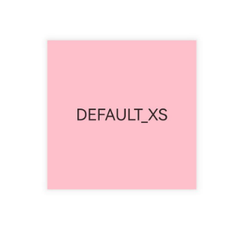 |
| ARKUI_SHADOW_STYLE_OUTER_DEFAULT_SM = 1 | 小阴影。<br/> |
| ARKUI_SHADOW_STYLE_OUTER_DEFAULT_MD = 2 | 中阴影。<br/>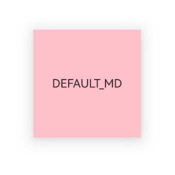 |
| ARKUI_SHADOW_STYLE_OUTER_DEFAULT_LG = 3 | 大阴影。<br/>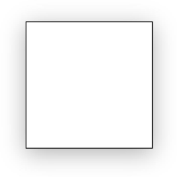 |
| ARKUI_SHADOW_STYLE_OUTER_FLOATING_SM = 4 | 浮动小阴影。<br/>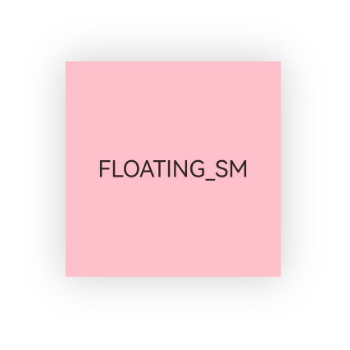 |
| ARKUI_SHADOW_STYLE_OUTER_FLOATING_MD = 5 | 浮动中阴影。<br/>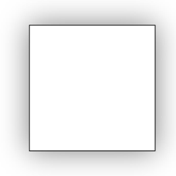 |

### ArkUI_AnimationCurve

```c
enum ArkUI_AnimationCurve
```

**描述：**


动画曲线枚举值。

**起始版本：** 12

| 枚举项 | 描述 |
| -- | -- |
| ARKUI_CURVE_LINEAR = 0 | 动画从头到尾的速度都是相同。 |
| ARKUI_CURVE_EASE = 1 | 动画以低速开始，然后加快，在结束前变慢。 |
| ARKUI_CURVE_EASE_IN = 2 | 动画以低速开始。 |
| ARKUI_CURVE_EASE_OUT = 3 | 动画以低速结束。 |
| ARKUI_CURVE_EASE_IN_OUT = 4 | 动画以低速开始和结束，提供平滑自然的动画过渡效果。 |
| ARKUI_CURVE_FAST_OUT_SLOW_IN = 5 | 动画标准曲线。 |
| ARKUI_CURVE_LINEAR_OUT_SLOW_IN = 6 | 动画减速曲线。 |
| ARKUI_CURVE_FAST_OUT_LINEAR_IN = 7 | 动画加速曲线。 |
| ARKUI_CURVE_EXTREME_DECELERATION = 8 | 动画急缓曲线。 |
| ARKUI_CURVE_SHARP = 9 | 动画锐利曲线。 |
| ARKUI_CURVE_RHYTHM = 10 | 动画节奏曲线。 |
| ARKUI_CURVE_SMOOTH = 11 | 动画平滑曲线。 |
| ARKUI_CURVE_FRICTION = 12 | 动画阻尼曲线。 |

### ArkUI_AnimationPlayMode

```c
enum ArkUI_AnimationPlayMode
```

**描述：**


定义动画播放模式。

**起始版本：** 12

| 枚举项 | 描述 |
| -- | -- |
| ARKUI_ANIMATION_PLAY_MODE_NORMAL = 0 | 动画正向播放。 |
| ARKUI_ANIMATION_PLAY_MODE_REVERSE = 1 | 动画反向播放。 |
| ARKUI_ANIMATION_PLAY_MODE_ALTERNATE = 2 | 动画交替循环播放，在奇数次正向播放，在偶数次反向播放。 |
| ARKUI_ANIMATION_PLAY_MODE_ALTERNATE_REVERSE = 3 | 动画反向交替循环播放，在奇数次反向播放，在偶数次正向播放。 |

### ArkUI_BlurStyle

```c
enum ArkUI_BlurStyle
```

**描述：**


定义背景模糊样式。

**起始版本：** 12

| 枚举项 | 描述 |
| -- | -- |
| ARKUI_BLUR_STYLE_THIN = 0 | 轻薄材质模糊。<br/> |
| ARKUI_BLUR_STYLE_REGULAR = 1 | 普通厚度材质模糊。<br/>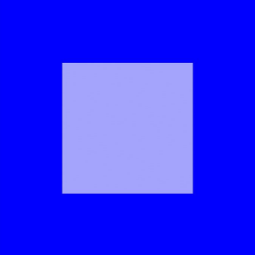 |
| ARKUI_BLUR_STYLE_THICK = 2 | 厚材质模糊。<br/>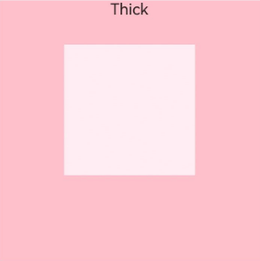 |
| ARKUI_BLUR_STYLE_BACKGROUND_THIN = 3 | 近距景深模糊。<br/> |
| ARKUI_BLUR_STYLE_BACKGROUND_REGULAR = 4 | 中距景深模糊。<br/> |
| ARKUI_BLUR_STYLE_BACKGROUND_THICK = 5 | 远距景深模糊。<br/>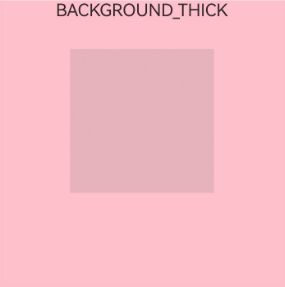 |
| ARKUI_BLUR_STYLE_BACKGROUND_ULTRA_THICK = 6 | 超远距景深模糊。<br/>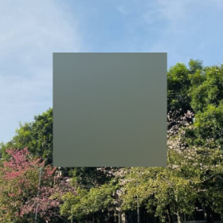 |
| ARKUI_BLUR_STYLE_NONE = 7 | 关闭模糊。<br/> |
| ARKUI_BLUR_STYLE_COMPONENT_ULTRA_THIN = 8 | 组件超轻薄材质模糊。<br/> |
| ARKUI_BLUR_STYLE_COMPONENT_THIN = 9 | 组件轻薄材质模糊。<br/>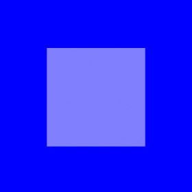 |
| ARKUI_BLUR_STYLE_COMPONENT_REGULAR = 10 | 组件普通材质模糊。<br/> |
| ARKUI_BLUR_STYLE_COMPONENT_THICK = 11 | 组件厚材质模糊。<br/>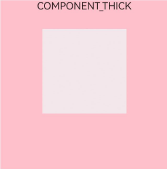 |
| ARKUI_BLUR_STYLE_COMPONENT_ULTRA_THICK = 12 | 组件超厚材质模糊。<br/> |

### ArkUI_BlurStyleActivePolicy

```c
enum ArkUI_BlurStyleActivePolicy
```

**描述：**


定义背景模糊激活策略。

**起始版本：** 19

| 枚举项 | 描述 |
| -- | -- |
| ARKUI_BLUR_STYLE_ACTIVE_POLICY_FOLLOWS_WINDOW_ACTIVE_STATE = 0 | 模糊效果跟随窗口焦点状态变化，非焦点不模糊，焦点模糊。 |
| ARKUI_BLUR_STYLE_ACTIVE_POLICY_ALWAYS_ACTIVE = 1 | 一直有模糊效果。 |
| ARKUI_BLUR_STYLE_ACTIVE_POLICY_ALWAYS_INACTIVE = 2 | 一直无模糊效果。 |

### ArkUI_BlendMode

```c
enum ArkUI_BlendMode
```

**描述：**


混合模式枚举值。

**起始版本：** 12

| 枚举项 | 描述 |
| -- | -- |
| ARKUI_BLEND_MODE_NONE = 0 | 将上层图像直接覆盖到下层图像上，不进行任何混合操作。 |
| ARKUI_BLEND_MODE_CLEAR = 1 | 将源像素覆盖的目标像素清除为完全透明。 |
| ARKUI_BLEND_MODE_SRC = 2 | r = s，只显示源像素。 |
| ARKUI_BLEND_MODE_DST = 3 | r = d，只显示目标像素。 |
| ARKUI_BLEND_MODE_SRC_OVER = 4 | r = s + (1 - sa) * d，将源像素按照透明度进行混合，覆盖在目标像素上。 |
| ARKUI_BLEND_MODE_DST_OVER = 5 | r = d + (1 - da) * s，将目标像素按照透明度进行混合，覆盖在源像素上。 |
| ARKUI_BLEND_MODE_SRC_IN = 6 | r = s * da，只显示源像素中与目标像素重叠的部分。 |
| ARKUI_BLEND_MODE_DST_IN = 7 | r = d * sa，只显示目标像素中与源像素重叠的部分。 |
| ARKUI_BLEND_MODE_SRC_OUT = 8 | r = s * (1 - da)，只显示源像素中与目标像素不重叠的部分。 |
| ARKUI_BLEND_MODE_DST_OUT = 9 | r = d * (1 - sa)，只显示目标像素中与源像素不重叠的部分。 |
| ARKUI_BLEND_MODE_SRC_ATOP = 10 | r = s * da + d * (1 - sa)，在源像素和目标像素重叠的地方绘制源像素，在源像素和目标像素不重叠的地方绘制目标像素。 |
| ARKUI_BLEND_MODE_DST_ATOP = 11 | r = d * sa + s * (1 - da)，在源像素和目标像素重叠的地方绘制目标像素，在源像素和目标像素不重叠的地方绘制源像素。 |
| ARKUI_BLEND_MODE_XOR = 12 | r = s * (1 - da) + d * (1 - sa)，只显示源像素与目标像素不重叠的部分。 |
| ARKUI_BLEND_MODE_PLUS = 13 | r = min(s + d, 1)，将源像素值与目标像素值相加，并将结果作为新的像素值。 |
| ARKUI_BLEND_MODE_MODULATE = 14 | r = s * d，将源像素与目标像素进行乘法运算，并将结果作为新的像素值。 |
| ARKUI_BLEND_MODE_SCREEN = 15 | r = s + d - s * d，将两个图像的像素值相加，然后减去它们的乘积来实现混合。 |
| ARKUI_BLEND_MODE_OVERLAY = 16 | 根据目标像素来决定使用MULTIPLY混合模式还是SCREEN混合模式。 |
| ARKUI_BLEND_MODE_DARKEN = 17 | rc = s + d - max(s * da, d * sa), ra = kSrcOver，当两个颜色重叠时，较暗的颜色会覆盖较亮的颜色。 |
| ARKUI_BLEND_MODE_LIGHTEN = 18 | rc = s + d - min(s * da, d * sa), ra = kSrcOver，将源图像和目标图像中的像素进行比较，选取两者中较亮的像素作为最终的混合结果。|
| ARKUI_BLEND_MODE_COLOR_DODGE = 19 | 使目标像素变得更亮来反映源像素。 |
| ARKUI_BLEND_MODE_COLOR_BURN = 20 | 使目标像素变得更暗来反映源像素。 |
| ARKUI_BLEND_MODE_HARD_LIGHT = 21 | 根据源像素的值来决定目标像素变得更亮或者更暗。根据源像素来决定使用MULTIPLY混合模式还是SCREEN混合模式。 |
| ARKUI_BLEND_MODE_SOFT_LIGHT = 22 | 根据源像素来决定使用LIGHTEN混合模式还是DARKEN混合模式。 |
| ARKUI_BLEND_MODE_DIFFERENCE = 23 | rc = s + d - 2 * (min(s * da, d * sa)), ra = kSrcOver，对比源像素和目标像素，亮度更高的像素减去亮度更低的像素，产生高对比度的效果。 |
| ARKUI_BLEND_MODE_EXCLUSION = 24 | rc = s + d - two(s * d), ra = kSrcOver，对比源像素和目标像素，亮度更高的像素减去亮度更低的像素，产生柔和的效果。 |
| ARKUI_BLEND_MODE_MULTIPLY = 25 | r = s * (1 - da) + d * (1 - sa) + s * d，将源图像与目标图像进行乘法混合，得到一张新的图像。 |
| ARKUI_BLEND_MODE_HUE = 26 | 保留源图像的亮度和饱和度，但会使用目标图像的色调来替换源图像的色调。 |
| ARKUI_BLEND_MODE_SATURATION = 27 | 保留目标像素的亮度和色调，但会使用源像素的饱和度来替换目标像素的饱和度。 |
| ARKUI_BLEND_MODE_COLOR = 28 | 保留源像素的饱和度和色调，但会使用目标像素的亮度来替换源像素的亮度。 |
| ARKUI_BLEND_MODE_LUMINOSITY = 29 | 保留目标像素的色调和饱和度，但会用源像素的亮度替换目标像素的亮度。 |

### ArkUI_ColorStrategy

```c
enum ArkUI_ColorStrategy
```

**描述：**


前景和阴影颜色的枚举值。

**起始版本：** 12

| 枚举项 | 描述 |
| -- | -- |
| ARKUI_COLOR_STRATEGY_INVERT = 0 | 前景色为控件背景色的反色。 |
| ARKUI_COLOR_STRATEGY_AVERAGE = 1 | 控件背景阴影色为控件背景阴影区域的平均色。 |
| ARKUI_COLOR_STRATEGY_PRIMARY = 2 | 控件背景阴影色为控件背景阴影区域的主色。 |

### ArkUI_MaskType

```c
enum ArkUI_MaskType
```

**描述：**

遮罩类型枚举。遮罩是一种用于限制组件显示区域的手段，它利用特定的形状对组件内容进行裁剪，从而实现只有遮罩区域内的内容才可见的效果。

**起始版本：** 12

| 枚举项 | 描述 |
| -- | -- |
| ARKUI_MASK_TYPE_RECTANGLE = 0 | 矩形类型。 |
| ARKUI_MASK_TYPE_CIRCLE = 1 | 圆形类型。 |
| ARKUI_MASK_TYPE_ELLIPSE = 2 | 椭圆形类型。 |
| ARKUI_MASK_TYPE_PATH = 3 | 路径类型。 |
| ARKUI_MASK_TYPE_PROGRESS = 4 | 进度类型。 |

### ArkUI_ClipType

```c
enum ArkUI_ClipType
```

**描述：**


裁剪类型枚举。

**起始版本：** 12

| 枚举项 | 描述 |
| -- | -- |
| ARKUI_CLIP_TYPE_RECTANGLE = 0 | 矩形类型。 |
| ARKUI_CLIP_TYPE_CIRCLE = 1 | 圆形类型。 |
| ARKUI_CLIP_TYPE_ELLIPSE = 2 | 椭圆形类型。 |
| ARKUI_CLIP_TYPE_PATH = 3 | 路径类型。 |

### ArkUI_ShapeType

```c
enum ArkUI_ShapeType
```

**描述：**


自定义形状。

**起始版本：** 12

| 枚举项 | 描述 |
| -- | -- |
| ARKUI_SHAPE_TYPE_RECTANGLE = 0 | 矩形类型。 |
| ARKUI_SHAPE_TYPE_CIRCLE = 1 | 圆形类型。 |
| ARKUI_SHAPE_TYPE_ELLIPSE = 2 | 椭圆形类型。 |
| ARKUI_SHAPE_TYPE_PATH = 3 | 路径类型。 |

### ArkUI_LinearGradientDirection

```c
enum ArkUI_LinearGradientDirection
```

**描述：**

定义渐变方向枚举。

**起始版本：** 12

| 枚举项 | 描述 |
| -- | -- |
| ARKUI_LINEAR_GRADIENT_DIRECTION_LEFT = 0 | 向左渐变。 |
| ARKUI_LINEAR_GRADIENT_DIRECTION_TOP = 1 | 向上渐变。 |
| ARKUI_LINEAR_GRADIENT_DIRECTION_RIGHT = 2 | 向右渐变。 |
| ARKUI_LINEAR_GRADIENT_DIRECTION_BOTTOM = 3 | 向下渐变。 |
| ARKUI_LINEAR_GRADIENT_DIRECTION_LEFT_TOP = 4 | 向左上渐变。 |
| ARKUI_LINEAR_GRADIENT_DIRECTION_LEFT_BOTTOM = 5 | 向左下渐变。 |
| ARKUI_LINEAR_GRADIENT_DIRECTION_RIGHT_TOP = 6 | 向右上渐变。 |
| ARKUI_LINEAR_GRADIENT_DIRECTION_RIGHT_BOTTOM = 7 | 向右下渐变。 |
| ARKUI_LINEAR_GRADIENT_DIRECTION_NONE = 8 | 不渐变。 |
| ARKUI_LINEAR_GRADIENT_DIRECTION_CUSTOM = 9 | 自定义渐变方向. |

### ArkUI_TransitionEdge

```c
enum ArkUI_TransitionEdge
```

**描述：**


定义转场从边缘滑入和滑出的效果。

**起始版本：** 12

| 枚举项 | 描述 |
| -- | -- |
| ARKUI_TRANSITION_EDGE_TOP = 0 | 转场从窗口的上边缘滑入和滑出。 |
| ARKUI_TRANSITION_EDGE_BOTTOM = 1 | 转场从窗口的下边缘滑入和滑出。 |
| ARKUI_TRANSITION_EDGE_START = 2 | 转场从窗口的左边缘滑入和滑出。 |
| ARKUI_TRANSITION_EDGE_END = 3 | 转场从窗口的右边缘滑入和滑出。 |

### ArkUI_FinishCallbackType

```c
enum ArkUI_FinishCallbackType
```

**描述：**


在动画中定义[OH_ArkUI_AnimatorOption_RegisterOnFinishCallback](./capi-native-animate-h.md#oh_arkui_animatoroption_registeronfinishcallback)回调的类型。

**起始版本：** 12

| 枚举项 | 描述 |
| -- | -- |
| ARKUI_FINISH_CALLBACK_REMOVED = 0 | 当整个动画结束并立即删除时，将触发回调。 |
| ARKUI_FINISH_CALLBACK_LOGICALLY = 1 | 当动画在逻辑上处于下降状态，但可能仍处于其长尾状态时，将触发回调。长尾状态是指动画即将完全停止前的残余变化过程，此时动画的数值变化已非常微小，接近目标值。 |

### ArkUI_BlendApplyType

```c
enum ArkUI_BlendApplyType
```

**描述：**


指定的混合模式应用于视图的内容选项.

**起始版本：** 12

| 枚举项 | 描述 |
| -- | -- |
| BLEND_APPLY_TYPE_FAST = 0 | 在目标图像上按顺序混合视图的内容. |
| BLEND_APPLY_TYPE_OFFSCREEN = 1 | 将此组件和子组件内容绘制到离屏画布上，然后整体进行混合. |

### ArkUI_RenderFit

```c
enum ArkUI_RenderFit
```

**描述：**


定义动画终态内容大小与位置的枚举值。

**起始版本：** 12

| 枚举项 | 描述 |
| -- | -- |
| ARKUI_RENDER_FIT_CENTER = 0 | 保持动画终态的内容大小，并且内容始终与组件保持中心对齐。 |
| ARKUI_RENDER_FIT_TOP = 1 | 保持动画终态的内容大小，并且内容始终与组件保持顶部中心对齐。 |
| ARKUI_RENDER_FIT_BOTTOM = 2 | 保持动画终态的内容大小，并且内容始终与组件保持底部中心对齐。 |
| ARKUI_RENDER_FIT_LEFT = 3 | 保持动画终态的内容大小，并且内容始终与组件保持左侧对齐。 |
| ARKUI_RENDER_FIT_RIGHT = 4 | 保持动画终态的内容大小，并且内容始终与组件保持右侧对齐。 |
| ARKUI_RENDER_FIT_TOP_LEFT = 5 | 保持动画终态的内容大小，并且内容始终与组件保持左上角对齐。 |
| ARKUI_RENDER_FIT_TOP_RIGHT = 6 | 保持动画终态的内容大小，并且内容始终与组件保持右上角对齐。 |
| ARKUI_RENDER_FIT_BOTTOM_LEFT = 7 | 保持动画终态的内容大小，并且内容始终与组件保持左下角对齐。 |
| ARKUI_RENDER_FIT_BOTTOM_RIGHT = 8 | 保持动画终态的内容大小，并且内容始终与组件保持右下角对齐。 |
| ARKUI_RENDER_FIT_RESIZE_FILL = 9 | 不考虑动画终态内容的宽高比，并且内容始终缩放到组件的大小。 |
| ARKUI_RENDER_FIT_RESIZE_CONTAIN = 10 | 保持动画终态内容的宽高比进行缩小或放大，使内容完整显示在组件内，且与组件保持中心对齐。 |
| ARKUI_RENDER_FIT_RESIZE_CONTAIN_TOP_LEFT = 11 | 保持动画终态内容的宽高比进行缩小或放大，使内容完整显示在组件内。当组件宽方向有剩余时，内容与组件保持左侧对齐，当组件高方向有剩余时，内容与组件保持顶部对齐。 |
| ARKUI_RENDER_FIT_RESIZE_CONTAIN_BOTTOM_RIGHT = 12 | 保持动画终态内容的宽高比进行缩小或放大，使内容完整显示在组件内。当组件宽方向有剩余时，内容与组件保持右侧对齐，当组件高方向有剩余时，内容与组件保持底部对齐。 |
| ARKUI_RENDER_FIT_RESIZE_COVER = 13 | 保持动画终态内容的宽高比进行缩小或放大，使内容两边都大于或等于组件两边，且与组件保持中心对齐，显示内容的中间部分。 |
| ARKUI_RENDER_FIT_RESIZE_COVER_TOP_LEFT = 14 | 保持动画终态内容的宽高比进行缩小或放大，使内容的两边都恰好大于或等于组件两边。当内容宽方向有剩余时，内容与组件保持左侧对齐，显示内容的左侧部分。当内容高方向有剩余时，内容与组件保持顶部对齐，显示内容的顶侧部分。 |
| ARKUI_RENDER_FIT_RESIZE_COVER_BOTTOM_RIGHT = 15 | 保持动画终态内容的宽高比进行缩小或放大，使内容的两边都恰好大于或等于组件两边。当内容宽方向有剩余时，内容与组件保持右侧对齐，显示内容的右侧部分。当内容高方向有剩余时，内容与组件保持底部对齐，显示内容的底侧部分。 |

### ArkUI_AnimationDirection

```c
enum ArkUI_AnimationDirection
```

**描述：**


动画播放方向。

**起始版本：** 12

| 枚举项 | 描述 |
| -- | -- |
| ARKUI_ANIMATION_DIRECTION_NORMAL = 0 | 动画正向循环播放。 |
| ARKUI_ANIMATION_DIRECTION_REVERSE = 1 | 动画反向循环播放。 |
| ARKUI_ANIMATION_DIRECTION_ALTERNATE = 2 | 动画交替循环播放，在奇数次正向播放，在偶数次反向播放。 |
| ARKUI_ANIMATION_DIRECTION_ALTERNATE_REVERSE = 3 | 动画反向交替循环播放，在奇数次反向播放，在偶数次正向播放。 |

### ArkUI_AnimationFillMode

```c
enum ArkUI_AnimationFillMode
```

**描述：**


定义帧动画组件在动画开始前和结束后的状态。

**起始版本：** 12

| 枚举项 | 描述 |
| -- | -- |
| ARKUI_ANIMATION_FILL_MODE_NONE = 0 | 动画未执行时不会将任何样式应用于目标，动画播放完成之后恢复初始默认状态。 |
| ARKUI_ANIMATION_FILL_MODE_FORWARDS = 1 | 目标将保留动画执行期间最后一个关键帧的状态。 |
| ARKUI_ANIMATION_FILL_MODE_BACKWARDS = 2 | 动画将在应用于目标时立即应用第一个关键帧中定义的值，并在[delay](./capi-native-animate-h.md#oh_arkui_animateoption_setdelay)期间保留此值。 |
| ARKUI_ANIMATION_FILL_MODE_BOTH = 3 | 动画将遵循[ARKUI_ANIMATION_FILL_MODE_FORWARDS](#arkui_animationfillmode)和[ARKUI_ANIMATION_FILL_MODE_BACKWARDS](#arkui_animationfillmode)的规则，从而在两个方向上扩展动画属性。 |

## 函数说明

### OH_ArkUI_Matrix4_CreateIdentity()

```c
ArkUI_Matrix4* OH_ArkUI_Matrix4_CreateIdentity()
```

**描述：**

创建一个单位四阶矩阵对象。

**起始版本：** 24

**返回：**

| 类型 | 说明 |
| -- | -- |
| [ArkUI_Matrix4](capi-arkui-nativemodule-arkui-matrix4.md)* | 返回指向创建的单位四阶矩阵对象的指针。 |

### OH_ArkUI_Matrix4_CreateByElements()

```c
ArkUI_Matrix4* OH_ArkUI_Matrix4_CreateByElements(const float* elements)
```

**描述：**

通过指定矩阵的每个元素来创建一个四阶矩阵对象。

**起始版本：** 24

**参数：**

| 参数项 | 描述 |
| -- | -- |
| const float* elements | 指向预期矩阵元素数据的数组指针。数组长度应大于或等于16。该参数不可为空指针。|

**返回：**

| 类型 | 说明 |
| -- | -- |
| [ArkUI_Matrix4](capi-arkui-nativemodule-arkui-matrix4.md)* | 返回新创建的四阶矩阵对象。如果elements指针为空，函数将返回空值。 |

### OH_ArkUI_Matrix4_Dispose()

```c
void OH_ArkUI_Matrix4_Dispose(ArkUI_Matrix4* matrix)
```

**描述：**

销毁矩阵对象的指针。

**起始版本：** 24

**参数：**

| 参数项 | 描述 |
| -- | -- |
| [ArkUI_Matrix4](capi-arkui-nativemodule-arkui-matrix4.md)* matrix| 指向要销毁的四阶矩阵对象的指针。|

### OH_ArkUI_Matrix4_Copy()

```c
ArkUI_Matrix4* OH_ArkUI_Matrix4_Copy(const ArkUI_Matrix4* matrix)
```

**描述：**

创建四阶矩阵对象的副本。用于对同一个矩阵进行操作以此获取不同矩阵对象。

**起始版本：** 24

**参数：**

| 参数项 | 描述 |
| -- | -- |
| const [ArkUI_Matrix4](capi-arkui-nativemodule-arkui-matrix4.md)* matrix | 指向原始四阶矩阵对象的指针。|

**返回：**

| 类型 | 说明 |
| -- | -- |
| [ArkUI_Matrix4](capi-arkui-nativemodule-arkui-matrix4.md)* | 返回新创建的四阶矩阵对象。 |

### OH_ArkUI_Matrix4_Invert()

```c
ArkUI_ErrorCode OH_ArkUI_Matrix4_Invert(ArkUI_Matrix4* matrix)
```

**描述：**

对输入矩阵执行逆矩阵变换。

**起始版本：** 24

**参数：**

| 参数项 | 描述 |
| -- | -- |
| [ArkUI_Matrix4](capi-arkui-nativemodule-arkui-matrix4.md)* matrix | 指向要逆矩阵变换的四阶矩阵对象的指针。|

**返回：**

| 类型 | 说明 |
| -- | -- |
| [ArkUI_ErrorCode](capi-arkui-nativemodule-arkui-error-code-h.md#arkui_errorcode) | 错误码。<br> 如果操作成功，返回[ARKUI_ERROR_CODE_NO_ERROR](capi-arkui-nativemodule-arkui-error-code-h.md#arkui_errorcode)。<br> 如果发生参数异常，返回[ARKUI_ERROR_CODE_PARAM_INVALID](capi-arkui-nativemodule-arkui-error-code-h.md#arkui_errorcode)。 |

### OH_ArkUI_Matrix4_Combine()

```c
ArkUI_ErrorCode OH_ArkUI_Matrix4_Combine(ArkUI_Matrix4* oriMatrix, const ArkUI_Matrix4* anotherMatrix)
```

**描述：**

将另一个矩阵与原始矩阵合并，并将结果矩阵存储在oriMatrix中。结果矩阵相当于先应用oriMatrix的变换，然后再应用anotherMatrix的变换。此函数将修改oriMatrix对象。

**起始版本：** 24

**参数：**

| 参数项 | 描述 |
| -- | -- |
| [ArkUI_Matrix4](capi-arkui-nativemodule-arkui-matrix4.md)* oriMatrix | 指向原始四阶矩阵对象的指针。|
| const [ArkUI_Matrix4](capi-arkui-nativemodule-arkui-matrix4.md)* anotherMatrix | 指向要合并的另一个矩阵对象的指针。|

**返回：**

| 类型 | 说明 |
| -- | -- |
| [ArkUI_ErrorCode](capi-arkui-nativemodule-arkui-error-code-h.md#arkui_errorcode) | 错误码。<br> 如果操作成功，返回[ARKUI_ERROR_CODE_NO_ERROR](capi-arkui-nativemodule-arkui-error-code-h.md#arkui_errorcode)。<br> 如果发生参数异常，返回[ARKUI_ERROR_CODE_PARAM_INVALID](capi-arkui-nativemodule-arkui-error-code-h.md#arkui_errorcode)。 |

### OH_ArkUI_Matrix4_Translate()

```c
ArkUI_ErrorCode OH_ArkUI_Matrix4_Translate(ArkUI_Matrix4* matrix, const ArkUI_Matrix4TranslationOptions* translate)
```

**描述：**

对原始矩阵应用平移变换以获取平移后的矩阵。每次平移变换都是在先前的矩阵上累积的。变换后将修改输入的矩阵对象。

**起始版本：** 24

**参数：**

| 参数项 | 描述 |
| -- | -- |
| [ArkUI_Matrix4](capi-arkui-nativemodule-arkui-matrix4.md)* matrix | 指向待平移四阶矩阵对象的指针。|
| const [ArkUI_Matrix4TranslationOptions](capi-arkui-nativemodule-arkui-matrix4translationoptions.md)* translate | 指向平移对象的指针。|

**返回：**

| 类型 | 说明 |
| -- | -- |
| [ArkUI_ErrorCode](capi-arkui-nativemodule-arkui-error-code-h.md#arkui_errorcode) | 错误码。<br> 如果操作成功，返回[ARKUI_ERROR_CODE_NO_ERROR](capi-arkui-nativemodule-arkui-error-code-h.md#arkui_errorcode)。<br> 如果发生参数异常，返回[ARKUI_ERROR_CODE_PARAM_INVALID](capi-arkui-nativemodule-arkui-error-code-h.md#arkui_errorcode)。 |

### OH_ArkUI_Matrix4_Scale()

```c
ArkUI_ErrorCode OH_ArkUI_Matrix4_Scale(ArkUI_Matrix4* matrix, const ArkUI_Matrix4ScaleOptions* scale)
```

**描述：**

对原始矩阵应用缩放变换以获取缩放后的矩阵。每次缩放变换都是在先前的矩阵上累积的。此函数将修改输入的矩阵对象。

**起始版本：** 24

**参数：**

| 参数项 | 描述 |
| -- | -- |
| [ArkUI_Matrix4](capi-arkui-nativemodule-arkui-matrix4.md)* matrix | 指向待缩放四阶矩阵对象的指针。|
| const [ArkUI_Matrix4ScaleOptions](capi-arkui-nativemodule-arkui-matrix4scaleoptions.md)* scale | 指向缩放对象的指针。|

**返回：**

| 类型 | 说明 |
| -- | -- |
| [ArkUI_ErrorCode](capi-arkui-nativemodule-arkui-error-code-h.md#arkui_errorcode) | 错误码。<br> 如果操作成功，返回[ARKUI_ERROR_CODE_NO_ERROR](capi-arkui-nativemodule-arkui-error-code-h.md#arkui_errorcode)。<br> 如果发生参数异常，返回[ARKUI_ERROR_CODE_PARAM_INVALID](capi-arkui-nativemodule-arkui-error-code-h.md#arkui_errorcode)。 |

### OH_ArkUI_Matrix4_Rotate()

```c
ArkUI_ErrorCode OH_ArkUI_Matrix4_Rotate(ArkUI_Matrix4* matrix, const ArkUI_Matrix4RotationOptions* rotate)
```

**描述：**

对原始矩阵应用旋转变换以获取旋转后的矩阵。每次旋转变换都是在先前的矩阵上累积的。此函数将修改输入的矩阵对象。

**起始版本：** 24

**参数：**

| 参数项 | 描述 |
| -- | -- |
| [ArkUI_Matrix4](capi-arkui-nativemodule-arkui-matrix4.md)* matrix | 指向待旋转四阶矩阵对象的指针。|
| const [ArkUI_Matrix4RotationOptions](capi-arkui-nativemodule-arkui-matrix4rotationoptions.md)* rotate | 指向旋转对象的指针。|

**返回：**

| 类型 | 说明 |
| -- | -- |
| [ArkUI_ErrorCode](capi-arkui-nativemodule-arkui-error-code-h.md#arkui_errorcode) | 错误码。<br> 如果操作成功，返回[ARKUI_ERROR_CODE_NO_ERROR](capi-arkui-nativemodule-arkui-error-code-h.md#arkui_errorcode)。<br> 如果发生参数异常，返回[ARKUI_ERROR_CODE_PARAM_INVALID](capi-arkui-nativemodule-arkui-error-code-h.md#arkui_errorcode)。 |

### OH_ArkUI_Matrix4_Skew()

```c
ArkUI_ErrorCode OH_ArkUI_Matrix4_Skew(ArkUI_Matrix4* matrix, const float skewX, const float skewY)
```

**描述：**

对原始矩阵应用倾斜变换以获取倾斜后的矩阵。每次倾斜变换都是在先前的矩阵上累积的。变换后将修改输入的矩阵对象。

**起始版本：** 24

**参数：**

| 参数项 | 描述 |
| -- | -- |
| [ArkUI_Matrix4](capi-arkui-nativemodule-arkui-matrix4.md)* matrix | 指向待倾斜四阶矩阵对象的指针。|
| const float skewX | x方向的倾斜系数。|
| const float skewY | y方向的倾斜系数。|

**返回：**

| 类型 | 说明 |
| -- | -- |
| [ArkUI_ErrorCode](capi-arkui-nativemodule-arkui-error-code-h.md#arkui_errorcode) | 错误码。<br> 如果操作成功，返回[ARKUI_ERROR_CODE_NO_ERROR](capi-arkui-nativemodule-arkui-error-code-h.md#arkui_errorcode)。<br> 如果发生参数异常，返回[ARKUI_ERROR_CODE_PARAM_INVALID](capi-arkui-nativemodule-arkui-error-code-h.md#arkui_errorcode)。 |

### OH_ArkUI_Matrix4_TransformPoint()

```c
ArkUI_ErrorCode OH_ArkUI_Matrix4_TransformPoint(const ArkUI_Matrix4* matrix, const ArkUI_PointF* oriPoint, ArkUI_PointF* result)
```

**描述：**

计算一个点经过矩阵变换后的新坐标位置。

**起始版本：** 24

**参数：**

| 参数项 | 描述 |
| -- | -- |
| const [ArkUI_Matrix4](capi-arkui-nativemodule-arkui-matrix4.md)* matrix | 指向四阶矩阵对象的指针。|
| const [ArkUI_PointF](capi-arkui-nativemodule-arkui-pointf.md)* oriPoint | 指向原始坐标点的指针。|
| [ArkUI_PointF](capi-arkui-nativemodule-arkui-pointf.md)* result | 指向结果点的指针。不能为空。|

**返回：**

| 类型 | 说明 |
| -- | -- |
| [ArkUI_ErrorCode](capi-arkui-nativemodule-arkui-error-code-h.md#arkui_errorcode) | 错误码。<br> 如果操作成功，返回[ARKUI_ERROR_CODE_NO_ERROR](capi-arkui-nativemodule-arkui-error-code-h.md#arkui_errorcode)。<br> 如果发生参数异常，返回[ARKUI_ERROR_CODE_PARAM_INVALID](capi-arkui-nativemodule-arkui-error-code-h.md#arkui_errorcode)。 |

### OH_ArkUI_Matrix4_SetPolyToPoly()

```c
ArkUI_ErrorCode OH_ArkUI_Matrix4_SetPolyToPoly(ArkUI_Matrix4* matrix, const ArkUI_PointF* src, const ArkUI_PointF* dst, const uint32_t pointCount)
```

**描述：**

将一个多边形的顶点坐标映射到另一个多边形的顶点坐标，并计算所需的矩阵。

**起始版本：** 24

**参数：**

| 参数项 | 描述 |
| -- | -- |
| [ArkUI_Matrix4](capi-arkui-nativemodule-arkui-matrix4.md)* matrix | 指向四阶矩阵对象的指针，用于存放结果矩阵。|
| const [ArkUI_PointF](capi-arkui-nativemodule-arkui-pointf.md)* src | 指向原始多边形坐标点数组的指针。数组长度应至少为pointCount。|
| const [ArkUI_PointF](capi-arkui-nativemodule-arkui-pointf.md)* dst | 指向映射后多边形坐标点数组的指针。数组长度应至少为pointCount。|
| const uint32_t pointCount | 多边形点的数量，必须是0、1、2、3或4中的一个值。|

**返回：**

| 类型 | 说明 |
| -- | -- |
| [ArkUI_ErrorCode](capi-arkui-nativemodule-arkui-error-code-h.md#arkui_errorcode) | 错误码。<br> 如果操作成功，返回[ARKUI_ERROR_CODE_NO_ERROR](capi-arkui-nativemodule-arkui-error-code-h.md#arkui_errorcode)。<br> 如果发生参数异常，返回[ARKUI_ERROR_CODE_PARAM_INVALID](capi-arkui-nativemodule-arkui-error-code-h.md#arkui_errorcode)。 |

### OH_ArkUI_Matrix4_GetElements()

```c
ArkUI_ErrorCode OH_ArkUI_Matrix4_GetElements(const ArkUI_Matrix4* matrix, float* result)
```

**描述：**

获取四阶矩阵的16个元素。

**起始版本：** 24

**参数：**

| 参数项 | 描述 |
| -- | -- |
| const [ArkUI_Matrix4](capi-arkui-nativemodule-arkui-matrix4.md)* matrix | 指向四阶矩阵对象的指针。|
| float* result | 指向可容纳16个浮点数的数组的指针。不能为空。|

**返回：**

| 类型 | 说明 |
| -- | -- |
| [ArkUI_ErrorCode](capi-arkui-nativemodule-arkui-error-code-h.md#arkui_errorcode) | 错误码。<br> 如果操作成功，返回[ARKUI_ERROR_CODE_NO_ERROR](capi-arkui-nativemodule-arkui-error-code-h.md#arkui_errorcode)。<br> 如果发生参数异常，返回[ARKUI_ERROR_CODE_PARAM_INVALID](capi-arkui-nativemodule-arkui-error-code-h.md#arkui_errorcode)。 |

### OH_ArkUI_Matrix4ScaleOptions_Create()

```c
ArkUI_Matrix4ScaleOptions* OH_ArkUI_Matrix4ScaleOptions_Create()
```

**描述：**

创建指向矩阵运算的缩放参数对象的指针。在新创建的对象中，x、y和z轴方向的缩放系数默认值，为1。变换中心点的x轴坐标centerX、变换中心点的y轴坐标centerY取默认值，为0。

**起始版本：** 24

**返回：**

| 类型 | 说明 |
| -- | -- |
| [ArkUI_Matrix4ScaleOptions](capi-arkui-nativemodule-arkui-matrix4scaleoptions.md)* | 返回指向新创建的[ArkUI_Matrix4ScaleOptions](capi-arkui-nativemodule-arkui-matrix4scaleoptions.md)的指针。 |

### OH_ArkUI_Matrix4ScaleOptions_Dispose()

```c
void OH_ArkUI_Matrix4ScaleOptions_Dispose(ArkUI_Matrix4ScaleOptions* options)
```

**描述：**

销毁指向矩阵运算的缩放参数对象的指针。

**起始版本：** 24

**参数：**

| 参数项 | 描述 |
| -- | -- |
| [ArkUI_Matrix4ScaleOptions](capi-arkui-nativemodule-arkui-matrix4scaleoptions.md)* options| 指向要销毁的[ArkUI_Matrix4ScaleOptions](capi-arkui-nativemodule-arkui-matrix4scaleoptions.md)对象的指针。|

### OH_ArkUI_Matrix4ScaleOptions_SetX()

```c
ArkUI_ErrorCode OH_ArkUI_Matrix4ScaleOptions_SetX(ArkUI_Matrix4ScaleOptions* options, const float scaleX)
```

**描述：**

设置矩阵运算的缩放参数对象x方向的缩放因子。

**起始版本：** 24

**参数：**

| 参数项 | 描述 |
| -- | -- |
| [ArkUI_Matrix4ScaleOptions](capi-arkui-nativemodule-arkui-matrix4scaleoptions.md)* options| 指向矩阵运算的缩放参数对象的指针。|
| const float scaleX | x方向的缩放因子。取值范围：(-∞, +∞)。|

**返回：**

| 类型 | 说明 |
| -- | -- |
| [ArkUI_ErrorCode](capi-arkui-nativemodule-arkui-error-code-h.md#arkui_errorcode) | 错误码。<br> 如果操作成功，返回[ARKUI_ERROR_CODE_NO_ERROR](capi-arkui-nativemodule-arkui-error-code-h.md#arkui_errorcode)。<br> 如果发生参数异常，返回[ARKUI_ERROR_CODE_PARAM_INVALID](capi-arkui-nativemodule-arkui-error-code-h.md#arkui_errorcode)。 |

### OH_ArkUI_Matrix4ScaleOptions_GetX()

```c
ArkUI_ErrorCode OH_ArkUI_Matrix4ScaleOptions_GetX(const ArkUI_Matrix4ScaleOptions* options, float* scaleX)
```

**描述：**

获取矩阵运算的缩放参数对象x方向的缩放因子。如果从未设置x的值，则x方向的缩放因子默认值为1。

**起始版本：** 24

**参数：**

| 参数项 | 描述 |
| -- | -- |
| const [ArkUI_Matrix4ScaleOptions](capi-arkui-nativemodule-arkui-matrix4scaleoptions.md)* options| 指向矩阵运算的缩放参数对象的指针。|
| float* scaleX | x方向的缩放因子。|

**返回：**

| 类型 | 说明 |
| -- | -- |
| [ArkUI_ErrorCode](capi-arkui-nativemodule-arkui-error-code-h.md#arkui_errorcode) | 错误码。<br> 如果操作成功，返回[ARKUI_ERROR_CODE_NO_ERROR](capi-arkui-nativemodule-arkui-error-code-h.md#arkui_errorcode)。<br> 如果发生参数异常，返回[ARKUI_ERROR_CODE_PARAM_INVALID](capi-arkui-nativemodule-arkui-error-code-h.md#arkui_errorcode)。 |

### OH_ArkUI_Matrix4ScaleOptions_SetY()

```c
ArkUI_ErrorCode OH_ArkUI_Matrix4ScaleOptions_SetY(ArkUI_Matrix4ScaleOptions* options, const float scaleY)
```

**描述：**

设置矩阵运算的缩放参数对象y方向的缩放因子。

**起始版本：** 24

**参数：**

| 参数项 | 描述 |
| -- | -- |
| [ArkUI_Matrix4ScaleOptions](capi-arkui-nativemodule-arkui-matrix4scaleoptions.md)* options | 指向矩阵运算的缩放参数对象的指针。|
| const float scaleY | y方向的缩放因子。取值范围：(-∞, +∞)。|

**返回：**

| 类型 | 说明 |
| -- | -- |
| [ArkUI_ErrorCode](capi-arkui-nativemodule-arkui-error-code-h.md#arkui_errorcode) | 错误码。<br> 如果操作成功，返回[ARKUI_ERROR_CODE_NO_ERROR](capi-arkui-nativemodule-arkui-error-code-h.md#arkui_errorcode)。<br> 如果发生参数异常，返回[ARKUI_ERROR_CODE_PARAM_INVALID](capi-arkui-nativemodule-arkui-error-code-h.md#arkui_errorcode)。 |

### OH_ArkUI_Matrix4ScaleOptions_GetY()

```c
ArkUI_ErrorCode OH_ArkUI_Matrix4ScaleOptions_GetY(const ArkUI_Matrix4ScaleOptions* options, float* scaleY)
```

**描述：**

获取矩阵运算的缩放参数对象y方向的缩放因子。如果从未设置y的值，则y方向的缩放因子默认值为1。

**起始版本：** 24

**参数：**

| 参数项 | 描述 |
| -- | -- |
| const [ArkUI_Matrix4ScaleOptions](capi-arkui-nativemodule-arkui-matrix4scaleoptions.md)* options | 指向矩阵运算的缩放参数对象的指针。|
| float* scaleY | y方向的缩放因子。|

**返回：**

| 类型 | 说明 |
| -- | -- |
| [ArkUI_ErrorCode](capi-arkui-nativemodule-arkui-error-code-h.md#arkui_errorcode) | 错误码。<br> 如果操作成功，返回[ARKUI_ERROR_CODE_NO_ERROR](capi-arkui-nativemodule-arkui-error-code-h.md#arkui_errorcode)。<br> 如果发生参数异常，返回[ARKUI_ERROR_CODE_PARAM_INVALID](capi-arkui-nativemodule-arkui-error-code-h.md#arkui_errorcode)。 |

### OH_ArkUI_Matrix4ScaleOptions_SetZ()

```c
ArkUI_ErrorCode OH_ArkUI_Matrix4ScaleOptions_SetZ(ArkUI_Matrix4ScaleOptions* options, const float scaleZ)
```

**描述：**

设置矩阵运算的缩放参数对象z方向的缩放因子。

**起始版本：** 24

**参数：**

| 参数项 | 描述 |
| -- | -- |
| [ArkUI_Matrix4ScaleOptions](capi-arkui-nativemodule-arkui-matrix4scaleoptions.md)* options | 指向矩阵运算的缩放参数对象的指针。|
| const float scaleZ | z方向的缩放因子。取值范围：(-∞, +∞)。|

**返回：**

| 类型 | 说明 |
| -- | -- |
| [ArkUI_ErrorCode](capi-arkui-nativemodule-arkui-error-code-h.md#arkui_errorcode) | 错误码。<br> 如果操作成功，返回[ARKUI_ERROR_CODE_NO_ERROR](capi-arkui-nativemodule-arkui-error-code-h.md#arkui_errorcode)。<br> 如果发生参数异常，返回[ARKUI_ERROR_CODE_PARAM_INVALID](capi-arkui-nativemodule-arkui-error-code-h.md#arkui_errorcode)。 |

### OH_ArkUI_Matrix4ScaleOptions_GetZ()

```c
ArkUI_ErrorCode OH_ArkUI_Matrix4ScaleOptions_GetZ(const ArkUI_Matrix4ScaleOptions* options, float* scaleZ)
```

**描述：**

获取矩阵运算的缩放参数对象z方向的缩放因子。如果从未设置z的值，则z方向的缩放因子默认值为1。

**起始版本：** 24

**参数：**

| 参数项 | 描述 |
| -- | -- |
| const [ArkUI_Matrix4ScaleOptions](capi-arkui-nativemodule-arkui-matrix4scaleoptions.md)* options | 指向矩阵运算的缩放参数对象的指针。|
| float* scaleZ | z方向的缩放因子。|

**返回：**

| 类型 | 说明 |
| -- | -- |
| [ArkUI_ErrorCode](capi-arkui-nativemodule-arkui-error-code-h.md#arkui_errorcode) | 错误码。<br> 如果操作成功，返回[ARKUI_ERROR_CODE_NO_ERROR](capi-arkui-nativemodule-arkui-error-code-h.md#arkui_errorcode)。<br> 如果发生参数异常，返回[ARKUI_ERROR_CODE_PARAM_INVALID](capi-arkui-nativemodule-arkui-error-code-h.md#arkui_errorcode)。 |

### OH_ArkUI_Matrix4ScaleOptions_SetCenterX()

```c
ArkUI_ErrorCode OH_ArkUI_Matrix4ScaleOptions_SetCenterX(ArkUI_Matrix4ScaleOptions* options, const float centerX)
```

**描述：**

设置矩阵运算的缩放参数对象变换中心点的x轴坐标。

**起始版本：** 24

**参数：**

| 参数项 | 描述 |
| -- | -- |
| [ArkUI_Matrix4ScaleOptions](capi-arkui-nativemodule-arkui-matrix4scaleoptions.md)* options | 指向矩阵运算的缩放参数对象的指针。|
| const float centerX | 变换中心点的x轴坐标。取值范围：(-∞, +∞)。0表示在变换中心基础上没有x方向偏移。单位为px。|

**返回：**

| 类型 | 说明 |
| -- | -- |
| [ArkUI_ErrorCode](capi-arkui-nativemodule-arkui-error-code-h.md#arkui_errorcode) | 错误码。<br> 如果操作成功，返回[ARKUI_ERROR_CODE_NO_ERROR](capi-arkui-nativemodule-arkui-error-code-h.md#arkui_errorcode)。<br> 如果发生参数异常，返回[ARKUI_ERROR_CODE_PARAM_INVALID](capi-arkui-nativemodule-arkui-error-code-h.md#arkui_errorcode)。 |

### OH_ArkUI_Matrix4ScaleOptions_GetCenterX()

```c
ArkUI_ErrorCode OH_ArkUI_Matrix4ScaleOptions_GetCenterX(const ArkUI_Matrix4ScaleOptions* options, float* centerX)
```

**描述：**

获取矩阵运算的缩放参数对象变换中心点的x轴坐标。

**起始版本：** 24

**参数：**

| 参数项 | 描述 |
| -- | -- |
| const [ArkUI_Matrix4ScaleOptions](capi-arkui-nativemodule-arkui-matrix4scaleoptions.md)* options | 指向矩阵运算的缩放参数对象的指针。|
| float* centerX | 变换中心点的x轴坐标。单位为px。默认值为0。|

**返回：**

| 类型 | 说明 |
| -- | -- |
| [ArkUI_ErrorCode](capi-arkui-nativemodule-arkui-error-code-h.md#arkui_errorcode) | 错误码。<br> 如果操作成功，返回[ARKUI_ERROR_CODE_NO_ERROR](capi-arkui-nativemodule-arkui-error-code-h.md#arkui_errorcode)。<br> 如果发生参数异常，返回[ARKUI_ERROR_CODE_PARAM_INVALID](capi-arkui-nativemodule-arkui-error-code-h.md#arkui_errorcode)。 |

### OH_ArkUI_Matrix4ScaleOptions_SetCenterY()

```c
ArkUI_ErrorCode OH_ArkUI_Matrix4ScaleOptions_SetCenterY(ArkUI_Matrix4ScaleOptions* options, const float centerY)
```

**描述：**

设置矩阵运算的缩放参数对象变换中心点的y轴坐标。

**起始版本：** 24

**参数：**

| 参数项 | 描述 |
| -- | -- |
| [ArkUI_Matrix4ScaleOptions](capi-arkui-nativemodule-arkui-matrix4scaleoptions.md)* options | 指向矩阵运算的缩放参数对象的指针。|
| const float centerY | 变换中心点的y轴坐标。取值范围：(-∞, +∞)。0表示在变换中心基础上没有y方向偏移。单位为px。|

**返回：**

| 类型 | 说明 |
| -- | -- |
| [ArkUI_ErrorCode](capi-arkui-nativemodule-arkui-error-code-h.md#arkui_errorcode) | 错误码。<br> 如果操作成功，返回[ARKUI_ERROR_CODE_NO_ERROR](capi-arkui-nativemodule-arkui-error-code-h.md#arkui_errorcode)。<br> 如果发生参数异常，返回[ARKUI_ERROR_CODE_PARAM_INVALID](capi-arkui-nativemodule-arkui-error-code-h.md#arkui_errorcode)。 |

### OH_ArkUI_Matrix4ScaleOptions_GetCenterY()

```c
ArkUI_ErrorCode OH_ArkUI_Matrix4ScaleOptions_GetCenterY(const ArkUI_Matrix4ScaleOptions* options, float* centerY)
```

**描述：**

获取矩阵运算的缩放参数对象变换中心点的y轴坐标。

**起始版本：** 24

**参数：**

| 参数项 | 描述 |
| -- | -- |
| const [ArkUI_Matrix4ScaleOptions](capi-arkui-nativemodule-arkui-matrix4scaleoptions.md)* options | 指向矩阵运算的缩放参数对象的指针。|
| float* centerY | 变换中心点的y轴坐标。单位为px。默认值为0。|

**返回：**

| 类型 | 说明 |
| -- | -- |
| [ArkUI_ErrorCode](capi-arkui-nativemodule-arkui-error-code-h.md#arkui_errorcode) | 错误码。<br> 如果操作成功，返回[ARKUI_ERROR_CODE_NO_ERROR](capi-arkui-nativemodule-arkui-error-code-h.md#arkui_errorcode)。<br> 如果发生参数异常，返回[ARKUI_ERROR_CODE_PARAM_INVALID](capi-arkui-nativemodule-arkui-error-code-h.md#arkui_errorcode)。 |

### OH_ArkUI_Matrix4RotationOptions_Create()

```c
ArkUI_Matrix4RotationOptions* OH_ArkUI_Matrix4RotationOptions_Create()
```

**描述：**

创建矩阵运算的旋转参数对象的指针。在新创建的对象中，单次矩阵变换中心点相对于组件变换中心点的x轴偏移值centerX、单次矩阵变换中心点相对于组件变换中心点的y轴偏移值centerY、旋转角度angle的默认值，为0。如果未指定x、y、z方向的方向向量中的任何一个，则等同于x=0、y=0、z=1，表示绕z轴旋转。一旦指定了x、y、z方向的方向向量中的任意一个，其余未指定的值等同于0。

**起始版本：** 24

**返回：**

| 类型 | 说明 |
| -- | -- |
| [ArkUI_Matrix4RotationOptions](capi-arkui-nativemodule-arkui-matrix4rotationoptions.md)* | 返回指向新创建的[ArkUI_Matrix4RotationOptions](capi-arkui-nativemodule-arkui-matrix4rotationoptions.md)的指针 |

### OH_ArkUI_Matrix4RotationOptions_Dispose()

```c
void OH_ArkUI_Matrix4RotationOptions_Dispose(ArkUI_Matrix4RotationOptions* options)
```

**描述：**

销毁指向矩阵运算的旋转参数对象的指针。

**起始版本：** 24

**参数：**

| 参数项 | 描述 |
| -- | -- |
| [ArkUI_Matrix4RotationOptions](capi-arkui-nativemodule-arkui-matrix4rotationoptions.md)* options| 指向矩阵运算的旋转参数对象的指针。|

### OH_ArkUI_Matrix4RotationOptions_SetX()

```c
ArkUI_ErrorCode OH_ArkUI_Matrix4RotationOptions_SetX(ArkUI_Matrix4RotationOptions* options, const float x)
```

**描述：**

设置矩阵运算的旋转参数对象x方向的方向向量。

**起始版本：** 24

**参数：**

| 参数项 | 描述 |
| -- | -- |
| [ArkUI_Matrix4RotationOptions](capi-arkui-nativemodule-arkui-matrix4rotationoptions.md)* options| 指向矩阵运算的旋转参数对象的指针。|
| const float x | x轴方向的方向向量的值。取值范围：(-∞, +∞)。|

**返回：**

| 类型 | 说明 |
| -- | -- |
| [ArkUI_ErrorCode](capi-arkui-nativemodule-arkui-error-code-h.md#arkui_errorcode) | 错误码。<br> 如果操作成功，返回[ARKUI_ERROR_CODE_NO_ERROR](capi-arkui-nativemodule-arkui-error-code-h.md#arkui_errorcode)。<br> 如果发生参数异常，返回[ARKUI_ERROR_CODE_PARAM_INVALID](capi-arkui-nativemodule-arkui-error-code-h.md#arkui_errorcode)。 |

### OH_ArkUI_Matrix4RotationOptions_GetX()

```c
ArkUI_ErrorCode OH_ArkUI_Matrix4RotationOptions_GetX(const ArkUI_Matrix4RotationOptions* options, float* x)
```

**描述：**

获取矩阵运算的旋转参数对象x方向的方向向量。如果从未设置过x值，其值将处于未定义状态，此时函数将返回[ARKUI_ERROR_CODE_PARAM_INVALID](capi-arkui-nativemodule-arkui-error-code-h.md#arkui_errorcode)。

**起始版本：** 24

**参数：**

| 参数项 | 描述 |
| -- | -- |
| const [ArkUI_Matrix4RotationOptions](capi-arkui-nativemodule-arkui-matrix4rotationoptions.md)* options| 指向矩阵运算的旋转参数对象的指针。|
| float* x | x轴方向的方向向量的值。如果从未设置x的值，其值将未定义。|

**返回：**

| 类型 | 说明 |
| -- | -- |
| [ArkUI_ErrorCode](capi-arkui-nativemodule-arkui-error-code-h.md#arkui_errorcode) | 错误码。<br> 如果操作成功，返回[ARKUI_ERROR_CODE_NO_ERROR](capi-arkui-nativemodule-arkui-error-code-h.md#arkui_errorcode)。<br> 如果发生参数异常，返回[ARKUI_ERROR_CODE_PARAM_INVALID](capi-arkui-nativemodule-arkui-error-code-h.md#arkui_errorcode)。 |

### OH_ArkUI_Matrix4RotationOptions_SetY()

```c
ArkUI_ErrorCode OH_ArkUI_Matrix4RotationOptions_SetY(ArkUI_Matrix4RotationOptions* options, const float y)
```

**描述：**

设置矩阵运算的旋转参数对象y方向的方向向量。

**起始版本：** 24

**参数：**

| 参数项 | 描述 |
| -- | -- |
| [ArkUI_Matrix4RotationOptions](capi-arkui-nativemodule-arkui-matrix4rotationoptions.md)* options| 指向矩阵运算的旋转参数对象的指针。|
| const float y | y轴方向的方向向量的值。取值范围：(-∞, +∞)。|

**返回：**

| 类型 | 说明 |
| -- | -- |
| [ArkUI_ErrorCode](capi-arkui-nativemodule-arkui-error-code-h.md#arkui_errorcode) | 错误码。<br> 如果操作成功，返回[ARKUI_ERROR_CODE_NO_ERROR](capi-arkui-nativemodule-arkui-error-code-h.md#arkui_errorcode)。<br> 如果发生参数异常，返回[ARKUI_ERROR_CODE_PARAM_INVALID](capi-arkui-nativemodule-arkui-error-code-h.md#arkui_errorcode)。 |

### OH_ArkUI_Matrix4RotationOptions_GetY()

```c
ArkUI_ErrorCode OH_ArkUI_Matrix4RotationOptions_GetY(const ArkUI_Matrix4RotationOptions* options, float* y)
```

**描述：**

获取矩阵运算的旋转参数对象y方向的方向向量。如果从未设置过y值，其值将处于未定义状态，此时函数将返回[ARKUI_ERROR_CODE_PARAM_INVALID](capi-arkui-nativemodule-arkui-error-code-h.md#arkui_errorcode)。

**起始版本：** 24

**参数：**

| 参数项 | 描述 |
| -- | -- |
| const [ArkUI_Matrix4RotationOptions](capi-arkui-nativemodule-arkui-matrix4rotationoptions.md)* options| 指向矩阵运算的旋转参数对象的指针。|
| float* y | y轴方向的方向向量的值。如果从未设置y的值，其值将未定义。|

**返回：**

| 类型 | 说明 |
| -- | -- |
| [ArkUI_ErrorCode](capi-arkui-nativemodule-arkui-error-code-h.md#arkui_errorcode) | 错误码。<br> 如果操作成功，返回[ARKUI_ERROR_CODE_NO_ERROR](capi-arkui-nativemodule-arkui-error-code-h.md#arkui_errorcode)。<br> 如果发生参数异常，返回[ARKUI_ERROR_CODE_PARAM_INVALID](capi-arkui-nativemodule-arkui-error-code-h.md#arkui_errorcode)。 |

### OH_ArkUI_Matrix4RotationOptions_SetZ()

```c
ArkUI_ErrorCode OH_ArkUI_Matrix4RotationOptions_SetZ(ArkUI_Matrix4RotationOptions* options, const float z)
```

**描述：**

设置矩阵运算的旋转参数对象z方向的方向向量。

**起始版本：** 24

**参数：**

| 参数项 | 描述 |
| -- | -- |
| [ArkUI_Matrix4RotationOptions](capi-arkui-nativemodule-arkui-matrix4rotationoptions.md)* options| 指向矩阵运算的旋转参数对象的指针。|
| const float z | z轴方向的方向向量的值。取值范围：(-∞, +∞)。|

**返回：**

| 类型 | 说明 |
| -- | -- |
| [ArkUI_ErrorCode](capi-arkui-nativemodule-arkui-error-code-h.md#arkui_errorcode) | 错误码。<br> 如果操作成功，返回[ARKUI_ERROR_CODE_NO_ERROR](capi-arkui-nativemodule-arkui-error-code-h.md#arkui_errorcode)。<br> 如果发生参数异常，返回[ARKUI_ERROR_CODE_PARAM_INVALID](capi-arkui-nativemodule-arkui-error-code-h.md#arkui_errorcode)。 |

### OH_ArkUI_Matrix4RotationOptions_GetZ()

```c
ArkUI_ErrorCode OH_ArkUI_Matrix4RotationOptions_GetZ(const ArkUI_Matrix4RotationOptions* options, float* z)
```

**描述：**

获取矩阵运算的旋转参数对象z方向的方向向量。如果从未设置过z值，其值将处于未定义状态，此时函数将返回[ARKUI_ERROR_CODE_PARAM_INVALID](capi-arkui-nativemodule-arkui-error-code-h.md#arkui_errorcode)。

**起始版本：** 24

**参数：**

| 参数项 | 描述 |
| -- | -- |
| const [ArkUI_Matrix4RotationOptions](capi-arkui-nativemodule-arkui-matrix4rotationoptions.md)* options| 指向矩阵运算的旋转参数对象的指针。|
| float* z | z轴方向的方向向量的值。如果从未设置z的值，其值将未定义。|

**返回：**

| 类型 | 说明 |
| -- | -- |
| [ArkUI_ErrorCode](capi-arkui-nativemodule-arkui-error-code-h.md#arkui_errorcode) | 错误码。<br> 如果操作成功，返回[ARKUI_ERROR_CODE_NO_ERROR](capi-arkui-nativemodule-arkui-error-code-h.md#arkui_errorcode)。<br> 如果发生参数异常，返回[ARKUI_ERROR_CODE_PARAM_INVALID](capi-arkui-nativemodule-arkui-error-code-h.md#arkui_errorcode)。 |

### OH_ArkUI_Matrix4RotationOptions_SetAngle()

```c
ArkUI_ErrorCode OH_ArkUI_Matrix4RotationOptions_SetAngle(ArkUI_Matrix4RotationOptions* options, const float angle)
```

**描述：**

设置矩阵运算的旋转参数对象中旋转角度的值。

**起始版本：** 24

**参数：**

| 参数项 | 描述 |
| -- | -- |
| [ArkUI_Matrix4RotationOptions](capi-arkui-nativemodule-arkui-matrix4rotationoptions.md)* options| 指向矩阵运算的旋转参数对象的指针。|
| const float angle | 旋转角度的值。取值范围：(-∞, +∞)。单位为度。|

**返回：**

| 类型 | 说明 |
| -- | -- |
| [ArkUI_ErrorCode](capi-arkui-nativemodule-arkui-error-code-h.md#arkui_errorcode) | 错误码。<br> 如果操作成功，返回[ARKUI_ERROR_CODE_NO_ERROR](capi-arkui-nativemodule-arkui-error-code-h.md#arkui_errorcode)。<br> 如果发生参数异常，返回[ARKUI_ERROR_CODE_PARAM_INVALID](capi-arkui-nativemodule-arkui-error-code-h.md#arkui_errorcode)。 |

### OH_ArkUI_Matrix4RotationOptions_GetAngle()

```c
ArkUI_ErrorCode OH_ArkUI_Matrix4RotationOptions_GetAngle(const ArkUI_Matrix4RotationOptions* options, float* angle)
```

**描述：**

获取矩阵运算的旋转参数对象中旋转角度的值。

**起始版本：** 24

**参数：**

| 参数项 | 描述 |
| -- | -- |
| const [ArkUI_Matrix4RotationOptions](capi-arkui-nativemodule-arkui-matrix4rotationoptions.md)* options| 指向矩阵运算的旋转参数对象的指针。|
| float* angle | 旋转角度的值。单位为度。如果从未设置angle的值，其默认值为0。|

**返回：**

| 类型 | 说明 |
| -- | -- |
| [ArkUI_ErrorCode](capi-arkui-nativemodule-arkui-error-code-h.md#arkui_errorcode) | 错误码。<br> 如果操作成功，返回[ARKUI_ERROR_CODE_NO_ERROR](capi-arkui-nativemodule-arkui-error-code-h.md#arkui_errorcode)。<br> 如果发生参数异常，返回[ARKUI_ERROR_CODE_PARAM_INVALID](capi-arkui-nativemodule-arkui-error-code-h.md#arkui_errorcode)。 |

### OH_ArkUI_Matrix4RotationOptions_SetCenterX()

```c
ArkUI_ErrorCode OH_ArkUI_Matrix4RotationOptions_SetCenterX(ArkUI_Matrix4RotationOptions* options, const float centerX)
```

**描述：**

设置单次矩阵变换中心点相对于组件变换中心点的x轴偏移值。

**起始版本：** 24

**参数：**

| 参数项 | 描述 |
| -- | -- |
| [ArkUI_Matrix4RotationOptions](capi-arkui-nativemodule-arkui-matrix4rotationoptions.md)* options| 指向矩阵运算的旋转参数对象的指针。|
| const float centerX | 单次矩阵变换中心点相对于组件变换中心点的x轴偏移值。取值范围：(-∞, +∞)。0表示在变换中心基础上没有x方向偏移。单位为px。|

**返回：**

| 类型 | 说明 |
| -- | -- |
| [ArkUI_ErrorCode](capi-arkui-nativemodule-arkui-error-code-h.md#arkui_errorcode) | 错误码。<br> 如果操作成功，返回[ARKUI_ERROR_CODE_NO_ERROR](capi-arkui-nativemodule-arkui-error-code-h.md#arkui_errorcode)。<br> 如果发生参数异常，返回[ARKUI_ERROR_CODE_PARAM_INVALID](capi-arkui-nativemodule-arkui-error-code-h.md#arkui_errorcode)。 |

### OH_ArkUI_Matrix4RotationOptions_GetCenterX()

```c
ArkUI_ErrorCode OH_ArkUI_Matrix4RotationOptions_GetCenterX(const ArkUI_Matrix4RotationOptions* options, float* centerX)
```

**描述：**

获取单次矩阵变换中心点相对于组件变换中心点的x轴偏移值。

**起始版本：** 24

**参数：**

| 参数项 | 描述 |
| -- | -- |
| const [ArkUI_Matrix4RotationOptions](capi-arkui-nativemodule-arkui-matrix4rotationoptions.md)* options| 指向矩阵运算的旋转参数对象的指针。|
| float* centerX | 单次矩阵变换中心点相对于组件变换中心点的x轴偏移值。单位为px。如果从未设置centerX的值，其默认值为0。|

**返回：**

| 类型 | 说明 |
| -- | -- |
| [ArkUI_ErrorCode](capi-arkui-nativemodule-arkui-error-code-h.md#arkui_errorcode) | 错误码。<br> 如果操作成功，返回[ARKUI_ERROR_CODE_NO_ERROR](capi-arkui-nativemodule-arkui-error-code-h.md#arkui_errorcode)。<br> 如果发生参数异常，返回[ARKUI_ERROR_CODE_PARAM_INVALID](capi-arkui-nativemodule-arkui-error-code-h.md#arkui_errorcode)。 |

### OH_ArkUI_Matrix4RotationOptions_SetCenterY()

```c
ArkUI_ErrorCode OH_ArkUI_Matrix4RotationOptions_SetCenterY(ArkUI_Matrix4RotationOptions* options, const float centerY)
```

**描述：**

设置单次矩阵变换中心点相对于组件变换中心点的y轴偏移值。

**起始版本：** 24

**参数：**

| 参数项 | 描述 |
| -- | -- |
| [ArkUI_Matrix4RotationOptions](capi-arkui-nativemodule-arkui-matrix4rotationoptions.md)* options| 指向矩阵运算的旋转参数对象的指针。|
| const float centerY | 单次矩阵变换中心点相对于组件变换中心点的y轴偏移值。取值范围：(-∞, +∞)。0表示在变换中心基础上没有y方向偏移。单位为px。|

**返回：**

| 类型 | 说明 |
| -- | -- |
| [ArkUI_ErrorCode](capi-arkui-nativemodule-arkui-error-code-h.md#arkui_errorcode) | 错误码。<br> 如果操作成功，返回[ARKUI_ERROR_CODE_NO_ERROR](capi-arkui-nativemodule-arkui-error-code-h.md#arkui_errorcode)。<br> 如果发生参数异常，返回[ARKUI_ERROR_CODE_PARAM_INVALID](capi-arkui-nativemodule-arkui-error-code-h.md#arkui_errorcode)。 |

### OH_ArkUI_Matrix4RotationOptions_GetCenterY()

```c
ArkUI_ErrorCode OH_ArkUI_Matrix4RotationOptions_GetCenterY(const ArkUI_Matrix4RotationOptions* options, float* centerY)
```

**描述：**

获取单次矩阵变换中心点相对于组件变换中心点的y轴偏移值。

**起始版本：** 24

**参数：**

| 参数项 | 描述 |
| -- | -- |
| const [ArkUI_Matrix4RotationOptions](capi-arkui-nativemodule-arkui-matrix4rotationoptions.md)* options| 指向矩阵运算的旋转参数对象的指针。|
| float* centerY | 单次矩阵变换中心点相对于组件变换中心点的y轴偏移值。单位为px。如果从未设置centerY的值，其默认值为0。|

**返回：**

| 类型 | 说明 |
| -- | -- |
| [ArkUI_ErrorCode](capi-arkui-nativemodule-arkui-error-code-h.md#arkui_errorcode) | 错误码。<br> 如果操作成功，返回[ARKUI_ERROR_CODE_NO_ERROR](capi-arkui-nativemodule-arkui-error-code-h.md#arkui_errorcode)。<br> 如果发生参数异常，返回[ARKUI_ERROR_CODE_PARAM_INVALID](capi-arkui-nativemodule-arkui-error-code-h.md#arkui_errorcode)。 |

### OH_ArkUI_Matrix4TranslationOptions_Create()

```c
ArkUI_Matrix4TranslationOptions* OH_ArkUI_Matrix4TranslationOptions_Create()
```

**描述：**

创建指向矩阵运算的平移对象的指针。在新创建的对象中，x轴的平移距离x、y轴的平移距离y和z轴的平移距离z的默认值为0。

**起始版本：** 24

**返回：**

| 类型 | 说明 |
| -- | -- |
| [ArkUI_Matrix4TranslationOptions](capi-arkui-nativemodule-arkui-matrix4translationoptions.md)* | 返回指向新创建的[ArkUI_Matrix4TranslationOptions](capi-arkui-nativemodule-arkui-matrix4translationoptions.md)的指针。 |

### OH_ArkUI_Matrix4TranslationOptions_Dispose()

```c
void OH_ArkUI_Matrix4TranslationOptions_Dispose(ArkUI_Matrix4TranslationOptions* options)
```

**描述：**

销毁指向矩阵运算的平移对象的指针。

**起始版本：** 24

**参数：**

| 参数项 | 描述 |
| -- | -- |
| [ArkUI_Matrix4TranslationOptions](capi-arkui-nativemodule-arkui-matrix4translationoptions.md)* options| 指向要销毁的[ArkUI_Matrix4TranslationOptions](capi-arkui-nativemodule-arkui-matrix4translationoptions.md)对象的指针。|

### OH_ArkUI_Matrix4TranslationOptions_SetX()

```c
ArkUI_ErrorCode OH_ArkUI_Matrix4TranslationOptions_SetX(ArkUI_Matrix4TranslationOptions* options, const float x)
```

**描述：**

设置矩阵运算的平移对象x轴方向的平移值。

**起始版本：** 24

**参数：**

| 参数项 | 描述 |
| -- | -- |
| [ArkUI_Matrix4TranslationOptions](capi-arkui-nativemodule-arkui-matrix4translationoptions.md)* options| 指向矩阵运算的平移参数对象的指针。|
| const float x | x轴方向的平移值。取值范围：(-∞, +∞)。单位为px。如果从未设置x的值，其默认值为0。|

**返回：**

| 类型 | 说明 |
| -- | -- |
| [ArkUI_ErrorCode](capi-arkui-nativemodule-arkui-error-code-h.md#arkui_errorcode) | 错误码。<br> 如果操作成功，返回[ARKUI_ERROR_CODE_NO_ERROR](capi-arkui-nativemodule-arkui-error-code-h.md#arkui_errorcode)。<br> 如果发生参数异常，返回[ARKUI_ERROR_CODE_PARAM_INVALID](capi-arkui-nativemodule-arkui-error-code-h.md#arkui_errorcode)。 |

### OH_ArkUI_Matrix4TranslationOptions_GetX()

```c
ArkUI_ErrorCode OH_ArkUI_Matrix4TranslationOptions_GetX(const ArkUI_Matrix4TranslationOptions* options, float* x)
```

**描述：**

获取矩阵运算的平移对象x轴方向的平移值。

**起始版本：** 24

**参数：**

| 参数项 | 描述 |
| -- | -- |
| const [ArkUI_Matrix4TranslationOptions](capi-arkui-nativemodule-arkui-matrix4translationoptions.md)* options| 指向矩阵运算的平移参数对象的指针。|
| float* x |x轴方向的平移值。|

**返回：**

| 类型 | 说明 |
| -- | -- |
| [ArkUI_ErrorCode](capi-arkui-nativemodule-arkui-error-code-h.md#arkui_errorcode) | 错误码。<br> 如果操作成功，返回[ARKUI_ERROR_CODE_NO_ERROR](capi-arkui-nativemodule-arkui-error-code-h.md#arkui_errorcode)。<br> 如果发生参数异常，返回[ARKUI_ERROR_CODE_PARAM_INVALID](capi-arkui-nativemodule-arkui-error-code-h.md#arkui_errorcode)。 |

### OH_ArkUI_Matrix4TranslationOptions_SetY()

```c
ArkUI_ErrorCode OH_ArkUI_Matrix4TranslationOptions_SetY(ArkUI_Matrix4TranslationOptions* options, const float y)
```

**描述：**

设置矩阵运算的平移对象y轴方向的平移值。

**起始版本：** 24

**参数：**

| 参数项 | 描述 |
| -- | -- |
| [ArkUI_Matrix4TranslationOptions](capi-arkui-nativemodule-arkui-matrix4translationoptions.md)* options| 指向矩阵运算的平移参数对象的指针。|
| const float y | y轴方向的平移值。取值范围：(-∞, +∞)。单位为px。如果从未设置y的值，其默认值为0。|

**返回：**

| 类型 | 说明 |
| -- | -- |
| [ArkUI_ErrorCode](capi-arkui-nativemodule-arkui-error-code-h.md#arkui_errorcode) | 错误码。<br> 如果操作成功，返回[ARKUI_ERROR_CODE_NO_ERROR](capi-arkui-nativemodule-arkui-error-code-h.md#arkui_errorcode)。<br> 如果发生参数异常，返回[ARKUI_ERROR_CODE_PARAM_INVALID](capi-arkui-nativemodule-arkui-error-code-h.md#arkui_errorcode)。 |

### OH_ArkUI_Matrix4TranslationOptions_GetY()

```c
ArkUI_ErrorCode OH_ArkUI_Matrix4TranslationOptions_GetY(const ArkUI_Matrix4TranslationOptions* options, float* y)
```

**描述：**

获取矩阵运算的平移对象y轴方向的平移值。

**起始版本：** 24

**参数：**

| 参数项 | 描述 |
| -- | -- |
| const [ArkUI_Matrix4TranslationOptions](capi-arkui-nativemodule-arkui-matrix4translationoptions.md)* options| 指向矩阵运算的平移参数对象的指针。|
| float* y | y轴方向的平移值。|

**返回：**

| 类型 | 说明 |
| -- | -- |
| [ArkUI_ErrorCode](capi-arkui-nativemodule-arkui-error-code-h.md#arkui_errorcode) | 错误码。<br> 如果操作成功，返回[ARKUI_ERROR_CODE_NO_ERROR](capi-arkui-nativemodule-arkui-error-code-h.md#arkui_errorcode)。<br> 如果发生参数异常，返回[ARKUI_ERROR_CODE_PARAM_INVALID](capi-arkui-nativemodule-arkui-error-code-h.md#arkui_errorcode)。 |

### OH_ArkUI_Matrix4TranslationOptions_SetZ()

```c
ArkUI_ErrorCode OH_ArkUI_Matrix4TranslationOptions_SetZ(ArkUI_Matrix4TranslationOptions* options, const float z)
```

**描述：**

设置矩阵运算的平移对象z轴方向的平移值。

**起始版本：** 24

**参数：**

| 参数项 | 描述 |
| -- | -- |
| [ArkUI_Matrix4TranslationOptions](capi-arkui-nativemodule-arkui-matrix4translationoptions.md)* options| 指向矩阵运算的平移参数对象的指针。|
| const float z | z轴方向的平移值。取值范围：(-∞, +∞)。单位为px。如果从未设置z的值，其默认值为0。|

**返回：**

| 类型 | 说明 |
| -- | -- |
| [ArkUI_ErrorCode](capi-arkui-nativemodule-arkui-error-code-h.md#arkui_errorcode) | 错误码。<br> 如果操作成功，返回[ARKUI_ERROR_CODE_NO_ERROR](capi-arkui-nativemodule-arkui-error-code-h.md#arkui_errorcode)。<br> 如果发生参数异常，返回[ARKUI_ERROR_CODE_PARAM_INVALID](capi-arkui-nativemodule-arkui-error-code-h.md#arkui_errorcode)。 |

### OH_ArkUI_Matrix4TranslationOptions_GetZ()

```c
ArkUI_ErrorCode OH_ArkUI_Matrix4TranslationOptions_GetZ(const ArkUI_Matrix4TranslationOptions* options, float* z)
```

**描述：**

获取矩阵运算的平移对象z轴方向的平移值。

**起始版本：** 24

**参数：**

| 参数项 | 描述 |
| -- | -- |
| const [ArkUI_Matrix4TranslationOptions](capi-arkui-nativemodule-arkui-matrix4translationoptions.md)* options| 指向矩阵运算的平移参数对象的指针。|
| float* z | z轴方向的平移值。|

**返回：**

| 类型 | 说明 |
| -- | -- |
| [ArkUI_ErrorCode](capi-arkui-nativemodule-arkui-error-code-h.md#arkui_errorcode) | 错误码。<br> 如果操作成功，返回[ARKUI_ERROR_CODE_NO_ERROR](capi-arkui-nativemodule-arkui-error-code-h.md#arkui_errorcode)。<br> 如果发生参数异常，返回[ARKUI_ERROR_CODE_PARAM_INVALID](capi-arkui-nativemodule-arkui-error-code-h.md#arkui_errorcode)。 |

### OH_ArkUI_MotionPathOptions_Create()

``` c
ArkUI_MotionPathOptions* OH_ArkUI_MotionPathOptions_Create()
```

**描述：**

创建路径动画的运动路径配置项。

**起始版本：** 23

**返回：**

| 类型 | 说明 |
| -- | -- |
| [ArkUI_MotionPathOptions](capi-arkui-nativemodule-arkui-motionpathoptions.md)* | 指向路径动画的运动路径配置项[ArkUI_MotionPathOptions](capi-arkui-nativemodule-arkui-motionpathoptions.md)的指针。<br>新建的[ArkUI_MotionPathOptions](capi-arkui-nativemodule-arkui-motionpathoptions.md)对象中，路径动画的运动路径path值为空字符串，路径动画起点进度from值为0，路径动画终点进度to值为1，组件是否沿路径旋转rotatable值为false。 |

### OH_ArkUI_MotionPathOptions_Dispose()

``` c
void OH_ArkUI_MotionPathOptions_Dispose(ArkUI_MotionPathOptions* options)
```

**描述：**


销毁路径动画的运动路径配置项。

**起始版本：** 23


**参数：**

| 参数项 | 描述 |
| -- | -- |
| [ArkUI_MotionPathOptions](capi-arkui-nativemodule-arkui-motionpathoptions.md)* options | 指向路径动画的运动路径配置项[ArkUI_MotionPathOptions](capi-arkui-nativemodule-arkui-motionpathoptions.md)的指针。 |

### OH_ArkUI_MotionPathOptions_SetPath()

``` c
ArkUI_ErrorCode OH_ArkUI_MotionPathOptions_SetPath(ArkUI_MotionPathOptions* options, const char* svgPath)
```

**描述：**

设置路径动画的运动路径。

**起始版本：** 23


**参数：**

| 参数项 | 描述 |
| -- | -- |
| [ArkUI_MotionPathOptions](capi-arkui-nativemodule-arkui-motionpathoptions.md)* options | 指向路径动画的运动路径配置项[ArkUI_MotionPathOptions](capi-arkui-nativemodule-arkui-motionpathoptions.md)的指针。 |
| const char* svgPath | 路径动画的运动路径字符串。<br>该路径支持使用"start"和"end"作为起点和终点的占位符，例如："Mstart.x start.y L50 50 Lend.x end.y Z"。路径字符串格式请参考[绘制路径](../../ui/ui-js-components-svg-path.md)。若设置为空字符串，等效于未设置路径动画。 |

**返回：**

| 类型 | 说明 |
| -- | -- |
| int32_t | 错误码。<br>         [ARKUI_ERROR_CODE_NO_ERROR](capi-arkui-nativemodule-arkui-error-code-h.md#arkui_errorcode) 成功。<br>         [ARKUI_ERROR_CODE_PARAM_INVALID](capi-arkui-nativemodule-arkui-error-code-h.md#arkui_errorcode) 函数参数异常。 |

### OH_ArkUI_MotionPathOptions_GetPath()

``` c
ArkUI_ErrorCode OH_ArkUI_MotionPathOptions_GetPath(const ArkUI_MotionPathOptions* options, char* svgPathBuffer, const int32_t bufferSize, int32_t* writeLength)
```

**描述：**

获取路径动画的运动路径配置项中存储的运动路径字符串。

**起始版本：** 23


**参数：**

| 参数项 | 描述 |
| -- | -- |
| const [ArkUI_MotionPathOptions](capi-arkui-nativemodule-arkui-motionpathoptions.md)* options | 指向路径动画的运动路径配置项[ArkUI_MotionPathOptions](capi-arkui-nativemodule-arkui-motionpathoptions.md)的指针。 |
| char* svgPathBuffer | 存储运动路径字符串的缓冲区指针。 |
| const int32_t bufferSize | svgPathBuffer参数的缓冲区大小。 |
| int32_t* writeLength | 返回[ARKUI_ERROR_CODE_NO_ERROR](capi-arkui-nativemodule-arkui-error-code-h.md#arkui_errorcode)时，表示实际写入缓冲区的字符串长度。 <br> 返回[ARKUI_ERROR_CODE_PARAM_INVALID](capi-arkui-nativemodule-arkui-error-code-h.md#arkui_errorcode)时，表示如果为入参异常，writeLength不会被赋值，如果为拷贝异常，writeLength为可容纳目标字符串的最小缓冲区大小。 <br> 返回[ARKUI_ERROR_CODE_BUFFER_SIZE_ERROR](capi-arkui-nativemodule-arkui-error-code-h.md#arkui_errorcode)时，表示可容纳目标字符串的最小缓冲区大小。 |

**返回：**

| 类型 | 说明 |
| -- | -- |
| int32_t | 错误码。<br>         [ARKUI_ERROR_CODE_NO_ERROR](capi-arkui-nativemodule-arkui-error-code-h.md#arkui_errorcode) 成功。<br>         [ARKUI_ERROR_CODE_PARAM_INVALID](capi-arkui-nativemodule-arkui-error-code-h.md#arkui_errorcode) 函数参数异常。<br>[ARKUI_ERROR_CODE_BUFFER_SIZE_ERROR](capi-arkui-nativemodule-arkui-error-code-h.md#arkui_errorcode) 缓冲区大小不足。 |

### OH_ArkUI_MotionPathOptions_SetFrom()

``` c
ArkUI_ErrorCode OH_ArkUI_MotionPathOptions_SetFrom(ArkUI_MotionPathOptions* options, const float from)
```

**描述：**

设置路径动画起点进度。进度指已移动路径长度与总路径长度的比值。

**起始版本：** 23


**参数：**

| 参数项 | 描述 |
| -- | -- |
| [ArkUI_MotionPathOptions](capi-arkui-nativemodule-arkui-motionpathoptions.md)* options | 指向路径动画的运动路径配置项[ArkUI_MotionPathOptions](capi-arkui-nativemodule-arkui-motionpathoptions.md)的指针。 |
| const float from | 路径动画的起点进度，取值范围为[0.0, 1.0]，且需满足from小于或等于终点进度to，否则将返回[ARKUI_ERROR_CODE_PARAM_OUT_OF_RANGE](capi-arkui-nativemodule-arkui-error-code-h.md#arkui_errorcode)错误码。<br>to的含义参考[OH_ArkUI_MotionPathOptions_SetTo](#oh_arkui_motionpathoptions_setto)。 |

**返回：**

| 类型 | 说明 |
| -- | -- |
| int32_t | 错误码。<br>[ARKUI_ERROR_CODE_NO_ERROR](capi-arkui-nativemodule-arkui-error-code-h.md#arkui_errorcode) 成功。<br>[ARKUI_ERROR_CODE_PARAM_INVALID](capi-arkui-nativemodule-arkui-error-code-h.md#arkui_errorcode) 函数参数异常。<br>[ARKUI_ERROR_CODE_PARAM_OUT_OF_RANGE](capi-arkui-nativemodule-arkui-error-code-h.md#arkui_errorcode) from超出[0.0, 1.0]范围，或from大于终点进度to。  |

### OH_ArkUI_MotionPathOptions_GetFrom()

``` c
ArkUI_ErrorCode OH_ArkUI_MotionPathOptions_GetFrom(const ArkUI_MotionPathOptions* options, float* from)
```

**描述：**

获取路径动画的运动路径配置项中的路径动画起点进度。

**起始版本：** 23


**参数：**

| 参数项 | 描述 |
| -- | -- |
| const [ArkUI_MotionPathOptions](capi-arkui-nativemodule-arkui-motionpathoptions.md)* options | 指向路径动画的运动路径配置项[ArkUI_MotionPathOptions](capi-arkui-nativemodule-arkui-motionpathoptions.md)的指针。 |
| float* from | 用于接收路径动画的运动路径配置项[ArkUI_MotionPathOptions](capi-arkui-nativemodule-arkui-motionpathoptions.md)中起点进度值的指针。 |

**返回：**

| 类型 | 说明 |
| -- | -- |
| int32_t |  错误码。<br>[ARKUI_ERROR_CODE_NO_ERROR](capi-arkui-nativemodule-arkui-error-code-h.md#arkui_errorcode) 成功。<br>[ARKUI_ERROR_CODE_PARAM_INVALID](capi-arkui-nativemodule-arkui-error-code-h.md#arkui_errorcode) 函数参数异常。 |

### OH_ArkUI_MotionPathOptions_SetTo()

``` c
ArkUI_ErrorCode OH_ArkUI_MotionPathOptions_SetTo(ArkUI_MotionPathOptions* options, const float to)
```

**描述：**

设置路径动画终点进度。进度指已移动路径长度与总路径长度的比值。

**起始版本：** 23


**参数：**

| 参数项 | 描述 |
| -- | -- |
| [ArkUI_MotionPathOptions](capi-arkui-nativemodule-arkui-motionpathoptions.md)* options | 指向路径动画的运动路径配置项[ArkUI_MotionPathOptions](capi-arkui-nativemodule-arkui-motionpathoptions.md)的指针。 |
| const float to | 路径动画的终点进度，取值范围为[0.0, 1.0]，且需满足to大或等于起点进度from；否则将返回[ARKUI_ERROR_CODE_PARAM_OUT_OF_RANGE](capi-arkui-nativemodule-arkui-error-code-h.md#arkui_errorcode)错误码。<br>from的含义参考[OH_ArkUI_MotionPathOptions_SetFrom](#oh_arkui_motionpathoptions_setfrom)。 |

**返回：**

| 类型 | 说明 |
| -- | -- |
| int32_t |  错误码。<br>[ARKUI_ERROR_CODE_NO_ERROR](capi-arkui-nativemodule-arkui-error-code-h.md#arkui_errorcode) 成功。<br>[ARKUI_ERROR_CODE_PARAM_INVALID](capi-arkui-nativemodule-arkui-error-code-h.md#arkui_errorcode) 函数参数异常。<br>[ARKUI_ERROR_CODE_PARAM_OUT_OF_RANGE](capi-arkui-nativemodule-arkui-error-code-h.md#arkui_errorcode) to超出[0.0, 1.0]范围，或to小于起点进度from。  |

### OH_ArkUI_MotionPathOptions_GetTo()

``` c
ArkUI_ErrorCode OH_ArkUI_MotionPathOptions_GetTo(const ArkUI_MotionPathOptions* options, float* to)
```

**描述：**

获取路径动画的运动路径配置项中的路径动画终点进度。

**起始版本：** 23


**参数：**

| 参数项 | 描述 |
| -- | -- |
| const [ArkUI_MotionPathOptions](capi-arkui-nativemodule-arkui-motionpathoptions.md)* options | 指向路径动画的运动路径配置项[ArkUI_MotionPathOptions](capi-arkui-nativemodule-arkui-motionpathoptions.md)的指针。 |
| float* to | 用于接收路径动画的运动路径配置项[ArkUI_MotionPathOptions](capi-arkui-nativemodule-arkui-motionpathoptions.md)中终点进度值的指针。 |

**返回：**

| 类型 | 说明 |
| -- | -- |
| int32_t | 错误码。<br>[ARKUI_ERROR_CODE_NO_ERROR](capi-arkui-nativemodule-arkui-error-code-h.md#arkui_errorcode) 成功。<br>[ARKUI_ERROR_CODE_PARAM_INVALID](capi-arkui-nativemodule-arkui-error-code-h.md#arkui_errorcode) 函数参数异常。 |

### OH_ArkUI_MotionPathOptions_SetRotatable()

``` c
ArkUI_ErrorCode OH_ArkUI_MotionPathOptions_SetRotatable(ArkUI_MotionPathOptions* options, const bool rotatable)
```

**描述：**

设置组件是否沿运动路径旋转。

**起始版本：** 23


**参数：**

| 参数项 | 描述 |
| -- | -- |
| [ArkUI_MotionPathOptions](capi-arkui-nativemodule-arkui-motionpathoptions.md)* options | 指向路径动画的运动路径配置项[ArkUI_MotionPathOptions](capi-arkui-nativemodule-arkui-motionpathoptions.md)的指针。 |
| const bool rotatable | 组件是否沿路径旋转。true表示组件沿路径旋转；false表示组件不沿路径旋转。默认值：false。 |

**返回：**

| 类型 | 说明 |
| -- | -- |
| int32_t | 错误码。<br>[ARKUI_ERROR_CODE_NO_ERROR](capi-arkui-nativemodule-arkui-error-code-h.md#arkui_errorcode) 成功。<br>[ARKUI_ERROR_CODE_PARAM_INVALID](capi-arkui-nativemodule-arkui-error-code-h.md#arkui_errorcode) 函数参数异常。 |

### OH_ArkUI_MotionPathOptions_GetRotatable()

``` c
ArkUI_ErrorCode OH_ArkUI_MotionPathOptions_GetRotatable(const ArkUI_MotionPathOptions* options, bool* rotatable)
```

**描述：**

获取组件是否沿运动路径旋转。

**起始版本：** 23


**参数：**

| 参数项 | 描述 |
| -- | -- |
| const [ArkUI_MotionPathOptions](capi-arkui-nativemodule-arkui-motionpathoptions.md)* options | 指向路径动画的运动路径配置项[ArkUI_MotionPathOptions](capi-arkui-nativemodule-arkui-motionpathoptions.md)的指针。 |
| bool* rotatable | 用于接收路径动画的运动路径配置项[ArkUI_MotionPathOptions](capi-arkui-nativemodule-arkui-motionpathoptions.md)中rotatable参数值的指针，表示组件是否沿路径旋转。<br>true表示组件沿路径旋转；false表示组件不沿路径旋转。 |

**返回：**

| 类型 | 说明 |
| -- | -- |
| int32_t | 错误码。<br>[ARKUI_ERROR_CODE_NO_ERROR](capi-arkui-nativemodule-arkui-error-code-h.md#arkui_errorcode) 成功。<br>[ARKUI_ERROR_CODE_PARAM_INVALID](capi-arkui-nativemodule-arkui-error-code-h.md#arkui_errorcode) 函数参数异常。 |

### OH_ArkUI_ShadowOptions_Create()

```c
OH_ArkUI_ShadowOptions* OH_ArkUI_ShadowOptions_Create()
```

**描述**

创建一个阴影选项对象。当该对象不再使用时，请调用[OH_ArkUI_ShadowOptions_Destroy](#oh_arkui_shadowoptions_destroy)销毁。

**起始版本：** 24

**返回：**

| 类型 | 说明 |
| -- | -- |
| [OH_ArkUI_ShadowOptions*](capi-arkui-nativemodule-oh-arkui-shadowoptions.md) | 指向[OH_ArkUI_ShadowOptions](capi-arkui-nativemodule-oh-arkui-shadowoptions.md)对象的指针。 |

### OH_ArkUI_ShadowOptions_Destroy()

```c
void OH_ArkUI_ShadowOptions_Destroy(OH_ArkUI_ShadowOptions* options)
```

**描述**

销毁阴影选项对象。

**起始版本：** 24

**参数：**

| 参数项 | 描述 |
| -- | -- |
| [OH_ArkUI_ShadowOptions](capi-arkui-nativemodule-oh-arkui-shadowoptions.md)* options | 指向[OH_ArkUI_ShadowOptions](capi-arkui-nativemodule-oh-arkui-shadowoptions.md)对象的指针。 |

### OH_ArkUI_ShadowOptions_SetRadius()

```c
ArkUI_ErrorCode OH_ArkUI_ShadowOptions_SetRadius(OH_ArkUI_ShadowOptions* options, float radius)
```

**描述**

设置阴影选项的模糊半径。

**起始版本：** 24

**参数：**

| 参数项 | 描述 |
| -- | -- |
| [OH_ArkUI_ShadowOptions](capi-arkui-nativemodule-oh-arkui-shadowoptions.md)* options | 指向[OH_ArkUI_ShadowOptions](capi-arkui-nativemodule-oh-arkui-shadowoptions.md)对象的指针。 |
| float radius | 阴影的模糊半径，单位为vp。 |

**返回：**

| 类型 | 说明 |
| -- | -- |
| [ArkUI_ErrorCode](capi-arkui-nativemodule-arkui-error-code-h.md#arkui_errorcode) | 返回结果码。<br>         若操作成功，返回[ARKUI_ERROR_CODE_NO_ERROR](capi-arkui-nativemodule-arkui-error-code-h.md#arkui_errorcode)。<br>         若参数异常，返回[ARKUI_ERROR_CODE_PARAM_INVALID](capi-arkui-nativemodule-arkui-error-code-h.md#arkui_errorcode)。 |

### OH_ArkUI_ShadowOptions_GetRadius()

```c
ArkUI_ErrorCode OH_ArkUI_ShadowOptions_GetRadius(OH_ArkUI_ShadowOptions* options, float* radius)
```

**描述**

获取阴影选项的模糊半径。

**起始版本：** 24

**参数：**

| 参数项 | 描述 |
| -- | -- |
| [OH_ArkUI_ShadowOptions](capi-arkui-nativemodule-oh-arkui-shadowoptions.md)* options | 指向[OH_ArkUI_ShadowOptions](capi-arkui-nativemodule-oh-arkui-shadowoptions.md)对象的指针。 |
| float* radius | 阴影的模糊半径，单位为vp。 |

**返回：**

| 类型 | 说明 |
| -- | -- |
| [ArkUI_ErrorCode](capi-arkui-nativemodule-arkui-error-code-h.md#arkui_errorcode) | 返回结果码。<br>         若操作成功，返回[ARKUI_ERROR_CODE_NO_ERROR](capi-arkui-nativemodule-arkui-error-code-h.md#arkui_errorcode)。<br>         若参数异常，返回[ARKUI_ERROR_CODE_PARAM_INVALID](capi-arkui-nativemodule-arkui-error-code-h.md#arkui_errorcode)。 |

### OH_ArkUI_ShadowOptions_SetType()

```c
ArkUI_ErrorCode OH_ArkUI_ShadowOptions_SetType(OH_ArkUI_ShadowOptions* options, ArkUI_ShadowType type)
```

**描述**

设置阴影选项的阴影类型。

**起始版本：** 24

**参数：**

| 参数项 | 描述 |
| -- | -- |
| [OH_ArkUI_ShadowOptions](capi-arkui-nativemodule-oh-arkui-shadowoptions.md)* options | 指向[OH_ArkUI_ShadowOptions](capi-arkui-nativemodule-oh-arkui-shadowoptions.md)对象的指针。 |
| [ArkUI_ShadowType](#arkui_shadowtype) type | 阴影类型[ArkUI_ShadowType](#arkui_shadowtype)。 |

**返回：**

| 类型 | 说明 |
| -- | -- |
| [ArkUI_ErrorCode](capi-arkui-nativemodule-arkui-error-code-h.md#arkui_errorcode) | 返回结果码。<br>         若操作成功，返回[ARKUI_ERROR_CODE_NO_ERROR](capi-arkui-nativemodule-arkui-error-code-h.md#arkui_errorcode)。<br>         若参数异常，返回[ARKUI_ERROR_CODE_PARAM_INVALID](capi-arkui-nativemodule-arkui-error-code-h.md#arkui_errorcode)。 |

### OH_ArkUI_ShadowOptions_GetType()

```c
ArkUI_ErrorCode OH_ArkUI_ShadowOptions_GetType(OH_ArkUI_ShadowOptions* options, ArkUI_ShadowType* type)
```

**描述**

获取阴影选项的阴影类型。

**起始版本：** 24

**参数：**

| 参数项 | 描述 |
| -- | -- |
| [OH_ArkUI_ShadowOptions](capi-arkui-nativemodule-oh-arkui-shadowoptions.md)* options | 指向[OH_ArkUI_ShadowOptions](capi-arkui-nativemodule-oh-arkui-shadowoptions.md)对象的指针。 |
| [ArkUI_ShadowType](#arkui_shadowtype)* type | 阴影类型[ArkUI_ShadowType](#arkui_shadowtype)。 |

**返回：**

| 类型 | 说明 |
| -- | -- |
| [ArkUI_ErrorCode](capi-arkui-nativemodule-arkui-error-code-h.md#arkui_errorcode) | 返回结果码。<br>         若操作成功，返回[ARKUI_ERROR_CODE_NO_ERROR](capi-arkui-nativemodule-arkui-error-code-h.md#arkui_errorcode)。<br>         若参数异常，返回[ARKUI_ERROR_CODE_PARAM_INVALID](capi-arkui-nativemodule-arkui-error-code-h.md#arkui_errorcode)。 |

### OH_ArkUI_ShadowOptions_SetColor()

```c
ArkUI_ErrorCode OH_ArkUI_ShadowOptions_SetColor(OH_ArkUI_ShadowOptions* options, uint32_t color)
```

**描述**

设置阴影选项的阴影颜色。

**起始版本：** 24

**参数：**

| 参数项 | 描述 |
| -- | -- |
| [OH_ArkUI_ShadowOptions](capi-arkui-nativemodule-oh-arkui-shadowoptions.md)* options | 指向[OH_ArkUI_ShadowOptions](capi-arkui-nativemodule-oh-arkui-shadowoptions.md)对象的指针。 |
| uint32_t color | 阴影颜色，0xARGB格式。 |

**返回：**

| 类型 | 说明 |
| -- | -- |
| [ArkUI_ErrorCode](capi-arkui-nativemodule-arkui-error-code-h.md#arkui_errorcode) | 返回结果码。<br>         若操作成功，返回[ARKUI_ERROR_CODE_NO_ERROR](capi-arkui-nativemodule-arkui-error-code-h.md#arkui_errorcode)。<br>         若参数异常，返回[ARKUI_ERROR_CODE_PARAM_INVALID](capi-arkui-nativemodule-arkui-error-code-h.md#arkui_errorcode)。 |

### OH_ArkUI_ShadowOptions_GetColor()

```c
ArkUI_ErrorCode OH_ArkUI_ShadowOptions_GetColor(OH_ArkUI_ShadowOptions* options, uint32_t* color)
```

**描述**

获取阴影选项的阴影颜色。

**起始版本：** 24

**参数：**

| 参数项 | 描述 |
| -- | -- |
| [OH_ArkUI_ShadowOptions](capi-arkui-nativemodule-oh-arkui-shadowoptions.md)* options | 指向[OH_ArkUI_ShadowOptions](capi-arkui-nativemodule-oh-arkui-shadowoptions.md)对象的指针。 |
| uint32_t* color | 阴影颜色，0xARGB格式。 |

**返回：**

| 类型 | 说明 |
| -- | -- |
| [ArkUI_ErrorCode](capi-arkui-nativemodule-arkui-error-code-h.md#arkui_errorcode) | 返回结果码。<br>         若操作成功，返回[ARKUI_ERROR_CODE_NO_ERROR](capi-arkui-nativemodule-arkui-error-code-h.md#arkui_errorcode)。<br>         若参数异常，返回[ARKUI_ERROR_CODE_PARAM_INVALID](capi-arkui-nativemodule-arkui-error-code-h.md#arkui_errorcode)。 |

### OH_ArkUI_ShadowOptions_SetOffsetX()

```c
ArkUI_ErrorCode OH_ArkUI_ShadowOptions_SetOffsetX(OH_ArkUI_ShadowOptions* options, float offsetX)
```

**描述**

设置阴影在x轴上的偏移量。

**起始版本：** 24

**参数：**

| 参数项 | 描述 |
| -- | -- |
| [OH_ArkUI_ShadowOptions](capi-arkui-nativemodule-oh-arkui-shadowoptions.md)* options | 指向[OH_ArkUI_ShadowOptions](capi-arkui-nativemodule-oh-arkui-shadowoptions.md)对象的指针。 |
| float offsetX | 阴影在x轴上的偏移量，单位为vp。 |

**返回：**

| 类型 | 说明 |
| -- | -- |
| [ArkUI_ErrorCode](capi-arkui-nativemodule-arkui-error-code-h.md#arkui_errorcode) | 返回结果码。<br>         若操作成功，返回[ARKUI_ERROR_CODE_NO_ERROR](capi-arkui-nativemodule-arkui-error-code-h.md#arkui_errorcode)。<br>         若参数异常，返回[ARKUI_ERROR_CODE_PARAM_INVALID](capi-arkui-nativemodule-arkui-error-code-h.md#arkui_errorcode)。 |

### OH_ArkUI_ShadowOptions_GetOffsetX()

```c
ArkUI_ErrorCode OH_ArkUI_ShadowOptions_GetOffsetX(OH_ArkUI_ShadowOptions* options, float* offsetX)
```

**描述**

获取阴影在x轴上的偏移量。

**起始版本：** 24

**参数：**

| 参数项 | 描述 |
| -- | -- |
| [OH_ArkUI_ShadowOptions](capi-arkui-nativemodule-oh-arkui-shadowoptions.md)* options | 指向[OH_ArkUI_ShadowOptions](capi-arkui-nativemodule-oh-arkui-shadowoptions.md)对象的指针。 |
| float* offsetX | 阴影在x轴上的偏移量，单位为vp。 |

**返回：**

| 类型 | 说明 |
| -- | -- |
| [ArkUI_ErrorCode](capi-arkui-nativemodule-arkui-error-code-h.md#arkui_errorcode) | 返回结果码。<br>         若操作成功，返回[ARKUI_ERROR_CODE_NO_ERROR](capi-arkui-nativemodule-arkui-error-code-h.md#arkui_errorcode)。<br>         若参数异常，返回[ARKUI_ERROR_CODE_PARAM_INVALID](capi-arkui-nativemodule-arkui-error-code-h.md#arkui_errorcode)。 |

### OH_ArkUI_ShadowOptions_SetOffsetY()

```c
ArkUI_ErrorCode OH_ArkUI_ShadowOptions_SetOffsetY(OH_ArkUI_ShadowOptions* options, float offsetY)
```

**描述**

设置阴影在y轴上的偏移量。

**起始版本：** 24

**参数：**

| 参数项 | 描述 |
| -- | -- |
| [OH_ArkUI_ShadowOptions](capi-arkui-nativemodule-oh-arkui-shadowoptions.md)* options | 指向[OH_ArkUI_ShadowOptions](capi-arkui-nativemodule-oh-arkui-shadowoptions.md)对象的指针。 |
| float offsetY | 阴影在y轴上的偏移量，单位为vp。 |

**返回：**

| 类型 | 说明 |
| -- | -- |
| [ArkUI_ErrorCode](capi-arkui-nativemodule-arkui-error-code-h.md#arkui_errorcode) | 返回结果码。<br>         若操作成功，返回[ARKUI_ERROR_CODE_NO_ERROR](capi-arkui-nativemodule-arkui-error-code-h.md#arkui_errorcode)。<br>         若参数异常，返回[ARKUI_ERROR_CODE_PARAM_INVALID](capi-arkui-nativemodule-arkui-error-code-h.md#arkui_errorcode)。 |

### OH_ArkUI_ShadowOptions_GetOffsetY()

```c
ArkUI_ErrorCode OH_ArkUI_ShadowOptions_GetOffsetY(OH_ArkUI_ShadowOptions* options, float* offsetY)
```

**描述**

获取阴影在y轴上的偏移量。

**起始版本：** 24

**参数：**

| 参数项 | 描述 |
| -- | -- |
| [OH_ArkUI_ShadowOptions](capi-arkui-nativemodule-oh-arkui-shadowoptions.md)* options | 指向[OH_ArkUI_ShadowOptions](capi-arkui-nativemodule-oh-arkui-shadowoptions.md)对象的指针。 |
| float* offsetY | 阴影在y轴上的偏移量，单位为vp。 |

**返回：**

| 类型 | 说明 |
| -- | -- |
| [ArkUI_ErrorCode](capi-arkui-nativemodule-arkui-error-code-h.md#arkui_errorcode) | 返回结果码。<br>         若操作成功，返回[ARKUI_ERROR_CODE_NO_ERROR](capi-arkui-nativemodule-arkui-error-code-h.md#arkui_errorcode)。<br>         若参数异常，返回[ARKUI_ERROR_CODE_PARAM_INVALID](capi-arkui-nativemodule-arkui-error-code-h.md#arkui_errorcode)。 |

### OH_ArkUI_ShadowOptions_SetFill()

```c
ArkUI_ErrorCode OH_ArkUI_ShadowOptions_SetFill(OH_ArkUI_ShadowOptions* options, bool isFill)
```

**描述**

设置是否用阴影填充组件内部。

**起始版本：** 24

**参数：**

| 参数项 | 描述 |
| -- | -- |
| [OH_ArkUI_ShadowOptions](capi-arkui-nativemodule-oh-arkui-shadowoptions.md)* options | 指向[OH_ArkUI_ShadowOptions](capi-arkui-nativemodule-oh-arkui-shadowoptions.md)对象的指针。 |
| bool isFill | 是否用阴影填充组件内部。true表示用阴影填充组件内部，false表示不用阴影填充组件内部。默认值为false。 |

**返回：**

| 类型 | 说明 |
| -- | -- |
| [ArkUI_ErrorCode](capi-arkui-nativemodule-arkui-error-code-h.md#arkui_errorcode) | 返回结果码。<br>         若操作成功，返回[ARKUI_ERROR_CODE_NO_ERROR](capi-arkui-nativemodule-arkui-error-code-h.md#arkui_errorcode)。<br>         若参数异常，返回[ARKUI_ERROR_CODE_PARAM_INVALID](capi-arkui-nativemodule-arkui-error-code-h.md#arkui_errorcode)。 |

### OH_ArkUI_ShadowOptions_GetFill()

```c
ArkUI_ErrorCode OH_ArkUI_ShadowOptions_GetFill(OH_ArkUI_ShadowOptions* options, bool* isFill)
```

**描述**

获取是否用阴影填充组件内部。

**起始版本：** 24

**参数：**

| 参数项 | 描述 |
| -- | -- |
| [OH_ArkUI_ShadowOptions](capi-arkui-nativemodule-oh-arkui-shadowoptions.md)* options | 指向[OH_ArkUI_ShadowOptions](capi-arkui-nativemodule-oh-arkui-shadowoptions.md)对象的指针。 |
| bool* isFill | 是否用阴影填充组件内部。true表示用阴影填充组件内部，false表示不用阴影填充组件内部。 |

**返回：**

| 类型 | 说明 |
| -- | -- |
| [ArkUI_ErrorCode](capi-arkui-nativemodule-arkui-error-code-h.md#arkui_errorcode) | 返回结果码。<br>         若操作成功，返回[ARKUI_ERROR_CODE_NO_ERROR](capi-arkui-nativemodule-arkui-error-code-h.md#arkui_errorcode)。<br>         若参数异常，返回[ARKUI_ERROR_CODE_PARAM_INVALID](capi-arkui-nativemodule-arkui-error-code-h.md#arkui_errorcode)。 |
