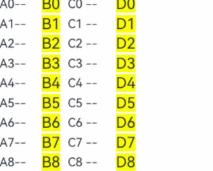
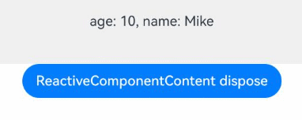
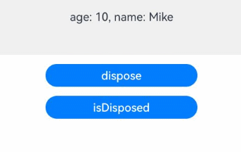

# ComponentContent
<!--Kit: ArkUI-->
<!--Subsystem: ArkUI-->
<!--Owner: @liyi0309-->
<!--Designer: @liyi0309-->
<!--Tester: @lxl007-->
<!--Adviser: @Brilliantry_Rui-->

有两种创建实体封装组件的方式。开发者在开发过程中任选下面方式其一即可。

ComponentContent表示组件内容的实体封装，其对象支持在非UI组件中创建与传递，便于开发者对弹窗类组件进行解耦封装。其底层使用了BuilderNode，具体使用规格参考[BuilderNode](js-apis-arkui-builderNode.md)。

ReactiveComponentContent表示组件内容的实体封装，其对象支持在非UI组件中创建与传递，便于开发者对弹窗类组件进行解耦封装。其底层使用了ReactiveBuilderNode，具体使用规格参考[ReactiveBuilderNode](js-apis-arkui-builderNode.md#reactivebuildernode22)。

> **说明：**
> 
> 本模块首批接口从API version 12开始支持。后续版本的新增接口，采用上角标单独标记接口的起始版本。
> 
> 当前不支持在预览器中使用ComponentContent和ReactiveComponentContent。


## 导入模块

```ts
import { ComponentContent, ReactiveComponentContent } from '@kit.ArkUI';
```

## ComponentContent

继承自[Content](js-apis-arkui-Content.md#content-1)。

**原子化服务API：** 从API version 12开始，该接口支持在原子化服务中使用。

**系统能力：** SystemCapability.ArkUI.ArkUI.Full

### constructor

constructor(uiContext: UIContext, builder: WrappedBuilder\<[]>)

ComponentContent的构造函数。

**原子化服务API：** 从API version 12开始，该接口支持在原子化服务中使用。

**系统能力：** SystemCapability.ArkUI.ArkUI.Full

**参数：**

| 参数名    | 类型                                      | 必填 | 说明                               |
| --------- | ----------------------------------------- | ---- | ---------------------------------- |
| uiContext | [UIContext](./arkts-apis-uicontext-uicontext.md) | 是   | 创建对应节点时所需要的UI上下文。 |
| builder  | [WrappedBuilder\<[]>](../../ui/state-management/arkts-wrapBuilder.md) | 是   |   封装不带参builder函数的WrappedBuilder对象。 |

### constructor

constructor(uiContext: UIContext, builder: WrappedBuilder\<[T]>, args: T)

ComponentContent的构造函数。

**原子化服务API：** 从API version 12开始，该接口支持在原子化服务中使用。

**系统能力：** SystemCapability.ArkUI.ArkUI.Full

**参数：**

| 参数名    | 类型                                      | 必填 | 说明                               |
| --------- | ----------------------------------------- | ---- | ---------------------------------- |
| uiContext | [UIContext](./arkts-apis-uicontext-uicontext.md) | 是   | 创建对应节点时所需要的UI上下文。 |
| builder  | [WrappedBuilder\<[T]>](../../ui/state-management/arkts-wrapBuilder.md) | 是   |   封装带参builder函数的WrappedBuilder对象。 |
| args     |     T     |   是   |   WrappedBuilder对象封装的builder函数的参数。 |

### constructor

  constructor(uiContext: UIContext, builder: WrappedBuilder\<[T]>, args: T, options: BuildOptions)

ComponentContent的构造函数。

**原子化服务API：** 从API version 12开始，该接口支持在原子化服务中使用。

**系统能力：** SystemCapability.ArkUI.ArkUI.Full

**参数：**

| 参数名    | 类型                                      | 必填 | 说明                               |
| --------- | ----------------------------------------- | ---- | ---------------------------------- |
| uiContext | [UIContext](./arkts-apis-uicontext-uicontext.md) | 是   | 创建对应节点时所需要的UI上下文。 |
| builder  | [WrappedBuilder\<[T]>](../../ui/state-management/arkts-wrapBuilder.md) | 是   |   封装带参builder函数的WrappedBuilder对象。 |
| args     |     T     |   是   |   WrappedBuilder对象封装的builder函数的参数。 |
| options | [BuildOptions](./js-apis-arkui-builderNode.md#buildoptions12)                                                    | 是   |  build的配置参数，判断是否支持@Builder中嵌套@Builder的行为。                                         |

**示例：**
``` ts
import { ComponentContent, NodeContent, typeNode } from "@kit.ArkUI";

interface ParamsInterface {
  text: string;
  func: Function;
}

@Builder
function buildTextWithFunc(fun: Function) {
  Text(fun())
    .fontSize(50)
    .fontWeight(FontWeight.Bold)
    .margin({ bottom: 36 })
}

@Builder
function buildText(params: ParamsInterface) {
  Column() {
    Text(params.text)
      .fontSize(50)
      .fontWeight(FontWeight.Bold)
      .margin({ bottom: 36 })
    buildTextWithFunc(params.func)
  }
}

@Entry
@Component
struct Index {
  @State message: string = "HELLO";
  private content: NodeContent = new NodeContent();

  build() {
    Row() {
      Column() {
        Button('addComponentContent')
          .onClick(() => {
            let column = typeNode.createNode(this.getUIContext(), "Column");
            column.initialize();
            column.addComponentContent(new ComponentContent<ParamsInterface>(this.getUIContext(),
              wrapBuilder<[ParamsInterface]>(buildText), {
                text: this.message, func: () => {
                  return "FUNCTION"
                }
              }, { nestingBuilderSupported: true }));
            this.content.addFrameNode(column);
          })
        ContentSlot(this.content)
      }
      .id("column")
      .width('100%')
      .height('100%')
    }
    .height('100%')
  }
}

```

### update

update(args: T): void

用于更新[WrappedBuilder](../../ui/state-management/arkts-wrapBuilder.md)对象封装的builder函数参数，与constructor传入的参数类型保持一致。

**原子化服务API：** 从API version 12开始，该接口支持在原子化服务中使用。

**系统能力：** SystemCapability.ArkUI.ArkUI.Full

**参数：**

| 参数名 | 类型 | 必填 | 说明                                                         |
| ------ | ---- | ---- | ------------------------------------------------------------ |
| args   | T    | 是   | 用于更新[WrappedBuilder](../../ui/state-management/arkts-wrapBuilder.md)对象封装的builder函数参数，与constructor传入的参数类型保持一致。 |

**示例：**

```ts
import { ComponentContent } from "@kit.ArkUI";

class Params {
  text: string = "";
  constructor(text: string) {
    this.text = text;
  }
}

@Builder
function buildText(params: Params) {
  Column() {
    Text(params.text)
      .fontSize(50)
      .fontWeight(FontWeight.Bold)
      .margin({bottom: 36})
  }.backgroundColor('#FFF0F0F0')
}

@Entry
@Component
struct Index {
  @State message: string = "hello";

  build() {
    Row() {
      Column() {
        Button("click me")
            .onClick(() => {
                let uiContext = this.getUIContext();
                let promptAction = uiContext.getPromptAction();
                let contentNode = new ComponentContent(uiContext, wrapBuilder(buildText), new Params(this.message));
                promptAction.openCustomDialog(contentNode);

                setTimeout(() => {
                  contentNode.update(new Params("new message"));
                }, 2000);    //2秒后自动更新弹窗内容文本
            })
      }
      .width('100%')
      .height('100%')
    }
    .height('100%')
  }
}
```

### reuse

reuse(param?: Object): void

触发ComponentContent中的自定义组件的复用。组件复用请参见[@Reusable装饰器：组件复用](../../ui/state-management/arkts-reusable.md)。关于ComponentContent的解绑场景请参见[解除实体节点引用关系](../../ui/arkts-user-defined-arktsNode-builderNode.md#解除实体节点引用关系)。

**原子化服务API：** 从API version 12开始，该接口支持在原子化服务中使用。

**系统能力：** SystemCapability.ArkUI.ArkUI.Full

**参数：**

| 参数名 | 类型   | 必填 | 说明                                                                     |
| ------ | ------ | ---- | ------------------------------------------------------------------------ |
| param  | Object | 否   | 用于复用ComponentContent的参数。该参数将直接用于ComponentContent中所有顶层自定义组件的复用，应该包含每个自定义组件的构造函数参数所需内容，否则会导致未定义行为。调用此方法将同步触发内部自定义组件的[aboutToReuse](../../reference//apis-arkui/arkui-ts/ts-custom-component-lifecycle.md#abouttoreuse10)生命周期回调，并将该参数作为回调的入参。默认值为undefined，此时ComponentContent中的自定义组件将直接使用构造时的数据源。 |

### recycle

recycle(): void

- 触发ComponentContent中自定义组件的回收。自定义组件的回收是组件复用机制中的环节，具体信息请参见[@Reusable装饰器：组件复用](../../ui/state-management/arkts-reusable.md)。
- ComponentContent通过reuse和recycle完成其内外自定义组件之间的复用事件传递，具体使用场景请参见[BuilderNode调用reuse和recycle接口实现节点复用能力](../../ui/arkts-user-defined-arktsNode-builderNode.md#buildernode调用reuse和recycle接口实现节点复用能力)。

**原子化服务API：** 从API version 12开始，该接口支持在原子化服务中使用。

**系统能力：** SystemCapability.ArkUI.ArkUI.Full

```ts
import { NodeContent, typeNode, ComponentContent } from "@kit.ArkUI";

const TEST_TAG: string = "Reuse+Recycle";

class MyDataSource {
  private dataArray: string[] = [];
  private listener: DataChangeListener | null = null;

  public totalCount(): number {
    return this.dataArray.length;
  }

  public getData(index: number) {
    return this.dataArray[index];
  }

  public pushData(data: string) {
    this.dataArray.push(data);
  }

  public reloadListener(): void {
    this.listener?.onDataReloaded();
  }

  public registerDataChangeListener(listener: DataChangeListener): void {
    this.listener = listener;
  }

  public unregisterDataChangeListener(): void {
    this.listener = null;
  }
}

class Params {
  item: string = '';

  constructor(item: string) {
    this.item = item;
  }
}

@Builder
function buildNode(param: Params = new Params("hello")) {
  Row() {
    Text(`C${param.item} -- `)
    ReusableChildComponent2({ item: param.item }) //该自定义组件在ComponentContent中无法被正确复用
  }
}

// 被回收复用的自定义组件，其状态变量会更新，而子自定义组件ReusableChildComponent3中的状态变量也会更新，但ComponentContent会阻断这一传递过程
@Reusable
@Component
struct ReusableChildComponent {
  @Prop item: string = '';
  @Prop switch: string = '';
  private content: NodeContent = new NodeContent();
  private componentContent: ComponentContent<Params> = new ComponentContent<Params>(
    this.getUIContext(),
    wrapBuilder<[Params]>(buildNode),
    new Params(this.item),
    { nestingBuilderSupported: true });

  aboutToAppear() {
    let column = typeNode.createNode(this.getUIContext(), "Column");
    column.initialize();
    column.addComponentContent(this.componentContent);
    this.content.addFrameNode(column);
  }

  aboutToRecycle(): void {
    console.info(`${TEST_TAG} ReusableChildComponent aboutToRecycle ${this.item}`);

    // 当开关为open，通过ComponentContent的reuse接口和recycle接口传递给其下的自定义组件，例如ReusableChildComponent2，完成复用
    if (this.switch === 'open') {
      this.componentContent.recycle();
    }
  }

  aboutToReuse(params: object): void {
    console.info(`${TEST_TAG} ReusableChildComponent aboutToReuse ${JSON.stringify(params)}`);

    // 当开关为open，通过ComponentContent的reuse接口和recycle接口传递给其下的自定义组件，例如ReusableChildComponent2，完成复用
    if (this.switch === 'open') {
      this.componentContent.reuse(params);
    }
  }

  build() {
    Row() {
      Text(`A${this.item}--`)
      ReusableChildComponent3({ item: this.item })
      ContentSlot(this.content)
    }
  }
}

@Component
struct ReusableChildComponent2 {
  @Prop item: string = "false";

  aboutToReuse(params: Record<string, object>) {
    console.info(`${TEST_TAG} ReusableChildComponent2 aboutToReuse ${JSON.stringify(params)}`);
  }

  aboutToRecycle(): void {
    console.info(`${TEST_TAG} ReusableChildComponent2 aboutToRecycle ${this.item}`);
  }

  build() {
    Row() {
      Text(`D${this.item}`)
        .fontSize(20)
        .backgroundColor(Color.Yellow)
        .margin({ left: 10 })
    }.margin({ left: 10, right: 10 })
  }
}

@Component
struct ReusableChildComponent3 {
  @Prop item: string = "false";

  aboutToReuse(params: Record<string, object>) {
    console.info(`${TEST_TAG} ReusableChildComponent3 aboutToReuse ${JSON.stringify(params)}`);
  }

  aboutToRecycle(): void {
    console.info(`${TEST_TAG} ReusableChildComponent3 aboutToRecycle ${this.item}`);
  }

  build() {
    Row() {
      Text(`B${this.item}`)
        .fontSize(20)
        .backgroundColor(Color.Yellow)
        .margin({ left: 10 })
    }.margin({ left: 10, right: 10 })
  }
}


@Entry
@Component
struct Index {
  @State data: MyDataSource = new MyDataSource();

  aboutToAppear() {
    for (let i = 0; i < 100; i++) {
      this.data.pushData(i.toString());
    }
  }

  build() {
    Column() {
      List({ space: 3 }) {
        LazyForEach(this.data, (item: string) => {
          ListItem() {
            ReusableChildComponent({
              item: item,
              switch: 'open' // 将open改为close可观察到，ComponentContent不通过reuse和recycle接口传递复用时，ComponentContent内部的自定义组件的行为表现
            })
          }
        }, (item: string) => item)
      }
      .width('100%')
      .height('100%')
    }
  }
}
```

### dispose

dispose(): void

立即释放当前ComponentContent对象对[基本概念：实体节点](../../ui/arkts-user-defined-node.md#基本概念)的引用关系。关于ComponentContent的解绑场景请参见[解除实体节点引用关系](../../ui/arkts-user-defined-arktsNode-builderNode.md#解除实体节点引用关系)。

> **说明：**
>
> 当ComponentContent对象调用dispose之后，会与后端实体节点解除引用关系。若前端对象ComponentContent无法释放，容易导致内存泄漏。建议在不再需要操作该ComponentContent对象时，开发者主动调用dispose释放后端节点，以减少引用关系的复杂性，降低内存泄漏的风险。

**原子化服务API：** 从API version 12开始，该接口支持在原子化服务中使用。

**系统能力：** SystemCapability.ArkUI.ArkUI.Full

**示例：** 

```ts
import { BusinessError } from '@kit.BasicServicesKit';
import { ComponentContent } from '@kit.ArkUI';

class Params {
  text: string = "";
  constructor(text: string) {
    this.text = text;
  }
}

@Builder
function buildText(params: Params) {
  Column() {
    Text(params.text)
      .fontSize(50)
      .fontWeight(FontWeight.Bold)
      .margin({ bottom: 36 })
  }.backgroundColor('#FFF0F0F0')
}

@Entry
@Component
struct Index {
  @State message: string = "hello";

  build() {
    Row() {
      Column() {
        Button("click me")
            .onClick(() => {
                let uiContext = this.getUIContext();
                let promptAction = uiContext.getPromptAction();
                let contentNode = new ComponentContent(uiContext, wrapBuilder(buildText), new Params(this.message));
                promptAction.openCustomDialog(contentNode);

                setTimeout(() => {
                  promptAction.closeCustomDialog(contentNode)
                    .then(() => {
                      console.info('customDialog closed.');
                      if (contentNode !== null) {
                        contentNode.dispose();   //释放contentNode
                      }
                    }).catch((error: BusinessError) => {
                      let message = (error as BusinessError).message;
                      let code = (error as BusinessError).code;
                      console.error(`closeCustomDialog args error code is ${code}, message is ${message}`);
                    })
                }, 2000);     //2秒后自动关闭
            })
      }
      .width('100%')
      .height('100%')
    }
    .height('100%')
  }
}
```


### updateConfiguration

updateConfiguration(): void

传递[系统环境变化](../apis-ability-kit/js-apis-app-ability-configuration.md)事件，触发节点的全量更新。

**原子化服务API：** 从API version 12开始，该接口支持在原子化服务中使用。

**系统能力：** SystemCapability.ArkUI.ArkUI.Full

> **说明：**
>
> updateConfiguration接口用于通知对象更新当前的系统环境变化。

**示例：**
```ts
import { NodeController, FrameNode, ComponentContent, UIContext, FrameCallback } from '@kit.ArkUI';
import { AbilityConstant, Configuration, EnvironmentCallback, ConfigurationConstant } from '@kit.AbilityKit';

@Builder
function buildText() {
  Column() {
    Text('Hello')
      .fontSize(36)
      .fontWeight(FontWeight.Bold)
  }
  .backgroundColor($r('sys.color.ohos_id_color_background'))
  .width('100%')
  .alignItems(HorizontalAlign.Center)
  .padding(16)
}

const componentContentMap: Array<ComponentContent<[Object]>> = new Array();

class MyNodeController extends NodeController {
  private rootNode: FrameNode | null = null;

  makeNode(uiContext: UIContext): FrameNode | null {
    return this.rootNode;
  }

  createNode(context: UIContext) {
    this.rootNode = new FrameNode(context);
    let component = new ComponentContent<Object>(context, wrapBuilder(buildText));
    componentContentMap.push(component);
    this.rootNode.addComponentContent(component);
  }

  deleteNode() {
    let node = componentContentMap.pop();
    this.rootNode?.dispose();
    node?.dispose();
  }
}

class MyFrameCallback extends FrameCallback {
  onFrame() {
    updateColorMode();
  }
}

function updateColorMode() {
  componentContentMap.forEach((value, index) => {
    value.updateConfiguration();
  })
}

@Entry
@Component
struct FrameNodeTypeTest {
  private myNodeController: MyNodeController = new MyNodeController();

  aboutToAppear(): void {
    let environmentCallback: EnvironmentCallback = {
      onMemoryLevel: (level: AbilityConstant.MemoryLevel): void => {
        console.info('onMemoryLevel');
      },
      onConfigurationUpdated: (config: Configuration): void => {
        console.info(`onConfigurationUpdated ${config}`);
        this.getUIContext()?.postFrameCallback(new MyFrameCallback());
      }
    }
    // 注册监听回调
    this.getUIContext().getHostContext()?.getApplicationContext().on('environment', environmentCallback);
    // 设置应用深浅色跟随系统
    this.getUIContext()
      .getHostContext()?.getApplicationContext().setColorMode(ConfigurationConstant.ColorMode.COLOR_MODE_NOT_SET);
    this.myNodeController.createNode(this.getUIContext());
  }

  aboutToDisappear(): void {
    //移除map中的引用，并将自定义节点释放
    this.myNodeController.deleteNode();
  }

  build() {
    Column({ space: 16 }) {
      NodeContainer(this.myNodeController);
      Button('切换深色')
        .onClick(() => {
          this.getUIContext()
            .getHostContext()?.getApplicationContext().setColorMode(ConfigurationConstant.ColorMode.COLOR_MODE_DARK);
        })
      Button('设置浅色')
        .onClick(() => {
          this.getUIContext()
            .getHostContext()?.getApplicationContext().setColorMode(ConfigurationConstant.ColorMode.COLOR_MODE_LIGHT);
        })
    }
  }
}
```

### isDisposed<sup>20+</sup>

isDisposed(): boolean

查询当前ComponentContent对象是否已解除与后端实体节点的引用关系。前端节点均绑定有相应的后端实体节点，当节点调用dispose接口解除绑定后，再次调用接口可能会出现crash、返回默认值的情况。由于业务需求，可能存在节点在dispose后仍被调用接口的情况。为此，提供此接口以供开发者在操作节点前检查其有效性，避免潜在风险。


**原子化服务API：** 从API version 20开始，该接口支持在原子化服务中使用。

**系统能力：** SystemCapability.ArkUI.ArkUI.Full

**返回值：**

| 类型    | 说明               |
| ------- | ------------------ |
| boolean | 后端实体节点是否解除引用。true为节点已与后端实体节点解除引用，false为节点未与后端实体节点解除引用。|

**示例：**

```ts
import { BusinessError } from '@kit.BasicServicesKit';
import { ComponentContent } from '@kit.ArkUI';

class Params {
  text: string = "";
  constructor(text: string) {
    this.text = text;
  }
}

@Builder
function buildText(params: Params) {
  Column() {
    Text(params.text)
      .fontSize(50)
      .fontWeight(FontWeight.Bold)
      .margin({ bottom: 36 })
  }.backgroundColor('#FFF0F0F0')
}

@Entry
@Component
struct Index {
  @State message: string = "hello";
  @State beforeDispose: string = ''
  @State afterDispose: string = ''

  build() {
    Row() {
      Column() {
        Button("click me")
          .onClick(() => {
            let uiContext = this.getUIContext();
            let promptAction = uiContext.getPromptAction();
            let contentNode = new ComponentContent(uiContext, wrapBuilder(buildText), new Params(this.message));
            promptAction.openCustomDialog(contentNode);

            setTimeout(() => {
              promptAction.closeCustomDialog(contentNode)
                .then(() => {
                  console.info('customDialog closed.');
                  if (contentNode !== null) {
                    this.beforeDispose = contentNode.isDisposed() ? 'before dispose componentContent isDisposed is true' : 'before dispose componentContent isDisposed is false';
                    contentNode.dispose();   //释放contentNode
                    this.afterDispose = contentNode.isDisposed() ? 'after dispose componentContent isDisposed is true' : 'after dispose componentContent isDisposed is false';
                  }
                }).catch((error: BusinessError) => {
                let message = (error as BusinessError).message;
                let code = (error as BusinessError).code;
                console.error(`closeCustomDialog args error code is ${code}, message is ${message}`);
              })
            }, 1000);     //1秒后自动关闭
          })
        Text(this.beforeDispose)
          .fontSize(25)
          .margin({ top: 10, bottom: 10 })
        Text(this.afterDispose)
          .fontSize(25)
      }
      .width('100%')
      .height('100%')
    }
    .height('100%')
  }
}
```


### inheritFreezeOptions<sup>20+</sup>

inheritFreezeOptions(enabled: boolean): void

查询当前ComponentContent对象是否设置为继承父组件中自定义组件的冻结策略。如果设置继承状态为false，则ComponentContent对象的冻结策略为false。在这种情况下，节点在不活跃状态下不会被冻结。

> **说明：**
>
> ComponentContent设置inheritFreezeOptions为true，且父组件为自定义组件、BuilderNode、ComponentContent、ReactiveBuilderNode或ReactiveComponentContent时，会继承父组件的冻结策略。当子组件为自定义组件时，其冻结策略不会传递给子组件。

**原子化服务API：** 从API version 20开始，该接口支持在原子化服务中使用。

**系统能力：** SystemCapability.ArkUI.ArkUI.Full

**参数：**

| 参数名 | 类型   | 必填 | 说明                                                                     |
| ------ | ------ | ---- | ------------------------------------------------------------------------ |
| enabled  | boolean | 是  | ComponentContent对象是否设置为继承父组件中自定义组件的冻结策略。true为继承父组件中自定义组件的冻结策略，false为不继承父组件中自定义组件的冻结策略。 |

**示例：**

```ts

import { ComponentContent, FrameNode, NodeController } from '@kit.ArkUI';

class Params {
  count: number = 0;

  constructor(count: number) {
    this.count = count;
  }
}

@Builder // builder组件
function buildText(params: Params) {

  Column() {
    TextBuilder({ message: params.count })
  }
}

class TextNodeController extends NodeController {
  private rootNode: FrameNode | null = null;
  private contentNode: ComponentContent<Params> | null = null;
  private count: number = 0;

  makeNode(context: UIContext): FrameNode | null {
    this.rootNode = new FrameNode(context);
    this.contentNode = new ComponentContent(context, wrapBuilder(buildText), new Params(this.count)); // 通过buildText创建ComponentContent
    this.contentNode.inheritFreezeOptions(true); // 设置ComponentContent的冻结继承状态为True
    if (this.rootNode !== null) {
      this.rootNode.addComponentContent(this.contentNode); // 将ComponentContent上树
    }
    return this.rootNode;
  }

  update(): void {
    if (this.contentNode !== null) {
      this.count += 1;
      this.contentNode.update(new Params(this.count)); // 更新ComponentContent中的数据，可以触发Log
    }
  }
}

const textNodeController: TextNodeController = new TextNodeController();

@Entry
@Component
struct MyNavigationTestStack {
  @Provide('pageInfo') pageInfo: NavPathStack = new NavPathStack();
  @State message: number = 0;
  @State logNumber: number = 0;

  @Builder
  PageMap(name: string) {
    if (name === 'pageOne') {
      pageOneStack({ message: this.message, logNumber: this.logNumber })
    } else if (name === 'pageTwo') {
      pageTwoStack({ message: this.message, logNumber: this.logNumber })
    }
  }

  build() {
    Column() {
      Button('update ComponentContent') // 点击更新ComponentContent
        .onClick(() => {
          textNodeController.update();
        })
      Navigation(this.pageInfo) {
        Column() {
          Button('Next Page', { stateEffect: true, type: ButtonType.Capsule })
            .width('80%')
            .height(40)
            .margin(20)
            .onClick(() => {
              this.pageInfo.pushPath({ name: 'pageOne' }); // 将name指定的NavDestination页面信息入栈
            })
        }
      }.title('NavIndex')
      .navDestination(this.PageMap)
      .mode(NavigationMode.Stack)
    }
  }
}

@Component
struct pageOneStack { // 页面一
  @Consume('pageInfo') pageInfo: NavPathStack;
  @State index: number = 1;
  @Link message: number;
  @Link logNumber: number;

  build() {
    NavDestination() {
      Column() {
        NavigationContentMsgStack({ message: this.message, index: this.index, logNumber: this.logNumber })
        Button('Next Page', { stateEffect: true, type: ButtonType.Capsule }) // 切换至页面二
          .width('80%')
          .height(40)
          .margin(20)
          .onClick(() => {
            this.pageInfo.pushPathByName('pageTwo', null);
          })
        Button('Back Page', { stateEffect: true, type: ButtonType.Capsule }) // 返回主页面
          .width('80%')
          .height(40)
          .margin(20)
          .onClick(() => {
            this.pageInfo.pop();
          })
      }.width('100%').height('100%')
    }.title('pageOne')
    .onBackPressed(() => {
      this.pageInfo.pop();
      return true;
    })
  }
}

@Component
struct pageTwoStack { // 页面二
  @Consume('pageInfo') pageInfo: NavPathStack;
  @State index: number = 2;
  @Link message: number;
  @Link logNumber: number;

  build() {
    NavDestination() {
      Column() {
        NavigationContentMsgStack({ message: this.message, index: this.index, logNumber: this.logNumber })
        Text('BuilderNode处于冻结')
          .fontWeight(FontWeight.Bold)
          .margin({ top: 48, bottom: 48 })
        Button('Back Page', { stateEffect: true, type: ButtonType.Capsule }) // 返回至页面一
          .width('80%')
          .height(40)
          .margin(20)
          .onClick(() => {
            this.pageInfo.pop();
          })
      }.width('100%').height('100%')
    }.title('pageTwo')
    .onBackPressed(() => {
      this.pageInfo.pop();
      return true;
    })
  }
}

@Component({ freezeWhenInactive: true }) // 设置冻结策略为不活跃冻结
struct NavigationContentMsgStack {
  @Link message: number;
  @Link index: number;
  @Link logNumber: number;

  build() {
    Column() {
      if (this.index === 1) {
        NodeContainer(textNodeController)
      }
    }
  }
}

@Component({ freezeWhenInactive: true }) // 设置冻结策略为不活跃冻结
struct TextBuilder {
  @Prop @Watch("info") message: number = 0;

  info() {
    console.info(`freeze-test TextBuilder message callback ${this.message}`); // 根据message内容变化来打印日志来判断是否冻结
  }

  build() {
    Row() {
      Column() {
        Text(`文本更新次数： ${this.message}`)
          .fontWeight(FontWeight.Bold)
          .margin({ top: 48, bottom: 48 })
      }
    }
  }
}
```


## ReactiveComponentContent<sup>22+</sup>

ReactiveComponentContent继承自[Content](js-apis-arkui-Content.md#content-1)，是一个用于动态承载和复用UI内容的容器组件。它通过@Builder函数构建UI，并利用[ReactiveBuilderNode](./js-apis-arkui-builderNode.md#reactivebuildernode22)生成和管理组件树。该组件的核心价值在于为动态内容提供完整的生命周期管理，使其能够融入ArkUI的组件复用体系，特别适用于长列表等需要高性能渲染的场景。

**原子化服务API：** 从API version 22开始，该接口支持在原子化服务中使用。

**系统能力：** SystemCapability.ArkUI.ArkUI.Full

### constructor<sup>22+</sup>

constructor(uiContext: UIContext, builder: WrappedBuilder&lt;T&gt;, config: BuildOptions, ...args: T)

ReactiveComponentContent的构造函数。

**原子化服务API：** 从API version 22开始，该接口支持在原子化服务中使用。

**系统能力：** SystemCapability.ArkUI.ArkUI.Full

**参数：**

| 参数名    | 类型                                      | 必填 | 说明                               |
| --------- | ----------------------------------------- | ---- | ---------------------------------- |
| uiContext | [UIContext](./arkts-apis-uicontext-uicontext.md) | 是   | 创建对应节点时所需的UI上下文。 |
| builder  | [WrappedBuilder\<T>](../../ui/state-management/arkts-wrapBuilder.md) | 是   |   封装带参@Builder函数的WrappedBuilder对象。 |
| config | [BuildOptions](./js-apis-arkui-builderNode.md#buildoptions12)  | 是   |  作用是配置Builder的构建行为，BuildOptions中所有属性都是可选的，默认值为BuildOptions中对应的默认值。                                        |
| ...args     | T      | 否   | WrappedBuilder对象封装的builder函数的参数。负责将外部数据传递给构造函数中指定的WrappedBuilder&lt;T&gt;构建函数。支持多个入参。默认值为undefined。|

**示例：**

该示例展示了如何使用ReactiveComponentContent构造函数动态创建包含响应式内容的UI组件，实现了Builder函数的嵌套调用和函数参数的灵活传递。

``` ts
import { ReactiveComponentContent, NodeContent, typeNode } from '@kit.ArkUI';

@Builder
function buildTextWithFunc(fun: Function) {
  Text(fun())
    .fontSize(20)
    .fontWeight(FontWeight.Bold)
    .margin({ bottom: 36 })
}

@Builder
function buildText(text: string, func: Function) {
  Column() {
    Text(text)
      .fontSize(20)
      .fontWeight(FontWeight.Bold)
      .margin({ bottom: 12 })
    buildTextWithFunc(func)
  }
}

@Entry
@Component
struct Index {
  @State message: string = 'HELLO';
  private content: NodeContent = new NodeContent();

  build() {
    Row() {
      Column({ space: 12 }) {
        Button('addComponentContent')
          .onClick(() => {
            // 动态创建Column节点
            let column = typeNode.createNode(this.getUIContext(), 'Column');
            column.initialize();
            // 创建ReactiveComponentContent并添加到Column节点
            column.addComponentContent(new ReactiveComponentContent<[string, Function]>(this.getUIContext(),
              wrapBuilder<[string, Function]>(buildText), { nestingBuilderSupported: true },
              this.message,
              () => {
                return 'FUNCTION'
              }
            ));
            // 将构建好的节点添加到内容容器
            this.content.addFrameNode(column);
          })
        ContentSlot(this.content) // 显示动态添加的内容
      }
      .id('column')
      .width('100%')
      .height('100%')
    }
    .height('100%')
  }
}
```


### reuse<sup>22+</sup>

reuse(param?: Object): void

触发ReactiveComponentContent中的自定义组件的复用。组件复用请参见[@Reusable装饰器：组件复用](../../ui/state-management/arkts-reusable.md)。关于ReactiveComponentContent的解绑场景请参见[解除实体节点引用关系](../../ui/arkts-user-defined-arktsNode-builderNode.md#解除实体节点引用关系)。

ReactiveComponentContent通过reuse和[recycle](#recycle)接口完成其内外自定义组件之间的复用事件传递，具体使用场景请参见[BuilderNode调用reuse和recycle接口实现节点复用能力](../../ui/arkts-user-defined-arktsNode-builderNode.md#buildernode调用reuse和recycle接口实现节点复用能力)。

**原子化服务API：** 从API version 22开始，该接口支持在原子化服务中使用。

**系统能力：** SystemCapability.ArkUI.ArkUI.Full

**参数：**

| 参数名 | 类型   | 必填 | 说明                                                                     |
| ------ | ------ | ---- | ------------------------------------------------------------------------ |
| param  | Object | 否   | 用于复用[ReactiveComponentContent](./js-apis-arkui-builderNode.md#reactivebuildernode22)的参数。该参数将直接用于ReactiveComponentContent中所有顶层自定义组件的复用，应该包含每个自定义组件的构造函数参数所需内容，否则会导致未定义行为。调用此方法将同步触发内部自定义组件的[aboutToReuse](../../reference//apis-arkui/arkui-ts/ts-custom-component-lifecycle.md#abouttoreuse10)生命周期回调，并将该参数作为回调的入参。默认值为undefined，此时ReactiveComponentContent中的自定义组件将直接使用构造时的数据源。 |

**示例：**

请参考[recycle](#recycle22)中的示例。

### recycle<sup>22+</sup>

recycle(): void

触发ReactiveComponentContent中自定义组件的回收。自定义组件的回收是组件复用机制中的环节，具体信息请参见[@Reusable装饰器：组件复用](../../ui/state-management/arkts-reusable.md)。

ReactiveComponentContent通过[reuse](#reuse)和recycle完成其内外自定义组件之间的复用事件传递，具体使用场景请参见[BuilderNode调用reuse和recycle接口实现节点复用能力](../../ui/arkts-user-defined-arktsNode-builderNode.md#buildernode调用reuse和recycle接口实现节点复用能力)。

**原子化服务API：** 从API version 22开始，该接口支持在原子化服务中使用。

**系统能力：** SystemCapability.ArkUI.ArkUI.Full

**示例：**

实现了一个包含多层组件复用的高性能长列表，通过ReactiveComponentContent动态管理Builder内容，在列表滚动时实现组件的自动回收与复用。

```ts
import { NodeContent, typeNode, ReactiveComponentContent } from '@kit.ArkUI';

const TEST_TAG: string = 'Reuse+Recycle';

// 自定义数据源类，用于管理列表数据
class MyDataSource {
  private dataArray: string[] = [];
  private listener: DataChangeListener | null = null;

  public totalCount(): number {
    return this.dataArray.length;
  }

  public getData(index: number) {
    return this.dataArray[index];
  }

  public pushData(data: string) {
    this.dataArray.push(data);
  }

  public reloadListener(): void {
    this.listener?.onDataReloaded();
  }

  public registerDataChangeListener(listener: DataChangeListener): void {
    this.listener = listener;
  }

  public unregisterDataChangeListener(): void {
    this.listener = null;
  }
}

@Builder
function buildNode(param: string) {
  Row() {
    Text(`C${param} -- `)
    ReusableChildComponent2({ item: param })
  }
}

@Reusable
@Component
struct ReusableChildComponent {
  @Prop item: string = '';
  @Prop switch: string = '';
  private content: NodeContent = new NodeContent();
  
  // 创建ReactiveComponentContent实例，封装Builder动态内容
  private componentContent: ReactiveComponentContent<[string]> = new ReactiveComponentContent<[string]>(
    this.getUIContext(),
    wrapBuilder<[string]>(buildNode),
    { nestingBuilderSupported: true },
    this.item);

  aboutToAppear() {
    let column = typeNode.createNode(this.getUIContext(), 'Column');
    column.initialize();
    column.addComponentContent(this.componentContent);
    this.content.addFrameNode(column);
  }

  // 组件回收生命周期回调
  aboutToRecycle(): void {
    console.info(`${TEST_TAG} ReusableChildComponent aboutToRecycle ${this.item}`);

    // 当开关开启时，触发内部ReactiveComponentContent的回收
    if (this.switch === 'open') {
      this.componentContent.recycle();
    }
  }

  // 组件复用时命周期回调
  aboutToReuse(params: object): void {
    console.info(`${TEST_TAG} ReusableChildComponent aboutToReuse ${JSON.stringify(params)}`);

    // 当开关开启时，触发内部ReactiveComponentContent的复用
    if (this.switch === 'open') {
      this.componentContent.reuse(params);
    }
  }

  build() {
    Row() {
      Text(`A${this.item}--`)
      ReusableChildComponent3({ item: this.item })
      ContentSlot(this.content)
    }
  }
}

@Component
struct ReusableChildComponent2 {
  @Prop item: string = 'false';

  aboutToReuse(params: Record<string, object>) {
    console.info(`${TEST_TAG} ReusableChildComponent2 aboutToReuse ${JSON.stringify(params)}`);
  }

  aboutToRecycle(): void {
    console.info(`${TEST_TAG} ReusableChildComponent2 aboutToRecycle ${this.item}`);
  }

  build() {
    Row() {
      Text(`D${this.item}`)
        .fontSize(20)
        .backgroundColor(Color.Yellow)
        .margin({ left: 10 })
    }.margin({ left: 10, right: 10 })
  }
}

@Component
struct ReusableChildComponent3 {
  @Prop item: string = 'false';

  aboutToReuse(params: Record<string, object>) {
    console.info(`${TEST_TAG} ReusableChildComponent3 aboutToReuse ${JSON.stringify(params)}`);
  }

  aboutToRecycle(): void {
    console.info(`${TEST_TAG} ReusableChildComponent3 aboutToRecycle ${this.item}`);
  }

  build() {
    Row() {
      Text(`B${this.item}`)
        .fontSize(20)
        .backgroundColor(Color.Yellow)
        .margin({ left: 10 })
    }.margin({ left: 10, right: 10 })
  }
}

@Entry
@Component
struct Index {
  @State data: MyDataSource = new MyDataSource();

  aboutToAppear() {
    // 初始化100条测试数据
    for (let i = 0; i < 100; i++) {
      this.data.pushData(i.toString());
    }
  }

  build() {
    Column() {
      // 使用LazyForEach渲染长列表，启用组件复用
      List({ space: 3 }) {
        LazyForEach(this.data, (item: string) => {
          ListItem() {
            ReusableChildComponent({
              item: item,
              switch: 'open'
            })
          }
        }, (item: string) => item)
      }
      .width('100%')
      .height('100%')
    }
  }
}
```



### dispose<sup>22+</sup>

dispose(): void

> **说明：**
>
> ReactiveComponentContent对象调用dispose接口后，会与后端实体节点解除引用关系。若前端ReactiveComponentContent对象无法释放，容易导致内存泄漏。建议开发者在不需要操作该ReactiveComponentContent对象时，主动调用dispose释放后端节点，以减少引用关系的复杂性，降低内存泄漏风险。

立即释放当前ReactiveComponentContent对象对[实体节点](../../ui/arkts-user-defined-node.md#基本概念)的引用关系。关于ReactiveComponentContent的解绑场景请参见[解除实体节点引用关系](../../ui/arkts-user-defined-arktsNode-builderNode.md#解除实体节点引用关系)。

**原子化服务API：** 从API version 22开始，该接口支持在原子化服务中使用。

**系统能力：** SystemCapability.ArkUI.ArkUI.Full

**示例：**

该示例展示了如何使用dispose接口正确释放ReactiveComponentContent对象，管理节点生命周期。

```ts
import {
  ReactiveComponentContent,
  Binding,
  MutableBinding,
  UIContext,
  UIUtils,
  NodeController,
  FrameNode
} from '@kit.ArkUI';

//dispose
@Builder
function buildText(
  MsgAge: MutableBinding<number>,
  message: MutableBinding<string>
) {
  Column() {
    Row() {
      Text(`age: ${MsgAge.value}, name: ${message.value}`)
    }
  }
  .justifyContent(FlexAlign.Center)
  .alignItems(HorizontalAlign.Center)
  .width('100%')
  .height('100%')
}

interface GeneratedObjectLiteralInterface_1 {
  MsgAge: number;
  message: string;
}

const params: GeneratedObjectLiteralInterface_1 = {
  MsgAge: 10,
  message: 'Mike',
};

class MyNodeController extends NodeController {
  private rootNode: FrameNode | null = null;
  private contentNode: ReactiveComponentContent<[Binding<number>, Binding<string>]> | null = null;

  makeNode(context: UIContext): FrameNode | null {
    // 创建FrameNode作为根容器
    this.rootNode = new FrameNode(context);
    // 创建ReactiveComponentContent响应式内容
    this.contentNode = new ReactiveComponentContent <[Binding<number>, Binding<string>]>(context,
      wrapBuilder<[Binding<number>, Binding<string>]>(buildText),
      {},
      UIUtils.makeBinding<number>(() => params.MsgAge, (val: number) => {
        params.MsgAge = val
        console.info("NodeTest1 get", params.MsgAge);
      }),
      UIUtils.makeBinding<string>(() => params.message, val => {
        console.info("NodeTest2 set before", params.message);
        params.message = val;
        console.info("NodeTest3 set after", params.message);
      }),
    );
    // 将响应式内容添加到根节点
    if (this.rootNode !== null) {
      this.rootNode.addComponentContent(this.contentNode);
    }
    return this.rootNode;
  }

  // 释放资源的方法
  dispose() {
    if (this.contentNode !== null) {
      this.contentNode.dispose(); // 释放ReactiveComponentContent资源
    }
  }
}

@Entry
@Component
struct Index {
  private myNodeController: MyNodeController = new MyNodeController();

  build() {
    Row() {
      Column() {
        // 显示自定义节点内容
        NodeContainer(this.myNodeController)
          .width('100%')
          .height(100)
          .backgroundColor('#FFF0F0F0')
        // 触发资源释放
        Button('ReactiveComponentContent dispose')
          .onClick(() => {
            this.myNodeController.dispose(); // 调用dispose释放资源
          })
      }
      .width('100%')
      .height('100%')
    }
  }
}
```



### updateConfiguration<sup>22+</sup>

updateConfiguration(): void

传递[系统环境变化](../apis-ability-kit/js-apis-app-ability-configuration.md)事件，触发节点的全量更新。可用于通知对象更新，是否更新所使用的系统环境由应用当前的系统环境变化决定。

**原子化服务API：** 从API version 22开始，该接口支持在原子化服务中使用。

**系统能力：** SystemCapability.ArkUI.ArkUI.Full

**示例：**

该示例展示了如何使用updateConfiguration接口响应系统环境配置变化，实现ReactiveComponentContent构建的UI节点的动态适配更新。

```ts
import { NodeController, FrameNode, ReactiveComponentContent, UIContext, FrameCallback } from '@kit.ArkUI';
import { AbilityConstant, Configuration, EnvironmentCallback, ConfigurationConstant } from '@kit.AbilityKit';

@Builder
function buildText() {
  Column() {
    Text('Hello')
      .fontSize(20)
      .fontWeight(FontWeight.Bold)
  }
  .backgroundColor($r('sys.color.ohos_id_color_background')) // 使用系统颜色资源，会根据深浅色模式自动切换
  .width('100%')
  .alignItems(HorizontalAlign.Center)
  .padding(16)
}

const componentContentMap: Array<ReactiveComponentContent<[]>> = new Array();

class MyNodeController extends NodeController {
  private rootNode: FrameNode | null = null;

  makeNode(uiContext: UIContext): FrameNode | null {
    return this.rootNode;
  }

  createNode(context: UIContext) {
    this.rootNode = new FrameNode(context);
    let component = new ReactiveComponentContent<[]>(context, wrapBuilder(buildText), {});
    componentContentMap.push(component);
    this.rootNode.addComponentContent(component);
  }

  deleteNode() {
    let node = componentContentMap.pop();
    this.rootNode?.dispose();
    node?.dispose();
  }
}

class MyFrameCallback extends FrameCallback {
  onFrame() {
    updateColorMode();
  }
}

// 遍历所有ReactiveComponentContent实例，调用updateConfiguration通知系统环境变化
function updateColorMode() {
  componentContentMap.forEach((value, index) => {
    // updateConfiguration()的作用：传递系统环境变化事件，触发节点的全量更新
    // 当系统深浅色模式、语言、字体大小等配置发生变化时，调用此接口会通知ReactiveComponentContent重新应用最新的系统配置
    value.updateConfiguration();
  })
}

@Entry
@Component
struct FrameNodeTypeTest {
  private myNodeController: MyNodeController = new MyNodeController();

  aboutToAppear(): void {
    let environmentCallback: EnvironmentCallback = {
      onMemoryLevel: (level: AbilityConstant.MemoryLevel): void => {
        console.info('onMemoryLevel');
      },
      onConfigurationUpdated: (config: Configuration): void => {
        console.info(`onConfigurationUpdated ${config}`);
        // 当系统配置更新时，通过帧回调触发updateConfiguration调用
        this.getUIContext()?.postFrameCallback(new MyFrameCallback());
      }
    }
    // 注册监听系统环境变化的回调
    this.getUIContext().getHostContext()?.getApplicationContext().on('environment', environmentCallback);
    // 设置应用深浅色跟随系统
    this.getUIContext()
      .getHostContext()?.getApplicationContext().setColorMode(ConfigurationConstant.ColorMode.COLOR_MODE_NOT_SET);
    this.myNodeController.createNode(this.getUIContext());
  }

  aboutToDisappear(): void {
    // 移除componentContentMap中的引用，并将自定义节点释放
    this.myNodeController.deleteNode();
  }

  build() {
    Column({ space: 16 }) {
      NodeContainer(this.myNodeController);
      Button('设置深色')
        .onClick(() => {
          this.getUIContext()
            .getHostContext()?.getApplicationContext().setColorMode(ConfigurationConstant.ColorMode.COLOR_MODE_DARK);
        })
      Button('设置浅色')
        .onClick(() => {
          this.getUIContext()
            .getHostContext()?.getApplicationContext().setColorMode(ConfigurationConstant.ColorMode.COLOR_MODE_LIGHT);
        })
    }
  }
}
```


### flushState<sup>22+</sup>

flushState(): void

更新ReactiveComponentContent。当ReactiveComponentContent中[WrappedBuilder](../../ui/state-management/arkts-wrapBuilder.md)对象封装的builder函数中使用的绑定参数是由V1装饰器（如@Observed）装饰的类实例时，需要在此类数据变更后手动调用本接口更新数据，当使用V2装饰器（如@ObservedV2）装饰的类实例时，支持自动更新，无需手动调用。

**原子化服务API：** 从API version 22开始，该接口支持在原子化服务中使用。

**系统能力：** SystemCapability.ArkUI.ArkUI.Full

**示例：**

该示例展示了flushState接口在ReactiveComponentContent中的使用场景，通过对比V1和V2装饰器的数据更新机制，演示了不同响应式方案下的状态更新策略。

```ts
import {
  ReactiveComponentContent, NodeContent, Binding, UIUtils, typeNode
} from '@kit.ArkUI';

// Builder函数，用于构建显示年龄的文本组件
@Builder
function buildText(age: Binding<number>) {
  Column() {
    Text(`age: ${age.value}`); // 显示年龄值
  }
}

// 使用V2装饰器的类，支持自动状态更新
@ObservedV2
class GeneratedObjectLiteralInterface_1 {
  constructor(age: number) {
    this.age = age;
  }
  @Trace age: number = 0; // 使用@Trace装饰器追踪属性变化
}

// 使用普通类（V1装饰器风格），需要手动触发更新
class GeneratedObjectLiteralInterface_2 {
  constructor(age: number) {
    this.age = age;
  }
  age: number = 0; // 普通属性，无自动追踪
}

@Entry
@ComponentV2
struct Index {
  private content: NodeContent = new NodeContent();
  // V2装饰器的数据对象，支持自动更新
  params: GeneratedObjectLiteralInterface_1 = new GeneratedObjectLiteralInterface_1(25);
  // V1装饰器的数据对象，需要手动更新
  params2: GeneratedObjectLiteralInterface_2 = new GeneratedObjectLiteralInterface_2(25);

  private componentContent: ReactiveComponentContent<[Binding<number>]> | null = null

  build() {
    Row() {
      Scroll() {
        Column({ space: 12 }) {
          // 创建使用V2装饰器的ReactiveComponentContent
          Button('绑定参数由V2装饰器装饰').onClick(
            () => {
              let column = typeNode.createNode(this.getUIContext(), "Column");
              column.initialize();
              // 创建ReactiveComponentContent，使用V2装饰器的数据绑定
              column.addComponentContent(new ReactiveComponentContent<[Binding<number>]>(this.getUIContext(),
                wrapBuilder<[Binding<number>]>(buildText),
                {},
                UIUtils.makeBinding<number>(() => {
                  return this.params.age; // 绑定V2装饰器的数据
                })));

              this.content.addFrameNode(column);
            })
          
          // 创建使用V1装饰器的ReactiveComponentContent
          Button('绑定参数由V1装饰器装饰').onClick(
            () => {
              let column = typeNode.createNode(this.getUIContext(), "Column");
              column.initialize();
              // 创建ReactiveComponentContent，使用V1装饰器的数据绑定
              this.componentContent =
                new ReactiveComponentContent<[Binding<number>]>(this.getUIContext(),
                  wrapBuilder<[Binding<number>]>(buildText),
                  {},
                  UIUtils.makeBinding<number>(() => {
                    return this.params2.age; // 绑定V1装饰器的数据
                  })
                );
              column.addComponentContent(this.componentContent);
              this.content.addFrameNode(column);
            })
          
          // 更新V2装饰器的数据（自动更新）
          Button('change age - V2可自动更新').onClick(() => {
            this.params.age += 1; // V2装饰器会自动检测变化并更新UI
          })
          
          // 更新V1装饰器的数据（需要手动更新）
          Button('change age - V1需手动更新').onClick(() => {
            this.params2.age += 1;
            // 对于V1装饰器的数据，需要手动调用flushState来触发UI更新
            this.componentContent?.flushState();
          })
          
          // 显示动态创建的内容
          ContentSlot(this.content)
        }
        .id("column")
        .width('100%')
      }
      .scrollable(ScrollDirection.Vertical)
      .scrollBar(BarState.On)
      .scrollBarColor(Color.Gray)
      .scrollBarWidth(10)
    }
    .height('100%')
  }
}
```


### inheritFreezeOptions<sup>22+</sup>

inheritFreezeOptions(enabled: boolean): void

查询当前ReactiveComponentContent对象是否设置为继承父组件中自定义组件的[冻结策略](./arkui-ts/ts-custom-component-parameter.md#componentoptions)。如果设置继承状态为false，则ReactiveComponentContent对象的冻结策略为false。在这种情况下，节点在不活跃状态下不会被冻结。

> **说明：**
>
> ReactiveComponentContent设置inheritFreezeOptions为true，且父组件为自定义组件、BuilderNode、ComponentContent、ReactiveBuilderNode或ReactiveComponentContent时，会继承父组件的冻结策略。当子组件为自定义组件时，其冻结策略不会传递给子组件。

**原子化服务API：** 从API version 22开始，该接口支持在原子化服务中使用。

**系统能力：** SystemCapability.ArkUI.ArkUI.Full

**参数：**

| 参数名 | 类型   | 必填 | 说明                                                                     |
| ------ | ------ | ---- | ------------------------------------------------------------------------ |
| enabled  | boolean | 是  | ReactiveComponentContent对象是否设置为继承父组件中自定义组件的冻结策略。<br/>true：继承父组件中自定义组件的冻结策略；false：不继承父组件中自定义组件的冻结策略。 |

**示例：**

该示例演示了ReactiveComponentContent设置继承状态为true，继承父自定义组件的冻结策略，在不活跃的时候进行冻结，切换为活跃状态解冻，更新缓存的数据。

```ts
import { ReactiveComponentContent, FrameNode, NodeController, Binding, UIUtils } from '@kit.ArkUI';

@Builder
// builder组件
function buildText(count: Binding<number>) {

  Column() {
    TextBuilder({ message: count.value })
  }
}

class TextNodeController extends NodeController {
  private rootNode: FrameNode | null = null;
  private contentNode: ReactiveComponentContent<[Binding<number>]> | null = null;
  private count: number = 0;

  makeNode(context: UIContext): FrameNode | null {
    this.rootNode = new FrameNode(context);
    this.contentNode = new ReactiveComponentContent(context, wrapBuilder<[Binding<number>]>(buildText), {},
      UIUtils.makeBinding<number>(() => {
        return this.count
      }));
    this.contentNode.inheritFreezeOptions(true);
    if (this.rootNode !== null) {
      this.rootNode.addComponentContent(this.contentNode);
    }
    return this.rootNode;
  }

  update(): void {
    if (this.contentNode !== null) {
      this.count += 1;
      this.contentNode.flushState();
    }
  }
}

const textNodeController: TextNodeController = new TextNodeController();

@Entry
@Component
struct MyNavigationTestStack {
  @Provide('pageInfo') pageInfo: NavPathStack = new NavPathStack();
  @State message: number = 0;
  @State logNumber: number = 0;

  @Builder
  PageMap(name: string) {
    if (name === 'pageOne') {
      pageOneStack({ message: this.message, logNumber: this.logNumber })
    } else if (name === 'pageTwo') {
      pageTwoStack({ message: this.message, logNumber: this.logNumber })
    }
  }

  build() {
    Column() {
      Button('update ComponentContent')
        .onClick(() => {
          textNodeController.update();
        })
      Navigation(this.pageInfo) {
        Column() {
          Button('Next Page', { stateEffect: true, type: ButtonType.Capsule })
            .width('80%')
            .height(40)
            .margin(20)
            .onClick(() => {
              this.pageInfo.pushPath({ name: 'pageOne' }); // 将name指定的NavDestination页面信息入栈
            })
        }
      }.title('NavIndex')
      .navDestination(this.PageMap)
      .mode(NavigationMode.Stack)
    }
  }
}

@Component
struct pageOneStack { // 页面一
  @Consume('pageInfo') pageInfo: NavPathStack;
  @State index: number = 1;
  @Link message: number;
  @Link logNumber: number;

  build() {
    NavDestination() {
      Column() {
        NavigationContentMsgStack({ message: this.message, index: this.index, logNumber: this.logNumber })
        Button('Next Page', { stateEffect: true, type: ButtonType.Capsule }) // 切换至页面二
          .width('80%')
          .height(40)
          .margin(20)
          .onClick(() => {
            this.pageInfo.pushPathByName('pageTwo', null);
          })
        Button('Back Page', { stateEffect: true, type: ButtonType.Capsule }) // 返回主页面
          .width('80%')
          .height(40)
          .margin(20)
          .onClick(() => {
            this.pageInfo.pop();
          })
      }.width('100%').height('100%')
    }.title('pageOne')
    .onBackPressed(() => {
      this.pageInfo.pop();
      return true;
    })
  }
}

@Component
struct pageTwoStack { // 页面二
  @Consume('pageInfo') pageInfo: NavPathStack;
  @State index: number = 2;
  @Link message: number;
  @Link logNumber: number;

  build() {
    NavDestination() {
      Column() {
        NavigationContentMsgStack({ message: this.message, index: this.index, logNumber: this.logNumber })
        Text('BuilderNode处于冻结状态')
          .fontWeight(FontWeight.Bold)
          .margin({ top: 48, bottom: 48 })
        Button('Back Page', { stateEffect: true, type: ButtonType.Capsule }) // 返回至页面一
          .width('80%')
          .height(40)
          .margin(20)
          .onClick(() => {
            this.pageInfo.pop();
          })
      }.width('100%').height('100%')
    }.title('pageTwo')
    .onBackPressed(() => {
      this.pageInfo.pop();
      return true;
    })
  }
}

@Component({ freezeWhenInactive: true })
  // 设置冻结策略为不活跃冻结
struct NavigationContentMsgStack {
  @Link message: number;
  @Link index: number;
  @Link logNumber: number;

  build() {
    Column() {
      if (this.index === 1) {
        NodeContainer(textNodeController)
      }
    }
  }
}

@Component({ freezeWhenInactive: true })
  // 设置冻结策略为不活跃冻结
struct TextBuilder {
  @Prop @Watch('info') message: number = 0;

  info() {
    console.info(`freeze-test TextBuilder message callback ${this.message}`); // 根据message内容变化来打印日志来判断是否冻结
  }

  build() {
    Row() {
      Column() {
        Text(`文本更新次数： ${this.message}`)
          .fontWeight(FontWeight.Bold)
          .margin({ top: 48, bottom: 48 })
      }
    }
  }
}
```


### isDisposed<sup>22+</sup>

isDisposed(): boolean

查询当前ReactiveComponentContent对象是否已解除与后端实体节点的引用关系。前端节点均绑定有相应的后端实体节点，当节点调用dispose接口解除绑定后，再次调用接口可能会出现crash、返回默认值的情况。因为在节点dispose后可能仍存在被调用dispose接口的情况。为此，提供此接口以供开发者在操作节点前检查其有效性，避免潜在风险。


**原子化服务API：** 从API version 22开始，该接口支持在原子化服务中使用。

**系统能力：** SystemCapability.ArkUI.ArkUI.Full

**返回值：**

| 类型    | 说明               |
| ------- | ------------------ |
| boolean | 后端实体节点是否解除引用。<br/>true：节点已与后端实体节点解除引用；false：节点未与后端实体节点解除引用。 |

**示例：**

该示例展示了如何使用isDisposed接口检查ReactiveComponentContent对象是否已解除与后端实体节点的引用关系，提供了节点状态安全检测的完整实现方案。

```ts
import {
  ReactiveComponentContent,
  Binding,
  MutableBinding,
  UIContext,
  UIUtils,
  NodeController,
  FrameNode
} from '@kit.ArkUI';

@Builder
function buildText(
  MsgAge: MutableBinding<number>,
  message: MutableBinding<string>
) {
  Column() {
    Row() {
      Text(`age: ${MsgAge.value}, name: ${message.value}`)
        .fontSize(15)
    }
  }
  .justifyContent(FlexAlign.Center)
  .alignItems(HorizontalAlign.Center)
  .width('100%')
  .height('100%')
}

interface GeneratedObjectLiteralInterface_1 {
  MsgAge: number;
  message: string;
}

const params: GeneratedObjectLiteralInterface_1 = {
  MsgAge: 10,
  message: 'Mike',
};

class MyNodeController extends NodeController {
  private rootNode: FrameNode | null = null;
  private contentNode: ReactiveComponentContent<[Binding<number>, Binding<string>]> | null = null;

  makeNode(context: UIContext): FrameNode | null {
    this.rootNode = new FrameNode(context);
    this.contentNode = new ReactiveComponentContent <[Binding<number>, Binding<string>]>(context,
      wrapBuilder<[Binding<number>, Binding<string>]>(buildText),
      {},
      UIUtils.makeBinding<number>(() => params.MsgAge, (val: number) => {
        params.MsgAge = val
        console.info("NodeTest1 get", params.MsgAge);
      }),
      UIUtils.makeBinding<string>(() => params.message, val => {
        console.info("NodeTest2 set before", params.message);
        params.message = val;
        console.info("NodeTest3 set after", params.message);
      }),
    );
    if (this.rootNode !== null) {
      this.rootNode.addComponentContent(this.contentNode);
    }
    return this.rootNode;
  }

  dispose() {
    if (this.contentNode !== null) {
      this.contentNode.dispose();
    }
  }

  // 检验当前Node是否已被释放
  isDisposed(): string {
    if (this.contentNode !== null) {
      if (this.contentNode.isDisposed()) {
        return 'contentNode isDisposed is true';
      } else {
        return 'contentNode isDisposed is false';
      }
    }
    return 'contentNode is null';
  }
}

@Entry
@Component
struct Index {
  @State text: string = ''
  private myNodeController: MyNodeController = new MyNodeController();

  build() {
    Row() {
      Column({ space: 12 }) {
        NodeContainer(this.myNodeController)
          .width('100%')
          .height(100)
          .backgroundColor('#FFF0F0F0')
        Button('dispose')
          .onClick(() => {
            this.myNodeController.dispose();
            this.text = '';
          })
          .fontSize(15)
          .width(200)
          .height(30)
        Button('isDisposed')
          .onClick(() => {
            this.text = this.myNodeController.isDisposed();
          })
          .width(200)
          .height(30)
          .fontSize(15)
        Text(this.text)
          .fontSize(15)
      }
      .width('100%')
      .height('100%')
    }
  }
}
```


