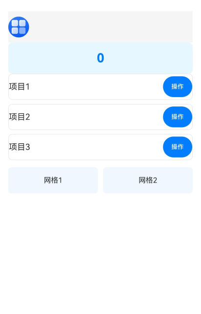

# @ohos.arkui.Parallelize (UI并行化创建)

提供声明式的并行化创建方法ParallelizeUI。ParallelizeUI方法内部的UI在子线程中创建，创建完成后，回到主线程完成树的挂载，后续更新、事件等操作都在主线程中进行。

> **说明：**
> - 本模块接口从API version 20开始支持。后续版本如有新增内容，则采用上角标单独标记该内容的起始版本。
> - 本模块仅适用于ArkTS1.2。

## 导入模块

```ts
import { ParallelOption, ParallelizeUI } from '@ohos.arkui.Parallelize';
```

## ParallelOption

使用ParallelizeUI并行化创建UI时的可选参数。

**系统能力：** SystemCapability.ArkUI.ArkUI.Full

**ArkTS版本：** 该接口仅适用于ArkTS1.2。

**参数：**

| 名称      | 类型     | 只读 | 可选 | 说明                |
| -------- | -------- | --- |-----|--------------------- |
| enable   | boolean  | 否   | 是| 是否开启UI创建并行化。其中，false表示不开启并行化创建，true表示开启并行化创建。<br/>默认值：true  |


## ParallelizeUI
声明式的并行化创建UI方法。

ParallelizeUI(options?: ParallelOption | undefined, content?: CustomBuilder)

**系统能力：** SystemCapability.ArkUI.ArkUI.Full

**ArkTS版本：** 该接口仅适用于ArkTS1.2。

**参数：**

| 参数名  | 类型     | 必填 | 说明                                                           |
| ------ | -------- | ---- | ------------------------------------------------------------ |
| options  | ParallelOption \| undefined | 否   | 使用ParallelizeUI方法创建组件时的可选参数。<br/>默认值：undefined，未传入该参数或者传入undefined时，默认开启并行化创建。 |
| content  | CustomBuilder | 否   | 定义要创建的UI内容，通过尾随闭包"{...}"的形式传入。当未传入该参数时，不会创建任何UI内容。 |

> **说明：**
>
>  尾随闭包是一种特殊的语法结构，可以直接在闭包"{...}"中添加各种组件的UI描述（如Text、Image、Button等）。


## 示例

如下示例展示了ParallelizeUI并行创建组件的能力、多种组件的组合使用和不同的并行化配置方式。

```ts
import { ParallelOption, ParallelizeUI } from '@ohos.arkui.Parallelize';

@Entry
@Component
struct Index {
  @State count: number = 0;
  @State listData: string[] = ['项目1', '项目2', '项目3'];

  build() {
    Column() {
      // ParallelOption参数未传入，默认值为undefined，默认开启并行创建。并行创建Row组件和Image组件。
      ParallelizeUI() {
        Row() {
          Image($r('app.media.startIcon'))
            .width(40)
            .height(40)
            .borderRadius(20)
        }
        .width('100%')
        .height(60)
        .backgroundColor('#F5F5F5')
      }

      // ParallelOption.enable参数为false，不开启并行创建。串行创建Stack组件和Text组件。
      ParallelizeUI({ enable: false }) {
        Stack() {
          Text(this.count.toString())
            .fontSize(24)
            .fontWeight(FontWeight.Bold)
            .fontColor('#007DFF')
        }
        .width('100%')
        .height(60)
        .backgroundColor('#E6F7FF')
        .borderRadius(8)
      }

      // ParallelOption.enable参数为false，不开启并行创建。串行创建List组件和ListItem等组件。
      ParallelizeUI({ enable: false }) {
        List({ space: 8 }) {
          ForEach(this.listData, (item: string) => {
            ListItem() {
              Row() {
                Text(item)
                  .fontSize(16)
                  .layoutWeight(1)

                Button('操作')
                  .fontSize(12)
                  .type(ButtonType.Capsule)
                  .backgroundColor('#007DFF')
                  .onClick(() => {
                    this.count++;
                  })
              }
              .width('100%')
              .height(50)
              .backgroundColor('#FFFFFF')
              .borderRadius(8)
              .border({ width: 1, color: '#E8E8E8' })
            }
          })
        }
        .height(180)
      }

      // ParallelOption.enable参数为true，开启并行创建。并行创建Grid组件和GridItem等组件。
      ParallelizeUI({ enable: true }) {
        Grid() {
          GridItem() {
            Text('网格1')
              .fontSize(14)
              .width('100%')
              .height(50)
              .backgroundColor('#F0F8FF')
              .textAlign(TextAlign.Center)
              .borderRadius(6)
          }
          GridItem() {
            Text('网格2')
              .fontSize(14)
              .width('100%')
              .height(50)
              .backgroundColor('#F0F8FF')
              .textAlign(TextAlign.Center)
              .borderRadius(6)
          }
        }
        .columnsTemplate('1fr 1fr')
        .columnsGap(10)
        .height(60)
      }

    }
    .height('100%')
    .width('100%')
    .padding(16)
    .backgroundColor('#FFFFFF')
  }
}

```
