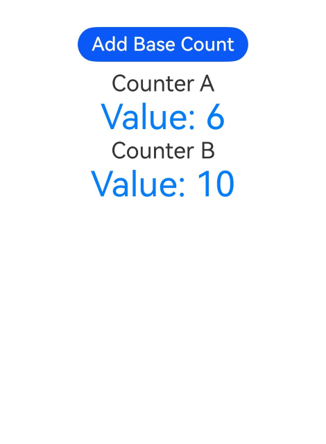
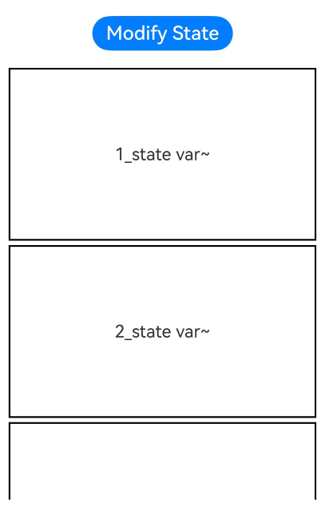

# @ohos.arkui.Parallelize (UI并行化创建)

提供声明式的并行化创建方法ParallelizeUI。ParallelizeUI方法内部的UI在子线程中创建，创建完成后，回到主线程完成树的挂载，后续更新、事件等操作都在主线程中进行。

> **说明：**
> - 本模块仅适用于ArkTS-Sta。
> - 本模块接口从API version 20开始支持。后续版本如有新增内容，则采用上角标单独标记该内容的起始版本。

## 导入模块

```ts
import { ParallelOption, ParallelizeUI } from '@ohos.arkui.Parallelize';
```

## ParallelOption

使用ParallelizeUI并行化创建UI时的可选参数。

**系统能力：** SystemCapability.ArkUI.ArkUI.Full

**ArkTS模式：** 该接口仅适用于ArkTS-Sta。

**ArkTS-Sta起始版本：** 20

**参数：**

| 名称      | 类型     | 只读 | 可选 | 说明                |
| -------- | -------- | --- |-----|--------------------- |
| enable   | boolean  | 否   | 是| 是否开启UI创建并行化。其中，false表示不开启并行化创建，true表示开启并行化创建。<br/>默认值：true  |


## ParallelizeUI
ParallelizeUI(options: ParallelOption | undefined, content_: () => void)

声明式的并行化创建UI方法。options参数为undefined时，默认开启并行化创建。

**系统能力：** SystemCapability.ArkUI.ArkUI.Full

**ArkTS模式：** 该接口仅适用于ArkTS-Sta。

**ArkTS-Sta起始版本：** 20

**参数：**

| 参数名  | 类型     | 必填 | 说明                                                           |
| ------ | -------- | ---- | ------------------------------------------------------------ |
| options  | [ParallelOption](#paralleloption) \| undefined | 是   | 使用ParallelizeUI方法创建组件时的可选参数。|
| content_  | () => void | 是   | 定义要创建的UI内容，通过尾随闭包"{...}"的形式传入。 |

> **说明：**
>
>  尾随闭包是一种特殊的语法结构，可以直接在闭包"{...}"中添加各种组件的UI描述（如Text、Image、Button等）。


**示例：**

ArkTS-Sta示例：

如下示例展示了ParallelizeUI并行创建组件的能力、多种组件的组合使用和不同的并行化配置方式。

```ts
import { ParallelOption, ParallelizeUI } from '@ohos.arkui.Parallelize';

@Entry
@Component
struct Index {
  @State count: number = 0;
  @State listData: string[] = ['项目1', '项目2', '项目3'];

  build() {
    Column() {
      // ParallelOption参数未传入，默认值为undefined，默认开启并行创建。并行创建Row组件和Image组件。
      ParallelizeUI(undefined) {
        Row() {
          Image($r('app.media.startIcon'))
            .width(40)
            .height(40)
            .borderRadius(20)
        }
        .width('100%')
        .height(60)
        .backgroundColor('#F5F5F5')
      }

      // ParallelOption.enable参数为false，不开启并行创建。串行创建Stack组件和Text组件。
      ParallelizeUI({ enable: false }) {
        Stack() {
          Text(this.count.toString())
            .fontSize(24)
            .fontWeight(FontWeight.Bold)
            .fontColor('#007DFF')
        }
        .width('100%')
        .height(60)
        .backgroundColor('#E6F7FF')
        .borderRadius(8)
      }

      // ParallelOption.enable参数为false，不开启并行创建。串行创建List组件和ListItem等组件。
      ParallelizeUI({ enable: false }) {
        List({ space: 8 }) {
          ForEach(this.listData, (item: string) => {
            ListItem() {
              Row() {
                Text(item)
                  .fontSize(16)
                  .layoutWeight(1)

                Button('操作')
                  .fontSize(12)
                  .type(ButtonType.Capsule)
                  .backgroundColor('#007DFF')
                  .onClick(() => {
                    this.count++;
                  })
              }
              .width('100%')
              .height(50)
              .backgroundColor('#FFFFFF')
              .borderRadius(8)
              .border({ width: 1, color: '#E8E8E8' })
            }
          })
        }
        .height(180)
      }

      // ParallelOption.enable参数为true，开启并行创建。并行创建Grid组件和GridItem等组件。
      ParallelizeUI({ enable: true }) {
        Grid() {
          GridItem() {
            Text('网格1')
              .fontSize(14)
              .width('100%')
              .height(50)
              .backgroundColor('#F0F8FF')
              .textAlign(TextAlign.Center)
              .borderRadius(6)
          }
          GridItem() {
            Text('网格2')
              .fontSize(14)
              .width('100%')
              .height(50)
              .backgroundColor('#F0F8FF')
              .textAlign(TextAlign.Center)
              .borderRadius(6)
          }
        }
        .columnsTemplate('1fr 1fr')
        .columnsGap(10)
        .height(60)
      }

    }
    .height('100%')
    .width('100%')
    .padding(16)
    .backgroundColor('#FFFFFF')
  }
}

```


## ParallelizeUI\<T\>
ParallelizeUI\<T\>(options: ParallelOption | undefined, param: () => T, content_: (param: T) => void)

声明式的并行化UI创建接口。该方法支持在并行化环境中安全地使用外部定义的状态变量。options参数为undefined时，默认开启并行化创建。

**系统能力：** SystemCapability.ArkUI.ArkUI.Full

**ArkTS模式：** 该接口仅适用于ArkTS-Sta。

**ArkTS-Sta起始版本：** 20

**参数：**

| 参数名  | 类型     | 必填 | 说明                                                           |
| ------ | -------- | ---- | ------------------------------------------------------------ |
| options  | [ParallelOption](#paralleloption) \| undefined | 是   | 使用ParallelizeUI方法创建组件时的可选参数。|
| param  | () => T | 是   | 用于封装外部定义的状态变量，确保在多线程并行创建过程中状态访问的安全性。 |
| content_  | (param: T) => void | 是   | 定义要创建的UI内容。|


**示例：**

```ts
import { ParallelOption, ParallelizeUI } from '@ohos.arkui.Parallelize';

// 封装参数
class Param {
  title: string
  count: number
  constructor(title: string, count: number) {
    this.title = title
    this.count = count
  }
}

@Entry
@Component
struct Index {
  @State baseCount: number = 0;

  build() {
    Column() {
      Button("Add Base Count")
        .fontSize(22)
        .margin(10)
        .onClick(() => {
          this.baseCount++
        })

      // 外部状态变量可以通过param参数传入
      ParallelizeUI(undefined, () => {
        return new Param('Counter A', this.baseCount * 2)
      }, (param: Param) => {
        Text(param.title)
          .fontSize(26)
          .fontColor('#333333')
        Text(`Value: ${param.count}`) // 状态变量刷新
          .fontSize(40)
          .fontColor('#007DFF')
      })

      // 外部状态变量可以通过param参数传入
      ParallelizeUI<Param>(undefined, () => {
        return new Param('Counter B', this.baseCount * 3 + 1)
      }, (param: Param) => {
        Text(param.title)
          .fontSize(26)
          .fontColor('#333333')
        Text(`Value: ${param.count}`) // 状态变量刷新
          .fontSize(40)
          .fontColor('#007DFF')
      })
    }
    .height('100%')
    .width('100%')
    .padding(16)
    .backgroundColor('#FFFFFF')
  }
}

```


## ParallelizeUI\<V, T\><sup>22+</sup>
ParallelizeUI<V, T>(
  options: ParallelOption | undefined,
  arr: Array<V>,
  param: (item: V, index: int) => T,
  content_: (param: T) => void
): void

声明式的并行化UI循环创建接口。在普通容器中使用时，将并行创建数组中定义的所有UI节点。在List或Grid容器中使用时，仅按需并行创建当前可见的节点。options参数为undefined时，默认开启并行化创建。

**系统能力：** SystemCapability.ArkUI.ArkUI.Full

**ArkTS模式：** 该接口仅适用于ArkTS-Sta。

**ArkTS-Sta起始版本：** 22

**参数：**

| 参数名  | 类型     | 必填 | 说明                                                           |
| ------ | -------- | ---- | ------------------------------------------------------------ |
| options  | [ParallelOption](#paralleloption) \| undefined | 是   | 使用ParallelizeUI方法创建组件时的可选参数。|
| arr  | Array\<V\> | 是   | 数据源，为Array类型的数组。 |
| param  | (item: V, index: int) => T | 是   | 生成并行创建时使用的数据的函数，该函数会在主线程调用。 |
| content_  | (param: T) => void | 是   | 定义要创建的UI内容。- param参数（必选）：由param函数调用后返回的对象。 |


**示例：**

```ts
import { Entry, Text, Column, Component, Button, ClickEvent, List, ListItem } from '@ohos.arkui.component';
import { State } from '@ohos.arkui.stateManagement';
import hilog from '@ohos.hilog';
import { ParallelizeUI } from '@ohos.arkui.Parallelize';

class Info {
  str1: string
  str2: string
  constructor(str1: string, str2:string) {
    this.str1 = str1
    this.str2 = str2
  }
}

@Entry
@Component
struct Index {
  @State stateVar: string = 'state var';
  message: string = 'Modify State';
  @State arr:Array= [1,2,3,4,5,6,7,8,9,10,11,12,13,14] // 数据源
  changeValue() {
    this.stateVar += '~'
  }

  build() {
    Column(undefined) {
      Button(this.message).backgroundColor('#007DFF')
        .fontSize(22)
        .margin(10)
        .onClick((e: ClickEvent) => {
          this.changeValue();
        })
      List({space:5}) {
        // 在List容器中使用时，仅按需并行创建当前可见的节点。
        ParallelizeUI<Int, Info>(undefined, this.arr,
          (item:Int, index: Int) => {
            return new Info(${item}, this.stateVar)
          },
          (param: Info) =>{
            ListItem() {
              Column() {
                Text(${param.str1}_${param.str2}).fontSize(20) // 状态变量刷新
              }
            }.height('200').width('100%').borderWidth(2)
          })
      }.height('70%').width('100%').padding(10)
    }
  }
}

```
