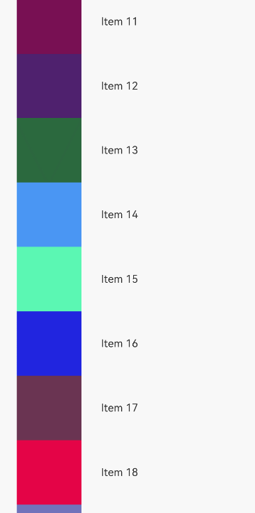

# @ohos.arkui.Prefetcher (Prefetching)
<!--Kit: ArkUI-->
<!--Subsystem: ArkUI-->
<!--Owner: @maorh-->
<!--Designer: @keerecles-->
<!--Tester: @khq-->
<!--Adviser: @zhang_yixin13-->

配合LazyForEach，为List、Grid、WaterFlow和Swiper等容器组件滑动浏览时提供内容预取能力，提升用户浏览体验。

>  **说明：**
>
>  - 本模块首批接口从API version 12开始支持。后续版本的新增接口，采用上角标单独标记接口的起始版本。
>
>  - 本模块接口仅可在Stage模型下使用。
>
>  - 本模块内的接口不支持在预览器中使用。

## 导入模块

```ts
import { BasicPrefetcher, IDataSourcePrefetching, IPrefetcher } from '@kit.ArkUI';
```


## IPrefetcher
实现此接口以提供预取能力，配合LazyForEach在List、Grid等容器组件滑动浏览时预取数据项，提升用户浏览体验。

**原子化服务API：** 从API version 12开始，该接口支持在原子化服务中使用。

**系统能力：** SystemCapability.ArkUI.ArkUI.Full

### setDataSource
setDataSource(dataSource: IDataSourcePrefetching): void;

设置支持预取的数据源以绑定到Prefetcher。

**原子化服务API：** 从API version 12开始，该接口支持在原子化服务中使用。

**系统能力：** SystemCapability.ArkUI.ArkUI.Full

**参数：**

| 参数名        | 类型                                                | 必填 | 说明         |
|------------|---------------------------------------------------|----|------------|
| dataSource | [IDataSourcePrefetching](#idatasourceprefetching) | 是  | 支持预取能力的数据源。 |

```typescript
class MyPrefetcher implements IPrefetcher {
  private dataSource?: IDataSourcePrefetching;

  setDataSource(dataSource: IDataSourcePrefetching): void {
    this.dataSource = dataSource;
  }

  visibleAreaChanged(minVisible: number, maxVisible: number): void {
    this.dataSource?.prefetch(minVisible);
  }
}
```

### visibleAreaChanged
visibleAreaChanged(minVisible: number, maxVisible: number): void;

当可见区域边界发生改变时调用此方法，将当前可见区域范围通知给Prefetcher，使其据此决定预取或取消预取的数据项。调用此方法前需先通过setDataSource方法设置数据源。支持与`List`、`Grid`、`WaterFlow`和`Swiper`组件配合使用。

**原子化服务API：** 从API version 12开始，该接口支持在原子化服务中使用。

**系统能力：** SystemCapability.ArkUI.ArkUI.Full

**参数：**

| 参数名        | 类型     | 必填 | 说明        |
|------------|--------|----|-----------|
| minVisible | number | 是  | 当前可见区域中第一项数据的索引值。 |
| maxVisible | number | 是  | 当前可见区域中最后一项数据的索引值。 |

```typescript
class MyPrefetcher implements IPrefetcher {
  private dataSource?: IDataSourcePrefetching;

  setDataSource(dataSource: IDataSourcePrefetching): void {
    this.dataSource = dataSource;
  }

  visibleAreaChanged(minVisible: number, maxVisible: number): void {
    this.dataSource?.prefetch(minVisible);
  }
}
```

## BasicPrefetcher
BasicPrefetcher是IPrefetcher的基础实现。它提供了一种智能数据预取算法，以根据屏幕上可见区域的实时变化和预取持续时间的变化来决定应预取哪些数据项。它还可以根据用户的滚动操作来确定哪些预取请求应该被取消。

BasicPrefetcher对象不支持使用JSON序列化。

**原子化服务API：** 从API version 12开始，该接口支持在原子化服务中使用。

**系统能力：** SystemCapability.ArkUI.ArkUI.Full

### constructor
constructor(dataSource?: IDataSourcePrefetching);

传入支持预取的数据源，在创建对象时绑定到Prefetcher。若创建时未传入数据源，也可在创建后通过setDataSource方法设置。

**原子化服务API：** 从API version 12开始，该接口支持在原子化服务中使用。

**系统能力：** SystemCapability.ArkUI.ArkUI.Full

**参数：**

| 参数名        | 类型                                                | 必填 | 说明         |
|------------|---------------------------------------------------|----|------------|
| dataSource | [IDataSourcePrefetching](#idatasourceprefetching) | 否  | 支持预取能力的数据源。不传入时默认为空，后续可通过setDataSource方法设置数据源。 |

### setDataSource
setDataSource(dataSource: IDataSourcePrefetching): void;

设置支持预取的数据源以绑定到Prefetcher。

**原子化服务API：** 从API version 12开始，该接口支持在原子化服务中使用。

**系统能力：** SystemCapability.ArkUI.ArkUI.Full

**参数：**

| 参数名        | 类型                                                | 必填 | 说明         |
|------------|---------------------------------------------------|----|------------|
| dataSource | [IDataSourcePrefetching](#idatasourceprefetching) | 是  | 支持预取能力的数据源。 |

### visibleAreaChanged
visibleAreaChanged(minVisible: number, maxVisible: number): void;

当可见区域边界发生改变时调用此方法，将当前可见区域范围通知给Prefetcher，使其据此决定预取或取消预取的数据项。调用此方法前需确保已通过构造函数或setDataSource方法设置数据源。支持与`List`、`Grid`、`WaterFlow`和`Swiper`组件配合使用。

**原子化服务API：** 从API version 12开始，该接口支持在原子化服务中使用。

**系统能力：** SystemCapability.ArkUI.ArkUI.Full

**参数：**

| 参数名        | 类型     | 必填 | 说明        |
|------------|--------|----|-----------|
| minVisible | number | 是  | 当前可见区域中第一项数据的索引值。 |
| maxVisible | number | 是  | 当前可见区域中最后一项数据的索引值。 |

## IDataSourcePrefetching

继承自[IDataSource](./arkui-ts/ts-rendering-control-lazyforeach.md#idatasource)。实现该接口，提供具备预取能力的数据源。

**原子化服务API：** 从API version 12开始，该接口支持在原子化服务中使用。

**系统能力：** SystemCapability.ArkUI.ArkUI.Full

### prefetch
prefetch(index: number): Promise\<void\> \| void;

从数据集中预取指定的数据项。该方法可以为同步，也可为异步。当可见区域发生变化时，预取算法判断即将进入可见区域的数据项需要预取时，会调用该方法。

**原子化服务API：** 从API version 12开始，该接口支持在原子化服务中使用。

**系统能力：** SystemCapability.ArkUI.ArkUI.Full

**参数：**

| 参数名   | 类型     | 必填 | 说明       |
|-------|--------|----|----------|
| index | number | 是  | 预取数据项索引值，取值范围为[0, totalCount()-1]。 |

**返回值：**

| 类型 | 说明 |
| ----------------------- | -------- |
| Promise\<void\> \| void | 异步执行时返回Promise对象，同步执行时无返回值。Promise仅表示操作完成，无实际返回内容。 |

### cancel
cancel?(index: number): Promise\<void\> \| void;

取消从数据集中预取指定的数据项。该方法可以为同步，也可为异步。该方法为可选方法，若数据源未实现该方法，则不执行取消预取操作。

**原子化服务API：** 从API version 12开始，该接口支持在原子化服务中使用。

**系统能力：** SystemCapability.ArkUI.ArkUI.Full

**参数：**

| 参数名   | 类型     | 必填 | 说明         |
|-------|--------|----|------------|
| index | number | 是  | 取消预取数据项索引值，取值范围为[0, totalCount()-1]。 |

**返回值：**

| 类型 | 说明 |
| ----------------------- | -------- |
| Promise\<void\> \| void | 异步执行时返回Promise对象，同步执行时无返回值。Promise仅表示操作完成，无实际返回内容。 |

当列表内容移出屏幕（例如列表快速滑动场景下），且预取算法判断屏幕以外的数据项可以被取消预取时，该方法会被调用。例如，如果HTTP框架支持请求取消，则可以在此处取消在prefetch中发起的网络请求。

## 示例

下面示例展示了Prefetcher的预取能力。该示例采用分页的方式，配合LazyForEach实现懒加载效果，并添加延时模拟加载过程。

```typescript
import { BasicPrefetcher, IDataSourcePrefetching } from '@kit.ArkUI';
import { image } from '@kit.ImageKit';

const ITEMS_ON_SCREEN = 8;

@Entry
@Component
struct PrefetcherDemoComponent {
  private page: number = 1;
  private pageSize: number = 50;
  private breakPoint: number = 25;
  private readonly fetchDelayMs: number = 500;
  private readonly dataSource = new MyDataSource(this.page, this.pageSize, this.fetchDelayMs);
  private readonly prefetcher = new BasicPrefetcher(this.dataSource);

  build() {
    Column() {
      List() {
        LazyForEach(this.dataSource, (item: PictureItem, index: number) => {
          ListItem() {
            PictureItemComponent({ info: item })
              .height(`${100 / ITEMS_ON_SCREEN}%`)
          }
          .onAppear(() => {
            // 当列表项索引达到分页触发点时加载下一页数据，并将触发点更新为当前总数据量减半页，使下一页在接近列表末尾时再次触发加载
            if (index >= this.breakPoint) {
              this.dataSource.getHttpData(++this.page, this.pageSize);
              this.breakPoint = this.dataSource.totalCount() - this.pageSize / 2;
            }
          })
        }, (item: PictureItem) => item.title)
      }
      .onScrollIndex((start: number, end: number) => {
        this.prefetcher.visibleAreaChanged(start, end);
      })
    }
  }
}

@Component
struct PictureItemComponent {
  @ObjectLink info: PictureItem;

  build() {
    Row() {
      Image(this.info.imagePixelMap)
        .objectFit(ImageFit.Contain)
        .width('40%')
      Text(this.info.title)
        .width('60%')
    }
  }
}

@Observed
class PictureItem {
  readonly color: number;
  title: string;
  imagePixelMap: image.PixelMap | undefined;

  constructor(color: number, title: string) {
    this.color = color;
    this.title = title;
  }
}

type ItemIndex = number;
type TimerId = number;

class MyDataSource implements IDataSourcePrefetching {
  private readonly items: PictureItem[];
  private readonly fetchDelayMs: number;
  private readonly fetches: Map<ItemIndex, TimerId> = new Map();
  private readonly listeners: DataChangeListener[] = [];

  constructor(pageNum: number, pageSize: number, fetchDelayMs: number) {
    this.items = [];
    this.fetchDelayMs = fetchDelayMs;
    this.getHttpData(pageNum, pageSize);
  }

  async prefetch(index: number): Promise<void> {
    const item = this.items[index];
    if (item.imagePixelMap) {
      return;
    }

    // 模拟高耗时操作
    return new Promise<void>(resolve => {
      const timeoutId = setTimeout(async () => {
        this.fetches.delete(index);
        const bitmap = create10x10Bitmap(item.color);
        const imageSource: image.ImageSource = image.createImageSource(bitmap);
        item.imagePixelMap = await imageSource.createPixelMap();
        imageSource.release();
        resolve();
      }, this.fetchDelayMs);

      this.fetches.set(index, timeoutId);
    });
  }

  cancel(index: number): void {
    const timerId = this.fetches.get(index);
    if (timerId) {
      this.fetches.delete(index);
      clearTimeout(timerId);
    }
  }

  // 模拟分页方式加载数据
  getHttpData(pageNum: number, pageSize: number): void {
    const newItems: PictureItem[] = [];
    for (let i = (pageNum - 1) * pageSize; i < pageNum * pageSize; i++) {
      const item = new PictureItem(getRandomColor(), `Item ${i}`);
      newItems.push(item);
    }
    const startIndex = this.items.length;
    this.items.splice(startIndex, 0, ...newItems);
    this.notifyBatchUpdate([
      {
        type: DataOperationType.ADD,
        index: startIndex,
        count: newItems.length,
        key: newItems.map((item) => item.title)
      }
    ]);
  }

  private notifyBatchUpdate(operations: DataOperation[]) {
    this.listeners.forEach((listener: DataChangeListener) => {
      listener.onDatasetChange(operations);
    });
  }

  totalCount(): number {
    return this.items.length;
  }

  getData(index: number): PictureItem {
    return this.items[index];
  }

  registerDataChangeListener(listener: DataChangeListener): void {
    if (this.listeners.indexOf(listener) < 0) {
      this.listeners.push(listener);
    }
  }

  unregisterDataChangeListener(listener: DataChangeListener): void {
    const pos = this.listeners.indexOf(listener);
    if (pos >= 0) {
      this.listeners.splice(pos, 1);
    }
  }
}

function getRandomColor(): number {
  const maxColorCode = 256;
  const red = Math.floor(Math.random() * maxColorCode);
  const green = Math.floor(Math.random() * maxColorCode);
  const blue = Math.floor(Math.random() * maxColorCode);

  return (red * 256 + green) * 256 + blue;
}

function create10x10Bitmap(color: number): ArrayBuffer {
  const height = 10;
  const width = 10;

  const fileHeaderLength = 14;
  const bitmapInfoLength = 40;
  const headerLength = fileHeaderLength + bitmapInfoLength;
  const pixelSize = (width * 3 + 2) * height;

  let length = pixelSize + headerLength;

  const buffer = new ArrayBuffer(length);
  const view16 = new Uint16Array(buffer);

  view16[0] = 0x4D42;
  view16[1] = length & 0xffff;
  view16[2] = length >> 16;
  view16[5] = headerLength;

  let offset = 7;
  view16[offset++] = bitmapInfoLength & 0xffff;
  view16[offset++] = bitmapInfoLength >> 16;
  view16[offset++] = width & 0xffff;
  view16[offset++] = width >> 16;
  view16[offset++] = height & 0xffff;
  view16[offset++] = height >> 16;
  view16[offset++] = 1;
  view16[offset++] = 24;

  const blue = color & 0xff;
  const green = (color >> 8) & 0xff;
  const red = color >> 16;
  offset = headerLength;
  const view8 = new Uint8Array(buffer);
  for (let y = 0; y < height; y++) {
    for (let x = 0; x < width; x++) {
      view8[offset++] = blue;
      view8[offset++] = green;
      view8[offset++] = red;
    }
    offset += 2;
  }

  return buffer;
}
```

演示效果如下：



## 补充说明

开发者也可使用OpenHarmony三方库[@netteam/prefetcher](https://ohpm.openharmony.cn/#/cn/detail/@netteam%2Fprefetcher)开发预取功能。该三方库提供了更多的接口，可以更加便捷有效地实现数据预取。