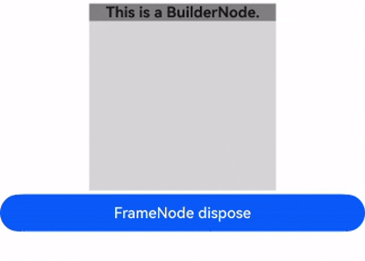
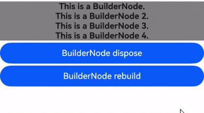
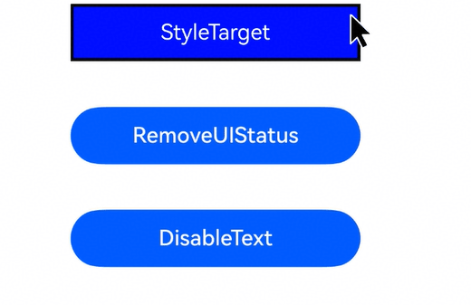
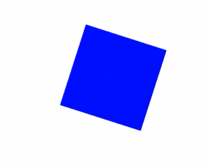
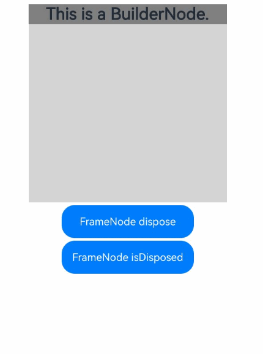
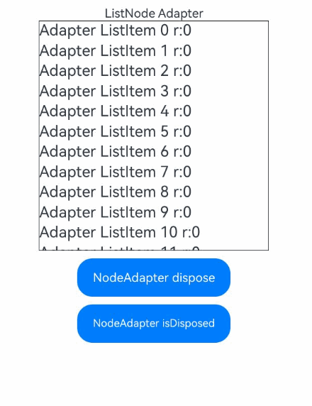
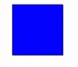
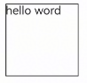

# FrameNode
<!--Kit: ArkUI-->
<!--Subsystem: ArkUI-->
<!--Owner: @sunbees-->
<!--Designer: @sunbees-->
<!--Tester: @khq-->
<!--Adviser: @Brilliantry_Rui-->

FrameNode表示组件树的实体节点。[NodeController](./js-apis-arkui-nodeController.md)可通过[BuilderNode](./js-apis-arkui-builderNode.md)持有的FrameNode将其挂载到[NodeContainer](arkui-ts/ts-basic-components-nodecontainer.md)上，也可通过FrameNode获取[RenderNode](./js-apis-arkui-renderNode.md)，挂载到其他FrameNode上。<!--RP2--><!--RP2End-->

> **说明：**
>
> - 本模块同时支持ArkTS-Dyn、ArkTS-Sta。
>
> - 本模块首批接口从API version 11开始支持。后续版本的新增接口，采用上角标单独标记接口的起始版本。
>
> - 当前不支持在预览器中使用FrameNode节点。
>
> - FrameNode节点暂不支持拖拽。
>
> - FrameNode对象不支持使用JSON序列化。
>
> - 在[UI上下文不明确](../../ui/arkts-global-interface.md#ui上下文不明确)的场景中调用[FrameNode](#framenode-1)对象的接口时，建议使用[UIContext](./arkts-apis-uicontext-uicontext.md)的[runScopedTask](./arkts-apis-uicontext-uicontext.md#runscopedtask)接口明确UI上下文，参考[执行绑定UI实例的闭包](../../ui/arkts-global-interface.md#执行绑定ui实例的闭包)示例。
>
> - FrameNode的接口中，仅[Optional](./arkui-ts/ts-universal-attributes-custom-property.md#optionalt)类型的必选参数支持传入null或undefined。

## 导入模块

```ts
import { FrameNode, LayoutConstraint, ExpandMode, ChildrenCountMode, typeNode, NodeAdapter } from "@kit.ArkUI";
```

## LayoutConstraint<sup>12+</sup>

描述组件的布局约束。

**原子化服务API（仅ArkTS-Dyn）：** 从API version 12开始，该接口支持在原子化服务中使用。

**模型约束：** 此接口仅可在Stage模型下使用。

**系统能力：** SystemCapability.ArkUI.ArkUI.Full

**ArkTS-Dyn起始版本：** 12

**ArkTS-Sta起始版本：** 23

| 名称            |  类型  | 只读   | 可选   | 说明                                       |
| -------------- | ------ | ----- | ----------|-------------------------------- |
| maxSize           | [Size](./js-apis-arkui-graphics.md#size) |否| 否    | 最大尺寸。              |
| minSize            | [Size](./js-apis-arkui-graphics.md#size) |否| 否    | 最小尺寸。                  |
| percentReference      | [Size](./js-apis-arkui-graphics.md#size) |否| 否    | 子节点计算百分比时的尺寸基准。|

## CrossLanguageOptions<sup>15+</sup>

该接口用于配置或查询FrameNode的跨语言访问权限。例如，针对ArkTS语言创建的节点，可通过该接口控制是否允许通过非ArkTS语言进行属性访问或修改。

**原子化服务API（仅ArkTS-Dyn）：** 从API version 15开始，该接口支持在原子化服务中使用。

**模型约束：** 此接口仅可在Stage模型下使用。

**系统能力：** SystemCapability.ArkUI.ArkUI.Full

**ArkTS-Dyn起始版本：** 15

**ArkTS-Sta起始版本：** 23

| 名称   | 类型   | 只读 | 可选 | 说明                   |
| ------ | ------ | ---- | ---- | ---------------------- |
| attributeSetting  | boolean | 否   | 是   | FrameNode是否支持跨ArkTS语言进行属性设置。<br/>true表示支持跨ArkTS语言进行属性设置，false表示不支持跨ArkTS语言进行属性设置。<br/>默认值为false。<br/>**原子化服务API（仅ArkTS-Dyn）：** 从API version 15开始，该接口支持在原子化服务中使用。|
| treeOperating  | boolean | 否   | 是   | FrameNode是否支持跨ArkTS语言进行组件树操作。<br/> true表示支持跨ArkTS语言进行组件树操作，false表示不支持跨ArkTS语言进行组件树操作。<br/>默认值为false。<br/>**原子化服务API（仅ArkTS-Dyn）：** 从API版本26.0.0开始，该接口支持在原子化服务中使用。<br/>**ArkTS-Dyn起始版本：** 26.0.0 <br/>**ArkTS-Sta起始版本：** 26.0.0 <br/>**说明：** 当FrameNode启用了跨ArkTS语言进行组件树操作的选项后，支持该FrameNode跨ArkTS语言调用[addChild](./capi-arkui-nativemodule-arkui-nativenodeapi-1.md#addchild)、[insertChildAfter](./capi-arkui-nativemodule-arkui-nativenodeapi-1.md#insertchildafter)、[insertChildAt](./capi-arkui-nativemodule-arkui-nativenodeapi-1.md#insertchildat)、[insertChildBefore](./capi-arkui-nativemodule-arkui-nativenodeapi-1.md#insertchildbefore)和[removeChild](./capi-arkui-nativemodule-arkui-nativenodeapi-1.md#removechild)。|

## FrameNodeOptions<sup>24+</sup>

FrameNode选项，可设置FrameNode是否支持多线程操作。

**ArkTS模式：** 该接口仅适用于ArkTS-Sta。

**系统能力：** SystemCapability.ArkUI.ArkUI.Full

**模型约束：** 此接口仅可在Stage模型下使用。

**ArkTS-Sta起始版本：** 24

| 名称   | 类型   | 只读 | 可选 | 说明                   |
| ------ | ------ | ---- | ---- | ---------------------- |
| supportMultiThread  | boolean | 否   | 是   | FrameNode是否支持多线程操作。<br/>true表示支持多线程操作，该节点可以在多线程场景中使用。<br/>false或不设置表示不支持多线程操作。<br/>默认为false。 |

## ExpandMode<sup>15+</sup>

子节点展开模式枚举。

**原子化服务API（仅ArkTS-Dyn）：** 从API version 15开始，该接口支持在原子化服务中使用。

**模型约束：** 此接口仅可在Stage模型下使用。

**系统能力：** SystemCapability.ArkUI.ArkUI.Full

**ArkTS-Dyn起始版本：** 15

**ArkTS-Sta起始版本：** 23

| 名称 | 值 | 说明 |
| -------- | -------- | -------- |
| NOT_EXPAND | 0 | 表示不展开当前FrameNode的子节点。如果FrameNode包含[LazyForEach](./arkui-ts/ts-rendering-control-lazyforeach.md)子节点，获取在主节点树上的子节点时，不展开当前FrameNode的子节点。子节点序列号按在主节点树上的子节点计算。<br/>**原子化服务API（仅ArkTS-Dyn）：** 从API version 15开始，该接口支持在原子化服务中使用。|
| EXPAND | 1 | 表示展开当前FrameNode的子节点。如果FrameNode包含[LazyForEach](./arkui-ts/ts-rendering-control-lazyforeach.md)子节点，获取所有子节点时，展开当前FrameNode的子节点。子节点序列号按所有子节点计算。<br/>**原子化服务API（仅ArkTS-Dyn）：** 从API version 15开始，该接口支持在原子化服务中使用。 |
| LAZY_EXPAND | 2 | 表示按需展开当前FrameNode的子节点。如果FrameNode包含[LazyForEach](./arkui-ts/ts-rendering-control-lazyforeach.md)子节点，获取在主树上的子节点时，不展开当前FrameNode的子节点；获取不在主树上的子节点时，展开当前FrameNode的子节点。子节点序列号按所有子节点计算。<br/>**原子化服务API（仅ArkTS-Dyn）：** 从API version 15开始，该接口支持在原子化服务中使用。 |
| LAZY_NOT_EXPAND | 3 | 表示不展开当前FrameNode的子节点，如果FrameNode包含[LazyForEach](./arkui-ts/ts-rendering-control-lazyforeach.md)子节点，获取已经展开的子节点时，可以直接获取，获取未展开的子节点时，仅创建对应位置的节点，而不展开所有子节点。子节点序列号按所有子节点计算。<br/>**起始版本：** 26.0.0 <br/>**原子化服务API（仅ArkTS-Dyn）：** 从API版本26.0.0开始，该接口支持在原子化服务中使用。 |

## ChildrenCountMode

子节点计数模式枚举。用于指定获取子节点数量时的计数方式。

**ArkTS-Dyn起始版本：** 26.0.0

**ArkTS-Sta起始版本：** 26.0.0

**模型约束：** 此接口仅可在Stage模型下使用。

**原子化服务API（仅ArkTS-Dyn）：** 从API版本26.0.0开始，该接口支持在原子化服务中使用。

**系统能力：** SystemCapability.ArkUI.ArkUI.Full

| 名称 | 值 | 说明 |
| -------- | -------- | -------- |
| ALL_EXPAND | 0 | 展开模式。当遇到懒加载节点（如[LazyForEach](./arkui-ts/ts-rendering-control-lazyforeach.md)）时，展开节点并返回所有子节点数量。<br/>是否展开懒加载节点：是 <br/> 使用场景：需要展开并返回所有子节点数量的场景。 |
| ONLY_EXPANDED | 1 | 计数已展开模式。不展开懒加载节点，只返回当前已展开的子节点数量。未展开的懒加载节点不包含在计数中。<br/> 是否展开懒加载节点：否 <br/> 使用场景：仅查询已展开子节点数量的场景。 |
| ALL_NOT_EXPAND | 2 | 计数所有模式。不展开懒加载节点，但返回包含所有潜在子节点的数量（包括已展开和未展开的懒加载节点）。此模式提供潜在子节点总数而不触发展开操作。<br/> 是否展开懒加载节点：否 <br/> 使用场景：需要获取所有子节点数量的场景，与ALL_EXPAND相比，该模式不会展开子节点。 |

## InteractionEventBindingInfo<sup>19+</sup>

组件的交互事件绑定状态信息。如果当前节点上绑定了所要查询的交互事件，调用查询接口时返回一个InteractionEventBindingInfo对象，指示事件绑定详细信息。

**原子化服务API（仅ArkTS-Dyn）：** 从API version 19开始，该接口支持在原子化服务中使用。

**模型约束：** 此接口仅可在Stage模型下使用。

**系统能力：** SystemCapability.ArkUI.ArkUI.Full

**ArkTS-Dyn起始版本：** 19

**ArkTS-Sta起始版本：** 26.0.0

<!--Table: 26%; 10%; 8%; 8%; 48%-->
| 名称   | 类型   | 只读 | 可选 | 说明                   |
| ------ | ------ | ---- | ---- | ---------------------- |
| baseEventRegistered  | boolean |  否   | 否   | 是否以声明方式绑定事件。<br/>true表示以声明方式绑定事件，false表示没有以声明方式绑定事件。 |
| nodeEventRegistered  | boolean | 否   | 否   | 是否以自定义组件节点的方式绑定事件，请参考[基础事件示例](#基础事件示例)<br/>true表示以自定义组件节点的方式绑定事件，false表示没有以自定义组件节点的方式绑定事件。 |
| nativeEventRegistered  | boolean | 否   | 否   | 是否以注册节点事件（[registerNodeEvent](capi-arkui-nativemodule-arkui-nativenodeapi-1.md#registernodeevent)）的方式绑定事件。<br/>true表示以注册节点事件的方式绑定事件，false表示没有以注册节点事件的方式绑定事件。|
| builtInEventRegistered  | boolean | 否   | 否   | 组件是否绑定内置事件(组件内部定义的事件, 无需开发者手动绑定)。<br/>true表示组件绑定内置事件，false表示组件没有绑定内置事件。 |

## UIState<sup>20+</sup>

多态样式状态枚举，用于处理多态样式。

**原子化服务API（仅ArkTS-Dyn）：** 从API version 20开始，该接口支持在原子化服务中使用。

**模型约束：** 此接口仅可在Stage模型下使用。

**系统能力：** SystemCapability.ArkUI.ArkUI.Full

**ArkTS-Dyn起始版本：** 20

**ArkTS-Sta起始版本：** 26.0.0

| 名称 | 值 | 说明 |
| -------- | -------- | -------- |
| NORMAL | 0 | 正常状态。 |
| PRESSED | 1 << 0 | 按下状态。 |
| FOCUSED | 1 << 1 | 获焦状态。 |
| DISABLED | 1 << 2 | 禁用状态。 |
| SELECTED | 1 << 3 | 选中状态。<br/>仅特定的组件支持此状态：Checkbox、Radio、Toggle、List、Grid、MenuItem。 |
| HOVERED | 1 << 4 | 悬浮状态。<br/>**起始版本：** 26.0.0 <br/>**模型约束：** 此接口仅可在Stage模型下使用。 |

## UIStatesChangeHandler<sup>20+</sup>

ArkTS-Dyn: type UIStatesChangeHandler = (node: FrameNode, currentUIStates: number) => void

ArkTS-Sta: type UIStatesChangeHandler = (node: FrameNode, currentUIStates: int) => void

当UI状态发生变化时触发的回调。接收回调触发时的[UIState](#uistate20)状态，该参数的取值为UIState状态枚举值或其运算结果。

**原子化服务API（仅ArkTS-Dyn）：** 从API version 20开始，该接口支持在原子化服务中使用。

**模型约束：** 此接口仅可在Stage模型下使用。

**系统能力：** SystemCapability.ArkUI.ArkUI.Full

**ArkTS-Dyn起始版本：** 20

**ArkTS-Sta起始版本：** 26.0.0

**参数：**

| 参数名   | 类型                      | 必填 | 说明                                                     |
| -------- | ----------------------------- | ---- | ------------------------------------------------------------ |
| node    | [FrameNode](#framenode-1) | 是   | 触发UI状态变化的节点。                                            |
| currentUIStates    | ArkTS-Dyn: number<br/>ArkTS-Sta: int         | 是   | 回调触发时当前的UI状态。<br>可以通过位与运算判断当前包含哪些[UIState](#uistate20)状态。<br>位与运算方法：if (currentState & UIState.PRESSED == UIState.PRESSED)。<br>一般的UIState状态检查可以直接判断：if (currentState == UIState.PRESSED)。                                            |

## FrameNode

### constructor

constructor(uiContext: UIContext)

FrameNode的构造函数。

**ArkTS模式：** 该接口仅适用于ArkTS-Dyn。

**原子化服务API（仅ArkTS-Dyn）：** 从API version 12开始，该接口支持在原子化服务中使用。

**模型约束：** 此接口仅可在Stage模型下使用。

**系统能力：** SystemCapability.ArkUI.ArkUI.Full

**ArkTS-Dyn起始版本：** 11

**参数：**

| 参数名    | 类型                                      | 必填 | 说明                               |
| --------- | ----------------------------------------- | ---- | ---------------------------------- |
| uiContext | [UIContext](./arkts-apis-uicontext-uicontext.md) | 是   | 创建对应节点时所需的UI上下文。 |

### constructor<sup>23+</sup>

constructor(uiContext: UIContext, options?: FrameNodeOptions)

FrameNode的构造函数。

**ArkTS模式：** 该接口仅适用于ArkTS-Sta。

**系统能力：** SystemCapability.ArkUI.ArkUI.Full

**模型约束：** 此接口仅可在Stage模型下使用。

**ArkTS-Sta起始版本：** 23

**参数：**

| 参数名    | 类型                                      | 必填 | 说明                               |
| --------- | ----------------------------------------- | ---- | ---------------------------------- |
| uiContext | [UIContext](./arkts-apis-uicontext-uicontext.md) | 是   | 创建对应节点时所需的UI上下文。 |
| options<sup>24+</sup> | [FrameNodeOptions](#framenodeoptions24) | 否   | FrameNode创建时的可选参数。默认值：undefined，表示不支持多线程操作。 |

**示例：**

```ts
import { Row, NodeContainer, Entry, Component, Color, UIContext } from '@ohos.arkui.component';
import { FrameNode, NodeController, typeNode } from '@ohos.arkui.node';

class MultiThreadNodeController extends NodeController {
  private rootNode: FrameNode | null = null;
  private uiContext: UIContext | null = null;
  private worker: EAWorker = new EAWorker();

  constructor() {
    super();
  }

  makeNode(uiContext: UIContext): FrameNode | null {
    if (!this.rootNode) {
      this.rootNode = typeNode.createColumnNode(uiContext);
      const frameNode = new FrameNode(uiContext); // 创建普通FrameNode（不支持多线程）
      frameNode!.commonAttribute.width(100).height(100).backgroundColor(Color.Black);
      this.rootNode!.append(frameNode);
      this.uiContext = uiContext;
      this.createNodeInMultiThreadAndMount(this.rootNode!);
    }
    return this.rootNode;
  }

  createNodeInMultiThreadAndMount(rootNode: FrameNode): void {
    this.worker.start();
    this.worker.postTask(() => {
      const frameNode = new FrameNode(this.uiContext!, { supportMultiThread: true }); // 创建支持多线程操作的FrameNode
      frameNode.commonAttribute.width(150).height(150).backgroundColor(Color.Pink);
      frameNode.commonEvent.setOnClick((event: ClickEvent) => {
        console.info(`click frameNode: ${JSON.stringfy(event)}`);
      });
      const mainWorker = EAWorker.main(); // 获取主线程的worker
      if (mainWorker) {
        mainWorker.postTask(() => {
          rootNode.appendChild(frameNode); // 上树在主线程中执行
        });
      }
    })
    this.worker.quit();
  }
}

@Entry
@Component
struct Index {
  private multiThreadNodeController: MultiThreadNodeController = new MultiThreadNodeController();

  build() {
    Row() {
      NodeContainer(this.multiThreadNodeController)
    }
  }
}
```

### getRenderNode

getRenderNode(): RenderNode | null

获取FrameNode中持有的[RenderNode](./js-apis-arkui-renderNode.md)。

**原子化服务API（仅ArkTS-Dyn）：** 从API version 12开始，该接口支持在原子化服务中使用。

**模型约束：** 此接口仅可在Stage模型下使用。

**系统能力：** SystemCapability.ArkUI.ArkUI.Full

**ArkTS-Dyn起始版本：** 11

**ArkTS-Sta起始版本：** 23

**返回值：**

| 类型                                                           | 说明                                                                                                             |
| -------------------------------------------------------------- | ---------------------------------------------------------------------------------------------------------------- |
| [RenderNode](./js-apis-arkui-renderNode.md) \| null | 一个RenderNode对象。若该FrameNode不包含RenderNode，则返回空对象null。如果当前FrameNode为声明式组件创建的节点，则返回null。 |

**示例：**

```ts
import { NodeController, FrameNode } from '@kit.ArkUI';

// 继承NodeController实现自定义UI控制器
class MyNodeController extends NodeController {
  private rootNode: FrameNode | null = null;

  makeNode(uiContext: UIContext): FrameNode | null {
    this.rootNode = new FrameNode(uiContext);

    // 获取rootNode持有的RenderNode
    const renderNode = this.rootNode.getRenderNode();
    if (renderNode !== null) {
      renderNode.size = { width: 100, height: 100 };
      renderNode.backgroundColor = 0XFFFF0000;
    }

    return this.rootNode;
  }
}

@Entry
@Component
struct Index {
  private myNodeController: MyNodeController = new MyNodeController();

  build() {
    Row() {
      NodeContainer(this.myNodeController)
    }
  }
}
```
### isModifiable<sup>12+</sup> 

isModifiable(): boolean

判断当前节点是否可修改。

**原子化服务API（仅ArkTS-Dyn）：** 从API version 12开始，该接口支持在原子化服务中使用。

**模型约束：** 此接口仅可在Stage模型下使用。

**系统能力：** SystemCapability.ArkUI.ArkUI.Full

**ArkTS-Dyn起始版本：** 12

**ArkTS-Sta起始版本：** 23

**返回值：**

| 类型    | 说明                                                                                                                                  |
| ------- | ------------------------------------------------------------------------------------------------------------------------------------- |
| boolean | 判断当前节点是否可修改。<br/>true表示当前节点可修改，false表示当前节点不可修改。<br/>当节点为[自定义组件节点](../../ui/arkts-user-defined-node.md#自定义组件节点-framenode)中的系统组件代理节点或节点已经[dispose](#dispose12)时返回false。<br/>当返回false时，当前FrameNode不支持[appendChild](#appendchild12)、[insertChildAfter](#insertchildafter12)、[removeChild](#removechild12)、[clearChildren](#clearchildren12)、[createAnimation](#createanimation20)、[cancelAnimations](#cancelanimations20)的操作。 |

**示例：**

请参考[节点操作示例](#节点操作示例)。

### appendChild<sup>12+</sup> 

appendChild(node: FrameNode): void

在FrameNode最后一个子节点后添加新的子节点。当前FrameNode如果不可修改，抛出异常信息。[typeNode](./js-apis-arkui-typeNode.md)在appendChild时会校验子组件类型或个数，不满足时抛出异常信息，限制情况请查看[typeNode](./js-apis-arkui-typeNode.md)描述。

**原子化服务API（仅ArkTS-Dyn）：** 从API version 12开始，该接口支持在原子化服务中使用。

**模型约束：** 此接口仅可在Stage模型下使用。

**系统能力：** SystemCapability.ArkUI.ArkUI.Full

**ArkTS-Dyn起始版本：** 12

**ArkTS-Sta起始版本：** 23


**参数：**

| 参数名 | 类型                    | 必填 | 说明                  |
| ------ | ----------------------- | ---- | --------------------- |
| node   | [FrameNode](#framenode-1) | 是   | 需要添加的FrameNode。<br/> node节点不可以为声明式创建的节点，即不可修改的FrameNode。仅有从BuilderNode中获取的声明式节点可以作为子节点。若子节点不符合规格，则抛出异常信息。<br/> node节点不可以拥有父节点，否则抛出异常信息。|

**错误码：**

以下错误码的详细介绍请参见[自定义节点错误码](./errorcode-node.md)。

| 错误码ID | 错误信息                         |
| -------- | -------------------------------- |
| 100021   | The FrameNode is not modifiable. |
| 100025   | The parameter is invalid. Details about the invalid parameter and the reason are included in the error message. For example: "The parameter 'node' is invalid: it cannot be adopted." <br>适用版本：22+ |

**示例：**

请参考[节点操作示例](#节点操作示例)。

### insertChildAfter<sup>12+</sup> 

insertChildAfter(child: FrameNode, sibling: FrameNode | null): void

在FrameNode指定子节点之后添加新的子节点。当前FrameNode如果不可修改，抛出异常信息。

**原子化服务API（仅ArkTS-Dyn）：** 从API version 12开始，该接口支持在原子化服务中使用。

**模型约束：** 此接口仅可在Stage模型下使用。

**系统能力：** SystemCapability.ArkUI.ArkUI.Full

**ArkTS-Dyn起始版本：** 12

**ArkTS-Sta起始版本：** 23

**参数：**

| 参数名  | 类型                                      | 必填 | 说明                                                                         |
| ------- | ----------------------------------------- | ---- | ---------------------------------------------------------------------------- |
| child   | [FrameNode](#framenode-1)                   | 是   | 需要添加的子节点。<br/>child节点不可以为声明式创建的节点，即不可修改的FrameNode。仅有从BuilderNode中获取的声明式节点可以作为子节点。若子节点不符合规格，则抛出异常信息。<br/> child节点不可以拥有父节点，否则抛出异常信息。                                                           |
| sibling | [FrameNode](#framenode-1)&nbsp;\|&nbsp;null | 是   | 新节点将插入到该节点之后。若该参数设置为空，则新节点将插入到首个子节点之前。 |

**错误码：**

以下错误码的详细介绍请参见[自定义节点错误码](./errorcode-node.md)。

| 错误码ID | 错误信息                         |
| -------- | -------------------------------- |
| 100021   | The FrameNode is not modifiable. |
| 100025   | The parameter is invalid. Details about the invalid parameter and the reason are included in the error message. For example: "The parameter 'child' is invalid: it cannot be adopted." <br>适用版本：22+ |

**示例：**

请参考[节点操作示例](#节点操作示例)。

### removeChild<sup>12+</sup> 

removeChild(node: FrameNode): void

从FrameNode中删除指定的子节点。当前FrameNode如果不可修改，抛出异常信息。

**原子化服务API（仅ArkTS-Dyn）：** 从API version 12开始，该接口支持在原子化服务中使用。

**模型约束：** 此接口仅可在Stage模型下使用。

**系统能力：** SystemCapability.ArkUI.ArkUI.Full

**ArkTS-Dyn起始版本：** 12

**ArkTS-Sta起始版本：** 23

**参数：**

| 参数名 | 类型                    | 必填 | 说明               |
| ------ | ----------------------- | ---- | ------------------ |
| node   | [FrameNode](#framenode-1) | 是   | 需要删除的子节点。 |

**错误码：**

以下错误码的详细介绍请参见[自定义节点错误码](./errorcode-node.md)。

| 错误码ID | 错误信息                         |
| -------- | -------------------------------- |
| 100021   | The FrameNode is not modifiable. |

**示例：**

请参考[节点操作示例](#节点操作示例)。

### clearChildren<sup>12+</sup> 

clearChildren(): void

清除当前FrameNode的所有子节点。当前FrameNode如果不可修改，抛出异常信息。

**原子化服务API（仅ArkTS-Dyn）：** 从API version 12开始，该接口支持在原子化服务中使用。

**模型约束：** 此接口仅可在Stage模型下使用。

**系统能力：** SystemCapability.ArkUI.ArkUI.Full

**ArkTS-Dyn起始版本：** 12

**ArkTS-Sta起始版本：** 23

**错误码：**

以下错误码的详细介绍请参见[自定义节点错误码](./errorcode-node.md)。

| 错误码ID | 错误信息                         |
| -------- | -------------------------------- |
| 100021   | The FrameNode is not modifiable. |

**示例：**

请参考[节点操作示例](#节点操作示例)。

### getChild<sup>12+</sup> 

ArkTS-Dyn: getChild(index: number): FrameNode | null

ArkTS-Sta: getChild(index: int): FrameNode | null

获取当前节点指定位置的子节点。

**原子化服务API（仅ArkTS-Dyn）：** 从API version 12开始，该接口支持在原子化服务中使用。

**模型约束：** 此接口仅可在Stage模型下使用。

**系统能力：** SystemCapability.ArkUI.ArkUI.Full

**ArkTS-Dyn起始版本：** 12

**ArkTS-Sta起始版本：** 23

**参数：**

| 参数名 | 类型   | 必填 | 说明                       |
| ------ | ------ | ---- | -------------------------- |
| index  | ArkTS-Dyn: number <br> ArkTS-Sta: int | 是   | 需要查询的子节点的序列号。<br/>index取值范围为[0, +∞)，若当前节点有n个子节点，index取值有效范围为[0, n-1]。 |

**返回值：**

| 类型                            | 说明                                                          |
| ------------------------------- | ------------------------------------------------------------- |
| [FrameNode](#framenode-1) \| null | 子节点。若该FrameNode不包含所查询的子节点，则返回空对象null。 |

**示例：**

请参考[节点操作示例](#节点操作示例)。

### getChild<sup>15+</sup> 

ArkTS-Dyn: getChild(index: number, expandMode?: ExpandMode): FrameNode | null

ArkTS-Sta: getChild(index: int, expandMode?: ExpandMode): FrameNode | null

获取当前节点指定位置的子节点，支持指定子节点展开模式。

**原子化服务API（仅ArkTS-Dyn）：** 从API version 15开始，该接口支持在原子化服务中使用。

**模型约束：** 此接口仅可在Stage模型下使用。

**系统能力：** SystemCapability.ArkUI.ArkUI.Full

**ArkTS-Dyn起始版本：** 15

**ArkTS-Sta起始版本：** 23

**参数：**

| 参数名 | 类型   | 必填 | 说明                       |
| ------ | ------ | ---- | -------------------------- |
| index  | ArkTS-Dyn: number<br/>ArkTS-Sta: int | 是   | 需要查询的子节点的序列号。<br/>index取值范围为[0, +∞)，若当前节点有n个子节点，index取值有效范围为[0, n-1]。 |
| expandMode | [ExpandMode](#expandmode15) | 否 | 指定子节点展开模式。<br/>默认值：ExpandMode.EXPAND |

**返回值：**

| 类型                            | 说明                                                          |
| ------------------------------- | ------------------------------------------------------------- |
| [FrameNode](#framenode-1) \| null | 子节点。若该FrameNode不包含所查询的子节点，则返回空对象null。 |

**示例：**

请参考[LazyForEach场景节点操作示例](#lazyforeach场景节点操作示例)。

### getFirstChildIndexWithoutExpand<sup>15+</sup> 

ArkTS-Dyn: getFirstChildIndexWithoutExpand(): number

ArkTS-Sta: getFirstChildIndexWithoutExpand(): int

获取当前节点第一个在主节点树上的子节点的序列号。子节点序列号按所有子节点计算。

**原子化服务API（仅ArkTS-Dyn）：** 从API version 15开始，该接口支持在原子化服务中使用。

**模型约束：** 此接口仅可在Stage模型下使用。

**系统能力：** SystemCapability.ArkUI.ArkUI.Full

**ArkTS-Dyn起始版本：** 15

**ArkTS-Sta起始版本：** 23

**返回值：**

| 类型   | 说明                                      |
| ------ | ---------------------------------------- |
| ArkTS-Dyn: number <br> ArkTS-Sta: int | 当前节点第一个在主节点树上的子节点的序列号。 |

**示例：**

请参考[LazyForEach场景节点操作示例](#lazyforeach场景节点操作示例)。

### getLastChildIndexWithoutExpand<sup>15+</sup> 

ArkTS-Dyn: getLastChildIndexWithoutExpand(): number

ArkTS-Sta: getLastChildIndexWithoutExpand(): int

获取当前节点最后一个在主节点树上的子节点的序列号。子节点序列号按所有子节点计算。

**原子化服务API（仅ArkTS-Dyn）：** 从API version 15开始，该接口支持在原子化服务中使用。

**模型约束：** 此接口仅可在Stage模型下使用。

**系统能力：** SystemCapability.ArkUI.ArkUI.Full

**ArkTS-Dyn起始版本：** 15

**ArkTS-Sta起始版本：** 23

**返回值：**

| 类型   | 说明                                        |
| ------ | ------------------------------------------ |
| ArkTS-Dyn: number <br> ArkTS-Sta: int | 当前节点最后一个在主节点树上的子节点的序列号。 |

**示例：**

请参考[LazyForEach场景节点操作示例](#lazyforeach场景节点操作示例)。

### getFirstChild<sup>12+</sup> 

getFirstChild(): FrameNode | null

获取当前FrameNode的第一个子节点。

**原子化服务API（仅ArkTS-Dyn）：** 从API version 12开始，该接口支持在原子化服务中使用。

**模型约束：** 此接口仅可在Stage模型下使用。

**系统能力：** SystemCapability.ArkUI.ArkUI.Full

**ArkTS-Dyn起始版本：** 12

**ArkTS-Sta起始版本：** 23

**返回值：**

| 类型                            | 说明                                                      |
| ------------------------------- | --------------------------------------------------------- |
| [FrameNode](#framenode-1) \| null | 首个子节点。若该FrameNode不包含子节点，则返回空对象null。 |

**示例：**

请参考[节点操作示例](#节点操作示例)。

### getNextSibling<sup>12+</sup> 

getNextSibling(): FrameNode | null

获取当前FrameNode的下一个同级节点。

**原子化服务API（仅ArkTS-Dyn）：** 从API version 12开始，该接口支持在原子化服务中使用。

**模型约束：** 此接口仅可在Stage模型下使用。

**系统能力：** SystemCapability.ArkUI.ArkUI.Full

**ArkTS-Dyn起始版本：** 12

**ArkTS-Sta起始版本：** 23

**返回值：**

| 类型                            | 说明                                                                                 |
| ------------------------------- | ------------------------------------------------------------------------------------ |
| [FrameNode](#framenode-1) \| null | 当前FrameNode的下一个同级节点。若该FrameNode不包含下一个同级节点，则返回空对象null。 |

**示例：**

请参考[节点操作示例](#节点操作示例)。

### getPreviousSibling<sup>12+</sup> 

getPreviousSibling(): FrameNode | null

获取当前FrameNode的上一个同级节点。

**原子化服务API（仅ArkTS-Dyn）：** 从API version 12开始，该接口支持在原子化服务中使用。

**模型约束：** 此接口仅可在Stage模型下使用。

**系统能力：** SystemCapability.ArkUI.ArkUI.Full

**ArkTS-Dyn起始版本：** 12

**ArkTS-Sta起始版本：** 23

**返回值：**

| 类型                             | 说明                                                                                 |
| -------------------------------- | ------------------------------------------------------------------------------------ |
| [FrameNode](#framenode-1) \| null | 当前FrameNode的上一个同级节点。若该FrameNode不包含上一个同级节点，则返回空对象null。 |

**示例：**

请参考[节点操作示例](#节点操作示例)。

### getParent<sup>12+</sup> 

getParent(): FrameNode | null

获取当前FrameNode的父节点。

**原子化服务API（仅ArkTS-Dyn）：** 从API version 12开始，该接口支持在原子化服务中使用。

**模型约束：** 此接口仅可在Stage模型下使用。

**系统能力：** SystemCapability.ArkUI.ArkUI.Full

**ArkTS-Dyn起始版本：** 12

**ArkTS-Sta起始版本：** 23

**返回值：**

| 类型                             | 说明                                                                 |
| -------------------------------- | -------------------------------------------------------------------- |
| [FrameNode](#framenode-1) \| null | 当前FrameNode的父节点。若该FrameNode不包含父节点，则返回空对象null。 |

**示例：**

请参考[节点操作示例](#节点操作示例)和[获取根节点示例](#获取根节点示例)。


### getChildrenCount<sup>12+</sup> 

ArkTS-Dyn: getChildrenCount(): number

ArkTS-Sta: getChildrenCount(): int

获取当前FrameNode的子节点数量。

**原子化服务API（仅ArkTS-Dyn）：** 从API version 12开始，该接口支持在原子化服务中使用。

**模型约束：** 此接口仅可在Stage模型下使用。

**系统能力：** SystemCapability.ArkUI.ArkUI.Full

**ArkTS-Dyn起始版本：** 12

**ArkTS-Sta起始版本：** 23

**返回值：**

| 类型     | 说明                            |
| -------- | ------------------------------- |
| ArkTS-Dyn: number <br> ArkTS-Sta: int | 获取当前FrameNode的子节点数量。 |

**示例：**

请参考[节点操作示例](#节点操作示例)。

### getChildrenCount

getChildrenCount(countMode?: ChildrenCountMode): int;

根据指定的计数模式获取当前FrameNode的子节点数量。

**ArkTS-Dyn起始版本：** 26.0.0

**ArkTS-Sta起始版本：** 26.0.0

**模型约束：** 此接口仅可在Stage模型下使用。

**原子化服务API（仅ArkTS-Dyn）：** 从API版本26.0.0开始，该接口支持在原子化服务中使用。

**系统能力：** SystemCapability.ArkUI.ArkUI.Full

**参数：**
| 参数名 | 类型 | 必填 | 说明 |
| -------- | -------- | ---- | -------- |
| countMode | [ChildrenCountMode](#childrencountmode) | 否 | 子节点计数模式。默认值为ChildrenCountMode.ALL_EXPAND。 |

**返回值：**
| 类型     | 说明                            |
| -------- | ------------------------------- |
| int | 根据计数模式返回的，当前FrameNode的子节点数量。 |

**示例：**

ArkTS-Dyn示例：

```ts
import { NodeController, FrameNode, UIContext, BuilderNode, ExpandMode, ChildrenCountMode, LengthUnit } from '@kit.ArkUI';

const TEST_TAG: string = 'FrameNode '

// BasicDataSource实现了IDataSource接口，用于管理listener监听，以及通知LazyForEach数据更新
class BasicDataSource implements IDataSource {
  private listeners: DataChangeListener[] = [];
  private originDataArray: string[] = [];

  public totalCount(): number {
    return 0;
  }

  public getData(index: number): string {
    return this.originDataArray[index];
  }

  // 该方法为框架侧调用，为LazyForEach组件向其数据源处添加listener监听
  registerDataChangeListener(listener: DataChangeListener): void {
    if (this.listeners.indexOf(listener) < 0) {
      console.info('add listener');
      this.listeners.push(listener);
    }
  }

  // 该方法为框架侧调用，为对应的LazyForEach组件在数据源处去除listener监听
  unregisterDataChangeListener(listener: DataChangeListener): void {
    const pos = this.listeners.indexOf(listener);
    if (pos >= 0) {
      console.info('remove listener');
      this.listeners.splice(pos, 1);
    }
  }

  // 通知LazyForEach组件需要重载所有子组件
  notifyDataReload(): void {
    this.listeners.forEach(listener => {
      listener.onDataReloaded();
    })
  }

  // 通知LazyForEach组件需要在index对应索引处添加子组件
  notifyDataAdd(index: number): void {
    this.listeners.forEach(listener => {
      listener.onDataAdd(index);
    })
  }

  // 通知LazyForEach组件在index对应索引处数据有变化，需要重建该子组件
  notifyDataChange(index: number): void {
    this.listeners.forEach(listener => {
      listener.onDataChange(index);
    })
  }

  // 通知LazyForEach组件需要在index对应索引处删除该子组件
  notifyDataDelete(index: number): void {
    this.listeners.forEach(listener => {
      listener.onDataDelete(index);
    })
  }

  // 通知LazyForEach组件将from索引和to索引处的子组件进行交换
  notifyDataMove(from: number, to: number): void {
    this.listeners.forEach(listener => {
      listener.onDataMove(from, to);
    })
  }

  notifyDatasetChange(operations: DataOperation[]): void {
    this.listeners.forEach(listener => {
      listener.onDatasetChange(operations);
    })
  }
}

// 自定义数据管理类管理string数组
class MyDataSource extends BasicDataSource {
  private dataArray: string[] = []

  public totalCount(): number {
    return this.dataArray.length;
  }

  public getData(index: number): string {
    return this.dataArray[index];
  }

  public addData(index: number, data: string): void {
    this.dataArray.splice(index, 0, data);
    this.notifyDataAdd(index);
  }

  public pushData(data: string): void {
    this.dataArray.push(data);
    this.notifyDataAdd(this.dataArray.length - 1);
  }
}

class Params {
  data: MyDataSource | null = null;
  scroller: Scroller | null = null;

  constructor(data: MyDataSource, scroller: Scroller) {
    this.data = data;
    this.scroller = scroller;
  }
}

@Builder
function buildData(params: Params) {
  List({ scroller: params.scroller }) {
    LazyForEach(params.data, (item: string) => {
      ListItem() {
        Column() {
          Text(item)
            .fontSize(20)
            .onAppear(() => {
              console.info(`${TEST_TAG} node appear: ${item}`)
            })
            .backgroundColor(Color.Pink)
            .margin({
              top: 30,
              bottom: 30,
              left: 10,
              right: 10
            })
        }
      }
      .id(item)
    }, (item: string) => item)
  }
  .cachedCount(5)
  .listDirection(Axis.Horizontal)
}

// 继承NodeController实现自定义UI控制器
class MyNodeController extends NodeController {
  private rootNode: FrameNode | null = null;
  private uiContext: UIContext | null = null;
  private data: MyDataSource = new MyDataSource();
  private scroller: Scroller = new Scroller();

  makeNode(uiContext: UIContext): FrameNode | null {
    this.uiContext = uiContext;
    for (let i = 0; i <= 20; i++) {
      this.data.pushData(`N${i}`);
    }
    const params: Params = new Params(this.data, this.scroller);
    const dataNode: BuilderNode<[Params]> = new BuilderNode(uiContext);
    dataNode.build(wrapBuilder<[Params]>(buildData), params);
    this.rootNode = dataNode.getFrameNode();
    const scrollToIndexOptions: ScrollToIndexOptions = {
      extraOffset: {
        value: 20, unit: LengthUnit.VP
      }
    };
    this.scroller.scrollToIndex(6, true, ScrollAlign.START, scrollToIndexOptions);
    return this.rootNode;
  }

  getChildCountAllExpand() {
    const childCount = this.rootNode?.getChildrenCount(ChildrenCountMode.ALL_EXPAND);
    console.info(TEST_TAG + 'ALL_EXPAND, childCount=' + childCount);
  }

  getChildCountOnlyExpanded() {
    const childCount = this.rootNode?.getChildrenCount(ChildrenCountMode.ONLY_EXPANDED);
    console.info(TEST_TAG + 'ONLY_EXPANDED, childCount=' + childCount);
  }
  
  getChildCountAllNotExpand() {
    const childCount = this.rootNode?.getChildrenCount(ChildrenCountMode.ALL_NOT_EXPAND);
    console.info(TEST_TAG + 'ALL_NOT_EXPAND, childCount=' + childCount);
  }
}

@Entry
@Component
struct Index {
  private myNodeController: MyNodeController = new MyNodeController();
  private scroller: Scroller = new Scroller();

  build() {
    Scroll(this.scroller) {
      Column({ space: 8 }) {
        Column() {
          Text('This is a NodeContainer.')
            .textAlign(TextAlign.Center)
            .borderRadius(10)
            .backgroundColor(0xFFFFFF)
            .width('100%')
            .fontSize(16)
          NodeContainer(this.myNodeController)
            .borderWidth(1)
            .width(300)
            .height(100)
        }

        Button('getChildCount(ALL_EXPAND)')
          .width(300)
          .onClick(() => {
            this.myNodeController.getChildCountAllExpand();
          })
        Button('getChildCount(ONLY_EXPANDED)')
          .width(300)
          .onClick(() => {
            this.myNodeController.getChildCountOnlyExpanded();
          })
        Button('getChildCount(ALL_NOT_EXPAND)')
          .width(300)
          .onClick(() => {
            this.myNodeController.getChildCountAllNotExpand();
          })
      }
      .width("100%")
    }
    .scrollable(ScrollDirection.Vertical) // 滚动方向纵向
  }
}
```

### moveTo<sup>18+</sup>

ArkTS-Dyn: moveTo(targetParent: FrameNode, index?: number): void

ArkTS-Sta: moveTo(targetParent: FrameNode, index?: int): void

将当前FrameNode移动到目标FrameNode的指定位置。当前FrameNode如果不可修改，抛出异常信息。targetParent为[typeNode](./js-apis-arkui-typeNode.md)时会校验子组件类型或个数，不满足时抛出异常信息，限制情况请查看[typeNode](./js-apis-arkui-typeNode.md)描述。

> **说明：**
>
> 当前仅支持以下类型的[TypedFrameNode](#typedframenode12)进行移动操作：[Stack](./js-apis-arkui-typeNode.md#stack)、[XComponent](./js-apis-arkui-typeNode.md#xcomponent)。对于其他类型的节点，移动操作不会生效。
>
> 当前仅支持根节点为以下类型组件的[BuilderNode](./js-apis-arkui-builderNode.md)进行移动操作：[Stack](./arkui-ts/ts-container-stack.md)、[XComponent](./arkui-ts/ts-basic-components-xcomponent.md)、[EmbeddedComponent](./arkui-ts/ts-container-embedded-component.md)。对于其他类型的组件，移动操作不会生效。

**原子化服务API（仅ArkTS-Dyn）：** 从API version 18开始，该接口支持在原子化服务中使用。

**模型约束：** 此接口仅可在Stage模型下使用。

**系统能力：** SystemCapability.ArkUI.ArkUI.Full

**ArkTS-Dyn起始版本：** 18

**ArkTS-Sta起始版本：** 23

**参数：**

| 参数名        | 类型                    | 必填 | 说明                  |
| ------------ | ----------------------- | ---- | --------------------- |
| targetParent | [FrameNode](#framenode-1) | 是   | 目标父节点。<br/>targetParent节点不可以为声明式创建的节点，即不可修改的FrameNode。若目标父节点不符合规格，则抛出异常信息。 |
| index        | ArkTS-Dyn: number <br> ArkTS-Sta: int  | 否   | 子节点序列号。当前FrameNode将被添加到目标FrameNode对应序列号的子节点之前，若目标FrameNode有n个节点，index取值范围为[0, n-1]。<br/>若参数无效或不指定，则添加到目标FrameNode的最后。<br/>默认值：-1 |

**错误码：**

以下错误码的详细介绍请参见[自定义节点错误码](./errorcode-node.md)。

| 错误码ID | 错误信息                          |
| -------- | -------------------------------- |
| 100021   | The FrameNode is not modifiable. |
| 100027   | The current node has been adopted. <br>适用版本：22+ |

**示例：**

请参考[节点操作示例](#节点操作示例)。

### getPositionToWindow<sup>12+</sup> 

ArkTS-Dyn: getPositionToWindow(): Position

ArkTS-Sta: getPositionToWindow(): NodePosition

获取FrameNode相对于窗口的位置偏移，单位为VP。

**原子化服务API（仅ArkTS-Dyn）：** 从API version 12开始，该接口支持在原子化服务中使用。

**模型约束：** 此接口仅可在Stage模型下使用。

**系统能力：** SystemCapability.ArkUI.ArkUI.Full

**ArkTS-Dyn起始版本：** 12

**ArkTS-Sta起始版本：** 23

**返回值：**

| 类型     | 说明                            |
| -------- | ------------------------------- |
| ArkTS-Dyn: [Position](./js-apis-arkui-graphics.md#position)<br/>ArkTS-Sta: [NodePosition](./js-apis-arkui-graphics.md#nodeposition23) | 节点相对于窗口的位置偏移，单位为VP。 |

**示例：**

```ts
import { NodeController, FrameNode, UIContext } from '@kit.ArkUI';

const TEST_TAG: string = "FrameNode ";

// 继承NodeController实现自定义UI控制器
class MyNodeController extends NodeController {
  public frameNode: FrameNode | null = null;
  private rootNode: FrameNode | null = null;

  makeNode(uiContext: UIContext): FrameNode | null {
    this.rootNode = new FrameNode(uiContext);
    this.frameNode = new FrameNode(uiContext);
    this.frameNode.commonAttribute.backgroundColor(Color.Pink);
    this.frameNode.commonAttribute.size({ width: 100, height: 100 });
    this.rootNode.appendChild(this.frameNode);
    return this.rootNode;
  }

  getPositionToWindow() {
    // 获取FrameNode相对于窗口的位置偏移
    let positionToWindow = this.rootNode?.getPositionToWindow();
    console.info(`${TEST_TAG}${JSON.stringify(positionToWindow)}`);
  }
}

@Entry
@Component
struct Index {
  private myNodeController: MyNodeController = new MyNodeController();
  private scroller: Scroller = new Scroller();
  @State index: number = 0;

  build() {
    Scroll(this.scroller) {
      Column({ space: 8 }) {
        Column() {
          Text("This is a NodeContainer.")
            .textAlign(TextAlign.Center)
            .borderRadius(10)
            .backgroundColor(0xFFFFFF)
            .width('100%')
            .fontSize(16)
          NodeContainer(this.myNodeController)
            .borderWidth(1)
            .width(300)
            .height(100)
        }

        Button("getPositionToWindow")
          .width(300)
          .onClick(() => {
            this.myNodeController.getPositionToWindow();
          })
      }
      .width("100%")
    }
    .scrollable(ScrollDirection.Vertical) // 滚动方向纵向
  }
}

```

请参考[节点操作示例](#节点操作示例)。


### getPositionToParent<sup>12+</sup>

ArkTS-Dyn: getPositionToParent(): Position

ArkTS-Sta: getPositionToParent(): NodePosition

获取FrameNode相对于父组件的位置偏移，单位为VP。

**原子化服务API（仅ArkTS-Dyn）：** 从API version 12开始，该接口支持在原子化服务中使用。

**模型约束：** 此接口仅可在Stage模型下使用。

**系统能力：** SystemCapability.ArkUI.ArkUI.Full

**ArkTS-Dyn起始版本：** 12

**ArkTS-Sta起始版本：** 23

**返回值：**

| 类型                                                           | 说明                                                                  |
| -------------------------------------------------------------- | --------------------------------------------------------------------- |
| ArkTS-Dyn: [Position](./js-apis-arkui-graphics.md#position)<br/>ArkTS-Sta: [NodePosition](./js-apis-arkui-graphics.md#nodeposition23) | 节点相对于父组件的位置偏移，单位为VP。 |

**示例：**

```ts
import { NodeController, FrameNode, UIContext } from '@kit.ArkUI';

const TEST_TAG: string = "FrameNode ";

// 继承NodeController实现自定义UI控制器
class MyNodeController extends NodeController {
  public frameNode: FrameNode | null = null;
  private rootNode: FrameNode | null = null;

  makeNode(uiContext: UIContext): FrameNode | null {
    this.rootNode = new FrameNode(uiContext);

    this.frameNode = new FrameNode(uiContext);
    this.frameNode.commonAttribute.backgroundColor(Color.Pink);
    this.frameNode.commonAttribute.size({ width: 100, height: 100 });
    this.rootNode.appendChild(this.frameNode);
    return this.rootNode;
  }

  getPositionToParent() {
    // 获取FrameNode相对于父组件的位置偏移
    let positionToParent = this.rootNode?.getPositionToParent();
    console.info(`${TEST_TAG}${JSON.stringify(positionToParent)}`);
  }
}

@Entry
@Component
struct Index {
  private myNodeController: MyNodeController = new MyNodeController();
  private scroller: Scroller = new Scroller();
  @State index: number = 0;

  build() {
    Scroll(this.scroller) {
      Column({ space: 8 }) {
        Column() {
          Text("This is a NodeContainer.")
            .textAlign(TextAlign.Center)
            .borderRadius(10)
            .backgroundColor(0xFFFFFF)
            .width('100%')
            .fontSize(16)
          NodeContainer(this.myNodeController)
            .borderWidth(1)
            .width(300)
            .height(100)
        }

        Button("getPositionToParent")
          .width(300)
          .onClick(() => {
            this.myNodeController.getPositionToParent();
          })
      }
      .width("100%")
    }
    .scrollable(ScrollDirection.Vertical) // 滚动方向纵向
  }
}

```

请参考[节点操作示例](#节点操作示例)。

### getPositionToScreen<sup>12+</sup> 

ArkTS-Dyn: getPositionToScreen(): Position

ArkTS-Sta: getPositionToScreen(): NodePosition

获取FrameNode相对于屏幕的位置偏移，单位为VP。

**原子化服务API（仅ArkTS-Dyn）：** 从API version 12开始，该接口支持在原子化服务中使用。

**模型约束：** 此接口仅可在Stage模型下使用。

**系统能力：** SystemCapability.ArkUI.ArkUI.Full

**ArkTS-Dyn起始版本：** 12

**ArkTS-Sta起始版本：** 23

**返回值：**

| 类型     | 说明                            |
| -------- | ------------------------------- |
| ArkTS-Dyn: [Position](./js-apis-arkui-graphics.md#position)<br/>ArkTS-Sta: [NodePosition](./js-apis-arkui-graphics.md#nodeposition23) | 节点相对于屏幕的位置偏移，单位为VP。 |

**示例：**

```ts
import { NodeController, FrameNode, UIContext } from '@kit.ArkUI';

const TEST_TAG: string = "FrameNode ";

// 继承NodeController实现自定义UI控制器
class MyNodeController extends NodeController {
  public frameNode: FrameNode | null = null;
  private rootNode: FrameNode | null = null;

  makeNode(uiContext: UIContext): FrameNode | null {
    this.rootNode = new FrameNode(uiContext);

    this.frameNode = new FrameNode(uiContext);
    this.frameNode.commonAttribute.backgroundColor(Color.Pink);
    this.frameNode.commonAttribute.size({ width: 100, height: 100 });
    this.rootNode.appendChild(this.frameNode);
    return this.rootNode;
  }

  getPositionToScreen() {
    // 获取FrameNode相对于屏幕的位置偏移
    let positionToScreen = this.rootNode?.getPositionToScreen();
    console.info(`${TEST_TAG}${JSON.stringify(positionToScreen)}`);
  }
}

@Entry
@Component
struct Index {
  private myNodeController: MyNodeController = new MyNodeController();
  private scroller: Scroller = new Scroller();
  @State index: number = 0;

  build() {
    Scroll(this.scroller) {
      Column({ space: 8 }) {
        Column() {
          Text("This is a NodeContainer.")
            .textAlign(TextAlign.Center)
            .borderRadius(10)
            .backgroundColor(0xFFFFFF)
            .width('100%')
            .fontSize(16)
          NodeContainer(this.myNodeController)
            .borderWidth(1)
            .width(300)
            .height(100)
        }

        Button("getPositionToScreen")
          .width(300)
          .onClick(() => {
            this.myNodeController.getPositionToScreen();
          })
      }
      .width("100%")
    }
    .scrollable(ScrollDirection.Vertical) // 滚动方向纵向
  }
}

```

请参考[节点操作示例](#节点操作示例)。


### getGlobalPositionOnDisplay<sup>20+</sup> 

ArkTS-Dyn: getGlobalPositionOnDisplay(): Position

ArkTS-Sta: getGlobalPositionOnDisplay(): NodePosition

获取FrameNode相对于全局屏幕的位置偏移，单位为VP。

**原子化服务API（仅ArkTS-Dyn）：** 从API version 20开始，该接口支持在原子化服务中使用。

**模型约束：** 此接口仅可在Stage模型下使用。

**系统能力：** SystemCapability.ArkUI.ArkUI.Full

**ArkTS-Dyn起始版本：** 20

**ArkTS-Sta起始版本：** 23

**返回值：**

| 类型     | 说明                            |
| -------- | ------------------------------- |
| ArkTS-Dyn: [Position](./js-apis-arkui-graphics.md#position) <br/>ArkTS-Sta: [NodePosition](./js-apis-arkui-graphics.md#nodeposition23) | 节点相对于全局屏幕的位置偏移，单位为VP。 |

**示例：**

请参考[节点操作示例](#节点操作示例)。


### getPositionToParentWithTransform<sup>12+</sup>

ArkTS-Dyn: getPositionToParentWithTransform(): Position

ArkTS-Sta: getPositionToParentWithTransform(): NodePosition

获取FrameNode相对于父组件带有绘制属性的位置偏移，单位为VP，绘制属性比如[transform](./arkui-ts/ts-universal-attributes-transformation.md#transform), [translate](./arkui-ts/ts-universal-attributes-transformation.md#translate)等，返回的坐标是组件布局时左上角变换后的坐标。

**原子化服务API（仅ArkTS-Dyn）：** 从API version 12开始，该接口支持在原子化服务中使用。

**模型约束：** 此接口仅可在Stage模型下使用。

**系统能力：** SystemCapability.ArkUI.ArkUI.Full

**ArkTS-Dyn起始版本：** 12

**ArkTS-Sta起始版本：** 23

**返回值：**

| 类型                                                           | 说明                                                                  |
| -------------------------------------------------------------- | --------------------------------------------------------------------- |
| ArkTS-Dyn: [Position](./js-apis-arkui-graphics.md#position)<br/>ArkTS-Sta: [NodePosition](./js-apis-arkui-graphics.md#nodeposition23) | 节点相对于父组件的位置偏移，单位为VP。 当设置了其他（比如：transform, translate等）绘制属性，由于浮点数精度的影响，返回值会有微小偏差。 |

**示例：**

```ts
import { NodeController, FrameNode, UIContext } from '@kit.ArkUI';

const TEST_TAG: string = "FrameNode ";

// 继承NodeController实现自定义UI控制器
class MyNodeController extends NodeController {
  public frameNode: FrameNode | null = null;
  private rootNode: FrameNode | null = null;

  makeNode(uiContext: UIContext): FrameNode | null {
    this.rootNode = new FrameNode(uiContext);

    this.frameNode = new FrameNode(uiContext);
    this.frameNode.commonAttribute.backgroundColor(Color.Pink);
    this.frameNode.commonAttribute.size({ width: 100, height: 100 });
    this.rootNode.appendChild(this.frameNode);
    return this.rootNode;
  }

  getPositionToParentWithTransform() {
    // 获取FrameNode相对于父组件带有绘制属性的位置偏移
    let positionToParentWithTransform = this.rootNode?.getPositionToParentWithTransform();
    console.info(`${TEST_TAG}${JSON.stringify(positionToParentWithTransform)}`);
  }
}

@Entry
@Component
struct Index {
  private myNodeController: MyNodeController = new MyNodeController();
  private scroller: Scroller = new Scroller();
  @State index: number = 0;

  build() {
    Scroll(this.scroller) {
      Column({ space: 8 }) {
        Column() {
          Text("This is a NodeContainer.")
            .textAlign(TextAlign.Center)
            .borderRadius(10)
            .backgroundColor(0xFFFFFF)
            .width('100%')
            .fontSize(16)
          NodeContainer(this.myNodeController)
            .borderWidth(1)
            .width(300)
            .height(100)
        }

        Button("getPositionToParentWithTransform")
          .width(300)
          .onClick(() => {
            this.myNodeController.getPositionToParentWithTransform();
          })
      }
      .width("100%")
    }
    .scrollable(ScrollDirection.Vertical) // 滚动方向纵向
  }
}
```

请参考[节点操作示例](#节点操作示例)。

### getPositionToWindowWithTransform<sup>12+</sup>

ArkTS-Dyn: getPositionToWindowWithTransform(): Position

ArkTS-Sta: getPositionToWindowWithTransform(): NodePosition

获取FrameNode相对于窗口带有绘制属性的位置偏移，单位为VP，绘制属性比如[transform](./arkui-ts/ts-universal-attributes-transformation.md#transform), [translate](./arkui-ts/ts-universal-attributes-transformation.md#translate)等，返回的坐标是组件布局时左上角变换后的坐标。

**原子化服务API（仅ArkTS-Dyn）：** 从API version 12开始，该接口支持在原子化服务中使用。

**模型约束：** 此接口仅可在Stage模型下使用。

**系统能力：** SystemCapability.ArkUI.ArkUI.Full

**ArkTS-Dyn起始版本：** 12

**ArkTS-Sta起始版本：** 23

**返回值：**

| 类型                                                           | 说明                                                                  |
| -------------------------------------------------------------- | --------------------------------------------------------------------- |
| ArkTS-Dyn: [Position](./js-apis-arkui-graphics.md#position)<br/>ArkTS-Sta: [NodePosition](./js-apis-arkui-graphics.md#nodeposition23) | 节点相对于窗口的位置偏移，单位为VP。 当设置了其他（比如：transform, translate等）绘制属性，由于浮点数精度的影响，返回值会有微小偏差。 |

**示例：**

```ts
import { NodeController, FrameNode, UIContext } from '@kit.ArkUI';

const TEST_TAG: string = "FrameNode ";

// 继承NodeController实现自定义UI控制器
class MyNodeController extends NodeController {
  public frameNode: FrameNode | null = null;
  private rootNode: FrameNode | null = null;

  makeNode(uiContext: UIContext): FrameNode | null {
    this.rootNode = new FrameNode(uiContext);

    this.frameNode = new FrameNode(uiContext);
    this.frameNode.commonAttribute.backgroundColor(Color.Pink);
    this.frameNode.commonAttribute.size({ width: 100, height: 100 });
    this.rootNode.appendChild(this.frameNode);
    return this.rootNode;
  }

  getPositionToWindowWithTransform() {
    // 获取FrameNode相对于窗口带有绘制属性的位置偏移
    let positionToWindowWithTransform = this.rootNode?.getPositionToWindowWithTransform();
    console.info(`${TEST_TAG}${JSON.stringify(positionToWindowWithTransform)}`);
  }
}

@Entry
@Component
struct Index {
  private myNodeController: MyNodeController = new MyNodeController();
  private scroller: Scroller = new Scroller();
  @State index: number = 0;

  build() {
    Scroll(this.scroller) {
      Column({ space: 8 }) {
        Column() {
          Text("This is a NodeContainer.")
            .textAlign(TextAlign.Center)
            .borderRadius(10)
            .backgroundColor(0xFFFFFF)
            .width('100%')
            .fontSize(16)
          NodeContainer(this.myNodeController)
            .borderWidth(1)
            .width(300)
            .height(100)
        }
        Button("getPositionToWindowWithTransform")
          .width(300)
          .onClick(() => {
            this.myNodeController.getPositionToWindowWithTransform();
          })
      }
      .width("100%")
    }
    .scrollable(ScrollDirection.Vertical) // 滚动方向纵向
  }
}
```

请参考[节点操作示例](#节点操作示例)。

### getPositionToScreenWithTransform<sup>12+</sup>

ArkTS-Dyn: getPositionToScreenWithTransform(): Position

ArkTS-Sta: getPositionToScreenWithWithTransform(): NodePosition

获取FrameNode相对于屏幕带有绘制属性的位置偏移，单位为VP，绘制属性比如[transform](./arkui-ts/ts-universal-attributes-transformation.md#transform), [translate](./arkui-ts/ts-universal-attributes-transformation.md#translate)等，返回的坐标是组件布局时左上角变换后的坐标。

**原子化服务API（仅ArkTS-Dyn）：** 从API version 12开始，该接口支持在原子化服务中使用。

**模型约束：** 此接口仅可在Stage模型下使用。

**系统能力：** SystemCapability.ArkUI.ArkUI.Full

**ArkTS-Dyn起始版本：** 12

**ArkTS-Sta起始版本：** 23

**返回值：**

| 类型                                                           | 说明                                                                  |
| -------------------------------------------------------------- | --------------------------------------------------------------------- |
| ArkTS-Dyn: [Position](./js-apis-arkui-graphics.md#position)<br/>ArkTS-Sta: [NodePosition](./js-apis-arkui-graphics.md#nodeposition23) | 节点相对于屏幕的位置偏移，单位为VP。 当设置了其他（比如：transform, translate等）绘制属性，由于浮点数精度的影响，返回值会有微小偏差。 |

**示例：**

```ts
import { NodeController, FrameNode, UIContext } from '@kit.ArkUI';

const TEST_TAG: string = "FrameNode ";

// 继承NodeController实现自定义UI控制器
class MyNodeController extends NodeController {
  public frameNode: FrameNode | null = null;
  private rootNode: FrameNode | null = null;

  makeNode(uiContext: UIContext): FrameNode | null {
    this.rootNode = new FrameNode(uiContext);

    this.frameNode = new FrameNode(uiContext);
    this.frameNode.commonAttribute.backgroundColor(Color.Pink);
    this.frameNode.commonAttribute.size({ width: 100, height: 100 });
    this.rootNode.appendChild(this.frameNode);
    return this.rootNode;
  }

  getPositionToScreenWithTransform() {
    // 获取FrameNode相对于屏幕带有绘制属性的位置偏移
    let positionToScreenWithTransform = this.rootNode?.getPositionToScreenWithTransform();
    console.info(`${TEST_TAG}${JSON.stringify(positionToScreenWithTransform)}`);
  }
}

@Entry
@Component
struct Index {
  private myNodeController: MyNodeController = new MyNodeController();
  private scroller: Scroller = new Scroller();
  @State index: number = 0;

  build() {
    Scroll(this.scroller) {
      Column({ space: 8 }) {
        Column() {
          Text("This is a NodeContainer.")
            .textAlign(TextAlign.Center)
            .borderRadius(10)
            .backgroundColor(0xFFFFFF)
            .width('100%')
            .fontSize(16)
          NodeContainer(this.myNodeController)
            .borderWidth(1)
            .width(300)
            .height(100)
        }

        Button("getPositionToScreenWithTransform")
          .width(300)
          .onClick(() => {
            this.myNodeController.getPositionToScreenWithTransform();
          })
      }
      .width("100%")
    }
    .scrollable(ScrollDirection.Vertical) // 滚动方向纵向
  }
}
```

请参考[节点操作示例](#节点操作示例)。


### getMeasuredSize<sup>12+</sup>

getMeasuredSize(): Size

获取FrameNode测量后的大小，单位为PX。

**原子化服务API（仅ArkTS-Dyn）：** 从API version 12开始，该接口支持在原子化服务中使用。

**模型约束：** 此接口仅可在Stage模型下使用。

**系统能力：** SystemCapability.ArkUI.ArkUI.Full

**ArkTS-Dyn起始版本：** 12

**ArkTS-Sta起始版本：** 23

**返回值：**

| 类型                                                           | 说明                                                                  |
| -------------------------------------------------------------- | --------------------------------------------------------------------- |
| [Size](./js-apis-arkui-graphics.md#size) | 节点测量后的大小，单位为PX。 |

**示例：**

请参考[节点操作示例](#节点操作示例)。


### getLayoutPosition<sup>12+</sup>

ArkTS-Dyn: getLayoutPosition(): Position

ArkTS-Sta: getLayoutPosition(): NodePosition

获取FrameNode布局后相对于父组件的位置偏移，单位为PX。该偏移是父容器对该节点进行布局之后的结果，因此布局之后生效的offset属性和不参与布局的position属性不影响该偏移值。

**原子化服务API（仅ArkTS-Dyn）：** 从API version 12开始，该接口支持在原子化服务中使用。

**模型约束：** 此接口仅可在Stage模型下使用。

**系统能力：** SystemCapability.ArkUI.ArkUI.Full

**ArkTS-Dyn起始版本：** 12

**ArkTS-Sta起始版本：** 23

**返回值：**

| 类型                                                           | 说明                                                                  |
| -------------------------------------------------------------- | --------------------------------------------------------------------- |
| ArkTS-Dyn: [Position](./js-apis-arkui-graphics.md#position)<br/>ArkTS-Sta: [NodePosition](./js-apis-arkui-graphics.md#nodeposition23) | 节点布局后相对于父组件的位置偏移，单位为PX。 |

**示例：**

请参考[节点操作示例](#节点操作示例)。

### getUserConfigBorderWidth<sup>12+</sup>

ArkTS-Dyn: getUserConfigBorderWidth(): Edges\<LengthMetrics>

ArkTS-Sta: getUserConfigBorderWidth(): NodeEdges\<LengthMetrics>

获取用户设置的边框宽度。

**原子化服务API（仅ArkTS-Dyn）：** 从API version 12开始，该接口支持在原子化服务中使用。

**模型约束：** 此接口仅可在Stage模型下使用。

**系统能力：** SystemCapability.ArkUI.ArkUI.Full

**ArkTS-Dyn起始版本：** 12

**ArkTS-Sta起始版本：** 23

**返回值：**

| 类型                                                           | 说明                                                                  |
| -------------------------------------------------------------- | --------------------------------------------------------------------- |
| ArkTS-Dyn: [Edges](./js-apis-arkui-graphics.md#edgest12)\<[LengthMetrics](./js-apis-arkui-graphics.md#lengthmetrics12)> <br> ArkTS-Sta: [NodeEdges](./js-apis-arkui-graphics.md#nodeedgest20)\<[LengthMetrics](./js-apis-arkui-graphics.md#lengthmetrics12)> | 用户设置的边框宽度。 |

**示例：**

请参考[节点操作示例](#节点操作示例)。

### getUserConfigPadding<sup>12+</sup>

ArkTS-Dyn: getUserConfigPadding(): Edges\<LengthMetrics>

ArkTS-Sta: getUserConfigPadding(): NodeEdges\<LengthMetrics>

获取用户设置的内边距。

**原子化服务API（仅ArkTS-Dyn）：** 从API version 12开始，该接口支持在原子化服务中使用。

**模型约束：** 此接口仅可在Stage模型下使用。

**系统能力：** SystemCapability.ArkUI.ArkUI.Full

**ArkTS-Dyn起始版本：** 12

**ArkTS-Sta起始版本：** 23

**返回值：**

| 类型                                                           | 说明                                                                  |
| -------------------------------------------------------------- | --------------------------------------------------------------------- |
| ArkTS-Dyn: [Edges](./js-apis-arkui-graphics.md#edgest12)<[LengthMetrics](./js-apis-arkui-graphics.md#lengthmetrics12)> <br> ArkTS-Sta: [NodeEdges](./js-apis-arkui-graphics.md#nodeedgest20)<[LengthMetrics](./js-apis-arkui-graphics.md#lengthmetrics12)> | 用户设置的内边距。 |

**示例：**

请参考[节点操作示例](#节点操作示例)。

### getUserConfigMargin<sup>12+</sup>

ArkTS-Dyn: getUserConfigMargin(): Edges\<LengthMetrics>

ArkTS-Sta: getUserConfigMargin(): NodeEdges\<LengthMetrics>

获取用户设置的外边距。

**原子化服务API（仅ArkTS-Dyn）：** 从API version 12开始，该接口支持在原子化服务中使用。

**模型约束：** 此接口仅可在Stage模型下使用。

**系统能力：** SystemCapability.ArkUI.ArkUI.Full

**ArkTS-Dyn起始版本：** 12

**ArkTS-Sta起始版本：** 23

**返回值：**

| 类型                                                           | 说明                                                                  |
| -------------------------------------------------------------- | --------------------------------------------------------------------- |
| ArkTS-Dyn: [Edges](./js-apis-arkui-graphics.md#edgest12)\<[LengthMetrics](./js-apis-arkui-graphics.md#lengthmetrics12)> <br> ArkTS-Sta: [NodeEdges](./js-apis-arkui-graphics.md#nodeedgest20)\<[LengthMetrics](./js-apis-arkui-graphics.md#lengthmetrics12)> | 用户设置的外边距。 |

**示例：**

请参考[节点操作示例](#节点操作示例)。

### getUserConfigSize<sup>12+</sup>

getUserConfigSize(): SizeT\<LengthMetrics\>

获取用户设置的宽高。

**原子化服务API（仅ArkTS-Dyn）：** 从API version 12开始，该接口支持在原子化服务中使用。

**模型约束：** 此接口仅可在Stage模型下使用。

**系统能力：** SystemCapability.ArkUI.ArkUI.Full

**ArkTS-Dyn起始版本：** 12

**ArkTS-Sta起始版本：** 23

**返回值：**

| 类型                                                         | 说明             |
| ------------------------------------------------------------ | ---------------- |
| [SizeT](./js-apis-arkui-graphics.md#sizett12)\<[LengthMetrics](./js-apis-arkui-graphics.md#lengthmetrics12)\> | 用户设置的宽高。 |

**示例：**

请参考[节点操作示例](#节点操作示例)。

### getId<sup>12+</sup>

getId(): string

获取用户设置的节点ID（通用属性设置的[组件标识](./arkui-ts/ts-universal-attributes-component-id.md)）。

**原子化服务API（仅ArkTS-Dyn）：** 从API version 12开始，该接口支持在原子化服务中使用。

**模型约束：** 此接口仅可在Stage模型下使用。

**系统能力：** SystemCapability.ArkUI.ArkUI.Full

**ArkTS-Dyn起始版本：** 12

**ArkTS-Sta起始版本：** 23

**返回值：**

| 类型                                                           | 说明                                                                  |
| -------------------------------------------------------------- | --------------------------------------------------------------------- |
| string | 用户设置的节点ID（通用属性设置的[组件标识](./arkui-ts/ts-universal-attributes-component-id.md)）。 |

**示例：**

请参考[节点操作示例](#节点操作示例)。

### getUniqueId<sup>12+</sup>

ArkTS-Dyn: getUniqueId(): number

ArkTS-Sta: getUniqueId(): int

获取系统分配的唯一标识的节点UniqueID。

**原子化服务API（仅ArkTS-Dyn）：** 从API version 12开始，该接口支持在原子化服务中使用。

**模型约束：** 此接口仅可在Stage模型下使用。

**系统能力：** SystemCapability.ArkUI.ArkUI.Full

**ArkTS-Dyn起始版本：** 12

**ArkTS-Sta起始版本：** 23

**返回值：**

| 类型                                                           | 说明                                                                  |
| -------------------------------------------------------------- | --------------------------------------------------------------------- |
| ArkTS-Dyn: number <br> ArkTS-Sta: int | 系统分配的唯一标识的节点UniqueID。 |

**示例：**

请参考[节点操作示例](#节点操作示例)。

### getNodeType<sup>12+</sup>

getNodeType(): string

获取节点的类型。系统组件类型为组件名称，例如，按钮组件[Button](arkui-ts/ts-basic-components-button.md)的类型为Button。而对于自定义组件，若其有渲染内容，则其类型为__Common__。

**原子化服务API（仅ArkTS-Dyn）：** 从API version 12开始，该接口支持在原子化服务中使用。

**模型约束：** 此接口仅可在Stage模型下使用。

**系统能力：** SystemCapability.ArkUI.ArkUI.Full

**ArkTS-Dyn起始版本：** 12

**ArkTS-Sta起始版本：** 23

**返回值：**

| 类型                                                           | 说明                                                                  |
| -------------------------------------------------------------- | --------------------------------------------------------------------- |
| string | 节点的类型。 |

**示例：**

请参考[节点操作示例](#节点操作示例)。

### getOpacity<sup>12+</sup>

ArkTS-Dyn: getOpacity(): number

ArkTS-Sta: getOpacity(): double

获取节点的不透明度，最小值为0，最大值为1。

**原子化服务API（仅ArkTS-Dyn）：** 从API version 12开始，该接口支持在原子化服务中使用。

**模型约束：** 此接口仅可在Stage模型下使用。

**系统能力：** SystemCapability.ArkUI.ArkUI.Full

**ArkTS-Dyn起始版本：** 12

**ArkTS-Sta起始版本：** 23

**返回值：**

| 类型                                                           | 说明                                                                  |
| -------------------------------------------------------------- | --------------------------------------------------------------------- |
| ArkTS-Dyn: number <br> ArkTS-Sta: double | 节点的不透明度。范围是[0, 1]，值越大透明度越低。 |

**示例：**

请参考[节点操作示例](#节点操作示例)。

### isVisible<sup>12+</sup>

isVisible(): boolean

获取节点是否可见。

> **说明：**
>
> 根据组件设置的visibility属性值判断该节点是否可见。

**原子化服务API（仅ArkTS-Dyn）：** 从API version 12开始，该接口支持在原子化服务中使用。

**模型约束：** 此接口仅可在Stage模型下使用。

**系统能力：** SystemCapability.ArkUI.ArkUI.Full

**ArkTS-Dyn起始版本：** 12

**ArkTS-Sta起始版本：** 23

**返回值：**

| 类型                                                           | 说明                                                                  |
| -------------------------------------------------------------- | --------------------------------------------------------------------- |
| boolean | 节点是否可见。<br/>true表示节点可见，false表示节点不可见。 |

**示例：**

请参考[节点操作示例](#节点操作示例)。

### isClipToFrame<sup>12+</sup>

isClipToFrame(): boolean

获取节点是否是剪裁到组件区域。当调用[dispose](#dispose12)解除对实体FrameNode节点的引用关系之后，返回值为true。

**原子化服务API（仅ArkTS-Dyn）：** 从API version 12开始，该接口支持在原子化服务中使用。

**模型约束：** 此接口仅可在Stage模型下使用。

**系统能力：** SystemCapability.ArkUI.ArkUI.Full

**ArkTS-Dyn起始版本：** 12

**ArkTS-Sta起始版本：** 23


**返回值：**

| 类型                                                           | 说明                                                                  |
| -------------------------------------------------------------- | --------------------------------------------------------------------- |
| boolean | 节点是否是剪裁到组件区域。<br/>true表示节点剪裁到组件区域，false表示节点不是剪裁到组件区域。 |

**示例：**

请参考[节点操作示例](#节点操作示例)。

### isAttached<sup>12+</sup>

isAttached(): boolean

获取节点是否被挂载到主节点树上。

**原子化服务API（仅ArkTS-Dyn）：** 从API version 12开始，该接口支持在原子化服务中使用。

**模型约束：** 此接口仅可在Stage模型下使用。

**系统能力：** SystemCapability.ArkUI.ArkUI.Full

**ArkTS-Dyn起始版本：** 12

**ArkTS-Sta起始版本：** 23


**返回值：**

| 类型                                                           | 说明                                                                  |
| -------------------------------------------------------------- | --------------------------------------------------------------------- |
| boolean | 节点是否被挂载到主节点树上。<br/>true表示节点被挂载到主节点树上，false表示节点不是被挂载到主节点树上。 |

**示例：**

请参考[节点操作示例](#节点操作示例)。

### isDisposed<sup>20+</sup>

isDisposed(): boolean

查询当前FrameNode对象是否已解除与后端实体节点的引用关系。前端节点均绑定有相应的后端实体节点，当节点调用dispose接口解除绑定后，再次调用接口可能会出现crash、返回默认值的情况。由于业务需求，可能存在节点在dispose后仍被调用接口的情况。为此，提供此接口以供开发者在操作节点前检查其有效性，避免潜在风险。

**原子化服务API（仅ArkTS-Dyn）：** 从API version 20开始，该接口支持在原子化服务中使用。

**模型约束：** 此接口仅可在Stage模型下使用。

**系统能力：** SystemCapability.ArkUI.ArkUI.Full

**ArkTS-Dyn起始版本：** 20

**ArkTS-Sta起始版本：** 23

**返回值：**

| 类型    | 说明               |
| ------- | ------------------ |
| boolean | 后端实体节点是否解除引用。true为节点已与后端实体节点解除引用，false为节点未与后端实体节点解除引用。 |

**示例：**

请参考[检验FrameNode是否有效示例](#检验framenode是否有效示例)。

### getInspectorInfo<sup>12+</sup>

getInspectorInfo(): Object

获取节点的结构信息，该信息和DevEco Studio内置<!--RP1-->ArkUI Inspector<!--RP1End-->工具里面的一致。

> **说明：**
>
> getInspectorInfo接口用于获取所有节点的信息，作为调试接口使用，频繁调用会导致性能下降。

**原子化服务API（仅ArkTS-Dyn）：** 从API version 12开始，该接口支持在原子化服务中使用。

**模型约束：** 此接口仅可在Stage模型下使用。

**系统能力：** SystemCapability.ArkUI.ArkUI.Full

**ArkTS-Dyn起始版本：** 12

**ArkTS-Sta起始版本：** 23

**返回值：**

| 类型                                                           | 说明                                                                  |
| -------------------------------------------------------------- | --------------------------------------------------------------------- |
| Object | 节点的结构信息。 |

以查询[Button](arkui-ts/ts-basic-components-button.md)组件节点为例获取到的Object结果部分值如下。
```json5
{
    "$type": "Button",
    "$ID": 44,
    "type": "build-in",
    "$rect": "[498.00, 468.00],[718.00,598.00]",
    "$debugLine": "",
    "$attrs": {
        "borderStyle": "BorderStyle.Solid",
        "borderColor": "#FF000000",
        "borderWidth": "0.00vp",
        "borderRadius": {
            "topLeft": "65.00px",
            "topRight": "65.00px",
            "bottomLeft": "65.00px",
            "bottomRight": "65.00px"
        },
        "border": "{\"style\":\"BorderStyle.Solid\",\"color\":\"#FF000000\",\"width\":\"0.00vp\",\"radius\":{\"topLeft\":\"65.00px\",\"topRight\":\"65.00px\",\"bottomLeft\":\"65.00px\",\"bottomRight\":\"65.00px\"},\"dashGap\":\"0.00vp\",\"dashWidth\":\"0.00vp\"}",
        "outlineStyle": "OutlineStyle.SOLID",
        "outlineColor": "#FF000000"
    }
}
```

**示例：**

请参考[节点操作示例](#节点操作示例)。

### getCustomProperty<sup>12+</sup>

getCustomProperty(name: string): Object | undefined

通过名称获取组件的自定义属性。

**原子化服务API（仅ArkTS-Dyn）：** 从API version 12开始，该接口支持在原子化服务中使用。

**模型约束：** 此接口仅可在Stage模型下使用。

**系统能力：** SystemCapability.ArkUI.ArkUI.Full

**ArkTS模式：** 该接口仅适用于ArkTS-Dyn。

**ArkTS-Dyn起始版本：** 12

**参数：** 

| 参数名 | 类型                                                 | 必填 | 说明                                                         |
| ------ | ---------------------------------------------------- | ---- | ------------------------------------------------------------ |
| name  | string | 是   | 自定义属性的名称。 |

**返回值：**

| 类型                                                           | 说明                                                                  |
| -------------------------------------------------------------- | --------------------------------------------------------------------- |
| Object \| undefined | 自定义属性的值。 |

**示例：**

请参考[节点操作示例](#节点操作示例)。

### getCustomProperty<sup>20+</sup>

getCustomProperty(name: string): CustomProperty

通过名称获取组件的自定义属性。

**原子化服务API（仅ArkTS-Dyn）：** 从API version 20开始，该接口支持在原子化服务中使用。

**模型约束：** 此接口仅可在Stage模型下使用。

**系统能力：** SystemCapability.ArkUI.ArkUI.Full

**ArkTS模式：** 该接口仅适用于ArkTS-Sta。

**ArkTS-Sta起始版本：** 23

**参数：** 

| 参数名 | 类型                                                 | 必填 | 说明                                                         |
| ------ | ---------------------------------------------------- | ---- | ------------------------------------------------------------ |
| name  | string | 是   | 自定义属性的名称。 |

**返回值：**

| 类型                                                           | 说明                                                                  |
| -------------------------------------------------------------- | --------------------------------------------------------------------- |
| CustomProperty | 自定义属性的值。 |


### dispose<sup>12+</sup>

dispose(): void

立即解除当前FrameNode对象对实体FrameNode节点的引用关系。

**原子化服务API（仅ArkTS-Dyn）：** 从API version 12开始，该接口支持在原子化服务中使用。

**模型约束：** 此接口仅可在Stage模型下使用。

**系统能力：** SystemCapability.ArkUI.ArkUI.Full

**ArkTS-Dyn起始版本：** 12

**ArkTS-Sta起始版本：** 23

> **说明：**
>
> - FrameNode对象调用dispose后，由于不对应任何实体FrameNode节点，在调用部分查询接口([getMeasuredSize](#getmeasuredsize12)、[getLayoutPosition](#getlayoutposition12))的时候会导致应用出现jscrash。
>
> - 通过[getUniqueId](#getuniqueid12)可以判断当前FrameNode是否对应一个实体FrameNode节点。当UniqueId大于0时表示该对象对应一个实体FrameNode节点。

**示例：**

```ts
import { NodeController, FrameNode, BuilderNode } from '@kit.ArkUI';

@Component
struct TestComponent {
  build() {
    Column() {
      Text('This is a BuilderNode.')
        .fontSize(16)
        .fontWeight(FontWeight.Bold)
    }
    .width('100%')
    .backgroundColor(Color.Gray)
  }

  aboutToAppear() {
    console.info('aboutToAppear');
  }

  aboutToDisappear() {
    console.info('aboutToDisappear');
  }
}

@Builder
function buildComponent() {
  TestComponent()
}

// 继承NodeController实现自定义UI控制器
class MyNodeController extends NodeController {
  private rootNode: FrameNode | null = null;
  private builderNode: BuilderNode<[]> | null = null;

  makeNode(uiContext: UIContext): FrameNode | null {
    this.rootNode = new FrameNode(uiContext);
    this.builderNode = new BuilderNode(uiContext, { selfIdealSize: { width: 200, height: 100 } });
    this.builderNode.build(new WrappedBuilder(buildComponent));

    const rootRenderNode = this.rootNode.getRenderNode();
    if (rootRenderNode !== null) {
      rootRenderNode.size = { width: 200, height: 200 };
      rootRenderNode.backgroundColor = 0xffd5d5d5;
      rootRenderNode.appendChild(this.builderNode!.getFrameNode()!.getRenderNode());
    }

    return this.rootNode;
  }

  disposeFrameNode() {
    if (this.rootNode !== null && this.builderNode !== null) {
      // 解除rootNode对实体FrameNode节点的引用关系前，移除rootNode的所有子节点
      this.rootNode.removeChild(this.builderNode.getFrameNode());
      // 解除builderNode对实体FrameNode节点的引用关系
      this.builderNode.dispose();
      // 解除rootNode对实体FrameNode节点的引用关系
      this.rootNode.dispose();
    }
  }

  removeBuilderNode() {
    const rootRenderNode = this.rootNode!.getRenderNode();
    if (rootRenderNode !== null && this.builderNode !== null && this.builderNode.getFrameNode() !== null) {
      rootRenderNode.removeChild(this.builderNode!.getFrameNode()!.getRenderNode());
    }
  }
}

@Entry
@Component
struct Index {
  private myNodeController: MyNodeController = new MyNodeController();

  build() {
    Column({ space: 4 }) {
      NodeContainer(this.myNodeController)
      Button('FrameNode dispose')
        .onClick(() => {
          this.myNodeController.disposeFrameNode();
        })
        .width('100%')
    }
  }
}
```



### commonAttribute<sup>12+</sup>

get commonAttribute(): CommonAttribute

获取FrameNode中持有的CommonAttribute接口，用于设置[通用属性](./arkui-ts/ts-component-general-attributes.md)和[通用事件](./arkui-ts/ts-component-general-events.md)。

仅可以修改自定义节点的属性。

> **说明：**
>
> FrameNode的效果参考对齐方式为顶部起始端的[Stack](./arkui-ts/ts-container-stack.md)容器组件。
>
> FrameNode的属性支持情况参考[属性或事件对attributemodifier的支持情况](./../../ui/arkts-user-defined-extension-attributeModifier.md#属性或事件对attributemodifier的支持情况)。
>

**原子化服务API（仅ArkTS-Dyn）：** 从API version 12开始，该接口支持在原子化服务中使用。

**模型约束：** 此接口仅可在Stage模型下使用。

**系统能力：** SystemCapability.ArkUI.ArkUI.Full

**ArkTS-Dyn起始版本：** 12

**ArkTS-Sta起始版本：** 23

**返回值：**

| 类型                                                           | 说明                                                                                                             |
| -------------------------------------------------------------- | ---------------------------------------------------------------------------------------------------------------- |
| CommonAttribute | 获取FrameNode中持有的CommonAttribute接口，用于设置通用属性和通用事件。|

**示例：**

请参考[基础事件示例](#基础事件示例)。

### commonEvent<sup>12+</sup>

get commonEvent(): UICommonEvent

获取FrameNode中持有的UICommonEvent对象，用于设置基础事件。设置的基础事件与声明式定义的事件平行，参与事件竞争；设置的基础事件不覆盖原有的声明式事件。同时设置两个事件回调的时候，优先回调声明式事件。

LazyForEach场景下，由于存在节点的销毁重建，对于重建的节点需要重新设置事件回调才能保证监听事件正常响应。

**原子化服务API（仅ArkTS-Dyn）：** 从API version 12开始，该接口支持在原子化服务中使用。

**模型约束：** 此接口仅可在Stage模型下使用。

**系统能力：** SystemCapability.ArkUI.ArkUI.Full

**ArkTS-Dyn起始版本：** 12

**ArkTS-Sta起始版本：** 23

**返回值：**

| 类型                                                           | 说明                                                                                                             |
| -------------------------------------------------------------- | ---------------------------------------------------------------------------------------------------------------- |
| [UICommonEvent](./arkui-ts/ts-uicommonevent.md#uicommonevent) | UICommonEvent对象，用于设置基础事件。 |

**示例：**

请参考[基础事件示例](#基础事件示例)和[LazyForEach场景基础事件使用示例](#lazyforeach场景基础事件使用示例)。

### gestureEvent<sup>14+</sup>

get gestureEvent(): UIGestureEvent

获取FrameNode中持有的UIGestureEvent对象，用于设置组件绑定的手势事件。通过gestureEvent接口设置的手势不会覆盖通过声明式手势接口[（绑定手势事件）](./arkui-ts/ts-gesture-settings.md)绑定的手势，两者同时设置了手势时，优先回调声明式接口设置的手势事件。

**原子化服务API（仅ArkTS-Dyn）：** 从API version 14开始，该接口支持在原子化服务中使用。

**模型约束：** 此接口仅可在Stage模型下使用。

**系统能力：** SystemCapability.ArkUI.ArkUI.Full

**ArkTS-Dyn起始版本：** 14

**ArkTS-Sta起始版本：** 23

**返回值：**

| 类型                                                           | 说明                                                                                                             |
| -------------------------------------------------------------- | ---------------------------------------------------------------------------------------------------------------- |
| [UIGestureEvent](./arkui-ts/ts-uigestureevent.md#uigestureevent) | UIGestureEvent对象，用于设置组件绑定的手势。 |

**示例：**

请参考[手势事件示例](#手势事件示例)。

### onDraw<sup>12+</sup>

ArkTS-Dyn: onDraw?(context: DrawContext): void

ArkTS-Sta: onDraw(context: DrawContext): void

FrameNode的自绘制方法，该方法会重写默认绘制方法，在FrameNode进行内容绘制时被调用。

该接口的[DrawContext](./js-apis-arkui-graphics.md#drawcontext)中的Canvas是用于记录指令的临时Canvas，并非节点的真实Canvas。使用请参见[调整自定义绘制Canvas的变换矩阵](../../ui/arkts-user-defined-arktsNode-frameNode.md#调整自定义绘制canvas的变换矩阵)。

**原子化服务API（仅ArkTS-Dyn）：** 从API version 12开始，该接口支持在原子化服务中使用。

**模型约束：** 此接口仅可在Stage模型下使用。

**系统能力：** SystemCapability.ArkUI.ArkUI.Full

**ArkTS-Dyn起始版本：** 12

**ArkTS-Sta起始版本：** 23

**参数：**

| 参数名  | 类型                                                   | 必填 | 说明             |
| ------- | ------------------------------------------------------ | ---- | ---------------- |
| context | [DrawContext](./js-apis-arkui-graphics.md#drawcontext) | 是   | 图形绘制上下文。自绘制区域无法超出组件自身大小。 |

**示例：**

请参考[节点自定义示例](#节点自定义示例)。

### onMeasure<sup>12+</sup>

onMeasure(constraint: LayoutConstraint): void

FrameNode的自定义测量方法，该方法会重写默认测量方法，在FrameNode进行测量时被调用，测量FrameNode及其内容的大小。

**原子化服务API（仅ArkTS-Dyn）：** 从API version 12开始，该接口支持在原子化服务中使用。

**模型约束：** 此接口仅可在Stage模型下使用。

**系统能力：** SystemCapability.ArkUI.ArkUI.Full

**ArkTS-Dyn起始版本：** 12

**ArkTS-Sta起始版本：** 23

**参数：**

| 参数名  | 类型                                                   | 必填 | 说明             |
| ------- | ------------------------------------------------------ | ---- | ---------------- |
| constraint | [LayoutConstraint](#layoutconstraint12) | 是   | 组件进行测量时使用的布局约束。 |

**示例：**

请参考[节点自定义示例](#节点自定义示例)。

### onLayout<sup>12+</sup>

ArkTS-Dyn: onLayout(position: Position): void

ArkTS-Sta: onLayout(position: NodePosition): void

FrameNode的自定义布局方法，该方法会重写默认布局方法，在FrameNode进行布局时被调用，为FrameNode及其子节点指定位置。

**原子化服务API（仅ArkTS-Dyn）：** 从API version 12开始，该接口支持在原子化服务中使用。

**模型约束：** 此接口仅可在Stage模型下使用。

**系统能力：** SystemCapability.ArkUI.ArkUI.Full

**ArkTS-Dyn起始版本：** 12

**ArkTS-Sta起始版本：** 23

**参数：**

| 参数名  | 类型                                                   | 必填 | 说明             |
| ------- | ------------------------------------------------------ | ---- | ---------------- |
| position | ArkTS-Dyn: [Position](./js-apis-arkui-graphics.md#position)<br/>ArkTS-Sta: [NodePosition](./js-apis-arkui-graphics.md#nodeposition23) | 是   | 组件进行布局时使用的位置信息。 |

**示例：**

请参考[节点自定义示例](#节点自定义示例)。

### setMeasuredSize<sup>12+</sup>

setMeasuredSize(size: Size): void

设置FrameNode的测量后的尺寸，默认单位PX。若设置的宽高为负数，自动取零。

**原子化服务API（仅ArkTS-Dyn）：** 从API version 12开始，该接口支持在原子化服务中使用。

**模型约束：** 此接口仅可在Stage模型下使用。

**系统能力：** SystemCapability.ArkUI.ArkUI.Full

**ArkTS-Dyn起始版本：** 12

**ArkTS-Sta起始版本：** 23

**参数：**

| 参数名  | 类型                                                   | 必填 | 说明             |
| ------- | ------------------------------------------------------ | ---- | ---------------- |
| size | [Size](./js-apis-arkui-graphics.md#size) | 是   | FrameNode的测量后的尺寸。 |

**示例：**

请参考[节点自定义示例](#节点自定义示例)。

### setLayoutPosition<sup>12+</sup>

ArkTS-Dyn: setLayoutPosition(position: Position): void

ArkTS-Sta: setLayoutPosition(position: NodePosition): void

设置FrameNode的布局后的位置，默认单位PX。

**原子化服务API（仅ArkTS-Dyn）：** 从API version 12开始，该接口支持在原子化服务中使用。

**模型约束：** 此接口仅可在Stage模型下使用。

**系统能力：** SystemCapability.ArkUI.ArkUI.Full

**ArkTS-Dyn起始版本：** 12

**ArkTS-Sta起始版本：** 23

**参数：**

| 参数名  | 类型                                                   | 必填 | 说明             |
| ------- | ------------------------------------------------------ | ---- | ---------------- |
| position | ArkTS-Dyn: [Position](./js-apis-arkui-graphics.md#position)<br/>ArkTS-Sta: [NodePosition](./js-apis-arkui-graphics.md#nodeposition23) | 是   | FrameNode的布局后的位置。 |

**示例：**

请参考[节点自定义示例](#节点自定义示例)。

### measure<sup>12+</sup>

measure(constraint: LayoutConstraint): void

调用FrameNode的测量方法，根据父容器的布局约束，对FrameNode进行测量，计算出尺寸，如果测量方法被重写，则调用重写的方法。建议在[onMeasure](#onmeasure12)方法中调用。

**原子化服务API（仅ArkTS-Dyn）：** 从API version 12开始，该接口支持在原子化服务中使用。

**模型约束：** 此接口仅可在Stage模型下使用。

**系统能力：** SystemCapability.ArkUI.ArkUI.Full

**ArkTS-Dyn起始版本：** 12

**ArkTS-Sta起始版本：** 23

**参数：**

| 参数名  | 类型                                                   | 必填 | 说明             |
| ------- | ------------------------------------------------------ | ---- | ---------------- |
| constraint | [LayoutConstraint](#layoutconstraint12) | 是   | 组件进行测量时使用的父容器布局约束。 |

**示例：**

请参考[节点自定义示例](#节点自定义示例)。

### layout<sup>12+</sup>

ArkTS-Dyn: layout(position: Position): void

ArkTS-Sta: layout(position: NodePosition): void

调用FrameNode的布局方法，为FrameNode及其子节点指定布局位置，如果布局方法被重写，则调用重写的方法。建议在[onLayout](#onlayout12)方法中调用。

**原子化服务API（仅ArkTS-Dyn）：** 从API version 12开始，该接口支持在原子化服务中使用。

**模型约束：** 此接口仅可在Stage模型下使用。

**系统能力：** SystemCapability.ArkUI.ArkUI.Full

**ArkTS-Dyn起始版本：** 12

**ArkTS-Sta起始版本：** 23

**参数：**

| 参数名  | 类型                                                   | 必填 | 说明             |
| ------- | ------------------------------------------------------ | ---- | ---------------- |
| position | ArkTS-Dyn: [Position](./js-apis-arkui-graphics.md#position)<br>ArkTS-Sta: [NodePosition](./js-apis-arkui-graphics.md#nodeposition23) | 是   | 组件进行布局时使用的位置信息。 |

**示例：**

请参考[节点自定义示例](#节点自定义示例)。

### setNeedsLayout<sup>12+</sup>

setNeedsLayout(): void

该方法会将FrameNode标记为需要布局的状态，下一帧将会进行重新布局。

**原子化服务API（仅ArkTS-Dyn）：** 从API version 12开始，该接口支持在原子化服务中使用。

**模型约束：** 此接口仅可在Stage模型下使用。

**系统能力：** SystemCapability.ArkUI.ArkUI.Full

**ArkTS-Dyn起始版本：** 12

**ArkTS-Sta起始版本：** 23

**示例：**

请参考[节点自定义示例](#节点自定义示例)。

### invalidate<sup>12+</sup>

invalidate(): void

该方法会触发FrameNode自绘制内容的重新渲染。

**原子化服务API（仅ArkTS-Dyn）：** 从API version 12开始，该接口支持在原子化服务中使用。

**模型约束：** 此接口仅可在Stage模型下使用。

**系统能力：** SystemCapability.ArkUI.ArkUI.Full

**ArkTS-Dyn起始版本：** 12

**ArkTS-Sta起始版本：** 23

### addComponentContent<sup>12+</sup>

ArkTS-Dyn: addComponentContent\<T>(content: ComponentContent\<T> | ReactiveComponentContent\<T>): void

ArkTS-Sta: addComponentContent\<T extends Object\>(content: ComponentContent\<T\> | ReactiveComponentContent): void

支持添加ComponentContent类型的组件内容。要求当前节点是一个可修改的节点，即[isModifiable](#ismodifiable12)的返回值为true，否则抛出异常信息。

**原子化服务API（仅ArkTS-Dyn）：** 从API version 12开始，该接口支持在原子化服务中使用。

**模型约束：** 此接口仅可在Stage模型下使用。

**系统能力：** SystemCapability.ArkUI.ArkUI.Full

**ArkTS-Dyn起始版本：** 12

**ArkTS-Sta起始版本：** 23

**参数：**

| 参数名  | 类型                                                   | 必填 | 说明             |
| ------- | ------------------------------------------------------ | ---- | ---------------- |
| content | ArkTS-Dyn: [ComponentContent](./js-apis-arkui-ComponentContent.md)\<T> \| [ReactiveComponentContent](./js-apis-arkui-ComponentContent.md#reactivecomponentcontent22)\<T><sup>22+</sup><br>ArkTS-Sta: ComponentContent\<T\> \| ReactiveComponentContent | 是   | FrameNode节点中显示的组件内容。 |

**错误码：**

以下错误码的详细介绍请参见[自定义节点错误码](./errorcode-node.md)。

| 错误码ID | 错误信息                         |
| -------- | -------------------------------- |
| 100021   | The FrameNode is not modifiable. |

**示例：**

ArkTS-Dyn示例：

```ts
import { NodeController, FrameNode, ComponentContent, typeNode } from '@kit.ArkUI';

@Builder
function buildText() {
  Column() {
    Text('hello')
      .width(50)
      .height(50)
      .backgroundColor(Color.Yellow)
  }
}

// 继承NodeController实现自定义UI控制器
class MyNodeController extends NodeController {
  makeNode(uiContext: UIContext): FrameNode | null {
    let node = new FrameNode(uiContext)
    node.commonAttribute.width(300).height(300).backgroundColor(Color.Red)
    let col = typeNode.createNode(uiContext, "Column")
    col.initialize({ space: 10 })
    node.appendChild(col)
    let row4 = typeNode.createNode(uiContext, "Row")
    row4.attribute.width(200)
      .height(200)
      .borderWidth(1)
      .borderColor(Color.Black)
      .backgroundColor(Color.Green)
    // 创建组件内容
    let component = new ComponentContent<Object>(uiContext, wrapBuilder(buildText))
    if (row4.isModifiable()) {
      // 添加新创建的builderText至row4中
      row4.addComponentContent(component)
      col.appendChild(row4)
    }
    return node
  }
}

@Entry
@Component
struct FrameNodeTypeTest {
  private myNodeController: MyNodeController = new MyNodeController();

  build() {
    Row() {
      NodeContainer(this.myNodeController);
    }
  }
}
```
ArkTS-Sta示例：

```ts
import {
  Entry,
  Builder,
  Column,
  ColumnOptions,
  Button,
  Component,
  NodeContainer,
  wrapBuilder,
  Row,
  Text,
  UIContext,
  Color
} from '@ohos.arkui.component';
import { NodeController,FrameNode, typeNode,ComponentContent} from '@ohos.arkui.node';


@Builder
function buildText() {
  Column() {
    Text('hello')
      .width(50)
      .height(50)
      .backgroundColor(Color.Yellow)
  }
}

class MyNodeController extends NodeController {
  makeNode(uiContext: UIContext): FrameNode | null {
    let node = new FrameNode(uiContext)
    node.commonAttribute.width(300).height(300).backgroundColor(Color.Red)
    let col = typeNode.createNode(uiContext, "Column")
    node.appendChild(col)
    let row4 = typeNode.createNode(uiContext, "Row")
    row4.attribute.width(200)
      .height(200)
      .borderWidth(1)
      .borderColor(Color.Black)
      .backgroundColor(Color.Green)
    let component = new ComponentContent(uiContext, wrapBuilder(buildText))
    if (row4.isModifiable()) {
      row4.addComponentContent(component)
      col.appendChild(row4)
    }
    return node
  }
}

@Entry
@Component
struct FrameNodeTypeTest {
  private myNodeController: MyNodeController = new MyNodeController();

  build() {
    Row() {
      NodeContainer(this.myNodeController);
    }
  }
}
```

### disposeTree<sup>12+</sup>

disposeTree(): void

下树并递归释放当前节点为根的子树。

**原子化服务API（仅ArkTS-Dyn）：** 从API version 12开始，该接口支持在原子化服务中使用。

**模型约束：** 此接口仅可在Stage模型下使用。

**系统能力：** SystemCapability.ArkUI.ArkUI.Full

**ArkTS-Dyn起始版本：** 12

**ArkTS-Sta起始版本：** 23

**示例：**

```ts
import { FrameNode, NodeController, BuilderNode } from '@kit.ArkUI';

// 自定义挂载事件的自定义组件，作为自定义组件树的入口
@Component
struct TestComponent {
  private myNodeController: MyNodeController = new MyNodeController(wrapBuilder(buildComponent2));

  build() {
    Column() {
      Text('This is a BuilderNode.')
        .fontSize(16)
        .fontWeight(FontWeight.Bold)
      NodeContainer(this.myNodeController)
    }
    .width('100%')
    .backgroundColor(Color.Gray)
  }

  aboutToAppear() {
    console.info('BuilderNode aboutToAppear');
  }

  aboutToDisappear() {
    console.info('BuilderNode aboutToDisappear');
  }
}

// 自定义挂载事件的自定义组件，作为TestComponent1的子组件与TestComponent3、TestComponent4的父组件
@Component
struct TestComponent2 {
  private myNodeController: MyNodeController = new MyNodeController(wrapBuilder(buildComponent3));
  private myNodeController2: MyNodeController = new MyNodeController(wrapBuilder(buildComponent4));

  build() {
    Column() {
      Text('This is a BuilderNode 2.')
        .fontSize(16)
        .fontWeight(FontWeight.Bold)
      NodeContainer(this.myNodeController)
      NodeContainer(this.myNodeController2)
    }
    .width('100%')
    .backgroundColor(Color.Gray)
  }

  aboutToAppear() {
    console.info('BuilderNode 2 aboutToAppear');
  }

  aboutToDisappear() {
    console.info('BuilderNode 2 aboutToDisappear');
  }
}

// 自定义挂载事件的自定义组件，作为buildComponent2的子组件
@Component
struct TestComponent3 {
  build() {
    Column() {
      Text('This is a BuilderNode 3.')
        .fontSize(16)
        .fontWeight(FontWeight.Bold)

    }
    .width('100%')
    .backgroundColor(Color.Gray)
  }

  aboutToAppear() {
    console.info('BuilderNode 3 aboutToAppear');
  }

  aboutToDisappear() {
    console.info('BuilderNode 3 aboutToDisappear');
  }
}

// 自定义挂载事件的自定义组件，作为buildComponent2的子组件
@Component
struct TestComponent4 {
  build() {
    Column() {
      Text('This is a BuilderNode 4.')
        .fontSize(16)
        .fontWeight(FontWeight.Bold)

    }
    .width('100%')
    .backgroundColor(Color.Gray)
  }

  aboutToAppear() {
    console.info('BuilderNode 4 aboutToAppear');
  }

  aboutToDisappear() {
    console.info('BuilderNode 4 aboutToDisappear');
  }
}

@Builder
function buildComponent() {
  TestComponent()
}

@Builder
function buildComponent2() {
  TestComponent2()
}

@Builder
function buildComponent3() {
  TestComponent3()
}

@Builder
function buildComponent4() {
  TestComponent4()
}

// 继承NodeController实现自定义UI控制器
class MyNodeController extends NodeController {
  private rootNode: FrameNode | null = null;
  private builderNode: BuilderNode<[]> | null = null;
  private wrappedBuilder: WrappedBuilder<[]>;

  constructor(builder: WrappedBuilder<[]>) {
    super();
    this.wrappedBuilder = builder;
  }

  makeNode(uiContext: UIContext): FrameNode | null {
    this.builderNode = new BuilderNode(uiContext, { selfIdealSize: { width: 200, height: 100 } });
    this.builderNode.build(this.wrappedBuilder);

    return this.builderNode.getFrameNode();
  }

  dispose() {
    if (this.builderNode !== null) {
      // 下树并递归释放当前节点为根的子树
      this.builderNode.getFrameNode()?.disposeTree()
    }
  }

  removeBuilderNode() {
    const rootRenderNode = this.rootNode!.getRenderNode();
    if (rootRenderNode !== null && this.builderNode !== null && this.builderNode.getFrameNode() !== null) {
      rootRenderNode.removeChild(this.builderNode!.getFrameNode()!.getRenderNode());
    }
  }
}

@Entry
@Component
struct Index {
  private myNodeController: MyNodeController = new MyNodeController(wrapBuilder(buildComponent));

  build() {
    Column({ space: 4 }) {
      NodeContainer(this.myNodeController)
      Button('BuilderNode dispose')
        .onClick(() => {
          this.myNodeController.dispose();
        })
        .width('100%')
      Button('BuilderNode rebuild')
        .onClick(() => {
          this.myNodeController.rebuild();
        })
        .width('100%')
    }
  }
}
```



### setCrossLanguageOptions<sup>15+</sup>

setCrossLanguageOptions(options: CrossLanguageOptions): void

设置当前FrameNode的跨ArkTS语言访问选项。例如ArkTS语言创建的节点，设置该节点是否可通过非ArkTS语言进行属性设置，从API版本26.0.0开始支持设置是否可通过非ArkTS语言进行组件树操作。当前FrameNode如果不可修改或不可设置跨ArkTS语言访问选项，抛出异常信息。

> **说明：**
>
> 当前仅支持[Scroll](./js-apis-arkui-typeNode.md#scroll), [Swiper](./js-apis-arkui-typeNode.md#swiper)，[List](./js-apis-arkui-typeNode.md#list)，[ListItem](./js-apis-arkui-typeNode.md#listitem)，[ListItemGroup](./js-apis-arkui-typeNode.md#listitemgroup)，[WaterFlow](./js-apis-arkui-typeNode.md#waterflow)，[FlowItem](./js-apis-arkui-typeNode.md#flowitem)，[Grid](./js-apis-arkui-typeNode.md#grid14)，[GridItem](./js-apis-arkui-typeNode.md#griditem14)，[TextInput](./js-apis-arkui-typeNode.md#textinput)，[TextArea](./js-apis-arkui-typeNode.md#textarea14)，[Column](./js-apis-arkui-typeNode.md#column)，[Row](./js-apis-arkui-typeNode.md#row)，[Stack](./js-apis-arkui-typeNode.md#stack)，[Flex](./js-apis-arkui-typeNode.md#flex)，[RelativeContainer](./js-apis-arkui-typeNode.md#relativecontainer)，[Progress](./js-apis-arkui-typeNode.md#progress)，[LoadingProgress](./js-apis-arkui-typeNode.md#loadingprogress)，[Image](./js-apis-arkui-typeNode.md#image)，[Button](./js-apis-arkui-typeNode.md#button)，[CheckBox](./js-apis-arkui-typeNode.md#checkbox18)，[Radio](./js-apis-arkui-typeNode.md#radio18)，[Slider](./js-apis-arkui-typeNode.md#slider18)，[Toggle](./js-apis-arkui-typeNode.md#toggle18)，[XComponent](./js-apis-arkui-typeNode.md#xcomponent)类型的[TypedFrameNode](#typedframenode12)设置跨ArkTS语言访问选项。

**原子化服务API（仅ArkTS-Dyn）：** 从API version 15开始，该接口支持在原子化服务中使用。

**模型约束：** 此接口仅可在Stage模型下使用。

**系统能力：** SystemCapability.ArkUI.ArkUI.Full

**ArkTS-Dyn起始版本：** 15

**ArkTS-Sta起始版本：** 23

**参数：**

| 参数名        | 类型                    | 必填 | 说明                  |
| ------------ | ----------------------- | ---- | --------------------- |
| options | [CrossLanguageOptions](#crosslanguageoptions15) | 是   | 跨ArkTS语言访问选项。 |

**错误码：**

以下错误码的详细介绍请参见[自定义节点错误码](./errorcode-node.md)。

| 错误码ID | 错误信息                          |
| -------- | -------------------------------- |
| 100022   | The FrameNode cannot be set whether to support cross-language common attribute setting. |

**示例：**

请参考[节点操作示例](#节点操作示例)。

### getCrossLanguageOptions<sup>15+</sup>

getCrossLanguageOptions(): CrossLanguageOptions

获取当前FrameNode的跨ArkTS语言访问选项。例如ArkTS语言创建的节点，返回该节点是否可通过非ArkTS语言进行属性设置，从API版本26.0.0开始支持获取是否可通过非ArkTS语言进行组件树操作。

**原子化服务API（仅ArkTS-Dyn）：** 从API version 15开始，该接口支持在原子化服务中使用。

**模型约束：** 此接口仅可在Stage模型下使用。

**系统能力：** SystemCapability.ArkUI.ArkUI.Full

**ArkTS-Dyn起始版本：** 15

**ArkTS-Sta起始版本：** 23

**返回值：**

| 类型                    | 说明                  |
| ----------------------- | --------------------- |
| [CrossLanguageOptions](#crosslanguageoptions15) | 跨ArkTS语言访问选项。 |

**示例：**

请参考[节点操作示例](#节点操作示例)。

### getInteractionEventBindingInfo<sup>19+</sup>

getInteractionEventBindingInfo(eventType: EventQueryType): InteractionEventBindingInfo | undefined

获取目标节点的事件绑定信息，如果该组件节点上没有绑定要查询的交互事件类型时，返回 undefined。

**原子化服务API（仅ArkTS-Dyn）：** 从API version 19开始，该接口支持在原子化服务中使用。

**模型约束：** 此接口仅可在Stage模型下使用。

**系统能力：** SystemCapability.ArkUI.ArkUI.Full

**ArkTS-Dyn起始版本：** 19

**ArkTS-Sta起始版本：** 26.0.0

**参数：**

| 参数名 | 类型 | 必填 | 说明  |
| ------------------ | ------------------ | ------------------- | ------------------- |
| eventType | [EventQueryType](./arkui-ts/ts-appendix-enums.md#eventquerytype19) | 是  | 要查询的交互事件类型。 |

**返回值：**

| 类型               | 说明               |
| ------------------ | ------------------ |
| [InteractionEventBindingInfo](#interactioneventbindinginfo19)&nbsp;\|&nbsp;undefined | 如果当前节点上绑定了任意交互事件，则返回一个InteractionEventBindingInfo对象，指示事件绑定详细信息，如果没有绑定任何交互事件则返回undefined。 |

**示例：**

请参考[节点操作示例](#节点操作示例)。

### recycle<sup>18+</sup>

recycle(): void

全局复用场景下，触发子组件回收，彻底释放FrameNode后端资源，以便于资源的重新复用，确保后端资源能够被有效回收并再次使用。

**原子化服务API（仅ArkTS-Dyn）：** 从API version 18开始，该接口支持在原子化服务中使用。

**模型约束：** 此接口仅可在Stage模型下使用。

**系统能力：** SystemCapability.ArkUI.ArkUI.Full

**ArkTS-Dyn起始版本：** 18

**ArkTS-Sta起始版本：** 23

**示例：**

请参考[节点复用回收使用示例](#节点复用回收使用示例)。

### reuse<sup>18+</sup>

reuse(): void

全局复用场景下，触发子组件复用，实现FrameNode后端资源的复用，提升资源利用效率。为保证资源充足，可以在recycle之后使用。

**原子化服务API（仅ArkTS-Dyn）：** 从API version 18开始，该接口支持在原子化服务中使用。

**模型约束：** 此接口仅可在Stage模型下使用。

**系统能力：** SystemCapability.ArkUI.ArkUI.Full

**ArkTS-Dyn起始版本：** 18

**ArkTS-Sta起始版本：** 23

**示例：**

请参考[节点复用回收使用示例](#节点复用回收使用示例)。

### addSupportedUIStates<sup>20+</sup>

ArkTS-Dyn: addSupportedUIStates(uiStates: number, statesChangeHandler: UIStatesChangeHandler, excludeInner?: boolean): void

ArkTS-Sta: addSupportedUIStates(uiStates: int, statesChangeHandler: UIStatesChangeHandler, excludeInner?: boolean): void

设置组件支持的多态样式状态。

**原子化服务API（仅ArkTS-Dyn）：** 从API version 20开始，该接口支持在原子化服务中使用。

**模型约束：** 此接口仅可在Stage模型下使用。

**系统能力：** SystemCapability.ArkUI.ArkUI.Full

**ArkTS-Dyn起始版本：** 20

**ArkTS-Sta起始版本：** 26.0.0

**参数：**

| 参数名   | 类型                      | 必填 | 说明                                                     |
| -------- | ----------------------------- | ---- | ------------------------------------------------------------ |
| uiStates    | number | 是   | 需要处理目标节点的UI状态。<br>可以通过位或计算同时指定设置多个状态，如：targetUIStates = UIState.PRESSED &nbsp;\|&nbsp; UIState.FOCUSED。                                       |
| statesChangeHandler | [UIStatesChangeHandler](#uistateschangehandler20) | 是   | 状态变化时的回调函数。                                           |
| excludeInner  | boolean | 否   | 禁止内部默认状态样式处理的标志，默认值为false。<br> true表示禁止内部默认状态样式处理，false不禁止内部默认状态样式处理。 |

**示例：**

请参考[组件设置和删除多态样式状态示例](#组件设置和删除多态样式状态示例)。

### removeSupportedUIStates<sup>20+</sup>

ArkTS-Dyn: removeSupportedUIStates(uiStates: number): void

ArkTS-Sta: removeSupportedUIStates(uiStates: int): void

删除组件当前注册的状态处理。

**原子化服务API（仅ArkTS-Dyn）：** 从API version 20开始，该接口支持在原子化服务中使用。

**模型约束：** 此接口仅可在Stage模型下使用。

**系统能力：** SystemCapability.ArkUI.ArkUI.Full

**ArkTS-Dyn起始版本：** 20

**ArkTS-Sta起始版本：** 26.0.0

**参数：**

| 参数名  | 类型 | 必填 | 说明                                                     |
| ------- | -------- | ---- | ------------------------------------------------------------ |
| uiStates  | ArkTS-Dyn: number<br/>ArkTS-Sta: int  | 是   | 需要删除的UI状态。<br>可以通过位或计算同时指定删除多个状态，如：removeUIStates = UIState.PRESSED &nbsp;\|&nbsp; UIState.FOCUSED。                          |

**示例：**

请参考[组件设置和删除多态样式状态示例](#组件设置和删除多态样式状态示例)。

### createAnimation<sup>20+</sup>

ArkTS-Dyn: createAnimation(property: AnimationPropertyType, startValue: Optional<number[]>, endValue: number[], param: AnimateParam): boolean

ArkTS-Sta: createAnimation(property: AnimationPropertyType, startValue: double[] | undefined, endValue: double[], param: AnimateParam): boolean

创建FrameNode上属性的动画。

**原子化服务API（仅ArkTS-Dyn）：** 从API version 20开始，该接口支持在原子化服务中使用。

**模型约束：** 此接口仅可在Stage模型下使用。

**系统能力：** SystemCapability.ArkUI.ArkUI.Full

**ArkTS-Dyn起始版本：** 20

**ArkTS-Sta起始版本：** 23

**参数：** 

<!--Table: 12%; 20%; 8%; 60%-->
| 参数名  | 类型 | 必填 | 说明                                                     |
| ------- | -------- | ---- | ------------------------------------------------------------ |
| property  | [AnimationPropertyType](./arkui-ts/ts-appendix-enums.md#animationpropertytype20) | 是   | 动画属性枚举。 |
| startValue  | Optional\<number[]> | 是 | 动画属性的起始值。取值为undefined或数组，取值为数组时数组长度需要和属性枚举匹配。如果为undefined则表示不显式指定动画初值，节点上一次设置的属性终值为此次动画的起点值。如果取值为数组，<br/>- 对于AnimationPropertyType.ROTATION，取值格式为[rotationX, rotationY, rotationZ]，单位为度（°），表示绕x、y、z轴的旋转角。<br/>- 对于AnimationPropertyType.TRANSLATION，取值格式为[translateX, translateY]，单位为px，表示沿x、y轴的平移量。<br/>- 对于AnimationPropertyType.SCALE，取值格式为[scaleX, scaleY]，表示x、y方向的缩放比例。<br/>- 对于AnimationPropertyType.OPACITY，取值格式为[opacity]，表示不透明度。opacity的取值范围为[0, 1]。<br/>当节点上从未设置过该属性时，需要显式指定startValue才能正常创建动画。当节点上已经设置过属性（如第二次及之后创建动画），则推荐不显式指定startValue或者显式指定startValue为上一次的终值，表示使用上一次的终值作为新的动画起点，避免起始值跳变。 |
| endValue  | number[] | 是 | 动画属性的终止值。取值为数组，数组长度需要和属性枚举匹配。<br/>- 对于AnimationPropertyType.ROTATION，取值格式为[rotationX, rotationY, rotationZ]，单位为度（°），表示绕x、y、z轴的旋转角。<br/>- 对于AnimationPropertyType.TRANSLATION，取值格式为[translateX, translateY]，单位为px，表示沿x、y轴的平移量。<br/>- 对于AnimationPropertyType.SCALE，取值格式为[scaleX, scaleY]，表示x、y方向的缩放比例。<br/>- 对于AnimationPropertyType.OPACITY，取值格式为[opacity]，表示不透明度。opacity的取值范围为[0, 1]。 |
| param  | [AnimateParam](./arkui-ts/ts-explicit-animation.md#animateparam对象说明) | 是 | 动画参数。包含时长、动画曲线、结束回调等参数。 |

**返回值：**

<!--Table: 10%; 90%-->
| 类型               | 说明               |
| ------------------ | ------------------ |
| boolean | 表示动画是否创建成功。<br/>返回值为true：动画创建成功，如果动画参数中设置结束回调，动画结束后会调用结束回调。<br/>返回值为false：动画创建失败，即使动画参数中设置结束回调，结束回调也不会被调用。<br/>可能导致动画创建失败的原因：<br/>&nbsp;1. 节点已经释放，调用过[dispose](#dispose12)方法。<br/>&nbsp;2. 对于系统组件的代理节点，即对于[isModifiable](#ismodifiable12)为false的节点，调用该接口会失败。<br/>&nbsp;3. 属性枚举非法，或属性枚举需要的长度与startValue或endValue的长度不匹配。<br/>&nbsp;4. 该属性在第一次创建动画时没有显式指定startValue导致没有动画起点值，或设置的动画终值和动画起始值（当startValue为undefined时动画起始值为上一次的终值）相同，此时无动画产生。 |

**示例：**

请参考[动画创建与取消示例](#动画创建与取消示例)。

### cancelAnimations<sup>20+</sup>

cancelAnimations(properties: AnimationPropertyType[]): boolean

请求取消FrameNode上指定属性上的所有动画，该方法需在节点所处线程中调用，会阻塞当前线程以等待取消结果。如果动画成功取消，节点上的属性值会被恢复为取消时的显示值（即当前状态）。

**原子化服务API（仅ArkTS-Dyn）：** 从API version 20开始，该接口支持在原子化服务中使用。

**模型约束：** 此接口仅可在Stage模型下使用。

**系统能力：** SystemCapability.ArkUI.ArkUI.Full

**ArkTS-Dyn起始版本：** 20

**ArkTS-Sta起始版本：** 23

**参数：** 

| 参数名  | 类型 | 必填 | 说明                                                     |
| ------- | -------- | ---- | ------------------------------------------------------------ |
| properties  | [AnimationPropertyType](./arkui-ts/ts-appendix-enums.md#animationpropertytype20)\[\] | 是   | 待取消的动画属性枚举数组。可以一次取消一个节点上的多个属性的动画。 |

**返回值：**

| 类型               | 说明               |
| ------------------ | ------------------ |
| boolean | 表示动画是否取消成功。<br/>返回值为true：动画取消成功。<br/>返回值为false：动画取消失败。<br/>可能导致动画取消失败的原因：<br/>&nbsp;1. 节点已经释放，调用过[dispose](#dispose12)方法。<br/>&nbsp;2. 对于系统组件的代理节点，即对于[isModifiable](#ismodifiable12)为false的节点，调用该接口会失败。<br/>&nbsp;3. 属性枚举数组存在非法枚举值。<br/>&nbsp;4. 系统异常。如发生ipc异常导致动画取消失败。<br/>&nbsp;1. 即使属性上没有动画，尝试取消该属性的动画，在无系统异常情况下调用取消接口也会返回true。<br/>&nbsp;2. 如果开发者保证传入参数合法且节点正常，返回false时表明发生了系统异常。此时开发者可隔一段时间后再次尝试取消，或通过调用duration为0的[createAnimation](#createanimation20)接口停止属性上的动画。|

**示例：**

请参考[动画创建与取消示例](#动画创建与取消示例)。

### getNodePropertyValue<sup>20+</sup>

ArkTS-Dyn: getNodePropertyValue(property: AnimationPropertyType): number[]

ArkTS-Sta: getNodePropertyValue(property: AnimationPropertyType): double[]

获取FrameNode上的属性值。

**原子化服务API（仅ArkTS-Dyn）：** 从API version 20开始，该接口支持在原子化服务中使用。

**模型约束：** 此接口仅可在Stage模型下使用。

**系统能力：** SystemCapability.ArkUI.ArkUI.Full

**ArkTS-Dyn起始版本：** 20

**ArkTS-Sta起始版本：** 23

**参数：**

| 参数名  | 类型 | 必填 | 说明                                                     |
| ------- | -------- | ---- | ------------------------------------------------------------ |
| property  | [AnimationPropertyType](./arkui-ts/ts-appendix-enums.md#animationpropertytype20) | 是   | 动画属性枚举。 |

**返回值：**

| 类型               | 说明               |
| ------------------ | ------------------ |
| number[] | 表示渲染节点上的属性值，返回的数组长度与属性枚举相关，异常时返回空数组。<br/>对不同属性枚举的返回值格式：<br/>- 当节点已经释放，调用过[dispose](#dispose12)方法，或者属性枚举非法时，返回长度为0的空数组。<br/>- 对于AnimationPropertyType.ROTATION，返回值为[rotationX, rotationY, rotationZ]，单位为度（°），表示绕x、y、z轴的旋转角。<br/>- 对于AnimationPropertyType.TRANSLATION，返回值为[translateX, translateY]，单位为px，表示沿x、y轴的平移量。<br/>- 对于AnimationPropertyType.SCALE，返回值为[scaleX, scaleY]，表示x、y方向的缩放比例。<br/>- 对于AnimationPropertyType.OPACITY，返回值为[opacity]，表示不透明度。<br/>1. 动画正常取消后，节点上的属性值被恢复为取消时的值，通过该接口可以获取取消后的显示值。<br/>2. 动画期间该接口的返回值为该属性的终值，而不是动画过程的实时值。<br/>|

**示例：**

请参考[动画创建与取消示例](#动画创建与取消示例)。

### invalidateAttributes<sup>21+</sup>

invalidateAttributes(): void

在当前帧触发节点属性更新。

当前节点的属性在构建阶段后被修改，这些改动不会立即生效，而是延迟到下一帧统一处理。

此功能强制当前帧内即时节点更新，确保同步应用渲染效果。

**原子化服务API（仅ArkTS-Dyn）：** 从API version 21开始，该接口支持在原子化服务中使用。

**模型约束：** 此接口仅可在Stage模型下使用。

**系统能力：** SystemCapability.ArkUI.ArkUI.Full

**ArkTS-Dyn起始版本：** 21

**ArkTS-Sta起始版本：** 23

**示例：** 

从API version 21开始，通过if else动态切换两个节点，并且在节点创建时调用invalidateAttributes即时触发节点属性更新，避免组件切换过程中出现闪烁。
 
```ts
// index.ets
import { FrameNode, NodeController, typeNode, NodeContent } from '@kit.ArkUI';

// 继承NodeController实现自定义NodeAdapter控制器
class MyNodeAdapterController extends NodeController {
  rootNode: FrameNode | null = null;
  imageUrl: string = "";

  constructor(imageUrl: string) {
    super();
    this.imageUrl = imageUrl;
  }

  makeNode(uiContext: UIContext): FrameNode | null {
    let imageNode = typeNode.createNode(uiContext, "Image");
    imageNode.initialize($r(this.imageUrl))
    imageNode.attribute.syncLoad(true).width(100).height(100);
    // 强制当前帧内即时节点更新，避免出现切换闪烁
    imageNode.invalidateAttributes();
    return imageNode;
  }
}

// 自定义挂载事件的自定义组件，挂载前加载样例图片
@Component
struct NodeComponent3 {
  private rootSlot: NodeContent = new NodeContent();

  aboutToAppear(): void {
    const uiContext = this.getUIContext();
    let imageNode = typeNode.createNode(uiContext, "Image");
    imageNode.initialize($r('app.media.startIcon'))
    imageNode.attribute.syncLoad(true).width(100).height(100);
    imageNode.invalidateAttributes();
    this.rootSlot.addFrameNode(imageNode);
  }

  build() {
    ContentSlot(this.rootSlot)
  }
}

// 自定义挂载事件的自定义组件，挂载前加载样例图片
@Component
struct NodeComponent4 {
  private rootSlot: NodeContent = new NodeContent();

  aboutToAppear(): void {
    const uiContext = this.getUIContext();
    let imageNode = typeNode.createNode(uiContext, "Image");
    imageNode.initialize($r('app.media.startIcon'))
    imageNode.attribute.syncLoad(true).width(100).height(100);
    imageNode.invalidateAttributes();
    this.rootSlot.addFrameNode(imageNode);
  }

  build() {
    ContentSlot(this.rootSlot)
  }
}

@Entry
@Component
struct ListNodeTest {
  @State flag: boolean = true;
  adapterController: MyNodeAdapterController = new MyNodeAdapterController('app.media.startIcon');

  build() {
    Column() {
      Text("ListNode Adapter");
      if (this.flag) {
        NodeComponent3()
      } else {
        NodeComponent4()
      }
      if (this.flag) {
        NodeContainer(this.adapterController)
          .width(300).height(300)
          .borderWidth(1).borderColor(Color.Black)
      } else {
        NodeContainer(this.adapterController)
          .width(300).height(300)
          .borderWidth(1).borderColor(Color.Black)
      }
      if (this.flag) {
        Image($r('app.media.startIcon')).width(100).height(100).syncLoad(true)
      } else {
        Image($r('app.media.startIcon')).width(100).height(100).syncLoad(true)
      }
      Button('change').onClick(() => {
        this.flag = !this.flag;
      })
    }
    .borderWidth(1)
    .width("100%")
  }
}
```

### isMinimized

isMinimized(): boolean

用于查询当前FrameNode是否为轻量化的FrameNode，轻量化的FrameNode占用的内存更小，但是不支持除了isMinimized以外的任何接口调用。

**系统能力：** SystemCapability.ArkUI.ArkUI.Full

**ArkTS模式：** 该接口仅适用于ArkTS-Sta。

**ArkTS-Sta起始版本：** 26.0.0

**返回值：**

| 类型               | 说明               |
| ------------------ | ------------------ |
| boolean | 返回当前FrameNode是否为轻量化的FrameNode，true表示当前FrameNode为轻量化的FrameNode，false表示当前FrameNode不是轻量化的FrameNode |

### adoptChild<sup>22+</sup>

adoptChild(child: FrameNode): void

当前节点接纳目标节点为附属节点。被接纳的附属节点不能已有父节点。调用该接口实际上不会将其添加为子节点，而是仅允许其接收对应子节点的生命周期回调。

**原子化服务API（仅ArkTS-Dyn）：** 从API version 22开始，该接口支持在原子化服务中使用。

**系统能力：** SystemCapability.ArkUI.ArkUI.Full

**ArkTS-Dyn起始版本：** 22

**ArkTS-Sta起始版本：** 23

**参数：**

| 参数名  | 类型 | 必填 | 说明                                                     |
| ------- | -------- | ---- | ------------------------------------------------------------ |
| child | [FrameNode](#framenode-1) | 是   | 指定待被接纳的节点。 |

**错误码：**

以下错误码的详细介绍请参见[自定义节点错误码](./errorcode-node.md)。

| 错误码ID | 错误信息                         |
| -------- | -------------------------------- |
| 100021   | The current FrameNode is not modifiable. |
| 100025   | The parameter is invalid. Details about the invalid parameter and the reason are included in the error message. For example: "The parameter 'child' is invalid: it cannot be disposed." |
| 100026   | The current FrameNode has been disposed. |

**示例：**

完整示例请参考[接纳为附属节点示例](#接纳为附属节点示例)。

### removeAdoptedChild<sup>22+</sup>

removeAdoptedChild(child: FrameNode): void

移除被接纳的目标附属节点。

**原子化服务API（仅ArkTS-Dyn）：** 从API version 22开始，该接口支持在原子化服务中使用。

**系统能力：** SystemCapability.ArkUI.ArkUI.Full

**ArkTS-Dyn起始版本：** 22

**ArkTS-Sta起始版本：** 23

**参数：**

| 参数名  | 类型 | 必填 | 说明                                                     |
| ------- | -------- | ---- | ------------------------------------------------------------ |
| child | [FrameNode](#framenode-1) | 是   | 正在被接纳的节点。 |

**错误码：**

以下错误码的详细介绍请参见[自定义节点错误码](./errorcode-node.md)。

| 错误码ID | 错误信息                         |
| -------- | -------------------------------- |
| 100021   | The current FrameNode is not modifiable. |
| 100025   | The parameter is invalid. Details about the invalid parameter and the reason are included in the error message. For example: "The parameter 'child' is invalid: it cannot be null." |
| 100026   | The current FrameNode has been disposed. |

**示例：**

完整示例请参考[接纳为附属节点示例](#接纳为附属节点示例)。

### convertPosition<sup>22+</sup>

ArkTS-Dyn: convertPosition(position: Position, targetNode: FrameNode): Position

ArkTS-Sta: convertPosition(position: NodePosition, targetNode: FrameNode): NodePosition

将点的坐标从当前节点的坐标系转换为目标节点的坐标系。

**原子化服务API（仅ArkTS-Dyn）：** 从API version 22开始，该接口支持在原子化服务中使用。

**模型约束：** 此接口仅可在Stage模型下使用。

**系统能力：** SystemCapability.ArkUI.ArkUI.Full

**ArkTS-Dyn起始版本：** 22

**ArkTS-Sta起始版本：** 23

**参数：**

| 参数名  | 类型 | 必填 | 说明                                                     |
| ------- | -------- | ---- | ------------------------------------------------------------ |
| position | ArkTS-Dyn: [Position](./js-apis-arkui-graphics.md#position)<br/>ArkTS-Sta: [NodePosition](./js-apis-arkui-graphics.md#nodeposition23) | 是   | 当前节点坐标系中的相对坐标。 |
| targetNode  | [FrameNode](#framenode-1) | 是   | 本次坐标转换的目标节点，转换得到的点坐标就是该节点坐标系中的相对坐标。 |

**返回值：**

| 类型               | 说明               |
| ------------------ | ------------------ |
| ArkTS-Dyn: [Position](./js-apis-arkui-graphics.md#position)<br/>ArkTS-Sta: [NodePosition](./js-apis-arkui-graphics.md#nodeposition23) | 目标节点局部坐标系中的转换坐标。 |

**错误码：**

以下错误码的详细介绍请参见[自定义节点错误码](./errorcode-node.md)。

| 错误码ID | 错误信息                         |
| -------- | -------------------------------- |
| 100024   | The current FrameNode and the target FrameNode do not have a common ancestor node. |
| 100025   | The parameter is invalid. Details about the invalid parameter and the reason are included in the error message. For example: "The parameter 'targetNode' is invalid: it cannot be disposed." |

**示例：**

```ts
@Entry
@Component
struct ConvertPositionTestOnly {
  private uiContext: UIContext = this.getUIContext();
  @State message: string = 'Hello World';
  @State nodeAOk: boolean = false;
  @State nodeBOK: boolean = false;

  build() {
    Column() {
      Text(this.message)
        .id('testNodeA')
        .fontSize($r('app.float.page_text_font_size'))
        .fontWeight(FontWeight.Bold)
        .onAppear(() => {
          this.nodeAOk = true
        })
      Column() {
        Text('testNodeB')
          .id('testNodeB')
          .fontSize($r('app.float.page_text_font_size'))
          .fontWeight(FontWeight.Bold)
          .onAppear(() => {
            this.nodeBOK = true
          })

      }

      Button('运行convertPosition测试')
        .onClick(() => {
          this.runBasicTest();
        })
        .margin(20)

    }
    .width('100%')
    .height('100%')
  }

  private runBasicTest() {
    if (!this.nodeAOk || !this.nodeBOK) {
      return
    }

    // 等待UI渲染完成
    if (!this.uiContext) {
      return
    }
    const nodeA = this.uiContext.getAttachedFrameNodeById('testNodeA');
    const nodeB = this.uiContext.getAttachedFrameNodeById('testNodeB');

    if (!nodeA || !nodeB) {
      console.info('无法获取测试节点');
      return;
    }

    const testPoint: Position = { x: 10, y: 10 };
    const result: Position | undefined = nodeA.convertPosition({ x: 30, y: 10 }, nodeB); // 显式声明可能返回undefined
    if (result === undefined) {
      console.info("convertPosition 转换失败，返回 undefined");
      return;
    }
    console.info(`输出: (${result.x}, ${result.y})`);

  }
}
```

 ### isInRenderState<sup>23+</sup>

 isInRenderState(): boolean

 获取节点是否处于渲染状态，如果一个节点的对应RenderNode在渲染树上，则处于渲染状态。

**原子化服务API（仅ArkTS-Dyn）：** 从API version 23开始，该接口支持在原子化服务中使用。

**模型约束：** 此接口仅可在Stage模型下使用。

**系统能力：** SystemCapability.ArkUI.ArkUI.Full

**ArkTS-Dyn起始版本：** 23

**ArkTS-Sta起始版本：** 23

**返回值：**

| 类型                | 说明                                 |
| ----------------- | ------------------------------------- |
|    boolean          |   节点是否处于渲染状态。<br/>true：处于渲染状态；false：不处于渲染状态。|

**示例：**

```ts
import { hilog } from '@kit.PerformanceAnalysisKit';

@Entry
@Component
struct Index {
  @State message: string = 'is on render tree';
  @State @Watch('change') isShow: boolean = true;
  data: Array<string> = ['hello1', 'hello2', 'hello3', 'hello4', 'hello5', 'hello6', 'hello7', 'hello8'];

  // 监听状态变化后打印是否处于渲染状态
  change() {
    let buttonNode = this.getUIContext().getFrameNodeById("testButton");
    if (buttonNode == null) {
      return;
    }
    let isOnRenderTree = buttonNode!.isInRenderState();
    if (isOnRenderTree) {
      hilog.info(1, 'frameNode', 'is on render tree');
    } else {
      hilog.info(1, 'frameNode', 'is not on render tree');
    }
  }

  build() {
    Column() {
      Button('change button visibility').onClick(() => {
        // 修改button的visibility状态
        this.isShow = !this.isShow;
      })
        .margin({ top: 20 })
      Button('test button')
        .visibility(this.isShow ? Visibility.Visible : Visibility.Hidden)
        .margin(20).id('testButton')

      List() {
        ForEach(this.data, (item: string, index: number) => {
          ListItem() {
            Text(item).id(item)
          }.alignSelf(ItemAlign.Center).width('100%')
        })
      }
      .width('30%')
      .alignSelf(ItemAlign.Center)
      .height("10%")
      .onReachEnd(() => {
        let textNode8 = this.getUIContext().getFrameNodeById("hello8");
        if (textNode8 != null) {
          let isOnRenderTree = textNode8!.isInRenderState();
          hilog.info(1, 'frameNode', 'is hello8 on RenderTree: %{public}s', isOnRenderTree);
        }
        let textNode1 = this.getUIContext().getFrameNodeById("hello1");
        if (textNode1 != null) {
          let isOnRenderTree = textNode1!.isInRenderState();
          isOnRenderTree ? this.message = 'is on render tree' : 'is not on render tree'
          hilog.info(1, 'frameNode', 'is hello1 on RenderTree: %{public}s', isOnRenderTree);
        }
      })
    }
    .height('100%')
    .width('100%')
  }
}

```

### isOnMainTree<sup>23+</sup>

isOnMainTree(): boolean

查询节点是否被挂载到主节点树上。

**原子化服务API（仅ArkTS-Dyn）：** 从API version 23开始，该接口支持在原子化服务中使用。

**模型约束：** 此接口仅可在Stage模型下使用。

**系统能力：** SystemCapability.ArkUI.ArkUI.Full

**ArkTS-Dyn起始版本：** 23

**ArkTS-Sta起始版本：** 23

**返回值：**

| 类型                                                           | 说明                                                                  |
| -------------------------------------------------------------- | --------------------------------------------------------------------- |
| boolean | 节点是否被挂载到主节点树上。<br/>true表示节点被挂载到主节点树上，false表示节点没有被挂载到主节点树上。 |

**错误码：**

以下错误码的详细介绍请参见[自定义节点错误码](./errorcode-node.md)。

| 错误码ID | 错误信息                         |
| -------- | -------------------------------- |
| 100026   | The current FrameNode has been disposed. |

**示例：**

```ts
import { NodeController, FrameNode, UIContext, typeNode } from '@kit.ArkUI';
import { BusinessError } from '@kit.BasicServicesKit';

const TEST_TAG: string = 'FrameNode '

// 继承NodeController实现自定义UI控制器
class MyNodeController extends NodeController {
  public frameNode: FrameNode | null = null;
  public childList: Array<FrameNode> = new Array<FrameNode>();
  private rootNode: FrameNode | null = null;
  private uiContext: UIContext | null = null;
  private childrenCount: number = 0;

  makeNode(uiContext: UIContext): FrameNode | null {
    this.rootNode = new FrameNode(uiContext);
    this.uiContext = uiContext;

    this.frameNode = new FrameNode(uiContext);
    this.frameNode.commonAttribute.backgroundColor(Color.Pink);
    this.frameNode.commonAttribute.size({ width: 100, height: 100 });
    this.addCommonEvent(this.frameNode)
    this.rootNode.appendChild(this.frameNode);
    this.childrenCount = this.childrenCount + 1;
    for (let i = 0; i < 10; i++) {
      let childNode = new FrameNode(uiContext);
      this.childList.push(childNode);
      this.frameNode.appendChild(childNode);
    }
    let stackNode = typeNode.createNode(uiContext, 'Stack');
    this.frameNode.appendChild(stackNode);
    return this.rootNode;
  }

  addCommonEvent(frameNode: FrameNode) {
    frameNode.commonEvent.setOnClick((event: ClickEvent) => {
      console.info(`Click FrameNode: ${JSON.stringify(event)}`)
    })
  }

  createFrameNode() {
    let frameNode = new FrameNode(this.uiContext!);
    frameNode.commonAttribute.backgroundColor(Color.Pink);
    frameNode.commonAttribute.size({ width: 100, height: 100 });
    frameNode.commonAttribute.position({ x: this.childrenCount * 120, y: 0 });

    return frameNode;
  }

  appendChild() {
    const childNode = this.createFrameNode();
    this.rootNode!.appendChild(childNode);
    this.childrenCount = this.childrenCount + 1;
  }

  insertChildAfter(index: number) {
    let insertNode = this.createFrameNode();
    let childNode = this.rootNode!.getChild(index);
    this.rootNode!.insertChildAfter(insertNode, childNode);
    this.childrenCount = this.childrenCount + 1;
  }

  removeChild(index: number) {
    let childNode = this.rootNode!.getChild(index);
    if (childNode == null) {
      console.info(`${TEST_TAG} getchild at index {${index}} : fail`);
      return;
    }
    this.rootNode!.removeChild(childNode);
    this.childrenCount = this.childrenCount - 1;
  }

  getChildNumber() {
    console.info(`${TEST_TAG} getChildNumber ${this.rootNode!.getChildrenCount()}`)
    console.info(`${TEST_TAG} children count is ${this.childrenCount}`);
  }

  clearChildren() {
    this.rootNode!.clearChildren();
  }

  searchFrameNode() {
    if (this.rootNode!.getFirstChild() === null) {
      console.info(`${TEST_TAG} the rootNode does not have child node.`)
    }
    if (this.rootNode!.getFirstChild() === this.frameNode) {
      console.info(`${TEST_TAG} getFirstChild result: success. The first child of the rootNode is equals to frameNode.`);
    } else {
      console.info(`${TEST_TAG} getFirstChild result: fail. The first child of the rootNode is not equals to frameNode.`);
    }
    if (this.frameNode!.getChild(5) === this.frameNode!.getChild(4)!.getNextSibling()) {
      console.info(`${TEST_TAG} getNextSibling result: success.`);
    } else {
      console.info(`${TEST_TAG} getNextSibling result: fail.`);
    }
    if (this.frameNode!.getChild(3) === this.frameNode!.getChild(4)!.getPreviousSibling()) {
      console.info(`${TEST_TAG} getPreviousSibling result: success.`);
    } else {
      console.info(`${TEST_TAG} getPreviousSibling result: fail.`);
    }
    if (this.rootNode!.getFirstChild() !== null && this.rootNode!.getFirstChild()!.getParent() === this.rootNode) {
      console.info(`${TEST_TAG} getParent result: success.`);
    } else {
      console.info(`${TEST_TAG} getParent result: fail.`);
    }
    if (this.rootNode!.getParent() !== undefined || this.rootNode!.getParent() !== null) {
      console.info(`${TEST_TAG} get ArkTsNode success.`)
      console.info(`${TEST_TAG} check rootNode whether is modifiable ${this.rootNode!.isModifiable()}`)
      console.info(`${TEST_TAG} check getParent whether is modifiable ${this.rootNode!.getParent()!.isModifiable()}`)
    } else {
      console.info(`${TEST_TAG} get ArkTsNode fail.`);
    }
  }

  moveFrameNode() {
    const currentNode = this.frameNode!.getChild(10);
    try {
      currentNode!.moveTo(this.rootNode, 0);
      if (this.rootNode!.getChild(0) === currentNode) {
        console.info(`${TEST_TAG} moveTo result: success.`);
      } else {
        console.info(`${TEST_TAG} moveTo result: fail.`);
      }
    } catch (err) {
      console.info(`${TEST_TAG} ${(err as BusinessError).code} : ${(err as BusinessError).message}`);
      console.info(`${TEST_TAG} moveTo result: fail.`);
    }
  }

  getPositionToWindow() {
    let positionToWindow = this.rootNode?.getPositionToWindow();
    console.info(`${TEST_TAG}${JSON.stringify(positionToWindow)}`);
  }

  getPositionToParent() {
    let positionToParent = this.rootNode?.getPositionToParent();
    console.info(`${TEST_TAG}${JSON.stringify(positionToParent)}`);
  }

  getPositionToScreen() {
    let positionToScreen = this.rootNode?.getPositionToScreen();
    console.info(`${TEST_TAG}${JSON.stringify(positionToScreen)}`);
  }

  getGlobalPositionOnDisplay() {
    let positionOnGlobalDisplay = this.rootNode?.getGlobalPositionOnDisplay();
    console.info(`${TEST_TAG}${JSON.stringify(positionOnGlobalDisplay)}`);
  }

  getPositionToWindowWithTransform() {
    let positionToWindowWithTransform = this.rootNode?.getPositionToWindowWithTransform();
    console.info(`${TEST_TAG}${JSON.stringify(positionToWindowWithTransform)}`);
  }

  getPositionToParentWithTransform() {
    let positionToParentWithTransform = this.rootNode?.getPositionToParentWithTransform();
    console.info(`${TEST_TAG}${JSON.stringify(positionToParentWithTransform)}`);
  }

  getPositionToScreenWithTransform() {
    let positionToScreenWithTransform = this.rootNode?.getPositionToScreenWithTransform();
    console.info(`${TEST_TAG}${JSON.stringify(positionToScreenWithTransform)}`);
  }

  getMeasuredSize() {
    let measuredSize = this.frameNode?.getMeasuredSize();
    console.info(`${TEST_TAG}${JSON.stringify(measuredSize)}`);
  }

  getLayoutPosition() {
    let layoutPosition = this.frameNode?.getLayoutPosition();
    console.info(`${TEST_TAG}${JSON.stringify(layoutPosition)}`);
  }

  getUserConfigBorderWidth() {
    let userConfigBorderWidth = this.frameNode?.getUserConfigBorderWidth();
    console.info(`${TEST_TAG}${JSON.stringify(userConfigBorderWidth)}`);
  }

  getUserConfigPadding() {
    let userConfigPadding = this.frameNode?.getUserConfigPadding();
    console.info(`${TEST_TAG}${JSON.stringify(userConfigPadding)}`);
  }

  getUserConfigMargin() {
    let userConfigMargin = this.frameNode?.getUserConfigMargin();
    console.info(`${TEST_TAG}${JSON.stringify(userConfigMargin)}`);
  }

  getUserConfigSize() {
    let userConfigSize = this.frameNode?.getUserConfigSize();
    console.info(`${TEST_TAG}${JSON.stringify(userConfigSize)}`);
  }

  getId() {
    let id = this.frameNode?.getId();
    console.info(`${TEST_TAG}${id}`);
  }

  getUniqueId() {
    let uniqueId = this.frameNode?.getUniqueId();
    console.info(`${TEST_TAG}${uniqueId}`);
  }

  getNodeType() {
    let nodeType = this.frameNode?.getNodeType();
    console.info(`${TEST_TAG}${nodeType}`);
  }

  getOpacity() {
    let opacity = this.frameNode?.getOpacity();
    console.info(`${TEST_TAG}${JSON.stringify(opacity)}`);
  }

  isVisible() {
    let visible = this.frameNode?.isVisible();
    console.info(`${TEST_TAG}${JSON.stringify(visible)}`);
  }

  isClipToFrame() {
    let clipToFrame = this.frameNode?.isClipToFrame();
    console.info(`${TEST_TAG}${JSON.stringify(clipToFrame)}`);
  }

  isAttached() {
    let attached = this.frameNode?.isAttached();
    console.info(`${TEST_TAG}${JSON.stringify(attached)}`);
  }

  isOnMainTree() {
    let attached = this.frameNode?.isOnMainTree();
    console.info(`${TEST_TAG}${JSON.stringify(attached)}`);
  }

  getInspectorInfo() {
    let inspectorInfo = this.frameNode?.getInspectorInfo();
    console.info(`${TEST_TAG}${JSON.stringify(inspectorInfo)}`);
  }

  setCrossLanguageOptions() {
    console.info(`${TEST_TAG} getCrossLanguageOptions ${JSON.stringify(this.frameNode?.getCrossLanguageOptions())}`);
    try {
      this.frameNode?.setCrossLanguageOptions({
        attributeSetting: true
      });
      console.info(`${TEST_TAG} setCrossLanguageOptions success.`);
    } catch (err) {
      console.error(`${TEST_TAG} ${(err as BusinessError).code} : ${(err as BusinessError).message}`);
      console.error(`${TEST_TAG} setCrossLanguageOptions fail.`);
    }
    console.info(`${TEST_TAG} getCrossLanguageOptions ${JSON.stringify(this.frameNode?.getCrossLanguageOptions())}`);
  }

  getInteractionEventBindingInfo() {
    let bindingInfo = this.frameNode?.getInteractionEventBindingInfo(EventQueryType.ON_CLICK);
    console.info(`${TEST_TAG}${bindingInfo?.baseEventRegistered}`);
    console.info(`${TEST_TAG}${bindingInfo?.nodeEventRegistered}`);
    console.info(`${TEST_TAG}${bindingInfo?.nativeEventRegistered}`);
    console.info(`${TEST_TAG}${bindingInfo?.builtInEventRegistered}`);
    console.info(`${TEST_TAG}${JSON.stringify(bindingInfo)}`);
  }

  throwError() {
    try {
      this.rootNode!.getParent()!.clearChildren();
    } catch (err) {
      console.error(`${TEST_TAG} ${(err as BusinessError).code} : ${(err as BusinessError).message}`);
    }
    try {
      this.rootNode!.getParent()!.appendChild(new FrameNode(this.uiContext));
    } catch (err) {
      console.error(`${TEST_TAG} ${(err as BusinessError).code} : ${(err as BusinessError).message}`);
    }
    try {
      this.rootNode!.getParent()!.removeChild(this.rootNode!.getParent()!.getChild(0));
    } catch (err) {
      console.error(`${TEST_TAG} ${(err as BusinessError).code} : ${(err as BusinessError).message}`);
    }
  }
}

@Entry
@Component
struct Index {
  private myNodeController: MyNodeController = new MyNodeController();
  private scroller: Scroller = new Scroller();
  @State index: number = 0;

  build() {
    Scroll(this.scroller) {
      Column({ space: 8 }) {
        Column() {
          Row() {
            Button('ADD')
              .onClick(() => {
                this.index++;
              })
            Button('DEC')
              .onClick(() => {
                this.index--;
              })
          }

          Text('Current index is ' + this.index)
            .textAlign(TextAlign.Center)
            .borderRadius(10)
            .backgroundColor(0xFFFFFF)
            .width('100%')
            .fontSize(16)
        }

        Column() {
          Text('This is a NodeContainer.')
            .textAlign(TextAlign.Center)
            .borderRadius(10)
            .backgroundColor(0xFFFFFF)
            .width('100%')
            .fontSize(16)
          NodeContainer(this.myNodeController)
            .borderWidth(1)
            .width(300)
            .height(100)
        }

        Button('appendChild')
          .width(300)
          .onClick(() => {
            this.myNodeController.appendChild();
          })
        Button('insertChildAfter')
          .width(300)
          .onClick(() => {
            this.myNodeController.insertChildAfter(this.index);
          })
        Button('removeChild')
          .width(300)
          .onClick(() => {
            this.myNodeController.removeChild(this.index);
          })
        Button('clearChildren')
          .width(300)
          .onClick(() => {
            this.myNodeController.clearChildren();
          })
        Button('getChildNumber')
          .width(300)
          .onClick(() => {
            this.myNodeController.getChildNumber();
          })
        Button('searchFrameNode')
          .width(300)
          .onClick(() => {
            this.myNodeController.searchFrameNode();
          })
        Button('moveFrameNode')
          .width(300)
          .onClick(() => {
            this.myNodeController.moveFrameNode();
          })
        Button('getPositionToWindow')
          .width(300)
          .onClick(() => {
            this.myNodeController.getPositionToWindow();
          })
        Button('getPositionToParent')
          .width(300)
          .onClick(() => {
            this.myNodeController.getPositionToParent();
          })
        Button('getPositionToScreen')
          .width(300)
          .onClick(() => {
            this.myNodeController.getPositionToScreen();
          })
        Button('getGlobalPositionOnDisplay')
          .width(300)
          .onClick(() => {
            this.myNodeController.getGlobalPositionOnDisplay();
          })
        Button('getPositionToParentWithTransform')
          .width(300)
          .onClick(() => {
            this.myNodeController.getPositionToParentWithTransform();
          })
        Button('getPositionToWindowWithTransform')
          .width(300)
          .onClick(() => {
            this.myNodeController.getPositionToWindowWithTransform();
          })
        Button('getPositionToScreenWithTransform')
          .width(300)
          .onClick(() => {
            this.myNodeController.getPositionToScreenWithTransform();
          })
        Button('getMeasuredSize')
          .width(300)
          .onClick(() => {
            this.myNodeController.getMeasuredSize();
          })
        Button('getLayoutPosition')
          .width(300)
          .onClick(() => {
            this.myNodeController.getLayoutPosition();
          })
        Button('getUserConfigBorderWidth')
          .width(300)
          .onClick(() => {
            this.myNodeController.getUserConfigBorderWidth();
          })
        Button('getUserConfigPadding')
          .width(300)
          .onClick(() => {
            this.myNodeController.getUserConfigPadding();
          })
        Button('getUserConfigMargin')
          .width(300)
          .onClick(() => {
            this.myNodeController.getUserConfigMargin();
          })
        Button('getUserConfigSize')
          .width(300)
          .onClick(() => {
            this.myNodeController.getUserConfigSize();
          })
        Button('getId')
          .width(300)
          .onClick(() => {
            this.myNodeController.getId();
          })
        Button('getUniqueId')
          .width(300)
          .onClick(() => {
            this.myNodeController.getUniqueId();
          })
        Button('getNodeType')
          .width(300)
          .onClick(() => {
            this.myNodeController.getNodeType();
          })
        Button('getOpacity')
          .width(300)
          .onClick(() => {
            this.myNodeController.getOpacity();
          })
        Button('isVisible')
          .width(300)
          .onClick(() => {
            this.myNodeController.isVisible();
          })
        Button('isClipToFrame')
          .width(300)
          .onClick(() => {
            this.myNodeController.isClipToFrame();
          })
        Button('isAttached')
          .width(300)
          .onClick(() => {
            this.myNodeController.isAttached();
          })
        Button('isOnMainTree')
          .width(300)
          .onClick(() => {
            this.myNodeController.isOnMainTree();
          })
        Button('getInspectorInfo')
          .width(300)
          .onClick(() => {
            this.myNodeController.getInspectorInfo();
          })
        Button('getCustomProperty')
          .width(300)
          .onClick(() => {
            const uiContext: UIContext = this.getUIContext();
            if (uiContext) {
              const node: FrameNode | null = uiContext.getFrameNodeById('Test_Button') || null;
              if (node) {
                for (let i = 1; i < 4; i++) {
                  const key = 'customProperty' + i;
                  const property = node.getCustomProperty(key);
                  console.info(`${TEST_TAG}${key}`, JSON.stringify(property));
                }
              }
            }
          })
          .id('Test_Button')
          .customProperty('customProperty1', {
            'number': 10,
            'string': 'this is a string',
            'bool': true,
            'object': {
              'name': 'name',
              'value': 100
            }
          })
          .customProperty('customProperty2', {})
          .customProperty('customProperty2', undefined)
        Button('setCrossLanguageOptions')
          .width(300)
          .onClick(() => {
            this.myNodeController.setCrossLanguageOptions();
          })
        Button('getInteractionEventBindingInfo')
          .width(300)
          .onClick(() => {
            this.myNodeController.getInteractionEventBindingInfo();
          })
        Button('throwError')
          .width(300)
          .onClick(() => {
            this.myNodeController.throwError();
          })
      }
      .width('100%')
    }
    .scrollable(ScrollDirection.Vertical) // 滚动方向为纵向
  }
}
```

### isTransferred<sup>23+</sup>

isTransferred(): boolean

判断FrameNode是否通过transfer.transferStatic或者transfer.transferDynamic方法创建。

**原子化服务API（仅ArkTS-Dyn）：** 从API version 23开始，该接口支持在原子化服务中使用。

**模型约束：** 此接口仅可在Stage模型下使用。

**系统能力：** SystemCapability.ArkUI.ArkUI.Full

**ArkTS-Dyn起始版本：** 23

**ArkTS-Sta起始版本：** 23

**返回值：**

| 类型                | 说明                                                                    |
| ------------------ | ----------------------------------------------------------------------- |
| boolean | 返回ComponentContent是否通过transfer.transferStatic或transfer.transferDynamic方法创建。<br/>true：ComponentContent通过transfer.transferStatic或transfer.transferDynamic方法创建。<br/>false：ComponentContent不通过transfer.transferStatic或transfer.transferDynamic方法创建。|

### convertPositionToWindow<sup>23+</sup>

ArkTS-Dyn: convertPositionToWindow(positionByLocal: Position): Position

ArkTS-Sta: convertPositionToWindow(positionByLocal: NodePosition): NodePosition

将点的坐标从当前节点的坐标系转换为当前节点所在窗口的坐标系。

**原子化服务API（仅ArkTS-Dyn）：** 从API version 23开始，该接口支持在原子化服务中使用。

**模型约束：** 此接口仅可在Stage模型下使用。

**系统能力：** SystemCapability.ArkUI.ArkUI.Full

**ArkTS-Dyn起始版本：** 23

**ArkTS-Sta起始版本：** 23

**参数：**

| 参数名  | 类型 | 必填 | 说明                                                     |
| ------- | -------- | ---- | ------------------------------------------------------------ |
| positionByLocal | ArkTS-Dyn: [Position](./js-apis-arkui-graphics.md#position)<br/>ArkTS-Sta: [NodePosition](./js-apis-arkui-graphics.md#nodeposition23) | 是   | 当前节点坐标系中的相对坐标。 |

**返回值：**

| 类型               | 说明               |
| ------------------ | ------------------ |
| ArkTS-Dyn: [Position](./js-apis-arkui-graphics.md#position)<br/>ArkTS-Sta: [NodePosition](./js-apis-arkui-graphics.md#nodeposition23) | 当前节点所在窗口的坐标系中的转换坐标。 |

**错误码：**

以下错误码的详细介绍请参见[自定义节点错误码](./errorcode-node.md)。

| 错误码ID | 错误信息                         |
| -------- | -------------------------------- |
| 100026   | The current FrameNode has been disposed. |
| 100028   | The current FrameNode is not on the main tree. |

**示例：**

请参考[局部与窗口坐标转换示例](#局部与窗口坐标转换示例)。

### convertPositionFromWindow<sup>23+</sup>

ArkTS-Dyn: convertPositionFromWindow(positionByWindow: Position): Position

ArkTS-Sta: convertPositionFromWindow(positionByWindow: NodePosition): NodePosition

将点的坐标从当前节点所在窗口的坐标系转换为当前节点的坐标系。

**原子化服务API（仅ArkTS-Dyn）：** 从API version 23开始，该接口支持在原子化服务中使用。

**模型约束：** 此接口仅可在Stage模型下使用。

**系统能力：** SystemCapability.ArkUI.ArkUI.Full

**ArkTS-Dyn起始版本：** 23

**ArkTS-Sta起始版本：** 23

**参数：**

| 参数名  | 类型 | 必填 | 说明                                                     |
| ------- | -------- | ---- | ------------------------------------------------------------ |
| positionByWindow | ArkTS-Dyn: [Position](./js-apis-arkui-graphics.md#position)<br/>ArkTS-Sta: [NodePosition](./js-apis-arkui-graphics.md#nodeposition23) | 是   | 当前节点所在窗口的坐标系中的相对坐标。 |

**返回值：**

| 类型               | 说明               |
| ------------------ | ------------------ |
| ArkTS-Dyn: [Position](./js-apis-arkui-graphics.md#position)<br/>ArkTS-Sta: [NodePosition](./js-apis-arkui-graphics.md#nodeposition23) | 当前节点坐标系中的转换坐标。 |

**错误码：**

以下错误码的详细介绍请参见[自定义节点错误码](./errorcode-node.md)。

| 错误码ID | 错误信息                         |
| -------- | -------------------------------- |
| 100026   | The current FrameNode has been disposed. |
| 100028   | The current FrameNode is not on the main tree. |

**示例：**

请参考[局部与窗口坐标转换示例](#局部与窗口坐标转换示例)。

### createFrameNodes

ArkTS-Dyn: static createFrameNodes(uiContext: UIContext, count: number): FrameNode[]

ArkTS-Sta: static createFrameNodes(uiContext: UIContext, count: int): FrameNode[]

批量创建指定数量的FrameNode，返回FrameNode数组。

**ArkTS-Dyn起始版本：** 26.0.0

**ArkTS-Sta起始版本：** 26.0.0

**模型约束：** 此接口仅可在Stage模型下使用。

**原子化服务API（仅ArkTS-Dyn）：** 从API版本26.0.0开始，该接口支持在原子化服务中使用。

**系统能力：** SystemCapability.ArkUI.ArkUI.Full

**参数：**

| 参数名  | 类型 | 必填 | 说明                                                     |
| ------- | -------- | ---- | ------------------------------------------------------------ |
| uiContext | [UIContext](./arkts-apis-uicontext-uicontext.md) | 是   | 创建对应节点时所需的UI上下文。 |
| count | ArkTS-Dyn: number<br>ArkTS-Sta: int | 是   | 指定创建节点的数量，取值范围为大于零的整型。若给定值小于等于0或不是整数，则返回空数组。 |

**返回值：**

| 类型               | 说明               |
| ------------------ | ------------------ |
| [FrameNode](#framenode-1)[] | 创建的FrameNode数组。 |

**示例：**

```ts
import { NodeController, FrameNode } from '@kit.ArkUI';

// 继承NodeController实现自定义UI控制器
class MyNodeController extends NodeController {
  public rootNode: FrameNode | null = null;

  makeNode(uiContext: UIContext): FrameNode | null {
    this.rootNode = new FrameNode(uiContext);
    // 创建20个FrameNode添加到根节点中。
    const children: FrameNode[] = FrameNode.createFrameNodes(uiContext, 20);
    for (let i = 0; i < children.length; i++) {
      this.rootNode.appendChild(children[i]);
    }
    return this.rootNode;
  }
}

@Entry
@Component
struct Index {
  private myNodeController: MyNodeController = new MyNodeController();

  build() {
    Column() {
      NodeContainer(this.myNodeController)
        .borderWidth(1)
        .width(300)
        .height(300)
    }.width("100%")
  }
}
```

### getFrameNodeById

getFrameNodeById(id: string): FrameNode | null

以当前节点为根节点，逐层查找所有子节点，返回第一个匹配指定id的节点。查找顺序为：先查找直接子节点，再查找二级子节点，依此类推，找到后立即返回。

**ArkTS-Dyn起始版本：** 26.0.0

**ArkTS-Sta起始版本：** 26.0.0

**模型约束：** 此接口仅可在Stage模型下使用。

**原子化服务API（仅ArkTS-Dyn）：** 从API版本26.0.0开始，该接口支持在原子化服务中使用。

**系统能力：** SystemCapability.ArkUI.ArkUI.Full

**参数：**

| 参数名  | 类型 | 必填 | 说明                                                     |
| ------- | -------- | ---- | ------------------------------------------------------------ |
| id | string | 是   | 查询的子节点id，为通用属性设置的[组件标识](./arkui-ts/ts-universal-attributes-component-id.md)。 |

**返回值：**

| 类型               | 说明               |
| ------------------ | ------------------ |
| [FrameNode](#framenode-1) \| null | 以当前节点为根节点，逐层查找所有子节点，返回第一个匹配指定id的节点。若当前节点所有的子节点中都不存在匹配该id的节点，则返回空对象null。 |

**示例：**

```ts
import { NodeController, FrameNode, typeNode } from '@kit.ArkUI';

// 继承NodeController实现自定义UI控制器
class MyNodeController extends NodeController {
  public rootNode: FrameNode | null = null;
  private id: string = 'text';

  makeNode(uiContext: UIContext): FrameNode | null {
    this.rootNode = new FrameNode(uiContext);
    // 创建Column。
    let col = typeNode.createNode(uiContext, 'Column');
    col.initialize({ space: 5 });
    this.rootNode.appendChild(col);

    // 创建Text组件添加到Column中。
    let text = typeNode.createNode(uiContext, 'Text');
    text.initialize('Hello').id(this.id);
    col.appendChild(text);

    // 再次创建相同ID的Text组件添加到Column中。
    let text1 = typeNode.createNode(uiContext, 'Text');
    text1.initialize('World').id(this.id);
    col.appendChild(text1);
    this.update();
    return this.rootNode;
  }

  update() {
    if (this.rootNode) {
      // 查询并返回首个ID为“text”的组件，并设置backgroundColor属性。
      let node = this.rootNode.getFrameNodeById(this.id);
      node?.commonAttribute.backgroundColor('rgb(39,135,217)');
    }
  }
}

@Entry
@Component
struct Index {
  private myNodeController: MyNodeController = new MyNodeController();

  build() {
    Column() {
      NodeContainer(this.myNodeController)
        .borderWidth(1)
        .width(300)
        .height(300)
    }.width("100%")
  }
}
```

### getFrameNodeByUniqueId

getFrameNodeByUniqueId(id: number): FrameNode | null

以当前节点为根节点，查找并返回指定UniqueID（系统分配的节点唯一标识，该标识可通过[getUniqueId](#getuniqueid12)接口获取）的子节点。

**ArkTS-Dyn起始版本：** 26.0.0

**ArkTS-Sta起始版本：** 26.0.0

**模型约束：** 此接口仅可在Stage模型下使用。

**原子化服务API（仅ArkTS-Dyn）：** 从API版本26.0.0开始，该接口支持在原子化服务中使用。

**系统能力：** SystemCapability.ArkUI.ArkUI.Full

**参数：**

| 参数名  | 类型 | 必填 | 说明                                                     |
| ------- | -------- | ---- | ------------------------------------------------------------ |
| id | number | 是   | 查询的子节点的唯一标识UniqueID。 |

**返回值：**

| 类型               | 说明               |
| ------------------ | ------------------ |
| [FrameNode](#framenode-1) \| null | 以当前节点为根节点，查找到指定UniqueID的子节点。若当前节点无法查找到该UniqueID的子节点，则返回空对象null。 |

**示例：**

```ts
import { NodeController, FrameNode, typeNode } from '@kit.ArkUI';

// 继承NodeController实现自定义UI控制器
class MyNodeController extends NodeController {
  public rootNode: FrameNode | null = null;
  private uniqueId: number = 0;

  makeNode(uiContext: UIContext): FrameNode | null {
    this.rootNode = new FrameNode(uiContext);
    // 创建Column。
    let col = typeNode.createNode(uiContext, 'Column');
    col.initialize({ space: 5 });
    this.rootNode.appendChild(col);

    // 创建Text组件添加到Column中。
    let text = typeNode.createNode(uiContext, 'Text');
    text.initialize('Hello');
    col.appendChild(text);

    // 再次创建Text组件添加到Column中。
    let text1 = typeNode.createNode(uiContext, 'Text');
    text1.initialize('World');
    this.uniqueId = text1.getUniqueId();
    col.appendChild(text1);
    this.update();
    return this.rootNode;
  }

  update() {
    if (this.rootNode) {
      // 查询并返回指定UniqueID的组件，并设置backgroundColor属性。
      let node = this.rootNode.getFrameNodeByUniqueId(this.uniqueId);
      node?.commonAttribute.backgroundColor('rgb(39,135,217)');
    }
  }
}

@Entry
@Component
struct Index {
  private myNodeController: MyNodeController = new MyNodeController();

  build() {
    Column() {
      NodeContainer(this.myNodeController)
        .borderWidth(1)
        .width(300)
        .height(300)
    }.width("100%")
  }
}
```

## TypedFrameNode<sup>12+</sup>

TypedFrameNode继承自[FrameNode](#framenode-1)，用于声明具体类型的FrameNode。

### 属性

**原子化服务API（仅ArkTS-Dyn）：** 从API version 12开始，该接口支持在原子化服务中使用。

**模型约束：** 此接口仅可在Stage模型下使用。

**系统能力：** SystemCapability.ArkUI.ArkUI.Full

**ArkTS模式：** 该接口仅适用于ArkTS-Dyn。

**ArkTS-Dyn起始版本：** 12

| 名称       | 类型 | 只读 | 可选 | 说明                                                         |
| ---------- | ---- | ---- | ---- | ------------------------------------------------------------ |
| initialize | C    | 否   | 否   | 该接口用于创建对应组件的构造参数，用于设置/更新组件的初始值。 |
| attribute  | T    | 是   | 否   | 该接口用于获取对应组件的属性设置对象，用于设置/更新组件的通用、私有属性。 |

> **说明：**
>
> [commonAttribute](#commonattribute12)仅在CustomFrameNode上生效，TypedFrameNode上commonAttribute行为未定义。建议使用[attribute](#属性)接口而非[commonAttribute](#commonattribute12)接口进行通用属性设置，如node.attribute.backgroundColor(Color.Pink)。

## TypedFrameNode<sup>23+</sup>

TypedFrameNode继承自[FrameNode](#framenode-1)，用于声明具体类型的FrameNode。

### attribute<sup>23+</sup>

get attribute(): T

获取FrameNode的实例属性以设置属性。

> **说明：**
>
> [commonAttribute](#commonattribute12)仅在CustomFrameNode上生效，TypedFrameNode上commonAttribute行为未定义。建议使用[attribute](#属性)接口而非[commonAttribute](#commonattribute12)接口进行通用属性设置，如node.attribute.backgroundColor(Color.Pink)。

**模型约束：** 此接口仅可在Stage模型下使用。

**系统能力：** SystemCapability.ArkUI.ArkUI.Full

**ArkTS模式：** 该接口仅适用于ArkTS-Sta。

**ArkTS-Sta起始版本：** 23

**返回值：**

| 类型             | 说明                                                         |
| -------------------- | ------------------------------------------------------------ |
| T | 返回当前对象。|

## NodeAdapter<sup>12+</sup>

NodeAdapter提供FrameNode的数据懒加载能力，通过[LazyForEach](./arkui-ts/ts-rendering-control-lazyforeach.md)实现接口功能。

> **说明：**
>
> 入参不能为负数，入参为负数时不做处理。

**示例：**

请参考[NodeAdapter使用示例](#nodeadapter使用示例)。

### constructor<sup>12+</sup>

constructor()

NodeAdapter的构造函数。

**原子化服务API（仅ArkTS-Dyn）：** 从API version 12开始，该接口支持在原子化服务中使用。

**模型约束：** 此接口仅可在Stage模型下使用。

**系统能力：** SystemCapability.ArkUI.ArkUI.Full

**ArkTS-Dyn起始版本：** 12

**ArkTS-Sta起始版本：** 23

### dispose<sup>12+</sup>

dispose(): void

立即释放当前的NodeAdapter。如果是已绑定的状态，会先进行解绑操作，再释放当前的NodeAdapter。

**原子化服务API（仅ArkTS-Dyn）：** 从API version 12开始，该接口支持在原子化服务中使用。

**模型约束：** 此接口仅可在Stage模型下使用。

**系统能力：** SystemCapability.ArkUI.ArkUI.Full

**ArkTS-Dyn起始版本：** 12

**ArkTS-Sta起始版本：** 23

### totalNodeCount<sup>12+</sup>

ArkTS-Dyn: set totalNodeCount(count: number)

ArkTS-Sta: set totalNodeCount(count: int)

设置数据节点总数。

**原子化服务API（仅ArkTS-Dyn）：** 从API version 12开始，该接口支持在原子化服务中使用。

**模型约束：** 此接口仅可在Stage模型下使用。

**系统能力：** SystemCapability.ArkUI.ArkUI.Full

**ArkTS-Dyn起始版本：** 12

**ArkTS-Sta起始版本：** 23

**参数：**

| 参数名  | 类型                                                   | 必填 | 说明             |
| ------- | ------------------------------------------------------ | ---- | ---------------- |
| count | ArkTS-Dyn: number <br> ArkTS-Sta: int | 是   | 数据节点总数。<br/>取值范围：[0, +∞) |

ArkTS-Dyn: get totalNodeCount(): number

ArkTS-Sta:  get totalNodeCount(): int

获取数据节点总数。

**原子化服务API（仅ArkTS-Dyn）：** 从API version 12开始，该接口支持在原子化服务中使用。

**模型约束：** 此接口仅可在Stage模型下使用。

**系统能力：** SystemCapability.ArkUI.ArkUI.Full

**ArkTS-Dyn起始版本：** 12

**ArkTS-Sta起始版本：** 23

**返回值：**

| 类型                     | 说明                 |
| ----------------- | ------------ |
| ArkTS-Dyn: number <br> ArkTS-Sta: int | 数据节点总数。<br/>取值范围：[0, +∞) |

### reloadAllItems<sup>12+</sup>

reloadAllItems(): void

重新加载全部数据操作。实际调用了LazyForEach中的[OnDataReloaded](./arkui-ts/ts-rendering-control-lazyforeach.md#ondatareloaded)接口通知组件重新加载所有数据。

**原子化服务API（仅ArkTS-Dyn）：** 从API version 12开始，该接口支持在原子化服务中使用。

**模型约束：** 此接口仅可在Stage模型下使用。

**系统能力：** SystemCapability.ArkUI.ArkUI.Full

**ArkTS-Dyn起始版本：** 12

**ArkTS-Sta起始版本：** 23

### reloadItem<sup>12+</sup>

ArkTS-Dyn: reloadItem(start: number, count: number): void

ArkTS-Sta: reloadItem(start: int, count: int): void

从索引值开始重新加载指定数量的节点数据。

**原子化服务API（仅ArkTS-Dyn）：** 从API version 12开始，该接口支持在原子化服务中使用。

**模型约束：** 此接口仅可在Stage模型下使用。

**系统能力：** SystemCapability.ArkUI.ArkUI.Full

**ArkTS-Dyn起始版本：** 12

**ArkTS-Sta起始版本：** 23

**参数：**

| 参数名  | 类型                                                   | 必填 | 说明             |
| ------- | ------------------------------------------------------ | ---- | ---------------- |
| start | number | 是   | 重新加载的节点开始索引值。<br/>取值范围：[0, +∞) |
| count | number | 是   | 重新加载数据节点的数量。<br/>取值范围：[0, +∞) |

### removeItem<sup>12+</sup>

ArkTS-Dyn: removeItem(start: number, count: number): void

ArkTS-Sta: removeItem(start: int, count: int): void

从索引值开始删除指定数量的节点数据。

**原子化服务API（仅ArkTS-Dyn）：** 从API version 12开始，该接口支持在原子化服务中使用。

**模型约束：** 此接口仅可在Stage模型下使用。

**系统能力：** SystemCapability.ArkUI.ArkUI.Full

**ArkTS-Dyn起始版本：** 12

**ArkTS-Sta起始版本：** 23

**参数：**

| 参数名  | 类型                                                   | 必填 | 说明             |
| ------- | ------------------------------------------------------ | ---- | ---------------- |
| start | ArkTS-Dyn: number <br> ArkTS-Sta: int | 是   | 删除的节点开始索引值。<br/>取值范围：[0, +∞) |
| count | ArkTS-Dyn: number <br> ArkTS-Sta: int | 是   | 删除数据节点的数量。<br/>取值范围：[0, +∞) |

### insertItem<sup>12+</sup>

ArkTS-Dyn: insertItem(start: number, count: number): void

ArkTS-Sta: insertItem(start: int, count: int): void

从索引值开始新增指定数量的节点数据。

**原子化服务API（仅ArkTS-Dyn）：** 从API version 12开始，该接口支持在原子化服务中使用。

**模型约束：** 此接口仅可在Stage模型下使用。

**系统能力：** SystemCapability.ArkUI.ArkUI.Full

**ArkTS-Dyn起始版本：** 12

**ArkTS-Sta起始版本：** 23

**参数：**

| 参数名  | 类型                                                   | 必填 | 说明             |
| ------- | ------------------------------------------------------ | ---- | ---------------- |
| start | ArkTS-Dyn: number <br> ArkTS-Sta: int | 是   | 新增的节点开始索引值。<br/>取值范围：[0, +∞) |
| count | ArkTS-Dyn: number <br> ArkTS-Sta: int | 是   | 新增数据节点的数量。<br/>取值范围：[0, +∞) |

### moveItem<sup>12+</sup>

ArkTS-Dyn: moveItem(from: number, to: number): void

ArkTS-Sta: moveItem(from: int, to: int): void

将数据从原始索引移动到目的索引。

**原子化服务API（仅ArkTS-Dyn）：** 从API version 12开始，该接口支持在原子化服务中使用。

**模型约束：** 此接口仅可在Stage模型下使用。

**系统能力：** SystemCapability.ArkUI.ArkUI.Full

**ArkTS-Dyn起始版本：** 12

**ArkTS-Sta起始版本：** 23

**参数：**

| 参数名  | 类型                                                   | 必填 | 说明             |
| ------- | ------------------------------------------------------ | ---- | ---------------- |
| from | ArkTS-Dyn: number <br> ArkTS-Sta: int | 是   | 数据移动的原始索引值。<br/>取值范围：[0, +∞) |
| to | ArkTS-Dyn: number <br> ArkTS-Sta: int | 是   | 数据移动的目的索引值。<br/>取值范围：[0, +∞) |

### getAllAvailableItems<sup>12+</sup>

getAllAvailableItems(): Array&lt;FrameNode&gt;

获取所有有效数据。有效节点数据包括显示在屏幕上的节点以及预加载的节点。其中预加载节点的数量可依照LazyForEach的[使用限制](../../ui/rendering-control/arkts-rendering-control-lazyforeach.md#使用限制)，调整父容器的cachedCount属性进行设置。

**原子化服务API（仅ArkTS-Dyn）：** 从API version 12开始，该接口支持在原子化服务中使用。

**模型约束：** 此接口仅可在Stage模型下使用。

**系统能力：** SystemCapability.ArkUI.ArkUI.Full

**ArkTS-Dyn起始版本：** 12

**ArkTS-Sta起始版本：** 23

**返回值：**

| 类型                     | 说明                 |
| ----------------- | ------------ |
| Array&lt;FrameNode&gt; | FrameNode数据节点集合。 |

### onAttachToNode<sup>12+</sup>

ArkTS-Dyn: onAttachToNode?(target: FrameNode): void

ArkTS-Sta: onAttachToNode(target: FrameNode): void

FrameNode绑定NodeAdapter时回调。

**原子化服务API（仅ArkTS-Dyn）：** 从API version 12开始，该接口支持在原子化服务中使用。

**模型约束：** 此接口仅可在Stage模型下使用。

**系统能力：** SystemCapability.ArkUI.ArkUI.Full

**ArkTS-Dyn起始版本：** 12

**ArkTS-Sta起始版本：** 23

**参数：**

| 参数名  | 类型                                                   | 必填 | 说明             |
| ------- | ------------------------------------------------------ | ---- | ---------------- |
| target | FrameNode | 是   | 绑定NodeAdapter的FrameNode节点。 |

### onDetachFromNode<sup>12+</sup>

ArkTS-Dyn: onDetachFromNode?(): void

ArkTS-Sta: onDetachFromNode(): void

解除绑定时回调。

**原子化服务API（仅ArkTS-Dyn）：** 从API version 12开始，该接口支持在原子化服务中使用。

**模型约束：** 此接口仅可在Stage模型下使用。

**系统能力：** SystemCapability.ArkUI.ArkUI.Full

**ArkTS-Dyn起始版本：** 12

**ArkTS-Sta起始版本：** 23

### onGetChildId<sup>12+</sup>

ArkTS-Dyn: onGetChildId?(index: number): number

ArkTS-Sta: onGetChildId(index: int): int

节点首次加载或新节点滑入时回调。传入的index参数用于自定义生成Id，需要开发者自行保证根据不同index生成Id的唯一性。

**原子化服务API（仅ArkTS-Dyn）：** 从API version 12开始，该接口支持在原子化服务中使用。

**模型约束：** 此接口仅可在Stage模型下使用。

**系统能力：** SystemCapability.ArkUI.ArkUI.Full

**ArkTS-Dyn起始版本：** 12

**ArkTS-Sta起始版本：** 23

**参数：**

| 参数名  | 类型                                                   | 必填 | 说明             |
| ------- | ------------------------------------------------------ | ---- | ---------------- |
| index | ArkTS-Dyn: number <br> ArkTS-Sta: int | 是   | 加载节点索引值。<br/>取值范围：[0, +∞) |

**返回值：**

| 类型                     | 说明                 |
| ----------------- | ------------ |
| ArkTS-Dyn: number <br> ArkTS-Sta: int | 返回开发者自定义生成的Id，需要开发者自行保证Id的唯一性。 |

### onCreateChild<sup>12+</sup>

ArkTS-Dyn: onCreateChild?(index: number): FrameNode

ArkTS-Sta: onCreateChild(index: int): FrameNode

节点首次加载或新节点滑入时回调。建议开发者在添加子组件时，遵循声明式组件中子组件的约束。例如，WaterFlow支持添加FlowItem子节点。父节点根据子节点的索引与key值判断是否触发了节点首次加载或新节点滑入。

**原子化服务API（仅ArkTS-Dyn）：** 从API version 12开始，该接口支持在原子化服务中使用。

**模型约束：** 此接口仅可在Stage模型下使用。

**系统能力：** SystemCapability.ArkUI.ArkUI.Full

**ArkTS-Dyn起始版本：** 12

**ArkTS-Sta起始版本：** 23

**参数：**

| 参数名  | 类型                                                   | 必填 | 说明             |
| ------- | ------------------------------------------------------ | ---- | ---------------- |
| index | ArkTS-Dyn: number <br> ArkTS-Sta: int | 是   | 加载节点索引值。<br/>取值范围：[0, +∞) |

**返回值：**

| 类型                     | 说明                 |
| ----------------- | ------------ |
| FrameNode | 返回开发者创建的FrameNode节点。 |

### onDisposeChild<sup>12+</sup>

ArkTS-Dyn: onDisposeChild?(id: number, node: FrameNode): void

ArkTS-Sta: onDisposeChild(id: int, node: FrameNode): void

子节点即将销毁时回调。既不显示在屏幕上，也不处于预加载范围内的节点都属于即将销毁的节点。

**原子化服务API（仅ArkTS-Dyn）：** 从API version 12开始，该接口支持在原子化服务中使用。

**模型约束：** 此接口仅可在Stage模型下使用。

**系统能力：** SystemCapability.ArkUI.ArkUI.Full

**ArkTS-Dyn起始版本：** 12

**ArkTS-Sta起始版本：** 23

**参数：**

| 参数名  | 类型                                                   | 必填 | 说明             |
| ------- | ------------------------------------------------------ | ---- | ---------------- |
| id | ArkTS-Dyn: number <br> ArkTS-Sta: int | 是   | 即将销毁的子节点id。 |
| node | FrameNode | 是   | 即将销毁的FrameNode节点。 |

### onUpdateChild<sup>12+</sup>

ArkTS-Dyn: onUpdateChild?(id: number, node: FrameNode): void

ArkTS-Sta: onUpdateChild(id: int, node: FrameNode): void

重新加载的数据节点被复用时回调。已缓存节点的key值与被复用节点一致时进行节点复用。

**原子化服务API（仅ArkTS-Dyn）：** 从API version 12开始，该接口支持在原子化服务中使用。

**模型约束：** 此接口仅可在Stage模型下使用。

**系统能力：** SystemCapability.ArkUI.ArkUI.Full

**ArkTS-Dyn起始版本：** 12

**ArkTS-Sta起始版本：** 23

**参数：**

| 参数名  | 类型                                                   | 必填 | 说明             |
| ------- | ------------------------------------------------------ | ---- | ---------------- |
| id | ArkTS-Dyn: number <br> ArkTS-Sta: int | 是   | 复用节点的id。 |
| node | FrameNode | 是   | 被复用的FrameNode节点。 |

### attachNodeAdapter<sup>12+</sup>

static attachNodeAdapter(adapter: NodeAdapter, node: FrameNode): boolean

给FrameNode绑定一个NodeAdapter。一个节点只能绑定一个NodeAdapter。已经绑定NodeAdapter的再次绑定会失败并返回false。

> **说明：**
>
> 支持绑定的组件：Column、Row、Stack、GridRow、Flex、Swiper、RelativeContainer、List、ListItemGroup、WaterFlow、Grid。

**原子化服务API（仅ArkTS-Dyn）：** 从API version 12开始，该接口支持在原子化服务中使用。

**模型约束：** 此接口仅可在Stage模型下使用。

**系统能力：** SystemCapability.ArkUI.ArkUI.Full

**ArkTS-Dyn起始版本：** 12

**ArkTS-Sta起始版本：** 23

**参数：**

| 参数名  | 类型                                                   | 必填 | 说明             |
| ------- | ------------------------------------------------------ | ---- | ---------------- |
| adapter | [NodeAdapter](#nodeadapter12) | 是   | 定义懒加载的NodeAdapter类。 |
| node | FrameNode | 是   | 绑定的FrameNode节点。 |

**返回值：**

| 类型                     | 说明                 |
| ----------------- | ------------ |
| boolean | 绑定结果，返回true绑定成功，false绑定失败。 |

### detachNodeAdapter<sup>12+</sup>

static detachNodeAdapter(node: FrameNode): void

解除绑定操作，解除FrameNode节点绑定的NodeAdapter。

**原子化服务API（仅ArkTS-Dyn）：** 从API version 12开始，该接口支持在原子化服务中使用。

**模型约束：** 此接口仅可在Stage模型下使用。

**系统能力：** SystemCapability.ArkUI.ArkUI.Full

**ArkTS-Dyn起始版本：** 12

**ArkTS-Sta起始版本：** 23

**参数：**

| 参数名  | 类型                                                   | 必填 | 说明             |
| ------- | ------------------------------------------------------ | ---- | ---------------- |
| node | FrameNode | 是   | 要解除绑定的FrameNode节点。 |

### isDisposed<sup>20+</sup>

isDisposed(): boolean

查询当前NodeAdapter对象是否已解除与后端实体节点的引用关系。前端节点均绑定有相应的后端实体节点，当节点调用dispose接口解除绑定后，再次调用接口可能会出现crash、返回默认值的情况。由于业务需求，可能存在节点在dispose后仍被调用接口的情况。为此，提供此接口以供开发者在操作节点前检查其有效性，避免潜在风险。

**原子化服务API（仅ArkTS-Dyn）：** 从API version 20开始，该接口支持在原子化服务中使用。

**模型约束：** 此接口仅可在Stage模型下使用。

**系统能力：** SystemCapability.ArkUI.ArkUI.Full

**ArkTS-Dyn起始版本：** 20

**ArkTS-Sta起始版本：** 23

**返回值：**

| 类型    | 说明               |
| ------- | ------------------ |
| boolean | 后端实体节点是否解除引用。true为节点已与后端实体节点解除引用，false为节点未与后端实体节点解除引用。 |

**示例：**

请参考[检验NodeAdapter是否有效示例](#检验nodeadapter是否有效示例)。

## 节点操作示例
```ts
import { NodeController, FrameNode, UIContext, typeNode } from '@kit.ArkUI';
import { BusinessError } from '@kit.BasicServicesKit';

const TEST_TAG: string = "FrameNode "

// 继承NodeController实现自定义UI控制器
class MyNodeController extends NodeController {
  public frameNode: FrameNode | null = null;
  public childList: Array<FrameNode> = new Array<FrameNode>();
  private rootNode: FrameNode | null = null;
  private uiContext: UIContext | null = null;
  private childrenCount: number = 0;

  makeNode(uiContext: UIContext): FrameNode | null {
    this.rootNode = new FrameNode(uiContext);
    this.uiContext = uiContext;

    this.frameNode = new FrameNode(uiContext);
    this.frameNode.commonAttribute.backgroundColor(Color.Pink);
    this.frameNode.commonAttribute.size({ width: 100, height: 100 });
    this.addCommonEvent(this.frameNode)
    this.rootNode.appendChild(this.frameNode);
    this.childrenCount = this.childrenCount + 1;

    // 批量创建10个子节点并挂载到主节点
    for (let i = 0; i < 10; i++) {
      let childNode = new FrameNode(uiContext);
      this.childList.push(childNode);
      this.frameNode.appendChild(childNode);
    }

    // 创建Stack容器节点
    let stackNode = typeNode.createNode(uiContext, "Stack");
    this.frameNode.appendChild(stackNode);
    return this.rootNode;
  }

  // 为节点添加点击事件
  addCommonEvent(frameNode: FrameNode) {
    frameNode.commonEvent.setOnClick((event: ClickEvent) => {
      console.info(`Click FrameNode: ${JSON.stringify(event)}`)
    })
  }

  createFrameNode() {
    let frameNode = new FrameNode(this.uiContext!);
    frameNode.commonAttribute.backgroundColor(Color.Pink);
    frameNode.commonAttribute.size({ width: 100, height: 100 });
    frameNode.commonAttribute.position({ x: this.childrenCount * 120, y: 0 });

    return frameNode;
  }

  // 追加子节点到根节点的末尾
  appendChild() {
    const childNode = this.createFrameNode();
    this.rootNode!.appendChild(childNode);
    this.childrenCount = this.childrenCount + 1;
  }

  // 在指定索引节点后插入新节点
  insertChildAfter(index: number) {
    let insertNode = this.createFrameNode();
    let childNode = this.rootNode!.getChild(index);
    this.rootNode!.insertChildAfter(insertNode, childNode);
    this.childrenCount = this.childrenCount + 1;
  }

  // 移除指定索引的子节点
  removeChild(index: number) {
    let childNode = this.rootNode!.getChild(index);
    if (childNode == null) {
      console.info(`${TEST_TAG} getchild at index {${index}} : fail`);
      return;
    }
    this.rootNode!.removeChild(childNode);
    this.childrenCount = this.childrenCount - 1;
  }

  // 打印节点计数
  getChildNumber() {
    console.info(`${TEST_TAG} getChildNumber ${this.rootNode!.getChildrenCount()}`)
    console.info(`${TEST_TAG} children count is ${this.childrenCount}`);
  }

  // 清空所有子节点
  clearChildren() {
    this.rootNode!.clearChildren();
  }

  // 节点关系校验
  searchFrameNode() {
    if (this.rootNode!.getFirstChild() === null) {
      console.info(`${TEST_TAG} the rootNode does not have child node.`)
    }
    if (this.rootNode!.getFirstChild() === this.frameNode) {
      console.info(`${TEST_TAG} getFirstChild result: success. The first child of the rootNode is equals to frameNode.`);
    } else {
      console.info(`${TEST_TAG} getFirstChild result: fail. The first child of the rootNode is not equals to frameNode.`);
    }
    if (this.frameNode!.getChild(5) === this.frameNode!.getChild(4)!.getNextSibling()) {
      console.info(`${TEST_TAG} getNextSibling result: success.`);
    } else {
      console.info(`${TEST_TAG} getNextSibling result: fail.`);
    }
    if (this.frameNode!.getChild(3) === this.frameNode!.getChild(4)!.getPreviousSibling()) {
      console.info(`${TEST_TAG} getPreviousSibling result: success.`);
    } else {
      console.info(`${TEST_TAG} getPreviousSibling result: fail.`);
    }
    if (this.rootNode!.getFirstChild() !== null && this.rootNode!.getFirstChild()!.getParent() === this.rootNode) {
      console.info(`${TEST_TAG} getParent result: success.`);
    } else {
      console.info(`${TEST_TAG} getParent result: fail.`);
    }
    if (this.rootNode!.getParent() !== undefined || this.rootNode!.getParent() !== null) {
      console.info(`${TEST_TAG} get ArkTsNode success.`)
      console.info(`${TEST_TAG} check rootNode whether is modifiable ${this.rootNode!.isModifiable()}`)
      console.info(`${TEST_TAG} check getParent whether is modifiable ${this.rootNode!.getParent()!.isModifiable()}`)
    } else {
      console.info(`${TEST_TAG} get ArkTsNode fail.`);
    }
  }

  // 将指定节点移动到根节点的第一个位置
  moveFrameNode() {
    const currentNode = this.frameNode!.getChild(10);
    try {
      currentNode!.moveTo(this.rootNode, 0);
      if (this.rootNode!.getChild(0) === currentNode) {
        console.info(`${TEST_TAG} moveTo result: success.`);
      } else {
        console.info(`${TEST_TAG} moveTo result: fail.`);
      }
    } catch (err) {
      console.info(`${TEST_TAG} ${(err as BusinessError).code} : ${(err as BusinessError).message}`);
      console.info(`${TEST_TAG} moveTo result: fail.`);
    }
  }

  getPositionToWindow() {
    let positionToWindow = this.rootNode?.getPositionToWindow();
    console.info(`${TEST_TAG}${JSON.stringify(positionToWindow)}`);
  }

  getPositionToParent() {
    let positionToParent = this.rootNode?.getPositionToParent();
    console.info(`${TEST_TAG}${JSON.stringify(positionToParent)}`);
  }

  getPositionToScreen() {
    let positionToScreen = this.rootNode?.getPositionToScreen();
    console.info(`${TEST_TAG}${JSON.stringify(positionToScreen)}`);
  }

  getGlobalPositionOnDisplay() {
    let positionOnGlobalDisplay = this.rootNode?.getGlobalPositionOnDisplay();
    console.info(`${TEST_TAG}${JSON.stringify(positionOnGlobalDisplay)}`);
  }

  getPositionToWindowWithTransform() {
    let positionToWindowWithTransform = this.rootNode?.getPositionToWindowWithTransform();
    console.info(`${TEST_TAG}${JSON.stringify(positionToWindowWithTransform)}`);
  }

  getPositionToParentWithTransform() {
    let positionToParentWithTransform = this.rootNode?.getPositionToParentWithTransform();
    console.info(`${TEST_TAG}${JSON.stringify(positionToParentWithTransform)}`);
  }

  getPositionToScreenWithTransform() {
    let positionToScreenWithTransform = this.rootNode?.getPositionToScreenWithTransform();
    console.info(`${TEST_TAG}${JSON.stringify(positionToScreenWithTransform)}`);
  }

  getMeasuredSize() {
    let measuredSize = this.frameNode?.getMeasuredSize();
    console.info(`${TEST_TAG}${JSON.stringify(measuredSize)}`);
  }

  getLayoutPosition() {
    let layoutPosition = this.frameNode?.getLayoutPosition();
    console.info(`${TEST_TAG}${JSON.stringify(layoutPosition)}`);
  }

  getUserConfigBorderWidth() {
    let userConfigBorderWidth = this.frameNode?.getUserConfigBorderWidth();
    console.info(`${TEST_TAG}${JSON.stringify(userConfigBorderWidth)}`);
  }

  getUserConfigPadding() {
    let userConfigPadding = this.frameNode?.getUserConfigPadding();
    console.info(`${TEST_TAG}${JSON.stringify(userConfigPadding)}`);
  }

  getUserConfigMargin() {
    let userConfigMargin = this.frameNode?.getUserConfigMargin();
    console.info(`${TEST_TAG}${JSON.stringify(userConfigMargin)}`);
  }

  getUserConfigSize() {
    let userConfigSize = this.frameNode?.getUserConfigSize();
    console.info(`${TEST_TAG}${JSON.stringify(userConfigSize)}`);
  }

  getId() {
    let id = this.frameNode?.getId();
    console.info(`${TEST_TAG}${id}`);
  }

  getUniqueId() {
    let uniqueId = this.frameNode?.getUniqueId();
    console.info(`${TEST_TAG}${uniqueId}`);
  }

  getNodeType() {
    let nodeType = this.frameNode?.getNodeType();
    console.info(`${TEST_TAG}${nodeType}`);
  }

  getOpacity() {
    let opacity = this.frameNode?.getOpacity();
    console.info(`${TEST_TAG}${JSON.stringify(opacity)}`);
  }

  isVisible() {
    let visible = this.frameNode?.isVisible();
    console.info(`${TEST_TAG}${JSON.stringify(visible)}`);
  }

  isClipToFrame() {
    let clipToFrame = this.frameNode?.isClipToFrame();
    console.info(`${TEST_TAG}${JSON.stringify(clipToFrame)}`);
  }

  isAttached() {
    let attached = this.frameNode?.isAttached();
    console.info(`${TEST_TAG}${JSON.stringify(attached)}`);
  }

  getInspectorInfo() {
    let inspectorInfo = this.frameNode?.getInspectorInfo();
    console.info(`${TEST_TAG}${JSON.stringify(inspectorInfo)}`);
  }

  // 设置跨语言交互选项
  setCrossLanguageOptions() {
    console.info(`${TEST_TAG} getCrossLanguageOptions ${JSON.stringify(this.frameNode?.getCrossLanguageOptions)}`);
    try {
      this.frameNode?.setCrossLanguageOptions({
        attributeSetting: true
      });
      console.info(`${TEST_TAG} setCrossLanguageOptions success.`);
    } catch (err) {
      console.error(`${TEST_TAG} ${(err as BusinessError).code} : ${(err as BusinessError).message}`);
      console.error(`${TEST_TAG} setCrossLanguageOptions fail.`);
    }
    console.info(`${TEST_TAG} getCrossLanguageOptions ${JSON.stringify(this.frameNode?.getCrossLanguageOptions)}`);
  }

  getInteractionEventBindingInfo() {
    let bindingInfo = this.frameNode?.getInteractionEventBindingInfo(EventQueryType.ON_CLICK);
    console.info(`${TEST_TAG}${bindingInfo?.baseEventRegistered}`);
    console.info(`${TEST_TAG}${bindingInfo?.nodeEventRegistered}`);
    console.info(`${TEST_TAG}${bindingInfo?.nativeEventRegistered}`);
    console.info(`${TEST_TAG}${bindingInfo?.builtInEventRegistered}`);
    console.info(`${TEST_TAG}${JSON.stringify(bindingInfo)}`);
  }

  throwError() {
    try {
      this.rootNode!.getParent()!.clearChildren();
    } catch (err) {
      console.error(`${TEST_TAG} ${(err as BusinessError).code} : ${(err as BusinessError).message}`);
    }
    try {
      this.rootNode!.getParent()!.appendChild(new FrameNode(this.uiContext));
    } catch (err) {
      console.error(`${TEST_TAG} ${(err as BusinessError).code} : ${(err as BusinessError).message}`);
    }
    try {
      this.rootNode!.getParent()!.removeChild(this.rootNode!.getParent()!.getChild(0));
    } catch (err) {
      console.error(`${TEST_TAG} ${(err as BusinessError).code} : ${(err as BusinessError).message}`);
    }
  }
}

@Entry
@Component
struct Index {
  private myNodeController: MyNodeController = new MyNodeController();
  private scroller: Scroller = new Scroller();
  @State index: number = 0;

  build() {
    Scroll(this.scroller) {
      Column({ space: 8 }) {
        Column() {
          Row() {
            Button("ADD")
              .onClick(() => {
                this.index++;
              })
            Button("DEC")
              .onClick(() => {
                this.index--;
              })
          }

          // 显示当前索引值
          Text("Current index is " + this.index)
            .textAlign(TextAlign.Center)
            .borderRadius(10)
            .backgroundColor(0xFFFFFF)
            .width('100%')
            .fontSize(16)
        }

        Column() {
          Text("This is a NodeContainer.")
            .textAlign(TextAlign.Center)
            .borderRadius(10)
            .backgroundColor(0xFFFFFF)
            .width('100%')
            .fontSize(16)

          // 自定义节点容器
          NodeContainer(this.myNodeController)
            .borderWidth(1)
            .width(300)
            .height(100)
        }

        Button("appendChild")
          .width(300)
          .onClick(() => {
            this.myNodeController.appendChild();
          })
        Button("insertChildAfter")
          .width(300)
          .onClick(() => {
            this.myNodeController.insertChildAfter(this.index);
          })
        Button("removeChild")
          .width(300)
          .onClick(() => {
            this.myNodeController.removeChild(this.index);
          })
        Button("clearChildren")
          .width(300)
          .onClick(() => {
            this.myNodeController.clearChildren();
          })
        Button("getChildNumber")
          .width(300)
          .onClick(() => {
            this.myNodeController.getChildNumber();
          })
        Button("searchFrameNode")
          .width(300)
          .onClick(() => {
            this.myNodeController.searchFrameNode();
          })
        Button("moveFrameNode")
          .width(300)
          .onClick(() => {
            this.myNodeController.moveFrameNode();
          })
        Button("getPositionToWindow")
          .width(300)
          .onClick(() => {
            this.myNodeController.getPositionToWindow();
          })
        Button("getPositionToParent")
          .width(300)
          .onClick(() => {
            this.myNodeController.getPositionToParent();
          })
        Button("getPositionToScreen")
          .width(300)
          .onClick(() => {
            this.myNodeController.getPositionToScreen();
          })
        Button("getGlobalPositionOnDisplay")
          .width(300)
          .onClick(() => {
            this.myNodeController.getGlobalPositionOnDisplay();
          })
        Button("getPositionToParentWithTransform")
          .width(300)
          .onClick(() => {
            this.myNodeController.getPositionToParentWithTransform();
          })
        Button("getPositionToWindowWithTransform")
          .width(300)
          .onClick(() => {
            this.myNodeController.getPositionToWindowWithTransform();
          })
        Button("getPositionToScreenWithTransform")
          .width(300)
          .onClick(() => {
            this.myNodeController.getPositionToScreenWithTransform();
          })
        Button("getMeasuredSize")
          .width(300)
          .onClick(() => {
            this.myNodeController.getMeasuredSize();
          })
        Button("getLayoutPosition")
          .width(300)
          .onClick(() => {
            this.myNodeController.getLayoutPosition();
          })
        Button("getUserConfigBorderWidth")
          .width(300)
          .onClick(() => {
            this.myNodeController.getUserConfigBorderWidth();
          })
        Button("getUserConfigPadding")
          .width(300)
          .onClick(() => {
            this.myNodeController.getUserConfigPadding();
          })
        Button("getUserConfigMargin")
          .width(300)
          .onClick(() => {
            this.myNodeController.getUserConfigMargin();
          })
        Button("getUserConfigSize")
          .width(300)
          .onClick(() => {
            this.myNodeController.getUserConfigSize();
          })
        Button("getId")
          .width(300)
          .onClick(() => {
            this.myNodeController.getId();
          })
        Button("getUniqueId")
          .width(300)
          .onClick(() => {
            this.myNodeController.getUniqueId();
          })
        Button("getNodeType")
          .width(300)
          .onClick(() => {
            this.myNodeController.getNodeType();
          })
        Button("getOpacity")
          .width(300)
          .onClick(() => {
            this.myNodeController.getOpacity();
          })
        Button("isVisible")
          .width(300)
          .onClick(() => {
            this.myNodeController.isVisible();
          })
        Button("isClipToFrame")
          .width(300)
          .onClick(() => {
            this.myNodeController.isClipToFrame();
          })
        Button("isAttached")
          .width(300)
          .onClick(() => {
            this.myNodeController.isAttached();
          })
        Button("getInspectorInfo")
          .width(300)
          .onClick(() => {
            this.myNodeController.getInspectorInfo();
          })
        Button("getCustomProperty")
          .width(300)
          .onClick(() => {
            const uiContext: UIContext = this.getUIContext();
            if (uiContext) {
              // 通过组件ID获取对应的FrameNode节点
              const node: FrameNode | null = uiContext.getFrameNodeById("Test_Button") || null;
              if (node) {
                for (let i = 1; i < 4; i++) {
                  const key = 'customProperty' + i;
                  const property = node.getCustomProperty(key);
                  console.info(`${TEST_TAG}${key}`, JSON.stringify(property));
                }
              }
            }
          })
          .id('Test_Button')
          .customProperty('customProperty1', {
            'number': 10,
            'string': 'this is a string',
            'bool': true,
            'object': {
              'name': 'name',
              'value': 100
            }
          })
          .customProperty('customProperty2', {})
          .customProperty('customProperty2', undefined)
        Button("setCrossLanguageOptions")
          .width(300)
          .onClick(() => {
            this.myNodeController.setCrossLanguageOptions();
          })
        Button("getInteractionEventBindingInfo")
          .width(300)
          .onClick(() => {
            this.myNodeController.getInteractionEventBindingInfo();
          })
        Button("throwError")
          .width(300)
          .onClick(() => {
            this.myNodeController.throwError();
          })
      }
      .width("100%")
    }
    .scrollable(ScrollDirection.Vertical) // 滚动方向纵向
  }
}
```

## LazyForEach场景节点操作示例

```ts
import { NodeController, FrameNode, UIContext, BuilderNode, ExpandMode, LengthUnit } from '@kit.ArkUI';

const TEST_TAG: string = "FrameNode "

// BasicDataSource实现了IDataSource接口，用于管理listener监听，以及通知LazyForEach数据更新
class BasicDataSource implements IDataSource {
  private listeners: DataChangeListener[] = [];
  private originDataArray: string[] = [];

  public totalCount(): number {
    return 0;
  }

  public getData(index: number): string {
    return this.originDataArray[index];
  }

  // 该方法为框架侧调用，为LazyForEach组件向其数据源处添加listener监听
  registerDataChangeListener(listener: DataChangeListener): void {
    if (this.listeners.indexOf(listener) < 0) {
      console.info('add listener');
      this.listeners.push(listener);
    }
  }

  // 该方法为框架侧调用，为对应的LazyForEach组件在数据源处去除listener监听
  unregisterDataChangeListener(listener: DataChangeListener): void {
    const pos = this.listeners.indexOf(listener);
    if (pos >= 0) {
      console.info('remove listener');
      this.listeners.splice(pos, 1);
    }
  }

  // 通知LazyForEach组件需要重载所有子组件
  notifyDataReload(): void {
    this.listeners.forEach(listener => {
      listener.onDataReloaded();
    })
  }

  // 通知LazyForEach组件需要在index对应索引处添加子组件
  notifyDataAdd(index: number): void {
    this.listeners.forEach(listener => {
      listener.onDataAdd(index);
      // 写法2：listener.onDatasetChange([{type: DataOperationType.ADD, index: index}]);
    })
  }

  // 通知LazyForEach组件在index对应索引处数据有变化，需要重建该子组件
  notifyDataChange(index: number): void {
    this.listeners.forEach(listener => {
      listener.onDataChange(index);
      // 写法2：listener.onDatasetChange([{type: DataOperationType.CHANGE, index: index}]);
    })
  }

  // 通知LazyForEach组件需要在index对应索引处删除该子组件
  notifyDataDelete(index: number): void {
    this.listeners.forEach(listener => {
      listener.onDataDelete(index);
      // 写法2：listener.onDatasetChange([{type: DataOperationType.DELETE, index: index}]);
    })
  }

  // 通知LazyForEach组件将from索引和to索引处的子组件进行交换
  notifyDataMove(from: number, to: number): void {
    this.listeners.forEach(listener => {
      listener.onDataMove(from, to);
      // 写法2：listener.onDatasetChange([{type: DataOperationType.EXCHANGE, index: {start: from, end: to}}]);
    })
  }

  notifyDatasetChange(operations: DataOperation[]): void {
    this.listeners.forEach(listener => {
      listener.onDatasetChange(operations);
    })
  }
}

// 自定义数据管理类管理string数组
class MyDataSource extends BasicDataSource {
  private dataArray: string[] = []

  public totalCount(): number {
    return this.dataArray.length;
  }

  public getData(index: number): string {
    return this.dataArray[index];
  }

  public addData(index: number, data: string): void {
    this.dataArray.splice(index, 0, data);
    this.notifyDataAdd(index);
  }

  public pushData(data: string): void {
    this.dataArray.push(data);
    this.notifyDataAdd(this.dataArray.length - 1);
  }
}

class Params {
  data: MyDataSource | null = null;
  scroller: Scroller | null = null;

  constructor(data: MyDataSource, scroller: Scroller) {
    this.data = data;
    this.scroller = scroller;
  }
}

@Builder
function buildData(params: Params) {
  List({ scroller: params.scroller }) {
    LazyForEach(params.data, (item: string) => {
      ListItem() {
        Column() {
          Text(item)
            .fontSize(20)
            .onAppear(() => {
              console.info(`${TEST_TAG} node appear: ${item}`)
            })
            .backgroundColor(Color.Pink)
            .margin({
              top: 30,
              bottom: 30,
              left: 10,
              right: 10
            })
        }
      }
      .id(item)
    }, (item: string) => item)
  }
  .cachedCount(5)
  .listDirection(Axis.Horizontal)
}

// 继承NodeController实现自定义UI控制器
class MyNodeController extends NodeController {
  private rootNode: FrameNode | null = null;
  private uiContext: UIContext | null = null;
  private data: MyDataSource = new MyDataSource();
  private scroller: Scroller = new Scroller();

  makeNode(uiContext: UIContext): FrameNode | null {
    this.uiContext = uiContext;
    for (let i = 0; i <= 20; i++) {
      this.data.pushData(`N${i}`);
    }
    const params: Params = new Params(this.data, this.scroller);
    const dataNode: BuilderNode<[Params]> = new BuilderNode(uiContext);
    dataNode.build(wrapBuilder<[Params]>(buildData), params);
    this.rootNode = dataNode.getFrameNode();
    const scrollToIndexOptions: ScrollToIndexOptions = {
      extraOffset: {
        value: 20, unit: LengthUnit.VP
      }
    };
    this.scroller.scrollToIndex(6, true, ScrollAlign.START, scrollToIndexOptions);
    return this.rootNode;
  }

  getFirstChildIndexWithoutExpand() {
    console.info(`${TEST_TAG} getFirstChildIndexWithoutExpand: ${this.rootNode!.getFirstChildIndexWithoutExpand()}`);
  }

  getLastChildIndexWithoutExpand() {
    console.info(`${TEST_TAG} getLastChildIndexWithoutExpand: ${this.rootNode!.getLastChildIndexWithoutExpand()}`);
  }

  getChildWithNotExpand() {
    const childNode = this.rootNode!.getChild(3, ExpandMode.NOT_EXPAND);
    console.info(`${TEST_TAG} getChild(3, ExpandMode.NOT_EXPAND): ${childNode!.getId()}`);
    if (childNode!.getId() === "N9") {
      console.info(`${TEST_TAG} getChild(3, ExpandMode.NOT_EXPAND) result: success.`);
    } else {
      console.info(`${TEST_TAG} getChild(3, ExpandMode.NOT_EXPAND) result: fail.`);
    }
  }

  getChildWithExpand() {
    const childNode = this.rootNode!.getChild(3, ExpandMode.EXPAND);
    console.info(`${TEST_TAG} getChild(3, ExpandMode.EXPAND): ${childNode!.getId()}`);
    if (childNode!.getId() === "N3") {
      console.info(`${TEST_TAG} getChild(3, ExpandMode.EXPAND) result: success.`);
    } else {
      console.info(`${TEST_TAG} getChild(3, ExpandMode.EXPAND) result: fail.`);
    }
  }

  getChildWithLazyExpand() {
    const childNode = this.rootNode!.getChild(3, ExpandMode.LAZY_EXPAND);
    console.info(`${TEST_TAG} getChild(3, ExpandMode.LAZY_EXPAND): ${childNode!.getId()}`);
    if (childNode!.getId() === "N3") {
      console.info(`${TEST_TAG} getChild(3, ExpandMode.LAZY_EXPAND) result: success.`);
    } else {
      console.info(`${TEST_TAG} getChild(3, ExpandMode.LAZY_EXPAND) result: fail.`);
    }
  }
}

@Entry
@Component
struct Index {
  private myNodeController: MyNodeController = new MyNodeController();
  private scroller: Scroller = new Scroller();

  build() {
    Scroll(this.scroller) {
      Column({ space: 8 }) {
        Column() {
          Text("This is a NodeContainer.")
            .textAlign(TextAlign.Center)
            .borderRadius(10)
            .backgroundColor(0xFFFFFF)
            .width('100%')
            .fontSize(16)
          NodeContainer(this.myNodeController)
            .borderWidth(1)
            .width(300)
            .height(100)
        }

        Button("getFirstChildIndexWithoutExpand")
          .width(300)
          .onClick(() => {
            this.myNodeController.getFirstChildIndexWithoutExpand();
          })
        Button("getLastChildIndexWithoutExpand")
          .width(300)
          .onClick(() => {
            this.myNodeController.getLastChildIndexWithoutExpand();
          })
        Button("getChildWithNotExpand")
          .width(300)
          .onClick(() => {
            this.myNodeController.getChildWithNotExpand();
          })
        Button("getChildWithExpand")
          .width(300)
          .onClick(() => {
            this.myNodeController.getChildWithExpand();
          })
        Button("getChildWithLazyExpand")
          .width(300)
          .onClick(() => {
            this.myNodeController.getChildWithLazyExpand();
          })
      }
      .width("100%")
    }
    .scrollable(ScrollDirection.Vertical) // 滚动方向纵向
  }
}
```

## 基础事件示例
```ts
import { NodeController, FrameNode } from '@kit.ArkUI';

// 继承NodeController实现自定义UI控制器
class MyNodeController extends NodeController {
  public rootNode: FrameNode | null = null;

  makeNode(uiContext: UIContext): FrameNode | null {
    this.rootNode = new FrameNode(uiContext);
    this.rootNode.commonAttribute.width(100)
      .height(100)
      .backgroundColor(Color.Pink);
    this.addCommonEvent(this.rootNode);
    return this.rootNode;
  }

  // 为FrameNode绑定交互事件
  addCommonEvent(frameNode: FrameNode) {

    // 悬浮事件
    frameNode.commonEvent.setOnHover(((isHover: boolean, event: HoverEvent): void => {
      console.info(`isHover FrameNode: ${isHover}`);
      console.info(`isHover FrameNode: ${JSON.stringify(event)}`);
      event.stopPropagation();
    }))

    // 点击事件
    frameNode.commonEvent.setOnClick((event: ClickEvent) => {
      console.info(`Click FrameNode: ${JSON.stringify(event)}`)
    })

    // 触摸事件
    frameNode.commonEvent.setOnTouch((event: TouchEvent) => {
      console.info(`touch FrameNode: ${JSON.stringify(event)}`)
    })

    // 显示事件
    frameNode.commonEvent.setOnAppear(() => {
      console.info(`on Appear FrameNode`)
    })

    // 消失事件
    frameNode.commonEvent.setOnDisappear(() => {
      console.info(`onDisAppear FrameNode`)
    })

    // 获焦事件
    frameNode.commonEvent.setOnFocus(() => {
      console.info(`onFocus FrameNode`)
    })

    // 失焦事件
    frameNode.commonEvent.setOnBlur(() => {
      console.info(`onBlur FrameNode`)
    })

    // 键盘事件
    frameNode.commonEvent.setOnKeyEvent((event: KeyEvent) => {
      console.info(`Key FrameNode: ${JSON.stringify(event)}`)
    })

    // 鼠标事件
    frameNode.commonEvent.setOnMouse((event: MouseEvent) => {
      console.info(`Mouse FrameNode: ${JSON.stringify(event)}`)
    })

    // 组件区域变化事件
    frameNode.commonEvent.setOnSizeChange((oldValue: SizeOptions, newValue: SizeOptions) => {
      console.info(`onSizeChange FrameNode: oldValue is ${JSON.stringify(oldValue)} value is ${JSON.stringify(newValue)}`)
    })
  }
}

@Entry
@Component
struct Index {
  private myNodeController: MyNodeController = new MyNodeController();

  build() {
    Column() {
      Button("add CommonEvent to Text")
        .onClick(() => {
          this.myNodeController!.addCommonEvent(this.myNodeController!.rootNode!.getParent()!.getPreviousSibling() !)
        })
      Text("this is a Text")
        .fontSize(16)
        .borderWidth(1)
        .onHover(((isHover: boolean, event: HoverEvent): void => {
          console.info(`isHover Text: ${isHover}`);
          console.info(`isHover Text: ${JSON.stringify(event)}`);
          event.stopPropagation();  // 阻止事件冒泡
        }))
        .onClick((event: ClickEvent) => {
          console.info(`Click Text    : ${JSON.stringify(event)}`)
        })
        .onTouch((event: TouchEvent) => {
          console.info(`touch Text    : ${JSON.stringify(event)}`)
        })
        .onAppear(() => {
          console.info(`on Appear Text`)
        })
        .onDisAppear(() => {
          console.info(`onDisAppear Text`)
        })
        .onFocus(() => {
          console.info(`onFocus Text`)
        })
        .onBlur(() => {
          console.info(`onBlur Text`)
        })
        .onKeyEvent((event: KeyEvent) => {
          console.info(`Key Text    : ${JSON.stringify(event)}`)
        })
        .onMouse((event: MouseEvent) => {
          console.info(`Mouse Text : ${JSON.stringify(event)}`)
        })
        .onSizeChange((oldValue: SizeOptions, newValue: SizeOptions) => {
          console.info(`onSizeChange Text: oldValue is ${JSON.stringify(oldValue)} value is ${JSON.stringify(newValue)}`)
        })
      NodeContainer(this.myNodeController)
        .borderWidth(1)
        .width(300)
        .height(100)
    }.width("100%")
  }
}
```

## LazyForEach场景基础事件使用示例

<!--code_no_check-->

```ts
// index.ets
import {Track, TrackManager, TrackNode} from "./track"

@Builder
function page1() {
  Column() {
    Text("Page1")
    PageList().height("90%")
    Button("DumpMessage")
      .onClick(() => {
        TrackManager.get().dump()
      })

  }.width("100%").height("100%")
}

class BasicDataSource implements IDataSource {
  private listeners: DataChangeListener[] = [];
  private originDataArray: string[] = [];

  public totalCount(): number {
    return 0;
  }

  public getData(index: number): string {
    return this.originDataArray[index];
  }

  // 该方法为框架侧调用，为LazyForEach组件向其数据源处添加listener监听
  registerDataChangeListener(listener: DataChangeListener): void {
    if (this.listeners.indexOf(listener) < 0) {
      console.info('add listener');
      this.listeners.push(listener);
    }
  }

  // 该方法为框架侧调用，为对应的LazyForEach组件在数据源处去除listener监听
  unregisterDataChangeListener(listener: DataChangeListener): void {
    const pos = this.listeners.indexOf(listener);
    if (pos >= 0) {
      console.info('remove listener');
      this.listeners.splice(pos, 1);
    }
  }

  // 通知LazyForEach组件需要重载所有子组件
  notifyDataReload(): void {
    this.listeners.forEach(listener => {
      listener.onDataReloaded();
    })
  }

  // 通知LazyForEach组件需要在index对应索引处添加子组件
  notifyDataAdd(index: number): void {
    this.listeners.forEach(listener => {
      listener.onDataAdd(index);
    })
  }

  // 通知LazyForEach组件在index对应索引处数据有变化，需要重建该子组件
  notifyDataChange(index: number): void {
    this.listeners.forEach(listener => {
      listener.onDataChange(index);
    })
  }

  // 通知LazyForEach组件需要在index对应索引处删除该子组件
  notifyDataDelete(index: number): void {
    this.listeners.forEach(listener => {
      listener.onDataDelete(index);
    })
  }

  // 通知LazyForEach组件将from索引和to索引处的子组件进行交换
  notifyDataMove(from: number, to: number): void {
    this.listeners.forEach(listener => {
      listener.onDataMove(from, to);
    })
  }
}

// 自定义数据管理类管理string数组
class MyDataSource extends BasicDataSource {
  private dataArray: string[] = [];

  public totalCount(): number {
    return this.dataArray.length;
  }

  public getData(index: number): string {
    return this.dataArray[index];
  }

  public addData(index: number, data: string): void {
    this.dataArray.splice(index, 0, data);
    this.notifyDataAdd(index);
  }

  public pushData(data: string): void {
    this.dataArray.push(data);
    this.notifyDataAdd(this.dataArray.length - 1);
  }
}

@Component
struct PageList {
  private data: MyDataSource = new MyDataSource();

  aboutToAppear() {
    for (let i = 0; i <= 100; i++) {
      this.data.pushData(`Hello ${i}`)
    }
  }

  build() {
    List({ space: 3 }) {
      LazyForEach(this.data, (item: string, index: number) => {
        ListItem() {
          // 通过TrackNode对组件进行封装埋点
          TrackNode({track: new Track().tag("xxx"+ item).id(index + 30000)}) {
            Row() {
              Text(item).fontSize(30)
                .onClick(() => {
                })
            }.margin({ left: 10, right: 10 })
          }
        }
      }, (item: string) => item)
    }.cachedCount(5)
  }
}


@Entry
@Component
struct TrackTest {
  pageInfos: NavPathStack = new NavPathStack()
  build() {
    Row() {
      TrackNode({ track: new Track().tag("root").id(10000)}) {
        page1()
      }
    }
  }

  aboutToAppear(): void {
    TrackManager.get().startListenClick(this.getUIContext())
  }
}
```

<!--code_no_check-->

```ts
// ./track.ets
import { FrameNode, Rect } from '@kit.ArkUI';

@Component
export struct TrackNode {
  @BuilderParam closer: VoidCallback = this.defaultBuilder
  track: Track | null = null
  trackShadow: TrackShadow = new TrackShadow()

  @Builder defaultBuilder() {
  }

  build() {
    this.closer()
  }

  aboutToAppear(): void {
    // 稍后使用onDidBuild
  }

  aboutToDisappear(): void {
    TrackManager.get().removeTrack(this.trackShadow.id)
    console.info(`Track disappear:${this.trackShadow.id}`)
  }

  onDidBuild(): void {
    // 构建埋点的虚拟树，获取的node为当前页面的根节点（用例中为Row）
    let uid = this.getUniqueId()
    let node: FrameNode | null = this.getUIContext().getFrameNodeByUniqueId(uid);
    console.info(`Track onDidBuild node:${node?.getNodeType()}`);
    if (node === null) {
      return
    }
    this.trackShadow.node = node
    this.trackShadow.id = node?.getUniqueId()
    this.trackShadow.track = this.track;
    TrackManager.get().addTrack(this.trackShadow.id, this.trackShadow)
    // 通过setOnVisibleAreaApproximateChange监听记录埋点组件的可视区域
    node?.commonEvent.setOnVisibleAreaApproximateChange(
      { ratios: [0, 0.1, 0.2, 0.5, 0.8, 1], expectedUpdateInterval: 500 },
      (ratioInc: boolean, ratio: number) => {
        console.info(`Node ${node?.getUniqueId()}:${node?.getNodeType()} is visibleRatio is ${ratio}`);
        this.trackShadow.visibleRatio = ratio
      })

    let parent: FrameNode | null = node?.getParent()

    let attachTrackToParent: (parent: FrameNode | null) => boolean =
      (parent: FrameNode | null) => {
        while (parent !== null) {
          let parentTrack = TrackManager.get().getTrackById(parent.getUniqueId())
          if (parentTrack !== undefined) {
            parentTrack.childIds.add(this.trackShadow.id)
            this.trackShadow.parentId = parentTrack.id
            return true;
          }
          parent = parent.getParent()
        }
        return false;
      }
    let attached = attachTrackToParent(parent);

    if (!attached) {
      node?.commonEvent.setOnAppear(() => {
        let attached = attachTrackToParent(parent);
        if (attached) {
          console.info(`Track lazy attached:${this.trackShadow.id}`)
        }
      })
    }
  }
}

export class Track {
  public areaPercent: number = 0
  private trackTag: string = ""
  private trackId: number = 0

  constructor() {
  }

  tag(newTag: string): Track {
    this.trackTag = newTag;
    return this;
  }

  id(newId: number): Track {
    this.trackId = newId;
    return this;
  }
}

export class TrackShadow {
  public node: FrameNode | null = null
  public id: number = -1
  public track: Track | null = null
  public childIds: Set<number> = new Set()
  public parentId: number = -1
  public visibleRect: Rect = { left: 0, top: 0, right: 0, bottom: 0 }
  public area: number = 0
  public visibleRatio: number = 0

  // 通过全局dump输出埋点树的信息
  dump(depth: number = 0): void {
    console.info(`Track DP:${depth} id:${this.id} areaPer:${this.track?.areaPercent} visibleRatio:${this.visibleRatio}`)
    this.childIds.forEach((value: number) => {
      TrackManager.get().getTrackById(value)?.dump(depth + 1)
    })
  }
}

export class TrackManager {
  static instance: TrackManager
  private trackMap: Map<number, TrackShadow> = new Map()
  private rootTrack: TrackShadow | null = null

  static get(): TrackManager {
    if (TrackManager.instance !== undefined) {
      return TrackManager.instance
    }
    TrackManager.instance = new TrackManager()
    return TrackManager.instance
  }

  addTrack(id: number, track: TrackShadow) {
    if (this.trackMap.size == 0) {
      this.rootTrack = track
    }
    console.info(`Track add id:${id}`)
    this.trackMap.set(id, track)
  }

  removeTrack(id: number) {
    let current = this.getTrackById(id)
    if (current !== undefined) {
      this.trackMap.delete(id)
      let parent = this.getTrackById(current?.parentId)
      parent?.childIds.delete(id)
    }
  }

  getTrackById(id: number): TrackShadow | undefined {
    return this.trackMap.get(id)
  }

  startListenClick(context: UIContext) {
    // 通过无感监听获取FrameNode查找埋点信息
    context.getUIObserver().on("willClick", (event: ClickEvent, node?: FrameNode) => {
      console.info(`Track clicked:${node}`)
      if (node == undefined) {
        return
      }
      let track = this.getTrackById(node.getUniqueId())
      track?.dump(0);
    })
  }

  updateVisibleInfo(track: TrackShadow): void {
    // 更新埋点信息
  }

  dump(): void {
    this.rootTrack?.dump(0)
  }
}
```
## 手势事件示例
```ts
import { NodeController, FrameNode } from '@kit.ArkUI';

// 继承NodeController实现自定义UI控制器
class MyNodeController extends NodeController {
  public rootNode: FrameNode | null = null;

  makeNode(uiContext: UIContext): FrameNode | null {
    this.rootNode = new FrameNode(uiContext);
    this.rootNode.commonAttribute.width(100)
      .overlay('This is a FrameNode')
      .backgroundColor(Color.Pink)
      .width('100%')
      .height('100%');
    this.addGestureEvent(this.rootNode);
    return this.rootNode;
  }

  addGestureEvent(frameNode: FrameNode) {
    frameNode.gestureEvent.addGesture(new PanGestureHandler()
        .onActionStart((event: GestureEvent) => {
            console.info(`Pan start: ${JSON.stringify(event)}`);
        })
        .onActionUpdate((event: GestureEvent) => {
            console.info(`Pan update: ${JSON.stringify(event)}`);
        })
        .onActionEnd((event: GestureEvent) => {
            console.info(`Pan end: ${JSON.stringify(event)}`);
        })
        .onActionCancel(() => {
            console.info('Pan cancel');
        })
    )
    frameNode.gestureEvent.addGesture(new LongPressGestureHandler()
        .onAction((event: GestureEvent) => {
            console.info(`Long press action: ${JSON.stringify(event)}`);
        })
        .onActionEnd((event: GestureEvent) => {
            console.info(`Long press action end: ${JSON.stringify(event)}`);
        })
        .onActionCancel(() => {
            console.info('Long press cancel');
        })
    )
    frameNode.gestureEvent.addGesture(new TapGestureHandler()
        .onAction((event: GestureEvent) => {
            console.info(`Tap action: ${JSON.stringify(event)}`);
        })
    )
  }
}

@Entry
@Component
struct Index {
  private myNodeController: MyNodeController = new MyNodeController();

  build() {
    Column() {
      NodeContainer(this.myNodeController)
        .borderWidth(1)
        .width(300)
        .height(300)
    }.width("100%")
  }
}
```
## 节点自定义示例

```ts
import { UIContext, DrawContext, FrameNode, NodeController, LayoutConstraint, Size, Position } from '@kit.ArkUI';
import { drawing } from '@kit.ArkGraphics2D';

function GetChildLayoutConstraint(constraint: LayoutConstraint, child: FrameNode): LayoutConstraint {
  const size = child.getUserConfigSize();
  const width = Math.max(
    Math.min(constraint.maxSize.width, size.width.value),
    constraint.minSize.width
  );
  const height = Math.max(
    Math.min(constraint.maxSize.height, size.height.value),
    constraint.minSize.height
  );
  const finalSize: Size = { width, height };
  const res: LayoutConstraint = {
    maxSize: finalSize,
    minSize: finalSize,
    percentReference: finalSize
  };

  return res;
}

// 自定义FrameNode实现自定义布局函数
class MyFrameNode extends FrameNode {
  public width: number = 10;
  private space: number = 1;

  onMeasure(constraint: LayoutConstraint): void {
    let sizeRes: Size = { width: 100, height: 100 };
    for (let i = 0; i < this.getChildrenCount(); i++) {
      let child = this.getChild(i);
      if (child) {
        let childConstraint = GetChildLayoutConstraint(constraint, child);
        child.measure(childConstraint);
        let size = child.getMeasuredSize();
        sizeRes.height += size.height + this.space;
        sizeRes.width = Math.max(sizeRes.width, size.width);
      }
    }
    this.setMeasuredSize(sizeRes);
  }

  onLayout(position: Position): void {
    let y = 0;
    for (let i = 0; i < this.getChildrenCount(); i++) {
      let child = this.getChild(i);
      if (child) {
        child.layout({
          x: 20,
          y: y
        });
        y += child.getMeasuredSize().height + this.space;
      }
    }
    this.setLayoutPosition(position);
  }

  onDraw(context: DrawContext) {
    const canvas = context.canvas;
    const pen = new drawing.Pen();
    pen.setStrokeWidth(5);
    pen.setColor({
      alpha: 255,
      red: 255,
      green: 0,
      blue: 0
    });
    canvas.attachPen(pen);
    canvas.drawRect({
      left: 0,
      right: this.width,
      top: 0,
      bottom: this.width
    });
    canvas.detachPen();
  }

  addWidth() {
    this.width += 10;
  }
}

// 继承NodeController实现自定义UI控制器
class MyNodeController extends NodeController {
  public rootNode: MyFrameNode | null = null;

  makeNode(context: UIContext): FrameNode | null {
    this.rootNode = new MyFrameNode(context);
    this.rootNode?.commonAttribute?.size({ width: 100, height: 100 }).backgroundColor(Color.Green);
    return this.rootNode;
  }
}

@Entry
@Component
struct Index {
  private nodeController: MyNodeController = new MyNodeController();

  build() {
    Row() {
      Column() {
        NodeContainer(this.nodeController)
          .width('100%')
          .height(100)
          .backgroundColor('#FFF0F0F0')
        Button('Invalidate')
          .onClick(() => {
            this.nodeController?.rootNode?.addWidth();
            this.nodeController?.rootNode?.invalidate();
          })
        Button('UpdateLayout')
          .onClick(() => {
            this.nodeController?.rootNode?.setNeedsLayout();
          })
      }
      .width('100%')
      .height('100%')
    }
    .height('100%')
  }
}
```
## NodeAdapter使用示例

ArkTS-Dyn示例：
```ts
import { FrameNode, NodeController, NodeAdapter, typeNode } from '@kit.ArkUI';

// 自定义NodeAdapter管理数据
class MyNodeAdapter extends NodeAdapter {
  uiContext: UIContext
  cachePool: Array<FrameNode> = new Array();
  changed: boolean = false
  reloadTimes: number = 0;
  data: Array<string> = new Array();
  hostNode?: FrameNode

  constructor(uiContext: UIContext, count: number) {
    super();
    this.uiContext = uiContext;
    this.totalNodeCount = count;
    this.loadData();
  }

  reloadData(count: number): void {
    this.reloadTimes++;
    NodeAdapter.attachNodeAdapter(this, this.hostNode);
    this.totalNodeCount = count;
    this.loadData();
    this.reloadAllItems();
  }

  refreshData(): void {
    let items = this.getAllAvailableItems()
    console.info(`UINodeAdapter get All items:${items.length}`);
    this.reloadAllItems();
  }

  detachData(): void {
    NodeAdapter.detachNodeAdapter(this.hostNode);
    this.reloadTimes = 0;
  }

  loadData(): void {
    for (let i = 0; i < this.totalNodeCount; i++) {
      this.data[i] = "Adapter ListItem " + i + " r:" + this.reloadTimes;
    }
  }

  changeData(from: number, count: number): void {
    this.changed = !this.changed;
    for (let i = 0; i < count; i++) {
      let index = i + from;
      this.data[index] = "Adapter ListItem " + (this.changed ? "changed:" : "") + index + " r:" + this.reloadTimes;
    }
    this.reloadItem(from, count);
  }

  insertData(from: number, count: number): void {
    for (let i = 0; i < count; i++) {
      let index = i + from;
      this.data.splice(index, 0, "Adapter ListItem " + from + "-" + i);
    }
    this.insertItem(from, count);
    this.totalNodeCount += count;
    console.info(`UINodeAdapter after insert count:${this.totalNodeCount}`);
  }

  removeData(from: number, count: number): void {
    let arr = this.data.splice(from, count);
    this.removeItem(from, count);
    this.totalNodeCount -= arr.length;
    console.info(`UINodeAdapter after remove count:${this.totalNodeCount}`);
  }

  moveData(from: number, to: number): void {
    let tmp = this.data.splice(from, 1);
    this.data.splice(to, 0, tmp[0]);
    this.moveItem(from, to);
  }

  onAttachToNode(target: FrameNode): void {
    console.info(`UINodeAdapter onAttachToNode id:${target.getUniqueId()}`);
    this.hostNode = target;
  }

  onDetachFromNode(): void {
    console.info("UINodeAdapter onDetachFromNode");
  }

  onGetChildId(index: number): number {
    console.info(`UINodeAdapter onGetChildId:${index}`);
    return index;
  }

  onCreateChild(index: number): FrameNode {
    console.info(`UINodeAdapter onCreateChild:${index}`);
    if (this.cachePool.length > 0) {
      let cacheNode = this.cachePool.pop();
      if (cacheNode !== undefined) {
        console.info(`UINodeAdapter onCreateChild reused id:${cacheNode.getUniqueId()}`);
        let text = cacheNode?.getFirstChild();
        let textNode = text as typeNode.Text;
        textNode?.initialize(this.data[index]).fontSize(20);
        return cacheNode;
      }
    }
    console.info("UINodeAdapter onCreateChild createNew");
    let itemNode = typeNode.createNode(this.uiContext, "ListItem");
    let textNode = typeNode.createNode(this.uiContext, "Text");
    textNode.initialize(this.data[index]).fontSize(20);
    itemNode.appendChild(textNode);
    return itemNode;
  }

  onDisposeChild(id: number, node: FrameNode): void {
    console.info(`UINodeAdapter onDisposeChild:${id}`);
    if (this.cachePool.length < 10) {
      if (!this.cachePool.includes(node)) {
        console.info(`UINodeAdapter caching node id:${node.getUniqueId()}`);
        this.cachePool.push(node);
      }
    } else {
      node.dispose();
    }
  }

  onUpdateChild(id: number, node: FrameNode): void {
    let index = id;
    let text = node.getFirstChild();
    let textNode = text as typeNode.Text;
    textNode?.initialize(this.data[index]).fontSize(20);
  }
}

// 继承NodeController实现自定义NodeAdapter控制器
class MyNodeAdapterController extends NodeController {
  rootNode: FrameNode | null = null;
  nodeAdapter: MyNodeAdapter | null = null;

  makeNode(uiContext: UIContext): FrameNode | null {
    this.rootNode = new FrameNode(uiContext);
    let listNode = typeNode.createNode(uiContext, "List");
    listNode.initialize({ space: 3 }).borderWidth(2).borderColor(Color.Black);
    this.rootNode.appendChild(listNode);
    this.nodeAdapter = new MyNodeAdapter(uiContext, 100);
    NodeAdapter.attachNodeAdapter(this.nodeAdapter, listNode);
    return this.rootNode;
  }
}

@Entry
@Component
struct ListNodeTest {
  adapterController: MyNodeAdapterController = new MyNodeAdapterController();

  build() {
    Column() {
      Text("ListNode Adapter");
      NodeContainer(this.adapterController)
        .width(300).height(300)
        .borderWidth(1).borderColor(Color.Black);
      Row() {
        Button("Reload")
          .onClick(() => {
            this.adapterController.nodeAdapter?.reloadData(50);
          })
        Button("Change")
          .onClick(() => {
            this.adapterController.nodeAdapter?.changeData(5, 10)
          })
        Button("Insert")
          .onClick(() => {
            this.adapterController.nodeAdapter?.insertData(10, 10);
          })
      }

      Row() {
        Button("Remove")
          .onClick(() => {
            this.adapterController.nodeAdapter?.removeData(10, 10);
          })
        Button("Move")
          .onClick(() => {
            this.adapterController.nodeAdapter?.moveData(2, 5);
          })
        Button("Refresh")
          .onClick(() => {
            this.adapterController.nodeAdapter?.refreshData();
          })
        Button("Detach")
          .onClick(() => {
            this.adapterController.nodeAdapter?.detachData();
          })
      }
    }.borderWidth(1)
    .width("100%")
  }
}

```

ArkTs-Sta示例：

```ts
import { Entry, Text, Column, Component, Button, ClickEvent, NodeContainer, Row, Color } from '@ohos.arkui.component';
import { State } from '@ohos.arkui.stateManagement';
import hilog from '@ohos.hilog';
import { FrameNode, NodeController, NodeAdapter, typeNode } from '@ohos.arkui.node';
import { UIContext } from '@ohos.arkui.UIContext';

class MyNodeAdapter extends NodeAdapter {
  uiContext: UIContext
  cachePool: Array<FrameNode> = new Array<FrameNode>();
  changed: boolean = false
  reloadTimes: int = 0;
  data: Array<string> = new Array<string>();
  hostNode?: FrameNode

  constructor(uiContext: UIContext, count: int) {
    super();
    this.uiContext = uiContext;
    this.totalNodeCount = count;
    this.loadData();
  }

  reloadData(count: int): void {
    this.reloadTimes++;
    if (this.hostNode) {
      NodeAdapter.attachNodeAdapter(this, this.hostNode!);
    }
    this.totalNodeCount = count;
    this.loadData();
    this.reloadAllItems();
  }

  refreshData(): void {
    let items = this.getAllAvailableItems()
    console.info("UINodeAdapter get All items:" + items.length);
    this.reloadAllItems();
  }

  detachData(): void {
    if (this.hostNode) {
      NodeAdapter.detachNodeAdapter(this.hostNode!);
    }
    this.reloadTimes = 0;
  }

  loadData(): void {
    this.data = new Array<string>(this.totalNodeCount);
    for (let i = 0; i < this.totalNodeCount; i++) {
      this.data[i] = "Adapter ListItem " + i + " r:" + this.reloadTimes;
    }
  }

  changeData(from: int, count: int): void {
    this.changed = !this.changed;
    for (let i = 0; i < count; i++) {
      let index = i + from;
      this.data[index as Int] =
        "Adapter ListItem " + (this.changed ? "changed:" : "") + index + " r:" + this.reloadTimes;
    }
    this.reloadItem(from, count);
  }

  insertData(from: int, count: int): void {
    for (let i = 0; i < count; i++) {
      let index = i + from;
      this.data.splice(index, 0, "Adapter ListItem " + from + "-" + i);
    }
    this.insertItem(from, count);
    this.totalNodeCount += count;
    console.info("UINodeAdapter after insert count:" + this.totalNodeCount);
  }

  removeData(from: int, count: int): void {
    let arr = this.data.splice(from, count);
    this.removeItem(from, count);
    this.totalNodeCount -= arr.length;
    console.info("UINodeAdapter after remove count:" + this.totalNodeCount);
  }

  moveData(from: int, to: int): void {
    let tmp = this.data.splice(from, 1);
    this.data.splice(to, 0, tmp[0]);
    this.moveItem(from, to);
  }

  onAttachToNode(target: FrameNode): void {
    console.info("UINodeAdapter onAttachToNode id:" + target.getUniqueId());
    this.hostNode = target;
  }

  onDetachFromNode(): void {
    console.info("UINodeAdapter onDetachFromNode");
  }

  onGetChildId(index: int): int {
    console.info("UINodeAdapter onGetChildId:" + index);
    return index;
  }

  onCreateChild(index: int): FrameNode {
    console.info("UINodeAdapter onCreateChild:" + index);
    if (this.cachePool.length > 0) {
      let cacheNode = this.cachePool.pop();
      if (cacheNode !== undefined) {
        console.info("UINodeAdapter onCreateChild reused id:" + cacheNode.getUniqueId());
        let text = cacheNode?.getFirstChild();
        let textNode = text as typeNode.Text;
        textNode?.initialize(this.data[index as Int]).fontSize(20);
        return cacheNode;
      }
    }
    console.info("UINodeAdapter onCreateChild createNew");
    let itemNode = typeNode.createListItemNode(this.uiContext);
    let textNode = typeNode.createTextNode(this.uiContext);
    textNode.initialize(this.data[index as Int]).fontSize(20);
    itemNode.appendChild(textNode);
    return itemNode;
  }

  onDisposeChild(id: int, node: FrameNode): void {
    console.info("UINodeAdapter onDisposeChild:" + id);
    if (this.cachePool.length < 10) {
      if (!this.cachePool.includes(node)) {
        console.info("UINodeAdapter caching node id:" + node.getUniqueId());
        this.cachePool.push(node);
      }
    } else {
      node.dispose();
    }
  }

  onUpdateChild(id: int, node: FrameNode): void {
    let index = id;
    let text = node.getFirstChild();
    let textNode = text as typeNode.Text;
    textNode?.initialize(this.data[index as Int]).fontSize(20);
  }
}

class MyNodeAdapterController extends NodeController {
  rootNode: FrameNode | null = null;
  nodeAdapter: MyNodeAdapter | null = null;

  makeNode(uiContext: UIContext): FrameNode | null {
    this.rootNode = new FrameNode(uiContext);
    let listNode = typeNode.createListNode(uiContext);
    listNode.initialize({ space: 3 }).borderWidth(2).borderColor(Color.Black);
    this.rootNode!.appendChild(listNode!);
    this.nodeAdapter = new MyNodeAdapter(uiContext, 100);
    NodeAdapter.attachNodeAdapter(this.nodeAdapter!, listNode);
    return this.rootNode;
  }
}

@Entry
@Component
struct ListNodeTest {
  adapterController: MyNodeAdapterController = new MyNodeAdapterController();

  build() {
    Column() {
      Text("ListNode Adapter");
      NodeContainer(this.adapterController)
        .width(300).height(300)
        .borderWidth(1).borderColor(Color.Black);
      Row() {
        Button("Reload")
          .onClick((event: ClickEvent) => {
            this.adapterController.nodeAdapter?.reloadData(50);
          })
        Button("Change")
          .onClick((event: ClickEvent) => {
            this.adapterController.nodeAdapter?.changeData(5, 10)
          })
        Button("Insert")
          .onClick((event: ClickEvent) => {
            this.adapterController.nodeAdapter?.insertData(10, 10);
          })
      }

      Row() {
        Button("Remove")
          .onClick((event: ClickEvent) => {
            this.adapterController.nodeAdapter?.removeData(10, 10);
          })
        Button("Move")
          .onClick((event: ClickEvent) => {
            this.adapterController.nodeAdapter?.moveData(2, 5);
          })
        Button("Refresh")
          .onClick((event: ClickEvent) => {
            this.adapterController.nodeAdapter?.refreshData();
          })
        Button("Detach")
          .onClick((event: ClickEvent) => {
            this.adapterController.nodeAdapter?.detachData();
          })
      }
    }.borderWidth(1)
    .width("100%")
  }
}
```

## 节点复用回收使用示例

```ts
import { NodeController, BuilderNode, FrameNode, UIContext } from '@kit.ArkUI';

class Params {
  text: string = "this is a text"
}

@Builder
function buttonBuilder(params: Params) {
  Column() {
    Button(params.text)
      .fontSize(20)
      .borderRadius(8)
      .borderWidth(2)
      .backgroundColor(Color.Grey)
  }
}

// 继承NodeController实现自定义UI控制器
class MyNodeController extends NodeController {
  private buttonNode: BuilderNode<[Params]> | null = null;
  private rootNode: FrameNode | null = null;
  private wrapBuilder: WrappedBuilder<[Params]> = wrapBuilder(buttonBuilder);

  makeNode(uiContext: UIContext): FrameNode {
    if (this.rootNode == null) {
      this.rootNode = new FrameNode(uiContext);
      this.buttonNode = new BuilderNode(uiContext);
      this.buttonNode.build(this.wrapBuilder, { text: "This is a Button" });
      this.rootNode.appendChild(this.buttonNode.getFrameNode());
    }
    return this.rootNode;
  }

  onAttach(): void {
    console.info("myButton on attach");
  }

  onDetach(): void {
    console.info("myButton on detach");
  }

  // onBind时，子节点已经重新上树，此时调用reuse，保证子组件的能重新被复用
  onBind(containerId: number): void {
    // 该方法触发子组件复用，全局复用场景下，复用FrameNode后端资源
    this.rootNode?.reuse();
    console.info("myButton reuse");
  }

  // onUnbind时，子节点已经完全下树，此时调用recycle，保证子组件的能完全被回收
  onUnbind(containerId: number): void {
    // 该方法触发子组件的回收，全局复用场景下，回收FrameNode后端资源用于重新利用
    this.rootNode?.recycle();
    console.info("myButton recycle");
  }

  getButtonNode(): BuilderNode<[Params]> | null {
    return this.buttonNode;
  }

  getFrameNode(): FrameNode | null {
    return this.rootNode;
  }
}

@Entry
@Component
struct Index {
  @State buttonShow: boolean = true
  @State buttonIndex: number = 0
  public buttonController: MyNodeController = new MyNodeController();
  private buttonNull: null = null;
  private buttonControllerArray: Array<MyNodeController | null> = [this.buttonController, this.buttonNull]

  build() {
    Column() {
      Row() {
        Button("Bind/Unbind")
          .onClick(() => {
            this.buttonIndex++;
          }).margin(5)
        Button("onAttach/onDetach")
          .onClick(() => {
            this.buttonShow = !this.buttonShow
          }).margin(5)
      }

      if (this.buttonShow) {
        NodeContainer(this.buttonControllerArray[this.buttonIndex % this.buttonControllerArray.length])
      }
    }
    .padding({ left: 35, right: 35 })
    .width("100%")
    .height("100%")
  }
}

```

## 组件设置和删除多态样式状态示例

从API版本26.0.0开始，[UIState](#uistate20)新增HOVERED枚举。

```ts
import { NodeController, FrameNode, typeNode, UIState } from '@kit.ArkUI';

// 继承NodeController实现自定义UI控制器
class MyNodeController extends NodeController {
  private isEnable: boolean = true;
  private theStatesToBeSupported =
    UIState.NORMAL | UIState.PRESSED | UIState.FOCUSED | UIState.DISABLED | UIState.SELECTED | UIState.HOVERED;

  makeNode(uiContext: UIContext): FrameNode | null {
    // 创建并组织节点关系
    let node = new FrameNode(uiContext);
    node.commonAttribute.width('100%')
      .height('100%')
      .borderColor(Color.Gray)
      .borderWidth(1)
      .margin({ left: 10 })

    let column = typeNode.createNode(uiContext, 'Column');
    column.initialize({ space: 20 })
      .width('100%')
      .height('100%')
    node.appendChild(column);

    let styleText = typeNode.createNode(uiContext, 'Text');
    styleText.initialize("StyleTarget")
      .width('50%')
      .height('5%')
      .margin({ top: 5, bottom: 5 })
      .fontSize(14)
      .fontColor(Color.White)
      .textAlign(TextAlign.Center)
      .backgroundColor(Color.Green)
      .borderWidth(2)
      .borderColor(Color.Black)
      .focusable(true)

    // 为Text组件添加多态样式处理能力
    styleText.addSupportedUIStates(this.theStatesToBeSupported, (node: FrameNode, currentState: number) => {
      if (currentState == UIState.NORMAL) { // 判断是否normal要使用等于
        // normal状态，刷新普通状态的UI效果
        console.info('Callback UIState.NORMAL')
        node.commonAttribute.backgroundColor(Color.Green)
        node.commonAttribute.borderWidth(2)
        node.commonAttribute.borderColor(Color.Black)
      }
      if ((currentState & UIState.HOVERED) == UIState.HOVERED) {
        // hovered状态，刷新悬浮状态的UI效果
        console.info('Callback UIState.HOVERED')
        node.commonAttribute.backgroundColor(Color.Blue)
      }
      if ((currentState & UIState.PRESSED) == UIState.PRESSED) {
        // pressed状态，刷新按压状态的UI效果
        console.info('Callback UIState.PRESSED')
        node.commonAttribute.backgroundColor(Color.Brown)
      }
      if ((currentState & UIState.FOCUSED) == UIState.FOCUSED) {
        // focused状态，刷新获焦状态的UI效果
        console.info('Callback UIState.FOCUSED')
        node.commonAttribute.borderWidth(5)
        node.commonAttribute.borderColor(Color.Yellow)
      }
      if ((currentState & UIState.DISABLED) == UIState.DISABLED) {
        // disabled状态，刷新禁用状态的UI效果
        console.info('Callback UIState.DISABLED')
        node.commonAttribute.backgroundColor(Color.Gray)
        node.commonAttribute.borderWidth(0)
      }
      if ((currentState & UIState.SELECTED) == UIState.SELECTED) {
        // selected状态，刷新选中状态的UI效果
        console.info('Callback UIState.SELECTED')
        node.commonAttribute.backgroundColor(Color.Pink)
      }
    }, false)

    column.appendChild(styleText);

    // 为Text组件删除多态样式处理能力
    let buttonRemove = typeNode.createNode(uiContext, 'Button');
    buttonRemove.initialize("RemoveUIStatus")
      .width('50%')
      .height('5%')
      .fontSize(14)
      .margin({ top: 5, bottom: 5 })
      .onClick(() => {
        styleText.removeSupportedUIStates(this.theStatesToBeSupported);
      });
    column.appendChild(buttonRemove);

    // 改变多态样式目标节点的使能状态
    let buttonEnable = typeNode.createNode(uiContext, 'Button');
    buttonEnable.initialize("DisableText")
      .width('50%')
      .height('5%')
      .fontSize(14)
      .margin({ top: 5, bottom: 5 })
      .onClick(() => {
        this.isEnable = !this.isEnable;
        buttonEnable.initialize(this.isEnable ? 'DisableText' : 'EnableText');
        styleText.attribute.enabled(this.isEnable)
      });
    column.appendChild(buttonEnable);
    return node;
  }
}

@Entry
@Component
struct FrameNodeTypeTest {
  private myNodeController: MyNodeController = new MyNodeController();

  build() {
    Row() {
      NodeContainer(this.myNodeController);
    }
  }
}
```



## 动画创建与取消示例

该示例说明在FrameNode上[createAnimation](#createanimation20)、[cancelAnimations](#cancelanimations20)、[getNodePropertyValue](#getnodepropertyvalue20)接口的用法。

``` ts
import { FrameNode, NodeController, UIContext } from '@kit.ArkUI';

// 继承NodeController实现自定义UI控制器
class MyNodeController extends NodeController {
  private rootNode: FrameNode | null = null;
  private isRunning: boolean = false; // 表示节点上动画是否在运行

  private startInitAnimation() {
    if (this.rootNode) {
      let result: boolean = this.rootNode.createAnimation(AnimationPropertyType.ROTATION, [0, 0, 0], [0, 0, 360],
        { duration: 3000, curve: Curve.Linear, iterations: -1 }); // 创建动画，第一次创建时显式指定初值，旋转角从[0,0,0]变成[0,0,360]，无限循环
      if (result) {
        this.isRunning = true;
      } else {
        console.warn('create rotation animation failed');
      }
    }
  }

  cancelAnimation(cnt: number) {
    if (this.rootNode && this.isRunning) {
      let result: boolean = this.rootNode.cancelAnimations([AnimationPropertyType.ROTATION]);
      if (result) {
        this.isRunning = false;
      } else {
        console.warn('cancel rotation animation failed');
        if (cnt < 2) { // cnt为尝试取消的次数
          // 如果取消失败，500ms后再次尝试取消
          setTimeout(() => {
            this.cancelAnimation(cnt + 1);
          }, 500);
        }
      }
    }
  }

  continueAnimation() {
    if (this.rootNode && !this.isRunning) {
      let currentProperty: number[] =
        this.rootNode.getNodePropertyValue(AnimationPropertyType.ROTATION); // 获取当前节点上的旋转属性终值
      if (currentProperty.length == 3) { // 获取属性正常，旋转属性对应的数组长度为3，分别是x、y、z方向的旋转角
        let endValue: number[];
        let startValue: number[] | undefined = undefined;
        if (currentProperty[2] >= 360) {
          startValue = [currentProperty[0], currentProperty[1],
            currentProperty[2] - 360]; // 当旋转属性过大时使z方向少转360度，避免z方向角度由于多次启停动画一直增加
          endValue = [currentProperty[0], currentProperty[1], currentProperty[2]];
        } else {
          endValue = [currentProperty[0], currentProperty[1], currentProperty[2] + 360]; // 此时旋转属性小于360度，可以从上次旋转角再多旋转一圈
        }
        let result: boolean = this.rootNode.createAnimation(AnimationPropertyType.ROTATION, startValue, endValue,
          { duration: 3000, curve: Curve.Linear, iterations: -1 });
        console.info(`create rotation animation from ${startValue ? String(startValue[2]) :
          "undefined"} to ${endValue[2]}`);
        if (result) {
          this.isRunning = true;
        } else {
          console.warn('create rotation animation failed when continue');
        }
      }
    }
  }
  
  makeNode(uiContext: UIContext): FrameNode | null {
    if (this.rootNode) {
      return this.rootNode;
    }
    this.rootNode = new FrameNode(uiContext);
    this.rootNode.commonAttribute.width(100)
      .height(100)
      .backgroundColor(Color.Blue); // 设置节点属性
    this.startInitAnimation();
    this.rootNode.commonEvent.setOnClick(() => {
      if (this.isRunning) {
        this.cancelAnimation(1);
      } else {
        this.continueAnimation();
      }
    });
    return this.rootNode;
  }
}

@Entry
@Component
struct CreateAnimationExample {
  private myNodeController: MyNodeController = new MyNodeController();

  build() {
    Column() {
      NodeContainer(this.myNodeController)
    }.width('100%').padding({ top: 50 })
  }
}
```



## 检验FrameNode是否有效示例

该示例演示了FrameNode释放节点前后分别使用[isDisposed](#isdisposed20)接口验证节点的状态，释放节点前节点调用isDisposed接口返回true，释放节点后节点调用isDisposed接口返回false。

```ts
import { NodeController, FrameNode, BuilderNode } from '@kit.ArkUI';

@Component
struct TestComponent {
  build() {
    Column() {
      Text('This is a BuilderNode.')
        .fontSize(25)
        .fontWeight(FontWeight.Bold)
    }
    .width('100%')
    .height(30)
    .backgroundColor(Color.Gray)
  }

  aboutToAppear() {
    console.info('aboutToAppear');
  }

  aboutToDisappear() {
    console.info('aboutToDisappear');
  }
}

@Builder
function buildComponent() {
  TestComponent()
}

// 继承NodeController实现自定义UI控制器
class MyNodeController extends NodeController {
  private rootNode: FrameNode | null = null;
  private builderNode: BuilderNode<[]> | null = null;

  makeNode(uiContext: UIContext): FrameNode | null {
    this.rootNode = new FrameNode(uiContext);
    this.builderNode = new BuilderNode(uiContext, { selfIdealSize: { width: 200, height: 100 } });
    this.builderNode.build(new WrappedBuilder(buildComponent));

    const rootRenderNode = this.rootNode.getRenderNode();
    if (rootRenderNode !== null) {
      rootRenderNode.size = { width: 300, height: 300 };
      rootRenderNode.backgroundColor = 0xffd5d5d5;
      rootRenderNode.appendChild(this.builderNode!.getFrameNode()!.getRenderNode());
    }

    return this.rootNode;
  }

  disposeFrameNode() {
    if (this.rootNode !== null && this.builderNode !== null) {
      this.rootNode.removeChild(this.builderNode.getFrameNode());
      this.builderNode.dispose();

      this.rootNode.dispose();
    }
  }

  isDisposed(): string {
    if (this.rootNode !== null) {
      if (this.rootNode.isDisposed()) {
        return 'frameNode isDisposed is true';
      } else {
        return 'frameNode isDisposed is false';
      }
    }
    return 'frameNode is null';
  }

  removeBuilderNode() {
    const rootRenderNode = this.rootNode!.getRenderNode();
    if (rootRenderNode !== null && this.builderNode !== null && this.builderNode.getFrameNode() !== null) {
      rootRenderNode.removeChild(this.builderNode!.getFrameNode()!.getRenderNode());
    }
  }
}

@Entry
@Component
struct Index {
  @State text: string = ''
  private myNodeController: MyNodeController = new MyNodeController();

  build() {
    Column({ space: 4 }) {
      NodeContainer(this.myNodeController)
      Button('FrameNode dispose')
        .onClick(() => {
          this.myNodeController.disposeFrameNode();
          this.text = '';
        })
        .width(200)
        .height(50)
      Button('FrameNode isDisposed')
        .onClick(() => {
          this.text = this.myNodeController.isDisposed();
        })
        .width(200)
        .height(50)
      Text(this.text)
        .fontSize(25)
    }
    .width('100%')
    .height('100%')
  }
}
```



## 检验NodeAdapter是否有效示例

该示例演示了[NodeAdapter](#nodeadapter12)释放节点前后分别使用[isDisposed](#isdisposed20)接口验证节点的状态，释放节点前节点调用isDisposed接口返回true，释放节点后节点调用isDisposed接口返回false。

```ts
import { FrameNode, NodeController, NodeAdapter, typeNode } from '@kit.ArkUI';

// 自定义NodeAdapter管理数据
class MyNodeAdapter extends NodeAdapter {
  uiContext: UIContext
  cachePool: Array<FrameNode> = new Array();
  changed: boolean = false
  reloadTimes: number = 0;
  data: Array<string> = new Array();
  hostNode?: FrameNode

  constructor(uiContext: UIContext, count: number) {
    super();
    this.uiContext = uiContext;
    this.totalNodeCount = count;
    this.loadData();
  }

  loadData(): void {
    for (let i = 0; i < this.totalNodeCount; i++) {
      this.data[i] = "Adapter ListItem " + i + " r:" + this.reloadTimes;
    }
  }

  onCreateChild(index: number): FrameNode {
    console.info(`UINodeAdapter onCreateChild:${index}`);
    if (this.cachePool.length > 0) {
      let cacheNode = this.cachePool.pop();
      if (cacheNode !== undefined) {
        console.info(`UINodeAdapter onCreateChild reused id:${cacheNode.getUniqueId()}`);
        let text = cacheNode?.getFirstChild();
        let textNode = text as typeNode.Text;
        textNode?.initialize(this.data[index]).fontSize(20);
        return cacheNode;
      }
    }
    console.info("UINodeAdapter onCreateChild createNew");
    let itemNode = typeNode.createNode(this.uiContext, "ListItem");
    let textNode = typeNode.createNode(this.uiContext, "Text");
    textNode.initialize(this.data[index]).fontSize(20);
    itemNode.appendChild(textNode);
    return itemNode;
  }
}

// 继承NodeController实现自定义NodeAdapter控制器
class MyNodeAdapterController extends NodeController {
  rootNode: FrameNode | null = null;
  nodeAdapter: MyNodeAdapter | null = null;

  makeNode(uiContext: UIContext): FrameNode | null {
    this.rootNode = new FrameNode(uiContext);
    let listNode = typeNode.createNode(uiContext, "List");
    listNode.initialize({ space: 3 }).borderColor(Color.Black);
    this.rootNode.appendChild(listNode);
    this.nodeAdapter = new MyNodeAdapter(uiContext, 20);
    NodeAdapter.attachNodeAdapter(this.nodeAdapter, listNode);
    return this.rootNode;
  }

  dispose() {
    if (this.nodeAdapter !== null) {
      this.nodeAdapter.dispose();
    }
  }

  isDisposed(): string {
    if (this.nodeAdapter !== null) {
      if (this.nodeAdapter.isDisposed()) {
        return 'nodeAdapter isDisposed is true';
      } else {
        return 'nodeAdapter isDisposed is false';
      }
    }
    return 'nodeAdapter is null';
  }
}

@Entry
@Component
struct ListNodeTest {
  @State text: string = ''
  adapterController: MyNodeAdapterController = new MyNodeAdapterController();

  build() {
    Column() {
      Text("ListNode Adapter");
      NodeContainer(this.adapterController)
        .width(300).height(300)
        .borderWidth(1).borderColor(Color.Black);
      Button("NodeAdapter dispose")
        .onClick(() => {
          this.adapterController.dispose();
          this.text = '';
        })
        .width(200)
        .height(50)
        .margin({ top: 10, bottom: 10 })
      Button("NodeAdapter isDisposed")
        .onClick(() => {
          this.text = this.adapterController.isDisposed();
        })
        .width(200)
        .height(50)
      Text(this.text)
        .fontSize(25)
    }
    .width("100%")
  }
}
```



## 获取根节点示例

该示例演示了如何通过FrameNode的[getParent](#getparent12)接口获取当前页面根节点。

```ts
@Component
struct ChildView {
  @State message: string = 'Hello World';

  build() {
    RelativeContainer() {
      Text(this.message)
        .id('HelloWorld')
        .fontSize($r('app.float.page_text_font_size'))
        .fontWeight(FontWeight.Bold)
        .alignRules({
          center: { anchor: '__container__', align: VerticalAlign.Center },
          middle: { anchor: '__container__', align: HorizontalAlign.Center }
        })
        .onClick(() => {
          // 通过id查询获得Text节点的FrameNode对象。不建议设置多个相同的id的节点
          let node = this.getUIContext().getFrameNodeById("HelloWorld");
          console.info(`Find HelloWorld Tag:${node!.getNodeType()} id:${node!.getUniqueId()}`);
          // 通过while循环遍历查询页面的根节点。如果当前节点为自定义组件，则会继续遍历其父节点
          while (node && node.getParent() && node.getParent()!.getUniqueId() > 0) {
            node = node.getParent();
            console.info(`Find FrameNode Tag:${node!.getNodeType()} id:${node!.getUniqueId()}`);
          }
        })
    }
    .height('100%')
    .width('100%')
  }
}

@Entry
@Component
struct Index {
  @State message: string = 'Hello World';

  build() {
    RelativeContainer() {
      ChildView({ message: this.message })
        .height('100%')
        .width('100%')
    }
    .height('100%')
    .width('100%')
  }
}
```

## 接纳为附属节点示例

从API version 22开始，该示例演示了如何通过FrameNode的[adoptChild](#adoptchild22)和[removeAdoptedChild](#removeadoptedchild22)接口进行接纳为附属节点的相关操作。

```ts
import { NodeController, FrameNode, UIContext } from '@kit.ArkUI';

const TEST_TAG: string = "FrameNode "

// 继承NodeController实现自定义UI控制器
class MyNodeController extends NodeController {
  public frameNode: FrameNode | null = null;
  public rootNode: FrameNode | null = null;

  makeNode(uiContext: UIContext): FrameNode | null {
    this.rootNode = new FrameNode(uiContext);
    this.frameNode = new FrameNode(uiContext);
    this.addCommonEvent(this.frameNode);
    return this.rootNode;
  }

  addCommonEvent(frameNode: FrameNode) {
    frameNode.commonEvent.setOnClick((event: ClickEvent) => {
      console.info(`${TEST_TAG} Click FrameNode: ${JSON.stringify(event)}`);
    })
  }

  adoptChild() {
    try {
      this.rootNode?.adoptChild(this.frameNode);
      console.info(`${TEST_TAG} adoptChild success`);
    } catch (e) {
      console.info(`${TEST_TAG} adoptChild fail: ${JSON.stringify(e)}`);
    }
  }

  removeAdoptedChild() {
    try {
      this.rootNode?.removeAdoptedChild(this.frameNode);
      console.info(`${TEST_TAG} removeAdoptedChild success`);
    } catch (e) {
      console.info(`${TEST_TAG} removeAdoptedChild fail: ${JSON.stringify(e)}`);
    }
  }
}

@Entry
@Component
struct Index {
  private myNodeController: MyNodeController = new MyNodeController();

  build() {
    Column({ space: 8 }) {
      Column() {
        Text(`This is a NodeContainer.`)
          .textAlign(TextAlign.Center)
          .borderRadius(10)
          .backgroundColor(0xFFFFFF)
          .width(`100%`)
          .fontSize(16)
        NodeContainer(this.myNodeController)
          .borderWidth(1)
          .width(300)
          .height(100)
      }

      Button(`adoptChild`)
        .width(300)
        .onClick(() => {
          this.myNodeController.adoptChild();
        })
      Button(`removeAdoptedChild`)
        .width(300)
        .onClick(() => {
          this.myNodeController.removeAdoptedChild();
        })
    }
  }
}
```

## 使用@ohos.transfer进行FrameNde类型转换

通过在ArkTS-Dyn中引用ArkTS-Sta创建的FrameNode对象，显示蓝色正方形。

- 创建ArkTS-Sta子模块`library2`，在`library2/src/main/ets/components`目录提供创建ArkTS-DynFrameNode的方法。


  ArkTS-Sta示例：

  ```TypeScript
  // library2/src/main/ets/components/MainPage.ets

  import { typeNode, FrameNode } from '@ohos.arkui.node';
  import { UIContext } from '@ohos.arkui.UIContext';
  import transfer from '@ohos.transfer';

  export function createFrameNode(context:Object): Object {
    let uiContextStatic =transfer.transferStatic(context, 'ArkUI.UIContext');
    let uiContext:UIContext = uiContextStatic as UIContext;
    let rootNode = new FrameNode(uiContext);
    rootNode.commonAttribute.backgroundColor('#ff0000ff');
    rootNode.commonAttribute.size({width:100,height:100});
    let rootNodeDynamic =transfer.transferDynamic(rootNode, 'ArkUI.FrameNode');
    return rootNodeDynamic! as Object;
  }
  ```

- 在ArkTS-Dyn主模块中引入ArkTS-Sta创建FrameNode对象的方法。

   ArkTS-Dyn示例：

  ```TypeScript
  import {NodeController ,FrameNode, typeNode } from '@kit.ArkUI';
  import { createFrameNode } from 'library2';
  
  export function FrameNodeTrans(uiContext:UIContext):FrameNode {
    let rootNode = createFrameNode(uiContext);
    return rootNode as FrameNode;
  }
  
  class TestNodeController extends NodeController {
    makeNode(uiContext:UIContext):FrameNode|null {
      let rootNode = new FrameNode(uiContext);
      rootNode.commonAttribute.width(100);
      rootNode.commonAttribute.height(100);
      let child1 = FrameNodeTrans(uiContext);
      rootNode.appendChild(child1);
      return rootNode;
    }
  }
  
  @Entry
  @Component
  struct MyStateSample {
    nodeController: TestNodeController = new TestNodeController();
    build() {
      Column(undefined) {
        NodeContainer(this.nodeController).width(100).height(100).border({width:1}).margin(10)
      }
    }
  }
  ```
  

  

通过在ArkTS-Sta中引用ArkTS-Dyn创建的FrameNode对象的方法显示Text文本。


- 创建ArkTS-Dyn子模块`library`，在`library/src/main/ets/components`目录提供创建ArkTS-DynFrameNode的方法。
  
   ArkTS-Dyn示例：

    ```TypeScript
    // library/src/main/ets/components/MainPage.ets
    
    import { typeNode, FrameNode, UIContext } from '@kit.ArkUI';
    
    export function createFrameNode(context:Object): Object {
      let uiContext:UIContext = context as UIContext;
      let textNode = typeNode.createNode(uiContext, 'Text');
      textNode.initialize('hello world');
      return textNode;
    }
    ```
  
- 在ArkTS-Sta主模块中引入ArkTS-Dyn创建FrameNode对象的方法。
  
    ArkTS-Sta示例：
    
    ```TypeScript
    // entry/src/main/ets/pages/Index.ets
  
  
    import { Entry, Text, Column, Component, NodeContainer} from '@ohos.arkui.component';
    import { State } from '@ohos.arkui.stateManagement';
    import {NodeController ,FrameNode, typeNode } from '@ohos.arkui.node';
    import transfer from '@ohos.transfer';
    import {UIContext} from '@ohos.arkui.UIContext';
    import { createFrameNode } from 'library';
  
    export function FrameNodeTrans(uiContext:UIContext):FrameNode {
      // 通过互操作转换ArkTS-StaUIContext对象为ArkTS-DynUIContext对象
      let uiContextDynamic = transfer.transferDynamic(uiContext, 'ArkUI.UIContext');
      // 调用ArkTS-Dyn的方法创建FrameNode对象
      let frameNode = createFrameNode(uiContextDynamic! as Object);
      // 通过互操作转换ArkTS-DynFrameNode对象为ArkTS-StaFrameNode对象
      let frameNodeStatic = transfer.transferStatic(frameNode, 'ArkUI.FrameNode')! as FrameNode;
      return frameNodeStatic;
    }
    class TestNodeController extends NodeController {
      makeNode(uiContext:UIContext):FrameNode|null {
          let rootNode = new FrameNode(uiContext);
          rootNode.commonAttribute.width(100);
          rootNode.commonAttribute.height(100);
          rootNode.appendChild(FrameNodeTrans(uiContext));
          return rootNode;
      }
    }
    
    @Entry
    @Component
    struct MyStateSample {
      nodeController: TestNodeController = new TestNodeController();
      build() {
        Column(undefined) {
           NodeContainer(this.nodeController).width(100).height(100).border({width:1}).margin(10)
        }
      }
    }
    ```
    

## 局部与窗口坐标转换示例

该示例演示了如何通过FrameNode的[convertPositionToWindow](#convertpositiontowindow23)和[convertPositionFromWindow](#convertpositionfromwindow23)接口进行局部与窗口坐标转换。

从API version 23开始，新增convertPositionToWindow和convertPositionFromWindow接口。

ArkTS-Dyn示例：

``` typescript
import { Position } from '@kit.ArkUI';

@Entry
@Component
struct ConvertPositionWithWindow {
  private uiContext: UIContext = this.getUIContext();
  @State message: string = 'Hello World';

  build() {
    Column() {
      Text(this.message)
        .id('testNodeA')
        .fontSize($r('app.float.page_text_font_size')) // 请开发者替换为实际的资源文件
        .fontWeight(FontWeight.Bold)
      Button('运行convertPositionToWindow和convertPositionFromWindow测试')
        .onClick(() => {
          this.runBasicTest();
        })
        .margin(20)
    }
    .width('100%')
    .height('100%')
  }

  private runBasicTest() {
    // 等待UI渲染完成
    if (!this.uiContext) {
      return;
    }
    const nodeA = this.uiContext.getAttachedFrameNodeById('testNodeA');

    if (!nodeA) {
      console.info('无法获取测试节点');
      return;
    }

    const testPoint: Position = { x: 10, y: 10 };
    try {
      const result: Position = nodeA.convertPositionToWindow(testPoint);
      console.info(`相对于节点的(10, 10)坐标转换到相对于窗口的坐标为(${result.x}, ${result.y})`);
    } catch (e) {
      const exception = e as BusinessError<void>;
      console.error(`convertPositionToWindow throw error! code: ${exception.code}, message: ${exception.message}`);
    }

    try {
      const result: Position = nodeA.convertPositionFromWindow(testPoint);
      console.info(`相对于窗口的(10, 10)坐标转换到相对于该节点的坐标为(${result.x}, ${result.y})`);
    } catch (e) {
      const exception = e as BusinessError<void>;
      console.error(`convertPositionFromWindow throw error! code: ${exception.code}, message: ${exception.message}`);
    }
  }
}
```

ArkTS-Sta示例：

``` typescript
import { UIContext, Column, Text, Button, FontWeight, NodePosition, FrameNode } from '@kit.ArkUI';
import { BusinessError } from '@kit.BasicServicesKit';

@Entry
@Component
struct ConvertPositionWithWindow {
  private uiContext: UIContext = this.getUIContext();
  @State message: string = 'Hello World';

  build() {
    Column() {
      Text(this.message)
        .id('testNodeA')
        .fontSize($r('app.float.page_text_font_size')) // 请开发者替换为实际的资源文件
        .fontWeight(FontWeight.Bold)
      Button('运行convertPositionToWindow和convertPositionFromWindow测试')
        .onClick(() => {
          this.runBasicTest();
        })
        .margin(20)
    }
    .width('100%')
    .height('100%')
  }

  private runBasicTest() {
    // 等待UI渲染完成
    if (!this.uiContext) {
      return;
    }
    const nodeA = this.uiContext.getAttachedFrameNodeById('testNodeA');

    if (!nodeA) {
      console.info('无法获取测试节点');
      return;
    }

    const testPoint: NodePosition = { x: 10, y: 10 };
    try {
      const result: NodePosition = nodeA!.convertPositionToWindow(testPoint);
      console.info(`相对于节点的(10, 10)坐标转换到相对于窗口的坐标为(${result.x}, ${result.y})`);
    } catch (e) {
      const exception = e as BusinessError<void>;
      console.error(`convertPositionToWindow throw error! code: ${exception.code}, message: ${exception.message}`);
    }

    try {
      const result: NodePosition = nodeA!.convertPositionFromWindow(testPoint);
      console.info(`相对于窗口的(10, 10)坐标转换到相对于该节点的坐标为(${result.x}, ${result.y})`);
    } catch (e) {
      const exception = e as BusinessError<void>;
      console.error(`convertPositionFromWindow throw error! code: ${exception.code}, message: ${exception.message}`);
    }
  }
}
```
