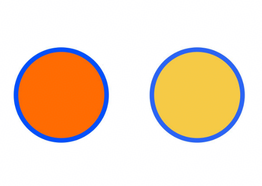

# Graphics (系统接口)
<!--Kit: ArkUI-->
<!--Subsystem: ArkUI-->
<!--Owner: @sun-xinyan-->
<!--Designer: @hehongyang3-->
<!--Tester: @lxl007-->
<!--Adviser: @Brilliantry_Rui-->

Graphics模块提供自定义节点相关属性定义，支持HDR色彩创建、色彩空间管理与查询、颜色分量获取等能力，适用于需要在Stage模型下进行HDR色彩处理及自定义节点属性配置的场景。

> **说明：**
>
> - 本模块同时支持ArkTS-Dyn、ArkTS-Sta。
> - 本模块首批接口从API version 12开始支持。后续版本的新增接口，采用上角标单独标记接口的起始版本。
>
> - 本模块接口仅可在Stage模型下使用。
>
> - 本文仅介绍当前模块的系统接口，其他公开接口参见[Graphics](./js-apis-arkui-graphics.md)。

## ColorMetrics

用于表示支持HDR的颜色，提供通过曝光系数创建HDR色彩、查询色彩空间及获取RGB颜色分量等能力，适用于HDR色彩处理与颜色属性配置的场景。

### createHDRColorWithLinearExposure

ArkTS-Dyn: static createHDRColorWithLinearExposure(linearExposure: number, colorSpace: ColorSpace, red: number, green: number, blue: number, alpha?: number): ColorMetrics

ArkTS-Sta: static createHDRColorWithLinearExposure(linearExposure: double, colorSpace: ColorSpace, red: double, green: double, blue: double, alpha?: double): ColorMetrics

使用[ColorSpace](./arkui-ts/ts-appendix-enums.md#colorspace20)、线性曝光系数和rgba格式颜色实例化支持HDR的ColorMetrics类。如不需要通过曝光系数调节，可使用[createHDRColor](#createhdrcolor)直接设置RGB分量值大于1.0来呈现HDR效果。适用于需要按线性比例均匀调整HDR亮度的场景，如HDR图像预览、视频播放器色彩调节。

**系统能力：** SystemCapability.ArkUI.ArkUI.Full

**系统接口：** 此接口为系统接口。

**模型约束：** 此接口仅可在Stage模型下使用。

**ArkTS-Dyn起始版本：** 26.0.0

**ArkTS-Sta起始版本：** 26.0.0

**参数：**

| 参数名 | 类型          | 必填 | 说明         |
| ------ | ------------- | ---- | ------------ |
| linearExposure | ArkTS-Dyn: number <br/>ArkTS-Sta: double | 是 | 线性曝光系数，取值范围：[1, +∞)。1.0表示标准曝光系数，大于1.0的值表示线性增加的曝光程度。传入小于1.0的值时将被自动钳位到1.0。 |
| colorSpace   | [ColorSpace](./arkui-ts/ts-appendix-enums.md#colorspace20) | 是   | 色彩空间，用于指定颜色的色彩空间。使用ColorSpace.DISPLAY_P3，需要在当前窗口调用[setWindowColorSpace](./arkts-apis-window-Window.md#setwindowcolorspace9-1)接口，将当前窗口设置为广色域模式。 |
| red   | ArkTS-Dyn: number <br/>ArkTS-Sta: double | 是   | 颜色的R分量（红色），值是0.0~1.0的浮点数。超出范围时将被自动钳位到[0.0, 1.0]范围内。 |
| green | ArkTS-Dyn: number <br/>ArkTS-Sta: double | 是   | 颜色的G分量（绿色），值是0.0~1.0的浮点数。超出范围时将被自动钳位到[0.0, 1.0]范围内。 |
| blue  | ArkTS-Dyn: number <br/>ArkTS-Sta: double | 是   | 颜色的B分量（蓝色），值是0.0~1.0的浮点数。超出范围时将被自动钳位到[0.0, 1.0]范围内。 |
| alpha | ArkTS-Dyn: number <br/>ArkTS-Sta: double | 否   | 颜色的A分量（透明度），值是0.0~1.0的浮点数，默认值为1.0，不透明。超出范围时将被自动钳位到[0.0, 1.0]范围内。|

**返回值：**

| 类型          | 说明             |
| ------------- | ---------------- |
| [ColorMetrics](#colormetrics) | 支持HDR的ColorMetrics类的实例，可用于表示HDR颜色及进行后续色彩空间查询、HDR状态判断和RGB分量获取等操作。|

### createHDRColorWithLogExposure

ArkTS-Dyn: static createHDRColorWithLogExposure(exposure: number, colorSpace: ColorSpace, red: number, green: number, blue: number, alpha?: number): ColorMetrics

ArkTS-Sta: static createHDRColorWithLogExposure(exposure: double, colorSpace: ColorSpace, red: double, green: double, blue: double, alpha?: double): ColorMetrics

使用[ColorSpace](./arkui-ts/ts-appendix-enums.md#colorspace20)、对数型曝光系数和rgba格式颜色实例化支持HDR的ColorMetrics类。与[createHDRColorWithLinearExposure](#createhdrcolorwithlinearexposure)相比，两者均通过曝光系数创建HDR色彩，区别在于本方法使用对数型曝光系数（指数级增加曝光程度），后者使用线性曝光系数（线性增加曝光程度），开发者可根据所需的曝光调节方式选择。如不需要通过曝光系数调节，可使用[createHDRColor](#createhdrcolor)直接设置RGB分量值大于1.0来呈现HDR效果。适用于需要按对数关系调整HDR亮度（更贴近人眼感知）的场景，如HDR照片编辑、影视后期调色。

**系统能力：** SystemCapability.ArkUI.ArkUI.Full

**系统接口：** 此接口为系统接口。

**模型约束：** 此接口仅可在Stage模型下使用。

**ArkTS-Dyn起始版本：** 26.0.0

**ArkTS-Sta起始版本：** 26.0.0

**参数：**

| 参数名 | 类型          | 必填 | 说明         |
| ------ | ------------- | ---- | ------------ |
| exposure | ArkTS-Dyn: number <br/>ArkTS-Sta: double | 是 | 对数型曝光系数，取值范围：[0, +∞)。0.0表示标准曝光系数，大于0.0的值表示指数级增加的曝光程度。传入负数时将被自动钳位到0.0。 |
| colorSpace   | [ColorSpace](./arkui-ts/ts-appendix-enums.md#colorspace20) | 是   | 色彩空间，用于指定颜色的色彩空间。使用ColorSpace.DISPLAY_P3，需要在当前窗口调用[setWindowColorSpace](./arkts-apis-window-Window.md#setwindowcolorspace9-1)接口，将当前窗口设置为广色域模式。 |
| red   | ArkTS-Dyn: number <br/>ArkTS-Sta: double | 是   | 颜色的R分量（红色），值是0.0~1.0的浮点数。超出范围时将被自动钳位到[0.0, 1.0]范围内。 |
| green | ArkTS-Dyn: number <br/>ArkTS-Sta: double | 是   | 颜色的G分量（绿色），值是0.0~1.0的浮点数。超出范围时将被自动钳位到[0.0, 1.0]范围内。 |
| blue  | ArkTS-Dyn: number <br/>ArkTS-Sta: double | 是   | 颜色的B分量（蓝色），值是0.0~1.0的浮点数。超出范围时将被自动钳位到[0.0, 1.0]范围内。 |
| alpha | ArkTS-Dyn: number <br/>ArkTS-Sta: double | 否   | 颜色的A分量（透明度），值是0.0~1.0的浮点数，默认值为1.0，不透明。超出范围时将被自动钳位到[0.0, 1.0]范围内。|

**返回值：**

| 类型          | 说明             |
| ------------- | ---------------- |
| [ColorMetrics](#colormetrics) | 支持HDR的ColorMetrics类的实例，可用于表示HDR颜色及进行后续色彩空间查询、HDR状态判断和RGB分量获取等操作。|

### createHDRColor

ArkTS-Dyn: static createHDRColorWithLogExposure(colorSpace: ColorSpace, red: number, green: number, blue: number, alpha?: number): ColorMetrics

ArkTS-Sta: static createHDRColorWithLogExposure(colorSpace: ColorSpace, red: double, green: double, blue: double, alpha?: double): ColorMetrics

使用[ColorSpace](./arkui-ts/ts-appendix-enums.md#colorspace20)和rgba格式颜色实例化支持HDR的ColorMetrics类。适用于无需调整曝光系数、直接指定HDR颜色分量的场景，如HDR纯色背景绘制、固定HDR色彩配置。

**系统能力：** SystemCapability.ArkUI.ArkUI.Full

**系统接口：** 此接口为系统接口。

**模型约束：** 此接口仅可在Stage模型下使用。

**ArkTS-Dyn起始版本：** 26.0.0

**ArkTS-Sta起始版本：** 26.0.0

**参数：**

| 参数名 | 类型          | 必填 | 说明         |
| ------ | ------------- | ---- | ------------ |
| colorSpace   | [ColorSpace](./arkui-ts/ts-appendix-enums.md#colorspace20) | 是   | 色彩空间，用于指定颜色的色彩空间。使用ColorSpace.DISPLAY_P3，需要在当前窗口调用[setWindowColorSpace](./arkts-apis-window-Window.md#setwindowcolorspace9-1)接口，将当前窗口设置为广色域模式。 |
| red   | ArkTS-Dyn: number <br/>ArkTS-Sta: double | 是   | 颜色的R分量（红色），取值范围：[0, +∞)。大于1.0的值会使能HDR特性。传入负数时将被自动钳位到0.0。 |
| green | ArkTS-Dyn: number <br/>ArkTS-Sta: double | 是   | 颜色的G分量（绿色），取值范围：[0, +∞)。大于1.0的值会使能HDR特性。传入负数时将被自动钳位到0.0。 |
| blue  | ArkTS-Dyn: number <br/>ArkTS-Sta: double | 是   | 颜色的B分量（蓝色），取值范围：[0, +∞)。大于1.0的值会使能HDR特性。传入负数时将被自动钳位到0.0。 |
| alpha | ArkTS-Dyn: number <br/>ArkTS-Sta: double | 否   | 颜色的A分量（透明度），值是0.0~1.0的浮点数，默认值为1.0，不透明。超出范围时将被自动钳位到[0.0, 1.0]范围内。|

**返回值：**

| 类型          | 说明             |
| ------------- | ---------------- |
| [ColorMetrics](#colormetrics) | 支持HDR的ColorMetrics类的实例，可用于表示HDR颜色及进行后续色彩空间查询、HDR状态判断和RGB分量获取等操作。|

### getColorSpace

getColorSpace(): ColorSpace

获取ColorMetrics的色彩空间。

**系统能力：** SystemCapability.ArkUI.ArkUI.Full

**系统接口：** 此接口为系统接口。

**模型约束：** 此接口仅可在Stage模型下使用。

**ArkTS-Dyn起始版本：** 26.0.0

**ArkTS-Sta起始版本：** 26.0.0

**返回值：**

| 类型          | 说明             |
| ------------- | ---------------- |
| [ColorSpace](./arkui-ts/ts-appendix-enums.md#colorspace20) | 当前ColorMetrics对象所配置的色彩空间，可用于判断当前颜色使用的色彩空间类型。 |

### isHDR

isHDR(): boolean

获取ColorMetrics是否呈现了HDR色彩。

**系统能力：** SystemCapability.ArkUI.ArkUI.Full

**系统接口：** 此接口为系统接口。

**模型约束：** 此接口仅可在Stage模型下使用。

**ArkTS-Dyn起始版本：** 26.0.0

**ArkTS-Sta起始版本：** 26.0.0

**返回值：**

| 类型          | 说明             |
| ------------- | ---------------- |
| boolean | ColorMetrics是否呈现了HDR色彩。当色彩是通过createHDRColorWith系列方法（如[createHDRColorWithLinearExposure](#createhdrcolorwithlinearexposure)）创建，或任意RGB分量值大于1.0时，将返回true；否则返回false，表示ColorMetrics未呈现HDR色彩。 |

### getRedValue

ArkTS-Dyn: getRedValue(): number

ArkTS-Sta: getRedValue(): double

获取ColorMetrics颜色的R分量，以浮点数形式返回红色通道值。

**系统能力：** SystemCapability.ArkUI.ArkUI.Full

**系统接口：** 此接口为系统接口。

**模型约束：** 此接口仅可在Stage模型下使用。

**ArkTS-Dyn起始版本：** 26.0.0

**ArkTS-Sta起始版本：** 26.0.0

**返回值：**

| 类型          | 说明             |
| ------------- | ---------------- |
| ArkTS-Dyn: number <br/>ArkTS-Sta: double | 颜色的R分量（红色）。<br>取值范围：<br>对于SDR颜色，取值范围为[0.0, 1.0]。<br>对于HDR颜色，该值可以大于1.0，以表示扩展亮度。|

### getGreenValue

ArkTS-Dyn: getGreenValue(): number

ArkTS-Sta: getGreenValue(): double

获取ColorMetrics颜色的G分量，以浮点数形式返回绿色通道值。

**系统能力：** SystemCapability.ArkUI.ArkUI.Full

**系统接口：** 此接口为系统接口。

**模型约束：** 此接口仅可在Stage模型下使用。

**ArkTS-Dyn起始版本：** 26.0.0

**ArkTS-Sta起始版本：** 26.0.0

**返回值：**

| 类型          | 说明             |
| ------------- | ---------------- |
| ArkTS-Dyn: number <br/>ArkTS-Sta: double | 颜色的G分量（绿色）。<br>取值范围：<br>对于SDR颜色，取值范围是[0.0, 1.0]。<br>对于HDR颜色，该值可以大于1.0，以表示扩展亮度。|

### getBlueValue

ArkTS-Dyn: getBlueValue(): number

ArkTS-Sta: getBlueValue(): double

获取ColorMetrics颜色的B分量，以浮点数形式返回蓝色通道值。

**系统能力：** SystemCapability.ArkUI.ArkUI.Full

**系统接口：** 此接口为系统接口。

**模型约束：** 此接口仅可在Stage模型下使用。

**ArkTS-Dyn起始版本：** 26.0.0

**ArkTS-Sta起始版本：** 26.0.0

**返回值：**

| 类型          | 说明             |
| ------------- | ---------------- |
| ArkTS-Dyn: number <br/>ArkTS-Sta: double | 颜色的B分量（蓝色）。<br>取值范围：<br>对于SDR颜色，取值范围是[0.0, 1.0]。<br>对于HDR颜色，该值可以大于1.0，以表示扩展亮度。 |

## 示例

### 示例1（使用ColorMetrics设置Circle组件的HDR填充和边框颜色）

通过ColorMetrics的[createHDRColor](#createhdrcolor)接口可为[Circle](arkui-ts/ts-drawing-components-circle.md)组件设置HDR颜色，实现超出普通显示范围的亮度效果。其中，[fill](arkui-ts/ts-drawing-components-circle.md#fill)接口用于设置填充区域的颜色，[stroke](arkui-ts/ts-drawing-components-circle.md#stroke)接口用于设置边框颜色。以下示例左侧使用HDR暖金色填充和冰蓝色边框（亮度倍数大于1.0），右侧使用普通SDR颜色作为对照。在支持HDR的屏幕上可观察到左侧明显比右侧更亮且色彩更鲜艳。

从API版本26.0.0开始，Circle组件新增支持传入ColorMetrics类型的fill和stroke接口；ColorMetrics新增createHDRColor接口。

```ts
// xxx.ets
import { ColorMetrics } from '@kit.ArkUI';

@Entry
@Component
struct CircleHDRDemo {
  build() {
    Column({ space: 30 }) {
      Row({ space: 60 }) {
        // HDR填充和边框：颜色分量值可以超过1.0，超过1.0的部分用于表现超出普通屏幕亮度范围的高亮效果
        Column({ space: 8 }) {
          Circle()
            .width(120).height(120).strokeWidth(6)
            .fill(ColorMetrics.createHDRColor(ColorSpace.BT2020, 2.5, 1.2, 0.0, 1)) // 高亮暖金
            .stroke(ColorMetrics.createHDRColor(ColorSpace.BT2020, 0.0, 0.8, 2.5, 1)) // 高亮冰蓝
          Text('HDR').fontColor(Color.White).fontSize(14)
        }

        // SDR填充和边框：颜色分量值的范围为0.0到1.0，是常规标准动态范围的颜色显示方式
        Column({ space: 8 }) {
          Circle()
            .width(120).height(120).strokeWidth(6)
            .fill('#ffc800') // 普通金黄
            .stroke('#0066ff') // 普通深蓝
          Text('SDR').fontColor(Color.White).fontSize(14)
        }
      }
    }
    .width('100%').height('100%')
    .justifyContent(FlexAlign.Center)
  }
}
```



### 示例2（使用ColorMetrics设置CanvasGradient对象的HDR填充和边框颜色）

以下示例演示SDR与HDR渐变的亮度差异。[CanvasGradient](arkui-ts/ts-components-canvas-canvasgradient.md)对象的[addColorStop](arkui-ts/ts-components-canvas-canvasgradient.md#addcolorstop20)接口支持通过ColorMetrics的[createHDRColor](#createhdrcolor)接口进行HDR提亮，该接口可以构造BT2020色域的HDR颜色，颜色分量值可以超过1.0，超过1.0的部分用于表现超出普通屏幕亮度范围的高亮效果。左侧使用sRGB色域的红->白->绿渐变，右侧使用BT2020色域的HDR颜色且高光白色亮度倍数达到1.5，在支持HDR的屏幕上右侧高光区域明显比左侧更亮。

> **说明：**
>
> 使用HDR颜色时，需要将Canvas组件所在窗口的色域模式通过[setWindowColorSpace](arkts-apis-window-Window.md#setwindowcolorspace9)方法设置为广色域模式（WIDE_GAMUT），否则HDR提亮效果不会生效。

从API版本26.0.0开始，ColorMetrics新增createHDRColor接口。

```ts
// xxx.ets
import { ColorMetrics } from '@kit.ArkUI';
import { BusinessError } from '@kit.BasicServicesKit';

@Entry
@Component
struct CanvasGradientDemo {
  private settings: RenderingContextSettings = new RenderingContextSettings(true);
  private context: CanvasRenderingContext2D = new CanvasRenderingContext2D(this.settings);

  build() {
    Column({ space: 30 }) {
      Canvas(this.context)
        .width(340)
        .height(240)
        .onReady(() => {
          // HDR渐变支持超出1.0的亮度值，在支持HDR的设备上，右侧高光区域会比左侧更亮
          this.drawCanvas();
        })
    }
    .width('100%')
    .height('100%')
    .justifyContent(FlexAlign.Center)
  }

  private drawCanvas() {
    // 左侧：SDR渐变，红 -> 白 -> 绿
    let gradSDR = this.context.createLinearGradient(20, 20, 160, 160)
    try {
      gradSDR.addColorStop(0.0, ColorMetrics.colorWithSpace(ColorSpace.SRGB, 1.0, 0.0, 0.0, 1.0)) // 红色
      gradSDR.addColorStop(0.5, ColorMetrics.colorWithSpace(ColorSpace.SRGB, 1.0, 1.0, 1.0, 1.0)) // 白色
      gradSDR.addColorStop(1.0, ColorMetrics.colorWithSpace(ColorSpace.SRGB, 0.0, 1.0, 0.0, 1.0)) // 绿色
    } catch (error) {
      let e: BusinessError = error as BusinessError;
      console.error(`SDR Failed to addColorStop. Code: ${e.code}, message: ${e.message}`);
    }
    this.context.fillStyle = gradSDR
    this.context.fillRect(10, 10, 150, 150)

    this.context.fillStyle = '#FFFFFF'
    this.context.font = '16px sans-serif'
    this.context.textAlign = 'center'
    this.context.fillText("SDR", 85, 190)

    // 右侧：HDR渐变，红 -> 高亮白(亮度1.5) -> 绿
    let gradHDR = this.context.createLinearGradient(190, 20, 330, 160)
    try {
      gradHDR.addColorStop(0.0, ColorMetrics.createHDRColor(ColorSpace.BT2020, 1.0, 0.0, 0.0, 1.0)) // 红色
      gradHDR.addColorStop(0.5, ColorMetrics.createHDRColor(ColorSpace.BT2020, 1.5, 1.5, 1.5, 1.0)) // 高亮白色
      gradHDR.addColorStop(1.0, ColorMetrics.createHDRColor(ColorSpace.BT2020, 0.0, 1.0, 0.0, 1.0)) // 绿色
    } catch (error) {
      let e: BusinessError = error as BusinessError;
      console.error(`HDR Failed to addColorStop. Code: ${e.code}, message: ${e.message}`);
    }
    this.context.fillStyle = gradHDR
    this.context.fillRect(180, 10, 150, 150)

    this.context.fillStyle = '#FFFFFF'
    this.context.fillText("HDR", 255, 190)
  }
}
```

