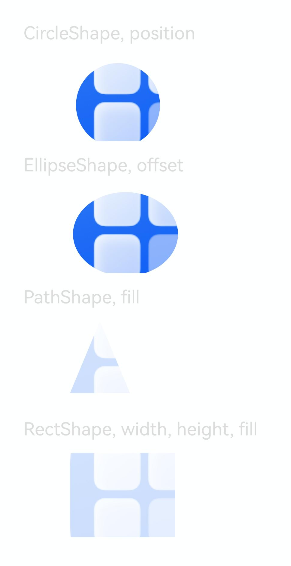

# @ohos.arkui.shape (形状)
<!--Kit: ArkUI-->
<!--Subsystem: ArkUI-->
<!--Owner: @CCFFWW-->
<!--Designer: @CCFFWW-->
<!--Tester: @lxl007-->
<!--Adviser: @Brilliantry_Rui-->

在[clipShape](arkui-ts/ts-universal-attributes-sharp-clipping.md#clipshape12)和[maskShape](arkui-ts/ts-universal-attributes-sharp-clipping.md#maskshape12)接口中可以传入对应的形状。


> **说明：**
>
> - 本模块同时支持ArkTS-Dyn、ArkTS-Sta。
>
> - 本模块首批接口从API version 12开始支持。后续版本的新增接口，采用上角标单独标记接口的起始版本。

## 导入模块

```ts
import { CircleShape, EllipseShape, PathShape, RectShape } from "@kit.ArkUI";
```

## CircleShape

用于clipShape和maskShape接口的圆形形状。

继承自[BaseShape](#baseshape)。

**卡片能力（仅ArkTS-Dyn）：** 从API version 12开始，该接口支持在ArkTS卡片中使用。

**原子化服务API（仅ArkTS-Dyn）：** 从API version 12开始，该接口支持在原子化服务中使用。

**系统能力：** SystemCapability.ArkUI.ArkUI.Full

**ArkTS-Dyn起始版本：** 12

**ArkTS-Sta起始版本：** 23

### constructor

constructor(options?: ShapeSize)

创建CircleShape对象。

**卡片能力（仅ArkTS-Dyn）：** 从API version 12开始，该接口支持在ArkTS卡片中使用。

**原子化服务API（仅ArkTS-Dyn）：** 从API version 12开始，该接口支持在原子化服务中使用。

**系统能力：** SystemCapability.ArkUI.ArkUI.Full

**参数：** 

| 名称 | 类型 | 只读 | 可选 | 说明 |
| --------- | ------| ------- | ------- | --------|
| options | [ShapeSize](#shapesize) | 否 | 是  | 形状的大小。 |

## EllipseShape

用于clipShape和maskShape接口的椭圆形状。

继承自[BaseShape](#baseshape)。

**卡片能力（仅ArkTS-Dyn）：** 从API version 12开始，该接口支持在ArkTS卡片中使用。

**原子化服务API（仅ArkTS-Dyn）：** 从API version 12开始，该接口支持在原子化服务中使用。

**系统能力：** SystemCapability.ArkUI.ArkUI.Full

**ArkTS-Dyn起始版本：** 12

**ArkTS-Sta起始版本：** 23

### constructor

constructor(options?: ShapeSize)

创建EllipseShape对象。

**卡片能力（仅ArkTS-Dyn）：** 从API version 12开始，该接口支持在ArkTS卡片中使用。

**原子化服务API（仅ArkTS-Dyn）：** 从API version 12开始，该接口支持在原子化服务中使用。

**系统能力：** SystemCapability.ArkUI.ArkUI.Full

**ArkTS-Dyn起始版本：** 12

**ArkTS-Sta起始版本：** 23

**参数：** 

| 名称 | 类型 | 只读 | 可选 | 说明 |
| --------- | ------| ------- | ------- | --------|
| options | [ShapeSize](#shapesize) | 否 | 是  | 形状的大小。 |

## PathShape

用于clipShape和maskShape接口的路径。

继承自[CommonShapeMethod](#commonshapemethod)。

**卡片能力（仅ArkTS-Dyn）：** 从API version 12开始，该接口支持在ArkTS卡片中使用。

**原子化服务API（仅ArkTS-Dyn）：** 从API version 12开始，该接口支持在原子化服务中使用。

**系统能力：** SystemCapability.ArkUI.ArkUI.Full

**ArkTS-Dyn起始版本：** 12

**ArkTS-Sta起始版本：** 23

### constructor

constructor(options?: PathShapeOptions)

创建PathShape对象。

**卡片能力（仅ArkTS-Dyn）：** 从API version 12开始，该接口支持在ArkTS卡片中使用。

**原子化服务API（仅ArkTS-Dyn）：** 从API version 12开始，该接口支持在原子化服务中使用。

**系统能力：**  SystemCapability.ArkUI.ArkUI.Full

**ArkTS-Dyn起始版本：** 12

**ArkTS-Sta起始版本：** 23

**参数：** 

| 名称 | 类型 | 只读 | 可选 | 说明 |
| --------- | ------| ------- | ------- | --------|
| options | [PathShapeOptions](#pathshapeoptions) | 否 | 是  | 路径参数。 |

### commands

commands(commands: string): PathShape

设置路径的绘制指令。

**卡片能力（仅ArkTS-Dyn）：** 从API version 12开始，该接口支持在ArkTS卡片中使用。

**原子化服务API（仅ArkTS-Dyn）：** 从API version 12开始，该接口支持在原子化服务中使用。

**系统能力：** SystemCapability.ArkUI.ArkUI.Full

**ArkTS模式：** 该接口仅适用于ArkTS-Dyn。

**相关接口：** 该接口对应的ArkTS-Sta的接口是[commands<sup>23+</sup>](#commands23)。

**ArkTS-Dyn起始版本：** 12

**参数：** 

| 参数名         | 类型                                               | 必填 | 说明                                         |
| ----------- | -------------------------------------------------- | ---- | -------------------------------------------- |
| commands | string | 是 | 路径的绘制指令。 |

**返回值：**

| 类型   | 说明                     |
| ------ | ------------------------ |
| [PathShape](#pathshape) | 返回PathShape对象。 |

### commands<sup>23+</sup>

commands(commands: string): this

设置路径的绘制指令。

**系统能力：** SystemCapability.ArkUI.ArkUI.Full

**ArkTS模式：** 该接口仅适用于ArkTS-Sta。

**相关接口：** 该接口对应的ArkTS-Dyn的接口是[commands](#commands)。

**ArkTS-Sta起始版本：** 23

**参数：** 

| 参数名         | 类型                                               | 必填 | 说明                                         |
| ----------- | -------------------------------------------------- | ---- | -------------------------------------------- |
| commands | string | 是 | 路径的绘制指令。 |

**返回值：**

| 类型   | 说明                     |
| ------ | ------------------------ |
| this | 返回当前对象。 |

## RectShape

用于clipShape和maskShape接口的矩形形状。

继承自[BaseShape](#baseshape)。

**卡片能力（仅ArkTS-Dyn）：** 从API version 12开始，该接口支持在ArkTS卡片中使用。

**原子化服务API（仅ArkTS-Dyn）：** 从API version 12开始，该接口支持在原子化服务中使用。

**系统能力：** SystemCapability.ArkUI.ArkUI.Full

**ArkTS-Dyn起始版本：** 12

**ArkTS-Sta起始版本：** 23

### constructor

constructor(options?: RectShapeOptions | RoundRectShapeOptions)

创建RectShape对象。

**卡片能力（仅ArkTS-Dyn）：** 从API version 12开始，该接口支持在ArkTS卡片中使用。

**原子化服务API（仅ArkTS-Dyn）：** 从API version 12开始，该接口支持在原子化服务中使用。

**系统能力：** SystemCapability.ArkUI.ArkUI.Full

**ArkTS-Dyn起始版本：** 12

**ArkTS-Sta起始版本：** 23

**参数：**

| 参数名         | 类型                                               | 必填 | 说明                                         |
| ----------- | -------------------------------------------------- | ---- | -------------------------------------------- |
| options | [RectShapeOptions](#rectshapeoptions) &nbsp;\|&nbsp; [RoundRectShapeOptions](#roundrectshapeoptions) | 否 | 矩形形状参数。 |

### radiusWidth

radiusWidth(rWidth: number | string): RectShape

设置矩形形状圆角半径的宽度。

**卡片能力（仅ArkTS-Dyn）：** 从API version 12开始，该接口支持在ArkTS卡片中使用。

**原子化服务API（仅ArkTS-Dyn）：** 从API version 12开始，该接口支持在原子化服务中使用。

**系统能力：** SystemCapability.ArkUI.ArkUI.Full

**ArkTS模式：** 该接口仅适用于ArkTS-Dyn。

**相关接口：** 该接口对应的ArkTS-Sta的接口是[radiusWidth<sup>23+</sup>](#radiuswidth23)。

**ArkTS-Dyn起始版本：** 12

**参数：** 

| 参数名         | 类型                                               | 必填 | 说明                                         |
| ----------- | -------------------------------------------------- | ---- | -------------------------------------------- |
| rWidth | number &nbsp;\|&nbsp; string | 是 | 矩形形状圆角半径的宽度。<br/> 类型为number时取值范围是[0, +∞)，类型为string时是[Length](arkui-ts/ts-types.md#length)。<br/>单位：vp<br/>取值为异常值时按照0vp处理。 | 

**返回值：**

| 类型   | 说明                     |
| ------ | ------------------------ |
| [RectShape](#rectshape) | 返回RectShape对象。 |

### radiusWidth<sup>23+</sup>

radiusWidth(rWidth: double | string): this

设置矩形形状圆角半径的宽度。

**系统能力：** SystemCapability.ArkUI.ArkUI.Full

**ArkTS模式：** 该接口仅适用于ArkTS-Sta。

**相关接口：** 该接口对应的ArkTS-Dyn的接口是[radiusWidth](#radiuswidth)。

**ArkTS-Sta起始版本：** 23

**参数：** 

| 参数名         | 类型                                               | 必填 | 说明                                         |
| ----------- | -------------------------------------------------- | ---- | -------------------------------------------- |
| rWidth | double &nbsp;\|&nbsp; string | 是 | 矩形形状圆角半径的宽度。<br/> 类型为double时取值范围是[0, +∞)，类型为string时是[Length](arkui-ts/ts-types.md#length)。 | 

**返回值：**

| 类型   | 说明                     |
| ------ | ------------------------ |
| this | 返回当前对象。 |

### radiusHeight

radiusHeight(rHeight: number | string): RectShape

设置矩形形状圆角半径的高度。

**卡片能力（仅ArkTS-Dyn）：** 从API version 12开始，该接口支持在ArkTS卡片中使用。

**原子化服务API（仅ArkTS-Dyn）：** 从API version 12开始，该接口支持在原子化服务中使用。

**系统能力：** SystemCapability.ArkUI.ArkUI.Full

**ArkTS模式：** 该接口仅适用于ArkTS-Dyn。

**相关接口：** 该接口对应的ArkTS-Sta的接口是[radiusHeight<sup>23+</sup>](#radiusheight23)。

**ArkTS-Dyn起始版本：** 12

**参数：** 

| 参数名         | 类型                                               | 必填 | 说明                                         |
| ----------- | -------------------------------------------------- | ---- | -------------------------------------------- |
| rHeight | number &nbsp;\|&nbsp; string | 是 | 矩形形状圆角半径的高度。 <br/> 类型为number时取值范围是[0, +∞)，类型为string时是[Length](arkui-ts/ts-types.md#length)。<br/>单位：vp<br/>取值为异常值时按照0vp处理。 |

**返回值：**

| 类型   | 说明                     |
| ------ | ------------------------ |
| [RectShape](#rectshape) | 返回RectShape对象。 |

### radiusHeight<sup>23+</sup>

radiusHeight(rHeight: double | string): this

设置矩形形状圆角半径的宽度。

**系统能力：** SystemCapability.ArkUI.ArkUI.Full

**ArkTS模式：** 该接口仅适用于ArkTS-Sta。

**相关接口：** 该接口对应的ArkTS-Dyn的接口是[radiusHeight](#radiusheight)。

**ArkTS-Sta起始版本：** 23

**参数：** 

| 参数名         | 类型                                               | 必填 | 说明                                         |
| ----------- | -------------------------------------------------- | ---- | -------------------------------------------- |
| rWidth | double &nbsp;\|&nbsp; string | 是 | 矩形形状圆角半径的宽度。<br/> 类型为double时取值范围是[0, +∞)，类型为string时是[Length](arkui-ts/ts-types.md#length)。 | 

**返回值：**

| 类型   | 说明                     |
| ------ | ------------------------ |
| this | 返回当前对象。 |

### radius

radius(radius: number | string | Array<number &nbsp;\|&nbsp; string>): RectShape

设置矩形形状的圆角半径。

**卡片能力（仅ArkTS-Dyn）：** 从API version 12开始，该接口支持在ArkTS卡片中使用。

**原子化服务API（仅ArkTS-Dyn）：** 从API version 12开始，该接口支持在原子化服务中使用。

**系统能力：** SystemCapability.ArkUI.ArkUI.Full

**ArkTS模式：** 该接口仅适用于ArkTS-Dyn。

**相关接口：** 该接口对应的ArkTS-Sta的接口是[radius<sup>23+</sup>](#radius23)。

**ArkTS-Dyn起始版本：** 12

**参数：** 

| 参数名         | 类型                                               | 必填 | 说明                                         |
| ----------- | -------------------------------------------------- | ---- | -------------------------------------------- |
| radius | number &nbsp;\|&nbsp; string &nbsp;\|&nbsp; Array<number &nbsp;\|&nbsp; string> | 是 | 矩形形状的圆角半径。仅接受数组的前四个元素，分别为矩形左上，右上，左下，右下的圆角半径。<br/> 类型为number时取值范围是[0, +∞)，类型为string时是[Length](arkui-ts/ts-types.md#length)。<br/>单位：vp<br/>取值为异常值时按照0vp处理。 |

**返回值：**

| 类型   | 说明                     |
| ------ | ------------------------ |
| [RectShape](#rectshape) | 返回RectShape对象。 |

### radius<sup>23+</sup>

radius(radius: double | string | Array<double &nbsp;\|&nbsp; string>): this

设置矩形形状的圆角半径。

**系统能力：** SystemCapability.ArkUI.ArkUI.Full

**ArkTS模式：** 该接口仅适用于ArkTS-Sta。

**相关接口：** 该接口对应的ArkTS-Dyn的接口是[radius](#radius)。

**ArkTS-Sta起始版本：** 23

**参数：** 

| 参数名         | 类型                                               | 必填 | 说明                                         |
| ----------- | -------------------------------------------------- | ---- | -------------------------------------------- |
| radius | double &nbsp;\|&nbsp; string &nbsp;\|&nbsp; Array<double &nbsp;\|&nbsp; string> | 是 | 矩形形状的圆角半径。仅接受数组的前四个元素，分别为矩形左上，右上，左下，右下的圆角半径。<br/> 类型为double时取值范围是[0, +∞)，类型为string时是[Length](arkui-ts/ts-types.md#length)。 |

**返回值：**

| 类型   | 说明                     |
| ------ | ------------------------ |
| this | 返回当前对象。 |


## ShapeSize

形状的尺寸参数。

**卡片能力（仅ArkTS-Dyn）：** 从API version 12开始，该接口支持在ArkTS卡片中使用。

**原子化服务API（仅ArkTS-Dyn）：** 从API version 12开始，该接口支持在原子化服务中使用。

**系统能力：** SystemCapability.ArkUI.ArkUI.Full

**ArkTS-Dyn起始版本：** 12

**ArkTS-Sta起始版本：** 23

| 名称 | 类型 | 只读 | 可选 | 说明 |
| --------- | ------| ------- | ------- | --------|
| width | ArkTS-Dyn: number &nbsp;\|&nbsp; string<br/>ArkTS-Sta: double &nbsp;\|&nbsp; string | 否 | 是  | 形状的宽度。<br/> 类型为number时取值范围是[0, +∞)，string时是[Length](arkui-ts/ts-types.md#length)。 <br/>单位：vp<br/>取值为异常值时按照0vp处理。 |
| height | ArkTS-Dyn: number &nbsp;\|&nbsp; string<br/>ArkTS-Sta: double &nbsp;\|&nbsp; string | 否 | 是  | 形状的高度。 <br/> 类型为number时取值范围是[0, +∞)，string时是[Length](arkui-ts/ts-types.md#length)。 <br/>单位：vp<br/>取值为异常值时按照0vp处理。 |

## PathShapeOptions

PathShape的构造函数参数。

**卡片能力（仅ArkTS-Dyn）：** 从API version 12开始，该接口支持在ArkTS卡片中使用。

**原子化服务API（仅ArkTS-Dyn）：** 从API version 12开始，该接口支持在原子化服务中使用。

**系统能力：** SystemCapability.ArkUI.ArkUI.Full

**ArkTS-Dyn起始版本：** 12

**ArkTS-Sta起始版本：** 23

| 名称 | 类型 | 只读 | 可选 | 说明 |
| --------- | ------| ------- | ------- | --------|
| commands | string | 否 | 是 | 绘制路径的指令。更多说明请参考[commands](./arkui-ts/ts-drawing-components-path.md#commands)支持的绘制命令。 |

## RectShapeOptions

RectShape 的构造函数参数。

继承自[ShapeSize](#shapesize)。

**卡片能力（仅ArkTS-Dyn）：** 从API version 12开始，该接口支持在ArkTS卡片中使用。

**原子化服务API（仅ArkTS-Dyn）：** 从API version 12开始，该接口支持在原子化服务中使用。

**系统能力：** SystemCapability.ArkUI.ArkUI.Full

**ArkTS-Dyn起始版本：** 12

**ArkTS-Sta起始版本：** 23

| 名称 | 类型 | 只读 | 可选 | 说明 |
| --------- | ------| ------- | ------- | --------|
| radius | ArkTS-Dyn: number &nbsp;\|&nbsp; string &nbsp;\|&nbsp; Array<number &nbsp;\|&nbsp; string><br/>ArkTS-Sta: double &nbsp;\|&nbsp; string &nbsp;\|&nbsp; Array<double &nbsp;\|&nbsp; string> | 否 | 是 | 矩形形状的圆角半径。<br/> 类型为number时取值范围是[0, +∞)，string时是[Length](arkui-ts/ts-types.md#length)。<br/>单位：vp<br/>取值为异常值时按照0vp处理。 |

## RoundRectShapeOptions

RectShape 带有半径的构造函数参数。

继承自[ShapeSize](#shapesize)。

**卡片能力（仅ArkTS-Dyn）：** 从API version 12开始，该接口支持在ArkTS卡片中使用。

**原子化服务API（仅ArkTS-Dyn）：** 从API version 12开始，该接口支持在原子化服务中使用。

**系统能力：** SystemCapability.ArkUI.ArkUI.Full

**ArkTS-Dyn起始版本：** 12

**ArkTS-Sta起始版本：** 23

| 名称 | 类型 | 只读 | 可选 | 说明 |
| --------- | ------| ------- | ------- | --------|
| radiusWidth | ArkTS-Dyn: number &nbsp;\|&nbsp; string<br/>ArkTS-Sta: double &nbsp;\|&nbsp; string | 否 | 是  | 矩形形状圆角半径的宽度。<br/> 类型为number时取值范围是[0, +∞)，string时是[Length](arkui-ts/ts-types.md#length)。<br/>单位：vp<br/>取值为异常值时按照0vp处理。 |
| radiusHeight | ArkTS-Dyn: number &nbsp;\|&nbsp; string<br/>ArkTS-Sta: double &nbsp;\|&nbsp; string | 否 | 是  | 矩形形状圆角半径的高度。<br/> 类型为number时取值范围是[0, +∞)，string时是[Length](arkui-ts/ts-types.md#length)。<br/>单位：vp<br/>取值为异常值时按照0vp处理。 |

## BaseShape

继承自[CommonShapeMethod](#commonshapemethod)。

**卡片能力（仅ArkTS-Dyn）：** 从API version 12开始，该接口支持在ArkTS卡片中使用。

**原子化服务API（仅ArkTS-Dyn）：** 从API version 12开始，该接口支持在原子化服务中使用。

**系统能力：** SystemCapability.ArkUI.ArkUI.Full

**ArkTS-Dyn起始版本：** 12

**ArkTS-Sta起始版本：** 23

### width

width(width: Length): T

设置形状的宽度。

**卡片能力（仅ArkTS-Dyn）：** 从API version 12开始，该接口支持在ArkTS卡片中使用。

**原子化服务API（仅ArkTS-Dyn）：** 从API version 12开始，该接口支持在原子化服务中使用。

**系统能力：** SystemCapability.ArkUI.ArkUI.Full

**ArkTS模式：** 该接口仅适用于ArkTS-Dyn。

**相关接口：** 该接口对应的ArkTS-Sta的接口是[width<sup>23+</sup>](#width23)。

**ArkTS-Dyn起始版本：** 12

**参数：** 

| 参数名         | 类型                                               | 必填 | 说明                                         |
| ----------- | -------------------------------------------------- | ---- | -------------------------------------------- |
| width | [Length](arkui-ts/ts-types.md#length) | 是 | 形状的宽度。<br/>单位：vp<br/>取值为异常值时按照0vp处理。 |

**返回值：**

| 类型   | 说明                     |
| ------ | ------------------------ |
| T | 返回当前对象。 |

### width<sup>23+</sup>

width(width: Length): this

设置形状的宽度。

**系统能力：** SystemCapability.ArkUI.ArkUI.Full

**ArkTS模式：** 该接口仅适用于ArkTS-Sta。

**相关接口：** 该接口对应的ArkTS-Dyn的接口是[width](#width)。

**ArkTS-Sta起始版本：** 23

**参数：** 

| 参数名         | 类型                                               | 必填 | 说明                                         |
| ----------- | -------------------------------------------------- | ---- | -------------------------------------------- |
| width | [Length](arkui-ts/ts-types.md#length) | 是 | 形状的宽度。<br/>单位：vp<br/>取值为异常值时按照0vp处理。 |

**返回值：**

| 类型   | 说明                     |
| ------ | ------------------------ |
| this | 返回当前对象。 |

### height

height(height: Length): T

设置形状的高度。

**卡片能力（仅ArkTS-Dyn）：** 从API version 12开始，该接口支持在ArkTS卡片中使用。

**原子化服务API（仅ArkTS-Dyn）：** 从API version 12开始，该接口支持在原子化服务中使用。

**系统能力：** SystemCapability.ArkUI.ArkUI.Full

**ArkTS模式：** 该接口仅适用于ArkTS-Dyn。

**相关接口：** 该接口对应的ArkTS-Sta的接口是[height<sup>23+</sup>](#height23)。

**ArkTS-Dyn起始版本：** 12

**参数：** 

| 参数名         | 类型                                               | 必填 | 说明                                         |
| ----------- | -------------------------------------------------- | ---- | -------------------------------------------- |
| height | [Length](arkui-ts/ts-types.md#length) | 是 | 形状的高度。<br/>单位：vp<br/>取值为异常值时按照0vp处理。 |

**返回值：**

| 类型   | 说明                     |
| ------ | ------------------------ |
| T | 返回当前对象。 |

### height<sup>23+</sup>

height(height: Length): this

设置形状的高度。

**系统能力：** SystemCapability.ArkUI.ArkUI.Full

**ArkTS模式：** 该接口仅适用于ArkTS-Sta。

**相关接口：** 该接口对应的ArkTS-Dyn的接口是[height](#height)。

**ArkTS-Sta起始版本：** 23

**参数：** 

| 参数名         | 类型                                               | 必填 | 说明                                         |
| ----------- | -------------------------------------------------- | ---- | -------------------------------------------- |
| height | [Length](arkui-ts/ts-types.md#length) | 是 | 形状的高度。 |

**返回值：**

| 类型   | 说明                     |
| ------ | ------------------------ |
| this | 返回当前对象。 |

### size

size(size: SizeOptions): T

设置形状的大小。

**卡片能力（仅ArkTS-Dyn）：** 从API version 12开始，该接口支持在ArkTS卡片中使用。

**原子化服务API（仅ArkTS-Dyn）：** 从API version 12开始，该接口支持在原子化服务中使用。

**系统能力：** SystemCapability.ArkUI.ArkUI.Full

**ArkTS模式：** 该接口仅适用于ArkTS-Dyn。

**相关接口：** 该接口对应的ArkTS-Sta的接口是[size<sup>23+</sup>](#size23)。

**ArkTS-Dyn起始版本：** 12

**参数：** 

| 参数名         | 类型                                               | 必填 | 说明                                         |
| ----------- | -------------------------------------------------- | ---- | -------------------------------------------- |
| size | [SizeOptions](arkui-ts/ts-types.md#sizeoptions) | 是 | 形状的大小。 |

**返回值：**

| 类型   | 说明                     |
| ------ | ------------------------ |
| T | 返回当前对象。 |

### size<sup>23+</sup>

size(size: SizeOptions): this

设置形状的大小。

**系统能力：** SystemCapability.ArkUI.ArkUI.Full

**ArkTS模式：** 该接口仅适用于ArkTS-Sta。

**相关接口：** 该接口对应的ArkTS-Dyn的接口是[size](#size)。

**ArkTS-Sta起始版本：** 23

**参数：** 

| 参数名         | 类型                                               | 必填 | 说明                                                                                 |
| ----------- | -------------------------------------------------- | ---- | -------------------------------------------- |
| size | [SizeOptions](arkui-ts/ts-types.md#sizeoptions) | 是 | 形状的大小。 |

**返回值：**

| 类型   | 说明                     |
| ------ | ------------------------ |
| this | 返回当前对象。 |

## CommonShapeMethod

常见的形状方法。

**卡片能力（仅ArkTS-Dyn）：** 从API version 12开始，该接口支持在ArkTS卡片中使用。

**原子化服务API（仅ArkTS-Dyn）：** 从API version 12开始，该接口支持在原子化服务中使用。

**系统能力：** SystemCapability.ArkUI.ArkUI.Full

### offset

offset(offset: Position): T

设置相对于组件布局位置的坐标偏移。

**卡片能力（仅ArkTS-Dyn）：** 从API version 12开始，该接口支持在ArkTS卡片中使用。

**原子化服务API（仅ArkTS-Dyn）：** 从API version 12开始，该接口支持在原子化服务中使用。

**系统能力：** SystemCapability.ArkUI.ArkUI.Full

**ArkTS模式：** 该接口仅适用于ArkTS-Dyn。

**相关接口：** 该接口对应的ArkTS-Sta的接口是[offset<sup>23+</sup>](#offset23)。

**ArkTS-Dyn起始版本：** 12

**参数：** 

| 参数名         | 类型                                               | 必填 | 说明                                         |
| ----------- | -------------------------------------------------- | ---- | -------------------------------------------- |
| offset | [Position](arkui-ts/ts-types.md#position) | 是 | 相对于组件布局位置的坐标偏移。 |

**返回值：**

| 类型   | 说明                     |
| ------ | ------------------------ |
| T | 返回当前对象。 |

### offset<sup>23+</sup>

offset(offset: Position): this

设置相对于组件布局位置的坐标偏移。

**系统能力：** SystemCapability.ArkUI.ArkUI.Full

**ArkTS模式：** 该接口仅适用于ArkTS-Sta。

**相关接口：** 该接口对应的ArkTS-Dyn的接口是[offset](#offset)。

**ArkTS-Sta起始版本：** 23

**参数：** 

| 参数名         | 类型                                               | 必填 | 说明                                         |
| ----------- | -------------------------------------------------- | ---- | -------------------------------------------- |
| offset | [Position](arkui-ts/ts-types.md#position) | 是 | 相对于组件布局位置的坐标偏移。 |

**返回值：**

| 类型   | 说明                     |
| ------ | ------------------------ |
| this | 返回当前对象。 |


### fill

fill(color: ResourceColor): T

设置形状的填充区域的透明度，黑色表示完全透明，白色表示完全不透明。

**卡片能力（仅ArkTS-Dyn）：** 从API version 12开始，该接口支持在ArkTS卡片中使用。

**原子化服务API（仅ArkTS-Dyn）：** 从API version 12开始，该接口支持在原子化服务中使用。

**系统能力：** SystemCapability.ArkUI.ArkUI.Full

**ArkTS-Dyn起始版本：** 12

**ArkTS-Sta起始版本：** 23

**参数：** 

| 参数名         | 类型                                               | 必填 | 说明                                         |
| ----------- | -------------------------------------------------- | ---- | -------------------------------------------- |
| color | [ResourceColor](arkui-ts/ts-types.md#resourcecolor) | 是 | 形状的填充区域的透明度，黑色表示完全透明，白色表示完全不透明。 |

**返回值：**

| 类型   | 说明                     |
| ------ | ------------------------ |
| T | 返回当前对象。 |

### fill<sup>23+</sup>

fill(color: ResourceColor): this

设置形状的填充区域的透明度，黑色表示完全透明，白色表示完全不透明。

**系统能力：** SystemCapability.ArkUI.ArkUI.Full

**ArkTS模式：** 该接口仅适用于ArkTS-Sta。

**相关接口：** 该接口对应的ArkTS-Dyn的接口是[fill](#fill)。

**ArkTS-Sta起始版本：** 23

**参数：** 

| 参数名         | 类型                                               | 必填 | 说明                                         |
| ----------- | -------------------------------------------------- | ---- | -------------------------------------------- |
| color | [ResourceColor](arkui-ts/ts-types.md#resourcecolor) | 是 | 形状的填充区域的透明度，黑色表示完全透明，白色表示完全不透明。 |

**返回值：**

| 类型   | 说明                                         |
| ------ | ------------------------ |
| ArkTS-Dyn: T<br/>ArkTS-Sta: this | 返回当前对象。 |

### position

ArkTS-Dyn: position(position: Position): T

ArkTS-Sta: position(position: Position): this

设置形状的位置。

**卡片能力（仅ArkTS-Dyn）：** 从API version 12开始，该接口支持在ArkTS卡片中使用。

**原子化服务API（仅ArkTS-Dyn）：** 从API version 12开始，该接口支持在原子化服务中使用。

**系统能力：** SystemCapability.ArkUI.ArkUI.Full

**ArkTS-Dyn起始版本：** 12

**ArkTS-Sta起始版本：** 23

**参数：** 

| 参数名         | 类型                                               | 必填 | 说明                                         |
| ----------- | -------------------------------------------------- | ---- | -------------------------------------------- |
| position | [Position](arkui-ts/ts-types.md#position) | 是 | 设置形状的位置。 |

**返回值：**

| 类型   | 说明                     |
| ------ | ------------------------ |
| ArkTS-Dyn: T<br/>ArkTS-Sta: this | 返回当前对象。 |

## 示例

该示例主要演示通过[clipShape](arkui-ts/ts-universal-attributes-sharp-clipping.md#clipshape12)和[maskShape](arkui-ts/ts-universal-attributes-sharp-clipping.md#maskshape12)将图片裁剪和遮罩成不同形状。

```ts
import { CircleShape, EllipseShape, PathShape, RectShape } from '@kit.ArkUI';

@Entry
@Component
struct ShapeExample {
  build() {
    Column({ space: 15 }) {
      Text('CircleShape, position').fontSize(20).width('75%').fontColor('#DCDCDC')
      // $r('app.media.startIcon')需替换为开发者所需的资源文件
      Image($r('app.media.startIcon'))
        .clipShape(new CircleShape({ width: '280px', height: '280px' }).position({ x: '20px', y: '20px' }))
        .width('500px').height('280px')

      Text('EllipseShape, offset').fontSize(20).width('75%').fontColor('#DCDCDC')
      // $r('app.media.startIcon')需替换为开发者所需的资源文件
      Image($r('app.media.startIcon'))
        .clipShape(new EllipseShape({ width: '350px', height: '280px' }).offset({ x: '10px', y: '10px' }))
        .width('500px').height('280px')

      Text('PathShape, fill').fontSize(20).width('75%').fontColor('#DCDCDC')
      // $r('app.media.startIcon')需替换为开发者所需的资源文件
      Image($r('app.media.startIcon'))
        .maskShape(new PathShape().commands('M100 0 L200 240 L0 240 Z').fill(Color.Red))
        .width('500px').height('280px')
    
      Text('RectShape, width, height, fill').fontSize(20).width('75%').fontColor('#DCDCDC')
      // $r('app.media.startIcon')需替换为开发者所需的资源文件
      Image($r('app.media.startIcon'))
        .maskShape(new RectShape().width('350px').height('280px').fill(Color.Red))
        .width('500px').height('280px')
    }
    .width('100%')
    .margin({ top: 15 })
  }
}
```

