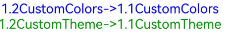
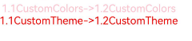

# @ohos.arkui.theme(主题换肤)

支持自定义主题风格，实现App组件风格跟随Theme切换。

> **说明：**
>
> 本模块首批接口从API version 12开始支持。后续版本的新增接口，采用上角标单独标记接口的起始版本。

## 导入模块

```ts
import { Theme, ThemeControl, CustomColors, Colors, CustomTheme } from '@kit.ArkUI';
```

## Theme

当前生效的主题风格对象，可从[onWillApplyTheme](arkui-ts/ts-custom-component-lifecycle.md#onwillapplytheme12)中获取。

**原子化服务API：** 从API version 12开始，该接口支持在原子化服务中使用。

**系统能力：** SystemCapability.ArkUI.ArkUI.Full

| 名称 | 类型                | 只读 | 可选 | 说明       |
| ------ |-------------------|-----|-----|----------|
| colors | [Colors](#colors) | 否   | 否   |  主题颜色资源。 |

## Colors

主题颜色资源。

**原子化服务API：** 从API version 12开始，该接口支持在原子化服务中使用。

**系统能力：** SystemCapability.ArkUI.ArkUI.Full

| 名称                           | 类型                                                 | 只读 | 可选 | 说明               |
|-------------------------------|-----------------------------------------------------|-----|-----|------------------|
| brand                         | [ResourceColor](arkui-ts/ts-types.md#resourcecolor) | 否   | 否   | 品牌色。             |
| warning                       | [ResourceColor](arkui-ts/ts-types.md#resourcecolor) | 否   | 否   | 一级警示色。           |
| alert                         | [ResourceColor](arkui-ts/ts-types.md#resourcecolor) | 否   | 否   | 二级提示色。           |
| confirm                       | [ResourceColor](arkui-ts/ts-types.md#resourcecolor) | 否   | 否   | 确认色。             |
| fontPrimary                   | [ResourceColor](arkui-ts/ts-types.md#resourcecolor) | 否   | 否   | 一级文本字体颜色。        |
| fontSecondary                 | [ResourceColor](arkui-ts/ts-types.md#resourcecolor) | 否   | 否   | 二级文本字体颜色。        |
| fontTertiary                  | [ResourceColor](arkui-ts/ts-types.md#resourcecolor) | 否   | 否   | 三级文本字体颜色。        |
| fontFourth                    | [ResourceColor](arkui-ts/ts-types.md#resourcecolor) | 否   | 否   | 四级文本字体颜色。        |
| fontEmphasize                 | [ResourceColor](arkui-ts/ts-types.md#resourcecolor) | 否   | 否   | 高亮字体颜色。          |
| fontOnPrimary                 | [ResourceColor](arkui-ts/ts-types.md#resourcecolor) | 否   | 否   | 一级文本反转颜色，用于彩色背景。 |
| fontOnSecondary               | [ResourceColor](arkui-ts/ts-types.md#resourcecolor) | 否   | 否   | 二级文本反转颜色，用于彩色背景。 |
| fontOnTertiary                | [ResourceColor](arkui-ts/ts-types.md#resourcecolor) | 否   | 否   | 三级文本反转颜色，用于彩色背景。 |
| fontOnFourth                  | [ResourceColor](arkui-ts/ts-types.md#resourcecolor) | 否   | 否   | 四级文本反转颜色，用于彩色背景。 |
| iconPrimary                   | [ResourceColor](arkui-ts/ts-types.md#resourcecolor) | 否   | 否   | 一级图标颜色。          |
| iconSecondary                 | [ResourceColor](arkui-ts/ts-types.md#resourcecolor) | 否   | 否   | 二级图标颜色。          |
| iconTertiary                  | [ResourceColor](arkui-ts/ts-types.md#resourcecolor) | 否   | 否   | 三级图标颜色。          |
| iconFourth                    | [ResourceColor](arkui-ts/ts-types.md#resourcecolor) | 否   | 否   | 四级图标颜色。          |
| iconEmphasize                 | [ResourceColor](arkui-ts/ts-types.md#resourcecolor) | 否   | 否   | 高亮图标颜色。          |
| iconSubEmphasize              | [ResourceColor](arkui-ts/ts-types.md#resourcecolor) | 否   | 否   | 高亮辅助图标颜色。        |
| iconOnPrimary                 | [ResourceColor](arkui-ts/ts-types.md#resourcecolor) | 否   | 否   | 一级图标反转颜色，用于彩色背景。 |
| iconOnSecondary               | [ResourceColor](arkui-ts/ts-types.md#resourcecolor) | 否   | 否   | 二级图标反转颜色，用于彩色背景。 |
| iconOnTertiary                | [ResourceColor](arkui-ts/ts-types.md#resourcecolor) | 否   | 否   | 三级图标反转颜色，用于彩色背景。 |
| iconOnFourth                  | [ResourceColor](arkui-ts/ts-types.md#resourcecolor) | 否   | 否   | 四级图标反转颜色，用于彩色背景。 |
| backgroundPrimary             | [ResourceColor](arkui-ts/ts-types.md#resourcecolor) | 否   | 否   | 一级背景颜色（实色，不透明）。  |
| backgroundSecondary           | [ResourceColor](arkui-ts/ts-types.md#resourcecolor) | 否   | 否   | 二级背景颜色（实色，不透明）。  |
| backgroundTertiary            | [ResourceColor](arkui-ts/ts-types.md#resourcecolor) | 否   | 否   | 三级背景颜色（实色，不透明）。  |
| backgroundFourth              | [ResourceColor](arkui-ts/ts-types.md#resourcecolor) | 否   | 否   | 四级背景颜色（实色，不透明）。  |
| backgroundEmphasize           | [ResourceColor](arkui-ts/ts-types.md#resourcecolor) | 否   | 否   | 高亮背景颜色（实色，不透明）。  |
| compForegroundPrimary         | [ResourceColor](arkui-ts/ts-types.md#resourcecolor) | 否   | 否   | 前背景。             |
| compBackgroundPrimary         | [ResourceColor](arkui-ts/ts-types.md#resourcecolor) | 否   | 否   | 白色背景。            |
| compBackgroundPrimaryTran     | [ResourceColor](arkui-ts/ts-types.md#resourcecolor) | 否   | 否   | 白色透明背景。          |
| compBackgroundPrimaryContrary | [ResourceColor](arkui-ts/ts-types.md#resourcecolor) | 否   | 否   | 常亮背景。            |
| compBackgroundGray            | [ResourceColor](arkui-ts/ts-types.md#resourcecolor) | 否   | 否   | 灰色背景。            |
| compBackgroundSecondary       | [ResourceColor](arkui-ts/ts-types.md#resourcecolor) | 否   | 否   | 二级背景。            |
| compBackgroundTertiary        | [ResourceColor](arkui-ts/ts-types.md#resourcecolor) | 否   | 否   | 三级背景。            |
| compBackgroundEmphasize       | [ResourceColor](arkui-ts/ts-types.md#resourcecolor) | 否   | 否   | 高亮背景。            |
| compBackgroundNeutral         | [ResourceColor](arkui-ts/ts-types.md#resourcecolor) | 否   | 否   | 黑色中性高亮背景颜色。      |
| compEmphasizeSecondary        | [ResourceColor](arkui-ts/ts-types.md#resourcecolor) | 否   | 否   | 20%高亮背景颜色。       |
| compEmphasizeTertiary         | [ResourceColor](arkui-ts/ts-types.md#resourcecolor) | 否   | 否   | 10%高亮背景颜色。       |
| compDivider                   | [ResourceColor](arkui-ts/ts-types.md#resourcecolor) | 否   | 否   | 通用分割线颜色。         |
| compCommonContrary            | [ResourceColor](arkui-ts/ts-types.md#resourcecolor) | 否   | 否   | 通用反转颜色。          |
| compBackgroundFocus           | [ResourceColor](arkui-ts/ts-types.md#resourcecolor) | 否   | 否   | 获焦态背景颜色。         |
| compFocusedPrimary            | [ResourceColor](arkui-ts/ts-types.md#resourcecolor) | 否   | 否   | 获焦态一级反转颜色。       |
| compFocusedSecondary          | [ResourceColor](arkui-ts/ts-types.md#resourcecolor) | 否   | 否   | 获焦态二级反转颜色。       |
| compFocusedTertiary           | [ResourceColor](arkui-ts/ts-types.md#resourcecolor) | 否   | 否   | 获焦态三级反转颜色。       |
| interactiveHover              | [ResourceColor](arkui-ts/ts-types.md#resourcecolor) | 否   | 否   | 通用悬停交互式颜色。       |
| interactivePressed            | [ResourceColor](arkui-ts/ts-types.md#resourcecolor) | 否   | 否   | 通用按压交互式颜色。       |
| interactiveFocus              | [ResourceColor](arkui-ts/ts-types.md#resourcecolor) | 否   | 否   | 通用获焦交互式颜色。       |
| interactiveActive             | [ResourceColor](arkui-ts/ts-types.md#resourcecolor) | 否   | 否   | 通用激活交互式颜色。       |
| interactiveSelect             | [ResourceColor](arkui-ts/ts-types.md#resourcecolor) | 否   | 否   | 通用选择交互式颜色。       |
| interactiveClick              | [ResourceColor](arkui-ts/ts-types.md#resourcecolor) | 否   | 否   | 通用点击交互式颜色。       |

## CustomTheme

自定义主题风格对象。

**原子化服务API：** 从API version 12开始，该接口支持在原子化服务中使用。

**系统能力：** SystemCapability.ArkUI.ArkUI.Full

| 名称                           | 类型                                                 | 只读  | 可选  | 说明         |
|-------------------------------|-----------------------------------------------------|-----|-----|------------|
| colors | [CustomColors](#customcolors) | 否   | 是   | 自定义主题颜色资源。 |

## CustomColors

type CustomColors = Partial\<Colors>

自定义主题颜色资源类型。

**原子化服务API：** 从API version 12开始，该接口支持在原子化服务中使用。

**系统能力：** SystemCapability.ArkUI.ArkUI.Full

| 类型  | 说明           |
|-----|--------------|
| Partial<[Colors](#colors)>   | 自定义主题颜色资源类型。 |

## ThemeControl

ThemeControl将自定义Theme应用于App组件内，实现App组件风格跟随Theme切换。

**原子化服务API：** 从API version 12开始，该接口支持在原子化服务中使用。

**系统能力：** SystemCapability.ArkUI.ArkUI.Full

### setDefaultTheme

setDefaultTheme(theme: [CustomTheme](#customtheme)): void

将用户自定义Theme设置应用级默认主题，实现应用风格跟随Theme切换。

ArkTS-Dyn：需确保在页面build前执行。若在UIAbility中调用该接口设置应用级默认主题，建议在onWindowStageCreate阶段里windowStage.loadContent的完成时回调中使用，详细代码可参考[设置应用内组件自定义主题色](../../ui/theme_skinning.md#设置应用内组件自定义主题色)。

ArkTS-Sta：需确保在页面build前执行。因运行于静态类型上下文中的ArkTS不存在全局作用域，因此需要在入口组件的static闭包或aboutToAppear生命周期函数中调用该接口。

**原子化服务API：** 从API version 12开始，该接口支持在原子化服务中使用。

**系统能力：** SystemCapability.ArkUI.ArkUI.Full

| 参数名       | 类型                           | 必填 | 说明             |
|--------------|------------------------------|------|----------------|
| theme | [CustomTheme](#customtheme)  | 是    | 表示设置的自定义主题风格。 |

**示例**

ArkTS-Dyn示例：

```ts
import { CustomTheme, CustomColors, ThemeControl } from '@kit.ArkUI';
// 自定义主题颜色
class BlueColors implements CustomColors {
  fontPrimary = Color.White;
  backgroundPrimary = Color.Blue;
  brand = Color.Blue; //品牌色
}

class PageCustomTheme implements CustomTheme {
  colors?: CustomColors;

  constructor(colors: CustomColors) {
    this.colors = colors;
  }
}
// 创建实例
const BlueColorsTheme = new PageCustomTheme(new BlueColors());
// 在页面build之前执行ThemeControl.setDefaultTheme，设置App默认样式风格为BlueColorsTheme。
ThemeControl.setDefaultTheme(BlueColorsTheme);
```

ArkTS-Sta示例：
```ts
import { Text, Column, Component, $r, Entry, Color } from '@kit.ArkUI';
import { CustomColors, ThemeControl, CustomTheme } from '@ohos.arkui.theme';

class PageCustomTheme implements CustomTheme {
  colors?: CustomColors;
  constructor(colors: CustomColors) {
    this.colors = colors;
  }
}

const globalTheme = new PageCustomTheme({ fontPrimary: Color.Red } as CustomColors);

@Entry
@Component
struct MyStateSample {
  blueColorsTheme: PageCustomTheme = new PageCustomTheme({ fontPrimary: Color.Red } as CustomColors);
  static {
    // 在static闭包中调用setDefaultTheme
    ThemeControl.setDefaultTheme(globalTheme);
  }
  aboutToAppear() {
    // 在aboutToAppear中调用setDefaultTheme
    ThemeControl.setDefaultTheme(this.blueColorsTheme);
  }
  build() {
    Column() {
      Text("Hello World")
    }
  }
}
```

## 使用@ohos.transfer进行Colors、CustomColors、Theme、CustomTheme类型转换

ArkTS-Dyn中使用ArkTS-Sta的Colors、CustomColors、Theme、CustomTheme对象。

- 创建ArkTS-Sta子模块`library2`，在`library2/src/main/ets/components`目录提供创建ArkTS-Dyn中的Colors、CustomColors、Theme、CustomTheme方法。
  
  ArkTS-Sta示例：
  
  ```TypeScript
  // library2/src/main/ets/components/MainPage.ets
  'use static'
  
  import { $r, Color } from '@ohos.arkui.component';
  import { Colors, CustomColors, ThemeControl, CustomTheme, Theme } from '@ohos.arkui.theme';
  import transfer from '@ohos.transfer';
  
  export const Colors1_2: Colors = {
    brand: Color.Blue,
    warning: Color.Blue,
    alert: Color.Blue,
    confirm: Color.Blue,
    fontPrimary: 0xffffff,
    fontSecondary: Color.Blue,
    fontTertiary: Color.Blue,
    fontFourth: Color.Blue,
    fontEmphasize: $r('app.color.color1'),
    fontOnPrimary: '#ffffff',
    fontOnSecondary: Color.Blue,
    fontOnTertiary: Color.Blue,
    fontOnFourth: Color.Blue,
    iconPrimary: Color.Blue,
    iconSecondary: Color.Blue,
    iconTertiary: Color.Blue,
    iconFourth: Color.Blue,
    iconEmphasize: Color.Blue,
    iconSubEmphasize: Color.Blue,
    iconOnPrimary: Color.Blue,
    iconOnSecondary: Color.Blue,
    iconOnTertiary: Color.Blue,
    iconOnFourth: Color.Blue,
    backgroundPrimary: Color.Blue,
    backgroundSecondary: Color.Blue,
    backgroundTertiary: Color.Blue,
    backgroundFourth: Color.Blue,
    backgroundEmphasize: Color.Blue,
    compForegroundPrimary: Color.Blue,
    compBackgroundPrimary: Color.Blue,
    compBackgroundPrimaryTran: Color.Blue,
    compBackgroundPrimaryContrary: Color.Blue,
    compBackgroundGray: Color.Blue,
    compBackgroundSecondary: Color.Blue,
    compBackgroundTertiary: Color.Blue,
    compBackgroundEmphasize: Color.Blue,
    compBackgroundNeutral: Color.Blue,
    compEmphasizeSecondary: Color.Blue,
    compEmphasizeTertiary: Color.Blue,
    compDivider: Color.Blue,
    compCommonContrary: Color.Blue,
    compBackgroundFocus: Color.Blue,
    compFocusedPrimary: Color.Blue,
    compFocusedSecondary: Color.Blue,
    compFocusedTertiary: Color.Blue,
    interactiveHover: Color.Blue,
    interactivePressed: Color.Blue,
    interactiveFocus: Color.Blue,
    interactiveActive: Color.Blue,
    interactiveSelect: Color.Blue,
    interactiveClick: Color.Blue,
  }

  export const Theme1_2 = {
    colors: Colors1_2
  } as Theme

  export const CustomColors1_2: CustomColors = {
    fontPrimary: '#FF0000FF',
    fontEmphasize: $r('app.color.color1'),
    fontOnPrimary: Color.Pink,
    fontOnSecondary: 0xffffff,
  }

  export const CustomTheme1_2 = {
    colors:{
      fontPrimary: '#FF049404',
      fontEmphasize: $r('app.color.color1'),
      fontOnPrimary: Color.Pink,
      fontOnSecondary: 0xffff00,
    }
  } as CustomTheme

  export const transferCustomColors1_2 = transfer.transferDynamic(CustomColors1_2, 'ArkUI.CustomColors');
  export const transferCustomTheme1_2 = transfer.transferDynamic(CustomTheme1_2, 'ArkUI.CustomTheme');
  export const transferColors1_2 = transfer.transferDynamic(Colors1_2, 'ArkUI.Colors');
  export const transferTheme1_2 = transfer.transferDynamic(Theme1_2, 'ArkUI.Theme');
  ```

- 在ArkTS-Sta主模块中引入ArkTS-Dyn的方法创建对象。
  
  ArkTS-Dyn示例：

  ```TypeScript
   // entry/src/main/ets/pages/Index.ets

  import { CustomColors } from '@kit.ArkUI';
  import { transferCustomColors1_2, transferCustomTheme1_2, transferColors1_2, transferTheme1_2, 
    Colors1_2, Theme1_2, CustomColors1_2, CustomTheme1_2 } from 'library2';

  export class PageCustomTheme implements CustomTheme {
    colors?: CustomColors;
    constructor(colors:CustomColors) {
      this.colors = colors;
    }
  }
  @Entry
  @Component
  struct MyStateSample {
    theme: PageCustomTheme = new PageCustomTheme(transferCustomColors1_2 as CustomColors);
    @State localColorMode: ThemeColorMode = ThemeColorMode.LIGHT;

    aboutToAppear(): void {
      console.info('转化前Colors1_2', Colors1_2);
      console.info('转化后Colors1_2', transferColors1_2);
      console.info('转化前CustomColors1_2', CustomColors1_2);
      console.info('转化后CustomColors1_2', transferCustomColors1_2);
      console.info('转化前Theme1_2', Theme1_2);
      console.info('转化后Theme1_2', transferTheme1_2);
      console.info('转化前CustomTheme1_2', CustomTheme1_2);
      console.info('转化后CustomTheme1_2', transferCustomTheme1_2);
    }

    build() {
      Column() {
        WithTheme({ theme: this.theme, colorMode: this.localColorMode }) {
          Text("1.2CustomColors->1.1CustomColors")
        }
        WithTheme({ theme: transferCustomTheme1_2, colorMode: this.localColorMode }) {
          Text("1.2CustomTheme->1.1CustomTheme")
        }
      }
    }
  }
  ```
  

ArkTS-Sta中使用ArkTS-Dyn的Colors、CustomColors、Theme、CustomTheme对象。

- 创建ArkTS-Dyn子模块`library`，在`library/src/main/ets/components`目录提供创建ArkTS-Dyn中的Colors、CustomColors、Theme、CustomTheme方法。
  
  ArkTS-Dyn示例：

  ```TypeScript
  // library/src/main/ets/components/MainPage.ets
  import { CustomTheme, CustomColors } from '@ohos.arkui.theme';

  class AppColors implements CustomColors {
    brand?:ResourceColor = Color.Blue;
    warning?:ResourceColor = Color.Blue;
    alert?:ResourceColor = Color.Blue;
    confirm?:ResourceColor = Color.Blue;
    fontPrimary?:ResourceColor = 0xffffff;
    fontSecondary?:ResourceColor = Color.Blue;
    fontTertiary?:ResourceColor = Color.Blue;
    fontFourth?:ResourceColor = Color.Blue;
    fontEmphasize?:ResourceColor = $r('app.color.color1');
    fontOnPrimary?:ResourceColor = '#ffffff';
    fontOnSecondary?:ResourceColor = Color.Blue;
    fontOnTertiary?:ResourceColor = Color.Blue;
    fontOnFourth?:ResourceColor = Color.Blue;
    iconPrimary?:ResourceColor = Color.Blue;
    iconSecondary?:ResourceColor = Color.Blue;
    iconTertiary?:ResourceColor = Color.Blue;
    iconFourth?:ResourceColor = Color.Blue;
    iconEmphasize?:ResourceColor = Color.Blue;
    iconSubEmphasize?:ResourceColor = Color.Blue;
    iconOnPrimary?:ResourceColor = Color.Blue;
    iconOnSecondary?:ResourceColor = Color.Blue;
    iconOnTertiary?:ResourceColor = Color.Blue;
    iconOnFourth?:ResourceColor = Color.Blue;
    backgroundPrimary?:ResourceColor = Color.Blue;
    backgroundSecondary?:ResourceColor = Color.Blue;
    backgroundTertiary?:ResourceColor = Color.Blue;
    backgroundFourth?:ResourceColor = Color.Blue;
    backgroundEmphasize?:ResourceColor = Color.Blue;
    compForegroundPrimary?:ResourceColor = Color.Blue;
    compBackgroundPrimary?:ResourceColor = Color.Blue;
    compBackgroundPrimaryTran?:ResourceColor = Color.Blue;
    compBackgroundPrimaryContrary?:ResourceColor = Color.Blue;
    compBackgroundGray?:ResourceColor = Color.Blue;
    compBackgroundSecondary?:ResourceColor = Color.Blue;
    compBackgroundTertiary?:ResourceColor = Color.Blue;
    compBackgroundEmphasize?:ResourceColor = Color.Blue;
    compBackgroundNeutral?:ResourceColor = Color.Blue;
    compEmphasizeSecondary?:ResourceColor = Color.Blue;
    compEmphasizeTertiary?:ResourceColor = Color.Blue;
    compDivider?:ResourceColor = Color.Blue;
    compCommonContrary?:ResourceColor = Color.Blue;
    compBackgroundFocus?:ResourceColor = Color.Blue;
    compFocusedPrimary?:ResourceColor = Color.Blue;
    compFocusedSecondary?:ResourceColor = Color.Blue;
    compFocusedTertiary?:ResourceColor = Color.Blue;
    interactiveHover?:ResourceColor = Color.Blue;
    interactivePressed?:ResourceColor = Color.Blue;
    interactiveFocus?:ResourceColor = Color.Blue;
    interactiveActive?:ResourceColor = Color.Blue;
    interactiveSelect?:ResourceColor = Color.Blue;
    interactiveClick?:ResourceColor = Color.Blue;
  }

  export const Colors1_1 = new AppColors()

  export const Theme1_1 = {
    colors: Colors1_1
  }

  export const CustomColors1_1 = {
    fontPrimary: Color.Pink,
    fontEmphasize: $r('app.color.color1'),
    fontOnPrimary: '#FF00541F',
    fontOnSecondary: 0xffffff,
  }

  export const CustomTheme1_1 = {
    colors:{
      fontPrimary: '#f00',
      fontEmphasize: $r('app.color.color1'),
      fontOnPrimary: Color.Pink,
      fontOnSecondary: 0xffff00,
    }
  }
  ```

- 在ArkTS-Sta主模块中引入ArkTS1.1导出的方法创建对象并转换为ArkTS-Sta对象。
  
  ArkTS-Sta示例：

  ```TypeScript
  'use static'

  // entry/src/main/ets/pages/Index.ets

  import { Text, Column, Component, Button, Search, ClickEvent, $r, Entry, ResourceColor, Color, WithTheme, ThemeColorMode } from '@ohos.arkui.component'
  import { State } from '@ohos.arkui.StateManagement'
  import { CustomColors, ThemeControl, CustomTheme, Theme } from '@ohos.arkui.theme';
  import { Colors1_1, Theme1_1, CustomColors1_1, CustomTheme1_1 } from 'library';
  import transfer from '@ohos.transfer';

  export class PageCustomTheme implements CustomTheme {
    colors?: CustomColors;
    constructor(colors: CustomColors) {
      this.colors = colors;
    }
  }

  const transferCustomColors1_1 = transfer.transferStatic(CustomColors1_1, 'ArkUI.CustomColors');
  const transferCustomTheme1_1 = transfer.transferStatic(CustomTheme1_1, 'ArkUI.CustomTheme');
  const transferColors1_1 = transfer.transferStatic(Colors1_1, 'ArkUI.Colors');
  const transferTheme1_1 = transfer.transferStatic(Theme1_1, 'ArkUI.Theme');

  @Entry
  @Component
  struct MyStateSample {
    theme: PageCustomTheme = new PageCustomTheme(transferCustomColors1_1 as CustomColors);
    @State localColorMode: ThemeColorMode = ThemeColorMode.LIGHT;

    aboutToAppear(): void {
      console.info('转化前Colors1_1', Colors1_1);
      console.info('转化后Colors1_1', transferColors1_1);
      console.info('转化前CustomColors1_1', CustomColors1_1);
      console.info('转化后CustomColors1_1', transferCustomColors1_1);
      console.info('转化前Theme1_1', Theme1_1);
      console.info('转化后Theme1_1', transferTheme1_1);
      console.info('转化前CustomTheme1_1', CustomTheme1_1);
      console.info('转化后CustomTheme1_1', transferCustomTheme1_1);
    }

    build() {
      Column() {
        WithTheme({ theme: this.theme, colorMode: this.localColorMode }) {
          Text("1.1CustomColors->1.2CustomColors")
        }
        WithTheme({ theme: transferCustomTheme1_1 as CustomTheme, colorMode: this.localColorMode }) {
          Text("1.1CustomTheme->1.2CustomTheme")
        }
      }
    }
  }
  ```
  
