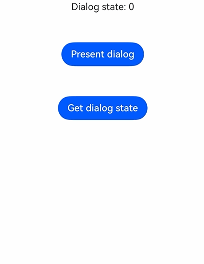

# @ohos.arkui.dialog (弹出框)
<!--Kit: ArkUI-->
<!--Subsystem: ArkUI-->
<!--Owner: @houguobiao-->
<!--Designer: @houguobiao-->
<!--Tester: @lxl007-->
<!--Adviser: @Brilliantry_Rui-->

为满足应用中灵活配置与管理弹出框的需求，本模块提供统一的Dialog类型声明能力，包括弹出框选项、按钮配置、工作表项以及弹出框控制器、对齐方式、状态等枚举。具体接口调用请使用UIContext中的[DialogPresenter](arkts-apis-uicontext-dialogpresenter.md)对象。

> **说明：**
>
> 弹出框的弹出、更新与关闭请通过UIContext中的[getDialogPresenter()](arkts-apis-uicontext-uicontext.md#getdialogpresenter)方法获取到[DialogPresenter](arkts-apis-uicontext-dialogpresenter.md)对象后调用。

**起始版本：** 26.1.0

## 导入模块

```ts
import { dialog } from '@kit.ArkUI';
```

## DialogTextStyleOptions

在Dialog中定义文本样式属性，可作为消息内容的文字样式。

**原子化服务API：** 从API版本26.1.0开始，该接口支持在原子化服务中使用。

**模型约束：** 此接口仅可在Stage模型下使用。

**系统能力：** SystemCapability.ArkUI.ArkUI.Full

| 名称      | 类型                                                         | 只读 | 可选 | 说明           |
| --------- | ------------------------------------------------------------ | ---- | ---- | -------------- |
| wordBreak | [WordBreak](arkui-ts/ts-appendix-enums.md#wordbreak11)       | 否   | 是   | 设置分词类型。<br/>默认值：WordBreak.BREAK_ALL |

## DialogButton

固定样式弹出框的按钮配置。

**原子化服务API：** 从API版本26.1.0开始，该接口支持在原子化服务中使用。

**模型约束：** 此接口仅可在Stage模型下使用。

**系统能力：** SystemCapability.ArkUI.ArkUI.Full

| 名称          | 类型                                                         | 只读 | 可选 | 说明                                                         |
| ------------- | ------------------------------------------------------------ | ---- | ---- | ------------------------------------------------------------ |
| value         | [ResourceStr](arkui-ts/ts-types.md#resourcestr)              | 否   | 否   | 按钮的文本内容。                                             |
| fontColor     | [ResourceColor](arkui-ts/ts-types.md#resourcecolor)          | 否   | 是   | 按钮文字颜色。<br/>默认值：跟随系统主题。                                               |
| backgroundColor | [ResourceColor](arkui-ts/ts-types.md#resourcecolor)        | 否   | 是   | 按钮背景色。<br/>默认值：跟随系统主题。                                                 |
| enabled       | boolean                                                      | 否   | 是   | 点击按钮时是否响应。值为true表示响应，值为false表示不响应。<br/>默认值：true |
| defaultFocus  | boolean                                                      | 否   | 是   | 按钮是否为默认焦点。值为true表示为默认焦点，值为false表示不为默认焦点。<br/>默认值：false |
| primary       | boolean                                                      | 否   | 是   | 定义按钮是否默认响应回车/空格键。值为true表示默认响应，值为false表示不默认响应。<br/>默认值：false |
| style         | [DialogButtonStyle](arkui-ts/ts-appendix-enums.md#dialogbuttonstyle10) | 否   | 是   | 按钮的样式。<br/>默认值：DialogButtonStyle.DEFAULT           |
| action        | [VoidCallback](arkui-ts/ts-types.md#voidcallback12)          | 否   | 否   | 点击按钮时执行的回调。                                       |

## DialogSheet

弹出框列表配置项，用于ActionSheet样式的弹出框。

**原子化服务API：** 从API版本26.1.0开始，该接口支持在原子化服务中使用。

**模型约束：** 此接口仅可在Stage模型下使用。

**系统能力：** SystemCapability.ArkUI.ArkUI.Full

| 名称   | 类型                                                | 只读 | 可选 | 说明                       |
| ------ | --------------------------------------------------- | ---- | ---- | -------------------------- |
| title  | [ResourceStr](arkui-ts/ts-types.md#resourcestr)     | 否   | 否   | 标题内容。                 |
| icon   | [ResourceStr](arkui-ts/ts-types.md#resourcestr)     | 否   | 是   | 图标内容。 <br/>默认值：空     |
| action | [VoidCallback](arkui-ts/ts-types.md#voidcallback12) | 否   | 否   | 单击选项时执行的回调。     |

## DialogBaseOptions

所有弹出框共享的基本选项，定义弹出框的背景、边框、对齐、蒙层、避让等通用属性。[DialogStyleOptions](#dialogstyleoptions)与[DialogCustomOptions](#dialogcustomoptions)均继承自本接口。

**原子化服务API：** 从API版本26.1.0开始，该接口支持在原子化服务中使用。

**模型约束：** 此接口仅可在Stage模型下使用。

**系统能力：** SystemCapability.ArkUI.ArkUI.Full

| 名称                    | 类型                                                         | 只读 | 可选 | 说明                                                         |
| ----------------------- | ------------------------------------------------------------ | ---- | ---- | ------------------------------------------------------------ |
| controller              | [DialogBaseController](#dialogbasecontroller)                | 否   | 是   | Dialog控制器。                                               |
| width                   | [Dimension](arkui-ts/ts-types.md#dimension10)                | 否   | 是   | 弹出框的宽度。<br/>默认值：根据内容自适应。                                               |
| height                  | [Dimension](arkui-ts/ts-types.md#dimension10)                | 否   | 是   | 弹出框的高度。<br/>默认值：根据内容自适应。                                               |
| backgroundColor         | [ResourceColor](arkui-ts/ts-types.md#resourcecolor)          | 否   | 是   | 弹出框的背景颜色。<br/>默认值：Color.Transparent<br/>**说明：** 当backgroundColor设置为非透明色时，backgroundBlurStyle必须设置为BlurStyle.NONE。 |
| backgroundBlurStyle     | [BlurStyle](arkui-ts/ts-universal-attributes-background.md#blurstyle9) | 否   | 是   | 弹出框的背景模糊样式。<br/>默认值：BlurStyle.COMPONENT_ULTRA_THICK<br/>**说明：** 设置为BlurStyle.NONE将禁用背景模糊。 |
| backgroundBlurStyleOptions | [BackgroundBlurStyleOptions](arkui-ts/ts-universal-attributes-background.md#backgroundblurstyleoptions10对象说明) | 否   | 是   | 带选项的背景模糊样式。                                       |
| backgroundEffect        | [BackgroundEffectOptions](arkui-ts/ts-universal-attributes-background.md#backgroundeffectoptions11) | 否   | 是   | 带选项的背景效果。                                           |
| borderRadius            | [Dimension](arkui-ts/ts-types.md#dimension10)&nbsp;\|&nbsp;[BorderRadiuses](arkui-ts/ts-types.md#borderradiuses9)&nbsp;\|&nbsp;[LocalizedBorderRadiuses](arkui-ts/ts-types.md#localizedborderradiuses12) | 否   | 是   | 背景的边框圆角半径。<br>默认值：{ topLeft: '32vp', topRight: '32vp', bottomLeft: '32vp', bottomRight: '32vp' } |
| borderWidth             | [Dimension](arkui-ts/ts-types.md#dimension10)&nbsp;\|&nbsp;[EdgeWidths](arkui-ts/ts-types.md#edgewidths9)&nbsp;\|&nbsp;[LocalizedEdgeWidths](arkui-ts/ts-types.md#localizededgewidths12) | 否   | 是   | 弹出框边框宽度。<br>默认值：0                               |
| borderColor             | [ResourceColor](arkui-ts/ts-types.md#resourcecolor)&nbsp;\|&nbsp;[EdgeColors](arkui-ts/ts-types.md#edgecolors9)&nbsp;\|&nbsp;[LocalizedEdgeColors](arkui-ts/ts-types.md#localizededgecolors12) | 否   | 是   | 弹出框的边框颜色。<br/>默认值：Color.Black                   |
| borderStyle             | [BorderStyle](arkui-ts/ts-appendix-enums.md#borderstyle)&nbsp;\|&nbsp;[EdgeStyles](arkui-ts/ts-types.md#edgestyles9) | 否   | 是   | 弹出框边框样式。<br/>默认值：BorderStyle.Solid               |
| shadow                  | [ShadowOptions](arkui-ts/ts-universal-attributes-image-effect.md#shadowoptions对象说明)&nbsp;\|&nbsp;[ShadowStyle](arkui-ts/ts-universal-attributes-image-effect.md#shadowstyle10枚举说明) | 否   | 是   | 弹出框的阴影。<br/>默认值：系统默认阴影样式。                                               |
| alignment               | [DialogBaseAlignment](#dialogbasealignment)                  | 否   | 是   | 弹出框的对齐模式。<br/>默认值：DialogBaseAlignment.DEFAULT                                           |
| offset                  | [Offset](arkui-ts/ts-types.md#offset)                        | 否   | 是   | 弹出框相对于对齐位置的偏移。 <br>默认值：无偏移         |
| maskRect                | [Rectangle](arkui-ts/ts-methods-alert-dialog-box.md#rectangle8类型说明) | 否   | 是   | 弹出框的蒙层区域。<br>默认值：{ x: 0, y: 0, width: '100%', height: '100%' } |
| maskColor               | [ResourceColor](arkui-ts/ts-types.md#resourcecolor)          | 否   | 是   | 弹出框的蒙层颜色。<br/>默认值：跟随系统主题的默认蒙层颜色。                                           |
| isModal                 | boolean                                                      | 否   | 是   | 弹出框是否为模态。值为true表示为模态且有蒙层，值为false表示为非模态且无蒙层。<br/>默认值：true |
| showInSubWindow         | boolean                                                      | 否   | 是   | 是否在子窗口中显示。值为true表示在子窗口中显示，值为false表示在应用内显示。<br/>默认值：false<br/>**说明：** isModal为true和showInSubWindow为true不能同时使用。 |
| displayModeInSubWindow  | [DialogDisplayMode](arkui-ts/ts-appendix-enums.md#dialogdisplaymode) | 否   | 是   | 定义在子窗口中显示时的弹出框显示模式。<br/>默认值：DialogDisplayMode.SCREEN_BASED |
| autoCancel              | boolean                                                      | 否   | 是   | 是否允许通过触摸蒙层或按返回键退出。值为true表示允许退出，值为false表示不允许退出。<br/>默认值：true |
| focusable               | boolean                                                      | 否   | 是   | 弹出框是否可以获得焦点。值为true表示可以获得焦点，值为false表示不可以获得焦点。<br/>默认值：true |
| dialogTransition        | [TransitionEffect](arkui-ts/ts-transition-animation-component.md#transitioneffect10对象说明) | 否   | 是   | 用于打开/关闭弹出框内容区域的弹出框过渡动效参数。<br/>默认值：系统默认过渡动效。            |
| maskTransition          | [TransitionEffect](arkui-ts/ts-transition-animation-component.md#transitioneffect10对象说明) | 否   | 是   | 用于打开/关闭遮罩的蒙层过渡动效参数。<br/>默认值：系统默认蒙层过渡动效。                       |
| keyboardAvoidMode       | [KeyboardAvoidMode](arkui-ts/ts-universal-attributes-popup.md#keyboardavoidmode12枚举说明) | 否   | 是   | 键盘避让模式。<br/>默认值：KeyboardAvoidMode.DEFAULT         |
| keyboardAvoidDistance   | [LengthMetrics](js-apis-arkui-graphics.md#lengthmetrics12)   | 否   | 是   | 弹出框与系统键盘之间的距离。<br/>默认值：系统默认避让距离。                                 |
| onWillAppear            | [VoidCallback](arkui-ts/ts-types.md#voidcallback12)          | 否   | 是   | 弹出框打开动画开始前的回调函数。                             |
| onDidAppear             | [VoidCallback](arkui-ts/ts-types.md#voidcallback12)          | 否   | 是   | 弹出框出现时的回调函数。                                     |
| onWillDisappear         | [VoidCallback](arkui-ts/ts-types.md#voidcallback12)          | 否   | 是   | 弹出框关闭动画开始前的回调函数。                             |
| onDidDisappear          | [VoidCallback](arkui-ts/ts-types.md#voidcallback12)          | 否   | 是   | 弹出框消失时的回调函数。                                     |
| onWillDismiss           | Callback&lt;[DialogDismissal](#dialogdismissal)&gt;          | 否   | 是   | 弹出框交互关闭的回调。<br/>**说明：** 如果注册了此回调，则用户点击蒙层或返回按钮后弹出框不会立即关闭，回调中的reason参数用于判断是否可以关闭弹出框。 |
| enableHoverMode         | boolean                                                      | 否   | 是   | 是否启用悬停模式。值为true表示启用，值为false表示不启用。<br/>默认值：false |
| hoverModeArea           | [HoverModeAreaType](arkui-ts/ts-universal-attributes-sheet-transition.md#hovermodeareatype14) | 否   | 是   | 悬停模式下弹出框的显示区域。<br/>默认值：HoverModeAreaType.BOTTOM_SCREEN |
| levelMode               | [LevelMode](js-apis-promptAction.md#levelmode15枚举说明)     | 否   | 是   | 弹出框的显示级别。<br/>默认值：LevelMode.OVERLAY             |
| levelUniqueId           | number                                                       | 否   | 是   | 页面级弹出框显示层下节点的唯一标识。<br/>取值范围：大于等于0的整数。<br/>**说明：** 该参数仅在levelMode为LevelMode.EMBEDDED时生效。 |
| immersiveMode           | [ImmersiveMode](js-apis-promptAction.md#immersivemode15枚举说明) | 否   | 是   | 页面级弹出框蒙层效果。<br/>默认值：ImmersiveMode.DEFAULT<br/>**说明：** 该参数仅在levelMode为LevelMode.EMBEDDED时生效。     |
| levelOrder              | [LevelOrder](js-apis-promptAction.md#levelorder18)           | 否   | 是   | 弹出框的显示顺序。<br/>默认值：`LevelOrder.clamp(0)`返回的值。 |
| systemMaterial          | [SystemUiMaterial](arkui-ts/ts-universal-attributes-image-effect.md#systemuimaterial) | 否   | 是   | 为弹出框设置系统样式材质，不同的材质有不同的效果，会影响背景色、边框、阴影和弹出框的其他视觉属性。 |

## DialogMessage

弹出框的消息内容与文字样式，继承自[DialogTextStyleOptions](#dialogtextstyleoptions)。

**原子化服务API：** 从API版本26.1.0开始，该接口支持在原子化服务中使用。

**模型约束：** 此接口仅可在Stage模型下使用。

**系统能力：** SystemCapability.ArkUI.ArkUI.Full

| 名称    | 类型                                            | 只读 | 可选 | 说明             |
| ------- | ----------------------------------------------- | ---- | ---- | ---------------- |
| content | [ResourceStr](arkui-ts/ts-types.md#resourcestr) | 否   | 否   | 弹出框消息内容。 |

## DialogStyleOptions

固定样式弹出框的选项，继承自[DialogBaseOptions](#dialogbaseoptions)。具体用法可参考DialogPresenter的[present](arkts-apis-uicontext-dialogpresenter.md#present)接口示例。

**原子化服务API：** 从API版本26.1.0开始，该接口支持在原子化服务中使用。

**模型约束：** 此接口仅可在Stage模型下使用。

**系统能力：** SystemCapability.ArkUI.ArkUI.Full

| 名称           | 类型                                                         | 只读 | 可选 | 说明                                                         |
| -------------- | ------------------------------------------------------------ | ---- | ---- | ------------------------------------------------------------ |
| title          | [ResourceStr](arkui-ts/ts-types.md#resourcestr)              | 否   | 是   | 弹出框标题。                                                 |
| subtitle       | [ResourceStr](arkui-ts/ts-types.md#resourcestr)              | 否   | 是   | 弹出框的副标题。                                             |
| message        | [DialogMessage](#dialogmessage)                              | 否   | 是   | 弹出框的消息内容和文字样式。                                 |
| buttons        | Array&lt;[DialogButton](#dialogbutton)&gt;                   | 否   | 是   | 弹出框中的按钮数组。提供时，弹出框显示为带有按钮的警报样式弹出框；与sheets一起使用时，按钮显示在工作表项列表下方。 |
| buttonDirection | [DialogButtonOrientation](#dialogbuttonorientation)         | 否   | 是   | 按钮的排列方式。<br/>默认值：DialogButtonOrientation.AUTO     |
| sheets         | Array&lt;[DialogSheet](#dialogsheet)&gt;                     | 否   | 是   | action-sheet样式的工作表项数组。提供时，弹出框将显示供用户选择的工作表项。 |
| gridCount      | number                                                       | 否   | 是   | 弹出框中工作表项的网格列数，用于控制工作表项在网格中的分栏显示布局。取值范围：大于0的整数。               |

## DialogCustomOptions

自定义样式弹出框的选项，继承自[DialogBaseOptions](#dialogbaseoptions)。

弹出框的内容由[DialogPresenter.present](arkts-apis-uicontext-dialogpresenter.md#present)方法的第一个参数提供，不在此选项对象中。具体用法可参考DialogPresenter的[present](arkts-apis-uicontext-dialogpresenter.md#present)接口示例。

**原子化服务API：** 从API版本26.1.0开始，该接口支持在原子化服务中使用。

**模型约束：** 此接口仅可在Stage模型下使用。

**系统能力：** SystemCapability.ArkUI.ArkUI.Full

| 名称        | 类型    | 只读 | 可选 | 说明                                                         |
| ----------- | ------- | ---- | ---- | ------------------------------------------------------------ |
| customStyle | boolean | 否   | 是   | 是否开启自定义样式。值为true表示开启自定义样式，值为false表示不开启。<br/>默认值：false |

## DialogBaseController

用于控制弹出框的类，可通过[DialogBaseOptions](#dialogbaseoptions)中的controller属性与弹出框绑定。具体用法可参考DialogPresenter的[present](arkts-apis-uicontext-dialogpresenter.md#present)接口示例。

### constructor

constructor()

控制器的构造函数。

**原子化服务API：** 从API版本26.1.0开始，该接口支持在原子化服务中使用。

**模型约束：** 此接口仅可在Stage模型下使用。

**系统能力：** SystemCapability.ArkUI.ArkUI.Full

### close

close(): void

关闭相应的弹出框。

**原子化服务API：** 从API版本26.1.0开始，该接口支持在原子化服务中使用。

**模型约束：** 此接口仅可在Stage模型下使用。

**系统能力：** SystemCapability.ArkUI.ArkUI.Full

### getState

getState(): DialogState

获取弹出框的状态。

**原子化服务API：** 从API版本26.1.0开始，该接口支持在原子化服务中使用。

**模型约束：** 此接口仅可在Stage模型下使用。

**系统能力：** SystemCapability.ArkUI.ArkUI.Full

**返回值：**

| 类型                             | 说明           |
| -------------------------------- | -------------- |
| [DialogState](#dialogstate) | 返回弹出框状态。 |

**示例：**

该示例通过DialogBaseController与弹出框绑定，展示了弹出弹出框，并通过控制器关闭以及获取弹出框状态的功能。

```ts
import { DialogBaseController, DialogPresenter, DialogState } from '@kit.ArkUI';
import { BusinessError } from '@kit.BasicServicesKit';

@Entry
@Component
struct Index {
  private ctx: UIContext = this.getUIContext();
  private dialogPresenter: DialogPresenter = this.ctx.getDialogPresenter();
  private controller: DialogBaseController = new DialogBaseController();
  @State dialogState: DialogState = DialogState.UNINITIALIZED;

  @Builder
  customDialogComponent() {
    Column() {
      Text('Dialog').fontSize(20)
      Column({ space: 10 }) {
        Button('Close dialog via controller').onClick(() => {
          try {
            this.controller.close();
          } catch (error) {
            let message = (error as BusinessError).message;
            let code = (error as BusinessError).code;
            console.error(`Failed to close dialog. Code: ${code}, message: ${message}`);
          }
        })
        Button('Get dialog state')
          .onClick(() => {
            this.dialogState = this.controller.getState();
            console.info('dialog state: ' + this.dialogState);
          })
      }
    }.height(150).padding(20).justifyContent(FlexAlign.SpaceBetween)
  }

  build() {
    Column({ space: 50 }) {
      Text(`Dialog state: ${this.dialogState}`)
      Button('Present dialog')
        .onClick(() => {
          this.dialogPresenter.present(() => { this.customDialogComponent() },
          {
            controller: this.controller,
          })
            .catch((error: BusinessError) => {
              console.error(`Failed to present dialog. Code: ${error.code}, message: ${error.message}`);
            })
        })
      Button('Get dialog state')
        .onClick(() => {
          this.dialogState = this.controller.getState();
          console.info('dialog state: ' + this.dialogState);
        })
    }.width('100%').height('100%').justifyContent(FlexAlign.Start)
  }
}
```



## DialogResult

对话的响应结果。

**原子化服务API：** 从API版本26.1.0开始，该接口支持在原子化服务中使用。

**模型约束：** 此接口仅可在Stage模型下使用。

**系统能力：** SystemCapability.ArkUI.ArkUI.Full

| 名称    | 类型   | 只读 | 可选 | 说明                                 |
| ------- | ------ | ---- | ---- | ------------------------------------ |
| dialogId | number | 否   | 否   | 弹出框的ID。<br>取值范围：大于等于0的整数。 |

## DialogDismissal

提供关闭弹出框操作的信息与关闭接口。

**原子化服务API：** 从API版本26.1.0开始，该接口支持在原子化服务中使用。

**模型约束：** 此接口仅可在Stage模型下使用。

**系统能力：** SystemCapability.ArkUI.ArkUI.Full

| 名称    | 类型                                                         | 只读 | 可选 | 说明                                                         |
| ------- | ------------------------------------------------------------ | ---- | ---- | ------------------------------------------------------------ |
| dismiss | [VoidCallback](arkui-ts/ts-types.md#voidcallback12)          | 否   | 否   | 关闭弹出框的回调。只有当需要退出弹出框时，才会调用此接口。   |
| reason  | [DismissReason](arkui-ts/ts-universal-attributes-popup.md#dismissreason12枚举说明) | 否   | 否   | 触发弹出框关闭操作的原因类型。                                       |

## DialogBaseAlignment

弹出框的对齐方式。

**原子化服务API：** 从API版本26.1.0开始，该接口支持在原子化服务中使用。

**模型约束：** 此接口仅可在Stage模型下使用。

**系统能力：** SystemCapability.ArkUI.ArkUI.Full

| 名称        | 值   | 说明           |
| ----------- | ---- | -------------- |
| TOP         | 0    | 垂直顶部对齐。 |
| CENTER      | 1    | 垂直居中对齐。 |
| BOTTOM      | 2    | 垂直底部对齐。 |
| DEFAULT     | 3    | 默认对齐方式。 |
| TOP_START   | 4    | 左上角对齐。   |
| TOP_END     | 5    | 右上角对齐。   |
| CENTER_START | 6   | 左居中对齐。   |
| CENTER_END  | 7    | 右居中对齐。   |
| BOTTOM_START | 8   | 左下角对齐。   |
| BOTTOM_END  | 9    | 右下角对齐。   |

## DialogButtonOrientation

弹出框中按钮的排列方式。

**原子化服务API：** 从API版本26.1.0开始，该接口支持在原子化服务中使用。

**模型约束：** 此接口仅可在Stage模型下使用。

**系统能力：** SystemCapability.ArkUI.ArkUI.Full

| 名称       | 值   | 说明                                                         |
| ---------- | ---- | ------------------------------------------------------------ |
| AUTO       | 0    | 两个或两个以下的按钮水平排列，两个以上的按钮垂直排列。       |
| HORIZONTAL | 1    | 按钮水平排列。                                               |
| VERTICAL   | 2    | 按钮垂直排列。                                               |

## DialogState

Dialog状态的枚举。

**原子化服务API：** 从API版本26.1.0开始，该接口支持在原子化服务中使用。

**模型约束：** 此接口仅可在Stage模型下使用。

**系统能力：** SystemCapability.ArkUI.ArkUI.Full

| 名称          | 值   | 说明                   |
| ------------- | ---- | ---------------------- |
| UNINITIALIZED | 0    | 表示未初始化。         |
| INITIALIZED   | 1    | 表示已初始化。         |
| APPEARING     | 2    | 表示正在出现。         |
| APPEARED      | 3    | 表示已出现。           |
| DISAPPEARING  | 4    | 表示正在消失。         |
| DISAPPEARED   | 5    | 表示已消失。           |
