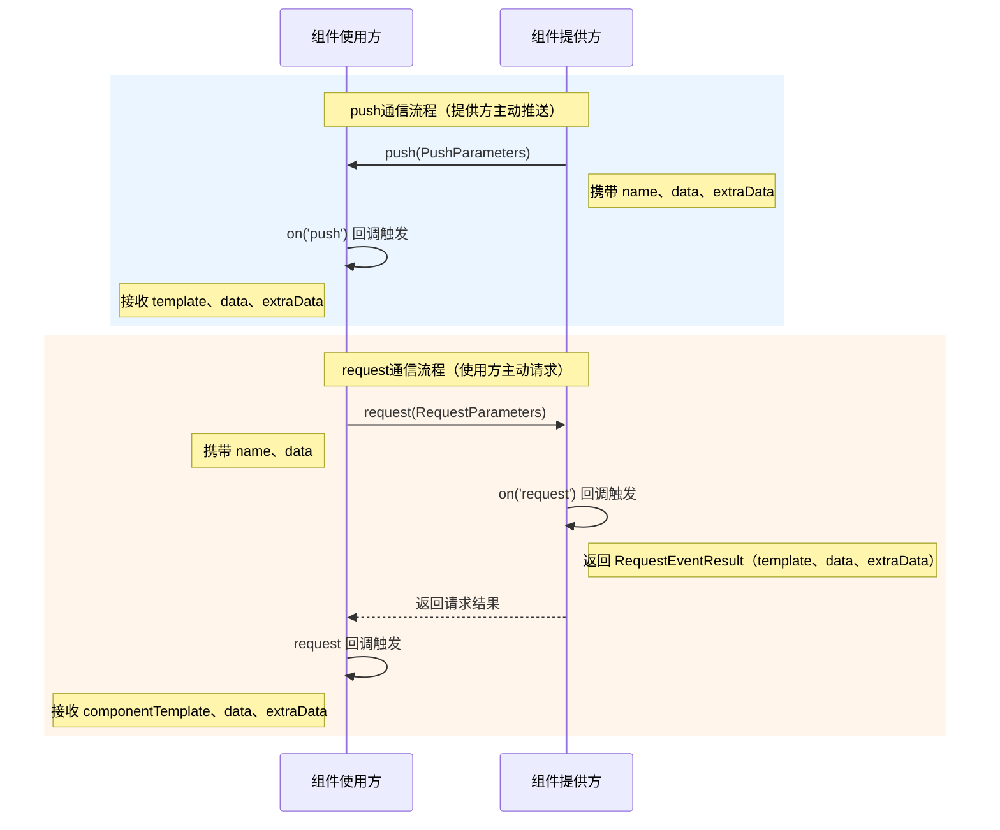

# @ohos.pluginComponent (PluginComponentManager)
<!--Kit: ArkUI-->
<!--Subsystem: ArkUI-->
<!--Owner: @dutie123-->
<!--Designer: @dutie123-->
<!--Tester: @fredyuan0912-->
<!--Adviser: @Brilliantry_Rui-->

本模块供插件组件的使用方请求组件与数据，供提供方发送组件模板和数据。

插件组件的通信流程如下图所示。



> **说明：**
>
> - 本模块同时支持ArkTS-Dyn、ArkTS-Sta。
>
> - 本模块首批接口从API version 8开始支持。后续版本的新增接口，采用上角标单独标记接口的起始版本。

## 导入模块

```ts
import { pluginComponentManager } from '@kit.ArkUI';
```

## PluginComponentTemplate

插件组件模板参数。

**原子化服务API（仅ArkTS-Dyn）：** 从API version 12开始，该接口支持在原子化服务中使用。

**系统能力：** SystemCapability.ArkUI.ArkUI.Full

**ArkTS-Dyn起始版本：** 8

**ArkTS-Sta起始版本：** 23

| 名称    | 类型   | 只读 | 可选 | 说明                        |
| ------- | ------ | ---- | ---- | --------------------------- |
| source  | string | 否 | 否 | 组件模板名。                |
| ability | string | 否 | 否 | 提供方Ability的bundleName。 |

## pluginComponentManager

插件组件管理器，提供插件组件的请求、推送和事件监听等管理能力。

### KVObject

ArkTS-Dyn: type KVObject = { [key: string]: number | string | boolean | [] | KVObject }

ArkTS-Sta: type KVObject = Record<string, int | long | double | string | boolean | Array\<KVObject\> | KVObject>;

以键值对形式存储信息，符合JSON格式。

**原子化服务API（仅ArkTS-Dyn）：** 从API version 12开始，该接口支持在原子化服务中使用。

**系统能力：** SystemCapability.ArkUI.ArkUI.Full

**ArkTS-Dyn起始版本：** 8

**ArkTS-Sta起始版本：** 23

| 名称    | 类型   | 必填 | 说明                        |
| ------- | ------ | ---- | --------------------------- |
|  [key: string]  | ArkTS-Dyn: number \| string \| boolean \| [] \| [KVObject](#kvobject)<br>ArkTS-Sta: string, int \| long \| double \| string \| boolean \| Array\<KVObject\> \| KVObject  | 否   | 键值对形式存储。<br>number：键值，表示值类型为数字。<br> string：键值，表示值类型为字符串，可取空字符串。<br> boolean：键值，表示值类型为布尔值。<br> []：键值，表示值类型为空数组。<br>[KVObject](#kvobject)：键值，表示值类型为KVObject。            |


### PushParameters

使用pluginComponentManager.push方法时需要传递的参数。

**原子化服务API（仅ArkTS-Dyn）：** 从API version 12开始，该接口支持在原子化服务中使用。

**系统能力：** SystemCapability.ArkUI.ArkUI.Full

**ArkTS-Dyn起始版本：** 8

**ArkTS-Sta起始版本：** 23

| 名称        | 类型                               | 只读 | 可选   | 说明                                       |
| --------- | ----------------------------------- | ---- | ---- | ---------------------------------------- |
| want      | [Want](../apis-ability-kit/js-apis-application-want.md) | 否 | 否    | 组件使用方Ability信息。                          |
| name      | string                              | 否 | 否    | 组件名称。                                    |
| data      | [KVObject](#kvobject)               | 否 | 否    | 组件数据，以键值对形式存储，用于传递给组件使用方的业务数据，键和值类型由业务定义。                                   |
| extraData | [KVObject](#kvobject)               | 否 | 否    | 附加数据，以键值对形式存储，用于传递额外的业务信息，键和值类型由业务定义。                                   |
| jsonPath  | string                              | 否 | 是    | 存放模板路径的[external.json](#externaljson文件说明)文件的路径。当需要通过外部配置文件直接加载模板而非通过push通信发送时传入此参数；当jsonPath字段不为空时不触发push通信，直接从external.json中读取模板路径进行加载。不传入或为空时，触发push通信向组件使用方推送组件和数据。 |

### RequestParameters

使用pluginComponentManager.request方法时需要传递的参数。

**原子化服务API（仅ArkTS-Dyn）：** 从API version 12开始，该接口支持在原子化服务中使用。

**系统能力：** SystemCapability.ArkUI.ArkUI.Full

**ArkTS-Dyn起始版本：** 8

**ArkTS-Sta起始版本：** 23

| 名称       | 类型                               | 只读 | 可选 | 说明                                       |
| -------- | ----------------------------------- | ---- | ---- |---------------------------------------- |
| want     | [Want](../apis-ability-kit/js-apis-application-want.md) | 否 | 否    | 组件提供方Ability信息。                          |
| name     | string                              | 否 | 否    | 请求组件名称。                                  |
| data     | [KVObject](#kvobject)               | 否 | 否    | 组件数据，以键值对形式存储，用于传递给组件提供方的业务数据，键和值类型由业务定义。                                   |
| jsonPath | string                              | 否 | 是    | 存放模板路径的[external.json](#externaljson文件说明)文件的路径。当需要通过外部配置文件直接加载模板而非通过request通信获取时传入此参数；当jsonPath字段不为空时不触发request通信，直接从external.json中读取模板路径。不传入或为空时，触发request通信向组件提供方请求模板。 |

### RequestCallbackParameters

pluginComponentManager.request方法接收到的回调结果。

**原子化服务API（仅ArkTS-Dyn）：** 从API version 12开始，该接口支持在原子化服务中使用。

**系统能力：** SystemCapability.ArkUI.ArkUI.Full

**ArkTS-Dyn起始版本：** 8

**ArkTS-Sta起始版本：** 23

| 名称              | 类型                                      | 只读 | 可选 | 说明  |
| ----------------- | ---------------------------------------- | ---- | ---- | ----- |
| componentTemplate | [PluginComponentTemplate](#plugincomponenttemplate) | 否 | 否    | 组件模板。 |
| data              | [KVObject](#kvobject)                    | 否 | 否    | 组件数据，以键值对形式存储，键和值类型由业务定义。 |
| extraData         | [KVObject](#kvobject)                    | 否 | 否    | 附加数据。该字段为可选字段，不提供时默认不包含在返回结果中。 |

### RequestEventResult

注册request监听方法后，接收到请求事件时回应请求的数据类型。

**原子化服务API（仅ArkTS-Dyn）：** 从API version 12开始，该接口支持在原子化服务中使用。

**系统能力：** SystemCapability.ArkUI.ArkUI.Full

**ArkTS-Dyn起始版本：** 8

**ArkTS-Sta起始版本：** 23

| 名称       | 类型                  | 只读 | 可选  | 说明    |
| --------- | --------------------- | ---- | ---- | ----- |
| template  | string                | 否 | 是    | 组件模板。该字段为可选字段，不提供时默认不包含在返回结果中。当需要返回组件模板信息时设置此字段；不需要返回模板时可省略。 |
| data      | [KVObject](#kvobject) | 否 | 是    | 组件数据，以键值对形式存储，用于回应请求时传递的业务数据，键和值类型由业务定义。该字段为可选字段，不提供时默认不包含在返回结果中。 |
| extraData | [KVObject](#kvobject) | 否 | 是    | request事件中传递的附加数据。该字段为可选字段，不提供时默认不包含在返回结果中。 |

### OnPushEventCallback

type OnPushEventCallback = (source: Want, template: PluginComponentTemplate, data: KVObject, extraData: KVObject) => void

对应push事件的监听回调函数。

**原子化服务API（仅ArkTS-Dyn）：** 从API version 12开始，该接口支持在原子化服务中使用。

**系统能力：** SystemCapability.ArkUI.ArkUI.Full

**ArkTS-Dyn起始版本：** 8

**ArkTS-Sta起始版本：** 23

**参数：**

| 参数名        | 类型                                       | 必填   | 说明                     |
| --------- | ---------------------------------------- | ---- | ---------------------- |
| source    | [Want](../apis-ability-kit/js-apis-application-want.md)      | 是    | push事件发送方相关信息。         |
| template  | [PluginComponentTemplate](#plugincomponenttemplate) | 是    | 组件模板。 |
| data      | [KVObject](#kvobject)                    | 是    | push事件中传递的数据内容，以键值对形式存储，键和值类型由业务定义。                    |
| extraData | [KVObject](#kvobject)                    | 是    | push事件中传递的附加数据，以键值对形式存储，键和值类型由业务定义。                  |

**示例：**

```ts
import { pluginComponentManager, PluginComponentTemplate } from '@kit.ArkUI';
import { Want } from '@kit.AbilityKit';

const onPushListener = (source: Want, template: PluginComponentTemplate, data: pluginComponentManager.KVObject, extraData: pluginComponentManager.KVObject) => {
  console.info("onPushListener template.source=" + template.source);
  console.info("onPushListener source=" + JSON.stringify(source));
  console.info("onPushListener template=" + JSON.stringify(template));
  console.info("onPushListener data=" + JSON.stringify(data));
  console.info("onPushListener extraData=" + JSON.stringify(extraData));
};
```


### OnRequestEventCallback

type OnRequestEventCallback = (source: Want, name: string, data: KVObject) => RequestEventResult

对应request事件的监听回调函数。

**原子化服务API（仅ArkTS-Dyn）：** 从API version 12开始，该接口支持在原子化服务中使用。

**系统能力：** SystemCapability.ArkUI.ArkUI.Full

**ArkTS-Dyn起始版本：** 8

**ArkTS-Sta起始版本：** 23

**参数：**

| 参数名        | 类型                                  | 必填   | 说明                |
| --------- | ----------------------------------- | ---- | ----------------- |
| source    | [Want](../apis-ability-kit/js-apis-application-want.md) | 是    | request请求发送方相关信息。 |
| name      | string                              | 是    | 请求的组件名称。             |
| data | [KVObject](#kvobject)               | 是    | request事件中传递的数据内容，以键值对形式存储，键和值类型由业务定义。             |

**返回值：**

| 类型                                       | 说明                                                       |
| ---------------------------------------- | --------------------------------------------------------- |
| [RequestEventResult](#requesteventresult) | 注册request监听方法后，接收到请求事件时回应请求的数据类型。 |

**示例：**

```ts
import { pluginComponentManager } from '@kit.ArkUI';
import { Want } from '@kit.AbilityKit';

const onRequestListener = (source: Want, name: string, data: pluginComponentManager.KVObject) => {
  console.info("onRequestListener");
  console.info("onRequestListener source=" + JSON.stringify(source));
  console.info("onRequestListener name=" + name);
  console.info("onRequestListener data=" + JSON.stringify(data));
  // 构建Request事件回调的返回数据，指定组件模板路径并携带请求数据返回给请求方
  let returnData: Record<string, string | pluginComponentManager.KVObject> = {
    "template": "ets/pages/plugin.js",
    "data": data,
  }
  return returnData;
}
```

### pluginComponentManager.push

push(param: PushParameters , callback: AsyncCallback&lt;void&gt;): void

组件提供方向组件使用方主动发送组件和数据。适用于提供方数据更新后需主动通知使用方刷新显示的场景。

配合方法：使用方需先调用 [on('push', callback)](#plugincomponentmanageron) 注册push事件监听，才能接收到通过本接口推送的组件和数据。若使用方未注册监听，推送的数据将无法被接收。

**原子化服务API（仅ArkTS-Dyn）：** 从API version 12开始，该接口支持在原子化服务中使用。

**系统能力：** SystemCapability.ArkUI.ArkUI.Full

**ArkTS-Dyn起始版本：** 8

**ArkTS-Sta起始版本：** 23

**参数：**
| 参数名      | 类型                                | 必填   | 说明           |
| -------- | --------------------------------- | ---- | ------------ |
| param    | [PushParameters](#pushparameters) | 是    | 推送组件的详细参数。  |
| callback | AsyncCallback&lt;void&gt;         | 是    | 此次接口调用的异步回调。 |

**示例：**

```ts
import { pluginComponentManager } from '@kit.ArkUI';

pluginComponentManager.push(
  {
    want: {
      bundleName: "com.example.provider",
      abilityName: "com.example.provider.MainAbility",
    },
    name: "plugintemplate",
    data: {
      "key_1": "plugin component test",
      "key_2": 34234,
    },
    extraData: {
      "extra_str": "this is push event",
    },
    jsonPath: "",
  },
  (err) => {
    if (err) {
      console.error(`push_callback: err.code = ${err.code}, err.message = ${err.message}`);
      return;
    }
    console.info("push_callback: push ok!");
  }
)
```

### pluginComponentManager.request

request(param: RequestParameters, callback: AsyncCallback&lt;RequestCallbackParameters&gt;): void

组件使用方向组件提供方主动请求组件。适用于使用方需按需获取提供方组件及数据的场景。

配合方法：提供方需先调用 [on('request', callback)](#plugincomponentmanageron) 注册request事件监听，才能接收到使用方通过本接口发起的请求并返回数据。若提供方未注册监听，请求将无法得到响应。

**原子化服务API（仅ArkTS-Dyn）：** 从API version 12开始，该接口支持在原子化服务中使用。

**系统能力：** SystemCapability.ArkUI.ArkUI.Full

**ArkTS-Dyn起始版本：** 8

**ArkTS-Sta起始版本：** 23

**参数：**

| 参数名   | 类型                                                         | 必填 | 说明                                                         |
| -------- | ------------------------------------------------------------ | ---- | ------------------------------------------------------------ |
| param    | [RequestParameters](#requestparameters)                      | 是   | 组件模板的详细请求信息。                                     |
| callback | AsyncCallback&lt;[RequestCallbackParameters](#requestcallbackparameters)&gt; | 是   | 此次请求的异步回调，通过回调接口的参数返回请求所获取的数据。 |

**示例：**

```ts
import { pluginComponentManager } from '@kit.ArkUI';

pluginComponentManager.request(
  {
    want: {
      bundleName: "com.example.provider",
      abilityName: "com.example.provider.MainAbility",
    },
    name: "plugintemplate",
    data: {
      "key_1": "plugin component test",
      "key_2": 1111111,
    },
    jsonPath: "",
  },
  (err, data) => {
    if (err) {
      console.error(`request_callback: err.code = ${err.code}, err.message = ${err.message}`);
      return;
    }
    console.info("request_callback: componentTemplate.ability=" + data.componentTemplate.ability);
    console.info("request_callback: componentTemplate.source=" + data.componentTemplate.source);
    console.info("request_callback: data=" + JSON.stringify(data.data));
    console.info("request_callback: extraData=" + JSON.stringify(data.extraData));
  }
)
```

### pluginComponentManager.on

on(eventType: string, callback: OnPushEventCallback | OnRequestEventCallback): void

提供方监听"request"类型的事件，给使用方返回通过request接口主动请求的数据；使用方监听"push"类型的事件，接收提供方通过push接口主动推送的数据。

**原子化服务API（仅ArkTS-Dyn）：** 从API version 12开始，该接口支持在原子化服务中使用。

**系统能力：** SystemCapability.ArkUI.ArkUI.Full

**ArkTS-Dyn起始版本：** 8

**ArkTS-Sta起始版本：** 23

**参数：**

| 参数名       | 类型                                       | 必填   | 说明                                       |
| --------- | ---------------------------------------- | ---- | ---------------------------------------- |
| eventType | string                                   | 是    | 监听的事件类型，&nbsp;可选值为："push"&nbsp;、"request"。<br/>“push”：指组件提供方向使用方主动推送数据。<br/>“request”：指组件使用方向提供方主动请求数据。 |
| callback  | [OnPushEventCallback](#onpusheventcallback)&nbsp;\|&nbsp;[OnRequestEventCallback](#onrequesteventcallback) | 是    | 对应监听回调，push事件对应回调类型为[OnPushEventCallback](#onpusheventcallback)，request事件对应回调类型为[OnRequestEventCallback](#onrequesteventcallback) 。 |

**示例：**

```ts
import { pluginComponentManager, PluginComponentTemplate } from '@kit.ArkUI';
import { Want } from '@kit.AbilityKit';

const onPushListener = (source:Want, template:PluginComponentTemplate, data:pluginComponentManager.KVObject, extraData:pluginComponentManager.KVObject) => {
  console.info("onPushListener template.source=" + template.source);
  console.info("onPushListener source=" + JSON.stringify(source));
  console.info("onPushListener template=" + JSON.stringify(template));
  console.info("onPushListener data=" + JSON.stringify(data));
  console.info("onPushListener extraData=" + JSON.stringify(extraData));
}
const onRequestListener = (source:Want, name:string, data:pluginComponentManager.KVObject) => {
  console.info("onRequestListener");
  console.info("onRequestListener source=" + JSON.stringify(source));
  console.info("onRequestListener name=" + name);
  console.info("onRequestListener data=" + JSON.stringify(data));
  let returnData: Record<string, string | pluginComponentManager.KVObject> = { "template": "ets/pages/plugin.js", "data": data };
  return returnData;
}
pluginComponentManager.on("push", onPushListener);
pluginComponentManager.on("request", onRequestListener);
```

## external.json文件说明

external.json文件由开发者创建。external.json中以键值对形式存放组件名称以及对应的模板路径。以组件名称name作为关键字，对应的模板路径作为值。

**示例：**

```json
{
  "PluginProviderExample": "ets/pages/PluginProviderExample.js",
  "plugintemplate2": "ets/pages/plugintemplate2.js"
}

```