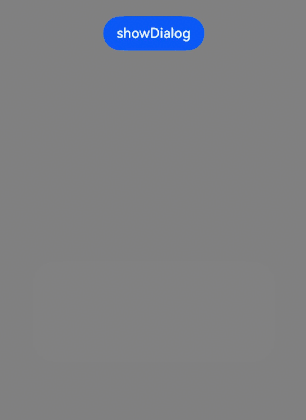
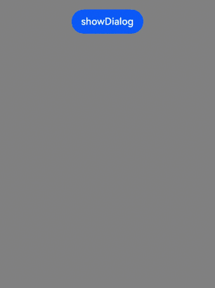

# @ohos.promptAction (弹窗)(系统接口)
<!--Kit: ArkUI-->
<!--Subsystem: ArkUI-->
<!--Owner: @houguobiao-->
<!--Designer: @houguobiao-->
<!--Tester: @lxl007-->
<!--Adviser: @Brilliantry_Rui-->

创建并显示文本提示框、对话框和操作菜单。适用于需要向用户展示提示信息、获取用户确认或提供操作选择的场景，无需自定义组件即可快速实现弹窗交互，统一界面风格。

> **说明：**
>
> 本模块首批接口从API version 9开始支持。后续版本的新增接口，采用上角标单独标记接口的起始版本。
>
> 当前页面仅包含本模块的系统接口，其他公开接口参见[@ohos.promptAction (弹窗)](js-apis-promptAction.md)。

## 导入模块

```ts
import { promptAction } from '@kit.ArkUI';
```

## ToastShowMode

设置弹窗显示模式，支持显示在TYPE_SYSTEM_TOAST类型窗口中。

**系统接口：** 此接口为系统接口。

**系统能力：**  SystemCapability.ArkUI.ArkUI.Full。

| 名称     | 值   | 说明                   |
| -------- | ---- | ---------------------- |
| SYSTEM_TOP_MOST<sup>12+</sup> | 2    | Toast 显示在TYPE_SYSTEM_TOAST类型窗口中。<br/>**模型约束：** 此接口仅可在Stage模型下使用。|

## BaseDialogOptions<sup>11+</sup>

弹窗的选项。

**模型约束：** 此接口仅可在Stage模型下使用。

**系统能力：** SystemCapability.ArkUI.ArkUI.Full

| 名称            | 类型                                                         | 只读 | 可选 | 说明                                                         |
| --------------- | ------------------------------------------------------------ | ---- | ------------------------------------------------------------ | ------------------------------------------------------------ |
| distortionMode | [DistortionMode](./arkui-ts/ts-appendix-enums-sys.md#distortionmode) | 否 | 是 | 设置系统材质下弹窗的非线性动画模式。<br/>**默认值：** DistortionMode.DISTORTION_AUTO <br/>**系统接口：** 此接口为系统接口。<br/>**起始版本：** 26.0.0<br/>**模型约束：** 此接口仅可在Stage模型下使用。|
| edgeLightMode | [EdgeLightMode](./arkui-ts/ts-appendix-enums-sys.md#edgelightmode) | 否 | 是 | 设置系统材质下弹窗的流光动画模式。<br/>**默认值：** EdgeLightMode.EDGELIGHT_AUTO <br/>**系统接口：** 此接口为系统接口。<br/>**起始版本：** 26.0.0<br/>**模型约束：** 此接口仅可在Stage模型下使用。 |

## ActionMenuOptions

操作菜单的选项。

**系统能力：** SystemCapability.ArkUI.ArkUI.Full

| 名称                          | 类型                                                         | 只读 | 可选 | 说明                                                         |
| ----------------------------- | ------------------------------------------------------------ | ---- | ------------------------------------------------------------ | ------------------------------------------------------------ |
| distortionMode | [DistortionMode](./arkui-ts/ts-appendix-enums-sys.md#distortionmode) | 否 | 是 | 设置系统材质下弹窗的非线性动画模式。<br/>**默认值：** DistortionMode.DISTORTION_AUTO <br/>**系统接口：** 此接口为系统接口。<br/>**起始版本：** 26.0.0<br/>**模型约束：** 此接口仅可在Stage模型下使用。|
| edgeLightMode | [EdgeLightMode](./arkui-ts/ts-appendix-enums-sys.md#edgelightmode) | 否 | 是 | 设置系统材质下弹窗的流光动画模式。<br/>**默认值：** EdgeLightMode.EDGELIGHT_AUTO <br/>**系统接口：** 此接口为系统接口。<br/>**起始版本：** 26.0.0<br/>**模型约束：** 此接口仅可在Stage模型下使用。 |

## ShowDialogOptions

对话框的选项。

**系统能力：** SystemCapability.ArkUI.ArkUI.Full

| 名称                              | 类型                                                         | 只读 | 可选 | 说明                                                         |
| --------------------------------- | ------------------------------------------------------------ | ---- | ------------------------------------------------------------ | ------------------------------------------------------------ |
| distortionMode | [DistortionMode](./arkui-ts/ts-appendix-enums-sys.md#distortionmode) | 否 | 是 | 设置系统材质下弹窗的非线性动画模式。<br/>**默认值：** DistortionMode.DISTORTION_AUTO <br/>**系统接口：** 此接口为系统接口。<br/>**起始版本：** 26.0.0<br/>**模型约束：** 此接口仅可在Stage模型下使用。|
| edgeLightMode | [EdgeLightMode](./arkui-ts/ts-appendix-enums-sys.md#edgelightmode) | 否 | 是 | 设置系统材质下弹窗的流光动画模式。<br/>**默认值：** EdgeLightMode.EDGELIGHT_AUTO <br/>**系统接口：** 此接口为系统接口。<br/>**起始版本：** 26.0.0<br/>**模型约束：** 此接口仅可在Stage模型下使用。 |

## 示例

### 示例1（文本对话框设置沉浸式材质、非线性形变与流光）

该示例通过调用[showDialog](./js-apis-promptAction.md#showdialogoptions)，设置[ShowDialogOptions](#showdialogoptions)中的系统材质systemMaterial，以及非线性形变[distortionMode](#showdialogoptions)和流光[edgeLightMode](#showdialogoptions)，两者均设置为AUTO模式（依据设备算力档位和系统设置中的沉浸光感配置自适应生效）。

从API版本26.0.0开始，[ShowDialogOptions](#showdialogoptions)新增distortionMode和edgeLightMode属性。

```ts
import { uiMaterial } from '@kit.ArkUI';

@Entry
@Component
struct ShowDialogExample {
  build() {
    Column() {
      Button("showDialog")
        .margin(20)
        .onClick(() => {
          this.getUIContext().getPromptAction().showDialog({
            title: 'showDialog Title',
            message: 'showDialog Text',
            buttons: [
              { text: 'button1', color: '#0000ff' },
              { text: 'button2', color: '#0000ff' }
            ],
            // 设置沉浸式材质
            systemMaterial: new uiMaterial.ImmersiveMaterial({ style: uiMaterial.ImmersiveStyle.ULTRA_THICK }),
            // 非线性形变自适应
            distortionMode: DistortionMode.DISTORTION_AUTO,
            // 流光自适应
            edgeLightMode: EdgeLightMode.EDGELIGHT_AUTO,
          });
        })
    }
    .height('100%')
    .width('100%')
    .backgroundColor(Color.Gray)
  }
}
```

该示例配图为设置沉浸式材质、非线性形变与流光的高算力设备强档效果。



该示例配图为未设置沉浸式材质、非线性形变与流光的高算力设备强档效果。



### 示例2（操作菜单设置沉浸式材质、非线性形变与流光）

该示例通过调用[showActionMenu](./arkts-apis-uicontext-promptaction.md#showactionmenu11)，设置[ActionMenuOptions](#actionmenuoptions)中的系统材质systemMaterial，以及非线性形变[distortionMode](#actionmenuoptions)和流光[edgeLightMode](#actionmenuoptions)，两者均设置为AUTO模式（依据设备算力档位和系统设置中的沉浸光感配置自适应生效）。

从API版本26.0.0开始，[ActionMenuOptions](#actionmenuoptions)新增distortionMode和edgeLightMode属性。

```ts
import { uiMaterial } from '@kit.ArkUI';

@Entry
@Component
struct ShowActionMenuExample {
  build() {
    Column() {
      Button("showActionMenu")
        .margin(20)
        .onClick(() => {
          this.getUIContext().getPromptAction().showActionMenu({
            title: 'showActionMenu Title',
            buttons: [
              { text: 'button1', color: '#0000ff' },
              { text: 'button2', color: '#0000ff' },
              { text: 'button3', color: '#0000ff' }
            ],
            // 设置沉浸式材质
            systemMaterial: new uiMaterial.ImmersiveMaterial({ style: uiMaterial.ImmersiveStyle.ULTRA_THICK }),
            // 非线性形变自适应
            distortionMode: DistortionMode.DISTORTION_AUTO,
            // 流光自适应
            edgeLightMode: EdgeLightMode.EDGELIGHT_AUTO,
          });
        })
    }
    .height('100%')
    .width('100%')
    .backgroundColor(Color.Gray)
  }
}
```

该示例配图为设置沉浸式材质、非线性形变与流光的高算力设备强档效果。


该示例配图为未设置沉浸式材质、非线性形变与流光的高算力设备强档效果。

