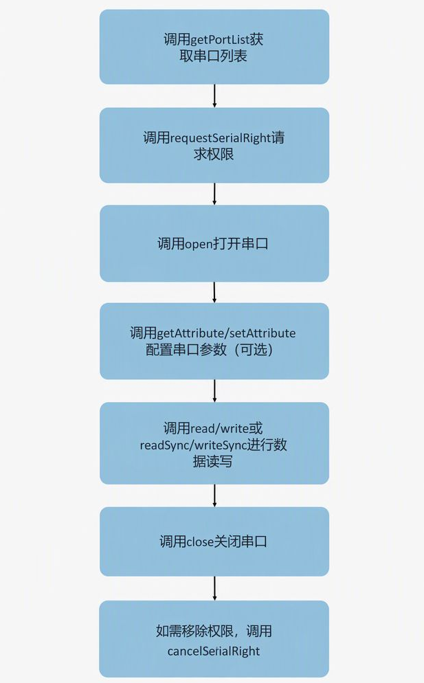

# @ohos.usbManager.serial(串口通信管理)

本模块主要用于管理串口设备的访问和通信，提供打开和关闭设备、读写数据、配置参数、权限管理等功能，解决了应用与串口设备通信时的权限申请、设备配置、数据传输等问题，使用该模块可以简化串口设备访问流程，提高开发效率。

**典型使用流程：**

**使用场景**：  
- **嵌入式设备通信**：与各类嵌入式设备进行数据交互，如传感器数据采集、设备状态监控等  
- **工业设备调试**：连接工业控制设备，进行参数配置、命令下发、日志输出等调试操作  
- **串口外设数据交互**：与串口外设进行数据通信，如打印机、扫描仪、调制解调器等设备的数据收发

**起始版本：** 19

**系统能力：** SystemCapability.USB.USBManager.Serial

## 导入模块

```TypeScript
import { serialManager } from '@kit.BasicServicesKit';
```

## 汇总

### 函数

| 名称 | 说明 |
| --- | --- |
| [cancelSerialRight](arkts-basicservices-serialmanager-cancelserialright-f.md) | 移除应用运行时访问串口设备的权限。此接口会调用close关闭已打开的串口。通常在需要主动释放权限、切换访问不同设备、或出于安全考虑时调用此接口。 |
| [close](arkts-basicservices-serialmanager-close-f.md) | 关闭串口。需要先调用[requestSerialRight](arkts-basicservices-serialmanager-requestserialright-f.md)申请权限，再调用[open](arkts-basicservices-serialmanager-open-f.md)打开串口。通常在应用退出时、设备断开连接时、需要释放串口资源时调用此接口。关闭串口不会移除访问权限，如需移除权限请调用cancelSerialRight。 |
| [getAttribute](arkts-basicservices-serialmanager-getattribute-f.md) | 获取指定串口的配置参数。需先调用[open](arkts-basicservices-serialmanager-open-f.md)打开串口后才能获取配置。通常在设备初始化后、需要查看当前通信参数配置、调试串口通信问题时调用此接口。 |
| [getPortList](arkts-basicservices-serialmanager-getportlist-f.md) | 查询串口设备清单，包括设备名称和对应的端口号。通常在应用启动时、设备连接后或需要检测可用串口设备时调用。 |
| [hasSerialRight](arkts-basicservices-serialmanager-hasserialright-f.md) | 检查应用是否具有访问串口设备的权限。应用退出后再拉起时，需要重新申请授权。通常在打开串口设备、执行串口操作前调用此接口检查权限状态。 |
| [open](arkts-basicservices-serialmanager-open-f.md) | 打开串口设备。使用前需先通过[requestSerialRight](arkts-basicservices-serialmanager-requestserialright-f.md)申请权限，使用完毕后需调用[close](arkts-basicservices-serialmanager-close-f.md)关闭串口。调用成功后，可对该串口进行读写、配置参数等操作。 |
| [read](arkts-basicservices-serialmanager-read-f.md) | 从串口设备异步读取数据，读取的数据将存储在buffer参数中。使用前需先调用[open](arkts-basicservices-serialmanager-open-f.md)打开串口设备。使用Promise异步回调，返回实际读取的数据长度。适用于接收传感器上报的数据、读取设备返回的响应数据、接收设备状态信息等场景。 |
| [readSync](arkts-basicservices-serialmanager-readsync-f.md) | 从串口设备同步读取数据，读取的数据将存储在buffer参数中，返回实际读取的数据长度。使用前需先调用[open](arkts-basicservices-serialmanager-open-f.md)打开串口设备。适用于需要阻塞式等待数据、对读取顺序有严格要求、或实时性要求不高的简单通信场景。 |
| [requestSerialRight](arkts-basicservices-serialmanager-requestserialright-f.md) | 请求应用访问串口设备的权限。应用退出时自动移除对串口设备的访问权限，在应用重启后需要重新申请授权。使用Promise异步回调。通常在首次访问串口设备前、检测到无权限时调用此接口向用户申请授权，如需移除权限请调用[cancelSerialRight](arkts-basicservices-serialmanager-cancelserialright-f.md)。 |
| [setAttribute](arkts-basicservices-serialmanager-setattribute-f.md) | 设置指定串口的配置参数。需先调用[open](arkts-basicservices-serialmanager-open-f.md)打开串口后才能设置配置。配置参数对象包含波特率（baudRate，必填）、数据位（dataBits，可选，默认8）、校验位（parity，可选，默认PARITY_NONE）、停止位（stopBits，可选，默认1）等配置项。通常在设备初始化时、切换通信协议时、或设备需要非默认配置参数时调用此接口。 |
| [write](arkts-basicservices-serialmanager-write-f.md) | 向串口设备异步写数据，需要先调用[open](arkts-basicservices-serialmanager-open-f.md)打开串口后才能调用此接口。每次写入数据长度不超过4KB，数据过大会导致数据丢失，长数据建议分包写入。使用Promise异步回调。适用于向设备发送控制命令、下发配置参数、传输采集数据等场景。 |
| [writeSync](arkts-basicservices-serialmanager-writesync-f.md) | 向串口设备同步写数据，使用前需先调用[open](arkts-basicservices-serialmanager-open-f.md)打开串口设备。每次写入数据长度不超过4KB，数据过大会导致数据丢失，长数据建议分包写入。适用于需要阻塞式等待写入完成、发送重要指令、或对写入顺序有严格要求的场景。 |

<!--Del-->
### 函数（系统接口）

| 名称 | 说明 |
| --- | --- |
| [addSerialRight](arkts-basicservices-serialmanager-addserialright-f-sys.md) | 为应用添加访问串口设备权限。使用前需先通过[getPortList](arkts-basicservices-serialmanager-getportlist-f.md)获取串口列表，从中获得有效的portId。调用成功后，应用获得对指定串口设备的访问权限，可进行打开、读写等操作；调用失败则抛出相应错误码，应用无法访问该串口设备。 |
<!--DelEnd-->

### 接口

| 名称 | 说明 |
| --- | --- |
| [SerialAttribute](arkts-basicservices-serialmanager-serialattribute-i.md) | 串口的配置参数。 |
| [SerialPort](arkts-basicservices-serialmanager-serialport-i.md) | 串口参数。 |

### 枚举

| 名称 | 说明 |
| --- | --- |
| [BaudRates](arkts-basicservices-serialmanager-baudrates-e.md) | 表示波特率的枚举，单位：比特/秒。 |
| [DataBits](arkts-basicservices-serialmanager-databits-e.md) | 表示数据位宽的枚举，单位：比特。 |
| [Parity](arkts-basicservices-serialmanager-parity-e.md) | 表示校验位的校验方式的枚举。 |
| [StopBits](arkts-basicservices-serialmanager-stopbits-e.md) | 表示停止位宽的枚举，单位：比特。 |
