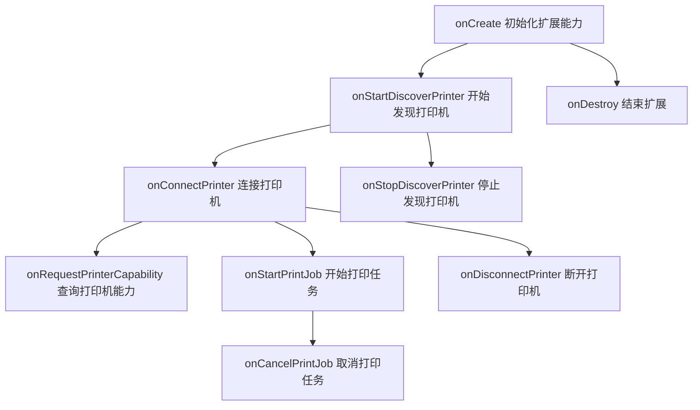

# @ohos.app.ability.PrintExtensionAbility (打印扩展能力)

<!--Kit: Basic Services Kit-->
<!--Subsystem: Print-->
<!--Owner: @guoshengbang-->
<!--Designer: @baozewei-->
<!--Tester: @baozewei-->
<!--Adviser: @fang-jinxu-->

该模块提供打印扩展能力的调用接口。PrintExtensionAbility基于生命周期回调机制运行，系统在打印扩展连接、发现打印机、连接/断开打印机、启动/取消打印任务、查询打印机能力等场景下依次调用相应回调方法，开发者需在各回调中实现对应的打印扩展逻辑。



> **说明：**
> 本模块首批接口从API version 14开始支持。后续版本的新增接口，采用上角标单独标记接口的起始版本。
> 本模块接口仅可在Stage模型下使用。

## 导入模块

```ts
import { PrintExtensionAbility } from '@kit.BasicServicesKit';
```

## 属性

**系统能力：** SystemCapability.Print.PrintFramework

| 名称 | 类型 | 只读 | 可选 | 说明 |
| -------- | -------- | -------- | -------- | -------- |
| context | [PrintExtensionContext](js-apis-PrintExtensionContext.md) | 否 | 否 | 打印扩展能力上下文。<br>**起始版本：** 14<br> |

## PrintExtensionAbility

### onCreate

onCreate(want: Want): void

系统首次连接打印扩展能力时调用。

> **说明：**
> 本接口仅可在Stage模型下使用。

**系统能力：** SystemCapability.Print.PrintFramework

**参数：**

| 参数名 | 类型 | 必填 | 说明 |
| -------- | -------- | -------- | -------- |
| want | [Want](../apis-ability-kit/js-apis-application-want.md#want) | 是 | 表示创建打印扩展时传入的Want意图信息，包含调用方指定的信息（如action、uri等），用于初始化打印扩展能力。 |

**示例：**

```ts
import { PrintExtensionAbility } from '@kit.BasicServicesKit';
import { Want } from '@kit.AbilityKit';

export default class CustomPrintExtension extends PrintExtensionAbility {
    onCreate(want: Want): void {
        console.info('onCreate');
        // ...
    }
}
```

### onStartDiscoverPrinter

onStartDiscoverPrinter(): void

开始发现与设备连接的打印机时调用。开发者可在此回调中实现打印机发现逻辑，如扫描可用打印机并通过相关接口上报发现的打印机信息。

> **说明：**
> 本接口仅可在Stage模型下使用。

**系统能力：** SystemCapability.Print.PrintFramework

**示例：**

```ts
import { PrintExtensionAbility } from '@kit.BasicServicesKit';

export default class CustomPrintExtension extends PrintExtensionAbility {
    onStartDiscoverPrinter(): void {
        console.info('onStartDiscoverPrinter enter');
        // ...
    }
}
```

### onStopDiscoverPrinter

onStopDiscoverPrinter(): void

停止发现打印机时调用。开发者应在此回调中停止打印机发现流程并释放相关资源。

> **说明：**
> 本接口仅可在Stage模型下使用。

**系统能力：** SystemCapability.Print.PrintFramework

**示例：**

```ts
import { PrintExtensionAbility } from '@kit.BasicServicesKit';

export default class CustomPrintExtension extends PrintExtensionAbility {
    onStopDiscoverPrinter(): void {
        console.info('onStopDiscoverPrinter enter');
        // ...
    }
}
```

### onConnectPrinter

onConnectPrinter(printerId: number): void

连接到特定打印机时调用。开发者应在此回调中实现与指定打印机（通过printerId标识）的连接逻辑。

> **说明：**
> 本接口仅可在Stage模型下使用。

**系统能力：** SystemCapability.Print.PrintFramework

**参数：**

| 参数名 | 类型 | 必填 | 说明 |
| -------- | -------- | -------- | -------- |
| printerId | number | 是 | 表示打印机ID，取值于打印机发现流程上报的有效打印机标识。 |

**示例：**

```ts
import { PrintExtensionAbility } from '@kit.BasicServicesKit';

export default class CustomPrintExtension extends PrintExtensionAbility {
    onConnectPrinter(printerId: number): void {
        console.info('onConnectPrinter enter');
        // ...
    }
}
```

### onDisconnectPrinter

onDisconnectPrinter(printerId: number): void

断开与特定打印机的连接时调用。开发者应在此回调中实现断开打印机连接的逻辑并释放相关资源。

> **说明：**
> 本接口仅可在Stage模型下使用。

**系统能力：** SystemCapability.Print.PrintFramework

**参数：**

| 参数名 | 类型 | 必填 | 说明 |
| -------- | -------- | -------- | -------- |
| printerId | number | 是 | 表示打印机ID，取值于打印机发现流程上报的有效打印机标识。 |

**示例：**

```ts
import { PrintExtensionAbility } from '@kit.BasicServicesKit';

export default class CustomPrintExtension extends PrintExtensionAbility {
    onDisconnectPrinter(printerId: number): void {
        console.info('onDisconnectPrinter enter');
        // ...
    }
}
```

### onStartPrintJob<sup>24+</sup>

onStartPrintJob(jobInfo: print.PrintJob): void

开始打印任务时调用。开发者应在此回调中根据jobInfo中的任务信息处理打印操作，如解析打印任务参数并执行相应的打印流程。

> **说明：**
> 本接口仅可在Stage模型下使用。

**系统能力：** SystemCapability.Print.PrintFramework

**参数：**

| 参数名 | 类型 | 必填 | 说明 |
| -------- | -------- | -------- | -------- |
| jobInfo | [print.PrintJob](js-apis-print.md#printjob24) | 是 | 表示打印任务的信息，包含任务ID、打印机ID、文档信息等详细配置和状态，用于指定要开始的打印任务。 |

**示例：**

```ts
import { print, PrintExtensionAbility } from '@kit.BasicServicesKit';

export default class CustomPrintExtension extends PrintExtensionAbility {
    onStartPrintJob(jobInfo: print.PrintJob): void {
        console.info('onStartPrintJob, jobId is: ' + jobInfo.jobId);
        // ...
    }
}
```

### onCancelPrintJob<sup>24+</sup>

onCancelPrintJob(jobInfo: print.PrintJob): void

取消已开始的打印任务时调用。开发者应在此回调中实现取消打印任务的逻辑，停止正在进行的打印操作并清理相关资源。

> **说明：**
> 本接口仅可在Stage模型下使用。

**系统能力：** SystemCapability.Print.PrintFramework

**参数：**

| 参数名 | 类型 | 必填 | 说明 |
| -------- | -------- | -------- | -------- |
| jobInfo | [print.PrintJob](js-apis-print.md#printjob24) | 是 | 表示打印任务的信息，包含任务ID、打印机ID、文档信息等详细配置和状态，需为已通过onStartPrintJob启动的打印任务，用于取消打印任务时定位目标任务。 |

**示例：**

```ts
import { print, PrintExtensionAbility } from '@kit.BasicServicesKit';

export default class CustomPrintExtension extends PrintExtensionAbility {
    onCancelPrintJob(jobInfo: print.PrintJob): void {
        console.info('onCancelPrintJob, jobId is: ' + jobInfo.jobId);
        // ...
    }
}
```

### onRequestPrinterCapability<sup>24+</sup>

onRequestPrinterCapability(printerId: number): print.PrinterCapability

请求打印机支持的能力特性（如色彩模式、双面打印模式、纸张尺寸等）时调用，例如在打印设置界面中用户选择打印机后，系统需要获取该打印机支持的纸张尺寸、色彩模式等能力信息时触发此回调。开发者应在此回调中根据printerId查询并返回对应打印机的能力信息（print.PrinterCapability），包括支持的纸张尺寸、颜色模式、双面打印模式等。

> **说明：**
> 本接口仅可在Stage模型下使用。

**系统能力：** SystemCapability.Print.PrintFramework

**参数：**

| 参数名 | 类型 | 必填 | 说明 |
| -------- | -------- | -------- | -------- |
| printerId | number | 是 | 表示打印机ID，取值于打印机发现流程上报的有效打印机标识。 |

**返回值：**
| **类型** | **说明** |
| -------- | -------- |
| [print.PrinterCapability](js-apis-print.md#printercapability24) | 表示打印机支持的能力信息，用于描述打印机的各项功能特性，如色彩模式、双面打印模式、支持的纸张尺寸等。 |

**示例：**

```ts
import { print, PrintExtensionAbility } from '@kit.BasicServicesKit';

export default class CustomPrintExtension extends PrintExtensionAbility {
    onRequestPrinterCapability(printerId: number): print.PrinterCapability {
        console.info('onRequestPrinterCapability enter');
        // ...
        const printerCapability : print.PrinterCapability = {
            colorMode : 1,
            duplexMode : 1,
            pageSize : []
        };
        return printerCapability;
    }
}
```

### onDestroy

onDestroy(): void

结束打印扩展能力时调用。

> **说明：**
> 本接口仅可在Stage模型下使用。

**系统能力：** SystemCapability.Print.PrintFramework

**示例：**

```ts
import { PrintExtensionAbility } from '@kit.BasicServicesKit';

export default class CustomPrintExtension extends PrintExtensionAbility {
    onDestroy(): void {
        console.info('onDestroy');
    }
}
```
