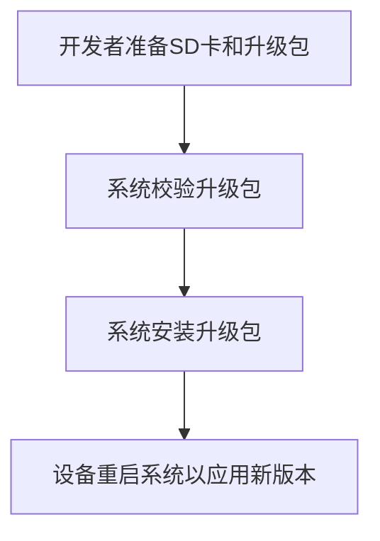
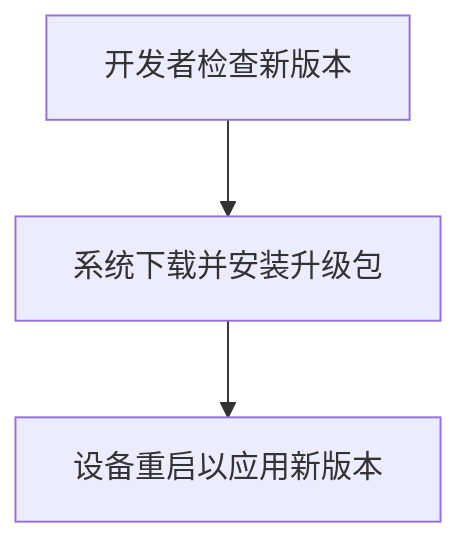
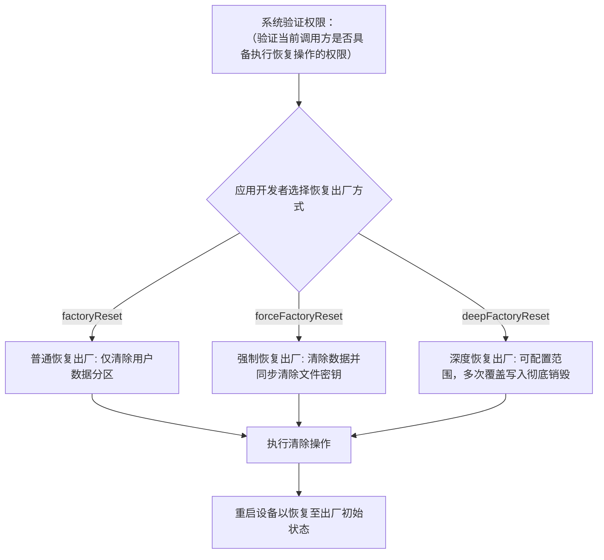
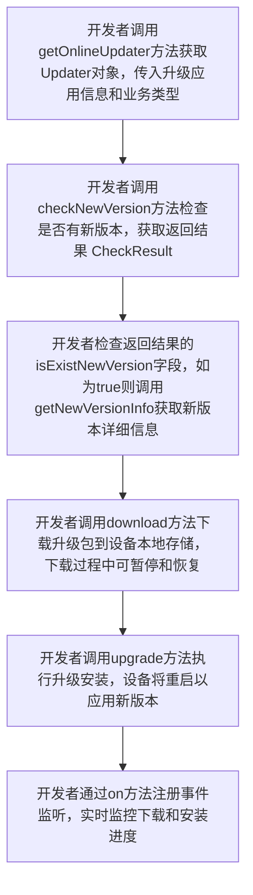
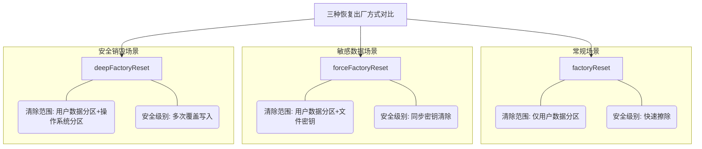
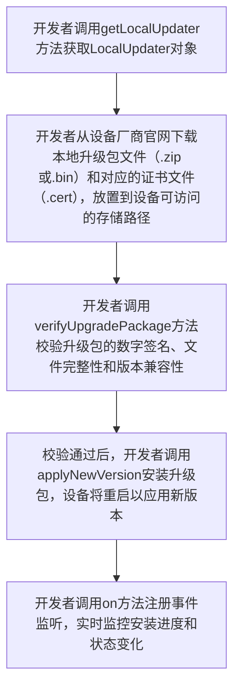

# @ohos.update (升级)(系统接口)
<!--Kit: Basic Services Kit-->
<!--Subsystem: Update-->
<!--Owner: @RainyDay_005; @huangsiping3-->
<!--Designer: @zhangzhengxue; @jackd320-->
<!--Tester: @mamba-ting-->
<!--Adviser: @fang-jinxu-->

升级范围：升级整个系统，包括内置资源和预置应用，不包括第三方应用。确保系统完整性，避免第三方应用兼容性问题，提升升级稳定性和安全性。

升级类型：SD卡升级、在线升级。

各升级类型的设计逻辑和适用场景如下：

- **SD卡升级**：详见[术语](../../basic-services/update/update-kit-term.md)。

使用场景：需要从本地存储设备进行系统升级。

升级流程为：



**收益说明**：

解决无法联网自动升级的问题，适合离线环境或网络不稳定场景下的系统升级需求，无需依赖升级包管理服务器，降低升级成本。

- **在线升级**：详见[术语](../../basic-services/update/update-kit-term.md)。

使用场景：需要通过网络自动检查和升级系统。

升级流程为：



通过Updater对象实现接口的调用。依赖设备厂商部署的升级包管理服务器（用于存储和管理升级包的服务端系统，提供版本检查、升级包下载等功能），接口由设备厂商实现。

**收益说明**：

帮助用户及时获取系统更新，提升升级效率和用户体验。支持自动版本检查、后台下载、断点续传等功能，降低用户操作成本。

**恢复出厂设置**：

使用场景：需要清除用户数据、恢复设备出厂状态。帮助用户快速解决系统异常、释放存储空间、保护隐私数据等场景。通过Restorer接口实现。

**收益说明**：

帮助用户快速解决系统异常问题、释放存储空间、保护隐私数据安全。提供三种恢复模式满足不同安全等级需求，普通恢复适用于日常维护场景，强制恢复适用于数据销毁场景，深度恢复适用于设备报废等极端场景，实现数据清理的分级管理，降低运维成本。

设备恢复出厂设置需遵循以下标准流程：



> **说明**：
>
> 本模块首批接口从API version 9开始支持，不带版本上角标标记的接口均为首批接口。
> 后续版本的新增接口，采用上角标单独标记接口的起始版本。
>
> 本模块接口为系统接口。系统应用权限申请请参考系统应用开发指南，应用扩展权限申请请参考应用扩展开发指南。

## 导入模块

下面所述各接口示例代码，都必须导入update模块，如下所示。

```js
import { update } from '@kit.BasicServicesKit';
```

## update.getOnlineUpdater

getOnlineUpdater(upgradeInfo: UpgradeInfo): Updater

获取在线升级对象，可用于在线检查新版本、下载升级包、安装升级包等操作。适用于设备厂商的OTA（详见[术语](../../basic-services/update/update-kit-term.md）升级客户端应用、在线系统升级等场景，帮助用户及时获取系统更新，提升升级效率和用户体验。

**原理说明**：

该方法通过系统服务接口获取在线升级工具对象，该对象提供检查新版本、下载升级包、安装升级包等核心功能。

**约束和限制**：

- 检查新版本和下载升级包都必须依赖设备厂商部署的升级包管理服务器。

**系统接口**： 此接口为系统接口。

**系统能力**： SystemCapability.Update.UpdateService

**参数**：

| 参数名         | 类型                          | 必填   | 说明     |
| ----------- | --------------------------- | ---- | ------ |
| upgradeInfo | [UpgradeInfo](#upgradeinfo) | 是    | 升级对象信息（UpgradeInfo），用于标识调用方和升级业务类型。upgradeApp字段为调用方包名，格式为com.xxx.xxx.xxx，长度范围1-255字符，每段长度范围1-64字符，仅支持字母、数字和点号，每段必须以字母开头，不能包含连续点号或以点号开头结尾，超出范围或格式错误时抛出异常。|

**返回值**：

| 类型                  | 说明   |
| ------------------- | ---- |
| [Updater](#updater) | 用于执行在线升级相关操作的工具类对象。 |

**错误码**：

以下的错误码的详细介绍请参见[通用错误码](../errorcode-universal.md)。

| 错误码ID       | 错误信息                                                  |
| -------  | ---------------------------------------------------- |
| 202      | Permission verification failed. A non-system application calls a system API. |

**示例**：

```ts
  // 创建升级信息对象
  const upgradeInfo: update.UpgradeInfo = {
    upgradeApp: 'com.ohos.ota.updateclient',  // 调用方包名
    businessType: {
      vendor: update.BusinessVendor.PUBLIC, // 供应商类型
      subType: update.BusinessSubType.FIRMWARE // 升级类型为固件
    }
  };
  // 获取在线升级对象
  let onlineUpdater = update.getOnlineUpdater(upgradeInfo);
```

## update.getRestorer

getRestorer(): Restorer

获取恢复出厂设置对象，用于执行恢复出厂设置相关操作。调用此方法后，系统返回Restorer工具类对象，提供三种恢复出厂方式：

- factoryReset（普通恢复，用于清除用户数据分区。详见[术语](../../basic-services/update/update-kit-term.md)。）。
- forceFactoryReset（强制恢复，用于清除用户数据分区并同步清除文件密钥。详见[术语](../../basic-services/update/update-kit-term.md)。）。
- deepFactoryReset（深度恢复，用于通过scope参数指定清除范围：DATA仅清除用户数据分区，DATA_AND_OS同时清除用户数据和操作系统分区。详见[术语](../../basic-services/update/update-kit-term.md)。）。

获取对象后可调用相应方法执行恢复出厂操作，设备将重启恢复到出厂初始状态。

**原理说明**：

该方法通过系统服务接口获取恢复出厂设置工具对象，封装了数据分区清除、密钥清除、系统分区清理等核心功能。

**约束和限制**：

- 恢复出厂操作不可逆，将永久删除用户数据，需提前提醒用户备份重要数据。
- 调用factoryReset，deepFactoryReset和getDeepFactoryResetInfo接口时，需要权限ohos.permission.FACTORY_RESET。
- 调用forceFactoryReset接口时，需要权限ohos.permission.FORCE_FACTORY_RESET。
- 操作过程中设备会自动重启，应用需做好状态保存。
- 建议在用户通过对话框或界面点击确认按钮后，再执行恢复出厂操作。

**系统接口**： 此接口为系统接口。

**系统能力**： SystemCapability.Update.UpdateService

**返回值**：

| 类型                    | 说明     |
| --------------------- | ------ |
| [Restorer](#restorer) | 用于执行恢复出厂设置相关操作的工具类对象。 |

**错误码**：

以下的错误码的详细介绍请参见[通用错误码](../errorcode-universal.md)。

| 错误码ID       | 错误信息                                                  |
| -------  | ---------------------------------------------------- |
| 202      | Permission verification failed. A non-system application calls a system API. |

**示例**：

```ts
  // 获取恢复出厂设置对象
  let factoryRestorer = update.getRestorer();
```

## update.getLocalUpdater

getLocalUpdater(): LocalUpdater

获取本地升级对象，用于从本地存储设备（如SD卡）执行系统升级。调用此方法后，系统返回LocalUpdater工具类对象，提供本地升级包校验、安装等功能。

典型流程为：准备升级包（从设备厂商官网下载，格式为.zip或.bin）和证书文件（用于验证升级包签名，格式为.cert或.der） → 校验包签名和完整性 → 安装升级包 → 设备重启以应用新版本。

**原理说明**：

该方法获取本地升级工具对象，封装了升级包校验（验证数字签名、文件完整性、版本兼容性）和安装（解压写入系统分区）等功能。本地升级不依赖网络，从设备本地存储读取升级包。

**约束和限制**：

- 升级包必须从设备厂商官网或官方渠道下载，确保来源可信。
- 安装前必须先校验升级包（调用verifyUpgradePackage），未校验的包可能导致系统损坏。
- 升级过程中设备会重启，应用需做好状态保存。
- 调用getLocalUpdater相关接口时，需要权限ohos.permission.UPDATE_SYSTEM。
- 升级包文件路径长度不超过255字符。超出255字符时将抛出异常。

**系统接口**： 此接口为系统接口。

**系统能力**： SystemCapability.Update.UpdateService

**返回值**：

| 类型                            | 说明     |
| ----------------------------- | ------ |
| [LocalUpdater](#localupdater) | 用于执行本地升级相关操作的工具类对象。 |

**错误码**：

以下的错误码的详细介绍请参见[通用错误码](../errorcode-universal.md)。

| 错误码ID       | 错误信息                                                  |
| -------  | ---------------------------------------------------- |
| 202      | Permission verification failed. A non-system application calls a system API. |

**示例**：

```ts
  // 获取本地升级对象
  let localUpdater = update.getLocalUpdater();
```

## Updater

提供在线检查新版本、下载升级包、安装升级包、管理升级策略、获取版本信息等系统在线更新功能的工具类。

使用场景：设备厂商OTA升级客户端应用、在线系统升级、自动版本检查和升级管理。

**收益说明**：

帮助用户及时获取系统更新，提升升级效率和用户体验，降低用户操作成本，支持自动版本检查、后台下载、断点续传等功能。

**在线升级流程**：



**实现机制**：

- 版本检查：向升级包管理服务器查询新版本信息。
- 下载管理：支持网络类型选择、暂停/恢复下载、断点续传。
- 安装机制：升级包下载完成后解压并写入系统分区，准备重启应用。
- 状态管理：维护升级任务状态，支持查询任务信息、清除异常状态、终止升级。

### checkNewVersion

checkNewVersion(callback: AsyncCallback\<CheckResult>): void

检查新版本信息，返回是否有新版本、新版本号、版本摘要信息等。调用成功后，返回版本检查结果对象，可用于判断是否需要升级，为后续下载、升级等操作提供版本标识。使用callback异步回调。本方法返回的版本摘要信息（versionDigestInfo）是后续方法（getNewVersionInfo、download、upgrade）的必要参数。当isExistNewVersion为true时有新版本可升级，后续方法才能执行；为false表示已是最新版本。

使用场景：需要快速检查是否有新版本并获取版本摘要。帮助用户及时了解系统更新状态，为升级决策提供依据。

**原理说明**：

该方法向设备厂商部署的升级包管理服务器发起版本检查请求，携带设备当前版本信息、设备型号等参数。服务器根据请求参数查询是否有适配该设备的更新版本，返回版本检查结果对象（CheckResult），包含isExistNewVersion标志位、newVersionInfo结构体（版本摘要、版本号等）。

检查流程包括：开发者构造请求参数 → 系统发起HTTP请求 → 服务器查询版本信息 → 系统解析响应 → 返回结果。

**系统接口**： 此接口为系统接口。

**系统能力**： SystemCapability.Update.UpdateService

**需要权限**： ohos.permission.UPDATE_SYSTEM

**参数**：

| 参数名      | 类型                                       | 必填   | 说明             |
| -------- | ---------------------------------------- | ---- | -------------- |
| callback | AsyncCallback\<[CheckResult](#checkresult)> | 是    | 回调函数，用于接收版本检查结果。回调参数包括err（错误对象，成功时为null）和checkResult（版本检查结果对象）。|

**错误码**：

以下的错误码的详细介绍请参见[通用错误码](../errorcode-universal.md)和[升级错误码](errorcode-update.md)。

| 错误码ID       | 错误信息                                                  |
| -------  | ---------------------------------------------------- |
| 201      | Permission denied. |
| 202      | Permission verification failed. A non-system application calls a system API. |
| 11500104 | IPC error.               |

**示例**：

```ts
import { BusinessError } from '@kit.BasicServicesKit';
try {
  // 创建升级信息对象
  const upgradeInfo: update.UpgradeInfo = {
    upgradeApp: 'com.ohos.ota.updateclient',  // 调用方包名
    businessType: {
      vendor: update.BusinessVendor.PUBLIC, // 供应商类型
      subType: update.BusinessSubType.FIRMWARE // 升级类型为固件
    }
  };
  // 创建在线升级对象
  let onlineUpdater = update.getOnlineUpdater(upgradeInfo);
  // 检查新版本，通过回调函数获取检查结果
  onlineUpdater.checkNewVersion((checkNewVersionError: BusinessError,  
    checkResult: update.CheckResult) => {
      if (checkNewVersionError) {
        console.error(`checkNewVersion error, code:${checkNewVersionError.code}, message:${checkNewVersionError.message}`);
        return; 
      }
      console.info(`checkNewVersion isExistNewVersion  ${checkResult?.isExistNewVersion}`);
    });
} catch (error) {
  console.error(`Fail to get updater error: ${error}`);
}
```

### checkNewVersion

checkNewVersion(): Promise\<CheckResult>

检查新版本信息，返回是否有新版本、新版本号、版本摘要信息等。调用成功后，返回版本检查结果对象，可用于判断是否需要升级，为后续下载、升级等操作提供版本标识。使用Promise异步回调。本方法返回的版本摘要信息（versionDigestInfo）是后续方法（getNewVersionInfo、download、upgrade）的必要参数。当isExistNewVersion为true时有新版本可升级，后续方法才能执行；为false表示已是最新版本。

使用场景：需要快速检查是否有新版本并获取版本摘要。帮助用户及时了解系统更新状态，为升级决策提供依据。

**原理说明**：

本方法提供在线升级功能，依赖设备厂商部署的升级包管理服务器。该方法向设备厂商部署的升级包管理服务器发起版本检查请求，携带设备当前版本信息、设备型号等参数。服务器根据请求参数查询是否有适配该设备的更新版本，返回版本检查结果对象（CheckResult），包含isExistNewVersion标志位、newVersionInfo结构体（版本摘要、版本号等）。

检查流程包括：构造请求参数 → 发起HTTP请求 → 服务器查询 → 解析响应 → 返回结果。

**系统接口**： 此接口为系统接口。

**系统能力**： SystemCapability.Update.UpdateService

**需要权限**： ohos.permission.UPDATE_SYSTEM

**返回值**：

| 类型                                    | 说明                  |
| ------------------------------------- | ------------------- |
| Promise\<[CheckResult](#checkresult)> | Promise对象。成功时resolve返回版本检查结果对象，失败时reject返回错误信息。 |

**错误码**：

以下的错误码的详细介绍请参见[通用错误码](../errorcode-universal.md)和[升级错误码](errorcode-update.md)。

| 错误码ID       | 错误信息                                                  |
| -------  | ---------------------------------------------------- |
| 201      | Permission denied. |
| 202      | Permission verification failed. A non-system application calls a system API. |
| 11500104 | IPC error.               |

**示例**：

```ts
import { BusinessError } from '@kit.BasicServicesKit';

try {
  // 创建升级信息对象
  const upgradeInfo: update.UpgradeInfo = {
    upgradeApp: 'com.ohos.ota.updateclient',  // 调用方包名
    businessType: {
      vendor: update.BusinessVendor.PUBLIC, // 供应商类型
      subType: update.BusinessSubType.FIRMWARE // 升级类型为固件
    }
  };
  let onlineUpdater = update.getOnlineUpdater(upgradeInfo);
  onlineUpdater.checkNewVersion().then((result: update.CheckResult) => {
    console.info(`checkNewVersion isExistNewVersion: ${result.isExistNewVersion}`);
    // 版本摘要信息
    console.info(`checkNewVersion versionDigestInfo: ${result.newVersionInfo.versionDigestInfo.versionDigest}`);
    }).catch((checkNewVersionError: BusinessError) => {
      console.error(`checkNewVersion promise error, code:${checkNewVersionError.code}, message:${checkNewVersionError.message}`);
    });
} catch (error) {
  console.error(`Fail to get onlineUpdater error: ${error}`);
}
```

### getNewVersionInfo

getNewVersionInfo(callback: AsyncCallback\<NewVersionInfo>): void

获取新版本信息，向升级包管理服务器查询新版本的详细信息，包括版本号、版本摘要、版本组件等。调用成功后，返回新版本信息对象，包含版本摘要和完整的版本组件列表，可用于向用户展示完整版本信息。本方法为在线升级功能，依赖设备厂商部署的升级包管理服务器。使用callback异步回调。

使用场景：需要获取新版本技术性信息（如版本号、升级包大小、组件详情）用于版本管理、诊断或技术分析。帮助开发者全面了解新版本技术细节。

若需向用户展示可读的版本说明内容，建议使用getNewVersionDescription方法。

**原理说明**：

该方法基于checkNewVersion返回的版本摘要信息，向升级包管理服务器查询新版本的完整详情。服务器返回NewVersionInfo对象，包含versionDigestInfo（版本摘要，用于后续下载和升级操作的版本标识）和versionComponents数组（各组件的版本号、大小、类型等详细信息）。必须在checkNewVersion返回isExistNewVersion为true后调用，否则返回空数据。

**调用顺序**：

- 必须先调用checkNewVersion检查是否有新版本。
- 只有当checkNewVersion返回isExistNewVersion为true时，才能调用此方法获取新版本详细信息。

**相关方法**：

- checkNewVersion()：检查是否有新版本（前置方法）。
- getNewVersionInfo()：获取新版本技术信息(版本号、组件详情)，适合版本管理和诊断场景。
- getNewVersionDescription()：获取新版本描述文本(版本说明内容)，适合向用户展示更新内容的场景。
- download()：下载升级包（后续方法）。

**约束和限制**：

- 本方法为在线升级功能，依赖设备厂商部署的升级包管理服务器。
- 必须先调用checkNewVersion检查是否有新版本，且仅当isExistNewVersion为true时调用。

**系统接口**： 此接口为系统接口。

**系统能力**： SystemCapability.Update.UpdateService

**需要权限**： ohos.permission.UPDATE_SYSTEM

**参数**：

| 参数名      | 类型                                       | 必填   | 说明              |
| -------- | ---------------------------------------- | ---- | --------------- |
| callback | AsyncCallback\<[NewVersionInfo](#newversioninfo)> | 是    | 回调函数，用于接收新版本信息（NewVersionInfo）。回调参数包括：err（错误对象，成功时为null）和newInfo（新版本信息对象）。调用前须先调用checkNewVersion检查新版本，且仅当isExistNewVersion为true时newInfo有效；若为false，则newInfo为null。|

**错误码**：

以下的错误码的详细介绍请参见[通用错误码](../errorcode-universal.md)和[升级错误码](errorcode-update.md)。

| 错误码ID       | 错误信息                                                  |
| -------  | ---------------------------------------------------- |
| 201      | Permission denied. |
| 202      | Permission verification failed. A non-system application calls a system API. |
| 11500104 | IPC error.               |

**示例**：

```ts
import { BusinessError } from '@kit.BasicServicesKit';
try {
  // 创建升级信息对象
  const upgradeInfo: update.UpgradeInfo = {
    upgradeApp: 'com.ohos.ota.updateclient',  // 调用方包名
    businessType: {
      vendor: update.BusinessVendor.PUBLIC, // 供应商类型
      subType: update.BusinessSubType.FIRMWARE // 升级类型为固件
    }
  };
  let onlineUpdater = update.getOnlineUpdater(upgradeInfo);
  // 获取新版本信息，通过回调函数接收版本详情
  onlineUpdater.getNewVersionInfo((checkError: BusinessError, newInfo: update.NewVersionInfo) => {
    if (checkError) {
      console.error(`getNewVersionInfo error, code:${checkError.code}, message:${checkError.message}`);
      return;
    }
    console.info(`info displayVersion = ${newInfo?.versionComponents[0].displayVersion}`);
    console.info(`info innerVersion = ${newInfo?.versionComponents[0].innerVersion}`);
  });
} catch (error) {
  console.error(`Fail to get onlineUpdater error: ${error}`);
}
```

### getNewVersionInfo

getNewVersionInfo(): Promise\<NewVersionInfo>

获取新版本信息，向升级包管理服务器查询新版本的详细信息，包括版本号、版本摘要、版本组件等。调用成功后，返回新版本信息对象，包含版本摘要和完整的版本组件列表，可用于向用户展示完整版本信息。本方法为在线升级功能，依赖设备厂商部署的升级包管理服务器。使用Promise异步回调。

使用场景：需要获取新版本技术性信息（如版本号、升级包大小、组件详情）用于版本管理、诊断或技术分析。帮助开发者全面了解新版本技术细节。

若需向用户展示可读的版本说明内容，建议使用getNewVersionDescription方法。

**原理说明**：

该方法基于checkNewVersion返回的版本摘要信息，向升级包管理服务器查询新版本的完整详情。服务器返回NewVersionInfo对象，包含versionDigestInfo（版本摘要，用于后续下载和升级操作的版本标识）和versionComponents数组（各组件的版本号、大小、类型等详细信息）。必须在checkNewVersion返回isExistNewVersion为true后调用，否则返回空数据。

**调用顺序**：

- 必须先调用checkNewVersion检查是否有新版本。
- 只有当checkNewVersion返回isExistNewVersion为true时，才能调用此方法获取新版本详细信息。

**相关方法**：

- checkNewVersion()：检查是否有新版本（前置方法）。
- getNewVersionInfo()：获取新版本技术信息(版本号、组件详情)，适合版本管理和诊断场景。
- getNewVersionDescription()：获取新版本描述文本(版本说明内容)，适合向用户展示更新内容的场景。
- download()：下载升级包（后续方法）。

**约束和限制**：

- 本方法为在线升级功能，依赖设备厂商部署的升级包管理服务器。
- 必须先调用checkNewVersion检查是否有新版本，且仅当isExistNewVersion为true时调用。

**系统接口**： 此接口为系统接口。

**系统能力**： SystemCapability.Update.UpdateService

**需要权限**： ohos.permission.UPDATE_SYSTEM

**返回值**：

| 类型                                       | 说明                   |
| ---------------------------------------- | -------------------- |
| Promise\<[NewVersionInfo](#newversioninfo)> | Promise对象。成功时resolve返回新版本详细信息对象，用于向用户展示完整版本信息；失败时reject返回错误信息。 |

**错误码**：

以下的错误码的详细介绍请参见[通用错误码](../errorcode-universal.md)和[升级错误码](errorcode-update.md)。

| 错误码ID       | 错误信息                                                  |
| -------  | ---------------------------------------------------- |
| 201      | Permission denied. |
| 202      | Permission verification failed. A non-system application calls a system API. |
| 11500104 | IPC error.               |

**示例**：

```ts
import { BusinessError } from '@kit.BasicServicesKit';
try {
  // 创建升级信息对象
  const upgradeInfo: update.UpgradeInfo = {
    upgradeApp: 'com.ohos.ota.updateclient',  // 调用方包名
    businessType: {
      vendor: update.BusinessVendor.PUBLIC, // 供应商类型
      subType: update.BusinessSubType.FIRMWARE // 升级类型为固件
    }
  };
  let onlineUpdater = update.getOnlineUpdater(upgradeInfo);
  // 获取新版本信息
  onlineUpdater.getNewVersionInfo().then((info: update.NewVersionInfo) => {
    console.info(`info displayVersion = ${info.versionComponents[0].displayVersion}`);
    console.info(`info innerVersion = ${info.versionComponents[0].innerVersion}`);
  }).catch((getNewVersionInfoError: BusinessError) => {
    console.error(`getNewVersionInfo promise error, code:${getNewVersionInfoError.code}, message:${getNewVersionInfoError.message}`);
  });
} catch (error) {
  console.error(`Fail to get onlineUpdater error: ${error}`);
}
```

### getNewVersionDescription

getNewVersionDescription(versionDigestInfo: VersionDigestInfo, descriptionOptions: DescriptionOptions, callback: AsyncCallback\<Array\<ComponentDescription>>): void

获取新版本描述信息。本方法为在线升级功能，依赖设备厂商部署的升级包管理服务器。调用成功后，返回新版本描述信息数组，包含各组件的版本说明内容。使用callback异步回调。

使用场景：向用户展示版本更新内容、确认是否升级。帮助用户了解新版本的功能改进和修复内容，辅助用户做出升级决策。

**原理说明**：

该方法基于checkNewVersion返回的版本摘要信息，向升级包管理服务器查询各组件的版本描述内容。描述信息包含各组件的功能改进说明、修复内容、版本特性等。服务器返回描述信息数组，每个元素对应一个组件的描述内容（ComponentDescription）。根据descriptionOptions参数指定的格式（STANDARD标准格式或SIMPLIFIED简易格式）和语言（如zh-cn中文），服务器返回相应格式和语言的描述文本。描述内容可以是文本形式（DescriptionType.CONTENT）或链接形式（DescriptionType.URI），用于向用户展示版本更新内容。

**调用说明**：

- 需先调用checkNewVersion检查是否有新版本，并获取版本摘要信息。
- versionDigestInfo参数从checkNewVersion返回结果中获取，须先调用checkNewVersion。

**系统接口**： 此接口为系统接口。

**系统能力**： SystemCapability.Update.UpdateService

**需要权限**： ohos.permission.UPDATE_SYSTEM

**参数**：

| 参数名                | 类型                                       | 必填   | 说明             |
| ------------------ | ---------------------------------------- | ---- | -------------- |
| versionDigestInfo  | [VersionDigestInfo](#versiondigestinfo)  | 是    | 版本摘要信息（VersionDigestInfo），必须先调用checkNewVersion检查新版本并确认isExistNewVersion为true后才能使用此参数。参数从checkNewVersion返回结果的newVersionInfo字段中获取，用于标识具体版本。仅当isExistNewVersion为true时该参数有效。|
| descriptionOptions | [DescriptionOptions](#descriptionoptions) | 是    | 描述文件选项（DescriptionOptions），用于指定描述文件的格式和语言。|
| callback           | AsyncCallback\<Array\<[ComponentDescription](#componentdescription)>> | 是    | 回调函数，用于接收新版本描述信息。回调参数包括： err（错误对象，成功时为null）和descriptionInfo（新版本描述信息数组，包含各组件的版本说明内容）。调用前须先调用checkNewVersion检查新版本，且仅当isExistNewVersion为true时descriptionInfo有效；若为false，则descriptionInfo为null。 |

**错误码**：

以下的错误码的详细介绍请参见[通用错误码](../errorcode-universal.md)和[升级错误码](errorcode-update.md)。

| 错误码ID       | 错误信息                                                  |
| -------  | ---------------------------------------------------- |
| 201      | Permission denied. |
| 202      | Permission verification failed. A non-system application calls a system API. |
| 401      | Parameter verification failed.    |
| 11500104 | IPC error.               |

**示例**：

```ts
import { BusinessError } from '@kit.BasicServicesKit';

// 版本摘要信息
const versionDigestInfo: update.VersionDigestInfo = {
  versionDigest: 'versionDigest' // 从checkNewVersion结果中获取版本摘要信息
};

// 描述文件选项
const descriptionOptions: update.DescriptionOptions = {
  format: update.DescriptionFormat.STANDARD, // 标准格式
  language: 'zh-cn' // 中文
};

try {
  // 创建升级信息对象
  const upgradeInfo: update.UpgradeInfo = {
    upgradeApp: 'com.ohos.ota.updateclient',  // 调用方包名
    businessType: {
      vendor: update.BusinessVendor.PUBLIC, // 供应商类型
      subType: update.BusinessSubType.FIRMWARE // 升级类型为固件
    }
  };
  let onlineUpdater = update.getOnlineUpdater(upgradeInfo);
  // 获取新版本描述信息
  onlineUpdater.getNewVersionDescription(versionDigestInfo, descriptionOptions, (descriptionError, descriptionInfo) => {
    if (descriptionError) {
      console.error(`getNewVersionDescription error, code:${descriptionError.code}, message:${descriptionError.message}`);
      return;
    }
    console.info(`getNewVersionDescription info ${JSON.stringify(descriptionInfo)}`);
  });
} catch (error) {
  console.error(`Fail to get updater error: ${error}`);
}
```

### getNewVersionDescription

getNewVersionDescription(versionDigestInfo: VersionDigestInfo, descriptionOptions: DescriptionOptions): Promise\<Array\<ComponentDescription>>

获取新版本描述信息（ComponentDescription）。本方法为在线升级功能，依赖设备厂商部署的升级包管理服务器。调用成功后，返回新版本描述信息数组，包含各组件的版本说明内容。使用Promise异步回调。

使用场景：向用户展示版本更新内容、确认是否升级。帮助用户了解新版本的功能改进和修复内容，辅助用户做出升级决策。

**原理说明**：

该方法基于checkNewVersion返回的版本摘要信息，向升级包管理服务器查询各组件的版本描述内容。描述信息包含各组件的功能改进说明、修复内容、版本特性等。服务器返回描述信息数组，每个元素对应一个组件的描述内容（ComponentDescription）。根据descriptionOptions参数指定的格式（STANDARD标准格式或SIMPLIFIED简易格式）和语言（如zh-cn中文），服务器返回相应格式和语言的描述文本。描述内容可以是文本形式（DescriptionType.CONTENT）或链接形式（DescriptionType.URI），用于向用户展示版本更新内容。

**调用说明**：

- 需先调用checkNewVersion检查是否有新版本，并获取版本摘要信息。
- versionDigestInfo参数从checkNewVersion返回结果中获取。

**系统接口**： 此接口为系统接口。

**系统能力**： SystemCapability.Update.UpdateService

**需要权限**： ohos.permission.UPDATE_SYSTEM

**参数**：

| 参数名                | 类型                                       | 必填   | 说明     |
| ------------------ | ---------------------------------------- | ---- | ------ |
| versionDigestInfo  | [VersionDigestInfo](#versiondigestinfo)  | 是    | 版本摘要信息（VersionDigestInfo），必须先调用checkNewVersion检查新版本并确认isExistNewVersion为true后才能使用此参数。参数从checkNewVersion返回结果的newVersionInfo字段中获取，用于标识具体版本。仅当isExistNewVersion为true时该参数有效。|
| descriptionOptions | [DescriptionOptions](#descriptionoptions) | 是    | 描述文件选项（DescriptionOptions），用于指定描述文件的格式和语言。|

**返回值**：

| 类型                                       | 说明                  |
| ---------------------------------------- | ------------------- |
| Promise\<Array\<[ComponentDescription](#componentdescription)>> | Promise对象。成功时resolve返回新版本描述信息数组，用于向用户展示版本更新内容和确认升级；失败时reject返回错误信息。 |

**错误码**：

以下的错误码的详细介绍请参见[通用错误码](../errorcode-universal.md)和[升级错误码](errorcode-update.md)。

| 错误码ID       | 错误信息                                                  |
| -------  | ---------------------------------------------------- |
| 201      | Permission denied. |
| 202      | Permission verification failed. A non-system application calls a system API. |
| 401      | Parameter verification failed.    |
| 11500104 | IPC error.               |

**示例**：

```ts
import { BusinessError } from '@kit.BasicServicesKit';

// 版本摘要信息
const versionDigestInfo: update.VersionDigestInfo = {
  versionDigest: 'versionDigest' // 检测结果中的版本摘要信息
};

// 描述文件选项
const descriptionOptions: update.DescriptionOptions = {
  format: update.DescriptionFormat.STANDARD, // 标准格式
  language: 'zh-cn' // 中文
};

try {
  // 创建升级信息对象
  const upgradeInfo: update.UpgradeInfo = {
    upgradeApp: 'com.ohos.ota.updateclient',  // 调用方包名
    businessType: {
      vendor: update.BusinessVendor.PUBLIC, // 供应商类型
      subType: update.BusinessSubType.FIRMWARE // 升级类型为固件
    }
  };
  let onlineUpdater = update.getOnlineUpdater(upgradeInfo);

  // 获取新版本描述信息
  onlineUpdater.getNewVersionDescription(versionDigestInfo, descriptionOptions)
    .then((info: Array<update.ComponentDescription>) => {
    console.info(`getNewVersionDescription promise info ${JSON.stringify(info)}`);
  }).catch((descriptionError: BusinessError) => {
    console.error(`getNewVersionDescription promise error, code:${descriptionError.code}, message:${descriptionError.message}`);
  });
} catch (error) {
  console.error(`Fail to get onlineUpdater error: ${error}`);
}
```

### getCurrentVersionInfo

getCurrentVersionInfo(callback: AsyncCallback\<CurrentVersionInfo>): void

获取当前版本信息。调用成功后返回当前版本信息对象，包含系统版本号、设备名、版本组件等，帮助用户快速了解设备版本状态，便于升级决策与问题排查。使用callback异步回调。

使用场景：用于在设置界面展示系统版本、对比版本是否为最新、进行版本管理与诊断。若需向用户展示当前版本的可读说明内容，建议使用getCurrentVersionDescription方法。

**原理说明**：

该方法从设备本地系统文件和配置中读取当前版本信息，包括osVersion（系统版本号，从系统版本配置文件读取）、deviceName（设备名称，从设备属性配置读取）和versionComponents（各组件版本信息数组，从系统分区元数据读取）。信息来源于设备本地，不依赖网络连接，调用后直接返回本地缓存的版本数据。

**系统接口**： 此接口为系统接口。

**系统能力**： SystemCapability.Update.UpdateService

**需要权限**： ohos.permission.UPDATE_SYSTEM

**参数**：

| 参数名      | 类型                                       | 必填   | 说明               |
| -------- | ---------------------------------------- | ---- | ---------------- |
| callback | AsyncCallback\<[CurrentVersionInfo](#currentversioninfo)> | 是    | 回调函数，用于接收当前版本信息（CurrentVersionInfo）。回调参数包括： err（错误对象，成功时为null）和currentInfo（当前版本信息对象，包含osVersion、deviceName和versionComponents字段）。 |

**错误码**：

以下的错误码的详细介绍请参见[通用错误码](../errorcode-universal.md)和[升级错误码](errorcode-update.md)。

| 错误码ID       | 错误信息                                                  |
| -------  | ---------------------------------------------------- |
| 201      | Permission denied. |
| 202      | Permission verification failed. A non-system application calls a system API. |
| 11500104 | IPC error.               |

**示例**：

```ts
import { BusinessError } from '@kit.BasicServicesKit';

try {
  // 创建升级信息对象
  const upgradeInfo: update.UpgradeInfo = {
    upgradeApp: 'com.ohos.ota.updateclient',  // 调用方包名
    businessType: {
      vendor: update.BusinessVendor.PUBLIC, // 供应商类型
      subType: update.BusinessSubType.FIRMWARE // 升级类型为固件
    }
  };
  let onlineUpdater = update.getOnlineUpdater(upgradeInfo);

  // 获取当前版本信息，通过回调函数接收版本详情
  onlineUpdater.getCurrentVersionInfo((currentVersionInfoError: BusinessError,
    currentVersionInfo: update.CurrentVersionInfo) => {
    if (currentVersionInfoError) {
      console.error(`getCurrentVersionInfo error, code:${currentVersionInfoError.code}, message:${currentVersionInfoError.message}`);
      return;
    }
    console.info(`info osVersion = ${currentVersionInfo?.osVersion}`);
    console.info(`info deviceName = ${currentVersionInfo?.deviceName}`);
    console.info(`info displayVersion = ${currentVersionInfo?.versionComponents[0].displayVersion}`);
  });
} catch (error) {
  console.error(`Fail to get onlineUpdater error: ${error}`);
}
```

### getCurrentVersionInfo

getCurrentVersionInfo(): Promise\<CurrentVersionInfo>

获取当前版本信息。调用成功后返回当前版本信息对象，包含系统版本号、设备名、版本组件等，帮助用户快速了解设备版本状态，便于升级决策与问题排查。使用Promise异步回调。

使用场景：用于在设置界面展示系统版本、对比版本是否为最新、进行版本管理与诊断。若需向用户展示当前版本的可读说明内容，建议使用getCurrentVersionDescription方法。

**原理说明**：

该方法从设备本地系统文件和配置中读取当前版本信息，包括osVersion（系统版本号，从系统版本配置文件读取）、deviceName（设备名称，从设备属性配置读取）和versionComponents（各组件版本信息数组，从系统分区元数据读取）。信息来源于设备本地，不依赖网络连接，调用后直接返回本地缓存的版本数据。

**系统接口**： 此接口为系统接口。

**系统能力**： SystemCapability.Update.UpdateService

**需要权限**： ohos.permission.UPDATE_SYSTEM

**返回值**：

| 类型                                       | 说明                  |
| ---------------------------------------- | ------------------- |
| Promise\<[CurrentVersionInfo](#currentversioninfo)> | Promise对象。成功时resolve返回当前版本信息对象，用于展示系统版本和版本对比；失败时reject返回错误信息。 |

**错误码**：

以下的错误码的详细介绍请参见[通用错误码](../errorcode-universal.md)和[升级错误码](errorcode-update.md)。

| 错误码ID       | 错误信息                                                  |
| -------  | ---------------------------------------------------- |
| 201      | Permission denied. |
| 202      | Permission verification failed. A non-system application calls a system API. |
| 11500104 | IPC error.               |

**示例**：

```ts
import { BusinessError } from '@kit.BasicServicesKit';
try {
  // 创建升级信息对象
  const upgradeInfo: update.UpgradeInfo = {
    upgradeApp: 'com.ohos.ota.updateclient',  // 调用方包名
    businessType: {
      vendor: update.BusinessVendor.PUBLIC, // 供应商类型
      subType: update.BusinessSubType.FIRMWARE // 升级类型为固件
    }
  };
  let onlineUpdater = update.getOnlineUpdater(upgradeInfo);
  // 获取当前版本信息
  onlineUpdater.getCurrentVersionInfo().then((info: update.CurrentVersionInfo) => {
    console.info(`info osVersion = ${info.osVersion}`);
    console.info(`info deviceName = ${info.deviceName}`);
    console.info(`info displayVersion = ${info.versionComponents[0].displayVersion}`);
  }).catch((currentVersionInfoError: BusinessError) => {
    console.error(`getCurrentVersionInfo error, code:${currentVersionInfoError.code}, message:${currentVersionInfoError.message}`);
  });
} catch (error) {
  console.error(`Fail to get updater error: ${error}`);
}
```

### getCurrentVersionDescription

getCurrentVersionDescription(descriptionOptions: DescriptionOptions, callback: AsyncCallback\<Array\<ComponentDescription>>): void

获取当前版本描述信息。本方法为在线升级功能，依赖设备厂商部署的升级包管理服务器。获取成功后，返回当前版本描述信息数组，包含版本说明内容，可用于版本信息展示、版本状态确认、版本对比分析等用途。使用callback异步回调。

使用场景：需要向用户展示当前版本详情、确认当前系统版本状态、对比新旧版本差异。如设备信息界面展示更新说明、版本历史记录界面显示变更内容。若需获取技术性版本信息（如版本号、设备名等），请使用getCurrentVersionInfo方法。

**原理说明**：

该方法从升级包管理服务器获取当前版本各组件的描述信息。获取流程包括：读取当前版本标识 → 向服务器发起描述信息请求（携带descriptionOptions参数指定格式和语言）→ 服务器根据版本标识查询描述内容 → 解析描述数据（转换为目标格式和语言）→ 返回描述信息数组。描述信息包含各组件的功能说明、版本特性等内容，支持CONTENT（文本形式）和URI（链接形式）两种返回方式。

**相关方法：**

- getCurrentVersionInfo()：获取当前版本信息(版本号、设备名等)，可独立调用。
- getCurrentVersionDescription()：获取当前版本描述信息，适合向用户展示。
- 两者可配合使用：先通过getCurrentVersionInfo获取基础信息，再通过本方法获取详细描述进行展示。

**系统接口**： 此接口为系统接口。

**系统能力**： SystemCapability.Update.UpdateService

**需要权限**： ohos.permission.UPDATE_SYSTEM

**参数**：

| 参数名                | 类型                                       | 必填   | 说明              |
| ------------------ | ---------------------------------------- | ---- | --------------- |
| descriptionOptions | [DescriptionOptions](#descriptionoptions) | 是    | 描述文件选项（DescriptionOptions），用于指定描述文件的格式和语言。|
| callback           | AsyncCallback\<Array\<[ComponentDescription](#componentdescription)>> | 是    | 回调函数，用于接收当前版本描述信息。回调参数包括： err(错误对象，成功时为null)和info(当前版本描述信息数组，包含版本说明内容)。 |

**错误码**：

以下的错误码的详细介绍请参见[通用错误码](../errorcode-universal.md)和[升级错误码](errorcode-update.md)。

| 错误码ID       | 错误信息                                                  |
| -------  | ---------------------------------------------------- |
| 201      | Permission denied. |
| 202      | Permission verification failed. A non-system application calls a system API. |
| 401      | Parameter verification failed.    |
| 11500104 | IPC error.               |

**示例**：

```ts
// 描述文件选项
const descriptionOptions: update.DescriptionOptions = {
  format: update.DescriptionFormat.STANDARD, // 标准格式
  language: 'zh-cn' // 中文
};

try {
  // 创建升级信息对象
  const upgradeInfo: update.UpgradeInfo = {
    upgradeApp: 'com.ohos.ota.updateclient',  // 调用方包名
    businessType: {
      vendor: update.BusinessVendor.PUBLIC, // 供应商类型
      subType: update.BusinessSubType.FIRMWARE // 升级类型为固件
    }
  };
  let onlineUpdater = update.getOnlineUpdater(upgradeInfo);

  // 获取当前版本描述信息
  onlineUpdater.getCurrentVersionDescription(descriptionOptions, (currentDescriptionError, info) => {
    if (currentDescriptionError) {
      console.error(`getCurrentVersionDescription error, code:${currentDescriptionError.code}, message:${currentDescriptionError.message}`);
      return;
    }
    console.info(`getCurrentVersionDescription info ${JSON.stringify(info)}`);
  });
} catch (error) {
  console.error(`Fail to get onlineUpdater error: ${error}`);
}
```

### getCurrentVersionDescription

getCurrentVersionDescription(descriptionOptions: DescriptionOptions): Promise\<Array\<ComponentDescription>>

获取当前版本描述信息。本方法为在线升级功能，依赖设备厂商部署的升级包管理服务器。获取成功后，返回当前版本描述信息数组，包含版本说明内容，可用于版本信息展示、版本状态确认、版本对比分析等用途。使用Promise异步回调。

使用场景：需要向用户展示当前版本详情、确认当前系统版本状态、对比新旧版本差异。如设备信息界面展示更新说明、版本历史记录界面显示变更内容。若需获取技术性版本信息（如版本号、设备名等），请使用getCurrentVersionInfo方法。

**原理说明**：

该方法从升级包管理服务器获取当前版本各组件的描述信息。获取流程包括：读取当前版本标识 → 向服务器发起描述信息请求（携带descriptionOptions参数指定格式和语言）→ 服务器根据版本标识查询描述内容 → 解析描述数据（转换为目标格式和语言）→ 返回描述信息数组。描述信息包含各组件的功能说明、版本特性等内容，支持CONTENT（文本形式）和URI（链接形式）两种返回方式。

**相关方法：**

- getCurrentVersionInfo()：获取当前版本信息(版本号、设备名等)，可独立调用。
- getCurrentVersionDescription()：获取当前版本描述信息，适合向用户展示。
- 两者可配合使用：先通过getCurrentVersionInfo获取基础信息，再通过本方法获取详细描述进行展示。

**系统接口**： 此接口为系统接口。

**系统能力**： SystemCapability.Update.UpdateService

**需要权限**： ohos.permission.UPDATE_SYSTEM

**参数**：

| 参数名                | 类型                                       | 必填   | 说明     |
| ------------------ | ---------------------------------------- | ---- | ------ |
| descriptionOptions | [DescriptionOptions](#descriptionoptions) | 是    | 描述文件选项（DescriptionOptions），用于指定描述文件的格式和语言。|

**返回值**：

| 类型                                       | 说明                   |
| ---------------------------------------- | -------------------- |
| Promise\<Array\<[ComponentDescription](#componentdescription)>> | Promise对象。成功时resolve返回当前版本描述信息数组，用于展示当前版本详情和版本对比；失败时reject返回错误信息。 |

**错误码**：

以下的错误码的详细介绍请参见[通用错误码](../errorcode-universal.md)和[升级错误码](errorcode-update.md)。

| 错误码ID       | 错误信息                                                  |
| -------  | ---------------------------------------------------- |
| 201      | Permission denied. |
| 202      | Permission verification failed. A non-system application calls a system API. |
| 401      | Parameter verification failed.    |
| 11500104 | IPC error.               |

**示例**：

```ts
import { BusinessError } from '@kit.BasicServicesKit';
// 描述文件选项
const descriptionOptions: update.DescriptionOptions = {
  format: update.DescriptionFormat.STANDARD, // 标准格式
  language: 'zh-cn' // 中文
};
try {
  // 创建升级信息对象
  const upgradeInfo: update.UpgradeInfo = {
    upgradeApp: 'com.ohos.ota.updateclient',  // 调用方包名
    businessType: {
      vendor: update.BusinessVendor.PUBLIC, // 供应商类型
      subType: update.BusinessSubType.FIRMWARE // 升级类型为固件
    }
  };
  let onlineUpdater = update.getOnlineUpdater(upgradeInfo);

  // 获取当前版本描述信息
  onlineUpdater.getCurrentVersionDescription(descriptionOptions).then((info: Array<update.ComponentDescription>) => {
    console.info(`getCurrentVersionDescription promise info ${JSON.stringify(info)}`);
  }).catch((descriptionError: BusinessError) => {
    console.error(`getCurrentVersionDescription error, code:${descriptionError.code}, message:${descriptionError.message}`);
  });
} catch (error) {
  console.error(`Fail to get onlineUpdater error: ${error}`);
}
```

### getTaskInfo

getTaskInfo(callback: AsyncCallback\<TaskInfo>): void

获取升级任务信息。本方法为在线升级功能，依赖设备厂商部署的升级包管理服务器。获取成功后，返回升级任务信息对象，包含任务是否存在、任务状态、进度等信息。帮助开发者实时掌握升级进度、及时发现异常状态、优化升级策略，提升升级流程的可控性和成功率。使用callback异步回调。

使用场景：实时掌握升级进度、监控任务状态、及时发现异常。

**原理说明**：

该方法从系统升级服务查询当前升级任务的状态信息。系统维护一个升级任务状态记录，包含existTask（是否存在任务）、taskBody（任务详情，包括版本摘要、当前状态、进度百分比、安装模式等）。任务状态在下载、安装过程中实时更新，通过该方法可查询最新状态。状态信息存储在系统服务进程的内存中，每次调用从服务进程实时查询返回。

**相关方法**:

- download()：下载升级包(可在下载过程中调用getTaskInfo查询下载进度和状态)。
- upgrade()：安装升级包(可在安装过程中调用getTaskInfo查询安装进度和状态)。
- pauseDownload()：暂停下载(暂停后可调用getTaskInfo查询暂停状态)。
- terminateUpgrade()：终止升级(终止后可调用getTaskInfo查询任务取消状态)。

**调用时机**:

- 推荐在调用download或upgrade开始升级任务后，定期调用getTaskInfo查询任务进度。
- 在升级流程中可通过事件监听(on方法)实时获取进度，或通过getTaskInfo主动查询当前状态。
- 在异常或中断场景下可调用getTaskInfo确认任务状态后决定后续操作。

**系统接口**： 此接口为系统接口。

**系统能力**： SystemCapability.Update.UpdateService

**需要权限**： ohos.permission.UPDATE_SYSTEM

**参数**：

| 参数名      | 类型                                    | 必填   | 说明               |
| -------- | ------------------------------------- | ---- | ---------------- |
| callback | AsyncCallback\<[TaskInfo](#taskinfo)> | 是    | 回调函数，用于接收升级任务信息（TaskInfo）。回调参数包括： err（错误对象，成功时为null）和taskInfo（升级任务信息对象，包含existTask和taskBody字段）。 |

**错误码**：

以下的错误码的详细介绍请参见[通用错误码](../errorcode-universal.md)和[升级错误码](errorcode-update.md)。

| 错误码ID       | 错误信息                                                  |
| -------  | ---------------------------------------------------- |
| 201      | Permission denied. |
| 202      | Permission verification failed. A non-system application calls a system API. |
| 11500104 | IPC error.               |

**示例**：

```ts
import { BusinessError } from '@kit.BasicServicesKit';

try {
  // 创建升级信息对象
  const upgradeInfo: update.UpgradeInfo = {
    upgradeApp: 'com.ohos.ota.updateclient',  // 调用方包名
    businessType: {
      vendor: update.BusinessVendor.PUBLIC, // 供应商类型
      subType: update.BusinessSubType.FIRMWARE // 升级类型为固件
    }
  };
  let onlineUpdater = update.getOnlineUpdater(upgradeInfo);

  // 获取升级任务信息，通过回调函数接收任务状态 
  onlineUpdater.getTaskInfo((taskInfoError: BusinessError, taskInfo: update.TaskInfo) => {
    if (taskInfoError) {
      console.error(`getTaskInfo error, code:${taskInfoError.code}, message:${taskInfoError.message}`);
      return;
    }
    console.info(`getTaskInfo existTask= ${taskInfo?.existTask}`);
  });
} catch (error) {
  console.error(`Fail to get onlineUpdater error: ${error}`);
}
```

### getTaskInfo

getTaskInfo(): Promise\<TaskInfo>

获取升级任务信息。本方法为在线升级功能，依赖设备厂商部署的升级包管理服务器。获取成功后，返回升级任务信息对象，包含任务是否存在、任务状态、进度等信息。帮助开发者实时掌握升级进度、及时发现异常状态、优化升级策略，提升升级流程的可控性和成功率。使用Promise异步回调。

使用场景：实时掌握升级进度、监控任务状态、及时发现异常。

**原理说明**：

该方法从系统升级服务查询当前升级任务的状态信息。系统维护一个升级任务状态记录，包含existTask（是否存在任务）、taskBody（任务详情，包括版本摘要、当前状态、进度百分比、安装模式等）。任务状态在下载、安装过程中实时更新，通过该方法可查询最新状态。状态信息存储在系统服务进程的内存中，每次调用从服务进程实时查询返回。

**相关方法**:

- download()：下载升级包(可在下载过程中调用getTaskInfo查询下载进度和状态)。
- upgrade()：安装升级包(可在安装过程中调用getTaskInfo查询安装进度和状态)。
- pauseDownload()：暂停下载(暂停后可调用getTaskInfo查询暂停状态)。
- terminateUpgrade()：终止升级(终止后可调用getTaskInfo查询任务取消状态)。

**调用时机**:

- 推荐在调用download或upgrade开始升级任务后，定期调用getTaskInfo查询任务进度。
- 在升级流程中可通过事件监听(on方法)实时获取进度，或通过getTaskInfo主动查询当前状态。
- 在异常或中断场景下可调用getTaskInfo确认任务状态后决定后续操作。

**系统接口**： 此接口为系统接口。

**系统能力**： SystemCapability.Update.UpdateService

**需要权限**： ohos.permission.UPDATE_SYSTEM

**返回值**：

| 类型                              | 说明                  |
| ------------------------------- | ------------------- |
| Promise\<[TaskInfo](#taskinfo)> | Promise对象。成功时resolve返回升级任务信息对象，用于查询和监控升级任务状态；失败时reject返回错误信息。 |

**错误码**：

以下的错误码的详细介绍请参见[通用错误码](../errorcode-universal.md)和[升级错误码](errorcode-update.md)。

| 错误码ID       | 错误信息                                                  |
| -------  | ---------------------------------------------------- |
| 201      | Permission denied. |
| 202      | Permission verification failed. A non-system application calls a system API. |
| 11500104 | IPC error.               |

**示例**：

```ts
import { BusinessError } from '@kit.BasicServicesKit';

try {
  // 创建升级信息对象
  const upgradeInfo: update.UpgradeInfo = {
    upgradeApp: 'com.ohos.ota.updateclient',  // 调用方包名
    businessType: {
      vendor: update.BusinessVendor.PUBLIC, // 供应商类型
      subType: update.BusinessSubType.FIRMWARE // 升级类型为固件
    }
  };
  let onlineUpdater = update.getOnlineUpdater(upgradeInfo);

  onlineUpdater.getTaskInfo().then((info: update.TaskInfo) => {
    console.info(`getTaskInfo existTask= ${info.existTask}`);
  }).catch((taskInfoError: BusinessError) => {
    console.error(`Failed to get task info. code:${taskInfoError.code}, message:${taskInfoError.message}`);
  });
} catch (error) {
  console.error(`Fail to get onlineUpdater error: ${error}`);
}
```

### download

download(versionDigestInfo: VersionDigestInfo, downloadOptions: DownloadOptions, callback: AsyncCallback\<void>): void

下载升级包到设备本地存储。本方法为在线升级功能，依赖设备厂商部署的升级包管理服务器。支持进度监听与暂停/恢复控制，

帮助用户高效完成升级包获取，节省带宽与时间，提升升级成功率。使用callback异步回调。

使用场景：OTA客户端在线升级、后台自动下载升级包、网络中断后断点续传。

**原理说明**：

该方法从升级包管理服务器下载升级包到设备本地存储。下载流程包括：解析版本摘要信息 → 根据downloadOptions选择网络类型 → 发起下载请求 → 分块接收
数据并写入本地文件 → 实时更新进度。支持断点续传机制：记录已下载的字节位置和网络连接状态，中断后可从断点继续下载。暂停下载时保存当前进度状态（已下载大小、文件路径等），恢复下载时读取进度状态继续接收。

**调用顺序说明**：

- 必须先调用checkNewVersion检查是否有新版本，并获取版本摘要信息。
- 只有当checkNewVersion返回isExistNewVersion为true时，才能调用本方法下载升级包。
- 如果isExistNewVersion为false，表示无新版本，调用本方法会返回“已是最新版本”。

**相关方法**：

- checkNewVersion()：检查新版本（前置方法）。
- resumeDownload()：恢复下载（暂停后调用）。
- pauseDownload()：暂停下载（下载中调用）。
- upgrade()：安装升级包（下载完成后调用）。

**系统接口**： 此接口为系统接口。

**系统能力**： SystemCapability.Update.UpdateService

**需要权限**： ohos.permission.UPDATE_SYSTEM

**参数**：

| 参数名               | 类型                                      | 必填   | 说明                                 |
| ----------------- | --------------------------------------- | ---- | ---------------------------------- |
| versionDigestInfo | [VersionDigestInfo](#versiondigestinfo) | 是    | 版本摘要信息（VersionDigestInfo），必须先调用checkNewVersion检查新版本并确认isExistNewVersion为true后才能使用此参数。参数从checkNewVersion返回结果的newVersionInfo字段中获取，用于标识具体版本。仅当isExistNewVersion为true时该参数有效。|
| downloadOptions   | [DownloadOptions](#downloadoptions)     | 是    | 下载选项（DownloadOptions），用于控制下载行为。allowNetwork字段设置允许下载的网络类型，建议根据升级包大小和网络环境选择：大文件升级包建议使用WIFI避免流量消耗和提升下载速度；移动场景或无WIFI环境可使用CELLULAR；不确定网络环境建议使用CELLULAR_AND_WIFI。|
| callback          | AsyncCallback\<void>                    | 是    | 回调函数，用于接收下载结果。回调参数包括err（错误对象，成功时为null，失败时为错误对象）。 |

**错误码**：

以下的错误码的详细介绍请参见[通用错误码](../errorcode-universal.md)和[升级错误码](errorcode-update.md)。

| 错误码ID       | 错误信息                                                  |
| -------  | ---------------------------------------------------- |
| 201      | Permission denied. |
| 202      | Permission verification failed. A non-system application calls a system API. |
| 401      | Parameter verification failed.    |
| 11500104 | IPC error.               |

**示例**：

```ts
import { BusinessError } from '@kit.BasicServicesKit';

// 版本摘要信息
const versionDigestInfo: update.VersionDigestInfo = {
  versionDigest: 'versionDigest' // 检测结果中的版本摘要信息
};

// 下载选项
const downloadOptions: update.DownloadOptions = {
  allowNetwork: update.NetType.CELLULAR, // 允许数据网络下载
  order: update.Order.DOWNLOAD // 下载
};
try {
  // 创建升级信息对象
  const upgradeInfo: update.UpgradeInfo = {
    upgradeApp: 'com.ohos.ota.updateclient',  // 调用方包名
    businessType: {
      vendor: update.BusinessVendor.PUBLIC, // 供应商类型
      subType: update.BusinessSubType.FIRMWARE // 升级类型为固件
    }
  };
  let onlineUpdater = update.getOnlineUpdater(upgradeInfo);
  // 下载版本
  onlineUpdater.download(versionDigestInfo, downloadOptions, (downloadError: BusinessError) => {
    if (downloadError) {
      console.error(`download error. code:${downloadError.code}, message:${downloadError.message}`);
  } else {
    console.info(`download success`);
  };
  });
} catch (error) {
  console.error(`Fail to get onlineUpdater error: ${error}`);
}
```

### download

download(versionDigestInfo: VersionDigestInfo, downloadOptions: DownloadOptions): Promise\<void>

下载升级包到设备本地存储。本方法为在线升级功能，依赖设备厂商部署的升级包管理服务器。支持进度监听与暂停/恢复控制，

帮助用户高效完成升级包获取，节省带宽与时间，提升升级成功率。使用Promise异步回调。

使用场景：OTA客户端在线升级、后台自动下载升级包、网络中断后断点续传。

**原理说明**：

该方法从升级包管理服务器下载升级包到设备本地存储。下载流程包括：解析版本摘要信息 → 根据downloadOptions选择网络类型 → 发起下载请求 → 分块接收
数据并写入本地文件 → 实时更新进度。支持断点续传机制：记录已下载的字节位置和网络连接状态，中断后可从断点继续下载。暂停下载时保存当前进度状态（已下载大小、文件路径等），恢复下载时读取进度状态继续接收。

**调用顺序说明**：

- 必须先调用checkNewVersion检查是否有新版本，并获取版本摘要信息。
- 只有当checkNewVersion返回isExistNewVersion为true时，才能调用本方法下载升级包。
- 如果isExistNewVersion为false，表示无新版本，调用本方法会返回"已是最新版本"。

**相关方法**：

- checkNewVersion()：检查新版本（前置方法）。
- resumeDownload()：恢复下载（暂停后调用）。
- pauseDownload()：暂停下载（下载中调用）。
- upgrade()：安装升级包（download方法下载完成后调用）。

**系统接口**： 此接口为系统接口。

**系统能力**： SystemCapability.Update.UpdateService

**需要权限**： ohos.permission.UPDATE_SYSTEM

**参数**：

| 参数名               | 类型                                      | 必填   | 说明     |
| ----------------- | --------------------------------------- | ---- | ------ |
| versionDigestInfo | [VersionDigestInfo](#versiondigestinfo) | 是    | 版本摘要信息（VersionDigestInfo），必须先调用checkNewVersion检查新版本并确认isExistNewVersion为true后才能使用此参数。参数从checkNewVersion返回结果的newVersionInfo字段中获取，用于标识具体版本。仅当isExistNewVersion为true时该参数有效。|
| downloadOptions   | [DownloadOptions](#downloadoptions)     | 是    | 下载选项（DownloadOptions），用于控制下载行为。allowNetwork字段设置允许下载的网络类型，建议根据升级包大小和网络环境选择：大文件升级包建议使用WIFI避免流量消耗和提升下载速度；移动场景或无WIFI环境可使用CELLULAR；不确定网络环境建议使用CELLULAR_AND_WIFI。|

**返回值**：

| 类型             | 说明                         |
| -------------- | -------------------------- |
| Promise\<void> | Promise对象。成功时resolve无返回结果，失败时reject返回错误信息。 |

**错误码**：

以下的错误码的详细介绍请参见[通用错误码](../errorcode-universal.md)和[升级错误码](errorcode-update.md)。

| 错误码ID       | 错误信息                                                  |
| -------  | ---------------------------------------------------- |
| 201      | Permission denied. |
| 202      | Permission verification failed. A non-system application calls a system API. |
| 401      | Parameter verification failed.    |
| 11500104 | IPC error.               |

**示例**：

```ts
import { BusinessError } from '@kit.BasicServicesKit';

// 版本摘要信息
const versionDigestInfo: update.VersionDigestInfo = {
  versionDigest: 'versionDigest' // 检测结果中的版本摘要信息
};

// 下载选项
const downloadOptions: update.DownloadOptions = {
  allowNetwork: update.NetType.CELLULAR, // 允许数据网络下载
  order: update.Order.DOWNLOAD // 下载
};
try {
  // 创建升级信息对象
  const upgradeInfo: update.UpgradeInfo = {
    upgradeApp: 'com.ohos.ota.updateclient',  // 调用方包名
    businessType: {
      vendor: update.BusinessVendor.PUBLIC, // 供应商类型
      subType: update.BusinessSubType.FIRMWARE // 升级类型为固件
    }
  };
  let onlineUpdater = update.getOnlineUpdater(upgradeInfo);
  onlineUpdater.download(versionDigestInfo, downloadOptions).then(() => {
    console.info(`download start`);
  }).catch((downloadError: BusinessError) => {
    console.error(`download error. code:${downloadError.code}, message:${downloadError.message}`);
  });
} catch (error) {
  console.error(`Fail to get onlineUpdater error: ${error}`);
}
```

### resumeDownload

resumeDownload(versionDigestInfo: VersionDigestInfo, resumeDownloadOptions: ResumeDownloadOptions, callback: AsyncCallback\<void>): void

恢复已暂停的升级包下载任务，避免重复下载已完成的进度部分。本方法为在线升级功能，依赖设备厂商部署的升级包管理服务器。使用callback异步回调。

使用场景：网络中断后断点续传、用户暂停后主动恢复、后台下载任务恢复。

**原理说明**：

该方法从暂停点恢复下载流程：读取暂停时保存的进度状态（已下载字节位置、文件路径、网络连接信息）→ 根据resumeDownloadOptions选择网络类型 → 向服务器发起断点续传请求（携带已下载位置信息）→ 服务器返回剩余数据 → 从断点位置继续写入本地文件 → 实时更新进度。恢复下载时系统会验证已下载部分的完整性，确保数据一致性后再继续接收新数据。

**配对调用说明**：

- 与pauseDownload()成对使用，用于控制下载流程的暂停和恢复。
- 必须在调用pauseDownload()暂停下载后才能调用此方法恢复下载。

**系统接口**： 此接口为系统接口。

**系统能力**： SystemCapability.Update.UpdateService

**需要权限**： ohos.permission.UPDATE_SYSTEM

**参数**：

| 参数名                   | 类型                                       | 必填   | 说明                                   |
| --------------------- | ---------------------------------------- | ---- | ------------------------------------ |
| versionDigestInfo     | [VersionDigestInfo](#versiondigestinfo)  | 是    | 版本摘要信息（VersionDigestInfo），必须先调用checkNewVersion检查新版本并确认isExistNewVersion为true后才能使用此参数。参数从checkNewVersion返回结果的newVersionInfo字段中获取，用于标识具体版本。仅当isExistNewVersion为true时该参数有效。|
| resumeDownloadOptions | [ResumeDownloadOptions](#resumedownloadoptions) | 是    | 恢复下载选项（ResumeDownloadOptions），用于指定恢复下载的网络类型。仅当已调用pauseDownload暂停下载后才生效。allowNetwork字段设置允许恢复下载的网络类型，建议根据升级包大小和网络环境选择：大文件升级包建议使用WIFI避免流量消耗和提升下载速度；移动场景或无WIFI环境可使用CELLULAR；不确定网络环境建议使用CELLULAR_AND_WIFI。|
| callback              | AsyncCallback\<void>                     | 是    | 回调函数，用于接收恢复下载结果。回调参数包括： err(错误对象，成功时为null，失败时为错误对象)。 |

**错误码**：

以下的错误码的详细介绍请参见[通用错误码](../errorcode-universal.md)和[升级错误码](errorcode-update.md)。

| 错误码ID       | 错误信息                                                  |
| -------  | ---------------------------------------------------- |
| 201      | Permission denied. |
| 202      | Permission verification failed. A non-system application calls a system API. |
| 401      | Parameter verification failed.    |
| 11500104 | IPC error.               |

**示例**：

```ts
import { BusinessError } from '@kit.BasicServicesKit';

// 版本摘要信息
const versionDigestInfo: update.VersionDigestInfo = {
  versionDigest: 'versionDigest' // 检测结果中的版本摘要信息
};

// 恢复下载选项
const resumeDownloadOptions: update.ResumeDownloadOptions = {
  allowNetwork: update.NetType.CELLULAR, // 允许数据网络下载
};
try {
  // 创建升级信息对象
  const upgradeInfo: update.UpgradeInfo = {
    upgradeApp: 'com.ohos.ota.updateclient',  // 调用方包名
    businessType: {
      vendor: update.BusinessVendor.PUBLIC, // 供应商类型
      subType: update.BusinessSubType.FIRMWARE // 升级类型为固件
    }
  };
  let onlineUpdater = update.getOnlineUpdater(upgradeInfo);
  // 继续下载
  onlineUpdater.resumeDownload(versionDigestInfo, resumeDownloadOptions,
    (resumeDownloadError: BusinessError) => {
  if (resumeDownloadError) {
    console.error(`resumeDownload error. code:${resumeDownloadError.code}, message:${resumeDownloadError.message}`);
  } else {
    console.info(`resumeDownload success`);
  };
  });
} catch (error) {
  console.error(`Fail to get onlineUpdater error: ${error}`);
}
```

### resumeDownload

resumeDownload(versionDigestInfo: VersionDigestInfo, resumeDownloadOptions: ResumeDownloadOptions): Promise\<void>

恢复已暂停的升级包下载任务，避免重复下载已完成的进度部分。本方法为在线升级功能，依赖设备厂商部署的升级包管理服务器。使用Promise异步回调。

使用场景：网络中断后断点续传、用户暂停后主动恢复、后台下载任务恢复。

**原理说明**：

该方法从暂停点恢复下载流程：读取暂停时保存的进度状态（已下载字节位置、文件路径、网络连接信息）→ 根据resumeDownloadOptions选择网络类型 → 向服务器发起断点续传请求（携带已下载位置信息）→ 服务器返回剩余数据 → 从断点位置继续写入本地文件 → 实时更新进度。恢复下载时系统会验证已下载部分的完整性，确保数据一致性后再继续接收新数据。

**配对调用说明**：

- 与pauseDownload()成对使用，用于控制下载流程的暂停和恢复。
- 必须在调用pauseDownload()暂停下载后才能调用此方法恢复下载。

**系统接口**： 此接口为系统接口。

**系统能力**： SystemCapability.Update.UpdateService

**需要权限**： ohos.permission.UPDATE_SYSTEM

**参数**：

| 参数名                   | 类型                                       | 必填   | 说明     |
| --------------------- | ---------------------------------------- | ---- | ------ |
| versionDigestInfo     | [VersionDigestInfo](#versiondigestinfo)  | 是    | 版本摘要信息（VersionDigestInfo），必须先调用checkNewVersion检查新版本并确认isExistNewVersion为true后才能使用此参数。参数从checkNewVersion返回结果的newVersionInfo字段中获取，用于标识具体版本。仅当isExistNewVersion为true时该参数有效。|
| resumeDownloadOptions | [ResumeDownloadOptions](#resumedownloadoptions) | 是    | 恢复下载选项（ResumeDownloadOptions），用于指定恢复下载的网络类型。仅当已调用pauseDownload暂停下载后才生效。allowNetwork字段设置允许恢复下载的网络类型，建议根据升级包大小和网络环境选择：大文件升级包建议使用WIFI避免流量消耗和提升下载速度；移动场景或无WIFI环境可使用CELLULAR；不确定网络环境建议使用CELLULAR_AND_WIFI。|

**返回值**：

| 类型             | 说明                         |
| -------------- | -------------------------- |
| Promise\<void> | Promise对象。成功时resolve无返回结果，失败时reject返回错误信息。 |

**错误码**：

以下的错误码的详细介绍请参见[通用错误码](../errorcode-universal.md)和[升级错误码](errorcode-update.md)。

| 错误码ID       | 错误信息                                                  |
| -------  | ---------------------------------------------------- |
| 201      | Permission denied. |
| 202      | Permission verification failed. A non-system application calls a system API. |
| 401      | Parameter verification failed.    |
| 11500104 | IPC error.               |

**示例**：

```ts
import { BusinessError } from '@kit.BasicServicesKit';

// 版本摘要信息
const versionDigestInfo: update.VersionDigestInfo = {
  versionDigest: 'versionDigest' // 检测结果中的版本摘要信息
};

// 恢复下载选项
const resumeDownloadOptions: update.ResumeDownloadOptions = {
  allowNetwork: update.NetType.CELLULAR, // 允许数据网络下载
};
try {
  // 创建升级信息对象
  const upgradeInfo: update.UpgradeInfo = {
    upgradeApp: 'com.ohos.ota.updateclient',  // 调用方包名
    businessType: {
      vendor: update.BusinessVendor.PUBLIC, // 供应商类型
      subType: update.BusinessSubType.FIRMWARE // 升级类型为固件
    }
  };
  let onlineUpdater = update.getOnlineUpdater(upgradeInfo);
  // 继续下载
  onlineUpdater.resumeDownload(versionDigestInfo, resumeDownloadOptions).then(() => {
    console.info(`resumeDownload start`);
  }).catch((resumeDownloadError: BusinessError) => {
    console.error(`resumeDownload error. code:${resumeDownloadError.code}, message:${resumeDownloadError.message}`);
  });
} catch (error) {
  console.error(`Fail to get onlineUpdater error: ${error}`);
}
```

### pauseDownload

pauseDownload(versionDigestInfo: VersionDigestInfo, pauseDownloadOptions: PauseDownloadOptions, callback: AsyncCallback\<void>): void

暂停下载新版本。本方法为在线升级功能,依赖设备厂商部署的升级包管理服务器。仅当当前有正在进行的下载任务时可调用本方法暂停下载，暂停后需调用resumeDownload()恢复下载，恢复完成后才可调用upgrade()安装。使用callback异步回调。

使用场景：用户主动暂停下载、网络环境不佳时暂停以节省流量、需要在特定时间段（如夜间时段或非工作时间）下载时暂停。

**原理说明**：

该方法执行下载暂停流程：中断当前网络连接 → 保存进度状态（已下载字节位置、文件路径、网络类型、版本摘要信息）→ 标记任务状态为DOWNLOAD_PAUSED → 释放部分网络资源。暂停时系统将进度状态写入持久化存储，确保设备重启或应用退出后仍可恢复。根据isAllowAutoResume参数，系统可能自动恢复或等待手动调用resumeDownload。

**配对调用说明**：

- 与resumeDownload()成对使用，用于控制下载流程的暂停和恢复。暂停下载后可调用resumeDownload()恢复下载，完成暂停和恢复的流程控制。

**状态转换说明**：

- 暂停后可调用resumeDownload()恢复下载。
- 暂停后可通过getTaskInfo()查询当前任务状态。
- 暂停后不能直接调用upgrade()安装，必须先恢复下载并完成后再安装。

**系统接口**： 此接口为系统接口。

**系统能力**： SystemCapability.Update.UpdateService

**需要权限**： ohos.permission.UPDATE_SYSTEM

**参数**：

| 参数名                  | 类型                                       | 必填   | 说明                                   |
| -------------------- | ---------------------------------------- | ---- | ------------------------------------ |
| versionDigestInfo    | [VersionDigestInfo](#versiondigestinfo)  | 是    | 版本摘要信息（VersionDigestInfo），必须先调用checkNewVersion检查新版本并确认isExistNewVersion为true后才能使用此参数。参数从checkNewVersion返回结果的newVersionInfo字段中获取，用于标识具体版本。仅当isExistNewVersion为true时该参数有效。|
| pauseDownloadOptions | [PauseDownloadOptions](#pausedownloadoptions) | 是    | 暂停下载选项（PauseDownloadOptions），用于控制暂停行为。仅当有正在进行的下载任务时才生效。isAllowAutoResume字段设置是否允许自动恢复，建议：网络不稳定场景建议设置true启用自动恢复，提升下载成功率；需要精确控制下载时机或避免在特定网络环境下恢复的场景建议设置false，通过手动调用resumeDownload控制恢复时机。|
| callback | AsyncCallback\<void> | 是 | 回调函数，用于接收暂停下载结果。回调参数包括： err(错误对象，成功时为null，失败时为错误对象)。 |

**错误码**：

以下的错误码的详细介绍请参见[通用错误码](../errorcode-universal.md)和[升级错误码](errorcode-update.md)。

| 错误码ID       | 错误信息                                                  |
| -------  | ---------------------------------------------------- |
| 201      | Permission denied. |
| 202      | Permission verification failed. A non-system application calls a system API. |
| 401      | Parameter verification failed.    |
| 11500104 | IPC error.               |

**示例**：

```ts
import { BusinessError } from '@kit.BasicServicesKit';

// 版本摘要信息
const versionDigestInfo: update.VersionDigestInfo = {
  versionDigest: 'versionDigest' // 检测结果中的版本摘要信息
};

// 暂停下载选项
const pauseDownloadOptions: update.PauseDownloadOptions = {
  isAllowAutoResume: true // 允许自动恢复下载
};
try {
  // 创建升级信息对象
  const upgradeInfo: update.UpgradeInfo = {
    upgradeApp: 'com.ohos.ota.updateclient',  // 调用方包名
    businessType: {
      vendor: update.BusinessVendor.PUBLIC, // 供应商类型
      subType: update.BusinessSubType.FIRMWARE // 升级类型为固件
    }
  };
  let onlineUpdater = update.getOnlineUpdater(upgradeInfo);
  // 暂停下载升级包，通过回调函数处理暂停结果 
  onlineUpdater.pauseDownload(versionDigestInfo, pauseDownloadOptions,
    (pauseDownloadError: BusinessError) => {
    if (pauseDownloadError) {
    console.error(`pauseDownload error. code:${pauseDownloadError.code}, message:${pauseDownloadError.message}`);
  } else {
      console.info(`pauseDownload success`);
  };
  });
} catch (error) {
  console.error(`Fail to get onlineUpdater error: ${error}`);
}
```

### pauseDownload

pauseDownload(versionDigestInfo: VersionDigestInfo, pauseDownloadOptions: PauseDownloadOptions): Promise\<void>

暂停下载新版本。本方法为在线升级功能,依赖设备厂商部署的升级包管理服务器。仅当当前有正在进行的下载任务时可调用本方法暂停下载，暂停后需调用resumeDownload()恢复下载，恢复完成后才可调用upgrade()安装。使用Promise异步回调。

使用场景：用户主动暂停下载、网络环境不佳时暂停以节省流量、需要在特定时间段下载。

**原理说明**：

该方法执行下载暂停流程：中断当前网络连接 → 保存进度状态（已下载字节位置、文件路径、网络类型、版本摘要信息）→ 标记任务状态为DOWNLOAD_PAUSED → 释放部分网络资源。暂停时系统将进度状态写入持久化存储，确保设备重启或应用退出后仍可恢复。根据isAllowAutoResume参数，系统可能自动恢复或等待手动调用resumeDownload。

**配对调用说明**：

- 与resumeDownload()成对使用，用于控制下载流程的暂停和恢复。暂停下载后可调用resumeDownload()恢复下载，完成暂停和恢复的流程控制。

**状态转换说明**：

- 暂停后可调用resumeDownload()恢复下载。
- 暂停后可通过getTaskInfo()查询当前任务状态。
- 暂停后不能直接调用upgrade()安装，必须先恢复下载完成后再安装。

**系统接口**： 此接口为系统接口。

**系统能力**： SystemCapability.Update.UpdateService

**需要权限**： ohos.permission.UPDATE_SYSTEM

**参数**：

| 参数名                  | 类型                                       | 必填   | 说明     |
| -------------------- | ---------------------------------------- | ---- | ------ |
| versionDigestInfo    | [VersionDigestInfo](#versiondigestinfo)  | 是    | 版本摘要信息（VersionDigestInfo），必须先调用checkNewVersion检查新版本并确认isExistNewVersion为true后才能使用此参数。参数从checkNewVersion返回结果的newVersionInfo字段中获取，用于标识具体版本。仅当isExistNewVersion为true时该参数有效。|
| pauseDownloadOptions | [PauseDownloadOptions](#pausedownloadoptions) | 是    | 暂停下载选项（PauseDownloadOptions），用于控制暂停行为。仅当有正在进行的下载任务时才生效。isAllowAutoResume字段设置是否允许自动恢复，建议：网络不稳定场景建议设置true启用自动恢复，提升下载成功率；需要精确控制下载时机或避免在特定网络环境下恢复的场景建议设置false，通过手动调用resumeDownload控制恢复时机。|

**返回值**：

| 类型             | 说明                         |
| -------------- | -------------------------- |
| Promise\<void> | Promise对象。成功时resolve无返回结果，失败时reject返回错误信息。 |

**错误码**：

以下的错误码的详细介绍请参见[通用错误码](../errorcode-universal.md)和[升级错误码](errorcode-update.md)。

| 错误码ID       | 错误信息                                                  |
| -------  | ---------------------------------------------------- |
| 201      | Permission denied. |
| 202      | Permission verification failed. A non-system application calls a system API. |
| 401      | Parameter verification failed.    |
| 11500104 | IPC error.               |

**示例**：

```ts
import { BusinessError } from '@kit.BasicServicesKit';

// 版本摘要信息
const versionDigestInfo: update.VersionDigestInfo = {
  versionDigest: 'versionDigest' // 检测结果中的版本摘要信息
};

// 暂停下载选项
const pauseDownloadOptions: update.PauseDownloadOptions = {
  isAllowAutoResume: true // 允许自动恢复下载
};
try {
  // 创建升级信息对象
  const upgradeInfo: update.UpgradeInfo = {
    upgradeApp: 'com.ohos.ota.updateclient',  // 调用方包名
    businessType: {
      vendor: update.BusinessVendor.PUBLIC, // 供应商类型
      subType: update.BusinessSubType.FIRMWARE // 升级类型为固件
    }
  };
  let onlineUpdater = update.getOnlineUpdater(upgradeInfo);
  // 暂停下载升级包
  onlineUpdater.pauseDownload(versionDigestInfo, pauseDownloadOptions).then(() => {
    console.info(`pauseDownload`);
  }).catch((pauseDownloadError: BusinessError) => {
    console.error(`pauseDownload error. code:${pauseDownloadError.code}, message:${pauseDownloadError.message}`);
    
  });
} catch (error) {
  console.error(`Fail to get onlineUpdater error: ${error}`);
}
```

### upgrade

upgrade(versionDigestInfo: VersionDigestInfo, upgradeOptions: UpgradeOptions, callback: AsyncCallback\<void>): void

升级新版本，执行安装升级包操作。调用成功后，系统开始安装升级包并准备重启以应用新版本。使用callback异步回调。

使用场景：升级包下载完成，需要安装新版本。帮助用户完成系统版本更新，获取新功能和性能优化。

**原理说明**：

该方法执行升级包的安装操作，将已下载的升级包应用到系统。安装流程包括：验证升级包完整性 → 解压升级包文件 → 写入系统分区（覆盖或更新系统文件）→ 更新版本标识 → 准备重启。根据upgradeOptions.order参数选择安装模式：INSTALL仅安装（下载后手动重启），INSTALL_AND_APPLY安装并立即重启生效。安装过程中维护任务状态，支持通过terminateUpgrade中断安装。

**依赖说明**：

本方法为在线升级功能，依赖设备厂商部署的升级包管理服务器。

**调用顺序**：

- 必须先调用checkNewVersion检查是否有新版本，调用download下载升级包并完成下载后，才能调用本方法执行升级安装操作。

**状态转换说明**：

- 应在下载完成后调用此方法安装升级包。
- 安装过程中可通过terminateUpgrade()终止升级。
- 安装完成后设备将重启以应用新版本。

**失败处理**：

当upgrade方法执行失败（状态为UPGRADE_FAIL）时，必须调用clearError清除异常状态后才能重新开始升级流程。

**系统接口**： 此接口为系统接口。

**系统能力**： SystemCapability.Update.UpdateService

**需要权限**： ohos.permission.UPDATE_SYSTEM

**参数**：

| 参数名               | 类型                                      | 必填   | 说明                                   |
| ----------------- | --------------------------------------- | ---- | ------------------------------------ |
| versionDigestInfo | [VersionDigestInfo](#versiondigestinfo) | 是    | 版本摘要信息（VersionDigestInfo），必须先调用checkNewVersion检查新版本并确认isExistNewVersion为true后才能使用此参数。参数从checkNewVersion返回结果的newVersionInfo字段中获取，用于标识具体版本。仅当isExistNewVersion为true时该参数有效。|
| upgradeOptions    | [UpgradeOptions](#upgradeoptions)       | 是    | 升级选项（UpgradeOptions），用于指定升级操作类型。order字段设置升级指令，应根据当前升级状态和业务需求选择：DOWNLOAD仅下载升级包，适用于需要先下载后手动安装的场景；INSTALL仅安装已下载的升级包，适用于已下载完成需直接安装的场景；DOWNLOAD_AND_INSTALL下载并安装，适用于完整升级流程；APPLY仅生效，适用于已安装需重启生效的场景；INSTALL_AND_APPLY安装并生效，适用于安装后立即重启生效的场景。|
| callback          | AsyncCallback\<void>                     | 是    | 回调函数，用于接收升级安装结果。回调参数包括err（错误对象，成功时为null，失败时为错误对象）。 |

**错误码**：

以下的错误码的详细介绍请参见[通用错误码](../errorcode-universal.md)和[升级错误码](errorcode-update.md)。

| 错误码ID       | 错误信息                                                  |
| -------  | ---------------------------------------------------- |
| 201      | Permission denied. |
| 202      | Permission verification failed. A non-system application calls a system API. |
| 401      | Parameter verification failed.    |
| 11500104 | IPC error.               |

**示例**：

```ts
import { BusinessError } from '@kit.BasicServicesKit';

// 版本摘要信息
const versionDigestInfo: update.VersionDigestInfo = {
  versionDigest: 'versionDigest' // 检测结果中的版本摘要信息
};

// 安装选项
const upgradeOptions: update.UpgradeOptions = {
  order: update.Order.INSTALL // 安装指令
};
try {
  // 创建升级信息对象
  const upgradeInfo: update.UpgradeInfo = {
    upgradeApp: 'com.ohos.ota.updateclient',  // 调用方包名
    businessType: {
      vendor: update.BusinessVendor.PUBLIC, // 供应商类型
      subType: update.BusinessSubType.FIRMWARE // 升级类型为固件
    }
  };
  let onlineUpdater = update.getOnlineUpdater(upgradeInfo);
  // 安装升级包，通过回调函数处理安装结果
  onlineUpdater.upgrade(versionDigestInfo, upgradeOptions, (upgradeError: BusinessError) => {
    if (upgradeError) {
      console.error(`upgrade error. code:${upgradeError.code}, message:${upgradeError.message}`);
    } else {
      console.info(`upgrade success`);
    };
  });
} catch (error) {
  console.error(`Fail to get onlineUpdater error: ${error}`);
}
```

### upgrade

upgrade(versionDigestInfo: VersionDigestInfo, upgradeOptions: UpgradeOptions): Promise\<void>

升级新版本，执行安装升级包操作。调用成功后，系统开始安装升级包并准备重启以应用新版本。使用Promise异步回调。

使用场景：升级包下载完成，需要安装新版本。帮助用户完成系统版本更新，获取新功能和性能优化。

**原理说明**：

该方法执行升级包的安装操作，将已下载的升级包应用到系统。安装流程包括：验证升级包完整性 → 解压升级包文件 → 写入系统分区（覆盖或更新系统文件）→ 更新版本标识 → 准备重启。根据upgradeOptions.order参数选择安装模式：INSTALL仅安装（下载后手动重启），INSTALL_AND_APPLY安装并立即重启生效。安装过程中维护任务状态，支持通过terminateUpgrade中断安装。

**依赖说明**：

本方法为在线升级功能，依赖设备厂商部署的升级包管理服务器。

**调用顺序**：

必须先调用checkNewVersion检查是否有新版本，调用download下载升级包并完成下载后，才能调用本方法执行升级安装操作。

**状态转换说明**：

- 应在下载完成后调用此方法安装升级包。
- 安装过程中可通过terminateUpgrade()终止升级。
- 安装完成后设备将重启以应用新版本。

**失败处理**：

当upgrade方法执行失败（状态为UPGRADE_FAIL）时，必须调用clearError清除异常状态后才能重新开始升级流程。

**系统接口**： 此接口为系统接口。

**系统能力**： SystemCapability.Update.UpdateService

**需要权限**： ohos.permission.UPDATE_SYSTEM

**参数**：

| 参数名               | 类型                                      | 必填   | 说明     |
| ----------------- | --------------------------------------- | ---- | ------ |
| versionDigestInfo | [VersionDigestInfo](#versiondigestinfo) | 是    | 版本摘要信息（VersionDigestInfo），必须先调用checkNewVersion检查新版本并确认isExistNewVersion为true后才能使用此参数。参数从checkNewVersion返回结果的newVersionInfo字段中获取，用于标识具体版本。仅当isExistNewVersion为true时该参数有效。|
| upgradeOptions    | [UpgradeOptions](#upgradeoptions)       | 是    | 升级选项（UpgradeOptions），用于指定升级操作类型。order字段设置升级指令，应根据当前升级状态和业务需求选择：DOWNLOAD仅下载升级包，适用于需要先下载后手动安装的场景；INSTALL仅安装已下载的升级包，适用于已下载完成需直接安装的场景；DOWNLOAD_AND_INSTALL下载并安装，适用于完整升级流程；APPLY仅生效，适用于已安装需重启生效的场景；INSTALL_AND_APPLY安装并生效，适用于安装后立即重启生效的场景。|

**返回值**：

| 类型             | 说明                         |
| -------------- | -------------------------- |
| Promise\<void> | Promise对象。成功时resolve无返回结果，失败时reject返回错误信息。 |

**错误码**：

以下的错误码的详细介绍请参见[通用错误码](../errorcode-universal.md)和[升级错误码](errorcode-update.md)。

| 错误码ID       | 错误信息                                                  |
| -------  | ---------------------------------------------------- |
| 201      | Permission denied. |
| 202      | Permission verification failed. A non-system application calls a system API. |
| 401      | Parameter verification failed.    |
| 11500104 | IPC error.               |

**示例**：

```ts
import { BusinessError } from '@kit.BasicServicesKit';

// 版本摘要信息
const versionDigestInfo: update.VersionDigestInfo = {
  versionDigest: 'versionDigest' // 检测结果中的版本摘要信息
};

// 安装选项
const upgradeOptions: update.UpgradeOptions = {
  order: update.Order.INSTALL // 安装指令
};
try {
  // 创建升级信息对象
  const upgradeInfo: update.UpgradeInfo = {
    upgradeApp: 'com.ohos.ota.updateclient',  // 调用方包名
    businessType: {
      vendor: update.BusinessVendor.PUBLIC, // 供应商类型
      subType: update.BusinessSubType.FIRMWARE // 升级类型为固件
    }
  };
  let onlineUpdater = update.getOnlineUpdater(upgradeInfo);
  // 安装升级包
  onlineUpdater.upgrade(versionDigestInfo, upgradeOptions).then(() => {
    console.info(`upgrade start`);
  }).catch((upgradeError: BusinessError) => {
    console.error(`upgrade error. code:${upgradeError.code}, message:${upgradeError.message}`);
  });
} catch (error) {
  console.error(`Fail to get onlineUpdater error: ${error}`);
}
```

### clearError

clearError(versionDigestInfo: VersionDigestInfo, clearOptions: ClearOptions, callback: AsyncCallback\<void>): void

清除异常状态。版本下载或安装失败时，删除已下载的升级包文件，清除错误状态记录。调用成功后，异常状态被清除，升级任务恢复到初始状态，可以重新开始完整的升级流程，从checkNewVersion检查版本步骤开始。使用callback异步回调。

使用场景：升级失败后清除异常、重新开始升级。

**原理说明**：

该方法执行异常状态清除流程：验证clearOptions参数（确认status为UPGRADE_FAIL）→ 删除本地存储的升级包文件（释放存储空间）→ 清除系统服务中的错误状态记录 → 重置任务状态为初始状态 → 清除错误信息缓存。清除完成后，升级服务恢复到可用状态，可以重新调用checkNewVersion开始新的升级流程。仅支持清除UPGRADE_FAIL状态，其他状态调用会返回错误。

**约束条件**：

- 当upgrade方法执行失败（状态为UPGRADE_FAIL）时，必须调用clearError清除异常状态。
- 未调用clearError清除异常状态时，无法重新开始升级流程。
- 清除异常后，可以从checkNewVersion重新开始升级流程。

**相关方法**：

- upgrade()：安装升级包（失败后需调用clearError）。
- checkNewVersion()：重新检查版本（清除异常后调用）。

**系统接口**： 此接口为系统接口。

**系统能力**： SystemCapability.Update.UpdateService

**需要权限**： ohos.permission.UPDATE_SYSTEM

**参数**：

| 参数名               | 类型                                      | 必填   | 说明                                   |
| ----------------- | --------------------------------------- | ---- | ------------------------------------ |
| versionDigestInfo | [VersionDigestInfo](#versiondigestinfo) | 是    | 版本摘要信息（VersionDigestInfo），必须先调用checkNewVersion检查新版本并确认isExistNewVersion为true后才能使用此参数。参数从checkNewVersion返回结果的newVersionInfo字段中获取，用于标识具体版本。仅当isExistNewVersion为true时该参数有效。|
| clearOptions      | [ClearOptions](#clearoptions)           | 是    | 清除选项（ClearOptions），用于指定要清除的异常状态类型。status字段仅支持UPGRADE_FAIL状态，当upgrade方法执行失败(状态为UPGRADE_FAIL)后，系统会保留异常状态阻止重新升级，此时需要传入UPGRADE_FAIL清除异常状态，使系统恢复到初始状态以便重新开始升级流程。|

**错误码**：

以下的错误码的详细介绍请参见[通用错误码](../errorcode-universal.md)和[升级错误码](errorcode-update.md)。

| 错误码ID       | 错误信息                                                  |
| -------  | ---------------------------------------------------- |
| 201      | Permission denied. |
| 202      | Permission verification failed. A non-system application calls a system API. |
| 401      | Parameter verification failed.    |
| 11500104 | IPC error.               |

**示例**：

```ts
import { BusinessError } from '@kit.BasicServicesKit';

// 版本摘要信息
const versionDigestInfo: update.VersionDigestInfo = {
  versionDigest: 'versionDigest' // 检测结果中的版本摘要信息
};

// 清除选项
const clearOptions: update.ClearOptions = {
  status: update.UpgradeStatus.UPGRADE_FAIL,
};
try {
  // 创建升级信息对象
  const upgradeInfo: update.UpgradeInfo = {
    upgradeApp: 'com.ohos.ota.updateclient',  // 调用方包名
    businessType: {
      vendor: update.BusinessVendor.PUBLIC, // 供应商类型
      subType: update.BusinessSubType.FIRMWARE // 升级类型为固件
    }
  };
  let onlineUpdater = update.getOnlineUpdater(upgradeInfo);
  // 清除异常状态，通过回调函数处理清除结果
  onlineUpdater.clearError(versionDigestInfo, clearOptions, (clearFailError: BusinessError) => {
    if (clearFailError) {
      console.error(`clearError execute error. code:${clearFailError.code}, message:${clearFailError.message}`);
  } else {
      console.info(`clearError execute success`);
    };
  });
} catch (error) {
  console.error(`Fail to get onlineUpdater error: ${error}`);
}
```

### clearError

clearError(versionDigestInfo: VersionDigestInfo, clearOptions: ClearOptions): Promise\<void>

清除异常状态。版本下载或安装失败时，删除已下载的升级包文件，清除错误状态记录。调用成功后，异常状态被清除，升级任务恢复到初始状态，可以重新开始完整的升级流程，从checkNewVersion检查版本步骤开始。使用Promise异步回调。

使用场景：升级失败后清除异常、重新开始升级。

**原理说明**：

该方法执行异常状态清除流程：验证clearOptions参数（确认status为UPGRADE_FAIL）→ 删除本地存储的升级包文件（释放存储空间）→ 清除系统服务中的错误状态记录 → 重置任务状态为初始状态 → 清除错误信息缓存。清除完成后，升级服务恢复到可用状态，可以重新调用checkNewVersion开始新的升级流程。仅支持清除UPGRADE_FAIL状态，其他状态调用会返回错误。

**约束关系**：

- 当upgrade方法执行失败（状态为UPGRADE_FAIL）时，必须调用clearError清除异常状态。
- 未调用clearError清除异常状态时，无法重新开始升级流程。
- 清除异常后，可以从checkNewVersion重新开始升级流程。

**相关方法**：

- upgrade()：安装升级包（失败后需调用clearError）。
- checkNewVersion()：重新检查版本（清除异常后调用）。

**系统接口**： 此接口为系统接口。

**系统能力**： SystemCapability.Update.UpdateService

**需要权限**： ohos.permission.UPDATE_SYSTEM

**参数**：

| 参数名               | 类型                                      | 必填   | 说明     |
| ----------------- | --------------------------------------- | ---- | ------ |
| versionDigestInfo | [VersionDigestInfo](#versiondigestinfo) | 是    | 版本摘要信息（VersionDigestInfo），必须先调用checkNewVersion检查新版本并确认isExistNewVersion为true后才能使用此参数。参数从checkNewVersion返回结果的newVersionInfo字段中获取，用于标识具体版本。仅当isExistNewVersion为true时该参数有效。|
| clearOptions      | [ClearOptions](#clearoptions)           | 是    | 清除选项（ClearOptions），用于指定要清除的异常状态类型。status字段仅支持UPGRADE_FAIL状态，当upgrade方法执行失败(状态为UPGRADE_FAIL)后，系统会保留异常状态阻止重新升级，此时需要传入UPGRADE_FAIL清除异常状态，使系统恢复到初始状态以便重新开始升级流程。|

**返回值**：

| 类型             | 说明                         |
| -------------- | -------------------------- |
| Promise\<void> | Promise对象。成功时resolve无返回结果，失败时reject返回错误信息。 |

**错误码**：

以下的错误码的详细介绍请参见[通用错误码](../errorcode-universal.md)和[升级错误码](errorcode-update.md)。

| 错误码ID       | 错误信息                                                  |
| -------  | ---------------------------------------------------- |
| 201      | Permission denied. |
| 202      | Permission verification failed. A non-system application calls a system API. |
| 401      | Parameter verification failed.    |
| 11500104 | IPC error.               |

**示例**：

```ts
import { BusinessError } from '@kit.BasicServicesKit';

// 版本摘要信息
const versionDigestInfo: update.VersionDigestInfo = {
  versionDigest: 'versionDigest' // 检测结果中的版本摘要信息
};

// 清除选项
const clearOptions: update.ClearOptions = {
  status: update.UpgradeStatus.UPGRADE_FAIL,
};
try {
  // 创建升级信息对象
  const upgradeInfo: update.UpgradeInfo = {
    upgradeApp: 'com.ohos.ota.updateclient',  // 调用方包名
    businessType: {
      vendor: update.BusinessVendor.PUBLIC, // 供应商类型
      subType: update.BusinessSubType.FIRMWARE // 升级类型为固件
    }
  };
  let onlineUpdater = update.getOnlineUpdater(upgradeInfo);
  // 清除异常状态 
  onlineUpdater.clearError(versionDigestInfo, clearOptions).then(() => {
    console.info(`clearError execute success`);
  }).catch((clearFailError: BusinessError) => {
    console.error(`clearError execute error. code:${clearFailError.code}, message:${clearFailError.message}`);
  });
} catch (error) {
  console.error(`Fail to get onlineUpdater error: ${error}`);
}
```

### getUpgradePolicy

getUpgradePolicy(callback: AsyncCallback\<UpgradePolicy>): void

获取升级策略信息。获取成功后，返回升级策略信息对象，包含自动下载策略、自动升级策略、升级时间段等配置。使用callback异步回调。

使用场景：设备管理系统查看当前升级策略配置、OTA升级客户端启动前检查策略配置、企业设备管理平台展示升级规则。

**原理说明**：

该方法从系统升级服务查询升级策略配置信息。策略配置存储在系统配置文件中，包括downloadStrategy（自动下载开关）、autoUpgradeStrategy（自动升级开关）和autoUpgradePeriods（升级时间段列表）。调用该方法时，系统服务读取配置文件，解析策略参数并封装成UpgradePolicy对象返回。策略配置由setUpgradePolicy方法设置，系统维护策略的持久化存储，重启后策略仍然有效。

**系统接口**： 此接口为系统接口。

**系统能力**： SystemCapability.Update.UpdateService

**需要权限**： ohos.permission.UPDATE_SYSTEM

**参数**：

| 参数名      | 类型                                       | 必填   | 说明              |
| -------- | ---------------------------------------- | ---- | --------------- |
| callback | AsyncCallback\<[UpgradePolicy](#upgradepolicy)> | 是    | 回调函数，用于接收升级策略信息（UpgradePolicy）。回调参数包括： err（错误对象，成功时为null）和policy（升级策略信息对象，包含downloadStrategy、autoUpgradeStrategy和autoUpgradePeriods字段）。 |

**错误码**：

以下的错误码的详细介绍请参见[通用错误码](../errorcode-universal.md)和[升级错误码](errorcode-update.md)。

| 错误码ID       | 错误信息                                                  |
| -------  | ---------------------------------------------------- |
| 201      | Permission denied. |
| 202      | Permission verification failed. A non-system application calls a system API. |
| 11500104 | IPC error.               |

**示例**：

```ts
import { BusinessError } from '@kit.BasicServicesKit';
try {
  // 创建升级信息对象
  const upgradeInfo: update.UpgradeInfo = {
    upgradeApp: 'com.ohos.ota.updateclient',  // 调用方包名
    businessType: {
      vendor: update.BusinessVendor.PUBLIC, // 供应商类型
      subType: update.BusinessSubType.FIRMWARE // 升级类型为固件
    }
  };
  let onlineUpdater = update.getOnlineUpdater(upgradeInfo);
  // 获取升级策略，通过回调函数接收策略配置
  onlineUpdater.getUpgradePolicy((upgradePolicyError: BusinessError, policy: update.UpgradePolicy) => {
    if (upgradePolicyError) {
      console.error(`getUpgradePolicy error. code:${upgradePolicyError.code}, message:${upgradePolicyError.message}`);
      return;
    }
    console.info(`policy downloadStrategy = ${policy?.downloadStrategy}`);
    console.info(`policy autoUpgradeStrategy = ${policy?.autoUpgradeStrategy}`);
  });
} catch (error) {
  console.error(`Fail to get onlineUpdater error: ${error}`);
}
```

### getUpgradePolicy

getUpgradePolicy(): Promise\<UpgradePolicy>

获取升级策略信息。获取成功后，返回升级策略信息对象，包含自动下载策略、自动升级策略、升级时间段等配置。使用Promise异步回调。

使用场景：设备管理系统查看当前升级策略配置、OTA升级客户端启动前检查策略配置、企业设备管理平台展示升级规则。

**原理说明**：

该方法从系统升级服务查询升级策略配置信息。策略配置存储在系统配置文件中，包括downloadStrategy（自动下载开关）、autoUpgradeStrategy（自动升级开关）和autoUpgradePeriods（升级时间段列表）。调用该方法时，系统服务读取配置文件，解析策略参数并封装成UpgradePolicy对象返回。策略配置由setUpgradePolicy方法设置，系统维护策略的持久化存储，重启后策略仍然有效。

**系统接口**： 此接口为系统接口。

**系统能力**： SystemCapability.Update.UpdateService

**需要权限**： ohos.permission.UPDATE_SYSTEM

**返回值**：

| 类型                                       | 说明                    |
| ---------------------------------------- | --------------------- |
| Promise\<[UpgradePolicy](#upgradepolicy)> | Promise对象。成功时resolve返回升级策略信息对象，用于查询自动下载、自动升级、升级时间段等策略配置；失败时reject返回错误信息。 |

**错误码**：

以下的错误码的详细介绍请参见[通用错误码](../errorcode-universal.md)和[升级错误码](errorcode-update.md)。

| 错误码ID       | 错误信息                                                  |
| -------  | ---------------------------------------------------- |
| 201      | Permission denied. |
| 202      | Permission verification failed. A non-system application calls a system API. |
| 11500104 | IPC error.               |

**示例**：

```ts
import { BusinessError } from '@kit.BasicServicesKit';
try {
  // 创建升级信息对象
  const upgradeInfo: update.UpgradeInfo = {
    upgradeApp: 'com.ohos.ota.updateclient',  // 调用方包名
    businessType: {
      vendor: update.BusinessVendor.PUBLIC, // 供应商类型
      subType: update.BusinessSubType.FIRMWARE // 升级类型为固件
    }
  };
  let onlineUpdater = update.getOnlineUpdater(upgradeInfo);
  // 获取升级策略
  onlineUpdater.getUpgradePolicy().then((policy: update.UpgradePolicy) => {
    console.info(`policy downloadStrategy = ${policy.downloadStrategy}`);
    console.info(`policy autoUpgradeStrategy = ${policy.autoUpgradeStrategy}`);
  }).catch((upgradePolicyError: BusinessError) => {
    console.error(`getUpgradePolicy error. code:${upgradePolicyError.code}, message:${upgradePolicyError.message}`);
  });
} catch (error) {
  console.error(`Fail to get onlineUpdater error: ${error}`);
}
```

### setUpgradePolicy

setUpgradePolicy(policy: UpgradePolicy, callback: AsyncCallback\<void>): void

设置升级策略，用于控制升级行为。调用成功后，新的升级策略立即生效，系统将根据策略控制自动下载、自动升级及时间段限制。使用callback异步回调。

使用场景：企业设备管理、限制升级时段、控制自动下载。帮助用户灵活配置升级行为，满足企业管理和个性化需求。

**原理说明**：

该方法将升级策略写入系统配置文件并更新升级服务的运行参数。

设置流程包括：验证策略参数有效性 → 将策略数据写入系统配置文件持久化存储 → 更新升级服务的策略缓存 → 通知升级服务应用新策略。策略立即生效，系统会根据downloadStrategy控制是否自动下载升级包，根据autoUpgradeStrategy控制是否自动安装，根据autoUpgradePeriods限制升级时间段。策略持久化保存，设备重启后策略仍然有效。

**系统接口**： 此接口为系统接口。

**系统能力**： SystemCapability.Update.UpdateService

**需要权限**： ohos.permission.UPDATE_SYSTEM

**参数**：

| 参数名      | 类型                              | 必填   | 说明            |
| -------- | ------------------------------- | ---- | ------------- |
| policy   | [UpgradePolicy](#upgradepolicy) | 是    | 升级策略对象（UpgradePolicy），用于控制升级行为。包含自动下载策略、自动升级策略、升级时间段等配置。|
| callback | AsyncCallback\<void> | 是 | 回调函数，用于接收设置升级策略结果。回调参数包括err（错误对象，成功时为null，失败时为错误对象）。|

**错误码**：

以下的错误码的详细介绍请参见[通用错误码](../errorcode-universal.md)和[升级错误码](errorcode-update.md)。

| 错误码ID       | 错误信息                                                  |
| -------  | ---------------------------------------------------- |
| 201      | Permission denied. |
| 202      | Permission verification failed. A non-system application calls a system API. |
| 11500104 | IPC error.               |

**示例**：

```ts
import { BusinessError } from '@kit.BasicServicesKit';

const upgradePolicy: update.UpgradePolicy = {
  downloadStrategy: false, // 禁止自动下载 
  autoUpgradeStrategy: false, // 禁止自动升级
  autoUpgradePeriods: [{ start: 120, end: 240 }] // 自动升级时间段，用分钟表示
};
try {
  // 创建升级信息对象
  const upgradeInfo: update.UpgradeInfo = {
    upgradeApp: 'com.ohos.ota.updateclient',  // 调用方包名
    businessType: {
      vendor: update.BusinessVendor.PUBLIC, // 供应商类型
      subType: update.BusinessSubType.FIRMWARE // 升级类型为固件
    }
  };
  let onlineUpdater = update.getOnlineUpdater(upgradeInfo);
  // 设置升级策略，通过回调函数处理设置结果 
  onlineUpdater.setUpgradePolicy(upgradePolicy, (setUpgradePolicyError: BusinessError) => {
  if (setUpgradePolicyError) {
      console.error(`setUpgradePolicy error，code:${setUpgradePolicyError.code}, message:${setUpgradePolicyError.message}`);
  } else {
    console.info(`setUpgradePolicy success`);
  };
  });
} catch (error) {
  console.error(`Fail to get onlineUpdater error: ${error}`);
}
```

### setUpgradePolicy

setUpgradePolicy(policy: UpgradePolicy): Promise\<void>

设置升级策略，用于控制升级行为。调用成功后，新的升级策略立即生效，系统将根据策略控制自动下载、自动升级及时间段限制。使用Promise异步回调。

使用场景：企业设备管理、限制升级时段、控制自动下载。帮助用户灵活配置升级行为，满足企业管理和个性化需求。

**原理说明**：

该方法将升级策略写入系统配置文件并更新升级服务的运行参数。

设置流程包括：验证策略参数有效性 → 将策略数据写入系统配置文件持久化存储 → 更新升级服务的策略缓存 → 通知升级服务应用新策略。策略立即生效，系统会根据downloadStrategy控制是否自动下载升级包，根据autoUpgradeStrategy控制是否自动安装，根据autoUpgradePeriods限制升级时间段。策略持久化保存，设备重启后策略仍然有效。

**系统接口**： 此接口为系统接口。

**系统能力**： SystemCapability.Update.UpdateService

**需要权限**： ohos.permission.UPDATE_SYSTEM

**参数**：

| 参数名    | 类型                              | 必填   | 说明   |
| ------ | ------------------------------- | ---- | ---- |
| policy | [UpgradePolicy](#upgradepolicy) | 是    | 升级策略对象，用于控制升级行为。包含自动下载策略、自动升级策略、升级时间段等配置。|

**返回值**：

| 类型             | 说明                  |
| -------------- | ------------------- |
| Promise\<void> | Promise对象。成功时resolve无返回结果，表示升级策略设置成功；失败时reject返回错误信息。|

**错误码**：

以下的错误码的详细介绍请参见[通用错误码](../errorcode-universal.md)和[升级错误码](errorcode-update.md)。

| 错误码ID       | 错误信息                                                  |
| -------  | ---------------------------------------------------- |
| 201      | Permission denied. |
| 202      | Permission verification failed. A non-system application calls a system API. |
| 11500104 | IPC error.               |

**示例**：

```ts
import { BusinessError } from '@kit.BasicServicesKit';

const upgradePolicy: update.UpgradePolicy = {
  downloadStrategy: false, // 禁止自动下载 
  autoUpgradeStrategy: false, // 禁止自动升级
  autoUpgradePeriods: [{ start: 120, end: 240 }] // 自动升级时间段，用分钟表示
};
try {
  // 创建升级信息对象
  const upgradeInfo: update.UpgradeInfo = {
    upgradeApp: 'com.ohos.ota.updateclient',  // 调用方包名
    businessType: {
      vendor: update.BusinessVendor.PUBLIC, // 供应商类型
      subType: update.BusinessSubType.FIRMWARE // 升级类型为固件
    }
  };
  let onlineUpdater = update.getOnlineUpdater(upgradeInfo);
  // 设置升级策略 
  onlineUpdater.setUpgradePolicy(upgradePolicy).then(() => {
    console.info(`setUpgradePolicy success`);
  }).catch((setUpgradePolicyError: BusinessError) => {
    console.error(`setUpgradePolicy promise error, code:${setUpgradePolicyError.code}, message:${setUpgradePolicyError.message}`);
  });
} catch (error) {
  console.error(`Fail to get onlineUpdater error: ${error}`);
}
```

### terminateUpgrade

terminateUpgrade(callback: AsyncCallback\<void>): void

终止当前升级任务, 取消正在进行的安装操作。本方法为在线升级功能，依赖设备厂商部署的升级包管理服务器。调用成功后，任务状态变更为已取消。使用callback异步回调。

使用场景：用户主动取消升级或紧急停止升级。帮助用户灵活控制升级流程，避免用户不需要的升级或在紧急情况下停止升级。

**原理说明**：

该方法执行升级终止流程：检测当前任务状态（仅下载或安装中可终止）→ 向升级服务发送终止指令 → 中断当前操作（停止下载或停止安装写入）→ 变更任务状态为已取消 → 清理临时资源（释放网络连接、清理临时文件）→ 通知升级服务更新状态。终止后系统保留已下载的部分数据，建议调用clearError清除异常状态后再重新开始升级流程。

**状态转换说明**：

- 仅在下载或安装过程中可以调用此方法终止升级。
- 终止后任务状态变更为已取消。
- 终止后可通过getTaskInfo查询当前任务状态。
- 终止后如需重新升级，建议调用clearError清除异常状态后重新开始。

**相关方法**：

- download()/upgrade()：可被终止的方法。
- getTaskInfo()：查询任务状态。
- clearError()：清除异常状态（终止后如需重新升级）。

**系统接口**： 此接口为系统接口。

**系统能力**： SystemCapability.Update.UpdateService

**需要权限**： ohos.permission.UPDATE_SYSTEM

**参数**：

| 参数名      | 类型                   | 必填   | 说明                                     |
| -------- | -------------------- | ---- | -------------------------------------- |
| callback | AsyncCallback\<void> | 是 | 回调函数，用于接收终止升级结果。回调参数包括： err(错误对象，成功时为null，失败时为错误对象)。 |

**错误码**：

以下的错误码的详细介绍请参见[通用错误码](../errorcode-universal.md)和[升级错误码](errorcode-update.md)。

| 错误码ID       | 错误信息                                                  |
| -------  | ---------------------------------------------------- |
| 201      | Permission denied. |
| 202      | Permission verification failed. A non-system application calls a system API. |
| 11500104 | IPC error.               |

**示例**：

```ts
import { BusinessError } from '@kit.BasicServicesKit';
try {
  // 创建升级信息对象
  const upgradeInfo: update.UpgradeInfo = {
    upgradeApp: 'com.ohos.ota.updateclient',  // 调用方包名
    businessType: {
      vendor: update.BusinessVendor.PUBLIC, // 供应商类型
      subType: update.BusinessSubType.FIRMWARE // 升级类型为固件
    }
  };
  let onlineUpdater = update.getOnlineUpdater(upgradeInfo);
  // 终止升级任务，通过回调函数处理终止结果
  onlineUpdater.terminateUpgrade((terminateUpgradeError: BusinessError) => {
    if (terminateUpgradeError) {
      console.error(`terminateUpgrade error, code:${terminateUpgradeError.code}, message:${terminateUpgradeError.message}`);
    } else {
      console.info(`terminateUpgrade success`);
    };
  });
} catch (error) {
  console.error(`Fail to get onlineUpdater error: ${error}`);
}
```

### terminateUpgrade

terminateUpgrade(): Promise\<void>

终止当前升级任务, 取消正在进行的安装操作。本方法为在线升级功能，依赖设备厂商部署的升级包管理服务器。调用成功后，任务状态变更为已取消。使用Promise异步回调。

使用场景：用户主动取消升级或紧急停止升级。帮助用户灵活控制升级流程，避免用户不需要的升级或在紧急情况下停止升级。

**原理说明**：

该方法执行升级终止流程：检测当前任务状态（仅下载或安装中可终止）→ 向升级服务发送终止指令 → 中断当前操作（停止下载或停止安装写入）→ 变更任务状态为已取消 → 清理临时资源（释放网络连接、清理临时文件）→ 通知升级服务更新状态。终止后系统保留已下载的部分数据，建议调用clearError清除异常状态后再重新开始升级流程。

**状态转换说明**：

- 仅在下载或安装过程中可以调用此方法终止升级。
- 终止后任务状态变更为已取消。
- 终止后可通过getTaskInfo查询当前任务状态。
- 终止后如需重新升级，建议调用clearError清除异常状态后重新开始。

**相关方法**：

- download()/upgrade()：可被终止的方法。
- getTaskInfo()：查询任务状态。
- clearError()：清除异常状态（终止后如需重新升级）。

**系统接口**： 此接口为系统接口。

**系统能力**： SystemCapability.Update.UpdateService

**需要权限**： ohos.permission.UPDATE_SYSTEM

**返回值**：

| 类型             | 说明                         |
| -------------- | -------------------------- |
| Promise\<void> | Promise对象。成功时resolve无返回结果，失败时reject返回错误信息。 |

**错误码**：

以下的错误码的详细介绍请参见[通用错误码](../errorcode-universal.md)和[升级错误码](errorcode-update.md)。

| 错误码ID       | 错误信息                                                  |
| -------  | ---------------------------------------------------- |
| 201      | Permission denied. |
| 202      | Permission verification failed. A non-system application calls a system API. |
| 11500104 | IPC error.               |

**示例**：

```ts
import { BusinessError } from '@kit.BasicServicesKit';
try {
  // 创建升级信息对象
  const upgradeInfo: update.UpgradeInfo = {
    upgradeApp: 'com.ohos.ota.updateclient',  // 调用方包名
    businessType: {
      vendor: update.BusinessVendor.PUBLIC, // 供应商类型
      subType: update.BusinessSubType.FIRMWARE // 升级类型为固件
    }
  };
  let onlineUpdater = update.getOnlineUpdater(upgradeInfo);
  // 终止升级任务
  onlineUpdater.terminateUpgrade().then(() => {
    console.info(`terminateUpgrade success`);
  }).catch((terminateUpgradeError: BusinessError) => {
    console.error(`terminateUpgrade error, code:${terminateUpgradeError.code}, message:${terminateUpgradeError.message}`);
  });
} catch (error) {
  console.error(`Fail to get onlineUpdater error: ${error}`);
}
```

### on

on(eventClassifyInfo: EventClassifyInfo, taskCallback: UpgradeTaskCallback): void

注册事件监听，用于实时监控升级状态。本方法为在线升级功能，依赖设备厂商部署的升级包管理服务器。注册成功后监听对应类型的升级事件，事件发生时通过回调函数传递事件信息，包括事件ID、任务状态、进度等。

使用场景：OTA升级客户端显示升级进度条和百分比、设备管理系统批量设备升级状态监控、后台自动升级任务进度跟踪。

**原理说明**：

该方法通过系统事件机制注册升级事件监听：构造eventClassifyInfo指定事件类型（如TASK）→ 将回调函数注册到升级服务的事件监听列表 → 升级服务在状态变化时触发事件（如下载开始、下载进度更新、升级成功等）→ 事件通过IPC通道传递到应用进程 → 调用注册的回调函数传递EventInfo对象。事件监听采用异步回调机制，不影响升级流程执行，建议在升级流程结束后调用off取消监听避免内存泄漏。

**配对调用**：

- 调用on()注册监听后，必须在不再需要监听时调用off()取消监听。
- 未调用off()取消监听会导致内存泄漏，影响系统性能。
- 建议在升级流程结束后或页面销毁时调用off()。

**使用建议**：

- 在调用download、upgrade等长时间操作前注册监听。
- 在操作完成或收到最终事件（如EVENT_DOWNLOAD_SUCCESS、EVENT_UPGRADE_SUCCESS）后取消监听。

**相关方法**：

- off()：取消事件监听（配对方法）。

**系统接口**： 此接口为系统接口。

**系统能力**： SystemCapability.Update.UpdateService

**参数**：

| 参数名               | 类型                                       | 必填   | 说明   |
| ----------------- | ---------------------------------------- | ---- | ---- |
| eventClassifyInfo | [EventClassifyInfo](#eventclassifyinfo)  | 是    | 事件信息（EventClassifyInfo），用于指定要监听的升级事件类型。|
| taskCallback | [UpgradeTaskCallback](#upgradetaskcallback) | 是    | 事件回调（UpgradeTaskCallback），用于处理升级任务事件。回调签名：(eventInfo: EventInfo) => void，其中eventInfo为事件信息对象，包含eventId（事件ID）和taskBody（任务数据）字段。|

**错误码**：

以下的错误码的详细介绍请参见[通用错误码](../errorcode-universal.md)。

| 错误码ID       | 错误信息                                                  |
| -------  | ---------------------------------------------------- |
| 202      | Permission verification failed. A non-system application calls a system API. |

**示例**：

```ts
const eventClassifyInfo: update.EventClassifyInfo = {
  eventClassify: update.EventClassify.TASK, // 订阅升级更新事件
  extraInfo: "" // 额外信息，此处为空表示无额外信息
};
try {
  // 创建升级信息对象
  const upgradeInfo: update.UpgradeInfo = {
    upgradeApp: 'com.ohos.ota.updateclient',  // 调用方包名
    businessType: {
      vendor: update.BusinessVendor.PUBLIC, // 供应商类型
      subType: update.BusinessSubType.FIRMWARE // 升级类型为固件
    }
  };
  let onlineUpdater = update.getOnlineUpdater(upgradeInfo);
  // 注册事件监听，实时监控升级状态
  onlineUpdater.on(eventClassifyInfo, (eventInfo: update.EventInfo) => {
    console.info(`updater on ${JSON.stringify(eventInfo)}`);
  });
} catch (error) {
  console.error(`Fail to get onlineUpdater error: ${error}`);
}
```

### off

off(eventClassifyInfo: EventClassifyInfo, taskCallback?: UpgradeTaskCallback): void

取消注册事件监听。调用成功后，对应类型的升级事件监听被取消，不再接收该类型的事件通知，避免内存泄漏。

使用场景：升级流程结束、不再需要监听升级事件。必须先通过on()注册监听后才能使用此参数取消监听。

**配对调用说明**：

- 与on()配对使用，用于取消已注册的事件监听。
- 必须在已通过on()注册监听后，才能调用本方法取消监听。
- 建议在升级流程结束后或页面销毁时调用，及时释放资源。

**系统接口**： 此接口为系统接口。

**系统能力**： SystemCapability.Update.UpdateService

**参数**：

| 参数名               | 类型                                       | 必填   | 说明   |
| ----------------- | ---------------------------------------- | ---- | ---- |
| eventClassifyInfo | [EventClassifyInfo](#eventclassifyinfo)  | 是    | 事件信息，包含事件类型，用于指定要取消监听的升级事件类型。必须先通过on方法注册监听后才能使用此参数取消监听。|
| taskCallback | [UpgradeTaskCallback](#upgradetaskcallback) | 否    | 事件回调。用于处理升级任务事件。回调签名：(eventInfo: EventInfo) => void，其中eventInfo为事件信息对象，包含eventId（事件ID）和taskBody（任务数据）字段。当需要取消特定回调监听时传入此参数，不传入时取消该事件类型的所有监听。 |

**错误码**：

以下的错误码的详细介绍请参见[通用错误码](../errorcode-universal.md)。

| 错误码ID       | 错误信息                                                  |
| -------  | ---------------------------------------------------- |
| 202      | Permission verification failed. A non-system application calls a system API. |

**示例**：

```ts
const eventClassifyInfo: update.EventClassifyInfo = {
  eventClassify: update.EventClassify.TASK, // 订阅升级更新事件
  extraInfo: ""
};
try {
  // 创建升级信息对象
  const upgradeInfo: update.UpgradeInfo = {
    upgradeApp: 'com.ohos.ota.updateclient',  // 调用方包名
    businessType: {
      vendor: update.BusinessVendor.PUBLIC, // 供应商类型
      subType: update.BusinessSubType.FIRMWARE // 升级类型为固件
    }
  };
  let onlineUpdater = update.getOnlineUpdater(upgradeInfo);
  // 取消事件监听
  onlineUpdater.off(eventClassifyInfo, (eventInfo: update.EventInfo) => {
    console.info(`onlineUpdater off ${JSON.stringify(eventInfo)}`);
  });
} catch (error) {
  console.error(`Fail to get onlineUpdater error: ${error}`);
}
```

## Restorer

提供清除用户数据分区、深度清除用户数据和操作系统分区、同步清除文件密钥等恢复出厂设置功能的工具类。

> **恢复出厂设置流程**：

- 调用getRestorer方法获取Restorer对象。
- 根据需求选择恢复出厂方式：
  1. factoryReset：普通恢复出厂，仅清除用户数据分区。
  2. forceFactoryReset：强制恢复出厂，清除用户数据分区并同步清除文件密钥。
  3. deepFactoryReset：深度恢复出厂，可通过scope参数指定清除范围：DATA仅清除用户数据分区，DATA_AND_OS同时清除用户数据和操作系统分区。
- 调用相应的恢复出厂方法执行恢复出厂操作，设备将清除数据并恢复到出厂状态。

**设计逻辑**：



**收益说明**：

帮助用户快速解决系统异常、释放存储空间、保护隐私数据，支持设备交接和安全销毁场景，满足不同安全级别的数据清除需求。

### factoryReset

factoryReset(callback: AsyncCallback\<void>): void

清除用户数据分区，删除用户安装的应用、用户文件和个人设置，恢复设备出厂状态。使用callback异步回调。

使用场景：用户选择恢复出厂设置。

**原理说明**：

该方法执行普通恢复出厂流程：验证调用权限 → 清除用户数据分区（删除用户安装的应用、用户文件和个人设置） → 保留系统分区和预置应用 → 清除系统缓存 → 设置恢复出厂标志 → 设备自动重启。清除过程采用快速擦除方式，仅删除数据分区索引和数据文件，不进行深度覆盖。清除范围仅限用户数据分区，不影响系统分区和预置应用。重启后设备恢复到出厂初始状态，用户数据已清空，系统文件完好。

**约束和限制**：

- 操作不可逆，将永久删除用户数据，需提前提醒用户备份重要数据。
- 需要系统权限ohos.permission.FACTORY_RESET。
- 操作过程中设备会自动重启，应用需做好状态保存。
- 建议仅在用户明确确认后执行恢复出厂操作。

**系统接口**： 此接口为系统接口。

**系统能力**： SystemCapability.Update.UpdateService

**需要权限**： ohos.permission.FACTORY_RESET

**参数**：

| 参数名      | 类型                   | 必填   | 说明                                     |
| -------- | -------------------- | ---- | -------------------------------------- |
| callback | AsyncCallback\<void> | 是 | 回调函数，用于接收恢复出厂结果。回调参数包括err（错误对象，成功时为null，失败时为错误对象）。|

**错误码**：

以下的错误码的详细介绍请参见[通用错误码](../errorcode-universal.md)和[升级错误码](errorcode-update.md)。

| 错误码ID       | 错误信息                                                  |
| -------  | ---------------------------------------------------- |
| 201      | Permission denied. |
| 202      | Permission verification failed. A non-system application calls a system API. |
| 11500104 | IPC error.               |

**示例**：

```ts
try {
  // 获取恢复出厂设置对象
  let factoryRestorer = update.getRestorer();
  // 执行恢复出厂设置
  factoryRestorer.factoryReset((resetError) => {
    if (resetError) {
      console.error(`factoryReset error, code:${resetError.code}, message:${resetError.message}`);
      return;
    }
    console.info(`factoryReset success`);
  });
} catch (error) {
  console.error(`Fail to get factoryRestorer: ${error}`);
}
```

### factoryReset

factoryReset(): Promise\<void>

清除用户数据分区，删除用户安装的应用、用户文件和个人设置，恢复设备出厂状态。使用Promise异步回调。

使用场景：用户选择恢复出厂设置。

**原理说明**：

该方法执行普通恢复出厂流程：验证调用权限 → 清除用户数据分区（删除用户安装的应用、用户文件和个人设置） → 保留系统分区和预置应用 → 清除系统缓存 → 设置恢复出厂标志 → 设备自动重启。清除过程采用快速擦除方式，仅删除数据分区索引和数据文件，不进行深度覆盖。清除范围仅限用户数据分区，不影响系统分区和预置应用。重启后设备恢复到出厂初始状态，用户数据已清空，系统文件完好。

**约束和限制**：

- 操作不可逆，将永久删除用户数据，需提前提醒用户备份重要数据。
- 需要系统权限ohos.permission.FACTORY_RESET。
- 操作过程中设备会自动重启，应用需做好状态保存。
- 建议仅在用户明确确认后执行恢复出厂操作。

**系统接口**： 此接口为系统接口。

**系统能力**： SystemCapability.Update.UpdateService

**需要权限**： ohos.permission.FACTORY_RESET

**返回值**：

| 类型             | 说明                         |
| -------------- | -------------------------- |
| Promise\<void> | Promise对象。成功时resolve无返回结果，失败时reject返回错误信息。 |

**错误码**：

以下的错误码的详细介绍请参见[通用错误码](../errorcode-universal.md)和[升级错误码](errorcode-update.md)。

| 错误码ID       | 错误信息                                                  |
| -------  | ---------------------------------------------------- |
| 201      | Permission denied. |
| 202      | Permission verification failed. A non-system application calls a system API. |
| 11500104 | IPC error.               |

**示例**：

```ts
import { BusinessError } from '@kit.BasicServicesKit';
try {
  // 获取恢复出厂设置对象
  let factoryRestorer = update.getRestorer();
  // 执行恢复出厂设置
  factoryRestorer.factoryReset().then(() => {
    console.info(`factoryReset success`);
  }).catch((resetError: BusinessError) => {
    console.error(`factoryReset error, code:${resetError.code}, message:${resetError.message}`);
  });
} catch (error) {
  console.error(`Fail to get factoryRestorer: ${error}`);
}
```

### forceFactoryReset<sup>23+</sup>

forceFactoryReset(): Promise\<void>

清除用户数据分区，同步清除文件密钥（系统为用户数据加密生成的密钥，存储在安全存储区域，用于保护用户敏感数据），删除用户安装的应用、用户文件，恢复设备出厂状态。调用成功后，系统立即执行强制恢复出厂流程：清除用户数据分区 → 同步清除文件密钥 → 清除系统缓存和临时文件 → 设备自动重启恢复到出厂初始状态。使用Promise异步回调。

使用场景：需要彻底清除敏感数据、设备交接前清除数据等安全操作。

**原理说明**：

该方法与factoryReset的区别在于同步清除文件密钥。文件密钥是系统为用户数据加密生成的密钥，存储在安全存储区域（如密钥库或专用分区）。密钥作用：对用户数据分区中的个人文件、应用数据、配置信息等进行加密保护。清除影响：同步清除文件密钥后，即使残留的加密数据也无法被解密和恢复，实现更彻底的数据销毁。清除机制：forceFactoryReset不仅删除用户数据分区，还会向密钥管理系统发送清除指令，将密钥从安全存储中彻底删除，确保加密数据完全无法恢复，适用于安全销毁场景。

**约束和限制**：

- 操作不可逆，将永久删除所有用户数据和加密密钥，无法恢复。
- 需要系统权限ohos.permission.FORCE_FACTORY_RESET。
- 执行前必须明确提醒用户备份重要数据并确认操作。
- 建议仅在用户明确确认后执行恢复出厂操作。
- 适用于敏感数据销毁、设备交接等高安全场景。
- 操作过程中设备会立即重启，应用需提前做好状态保存。

**系统接口**： 此接口为系统接口。

**系统能力**： SystemCapability.Update.UpdateService

**需要权限**： ohos.permission.FORCE_FACTORY_RESET

**返回值**：

| 类型             | 说明                         |
| -------------- | -------------------------- |
| Promise\<void> | Promise对象。成功时resolve无返回结果，失败时reject返回错误信息。 |

**错误码**：

以下的错误码的详细介绍请参见[通用错误码](../errorcode-universal.md)和[升级错误码](errorcode-update.md)。

| 错误码ID       | 错误信息                                                  |
| -------  | ---------------------------------------------------- |
| 201      | Permission denied. |
| 202      | Permission verification failed. A non-system application calls a system API. |
| 11500104 | IPC error.               |

**示例**：

```ts
import { BusinessError } from '@kit.BasicServicesKit';
try {
  // 获取恢复出厂设置对象
  let factoryRestorer = update.getRestorer();
  // 执行强制恢复出厂设置
  factoryRestorer.forceFactoryReset().then(() => {
    console.info(`forceFactoryReset success`);
  }).catch((forceResetError: BusinessError) => {
    console.error(`forceFactoryReset error ${JSON.stringify(forceResetError)}`);
  });
} catch (error) {
  console.error(`Fail to get factoryRestorer: ${error}`);
}
```

### deepFactoryReset<sup>26+</sup>

deepFactoryReset(factoryResetStrategy: FactoryResetStrategy): Promise\<void>

通过覆盖等方式，深度清除用户数据分区、操作系统分区，彻底销毁数据，恢复设备出厂状态。调用成功后，系统执行深度恢复出厂流程：根据策略确定清除范围 → 对数据分区执行多次覆盖写入 → 销毁操作系统分区关键数据 → 验证数据销毁完整性 → 设备自动重启恢复到出厂初始状态。深度清除通过物理覆盖方式确保数据无法被任何工具恢复。使用Promise异步回调。

使用场景：设备丢失，需要彻底销毁数据。

**原理说明**：

该方法提供最高安全级别的数据清除。与factoryReset（仅清除数据分区）和forceFactoryReset（清除数据分区和密钥）不同，deepFactoryReset通过多次覆盖写入（如多次写入随机数据）物理销毁数据，防止数据恢复工具提取残留数据。清除范围可配置：DATA仅清除用户数据分区，DATA_AND_OS同时清除用户数据和操作系统分区。

**约束和限制**：

- 数据销毁不可逆，无法通过任何技术手段恢复，执行前必须获得用户明确授权。
- 需要系统权限ohos.permission.FACTORY_RESET。
- 深度清除耗时较长（可能数小时），必须确保设备电量充足（建议电量>50%）。
- 仅可在Stage模型下使用。
- 适用于设备报废、高安全销毁等极端场景，不建议普通恢复出厂场景使用。
- 执行前必须明确告知用户操作后果并获得确认。
- 建议仅在用户明确确认后执行恢复出厂操作。
- 建议先调用getDeepFactoryResetInfo查询预计耗时，向用户提示等待时长。确保设备电量充足后再执行深度恢复出厂操作。
- 执行完成后设备将自动重启恢复到出厂初始状态，应用需提前做好状态保存。

**起始版本**：API version 26。

**模型约束**： 此接口仅可在Stage模型（OpenHarmony应用开发模型，详见[Stage模型开发指导](../../application-models/stage-model-development-overview.md)）下使用。

**系统接口**： 此接口为系统接口。

**系统能力**： SystemCapability.Update.UpdateService

**需要权限**：ohos.permission.FACTORY_RESET

**参数**：

| 参数名                | 类型                                       | 必填   | 说明             |
| ------------------ | ---------------------------------------- | ---- | -------------- |
| factoryResetStrategy | [FactoryResetStrategy](#factoryresetstrategy) | 是 | 恢复出厂设置策略(FactoryResetStrategy)，包含scope(重置范围)和strategy(重置策略描述)字段，用于控制恢复出厂设置的范围和方式。scope指定清除范围(DATA仅清除用户数据分区，DATA_AND_OS同时清除用户数据和操作系统分区)，strategy为重置操作的自定义描述文本，长度范围0-64字符，有效字符包括字母、数字、下划线、连字符和空格，超出范围或包含无效字符时抛出异常。|


**返回值**：

| 类型             | 说明                         |
| -------------- | -------------------------- |
| Promise\<void> | Promise对象。成功时resolve无返回结果，失败时reject返回错误信息。 |

**错误码**：

以下的错误码的详细介绍请参见[通用错误码](../errorcode-universal.md)和[升级错误码](errorcode-update.md)。

| 错误码ID       | 错误信息                                                  |
| -------  | ---------------------------------------------------- |
| 201      | Permission denied. |
| 202      | Permission verification failed. A non-system application calls a system API. |
| 11500104 | IPC error.               |

**示例**：

```ts
import { BusinessError } from '@kit.BasicServicesKit';
try {
  // 获取恢复出厂设置对象
  let factoryRestorer = update.getRestorer();
  // 创建恢复出厂设置策略对象
  let factoryResetStrategy: update.FactoryResetStrategy = {
    scope: update.FactoryResetScope.DATA, // 重置范围为用户数据
    strategy: "deepFactoryReset test" // 重置范围描述
  };
  // 执行深度恢复出厂设置
  factoryRestorer.deepFactoryReset(factoryResetStrategy).then(() => {
    console.info(`deepFactoryReset success`);
  }).catch((deepResetError: BusinessError) => {
    console.error(`deepFactoryReset error, code:${deepResetError.code}, message:${deepResetError.message}`);
  });
} catch (error) {
  console.error(`Fail to get factoryRestorer: ${error}`);
}
```

### getDeepFactoryResetInfo<sup>26+</sup>

getDeepFactoryResetInfo(factoryResetStrategy: FactoryResetStrategy): Promise\<FactoryResetInfo>

获取深度恢复出厂设置信息，用于预估恢复操作耗时。调用此方法后，系统根据清除范围（DATA或DATA_AND_OS）和设备存储容量计算深度清除所需时间，返回包含预计持续时间的FactoryResetInfo对象。使用Promise异步回调。

使用场景：执行深度恢复出厂前向用户提示等待时长、规划操作时间、确保电量充足。

**原理说明**：

该方法通过分析清除范围和存储介质特性计算耗时。深度清除通过多次覆盖写入销毁数据，耗时与清除范围成正比：DATA仅清除用户数据分区耗时较短，DATA_AND_OS清除用户数据和操作系统分区耗时较长。系统根据存储容量、覆盖次数、写入速度等因素计算预计时间。

**约束和限制**：

- 仅可在Stage模型下使用。
- 需要系统权限ohos.permission.FACTORY_RESET。
- 返回的时间为预估值，实际耗时可能因设备状态略有差异。
- 当设备电量不足（建议电量高于50%）时，不应执行深度恢复出厂操作，以避免中途断电导致操作失败。
- 必须在执行deepFactoryReset前调用，帮助用户做好时间和电量准备。

**起始版本**： API version 26。

**模型约束**： 此接口仅可在Stage模型下使用。

**系统接口**： 此接口为系统接口。

**系统能力**： SystemCapability.Update.UpdateService

**需要权限**： ohos.permission.FACTORY_RESET

**参数**：

| 参数名                | 类型                                       | 必填   | 说明             |
| ------------------ | ---------------------------------------- | ---- | -------------- |
| factoryResetStrategy  | [FactoryResetStrategy](#factoryresetstrategy)  | 是 | 恢复出厂设置策略(FactoryResetStrategy)，包含scope(重置范围)和strategy(重置策略描述)字段，用于控制恢复出厂设置的范围和方式。scope指定清除范围(DATA仅清除用户数据分区，DATA_AND_OS同时清除用户数据和操作系统分区)，strategy为重置操作的自定义描述文本，长度范围0-64字符，有效字符包括字母、数字、下划线、连字符和空格，超出范围或包含无效字符时抛出异常。|

**返回值**：

| 类型                              | 说明                  |
| ------------------------------- | ------------------- |
| Promise\<[FactoryResetInfo](#factoryresetinfo)> | Promise对象。成功时resolve返回深度恢复出厂设置信息对象（FactoryResetInfo），包含预计耗时等；失败时reject返回错误信息。 |

**错误码**：

以下的错误码的详细介绍请参见[通用错误码](../errorcode-universal.md)和[升级错误码](errorcode-update.md)。

| 错误码ID       | 错误信息                                                  |
| -------  | ---------------------------------------------------- |
| 201      | Permission denied. |
| 202      | Permission verification failed. A non-system application calls a system API. |
| 11500104 | IPC error.               |

**示例**：

```ts
import { BusinessError } from '@kit.BasicServicesKit';

// 创建恢复出厂设置策略对象
let factoryResetStrategy: update.FactoryResetStrategy = {
  scope: update.FactoryResetScope.DATA, // 重置范围为用户数据 
  strategy: 'getDeepFactoryResetInfo test' // 重置范围描述
};
try {
  // 获取恢复出厂设置对象
  let factoryRestorer = update.getRestorer();
  // 查询深度恢复出厂策略信息
  factoryRestorer.getDeepFactoryResetInfo(factoryResetStrategy).then((deepResetInfo: update.FactoryResetInfo) => {
    console.info(`getDeepFactoryResetInfo success`);
  }).catch((resetInfoError: BusinessError) => {
    console.error(`getDeepFactoryResetInfo promise error, code:${resetInfoError.code}, message:${resetInfoError.message}`);
  });
} catch (error) {
  console.error(`Fail to get factoryRestorer: ${error}`);
}
```

## LocalUpdater

提供校验本地升级包签名和完整性、安装本地升级包、监听本地升级事件等本地固件更新功能的工具类。

使用场景：离线环境系统升级、网络不稳定场景升级、自主可控升级流程。

**收益说明**：

解决无法联网自动升级的问题，适合离线环境或网络不稳定场景，无需依赖升级包管理服务器，降低升级成本，自主可控升级时间，确保系统完整性。

**本地升级流程**：



**实现机制**：

- 校验机制：验证升级包是否为官方发布且未被篡改，检查签名、完整性和版本兼容性。
- 安装机制：解压并写入升级包内容到系统分区，准备重启应用新版本。
- 安全保证：必须先校验升级包，确保来源可信后方可安装。

### verifyUpgradePackage

verifyUpgradePackage(upgradeFile: UpgradeFile, certsFile: string, callback: AsyncCallback\<void>): void

校验升级包的数字签名、文件完整性和版本兼容性，验证升级包是否为官方发布且未被篡改。调用成功且校验通过后，升级包被视为可信，可用于后续安装；若校验失败，将返回错误信息并阻止安装。使用callback异步回调。

使用场景：用户从本地存储设备获取升级包、需要验证来源可信，以及确保完整性、防止恶意包攻击。

**原理说明**：

该方法执行升级包安全校验流程：读取升级包文件和证书文件 → 使用证书验证升级包的数字签名（验证签名算法、签名值、证书有效性）→ 计算升级包的哈希值并与包内哈希校验值比对验证文件完整性 → 检查升级包版本号与当前系统版本兼容性 → 返回校验结果。数字签名验证确保升级包来源可信（由官方签名），完整性验证确保升级包未被篡改，版本兼容性验证确保升级包适用于当前设备。校验通过后升级包标记为可信状态，方可用于后续安装流程。

**调用顺序说明**：

 - 必须先调用verifyUpgradePackage校验升级包并校验通过后，才能调用applyNewVersion安装升级包。
 - 未校验直接调用applyNewVersion会导致安装失败，可能造成系统损坏。
 - 校验通过后的升级包可用于后续安装流程。

**相关方法**：

- applyNewVersion()：安装升级包（校验通过后调用）。

**系统接口**： 此接口为系统接口。

**系统能力**： SystemCapability.Update.UpdateService

**需要权限**： ohos.permission.UPDATE_SYSTEM

**参数**：

| 参数名         | 类型                          | 必填   | 说明               |
| ----------- | --------------------------- | ---- | ---------------- |
| upgradeFile | [UpgradeFile](#upgradefile) | 是    | 升级文件（UpgradeFile），包含文件类型和文件路径，用于指定要校验的本地升级包。|
| certsFile   | string                      | 是    | 证书文件路径，用于校验升级包签名。证书文件必须从设备厂商官网下载，确保来源可信。支持绝对路径或相对路径，长度范围1-255字符。超出范围时抛出异常。|
| callback    | AsyncCallback\<void> | 是 | 回调函数，用于接收校验结果。回调参数包括： err(错误对象，成功时为null，失败时为错误对象)。 |

**错误码**：

以下的错误码的详细介绍请参见[通用错误码](../errorcode-universal.md)和[升级错误码](errorcode-update.md)。

| 错误码ID       | 错误信息                                                  |
| -------  | ---------------------------------------------------- |
| 201      | Permission denied. |
| 202      | Permission verification failed. A non-system application calls a system API. |
| 401      | Parameter verification failed.    |
| 11500104 | IPC error.               |

**示例**：

```ts
const upgradeFile: update.UpgradeFile = {
  fileType: update.ComponentType.OTA, // OTA包
  filePath: "/data/local/tmp/updater.zip" // 本地升级包路径，用户需从设备厂商官网或官方渠道下载升级包文件，放置到设备可访问的存储路径，（如/data/local/tmp/updater.zip）
};
// certsFile为证书文件路径，需从设备厂商官网下载并放置到设备可访问路径 
const certsFile = "/path/to/certificate.cert"; // 证书文件路径，从厂商官网下载

try {
  // 获取本地升级对象
  let localUpdater = update.getLocalUpdater();
  // 验证升级包
  localUpdater.verifyUpgradePackage(upgradeFile, certsFile, (verifyUpgradePackageError) => {
    if (verifyUpgradePackageError) {
      console.error(`verifyUpgradePackage error, code:${verifyUpgradePackageError.code}, message:${verifyUpgradePackageError.message}`);
      return;
    }
    console.info(`verifyUpgradePackage success`);
  });
} catch (error) {
  console.error(`Fail to get localUpdater error: ${error}`);
}
```

### verifyUpgradePackage

verifyUpgradePackage(upgradeFile: UpgradeFile, certsFile: string): Promise\<void>

校验升级包的数字签名、文件完整性和版本兼容性，验证升级包是否为官方发布且未被篡改。调用成功且校验通过后，升级包被视为可信，可用于后续安装；若校验失败，将返回错误信息并阻止安装。使用Promise异步回调。

使用场景：用户从本地存储设备获取升级包、需要验证来源可信，以及确保完整性、防止恶意包攻击。

**原理说明**：

该方法执行升级包安全校验流程：读取升级包文件和证书文件 → 使用证书验证升级包的数字签名（验证签名算法、签名值、证书有效性）→ 计算升级包的哈希值并与包内哈希校验值比对验证文件完整性 → 检查升级包版本号与当前系统版本兼容性 → 返回校验结果。数字签名验证确保升级包来源可信（由官方签名），完整性验证确保升级包未被篡改，版本兼容性验证确保升级包适用于当前设备。校验通过后升级包标记为可信状态，方可用于后续安装流程。

**调用顺序说明**：

 - 必须先调用verifyUpgradePackage校验升级包并校验通过后，才能调用applyNewVersion安装升级包。
 - 未校验直接调用applyNewVersion会导致安装失败，可能造成系统损坏。
 - 校验通过后的升级包可用于后续安装流程。

**系统接口**： 此接口为系统接口。

**系统能力**： SystemCapability.Update.UpdateService

**需要权限**： ohos.permission.UPDATE_SYSTEM

**参数**：

| 参数名         | 类型                          | 必填   | 说明     |
| ----------- | --------------------------- | ---- | ------ |
| upgradeFile | [UpgradeFile](#upgradefile) | 是    | 升级文件（UpgradeFile），包含文件类型和文件路径，用于指定要校验的本地升级包。|
| certsFile   | string                      | 是    | 证书文件路径，用于校验升级包签名。证书文件必须从设备厂商官网下载，确保来源可信。支持绝对路径或相对路径，长度范围1-255字符。超出范围时抛出异常。|

**返回值**：

| 类型             | 说明                     |
| -------------- | ---------------------- |
| Promise\<void> | Promise对象。成功时resolve无返回结果，失败时reject返回错误信息。 |

**错误码**：

以下的错误码的详细介绍请参见[通用错误码](../errorcode-universal.md)和[升级错误码](errorcode-update.md)。

| 错误码ID       | 错误信息                                                  |
| -------  | ---------------------------------------------------- |
| 201      | Permission denied. |
| 202      | Permission verification failed. A non-system application calls a system API. |
| 401      | Parameter verification failed.    |
| 11500104 | IPC error.               |

**示例**：

```ts
import { BusinessError } from '@kit.BasicServicesKit';

const upgradeFile: update.UpgradeFile = {
  fileType: update.ComponentType.OTA, // OTA包
  filePath: "/data/local/tmp/updater.zip" // 本地升级包路径，用户需从设备厂商官网或官方渠道下载升级包文件，放置到设备可访问的存储路径，（如/data/local/tmp/updater.zip）
};

// certsFile为证书文件路径，需从设备厂商官网下载并放置到设备可访问路径 
const certsFile = "/path/to/certificate.cert"; // 证书文件路径，从厂商官网下载

try {
  // 获取本地升级对象
  let localUpdater = update.getLocalUpdater();
  // 验证升级包
  localUpdater.verifyUpgradePackage(upgradeFile, certsFile).then(() => {
    console.info(`verifyUpgradePackage success`);
  }).catch((verifyUpgradePackageError: BusinessError) => {
    console.error(`verifyUpgradePackage error, code:${verifyUpgradePackageError.code}, message:${verifyUpgradePackageError.message}`);
  });
} catch (error) {
  console.error(`Fail to get localUpdater error: ${error}`);
}
```

### applyNewVersion

applyNewVersion(upgradeFiles: Array\<UpgradeFile>, callback: AsyncCallback\<void>): void

安装升级包。升级过程中设备会重启，应用需做好状态保存。使用callback异步回调。

**原理说明**：

该方法执行本地升级包安装流程：读取升级包文件 → 解压升级包内容 → 验证包完整性（校验签名和版本兼容性，依赖verifyUpgradePackage的校验结果） → 写入系统分区（覆盖或更新系统文件） → 更新版本标识 → 准备重启环境 → 设备重启应用新版本。安装过程中维护任务状态，可通过on方法监听安装进度和状态变化。安装成功后，设备重启并加载新版本系统，升级完成。

调用顺序说明：

- 必须先调用verifyUpgradePackage校验升级包并校验通过后，才能调用本方法安装升级包。
- 未校验直接调用本方法可能导致安装失败或系统损坏，必须先调用verifyUpgradePackage校验升级包。
- 调用成功后，系统将解压并写入升级包内容到系统分区，准备重启以应用新版本，可通过监听事件跟踪安装进度。
- 通过安装升级包可以完成系统版本更新。

使用场景：从本地存储设备(如SD卡)进行系统升级、完成本地升级流程。

**系统接口**： 此接口为系统接口。

**系统能力**： SystemCapability.Update.UpdateService

**需要权限**： ohos.permission.UPDATE_SYSTEM

**参数**：

| 参数名         | 类型                                 | 必填   | 说明                                      |
| ----------- | ---------------------------------- | ---- | --------------------------------------- |
| upgradeFiles | Array\<[UpgradeFile](#upgradefile)> | 是    | 升级文件数组，用于指定要安装的本地升级包列表。必须先调用verifyUpgradePackage校验升级包并校验通过后才能使用此参数安装。每个元素包含fileType(文件类型)和filePath(文件路径)字段，filePath长度范围1-255字符，超出范围时抛出异常，由开发者提供升级包文件路径。|
| callback    | AsyncCallback\<void> | 是 | 回调函数，用于接收安装升级包结果。回调参数包括： err(错误对象，成功时为null，失败时为错误对象)。 |

**错误码**：

以下的错误码的详细介绍请参见[通用错误码](../errorcode-universal.md)和[升级错误码](errorcode-update.md)。

| 错误码ID       | 错误信息                                                  |
| -------  | ---------------------------------------------------- |
| 201      | Permission denied. |
| 202      | Permission verification failed. A non-system application calls a system API. |
| 401      | Parameter verification failed.    |
| 11500104 | IPC error.               |

**示例**：

```ts
const upgradeFiles: Array<update.UpgradeFile> = [{
  fileType: update.ComponentType.OTA, // OTA包
  filePath: "/data/local/tmp/updater.zip" // 本地升级包路径，用户需从设备厂商官网或官方渠道下载升级包文件，放置到设备可访问的存储路径，（如/data/local/tmp/updater.zip）
}];

try {
  // 获取本地升级对象
  let localUpdater = update.getLocalUpdater();
  // 生效新版本
  localUpdater.applyNewVersion(upgradeFiles, (applyNewVersionError) => {
    if (applyNewVersionError) {
      console.error(`applyNewVersion error, code:${applyNewVersionError.code}, message:${applyNewVersionError.message}`);
      return;
    }
    console.info(`applyNewVersion success`);
  });
} catch (error) {
  console.error(`Fail to get localUpdater error: ${error}`);
}
```

### applyNewVersion

applyNewVersion(upgradeFiles: Array\<UpgradeFile>): Promise\<void>

安装升级包。升级过程中设备会重启，应用需做好状态保存。使用Promise异步回调。

**原理说明**：

该方法执行本地升级包安装流程：读取升级包文件 → 解压升级包内容 → 验证包完整性（校验签名和版本兼容性，依赖verifyUpgradePackage的校验结果） → 写入系统分区（覆盖或更新系统文件） → 更新版本标识 → 准备重启环境 → 设备重启应用新版本。安装过程中维护任务状态，可通过on方法监听安装进度和状态变化。安装成功后，设备重启并加载新版本系统，升级完成。

调用顺序说明：

- 必须先调用verifyUpgradePackage校验升级包并校验通过后，才能调用本方法安装升级包。
- 未校验直接调用本方法可能导致安装失败或系统损坏，必须先调用verifyUpgradePackage校验升级包。
- 调用成功后，系统将解压并写入升级包内容到系统分区，准备重启以应用新版本，可通过监听事件跟踪安装进度。
- 通过安装升级包可以完成系统版本更新。

使用场景：从本地存储设备(如SD卡)进行系统升级、完成本地升级流程。

**系统接口**： 此接口为系统接口。

**系统能力**： SystemCapability.Update.UpdateService

**需要权限**： ohos.permission.UPDATE_SYSTEM

**参数**：

| 参数名         | 类型                                 | 必填   | 说明                                      |
| ----------- | ---------------------------------- | ---- | --------------------------------------- |
| upgradeFiles | Array\<[UpgradeFile](#upgradefile)> | 是    | 升级文件数组，用于指定要安装的本地升级包列表。必须先调用verifyUpgradePackage校验升级包并校验通过后才能使用此参数安装。每个元素包含fileType(文件类型)和filePath(文件路径)字段，filePath长度范围1-255字符，超出范围时抛出异常，由开发者提供升级包文件路径。|

**返回值**：

| 类型             | 说明                         |
| -------------- | -------------------------- |
| Promise\<void> | Promise对象。成功时resolve无返回结果，失败时reject返回错误信息。 |

**错误码**：

以下的错误码的详细介绍请参见[通用错误码](../errorcode-universal.md)和[升级错误码](errorcode-update.md)。

| 错误码ID       | 错误信息                                                  |
| -------  | ---------------------------------------------------- |
| 201      | Permission denied. |
| 202      | Permission verification failed. A non-system application calls a system API. |
| 401      | Parameter verification failed.    |
| 11500104 | IPC error.               |

**示例**：

```ts
import { BusinessError } from '@kit.BasicServicesKit';

const upgradeFiles: Array<update.UpgradeFile> = [{
  fileType: update.ComponentType.OTA, // OTA包
  filePath: "/data/local/tmp/updater.zip" // 本地升级包路径，用户需从设备厂商官网或官方渠道下载升级包文件，放置到设备可访问的存储路径，（如/data/local/tmp/updater.zip）
}];

try {
  // 获取本地升级对象
  let localUpdater = update.getLocalUpdater();
  // 生效新版本
  localUpdater.applyNewVersion(upgradeFiles).then(() => {
    console.info(`applyNewVersion success`);
  }).catch((applyNewVersionError: BusinessError) => {
    console.error(`applyNewVersion error, code:${applyNewVersionError.code}, message:${applyNewVersionError.message}`);
  });
} catch (error) {
  console.error(`Fail to get localUpdater error: ${error}`);
}
```

### on

on(eventClassifyInfo: EventClassifyInfo, taskCallback: UpgradeTaskCallback): void

注册事件监听，用于实时监控升级状态。调用成功后，监听对应类型的升级事件，事件发生时通过回调函数传递事件信息，包括事件ID、任务状态、进度等。通过事件监听可以实时获取升级进度和状态变化，及时发现升级异常并处理，提升用户体验和升级流程的可控性。

使用场景：OTA升级客户端显示升级进度条和百分比、设备管理系统批量设备升级状态监控、后台自动升级任务进度跟踪。

**配对调用**：

- 调用on()注册监听后，必须在不再需要监听时调用off()取消监听。
- 未调用off()取消监听会导致内存泄漏，影响系统性能。
- 建议在升级流程结束后或页面销毁时调用off()。

**使用建议**：

- 在调用applyNewVersion等长时间操作前注册监听。
- 在操作完成或收到最终事件后取消监听。

**系统接口**： 此接口为系统接口。

**系统能力**： SystemCapability.Update.UpdateService

**参数**：

| 参数名               | 类型                                       | 必填   | 说明   |
| ----------------- | ---------------------------------------- | ---- | ---- |
| eventClassifyInfo | [EventClassifyInfo](#eventclassifyinfo)  | 是    | 事件信息（EventClassifyInfo），用于指定要监听的升级事件类型。|
| taskCallback | [UpgradeTaskCallback](#upgradetaskcallback) | 是    | 事件回调，用于接收升级任务事件通知。回调签名：(eventInfo: EventInfo) => void，其中eventInfo为事件信息对象，包含eventId（事件ID）和taskBody（任务数据）字段。|

**错误码**：

以下的错误码的详细介绍请参见[通用错误码](../errorcode-universal.md)。

| 错误码ID       | 错误信息                                                  |
| -------  | ---------------------------------------------------- |
| 202      | Permission verification failed. A non-system application calls a system API. |

**示例**：

```ts
const eventClassifyInfo: update.EventClassifyInfo = {
  eventClassify: update.EventClassify.TASK, // 订阅升级更新事件
  extraInfo: ""
};
// 定义任务更新回调函数，用于处理升级任务事件
let onTaskUpdate: update.UpgradeTaskCallback = (eventInfo: update.EventInfo) => {
  console.info(`on eventInfo id `, eventInfo.eventId);
};

try {
  // 获取本地升级对象
  let localUpdater = update.getLocalUpdater();
  // 注册本地升级事件监听
  localUpdater.on(eventClassifyInfo, onTaskUpdate);
} catch (error) {
  console.error(`Fail to get localUpdater error: ${error}`);
}
```

### off

off(eventClassifyInfo: EventClassifyInfo, taskCallback?: UpgradeTaskCallback): void

取消注册事件监听。调用成功后，不再接收对应类型的升级事件通知，避免内存泄漏。

使用场景：本地升级流程结束、不再需要监听升级事件。

**原理说明**：

该方法执行事件监听取消流程：验证eventClassifyInfo参数（确认事件类型）→ 从升级服务的事件监听列表中移除对应的回调函数（若传入taskCallback则移除特定回调，否则移除该事件类型的所有监听）→ 释放监听占用的系统资源 → 断开事件传递通道。取消监听后，升级服务不再向该应用发送该类型的事件通知，应用进程不再接收相关事件回调，释放监听占用的内存和IPC通道资源。

**配对调用说明**：

- 与on()配对使用，用于取消已注册的事件监听。
- 须在已通过on()注册监听后，才能调用本方法取消监听。
- 建议在升级流程结束后或页面销毁时调用，及时释放资源。

**系统接口**： 此接口为系统接口。

**系统能力**： SystemCapability.Update.UpdateService

**参数**：

| 参数名               | 类型                                       | 必填   | 说明   |
| ----------------- | ---------------------------------------- | ---- | ---- |
| eventClassifyInfo | [EventClassifyInfo](#eventclassifyinfo)  | 是   | 事件信息对象（EventClassifyInfo），用于指定要取消监听的升级事件类型。必须先通过on方法注册监听后才能使用此参数取消监听。|
| taskCallback | [UpgradeTaskCallback](#upgradetaskcallback) | 否    | 事件回调，用于取消指定回调监听。回调签名：(eventInfo: EventInfo) => void，其中eventInfo为事件信息对象，包含eventId和taskBody字段。当需要取消特定回调监听时传入此参数，不传入时取消该事件类型的所有监听。 |

**错误码**：

以下的错误码的详细介绍请参见[通用错误码](../errorcode-universal.md)。

| 错误码ID       | 错误信息                                                  |
| -------  | ---------------------------------------------------- |
| 202      | Permission verification failed. A non-system application calls a system API. |

**示例**：

```ts
const eventClassifyInfo: update.EventClassifyInfo = {
  eventClassify: update.EventClassify.TASK, // 订阅升级更新事件
  extraInfo: ""
};
// 定义任务更新回调函数，用于处理升级任务事件
let onTaskUpdate: update.UpgradeTaskCallback = (eventInfo: update.EventInfo) => {
  console.info(`on eventInfo id `, eventInfo.eventId);
};

try {
  // 获取本地升级对象
  let localUpdater = update.getLocalUpdater();
  // 取消本地升级事件监听
  localUpdater.off(eventClassifyInfo, onTaskUpdate);
} catch (error) {
  console.error(`Fail to get localUpdater error: ${error}`);
}
```

## UpgradeInfo

升级信息。

**系统接口**： 此接口为系统接口。

**系统能力**： SystemCapability.Update.UpdateService

| 名称       | 类型                            | 属性 | 说明   |
| ------------ | ----------------------------- | -------- | ------ |
| upgradeApp   | string                        | 只读:否， 可选:否 | 调用方包名，用于标识调用此升级接口的应用身份。格式为com.xxx.xxx.xxx，由点号分隔的多段组成。长度范围1-255字符，每段长度范围1-64字符，仅支持字母、数字和点号。每段必须以字母开头，不能包含连续点号或以点号开头结尾。超出范围或格式错误时抛出异常。|
| businessType | [BusinessType](#businesstype) | 只读:否， 可选:否 | 升级业务类型。 |

## BusinessType

升级业务类型。

**系统接口**： 此接口为系统接口。

**系统能力**： SystemCapability.Update.UpdateService

| 名称       | 类型                            | 属性 | 说明   |
| ------------ | ----------------------------- | -------- | ------ |
| vendor  | [BusinessVendor](#businessvendor)   | 只读:否， 可选:否 | 供应商类型，用于标识升级包的来源厂商。<br>使用场景：系统根据供应商类型选择对应的升级包管理服务器和验证策略。<br>可选值：PUBLIC(开源厂商，适用于开源版本的升级场景)。<br>建议根据实际升级包来源选择对应类型，开源版本升级时使用PUBLIC。 |
| subType | [BusinessSubType](#businesssubtype) | 只读:否， 可选:否 | 升级类型，用于指定升级的目标对象。<br>使用场景：系统根据升级类型选择相应的升级包和升级流程。<br>可选值：FIRMWARE(固件升级，用于升级系统固件而非应用)。<br>建议：系统固件升级场景使用FIRMWARE，应用升级场景使用其他类型。 |

## CheckResult

版本检查结果。

**系统接口**： 此接口为系统接口。

**系统能力**： SystemCapability.Update.UpdateService

| 名称              | 类型                              | 属性         | 说明   |
| ----------------- | --------------------------------- | ------------ | ------ |
| isExistNewVersion | boolean                              | 只读:否， 可选:否 | 是否有新版本。true表示有新版本，false表示没有新版本。|
| newVersionInfo    | [NewVersionInfo](#newversioninfo) | 只读:否， 可选:否 | 新版本数据。 |

## NewVersionInfo

新版本数据。

**系统接口**： 此接口为系统接口。

**系统能力**： SystemCapability.Update.UpdateService

| 名称              | 类型                              | 属性         | 说明   |
| ----------------- | ---------------------------------------- | --------- |---- |
| versionDigestInfo | [VersionDigestInfo](#versiondigestinfo)  | 只读:否， 可选:否 | 版本摘要。 |
| versionComponents | Array\<[VersionComponent](#versioncomponent)> | 只读:否， 可选:否 | 版本组件。 |

## VersionDigestInfo

版本摘要。

**系统接口**： 此接口为系统接口。

**系统能力**： SystemCapability.Update.UpdateService

| 名称              | 类型                              | 属性         | 说明   |
| --------------- | ----------------------------------- | --------- | -------- |
| versionDigest | string | 只读:否， 可选:否 | 版本摘要。长度范围1-128字符，从版本检查结果中获取，用于标识具体版本。超出范围时抛出异常。 |

## VersionComponent

版本组件。

**系统接口**： 此接口为系统接口。

**系统能力**： SystemCapability.Update.UpdateService

| 名称              | 类型                              | 属性         | 说明   |
| --------------- | ----------------------------------- | --------- | -------- |
| componentId     | string                              | 只读:否， 可选:否 | 组件标识，用于唯一标识升级包中的组件。从版本检查结果的versionComponents数组中获取，用于后续描述信息查询或组件信息展示等场景。 |
| componentType   | [ComponentType](#componenttype)     | 只读:否， 可选:否 | 组件类型。|
| upgradeAction   | [UpgradeAction](#upgradeaction)     | 只读:否， 可选:否 | 升级方式，取值原则：UPGRADE为差分包，适用于增量升级场景；RECOVERY为修复包，适用于系统故障修复场景。|
| displayVersion  | string                              | 只读:否， 可选:否 | 显示版本号。    |
| innerVersion    | string                              | 只读:否， 可选:否 | 版本号。      |
| size            | int                              | 只读:否， 可选:否 | 升级包大小，单位为B，取值范围[0, +∞]。超出范围时抛出异常。 |
| effectiveMode   | [EffectiveMode](#effectivemode)     | 只读:否， 可选:否 | 生效模式，取值原则：COLD为冷升级，需重启设备生效；LIVE为热升级，无需重启即可生效；LIVE_AND_COLD为融合升级，结合两者特性。|
| otaMode | [OtaMode](#otamode)                 | 只读:否， 可选:是 | 升级模式，取值原则：REGULAR_OTA为正常升级，适用于大多数常规升级场景；STREAM_OTA为流式升级，适用于存储空间受限或需要快速升级的场景；AB_REGULAR_OTA为AB正常升级，适用于A/B分区设备；AB_STREAM_OTA为AB流式升级，适用于A/B分区设备。不传入时默认为REGULAR_OTA。|

## DescriptionOptions

描述文件选项，用于指定描述文件的格式和语言。对象包含format(描述文件格式，可选STANDARD或SIMPLIFIED)和language(语言代码，如'zh-cn')字段。

**系统接口**： 此接口为系统接口。

**系统能力**： SystemCapability.Update.UpdateService

| 名称              | 类型                              | 属性         | 说明   |
| --------------- | ----------------------------------- | --------- | -------- |
| format   | [DescriptionFormat](#descriptionformat) | 只读:否， 可选:否 | 描述文件格式。取值原则：STANDARD适合需要完整描述信息的场景，SIMPLIFIED适合仅需精简描述信息的场景。 |
| language | string                                  | 只读:否， 可选:否 | 描述文件语言，格式如'zh-cn'(中文)、'en-us'(英文)、'ja-jp'(日文)等，长度范围2-10字符，有效字符包括字母（区分大小写）和连字符（-），建议使用小写格式。超出范围或包含无效字符时抛出异常。 |

## ComponentDescription

组件描述文件。

**系统接口**： 此接口为系统接口。

**系统能力**： SystemCapability.Update.UpdateService

| 名称              | 类型                              | 属性         | 说明   |
| --------------- | ----------------------------------- | --------- | -------- |
| componentId     | string                              | 只读:否， 可选:否 | 组件标识，用于唯一标识升级包中的组件。<br>使用场景：在获取版本描述信息(getNewVersionDescription)时需要传入componentId以获取对应组件的描述内容；在展示版本详情时可通过componentId区分不同组件。<br>获取方式：从版本检查结果的versionComponents数组中获取对应组件的componentId字段。 |
| descriptionInfo | [DescriptionInfo](#descriptioninfo) | 只读:否， 可选:否 | 描述文件信息。 |

## DescriptionInfo

版本描述文件信息。

**系统接口**： 此接口为系统接口。

**系统能力**： SystemCapability.Update.UpdateService

| 名称              | 类型                              | 属性         | 说明   |
| --------------- | ----------------------------------- | --------- | -------- |
| descriptionType | [DescriptionType](#descriptiontype) | 只读:否， 可选:否 | 描述文件类型，取值原则：CONTENT为内容，适用于描述内容较短或需要即时展示的场景；URI为链接，适用于描述内容较长或需要从外部资源获取的场景。应根据描述内容长度和展示方式选择 |
| content         | string                              | 只读:否， 可选:否 | 描述文件内容。 |

## CurrentVersionInfo

当前版本信息。

**系统接口**： 此接口为系统接口。

**系统能力**： SystemCapability.Update.UpdateService

| 名称              | 类型                              | 属性         | 说明   |
| --------------- | ----------------------------------- | --------- | -------- |
| osVersion         | string                                   | 只读:否， 可选:否 | 系统版本号。 |
| deviceName        | string                                   | 只读:否， 可选:否 | 设备名。   |
| versionComponents | Array\<[VersionComponent](#versioncomponent)> | 只读:否， 可选:否 | 版本组件。  |

## DownloadOptions

下载选项，包含allowNetwork(允许下载的网络类型)和order(升级指令)字段，用于控制下载行为。

**系统接口**： 此接口为系统接口。

**系统能力**： SystemCapability.Update.UpdateService

| 名称              | 类型                              | 属性         | 说明   |
| --------------- | ----------------------------------- | --------- | -------- |
| allowNetwork | [NetType](#nettype) | 只读:否， 可选:否 | 网络类型，允许下载的网络类型。设置CELLULAR仅允许数据网络下载，设置WIFI仅允许WIFI下载，设置CELLULAR_AND_WIFI允许两者均可下载。建议根据升级包大小和网络环境选择：大文件升级包建议使用WIFI避免流量消耗和提升下载速度；移动场景或无WIFI环境可使用CELLULAR；不确定网络环境建议使用CELLULAR_AND_WIFI。|
| order        | [Order](#order)     | 只读:否， 可选:否 | 取值原则：DOWNLOAD仅下载，适用于先下载后手动安装场景；INSTALL仅安装，适用于直接安装已下载的升级包场景；DOWNLOAD_AND_INSTALL下载并安装，适用于完整升级流程；APPLY仅生效，适用于已安装需重启生效场景；INSTALL_AND_APPLY安装并生效，适用于安装后立即重启生效场景。 |

## ResumeDownloadOptions

恢复下载选项，用于指定恢复下载的网络类型。对象包含allowNetwork字段，用于设置允许下载的网络类型。

**系统接口**： 此接口为系统接口。

**系统能力**： SystemCapability.Update.UpdateService

| 名称              | 类型                              | 属性         | 说明   |
| --------------- | ----------------------------------- | --------- | -------- |
| allowNetwork | [NetType](#nettype)                    | 只读:否， 可选:否 | 网络类型，允许恢复下载的网络类型。设置CELLULAR仅允许数据网络恢复下载，设置WIFI仅允许WIFI网络恢复下载，设置CELLULAR_AND_WIFI允许两者均可恢复下载。建议根据升级包大小和网络环境选择：大文件升级包建议使用WIFI避免流量消耗和提升下载速度；移动场景或无WIFI环境可使用CELLULAR；不确定网络环境建议使用CELLULAR_AND_WIFI。 |

## PauseDownloadOptions

暂停下载选项，用于控制暂停行为。对象包含isAllowAutoResume字段，true表示允许自动恢复，false表示需手动恢复。

**系统接口**： 此接口为系统接口。

**系统能力**： SystemCapability.Update.UpdateService

| 名称              | 类型                              | 属性         | 说明   |
| --------------- | ----------------------------------- | --------- | -------- |
| isAllowAutoResume | boolean | 只读:否， 可选:否 | 是否允许自动恢复。<br>true表示允许自动恢复，系统可能自动恢复下载；false表示不允许，需手动调用resumeDownload恢复。<br>使用建议：网络不稳定场景建议设置true启用自动恢复，提升下载成功率；需要精确控制下载时机或避免在特定网络环境下恢复的场景建议设置false，通过手动调用resumeDownload控制恢复时机。 |

## UpgradeOptions

升级选项，包含升级指令等配置，用于指定升级操作类型。

**系统接口**： 此接口为系统接口。

**系统能力**： SystemCapability.Update.UpdateService

| 名称              | 类型                              | 属性         | 说明   |
| --------------- | ----------------------------------- | --------- | -------- |
| order | [Order](#order) | 只读:否， 可选:否 | 升级指令。用于指定升级操作的执行方式。取值原则：DOWNLOAD仅下载升级包，适用于需要先下载后手动安装的场景；INSTALL仅安装已下载的升级包，适用于已下载完成需直接安装的场景；DOWNLOAD_AND_INSTALL下载并安装，适用于完整升级流程；APPLY仅生效，适用于已安装需重启生效的场景；INSTALL_AND_APPLY安装并生效，适用于安装后立即重启生效的场景。应根据当前升级状态和业务需求选择合适的指令。 |

## ClearOptions

清除异常选项，用于指定要清除的异常状态类型。

**系统接口**： 此接口为系统接口。

**系统能力**： SystemCapability.Update.UpdateService

| 名称              | 类型                              | 属性         | 说明   |
| --------------- | ----------------------------------- | -------------- | -------- |
| status | [UpgradeStatus](#upgradestatus) | 只读:否， 可选:否 | 异常状态，用于指定要清除的状态。<br>使用场景：当升级失败(状态为UPGRADE_FAIL)后，系统会保留异常状态阻止重新升级，此时需要调用clearError传入status参数清除异常状态，使系统恢复到初始状态以便重新开始升级流程。<br>常用值：UPGRADE_FAIL(升级失败状态)。注意事项：仅支持清除UPGRADE_FAIL状态。 |

## UpgradePolicy

升级策略，用于控制升级行为。

### 升级策略详细说明

- **downloadStrategy**： 自动下载策略。
- **autoUpgradeStrategy**： 自动升级策略。
- **autoUpgradePeriods**： 自动升级时间段。

需根据实际需求构造对象。

**系统接口**： 此接口为系统接口。

**系统能力**： SystemCapability.Update.UpdateService

| 名称              | 类型                              | 属性         | 说明   |
| --------------- | ----------------------------------- | ------------------- | -------- |
| downloadStrategy    | boolean                        | 只读:否， 可选:否 | 自动下载策略。<br>true表示可自动下载(适用于希望系统自动检测并下载新版本的场景，减少用户手动操作)。<br>false表示不可自动下载(适用于需要用户手动确认下载的场景，避免后台消耗流量或存储空间)。根据用户偏好和流量策略选择。|
| autoUpgradeStrategy | boolean                        | 只读:否， 可选:否 | 自动升级策略。 <br>true表示可自动升级(适用于希望系统自动完成升级流程的场景，提升用户体验)。<br>false表示不可自动升级(适用于需要用户手动确认升级的场景，避免意外升级或确保用户知情)。根据用户体验需求和升级控制策略选择。 |
| autoUpgradePeriods  | Array\<[UpgradePeriod](#upgradeperiod)> | 只读:否， 可选:是 | 自动升级时间段，当需要在特定时间段内自动升级时传入此参数(如夜间时段)，此参数为可选参数。不传入此参数时，表示不限制自动升级时间段，可在任意时间自动升级。 |

## UpgradePeriod

升级时间段。

**系统接口**： 此接口为系统接口。

**系统能力**： SystemCapability.Update.UpdateService

| 名称              | 类型                              | 属性         | 说明   |
| --------------- | ----------------------------------- | ------------------- | -------- |
| start | int | 只读:否， 可选:否 | 开始时间,取值范围[0, 1440],单位为min。表示一天中的分钟数,0表示00:00,1440表示24:00。<br>必须小于或等于end，超出范围时抛出异常。 |
| end   | int | 只读:否， 可选:否 | 结束时间,取值范围[0, 1440],单位为min。表示一天中的分钟数,0表示00:00,1440表示24:00。<br>必须大于或等于start，超出范围时抛出异常。 |

## TaskInfo

任务信息。

**系统接口**： 此接口为系统接口。

**系统能力**： SystemCapability.Update.UpdateService

| 名称       | 类型                            | 属性 | 说明   |
| ------------ | ----------------------------- | -------- | ------ |
| existTask |  boolean                  | 只读:否， 可选:否 | 是否存在升级任务，用于判断当前是否有进行中的升级任务。<br>使用场景：在执行升级操作前查询任务状态，避免重复操作；在升级流程中监控任务状态变化。true表示存在进行中的升级任务(如下载或安装任务)，需要等待任务完成或取消后再执行新任务。false表示当前无任务，可以开始新的升级流程。 |
| taskBody  | [TaskBody](#taskbody) | 只读:否， 可选:否 | 任务数据。 |

## EventInfo

事件信息对象，用于接收升级事件通知时传递的事件详情。包含eventId(事件ID，标识具体事件类型)和taskBody(任务数据，包含任务状态和进度)字段。

使用场景：在注册事件监听(on方法)后，事件发生时回调函数会接收到EventInfo对象，通过解析eventId和taskBody可获知升级任务的实时状态和进度，用于实时监控升级流程。

**系统接口**： 此接口为系统接口。

**系统能力**： SystemCapability.Update.UpdateService

| 名称       | 类型                            | 属性 | 说明   |
| ------------ | ----------------------------- | -------- | ------ |
| eventId  | [EventId](#eventid)   | 只读:否， 可选:否 | 事件ID，用于标识具体的升级事件类型。通过eventId可判断当前发生的具体事件(如EVENT_DOWNLOAD_START表示开始下载、EVENT_UPGRADE_SUCCESS表示升级成功等)，从而采取相应处理。<br>常见事件类型包括下载事件(EVENT_DOWNLOAD_START等)、升级事件(EVENT_UPGRADE_START等)、完成事件(EVENT_UPGRADE_SUCCESS、EVENT_UPGRADE_FAIL)。建议在事件回调中根据eventId执行不同的业务逻辑。 |
| taskBody | [TaskBody](#taskbody) | 只读:否， 可选:否 | 任务数据。 |

## TaskBody

任务数据。

**系统接口**： 此接口为系统接口。

**系统能力**： SystemCapability.Update.UpdateService

| 名称       | 类型                            | 属性 | 说明   |
| ------------ | ----------------------------- | -------- | ------ |
| versionDigestInfo | [VersionDigestInfo](#versiondigestinfo)  | 只读:否， 可选:否 | 版本摘要。 |
| status            | [UpgradeStatus](#upgradestatus)          | 只读:否， 可选:否 | 升级状态。用于标识升级任务的当前执行阶段。包含下载状态（WAITING_DOWNLOAD到DOWNLOAD_FAIL）、安装状态（WAITING_INSTALL到UPDATING）和最终结果（UPGRADE_SUCCESS或UPGRADE_FAIL），用于任务状态监控、进度展示和异常处理等场景。 |
| subStatus         | int                                   | 只读:否， 可选:否 | 子状态，取值范围参考[UpgradeStatus](#upgradestatus)状态码。  |
| progress          | int                                   | 只读:否， 可选:否 | 进度，单位为%，取值范围[0, 100]，超出范围时抛出异常。 |
| installMode       | int                                   | 只读:否， 可选:否 | 安装模式，取值原则：0为正常升级，适用于用户主动触发升级的场景；1为夜间升级，适用于设置夜间时段自动升级的场景；2为自动升级，适用于系统自动检测并执行升级的场景。应根据升级策略和用户体验需求选择。超出范围时抛出异常。|
| errorMessages     | Array\<[ErrorMessage](#errormessage)>    | 只读:否， 可选:否 | 错误信息。 |
| versionComponents | Array\<[VersionComponent](#versioncomponent)> | 只读:否， 可选:否 | 版本组件。 |

## ErrorMessage

错误信息。

**系统接口**： 此接口为系统接口。

**系统能力**： SystemCapability.Update.UpdateService

| 名称       | 类型                            | 属性 | 说明   |
| ------------ | ----------------------------- | -------- | ------ |
| errorCode    | int | 只读:否， 可选:否 | 错误码，用于标识具体的错误类型。通过errorCode可快速定位升级失败的原因(如权限错误201、参数错误401、IPC错误11500104等)，从而采取针对性的处理措施。<br>使用场景：在升级失败事件(EVENT_UPGRADE_FAIL)回调中，通过errorCode判断失败原因，进行相应的错误处理或提示用户。建议结合errorMessage进行详细的错误分析和处理。 |
| errorMessage | string | 只读:否， 可选:否 | 错误描述文本，用于提供错误的详细说明信息。errorMessage提供了错误的具体描述(如'Permission denied.、'Parameter verification failed'等)，帮助开发者理解错误原因和进行调试。<br>使用场景：在错误处理时，可将errorMessage用于日志记录、错误提示展示或错误分析。建议结合errorCode一起使用，errorCode提供错误类型，errorMessage提供详细说明。|

## EventClassifyInfo

事件信息。

**系统接口**： 此接口为系统接口。

**系统能力**： SystemCapability.Update.UpdateService

| 名称       | 类型                            | 属性 | 说明   |
| ------------ | ----------------------------- | -------- | ------ |
| eventClassify | [EventClassify](#eventclassify) | 只读:否， 可选:否 | 事件类型，用于指定要监听的事件分类。可取值：TASK（任务事件）。 |
| extraInfo     | string                          | 只读:否， 可选:是 | 额外信息，用于传递扩展数据。默认值为空字符串，表示无额外信息。长度范围0-128字符，有效字符包括字母、数字、下划线、连字符和空格。超出范围或包含无效字符时抛出异常。当需要传递自定义扩展数据或业务标识时，可传入非空字符串，用于事件监听的精细化匹配或业务扩展场景。 |

## UpgradeFile

升级文件，包含文件类型和文件路径，用于指定要安装的本地升级包。

**系统接口**： 此接口为系统接口。

**系统能力**： SystemCapability.Update.UpdateService

| 名称       | 类型                            | 属性 | 说明   |
| ------------ | ----------------------------- | -------- | ------ |
| fileType | [ComponentType](#componenttype) | 只读:否， 可选:否 | 文件类型，用于指定升级包类型。设置为OTA表示OTA升级包，系统将根据OTA类型执行固件升级流程，包括完整性校验和系统分区写入等操作。 |
| filePath | string                          | 只读:否， 可选:否 | 文件路径，支持绝对路径或相对路径。路径长度范围1-255字符，超出范围时抛出异常。 |

## FactoryResetStrategy

恢复出厂设置策略，包含scope(重置范围)和strategy(重置策略描述)字段。

**起始版本**： API version 26。

**模型约束**： 此接口仅可在Stage模型下使用。

**系统接口**： 此接口为系统接口。

**系统能力**： SystemCapability.Update.UpdateService

| 名称       | 类型                            | 属性 | 说明   |
| ------------ | ----------------------------- | -------- | ------ |
| scope | [FactoryResetScope](#factoryresetscope) | 只读:否， 可选:否 | 重置范围。DATA仅清除用户数据分区；DATA_AND_OS同时清除用户数据分区和操作系统分区，恢复更彻底。 |
| strategy | string                          | 只读:否， 可选:否 | 重置策略，用于记录重置操作的具体策略信息。长度范围0-64字符，有效字符包括字母、数字、下划线、连字符和空格。超出范围或包含无效字符时抛出异常。为重置操作的自定义描述文本，如quick erase表示快速擦除、deep erase表示深度擦除等。 |

## FactoryResetInfo

恢复出厂设置信息。

**起始版本**： API version 26。

**模型约束**：此接口仅可在Stage模型下使用。

**系统接口**： 此接口为系统接口。

**系统能力**： SystemCapability.Update.UpdateService

| 名称       | 类型                            | 属性 | 说明   |
| ------------ | ----------------------------- | -------- | ------ |
| duration | int                          | 只读: 否, 可选: 否 | 恢复出厂设置所需持续时间。单位为min。取值范围[0, +∞]。超出范围时抛出异常。|

## FactoryResetScope

恢复出厂设置范围。

**起始版本**：API version 26。

**模型约束**：此接口仅可在Stage模型下使用。

**系统接口**： 此接口为系统接口。

**系统能力**： SystemCapability.Update.UpdateService

| 名称           | 值  | 说明   |
| ------------- | ---- | ---- |
| DATA | 1    | 用户数据。|
| DATA_AND_OS | 2    | 用户数据和操作系统。|

## UpgradeTaskCallback

type UpgradeTaskCallback = (eventInfo: EventInfo) => void

事件回调。

**版本说明**： 从API version 23开始支持。

**系统接口**： 此接口为系统接口。

**系统能力**： SystemCapability.Update.UpdateService

| 名称        | 类型                    | 必填   | 说明   |
| --------- | ----------------------- | ---- | ---- |
| eventInfo | [EventInfo](#eventinfo) | 是    | 事件信息，包含eventId（事件ID）和taskBody（任务数据）字段。 |

## BusinessVendor

设备厂家。

**系统接口**： 此接口为系统接口。

**系统能力**： SystemCapability.Update.UpdateService

| 名称    | 值      | 说明   |
| ------ | -------- | ---- |
| PUBLIC | "public" | 开源。表示供应商类型为开源厂商，适用于开源版本的升级场景。 |

## BusinessSubType

升级类型。

**系统接口**： 此接口为系统接口。

**系统能力**： SystemCapability.Update.UpdateService

| 名称      | 值  | 说明   |
| -------- | ---- | ---- |
| FIRMWARE | 1    | 固件。表示升级类型为固件升级，用于升级系统固件而非应用。详见[术语](../../basic-services/update/update-kit-term.md)。|

## ComponentType

组件类型。

**系统接口**： 此接口为系统接口。

**系统能力**： SystemCapability.Update.UpdateService

| 名称  | 值  | 说明   |
| ---- | ---- | ---- |
| OTA  | 1    | OTA升级包，用于固件升级的完整升级包文件。 |

## UpgradeAction

升级方式。

**系统接口**： 此接口为系统接口。

**系统能力**： SystemCapability.Update.UpdateService

| 名称      | 值        | 说明   |
| -------- | ---------- | ---- |
| UPGRADE  | "upgrade"  | 差分包，仅包含与当前版本的差异部分，适用于已安装基础版本的增量升级场景。详见[术语](../../basic-services/update/update-kit-term.md)。 |
| RECOVERY | "recovery" | 修复包，用于修复系统异常或恢复系统功能的特殊升级包，适用于系统故障修复场景。详见[术语](../../basic-services/update/update-kit-term.md)。 |

## EffectiveMode

生效模式。

**系统接口**： 此接口为系统接口。

**系统能力**： SystemCapability.Update.UpdateService

| 名称           | 值  | 说明   |
| ------------- | ---- | ---- |
| COLD          | 1    | 冷升级，需重启设备生效，适用于需要完整系统重置或固件升级的场景。详见[术语](../../basic-services/update/update-kit-term.md)。 |
| LIVE          | 2    | 热升级，无需重启即可生效，适用于应用层组件升级或需要保持设备运行的场景。详见[术语](../../basic-services/update/update-kit-term.md)。 |
| LIVE_AND_COLD | 3    | 融合升级，结合两者特性，适用于同时包含热升级和冷升级组件的场景。详见[术语](../../basic-services/update/update-kit-term.md)。 |

## OtaMode

升级模式。

**系统接口**： 此接口为系统接口。

**系统能力**： SystemCapability.Update.UpdateService

| 名称           | 值  | 说明   |
| ------------- | ---- | ---- |
| REGULAR_OTA   | 0    | 正常升级，先下载完整升级包到本地，再执行安装升级，适用于大多数常规升级场景。 |
| STREAM_OTA    | 1    | 流式升级，边下载边升级，无需等待完整下载，适用于存储空间受限或需要快速升级的场景。详见[术语](../../basic-services/update/update-kit-term.md)。 |
| AB_REGULAR_OTA | 2    | AB正常升级，适用于A/B分区设备。详见[术语](../../basic-services/update/update-kit-term.md)。 |
| AB_STREAM_OTA  | 3    | AB流式升级，适用于A/B分区设备。详见[术语](../../basic-services/update/update-kit-term.md)。 |

## DescriptionType

描述文件类型。

**系统接口**： 此接口为系统接口。

**系统能力**： SystemCapability.Update.UpdateService

| 名称     | 值  | 说明   |
| ------- | ---- | ---- |
| CONTENT | 0    | 内容。表示直接提供描述文本内容，适用于描述内容较短或需要即时展示的场景。 |
| URI     | 1    | 链接。表示提供描述内容的链接地址，适用于描述内容较长或需要从外部资源获取的场景。 |

## DescriptionFormat

描述文件格式。

**系统接口**： 此接口为系统接口。

**系统能力**： SystemCapability.Update.UpdateService

| 名称        | 值  | 说明   |
| ---------- | ---- | ---- |
| STANDARD   | 0    | 标准格式。适合需要完整描述信息的场景。 |
| SIMPLIFIED | 1    | 简易格式。适合仅需精简描述信息的场景。 |

## NetType

网络类型，用于指定下载的网络类型。设置CELLULAR仅允许数据网络下载，设置WIFI仅允许WIFI下载，设置CELLULAR_AND_WIFI允许两者均可下载。

**系统接口**： 此接口为系统接口。

**系统能力**： SystemCapability.Update.UpdateService

| 名称               | 值  | 说明        |
| ----------------- | ---- | --------- |
| CELLULAR          | 1    | 数据网络。      |
| METERED_WIFI      | 2    | 热点WIFI。    |
| NOT_METERED_WIFI  | 4    | 非热点WIFI。   |
| WIFI              | 6    | WIFI。      |
| CELLULAR_AND_WIFI | 7    | 数据网络和WIFI。 |

## Order

升级指令。

**系统接口**： 此接口为系统接口。

**系统能力**： SystemCapability.Update.UpdateService

| 名称                  | 值  | 说明    |
| -------------------- | ---- | ----- |
| DOWNLOAD             | 1    | 下载。适合仅下载升级包场景。 |
| INSTALL              | 2    | 安装。适合直接安装已下载的升级包场景。 |
| DOWNLOAD_AND_INSTALL | 3    | 下载并安装。适合下载并安装场景。 |
| APPLY                | 4    | 生效。仅生效已安装的升级包，设备将重启以应用新版本，适用于已安装完成需重启生效的场景。|
| INSTALL_AND_APPLY    | 6    | 安装并生效，执行安装后设备将重启以应用新版本。适用于需要快速完成系统更新并立即生效的场景。|

## UpgradeStatus

升级状态。

**系统接口**： 此接口为系统接口。

**系统能力**： SystemCapability.Update.UpdateService

| 名称              | 值  | 说明   |
| ---------------- | ---- | ---- |
| WAITING_DOWNLOAD | 20   | 待下载。  |
| DOWNLOADING      | 21   | 下载中。  |
| DOWNLOAD_PAUSED  | 22   | 下载暂停。 |
| DOWNLOAD_FAIL    | 23   | 下载失败。 |
| WAITING_INSTALL  | 30   | 待安装。  |
| UPDATING         | 31   | 更新中。  |
| WAITING_APPLY    | 40   | 待生效。  |
| APPLYING         | 41   | 生效中。  |
| UPGRADE_SUCCESS  | 50   | 升级成功。 |
| UPGRADE_FAIL     | 51   | 升级失败。 |

## EventClassify

事件类型。

**系统接口**： 此接口为系统接口。

**系统能力**： SystemCapability.Update.UpdateService

| 名称   | 值        | 说明   |
| ---- | ---------- | ---- |
| TASK | 0x01000000 | 任务事件。 |

## EventId

事件ID。

**系统接口**： 此接口为系统接口。

**系统能力**： SystemCapability.Update.UpdateService

| 名称                     | 值        | 说明     |
| ---------------------- | ---------- | ------ |
| EVENT_TASK_BASE        | EventClassify.TASK | 任务事件。   |
| EVENT_TASK_RECEIVE     | 0x01000001 | 收到任务。   |
| EVENT_TASK_CANCEL      | 0x01000002 | 取消任务。   |
| EVENT_DOWNLOAD_WAIT    | 0x01000003 | 待下载。    |
| EVENT_DOWNLOAD_START   | 0x01000004 | 开始下载。   |
| EVENT_DOWNLOAD_UPDATE  | 0x01000005 | 下载进度更新。 |
| EVENT_DOWNLOAD_PAUSE   | 0x01000006 | 下载暂停。   |
| EVENT_DOWNLOAD_RESUME  | 0x01000007 | 恢复下载。   |
| EVENT_DOWNLOAD_SUCCESS | 0x01000008 | 下载成功。   |
| EVENT_DOWNLOAD_FAIL    | 0x01000009 | 下载失败。   |
| EVENT_UPGRADE_WAIT     | 0x0100000A | 待升级。    |
| EVENT_UPGRADE_START    | 0x0100000B | 开始升级。   |
| EVENT_UPGRADE_UPDATE   | 0x0100000C | 升级中。    |
| EVENT_APPLY_WAIT       | 0x0100000D | 待生效。    |
| EVENT_APPLY_START      | 0x0100000E | 开始生效。   |
| EVENT_UPGRADE_SUCCESS  | 0x0100000F | 升级成功。   |
| EVENT_UPGRADE_FAIL     | 0x01000010 | 升级失败。   |
