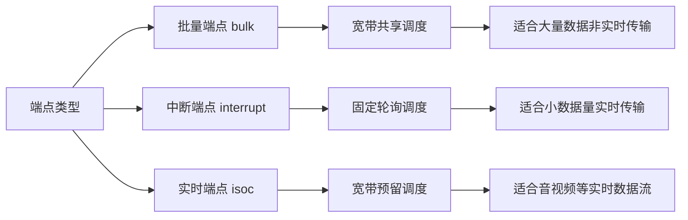

# @ohos.usbManager (USB管理)

<!--Kit: Basic Services Kit-->
<!--Subsystem: USB-->
<!--Owner: @hwymlgitcode-->
<!--Designer: @w00373942-->
<!--Tester: @dong-dongzhen-->
<!--Adviser: @fang-jinxu-->

本模块主要提供管理USB设备的相关功能，包括主机端的查询USB设备列表、批量数据传输、控制命令传输、权限控制等；设备端的端口管理、功能切换及查询等。适用于需要与USB设备进行通信的场景，解决了设备连接、数据传输和权限管理的复杂性问题，为开发者提供统一的USB设备访问接口，降低开发难度，提升开发效率。

>  **说明：**
> 
> 本模块同时支持ArkTS-Dyn、ArkTS-Sta。
> 本模块首批接口从API version 9开始支持。后续版本的新增接口，采用上角标单独标记接口的起始版本。


## 导入模块

```ts
import usbManager from '@ohos.usbManager';
```

## 使用说明

凡是参数类型为[USBDevicePipe](#usbdevicepipe)的接口,都需要执行如下操作：
 
**在使用接口前：**

1. 调用[usbManager.getDevices](#usbmanagergetdevices)获取设备列表。

2. 调用[usbManager.requestRight](#usbmanagerrequestright)获取请求权限。

3. 调用[usbManager.connectDevice](#usbmanagerconnectdevice)得到USBDevicePipe作为参数。

**在使用接口后：**

调用[usbManager.closePipe](#usbmanagerclosepipe)关闭设备消息控制通道。


## usbManager.getDevices

getDevices(): Array&lt;Readonly&lt;USBDevice&gt;&gt;

获取接入主设备的USB设备列表。如果没有设备接入，那么将会返回一个空的列表。调用成功后返回已连接设备的详细信息列表包括设备名称、厂商产品信息等。

> **说明：**
>
> 三方应用没有权限获取serial字段读取设备序列号，需要通过[requestRight](#usbmanagerrequestright)申请权限后，自行发起控制传输获取。

**系统能力：**  SystemCapability.USB.USBManager

**ArkTS-Dyn起始版本：** 9

**ArkTS-Sta起始版本：** 23

**返回值：**

| 类型                                                   | 说明      |
| ---------------------------------------------------- | ------- |
| Array&lt;Readonly&lt;[USBDevice](#usbdevice)&gt;&gt; | 设备信息列表。 |

**错误码：**

以下错误码的详细介绍请参见[通用错误码](../errorcode-universal.md)。

| 错误码ID | 错误信息                  |
| -------- | ------------------------- |
| 801      | Capability not supported. |

**示例：**

```ts
let devicesList: Array<usbManager.USBDevice> = usbManager.getDevices();
if (devicesList) {
  console.info(`devicesList = ${JSON.stringify(devicesList)}`);
}
/*
  devicesList 返回的数据结构,此处提供一个简单的示例，如下
  [
    {
      name: "1-1",
      serial: "",
      manufacturerName: "",
      productName: "",
      version: "",
      vendorId: 7531,
      productId: 2,
      clazz: 9,
      subClass: 0,
      protocol: 1,
      devAddress: 1,
      busNum: 1,
      configs: [
        {
          id: 1,
          attributes: 224,
          isRemoteWakeup: true,
          isSelfPowered: true,
          maxPower: 0,
          name: "1-1",
          interfaces: [
            {
              id: 0,
              protocol: 0,
              clazz: 9,
              subClass: 0,
              alternateSetting: 0,
              name: "1-1",
              endpoints: [
                {
                  address: 129,
                  attributes: 3,
                  interval: 12,
                  maxPacketSize: 4,
                  direction: 128,
                  number: 1,
                  type: 3,
                  interfaceId: 0,
                },
              ],
            },
          ],
        },
      ],
    },
  ]
 */
```

## usbManager.connectDevice

connectDevice(device: USBDevice): Readonly&lt;USBDevicePipe&gt;

根据getDevices()返回的设备信息打开USB设备，调用成功后建立设备连接通道，可以进行后续的数据传输和设备控制操作。如果USB服务异常，会返回`undefined`，注意需要对接口返回值做判空处理。

1. 调用[usbManager.getDevices](#usbmanagergetdevices)获取设备信息以及device;
2. 调用[usbManager.requestRight](#usbmanagerrequestright)请求使用该设备的权限。

**系统能力：**  SystemCapability.USB.USBManager

**ArkTS-Dyn起始版本：** 9

**ArkTS-Sta起始版本：** 23

**参数：**

| 参数名 | 类型 | 必填 | 说明 |
| -------- | -------- | -------- | ---------------- |
| device | [USBDevice](#usbdevice) | 是 | USB设备信息，用[getDevices](#usbmanagergetdevices)获取的busNum和devAddress确定设备，当前其它属性（如name、vendorId等）不参与设备匹配。 |

**返回值：**

| 类型 | 说明 |
| -------- | -------- |
| Readonly&lt;[USBDevicePipe](#usbdevicepipe)&gt; | USB设备消息传输通道对象，用于后续的数据传输和设备控制操作。 |

**错误码：**

以下错误码的详细介绍参见[通用错误码](../errorcode-universal.md)和[USB服务错误码](errorcode-usb.md)。

| 错误码ID | 错误信息                                                     |
| -------- | ------------------------------------------------------------ |
| 401      | Parameter error. Possible causes: 1. Mandatory parameters are left unspecified. 2. Incorrect parameter types. <br>**ArkTS模式**：该返回值仅适用于ArkTS-Dyn。|
| 801      | Capability not supported.                                     |
| 14400001 | Access right denied. Call requestRight to get the USBDevicePipe access right first.  |
| 14400004 | Service exception. Possible causes: <br>1. No accessory is plugged in.<br>**ArkTS模式**：该错误码仅适用于ArkTS-Sta。 |
| 14400012 | Transmission I/O error.<br>**ArkTS模式**：该错误码仅适用于ArkTS-Sta。 |

**示例：**

```ts
async function connectDevice() {
  let devicesList: Array<usbManager.USBDevice> = usbManager.getDevices();
  if (!devicesList || devicesList.length == 0) {
    console.info(`device list is empty`);
    return;
  }

  let device: usbManager.USBDevice = devicesList?.[0];
  await usbManager.requestRight(device.name);
  let devicepipe: usbManager.USBDevicePipe = usbManager.connectDevice(device);
  console.info(`devicepipe = ${devicepipe}`);
  usbManager.closePipe(devicepipe);
}
```

## usbManager.hasRight

hasRight(deviceName: string): boolean

判断是否有权访问该设备。

如果“使用者”（如各种App或系统）有权访问设备则返回true；无权访问设备则返回false。

**系统能力：**  SystemCapability.USB.USBManager

**ArkTS-Dyn起始版本：** 9

**ArkTS-Sta起始版本：** 23

**参数：**

| 参数名 | 类型 | 必填 | 说明 |
| -------- | -------- | -------- | -------- |
| deviceName | string | 是 | 来自[getDevices](#usbmanagergetdevices)获取的设备列表USBDevice里的name。 |

**返回值：**

| 类型 | 说明 |
| -------- | -------- |
| boolean | true表示有访问设备的权限，false表示没有访问设备的权限。|

**错误码：**

以下错误码的详细介绍请参见[通用错误码](../errorcode-universal.md)。

| 错误码ID | 错误信息                                                     |
| -------- | ------------------------------------------------------------ |
| 401      | Parameter error. Possible causes: 1. Mandatory parameters are left unspecified. 2. Incorrect parameter types. <br>**ArkTS模式**：该返回值仅适用于ArkTS-Dyn。|
| 801      | Capability not supported.  |

**示例：**

```ts
async function hasRight(): boolean {
  let devicesList: Array<usbManager.USBDevice> = usbManager.getDevices();
  if (!devicesList || devicesList.length == 0) {
    console.info(`device list is empty`);
    return false;
  }

  let device: usbManager.USBDevice = devicesList?.[0];
  await usbManager.requestRight(device.name);
  let right: boolean = usbManager.hasRight(device.name);
  console.info(`${right}`);
  return right;
}
```

## usbManager.requestRight

requestRight(deviceName: string): Promise&lt;boolean&gt;

请求软件包的临时权限以访问设备。使用Promise异步回调。系统应用默认拥有访问设备权限，无需调用此接口申请。

**系统能力：**  SystemCapability.USB.USBManager

**ArkTS-Dyn起始版本：** 9

**ArkTS-Sta起始版本：** 23

**参数：**

| 参数名 | 类型 | 必填 | 说明 |
| -------- | -------- | -------- | -------- |
| deviceName | string | 是 | 设备名称，来自[getDevices](#usbmanagergetdevices)获取的设备列表USBDevice里的name。|

**返回值：**

| 类型 | 说明 |
| -------- | -------- |
| Promise&lt;boolean&gt; | Promise对象，返回临时权限的申请结果。返回true表示临时权限申请成功；返回false则表示临时权限申请失败。|

**错误码：**

以下错误码的详细介绍请参见[通用错误码](../errorcode-universal.md)。

| 错误码ID | 错误信息                                                     |
| -------- | ------------------------------------------------------------ |
| 401      | Parameter error. Possible causes: 1. Mandatory parameters are left unspecified. 2. Incorrect parameter types. <br>**ArkTS模式**：该错误码仅适用于ArkTS-Dyn。|
| 801      |  Capability not supported.  | 

**示例：**

```ts
async function requestRight() {
  let devicesList: Array<usbManager.USBDevice> = usbManager.getDevices();
  if (!devicesList || devicesList.length == 0) {
    console.info(`device list is empty`);
    return;
  }

  let device: usbManager.USBDevice = devicesList?.[0];
  await usbManager.requestRight(device.name).then(ret => {
    console.info(`requestRight = ${ret}`);
  }).catch((error: BusinessError) => {
    console.error(`Failed to request right. Code: ${error.code}, message: ${error.message}`);
  });
}
```

## usbManager.removeRight

removeRight(deviceName: string): boolean

移除软件包访问设备的权限。系统应用默认拥有访问设备权限，调用此接口不会产生影响。

**系统能力：**  SystemCapability.USB.USBManager

**ArkTS-Dyn起始版本：** 9

**ArkTS-Sta起始版本：** 23

**参数：**

| 参数名 | 类型 | 必填 | 说明 |
| -------- | -------- | -------- | -------- |
| deviceName | string | 是 | 来自[getDevices](#usbmanagergetdevices)获取的设备列表USBDevice里的name。|

**返回值：**

| 类型 | 说明 |
| -------- | -------- |
| boolean | 返回权限移除结果。返回true表示权限移除成功；返回false则表示权限移除失败。|

**错误码：**

以下错误码的详细介绍请参见[通用错误码](../errorcode-universal.md)。

| 错误码ID | 错误信息                                                     |
| -------- | ------------------------------------------------------------ |
| 401      | Parameter error. Possible causes: 1. Mandatory parameters are left unspecified. 2. Incorrect parameter types. <br>**ArkTS模式**：该返回值仅适用于ArkTS-Dyn。|
| 801      | Capability not supported.                                   |

**示例：**

```ts
function removeRight(): boolean {
  let devicesList: Array<usbManager.USBDevice> = usbManager.getDevices();
  if (!devicesList || devicesList.length == 0) {
    console.info(`device list is empty`);
    return false;
  }

  let device: usbManager.USBDevice = devicesList?.[0];
  if (usbManager.removeRight(device.name)) {
    console.info(`Succeed in removing right`);
    return true;
  }
  return false;
}
```

## usbManager.claimInterface

ArkTS-Dyn: claimInterface(pipe: USBDevicePipe, iface: USBInterface, force ?: boolean): number

ArkTS-Sta: claimInterface(pipe: USBDevicePipe, iface: USBInterface, force ?: boolean): int

声明对USB设备某个接口的控制权。调用成功后应用程序获得该接口的独占控制权可以进行数据传输等操作，其他程序无法访问该接口。使用完后需调用[releaseInterface](#usbmanagerreleaseinterface)释放该接口的控制权。

**使用场景**：在需要进行USB数据传输时，需要先声明接口控制权以独占访问该接口。例如，在USB存储设备读写、USB摄像头数据采集、USB串口通信等场景中，都需要先声明接口控制权。

> **说明：**
>
> 在USB编程中，claim interface是一个常见操作，指的是应用程序请求操作系统将某个USB接口从内核驱动中释放并交由用户空间程序控制。<br>
> 下面用到的claim通信接口都表示claim interface操作。

**系统能力：**  SystemCapability.USB.USBManager

**ArkTS-Dyn起始版本：** 9

**ArkTS-Sta起始版本：** 23

**参数：**

| 参数名 | 类型 | 必填 | 说明 |
| -------- | -------- | -------- | -------- |
| pipe | [USBDevicePipe](#usbdevicepipe) | 是 | 用于确定总线地址和设备地址，需要调用[connectDevice](#usbmanagerconnectdevice)获取。|
| iface | [USBInterface](#usbinterface) | 是 | 用于确定需要获取控制的接口对象，需要调用[getDevices](#usbmanagergetdevices)获取设备信息并通过id确定唯一接口。|
| force | boolean | 否 | 可选参数，是否强制获取。默认值为false，表示不强制获取；设置为true时，将强制从内核驱动或其他程序中释放该接口的控制权并交由用户空间程序控制。如果接口已被其他程序占用，使用true可强制获取但可能导致该程序功能异常；如果接口未被占用，建议使用false以避免不必要的强制操作。用户按需选择。|

**返回值：**

| 类型 | 说明 |
| -------- | -------- |
| ArkTS-Dyn: number<br> ArkTS-Sta: int | 注册通信接口成功返回0；注册通信接口失败返回其他错误码如下：<br>- 88080389：服务未启动，可能原因：1.无设备插入；2.服务异常退出。<br>- 88080486：服务初始化中，请稍后重试。<br>- 88080488：无设备访问权限，请先调用[requestRight](#usbmanagerrequestright)接口申请授权。<br>- -1：驱动异常。可能原因：1、设备连接不稳定或已断开；2、USB驱动加载失败；3、内核USB模块异常。 |

**错误码：**

以下错误码的详细介绍请参见[通用错误码](../errorcode-universal.md)。

| 错误码ID | 错误信息                                                     |
| -------- | ------------------------------------------------------------ |
| 401      | Parameter error. Possible causes: 1. Mandatory parameters are left unspecified. 2. Incorrect parameter types. <br>**ArkTS模式**：该返回值仅适用于ArkTS-Dyn。|
| 801      | Capability not supported. |

**示例：**

```ts
async function claimInterface() {
  let devicesList: Array<usbManager.USBDevice> = usbManager.getDevices();
  if (!devicesList || devicesList.length == 0) {
    console.info(`device list is empty`);
    return;
  }

  let device: usbManager.USBDevice = devicesList?.[0];
  await usbManager.requestRight(device.name);
  let devicepipe: usbManager.USBDevicePipe = usbManager.connectDevice(device);
  let interfaces: usbManager.USBInterface = device.configs?.[0]?.interfaces?.[0];
  let ret: int = usbManager.claimInterface(devicepipe, interfaces);
  console.info(`claimInterface = ${ret}`);
  ret = usbManager.releaseInterface(devicepipe, interfaces);
  console.info(`releaseInterface = ${ret}`);
  usbManager.closePipe(devicepipe);
}
```

## usbManager.releaseInterface
ArkTS-Dyn: releaseInterface(pipe: USBDevicePipe, iface: USBInterface): number

ArkTS-Sta: releaseInterface(pipe: USBDevicePipe, iface: USBInterface): int

释放注册过的通信接口。

> **说明：**
>
> 在调用该接口前需要通过[usbManager.claimInterface](#usbmanagerclaiminterface) claim通信接口。

**系统能力：**  SystemCapability.USB.USBManager

**ArkTS-Dyn起始版本：** 9

**ArkTS-Sta起始版本：** 23

**参数：**

| 参数名 | 类型 | 必填 | 说明 |
| -------- | -------- | -------- | -------- |
| pipe | [USBDevicePipe](#usbdevicepipe) | 是 | 用于确定总线地址和设备地址，需要调用[connectDevice](#usbmanagerconnectdevice)获取。|
| iface | [USBInterface](#usbinterface) | 是 | 用于确定需要释放控制的接口对象，需要调用[getDevices](#usbmanagergetdevices)获取设备信息并通过id确定唯一接口。|

**返回值：**

| 类型 | 说明 |
| -------- | -------- |
| ArkTS-Dyn: number<br> ArkTS-Sta: int | 释放接口成功返回0；释放接口失败返回其它错误码如下：<br>- 88080389：服务未启动，可能原因：1.无设备插入；2.服务异常退出。<br>- 88080486：服务初始化中，请稍后重试。<br>- 88080488：无设备访问权限，请先调用[requestRight](#usbmanagerrequestright)接口申请授权。<br>- -1：驱动异常。可能原因：1、设备连接不稳定或已断开；2、USB驱动加载失败；3、内核USB模块异常。|

**错误码：**

以下错误码的详细介绍请参见[通用错误码](../errorcode-universal.md)。

| 错误码ID | 错误信息                                                     |
| -------- | ------------------------------------------------------------ |
| 401      | Parameter error. Possible causes: 1. Mandatory parameters are left unspecified. 2. Incorrect parameter types. <br>**ArkTS模式**：该返回值仅适用于ArkTS-Dyn。|
| 801      | Capability not supported.                              |

**示例：**

```ts
async function releaseInterface() {
  let devicesList: Array<usbManager.USBDevice> = usbManager.getDevices();
  if (!devicesList || devicesList.length == 0) {
    console.info(`device list is empty`);
    return;
  }

  let device: usbManager.USBDevice = devicesList?.[0];
  await usbManager.requestRight(device.name);
  let devicepipe: usbManager.USBDevicePipe = usbManager.connectDevice(device);
  let interfaces: usbManager.USBInterface = device.configs?.[0]?.interfaces?.[0];
  let ret: int = usbManager.claimInterface(devicepipe, interfaces);
  ret = usbManager.releaseInterface(devicepipe, interfaces);
  console.info(`releaseInterface = ${ret}`);
  usbManager.closePipe(devicepipe);
}
```

## usbManager.setConfiguration

ArkTS-Dyn: setConfiguration(pipe: USBDevicePipe, config: USBConfiguration): number

ArkTS-Sta: setConfiguration(pipe: USBDevicePipe, config: USBConfiguration): int

设置设备配置。

**系统能力：**  SystemCapability.USB.USBManager

**ArkTS-Dyn起始版本：** 9

**ArkTS-Sta起始版本：** 23

**参数：**

| 参数名 | 类型 | 必填 | 说明 |
| -------- | -------- | -------- | -------- |
| pipe | [USBDevicePipe](#usbdevicepipe) | 是 | 用于确定总线地址和设备地址，需要调用[connectDevice](#usbmanagerconnectdevice)获取。|
| config | [USBConfiguration](#usbconfiguration) | 是 | 用于确定需要设置的配置，需要调用[getDevices](#usbmanagergetdevices)获取设备信息并通过id确定唯一配置。|

**返回值：**

| 类型 | 说明 |
| -------- | -------- |
| ArkTS-Dyn: number<br> ArkTS-Sta: int | 返回设置设备配置操作的结果。设置设备配置成功返回0；设置设备配置失败返回其它错误码如下：<br>- 88080389：服务未启动，可能原因：1.无设备插入；2.服务异常退出。<br>- 88080486：服务初始化中，请稍后重试。<br>- 88080488：无设备访问权限，请先调用[requestRight](#usbmanagerrequestright)接口申请授权。<br>- -1：驱动异常。可能原因：1、设备连接不稳定或已断开；2、USB驱动加载失败；3、内核USB模块异常。<br>- -17：I/O失败。|

**错误码：**

以下错误码的详细介绍请参见[通用错误码](../errorcode-universal.md)。

| 错误码ID | 错误信息                                                     |
| -------- | ------------------------------------------------------------ |
| 401      | Parameter error. Possible causes: 1. Mandatory parameters are left unspecified. 2. Incorrect parameter types. <br>**ArkTS模式**：该返回值仅适用于ArkTS-Dyn。|
| 801      | Capability not supported.  |

**示例：**

```ts
async function setConfiguration() {
  let devicesList: Array<usbManager.USBDevice> = usbManager.getDevices();
  if (!devicesList || devicesList.length == 0) {
    console.info(`device list is empty`);
    return;
  }

  let device: usbManager.USBDevice = devicesList?.[0];
  await usbManager.requestRight(device.name);
  let devicepipe: usbManager.USBDevicePipe = usbManager.connectDevice(device);
  let config: usbManager.USBConfiguration = device.configs?.[0];
  let ret: int = usbManager.setConfiguration(devicepipe, config);
  console.info(`setConfiguration = ${ret}`);
  usbManager.closePipe(devicepipe);
}
```

## usbManager.setInterface

ArkTS-Dyn: setInterface(pipe: USBDevicePipe, iface: USBInterface): number

ArkTS-Sta: setInterface(pipe: USBDevicePipe, iface: USBInterface): int

设置设备接口。

> **说明：**
>
> 一个USB接口可能存在多重选择模式，支持动态切换。使用的场景：数据传输时，通过该接口可重新设置端点，使端点与传输类型匹配。
>
> 在调用该接口前需要通过[usbManager.claimInterface](#usbmanagerclaiminterface) claim通信接口。

**系统能力：**  SystemCapability.USB.USBManager

**ArkTS-Dyn起始版本：** 9

**ArkTS-Sta起始版本：** 23

**参数：**

| 参数名 | 类型 | 必填 | 说明 |
| -------- | -------- | -------- | -------- |
| pipe | [USBDevicePipe](#usbdevicepipe) | 是 | 用于确定总线地址和设备地址，需要调用[connectDevice](#usbmanagerconnectdevice)获取。|
| iface | [USBInterface](#usbinterface)   | 是 | 用于确定需要设置的接口，需要调用[getDevices](#usbmanagergetdevices)获取设备信息，通过接口的id和alternateSetting共同确定唯一接口，其中id为接口的唯一标识符，alternateSetting用于在同一接口的多个可选模式间切换，为0时表示不支持可选模式。|

**返回值：**

| 类型 | 说明 |
| -------- | -------- |
| ArkTS-Dyn: number<br> ArkTS-Sta: int | 返回设置设备接口操作的结果。设置设备接口成功返回0；设置设备接口失败返回其它错误码如下：<br>- 88080389：服务未启动，可能原因：1.无设备插入；2.服务异常退出。<br>- 88080486：服务初始化中，请稍后重试。<br>- 88080488：无设备访问权限，请先调用[requestRight](#usbmanagerrequestright)接口申请授权。<br>- -1：驱动异常。可能原因：1、设备连接不稳定或已断开；2、USB驱动加载失败；3、内核USB模块异常。|

**错误码：**

以下错误码的详细介绍请参见[通用错误码](../errorcode-universal.md)。

| 错误码ID | 错误信息                                                     |
| -------- | ------------------------------------------------------------ |
| 401      | Parameter error. Possible causes: 1. Mandatory parameters are left unspecified. 2. Incorrect parameter types. <br>**ArkTS模式**：该返回值仅适用于ArkTS-Dyn。|
| 801      | Capability not supported.  |

**示例：**

```ts
async function setInterface() {
  let devicesList: Array<usbManager.USBDevice> = usbManager.getDevices();
  if (!devicesList || devicesList.length == 0) {
    console.info(`device list is empty`);
    return;
  }

  let device: usbManager.USBDevice = devicesList?.[0];
  await usbManager.requestRight(device.name);
  let devicepipe: usbManager.USBDevicePipe = usbManager.connectDevice(device);
  let interfaces: usbManager.USBInterface = device.configs?.[0]?.interfaces?.[0];
  let ret: int = usbManager.claimInterface(devicepipe, interfaces);
  ret = usbManager.setInterface(devicepipe, interfaces);
  console.info(`setInterface = ${ret}`);
  usbManager.closePipe(devicepipe);
}
```

## usbManager.getRawDescriptor

getRawDescriptor(pipe: USBDevicePipe): Uint8Array

获取原始的USB描述符。如果USB服务异常，可能返回`undefined`，注意需要对接口返回值做判空处理。

**系统能力：**  SystemCapability.USB.USBManager

**ArkTS-Dyn起始版本：** 9

**ArkTS-Sta起始版本：** 23

**参数：**

| 参数名 | 类型 | 必填 | 说明 |
| -------- | -------- | -------- | -------- |
| pipe | [USBDevicePipe](#usbdevicepipe) | 是 | 用于确定总线地址和设备地址，需要调用[connectDevice](#usbmanagerconnectdevice)获取。|

**返回值：**

| 类型 | 说明 |
| -------- | -------- |
| Uint8Array | 返回获取的原始数据；失败返回undefined。 |

**错误码：**

以下错误码的详细介绍请参见[通用错误码](../errorcode-universal.md)。

| 错误码ID | 错误信息                                                     |
| -------- | ------------------------------------------------------------ |
| 401      | Parameter error. Possible causes: 1. Mandatory parameters are left unspecified. 2. Incorrect parameter types. <br>**ArkTS模式**：该返回值仅适用于ArkTS-Dyn。|
| 801      | Capability not supported. |
| 14400001 | Access right denied. Call requestRight to get the USBDevicePipe access right first.<br>**ArkTS模式**：该返回值仅适用于ArkTS-Sta。|
| 14400004 | Service exception. Possible causes: 1. No accessory is plugged in. <br>**ArkTS模式**：该返回值仅适用于ArkTS-Sta。|

**示例：**

```ts
async function getRawDescriptor() {
  let devicesList: Array<usbManager.USBDevice> = usbManager.getDevices();
  if (!devicesList || devicesList.length == 0) {
    console.info(`device list is empty`);
    return;
  }

  await usbManager.requestRight(devicesList?.[0]?.name);
  let devicepipe: usbManager.USBDevicePipe = usbManager.connectDevice(devicesList?.[0]);
  usbManager.getRawDescriptor(devicepipe);
  usbManager.closePipe(devicepipe);
}
```

## usbManager.getFileDescriptor

ArkTS-Dyn: getFileDescriptor(pipe: USBDevicePipe): number

ArkTS-Sta: getFileDescriptor(pipe: USBDevicePipe): int

获取文件描述符。如果USB服务异常，可能返回错误码，注意需要对接口返回值做判空或错误码检查处理。

**系统能力：**  SystemCapability.USB.USBManager

**ArkTS-Dyn起始版本：** 9

**ArkTS-Sta起始版本：** 23

**参数：**

| 参数名 | 类型 | 必填 | 说明 |
| -------- | -------- | -------- | -------- |
| pipe | [USBDevicePipe](#usbdevicepipe) | 是 | 用于确定总线地址和设备地址，需要调用[connectDevice](#usbmanagerconnectdevice)获取。|

**返回值：**

| 类型     | 说明                   |
| ------ | -------------------- |
| ArkTS-Dyn: number<br> ArkTS-Sta: int | 返回设备对应的文件描述符，失败返回其它错误码如下：<br>- 88080486：服务初始化中，请稍后重试。<br>- 88080488：无设备访问权限，请先调用[requestRight](#usbmanagerrequestright)接口申请授权。<br>- -1：驱动异常。可能原因：1、设备连接不稳定或已断开；2、USB驱动加载失败；3、内核USB模块异常。|

**错误码：**

以下错误码的详细介绍请参见[通用错误码](../errorcode-universal.md)。

| 错误码ID | 错误信息                                                     |
| -------- | ------------------------------------------------------------ |
| 401      | Parameter error. Possible causes: 1. Mandatory parameters are left unspecified. 2. Incorrect parameter types. <br>**ArkTS模式**：该返回值仅适用于ArkTS-Dyn。|
| 801      | Capability not supported.                                    |

**示例：**

```ts
async function getFileDescriptor() {
  let devicesList: Array<usbManager.USBDevice> = usbManager.getDevices();
  if (!devicesList || devicesList.length == 0) {
    console.info(`device list is empty`);
    return;
  }

  await usbManager.requestRight(devicesList?.[0]?.name);
  let devicepipe: usbManager.USBDevicePipe = usbManager.connectDevice(devicesList?.[0]);
  let ret: int = usbManager.getFileDescriptor(devicepipe);
  console.info(`getFileDescriptor = ${ret}`);
  let closeRet: int = usbManager.closePipe(devicepipe);
  console.info(`closePipe = ${closeRet}`);
}
```

## usbManager.usbControlTransfer<sup>12+</sup>

ArkTS-Dyn: usbControlTransfer(pipe: USBDevicePipe, requestparam: USBDeviceRequestParams, timeout?: number): Promise&lt;number&gt;


ArkTS-Sta: usbControlTransfer(pipe: USBDevicePipe, requestparam: USBDeviceRequestParams, timeout?: int): Promise&lt;int&gt;

**系统能力：**  SystemCapability.USB.USBManager

**ArkTS-Dyn起始版本：** 12

**ArkTS-Sta起始版本：** 23

**参数：**

| 参数名 | 类型 | 必填 | 说明 |
| -------- | -------- | -------- | -------- |
| pipe | [USBDevicePipe](#usbdevicepipe) | 是 | 用于确定总线地址和设备地址，需要调用[connectDevice](#usbmanagerconnectdevice)获取。 |
| requestparam | [USBDeviceRequestParams](#usbdevicerequestparams12) | 是 | 控制传输参数，包含bmRequestType、bRequest、wValue、wIndex、wLength、data等字段，参数传参类型请参考USB协议规范，根据具体设备和控制请求类型设置。 |
| timeout | ArkTS-Dyn: number<br> ArkTS-Sta: int | 否 | 超时时间（单位：毫秒），可选参数，指定时间内等待控制传输完成，若在指定时间内传输完成则正常返回，否则返回超时；默认值为0，表示无限等待直到传输完成。用户按需选择。取值范围：[0, +∞)。 |

**返回值：**

| 类型 | 说明 |
| -------- | -------- |
| ArkTS-Dyn: Promise&lt;number&gt;<br> ArkTS-Sta: Promise&lt;int&gt; | Promise对象，获取传输或接收到的数据块大小。失败返回其它错误码如下：<br>- -1：驱动异常。可能原因：1、设备连接不稳定或已断开；2、USB驱动加载失败；3、内核USB模块异常。|

**错误码：**

以下错误码的详细介绍请参见[通用错误码](../errorcode-universal.md)。

| 错误码ID | 错误信息                                                     |
| -------- | ------------------------------------------------------------ |
| 401      | Parameter error.Possible causes: 1. Mandatory parameters are left unspecified. 2. Incorrect parameter types.<br>**ArkTS模式**：该错误码仅适用于ArkTS-Dyn。|
| 801      | Capability not supported.                                    |

**示例：**

```ts
// 控制传输参数：根据USB协议规范、设备描述符或设备规格文档设置各字段值
// bmRequestType：请求控制类型，常见取值0x00(标准设备请求)、0x01(类请求)、0x02(厂商请求)
// bRequest：具体控制请求命令（如获取描述符、设置地址等）
// wValue：请求参数内容
// wIndex：请求参数的索引值
// wLength：数据长度
// data：用于写入或读取的缓冲区
let param: usbManager.USBDeviceRequestParams = {
  bmRequestType: 0x80,
  bRequest: 0x06,
  wValue: 0x01 << 8 | 0,
  wIndex: 0,
  wLength: 18,
  data: new Uint8Array(18)
};

async function usbControlTransfer() {
  let devicesList: Array<usbManager.USBDevice> = usbManager.getDevices();
  if (!devicesList || devicesList.length == 0) {
    console.info(`device list is empty`);
    return;
  }

  await usbManager.requestRight(devicesList?.[0]?.name);
  let devicepipe: usbManager.USBDevicePipe = usbManager.connectDevice(devicesList?.[0]);
  usbManager.usbControlTransfer(devicepipe, param).then((ret: int) => {
    console.info(`usbControlTransfer = ${ret}`);
  }).catch((error: BusinessError) => {
    console.error(`usbControlTransfer failed: ${error.code}, message: ${error.message}`);
  }).finally(() => {
    usbManager.closePipe(devicepipe);
  });
}
```

## usbManager.bulkTransfer

ArkTS-Dyn: bulkTransfer(pipe: USBDevicePipe, endpoint: USBEndpoint, buffer: Uint8Array, timeout?: number): Promise&lt;number&gt;

ArkTS-Sta: bulkTransfer(pipe: USBDevicePipe, endpoint: USBEndpoint, buffer: Uint8Array, timeout?: int): Promise&lt;int&gt;

批量传输。调用成功后完成批量数据传输，返回实际传输或接收到的数据块大小。使用Promise异步回调。与usbSubmitTransfer相比，bulkTransfer适合简单的批量传输场景，通过独立参数直接传递数据和端点，使用Promise异步返回结果；usbSubmitTransfer适合需要更灵活控制的场景，通过UsbDataTransferParams对象封装参数，支持异步callback回调，并可通过usbCancelTransfer取消传输请求。

> **说明：** 
>
> 单次批量传输的传输数据总量（包括pipe、endpoint、buffer、timeout）请控制在200KB以下，数据总量过大会导致传输失败返回-1。
>
> 在调用接口前需要通过[usbManager.claimInterface](#usbmanagerclaiminterface) claim通信接口。

**系统能力：**  SystemCapability.USB.USBManager

**ArkTS-Dyn起始版本：** 9

**ArkTS-Sta起始版本：** 23

**参数：**

| 参数名 | 类型 | 必填 | 说明 |
| -------- | -------- | -------- | -------- |
| pipe | [USBDevicePipe](#usbdevicepipe) | 是 | 用于确定总线地址和设备地址，需要调用[connectDevice](#usbmanagerconnectdevice)获取。|
| endpoint | [USBEndpoint](#usbendpoint) | 是 | 用于确定传输的端口，需要调用[getDevices](#usbmanagergetdevices)获取设备信息列表。通过endpoint的address确定端点地址，direction用于确定端点的传输方向（0表示输出，128表示输入），interfaceId用于确定所属接口，当前其它属性不做处理。|
| buffer | Uint8Array | 是 | 用于写入或读取数据的缓冲区，数组长度即为缓冲区大小。用于批量传输时写入或读取数据。 |
| timeout | ArkTS-Dyn: number<br> ArkTS-Sta: int | 否 | 超时时间（单位：毫秒），可选参数，指定时间内等待批量传输完成，若在指定时间内传输完成则正常返回，否则返回超时；默认值为0，表示无限等待直到传输完成。用户按需选择。取值范围：[0, +∞)。 |

**返回值：**

| 类型 | 说明 |
| -------- | -------- |
| ArkTS-Dyn: Promise&lt;number&gt;<br> ArkTS-Sta: Promise&lt;int&gt; | Promise对象，获取传输或接收到的数据块大小。失败返回其它错误码如下：<br>- -1：驱动异常。可能原因：1、设备连接不稳定或已断开；2、USB驱动加载失败；3、内核USB模块异常。|

**错误码：**

以下错误码的详细介绍请参见[通用错误码](../errorcode-universal.md)。

| 错误码ID | 错误信息                                                     |
| -------- | ------------------------------------------------------------ |
| 401      | Parameter error. Possible causes: 1. Mandatory parameters are left unspecified. 2. Incorrect parameter types.<br>**ArkTS模式**：该错误码仅适用于ArkTS-Dyn。|
| 801      | Capability not supported. |

**示例：**

> **说明：** 
>
> 以下示例代码只是调用bulkTransfer接口的必要流程，实际调用时，设备开发者需要遵循设备相关协议进行调用，确保数据的正确传输和设备的兼容性。

```ts
// usbManager.getDevices 接口返回数据集合，取其中一个设备对象，并获取权限。
// 把获取到的设备对象作为参数传入usbManager.connectDevice;当usbManager.connectDevice接口成功返回之后；
// 才可以调用第三个接口usbManager.claimInterface.当usbManager.claimInterface 调用成功以后,再调用该接口。
async function bulkTransfer() {
  let devicesList: Array<usbManager.USBDevice> = usbManager.getDevices();
  if (!devicesList || devicesList.length == 0) {
    console.info(`device list is empty`);
    return;
  }

  let device: usbManager.USBDevice = devicesList?.[0];
  await usbManager.requestRight(device.name);
  if (!usbManager.hasRight(device.name)) {
    console.error(`request right fail`);
    return;
  }
  let devicepipe: usbManager.USBDevicePipe = usbManager.connectDevice(device);
  for (let i = 0; i < device.configs?.[0]?.interfaces.length; i++) {
    if (device.configs?.[0]?.interfaces?.[i]?.endpoints?.[0]?.attributes == 2) {
      let endpoint: usbManager.USBEndpoint = device.configs?.[0]?.interfaces?.[i]?.endpoints?.[0];
      let interfaces: usbManager.USBInterface = device.configs?.[0]?.interfaces?.[i];
      usbManager.claimInterface(devicepipe, interfaces);
      let buffer =  new Uint8Array(128);
      usbManager.bulkTransfer(devicepipe, endpoint, buffer).then((ret: int) => {
        console.info(`bulkTransfer = ${ret}`);
        if (i === device.configs?.[0]?.interfaces.length - 1) {
          usbManager.closePipe(devicepipe);
        }
      }).catch((error: BusinessError) => {
        console.error(`Failed to transfer. Code: ${error.code}, message: ${error.message}`);
      });
    }
  }
  usbManager.closePipe(devicepipe);
}
```

## usbManager.usbSubmitTransfer<sup>18+</sup>

usbSubmitTransfer(transfer: UsbDataTransferParams): void

提交异步传输请求，调用后立即返回，实际读写操作的结果以回调的方式返回。可通过调用[usbCancelTransfer](#usbmanagerusbcanceltransfer18)接口取消异步传输请求。

> **说明：**
>
> 本接口为异步接口，调用后立刻返回，实际读写操作的结果以回调的方式返回。
>
> 在调用该接口前需要通过[usbManager.claimInterface](#usbmanagerclaiminterface) claim通信接口。

**系统能力：**  SystemCapability.USB.USBManager

**ArkTS-Dyn起始版本：** 18

**ArkTS-Sta起始版本：** 23

**参数：**

| 参数名 | 类型 | 必填 | 说明 |
| -------- | -------- | -------- | -------- |
| transfer | [UsbDataTransferParams](#usbdatatransferparams18) | 是 | 作为通用USB数据传输接口，客户端需要填充这个对象中的参数，用以发起传输请求。在调用该接口前需要通过[usbManager.claimInterface](#usbmanagerclaiminterface) claim通信接口。|

**错误码：**

以下错误码的详细介绍请参见[通用错误码](../errorcode-universal.md)和[USB服务错误码](errorcode-usb.md)。

| 错误码ID | 错误信息                                                     |
| -------- | ------------------------------------------------------------ |
| 801 | Capability not supported. |
| 14400001 | Access right denied. Call requestRight to get the USBDevicePipe access right first. |
| 14400007 | Resource busy. Possible causes: 1. The transfer has already been submitted. 2. The interface is claimed by another program or driver.|
| 14400008 | No such device (it may have been disconnected). |
| 14400009 | Insufficient memory. Possible causes: 1. Memory allocation failed. |
| 14400012 | Transmission I/O error. |

**示例：**

> **说明：** 
>
> 以下示例代码需要放入具体的方法中执行，只是调用usbSubmitTransfer接口的必要流程，实际调用时，设备开发者需要遵循设备相关协议进行调用，确保数据的正确传输和设备的兼容性。

<!--code_no_check-->
```ts
import { BusinessError } from '@kit.BasicServiceKit';
// usbManager.getDevices 接口返回数据集合，取其中一个设备对象，并获取权限。
// 把获取到的设备对象作为参数传入usbManager.connectDevice;当usbManager.connectDevice接口成功返回之后；
// 才可以调用第三个接口usbManager.claimInterface.当usbManager.claimInterface 调用成功以后,再调用该接口。
async function usbSubmitTransfer() {
  let devicesList: Array<usbManager.USBDevice> = usbManager.getDevices();
  if (!devicesList || devicesList.length == 0) {
    console.info(`device list is empty`);
    return;
  }
  let device: usbManager.USBDevice = devicesList?.[0];
  await usbManager.requestRight(device.name);
  if (!usbManager.hasRight(device.name)) {
    console.info(`request right fail`);
    return;
  }
  let devicepipe: usbManager.USBDevicePipe = usbManager.connectDevice(device);
  // 获取endpoint端点地址。
  let endpoint = device.configs?.[0]?.interfaces?.[0]?.endpoints.find((value) => {
    return value.direction === 0 && value.type === 2
  })
  // 获取设备的第一个id。
  usbManager.claimInterface(devicepipe, device.configs?.[0]?.interfaces?.[0], true);

  let transferParams: usbManager.UsbDataTransferParams = {
    devPipe: devicepipe,
    flags: usbManager.UsbTransferFlags.USB_TRANSFER_SHORT_NOT_OK,
    endpoint: 1,
    type: usbManager.UsbEndpointTransferType.TRANSFER_TYPE_BULK,
    timeout: 2000,
    length: 10, 
    callback: () => {},
    userData: new Uint8Array(10),
    buffer: new Uint8Array(10),
    isoPacketCount: 0,
  };
  try {
    transferParams.endpoint=endpoint?.address as int;
    transferParams.callback=(err, callBackData: usbManager.SubmitTransferCallback)=>{
      console.info('callBackData =' +JSON.stringify(callBackData));
    }
    usbManager.usbSubmitTransfer(transferParams); 
    console.info('USB transfer request submitted.');
  } catch (error) {
    console.error('USB transfer failed:', error);
  }
  usbManager.closePipe(devicepipe);
}
```

## usbManager.usbCancelTransfer<sup>18+</sup>

usbCancelTransfer(transfer: UsbDataTransferParams): void

取消异步传输请求。

> **说明：**
>
> 该接口的主要作用是主动取消尚未完成的USB数据传输请求（如usbSubmitTransfer提交的传输）。<br>
> 在调用该接口前需要通过[usbManager.claimInterface](#usbmanagerclaiminterface) claim通信接口。

**系统能力：**  SystemCapability.USB.USBManager

**ArkTS-Dyn起始版本：** 18

**ArkTS-Sta起始版本：** 23

**参数：**

| 参数名 | 类型 | 必填 | 说明 |
| -------- | -------- | -------- | -------- |
| transfer | [UsbDataTransferParams](#usbdatatransferparams18) | 是 | 被取消传输的参数，该参数与[usbManager.usbSubmitTransfer](#usbmanagerusbsubmittransfer18)接口的transfer参数相同。在调用该接口前需要通过[usbManager.claimInterface](#usbmanagerclaiminterface) claim通信接口。|

**错误码：**

以下错误码的详细介绍请参见[通用错误码](../errorcode-universal.md)和[USB服务错误码](errorcode-usb.md)。

| 错误码ID | 错误信息                                                     |
| -------- | ------------------------------------------------------------ |
| 801 | Capability not supported. |
| 14400001 | Access right denied. Call requestRight to get the USBDevicePipe access right first. |
| 14400008 | No such device (it may have been disconnected). |
| 14400010 | Other USB error. Possible causes:<br>1. Unrecognized discard error code. |
| 14400011 | The transfer is not in progress, or is already complete or cancelled.|

**示例：**

> **说明：** 
>
> 以下示例代码需要放入具体的方法中执行，只是调用usbCancelTransfer接口的必要流程，实际调用时，设备开发者需要遵循设备相关协议进行调用，确保数据的正确传输和设备的兼容性。

<!--code_no_check-->
```ts
// usbManager.getDevices 接口返回数据集合，取其中一个设备对象，并获取权限。
// 把获取到的设备对象作为参数传入usbManager.connectDevice;当usbManager.connectDevice接口成功返回之后；
// 才可以调用第三个接口usbManager.claimInterface.当usbManager.claimInterface 调用成功以后,再调用该接口。
async function usbCancelTransfer() {
  let devicesList: Array<usbManager.USBDevice> = usbManager.getDevices();
  if (!devicesList || devicesList.length == 0) {
    console.info(`device list is empty`);
    return;
  }
  let device: usbManager.USBDevice = devicesList?.[0];
  await usbManager.requestRight(device.name);
  let devicepipe: usbManager.USBDevicePipe = usbManager.connectDevice(device);
  if (devicepipe === undefined) {
    console.info(`connect device fail`);
    return;
  }
  // 获取endpoint端点地址。
  let endpoint = device.configs?.[0]?.interfaces?.[0]?.endpoints.find((value) => {
    return value.direction === 0 && value.type === 2
  })
  if (endpoint === undefined) {
    console.info(`invalid endpoint`);
    return;
  }
  // 获取设备的第一个id。
  usbManager.claimInterface(devicepipe, device.configs?.[0]?.interfaces?.[0], true);
  let transferParams: usbManager.UsbDataTransferParams = {
    devPipe: devicepipe,
    flags: usbManager.UsbTransferFlags.USB_TRANSFER_SHORT_NOT_OK,
    endpoint: 1,
    type: usbManager.UsbEndpointTransferType.TRANSFER_TYPE_BULK,
    timeout: 2000,
    length: 10, 
    callback: () => {},
    userData: new Uint8Array(10),
    buffer: new Uint8Array(10),
    isoPacketCount: 0,
  };
  try {
    transferParams.endpoint=endpoint?.address as int;
    transferParams.callback=(err, callBackData: usbManager.SubmitTransferCallback)=>{
      console.info('callBackData =' +JSON.stringify(callBackData));
    }
    usbManager.usbSubmitTransfer(transferParams);
    usbManager.usbCancelTransfer(transferParams);
    console.info('USB transfer request submitted.');
  } catch (error) {
    console.error('USB transfer failed:', error);
  }
  usbManager.closePipe(devicepipe);
}
```

## usbManager.closePipe

ArkTS-Dyn: closePipe(pipe: USBDevicePipe): number 

ArkTS-Sta: closePipe(pipe: USBDevicePipe): int 

关闭设备消息控制通道。

1. 调用[usbManager.getDevices](#usbmanagergetdevices)获取设备列表；
2. 调用[usbManager.requestRight](#usbmanagerrequestright)获取设备请求权限；
3. 调用[usbManager.connectDevice](#usbmanagerconnectdevice)得到devicepipe作为参数。

**系统能力：**  SystemCapability.USB.USBManager

**ArkTS-Dyn起始版本：** 9

**ArkTS-Sta起始版本：** 23

**参数：**

| 参数名 | 类型 | 必填 | 说明 |
| -------- | -------- | -------- | -------- |
| pipe | [USBDevicePipe](#usbdevicepipe) | 是 | 用于确定USB设备消息控制通道，需要调用[connectDevice](#usbmanagerconnectdevice)获取。|

**返回值：**

| 类型 | 说明 |
| -------- | -------- |
| ArkTS-Dyn: number<br> ArkTS-Sta: int | 关闭设备消息控制通道成功返回0；关闭设备消息控制通道失败返回其它错误码如下：<br>- 22：服务异常。 |

**错误码：**

以下错误码的详细介绍请参见[通用错误码](../errorcode-universal.md)。

| 错误码ID | 错误信息                                                     |
| -------- | ------------------------------------------------------------ |
| 401      | Parameter error. Possible causes: 1. Mandatory parameters are left unspecified. 2. Incorrect parameter types. <br>**ArkTS模式**：该错误码仅适用于ArkTS-Dyn。|
| 801      | Capability not supported. |

**示例：**

```ts
async function closePipe() {
  let devicesList: Array<usbManager.USBDevice> = usbManager.getDevices();
  if (!devicesList || devicesList.length == 0) {
    console.info(`device list is empty`);
    return;
  }

  await usbManager.requestRight(devicesList?.[0]?.name);
  let devicepipe: usbManager.USBDevicePipe = usbManager.connectDevice(devicesList?.[0]);
  let ret: int = usbManager.closePipe(devicepipe);
  console.info(`closePipe = ${ret}`);
}
```

## usbManager.hasAccessoryRight<sup>14+</sup>

hasAccessoryRight(accessory: USBAccessory): boolean

检查应用程序是否有权访问USB配件。

需要调用[usbManager.getAccessoryList](#usbmanagergetaccessorylist14)获取配件列表，得到[USBAccessory](#usbaccessory14)作为参数。

**系统能力：**  SystemCapability.USB.USBManager

**ArkTS-Dyn起始版本：** 14

**ArkTS-Sta起始版本：** 23

**参数：**

| 参数名    | 类型         | 必填 | 说明                                  |
| --------- | ------------ | ---- | ------------------------------------- |
| accessory | [USBAccessory](#usbaccessory14) | 是   | USB配件，需要通过[getAccessoryList](#usbmanagergetaccessorylist14)获取。 |

**返回值：**

| 类型    | 说明                          |
| ------- | ----------------------------- |
| boolean | true表示应用程序有权访问USB配件，false表示应用程序无权访问USB配件。 |

**错误码：**

以下错误码的详细介绍请参见[通用错误码](../errorcode-universal.md)和[USB服务错误码](errorcode-usb.md)。

| 错误码ID | 错误信息                                                     |
| -------- | ------------------------------------------------------------ |
| 401      | Parameter error. Possible causes: 1. Mandatory parameters are left unspecified. 2. Incorrect parameter types. <br>**ArkTS模式**：该错误码仅适用于ArkTS-Dyn。|
| 801      | Capability not supported. |
| 14400004 | Service exception. Possible causes: 1. No accessory is plugged in.  |
| 14400005 | Database operation exception.  |
| 14401001 | The target USBAccessory not matched. |

**示例：**

```ts
import { hilog } from '@kit.PerformanceAnalysisKit';
try {
  let accList: usbManager.USBAccessory[] = usbManager.getAccessoryList()
  let flag = usbManager.hasAccessoryRight(accList?.[0])
  hilog.info(0, 'testTag ui', `hasAccessoryRight success, ret:${flag}`)
} catch (error) {
  hilog.error(0, 'testTag ui', `hasAccessoryRight error ${error.code}, message is ${error.message}`)
}
```

## usbManager.requestAccessoryRight<sup>14+</sup>

requestAccessoryRight(accessory: USBAccessory): Promise&lt;boolean&gt;

为指定应用程序申请访问USB配件的访问权限。使用Promise异步回调。

需要调用[usbManager.getAccessoryList](#usbmanagergetaccessorylist14)获取配件列表，得到[USBAccessory](#usbaccessory14)作为参数。

**系统能力：**  SystemCapability.USB.USBManager

**ArkTS-Dyn起始版本：** 14

**ArkTS-Sta起始版本：** 23

**参数：**

| 参数名    | 类型         | 必填 | 说明                                  |
| --------- | ------------ | ---- | ------------------------------------- |
| accessory | [USBAccessory](#usbaccessory14) | 是   | USB配件，需要通过[getAccessoryList](#usbmanagergetaccessorylist14)获取。 |

**返回值：**

| 类型             | 说明                          |
| ---------------- | ----------------------------- |
| Promise&lt;boolean&gt; | Promise对象，返回应用程序访问配件权限的申请结果。返回true表示权限申请成功；返回false表示权限申请失败。 |

**错误码：**

以下错误码的详细介绍请参见[通用错误码](../errorcode-universal.md)和[USB服务错误码](errorcode-usb.md)。

| 错误码ID | 错误信息                                                     |
| -------- | ------------------------------------------------------------ |
| 401      | Parameter error. Possible causes: 1. Mandatory parameters are left unspecified. 2. Incorrect parameter types. <br>**ArkTS模式**：该错误码仅适用于ArkTS-Dyn。|
| 801      | Capability not supported. |
| 14400004 | Service exception. Possible causes: 1. No accessory is plugged in.  |
| 14400005 | Database operation exception. |
| 14401001 | The target USBAccessory not matched. |

**示例：**

```ts
import { hilog } from '@kit.PerformanceAnalysisKit';
try {
  let accList: usbManager.USBAccessory[] = usbManager.getAccessoryList()
  let flag = usbManager.requestAccessoryRight(accList?.[0])
  hilog.info(0, 'testTag ui', `requestAccessoryRight success, ret:${flag}`)
} catch (error) {
  hilog.error(0, 'testTag ui', `requestAccessoryRight error ${error.code}, message is ${error.message}`)
}
```

## usbManager.cancelAccessoryRight<sup>14+</sup>

cancelAccessoryRight(accessory: USBAccessory): void

取消当前应用程序访问USB配件的权限。与requestAccessoryRight()方法配合使用，用于取消此前通过requestAccessoryRight()申请的配件访问权限。

需要调用[usbManager.getAccessoryList](#usbmanagergetaccessorylist14)获取配件列表，得到[USBAccessory](#usbaccessory14)作为参数。

**系统能力：**  SystemCapability.USB.USBManager

**ArkTS-Dyn起始版本：** 14

**ArkTS-Sta起始版本：** 23

**参数：**

| 参数名    | 类型         | 必填 | 说明                                  |
| --------- | ------------ | ---- | ------------------------------------- |
| accessory | [USBAccessory](#usbaccessory14) | 是   | USB配件，需要通过[getAccessoryList](#usbmanagergetaccessorylist14)获取。 |

**错误码：**

以下错误码的详细介绍请参见[通用错误码](../errorcode-universal.md)和[USB服务错误码](errorcode-usb.md)。

| 错误码ID | 错误信息                                                     |
| -------- | ------------------------------------------------------------ |
| 401      | Parameter error. Possible causes: 1. Mandatory parameters are left unspecified. 2. Incorrect parameter types. <br>**ArkTS模式**：该错误码仅适用于ArkTS-Dyn。|
| 801      | Capability not supported.                                    |
| 14400004 | Service exception. Possible causes: 1. No accessory is plugged in. |
| 14400005 | Database operation exception.                                |
| 14401001 | The target USBAccessory not matched.                         |

**示例：**

```ts
import { hilog } from '@kit.PerformanceAnalysisKit';
try {
  let accList: usbManager.USBAccessory[] = usbManager.getAccessoryList()
  let flag = usbManager.requestAccessoryRight(accList?.[0])
  if (!flag) {
    return
  }
  usbManager.cancelAccessoryRight(accList?.[0])
  hilog.info(0, 'testTag ui', `cancelAccessoryRight success`)
} catch (error) {
  hilog.error(0, 'testTag ui', `cancelAccessoryRight error ${error.code}, message is ${error.message}`)
}
```

## usbManager.getAccessoryList<sup>14+</sup>

getAccessoryList(): Array<Readonly&lt;USBAccessory&gt;>

获取当前已接入主机的USB配件列表。

**系统能力：**  SystemCapability.USB.USBManager

**ArkTS-Dyn起始版本：** 14

**ArkTS-Sta起始版本：** 23

**返回值：**

| 类型                          | 说明                                               |
| ----------------------------- | -------------------------------------------------- |
| Array<Readonly&lt;[USBAccessory](#usbaccessory14)&gt;> | 只读的USB配件列表。包含所有可用的USB配件信息。 |

**错误码：**

以下错误码的详细介绍请参见[通用错误码](../errorcode-universal.md)和[USB服务错误码](errorcode-usb.md)。

| 错误码ID | 错误信息                                                     |
| -------- | ------------------------------------------------------------ |
| 801      | Capability not supported.                                    |
| 14400004 | Service exception. Possible causes: 1. No accessory is plugged in. |

**示例：**

```ts
import { hilog } from '@kit.PerformanceAnalysisKit';
try {
  let accList: usbManager.USBAccessory[] = usbManager.getAccessoryList()
  hilog.info(0, 'testTag ui', `getAccessoryList success, accList: ${JSON.stringify(accList)}`)
} catch (error) {
  hilog.error(0, 'testTag ui', `getAccessoryList error ${error.code}, message is ${error.message}`)
}
```

## usbManager.openAccessory<sup>14+</sup>

openAccessory(accessory: USBAccessory): USBAccessoryHandle

获取配件句柄并打开配件文件描述符。之后可以通过CoreFileKit提供的read/write接口和配件进行通信。使用完后需要调用[closeAccessory](#usbmanagercloseaccessory14)接口关闭文件描述符。

需要调用[usbManager.getAccessoryList](#usbmanagergetaccessorylist14)获取配件列表，得到[USBAccessory](#usbaccessory14)作为参数。

**系统能力：**  SystemCapability.USB.USBManager

**ArkTS-Dyn起始版本：** 14

**ArkTS-Sta起始版本：** 23

**参数：**

| 参数名    | 类型         | 必填 | 说明                                  |
| --------- | ------------ | ---- | ------------------------------------- |
| accessory | [USBAccessory](#usbaccessory14) | 是   | USB配件，需要通过[getAccessoryList](#usbmanagergetaccessorylist14)获取。 |

**返回值：**

| 类型               | 说明        |
| ------------------ | ----------- |
| [USBAccessoryHandle](#usbaccessoryhandle14) | USB配件句柄。 |

**错误码：**

以下错误码的详细介绍请参见[通用错误码](../errorcode-universal.md)和[USB服务错误码](errorcode-usb.md)。

| 错误码ID | 错误信息                                                     |
| -------- | ------------------------------------------------------------ |
| 401      | Parameter error. Possible causes: 1. Mandatory parameters are left unspecified. 2. Incorrect parameter types.<br>**ArkTS模式**：该错误码仅适用于ArkTS-Dyn。|
| 801      | Capability not supported.                                    |
| 14400001 | Access right denied. Call requestRight to get the USBDevicePipe access right first. |
| 14400004 | Service exception. Possible causes: 1. No accessory is plugged in. |
| 14401001 | The target USBAccessory not matched.                         |
| 14401002 | Failed to open the native accessory node.                    |
| 14401003 | Cannot reopen the accessory.                                 |

**示例：**

```ts
import { hilog } from '@kit.PerformanceAnalysisKit';
import { fileIo } from '@kit.CoreFileKit';
try {
  let accList: usbManager.USBAccessory[] = usbManager.getAccessoryList()
  let flag = usbManager.requestAccessoryRight(accList?.[0])
  if (!flag) {
    return
  }
  let handle = usbManager.openAccessory(accList?.[0])
  hilog.info(0, 'testTag ui', `openAccessory success`)
  let arrayBuffer = new ArrayBuffer(4096);
  let readLength = fileIo.readSync(handle.accessoryFd, arrayBuffer, {offset: 0, length: 4096});
  hilog.info(0, 'testTag ui', 'readSync ret: ' + readLength.toString(10));
} catch (error) {
  hilog.error(0, 'testTag ui', `openAccessory error ${error.code}, message is ${error.message}`)
}
```

## usbManager.closeAccessory<sup>14+</sup>

closeAccessory(accessoryHandle: USBAccessoryHandle): void

关闭配件文件描述符。

需要调用[usbManager.getAccessoryList](#usbmanagergetaccessorylist14)获取配件列表，然后调用[usbManager.openAccessory](#usbmanageropenaccessory14)获取配件句柄，得到[USBAccessoryHandle](#usbaccessoryhandle14)作为参数。

**系统能力：**  SystemCapability.USB.USBManager

**ArkTS-Dyn起始版本：** 14

**ArkTS-Sta起始版本：** 23

**参数：**

| 参数名          | 类型               | 必填 | 说明                                   |
| --------------- | ------------------ | ---- | -------------------------------------- |
| accessoryHandle | [USBAccessoryHandle](#usbaccessoryhandle14) | 是   | USB配件句柄。需要通过[openAccessory](#usbmanageropenaccessory14)获取。 |

**错误码：**

以下错误码的详细介绍请参见[通用错误码](../errorcode-universal.md)和[USB服务错误码](errorcode-usb.md)。

| 错误码ID | 错误信息                                                     |
| -------- | ------------------------------------------------------------ |
| 401      | Parameter error. Possible causes: 1. Mandatory parameters are left unspecified. 2. Incorrect parameter types. |
| 801      | Capability not supported.                                    |
| 14400004 | Service exception. Possible causes: 1. No accessory is plugged in. |

**示例：**

```ts
import { hilog } from '@kit.PerformanceAnalysisKit';
try {
  let accList: usbManager.USBAccessory[] = usbManager.getAccessoryList()
  let flag = usbManager.requestAccessoryRight(accList?.[0])
  if (!flag) {
    return
  }
  let handle = usbManager.openAccessory(accList?.[0])
  usbManager.closeAccessory(handle)
  hilog.info(0, 'testTag ui', `closeAccessory success`)
} catch (error) {
  hilog.error(0, 'testTag ui', `closeAccessory error ${error.code}, message is ${error.message}`)
}
```

## usbManager.resetUsbDevice<sup>20+</sup>

resetUsbDevice(pipe: USBDevicePipe): boolean

重置USB外设。

> **说明：**
>
> 本接口调用后会重置此前设置的配置和接口设置，请在调用之前确认相关业务已结束。

1. 调用[usbManager.getDevices](#usbmanagergetdevices)获取设备列表。
2. 调用[usbManager.requestRight](#usbmanagerrequestright)获取设备请求权限。
3. 调用[usbManager.connectDevice](#usbmanagerconnectdevice)得到devicepipe作为参数。

**系统能力：**  SystemCapability.USB.USBManager

**ArkTS-Dyn起始版本：** 20

**ArkTS-Sta起始版本：** 23

**参数：**

| 参数名 | 类型 | 必填 | 说明 |
| -------- | -------- | -------- | -------- |
| pipe | [USBDevicePipe](#usbdevicepipe) | 是 | 用于确定总线地址和设备地址，需要调用[connectDevice](#usbmanagerconnectdevice)获取。|

**返回值：**

| 类型 | 说明 |
| -------- | -------- |
| boolean | true表示重置设备成功，false表示重置设备失败。 |

**错误码：**

以下错误码的详细介绍请参见[通用错误码](../errorcode-universal.md)和[USB服务错误码](errorcode-usb.md)。

| 错误码ID | 错误信息                                                     |
| -------- | ------------------------------------------------------------ |
| 801 | Capability not supported. |
| 14400001 | Access right denied. Call requestRight to get the USBDevicePipe access right first.|
| 14400004 | Service exception. Possible causes: 1. No device is plugged in. |
| 14400008 | No such device (it may have been disconnected). |
| 14400010 | Other USB error. Possible causes:<br>1.Unrecognized discard error code. |
| 14400013 | The USBDevicePipe validity check failed. Possible causes:<br>1. The input parameters fail the validation check.<br>2. The call chain used to obtain the input parameters is not reasonable. |

**示例：**

```ts
async function resetUsbDevice() {
  let devicesList: Array<usbManager.USBDevice> = usbManager.getDevices();
  if (!devicesList || devicesList.length == 0) {
    console.error(`device list is empty`);
    return;
  }

  await usbManager.requestRight(devicesList?.[0]?.name);
  let devicepipe: usbManager.USBDevicePipe = usbManager.connectDevice(devicesList?.[0]);
  try {
    let ret: boolean = usbManager.resetUsbDevice(devicepipe);
    console.info(`resetUsbDevice  = ${ret}`);
  } catch (err: BusinessError) {
    console.error(`Failed to reset USB device. Code: ${err.code}, message: ${err.message}`);
  }
  usbManager.closePipe(devicepipe);
}
```

## usbManager.controlTransfer<sup>(deprecated)</sup>

controlTransfer(pipe: USBDevicePipe, controlparam: USBControlParams, timeout ?: number): Promise&lt;number&gt;

控制传输。使用Promise异步回调。

> **说明：**
>
> 从API version 9开始支持，从API version 12开始废弃。建议使用[usbControlTransfer](#usbmanagerusbcontroltransfer12)替代。

**系统能力：**  SystemCapability.USB.USBManager

**参数：**

| 参数名 | 类型 | 必填 | 说明 |
| -------- | -------- | -------- | -------- |
| pipe | [USBDevicePipe](#usbdevicepipe) | 是 | USB设备消息传输通道对象，用于确定设备，需要调用connectDevice获取。|
| controlparam | [USBControlParams](#usbcontrolparamsdeprecated) | 是 | 控制传输参数，包含request、target、reqType、value、index、data等字段，参数传参类型请参考USB协议规范，根据具体设备和控制请求类型设置。|
| timeout | number | 否 | 超时时间（单位：毫秒），可选参数，指定时间内等待控制传输完成，若在指定时间内传输完成则正常返回，否则返回超时；默认值为0，表示无限等待直到传输完成。用户按需选择。 |

**返回值：**

| 类型 | 说明 |
| -------- | -------- |
| Promise&lt;number&gt; | Promise对象，获取传输或接收到的数据块大小。失败返回其它错误码如下：<br>- -1：驱动异常。|

**错误码：**

以下错误码的详细介绍请参见[通用错误码](../errorcode-universal.md)。

| 错误码ID | 错误信息                                                     |
| -------- | ------------------------------------------------------------ |
| 401      | Parameter error. Possible causes: 1. Mandatory parameters are left unspecified. 2. Incorrect parameter types. |

**示例：**

```ts
let param: usbManager.USBControlParams = {
  request: 0x06,
  reqType: 0x80,
  target:0,
  value: 0x01 << 8 | 0,
  index: 0,
  data: new Uint8Array(18)
};

async function controlTransfer() {
  let devicesList: Array<usbManager.USBDevice> = usbManager.getDevices();
  if (!devicesList || devicesList.length == 0) {
    console.info(`device list is empty`);
    return;
  }

  await usbManager.requestRight(devicesList?.[0]?.name);
  let devicepipe: usbManager.USBDevicePipe = usbManager.connectDevice(devicesList?.[0]);
  usbManager.controlTransfer(devicepipe, param).then((ret: number) => {
  console.info(`controlTransfer = ${ret}`);
  })
  usbManager.closePipe(devicepipe);
}
```

## USBEndpoint

通过USB发送和接收数据的端口。通过[USBInterface](#usbinterface)获取。

>**说明：**
>
> 主机控制器按照Endpoint类型调度，不同类型的端点采用不同的调度策略：批量端点(bulk)采用宽带共享调度适合大量数据非实时传输；中断端点(interrupt)采用固定轮询调度适合小数据量实时传输；实时端点(isochronous)采用宽带预留调度，适合音视频等实时数据流。
>
> 协议层打包时依赖type决定传输特性，包括数据包格式、错误处理机制、超时策略等。



**系统能力：** SystemCapability.USB.USBManager

**ArkTS-Dyn起始版本：** 9

**ArkTS-Sta起始版本：** 23

| 名称            | 类型                                        | 只读  | 可选  |说明            |
| ------------- | ------------------------------------------- | ---- | ---- |------------- |
| address       | ArkTS-Dyn: number<br> ArkTS-Sta: int                                         | 否   | 否 |端点地址。         |
| attributes    | ArkTS-Dyn: number<br> ArkTS-Sta: int                                         | 否   | 否 |端点属性，表示端点的传输特性，包括传输类型（批量、中断、实时、控制）和同步类型等。取值遵循USB端点描述符规范。|
| interval      | ArkTS-Dyn: number<br> ArkTS-Sta: int                                         | 否   | 否 |端点间隔，（单位：毫秒）。中断端点和实时端点为时间间隔（单位：毫秒）；批量端点不使用此字段。|
| maxPacketSize | ArkTS-Dyn: number<br> ArkTS-Sta: int                                         | 否   | 否 |端点最大数据包大小，（单位：字节）。    |
| direction     | [USBRequestDirection](#usbrequestdirection) | 否   | 否 |端点的方向。        |
| number        | ArkTS-Dyn: number                                         | 否   | 否 |端点号。 <br>**ArkTS模式**：该字段仅适用于ArkTS-Dyn。         |
| endpointAddr        | ArkTS-Sta: int                                         | 否   | 否 |端点地址。<br>**ArkTS模式**：该字段仅适用于ArkTS-Sta。           |
| type          | ArkTS-Dyn: number<br> ArkTS-Sta: int                                         | 否   | 否 |端点类型。取值见[UsbEndpointTransferType](#usbendpointtransfertype18)         |
| interfaceId   | ArkTS-Dyn: number<br> ArkTS-Sta: int                                         | 否   | 否 |端点所属的接口的唯一标识。 |

## USBInterface

一个[USBConfiguration](#usbconfiguration)中可以含有多个USBInterface，每个USBInterface提供一个功能。

**系统能力：** SystemCapability.USB.USBManager

**ArkTS-Dyn起始版本：** 9

**ArkTS-Sta起始版本：** 23

| 名称               | 类型                                     | 只读  | 可选            |说明                    |
| ---------------- | ---------------------------------------- | ---- | ------------- |--------------------- |
| id               | ArkTS-Dyn: number<br> ArkTS-Sta: int                                       | 否 | 否 |接口的唯一标识。              |
| protocol         | ArkTS-Dyn: number<br> ArkTS-Sta: int                                       | 否 | 否 |接口的协议。                |
| clazz            | ArkTS-Dyn: number<br> ArkTS-Sta: int                                       | 否 | 否 |设备类型。                 |
| subClass         | ArkTS-Dyn: number<br> ArkTS-Sta: int                                       | 否 | 否 |设备子类。                 |
| alternateSetting | ArkTS-Dyn: number<br> ArkTS-Sta: int                                       | 否 | 否 |接口的替代设置索引号，用于在同一个接口的多个可选描述符中进行切换选择。0表示默认设置，其他值表示特定的替代设置。 |
| name             | string                                   | 否 | 否 |接口名称。                 |
| endpoints        | Array&lt;[USBEndpoint](#usbendpoint)&gt; | 否 | 否 |当前接口所包含的端点。           |

## USBConfiguration

USB配置，一个[USBDevice](#usbdevice)中可以含有多个配置。

**系统能力：** SystemCapability.USB.USBManager

**ArkTS-Dyn起始版本：** 9

**ArkTS-Sta起始版本：** 23

| 名称             | 类型                                             | 只读  | 可选  |说明              |
| -------------- | ------------------------------------------------ | ---- | --------------- |--------------- |
| id             | ArkTS-Dyn: number<br> ArkTS-Sta: int                                           | 否 | 否 |配置的唯一标识。        |
| attributes     | ArkTS-Dyn: number<br> ArkTS-Sta: int                                           | 否 | 否 |配置的属性，取值遵循USB配置描述符规范，用于表示配置的供电方式、远程唤醒能力等特性。|
| maxPower       | ArkTS-Dyn: number<br> ArkTS-Sta: int                                        | 否 | 否 |最大功耗，（单位：毫安）。    |
| name           | string                                           | 否 | 否 |配置的名称，可以为空字符串。     |
| isRemoteWakeup | boolean                                          | 否 | 否 |检查当前配置是否支持远程唤醒。true表示支持，false表示不支持。 |
| isSelfPowered  | boolean                                          | 否 | 否 |检查当前配置是否支持独立电源。true表示支持，false表示不支持。 |
| interfaces     | Array<[USBInterface](#usbinterface)>             | 否 | 否 |配置支持的接口列表。      |

## USBDevice

USB设备信息。

**系统能力：** SystemCapability.USB.USBManager

**ArkTS-Dyn起始版本：** 9

**ArkTS-Sta起始版本：** 23

| 名称               | 类型                                 | 只读  | 可选         |说明         |
| ---------------- | ------------------------------------ | ---- | ---------- |---------- |
| busNum           | ArkTS-Dyn: number<br> ArkTS-Sta: int                                | 否 | 否 |总线地址。      |
| devAddress       | ArkTS-Dyn: number<br> ArkTS-Sta: int                                | 否 | 否 |设备地址。      |
| serial           | string                               | 否 | 否 |序列号。       |
| name             | string                               | 否 | 否 |设备名字。      |
| manufacturerName | string                               | 否 | 否 |设备厂商名称。      |
| productName      | string                               | 否 | 否 |设备产品名称。      |
| version          | string                               | 否 | 否 |设备版本号。        |
| vendorId         | ArkTS-Dyn: number<br> ArkTS-Sta: int                                | 否 | 否 |厂商ID。      |
| productId        | ArkTS-Dyn: number<br> ArkTS-Sta: int                                | 否 | 否 |产品ID。      |
| clazz            | ArkTS-Dyn: number<br> ArkTS-Sta: int                                | 否 | 否 |设备类型代码。       |
| subClass         | ArkTS-Dyn: number<br> ArkTS-Sta: int                                | 否 | 否 |设备子类型代码。      |
| protocol         | ArkTS-Dyn: number<br> ArkTS-Sta: int                                | 否 | 否 |设备协议代码。     |
| configs          | Array&lt;[USBConfiguration](#usbconfiguration)&gt; | 否 | 否 |设备配置描述符信息。 |

## USBDevicePipe

USB设备消息传输通道，用于确定总线地址和设备地址。

**系统能力：** SystemCapability.USB.USBManager

**ArkTS-Dyn起始版本：** 9

**ArkTS-Sta起始版本：** 23

| 名称         | 类型   | 只读  | 可选    |说明    |
| ---------- | ------ | ---- | ----- |----- |
| busNum     | ArkTS-Dyn: number<br> ArkTS-Sta: int  | 否 |否 | 总线地址。 |
| devAddress | ArkTS-Dyn: number<br> ArkTS-Sta: int  | 否 |否 | 设备地址。 |

## USBDeviceRequestParams<sup>12+</sup>

控制传输参数。

**系统能力：** SystemCapability.USB.USBManager

**ArkTS-Dyn起始版本：** 12

**ArkTS-Sta起始版本：** 23


| 名称      | 类型                                            | 只读 | 可选               |说明               |
| ------- | ----------------------------------------------- | ---- | ---------------- |---------------- |
| bmRequestType | ArkTS-Dyn: number<br> ArkTS-Sta: int                                    | 否 | 否   |请求控制类型，用于指定控制传输的方向和类型，取值需遵循USB协议规范，常见取值包括：0x00(标准设备请求)、0x01(类请求)、0x02(厂商请求)。|
| bRequest  | ArkTS-Dyn: number<br> ArkTS-Sta: int                                        | 否 | 否   |请求类型，用于指定具体的USB控制请求命令（如获取描述符，设置地址等）。|
| wValue | ArkTS-Dyn: number<br> ArkTS-Sta: int                                           | 否 | 否   |请求参数，用于向USB设备传递控制请求所需的参数内容。|
| wIndex   | ArkTS-Dyn: number<br> ArkTS-Sta: int         | 否 | 否   |请求参数value对应的索引值，用于指定控制请求的目标接口或端点索引。|
| wLength   | ArkTS-Dyn: number<br> ArkTS-Sta: int                                        | 否 | 否   |请求数据的长度，用于指定控制传输中期望接收或发送的数据字节数。 |
| data    | Uint8Array                                      | 否 | 否   |用于写入或读取的缓冲区，数组长度对应wLength参数指定的数据字节数。用于控制传输时发送或接收数据。|

## USBRequestTargetType

请求目标类型。

**系统能力：** SystemCapability.USB.USBManager

**ArkTS-Dyn起始版本：** 9

**ArkTS-Sta起始版本：** 23

| 名称                         | 值   | 说明   |
| ---------------------------- | ---- | ------ |
| USB_REQUEST_TARGET_DEVICE    | 0    | 设备。 |
| USB_REQUEST_TARGET_INTERFACE | 1    | 接口。 |
| USB_REQUEST_TARGET_ENDPOINT  | 2    | 端点。 |
| USB_REQUEST_TARGET_OTHER     | 3    | 其他。 |

## USBControlRequestType

控制请求类型。

**系统能力：** SystemCapability.USB.USBManager

**ArkTS-Dyn起始版本：** 9

**ArkTS-Sta起始版本：** 23

| 名称                      | 值   | 说明   |
| ------------------------- | ---- | ------ |
| USB_REQUEST_TYPE_STANDARD | 0    | 标准请求类型，用于发送USB协议定义的标准控制请求（如设备描述符、设置地址、设置配置等）。 |
| USB_REQUEST_TYPE_CLASS    | 1    | 类请求类型，用于发送特定设备类定义的控制请求（如HID类、Mass Storage类等特定请求）。   |
| USB_REQUEST_TYPE_VENDOR   | 2    | 厂商请求类型，用于发送厂商自定义的控制请求，具体请求内容由设备厂商定义。 |

## USBRequestDirection

请求方向。

**系统能力：** SystemCapability.USB.USBManager

**ArkTS-Dyn起始版本：** 9

**ArkTS-Sta起始版本：** 23

| 名称                        | 值   | 说明                     |
| --------------------------- | ---- | ------------------------ |
| USB_REQUEST_DIR_TO_DEVICE   | 0    | 写数据，主机向设备。 |
| USB_REQUEST_DIR_FROM_DEVICE | 0x80 | 读数据，设备向主机。 |

## USBAccessory<sup>14+</sup>

USB配件信息。

**系统能力：** SystemCapability.USB.USBManager

**ArkTS-Dyn起始版本：** 14

**ArkTS-Sta起始版本：** 23

| 名称         | 类型   | 只读 | 可选 | 说明             |
| ------------ | ------ | ---- | ---- | ---------------- |
| manufacturer | string | 否 | 否   | 配件的生产厂商。 |
| product      | string | 否 | 否   | 配件的产品类型。 |
| description  | string | 否 | 否   | 配件的描述信息，由厂商提供，用于说明配件的功能、用途或特性。 |
| version      | string | 否 | 否   | 配件的版本。     |
| serialNumber | string | 否 | 否   | 配件的SN号。     |

## USBAccessoryHandle<sup>14+</sup>

USB配件句柄，包含配件文件描述符，用于通过CoreFileKit提供的read/write接口和配件进行通信。

**系统能力：** SystemCapability.USB.USBManager

**ArkTS-Dyn起始版本：** 14

**ArkTS-Sta起始版本：** 23

| 名称        | 类型   | 只读 | 可选 | 说明                                      |
| ----------- | ------ | ---- | ---- | ----------------------------------------- |
| accessoryFd | ArkTS-Dyn: number<br> ArkTS-Sta: int | 否 | 否   | 配件文件描述符。合法的accessoryFd是正整数。 |

## UsbDataTransferParams<sup>18+</sup>

USB数据传输参数对象，包含USB数据传输所需的所有参数，用于usbSubmitTransfer和usbCancelTransfer接口发起传输请求。

**系统能力：** SystemCapability.USB.USBManager

**ArkTS-Dyn起始版本：** 18

**ArkTS-Sta起始版本：** 23

| 名称         | 类型   | 只读  | 可选    |说明    |
| ---------- | ------ | ---- | ----- |----- |
| devPipe | [USBDevicePipe](#usbdevicepipe) | 否 | 否 | 用于确定总线地址和设备地址，需要调用[connectDevice](#usbmanagerconnectdevice)获取。 |
| flags | [UsbTransferFlags](#usbtransferflags18) | 否 |否 | USB传输标志，用于控制传输行为。可选值包括：0（将短帧报告为错误）、1（自动释放传输缓冲区）、2（完成回调后自动传输）、3（传输增加一个额外的数据包）。 |
| endpoint | ArkTS-Dyn: number<br> ArkTS-Sta: int | 否 | 否 | 端点地址，取值范围为[1, 255]的正整数。需要调用[getDevices](#usbmanagergetdevices)获取设备信息，通过endpoint的address属性确定端点信息，通过direction属性确定端点方向。  |
| type | [UsbEndpointTransferType](#usbendpointtransfertype18) | 否 |否 | 传输类型，指定USB传输的方式。可选值包括：0x1（实时传输，适合音视频等实时数据流）、0x2（批量传输，适合大量数据非实时传输）、0x3（中断传输，适合小数据量实时传输）。 |
| timeout | ArkTS-Dyn: number<br> ArkTS-Sta: int | 否 | 否 | 超时时间（单位：毫秒），指定时间内等待传输完成，若在指定时间内传输完成则正常返回否则返回超时。取值范围为[0, +∞)，设置为0时无限等待直到传输完成。 |
| length | ArkTS-Dyn: number<br> ArkTS-Sta: int | 否 |否 | 数据缓冲区的长度，取值范围为[0, INT_MAX]的非负数（期望长度），（单位：字节）。 |
| callback | [AsyncCallback](js-apis-base.md#asynccallback)<[SubmitTransferCallback](#submittransfercallback18)> | 否 |否 | 传输完成时的回调函数，签名：(err: Error, data: SubmitTransferCallback) => void。err为错误对象（成功时为null），data包含传输状态、实际长度等信息。|
| userData | Uint8Array | 否 | 否 | 用户上下文数据，用于在回调函数中传递自定义的上下文信息。大小和格式由用户定义，在传输请求中指定，回调中原样返回。 |
| buffer | Uint8Array | 否 | 否 | 用于存储读或者写请求时的数据。 |
| isoPacketCount | ArkTS-Dyn: number<br> ArkTS-Sta: int | 否 | 否 | 实时传输时数据包的数量，仅用于具有实时传输端点的I/O。取值范围为[0, INT_MAX]的非负数，（单位：个）。 |

## UsbTransferFlags<sup>18+</sup>

USB传输标志。

**系统能力：** SystemCapability.USB.USBManager

**ArkTS-Dyn起始版本：** 18

**ArkTS-Sta起始版本：** 23

| 名称                         | 值   | 说明   |
| ---------------------------- | ---- | ------ |
| USB_TRANSFER_SHORT_NOT_OK    | 0    | 将短帧报告为错误。 |
| USB_TRANSFER_FREE_BUFFER | 1    | 自动释放传输缓冲区。 |
| USB_TRANSFER_FREE_TRANSFER  | 2    | 完成回调后自动释放传输资源。 |
| USB_TRANSFER_ADD_ZERO_PACKET     | 3    | 传输将增加一个额外的数据包。 |

## UsbEndpointTransferType<sup>18+</sup>

Usb传输类型。

**系统能力：** SystemCapability.USB.USBManager

**ArkTS-Dyn起始版本：** 18

**ArkTS-Sta起始版本：** 23

| 名称                         | 值   | 说明   |
| ---------------------------- | ---- | ------ |
| TRANSFER_TYPE_ISOCHRONOUS | 0x1    | 实时传输。 |
| TRANSFER_TYPE_BULK  | 0x2    | 批量传输。 |
| TRANSFER_TYPE_INTERRUPT     | 0x3    | 中断传输。|

## SubmitTransferCallback<sup>18+</sup>

Usb异步传输回调。

**系统能力：** SystemCapability.USB.USBManager

**ArkTS-Dyn起始版本：** 18

**ArkTS-Sta起始版本：** 23

| 名称        | 类型 | 只读 | 可选   | 说明    |
| ---------- | ------ | ---- | ----- | ------ |
| actualLength |  ArkTS-Dyn: number<br> ArkTS-Sta: int | 否 |  否 |读写操作的实际长度值，（单位：字节）。 |
| status | [UsbTransferStatus](#usbtransferstatus18) | 否 | 否 |读写操作完成的状态。 |
| isoPacketDescs | Array<Readonly<[UsbIsoPacketDescriptor](#usbisopacketdescriptor18)>> | 否 | 否 |实时传输的分包信息。 |

## UsbTransferStatus<sup>18+</sup>

数据处理完成后通过回调返回的状态码。

**系统能力：** SystemCapability.USB.USBManager

**ArkTS-Dyn起始版本：** 18

**ArkTS-Sta起始版本：** 23

| 名称                         | 值   | 说明   |
| ---------------------------- | ---- | ------ |
| TRANSFER_COMPLETED    | 0    | 传输完成。|
| TRANSFER_ERROR | 1    | 传输失败。 |
| TRANSFER_TIMED_OUT  | 2    | 传输超时。 |
| TRANSFER_CANCELED     | 3    |传输已被取消。 |
| TRANSFER_STALL  | 4    | 检测到暂停（批量/中断端点）。|
| TRANSFER_NO_DEVICE     | 5    | 设备已断开。|
| TRANSFER_OVERFLOW     | 6    | 设备发送的数据比请求的多。|

## UsbIsoPacketDescriptor<sup>18+</sup>

实时传输模式回调返回的分包信息。

**系统能力：** SystemCapability.USB.USBManager

**ArkTS-Dyn起始版本：** 18

**ArkTS-Sta起始版本：** 23

| 名称         | 类型 | 只读  | 可选 | 说明    |
| ---------- | ------ | ----| ----- | ------ |
| length | ArkTS-Dyn: number<br> ArkTS-Sta: int | 否 | 否 |读写操作的期望长度值，（单位：字节）。 |
| actualLength | ArkTS-Dyn: number<br> ArkTS-Sta: int|否 | 否 |读写操作的实际长度值，（单位：字节）。 |
| status | [UsbTransferStatus](#usbtransferstatus18) | 否 | 否 |实时传输分包的状态码。 |

## USBControlParams<sup>(deprecated)</sup>

控制传输参数。

>**说明：**
>
> 从API version 9开始支持，从API version 18开始废弃。建议使用[USBDeviceRequestParams](#usbmanagerusbdevicerequestparams12)替代。

**系统能力：** SystemCapability.USB.USBManager

| 名称      | 类型                                            | 只读  | 可选               |说明               |
| ------- | ----------------------------------------------- | ---- | ---------------- |---------------- |
| request | number                                          | 否 | 否   |请求类型。            |
| target  | [USBRequestTargetType](#usbrequesttargettype)   | 否 | 否   |请求目标类型。          |
| reqType | [USBControlRequestType](#usbcontrolrequesttype) | 否 | 否   |请求控制类型。          |
| value   | number                                          | 否 | 否   |请求参数。            |
| index   | number                                          | 否 | 否   |请求参数value对应的索引值。 |
| data    | Uint8Array                                      | 否 | 否   |用于写入或读取的缓冲区。     |
