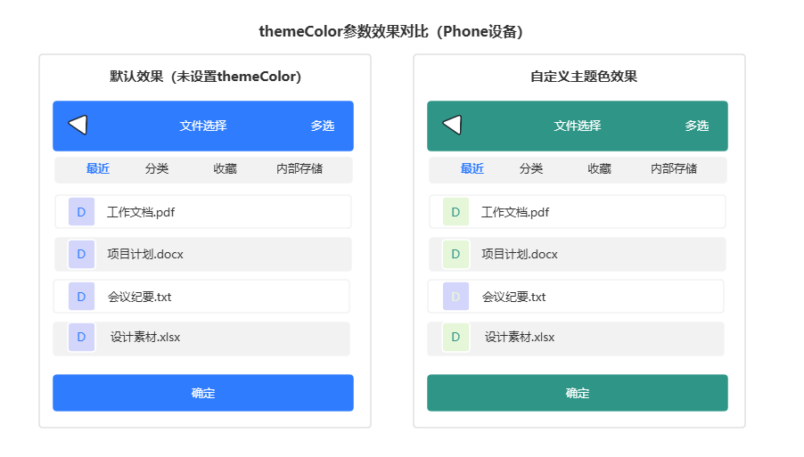

# @ohos.file.picker (选择器)(系统接口)
<!--Kit: Core File Kit-->
<!--Subsystem: FileManagement-->
<!--Owner: @yangwei_814916-->
<!--Designer: @hwzhangchuang; @Dyylll-->
<!--Tester: @zsyztt; @yue-ye2; @fuwei-->
<!--Adviser: @jinqiuheng-->

选择器（Picker）是一个封装了PhotoViewPicker、DocumentViewPicker、AudioViewPicker等API的模块，具有选择与保存的能力。Picker为应用提供安全、统一的文件选择和保存界面，由用户主动选择需要访问的文件，从而保护用户隐私和数据安全。应用可以自行选择使用哪种API实现文件选择和文件保存的功能。该类接口需要应用在UIAbility中调用，否则无法拉起PhotoPicker应用或FilePicker应用。
> **说明：**
>
> - 本模块接口从API version 9开始支持。后续版本如有新增内容，则采用上角标单独标记该内容的起始版本。
> - 当前页面仅包含本模块的系统接口，其他公开接口参见[@ohos.file.picker (选择器)](js-apis-file-picker.md)。

## 导入模块

```ts
import { picker } from '@kit.CoreFileKit';
```

## DocumentSelectOptions

文档选择选项。

**原子化服务API**：从API version 12开始，该接口支持在原子化服务中使用。

**系统接口**：此接口为系统接口。

**系统能力**：SystemCapability.FileManagement.UserFileService

| 名称                    | 类型                                         | 只读  | 可选  | 说明                                     |
| :---------------------- |---------------------------------------------| ---- | ---- |------------------------------------------|
| themeColor<sup>18+</sup>     | [CustomColors](../apis-arkui/js-apis-arkui-theme.md#customcolors) |  否  |  是 |主题色参数，默认为空，跟随FilePicker应用颜色。当themeColor设置为特定的主题色属性（[brand, fontPrimary, fontEmphasize, compBackgroundEmphasize, iconFourth](../apis-arkui/js-apis-arkui-theme.md#colors)）时，被拉起的FilePicker应用将按照传入的主题色参数显示对应的界面配色；设置为其他属性时，不产生适配效果，仍跟随FilePicker应用默认颜色。<br> **设备行为差异**：该参数在Phone设备上可正常生效，在其他设备上设置不产生视觉效果（不影响选择器本身的正常调用）。开发者可通过deviceInfo.deviceType获取设备类型进行判断。<br> <br> 上图为Phone设备上设置themeColor前后的效果对比。 |

## DocumentSaveOptions

文档保存选项。

**原子化服务API**：从API version 12开始，该接口支持在原子化服务中使用。

**系统接口**：此接口为系统接口。

**系统能力**：SystemCapability.FileManagement.UserFileService

| 名称                    | 类型                                          |  只读  | 可选  |说明                                       |
| :---------------------- |---------------------------------------------| ----- |--------| ------------------------------------------|
| themeColor<sup>18+</sup>     | [CustomColors](../apis-arkui/js-apis-arkui-theme.md#customcolors) |  否   | 是 | 主题色参数，默认为空，跟随FilePicker应用颜色。当themeColor设置为特定的主题色属性（[brand, fontPrimary, fontEmphasize, compBackgroundEmphasize, iconFourth](../apis-arkui/js-apis-arkui-theme.md#colors)）时，被拉起的FilePicker应用将按照传入的主题色参数显示对应的界面配色；设置为其他属性时，不产生适配效果，仍跟随FilePicker应用默认颜色。<br> **设备行为差异**：该参数在Phone设备上可正常生效，在其他设备上设置不产生视觉效果（不影响选择器本身的正常调用）。开发者可通过deviceInfo.deviceType获取设备类型进行判断。<br> <br> 上图为Phone设备上设置themeColor前后的效果对比。|
