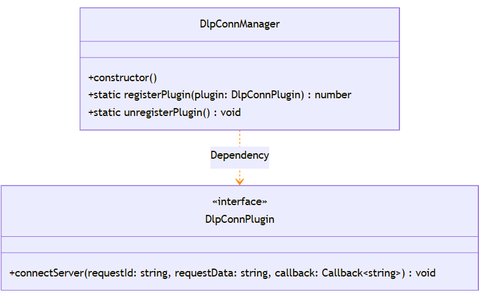

# @ohos.dlpPermission (数据防泄漏)
<!--Kit: Data Protection Kit-->
<!--Subsystem: Security-->
<!--Owner: @winnieHuYu-->
<!--Designer: @QRF-->
<!--Tester: @nacyli-->
<!--Adviser: @zengyawen-->

数据防泄漏（Data Loss Prevention，简称为DLP）是系统级的数据防泄漏解决方案，提供跨设备文件的权限管理、加密存储、授权访问等能力。DLP通过加密技术对敏感文件进行保护，生成.dlp格式的加密文件。当打开DLP文件时，系统会自动创建隔离的DLP沙箱环境，确保文件内容不会泄漏到非授权环境。企业级DLP文件支持细粒度的权限控制，包括查看、编辑、复制、打印、截屏等操作权限的管理。

**使用场景**： 
- 企业办公场景下，保护敏感文档不被非授权访问和泄露。
- 多设备协同办公，确保文档在不同设备间的安全流转。
- 文档分享与协作，实现细粒度的权限控制。

> **说明：**
>
> - 本模块首批接口从API version 10开始支持。后续版本的新增接口，采用上角标单独标记接口的起始版本。
> - @ohos.dlpPermission归属的Kit已由`DataLossPreventionKit`变更为`DataProtectionKit`，建议开发者使用新模块名`@kit.DataProtectionKit`完成模块导入。如果使用`@kit.DataLossPreventionKit`导入，仅能调用改名前的接口，无法使用新增接口。

## 关键Class/Interface介绍

### 核心枚举类型
- **ActionFlagType**：DLP 文件可执行操作类型的标志枚举，用于细粒度权限控制。
- **DLPFileAccess**：DLP 文件授权类型枚举，定义文件的访问级别。
- **ActionType**：文件权限到期后执行动作的枚举。
- **AccountType**：授权账号类型枚举。

### 核心接口类型

- **CustomProperty**：表示自定义策略，包含企业定制策略的JSON字符串和企业DLP文件的查询选项。
- **DLPProperty**：表示授权相关信息，包含权限设置者账号、权限设置者账号的ID和权限设置者账号类型等。
- **AuthUser**：表示授权用户数据，包含被授权用户账号、被授权用户账号类型和被授予的权限等。
- **DlpConnPlugin**：用于注册云端认证回调能力的接口，包含连接服务器方法（参数：请求标识、请求数据、回调函数）。

### 核心回调类型

- **Callback\<AccessedDLPFileInfo>**：DLP文件访问信息回调，用于监听DLP文件打开事件。
- **AsyncCallback\<DLPPermissionInfo>**：DLP权限信息异步回调，用于返回沙箱权限查询结果。
- **AsyncCallback\<Array\<RetentionSandboxInfo>>**：保留沙箱信息列表异步回调，用于返回沙箱查询结果。
- **AsyncCallback\<Array\<AccessedDLPFileInfo>>**：DLP文件访问记录列表异步回调，用于返回文件访问历史。

### 核心类

- **DlpConnManager**：是数据防泄漏系统的核心管理类，在SA（System Ability）中注册或注销回调能力。



## API组合使用关系说明

| 首次调用 | 配对调用 | 说明 |
|---------|---------|------|
| on('openDLPFile', listener) | off('openDLPFile', listener) | 订阅DLP文件打开事件，在页面销毁或不再需要时取消订阅以释放资源 |
| DlpConnManager.registerPlugin() | DlpConnManager.unregisterPlugin() | 在SA中注册回调能力，在应用退出或不再需要时注销能力 |
| setRetentionState() | cancelRetentionState() | 设置沙箱保留状态以便快速重新打开文件，不再需要时取消保留以释放系统资源 |
| setSandboxAppConfig() | cleanSandboxAppConfig() | 设置沙箱应用自定义配置，使用完毕后清理配置恢复默认状态 |
| generateDlpFileForEnterprise() | decryptDlpFile() | 将明文文件加密生成企业DLP文件，或将DLP文件解密还原为明文文件，两者互为逆向操作 |
| setSandboxAppConfig() | getSandboxAppConfig() | 设置沙箱配置后，通过查询接口验证配置是否生效或读取当前配置状态 |
| isInSandbox() | getDLPPermissionInfo() | 判断当前处于沙箱环境后，再调用权限查询接口获取具体权限信息以控制应用行为 |
| isDLPFile() | getOriginalFileName() | 判断文件为DLP文件后，获取原始文件名以确定文件类型并选择合适的应用打开 |
| isDLPFeatureProvided() | generateDlpFileForEnterprise() 或 startDLPManagerForResult() | 确认系统支持DLP加密特性后，再调用相关功能接口，避免在不支持的设备上执行失败 |

## 导入模块

```ts
import { dlpPermission } from '@kit.DataProtectionKit';
```

## dlpPermission.isDLPFile

isDLPFile(fd: number): Promise&lt;boolean&gt;

根据文件的fd，查询该文件是否是DLP文件。使用Promise异步回调。

在文件处理流程中，需要先判断文件是否为DLP文件，再决定后续处理策略（如是否需要通过DLP沙箱打开）。

**系统能力：** SystemCapability.Security.DataLossPrevention

**参数：**

| 参数名 | 类型 | 必填 | 说明 |
| -------- | -------- | -------- | -------- |
| fd | number | 是 | 待查询文件的fd（文件描述符）。取值范围为[0, 2<sup>31</sup>-1]。当fd小于0时，函数返回false；当fd大于2<sup>31</sup>-1时，fd的值被截断。|

**返回值：**
| 类型 | 说明 |
| -------- | -------- |
| Promise&lt;boolean&gt; | Promise对象。返回true表示是DLP文件，返回false表示非DLP文件。 |

**错误码：**

以下错误码的详细介绍请参见[通用错误码说明文档](../errorcode-universal.md)和[DLP服务错误码](errorcode-dlp.md)。

| 错误码ID | 错误信息 |
| -------- | -------- |
| 401 | Parameter error. Possible causes: 1. Mandatory parameters are left unspecified. 2. Incorrect parameter types. |
| 19100001 | Invalid parameter value. |
| 19100011 | The system ability works abnormally. |

**示例：**

```ts
import { dlpPermission } from '@kit.DataProtectionKit';
import { fileIo } from '@kit.CoreFileKit';

let uri = "file://docs/storage/Users/currentUser/Documents/test.txt.dlp";
let file: number | undefined = undefined;
file = fileIo.openSync(uri).fd;
dlpPermission.isDLPFile(file).then((isDLPFile: boolean) => {
    console.info(JSON.stringify(isDLPFile));
}).catch((error: BusinessError)=> {
    console.error(error.message);
}).finally(()=> {
    if (file !== undefined) {
        fileIo.closeSync(file);
    }
});
```

## dlpPermission.isDLPFile

isDLPFile(fd: number, callback: AsyncCallback&lt;boolean&gt;): void

根据文件的fd，查询该文件是否是DLP文件。调用成功后返回查询结果，true表示是DLP文件，false表示非DLP文件。使用callback异步回调。

在文件处理流程中，需要先判断文件是否为DLP文件，再决定后续处理策略（如是否需要通过DLP沙箱打开）。

**系统能力：** SystemCapability.Security.DataLossPrevention

**参数：**

| 参数名 | 类型 | 必填 | 说明 |
| -------- | -------- | -------- | -------- |
| fd | number | 是 | 待查询文件的fd（文件描述符）。取值范围为[0, 2<sup>31</sup>-1]。当fd小于0时，函数返回false；当fd大于2<sup>31</sup>-1时，fd的值被截断。 |
| callback | AsyncCallback&lt;boolean&gt; | 是 | 回调函数，用于接收查询结果。回调参数包括：err（错误对象，查询成功时为undefined）和res（查询结果，返回true表示是DLP文件，返回false表示非DLP文件）。 |

**错误码：**

以下错误码的详细介绍请参见[通用错误码说明文档](../errorcode-universal.md)和[DLP服务错误码](errorcode-dlp.md)。

| 错误码ID | 错误信息 |
| -------- | -------- |
| 401 | Parameter error. Possible causes: 1. Mandatory parameters are left unspecified. 2. Incorrect parameter types. |
| 19100001 | Invalid parameter value. |
| 19100011 | The system ability works abnormally. |

**示例：**

```ts
import { dlpPermission } from '@kit.DataProtectionKit';
import { fileIo } from '@kit.CoreFileKit';

let uri = "file://docs/storage/Users/currentUser/Desktop/test.txt.dlp";
let file: number | undefined = undefined;
file = fileIo.openSync(uri).fd;
dlpPermission.isDLPFile(file, (err, isDLPFile) => {
 if (err != undefined) {
    console.error('isDLPFile error,', err.code, err.message);
  } else {
    console.info('isDLPFile:', isDLPFile);
  }
  fileIo.closeSync(file);
});
```

## dlpPermission.getDLPPermissionInfo

getDLPPermissionInfo(): Promise&lt;DLPPermissionInfo&gt;

查询当前DLP沙箱的权限信息，包括文件授权类型及可执行操作（如查看、编辑、复制等）。仅支持在DLP沙箱应用中调用，使用Promise异步回调。

在DLP沙箱中处理文件时，可根据权限信息判断当前用户可以执行哪些操作，避免调用无权限的功能。

**系统能力：** SystemCapability.Security.DataLossPrevention

**返回值：**

| 类型 | 说明 |
| -------- | -------- |
| Promise&lt;[DLPPermissionInfo](#dlppermissioninfo)&gt; | Promise对象。返回查询的DLP文件的权限信息，无异常则表明查询成功。 |

**错误码：**

以下错误码的详细介绍请参见[DLP服务错误码](errorcode-dlp.md)。

| 错误码ID | 错误信息 |
| -------- | -------- |
| 19100001 | Invalid parameter value. |
| 19100006 | No permission to call this API, which is available only for DLP sandbox applications. |
| 19100011 | The system ability works abnormally. |

**示例：**

```ts
import { dlpPermission } from '@kit.DataProtectionKit';

dlpPermission.isInSandbox().then(async (inSandbox) => { // 是否在沙箱内。
  if (inSandbox) {
    dlpPermission.getDLPPermissionInfo().then((permissionInfo: dlpPermission.DLPPermissionInfo) => {
      console.info('permissionInfo', JSON.stringify(permissionInfo));
    }).catch((error: BusinessError)=> {
      console.error(JSON.stringify(error));
    })
  }
});
```

## dlpPermission.getDLPPermissionInfo

getDLPPermissionInfo(callback: AsyncCallback&lt;DLPPermissionInfo&gt;): void

查询当前DLP沙箱的权限信息。返回的权限信息包括文件的授权类型和可执行的操作权限(如查看、编辑、复制等)。仅支持在DLP沙箱应用中调用。使用callback异步回调。

在DLP沙箱中处理文件时，可根据权限信息判断当前用户可以执行哪些操作，避免调用无权限的功能。

**系统能力：** SystemCapability.Security.DataLossPrevention

**参数：**

| 参数名 | 类型 | 必填 | 说明 |
| -------- | -------- | -------- | -------- |
| callback | AsyncCallback&lt;[DLPPermissionInfo](#dlppermissioninfo)&gt; | 是 | 回调函数。err为undefined时表示查询成功；否则为错误对象。 |

**错误码：**

以下错误码的详细介绍请参见[通用错误码说明文档](../errorcode-universal.md)和[DLP服务错误码](errorcode-dlp.md)。

| 错误码ID | 错误信息 |
| -------- | -------- |
| 401 | Parameter error. Possible causes: 1. Incorrect parameter types. |
| 19100001 | Invalid parameter value. |
| 19100006 | No permission to call this API, which is available only for DLP sandbox applications. |
| 19100011 | The system ability works abnormally. |

**示例：**

```ts
import { dlpPermission } from '@kit.DataProtectionKit';

dlpPermission.isInSandbox().then((inSandbox) => { // 是否在沙箱内。
  if (inSandbox) {
    dlpPermission.getDLPPermissionInfo((err, permissionInfo) => { 
      if (err != undefined) {
        console.error('getDLPPermissionInfo error', err.code, err.message);
      } else {
        console.info('permissionInfo', JSON.stringify(permissionInfo));
      }
    }); // 获取当前权限信息。
  }
});
```

## dlpPermission.getOriginalFileName

getOriginalFileName(fileName: string): string

获取指定DLP文件名的原始文件名。该接口为同步接口。

根据原始文件名后缀判断文件类型，选择对应的应用打开。

**系统能力：** SystemCapability.Security.DataLossPrevention

**参数：**

| 参数名 | 类型 | 必填 | 说明 |
| -------- | -------- | -------- | -------- |
| fileName | string | 是 | 指定要查询的DLP文件名。长度范围[1, 255]字节，超出此范围抛出错误码19100001。 |

**返回值：**

| 类型 | 说明 |
| -------- | -------- |
| string | 返回DLP文件的原始文件名。例如：DLP文件名为test.txt.dlp，则返回的原始文件名为test.txt。不超过255字节。 |

**错误码：**

以下错误码的详细介绍请参见[DLP服务错误码](errorcode-dlp.md)。

| 错误码ID | 错误信息 |
| -------- | -------- |
| 19100001 | Invalid parameter value. |
| 19100011 | The system ability works abnormally. |

**示例：**

```ts
import { dlpPermission } from '@kit.DataProtectionKit';

let originalFileName = dlpPermission.getOriginalFileName('test.txt.dlp'); // 获取原始文件名。
console.info('originalFileName:', originalFileName);
```

## dlpPermission.getDLPSuffix

getDLPSuffix(): string

获取DLP文件扩展名。调用成功后返回DLP文件扩展名（如'.dlp'）。接口为同步接口。

用于获取DLP文件的标准扩展名，便于构建DLP文件名或进行文件类型判断。

**系统能力：** SystemCapability.Security.DataLossPrevention

**返回值：**

| 类型 | 说明 |
| -------- | -------- |
| string | 返回DLP文件扩展名。例如：原文件"test.txt"，加密后的DLP文件名为"test.txt.dlp"，返回扩展名为".dlp"。 |

**错误码：**

以下错误码的详细介绍请参见[DLP服务错误码](errorcode-dlp.md)。

| 错误码ID | 错误信息 |
| -------- | -------- |
| 19100011 | The system ability works abnormally. |

**示例：**

```ts
import { dlpPermission } from '@kit.DataProtectionKit';

let dlpSuffix = dlpPermission.getDLPSuffix(); // 获取DLP扩展名。
console.info('dlpSuffix:', dlpSuffix);
```

## dlpPermission.on('openDLPFile')

on(type: 'openDLPFile', listener: Callback&lt;AccessedDLPFileInfo&gt;): void

监听打开DLP文件。调用成功后，当DLP文件被打开时会触发回调通知当前应用。仅支持在非DLP沙箱应用中调用。

 当应用需要在DLP文件打开后执行特定操作(如记录日志、更新界面)时，可注册该监听。

**系统能力：** SystemCapability.Security.DataLossPrevention

**参数：**

| 参数名 | 类型 | 必填 | 说明 |
| -------- | -------- | -------- | -------- |
| type | 'openDLPFile' | 是 | 监听事件类型。固定值为'openDLPFile'：打开DLP文件事件。 |
| listener | Callback&lt;[AccessedDLPFileInfo](#accesseddlpfileinfo)&gt; | 是 | DLP文件打开事件的回调。在当前应用的沙箱应用打开DLP文件时，通知当前应用。 |

**错误码：**

以下错误码的详细介绍请参见[通用错误码说明文档](../errorcode-universal.md)和[DLP服务错误码](errorcode-dlp.md)。

| 错误码ID | 错误信息 |
| -------- | -------- |
| 401 | Parameter error. Possible causes: 1. Mandatory parameters are left unspecified. 2. Incorrect parameter types. 3. Parameter verification failed. |
| 19100001 | Invalid parameter value. |
| 19100007 | No permission to call this API, which is available only for non-DLP sandbox applications. |
| 19100011 | The system ability works abnormally. |

**示例：**

```ts
import { dlpPermission } from '@kit.DataProtectionKit';

dlpPermission.on('openDLPFile', (info: dlpPermission.AccessedDLPFileInfo) => {
  console.info('openDlpFile event', info.uri, info.lastOpenTime);
}); // 注册DLP文件打开事件监听。
```

## dlpPermission.off('openDLPFile')

off(type: 'openDLPFile', listener?: Callback&lt;AccessedDLPFileInfo&gt;): void

取消监听打开DLP文件。仅支持在非DLP沙箱应用中调用。调用成功后，将不再接收DLP文件打开事件的通知。

该接口通常在页面销毁或不再需要监听时调用以释放资源。

**系统能力：** SystemCapability.Security.DataLossPrevention

**参数：**
| 参数名 | 类型 | 必填 | 说明 |
| -------- | -------- | -------- | -------- |
| type | 'openDLPFile' | 是 | 监听事件类型。固定值为'openDLPFile'：打开DLP文件事件。 |
| listener | Callback&lt;[AccessedDLPFileInfo](#accesseddlpfileinfo)&gt; | 否 | DLP文件被打开的事件的回调。当需要取消特定回调时传入此参数（传入之前注册的回调函数），当需要取消所有回调时可不传此参数。不传入时默认为空，取消该类型事件的所有回调。  |

**错误码：**

以下错误码的详细介绍请参见[通用错误码说明文档](../errorcode-universal.md)和[DLP服务错误码](errorcode-dlp.md)。

| 错误码ID | 错误信息 |
| -------- | -------- |
| 401 | Parameter error. Possible causes: 1. Mandatory parameters are left unspecified. 2. Incorrect parameter types. 3. Parameter verification failed. |
| 19100001 | Invalid parameter value. |
| 19100007 | No permission to call this API, which is available only for non-DLP sandbox applications. |
| 19100011 | The system ability works abnormally. |

**示例：**

```ts
import { dlpPermission } from '@kit.DataProtectionKit';

dlpPermission.off('openDLPFile', (info: dlpPermission.AccessedDLPFileInfo) => {
  console.info('openDlpFile event', info.uri, info.lastOpenTime);
}); // 取消订阅。
```

## dlpPermission.isInSandbox

isInSandbox(): Promise&lt;boolean&gt;

查询当前应用是否运行在DLP沙箱环境。使用Promise异步回调。

该接口用于判断当前应用是否处于DLP沙箱环境，以便决定是否执行沙箱相关的操作或调用沙箱专用接口。

**系统能力：** SystemCapability.Security.DataLossPrevention

**返回值：**

| 类型 | 说明 |
| -------- | -------- |
| Promise&lt;boolean&gt; | Promise对象。返回true表示当前应用运行在沙箱中，返回false表示当前应用不是运行在沙箱中。 |

**错误码：**

以下错误码的详细介绍请参见[DLP服务错误码](errorcode-dlp.md)。

| 错误码ID | 错误信息 |
| -------- | -------- |
| 19100001 | Invalid parameter value. |
| 19100011 | The system ability works abnormally. |

**示例：**

```ts
import { dlpPermission } from '@kit.DataProtectionKit';

dlpPermission.isInSandbox().then((isInSandbox) => { // 是否在沙箱内。
  console.info('isInSandbox', isInSandbox);
}).catch((error: BusinessError)=> {
  console.error(JSON.stringify(error));
});
```

## dlpPermission.isInSandbox

isInSandbox(callback: AsyncCallback&lt;boolean&gt;): void

查询当前应用是否运行在DLP沙箱环境。使用callback异步回调。

该接口用于判断当前应用是否处于DLP沙箱环境，以便决定是否执行沙箱相关的操作或调用沙箱专用接口。

**系统能力：** SystemCapability.Security.DataLossPrevention

**参数：**

| 参数名 | 类型 | 必填 | 说明 |
| -------- | -------- | -------- | -------- |
| callback | AsyncCallback&lt;boolean&gt; | 是 | 回调函数。err为undefined时表示查询成功；否则为错误对象。返回true表示当前应用运行在沙箱中，返回false表示当前应用不是运行在沙箱中。 |

**错误码：**

以下错误码的详细介绍请参见[通用错误码说明文档](../errorcode-universal.md)和[DLP服务错误码](errorcode-dlp.md)。

| 错误码ID | 错误信息 |
| -------- | -------- |
| 401 | Parameter error. Possible causes: 1. Incorrect parameter types. |
| 19100001 | Invalid parameter value. |
| 19100011 | The system ability works abnormally. |

**示例：**

```ts
import { dlpPermission } from '@kit.DataProtectionKit';

dlpPermission.isInSandbox((err, isInSandbox) => {
  if (err) {
    console.error('isInSandbox error', err.code, err.message);
  } else {
    console.info('isInSandbox：', JSON.stringify(isInSandbox));
  }
}); // 是否在沙箱内。
```

## dlpPermission.getDLPSupportedFileTypes

getDLPSupportedFileTypes(): Promise&lt;Array&lt;string&gt;&gt;

查询当前可支持权限设置和校验的文件扩展名类型列表。调用成功后返回支持的文件类型列表，用于判断哪些文件类型可进行DLP权限管理。使用Promise异步回调。

该接口用于获取支持DLP权限管理的文件类型列表，以便决定当前文件是否可以进行加密。

**系统能力：** SystemCapability.Security.DataLossPrevention

**返回值：**

| 类型 | 说明 |
| -------- | -------- |
| Promise&lt;Array&lt;string&gt;&gt; | Promise对象。返回当前可支持权限设置和校验的文件扩展名类型列表。 |

**错误码：**

以下错误码的详细介绍请参见[DLP服务错误码](errorcode-dlp.md)。

| 错误码ID | 错误信息 |
| -------- | -------- |
| 19100001 | Invalid parameter value. |
| 19100011 | The system ability works abnormally. |

**示例：**

```ts
import { dlpPermission } from '@kit.DataProtectionKit';

dlpPermission.getDLPSupportedFileTypes().then((fileTypes) => { // 获取支持DLP的文件类型。
  console.info('fileTypes', JSON.stringify(fileTypes));
}).catch((error: BusinessError)=> {
  console.error(JSON.stringify(error));
});
```

## dlpPermission.getDLPSupportedFileTypes

getDLPSupportedFileTypes(callback: AsyncCallback&lt;Array&lt;string&gt;&gt;): void

查询当前可支持权限设置和校验的文件扩展名类型列表。调用成功后返回支持的文件类型列表，用于判断哪些文件类型可进行DLP权限管理。使用callback异步回调。

该接口用于获取支持DLP权限管理的文件类型列表，以便决定当前文件是否可以进行加密。

**系统能力：** SystemCapability.Security.DataLossPrevention

**参数：**

| 参数名 | 类型 | 必填 | 说明 |
| -------- | -------- | -------- | -------- |
| callback | AsyncCallback&lt;Array&lt;string&gt;&gt; | 是 | 回调函数。err为undefined时表示查询成功；否则为错误对象。 |

**错误码：**

以下错误码的详细介绍请参见[通用错误码说明文档](../errorcode-universal.md)和[DLP服务错误码](errorcode-dlp.md)。

| 错误码ID | 错误信息 |
| -------- | -------- |
| 401 | Parameter error. Possible causes: 1. Incorrect parameter types. |
| 19100001 | Invalid parameter value. |
| 19100011 | The system ability works abnormally. |

**示例：**

```ts
import { dlpPermission } from '@kit.DataProtectionKit';

dlpPermission.getDLPSupportedFileTypes((err, fileTypes) => {
  if (err != undefined) {
    console.error('getDLPSupportedFileTypes error', err.code, err.message);
  } else {
    console.info('fileTypes', JSON.stringify(fileTypes));
  }
}); // 获取支持DLP的文件类型。
```

## dlpPermission.setRetentionState

setRetentionState(docUris: Array&lt;string&gt;): Promise&lt;void&gt;

设置DLP沙箱的保留状态。默认情况下，打开DLP文件时系统会自动创建沙箱环境，关闭文件后自动销毁沙箱。设置保留状态后，即使关闭DLP文件，沙箱环境也会保留，便于快速重新打开相同DLP文件。适用于需要频繁操作同一DLP文件的场景，可提升文件打开效率。仅支持在DLP沙箱应用中调用。使用Promise异步回调。

**系统能力：** SystemCapability.Security.DataLossPrevention

**参数：**

| 参数名 | 类型 | 必填 | 说明 |
| -------- | -------- | -------- | -------- |
| docUris | Array&lt;string&gt; | 是 | 表示需要设置保留状态的文件uri列表。不对Array长度进行限制，每个string不超过4095字节，超出此范围抛出错误码19100001。 |

**返回值：**

| 类型 | 说明 |
| -------- | -------- |
| Promise&lt;void&gt; | Promise对象。无返回结果的Promise对象。 |

**错误码：**

以下错误码的详细介绍请参见[通用错误码说明文档](../errorcode-universal.md)和[DLP服务错误码](errorcode-dlp.md)。

| 错误码ID | 错误信息 |
| -------- | -------- |
| 401 | Parameter error. Possible causes: 1. Mandatory parameters are left unspecified. 2. Incorrect parameter types. |
| 19100001 | Invalid parameter value. |
| 19100006 | No permission to call this API, which is available only for DLP sandbox applications. |
| 19100011 | The system ability works abnormally. |

**示例：**

```ts
import { dlpPermission } from '@kit.DataProtectionKit';

let uri = "file://docs/storage/Users/currentUser/Desktop/test.txt.dlp";
dlpPermission.isInSandbox().then(async (inSandbox) => {
  if (inSandbox) {
    await dlpPermission.setRetentionState([uri]); // 设置沙箱保留。
  }
}).catch((error: BusinessError)=> {
  console.error(JSON.stringify(error));
}); // 是否在沙箱内。
```

## dlpPermission.setRetentionState

setRetentionState(docUris: Array&lt;string&gt;, callback: AsyncCallback&lt;void&gt;): void

设置DLP沙箱的保留状态。默认情况下，打开DLP文件时系统会自动创建沙箱环境，关闭文件后自动销毁沙箱。设置保留状态后，即使关闭DLP文件，沙箱环境也会保留，便于快速重新打开相同DLP文件。适用于需要频繁操作同一DLP文件的场景，可提升文件打开效率。仅支持在DLP沙箱应用中调用。使用callback异步回调。

**系统能力：** SystemCapability.Security.DataLossPrevention

**参数：**

| 参数名 | 类型 | 必填 | 说明 |
| -------- | -------- | -------- | -------- |
| docUris | Array&lt;string&gt; | 是 | 表示需要设置保留状态的文件uri列表。不对Array长度进行限制，每个string长度范围[0, 4095]字节，超出此范围抛出错误码19100001。 |
| callback | AsyncCallback&lt;void&gt; | 是 | 回调函数。err为undefined时表示设置成功；否则为错误对象。 |

**错误码：**

以下错误码的详细介绍请参见[通用错误码说明文档](../errorcode-universal.md)和[DLP服务错误码](errorcode-dlp.md)。

| 错误码ID | 错误信息 |
| -------- | -------- |
| 401 | Parameter error. Possible causes: 1. Mandatory parameters are left unspecified. 2. Incorrect parameter types. |
| 19100001 | Invalid parameter value. |
| 19100006 | No permission to call this API, which is available only for DLP sandbox applications. |
| 19100011 | The system ability works abnormally. |

**示例：**

```ts
import { dlpPermission } from '@kit.DataProtectionKit';

let uri = "file://docs/storage/Users/currentUser/Desktop/test.txt.dlp";
dlpPermission.isInSandbox().then((inSandbox) => { // 是否在沙箱内。
  if (inSandbox) {
    dlpPermission.setRetentionState([uri], (err, retentionState) => {
      if (err != undefined) {
        console.error('setRetentionState error,', err.code, err.message);
      } else {
        console.info('setRetentionState success');
        console.info('retentionState：', JSON.stringify(retentionState));
      }
    }); // 设置沙箱保留。
  }
}).catch((error: BusinessError)=> {
  console.error(JSON.stringify(error));
});
```

## dlpPermission.cancelRetentionState

cancelRetentionState(docUris: Array&lt;string&gt;): Promise&lt;void&gt;

取消沙箱保留状态即恢复DLP文件关闭时自动卸载沙箱策略。使用Promise异步回调。

该接口用于取消沙箱保留状态，恢复默认行为以释放系统资源，适用于不再频繁访问DLP文件的场景。

**系统能力：** SystemCapability.Security.DataLossPrevention

**参数：**

| 参数名 | 类型 | 必填 | 说明 |
| -------- | -------- | -------- | -------- |
| docUris | Array&lt;string&gt; | 是 | 表示需要取消保留状态的文件uri列表。不对Array长度进行限制，每个string长度范围[0, 4095]字节，超出此范围抛出错误码19100001。 |

**返回值：**

| 类型 | 说明 |
| -------- | -------- |
| Promise&lt;void&gt; | Promise对象。无返回结果的Promise对象。 |

**错误码：**

以下错误码的详细介绍请参见[通用错误码说明文档](../errorcode-universal.md)和[DLP服务错误码](errorcode-dlp.md)。

| 错误码ID | 错误信息 |
| -------- | -------- |
| 401 | Parameter error. Possible causes: 1. Mandatory parameters are left unspecified. 2. Incorrect parameter types. |
| 19100001 | Invalid parameter value. |
| 19100011 | The system ability works abnormally. |

**示例：**

```ts
import { dlpPermission } from '@kit.DataProtectionKit';

let uri = "file://docs/storage/Users/currentUser/Desktop/test.txt.dlp";
dlpPermission.cancelRetentionState([uri]).then(() => { // 取消沙箱保留。
  console.info('success!');
}).catch((error: BusinessError)=> {
  console.error(JSON.stringify(error));
});
```

## dlpPermission.cancelRetentionState

cancelRetentionState(docUris: Array&lt;string&gt;, callback: AsyncCallback&lt;void&gt;): void

取消沙箱保留状态即恢复DLP文件关闭时自动卸载沙箱策略。使用callback异步回调。

该接口用于取消沙箱保留状态，恢复默认行为以释放系统资源，适用于不再频繁访问DLP文件的场景。

**系统能力：** SystemCapability.Security.DataLossPrevention

**参数：**

| 参数名 | 类型 | 必填 | 说明 |
| -------- | -------- | -------- | -------- |
| docUris | Array&lt;string&gt; | 是 | 表示需要取消保留状态的文件uri列表。不对Array长度进行限制，每个string不超过4095字节，超出此范围抛出错误码19100001。 |
| callback | AsyncCallback&lt;void&gt; | 是 | 回调函数。err为undefined时表示设置成功；否则为错误对象。 |

**错误码：**

以下错误码的详细介绍请参见[通用错误码说明文档](../errorcode-universal.md)和[DLP服务错误码](errorcode-dlp.md)。

| 错误码ID | 错误信息 |
| -------- | -------- |
| 401 | Parameter error. Possible causes: 1. Mandatory parameters are left unspecified. 2. Incorrect parameter types. |
| 19100001 | Invalid parameter value. |
| 19100011 | The system ability works abnormally. |

**示例：**

```ts
import { dlpPermission } from '@kit.DataProtectionKit';

let uri = "file://docs/storage/Users/currentUser/Desktop/test.txt.dlp";
dlpPermission.cancelRetentionState([uri], (err, res) => {
  if (err != undefined) {
    console.error('cancelRetentionState error,', err.code, err.message);
  } else {
    console.info('cancelRetentionState success');
  }
}); // 取消沙箱保留。
```

## dlpPermission.getRetentionSandboxList

getRetentionSandboxList(bundleName?: string): Promise&lt;Array&lt;RetentionSandboxInfo&gt;&gt;

查询指定应用的保留沙箱信息列表。仅支持在非DLP沙箱应用中调用。使用Promise异步回调。

该接口用于查询指定应用的保留沙箱列表，以便查看或管理当前处于保留状态的沙箱环境。

**系统能力：** SystemCapability.Security.DataLossPrevention

**参数：**

| 参数名 | 类型 | 必填 | 说明 |
| -------- | -------- | -------- | -------- |
| bundleName | string | 否 | 指定应用包名，用于查询该应用的保留沙箱信息列表。当需要查询其他应用的保留沙箱信息时传入此参数，当需要查询当前应用的保留沙箱信息时可不传此参数。长度范围[7, 128]字节，超出此范围抛出错误码19100001。 |

**返回值：**

| 类型 | 说明 |
| -------- | -------- |
| Promise&lt;Array&lt;[RetentionSandboxInfo](#retentionsandboxinfo)&gt;&gt; | Promise对象。返回查询的沙箱信息列表。 |

**错误码：**

以下错误码的详细介绍请参见[通用错误码说明文档](../errorcode-universal.md)和[DLP服务错误码](errorcode-dlp.md)。

| 错误码ID | 错误信息 |
| -------- | -------- |
| 401 | Parameter error. Possible causes: 1. Incorrect parameter types. |
| 19100001 | Invalid parameter value. |
| 19100007 | No permission to call this API, which is available only for non-DLP sandbox applications. |
| 19100011 | The system ability works abnormally. |

**示例：**

```ts
import { dlpPermission } from '@kit.DataProtectionKit';

dlpPermission.getRetentionSandboxList().then((sandboxList) => { // 获取沙箱保留列表。
  console.info('sandboxList', JSON.stringify(sandboxList));
}).catch((error: BusinessError)=> {
  console.error(JSON.stringify(error));
});
```

## dlpPermission.getRetentionSandboxList

getRetentionSandboxList(bundleName: string, callback: AsyncCallback&lt;Array&lt;RetentionSandboxInfo&gt;&gt;): void

查询指定应用的保留沙箱信息列表。仅支持在非DLP沙箱应用中调用。使用callback异步回调。

该接口用于查询指定应用的保留沙箱列表，以便查看或管理当前处于保留状态的沙箱环境。

**系统能力：** SystemCapability.Security.DataLossPrevention

**参数：**

| 参数名 | 类型 | 必填 | 说明 |
| -------- | -------- | -------- | -------- |
| bundleName | string | 是 | 指定应用包名，用于查询该应用的保留沙箱信息列表。长度范围[7, 128]字节，超出此范围抛出错误码19100001。 |
| callback | AsyncCallback&lt;Array&lt;[RetentionSandboxInfo](#retentionsandboxinfo)&gt;&gt; | 是 | 回调函数。err为undefined时表示查询成功；否则为错误对象。 |

**错误码：**

以下错误码的详细介绍请参见[通用错误码说明文档](../errorcode-universal.md)和[DLP服务错误码](errorcode-dlp.md)。

| 错误码ID | 错误信息 |
| -------- | -------- |
| 401 | Parameter error. Possible causes: 1. Incorrect parameter types. |
| 19100001 | Invalid parameter value. |
| 19100007 | No permission to call this API, which is available only for non-DLP sandbox applications. |
| 19100011 | The system ability works abnormally. |

**示例：**

```ts
import { dlpPermission } from '@kit.DataProtectionKit';

dlpPermission.getRetentionSandboxList("bundleName", (err, sandboxList) => {
  if (err != undefined) {
    console.error('getRetentionSandboxList error,', err.code, err.message);
  } else {
    console.info('sandboxList', JSON.stringify(sandboxList));
  }
}); // 获取沙箱保留列表。
```

## dlpPermission.getRetentionSandboxList

getRetentionSandboxList(callback: AsyncCallback&lt;Array&lt;RetentionSandboxInfo&gt;&gt;): void

查询当前应用的保留沙箱信息列表。使用callback异步回调。

该接口用于查询指定应用的保留沙箱列表，以便查看或管理当前处于保留状态的沙箱环境。

**系统能力：** SystemCapability.Security.DataLossPrevention

**参数：**

| 参数名 | 类型 | 必填 | 说明 |
| -------- | -------- | -------- | -------- |
| callback | AsyncCallback&lt;Array&lt;[RetentionSandboxInfo](#retentionsandboxinfo)&gt;&gt; | 是 | 回调函数。err为undefined时表示查询成功；否则为错误对象。 |

**错误码：**

以下错误码的详细介绍请参见[通用错误码说明文档](../errorcode-universal.md)和[DLP服务错误码](errorcode-dlp.md)。

| 错误码ID | 错误信息 |
| -------- | -------- |
| 401 | Parameter error. Possible causes: 1. Incorrect parameter types. |
| 19100001 | Invalid parameter value. |
| 19100007 | No permission to call this API, which is available only for non-DLP sandbox applications. |
| 19100011 | The system ability works abnormally. |

**示例：**

```ts
import { dlpPermission } from '@kit.DataProtectionKit';

dlpPermission.getRetentionSandboxList((err, retentionSandboxList) => {
  if (err != undefined) {
    console.error('getRetentionSandboxList error,', err.code, err.message);
  } else {
    console.info('res', JSON.stringify(retentionSandboxList));
  }
}); // 获取沙箱保留列表。
```

## dlpPermission.getDLPFileAccessRecords

getDLPFileAccessRecords(): Promise&lt;Array&lt;AccessedDLPFileInfo&gt;&gt;

查询最近访问的DLP文件列表。调用成功后返回文件访问记录，用于追踪和管理DLP文件的使用情况。仅支持在非DLP沙箱应用中调用。使用Promise异步回调。

该接口用于获取最近访问的DLP文件记录列表，便于审计追踪和文件使用情况管理。

**系统能力：** SystemCapability.Security.DataLossPrevention

**返回值：**

| 类型 | 说明 |
| -------- | -------- |
| Promise&lt;Array&lt;[AccessedDLPFileInfo](#accesseddlpfileinfo)&gt;&gt; | Promise对象。返回最近访问的DLP文件列表。 |

**错误码：**

以下错误码的详细介绍请参见[DLP服务错误码](errorcode-dlp.md)。

| 错误码ID | 错误信息 |
| -------- | -------- |
| 19100001 | Invalid parameter value. |
| 19100007 | No permission to call this API, which is available only for non-DLP sandbox applications. |
| 19100011 | The system ability works abnormally. |

**示例：**

```ts
import { dlpPermission } from '@kit.DataProtectionKit';

dlpPermission.getDLPFileAccessRecords().then((accessRecords) => { // 获取DLP访问列表。
  console.info('accessRecords', JSON.stringify(accessRecords));
}).catch((error: BusinessError)=> {
  console.error(JSON.stringify(error));
});
```

## dlpPermission.getDLPFileAccessRecords

getDLPFileAccessRecords(callback: AsyncCallback&lt;Array&lt;AccessedDLPFileInfo&gt;&gt;): void

查询最近访问的DLP文件列表。调用成功后返回文件访问记录，用于追踪和管理DLP文件的使用情况。使用callback异步回调。

该接口用于获取最近访问的DLP文件记录列表，便于审计追踪和文件使用情况管理。

**系统能力：** SystemCapability.Security.DataLossPrevention

**参数：**

| 参数名 | 类型 | 必填 | 说明 |
| -------- | -------- | -------- | -------- |
| callback | AsyncCallback&lt;Array&lt;[AccessedDLPFileInfo](#accesseddlpfileinfo)&gt;&gt; | 是 | 回调函数。err为undefined时表示查询成功；否则为错误对象。 |

**错误码：**

以下错误码的详细介绍请参见[通用错误码说明文档](../errorcode-universal.md)和[DLP服务错误码](errorcode-dlp.md)。

| 错误码ID | 错误信息 |
| -------- | -------- |
| 401 | Parameter error. Possible causes: 1. Incorrect parameter types. |
| 19100001 | Invalid parameter value. |
| 19100007 | No permission to call this API, which is available only for non-DLP sandbox applications. |
| 19100011 | The system ability works abnormally. |

**示例：**

```ts
import { dlpPermission } from '@kit.DataProtectionKit';

dlpPermission.getDLPFileAccessRecords((err, accessRecords) => {
  if (err != undefined) {
    console.error('getDLPFileAccessRecords error,', err.code, err.message);
  } else {
    console.info('accessRecords', JSON.stringify(accessRecords));
  }
}); // 获取DLP访问列表。
```

## dlpPermission.startDLPManagerForResult<sup>11+</sup>

startDLPManagerForResult(context: common.UIAbilityContext, want: Want): Promise&lt;DLPManagerResult&gt;

在当前[UIAbility](../apis-ability-kit/js-apis-app-ability-uiAbility.md#uiability)界面以无边框形式打开DLP权限管理应用。使用Promise异步回调。

该接口用于拉起DLP权限管理应用配置文件权限，并将用户操作结果返回给调用方。

> **说明：**
>
> 该接口仅支持域账号调用。

**模型约束：** 此接口仅可在Stage模型下使用。

**系统能力：** SystemCapability.Security.DataLossPrevention

**参数：**

| 参数名 | 类型 | 必填 | 说明 |
| -------- | -------- | -------- | -------- |
| context | [common.UIAbilityContext](../apis-ability-kit/js-apis-inner-application-uiAbilityContext.md) | 是 | 当前窗口[UIAbility](../apis-ability-kit/js-apis-app-ability-uiAbility.md#uiability)上下文。 |
| want | [Want](../apis-ability-kit/js-apis-app-ability-want.md) | 是 | 请求对象，必须包含uri和displayName字段。 |

**返回值：**

| 类型 | 说明 |
| -------- | -------- |
| Promise&lt;[DLPManagerResult](#dlpmanagerresult11)&gt; | Promise对象。打开DLP权限管理应用并退出后的结果。 |

**错误码：**

以下错误码的详细介绍请参见[通用错误码说明文档](../errorcode-universal.md)和[DLP服务错误码](errorcode-dlp.md)。

| 错误码ID | 错误信息 |
| -------- | -------- |
| 401 | Parameter error. Possible causes: 1. Mandatory parameters are left unspecified. 2. Incorrect parameter types. |
| 19100001 | Invalid parameter value. |
| 19100011 | The system ability works abnormally. |
| 19100016 | The uri field is missing in the want parameter. |
| 19100017 | The displayName field is missing in the want parameter. |

**示例：**

```ts
import { dlpPermission } from '@kit.DataProtectionKit';
import { common, Want } from '@kit.AbilityKit';
import { UIContext } from '@kit.ArkUI';

let context = new UIContext().getHostContext() as common.UIAbilityContext; // 获取当前UIAbilityContext。
if (context !== undefined) {
    let want: Want = {
        "uri": "file://docs/storage/Users/currentUser/Desktop/1.txt",
        "parameters": {
        "displayName": "1.txt"
        }
    }; // 构造请求参数，必须包含文件uri和displayName。
    dlpPermission.startDLPManagerForResult(context, want).then((res) => {
        console.info('res.resultCode', res.resultCode);
        console.info('res.want', JSON.stringify(res.want));
    }); // 打开DLP权限管理应用。
}
```

## dlpPermission.setSandboxAppConfig<sup>11+</sup>
setSandboxAppConfig(configInfo: string): Promise&lt;void&gt;

设置沙箱应用配置信息，配置信息为JSON字符串格式，具体内容由应用自行设置。调用成功后，沙箱应用将按照配置信息运行。使用Promise异步回调。

该接口用于设置沙箱应用的配置信息，以便应用按需传递自定义参数。

**系统能力：** SystemCapability.Security.DataLossPrevention

**参数：**

| 参数名 | 类型 | 必填 | 说明 |
| -------- | -------- | -------- | -------- |
| configInfo | string | 是 | 沙箱应用配置信息。长度范围[0, 4194304)字节，超出此范围抛出错误码19100001。 |

**返回值：**

| 类型 | 说明 |
| -------- | -------- |
| Promise&lt;void&gt; | Promise对象。无返回结果的Promise对象。 |

**错误码：**

以下错误码的详细介绍请参见[通用错误码说明文档](../errorcode-universal.md)和[DLP服务错误码](errorcode-dlp.md)。

| 错误码ID | 错误信息 |
| -------- | -------- |
| 401 | Parameter error. Possible causes: 1. Mandatory parameters are left unspecified. 2. Incorrect parameter types. |
| 19100001 | Invalid parameter value. |
| 19100007 | No permission to call this API, which is available only for non-DLP sandbox applications. |
| 19100011 | The system ability works abnormally. |
| 19100018 | The application is not authorized. |

**示例：**

```ts
import { dlpPermission } from '@kit.DataProtectionKit';

dlpPermission.setSandboxAppConfig('configInfo').then((configInfo) => { // 设置沙箱应用配置信息。
  console.info('configInfo：', configInfo);
}).catch((error: BusinessError)=> {
  console.error(JSON.stringify(error));
});
```

## dlpPermission.cleanSandboxAppConfig<sup>11+</sup>
cleanSandboxAppConfig(): Promise&lt;void&gt;

清理沙箱应用配置信息。调用成功后，沙箱应用配置将被清除，恢复默认状态。使用Promise异步回调。

该接口用于清理沙箱应用的配置信息，恢复默认状态以防止配置残留影响后续使用。

**系统能力：** SystemCapability.Security.DataLossPrevention

**返回值：**

| 类型 | 说明 |
| -------- | -------- |
| Promise&lt;void&gt; | Promise对象。无返回结果的Promise对象。 |

**错误码：**

以下错误码的详细介绍请参见[DLP服务错误码](errorcode-dlp.md)。

| 错误码ID | 错误信息 |
| -------- | -------- |
| 19100001 | Invalid parameter value. |
| 19100007 | No permission to call this API, which is available only for non-DLP sandbox applications. |
| 19100011 | The system ability works abnormally. |
| 19100018 | The application is not authorized. |

**示例：**

```ts
import { dlpPermission } from '@kit.DataProtectionKit';

dlpPermission.cleanSandboxAppConfig().then((configInfo) => { // 清理沙箱应用配置信息。
  console.info('configInfo：', configInfo);
}).catch((error: BusinessError)=> {
  console.error(JSON.stringify(error));
});
```

## dlpPermission.getSandboxAppConfig<sup>11+</sup>
getSandboxAppConfig(): Promise&lt;string&gt;

获取沙箱应用配置信息，使用Promise异步回调。

该接口用于获取沙箱应用的配置信息，便于读取或验证当前的配置状态。

**系统能力：** SystemCapability.Security.DataLossPrevention

**返回值：**
| 类型 | 说明 |
| -------- | -------- |
| Promise\<string> | Promise对象。返回沙箱应用配置信息。长度小于4194304字节。|

**错误码：**

以下错误码的详细介绍请参见[DLP服务错误码](errorcode-dlp.md)。

| 错误码ID | 错误信息 |
| -------- | -------- |
| 19100001 | Invalid parameter value. |
| 19100011 | The system ability works abnormally. |
| 19100018 | The application is not authorized. |

**示例：**

```ts
import { dlpPermission } from '@kit.DataProtectionKit';

dlpPermission.getSandboxAppConfig().then((configInfo) => { // 获取沙箱应用配置信息。
  console.info('configInfo', configInfo);
}).catch((error: BusinessError)=> {
  console.error(JSON.stringify(error));
});
```

## dlpPermission.isDLPFeatureProvided<sup>12+</sup>
isDLPFeatureProvided(): Promise&lt;boolean&gt;

查询当前系统是否提供加密保护特性，仅支持企业设备且需[MDM（Mobile Device Management，移动设备管理）](../../mdm/mdm-kit-intro.md)配置使能。调用成功后返回查询结果，用于判断系统是否支持DLP加密功能。使用Promise异步回调。

该接口用于判断当前系统是否支持DLP加密功能，以便在不支持的设备上做兼容处理或功能降级。

> **说明：**
>
> 该接口由[MDM](../../mdm/mdm-kit-intro.md)配置使能，且使能场景为企业设备。其他设备（如消费者终端设备）无需关注该接口，如若调用该接口，则返回值为false。

**系统能力：** SystemCapability.Security.DataLossPrevention

**返回值：**
| 类型 | 说明 |
| -------- | -------- |
| Promise&lt;boolean&gt; | Promise对象。返回true表示当前系统提供加密保护特性，返回false表示不提供加密保护特性。 |

**错误码：**

以下错误码的详细介绍请参见[DLP服务错误码](errorcode-dlp.md)。

| 错误码ID | 错误信息 |
| -------- | -------- |
| 19100011 | The system ability works abnormally. |

**示例：**

```ts
import { dlpPermission } from '@kit.DataProtectionKit';

dlpPermission.isDLPFeatureProvided().then((isFeatureProvided) => { // 查询当前系统是否提供加密保护特性。
  console.info('isFeatureProvided', JSON.stringify(isFeatureProvided));
}).catch((err: BusinessError) => {
  console.error('error', (err as BusinessError).code, (err as BusinessError).message); // 失败报错。
});
```

## dlpPermission.setEnterprisePolicy<sup>21+</sup>

setEnterprisePolicy(policy: EnterprisePolicy): void

设置企业应用防护策略。调用成功后，企业应用的DLP防护将按照设置的策略执行。

该接口可用于企业管理员配置DLP安全策略，以统一管理企业数据安全防护规则。

> **说明：**
>
> 该接口仅支持企业账号调用。

**需要权限：** ohos.permission.ENTERPRISE_ACCESS_DLP_FILE

**系统能力：** SystemCapability.Security.DataLossPrevention

**参数：**

| 参数名 | 类型 | 必填 | 说明 |
| -------- | -------- | -------- | -------- |
| policy | [EnterprisePolicy](#enterprisepolicy21) | 是 | 待设置的企业应用防护策略，设置后将按策略对企业DLP文件进行访问控制和行为限制。 |

**错误码：**

以下错误码的详细介绍请参见[通用错误码说明文档](../errorcode-universal.md)和[DLP服务错误码](errorcode-dlp.md)。

| 错误码ID | 错误信息 |
| -------- | -------- |
| 201 | Permission denied. |
| 19100001 | Invalid parameter value. |
| 19100011 | The system ability works abnormally. |
| 19100021 | Failed to set the enterprise policy. |

**示例：**

```ts
import { dlpPermission } from '@kit.DataProtectionKit';

interface Attribute {
  attributeId: string;
  attributeValues: Array<string>;
  valueType: number;
  opt: number;
}

interface Rule {
  ruleId: string;
  attributes: Array<Attribute>;
}

interface Policy {
  rules: Array<Rule>;
  policyId: string;
  ruleConflictAlg: number;
}

try {
    let attributeValues: Array<string> = [ '1' ];
    let attribute: Attribute = {
        attributeId: 'DeviceHealthyStatus',
        attributeValues: attributeValues,
        valueType: 0,
        opt: 2
    }; // 属性信息。
    let rule: Rule = {
        ruleId: 'ruleId',
        attributes: [ attribute ]
    }; // 规则。
    let policy: Policy = {
        rules: [ rule ],
        policyId: 'policyId',
        ruleConflictAlg: 0
    }; // 策略。
    let enterprisePolicy: dlpPermission.EnterprisePolicy = {
        policyString: JSON.stringify(policy)
    };
    dlpPermission.setEnterprisePolicy(enterprisePolicy);
    console.info('set enterprise policy success'); 
} catch (err) { 
    console.error('error:' + err.code + err.message); // 失败报错。 
}
```

## ActionFlagType

可以对DLP文件进行的操作类型枚举。例如：DLP沙箱应用可以根据是否具有操作权限，对其按钮进行置灰。

**系统能力：** SystemCapability.Security.DataLossPrevention

| 名称 | 值 | 说明 |
| -------- | -------- | -------- |
| ACTION_VIEW | 0x00000001 | 表示文件的查看权限。 |
| ACTION_SAVE | 0x00000002 | 表示文件的保存权限。 |
| ACTION_SAVE_AS | 0x00000004 | 表示文件的另存为权限。 |
| ACTION_EDIT | 0x00000008 | 表示文件的编辑权限。 |
| ACTION_SCREEN_CAPTURE | 0x00000010 | 表示文件的截屏权限。 |
| ACTION_SCREEN_SHARE | 0x00000020 | 表示文件的共享屏幕权限。 |
| ACTION_SCREEN_RECORD | 0x00000040 | 表示文件的录屏权限。 |
| ACTION_COPY | 0x00000080 | 表示文件的复制权限。 |
| ACTION_PRINT | 0x00000100 | 表示文件的打印权限。 |
| ACTION_EXPORT | 0x00000200 | 表示文件的导出权限。 |
| ACTION_PERMISSION_CHANGE | 0x00000400 | 表示文件的修改文件权限。 |

## DLPFileAccess

DLP文件授权类型的枚举。

**系统能力：** SystemCapability.Security.DataLossPrevention

| 名称 | 值 | 说明 |
| -------- | -------- | -------- |
| NO_PERMISSION | 0 | 表示无文件权限。 |
| READ_ONLY | 1 | 表示文件的只读权限。 |
| CONTENT_EDIT | 2 | 表示文件的编辑权限。 |
| FULL_CONTROL | 3 | 表示文件的完全控制权限。 |

## DLPPermissionInfo

表示DLP文件的权限信息。

**系统能力：** SystemCapability.Security.DataLossPrevention

| 名称 | 类型 | 只读 | 可选 | 说明 |
| -------- | -------- | -------- | -------- | -------- |
| dlpFileAccess | [DLPFileAccess](#dlpfileaccess) | 否 | 否 | 表示DLP文件针对用户的授权类型，例如：只读。 |
| flags | number | 否 | 否 | 表示DLP文件的详细操作权限，取值范围由不同[ActionFlagType](#actionflagtype)的组合决定，超出此范围抛出错误码19100001。 |

## AccessedDLPFileInfo

表示被打开的DLP文件的信息。

**系统能力：** SystemCapability.Security.DataLossPrevention

| 名称 | 类型 | 只读 | 可选 | 说明 |
| -------- | -------- | -------- | -------- | -------- |
| uri | string | 否 | 否 | 表示DLP文件的uri。不超过4095字节，超出此范围抛出错误码19100001。 |
| lastOpenTime | number | 否 | 否 | 表示DLP文件最近打开时间。取值范围大于等于0。单位：s。 |

## DLPManagerResult<sup>11+</sup>

表示打开DLP权限管理应用的结果。

**模型约束：** 此接口仅可在Stage模型下使用。

**系统能力：** SystemCapability.Security.DataLossPrevention

| 名称 | 类型 | 只读 | 可选 | 说明 |
| -------- | -------- | -------- | -------- | -------- |
| resultCode | number | 否 | 否 | 表示打开DLP权限管理应用并退出后返回的结果码。取值范围为0到3。|
| want | [Want](../apis-ability-kit/js-apis-app-ability-want.md) | 否 | 否 | 表示打开DLP权限管理应用并退出后返回的数据。 |

## RetentionSandboxInfo

保留沙箱的沙箱信息。

**系统能力：** SystemCapability.Security.DataLossPrevention

| 名称 | 类型 | 只读 | 可选 | 说明 |
| -------- | -------- | -------- | -------- | -------- |
| appIndex | number | 否 | 否 | 表示DLP沙箱应用索引。取值范围为1001到1100。 |
| bundleName | string | 否 | 否 | 表示应用包名。最小7字节，最大128字节，超出此范围抛出错误码19100001。 |
| docUris | Array&lt;string&gt; | 否 | 否 | 表示DLP文件的URI列表。不对Array长度进行限制，每个string不超过4095字节，超出此范围抛出错误码19100001。 |

## EnterprisePolicy<sup>21+</sup>

表示企业定制策略。

**系统能力：** SystemCapability.Security.DataLossPrevention

| 名称 | 类型 | 只读 | 可选 | 说明 |
| -------- | -------- | -------- | -------- | -------- |
| policyString | string | 否 | 否 | 表示企业定制策略的JSON字符串。长度范围[0, 4194304]字节，超出此范围抛出错误码19100001。 |

## dlpPermission.generateDlpFileForEnterprise<sup>21+</sup>

generateDlpFileForEnterprise(plaintextFd: number, dlpFd: number, property: DLPProperty, customProperty: CustomProperty): Promise&lt;void&gt;

将明文文件加密生成企业账号DLP文件，仅支持企业账号调用。使用Promise异步回调。

用于将明文文件加密生成企业账号的DLP权限受控文件，实现企业级的文件权限管理。

> **说明：**
>
> 该接口仅支持企业账号调用，需要企业自行搭建企业账号服务器配套使用。使用该接口可以将明文文件加密生成权限受控文件，由企业服务器管控账号是否有权限解密该文件。

**需要权限：** ohos.permission.ENTERPRISE_ACCESS_DLP_FILE

**系统能力：** SystemCapability.Security.DataLossPrevention

**参数：**

| 参数名 | 类型 | 必填 | 说明 |
| -------- | -------- | -------- | -------- |
| plaintextFd | number | 是 | 明文文件的文件描述符。取值范围为[0, 2<sup>31</sup>-1]。当fd小于0时，函数抛出错误码19100001；当fd大于2<sup>31</sup>-1时，fd的值被截断。|
| dlpFd | number | 是 | 加密文件的文件描述符。取值范围为[0, 2<sup>31</sup>-1]。当fd小于0时，函数抛出错误码19100001；当fd大于2<sup>31</sup>-1时，fd的值被截断。|
| property | [DLPProperty](#dlpproperty21) | 是 | DLP文件通用策略。 |
| customProperty | [CustomProperty](#customproperty21) | 是 | 企业定制策略。 |

**返回值：**

| 类型 | 说明 |
| -------- | -------- |
| Promise&lt;void&gt; | Promise对象，无返回结果。 |

**错误码：**

以下错误码的详细介绍请参见[通用错误码说明文档](../errorcode-universal.md)和[DLP服务错误码](errorcode-dlp.md)。

| 错误码ID | 错误信息 |
| -------- | -------- |
| 201 | Permission denied. |
| 19100001 | Invalid parameter value. |
| 19100002 | Credential service busy due to too many tasks or duplicate tasks. |
| 19100003 | Credential task time out. |
| 19100004 | Credential service error. |
| 19100005 | Credential authentication server error. |
| 19100009 | Failed to operate the DLP file. |
| 19100011 | The system ability works abnormally. |
| 19100014 | Account not logged in. |
  
**示例：**

```ts
import { dlpPermission } from '@kit.DataProtectionKit';
import { fileIo } from '@kit.CoreFileKit';

let plaintextFd: number | undefined = undefined;
let dlpFd: number | undefined = undefined;
let plainFilePath: string = "file://docs/storage/Users/currentUser/Documents/test.txt";
let dlpFilePath: string = "file://docs/storage/Users/currentUser/Documents/test.txt.dlp";
plaintextFd = fileIo.openSync(plainFilePath, fileIo.OpenMode.READ_ONLY).fd; // 打开明文文件。
dlpFd = fileIo.openSync(dlpFilePath, fileIo.OpenMode.READ_WRITE | fileIo.OpenMode.CREATE).fd; // 打开DLP文件。
let dlpProperty: dlpPermission.DLPProperty = {
  ownerAccount: 'zhangsan',
  ownerAccountType: dlpPermission.AccountType.DOMAIN_ACCOUNT,
  authUserList: [],
  contactAccount: 'zhangsan',
  offlineAccess: true,
  ownerAccountID: 'xxxxxxx',
  everyoneAccessList: []
};
let customProperty: dlpPermission.CustomProperty = {
  enterprise: 'customProperty'
};
dlpPermission.generateDlpFileForEnterprise(plaintextFd, dlpFd, dlpProperty, customProperty).then((res) => {
  console.info('Successfully generate DLP file for enterprise.');
}).catch((error: BusinessError)=> {
  console.error(JSON.stringify(error));
}).finally(()=>{
  if (dlpFd) {
    fileIo.closeSync(dlpFd);
  }
  if (plaintextFd) {
    fileIo.closeSync(plaintextFd);
  }
});
```

## dlpPermission.decryptDlpFile<sup>21+</sup>

decryptDlpFile(dlpFd: number, plaintextFd: number): Promise&lt;void&gt;

将DLP文件解密生成明文文件，仅支持企业账号调用。使用Promise异步回调。

该接口用于将DLP加密文件解密为明文文件，适用于拥有者权限用户导出或迁移文件。
> **说明：**
>
> 该接口仅支持企业账号调用，需要企业自行搭建企业账号服务器配套使用。由企业服务器管控账号是否有权限解密DLP文件。

**需要权限：** ohos.permission.ENTERPRISE_ACCESS_DLP_FILE

**系统能力：** SystemCapability.Security.DataLossPrevention

**参数：**

| 参数名 | 类型 | 必填 | 说明 |
| -------- | -------- | -------- | -------- |
| dlpFd | number | 是 | 待解密DLP文件的fd。取值范围为[0, 2<sup>31</sup>-1]。当fd小于0时，函数抛出错误码19100001；当fd大于2<sup>31</sup>-1时，fd的值被截断。 |
| plaintextFd | number | 是 | 目标解密文件的fd。取值范围为[0, 2<sup>31</sup>-1]。当fd小于0时，函数抛出错误码19100001；当fd大于2<sup>31</sup>-1时，fd的值被截断。 |

**返回值：**

| 类型 | 说明 |
| -------- | -------- |
| Promise&lt;void&gt; | Promise对象，无返回结果。 |

**错误码：**

以下错误码的详细介绍请参见[通用错误码说明文档](../errorcode-universal.md)和[DLP服务错误码](errorcode-dlp.md)。

| 错误码ID | 错误信息 |
| -------- | -------- |
| 201 | Permission denied. |
| 19100001 | Invalid parameter value. |
| 19100002 | Credential service busy due to too many tasks or duplicate tasks. |
| 19100003 | Credential task time out. |
| 19100004 | Credential service error. |
| 19100005 | Credential authentication server error. |
| 19100008 | The file is not a DLP file. |
| 19100009 | Failed to operate the DLP file. |
| 19100011 | The system ability works abnormally. |
| 19100013 | The user does not have the permission. |

**示例：**

```ts
import { dlpPermission } from '@kit.DataProtectionKit';
import { fileIo } from '@kit.CoreFileKit';

let plaintextFd: number | undefined = undefined;
let dlpFd: number | undefined = undefined;
let plainFilePath: string = "file://docs/storage/Users/currentUser/Documents/test.txt";
let dlpFilePath: string = "file://docs/storage/Users/currentUser/Documents/test.txt.dlp";
plaintextFd = fileIo.openSync(plainFilePath, fileIo.OpenMode.READ_WRITE | fileIo.OpenMode.CREATE).fd; // 打开目标明文文件。
dlpFd = fileIo.openSync(dlpFilePath, fileIo.OpenMode.READ_ONLY).fd; // 打开待解密DLP文件。
dlpPermission.decryptDlpFile(dlpFd, plaintextFd).then((res) => {
  console.info('Successfully decrypt DLP file.');
}).catch((error: BusinessError)=> {
  console.error(JSON.stringify(error));
}).finally(()=>{
  if (dlpFd) {
    fileIo.closeSync(dlpFd);
  }
  if (plaintextFd) {
    fileIo.closeSync(plaintextFd);
  }
});
```

## dlpPermission.queryDlpPolicy<sup>21+</sup>

queryDlpPolicy(dlpFd: number): Promise&lt;string&gt;

在DLP文件中解析文件头，获取DLP明文策略。返回的策略JSON字符串包含[DLPProperty](#dlpproperty21)和[CustomProperty](#customproperty21)信息。使用Promise异步回调。

该接口可用于在查看DLP文件权限配置等场景中，获取文件的策略信息以便进行分析。

> **说明：**
>
> 该接口仅支持企业账号调用。

**需要权限：** ohos.permission.ENTERPRISE_ACCESS_DLP_FILE

**系统能力：** SystemCapability.Security.DataLossPrevention

**参数：**

| 参数名 | 类型 | 必填 | 说明 |
| -------- | -------- | -------- | -------- |
| dlpFd | number | 是 | 待查询策略的DLP文件的fd。取值范围为[0, 2<sup>31</sup>-1]。当fd小于0时，函数抛出错误码19100001；当fd大于2<sup>31</sup>-1时，fd的值被截断。 |

**返回值：**

| 类型 | 说明 |
| -------- | -------- |
| Promise&lt;string&gt; | Promise对象，返回当前DLP策略的JSON字符串。长度不超过4194304字节。 |

**错误码：**

以下错误码的详细介绍请参见[通用错误码说明文档](../errorcode-universal.md)和[DLP服务错误码](errorcode-dlp.md)。

| 错误码ID | 错误信息 |
| -------- | -------- |
| 201 | Permission denied. |
| 19100001 | Invalid parameter value. |
| 19100002 | Credential service busy due to too many tasks or duplicate tasks. |
| 19100003 | Credential task time out. |
| 19100004 | Credential service error. |
| 19100005 | Credential authentication server error. |
| 19100008 | The file is not a DLP file. |
| 19100009 | Failed to operate the DLP file. |
| 19100011 | The system ability works abnormally. |
| 19100013 | The user does not have the permission. |

**示例：**

```ts
import { dlpPermission } from '@kit.DataProtectionKit';
import { fileIo } from '@kit.CoreFileKit';

let dlpFd : number | undefined = undefined; // 待查询策略的DLP文件描述符。
let dlpFilePath: string = "file://docs/storage/Users/currentUser/Documents/test.txt.dlp"; // 指定DLP文件路径。
dlpFd = fileIo.openSync(dlpFilePath, fileIo.OpenMode.READ_ONLY).fd; // 打开DLP文件获取描述符。
dlpPermission.queryDlpPolicy(dlpFd).then((policy) => {
  console.info('DLP policy:' + policy);
}).catch((error: BusinessError)=> {
  console.error(JSON.stringify(error));
}).finally(()=>{
  if (dlpFd) {
    fileIo.closeSync(dlpFd);
  }
});
```

## ActionType<sup>21+</sup>

表示在文件设定的权限时间到期后所执行的动作枚举，默认为NOT_OPEN。

**系统能力：** SystemCapability.Security.DataLossPrevention

| 名称 | 值 | 说明 |
| -------- | -------- | -------- |
| NOT_OPEN | 0 | 表示超过权限管控时间后，用户无权限打开DLP文件。 |
| OPEN | 1 | 表示超过权限管控时间后，登录账号仍可打开DLP文件，且拥有编辑权限。 |
  
## AccountType<sup>21+</sup>

表示授权账号类型的枚举。

**系统能力：** SystemCapability.Security.DataLossPrevention

| 名称 | 值 | 说明 |
| -------- | -------- | -------- |
| CLOUD_ACCOUNT | 1 | 表示云账号。 |
| DOMAIN_ACCOUNT | 2 | 表示域账号。 |
| ENTERPRISE_ACCOUNT | 4 | 表示企业账号。 |

## CustomProperty<sup>21+</sup>

表示自定义策略。


**系统能力：** SystemCapability.Security.DataLossPrevention

| 名称 | 类型 | 只读 | 可选 | 说明 |
| -------- | -------- | -------- | -------- | -------- |
| enterprise | string | 否 | 否 | 表示企业定制策略的JSON字符串。长度范围[0, 4194304]字节，超出此范围抛出错误码19100001。 |
| options | [DlpFileQueryOptions](#dlpfilequeryoptions) | 否 | 是 | 企业DLP文件的查询选项，默认为空。**起始版本**：26.0.0**模型约束**：此接口仅可在Stage模型下使用。 |

## DLPProperty<sup>21+</sup>

表示授权相关信息。


**系统能力：** SystemCapability.Security.DataLossPrevention

| 名称 | 类型 | 只读 | 可选 | 说明 |
| -------- | -------- | -------- | -------- | -------- |
| ownerAccount | string | 否 | 否 | 表示权限设置者账号。长度范围[1, 255]字节，超出此范围抛出错误码19100001。 |
| ownerAccountID | string | 否 | 否 | 表示权限设置者账号的ID。不超过255字节，超出此范围抛出错误码19100001。 |
| ownerAccountType | [AccountType](#accounttype21) | 否 | 否 | 表示权限设置者账号类型。 |
| authUserList | Array&lt;[AuthUser](#authuser21)&gt; | 否 | 是 | 表示授权用户列表，默认为空。 |
| contactAccount | string | 否 | 否 | 表示联系人账号。长度范围[1, 255]字节，超出此范围抛出错误码19100001。 |
| offlineAccess | boolean | 否 | 否 | 表示是否是离线打开。true表示允许离线打开，false表示不可离线打开。 |
| everyoneAccessList | Array&lt;[DLPFileAccess](#dlpfileaccess)&gt; | 否 | 是 | 表示授予所有人的权限，默认为空。 |
| expireTime | number | 否 | 是 | 表示文件权限到期时间戳，默认为空。取值范围大于等于0，超出此范围抛出错误码。单位：s。 |
| actionUponExpiry | [ActionType](#actiontype21) | 否 | 是 | 表示到期后文件是否允许打开（打开后拥有编辑权限），仅在expireTime不为空时生效，默认为空。 |
| fileId | string | 否 | 是 | 表示文件的标识，默认为空。不超过255字节，超出此范围抛出错误码19100001。 |
| allowedOpenCount | number | 否 | 是 | 表示允许打开的次数，默认为空。取值范围大于等于0，超出此范围抛出错误码19100001。 |
| waterMarkConfig<sup>23+</sup> | boolean | 否 | 是 | 表示是否要求添加水印。true表示要求添加水印，false表示不要求添加水印，默认为空。 |
| countdown<sup>23+</sup> | number | 否 | 是 | 表示文件可被查看的有效时间，超时后打开的文件将自动关闭，默认为空，单位：秒。取值范围大于等于0，超出此范围抛出错误码19100001。<br>**模型约束**：此接口仅可在Stage模型下使用。 |
| extensionFields<sup>24+</sup> | Record<string, Object> | 否 | 是 | 表示DLP文件的扩展属性，默认为空。<br>**模型约束**：此接口仅可在Stage模型下使用。 |

## AuthUser<sup>21+</sup>

表示授权用户数据。

**系统能力：** SystemCapability.Security.DataLossPrevention

| 名称 | 类型 | 只读 | 可选 | 说明 |
| -------- | -------- | -------- | -------- | -------- |
| authAccount | string | 否 | 否 | 表示被授权用户账号。不超过255字节，超出此范围抛出错误码19100001。 |
| authAccountType | [AccountType](#accounttype21) | 否 | 否 | 表示被授权用户账号类型。 |
| dlpFileAccess | [DLPFileAccess](#dlpfileaccess) | 否 | 否 | 表示被授予的权限。 |
| permExpiryTime | number | 否 | 否 | 表示授权到期时间。取值范围大于等于0，超出此范围抛出错误码19100001。单位：s。 |

## DlpConnPlugin<sup>21+</sup>

被用于registerPlugin接口中，将回调能力注册到SA（System Ability）中。

> **说明：**
>
> [registerPlugin](#registerplugin21)接口的参数需要继承该接口，[connectServer](#connectserver21)由SA（System Ability）侧调用，通过callback进行回传参数。

### connectServer<sup>21+</sup>
connectServer(requestId: string, requestData: string, callback: Callback\<string\>): void

该函数提供给SA（System Ability）侧调用，处理完连接云端服务的请求后，通过callback将结果返回给SA（System Ability）。

该接口可用于企业账号认证、云端权限验证等场景，实现SA与云服务器的通信能力，完成权限校验或账号验证流程。

> **说明：**
>
> connectServer接口代表系统能力侧向前端通信的一次调用。

**需要权限：** 从API版本26.0.0开始，需要申请权限ohos.permission.ENTERPRISE_ACCESS_DLP_FILE或ohos.permission.ACCESS_DLP_SERVICE；对于API版本21 - 24，需要申请权限ohos.permission.ENTERPRISE_ACCESS_DLP_FILE。

**系统能力：** SystemCapability.Security.DataLossPrevention
  
**参数：**

| 参数名 | 类型 | 必填 | 说明 |
| -------- | -------- | -------- | -------- |
| requestId | string | 是 | SA（System Ability）侧传递的本次请求的标识。无范围限制。|
| requestData | string | 是 | SA（System Ability）侧传递的数据。无范围限制。|
| callback | Callback\<string\>| 是 | SA（System Ability）侧传递的接口，用于回调。无范围限制。 |

**错误码：**

以下错误码的详细介绍请参见[通用错误码说明文档](../errorcode-universal.md)和[DLP服务错误码](errorcode-dlp.md)。

| 错误码ID | 错误信息 |
| -------- | -------- |
| 201 | Permission denied. |
| 19100011 | The system ability works abnormally. |
  
**示例：**

```ts
import { dlpPermission } from '@kit.DataProtectionKit';
import { Callback } from '@kit.BasicServicesKit';

export default class DataCapsulePlugin implements dlpPermission.DlpConnPlugin {
  constructor() {
  }

  connectServer(requestId: string, requestData: string, callback: Callback<string>): void {
    let callbackJson = JSON.stringify({
      'requestId': requestId,
    }); // 构造回调JSON数据
    callback(callbackJson);  // 调用回调函数返回结果。
  }
}

let plugin: dlpPermission.DlpConnPlugin = new DataCapsulePlugin();
```

 
## DlpConnManager<sup>21+</sup>
  
用于调用registerPlugin和unregisterPlugin接口，在SA（System Ability）中注册或注销回调能力。

> **说明：**
>
> registerPlugin接口将回调能力注册进SA（System Ability），而unregisterPlugin接口将回调能力从SA（System Ability）中注销。

### constructor<sup>21+</sup>

constructor()

[DlpConnManager](#dlpconnmanager21) 实例化时的构造函数。
 
**需要权限：** 从API版本26.0.0开始，需要申请权限ohos.permission.ENTERPRISE_ACCESS_DLP_FILE或ohos.permission.ACCESS_DLP_SERVICE；对于API版本21 - 24，需要申请权限ohos.permission.ENTERPRISE_ACCESS_DLP_FILE。
 
**系统能力：** SystemCapability.Security.DataLossPrevention

**错误码：**

以下错误码的详细介绍请参见[通用错误码说明文档](../errorcode-universal.md)。

| 错误码ID | 错误信息 |
| -------- | -------- |
| 201 | Permission denied. |
  
**示例：**

```ts
import { dlpPermission } from '@kit.DataProtectionKit';

let dlpConnManager: dlpPermission.DlpConnManager = new dlpPermission.DlpConnManager();
```

### registerPlugin<sup>21+</sup>
static registerPlugin(plugin: DlpConnPlugin): number
  
该接口提供将回调注册到SA（System Ability）侧的功能。

> **说明：**
>
> registerPlugin将plugin注册到SA（System Ability）侧，待SA（System Ability）调用。

**需要权限：** 从API版本26.0.0开始，需要申请权限ohos.permission.ENTERPRISE_ACCESS_DLP_FILE或ohos.permission.ACCESS_DLP_SERVICE；对于API版本21 - 24，需要申请权限ohos.permission.ENTERPRISE_ACCESS_DLP_FILE。

**系统能力：** SystemCapability.Security.DataLossPrevention

**参数：**

| 参数名 | 类型 | 必填 | 说明 |
| -------- | -------- | -------- | -------- |
| plugin | [DlpConnPlugin](#dlpconnplugin21) | 是 |回调插件对象，用于注册回调能力到SA（System Ability）侧。需要继承DlpConnPlugin接口并实现connectServer方法，以便SA侧调用时能够通过回调返回处理结果。 |

**返回值：**

| 类型 | 说明 |
| -------- | -------- |
| number | 注册结果，返回该回调的唯一标识ID。取值范围为[0, 2<sup>64</sup>-1]。|

**错误码：**

以下错误码的详细介绍请参见[通用错误码说明文档](../errorcode-universal.md)和[DLP服务错误码](errorcode-dlp.md)。

| 错误码ID | 错误信息 |
| -------- | -------- |
| 201 | Permission denied. |
| 19100001 | Invalid parameter value. |
| 19100002 | Credential service busy due to too many tasks or duplicate tasks. |
| 19100003 | Credential task time out. |
| 19100004 | Credential service error. |
  
**示例：**

```ts
import { dlpPermission } from '@kit.DataProtectionKit';
import { Callback } from '@kit.BasicServicesKit';

export default class DataCapsulePlugin implements dlpPermission.DlpConnPlugin {
  private accountId: string;
  private accountName: string;
  constructor() {
    this.accountId = 'accountId'; // 初始化账号信息。
    this.accountName = 'accountName';
  }

  connectServer(requestId: string, requestData: string, callback: Callback<string>): void {
    let callbackJson = JSON.stringify({
      'requestId': requestId,
    });
    callback(callbackJson);
  }
}
  
let pluginId: number = dlpPermission.DlpConnManager.registerPlugin(new DataCapsulePlugin());
```

### unregisterPlugin<sup>21+</sup>
static unregisterPlugin(): void
  
提供将回调从SA（System Ability）侧注销的能力。

该接口可用于应用退出时注销回调释放资源，确保回调能力正确释放。

> **说明：**
>
> unregisterPlugin将plugin从SA（System Ability）侧注销。
  
**需要权限：** 从API版本26.0.0开始，需要申请权限ohos.permission.ENTERPRISE_ACCESS_DLP_FILE或ohos.permission.ACCESS_DLP_SERVICE；对于API版本21 - 24，需要申请权限ohos.permission.ENTERPRISE_ACCESS_DLP_FILE。

**系统能力：** SystemCapability.Security.DataLossPrevention

**错误码：**

以下错误码的详细介绍请参见[通用错误码说明文档](../errorcode-universal.md)和[DLP服务错误码](errorcode-dlp.md)。

| 错误码ID | 错误信息 |
| -------- | -------- |
| 201 | Permission denied. |
| 19100001 | Invalid parameter value. |
| 19100002 | Credential service busy due to too many tasks or duplicate tasks. |
| 19100003 | Credential task time out. |
| 19100004 | Credential service error. |

**示例：**

```ts
import { dlpPermission } from '@kit.DataProtectionKit';

dlpPermission.DlpConnManager.unregisterPlugin();
```

## DlpFileQueryOptions

表示企业DLP文件的查询选项。

**起始版本**：26.0.0

**模型约束**：此接口仅可在Stage模型下使用。

**系统能力：** SystemCapability.Security.DataLossPrevention

| 名称 | 类型 | 只读 | 可选 | 说明 |
| -------- | -------- | -------- | -------- | -------- |
| classificationLabel | string | 否 | 是 | 表示企业DLP文件的用户定义分类标签。最大长度为255字节，超出此范围抛出错误码19100001。 |

## dlpPermission.queryOpenedEnterpriseDlpFiles

queryOpenedEnterpriseDlpFiles(options?: DlpFileQueryOptions): Promise&lt;Array&lt;string&gt;&gt;

查询已打开且符合指定选项的企业DLP文件的URI列表。使用Promise异步回调。

在需要管理或追踪当前应用已打开的企业DLP文件时调用该接口，可用于文件状态检查、资源管理等场景。

> **说明：**
>
> - 该接口仅能查询调用方应用通过[generateDlpFileForEnterprise](#dlppermissiongeneratedlpfileforenterprise21)生成的企业DLP文件，无法查询其他应用生成的企业DLP文件。
> - 相同分类标签的只读企业DLP文件在同一个沙箱中打开。如果一个沙箱中打开了多个相同标签的只读企业DLP文件，则查询结果返回所有该沙箱打开过文件的URI（包括手动关闭的文件）。

**起始版本：** 26.0.0

**模型约束：** 此接口仅可在Stage模型下使用。

**需要权限：** ohos.permission.ENTERPRISE_ACCESS_DLP_FILE

**系统能力：** SystemCapability.Security.DataLossPrevention

**参数：**

| 参数名 | 类型 | 必填 | 说明 |
| -------- | -------- | -------- | -------- |
| options | [DlpFileQueryOptions](#dlpfilequeryoptions) | 否 | 企业DLP文件的查询选项。当需要按分类标签筛选查询特定企业DLP文件时传入此参数，当需要查询所有企业DLP文件时可不传此参数。不传入或传入空字符串时，查询所有企业DLP文件。|

**返回值：**

| 类型 | 说明 |
| -------- | -------- |
| Promise&lt;Array&lt;string&gt;&gt; | Promise对象，返回已打开的目标企业DLP文件的URI列表。 |

**错误码：**

以下错误码的详细介绍请参见[通用错误码说明文档](../errorcode-universal.md)和[DLP服务错误码](errorcode-dlp.md)。

| 错误码ID | 错误信息 |
| -------- | -------- |
| 201 | Permission denied. |
| 801 | Capability not supported. |
| 19100001 | Invalid parameter value. |
| 19100011 | The system ability works abnormally. |

**示例：**

```ts
import { dlpPermission } from '@kit.DataProtectionKit';

let options: dlpPermission.DlpFileQueryOptions = {
  classificationLabel: 'label1'
}; // 设置查询选项，指定分类标签。
dlpPermission.queryOpenedEnterpriseDlpFiles(options).then((uris: Array<string>) => {
  console.info("try to query opened enterprise dlp files, result: ", JSON.stringify(uris));
}).catch((error: BusinessError)=> {
  console.error(error.message);
}).finally(()=> {
  console.info("after querying opened enterprise dlp files");
});
```

## dlpPermission.closeOpenedEnterpriseDlpFiles

closeOpenedEnterpriseDlpFiles(options?: DlpFileQueryOptions): Promise&lt;void&gt;

关闭当前打开的所有符合指定选项的企业DLP文件。使用Promise异步回调。

在需要批量关闭企业DLP文件、清理文件资源或应用退出前释放文件句柄时调用该接口。

> **说明：**
>
> 该接口仅能关闭调用方应用通过[generateDlpFileForEnterprise](#dlppermissiongeneratedlpfileforenterprise21)生成的企业DLP文件。
  
**起始版本**：26.0.0

**模型约束**：此接口仅可在Stage模型下使用。

**需要权限：** ohos.permission.ENTERPRISE_ACCESS_DLP_FILE

**系统能力：** SystemCapability.Security.DataLossPrevention

**参数：**

| 参数名 | 类型 | 必填 | 说明 |
| -------- | -------- | -------- | -------- |
| options | [DlpFileQueryOptions](#dlpfilequeryoptions) | 否 | 企业DLP文件的查询选项。当需要按分类标签筛选关闭特定企业DLP文件时传入此参数，当需要关闭所有企业DLP文件时可不传此参数。不传入或传入空字符串时，关闭所有企业DLP文件。|

**返回值：**

| 类型 | 说明 |
| -------- | -------- |
| Promise&lt;void&gt; | Promise对象，无返回结果。 |

**错误码：**

以下错误码的详细介绍请参见[通用错误码说明文档](../errorcode-universal.md)和[DLP服务错误码](errorcode-dlp.md)。

| 错误码ID | 错误信息 |
| -------- | -------- |
| 201 | Permission denied. |
| 801 | Capability not supported. |
| 19100001 | Invalid parameter value. |
| 19100011 | The system ability works abnormally. |

**示例：**

```ts
import { dlpPermission } from '@kit.DataProtectionKit';

let options: dlpPermission.DlpFileQueryOptions = {
  classificationLabel: 'label1'
};
dlpPermission.closeOpenedEnterpriseDlpFiles(options).then(() => {
  console.info("try to close opened enterprise dlp files");
}).catch((error: BusinessError)=> {
  console.error(error.message);
}).finally(()=> {
  console.info("after closing opened enterprise dlp files");
});
```