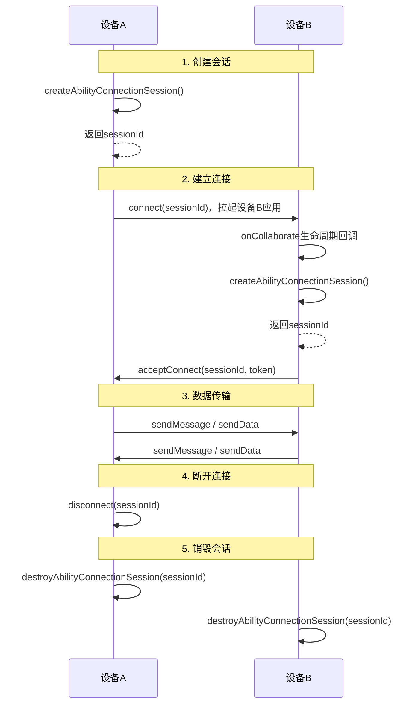

# @ohos.distributedsched.abilityConnectionManager (应用多端协同管理)
<!--Kit: Distributed Service Kit-->
<!--Subsystem: DistributedSched-->
<!--Owner: @hobbycao-->
<!--Designer: @gsxiaowen-->
<!--Tester: @hanjiawei-->
<!--Adviser: @hu-zhiqiong-->

abilityConnectionManager模块提供了应用协同接口管理能力。该模块支持会话管理、连接状态监听、跨设备数据传输等核心功能，帮助开发者快速构建跨设备协同应用。设备组网成功（需登录同账号、双端打开蓝牙）后，系统应用和三方应用可以跨设备拉起同应用的一个[UIAbility](../apis-ability-kit/js-apis-app-ability-uiAbility.md)，拉起并连接成功后可实现跨设备数据传输（文本信息和二进制数据），有效解决多端协同场景下的数据互通问题。

多端协同的完整流程如下图所示：



> **说明：**
>
> 本模块首批接口从API version 18开始支持。后续版本的新增接口，采用上角标单独标记接口的起始版本。当前文档中的所有接口均为首批接口。
>
> 本模块接口仅可在Stage模型下使用。

## 导入模块

```js
import { abilityConnectionManager } from '@kit.DistributedServiceKit';
```

## abilityConnectionManager.createAbilityConnectionSession

createAbilityConnectionSession(serviceName:&nbsp;string,&nbsp;context:&nbsp;Context,&nbsp;peerInfo:&nbsp;PeerInfo,&nbsp;connectOptions:&nbsp;ConnectOptions):&nbsp;number

创建应用间的协同会话。协同会话用于管理跨设备通信的连接状态，需要先在两端设备分别创建会话，然后通过connect建立连接。

**需要权限**：ohos.permission.INTERNET、ohos.permission.GET_NETWORK_INFO、ohos.permission.SET_NETWORK_INFO和ohos.permission.DISTRIBUTED_DATASYNC

**模型约束**：此接口仅可在Stage模型下使用。

**系统能力**：SystemCapability.DistributedSched.AppCollaboration

**设备行为差异：** 该接口在不支持分布式业务的Wearable设备或被企业策略管控设备中调用会返回801错误码。

**参数：**

| 参数名       | 类型                                      | 必填   | 说明        |
| --------- | --------------------------------------- | ---- | --------- |
| serviceName  | string | 是    | 应用设置的服务名称（两端必须一致），最大长度为256字符。此值需与peerInfo.serviceName保持一致。serviceName是用于标识协同会话的唯一标识，由应用自定义，两端设备的应用必须使用相同的serviceName值才能建立协同连接。超出长度限制时返回错误码401。 |
| context | [Context](../apis-ability-kit/js-apis-inner-application-context.md) | 是 | 表示应用上下文。 |
| peerInfo  | [PeerInfo](#peerinfo)               | 是    | 对端的协同信息。 |
| connectOptions  | [ConnectOptions](#connectoptions)               | 是    | 应用设置的连接选项。 |

**返回值：**

| 类型                  | 说明               |
| ------------------- | ---------------- |
| number | 成功创建的协同会话ID，用于后续的connect、acceptConnect、sendMessage、sendData、disconnect等接口调用。 |

**错误码：**

以下错误码详细介绍请参考[通用错误码](../errorcode-universal.md)。

| 错误码ID | 错误信息 |
| ------- | -------------------------------- |
| 201      | Permission denied.|
| 401      | Parameter error. Possible causes: 1. Mandatory parameters are left unspecified; 2. Incorrect parameter types. |
| 801      | Capability not supported. Failed to call the API due to limited device capabilities.|

**示例：**

1. 在设备A上，调用createAbilityConnectionSession()接口创建协同会话并返回sessionId。

   ```ts
   import { abilityConnectionManager, distributedDeviceManager } from '@kit.DistributedServiceKit';
   import { hilog } from '@kit.PerformanceAnalysisKit';
   
   let dmClass: distributedDeviceManager.DeviceManager;
   
   function initDmClass(): void {
     try {
       dmClass = distributedDeviceManager.createDeviceManager('com.example.remotephotodemo');
     } catch (err) {
       hilog.error(0x0000, 'testTag', 'createDeviceManager err: ' + JSON.stringify(err));
     }
   }
   
   function getRemoteDeviceId(): string | undefined {
     initDmClass();
     if (typeof dmClass === 'object' && dmClass !== null) {
       hilog.info(0x0000, 'testTag', 'getRemoteDeviceId begin');
       let list = dmClass.getAvailableDeviceListSync();
       if (typeof (list) === 'undefined' || typeof (list.length) === 'undefined') {
         hilog.info(0x0000, 'testTag', 'getRemoteDeviceId err: list is null');
         return;
       }
       if (list.length === 0) {
         hilog.info(0x0000, 'testTag', 'getRemoteDeviceId err: list is empty');
         return;
       }
       return list[0].networkId;
     } else {
       hilog.info(0x0000, 'testTag', 'getRemoteDeviceId err: dmClass is null');
       return;
     }
   }
   
   @Entry
   @Component
   struct Index {
     createSession(): void {
       // 定义peer信息
       const peerInfo: abilityConnectionManager.PeerInfo = {
         deviceId: getRemoteDeviceId()!,
         bundleName: 'com.example.remotephotodemo',
         moduleName: 'entry',
         abilityName: 'EntryAbility',
         serviceName: 'collabTest'
       };
       const myRecord: Record<string, string> = {
         "newKey1": "value1",
       };
   
       // 定义连接选项
       const connectOptions: abilityConnectionManager.ConnectOptions = {
         needSendData: true,
         startOptions: abilityConnectionManager.StartOptionParams.START_IN_FOREGROUND,
         parameters: myRecord
       };
       let context = this.getUIContext().getHostContext();
       try {
         let sessionId = abilityConnectionManager.createAbilityConnectionSession("collabTest", context, peerInfo, connectOptions);
         hilog.info(0x0000, 'testTag', 'createSession sessionId is', sessionId);
       } catch (error) {
         hilog.error(0x0000, 'testTag', error);
       }
     }
   
     build() {
     }
   }
   ```
   
2. 在设备B上，对于createAbilityConnectionSession接口的调用，可在应用被拉起后触发协同生命周期函数onCollaborate时，在onCollaborate内进行。

   ```ts
   import { AbilityConstant, UIAbility, Want } from '@kit.AbilityKit';
   import { abilityConnectionManager } from '@kit.DistributedServiceKit';
   import { hilog } from '@kit.PerformanceAnalysisKit';
    
   export default class EntryAbility extends UIAbility {
     onCollaborate(wantParam: Record<string, Object>): AbilityConstant.CollaborateResult {
       hilog.info(0x0000, 'testTag', '%{public}s', 'on collaborate');
       let param = wantParam["ohos.extra.param.key.supportCollaborateIndex"] as Record<string, Object>
       this.onCollab(param);
       return 0;
     }
    
     onCollab(collabParam: Record<string, Object>) {
       const sessionId = this.createSessionFromWant(collabParam);
       if (sessionId == -1) {
         hilog.info(0x0000, 'testTag', 'Invalid session ID.');
         return;
       }
     }
    
     createSessionFromWant(collabParam: Record<string, Object>): number {
       let sessionId = -1;
       const peerInfo = collabParam["PeerInfo"] as abilityConnectionManager.PeerInfo;
       if (peerInfo == undefined) {
         return sessionId;
       }
    
       const options = collabParam["ConnectOption"] as abilityConnectionManager.ConnectOptions;
       try {
         sessionId = abilityConnectionManager.createAbilityConnectionSession("collabTest", this.context, peerInfo, options);
         AppStorage.setOrCreate('sessionId', sessionId);
         hilog.info(0x0000, 'testTag', 'createSession sessionId is' + sessionId);
       } catch (error) {
         hilog.error(0x0000, 'testTag', error);
       }
       return sessionId;
     }
   }
   
   ```

## abilityConnectionManager.destroyAbilityConnectionSession

destroyAbilityConnectionSession(sessionId:&nbsp;number):&nbsp;void

销毁应用间的协同会话，与createAbilityConnectionSession配对使用用于释放会话资源。此接口需在成功创建协同会话后调用。销毁会话会释放相关资源，建议先调用disconnect断开连接后再销毁会话。不调用此方法会导致资源泄漏。

**模型约束**：此接口仅可在Stage模型下使用。

**系统能力**：SystemCapability.DistributedSched.AppCollaboration

**设备行为差异：** 该接口在不支持分布式业务的Wearable设备或被企业策略管控设备中调用会返回401错误码。

**参数：**

| 参数名       | 类型                                       | 必填   | 说明                              |
| --------- | ---------------------------------------- | ---- |---------------------------------|
| sessionId | number  | 是    | 待销毁的协同会话ID。<br />取值范围是大于100的整数。超出范围时返回错误码401。 |

**示例：**

  ```ts
  import { abilityConnectionManager } from '@kit.DistributedServiceKit';
  import { hilog } from '@kit.PerformanceAnalysisKit';

  hilog.info(0x0000, 'testTag', 'destroyAbilityConnectionSession called');
  let sessionId = 100;
  abilityConnectionManager.destroyAbilityConnectionSession(sessionId);
  ```

## abilityConnectionManager.getPeerInfoById

getPeerInfoById(sessionId:&nbsp;number):&nbsp;PeerInfo&nbsp;|&nbsp;undefined

获取指定会话中对端应用信息。此接口需在成功创建协同会话后调用。

**模型约束**：此接口仅可在Stage模型下使用。

**系统能力**：SystemCapability.DistributedSched.AppCollaboration

**设备行为差异：** 该接口在不支持分布式业务的Wearable设备或被企业策略管控设备中调用会返回空值。

**参数：**

| 参数名       | 类型                                       | 必填   | 说明       |
| --------- | ---------------------------------------- | ---- | -------- |
| sessionId | number  | 是    | 协同会话ID。取值范围是大于100的整数，由createAbilityConnectionSession接口返回。   |

**返回值：**

| 类型                  | 说明               |
| ------------------- | ---------------- |
| [PeerInfo](#peerinfo) \| undefined | 返回接收端的协作应用信息，若sessionId未找到则返回undefined。|

**错误码：**

以下错误码详细介绍请参考[通用错误码](../errorcode-universal.md)。

| 错误码ID | 错误信息 |
| ------- | -------------------------------- |
| 401      | Parameter error. Possible causes: 1. Mandatory parameters are left unspecified. 2. Incorrect parameter types. |

**示例：**

  ```ts
  import { abilityConnectionManager } from '@kit.DistributedServiceKit';
  import { hilog } from '@kit.PerformanceAnalysisKit';

  hilog.info(0x0000, 'testTag', 'getPeerInfoById called');
  // sessionId需通过createAbilityConnectionSession接口创建并获取，此处仅为示例
  let sessionId = 100;
  // 获取指定会话中对端应用信息
  const peerInfo = abilityConnectionManager.getPeerInfoById(sessionId);
  ```

## abilityConnectionManager.connect

connect(sessionId:&nbsp;number):&nbsp;Promise&lt;ConnectResult&gt;

创建协同会话成功并获得会话ID后，设备A上可进行UIAbility的连接。调用此接口前，需先在两端设备分别创建协同会话。connect接口通过底层分布式通信服务建立连接，必须与设备B的acceptConnect配合使用才能建立成功连接，调用connect会拉起设备B应用。连接过程会触发'connect'事件通知状态变化。使用Promise异步回调。连接失败时，返回的ConnectResult对象中的errorCode字段包含具体的错误信息，可参考ConnectErrorCode枚举了解错误原因。

**模型约束**：此接口仅可在Stage模型下使用。

**系统能力**：SystemCapability.DistributedSched.AppCollaboration

**设备行为差异：** 该接口在不支持分布式业务的Wearable设备或被企业策略管控设备中调用会返回401错误码。

**参数：**

| 参数名       | 类型                                      | 必填   | 说明        |
| --------- | --------------------------------------- | ---- | --------- |
| sessionId | number | 是    | 已创建的协同会话ID，由createAbilityConnectionSession接口返回。取值范围是大于100的整数。    |

**返回值：**

| 类型                  | 说明               |
| ------------------- | ---------------- |
| Promise&lt;ConnectResult&gt; | Promise对象，成功时resolve返回[ConnectResult](#connectresult)（包含isConnected和errorCode字段），失败时reject返回错误对象。 |

**错误码：**

以下错误码详细介绍请参考[通用错误码](../errorcode-universal.md)。

| 错误码ID | 错误信息 |
| ------- | -------------------------------- |
| 401      | Parameter error. Possible causes: 1. Mandatory parameters are left unspecified; 2. Incorrect parameter types. |

**示例：**

设备A上创建协同会话成功并获得会话ID后，调用connect()方法启动UIAbility连接，并拉起设备B应用。

  ```ts
   import { abilityConnectionManager } from '@kit.DistributedServiceKit';	 
   import { hilog } from '@kit.PerformanceAnalysisKit';	 
 
   let sessionId = 100;	 
   abilityConnectionManager.connect(sessionId).then((ConnectResult) => {	 
     if (!ConnectResult.isConnected) {	 
       hilog.info(0x0000, 'testTag', 'connect failed');	 
       return;	 
     }	 
   }).catch(() => {	 
     hilog.error(0x0000, 'testTag', "connect failed");	 
   })
  ```

## abilityConnectionManager.acceptConnect

acceptConnect(sessionId:&nbsp;number,&nbsp;token:&nbsp;string):&nbsp;Promise&lt;void&gt;

设备B上的应用在创建协同会话成功并获得会话ID后，调用acceptConnect()方法接受连接。调用此接口前，需先在两端设备分别创建协同会话。必须与设备A的connect方法配合使用：设备A调用connect会拉起设备B应用，设备B在onCollaborate生命周期中创建会话后调用acceptConnect。使用Promise异步回调。

**模型约束**：此接口仅可在Stage模型下使用。

**系统能力**：SystemCapability.DistributedSched.AppCollaboration

**设备行为差异：** 该接口在不支持分布式业务的Wearable设备或被企业策略管控设备中调用会返回401错误码。

**参数：**

| 参数名       | 类型                                      | 必填   | 说明    |
| --------- | --------------------------------------- | ---- | ----- |
| sessionId | number | 是    | 已创建的协同会话ID。取值范围是大于100的整数。    |
| token | string | 是    | 设备A应用传入的token值，该值通过wantParam参数中'ohos.dms.collabToken'键获取（在应用被拉起后的onCollaborate生命周期方法的wantParam参数中获取）。当设备A调用connect方法时，系统会自动生成collabToken并通过want参数传递给设备B，设备B在onCollaborate生命周期回调中可以从wantParam参数获取此token。    |

**返回值：**

| 类型                | 说明                      |
| ------------------- | ------------------------- |
| Promise&lt;void&gt; | Promise对象，无返回结果。 |

**错误码：**

以下错误码详细介绍请参考[通用错误码](../errorcode-universal.md)。

| 错误码ID | 错误信息 |
| ------- | -------------------------------- |
| 401      | Parameter error. Possible causes: 1. Mandatory parameters are left unspecified; 2. Incorrect parameter types. |

**示例：**

在设备B上，createAbilityConnectionSession接口调用并获取sessionId成功后，调用acceptConnect接口选择接受连接。

  ```ts
import { AbilityConstant, UIAbility, Want } from '@kit.AbilityKit';
import { abilityConnectionManager } from '@kit.DistributedServiceKit';
import { hilog } from '@kit.PerformanceAnalysisKit';

export default class EntryAbility extends UIAbility {
  onCreate(want: Want, launchParam: AbilityConstant.LaunchParam): void {
    hilog.info(0x0000, 'testTag', '%{public}s', 'Ability onCreate');
  }

  onCollaborate(wantParam: Record<string, Object>): AbilityConstant.CollaborateResult {
    hilog.info(0x0000, 'testTag', '%{public}s', 'on collaborate');
    let param = wantParam["ohos.extra.param.key.supportCollaborateIndex"] as Record<string, Object>
    this.onCollab(param);
    return 0;
  }

  onCollab(collabParam: Record<string, Object>) {
    const sessionId = this.createSessionFromWant(collabParam);
    if (sessionId == -1) {
      hilog.info(0x0000, 'testTag', 'Invalid session ID.');
      return;
    }
    const collabToken = collabParam["ohos.dms.collabToken"] as string;
    abilityConnectionManager.acceptConnect(sessionId, collabToken).then(() => {
      hilog.info(0x0000, 'testTag', 'acceptConnect success');
    }).catch(() => {
      hilog.error(0x0000, 'testTag', 'failed'); 
    })
  }

  createSessionFromWant(collabParam: Record<string, Object>): number {
    let sessionId = -1;
    const peerInfo = collabParam["PeerInfo"] as abilityConnectionManager.PeerInfo;
    if (peerInfo == undefined) {
      return sessionId;
    }

    const options = collabParam["ConnectOption"] as abilityConnectionManager.ConnectOptions;
    try {
      sessionId = abilityConnectionManager.createAbilityConnectionSession("collabTest", this.context, peerInfo, options);
      AppStorage.setOrCreate('sessionId', sessionId);
      hilog.info(0x0000, 'testTag', 'createSession sessionId is' + sessionId);
    } catch (error) {
      hilog.error(0x0000, 'testTag', error);
    }
    return sessionId;
  }
}
  ```

## abilityConnectionManager.disconnect

disconnect(sessionId:&nbsp;number):&nbsp;void

创建协同会话成功、应用连接成功、协同业务执行完毕后，协同双端的任意一台设备，应断开UIAbility的连接，结束协同状态。需在connect()建立连接后调用。

**模型约束**：此接口仅可在Stage模型下使用。

**系统能力**：SystemCapability.DistributedSched.AppCollaboration

**设备行为差异：** 该接口在不支持分布式业务的Wearable设备或被企业策略管控设备中调用会返回401错误码。

**参数：**

| 参数名       | 类型                                    | 必填   | 说明        |
| --------- | ------------------------------------- | ---- | --------- |
| sessionId | number | 是    | 协同会话ID     |

**示例：**

  ```ts
  import { abilityConnectionManager } from '@kit.DistributedServiceKit';
  import { hilog } from '@kit.PerformanceAnalysisKit';

  hilog.info(0x0000, 'testTag', 'disconnectRemoteAbility begin');
  let sessionId = 100;
  abilityConnectionManager.disconnect(sessionId);
  ```

## abilityConnectionManager.reject

reject(token:&nbsp;string,&nbsp;reason:&nbsp;string):&nbsp;void;

在跨端应用协同过程中，在拒绝对端的连接请求后，向对端发送拒绝原因。

**模型约束**：此接口仅可在Stage模型下使用。

**系统能力**：SystemCapability.DistributedSched.AppCollaboration

**设备行为差异：** 该接口在不支持分布式业务的Wearable设备或被企业策略管控设备中调用会返回401错误码。

**参数：**

| 参数名       | 类型                                      | 必填   | 说明    |
| --------- | --------------------------------------- | ---- | ----- |
| token | string | 是    | 用于协作服务管理的令牌。    |
| reason | string | 是    | 连接被拒绝的原因。    |

**错误码：**

以下错误码详细介绍请参考[通用错误码](../errorcode-universal.md)。

| 错误码ID | 错误信息 |
| ------- | -------------------------------- |
| 401      | Parameter error. Possible causes: 1. Mandatory parameters are left unspecified; 2. Incorrect parameter types. |

**示例：**

  ```ts
  import { AbilityConstant, UIAbility, Want } from '@kit.AbilityKit';
  import { abilityConnectionManager } from '@kit.DistributedServiceKit';
  import { hilog } from '@kit.PerformanceAnalysisKit';

  export default class EntryAbility extends UIAbility {
      onCollaborate(wantParam: Record<string, Object>): AbilityConstant.CollaborateResult {
        hilog.info(0x0000, 'testTag', '%{public}s', 'on collaborate');
        let collabParam = wantParam["ohos.extra.param.key.supportCollaborateIndex"] as Record<string, Object>;
        const collabToken = collabParam["ohos.dms.collabToken"] as string;
        const reason = 'test';
        hilog.info(0x0000, 'testTag', 'reject begin');
        abilityConnectionManager.reject(collabToken, reason);
        return AbilityConstant.CollaborateResult.REJECT;
      }
  }

  ```

## abilityConnectionManager.on('connect')

on(type:&nbsp;'connect',&nbsp;sessionId:&nbsp;number,&nbsp;callback:&nbsp;Callback&lt;EventCallbackInfo&gt;):&nbsp;void

注册connect事件的回调监听。当connect接口调用成功后会触发该事件。使用callback异步回调。

**模型约束**：此接口仅可在Stage模型下使用。

**系统能力**：SystemCapability.DistributedSched.AppCollaboration

**设备行为差异：** 该接口在不支持分布式业务的Wearable设备或被企业策略管控设备中调用会返回401错误码。

**参数：**

| 参数名       | 类型                                    | 必填   | 说明    |
| --------- | ------------------------------------- | ---- | ----- |
| type | string  | 是    |   事件回调类型，支持的事件为'connect'，完成[abilityConnectionManager.connect()](#abilityconnectionmanagerconnect)调用，触发该事件。   |
| sessionId | number  | 是    | 创建的协同会话ID。取值范围是大于100的整数。    |
| callback | Callback&lt;[EventCallbackInfo](#eventcallbackinfo)&gt; | 是    | 注册的回调函数。    |

**错误码：**

以下错误码详细介绍请参考[通用错误码](../errorcode-universal.md)。

| 错误码ID | 错误信息 |
| ------- | -------------------------------- |
| 401      | Parameter error. Possible causes: 1. Mandatory parameters are left unspecified; 2. Incorrect parameter types. |

**示例：**

  ```ts
  import { abilityConnectionManager } from '@kit.DistributedServiceKit';
  import { hilog } from '@kit.PerformanceAnalysisKit';

  // sessionId需通过createAbilityConnectionSession接口创建并获取，此处仅为示例
  let sessionId = 100;
  abilityConnectionManager.on("connect", sessionId,(callbackInfo) => {
    hilog.info(0x0000, 'testTag', 'session connect, sessionId is', callbackInfo.sessionId);
  });

  ```

## abilityConnectionManager.off('connect')

off(type:&nbsp;'connect',&nbsp;sessionId:&nbsp;number,&nbsp;callback?:&nbsp;Callback&lt;EventCallbackInfo&gt;):&nbsp;void

取消connect事件的回调监听。

**模型约束**：此接口仅可在Stage模型下使用。

**系统能力**：SystemCapability.DistributedSched.AppCollaboration

**设备行为差异：** 该接口在不支持分布式业务的Wearable设备或被企业策略管控设备中调用会返回401错误码。

**参数：**

| 参数名       | 类型                                    | 必填   | 说明    |
| --------- | ------------------------------------- | ---- | ----- |
| type | string  | 是    |   事件回调类型，支持的事件为'connect'，需通过[abilityConnectionManager.on('connect')](#abilityconnectionmanageronconnect)注册后才能取消。    |
| sessionId | number  | 是    | 创建的协同会话ID。取值范围是大于100的整数。    |
| callback | Callback&lt;[EventCallbackInfo](#eventcallbackinfo)&gt; | 否    | 回调函数，不传则取消所有该事件的回调监听。    |

**错误码：**

以下错误码详细介绍请参考[通用错误码](../errorcode-universal.md)。

| 错误码ID | 错误信息 |
| ------- | -------------------------------- |
| 401      | Parameter error. Possible causes: 1. Mandatory parameters are left unspecified; 2. Incorrect parameter types. |

**示例：**

  ```ts
  import { abilityConnectionManager } from '@kit.DistributedServiceKit';

  // sessionId需通过createAbilityConnectionSession接口创建并获取，此处仅为示例
  let sessionId = 100;
  abilityConnectionManager.off("connect", sessionId);

  ```

## abilityConnectionManager.on('disconnect')

on(type:&nbsp;'disconnect',&nbsp;sessionId:&nbsp;number,&nbsp;callback:&nbsp;Callback&lt;EventCallbackInfo&gt;):&nbsp;void

注册disconnect事件的回调监听。

**模型约束**：此接口仅可在Stage模型下使用。

**系统能力**：SystemCapability.DistributedSched.AppCollaboration

**设备行为差异：** 该接口在不支持分布式业务的Wearable设备或被企业策略管控设备中调用会返回401错误码。

**参数：**

| 参数名       | 类型                                    | 必填   | 说明    |
| --------- | ------------------------------------- | ---- | ----- |
| type | string  | 是    |   事件回调类型，支持的事件为'disconnect'，完成[abilityConnectionManager.disconnect()](#abilityconnectionmanagerdisconnect)调用，触发该事件。   |
| sessionId | number  | 是    | 创建的协同会话ID。取值范围是大于100的整数。    |
| callback | Callback&lt;[EventCallbackInfo](#eventcallbackinfo)&gt; | 是    | 注册的回调函数。    |

**错误码：**

以下错误码详细介绍请参考[通用错误码](../errorcode-universal.md)。

| 错误码ID | 错误信息 |
| ------- | -------------------------------- |
| 401      | Parameter error. Possible causes: 1. Mandatory parameters are left unspecified; 2. Incorrect parameter types. |

**示例：**

  ```ts
  import { abilityConnectionManager } from '@kit.DistributedServiceKit';
  import { hilog } from '@kit.PerformanceAnalysisKit';

  // sessionId需通过createAbilityConnectionSession接口创建并获取，此处仅为示例
  let sessionId = 100;
  abilityConnectionManager.on("disconnect", sessionId,(callbackInfo) => {
    hilog.info(0x0000, 'testTag', 'session disconnect, sessionId is', callbackInfo.sessionId);
  });

  ```

## abilityConnectionManager.off('disconnect')

off(type:&nbsp;'disconnect',&nbsp;sessionId:&nbsp;number,&nbsp;callback?:&nbsp;Callback&lt;EventCallbackInfo&gt;):&nbsp;void

取消disconnect事件的回调监听。

**模型约束**：此接口仅可在Stage模型下使用。

**系统能力**：SystemCapability.DistributedSched.AppCollaboration

**设备行为差异：** 该接口在不支持分布式业务的Wearable设备或被企业策略管控设备中调用会返回401错误码。

**参数：**

| 参数名       | 类型                                    | 必填   | 说明    |
| --------- | ------------------------------------- | ---- | ----- |
| type | string  | 是    |   事件回调类型，支持的事件为'disconnect'，需通过[abilityConnectionManager.on('disconnect')](#abilityconnectionmanagerondisconnect)注册后才能取消。    |
| sessionId | number  | 是    | 创建的协同会话ID。取值范围是大于100的整数。    |
| callback | Callback&lt;[EventCallbackInfo](#eventcallbackinfo)&gt; | 否    | 要取消的回调函数，不传则取消所有该事件的回调监听。    |

**错误码：**

以下错误码详细介绍请参考[通用错误码](../errorcode-universal.md)。

| 错误码ID | 错误信息 |
| ------- | -------------------------------- |
| 401      | Parameter error. Possible causes: 1. Mandatory parameters are left unspecified; 2. Incorrect parameter types. |

**示例：**

  ```ts
  import { abilityConnectionManager } from '@kit.DistributedServiceKit';
  import { hilog } from '@kit.PerformanceAnalysisKit';

  // sessionId需通过createAbilityConnectionSession接口创建并获取，此处仅为示例
  let sessionId = 101;
  abilityConnectionManager.off("disconnect", sessionId);

  ```

## abilityConnectionManager.on('receiveMessage')

on(type:&nbsp;'receiveMessage',&nbsp;sessionId:&nbsp;number,&nbsp;callback:&nbsp;Callback&lt;EventCallbackInfo&gt;):&nbsp;void

注册receiveMessage事件的回调监听。

**模型约束**：此接口仅可在Stage模型下使用。

**系统能力**：SystemCapability.DistributedSched.AppCollaboration

**设备行为差异：** 该接口在不支持分布式业务的Wearable设备或被企业策略管控设备中调用会返回401错误码。

**参数：**

| 参数名       | 类型                                    | 必填   | 说明    |
| --------- | ------------------------------------- | ---- | ----- |
| type | string  | 是    |   事件回调类型，支持的事件为'receiveMessage'，完成[abilityConnectionManager.sendMessage()](#abilityconnectionmanagersendmessage)调用，触发该事件。   |
| sessionId | number  | 是    | 创建的协同会话ID。取值范围是大于100的整数。    |
| callback | Callback&lt;[EventCallbackInfo](#eventcallbackinfo)&gt; | 是    | 注册的回调函数。    |

**错误码：**

以下错误码详细介绍请参考[通用错误码](../errorcode-universal.md)。

| 错误码ID | 错误信息 |
| ------- | -------------------------------- |
| 401      | Parameter error. Possible causes: 1. Mandatory parameters are left unspecified; 2. Incorrect parameter types. |

**示例：**

  ```ts
  import { abilityConnectionManager } from '@kit.DistributedServiceKit';
  import { hilog } from '@kit.PerformanceAnalysisKit';

  // sessionId需通过createAbilityConnectionSession接口创建并获取，此处仅为示例
  let sessionId = 100;
  abilityConnectionManager.on("receiveMessage", sessionId,(callbackInfo) => {
    hilog.info(0x0000, 'testTag', 'receiveMessage, sessionId is', callbackInfo.sessionId);
  });

  ```

## abilityConnectionManager.off('receiveMessage')

off(type:&nbsp;'receiveMessage',&nbsp;sessionId:&nbsp;number,&nbsp;callback?:&nbsp;Callback&lt;EventCallbackInfo&gt;):&nbsp;void

取消receiveMessage事件的回调监听。

**模型约束**：此接口仅可在Stage模型下使用。

**系统能力**：SystemCapability.DistributedSched.AppCollaboration

**设备行为差异：** 该接口在不支持分布式业务的Wearable设备或被企业策略管控设备中调用会返回401错误码。

**参数：**

| 参数名       | 类型                                    | 必填   | 说明    |
| --------- | ------------------------------------- | ---- | ----- |
| type | string  | 是    |   事件回调类型，支持的事件为'receiveMessage'，需通过[abilityConnectionManager.on('receiveMessage')](#abilityconnectionmanageronreceivemessage)注册后才能取消。    |
| sessionId | number  | 是    | 创建的协同会话ID。取值范围是大于100的整数。    |
| callback | Callback&lt;[EventCallbackInfo](#eventcallbackinfo)&gt; | 否    | 要取消的回调函数，不传则取消所有该事件的回调监听。    |

**错误码：**

以下错误码详细介绍请参考[通用错误码](../errorcode-universal.md)。

| 错误码ID | 错误信息 |
| ------- | -------------------------------- |
| 401      | Parameter error. Possible causes: 1. Mandatory parameters are left unspecified; 2. Incorrect parameter types. |

**示例：**

  ```ts
  import { abilityConnectionManager } from '@kit.DistributedServiceKit';
  import { hilog } from '@kit.PerformanceAnalysisKit';

  // sessionId需通过createAbilityConnectionSession接口创建并获取，此处仅为示例
  let sessionId = 100;
  abilityConnectionManager.off("receiveMessage", sessionId);

  ```

## abilityConnectionManager.on('receiveData')

on(type:&nbsp;'receiveData',&nbsp;sessionId:&nbsp;number,&nbsp;callback:&nbsp;Callback&lt;EventCallbackInfo&gt;):&nbsp;void

注册receiveData事件的回调监听。

**模型约束**：此接口仅可在Stage模型下使用。

**系统能力**：SystemCapability.DistributedSched.AppCollaboration

**设备行为差异：** 该接口在不支持分布式业务的Wearable设备或被企业策略管控设备中调用会返回401错误码。

**参数：**

| 参数名       | 类型                                    | 必填   | 说明    |
| --------- | ------------------------------------- | ---- | ----- |
| type | string  | 是    |   事件回调类型，支持的事件为'receiveData'，完成[abilityConnectionManager.sendData()](#abilityconnectionmanagersenddata)调用，触发该事件。   |
| sessionId | number  | 是    | 创建的协同会话ID。取值范围是大于100的整数。    |
| callback | Callback&lt;[EventCallbackInfo](#eventcallbackinfo)&gt; | 是    | 注册的回调函数。    |

**错误码：**

以下错误码详细介绍请参考[通用错误码](../errorcode-universal.md)。

| 错误码ID | 错误信息 |
| ------- | -------------------------------- |
| 401      | Parameter error. Possible causes: 1. Mandatory parameters are left unspecified; 2. Incorrect parameter types. |

**示例：**

  ```ts
  import { abilityConnectionManager } from '@kit.DistributedServiceKit';
  import { hilog } from '@kit.PerformanceAnalysisKit';

  // sessionId需通过createAbilityConnectionSession接口创建并获取，此处仅为示例
  let sessionId = 100;
  abilityConnectionManager.on("receiveData", sessionId,(callbackInfo) => {
    hilog.info(0x0000, 'testTag', 'receiveData, sessionId is', callbackInfo.sessionId);
  });

  ```

## abilityConnectionManager.off('receiveData')

off(type:&nbsp;'receiveData',&nbsp;sessionId:&nbsp;number,&nbsp;callback?:&nbsp;Callback&lt;EventCallbackInfo&gt;):&nbsp;void

取消receiveData事件的回调监听。

**模型约束**：此接口仅可在Stage模型下使用。

**系统能力**：SystemCapability.DistributedSched.AppCollaboration

**设备行为差异：** 该接口在不支持分布式业务的Wearable设备或被企业策略管控设备中调用会返回401错误码。

**参数：**

| 参数名       | 类型                                    | 必填   | 说明    |
| --------- | ------------------------------------- | ---- | ----- |
| type | string  | 是    |   事件回调类型，支持的事件为'receiveData'，需通过[abilityConnectionManager.on('receiveData')](#abilityconnectionmanageronreceivedata)注册后才能取消。    |
| sessionId | number  | 是    | 创建的协同会话ID。取值范围是大于100的整数。    |
| callback | Callback&lt;[EventCallbackInfo](#eventcallbackinfo)&gt; | 否    | 要取消的回调函数，不传则取消所有该事件的回调监听。    |

**错误码：**

以下错误码详细介绍请参考[通用错误码](../errorcode-universal.md)。

| 错误码ID | 错误信息 |
| ------- | -------------------------------- |
| 401      | Parameter error. Possible causes: 1. Mandatory parameters are left unspecified; 2. Incorrect parameter types. |

**示例：**

  ```ts
  import { abilityConnectionManager } from '@kit.DistributedServiceKit';
  import { hilog } from '@kit.PerformanceAnalysisKit';

  // sessionId需通过createAbilityConnectionSession接口创建并获取，此处仅为示例
  let sessionId = 100;
  abilityConnectionManager.off("receiveData", sessionId);

  ```

## abilityConnectionManager.sendMessage

sendMessage(sessionId:&nbsp;number,&nbsp;msg:&nbsp;string):&nbsp;Promise&lt;void&gt;

创建协同会话成功并获得会话ID、调用connect接口建立连接成功后，设备A或设备B可向对端设备发送文本信息。文本信息通过底层分布式通道传输，最大限制为1KB。如需传输更大数据，请使用sendData接口。使用Promise异步回调。

**模型约束**：此接口仅可在Stage模型下使用。

**系统能力**：SystemCapability.DistributedSched.AppCollaboration

**设备行为差异：** 该接口在不支持分布式业务的Wearable设备或被企业策略管控设备中调用会返回401错误码。

**参数：**

| 参数名       | 类型                                      | 必填   | 说明    |
| --------- | --------------------------------------- | ---- | ----- |
| sessionId | number | 是    | 协同会话ID。取值范围是大于100的整数，由createAbilityConnectionSession接口返回。 |
| msg | string | 是    | 文本信息内容（内容最大限制为1KB）。超出长度限制时返回错误码401。 |

**返回值：**

| 类型                  | 说明               |
| ------------------- | ---------------- |
| Promise&lt;void&gt; | 无返回结果的Promise对象。消息发送成功时resolve，发送失败时reject。 |

**错误码：**

以下错误码详细介绍请参考[通用错误码](../errorcode-universal.md)。

| 错误码ID | 错误信息 |
| ------- | -------------------------------- |
| 401      | Parameter error. Possible causes: 1. Mandatory parameters are left unspecified; 2. Incorrect parameter types. |

**示例：**

  ```ts
   import { abilityConnectionManager } from '@kit.DistributedServiceKit';	 
   import { hilog } from '@kit.PerformanceAnalysisKit';	 
 
 
   let sessionId = 100;	 
   abilityConnectionManager.sendMessage(sessionId, "message send success").then(() => {	 
     hilog.info(0x0000, 'testTag', "sendMessage success");	 
   }).catch(() => {	 
     hilog.error(0x0000, 'testTag', "connect failed");	 
   })
  ```

## abilityConnectionManager.sendData

sendData(sessionId:&nbsp;number,&nbsp;data:&nbsp;ArrayBuffer):&nbsp;Promise&lt;void&gt;

创建协同会话成功并获得会话ID、应用连接成功后，设备A或设备B可向对端设备发送[ArrayBuffer](../../arkts-utils/arraybuffer-object.md)字节流。字节流数据适合传输较大数据或二进制数据，与sendMessage相比支持更大数据量。使用Promise异步回调。

**模型约束**：此接口仅可在Stage模型下使用。

**系统能力**：SystemCapability.DistributedSched.AppCollaboration

**设备行为差异：** 该接口在不支持分布式业务的Wearable设备或被企业策略管控设备中调用会返回401错误码。

**参数：**

| 参数名       | 类型                                      | 必填   | 说明    |
| --------- | --------------------------------------- | ---- | ----- |
| sessionId | number | 是    | 协同会话ID。取值范围是大于100的整数。 |
| data | [ArrayBuffer](../../arkts-utils/arraybuffer-object.md) | 是    | 字节流信息。 |

**返回值：**

| 类型                  | 说明               |
| ------------------- | ---------------- |
| Promise&lt;void&gt; | 无返回结果的Promise对象。数据发送成功时resolve，发送失败时reject。 |

**错误码：**

以下错误码详细介绍请参考[通用错误码](../errorcode-universal.md)。

| 错误码ID | 错误信息 |
| ------- | -------------------------------- |
| 401      | Parameter error. Possible causes: 1. Mandatory parameters are left unspecified; 2. Incorrect parameter types. |

**示例：**

  ```ts
   import { abilityConnectionManager } from '@kit.DistributedServiceKit';	 
   import { hilog } from '@kit.PerformanceAnalysisKit';	 
   import { util } from '@kit.ArkTS';	 
 
 
   let textEncoder = util.TextEncoder.create("utf-8");	 
   const arrayBuffer  = textEncoder.encodeInto("data send success");	 
 
 
   let sessionId = 100;	 
   abilityConnectionManager.sendData(sessionId, arrayBuffer.buffer).then(() => {	 
     hilog.info(0x0000, 'testTag', "sendMessage success");	 
   }).catch(() => {	 
     hilog.error(0x0000, 'testTag', "sendMessage failed");	 
   })
  ```

## PeerInfo

应用协同信息。

**设备行为差异：** 该接口在不支持分布式业务的Wearable设备或被企业策略管控设备中调用会返回401错误码。

 **模型约束**：此接口仅可在Stage模型下使用。

**系统能力**：SystemCapability.DistributedSched.AppCollaboration

| 名称                    | 类型       |只读   | 可选   | 说明                 |
| ----------------- | ------ | ----  | ---- | ------------------ |
| deviceId          | string | 否   |否    | 对端设备的网络ID，用于标识要连接的远程设备。可通过分布式设备管理接口getAvailableDeviceListSync获取。     |
| bundleName        | string | 否   |否    | 对端应用的包名，用于唯一标识要连接的应用。需与对端应用的bundleName保持一致。 |
| moduleName        | string | 否   |否    | 对端应用的模块名，用于标识要连接的应用模块。通常为'entry'或其他自定义模块名。 |
| abilityName       | string | 否   |否     | 对端应用的组件名，用于标识要连接的UIAbility组件。需与对端应用的abilityName保持一致。 |
| serviceName       | string | 否   |是     | 应用设置的服务名称。若设置此值，需与createAbilityConnectionSession接口的serviceName参数保持一致。 |

## ConnectOptions

应用连接时所需的连接选项。

**设备行为差异：** 该接口在不支持分布式业务的Wearable设备或被企业策略管控设备中调用会返回401错误码。

**模型约束**：此接口仅可在Stage模型下使用。

**系统能力**：SystemCapability.DistributedSched.AppCollaboration

| 名称          | 类型    | 只读   | 可选   | 说明          |
| ----------- | ------- | ---- | ---- | ----------- |
| needSendData    | boolean  | 否    | 是   | 是否需要传输数据。传入true表示需要传输数据（可调用sendMessage和sendData方法），传入false表示不需要传输数据。不传入时默认为false。     |
| startOptions | [StartOptionParams](#startoptionparams) | 否    | 是   | 应用启动选项。START_IN_FOREGROUND（值为0）表示将对端应用启动至前台，适合需要用户交互的场景。不传入时使用系统默认启动配置。 |
| parameters | Record&lt;string, string&gt;  | 否    | 是   | 配置连接所需的额外信息。当需要传递自定义参数到对端设备时传入此参数，例如身份标识、业务标识等。不传入时不传递额外信息。    |

## ConnectResult

连接的结果。

**设备行为差异：** 该接口在不支持分布式业务的Wearable设备或被企业策略管控设备中调用会返回401错误码。

 **模型约束**：此接口仅可在Stage模型下使用。

**系统能力**：SystemCapability.DistributedSched.AppCollaboration

| 名称       | 类型   | 只读   | 可选   | 说明      |
| -------- | ------ | ---- | ---- | ------- |
| isConnected | boolean | 否   | 否 | true表示连接成功；false表示连接失败，具体原因请查看errorCode字段或reason字段。 |
| errorCode | [ConnectErrorCode](#connecterrorcode) | 否   | 是   | 表示连接错误码。连接失败时存在，用于标识具体的错误原因。连接成功时不存在。 |
| reason | string | 否   | 是   | 表示拒绝连接的原因，仅在连接被拒绝时返回。该值为对端应用调用reject接口时传入的reason参数，用于告知本端拒绝的具体原因。连接成功或未被拒绝时无此字段。 |

## EventCallbackInfo

回调方法的接收信息。

**设备行为差异：** 该接口在不支持分布式业务的Wearable设备或被企业策略管控设备中调用会返回401错误码。

 **模型约束**：此接口仅可在Stage模型下使用。

**系统能力**：SystemCapability.DistributedSched.AppCollaboration

| 名称       | 类型    | 只读 | 可选 | 说明          |
| -------- | ------ | ---- | ---- | ----------- |
| sessionId | number   | 否   | 否   |   表示当前事件对应的协同会话ID。取值范围是大于100的整数。 |
| reason | [DisconnectReason](#disconnectreason)     | 否   | 是   | 表示断连原因。触发disconnect事件时存在，用于标识具体的断连原因。其他事件类型下不存在。 |
| msg | string   | 否   | 是   | 表示接收的消息。触发receiveMessage事件时存在，包含接收到的文本消息内容。其他事件类型下不存在。 |
| data  | ArrayBuffer | 否   | 是   | 表示接收的字节流。触发receiveData事件时存在，包含接收到的二进制数据。其他事件类型下不存在。 |

## CollaborateEventInfo

协同事件信息。

**设备行为差异：** 该接口在不支持分布式业务的Wearable设备或被企业策略管控设备中调用会返回401错误码。

 **模型约束**：此接口仅可在Stage模型下使用。

**系统能力**：SystemCapability.DistributedSched.AppCollaboration

| 名称       | 类型   | 只读   | 可选   | 说明      |
| -------- | ------ | ---- | ---- | ------- |
| eventType | [CollaborateEventType](#collaborateeventtype) | 否   | 否 | 表示协同事件的类型（0表示SEND_FAILURE，1表示COLOR_SPACE_CONVERSION_FAILURE）。 |
| eventMsg | string | 否   | 是   | 表示协同事件的消息内容。eventType为SEND_FAILURE或COLOR_SPACE_CONVERSION_FAILURE时存在，包含事件相关的详细消息信息。 |

## ConnectErrorCode

连接的错误码。

**设备行为差异：** 该接口在不支持分布式业务的Wearable设备或被企业策略管控设备中调用会返回401错误码。

 **模型约束**：此接口仅可在Stage模型下使用。

**系统能力**：SystemCapability.DistributedSched.AppCollaboration

| 名称|  值 | 说明 |
|-------|-------|-------|
| CONNECTED_SESSION_EXISTS | 0 |表示应用之间存在已连接的会话。|
| PEER_APP_REJECTED | 1 |表示对端应用拒绝了协作请求。|
| LOCAL_WIFI_NOT_OPEN | 2 |表示本端WiFi未开启。|
| PEER_WIFI_NOT_OPEN | 3 |表示对端WiFi未开启。|
| PEER_ABILITY_NO_ONCOLLABORATE | 4 |表示未实现onCollaborate方法。|
| SYSTEM_INTERNAL_ERROR | 5 |表示系统内部错误。|

## StartOptionParams

启动选项参数的枚举。

**设备行为差异：** 该接口在不支持分布式业务的Wearable设备或被企业策略管控设备中调用会返回401错误码。

 **模型约束**：此接口仅可在Stage模型下使用。

**系统能力**：SystemCapability.DistributedSched.AppCollaboration

| 名称|  值 | 说明 |
|-------|-------|-------|
| START_IN_FOREGROUND | 0 |表示将对端应用启动至前台。|

## CollaborateEventType

协同事件类型的枚举。

**设备行为差异：** 该接口在不支持分布式业务的Wearable设备或被企业策略管控设备中调用会返回401错误码。

 **模型约束**：此接口仅可在Stage模型下使用。

**系统能力**：SystemCapability.DistributedSched.AppCollaboration

| 名称|  值 | 说明 |
|-------|-------|-------|
| SEND_FAILURE | 0 |表示任务发送失败。在跨设备协同过程中，当发送协作任务（如协作事件）失败时产生此事件，常见原因包括网络异常、对端设备不可达等。|
| COLOR_SPACE_CONVERSION_FAILURE | 1 |表示色彩空间转换失败。在跨设备图像协同场景下，当需要将图像数据从源设备色彩空间转换为目标设备色彩空间格式失败时产生此事件，常见原因包括色彩格式不支持或转换参数错误。|

## DisconnectReason

当前断连原因的枚举。

**设备行为差异：** 该接口在不支持分布式业务的Wearable设备或被企业策略管控设备中调用会返回401错误码。

 **模型约束**：此接口仅可在Stage模型下使用。

**系统能力**：SystemCapability.DistributedSched.AppCollaboration

| 名称|  值 | 说明 |
|-------|-------|-------|
| PEER_APP_CLOSE_COLLABORATION | 0 |表示对端应用主动关闭了协作。|
| PEER_APP_EXIT | 1 |表示对端应用退出。|
| NETWORK_DISCONNECTED | 2 |表示网络断开。|

## CollaborationKeys

提供应用协作键值的枚举。

**设备行为差异：** 该接口在不支持分布式业务的Wearable设备或被企业策略管控设备中调用会返回401错误码。

 **模型约束**：此接口仅可在Stage模型下使用。

**系统能力**：SystemCapability.DistributedSched.AppCollaboration

| 名称                |                  值             | 说明                   |
| -------------------| ------------------------------- | ---------------------- |
| PEER_INFO           | ohos.collaboration.key.peerInfo | 表示对端设备信息的键值。 |
| CONNECT_OPTIONS     | ohos.collaboration.key.connectOptions | 表示连接选项的键值。   |
| COLLABORATE_TYPE    | ohos.collaboration.key.abilityCollaborateType | 表示协作类型的键值。   |

## CollaborationValues

**设备行为差异：** 该接口在不支持分布式业务的Wearable设备或被企业策略管控设备中调用会返回401错误码。

 **模型约束**：此接口仅可在Stage模型下使用。

应用协作相关值的枚举。

**系统能力**：SystemCapability.DistributedSched.AppCollaboration

| 名称                                      | 值       | 说明                   |
| ----------------------------------------- | -------- | ---------------------- |
| ABILITY_COLLABORATION_TYPE_DEFAULT | ohos.collaboration.value.abilityCollab | 表示默认的协作类型。 |
| ABILITY_COLLABORATION_TYPE_CONNECT_PROXY  | ohos.collaboration.value.connectProxy | 表示连接代理的协作类型。   |