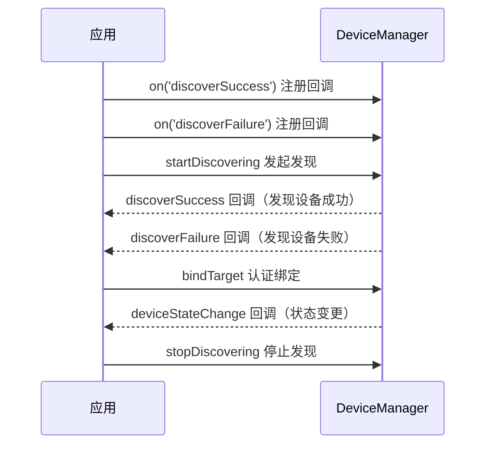

# @ohos.distributedDeviceManager (设备管理)
<!--Kit: Distributed Service Kit-->
<!--Subsystem: DistributedHardware-->
<!--Owner: @hwzhangchuang-->
<!--Designer: @hwzhangchuang-->
<!--Tester: @zhaodengqi-->
<!--Adviser: @hu-zhiqiong-->

本模块提供分布式设备管理能力，包括设备的发现、认证、状态监听和信息查询等功能。设备管理基于设备信任模型，通过发现周边设备并进行认证绑定来建立可信连接，已认证的可信设备可用于分布式业务。

应用可调用接口实现如下功能：

- 注册和解除注册设备状态变化、设备名称变更、服务死亡等监听。
- 发现周边设备。
- 认证和取消认证设备。
- 查询可信设备列表。
- 查询本地设备信息，包括设备名称，设备类型和设备标识等。

> **说明：**
>
> 本模块首批接口从API version 10开始支持。后续版本的新增接口，采用上角标单独标记接口的起始版本。

## 导入模块

```ts
import { distributedDeviceManager } from '@kit.DistributedServiceKit';
```

## distributedDeviceManager.createDeviceManager

createDeviceManager(bundleName: string): DeviceManager

创建一个设备管理实例，是分布式设备管理方法的调用入口。该实例用于获取可信设备列表以及本地设备的名称、类型、标识和网络标识等信息。当设备管理实例不再使用时，应调用releaseDeviceManager释放该实例，避免资源泄漏。

**系统能力**：SystemCapability.DistributedHardware.DeviceManager

**设备行为差异**：该接口在不支持分布式业务的Wearable设备上调用会返回801错误码。

**参数：**

| 参数名     | 类型                                                 | 必填 | 说明                                                        |
| ---------- | ---------------------------------------------------- | ---- | ----------------------------------------------------------- |
| bundleName | string                                               | 是   | 指示应用的Bundle名称。长度范围1~255字符，超出范围时返回错误码401。  |

**返回值：**

  | 类型                                        | 说明        |
  | ------------------------------------------- | --------- |
  | [DeviceManager](#devicemanager) | 返回设备管理器对象实例，用于获取可信设备列表以及本地设备的名称、类型、标识和网络标识等信息。 |

**错误码：**

以下的错误码的详细介绍请参见[通用错误码](../errorcode-universal.md)。

| 错误码ID | 错误信息                                                        |
| -------- | --------------------------------------------------------------- |
| 401 | Parameter error. Possible causes: 1. Mandatory parameters are left unspecified; 2. Incorrect parameter type; 3. Parameter verification failed. |

**示例：**

  ```ts
  import { distributedDeviceManager } from '@kit.DistributedServiceKit';
  import { BusinessError } from '@kit.BasicServicesKit';

  try {
    // 创建设备管理实例
    let dmInstance = distributedDeviceManager.createDeviceManager('ohos.samples.jsHelloWorld');
  } catch (err) {
    let error: BusinessError = err as BusinessError;
    console.error(`Failed to create device manager. Code: ${error.code}, message: ${error.message}`);
  }
  ```

## distributedDeviceManager.releaseDeviceManager

releaseDeviceManager(deviceManager: DeviceManager): void

设备管理实例不再使用后，通过该方法释放DeviceManager实例。

**系统能力**：SystemCapability.DistributedHardware.DeviceManager

**设备行为差异**：该接口在不支持分布式业务的Wearable设备上调用会返回801错误码。

**参数：**

| 参数名     | 类型                                                 | 必填 | 说明                                |
| ---------- | ---------------------------------------------------- | ---- | --------------------------------- |
| deviceManager | [DeviceManager](#devicemanager)    | 是   | 通过createDeviceManager创建的设备管理器对象实例。                                  |

**错误码：**

以下的错误码的详细介绍请参见[通用错误码](../errorcode-universal.md)和[设备管理错误码](errorcode-device-manager.md)。

| 错误码ID | 错误信息                                                        |
| -------- | --------------------------------------------------------------- |
| 401 | Parameter error. Possible causes: 1. Mandatory parameters are left unspecified; 2. Incorrect parameter types; 3. Parameter verification failed. |
| 11600101 | Failed to execute the function.                                 |

**示例：**

  ```ts
  import { distributedDeviceManager } from '@kit.DistributedServiceKit';
  import { BusinessError } from '@kit.BasicServicesKit';

  try {
    // 创建设备管理实例
    let dmInstance = distributedDeviceManager.createDeviceManager('ohos.samples.jsHelloWorld');
    // 释放设备管理实例
    distributedDeviceManager.releaseDeviceManager(dmInstance);
  } catch (err) {
    let error: BusinessError = err as BusinessError;
    console.error(`Failed to release device manager. Code: ${error.code}, message: ${error.message}`);
  }
  ```

## DeviceBasicInfo

分布式设备基本信息。

**系统能力**：以下各项对应的系统能力均为SystemCapability.DistributedHardware.DeviceManager

**设备行为差异**：该接口在不支持分布式业务的Wearable设备上调用会返回801错误码。

| 名称           | 类型  | 只读| 可选              |  说明    |
| ---------------------- | ------------------------- | --- | ---- | -------- |
| deviceId               | string                    | 否 | 否  | 设备标识符。实际值为udid-hash与appid和盐值基于sha256方式进行混淆后的值。|
| deviceName             | string                    | 否 | 否  | 设备名称。    |
| deviceType             | string                    | 否 | 否  | 设备类型。    |
| networkId              | string                    | 否 | 是  | 设备网络标识。未提供时默认为空字符串。  |

## DeviceStateChange

表示设备状态。

**系统能力**：以下各项对应的系统能力均为SystemCapability.DistributedHardware.DeviceManager

**设备行为差异**：该接口在不支持分布式业务的Wearable设备上调用会返回801错误码。

| 名称         | 值  | 说明              |
| ----------- | ---- | --------------- |
| UNKNOWN     | 0    | 设备物理上线，此时状态未知，在状态更改为可用之前，分布式业务无法使用。           |
| AVAILABLE   | 1    | 设备可用状态，表示设备间信息已在分布式数据中同步完成，可以运行分布式业务。 |
| UNAVAILABLE | 2    | 设备物理下线，此时状态未知。           |

## DeviceManager

设备管理实例，是分布式设备管理方法的调用入口，提供设备发现、设备认证、状态监听和信息查询等能力。在调用DeviceManager的方法前，需要先通过createDeviceManager构建一个DeviceManager实例dmInstance。

**系统能力**：SystemCapability.DistributedHardware.DeviceManager

**设备行为差异**：该接口在不支持分布式业务的Wearable设备上调用会返回801错误码。

### getAvailableDeviceListSync

getAvailableDeviceListSync(): Array&lt;DeviceBasicInfo&gt;

同步获取所有在线可信设备。调用前需先通过createDeviceManager创建DeviceManager实例。与getAvailableDeviceList的区别在于：本方法为同步调用，直接返回结果；getAvailableDeviceList为异步调用，通过callback或Promise返回结果。建议在需要阻塞等待结果的场景使用本方法，在不希望阻塞线程的场景使用getAvailableDeviceList。

**需要权限**：ohos.permission.DISTRIBUTED_DATASYNC

**系统能力**：SystemCapability.DistributedHardware.DeviceManager

**设备行为差异**：该接口在不支持分布式业务的Wearable设备上调用会返回801错误码。

**返回值：**

  | 类型                                        | 说明        |
  | ------------------------------------------- | --------- |
  | Array&lt;[DeviceBasicInfo](#devicebasicinfo)&gt; | 返回可信设备列表，包含设备标识、名称、类型和网络标识等信息。 |

**错误码：**

以下的错误码的详细介绍请参见[通用错误码](../errorcode-universal.md)和[设备管理错误码](errorcode-device-manager.md)。

| 错误码ID | 错误信息                                                        |
| -------- | --------------------------------------------------------------- |
| 201 | Permission verification failed. The application does not have the permission required to call the API.                                            |
| 11600101 | Failed to execute the function.                                 |

**示例：**

  ```ts
  import { distributedDeviceManager } from '@kit.DistributedServiceKit';
  import { BusinessError } from '@kit.BasicServicesKit';

  try {
    // 创建设备管理实例
    let dmInstance = distributedDeviceManager.createDeviceManager('ohos.samples.jsHelloWorld');
    // 同步获取所有在线可信设备
    let deviceInfoList: Array<distributedDeviceManager.DeviceBasicInfo> = dmInstance.getAvailableDeviceListSync();
  } catch (err) {
    let error: BusinessError = err as BusinessError;
    console.error(`Failed to get available device list sync. Code: ${error.code}, message: ${error.message}`);
  }
  ```

### getAvailableDeviceList

getAvailableDeviceList(callback: AsyncCallback&lt;Array&lt;DeviceBasicInfo&gt;&gt;): void

获取所有在线可信设备。调用前需先通过createDeviceManager创建DeviceManager实例。使用callback异步回调。与getAvailableDeviceListSync的区别在于：本方法为异步调用，通过callback返回结果；getAvailableDeviceListSync为同步调用，直接返回结果。建议在不希望阻塞线程的场景使用本方法，在需要阻塞等待结果的场景使用getAvailableDeviceListSync。

**需要权限**：ohos.permission.DISTRIBUTED_DATASYNC

**系统能力**：SystemCapability.DistributedHardware.DeviceManager

**设备行为差异**：该接口在不支持分布式业务的Wearable设备上调用会返回801错误码。

**参数：**

  | 参数名       | 类型                                     | 必填   | 说明                    |
  | -------- | ---------------------------------------- | ---- | --------------------- |
  | callback | AsyncCallback&lt;Array&lt;[DeviceBasicInfo](#devicebasicinfo)&gt;&gt; | 是    | 回调函数。当获取可信设备列表成功时，err为undefined，data为获取到的可信设备列表；失败时，err为错误对象。 |

**错误码：**

以下的错误码的详细介绍请参见[通用错误码](../errorcode-universal.md)和[设备管理错误码](errorcode-device-manager.md)。

| 错误码ID | 错误信息                                                        |
| -------- | --------------------------------------------------------------- |
| 201 | Permission verification failed. The application does not have the permission required to call the API.                                            |
| 11600101 | Failed to execute the function.                                 |

**示例：**

  ```ts
  import { distributedDeviceManager } from '@kit.DistributedServiceKit';
  import { BusinessError } from '@kit.BasicServicesKit';

  try {
    // 创建设备管理实例
    let dmInstance = distributedDeviceManager.createDeviceManager('ohos.samples.jsHelloWorld');
    // 获取所有在线可信设备
    dmInstance.getAvailableDeviceList((err: BusinessError, data: Array<distributedDeviceManager.DeviceBasicInfo>) => {
      if (err) {
        console.error(`Failed to get available device list. Code: ${err.code}, message: ${err.message}`);
        return;
      }
      console.info('get available device info: ' + JSON.stringify(data));
    });
  } catch (err) {
    let error: BusinessError = err as BusinessError;
    console.error(`Failed to get available device list. Code: ${error.code}, message: ${error.message}`);
  }
  ```

### getAvailableDeviceList

getAvailableDeviceList(): Promise&lt;Array&lt;DeviceBasicInfo&gt;&gt;

获取所有在线可信设备。调用前需先通过createDeviceManager创建DeviceManager实例。使用Promise异步回调。与getAvailableDeviceListSync的区别在于：本方法为异步调用，通过Promise返回结果；getAvailableDeviceListSync为同步调用，直接返回结果。建议在不希望阻塞线程的场景使用本方法，在需要阻塞等待结果的场景使用getAvailableDeviceListSync。

**需要权限**：ohos.permission.DISTRIBUTED_DATASYNC

**系统能力**：SystemCapability.DistributedHardware.DeviceManager

**设备行为差异**：该接口在不支持分布式业务的Wearable设备上调用会返回801错误码。

**返回值：**

  | 类型                                                       | 说明                               |
  | ---------------------------------------------------------- | ---------------------------------- |
  | Promise&lt;Array&lt;[DeviceBasicInfo](#devicebasicinfo)&gt;&gt; | Promise对象，resolve时返回分布式设备基本信息列表，reject时返回错误信息。 |

**错误码：**

以下的错误码的详细介绍请参见[通用错误码](../errorcode-universal.md)和[设备管理错误码](errorcode-device-manager.md)。

| 错误码ID | 错误信息                                                        |
| -------- | --------------------------------------------------------------- |
| 201 | Permission verification failed. The application does not have the permission required to call the API.                                            |
| 11600101 | Failed to execute the function.                                 |

**示例：**

  ```ts
  import { distributedDeviceManager } from '@kit.DistributedServiceKit';
  import { BusinessError } from '@kit.BasicServicesKit';

  try {
    // 创建设备管理实例
    let dmInstance = distributedDeviceManager.createDeviceManager('ohos.samples.jsHelloWorld');
    // 获取所有在线可信设备
    dmInstance.getAvailableDeviceList().then((data: Array<distributedDeviceManager.DeviceBasicInfo>) => {
      console.info('get available device info: ' + JSON.stringify(data));
    }).catch((err: BusinessError) => {
      console.error(`Failed to get available device list. Code: ${err.code}, message: ${err.message}`);
    });
  } catch (err) {
    let error: BusinessError = err as BusinessError;
    console.error(`Failed to get available device list. Code: ${error.code}, message: ${error.message}`);
  }
  ```

### getLocalDeviceNetworkId

getLocalDeviceNetworkId(): string

获取本地设备网络标识。

**需要权限**：ohos.permission.DISTRIBUTED_DATASYNC

**系统能力**：SystemCapability.DistributedHardware.DeviceManager

**设备行为差异**：该接口在不支持分布式业务的Wearable设备上调用会返回801错误码。

**返回值：**

  | 类型                      | 说明              |
  | ------------------------- | ---------------- |
  | string | 返回本地设备网络标识，即设备在分布式网络中的唯一标识字符串。 |

**错误码：**

以下的错误码的详细介绍请参见[通用错误码](../errorcode-universal.md)和[设备管理错误码](errorcode-device-manager.md)。

| 错误码ID | 错误信息                                                        |
| -------- | --------------------------------------------------------------- |
| 201 | Permission verification failed. The application does not have the permission required to call the API.                                            |
| 11600101 | Failed to execute the function.                                 |

**示例：**

  ```ts
  import { distributedDeviceManager } from '@kit.DistributedServiceKit';
  import { BusinessError } from '@kit.BasicServicesKit';

  try {
    // 创建设备管理实例
    let dmInstance = distributedDeviceManager.createDeviceManager('ohos.samples.jsHelloWorld');
    // 获取本地设备网络标识
    let deviceNetworkId: string = dmInstance.getLocalDeviceNetworkId();
    console.info('local device networkId: ' + JSON.stringify(deviceNetworkId));
  } catch (err) {
    let error: BusinessError = err as BusinessError;
    console.error(`Failed to get local device network id. Code: ${error.code}, message: ${error.message}`);
  }
  ```

### getLocalDeviceName

getLocalDeviceName(): string

获取本地设备名称。

**需要权限**：ohos.permission.DISTRIBUTED_DATASYNC

**系统能力**：SystemCapability.DistributedHardware.DeviceManager

**设备行为差异**：该接口在不支持分布式业务的Wearable设备上调用会返回801错误码。

**返回值：**

  | 类型                      | 说明              |
  | ------------------------- | ---------------- |
  | string                    | 返回本地设备名称，可用于设备的展示与识别。 |

**错误码：**

以下的错误码的详细介绍请参见[通用错误码](../errorcode-universal.md)和[设备管理错误码](errorcode-device-manager.md)。

| 错误码ID | 错误信息                                                        |
| -------- | --------------------------------------------------------------- |
| 201 | Permission verification failed. The application does not have the permission required to call the API.                                            |
| 11600101 | Failed to execute the function.                                 |

**示例：**

  ```ts
  import { distributedDeviceManager } from '@kit.DistributedServiceKit';
  import { BusinessError } from '@kit.BasicServicesKit';

  try {
    // 创建设备管理实例
    let dmInstance = distributedDeviceManager.createDeviceManager('ohos.samples.jsHelloWorld');
    // 获取本地设备名称
    let deviceName: string = dmInstance.getLocalDeviceName();
    console.info('local device name: ' + JSON.stringify(deviceName));
  } catch (err) {
    let error: BusinessError = err as BusinessError;
    console.error(`Failed to get local device name. Code: ${error.code}, message: ${error.message}`);
  }
  ```

### getLocalDeviceType

getLocalDeviceType(): number

获取本地设备类型。

**需要权限**：ohos.permission.DISTRIBUTED_DATASYNC

**系统能力**：SystemCapability.DistributedHardware.DeviceManager

**设备行为差异**：该接口在不支持分布式业务的Wearable设备上调用会返回801错误码。

**返回值：**

  | 类型                      | 说明              |
  | ------------------------- | ---------------- |
  | number                    | <!--RP1-->返回本地设备类型。<!--RP1End--> |

**错误码：**

以下的错误码的详细介绍请参见[通用错误码](../errorcode-universal.md)和[设备管理错误码](errorcode-device-manager.md)。

| 错误码ID | 错误信息                                                        |
| -------- | --------------------------------------------------------------- |
| 201 | Permission verification failed. The application does not have the permission required to call the API.                                            |
| 11600101 | Failed to execute the function.                                 |

**示例：**

  ```ts
  import { distributedDeviceManager } from '@kit.DistributedServiceKit';
  import { BusinessError } from '@kit.BasicServicesKit';

  try {
    // 创建设备管理实例
    let dmInstance = distributedDeviceManager.createDeviceManager('ohos.samples.jsHelloWorld');
    // 获取本地设备类型
    let deviceType: number = dmInstance.getLocalDeviceType();
    console.info('local device type: ' + JSON.stringify(deviceType));
  } catch (err) {
    let error: BusinessError = err as BusinessError;
    console.error(`Failed to get local device type. Code: ${error.code}, message: ${error.message}`);
  }
  ```

### getLocalDeviceId

getLocalDeviceId(): string

获取本地设备ID，实际值为udid-hash与appid和盐值基于sha256方式进行混淆后的值。

**需要权限**：ohos.permission.DISTRIBUTED_DATASYNC

**系统能力**：SystemCapability.DistributedHardware.DeviceManager

**设备行为差异**：该接口在不支持分布式业务的Wearable设备上调用会返回801错误码。

**返回值：**

  | 类型                      | 说明              |
  | ------------------------- | ---------------- |
  | string                    | 返回本地设备ID，实际值为udid-hash与appid和盐值基于sha256方式进行混淆后的值。 |

**错误码：**

以下的错误码的详细介绍请参见[通用错误码](../errorcode-universal.md)和[设备管理错误码](errorcode-device-manager.md)。

| 错误码ID | 错误信息                                                        |
| -------- | --------------------------------------------------------------- |
| 201 | Permission verification failed. The application does not have the permission required to call the API.                                            |
| 11600101 | Failed to execute the function.                                 |

**示例：**

  ```ts
  import { distributedDeviceManager } from '@kit.DistributedServiceKit';
  import { BusinessError } from '@kit.BasicServicesKit';

  try {
    // 创建设备管理实例
    let dmInstance = distributedDeviceManager.createDeviceManager('ohos.samples.jsHelloWorld');
    // 获取本地设备标识
    let deviceId: string = dmInstance.getLocalDeviceId();
    console.info('local device id: ' + JSON.stringify(deviceId));
  } catch (err) {
    let error: BusinessError = err as BusinessError;
    console.error(`Failed to get local device id. Code: ${error.code}, message: ${error.message}`);
  }
  ```

### getDeviceName

getDeviceName(networkId: string): string

通过指定设备的网络标识获取该设备名称。

**需要权限**：ohos.permission.DISTRIBUTED_DATASYNC

**系统能力**：SystemCapability.DistributedHardware.DeviceManager

**设备行为差异**：该接口在不支持分布式业务的Wearable设备上调用会返回801错误码。

**参数：**

  | 参数名       | 类型                                     | 必填   | 说明        |
  | -------- | ---------------------------------------- | ---- | --------- |
  | networkId| string                                   | 是   | 设备的网络标识，可从可信设备列表（getAvailableDeviceListSync或getAvailableDeviceList返回的DeviceBasicInfo）中获取。注意：若获取到的networkId为空字符串，不可用于本接口调用。长度范围1~255字符，超出范围时返回错误码401。 |

**返回值：**

  | 类型                      | 说明              |
  | ------------------------- | ---------------- |
  | string                    | 返回指定设备名称，可用于设备的展示与识别。 |

**错误码：**

以下的错误码的详细介绍请参见[通用错误码](../errorcode-universal.md)和[设备管理错误码](errorcode-device-manager.md)。

| 错误码ID | 错误信息                                                        |
| -------- | --------------------------------------------------------------- |
| 201 | Permission verification failed. The application does not have the permission required to call the API.                                            |
| 401 | Parameter error. Possible causes: 1. Mandatory parameters are left unspecified; 2. Incorrect parameter type; 3. Parameter verification failed; 4. The size of specified networkId is greater than 255. |
| 11600101 | Failed to execute the function.                                 |

**示例：**

  ```ts
  import { distributedDeviceManager } from '@kit.DistributedServiceKit';
  import { BusinessError } from '@kit.BasicServicesKit';

  try {
    // 设备网络标识，可通过getAvailableDeviceListSync或getAvailableDeviceList接口获取可信设备列表中的DeviceBasicInfo.networkId
    let networkId = 'xxxxxxx';
    // 创建设备管理实例
    let dmInstance = distributedDeviceManager.createDeviceManager('ohos.samples.jsHelloWorld');
    // 通过设备网络标识获取设备名称
    let deviceName: string = dmInstance.getDeviceName(networkId);
    console.info('device name: ' + JSON.stringify(deviceName)); 
  } catch (err) {
    let error: BusinessError = err as BusinessError;
    console.error(`Failed to get device name. Code: ${error.code}, message: ${error.message}`);
  }
  ```

### getDeviceType

getDeviceType(networkId: string): number

通过指定设备的网络标识获取该设备类型。

**需要权限**：ohos.permission.DISTRIBUTED_DATASYNC

**系统能力**：SystemCapability.DistributedHardware.DeviceManager

**设备行为差异**：该接口在不支持分布式业务的Wearable设备上调用会返回801错误码。

**参数：**

  | 参数名       | 类型                                     | 必填   | 说明        |
  | -------- | ---------------------------------------- | ---- | --------- |
  | networkId| string                                   | 是   | 设备的网络标识，可从可信设备列表（getAvailableDeviceListSync或getAvailableDeviceList返回的DeviceBasicInfo）中获取。注意：若获取到的networkId为空字符串，不可用于本接口调用。长度范围1~255字符，超出范围时返回错误码401。 |

**返回值：**

  | 类型                      | 说明              |
  | ------------------------- | ---------------- |
  | number                    | <!--RP2-->返回指定设备类型。<!--RP2End--> |

**错误码：**

以下的错误码的详细介绍请参见[通用错误码](../errorcode-universal.md)和[设备管理错误码](errorcode-device-manager.md)。

| 错误码ID | 错误信息                                                        |
| -------- | --------------------------------------------------------------- |
| 201 | Permission verification failed. The application does not have the permission required to call the API.                                            |
| 401 | Parameter error. Possible causes: 1. Mandatory parameters are left unspecified; 2. Incorrect parameter type; 3. Parameter verification failed; 4. The size of specified networkId is greater than 255. |
| 11600101 | Failed to execute the function.                                 |

**示例：**

  ```ts
  import { distributedDeviceManager } from '@kit.DistributedServiceKit';
  import { BusinessError } from '@kit.BasicServicesKit';

  try {
    // 设备网络标识，可通过getAvailableDeviceListSync或getAvailableDeviceList接口获取可信设备列表中的DeviceBasicInfo.networkId
    let networkId = 'xxxxxxx';
    // 创建设备管理实例
    let dmInstance = distributedDeviceManager.createDeviceManager('ohos.samples.jsHelloWorld');
    // 通过设备网络标识获取设备类型
    let deviceType: number = dmInstance.getDeviceType(networkId);
    console.info('device type: ' + JSON.stringify(deviceType)); 
  } catch (err) {
    let error: BusinessError = err as BusinessError;
    console.error(`Failed to get device type. Code: ${error.code}, message: ${error.message}`);
  }
  ```

### startDiscovering

startDiscovering(discoverParam: {[key:&nbsp;string]:&nbsp;Object;} , filterOptions?: {[key:&nbsp;string]:&nbsp;Object;} ): void

发现周边设备，用于在需要建立分布式连接前搜索可用设备。发现状态持续两分钟，超时后自动停止，最大发现数量为99个。使用WiFi进行设备发现时，要求发现方与被发现方处于同一局域网内。调用本方法前，需先通过[on('discoverSuccess')](#ondiscoversuccess)注册设备发现成功回调以接收发现的设备信息，并通过[on('discoverFailure')](#ondiscoverfailure)注册设备发现失败回调以接收失败通知。发现完成后可调用stopDiscovering停止发现。

设备发现与认证交互流程如下：



**需要权限**：ohos.permission.DISTRIBUTED_DATASYNC

**系统能力**：SystemCapability.DistributedHardware.DeviceManager

**设备行为差异**：该接口在不支持分布式业务的Wearable设备上调用会返回801错误码。

**参数：**

  | 参数名            | 类型                        | 必填   | 说明    |
  | ------------- | ------------------------------- | ---- | -----  |
  | discoverParam  | {[key:&nbsp;string]:&nbsp;Object;}      | 是   | 发现配置参数。用于指定发现的目标类型。<br>discoverTargetType: 发现目标类型，取值为1，表示设备类型。传入其他值时不生效。|
  | filterOptions | {[key:&nbsp;string]:&nbsp;Object;}          | 否   | 发现设备过滤信息。可选。默认值为undefined，表示发现未上线的设备。会携带以下key值（不传入某个key时，表示不按该维度进行筛选）：<br>availableStatus(0-1)：筛选发现设备的可用状态，传入超出范围的值时不生效。<br />-0：设备离线，客户端需要通过调用bindTarget绑定设备。<br />-1：设备已在线，客户端可以进行连接。<br>discoverDistance(0-100)：根据传入的距离值，发现本地周围指定距离内的设备，单位为cm。传入超出范围的值时不生效。使用WiFi进行设备发现时不支持该参数，若传入则不生效。 <br>authenticationStatus(0-1)：根据不同的认证状态发现设备，传入超出范围的值时不生效：<br />-0：设备未认证，客户端需要通过调用bindTarget进行认证绑定。<br />-1：设备已认证，可用于分布式业务。<br>authorizationType(0-2)：根据不同的授权类型发现设备，传入超出范围的值时不生效：<br />-0：根据临时协商的会话密钥认证的设备。<br />-1：基于同账号密钥进行身份验证的设备。<br />-2：基于不同账号凭据密钥认证的设备。|

**错误码：**

以下的错误码的详细介绍请参见[通用错误码](../errorcode-universal.md)和[设备管理错误码](errorcode-device-manager.md)。

| 错误码ID | 错误信息                                                        |
| -------- | --------------------------------------------------------------- |
| 201 | Permission verification failed. The application does not have the permission required to call the API.                                            |
| 401 | Parameter error. Possible causes: 1. Mandatory parameters are left unspecified; 2. Incorrect parameter type; 3. Parameter verification failed. |
| 11600101 | Failed to execute the function.                                 |
| 11600104 | Discovery unavailable.                                          |

**示例：**

  ```ts
  import { distributedDeviceManager } from '@kit.DistributedServiceKit';
  import { BusinessError } from '@kit.BasicServicesKit';

  // 发现标识，discoverTargetType为1表示发现目标为设备
  let discoverParam: Record<string, number> = {
    'discoverTargetType': 1
  };
  // 发现设备过滤信息，availableStatus为0表示发现离线设备
  let filterOptions: Record<string, number> = {
    'availableStatus': 0
  };

  try {
    // 创建设备管理实例
    let dmInstance = distributedDeviceManager.createDeviceManager('ohos.samples.jsHelloWorld');
    dmInstance.startDiscovering(discoverParam, filterOptions); // 当有设备发现时，通过discoverSuccess回调通知给应用
  } catch (err) {
    let error: BusinessError = err as BusinessError;
    console.error(`Failed to start discovering. Code: ${error.code}, message: ${error.message}`);
  }
  ```

### stopDiscovering

stopDiscovering(): void

停止发现周边设备。与startDiscovering方法配合使用，用于在发现超时（两分钟）前手动停止设备发现。需在调用startDiscovering之后调用。

**需要权限**：ohos.permission.DISTRIBUTED_DATASYNC

**系统能力**：SystemCapability.DistributedHardware.DeviceManager

**设备行为差异**：该接口在不支持分布式业务的Wearable设备上调用会返回801错误码。

**错误码：**

以下的错误码的详细介绍请参见[通用错误码](../errorcode-universal.md)和[设备管理错误码](errorcode-device-manager.md)。

| 错误码ID | 错误信息                                                        |
| -------- | --------------------------------------------------------------- |
| 201 | Permission verification failed. The application does not have the permission required to call the API.                                            |
| 11600101 | Failed to execute the function.                                 |

**示例：**

  ```ts
  import { distributedDeviceManager } from '@kit.DistributedServiceKit';
  import { BusinessError } from '@kit.BasicServicesKit';

  try {
    // 创建设备管理实例
    let dmInstance = distributedDeviceManager.createDeviceManager('ohos.samples.jsHelloWorld');
    // 停止发现周边设备
    dmInstance.stopDiscovering();
  } catch (err) {
    let error: BusinessError = err as BusinessError;
    console.error(`Failed to stop discovering. Code: ${error.code}, message: ${error.message}`);
  }
  ```

### bindTarget

bindTarget(deviceId: string, bindParam: {[key:&nbsp;string]:&nbsp;Object;} , callback: AsyncCallback&lt;{deviceId: string;}>): void

认证设备，将发现的不可信设备通过认证流程绑定为可信设备。认证过程中，系统会根据bindParam中指定的认证类型发起认证请求，认证成功后设备将加入可信设备列表，可通过getAvailableDeviceListSync查询。当不再需要与目标设备进行分布式业务时，可调用unbindTarget解除绑定。使用callback异步回调。

**需要权限**：ohos.permission.DISTRIBUTED_DATASYNC

**系统能力**：SystemCapability.DistributedHardware.DeviceManager

**设备行为差异**：该接口在不支持分布式业务的Wearable设备上调用会返回801错误码。

**参数：**

  | 参数名     | 类型                                                | 必填  | 说明         |
  | ---------- | --------------------------------------------------- | ----- | ------------ |
  | deviceId   | string                                              | 是    | 设备标识，可从设备发现结果（startDiscovering的discoverSuccess回调返回的DeviceBasicInfo）中获取。长度范围1~255字符，超出范围时返回错误码401。   |
  | bindParam  | {[key:&nbsp;string]:&nbsp;Object;}                             | 是    | 认证参数。支持传入以下key值：<br>bindType（number，必填）：绑定的类型，取值为1，表示PIN码认证。传入其他值时返回参数错误。<br>targetPkgName（string，可选）：绑定目标的包名，不传入时默认使用调用方应用的Bundle名称。<br>appName（string，可选）：尝试绑定目标的应用名称，用于在认证界面展示发起绑定的应用名称，不传入时不展示。<br>appOperation（string，可选）：应用要绑定目标的原因，用于向用户展示绑定目的，不传入时不展示。<br>customDescription（string，可选）：绑定操作的详细补充说明，用于向用户展示更具体的操作描述，不传入时不展示。   |
  | callback   | AsyncCallback&lt;{deviceId:&nbsp;string;&nbsp;}&gt; | 是    | 认证结果回调。当认证成功时，err为undefined，data为包含deviceId的对象；当认证失败时，err为错误对象。 |

**错误码：**

以下的错误码的详细介绍请参见[通用错误码](../errorcode-universal.md)和[设备管理错误码](errorcode-device-manager.md)。

| 错误码ID | 错误信息                                                         |
| -------- | --------------------------------------------------------------- |
| 201 | Permission verification failed. The application does not have the permission required to call the API.                                            |
| 401 | Parameter error. Possible causes: 1. Mandatory parameters are left unspecified; 2. Incorrect parameter type; 3. Parameter verification failed; 4. The size of specified deviceId is greater than 255.  |
| 11600101 | Failed to execute the function.                                 |
| 11600103 | Authentication unavailable.                                     |

**示例：**

  ```ts
  import { distributedDeviceManager } from '@kit.DistributedServiceKit';
  import { BusinessError } from '@kit.BasicServicesKit';

  class BindResultData {
    deviceId: string = '';
  }
  // 设备标识，可通过startDiscovering发现设备后从discoverSuccess回调获取DeviceBasicInfo.deviceId，或通过getAvailableDeviceListSync/getAvailableDeviceList获取可信设备的DeviceBasicInfo.deviceId
  let deviceId = 'XXXXXXXX';
  // 认证参数
  let bindParam: Record<string, string | number> = {
    'bindType': 1, // 绑定类型： 1 - PIN码认证
    'targetPkgName': 'xxxx',
    'appName': 'xxxx',
    'appOperation': 'xxxx',
    'customDescription': 'xxxx'
  };

  try {
    // 创建设备管理实例
    let dmInstance = distributedDeviceManager.createDeviceManager('ohos.samples.jsHelloWorld');
    // 认证设备
    dmInstance.bindTarget(deviceId, bindParam, (err: BusinessError, data: BindResultData) => {
      if (err) {
        console.error(`Failed to bind target. Code: ${err.code}, message: ${err.message}`);
        return;
      }
      console.info('bindTarget result:' + JSON.stringify(data));
    });
  } catch (err) {
    let error: BusinessError = err as BusinessError;
    console.error(`Failed to bind target. Code: ${error.code}, message: ${error.message}`);
  }
  ```

### unbindTarget

unbindTarget(deviceId: string): void

解除认证设备，用于在不再需要与目标设备进行分布式业务时，解除与该设备的认证关系。与bindTarget方法配合使用，仅能解除已通过bindTarget认证绑定的可信设备。解除后设备将从可信设备列表中移除，可通过getAvailableDeviceListSync或getAvailableDeviceList查询确认。

**需要权限**：ohos.permission.DISTRIBUTED_DATASYNC

**系统能力**：SystemCapability.DistributedHardware.DeviceManager

**设备行为差异**：该接口在不支持分布式业务的Wearable设备上调用会返回801错误码。

**参数：**

  | 参数名   | 类型                      | 必填 | 说明       |
  | -------- | ------------------------- | ---- | ---------- |
  | deviceId | string                    | 是   |  设备标识，仅支持已通过bindTarget认证绑定的可信设备，可从可信设备列表（getAvailableDeviceListSync或getAvailableDeviceList返回的DeviceBasicInfo）中获取。长度范围1~255字符，超出范围时返回错误码401。|

**错误码：**

以下的错误码的详细介绍请参见[通用错误码](../errorcode-universal.md)和[设备管理错误码](errorcode-device-manager.md)。

| 错误码ID | 错误信息                                                        |
| -------- | --------------------------------------------------------------- |
| 201 | Permission verification failed. The application does not have the permission required to call the API.                                            |
| 401 | Parameter error. Possible causes: 1. Mandatory parameters are left unspecified; 2. Incorrect parameter type; 3. Parameter verification failed; 4. The size of specified deviceId is greater than 255.  |
| 11600101 | Failed to execute the function.                                 |

**示例：**

  ```ts
  import { distributedDeviceManager } from '@kit.DistributedServiceKit';
  import { BusinessError } from '@kit.BasicServicesKit';

  try {
    // 设备标识，可以从发现的结果（startDiscovering的discoverSuccess回调）或可信设备列表（getAvailableDeviceListSync/getAvailableDeviceList返回的DeviceBasicInfo）中获取
    let deviceId = 'XXXXXXXX';
    // 创建设备管理实例
    let dmInstance = distributedDeviceManager.createDeviceManager('ohos.samples.jsHelloWorld');
    // 解除认证设备
    dmInstance.unbindTarget(deviceId);
  } catch (err) {
    let error: BusinessError = err as BusinessError;
    console.error(`Failed to unbind target. Code: ${error.code}, message: ${error.message}`);
  }
  ```

### on('deviceStateChange')

on(type: 'deviceStateChange', callback: Callback&lt;{ action: DeviceStateChange; device: DeviceBasicInfo; }&gt;): void

注册设备状态回调，以便在设备状态发生变化时通知应用。使用callback异步回调。

**需要权限**：ohos.permission.DISTRIBUTED_DATASYNC

**系统能力**：SystemCapability.DistributedHardware.DeviceManager

**设备行为差异**：该接口在不支持分布式业务的Wearable设备上调用会返回801错误码。

**参数：**

  | 参数名       | 类型                                     | 必填   | 说明                             |
  | -------- | ---------------------------------------- | ---- | ------------------------------ |
  | type     | string                                   | 是    | 注册设备状态回调，固定为deviceStateChange。 |
  | callback | Callback&lt;{&nbsp;action:&nbsp;[DeviceStateChange](#devicestatechange);&nbsp;device:&nbsp;[DeviceBasicInfo](#devicebasicinfo);&nbsp;}&gt; | 是    | 注册设备状态的回调方法，返回设备状态和设备信息。      |

**错误码：**

以下的错误码的详细介绍请参见[通用错误码](../errorcode-universal.md)。

| 错误码ID | 错误信息                                                        |
| -------- | --------------------------------------------------------------- |
| 201 | Permission verification failed. The application does not have the permission required to call the API.                                            |
| 401 | Parameter error. Possible causes: 1. Mandatory parameters are left unspecified; 2. Incorrect parameter type; 3. Parameter verification failed; 4. The size of specified type is greater than 255.  |

**示例：**

  ```ts
  import { distributedDeviceManager } from '@kit.DistributedServiceKit';
  import { BusinessError } from '@kit.BasicServicesKit';

  class DeviceStateChangeData {
    action: distributedDeviceManager.DeviceStateChange = 0;
    device: distributedDeviceManager.DeviceBasicInfo = {
      deviceId: '',
      deviceName: '',
      deviceType: '',
      networkId: ''
    };
  }

  try {
    // 创建设备管理实例
    let dmInstance = distributedDeviceManager.createDeviceManager('ohos.samples.jsHelloWorld');
    // 注册设备状态变化回调
    dmInstance.on('deviceStateChange', (data: DeviceStateChangeData) => {
      console.info('deviceStateChange on:' + JSON.stringify(data));
    });
  } catch (err) {
    let error: BusinessError = err as BusinessError;
    console.error(`Failed to register device state change. Code: ${error.code}, message: ${error.message}`);
  }
  ```

### off('deviceStateChange')

off(type: 'deviceStateChange', callback?: Callback&lt;{ action: DeviceStateChange; device: DeviceBasicInfo; }&gt;): void

取消注册设备状态回调。使用callback异步回调。

**需要权限**：ohos.permission.DISTRIBUTED_DATASYNC

**系统能力**：SystemCapability.DistributedHardware.DeviceManager

**设备行为差异**：该接口在不支持分布式业务的Wearable设备上调用会返回801错误码。

**参数：**

  | 参数名       | 类型                                     | 必填   | 说明                          |
  | -------- | ---------------------------------------- | ---- | --------------------------- |
  | type     | string                                   | 是    | 取消注册设备状态回调，固定为deviceStateChange。        |
  | callback | Callback&lt;{&nbsp;action:&nbsp;[DeviceStateChange](#devicestatechange);&nbsp;device:&nbsp;[DeviceBasicInfo](#devicebasicinfo);&nbsp;}&gt; | 否    | 指示要取消注册的设备状态回调，返回设备状态和设备信息。如果指定该参数则取消对应callback，否则取消所有已注册的deviceStateChange回调。 |

**错误码：**

以下的错误码的详细介绍请参见[通用错误码](../errorcode-universal.md)。

| 错误码ID | 错误信息                                                        |
| -------- | --------------------------------------------------------------- |
| 201 | Permission verification failed. The application does not have the permission required to call the API.                                            |
| 401 | Parameter error. Possible causes: 1. Mandatory parameters are left unspecified; 2. Incorrect parameter type; 3. Parameter verification failed; 4. The size of specified type is greater than 255.  |

**示例：**

  ```ts
  import { distributedDeviceManager } from '@kit.DistributedServiceKit';
  import { BusinessError } from '@kit.BasicServicesKit';

  class DeviceStateChangeData {
    action: distributedDeviceManager.DeviceStateChange = 0;
    device: distributedDeviceManager.DeviceBasicInfo = {
      deviceId: '',
      deviceName: '',
      deviceType: '',
      networkId: ''
    };
  }

  try {
    // 创建设备管理实例
    let dmInstance = distributedDeviceManager.createDeviceManager('ohos.samples.jsHelloWorld');
    // 取消注册设备状态变化回调
    dmInstance.off('deviceStateChange', (data: DeviceStateChangeData) => {
      console.info('deviceStateChange' + JSON.stringify(data));
    });
  } catch (err) {
    let error: BusinessError = err as BusinessError;
    console.error(`Failed to unregister device state change. Code: ${error.code}, message: ${error.message}`);
  }
  ```

### on('discoverSuccess')

on(type: 'discoverSuccess', callback: Callback&lt;{ device: DeviceBasicInfo; }&gt;): void

注册发现设备成功回调。使用callback异步回调。此回调在调用startDiscovering发现到周边设备时触发，返回发现的设备信息（DeviceBasicInfo）。需在调用startDiscovering之前注册此回调。

**需要权限**：ohos.permission.DISTRIBUTED_DATASYNC

**系统能力**：SystemCapability.DistributedHardware.DeviceManager

**设备行为差异**：该接口在不支持分布式业务的Wearable设备上调用会返回801错误码。

**参数：**

  | 参数名       | 类型                                     | 必填   | 说明                         |
  | -------- | ---------------------------------------- | ---- | -------------------------- |
  | type     | string                                   | 是    | 注册设备发现回调，以便在发现周边设备时通知应用，固定为discoverSuccess。 |
  | callback | Callback&lt;{&nbsp;device:&nbsp;[DeviceBasicInfo](#devicebasicinfo);&nbsp;}&gt; | 是    | 注册设备发现的回调方法，返回发现的设备信息（DeviceBasicInfo）。               |

**错误码：**

以下的错误码的详细介绍请参见[通用错误码](../errorcode-universal.md)。

| 错误码ID | 错误信息                                                        |
| -------- | --------------------------------------------------------------- |
| 201 | Permission verification failed. The application does not have the permission required to call the API.                                            |
| 401 | Parameter error. Possible causes: 1. Mandatory parameters are left unspecified; 2. Incorrect parameter type; 3. Parameter verification failed; 4. The size of specified type is greater than 255.  |

**示例：**

  ```ts
  import { distributedDeviceManager } from '@kit.DistributedServiceKit';
  import { BusinessError } from '@kit.BasicServicesKit';

  class DiscoverSuccessData {
    device: distributedDeviceManager.DeviceBasicInfo = {
      deviceId: '',
      deviceName: '',
      deviceType: '',
      networkId: ''
    };
  }
  
  try {
    // 创建设备管理实例
    let dmInstance = distributedDeviceManager.createDeviceManager('ohos.samples.jsHelloWorld');
    // 注册设备发现成功回调
    dmInstance.on('discoverSuccess', (data: DiscoverSuccessData) => {
      console.info('discoverSuccess:' + JSON.stringify(data));
    });
  } catch (err) {
    let error: BusinessError = err as BusinessError;
    console.error(`Failed to register discover success callback. Code: ${error.code}, message: ${error.message}`);
  }
  ```

### off('discoverSuccess')

off(type: 'discoverSuccess', callback?: Callback&lt;{ device: DeviceBasicInfo; }&gt;): void

取消注册设备发现成功回调。使用callback异步回调。

**需要权限**：ohos.permission.DISTRIBUTED_DATASYNC

**系统能力**：SystemCapability.DistributedHardware.DeviceManager

**设备行为差异**：该接口在不支持分布式业务的Wearable设备上调用会返回801错误码。

**参数：**

  | 参数名       | 类型                                     | 必填   | 说明                          |
  | -------- | ---------------------------------------- | ---- | --------------------------- |
  | type     | string                                   | 是    | 取消注册设备发现回调，固定为discoverSuccess。                 |
  | callback | Callback&lt;{&nbsp;device:&nbsp;[DeviceBasicInfo](#devicebasicinfo);&nbsp;}&gt; | 否    | 指示要取消注册的设备发现回调，返回发现的设备信息。如果指定该参数则取消对应callback，否则取消所有已注册的discoverSuccess回调。 |

**错误码：**

以下的错误码的详细介绍请参见[通用错误码](../errorcode-universal.md)。

| 错误码ID | 错误信息                                                        |
| -------- | --------------------------------------------------------------- |
| 201 | Permission verification failed. The application does not have the permission required to call the API.                                            |
| 401 | Parameter error. Possible causes: 1. Mandatory parameters are left unspecified; 2. Incorrect parameter type; 3. Parameter verification failed; 4. The size of specified type is greater than 255.  |

**示例：**

  ```ts
  import { distributedDeviceManager } from '@kit.DistributedServiceKit';
  import { BusinessError } from '@kit.BasicServicesKit';

  class DiscoverSuccessData {
    device: distributedDeviceManager.DeviceBasicInfo = {
      deviceId: '',
      deviceName: '',
      deviceType: '',
      networkId: ''
    };
  }

  try {
    // 创建设备管理实例
    let dmInstance = distributedDeviceManager.createDeviceManager('ohos.samples.jsHelloWorld');
    // 取消注册设备发现成功回调
    dmInstance.off('discoverSuccess', (data: DiscoverSuccessData) => {
      console.info('discoverSuccess' + JSON.stringify(data));
    });
  } catch (err) {
    let error: BusinessError = err as BusinessError;
    console.error(`Failed to unregister discover success callback. Code: ${error.code}, message: ${error.message}`);
  }
  ```

### on('deviceNameChange')

on(type: 'deviceNameChange', callback: Callback&lt;{ deviceName: string; }&gt;): void

注册设备名称变更回调，以便在设备名称改变时通知应用。使用callback异步回调。

**需要权限**：ohos.permission.DISTRIBUTED_DATASYNC

**系统能力**：SystemCapability.DistributedHardware.DeviceManager

**设备行为差异**：该接口在不支持分布式业务的Wearable设备上调用会返回801错误码。

**参数：**

  | 参数名       | 类型                                     | 必填   | 说明                             |
  | -------- | ---------------------------------------- | ---- | ------------------------------ |
  | type     | string                                   | 是    | 注册设备名称改变回调，以便在设备名称改变时通知应用，固定为deviceNameChange。 |
  | callback | Callback&lt;{&nbsp;deviceName:&nbsp;string;}&gt; | 是    | 注册设备名称改变的回调方法，返回变更后的设备名称。                |

**错误码：**

以下的错误码的详细介绍请参见[通用错误码](../errorcode-universal.md)。

| 错误码ID | 错误信息                                                        |
| -------- | --------------------------------------------------------------- |
| 201 | Permission verification failed. The application does not have the permission required to call the API.                                            |
| 401 | Parameter error. Possible causes: 1. Mandatory parameters are left unspecified; 2. Incorrect parameter type; 3. Parameter verification failed; 4. The size of specified type is greater than 255.  |

**示例：**

  ```ts
  import { distributedDeviceManager } from '@kit.DistributedServiceKit';
  import { BusinessError } from '@kit.BasicServicesKit';

  class DeviceNameChangeData {
    deviceName: string = '';
  }

  try {
    // 创建设备管理实例
    let dmInstance = distributedDeviceManager.createDeviceManager('ohos.samples.jsHelloWorld');
    // 注册设备名称变更回调
    dmInstance.on('deviceNameChange', (data: DeviceNameChangeData) => {
      console.info('deviceNameChange on:' + JSON.stringify(data));
    });
  } catch (err) {
    let error: BusinessError = err as BusinessError;
    console.error(`Failed to register device name change callback. Code: ${error.code}, message: ${error.message}`);
  }
  ```

### off('deviceNameChange')

off(type: 'deviceNameChange', callback?: Callback&lt;{ deviceName: string; }&gt;): void

取消注册设备名称变更回调监听。使用callback异步回调。

**需要权限**：ohos.permission.DISTRIBUTED_DATASYNC

**系统能力**：SystemCapability.DistributedHardware.DeviceManager

**设备行为差异**：该接口在不支持分布式业务的Wearable设备上调用会返回801错误码。

**参数：**

  | 参数名       | 类型                                     | 必填   | 说明                             |
  | -------- | ---------------------------------------- | ---- | ------------------------------ |
  | type     | string                                   | 是    | 取消注册设备名称改变回调，固定为deviceNameChange。 |
  | callback | Callback&lt;{&nbsp;deviceName:&nbsp;string;}&gt; | 否    | 指示要取消注册设备名称改变的回调方法。如果指定该参数则取消对应callback，否则取消所有已注册的deviceNameChange回调。                 |

**错误码：**

以下的错误码的详细介绍请参见[通用错误码](../errorcode-universal.md)。

| 错误码ID | 错误信息                                                        |
| -------- | --------------------------------------------------------------- |
| 201 | Permission verification failed. The application does not have the permission required to call the API.                                            |
| 401 | Parameter error. Possible causes: 1. Mandatory parameters are left unspecified; 2. Incorrect parameter type; 3. Parameter verification failed; 4. The size of specified type is greater than 255.  |

**示例：**

  ```ts
  import { distributedDeviceManager } from '@kit.DistributedServiceKit';
  import { BusinessError } from '@kit.BasicServicesKit';

  class DeviceNameChangeData {
    deviceName: string = '';
  }

  try {
    // 创建设备管理实例
    let dmInstance = distributedDeviceManager.createDeviceManager('ohos.samples.jsHelloWorld');
    // 取消注册设备名称变更回调
    dmInstance.off('deviceNameChange', (data: DeviceNameChangeData) => {
      console.info('deviceNameChange' + JSON.stringify(data));
    });
  } catch (err) {
    let error: BusinessError = err as BusinessError;
    console.error(`Failed to unregister device name change callback. Code: ${error.code}, message: ${error.message}`);
  }
  ```

### on('discoverFailure')

on(type: 'discoverFailure', callback: Callback&lt;{ reason: number; }&gt;): void

注册设备发现失败回调。使用callback异步回调。此回调在调用startDiscovering发现设备失败时触发，返回失败原因。需在调用startDiscovering之前注册此回调。

**需要权限**：ohos.permission.DISTRIBUTED_DATASYNC

**系统能力**：SystemCapability.DistributedHardware.DeviceManager

**设备行为差异**：该接口在不支持分布式业务的Wearable设备上调用会返回801错误码。

**参数：**

  | 参数名       | 类型                                     | 必填   | 说明                             |
  | -------- | ---------------------------------------- | ---- | ------------------------------ |
  | type     | string                                   | 是    | 注册设备发现失败回调，以便在发现周边设备失败时通知应用，固定为discoverFailure。 |
  | callback | Callback&lt;{&nbsp;reason:&nbsp;number;&nbsp;}&gt; | 是    | 注册设备发现失败的回调方法，返回设备发现失败的原因。回调参数reason为数值类型，表示发现失败的错误原因码，具体取值可参见[设备管理错误码](errorcode-device-manager.md)。                 |

**错误码：**

以下的错误码的详细介绍请参见[通用错误码](../errorcode-universal.md)。

| 错误码ID | 错误信息                                                        |
| -------- | --------------------------------------------------------------- |
| 201 | Permission verification failed. The application does not have the permission required to call the API.                                            |
| 401 | Parameter error. Possible causes: 1. Mandatory parameters are left unspecified; 2. Incorrect parameter type; 3. Parameter verification failed; 4. The size of specified type is greater than 255.  |

**示例：**

  ```ts
  import { distributedDeviceManager } from '@kit.DistributedServiceKit';
  import { BusinessError } from '@kit.BasicServicesKit';

  class DiscoverFailureData {
    reason: number = 0;
  }

  try {
    // 创建设备管理实例
    let dmInstance = distributedDeviceManager.createDeviceManager('ohos.samples.jsHelloWorld');
    // 注册设备发现失败回调
    dmInstance.on('discoverFailure', (data: DiscoverFailureData) => {
      console.info('discoverFailure on:' + JSON.stringify(data));
    });
  } catch (err) {
    let error: BusinessError = err as BusinessError;
    console.error(`Failed to register discover failure callback. Code: ${error.code}, message: ${error.message}`);
  }
  ```

### off('discoverFailure')

off(type: 'discoverFailure', callback?: Callback&lt;{ reason: number; }&gt;): void

取消注册设备发现失败回调。使用callback异步回调。

**需要权限**：ohos.permission.DISTRIBUTED_DATASYNC

**系统能力**：SystemCapability.DistributedHardware.DeviceManager

**设备行为差异**：该接口在不支持分布式业务的Wearable设备上调用会返回801错误码。

**参数：**

  | 参数名       | 类型                                     | 必填   | 说明                |
  | -------- | ---------------------------------------- | ---- | ----------------- |
  | type     | string                                   | 是    | 取消注册设备发现失败回调，固定为discoverFailure。     |
  | callback | Callback&lt;{&nbsp;reason:&nbsp;number;&nbsp;}&gt; | 否    | 指示要取消注册的设备发现失败回调。如果指定该参数则取消对应callback，否则取消所有已注册的discoverFailure回调。 |

**错误码：**

以下的错误码的详细介绍请参见[通用错误码](../errorcode-universal.md)。

| 错误码ID | 错误信息                                                        |
| -------- | --------------------------------------------------------------- |
| 201 | Permission verification failed. The application does not have the permission required to call the API.                                            |
| 401 | Parameter error. Possible causes: 1. Mandatory parameters are left unspecified; 2. Incorrect parameter type; 3. Parameter verification failed; 4. The size of specified type is greater than 255.  |

**示例：**

  ```ts
  import { distributedDeviceManager } from '@kit.DistributedServiceKit';
  import { BusinessError } from '@kit.BasicServicesKit';

  class DiscoverFailureData {
    reason: number = 0;
  }

  try {
    // 创建设备管理实例
    let dmInstance = distributedDeviceManager.createDeviceManager('ohos.samples.jsHelloWorld');
    // 取消注册设备发现失败回调
    dmInstance.off('discoverFailure', (data: DiscoverFailureData) => {
      console.info('discoverFailure' + JSON.stringify(data));
    });
  } catch (err) {
    let error: BusinessError = err as BusinessError;
    console.error(`Failed to unregister discover failure callback. Code: ${error.code}, message: ${error.message}`);
  }
  ```

### on('serviceDie')

on(type: 'serviceDie', callback?: Callback&lt;{}&gt;): void

注册设备管理服务死亡回调，以便在服务死亡时通知应用。使用callback异步回调。

**需要权限**：ohos.permission.DISTRIBUTED_DATASYNC

**系统能力**：SystemCapability.DistributedHardware.DeviceManager

**设备行为差异**：该接口在不支持分布式业务的Wearable设备上调用会返回801错误码。

**参数：**

  | 参数名       | 类型                    | 必填   | 说明                                       |
  | -------- | ----------------------- | ---- | ---------------------------------------- |
  | type     | string                  | 是    | 注册设备管理服务死亡回调，以便在DeviceManager服务异常终止时通知应用，固定为serviceDie。 |
  | callback | Callback&lt;{}&gt; | 否    | 注册serviceDie的回调方法，当设备管理服务异常终止时触发该回调通知应用。如果不传入callback参数，则不会注册回调。                       |

**错误码：**

以下的错误码的详细介绍请参见[通用错误码](../errorcode-universal.md)。

| 错误码ID | 错误信息                                                        |
| -------- | --------------------------------------------------------------- |
| 201 | Permission verification failed. The application does not have the permission required to call the API.                                            |
| 401 | Parameter error. Possible causes: 1. Mandatory parameters are left unspecified; 2. Incorrect parameter type; 3. Parameter verification failed; 4. The size of specified type is greater than 255.  |

**示例：**

  ```ts
  import { distributedDeviceManager } from '@kit.DistributedServiceKit';
  import { BusinessError } from '@kit.BasicServicesKit';

  try {
    // 创建设备管理实例
    let dmInstance = distributedDeviceManager.createDeviceManager('ohos.samples.jsHelloWorld');
    // 注册设备管理服务死亡回调
    dmInstance.on('serviceDie', () => {
      console.info('serviceDie on');
    });
  } catch (err) {
    let error: BusinessError = err as BusinessError;
    console.error(`Failed to register service die callback. Code: ${error.code}, message: ${error.message}`);
  }
  ```

### off('serviceDie')

off(type: 'serviceDie', callback?: Callback&lt;{}&gt;): void

取消注册设备管理服务死亡回调。使用callback异步回调。

**需要权限**：ohos.permission.DISTRIBUTED_DATASYNC

**系统能力**：SystemCapability.DistributedHardware.DeviceManager

**设备行为差异**：该接口在不支持分布式业务的Wearable设备上调用会返回801错误码。

**参数：**

  | 参数名       | 类型                    | 必填   | 说明                                       |
  | -------- | ----------------------- | ---- | ---------------------------------------- |
  | type     | string                  | 是    | 取消注册serviceDie回调，固定为serviceDie。 |
  | callback | Callback&lt;{}&gt; | 否    | 指示要取消注册的serviceDie回调。如果指定该参数则取消对应callback，否则取消所有已注册的serviceDie回调。                  |

**错误码：**

以下的错误码的详细介绍请参见[通用错误码](../errorcode-universal.md)。

| 错误码ID | 错误信息                                                        |
| -------- | --------------------------------------------------------------- |
| 201 | Permission verification failed. The application does not have the permission required to call the API.                                            |
| 401 | Parameter error. Possible causes: 1. Mandatory parameters are left unspecified; 2. Incorrect parameter type; 3. Parameter verification failed; 4. The size of specified type is greater than 255.  |

**示例：**

  ```ts
  import { distributedDeviceManager } from '@kit.DistributedServiceKit';
  import { BusinessError } from '@kit.BasicServicesKit';

  try {
    // 创建设备管理实例
    let dmInstance = distributedDeviceManager.createDeviceManager('ohos.samples.jsHelloWorld');
    // 取消注册设备管理服务死亡回调
    dmInstance.off('serviceDie', () => {
      console.info('serviceDie off');
    });
  } catch (err) {
    let error: BusinessError = err as BusinessError;
    console.error(`Failed to unregister service die callback. Code: ${error.code}, message: ${error.message}`);
  }
  ```