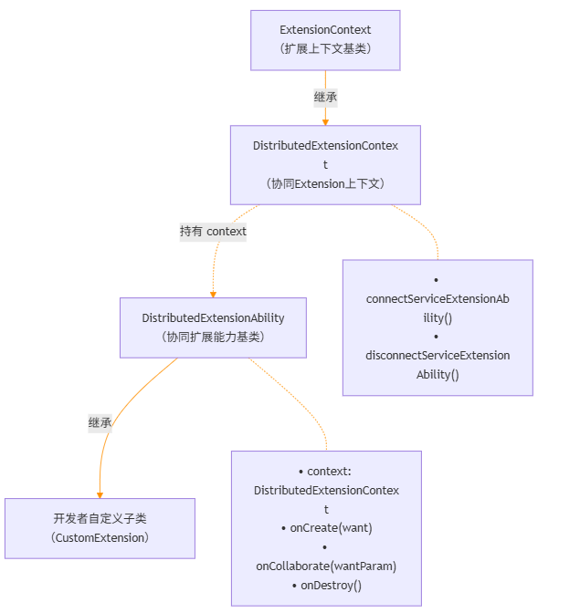

# @ohos.application.DistributedExtensionAbility (协同Extension)
<!--Kit: Distributed Service Kit-->
<!--Subsystem: DistributedSched-->
<!--Owner: @hobbycao-->
<!--Designer: @gsxiaowen-->
<!--Tester: @hanjiawei-->
<!--Adviser: @hu-zhiqiong-->

DistributedExtensionAbility（分布式扩展能力）模块提供了面向多设备限定协同场景（如：面向穿戴和手机间的专有通讯服务）下的扩展能力基类。

该模块作为多设备限定协同场景扩展能力基类，主要包含以下能力：

- **生命周期管理**：提供onCreate（创建）、onCollaborate（协同）、onDestroy（销毁）三个生命周期回调，覆盖协同Extension从创建到销毁的完整生命周期，使应用能够在不同阶段执行初始化、协同决策和资源清理等业务逻辑。

- **协同决策**：通过onCollaborate回调，应用在被跨设备拉起过程中，可根据调用方传输的协同参数自主决定是否接受协同请求（ACCEPT/REJECT），从而灵活控制协同流程是否继续。

- **上下文环境**：提供distributedExtensionContext上下文环境，支持连接和断开远端ServiceExtensionAbility，实现跨设备的服务调用与数据互通。

协同Extension的核心类结构及其与上下文、自定义子类的关系如下图所示。



如上图所示：
- **继承关系**：`DistributedExtensionContext` 继承自 `ExtensionContext`（扩展上下文）；开发者自定义子类继承自 `DistributedExtensionAbility`。
- **组合关系**：`DistributedExtensionAbility` 持有 `context` 属性，类型为 `DistributedExtensionContext`，提供连接/断开远端 `ServiceExtensionAbility` 等协同能力。

开发者通过继承 `DistributedExtensionAbility` 并实现 `onCreate`、`onCollaborate`、`onDestroy` 生命周期回调，即可获得多设备限定协同场景相应能力。

> **说明：**
>
> 本模块首批接口从API version 20开始支持。后续版本的新增接口，采用上角标单独标记接口的起始版本。
>
> 本模块接口仅可在Stage模型下使用。

## 导入模块

```ts
import { DistributedExtensionAbility } from '@kit.DistributedServiceKit';
```

## DistributedExtensionAbility

### 属性

**模型约束**：此接口仅可在Stage模型下使用。

**系统能力**：SystemCapability.DistributedSched.AppCollaboration

**设备行为差异：** 该接口在不支持分布式业务的Wearable设备不生效。

| 名称    | 类型                          | 只读 | 可选 | 说明                                                       |
| ------- | ----------------------------- | ---- | ---- | ---------------------------------------------------------- |
| context | DistributedExtensionContext | 否   | 否   | DistributedExtension（协同Extension）的上下文环境，继承自ExtensionContext。|

### onCreate

onCreate(want: Want): void

Extension生命周期回调，在创建时回调，执行初始化业务逻辑操作。

**模型约束**：此接口仅可在Stage模型下使用。

**系统能力**：SystemCapability.DistributedSched.AppCollaboration

**设备行为差异：** 该接口在不支持分布式业务的Wearable设备不生效。

**参数：**

| 参数名     | 类型 | 必填                                                             | 说明 |
| ----------| ---- | ---------------------------------------------------------------- | ---- |
| want      | [Want](../apis-ability-kit/js-apis-app-ability-want.md) | 是   | 当前Extension相关的Want信息，用于携带创建Extension所需的初始化配置信息。 |

**示例：**

```ts
import { Want } from '@kit.AbilityKit';
import { DistributedExtensionAbility } from '@kit.DistributedServiceKit';

export default class DistributedExtension extends DistributedExtensionAbility {
  onCreate(want: Want) {
    console.info(`DistributedExtension Create ok`);
    console.info(`DistributedExtension on Create want: ${JSON.stringify(want)}`);
    console.info(`DistributedExtension Create end`);
  }
}
```

### onCollaborate

onCollaborate(wantParam: Record<string, Object>): AbilityConstant.CollaborateResult

Extension生命周期回调，在多设备限定协同场景下，协同方应用被拉起过程中返回是否接受协同的结果，返回结果决定协同流程是否继续。

**模型约束**：此接口仅可在Stage模型下使用。

**系统能力**：SystemCapability.DistributedSched.AppCollaboration

**设备行为差异：** 该接口在不支持分布式业务的Wearable设备不生效。

**参数：**

| 参数名    | 类型   | 必填 | 说明                                                                                                                                   |
| --------- | ------ | ---- | -------------------------------------------------------------------------------------------------------------------------------------- |
| wantParam | Record<string, Object> | 是   | 协同回调参数，键值对对象，携带调用方传输的协同相关数据。开发者可通过"ohos.extra.param.key.supportCollaborateIndex"和"CollaborationValues"等key值获取这些数据，以决定是否接受协同请求及处理协同逻辑，影响协同流程是否继续。 |

**返回值：**

| 类型 | 说明 |
| ---------- | ---- |
| [AbilityConstant.CollaborateResult](../apis-ability-kit/js-apis-app-ability-abilityConstant.md#collaborateresult18) | 表示协同方应用是否接受协同的结果。取值包括：**ACCEPT**表示接受协同，协同流程继续；**REJECT**表示拒绝协同，协同流程终止。 |

**示例**

```ts
import { abilityConnectionManager, DistributedExtensionAbility } from '@kit.DistributedServiceKit';
import { AbilityConstant } from '@kit.AbilityKit';

export default class DistributedExtension extends DistributedExtensionAbility {
  onCollaborate(wantParam: Record<string, Object>) {
    console.info(`DistributedExtension onCollabRequest Accept to the result of Ability collaborate`);
    let sessionId = -1;
    const collaborationValues = wantParam["CollaborationValues"] as abilityConnectionManager.CollaborationValues;
    if (!collaborationValues) {
      console.error('Failed to get collaborationValues.');
      return sessionId;
    }
    console.info(`onCollab, collaborationValues: ${JSON.stringify(collaborationValues)}`);
    return AbilityConstant.CollaborateResult.ACCEPT;
  }
}
```

### onDestroy

onDestroy(): void

Extension生命周期回调，在销毁时回调，执行资源清理等操作。

**模型约束**：此接口仅可在Stage模型下使用。

**系统能力**：SystemCapability.DistributedSched.AppCollaboration

**设备行为差异：** 该接口在不支持分布式业务的Wearable设备不生效。

**示例：**

```ts
import { DistributedExtensionAbility } from '@kit.DistributedServiceKit';

export default class DistributedExtension extends DistributedExtensionAbility {
  onDestroy() {
    console.info('DistributedExtension onDestroy ok');
  }
}
```

## 附录

DistributedExtensionAbility不支持以下模块的引用。
| Kit | 模块 |
| -------- | -------- | 
| Ability Kit（程序框架服务） | [@ohos.ability.featureAbility (FeatureAbility模块)](../apis-ability-kit/js-apis-ability-featureAbility.md)  |
| Ability Kit（程序框架服务） | [@ohos.ability.particleAbility (ParticleAbility模块)](../apis-ability-kit/js-apis-ability-particleAbility.md)  |
|<!--DelRow-->Ability Kit（程序框架服务） | [ServiceExtensionContext (系统接口)](../apis-ability-kit/js-apis-inner-application-serviceExtensionContext-sys.md)  |
|<!--DelRow-->Ability Kit（程序框架服务） | [UIAbilityContext (系统接口)](../apis-ability-kit/js-apis-inner-application-uiAbilityContext-sys.md)  |
| Ability Kit（程序框架服务） | [UIAbilityContext](../apis-ability-kit/js-apis-inner-application-uiAbilityContext.md)  |
| Ability Kit（程序框架服务） | [@ohos.continuation.continuationManager (流转/协同管理)](../apis-ability-kit/js-apis-continuation-continuationManager.md)  |
|<!--DelRow-->Accessibility Kit（无障碍服务）| [@ohos.accessibility.config (系统辅助功能配置)(系统接口)](../apis-accessibility-kit/js-apis-accessibility-config-sys.md)|
| ArkUI（方舟UI框架）  | [@ohos.prompt (弹窗)](../apis-arkui/js-apis-prompt.md)  |
|<!--DelRow-->ArkUI（方舟UI框架）| [@ohos.promptAction (弹窗)(系统接口)](../apis-arkui/js-apis-promptAction-sys.md)  |
| ArkUI（方舟UI框架）  | [@ohos.promptAction (弹窗)](../apis-arkui/js-apis-promptAction.md)  |
|<!--DelRow-->ArkUI（方舟UI框架）| [@ohos.screen (屏幕)(系统接口)](../apis-arkui/js-apis-screen-sys.md)  |
| ArkUI（方舟UI框架）  | [@ohos.screenshot (屏幕截图)](../apis-arkui/js-apis-screenshot.md)  |
|<!--DelRow-->ArkUI（方舟UI框架）  | [@ohos.window (窗口)(系统接口)](../apis-arkui/js-apis-window-sys.md)  |
|<!--DelRow-->Audio Kit（音频服务）| [@ohos.multimedia.audio (音频管理)(系统接口)](../apis-audio-kit/js-apis-audio-sys.md)|
|<!--DelRow-->AVSession Kit（音视频播控服务）| [@ohos.multimedia.avsession (媒体会话管理)(系统接口)](../apis-avsession-kit/js-apis-avsession-sys.md)  |
| Background Tasks Kit（后台任务开发服务）| [@ohos.reminderAgent (后台代理提醒)](../apis-backgroundtasks-kit/js-apis-reminderAgent.md)  |
| Background Tasks Kit（后台任务开发服务） | [@ohos.reminderAgentManager (后台代理提醒)](../apis-backgroundtasks-kit/js-apis-reminderAgentManager.md)  |
| Basic Services Kit（基础服务）| [@ohos.account.appAccount (应用账号管理)](../apis-basic-services-kit/js-apis-appAccount.md)  |
| Basic Services Kit（基础服务）  | [@ohos.account.distributedAccount (分布式账号管理)](../apis-basic-services-kit/js-apis-distributed-account.md)  |
| Basic Services Kit（基础服务）  | [@ohos.account.osAccount (系统账号管理)](../apis-basic-services-kit/js-apis-osAccount.md)  |
| Basic Services Kit（基础服务）  | [@ohos.power (系统电源管理)](../apis-basic-services-kit/js-apis-power.md)  |
| Basic Services Kit（基础服务）  | [@ohos.wallpaper (壁纸)](../apis-basic-services-kit/js-apis-wallpaper.md)  |
|<!--DelRow-->Camera Kit（相机服务）| [@ohos.multimedia.camera (相机管理)(系统接口)](../apis-camera-kit/js-apis-camera-sys.md)  |
| Camera Kit（相机服务）| [@ohos.multimedia.cameraPicker (相机选择器)](../apis-camera-kit/js-apis-cameraPicker.md)  |
| Connectivity Kit（短距通信服务）| [@ohos.connectedTag (有源标签)](../apis-connectivity-kit/js-apis-connectedTag.md)  |
| Connectivity Kit（短距通信服务）| [nfctech (标准NFC-Tag Nfc 技术)](../apis-connectivity-kit/js-apis-nfctech.md)  |
| Connectivity Kit（短距通信服务）| [@ohos.nfc.cardEmulation (标准NFC-cardEmulation)](../apis-connectivity-kit/js-apis-cardEmulation.md)  |
| Connectivity Kit（短距通信服务）| [@ohos.nfc.controller (标准NFC)](../apis-connectivity-kit/js-apis-nfcController.md)  |
| Connectivity Kit（短距通信服务）| [@ohos.nfc.tag (标准NFC-Tag)](../apis-connectivity-kit/js-apis-nfcTag.md)  |
| Connectivity Kit（短距通信服务）| [tagSession (标准NFC-Tag TagSession)](../apis-connectivity-kit/js-apis-tagSession.md)  |
| Contacts Kit（联系人服务）| [@ohos.contact (联系人)](../apis-contacts-kit/js-apis-contact.md)  |
|<!--DelRow-->Core File Kit（文件基础服务）| [@ohos.file.picker (选择器)(系统接口)](../apis-core-file-kit/js-apis-file-picker-sys.md)  |
| Core File Kit（文件基础服务）| [@ohos.file.picker (选择器)](../apis-core-file-kit/js-apis-file-picker.md)  |
| Form Kit（卡片开发服务） | [@ohos.app.form.formBindingData (卡片数据绑定类)](../apis-form-kit/js-apis-app-form-formBindingData.md)  |
|<!--DelRow-->Form Kit（卡片开发服务）| [@ohos.app.form.FormExtensionAbility (FormExtensionAbility)(系统接口)](../apis-form-kit/js-apis-app-form-formExtensionAbility-sys.md)  |
| Form Kit（卡片开发服务）| [@ohos.app.form.FormExtensionAbility (FormExtensionAbility)](../apis-form-kit/js-apis-app-form-formExtensionAbility.md)  |
|<!--DelRow-->Form Kit（卡片开发服务）| [@ohos.app.form.formHost (formHost)(系统接口)](../apis-form-kit/js-apis-app-form-formHost-sys.md)  |
|<!--DelRow-->Form Kit（卡片开发服务）| [@ohos.app.form.formInfo (formInfo)(系统接口)](../apis-form-kit/js-apis-app-form-formInfo-sys.md)  |
| Form Kit（卡片开发服务） | [@ohos.app.form.formInfo (formInfo)](../apis-form-kit/js-apis-app-form-formInfo.md)  |
|<!--DelRow-->Form Kit（卡片开发服务）| [@ohos.app.form.formProvider (formProvider)(系统接口)](../apis-form-kit/js-apis-app-form-formProvider-sys.md)  |
| Form Kit（卡片开发服务） | [@ohos.app.form.formProvider (formProvider)](../apis-form-kit/js-apis-app-form-formProvider.md)  |
|<!--DelRow-->Form Kit（卡片开发服务） | [@ohos.application.formBindingData (卡片数据绑定类)](../apis-form-kit/js-apis-application-formBindingData.md)  |
|<!--DelRow-->Form Kit（卡片开发服务） | [@ohos.application.formError (formError)(系统接口)](../apis-form-kit/js-apis-application-formError-sys.md)  |
| Form Kit（卡片开发服务） | [@ohos.application.formError (formError)](../apis-form-kit/js-apis-application-formError.md)  |
|<!--DelRow-->Form Kit（卡片开发服务） | [@ohos.application.formHost (formHost)(系统接口)](../apis-form-kit/js-apis-application-formHost-sys.md)  |
|<!--DelRow-->Form Kit（卡片开发服务）| [@ohos.application.formInfo (formInfo)(系统接口)](../apis-form-kit/js-apis-application-formInfo-sys.md)  |
| Form Kit（卡片开发服务） | [@ohos.application.formInfo (formInfo)](../apis-form-kit/js-apis-application-formInfo.md)  |
| Form Kit（卡片开发服务） | [@ohos.application.formProvider (formProvider)](../apis-form-kit/js-apis-application-formProvider.md)  |
| IME Kit（输入法开发服务）| [@ohos.inputMethod (输入法框架)](../apis-ime-kit/js-apis-inputmethod.md)  |
|<!--DelRow-->Input Kit（多模输入服务）| [@ohos.multimodalInput.inputMonitor (输入监听)(系统接口)](../apis-input-kit/js-apis-inputmonitor-sys.md)  |
|<!--DelRow-->Media Kit（媒体服务）| [@ohos.multimedia.media (媒体服务)(系统接口)](../apis-media-kit/js-apis-media-sys.md)  |
| MultimediaKit | @ohos.multimedia.mediaLibrary (媒体库管理) |
|<!--DelRow-->Media Library Kit（媒体文件管理服务） | [@ohos.file.photoAccessHelper (相册管理模块)(系统接口)](../apis-media-library-kit/js-apis-photoAccessHelper-sys.md) |
|<!--DelRow-->Media Library Kit（媒体文件管理服务） | [@ohos.file.sendablePhotoAccessHelper (相册管理模块)(系统接口)](../apis-media-library-kit/js-apis-sendablePhotoAccessHelper-sys.md) |
| Media Library Kit（媒体文件管理服务） | [@ohos.file.sendablePhotoAccessHelper (基于Sendable对象的相册管理模块)](../apis-media-library-kit/js-apis-sendablePhotoAccessHelper.md) |
| Media Library Kit（媒体文件管理服务） | [@ohos.file.AlbumPickerComponent (Album Picker组件)](../apis-media-library-kit/ohos-file-AlbumPickerComponent.md) |
| Media Library Kit（媒体文件管理服务） | [@ohos.file.PhotoPickerComponent (PhotoPicker组件)](../apis-media-library-kit/ohos-file-PhotoPickerComponent.md) |
| Media Library Kit（媒体文件管理服务） | [@ohos.file.RecentPhotoComponent (最近图片组件)](../apis-media-library-kit/ohos-file-RecentPhotoComponent.md) |
|<!--DelRow-->Media Library Kit（媒体文件管理服务） | [@ohos.multimedia.movingphotoview (动态照片)(系统接口)](../apis-media-library-kit/ohos-multimedia-movingphotoview-sys.md) |
| Media Library Kit（媒体文件管理服务） | [@ohos.multimedia.movingphotoview (动态照片)](../apis-media-library-kit/ohos-multimedia-movingphotoview.md) |
| Notification Kit（用户通知服务）| [@ohos.notification (Notification模块)](../apis-notification-kit/js-apis-notification.md)  |
| Notification Kit（用户通知服务）| [@ohos.notificationManager (NotificationManager模块)](../apis-notification-kit/js-apis-notificationManager.md)  |
|<!--DelRow-->Notification Kit（用户通知服务）| [@ohos.notificationSubscribe (NotificationSubscribe模块)(系统接口)](../apis-notification-kit/js-apis-notificationSubscribe-sys.md)  |
| Sensor Service Kit（传感器服务）| [@ohos.vibrator (振动)](../apis-sensor-service-kit/js-apis-vibrator.md)  |
| Telephony Kit（蜂窝通信服务）| [@ohos.telephony.call (拨打电话)](../apis-telephony-kit/js-apis-call.md)  |
| Telephony Kit（蜂窝通信服务） | [@ohos.telephony.sim (SIM卡管理)](../apis-telephony-kit/js-apis-sim.md)  |
| Telephony Kit（蜂窝通信服务） | [@ohos.telephony.sms (短信服务)](../apis-telephony-kit/js-apis-sms.md)  |
|<!--DelRow-->User Authentication Kit（用户认证服务）| [@ohos.userIAM.faceAuth (人脸认证)(系统接口)](../apis-user-authentication-kit/js-apis-useriam-faceauth-sys.md)  |
|<!--DelRow-->User Authentication Kit（用户认证服务）| [@ohos.userIAM.userAuth (用户认证)(系统接口)](../apis-user-authentication-kit/js-apis-useriam-userauth-sys.md)  |
| User Authentication Kit（用户认证服务）| [@ohos.userIAM.userAuth (用户认证)](../apis-user-authentication-kit/js-apis-useriam-userauth.md)  |
<!--RP1--><!--RP1End-->
