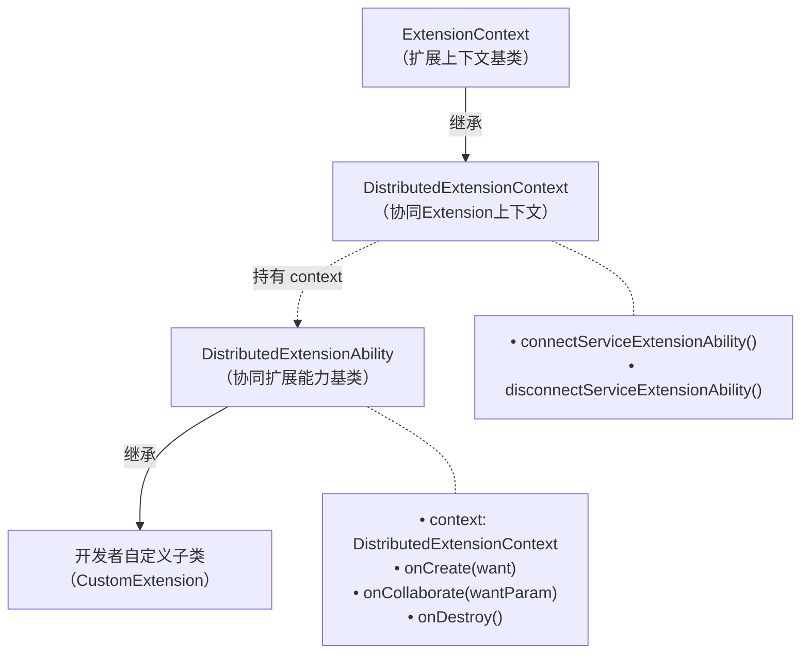

# @ohos.application.DistributedExtensionAbility (协同Extension)
<!--Kit: Distributed Service Kit-->
<!--Subsystem: DistributedSched-->
<!--Owner: @hobbycao-->
<!--Designer: @gsxiaowen-->
<!--Tester: @hanjiawei-->
<!--Adviser: @hu-zhiqiong-->

DistributedExtensionAbility（分布式扩展能力）模块提供多设备协同场景下的扩展能力基类，为应用提供分布式协同所需的统一生命周期管理机制。开发者通过继承该类并实现相关生命周期回调，可使应用具备被跨设备拉起、接受/拒绝协同请求、连接远端ServiceExtensionAbility（服务扩展能力）等协同能力，有效降低多设备协同应用的开发难度。

该模块作为应用协同架构的核心扩展基类，主要包含以下能力：

- **生命周期管理**：提供onCreate（创建）、onCollaborate（协同）、onDestroy（销毁）三个生命周期回调，覆盖协同Extension从创建到销毁的完整生命周期，使应用能够在不同阶段执行初始化、协同决策和资源清理等业务逻辑。

- **协同决策**：通过onCollaborate回调，应用在被跨设备拉起过程中，可根据调用方传输的协同参数自主决定是否接受协同请求（ACCEPT/REJECT），从而灵活控制协同流程是否继续。

- **上下文环境**：提供[DistributedExtensionContext](js-apis-distributedExtensionContext.md)上下文环境，支持连接和断开远端ServiceExtensionAbility，实现跨设备的服务调用与数据互通。

- **多端协同集成**：与[abilityConnectionManager](js-apis-distributed-abilityConnectionManager.md)（应用多端协同管理）模块配合使用，可构建完整的跨设备协同会话、连接、数据传输方案。

协同Extension的核心类结构及其与上下文、自定义子类的关系如下图所示。



如上图所示：
- **继承关系**：`DistributedExtensionContext` 继承自 `ExtensionContext`（扩展上下文）；开发者自定义子类继承自 `DistributedExtensionAbility`。
- **组合关系**：`DistributedExtensionAbility` 持有 `context` 属性，类型为 `DistributedExtensionContext`，提供连接/断开远端 `ServiceExtensionAbility` 等协同能力。

开发者通过继承 `DistributedExtensionAbility` 并实现 `onCreate`、`onCollaborate`、`onDestroy` 生命周期回调，即可获得完整的分布式协同能力。

> **说明：**
>
> 本模块首批接口从API version 20开始支持。后续版本的新增接口，采用上角标单独标记接口的起始版本。
>
> 本模块接口仅可在Stage模型下使用。

## 导入模块

```ts
import { DistributedExtensionAbility } from '@kit.DistributedServiceKit';
```

## DistributedExtensionAbility

### 属性

**模型约束**：此接口仅可在Stage模型下使用。

**系统能力**：SystemCapability.DistributedSched.AppCollaboration

**设备行为差异：** 该接口在不支持分布式业务的Wearable设备不生效。

| 名称    | 类型                          | 只读 | 可选 | 说明                                                       |
| ------- | ----------------------------- | ---- | ---- | ---------------------------------------------------------- |
| context | [DistributedExtensionContext](js-apis-distributedExtensionContext.md) | 否   | 否   | DistributedExtension（协同Extension）的上下文环境，继承自ExtensionContext。DistributedExtensionContext的设计说明请参见[DistributedExtensionContext接口](js-apis-distributedExtensionContext.md)。 |

### onCreate

onCreate(want: Want): void

Extension生命周期回调，在创建时回调，执行初始化业务逻辑操作。

**模型约束**：此接口仅可在Stage模型下使用。

**系统能力**：SystemCapability.DistributedSched.AppCollaboration

**设备行为差异：** 该接口在不支持分布式业务的Wearable设备不生效。

**参数：**

| 参数名     | 类型 | 必填                                                             | 说明 |
| ----------| ---- | ---------------------------------------------------------------- | ---- |
| want      | [Want](../apis-ability-kit/js-apis-app-ability-want.md) | 是   | 当前Extension相关的Want信息，包含ability（应用组件）名称、bundle名称等，用于携带创建Extension所需的初始化配置信息。 |

**示例：**

```ts
import { Want } from '@kit.AbilityKit';
import { DistributedExtensionAbility } from '@kit.DistributedServiceKit';

export default class DistributedExtension extends DistributedExtensionAbility {
  onCreate(want: Want) {
    console.info(`DistributedExtension Create ok`);
    console.info(`DistributedExtension on Create want: ${JSON.stringify(want)}`);
    console.info(`DistributedExtension Create end`);
  }
}
```

### onCollaborate

onCollaborate(wantParam: Record<string, Object>): AbilityConstant.CollaborateResult

Extension生命周期回调，在多设备协同场景下，协同方应用被拉起过程中返回是否接受协同的结果，返回结果决定协同流程是否继续。

**模型约束**：此接口仅可在Stage模型下使用。

**系统能力**：SystemCapability.DistributedSched.AppCollaboration

**设备行为差异：** 该接口在不支持分布式业务的Wearable设备不生效。

**参数：**

| 参数名    | 类型   | 必填 | 说明                                                                                                                                   |
| --------- | ------ | ---- | -------------------------------------------------------------------------------------------------------------------------------------- |
| wantParam | Record<string, Object> | 是   | 协同回调参数，键值对对象，携带调用方传输的协同相关数据。开发者可通过"ohos.extra.param.key.supportCollaborateIndex"和"CollaborationValues"等key值获取这些数据，以决定是否接受协同请求及处理协同逻辑，影响协同流程是否继续。 |

**返回值：**

| 类型 | 说明 |
| ---------- | ---- |
| [AbilityConstant.CollaborateResult](../apis-ability-kit/js-apis-app-ability-abilityConstant.md#collaborateresult18) | 表示协同方应用是否接受协同的结果。取值包括：**ACCEPT**表示接受协同，协同流程继续；**REJECT**表示拒绝协同，协同流程终止。 |

**示例**

```ts
 import { abilityConnectionManager, DistributedExtensionAbility } from '@kit.DistributedServiceKit';	 
 import { AbilityConstant } from '@kit.AbilityKit';	 
 
 
 export default class DistributedExtension extends DistributedExtensionAbility {	 
   onCollaborate(wantParam: Record<string, Object>) {	 
     console.info(`DistributedExtension onCollabRequest Accept to the result of Ability collaborate`);	 
     let sessionId = -1;	 
     const collaborationValues = wantParam["CollaborationValues"] as abilityConnectionManager.CollaborationValues;	 
     if (collaborationValues == undefined) {	 
       return sessionId;	 
     }	 
     console.info(`onCollab, collaborationValues: ${JSON.stringify(collaborationValues)}`);	 
     return AbilityConstant.CollaborateResult.ACCEPT;	 
   }	 
 }
```

### onDestroy

onDestroy(): void

Extension生命周期回调，在销毁时回调，执行资源清理等操作。

**模型约束**：此接口仅可在Stage模型下使用。

**系统能力**：SystemCapability.DistributedSched.AppCollaboration

**设备行为差异：** 该接口在不支持分布式业务的Wearable设备不生效。

**示例：**

```ts
import { DistributedExtensionAbility } from '@kit.DistributedServiceKit';

export default class DistributedExtension extends DistributedExtensionAbility {
  onDestroy() {
    console.info('DistributedExtension onDestroy ok');
  }
}
```
