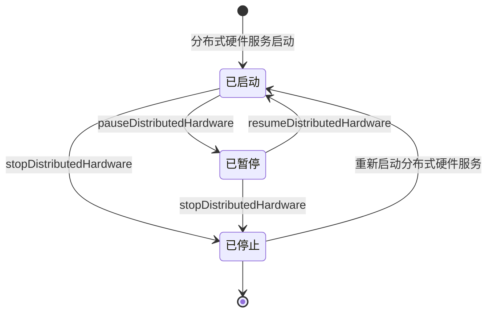

# @ohos.distributedHardware.hardwareManager (分布式硬件管理)(系统接口)
<!--Kit: Distributed Service Kit-->
<!--Subsystem: DistributedHardware-->
<!--Owner: @hwzhangchuang-->
<!--Designer: @hwzhangchuang-->
<!--Tester: @zhaodengqi-->
<!--Adviser: @hu-zhiqiong-->

分布式硬件管理模块提供了对分布式硬件的控制能力，包括暂停、恢复和停止被控端的分布式硬件业务。该模块可暂时停止分布式硬件的同步（例如暂停分布式相机或麦克风的连接），能够在特定情况下释放或恢复硬件资源，优化资源利用率。当用户需要节省被控端设备资源或减少功耗时，可通过暂停业务降低对被控端设备的影响；当需要重新启用业务时，可快速恢复或重新启动。模块支持对相机、屏幕、麦克风、扬声器等多种分布式硬件类型进行控制，支持基于源端设备的精细化控制，并提供异步操作接口，确保不影响主流程的运行。开发者可通过hasSystemCapability接口查询目标设备是否具备系统能力，以判断该设备是否支持本模块功能。

**业务状态转换示意图：**



> **说明：**
>
> 本模块首批接口从API version 11开始支持。后续版本的新增接口，采用上角标单独标记接口的起始版本。
>
> 本模块接口为系统接口。

## 导入模块

```js
import { hardwareManager } from '@kit.DistributedServiceKit';
```

## HardwareDescriptor

表示分布式硬件的描述信息。

**需要权限**：ohos.permission.ACCESS_DISTRIBUTED_HARDWARE

**系统能力**：SystemCapability.DistributedHardware.DistributedHardwareFWK

| 名称         | 类型                                                | 只读 | 可选 | 说明                                                         |
| ------------ | --------------------------------------------------- | ---- | ---- | ------------------------------------------------------------ |
| type         | [DistributedHardwareType](#distributedhardwaretype) | 否   | 否   | 指定要操作的分布式硬件类型，决定暂停、恢复或停止操作的硬件范围。例如，设置为CAMERA时仅操作分布式相机，设置为ALL时操作所有分布式硬件。使用该参数前需确保对应的分布式硬件服务已启动。 |
| srcNetworkId | string                                              | 否   | 是   | 表示源端设备，为有效设备网络ID字符串时操作指定源端设备的指定类型硬件，未提供或传空字符串时表示所有源端设备。传入无效值时返回错误码401。 |

## DistributedHardwareType

表示分布式硬件类型。

**系统能力**：SystemCapability.DistributedHardware.DistributedHardwareFWK

| 名称          | 值   | 说明                         |
| :------------ | ---- | ---------------------------- |
| ALL           | 0    | 表示所有分布式硬件。         |
| CAMERA        | 1    | 表示分布式相机。             |
| SCREEN        | 8    | 表示分布式屏幕。             |
| MODEM_MIC     | 256  | 表示分布式移动通话的麦克风。 |
| MODEM_SPEAKER | 512  | 表示分布式移动通话的扬声器。 |
| MIC           | 1024 | 表示分布式麦克风。           |
| SPEAKER       | 2048 | 表示分布式扬声器。           |

## DistributedHardwareErrorCode

分布式硬件错误码的枚举。

**系统能力**：SystemCapability.DistributedHardware.DistributedHardwareFWK

| 名称                                      | 值       | 说明                             |
| ----------------------------------------- | -------- | -------------------------------- |
| ERR_CODE_DISTRIBUTED_HARDWARE_NOT_STARTED | 24200101 | 表示指定的分布式硬件服务未启动。 |
| ERR_CODE_DEVICE_NOT_CONNECTED             | 24200102 | 表示指定的源端设备未建立连接。   |

## hardwareManager.pauseDistributedHardware

pauseDistributedHardware(description: HardwareDescriptor): Promise&lt;void&gt;

暂停被控端分布式硬件业务。被控端指通过分布式能力连接的远端设备，分布式硬件业务指通过分布式能力调用的相机、麦克风等硬件功能。使用promise异步回调，暂停后可以调用resumeDistributedHardware恢复业务或stopDistributedHardware停止业务。调用此方法前需确保分布式硬件已启动。使用场景：在多设备协同场景下临时暂停某些设备的硬件功能（如暂停远端相机以节省带宽）；当系统资源紧张时暂停非关键的分布式硬件以释放资源；切换设备配置时暂时停止当前硬件同步。

**需要权限**：ohos.permission.ACCESS_DISTRIBUTED_HARDWARE

**系统能力**：SystemCapability.DistributedHardware.DistributedHardwareFWK

**参数：**

| 参数名       | 类型                                       | 必填   | 说明       |
| --------- | ---------------------------------------- | ---- | -------- |
| description | [HardwareDescriptor](#hardwaredescriptor) | 是   | 硬件描述信息，用于指定要操作的分布式硬件类型和源端设备。 |

**返回值：**

| 类型                  | 说明               |
| ------------------- | ---------------- |
| Promise&lt;void&gt; | Promise对象，异步操作成功时无返回结果，失败时返回错误码和错误信息。 |

**错误码：**

| 错误码ID | 错误信息                                             | 说明                                                     |
| -------- | ---------------------------------------------------- | -------------------------------------------------------- |
| 201      | Permission verification failed.                      | 权限验证失败，请确保已申请ohos.permission.ACCESS_DISTRIBUTED_HARDWARE权限。   |
| 202      | Permission denied, non-system app called system api. | 权限被拒绝，非系统应用调用了系统接口，请确保应用为系统应用。       |
| 401      | Input parameter error.                               | 输入参数错误，请检查参数类型和范围是否正确。               |
| 24200101 | The specified distributed hardware is not started.   | 指定的分布式硬件未启动，请先启动分布式硬件服务。       |
| 24200102 | The specified source device is not connected.        | 指定的源端设备未建立连接，请检查设备连接状态。         |

**示例：**

  ```ts
  import { hardwareManager } from '@kit.DistributedServiceKit';
  import { BusinessError } from '@kit.BasicServicesKit';
  
  try {
    let description: hardwareManager.HardwareDescriptor = {
      type: 1, // 分布式硬件类型，1表示相机
      srcNetworkId: '1111' // 源端设备网络ID
    };
    hardwareManager.pauseDistributedHardware(description).then(() => { // 暂停分布式硬件业务
      console.info('pause distributed hardware successfully');
    }).catch((error: BusinessError) => {
      console.error(`pause distributed hardware failed, cause: ${error.code}, message: ${error.message}`);
    });
  } catch (error) {
    const err: BusinessError = error as BusinessError;
    console.error(`pause distributed hardware failed, code: ${err.code}, message: ${err.message}`);
  }
  ```

## hardwareManager.resumeDistributedHardware

resumeDistributedHardware(description: HardwareDescriptor): Promise&lt;void&gt;

恢复被控端分布式硬件业务。被控端对应的分布式硬件业务恢复正常运行。使用promise异步回调，**必须在pauseDistributedHardware暂停后调用**，用于恢复已暂停的业务。调用此方法前需确保分布式硬件已启动。使用场景：当多设备协同场景下需要重新启用已暂停的硬件功能时；当系统资源恢复后重新激活非关键分布式硬件时；切换设备配置完成时恢复硬件同步功能。

**需要权限**：ohos.permission.ACCESS_DISTRIBUTED_HARDWARE

**系统能力**：SystemCapability.DistributedHardware.DistributedHardwareFWK

**参数：**

| 参数名      | 类型                                      | 必填 | 说明                                                     |
| ----------- | ----------------------------------------- | ---- | -------------------------------------------------------- |
| description | [HardwareDescriptor](#hardwaredescriptor) | 是   | 硬件描述信息，用于指定要操作的分布式硬件类型和源端设备。 |

**返回值：**

| 类型                | 说明                      |
| ------------------- | ------------------------- |
| Promise&lt;void&gt; | Promise对象，异步操作成功时无返回结果，失败时返回错误码和错误信息。 |

**错误码：**

| 错误码ID | 错误信息                                             | 说明                                                     |
| -------- | ---------------------------------------------------- | -------------------------------------------------------- |
| 201      | Permission verification failed.                      | 权限验证失败，请确保已申请ohos.permission.ACCESS_DISTRIBUTED_HARDWARE权限。   |
| 202      | Permission denied, non-system app called system api. | 权限被拒绝，非系统应用调用了系统接口，请确保应用为系统应用。       |
| 401      | Input parameter error.                               | 输入参数错误，请检查参数类型和范围是否正确。               |
| 24200101 | The specified distributed hardware is not started.   | 指定的分布式硬件未启动，请先启动分布式硬件服务。       |
| 24200102 | The specified source device is not connected.        | 指定的源端设备未建立连接，请检查设备连接状态。         |

**示例：**

  ```ts
  import { hardwareManager } from '@kit.DistributedServiceKit';
  import { BusinessError } from '@kit.BasicServicesKit';

  try {
    let description: hardwareManager.HardwareDescriptor = {
      type: 1, // 分布式硬件类型，1表示相机
      srcNetworkId: '1111' // 源端设备网络ID
    };
    hardwareManager.resumeDistributedHardware(description).then(() => { // 恢复分布式硬件业务
      console.info('resume distributed hardware successfully');
    }).catch((error: BusinessError) => {
      console.error(`resume distributed hardware failed, cause: ${error.code}, message: ${error.message}`);
    });
  } catch (error) {
    const err: BusinessError = error as BusinessError;
    console.error(`resume distributed hardware failed, code: ${err.code}, message: ${err.message}`);
  }


  ```

## hardwareManager.stopDistributedHardware

stopDistributedHardware(description: HardwareDescriptor): Promise&lt;void&gt;

停止被控端分布式硬件业务。被控端对应的分布式硬件业务停止。使用promise异步回调。停止后无法通过resumeDistributedHardware恢复业务，需要重新启动分布式硬件服务，不能再调用pauseDistributedHardware或resumeDistributedHardware。调用此方法前需确保分布式硬件已启动。使用场景：当应用退出或不再需要分布式硬件功能时；当用户主动关闭分布式硬件服务时；当设备断开连接需要释放分布式硬件资源时。

**需要权限**：ohos.permission.ACCESS_DISTRIBUTED_HARDWARE

**系统能力**：SystemCapability.DistributedHardware.DistributedHardwareFWK

**参数：**

| 参数名      | 类型                                      | 必填 | 说明           |
| ----------- | ----------------------------------------- | ---- | -------------- |
| description | [HardwareDescriptor](#hardwaredescriptor) | 是   | 硬件描述信息，用于指定要操作的分布式硬件类型和源端设备。 |

**返回值：**

| 类型                | 说明                      |
| ------------------- | ------------------------- |
| Promise&lt;void&gt; | Promise对象，异步操作成功时无返回结果，失败时返回错误码和错误信息。 |

**错误码：**

| 错误码ID | 错误信息                                             | 说明                                                     |
| -------- | ---------------------------------------------------- | -------------------------------------------------------- |
| 201      | Permission verification failed.                      | 权限验证失败，请确保已申请ohos.permission.ACCESS_DISTRIBUTED_HARDWARE权限。   |
| 202      | Permission denied, non-system app called system api. | 权限被拒绝，非系统应用调用了系统接口，请确保应用为系统应用。       |
| 401      | Input parameter error.                               | 输入参数错误，请检查参数类型和范围是否正确。               |
| 24200101 | The specified distributed hardware is not started.   | 指定的分布式硬件未启动，请先启动分布式硬件服务。       |
| 24200102 | The specified source device is not connected.        | 指定的源端设备未建立连接，请检查设备连接状态。         |

**示例：**

  ```ts
  import { hardwareManager } from '@kit.DistributedServiceKit';
  import { BusinessError } from '@kit.BasicServicesKit';
  
  try {
    let description: hardwareManager.HardwareDescriptor = {
      type: 1,  // 分布式硬件类型，1表示相机
      srcNetworkId: '1111' // 源端设备网络ID
    };
    hardwareManager.stopDistributedHardware(description).then(() => { // 停止分布式硬件业务
      console.info('stop distributed hardware successfully');
    }).catch((error: BusinessError) => {
      console.error(`stop distributed hardware failed, cause: ${error.code}, message: ${error.message}`);
    });
  } catch (error) {
    const err: BusinessError = error as BusinessError;
    console.error(`stop distributed hardware failed, code: ${err.code}, message: ${err.message}`);
  }
  ```
