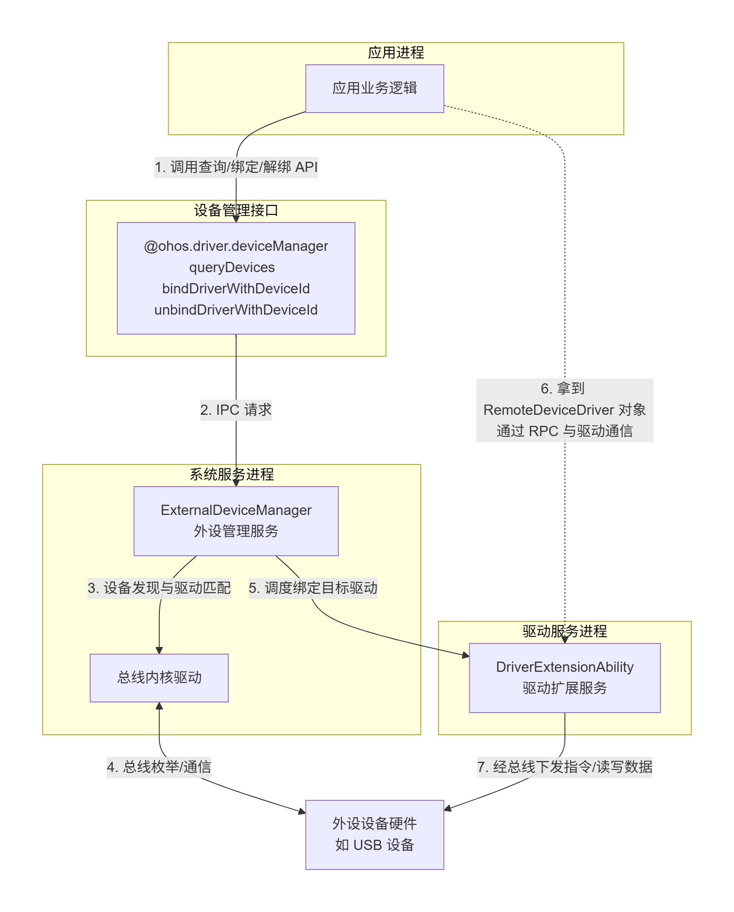

# @ohos.driver.deviceManager(外设管理)

本模块是驱动开发套件提供的设备管理接口集合，提供外接设备信息的查询能力、应用与外设驱动之间的绑定与解绑能力。本模块的接口可用于实现以下功能：

- 查询系统中已接入的外设设备列表。  
- 绑定指定外设设备并获取远程驱动通信对象，从而能通过跨进程通信与外设驱动进行数据交互。  
- 使用完毕后解绑设备，释放资源。

本模块的外设访问能力需要多个 API 组合完成，典型调用流程为：**查询设备 → 绑定设备获取通信对象 → 通过通信对象与驱动交互 → 解绑设备释放资源**。设备绑定的生命周期视图如下：



> **说明：** 
> 本模块首批接口从API version 10开始支持。后续版本的新增接口，采用上角标单独标记接口的起始版本。调用本模块接口需要申请权限 ohos.permission.ACCESS_EXTENSIONAL_DEVICE_DRIVER（查询/绑定/解绑）或 ohos.permission.ACCESS_DDK_DRIVERS（新版本的绑定/解绑接口）。

**起始版本：** 10

**系统能力：** SystemCapability.Driver.ExternalDevice

## 导入模块

```TypeScript
import { deviceManager } from '@kit.DriverDevelopmentKit';
```

## 汇总

### 函数

| 名称 | 说明 |
| --- | --- |
| [bindDevice](arkts-driverdevelopment-devicemanager-binddevice-f.md#binddevice) | 根据queryDevices()返回的设备信息绑定设备。必须和unbindDevice接口成对使用。 |
| [bindDevice](arkts-driverdevelopment-devicemanager-binddevice-f.md#binddevice-1) | 根据queryDevices()返回的设备信息绑定设备。必须和unbindDevice接口成对使用。使用Promise异步回调。 |
| [bindDeviceDriver](arkts-driverdevelopment-devicemanager-binddevicedriver-f.md#binddevicedriver) | 根据queryDevices()返回的设备信息绑定设备。必须与unbindDevice接口成对使用。 |
| [bindDeviceDriver](arkts-driverdevelopment-devicemanager-binddevicedriver-f.md#binddevicedriver-1) | 根据queryDevices()返回的设备信息绑定设备。必须与unbindDevice接口成对使用。使用Promise异步回调。 |
| [bindDriverWithDeviceId](arkts-driverdevelopment-devicemanager-binddriverwithdeviceid-f.md) | 根据queryDevices()返回的设备信息绑定设备，必须与unbindDriverWithDeviceId接口成对使用。使用Promise异步回调。 |
| [queryDevices](arkts-driverdevelopment-devicemanager-querydevices-f.md) | 获取接入主设备的外部设备列表。如果没有设备接入，那么将会返回一个空的列表。 |
| [unbindDevice](arkts-driverdevelopment-devicemanager-unbinddevice-f.md#unbinddevice) | 解除设备绑定。必须先通过bindDevice接口绑定设备。 |
| [unbindDevice](arkts-driverdevelopment-devicemanager-unbinddevice-f.md#unbinddevice-1) | 解除设备绑定。必须先通过bindDevice接口绑定设备。使用Promise异步回调。 |
| [unbindDriverWithDeviceId](arkts-driverdevelopment-devicemanager-unbinddriverwithdeviceid-f.md) | 解除设备绑定，调用前需要先通过bindDriverWithDeviceId绑定设备。使用Promise异步回调。 |

<!--Del-->
### 函数（系统接口）

| 名称 | 说明 |
| --- | --- |
| [queryDeviceInfo](arkts-driverdevelopment-devicemanager-querydeviceinfo-f-sys.md) | 查询扩展外设详细信息列表。如果没有设备接入，那么将会返回一个空的列表。 |
| [queryDriverInfo](arkts-driverdevelopment-devicemanager-querydriverinfo-f-sys.md) | 查询扩展外设驱动详细信息列表。如果没有设备接入，那么将会返回一个空的列表。 |
<!--DelEnd-->

### 接口

| 名称 | 说明 |
| --- | --- |
| [Device](arkts-driverdevelopment-devicemanager-device-i.md) | 外设信息。 |
| [RemoteDeviceDriver](arkts-driverdevelopment-devicemanager-remotedevicedriver-i.md) | 远程设备驱动。 |
| [USBDevice](arkts-driverdevelopment-devicemanager-usbdevice-i.md) | USB设备信息，继承自[Device](arkts-driverdevelopment-devicemanager-device-i.md)。 |

<!--Del-->
### 接口（系统接口）

| 名称 | 说明 |
| --- | --- |
| [DeviceInfo](arkts-driverdevelopment-devicemanager-deviceinfo-i-sys.md) | 设备详细信息。 |
| [DriverInfo](arkts-driverdevelopment-devicemanager-driverinfo-i-sys.md) | 驱动详细信息。 |
| [USBDeviceInfo](arkts-driverdevelopment-devicemanager-usbdeviceinfo-i-sys.md) | USB设备详细信息，继承自[DeviceInfo](arkts-driverdevelopment-devicemanager-deviceinfo-i-sys.md)。 |
| [USBDriverInfo](arkts-driverdevelopment-devicemanager-usbdriverinfo-i-sys.md) | USB设备驱动详细信息，继承自[DriverInfo](arkts-driverdevelopment-devicemanager-driverinfo-i-sys.md)。 |
| [USBInterfaceDesc](arkts-driverdevelopment-devicemanager-usbinterfacedesc-i-sys.md) | USB设备接口描述符。 |
<!--DelEnd-->

### 枚举

| 名称 | 说明 |
| --- | --- |
| [BusType](arkts-driverdevelopment-devicemanager-bustype-e.md) | 设备总线类型。 |
