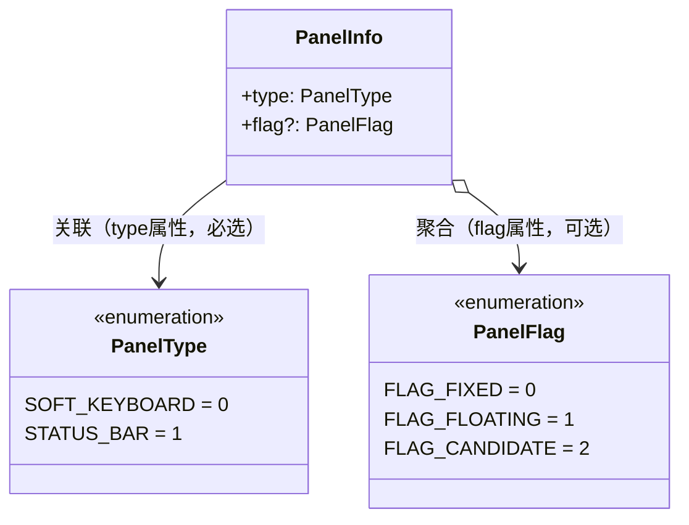

# @ohos.inputMethod.Panel (输入法面板)
<!--Kit: IME Kit-->
<!--Subsystem: MiscServices-->
<!--Owner: @codexu62-->
<!--Designer: @andeszhang-->
<!--Tester: @murphy84-->
<!--Adviser: @zhang_yixin13-->

**@ohos.inputMethod.Panel**模块提供输入法面板属性的数据定义，支持配置面板的类型和显示状态，适用于需要精细化控制输入法面板显示行为的场景。

本模块是输入法框架的面板属性数据模块，定义了`PanelInfo`接口以及`PanelType`、`PanelFlag`两个枚举类型，用于描述输入法面板的类型（软键盘或状态栏）和显示状态（固定态、悬浮态、候选词态）。

本模块提供输入法面板属性的配置能力。输入法应用可通过`PanelInfo`指定面板类型和状态类型，实现不同形态的面板展示——固定态软键盘（默认，固定在屏幕底部）、悬浮态软键盘（可自由拖动位置）、候选词态面板（独立窗口展示候选词，由开发者自行控制显隐）。

当输入法应用需要创建和配置输入法面板时使用本模块。典型场景包括：输入法应用创建默认固定态软键盘面板、输入法应用创建悬浮态键盘以支持自由拖动、输入法应用创建候选词面板以展示输入候选。

> **说明：**
>
>本模块首批接口从API version 11开始支持。后续版本的新增接口，采用上角标单独标记接口的起始版本。

数据类型需与`@ohos.inputMethodEngine`模块的API组合使用——在`InputMethodAbility.createPanel()`创建面板时传入`PanelInfo`指定面板类型和状态。典型使用流程：构造PanelInfo → 通过createPanel传入 → 系统据此创建对应类型的面板。不同PanelFlag值对应不同的面板行为：固定态面板固定在屏幕底部、悬浮态面板可自由拖动、候选词态面板由开发者自行控制显隐。

本模块定义了以下关键Interface和枚举类型：

| Interface/类型 | 说明 |
|---|---|
| **PanelInfo** | 输入法面板属性信息接口，包含`type`（面板类型）和`flag`（面板状态类型，默认`FLAG_FIXED`）两个属性，用于描述一个输入法面板的类型和显示形态。 |
| **PanelType** | 输入法面板类型枚举，定义面板的类别：`SOFT_KEYBOARD`（软键盘，值为0）、`STATUS_BAR`（状态栏，值为1）。 |
| **PanelFlag** | 输入法面板状态类型枚举，定义面板的显示状态：`FLAG_FIXED`（固定态，值为0）、`FLAG_FLOATING`（悬浮态，值为1）、`FLAG_CANDIDATE`（候选词态，值为2）。候选词态面板的显隐需由开发者自行控制。 |

本模块为纯数据定义模块，`PanelInfo`作为面板属性配置需与其他模块的API组合使用。典型组合为：在`@ohos.inputMethodEngine`模块中，通过`InputMethodAbility.createPanel()`创建面板时传入`PanelInfo`指定面板类型和状态。

```javascript
// 以下为阐述调用逻辑的伪代码

// 1. 配置固定态软键盘面板属性
let softKeyboardFixed = {
  type: PanelType.SOFT_KEYBOARD,
  flag: PanelFlag.FLAG_FIXED
};

// 2. 配置悬浮态软键盘面板属性
let softKeyboardFloating = {
  type: PanelType.SOFT_KEYBOARD,
  flag: PanelFlag.FLAG_FLOATING
};

// 3. 配置候选词态面板属性
let candidatePanel = {
  type: PanelType.SOFT_KEYBOARD,
  flag: PanelFlag.FLAG_CANDIDATE
};

// 4. 在输入法应用中，使用InputMethodAbility创建面板（跨模块组合）
// let inputMethodAbility = inputMethodEngine.getInputMethodAbility();
// let panel = inputMethodAbility.createPanel(context, softKeyboardFixed);

// 5. 候选词态面板的显隐需开发者自行控制
// panel.show();   // 开发者主动显示
// panel.hide();   // 开发者主动隐藏
```

> **说明：**
>
> `FLAG_CANDIDATE`（候选词态）面板的显示和隐藏不受输入法服务主动控制，开发者需根据应用场景自行管理候选词面板的显隐时机。

UML类图如下：


> **说明：**
>
> `PanelInfo`与`PanelType`为**关联关系**：`PanelInfo`通过必选的`type`属性持有`PanelType`，指定面板的类别。
> `PanelInfo`与`PanelFlag`为**聚合关系**（空心菱形◇）：`PanelInfo`通过可选的`flag`属性持有`PanelFlag`，指定面板的显示状态，默认为`FLAG_FIXED`。

## 导入模块

```ts
import { PanelInfo, PanelType, PanelFlag } from '@kit.IMEKit';
```

## PanelInfo

输入法面板属性信息。用于描述输入法面板的类型和显示状态，在创建输入法面板时作为配置参数传入。

- **含义/功能**：定义输入法面板的类型（软键盘或状态栏）和显示状态（固定态、悬浮态或候选词态），作为`InputMethodAbility.createPanel()`的配置参数，决定创建的面板形态。
- **使用场景**：当输入法应用需要通过`createPanel()`创建输入法面板时使用，用于指定面板的类型和状态。例如：创建默认的固定态软键盘面板、创建可自由拖动的悬浮态软键盘面板、创建独立显示候选词的候选词态面板。
- **使用后效果**：设置的`type`和`flag`将决定创建的面板类型和显示形态。设置完成后，系统将按指定类型和状态创建面板，面板的显隐行为由`flag`决定——固定态和悬浮态由系统控制显隐，候选词态由开发者自行控制。

**系统能力：** SystemCapability.MiscServices.InputMethodFramework

| 名称 | 类型 | 只读 | 可选 | 说明 |
| -------- | -------- | -------- | -------- | -------- |
| type | [PanelType](#paneltype) | 否 | 否 | 输入法面板类型。决定面板是软键盘还是状态栏。不填写时默认为`SOFT_KEYBOARD`(0)。 |
| flag | [PanelFlag](#panelflag) | 否 | 是 | 输入法面板状态类型。<br/>- 默认值为`FLAG_FIXED`(0)，表示固定态面板类型。<br/>- 当前仅用于描述软键盘类型的面板的状态。<br/>- 不同状态类型下面板的显隐行为不同：`FLAG_FIXED`和`FLAG_FLOATING`由系统控制显隐，`FLAG_CANDIDATE`由开发者自行控制显隐。 |

**PanelInfo参数使用建议：**

- **type参数**：
  - **取值范围**：[PanelType](#paneltype)枚举值，即`SOFT_KEYBOARD`(0)或`STATUS_BAR`(1)。
  - **默认值**：`SOFT_KEYBOARD`(0)。不填写时默认创建软键盘类型面板。
  - **相关参数间的配合/制约关系**：`flag`属性当前仅用于描述`SOFT_KEYBOARD`类型面板的状态。当`type`为`STATUS_BAR`时，`flag`的设置不产生实际效果。

- **flag参数**：
  - **取值范围**：[PanelFlag](#panelflag)枚举值，即`FLAG_FIXED`(0)、`FLAG_FLOATING`(1)或`FLAG_CANDIDATE`(2)。
  - **默认值**：`FLAG_FIXED`(0)。不填写时默认为固定态面板。
  - **使用场景**：不同场景应选择不同的flag值：
    - `FLAG_FIXED`(0)：适用于大多数默认输入场景，面板固定在屏幕底部，由系统控制显隐。
    - `FLAG_FLOATING`(1)：适用于需要自由调整面板位置的场景（如横屏输入、多窗口环境），面板可拖动，由系统控制显隐。
    - `FLAG_CANDIDATE`(2)：适用于需要独立展示候选词的场景，面板为候选词窗口，由开发者自行控制显隐时机。
  - **使用后效果**：
    - 设置`FLAG_FIXED`时：面板固定在屏幕底部，输入法服务主动控制面板的显示和隐藏。
    - 设置`FLAG_FLOATING`时：面板为悬浮窗口，可自由拖动位置，输入法服务主动控制面板的显示和隐藏。
    - 设置`FLAG_CANDIDATE`时：面板为候选词窗口，输入法服务不会主动控制其显隐，开发者需通过`Panel.show()`和`Panel.hide()`自行控制显示和隐藏时机。
  - **规格限制**：当前仅用于`SOFT_KEYBOARD`类型面板。对`STATUS_BAR`类型面板设置`flag`不产生实际效果。
  - **注意事项**：选择`FLAG_CANDIDATE`时，开发者需自行管理候选词面板的显隐，包括在用户开始输入时调用`Panel.show()`显示面板、在输入结束或用户选择候选词后调用`Panel.hide()`隐藏面板。

## PanelType

输入法面板类型枚举。定义面板的类别，决定面板是软键盘还是状态栏。

**系统能力**：SystemCapability.MiscServices.InputMethodFramework

| 名称          | 值   | 说明         | 使用场景 |
| ------------- | ---- | ------------ | -------- |
| SOFT_KEYBOARD | 0    | 软键盘类型。 | 适用于需要键盘输入交互的场景，是输入法应用的主要面板类型。大多数输入法应用至少需要创建一个软键盘面板。 |
| STATUS_BAR    | 1    | 状态栏类型。 | 适用于需要在屏幕顶部显示输入法状态信息（如当前输入语言、输入模式等）的场景。通常作为辅助面板与软键盘面板配合使用。 |

**PanelType使用建议：**

- **选取原则**：输入法应用通常需要创建一个`SOFT_KEYBOARD`面板作为主键盘界面。`STATUS_BAR`面板为可选面板，仅在需要显示输入法状态信息时创建。
- **规格限制**：单个输入法应用仅允许创建一个`SOFT_KEYBOARD`类型和一个`STATUS_BAR`类型的面板。重复创建同类型面板将返回错误。
- **相关接口间的配合/制约关系**：`PanelType`需配合`PanelFlag`使用。当前`PanelFlag`仅用于描述`SOFT_KEYBOARD`类型面板的状态；对`STATUS_BAR`类型面板，`PanelFlag`的设置不产生实际效果。

## PanelFlag

输入法面板状态类型枚举。定义面板的显示状态形态，决定面板是固定态、悬浮态还是候选词态。

> **说明：**
>
>目前仅用于SOFT_KEYBOARD类型的面板。对STATUS_BAR类型的面板设置PanelFlag不产生实际效果。

**系统能力**：SystemCapability.MiscServices.InputMethodFramework

| 名称           | 值   | 说明                                                         | 使用场景 | 使用后效果 |
| -------------- | ---- | ------------------------------------------------------------ | -------- | -------- |
| FLAG_FIXED     | 0    | 固定态面板类型。                                             | 适用于大多数默认输入场景，面板固定在屏幕底部。 | 面板固定在屏幕底部显示，输入法服务主动控制面板的显隐。 |
| FLAG_FLOATING  | 1    | 悬浮态面板类型。                                             | 适用于需要自由调整面板位置的场景（如横屏输入、多窗口环境、平板设备）。 | 面板为悬浮窗口，可自由拖动位置，输入法服务主动控制面板的显隐。 |
| FLAG_CANDIDATE  | 2    | 候选词态面板类型。<br/>- 当输入面板为候选词态时，面板为显示用户输入候选词的窗口。<br/>- 输入法服务不会主动控制候选词态面板的显示和隐藏，需要开发者根据应用场景自行控制候选词态面板的显示和隐藏。 | 适用于需要独立展示候选词的场景，如搜索联想词、输入建议列表等。 | 面板为独立的候选词窗口，开发者需通过`Panel.show()`和`Panel.hide()`自行控制显隐。输入法服务不主动控制其显隐。 |

**PanelFlag使用建议：**

- **选取原则**：
  - 默认场景优先选择`FLAG_FIXED`(0)，这是最常用的面板状态，系统自动管理显隐，开发者无需额外处理。
  - 需要灵活布局（如横屏模式、多窗口）时选择`FLAG_FLOATING`(1)，可通过`Panel.moveTo()`调整面板位置。
  - 需要独立候选词展示时选择`FLAG_CANDIDATE`(2)，但需开发者自行管理显隐逻辑。
- **缺省配置**：默认值为`FLAG_FIXED`(0)。在`PanelInfo`中不设置`flag`时，面板默认为固定态。
- **注意事项**：选择`FLAG_CANDIDATE`时，开发者必须自行实现候选词面板的显隐管理逻辑，否则面板将不会自动显示或隐藏。建议在用户开始输入时显示、在输入结束或选择候选词后隐藏。
