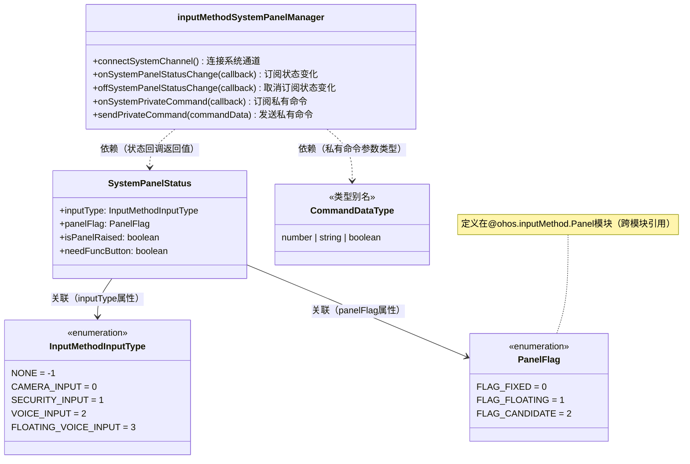

# @ohos.inputMethodSystemPanelManager (输入法系统面板管理器)(系统接口)
<!--Kit: IME Kit-->
<!--Subsystem: MiscServices-->
<!--Owner: @codexu62-->
<!--Designer: @andeszhang-->
<!--Tester: @murphy84-->
<!--Adviser: @zhang_yixin13-->

**@ohos.inputMethodSystemPanelManager**模块是面向系统应用的输入法系统面板管理模块，用于输入法系统面板与系统预置输入法应用之间的通信和状态同步。

本模块是一个系统接口模块，提供输入法系统面板（系统级面板组件）与系统预置输入法应用之间的双向通信通道。系统面板通过本模块可以感知输入法状态变化、接收输入法应用发送的私有命令，也可向输入法应用发送私有命令。

本模块提供三大核心能力：1）通过`connectSystemChannel`建立系统面板与输入法应用之间的通信通道；2）通过`onSystemPanelStatusChange`订阅系统面板状态变化（包括输入类型、面板标志、面板升起状态、功能按钮需求），系统面板据此自适应调整自身布局；3）通过`onSystemPrivateCommand`/`sendPrivateCommand`实现系统面板与输入法应用之间的私有数据双向通信，用于传递自定义指令和配置数据。

当开发输入法系统面板（系统级面板组件）时使用本模块。系统面板需要与系统预置输入法应用协同工作时，须先调用`connectSystemChannel`建立通道，再订阅状态变化和私有命令事件。本模块仅系统应用可调用，且仅支持Stage模型。

**起始版本：** 26.0.0

> **说明：**
>
> 本模块接口为系统接口。
>
> 本模块仅支持Stage模型。

本模块的核心开放能力由以下关键类型承载：

| Interface/Enum | 说明 |
|---|---|
| **SystemPanelStatus** | 系统面板状态信息，描述当前系统面板的输入类型（InputMethodInputType）、面板标志（PanelFlag）、面板升起状态和功能按钮需求。当输入法状态变化时，系统面板通过订阅此状态调整自身布局。 |
| **InputMethodInputType** | 输入类型枚举，标识系统面板支持的输入模式，包括无输入、相机输入、安全输入、语音输入和悬浮语音输入五种类型，对应不同的输入场景和面板布局。 |
| **CommandDataType** | 私有数据类型联合类型（number、string 、boolean），用于私有命令通信中参数的具体类型定义。 |

本模块的核心功能通过命名空间级函数直接提供，无需获取实例对象：

— **私有数据命令通信**：系统面板与输入法应用之间的双向自定义数据传输。系统面板可通过[sendPrivateCommand](#inputmethodsystempanelmanagersendprivatecommand)向输入法应用发送私有命令，通过[onSystemPrivateCommand](#inputmethodsystempanelmanageronsystemprivatecommand)接收输入法应用发送的私有命令。私有数据通道常用于设备级厂商在特定设备上实现自定义的输入法功能。

— **面板状态同步**：系统面板通过[onSystemPanelStatusChange](#inputmethodsystempanelmanageronsystempanelstatuschange)订阅并获取面板状态变化通知，包括输入类型、面板标志、底部抬高状态和功能按钮需求等。

本模块与输入法框架其他模块的关系如下：

— [@ohos.inputMethodEngine](js-apis-inputmethodengine.md)：面向输入法应用，提供输入法服务端能力。输入法应用侧通过[inputMethodEngine.on('privateCommand')](js-apis-inputmethodengine.md#onprivatecommand12)接收系统面板发送的私有命令，通过[inputMethodEngine.sendPrivateCommand](js-apis-inputmethodengine.md#sendprivatecommand12)（TextInputClient方法）向文本框或系统组件发送私有命令。

— [@ohos.inputMethod.Panel](js-apis-inputmethod-panel.md)：定义面板属性类型[PanelFlag](js-apis-inputmethod-panel.md#panelflag)和[PanelType](js-apis-inputmethod-panel.md#paneltype)，本模块的SystemPanelStatus中引用了PanelFlag类型。

— **@ohos.inputMethodSystemPanelManager（本模块）**：面向系统面板，提供系统面板与输入法应用之间的通信和状态同步能力。

**典型调用流程：** [connectSystemChannel](#inputmethodsystempanelmanagerconnectsystemchannel)（建立通信通道）→ [onSystemPrivateCommand](#inputmethodsystempanelmanageronsystemprivatecommand) / [onSystemPanelStatusChange](#inputmethodsystempanelmanageronsystempanelstatuschange)（订阅事件）→ [sendPrivateCommand](#inputmethodsystempanelmanagersendprivatecommand)（发送私有命令）。在使用本模块的通信和订阅接口前，需先调用connectSystemChannel建立系统通道连接。

使用本模块需要多个API组合配合：先调用`connectSystemChannel`建立通信通道 -> 再订阅状态变化和私有命令事件 -> 在事件回调中处理状态数据和私有命令 -> 可通过`sendPrivateCommand`向输入法应用发送命令。

```javascript
// 以下为阐述调用逻辑的伪代码

// 1. 连接系统通道（必须在其他操作之前调用）
inputMethodSystemPanelManager.connectSystemChannel();

// 2. 订阅系统面板状态变化事件
inputMethodSystemPanelManager.onSystemPanelStatusChange((status) => {
  // 根据status.inputType调整面板布局（相机/安全/语音等）
  // 根据status.panelFlag切换面板状态（固定态/悬浮态/候选态）
  // 根据status.isPanelRaised决定是否底部抬高
  // 根据status.needFuncButton决定是否显示功能按钮
});

// 3. 订阅输入法应用发送的私有命令
inputMethodSystemPanelManager.onSystemPrivateCommand((commandData) => {
  // 处理输入法应用发来的自定义指令
});

// 4. 向输入法应用发送私有命令
inputMethodSystemPanelManager.sendPrivateCommand({ 'key1': 1, 'key2': 'value' });

// 5. 不再需要时取消订阅
inputMethodSystemPanelManager.offSystemPanelStatusChange();
inputMethodSystemPanelManager.offSystemPrivateCommand();
```

> **说明：**
>
> `connectSystemChannel`必须在订阅事件和发送命令之前调用，否则相关操作将因通道未连接而返回错误码12800026。

UML类图如下：



> **说明：**
>
> `inputMethodSystemPanelManager`与`SystemPanelStatus`为**依赖关系**：`onSystemPanelStatusChange`回调的返回值使用`SystemPanelStatus`类型。
> `inputMethodSystemPanelManager`与`CommandDataType`为**依赖关系**：`sendPrivateCommand`和`onSystemPrivateCommand`的参数类型使用`Record<string, CommandDataType>`。
> `SystemPanelStatus`与`InputMethodInputType`为**关联关系**：`SystemPanelStatus`的必选`inputType`属性持有`InputMethodInputType`值。
> `SystemPanelStatus`与`PanelFlag`为**关联关系**：`SystemPanelStatus`的必选`panelFlag`属性持有`PanelFlag`值。`PanelFlag`定义在@ohos.inputMethod.Panel模块（跨模块引用）。

## 导入模块

```ts
import { inputMethodSystemPanelManager } from '@kit.IMEKit';
```

## SystemPanelStatus

系统面板状态信息，用于描述当前系统面板的输入类型、面板标志、升起状态和功能按钮需求。当系统面板状态发生变化时，会通过[onSystemPanelStatusChange](#inputmethodsystempanelmanageronsystempanelstatuschange)接口通知订阅者。

**系统能力：** SystemCapability.MiscServices.InputMethodFramework

| 名称 | 类型 | 只读 | 可选 | 说明 |
| -------- | -------- | -------- | -------- | -------- |
| inputType | [InputMethodInputType](#inputmethodinputtype) | 否 | 否 | 输入法的输入类型，标识当前系统面板所处的输入模式。<br>**使用场景：** 当需要根据不同输入模式调整面板行为或布局时，使用此属性判断当前输入类型。<br>**使用后效果：** 不同inputType值对应不同的面板交互行为，例如SECURITY_INPUT类型下面板会进入安全输入模式。 |
| panelFlag | [PanelFlag](js-apis-inputmethod-panel.md#panelflag) | 否 | 否 | 输入法软键盘面板的面板标志，表示面板的显示状态（固定态、悬浮态或候选词态）。<br>**使用场景：** 当需要根据面板显示状态调整布局或交互行为时，使用此属性。<br>**使用后效果：** 不同panelFlag值对应不同的面板显示形态：FLAG_FIXED表示面板固定在屏幕底部，FLAG_FLOATING表示面板悬浮显示，FLAG_CANDIDATE表示面板为候选词窗口。<br>**相关参数间的配合/制约关系：** panelFlag目前仅用于SOFT_KEYBOARD类型的面板。 |
| isPanelRaised | boolean | 否 | 否 | 系统面板是否需要底部抬高。true表示面板需要底部抬高（面板底部区域向上偏移，为下方其他UI元素留出空间），false表示不需要。<br>**使用场景：** 当系统面板下方有其他UI元素（如导航栏、工具条等）需要显示时，通过设置此属性为true使面板底部抬高，避免面板遮挡下方内容。<br>**使用后效果：** 设置为true时，面板底部区域会向上偏移；设置为false时，面板正常显示不做抬高处理。 |
| needFuncButton | boolean | 否 | 否 | 系统面板是否需要功能按钮。true表示面板需要显示功能按钮（如设置、切换输入法等操作按钮），false表示不需要。<br>**使用场景：** 当需要在面板上提供快捷功能入口时，通过设置此属性为true在面板区域显示功能按钮。<br>**使用后效果：** 设置为true时，面板上将显示功能按钮区域；设置为false时，面板不显示功能按钮区域。 |

## InputMethodInputType

输入类型枚举，用于标识系统面板支持的输入模式。不同的输入类型对应不同的输入场景和面板布局。

**系统能力：** SystemCapability.MiscServices.InputMethodFramework

| 名称 | 值 | 说明 |
| -------- | -- | -------- |
| NONE | -1 | 无输入类型，表示系统面板不在任何特定输入模式。<br>**使用场景：** 当系统面板处于默认或未知输入状态时使用此值。 |
| CAMERA_INPUT | 0 | 相机输入类型，表示系统处于相机输入模式。<br>**使用场景：** 用于拍摄输入等场景，如通过相机扫描文字或物体进行输入。<br>**使用后效果：** 面板将切换到相机输入模式，配合相机相关功能进行交互。 |
| SECURITY_INPUT | 1 | 安全输入类型，表示系统面板处于安全输入模式。<br>**使用场景：** 用于密码、验证码等敏感信息输入场景，系统将启用安全输入保护机制。<br>**使用后效果：** 面板进入安全输入模式，输入内容不会被记录或缓存，防止敏感信息泄露。 |
| VOICE_INPUT | 2 | 语音输入类型，表示系统面板处于语音输入模式。<br>**使用场景：** 用于语音转文字输入场景，用户通过语音进行输入。<br>**使用后效果：** 面板将切换到语音输入模式，显示语音输入相关交互界面（如麦克风按钮、语音识别状态等）。 |
| FLOATING_VOICE_INPUT | 3 | 悬浮语音输入类型，表示系统面板处于悬浮语音输入模式。<br>**使用场景：** 与VOICE_INPUT相比，本类型以悬浮窗口形式提供语音输入功能，适用于需要在不占据固定面板区域的情况下进行语音输入的场景。<br>**使用后效果：** 面板将以悬浮窗口形式显示语音输入交互界面，不占用固定面板区域。 |

## CommandDataType

type CommandDataType = number | string | boolean

表示私有数据命令中值的数据类型。接口参数具体类型根据其功能而定，key为命令名称（string类型），value为命令数据值（支持number、string或boolean类型）。

**系统能力：** SystemCapability.MiscServices.InputMethodFramework

| 类型 | 说明 |
| -------- | -------- |
| number | 数字类型，用于表示数值类命令数据，如开关状态码、配置参数值等。 |
| string | 字符串类型，用于表示文本类命令数据，如命令标识、文本内容、路径信息等。 |
| boolean | 布尔类型，用于表示开关类命令数据，如功能启用/禁用状态等。 |

## inputMethodSystemPanelManager.onSystemPrivateCommand

onSystemPrivateCommand(callback: Callback\<Record\<string, CommandDataType\>\>): void

订阅系统预置输入法应用发送私有数据命令的事件。当输入法应用通过[inputMethodEngine.sendPrivateCommand](js-apis-inputmethodengine.md#sendprivatecommand12)（TextInputClient方法）向系统组件发送私有命令时，系统面板会通过此回调接收到该命令数据。

**使用场景：** 当系统面板需要接收来自输入法应用的私有数据命令（如自定义配置、状态通知等）时使用此接口。

**使用后效果：** 订阅成功后，每当输入法应用发送私有命令，系统面板将通过callback接收到Record<string, CommandDataType>格式的命令数据。

**前提条件：** 需先调用[connectSystemChannel](#inputmethodsystempanelmanagerconnectsystemchannel)建立系统通道连接。

**相关接口间的配合/制约关系：** 本接口是系统面板侧的私有命令接收接口，对应输入法应用侧的[inputMethodEngine.sendPrivateCommand](js-apis-inputmethodengine.md#sendprivatecommand12)（发送端）和[inputMethodEngine.on('privateCommand')](js-apis-inputmethodengine.md#onprivatecommand12)（输入法应用侧接收端）。私有命令通信方向：输入法应用 → 系统面板。

**系统能力：** SystemCapability.MiscServices.InputMethodFramework

**系统接口：** 此接口为系统接口。

**参数：**

| 参数名 | 类型 | 必填 | 说明 |
| -------- | -------- | -------- | -------- |
| callback | Callback\<Record\<string, [CommandDataType](#commanddatatype)\>\> | 是 | 回调函数，当输入法应用发送私有数据命令时触发。<br>**使用场景：** 必须提供此回调函数以处理输入法应用发送的私有命令数据。<br>**使用后效果：** 回调触发时，参数为Record<string, CommandDataType>格式，其中key为命令名称，value为命令数据值（支持number、string、boolean类型）。<br>**说明：** 回调中的数据格式为键值对映射，开发者需根据key值判断命令类型并执行相应逻辑。 |

**错误码：**

以下错误码的详细介绍请参见[通用错误码说明文档](../errorcode-universal.md)。

| 错误码ID | 错误信息 |
| -------- | -------- |
| 202 | not system application. |

**示例：**

```ts
try {
  inputMethodSystemPanelManager.onSystemPrivateCommand((data) => {
    console.info('Received private command: ' + JSON.stringify(data));
  });
} catch (err) {
  console.error(`Failed to subscribe to private command. Code: ${err.code}, Message: ${err.message}`);
}
```

## inputMethodSystemPanelManager.offSystemPrivateCommand

offSystemPrivateCommand(callback?: Callback\<Record\<string, CommandDataType\>\>): void

取消订阅系统预置输入法应用发送私有数据命令的事件。

**使用场景：** 当系统面板不再需要接收来自输入法应用的私有命令通知时使用此接口，如面板关闭或退出时。

**相关接口间的配合/制约关系：** 取消订阅后，之前通过[onSystemPrivateCommand](#inputmethodsystempanelmanageronsystemprivatecommand)注册的回调将不再被触发。

**系统能力：** SystemCapability.MiscServices.InputMethodFramework

**系统接口：** 此接口为系统接口。

**参数：**

| 参数名 | 类型 | 必填 | 说明 |
| -------- | -------- | -------- | -------- |
| callback | Callback\<Record\<string, [CommandDataType](#commanddatatype)\>\> | 否 | 回调函数。<br>**使用场景：** 传入需要取消的特定回调函数时，仅取消该回调的订阅。<br>**默认值：** 不传入时，取消所有已订阅的onSystemPrivateCommand回调。<br>**说明：** 建议传入需要取消的特定回调函数引用，避免取消所有回调导致其他订阅者的回调也被移除。 |

**错误码：**

以下错误码的详细介绍请参见[通用错误码说明文档](../errorcode-universal.md)。

| 错误码ID | 错误信息 |
| -------- | -------- |
| 202 | not system application. |

**示例：**

```ts
try {
  inputMethodSystemPanelManager.offSystemPrivateCommand();
} catch (err) {
  console.error(`Failed to unsubscribe from private command. Code: ${err.code}, Message: ${err.message}`);
}
```

## inputMethodSystemPanelManager.onSystemPanelStatusChange

onSystemPanelStatusChange(callback: Callback\<SystemPanelStatus\>): void

订阅系统面板状态变化事件。当系统面板的输入类型、面板标志、底部抬高状态或功能按钮需求发生变化时，将触发回调通知。

**使用场景：** 当系统面板需要感知自身状态变化并做出相应调整（如根据输入类型切换面板布局、根据面板标志调整显示形态等）时使用此接口。

**使用后效果：** 订阅成功后，每当系统面板状态发生变化，系统将通过callback传入最新的[SystemPanelStatus](#systempanelstatus)对象，包含当前输入类型、面板标志、底部抬高状态和功能按钮需求。

**前提条件：** 需先调用[connectSystemChannel](#inputmethodsystempanelmanagerconnectsystemchannel)建立系统通道连接。

**系统能力：** SystemCapability.MiscServices.InputMethodFramework

**系统接口：** 此接口为系统接口。

**参数：**

| 参数名 | 类型 | 必填 | 说明 |
| -------- | -------- | -------- | -------- |
| callback | Callback\<[SystemPanelStatus](#systempanelstatus)\> | 是 | 回调函数，当系统面板状态变化时触发。<br>**使用场景：** 必须提供此回调函数以处理面板状态变化通知。<br>**使用后效果：** 回调触发时，参数为[SystemPanelStatus](#systempanelstatus)对象，开发者可根据其中各属性值调整面板的布局和行为。 |

**错误码：**

以下错误码的详细介绍请参见[通用错误码说明文档](../errorcode-universal.md)。

| 错误码ID | 错误信息 |
| -------- | -------- |
| 202 | not system application. |

**示例：**

```ts
try {
  inputMethodSystemPanelManager.onSystemPanelStatusChange((status) => {
    console.info('Panel status changed: ' + JSON.stringify(status));
  });
} catch (err) {
  console.error(`Failed to subscribe to panel status change. Code: ${err.code}, Message: ${err.message}`);
}
```

## inputMethodSystemPanelManager.offSystemPanelStatusChange

offSystemPanelStatusChange(callback?: Callback\<SystemPanelStatus\>): void

取消订阅系统面板状态变化事件。

**使用场景：** 当系统面板不再需要接收面板状态变化通知时使用此接口，如面板关闭或退出时。

**相关接口间的配合/制约关系：** 取消订阅后，之前通过[onSystemPanelStatusChange](#inputmethodsystempanelmanageronsystempanelstatuschange)注册的回调将不再被触发。

**系统能力：** SystemCapability.MiscServices.InputMethodFramework

**系统接口：** 此接口为系统接口。

**参数：**

| 参数名 | 类型 | 必填 | 说明 |
| -------- | -------- | -------- | -------- |
| callback | Callback\<[SystemPanelStatus](#systempanelstatus)\> | 否 | 回调函数。<br>**使用场景：** 传入需要取消的特定回调函数时，仅取消该回调的订阅。<br>**默认值：** 不传入时，取消所有已订阅的onSystemPanelStatusChange回调。<br>**说明：** 建议传入需要取消的特定回调函数引用，避免取消所有回调导致其他订阅者的回调也被移除。 |

**错误码：**

以下错误码的详细介绍请参见[通用错误码说明文档](../errorcode-universal.md)。

| 错误码ID | 错误信息 |
| -------- | -------- |
| 202 | not system application. |

**示例：**

```ts
try {
  inputMethodSystemPanelManager.offSystemPanelStatusChange();
} catch (err) {
  console.error(`Failed to unsubscribe from panel status change. Code: ${err.code}, Message: ${err.message}`);
}
```

## inputMethodSystemPanelManager.sendPrivateCommand

sendPrivateCommand(commandData: Record\<string, CommandDataType\>): Promise\<void\>

发送私有命令给系统预置输入法应用。使用Promise异步回调。

**含义/功能：** 系统面板向系统预置输入法应用发送自定义私有数据命令，数据格式为键值对映射（Record<string, CommandDataType>）。

**使用场景：** 当系统面板需要向输入法应用发送自定义配置命令、状态通知等私有数据时使用此接口。私有数据通道是系统预置输入法应用与系统特定组件的通信机制，常用于设备级厂商在特定设备上实现自定义的输入法功能。

**使用后效果：** 调用后，私有命令数据将发送给当前系统预置输入法应用。输入法应用可通过[inputMethodEngine.on('privateCommand')](js-apis-inputmethodengine.md#onprivatecommand12)接收此命令数据。

**异步返回方式：** 返回Promise对象。命令发送成功时，Promise resolves为void；命令发送失败时，Promise rejects并返回BusinessError对象。

**前提条件：** 需先调用[connectSystemChannel](#inputmethodsystempanelmanagerconnectsystemchannel)建立系统通道连接。

**相关接口间的配合/制约关系：** 本接口是系统面板侧的私有命令发送接口，对应输入法应用侧的[inputMethodEngine.on('privateCommand')](js-apis-inputmethodengine.md#onprivatecommand12)（接收端）。私有命令通信方向：系统面板 → 输入法应用。

**系统能力：** SystemCapability.MiscServices.InputMethodFramework

**系统接口：** 此接口为系统接口。

**参数：**

| 参数名 | 类型 | 必填 | 说明 |
| -------- | -------- | -------- | -------- |
| commandData | Record\<string, [CommandDataType](#commanddatatype)\> | 是 | 要发送的命令数据，格式为键值对映射，key为命令名称（string类型），value为命令数据值（支持number、string或boolean类型）。<br>**使用场景：** 用于传输系统面板与输入法应用之间的自定义通信数据。<br>**取值范围：** 总大小最大32KB，键值对数量最多5条。超出此范围时返回错误码12800026。<br>**说明：** 需注意IPC传输数据量的约束与限制，一次接口调用在IPC层的总传输数据量等于应用侧发送的数据量加系统层处理所需的必要数据量，因此实际可发送的最大数据量会小于32KB。 |

**返回值：**

| 类型 | 说明 |
| -------- | -------- |
| Promise\<void\> | 无返回结果的Promise对象。命令发送成功时resolve，失败时reject并返回BusinessError对象。 |

**错误码：**

以下错误码的详细介绍请参见[输入法框架错误码](errorcode-inputmethod-framework.md)，[通用错误码说明文档](../errorcode-universal.md)。

| 错误码ID | 错误信息 |
| -------- | -------- |
| 202 | not system application. |
| 12800026 | input method system panel error. Possible causes: 1. system panel not connected. 2. ipc failed due to large amount of data transferred or other reasons. 3. the caller is not system panel. |

**示例：**

```ts
try {
  let commandData: Record<string, CommandDataType> = {
    'key1': 1,
    'key2': true,
    'key3': '123',
  };
  inputMethodSystemPanelManager.sendPrivateCommand(commandData).then(() => {
    console.info('Private command sent successfully');
  }).catch((e: BusinessError) => {
    console.error(`Failed to send private command. Code: ${e.code}, Message: ${e.message}`);
  })
} catch (e) {
  console.error(`Failed to send private command. Code: ${e.code}, Message: ${e.message}`);
}
```

## inputMethodSystemPanelManager.connectSystemChannel

connectSystemChannel(): Promise\<void\>

连接系统通道，用于建立输入法系统面板和系统预置输入法应用之间的通信连接。仅允许系统预置输入法面板调用。

**含义/功能：** 建立系统面板与系统预置输入法应用之间的通信通道，为后续的私有命令收发和面板状态同步提供连接基础。

**使用场景：** 当系统面板需要与系统预置输入法应用进行私有命令通信或面板状态同步时，必须先调用此接口建立通信通道。

**使用后效果：** 连接成功后，系统面板与输入法应用之间的通信通道建立，后续可调用[sendPrivateCommand](#inputmethodsystempanelmanagersendprivatecommand)、[onSystemPrivateCommand](#inputmethodsystempanelmanageronsystemprivatecommand)和[onSystemPanelStatusChange](#inputmethodsystempanelmanageronsystempanelstatuschange)等接口进行数据通信和状态同步。

**异步返回方式：** 返回Promise对象。连接成功时，Promise resolves为void；连接失败时，Promise rejects并返回BusinessError对象。

**前提条件：** 需具有ohos.permission.CONNECT_IME_ABILITY权限，且调用者必须是系统应用和系统预置输入法面板。

**相关接口间的配合/制约关系：** 本接口是使用本模块其他通信接口的前提，必须先调用connectSystemChannel建立通道后，才能使用[sendPrivateCommand](#inputmethodsystempanelmanagersendprivatecommand)、[onSystemPrivateCommand](#inputmethodsystempanelmanageronsystemprivatecommand)和[onSystemPanelStatusChange](#inputmethodsystempanelmanageronsystempanelstatuschange)等接口。

**系统能力：** SystemCapability.MiscServices.InputMethodFramework

**系统接口：** 此接口为系统接口。

**需要权限：** ohos.permission.CONNECT_IME_ABILITY

**返回值：**

| 类型 | 说明 |
| -------- | -------- |
| Promise\<void\> | 无返回结果的Promise对象。连接成功时resolve，失败时reject并返回BusinessError对象。 |

**错误码：**

以下错误码的详细介绍请参见[输入法框架错误码](errorcode-inputmethod-framework.md)，[通用错误码说明文档](../errorcode-universal.md)。

| 错误码ID | 错误信息 |
| -------- | -------- |
| 201 | permissions check fails. |
| 202 | not system application. |
| 12800008 | input method manager service error. Possible causes: a system error, such as null pointer, IPC exception. |
| 12800026  | input method system panel error. Possible causes: 1. the system panel not connected.2. ipc failed due to the large amount of data transferred or other reasons. 3. the caller is not system panel.|

**示例：**

```ts
try {
  inputMethodSystemPanelManager.connectSystemChannel().then(() => {
    console.info('System channel connected successfully');
  }).catch((e: BusinessError) => {
    console.error(`Failed to connect system channel. Code: ${e.code}, Message: ${e.message}`);
  })
} catch (e) {
  console.error(`Failed to connect system channel. Code: ${e.code}, Message: ${e.message}`);
}
```
