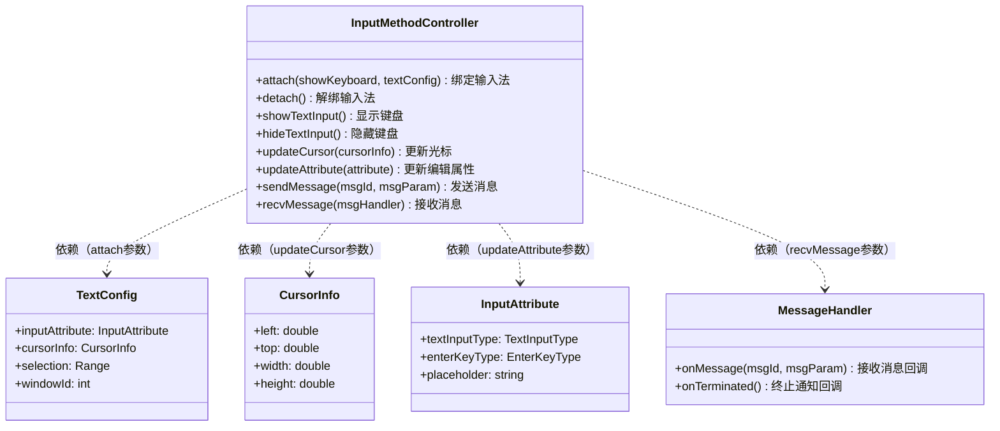
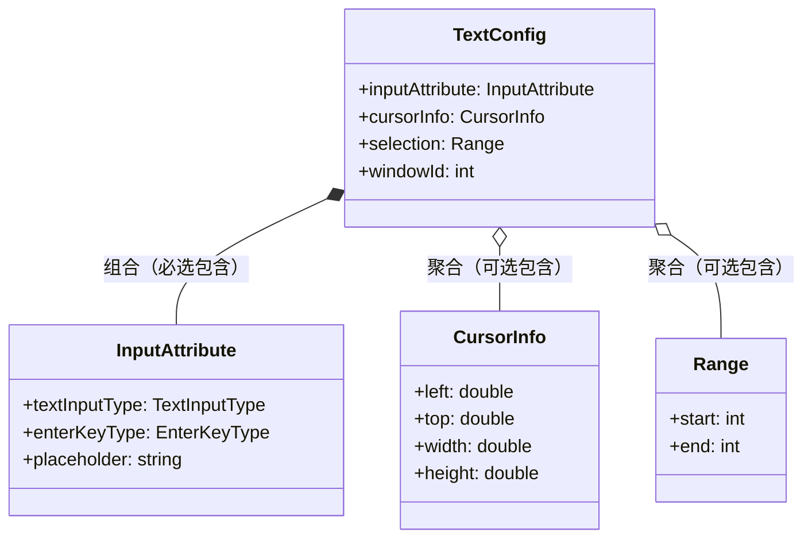
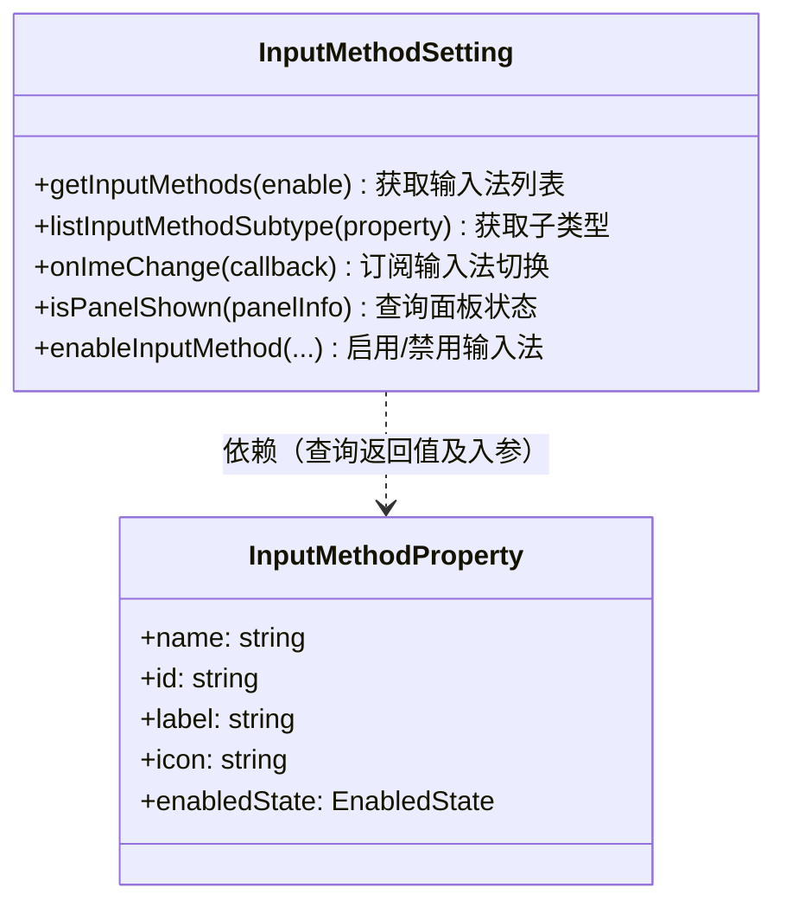

# @ohos.inputMethod (输入法框架)
<!--Kit: IME Kit-->
<!--Subsystem: MiscServices-->
<!--Owner: @codexu62-->
<!--Designer: @andeszhang-->
<!--Tester: @murphy84-->
<!--Adviser: @zhang_yixin13-->

**@ohos.inputMethod**模块是面向普通前台应用（如备忘录、短信、设置等系统应用）的输入法客户端模块，提供输入法控制和管理能力。

本模块是输入法框架的客户端接口，为编辑框应用提供与输入法服务的交互能力，包括输入法绑定/解绑、软键盘显示/隐藏、输入法切换、输入法列表查询、编辑框属性与光标更新、文本选择与操作事件监听、自定义消息通信等。

本模块提供两大核心能力集：1）通过`InputMethodController`实现编辑框应用与输入法之间的绑定、交互和事件监听——编辑框应用绑定输入法后可控制键盘显隐、更新光标和编辑属性、监听输入法发出的文本操作事件（插入、删除、选中文本、移动光标、发送功能键和扩展动作等），以及通过自定义消息通道与输入法应用双向通信；2）通过`InputMethodSetting`实现输入法管理——获取输入法列表、查询当前输入法及子类型、订阅输入法切换事件、切换输入法及子类型、查询面板显示状态等。

当开发带有文本编辑框的应用（需要与输入法交互）或系统应用（需要管理输入法）时使用本模块。典型场景包括：应用中编辑框获取焦点时绑定输入法并显示键盘、编辑框失去焦点时解绑输入法并隐藏键盘、系统设置应用中切换和配置输入法等。

> **说明：**
>
> 本模块首批接口从API version 6开始支持。后续版本的新增接口，采用上角标单独标记接口的起始版本。

本模块是IME Kit（输入法框架Kit）中的客户端控制模块，与IME Kit中的其他模块协同工作：
- **@ohos.inputMethodEngine**：面向输入法应用的服务端模块，提供软键盘窗口创建、文本插入/删除、监听物理按键等能力。本模块（@ohos.inputMethod）发出的请求（如显示键盘、切换输入法）最终由@ohos.inputMethodEngine侧的输入法应用响应和处理。
- **@ohos.inputMethodList**：提供输入法列表选择对话框的显示与管理能力。
- **@ohos.inputMethod.Panel**：定义输入法面板类型与状态信息，用于查询面板可见性等。

典型的客户端应用（如备忘录、设置）与输入法交互的调用序列如下：
1. 通过`inputMethod.getController()`获取客户端控制器实例`InputMethodController`。
2. 通过`InputMethodController.attach()`绑定输入法（对于自绘控件场景），或依赖系统原生编辑框自动绑定。
3. 通过`InputMethodController.showTextInput()`拉起软键盘，进入文本编辑状态。
4. 在编辑过程中，通过`updateCursor`、`changeSelection`、`updateAttribute`等接口向输入法同步编辑框状态。
5. 通过`InputMethodController.hideTextInput()`隐藏软键盘，退出编辑状态。
6. 通过`InputMethodController.detach()`解除与输入法的绑定。

**配对约束：**
- `attach`与`detach`必须配对使用，未detach而直接退出可能导致资源泄漏。
- `showTextInput`与`hideTextInput`必须配对使用，避免输入法状态不一致。

本模块的核心开放能力由以下关键Interface承载：

| Interface | 说明 |
|---|---|
| **InputMethodController** | 输入法控制器，编辑框应用与输入法交互的核心对象。提供绑定/解绑输入法（attach/detach）、显示/隐藏键盘（showTextInput/hideTextInput/showSoftKeyboard/hideSoftKeyboard）、更新光标和编辑属性（updateCursor/updateAttribute/changeSelection）、监听输入法操作事件（insertText/deleteLeft/deleteRight/selectByRange/selectByMovement/moveCursor/sendFunctionKey/sendKeyboardStatus/handleExtendAction/setPreviewText/finishTextPreview）、自定义消息通信（sendMessage/recvMessage）、停止输入会话等能力。通过`getController()`获取实例。 |
| **InputMethodSetting** | 输入法设置管理对象，提供输入法查询和管理能力。包括获取已启用/已禁用/全部输入法列表（getInputMethods/getAllInputMethods）、查询指定输入法的子类型列表（listInputMethodSubtype）、获取当前输入法及子类型、订阅输入法切换事件（on('imeChange')）、订阅面板显隐事件（on('imeShow')/on('imeHide')）、查询面板显示状态（isPanelShown）、启用/禁用输入法（enableInputMethod）、获取输入法自身启用状态（getInputMethodState）等。通过`getSetting()`获取实例。 |

此外，本模块还定义了多个关键数据类型：

| 类型 | 说明 |
|---|---|
| **InputMethodProperty** | 输入法属性信息，描述一个输入法的名称、ID、标签、图标、启用状态等。 |
| **InputMethodSubtype** | 输入法子类型，描述输入法的语言、模式等子类型属性。 |
| **TextConfig** | 编辑框文本配置，包含输入属性（InputAttribute）、光标信息（CursorInfo）、选区信息、窗口ID等。 |
| **InputAttribute** | 输入属性，定义文本输入类型（TextInputType）和回车键类型（EnterKeyType）。 |
| **CursorInfo** | 光标信息，定义光标的位置和尺寸。 |
| **MessageHandler** | 自定义消息处理器，用于接收输入法应用发送的消息并提供终止通知。 |

编辑框应用与输入法交互的典型流程涉及InputMethodController的多个API组合调用：获取控制器 -> 绑定输入法 -> 订阅输入法操作事件 -> 在回调中处理文本操作 -> 解绑输入法。

```javascript
// 以下为阐述调用逻辑的伪代码

// 1. 获取输入法控制器和设置对象
let controller = inputMethod.getController();
let setting = inputMethod.getSetting();

// 2. 订阅输入法操作事件（在attach之前订阅，确保事件不遗漏）
controller.on('insertText', (text) => { /* 处理文本插入 */ });
controller.on('deleteLeft', (length) => { /* 处理左删 */ });
controller.on('deleteRight', (length) => { /* 处理右删 */ });
controller.on('selectByRange', (range) => { /* 处理按范围选中文本 */ });
controller.on('selectByMovement', (movement) => { /* 处理按方向选中文本 */ });
controller.on('moveCursor', (direction) => { /* 处理光标移动 */ });
controller.on('sendFunctionKey', (functionKey) => { /* 处理功能键 */ });
controller.on('handleExtendAction', (action) => { /* 处理扩展动作 */ });

// 3. 绑定输入法（编辑框获得焦点时调用）
let textConfig = {
  inputAttribute: { textInputType: TextInputType.TEXT, enterKeyType: EnterKeyType.NONE },
  cursorInfo: { left: 100, top: 200, width: 2, height: 20 },
  selection: { start: 0, end: 0 },
  windowId: 1
};
controller.attach(true, textConfig);

// 4. 显示键盘
controller.showTextInput();

// 5. 更新光标和编辑属性（编辑框状态变化时调用）
controller.updateCursor(cursorInfo);
controller.updateAttribute(inputAttribute);
controller.changeSelection(text, start, end);

// 6. 需要隐藏键盘时
controller.hideTextInput();

// 7. 编辑框失去焦点时解绑输入法
controller.detach();

// 8. 系统应用切换输入法
setting.getInputMethods(true);  // 获取已启用输入法列表
inputMethod.switchInputMethod(targetProperty);  // 切换到目标输入法
```

> **重要说明**：订阅输入法操作事件（如insertText、deleteLeft等）应在`attach`之前完成，避免事件遗漏。`attach`是编辑框应用使用输入法能力的前提，必须先绑定才能进行后续操作。

UML类图如下（按两大核心能力集分为两组独立类图）：

**InputMethodController依赖关系**：



**TextConfig结构包含关系**：



**InputMethodSetting相关类图**：



> **说明：**
>
> - **依赖关系图**：`InputMethodController`对`TextConfig`、`CursorInfo`、`InputAttribute`、`MessageHandler`均为**依赖关系**（虚线箭头），表示这些类型作为方法参数被使用——`TextConfig`为`attach`参数、`CursorInfo`为`updateCursor`参数、`InputAttribute`为`updateAttribute`参数、`MessageHandler`为`recvMessage`参数。
> - **结构包含图**：`TextConfig`与`InputAttribute`为**组合关系**（实心菱形◆），`inputAttribute`是必选组成部分；`TextConfig`与`CursorInfo`为**聚合关系**（空心菱形◇），`cursorInfo`可选包含；`TextConfig`与`Range`为**聚合关系**（空心菱形◇），`selection`可选包含。
> - 依赖关系（虚线，方法参数使用）与组合/聚合关系（实线菱形，数据结构包含）是不同类型的关联，分别表达不同语义，因此分图绘制以避免线条交叉。
> - `InputMethodSetting`与`InputMethodProperty`为**依赖关系**：作为查询方法的返回值（如`getInputMethods`）和入参（如`listInputMethodSubtype`）使用。

## 导入模块

```ts
import { inputMethod } from '@kit.IMEKit';
```

## 常量

常量值。

**系统能力：** SystemCapability.MiscServices.InputMethodFramework

| 名称 | 类型 | 常量值 | 说明 |
| -------- | -------- | -------- | -------- |
| MAX_TYPE_NUM<sup>8+</sup> | number | 128 | 可支持的最大输入法个数。 |

## InputMethodProperty<sup>8+</sup>

输入法应用属性。

**系统能力：** SystemCapability.MiscServices.InputMethodFramework

<!--Table: 20%; 20%; 10%; 10%; 40%-->
| 名称 | 类型 | 只读 | 可选 | 说明 |
| -------- | -------- | -------- | -------- | -------- |
| name<sup>9+</sup>  | string | 是 | 否 | 必填。输入法包名。|
| id<sup>9+</sup>    | string | 是 | 否 | 必填。输入法扩展在应用内唯一标识，与name一起组成输入法扩展的全局唯一标识。|
| label<sup>9+</sup>    | string | 是 | 是 | 非必填。<br>- 当InputMethodProperty用于切换、查询等接口的入参时，开发者可不填写此字段，通过name和id即可唯一指定一个输入法扩展。<br>- 当InputMethodProperty作为查询接口的返回值时（如[getCurrentInputMethod](#inputmethodgetcurrentinputmethod9)），此字段表示输入法扩展对外显示的名称，优先使用InputMethodExtensionAbility中配置的label，若未配置，自动使用应用入口ability的label；当应用入口ability未配置label时，自动使用应用AppScope中配置的label。|
| labelId<sup>10+</sup>    | number | 是 | 是 | 非必填。<br>- 当InputMethodProperty用于切换、查询等接口的入参时，开发者可不填写此字段，通过name和id即可唯一指定一个输入法扩展。<br>- 当InputMethodProperty作为查询接口的返回值时（如[getCurrentInputMethod](#inputmethodgetcurrentinputmethod9)），此字段表示label字段的资源号。|
| icon<sup>9+</sup>    | string | 是 | 是 | 非必填。<br>- 当InputMethodProperty用于切换、查询等接口的入参时，开发者可不填写此字段，通过name和id即可唯一指定一个输入法扩展。<br>- 当InputMethodProperty作为查询接口的返回值时（如[getCurrentInputMethod](#inputmethodgetcurrentinputmethod9)），此字段表示输入法图标数据，可以通过iconId查询获取。|
| iconId<sup>9+</sup>    | number | 是 | 是 | 非必填。<br>- 当InputMethodProperty用于切换、查询等接口的入参时，开发者可不填写此字段，通过name和id即可唯一指定一个输入法扩展。<br>- 当InputMethodProperty作为查询接口的返回值时（如[getCurrentInputMethod](#inputmethodgetcurrentinputmethod9)），此字段表示icon字段的资源号。|
| enabledState<sup>20+</sup>    | [EnabledState](#enabledstate15) | 是 | 是 | 非必填。<br>- 当InputMethodProperty用于切换、查询等接口的入参时，开发者可不填写此字段，通过name和id即可唯一指定一个输入法扩展<br>- 当InputMethodProperty作为查询接口的返回值时（如[getCurrentInputMethod](#inputmethodgetcurrentinputmethod9)），此字段表示该输入法启用状态。|
| extra<sup>9+</sup>    | object | 否 | 是 | 输入法扩展信息。<br/>- API version 10起：非必填；<br/>- API version 9：必填。|
| packageName<sup>(deprecated)</sup> | string | 是 | 否 | 输入法包名。必填。<br/>说明：从API version 8开始支持，从API version 9开始废弃，建议使用name替代。 |
| methodId<sup>(deprecated)</sup> | string | 是 | 否 | 输入法唯一标识。必填。<br/>说明：从API version 8开始支持，从API version 9开始废弃，建议使用id替代。 |

## CapitalizeMode<sup>20+</sup>

枚举，定义了文本首字母大写的不同模式。

**系统能力：** SystemCapability.MiscServices.InputMethodFramework

| 名称 | 值 | 说明 |
| -------- | -- | -------- |
| NONE | 0 | 不进行任何首字母大写处理。<br/>**使用场景：**适用于无需自动大写的输入框，如密码输入、验证码输入等。|
| SENTENCES | 1 | 每个句子的首字母大写。<br/>**使用场景：**适用于普通文本输入框，如聊天、备忘录等，自动在句号等标点后将首字母大写。|
| WORDS | 2 | 每个单词首字母大写。<br/>**使用场景：**适用于标题、人名等需要每个单词首字母大写的场景。|
| CHARACTERS | 3 | 每个字母都大写。<br/>**使用场景：**适用于全大写输入场景，如缩写词输入（如URL中的域名部分）。|

## inputMethod.getController<sup>9+</sup>

getController(): InputMethodController

获取客户端实例[InputMethodController](#inputmethodcontroller)。

**含义/功能**：获取当前应用的输入法客户端控制器实例，用于后续与输入法进行交互（绑定、显示/隐藏键盘、同步编辑框状态等）。

**使用场景：**当前台应用（如备忘录、聊天应用）需要控制输入法的显示/隐藏、绑定/解绑、同步编辑框信息时，必须先通过此接口获取InputMethodController实例。

**使用后效果**：返回一个InputMethodController实例，后续可通过该实例调用attach、showTextInput、hideTextInput、detach等一系列接口与输入法交互。

**系统能力：** SystemCapability.MiscServices.InputMethodFramework

**返回值：**

| 类型                                            | 说明                   |
| ----------------------------------------------- | ---------------------- |
| [InputMethodController](#inputmethodcontroller) | 返回当前客户端实例。 |

**错误码：**

以下错误码的详细介绍请参见[输入法框架错误码](errorcode-inputmethod-framework.md)。

| 错误码ID | 错误信息                     |
| -------- | ------------------------------ |
| 12800006 | input method controller error. Possible cause: create InputMethodController object failed. |

**示例：**

```ts
let inputMethodController: inputMethod.InputMethodController = inputMethod.getController();
```

## inputMethod.getDefaultInputMethod<sup>11+</sup>

getDefaultInputMethod(): InputMethodProperty

获取默认输入法。

**系统能力：** SystemCapability.MiscServices.InputMethodFramework

**返回值：**

| 类型                                         | 说明                     |
| -------------------------------------------- | ------------------------ |
| [InputMethodProperty](#inputmethodproperty8) | 返回默认输入法属性对象。 |

**错误码：**

以下错误码的详细介绍请参见[输入法框架错误码](errorcode-inputmethod-framework.md)。

| 错误码ID | 错误信息                             |
| -------- | -------------------------------------- |
| 12800008 | input method manager service error. Possible cause: a system error, such as null pointer, IPC exception. |

**示例：**

```ts
let defaultIme: inputMethod.InputMethodProperty = inputMethod.getDefaultInputMethod();
```

## inputMethod.getSystemInputMethodConfigAbility<sup>11+</sup>

getSystemInputMethodConfigAbility(): ElementName

获取系统输入法设置界面Ability信息。

**系统能力：** SystemCapability.MiscServices.InputMethodFramework

**返回值：**

| 类型                                         | 说明                     |
| -------------------------------------------- | ------------------------ |
| [ElementName](../apis-ability-kit/js-apis-bundleManager-elementName.md) | 系统输入法设置界面Ability的ElementName。 |

**错误码：**

以下错误码的详细介绍请参见[输入法框架错误码](errorcode-inputmethod-framework.md)。

| 错误码ID | 错误信息                             |
| -------- | -------------------------------------- |
| 12800008 | input method manager service error. Possible cause: a system error, such as null pointer, IPC exception. |

**示例：**

```ts
import { bundleManager } from '@kit.AbilityKit';

let inputMethodConfig: bundleManager.ElementName = inputMethod.getSystemInputMethodConfigAbility();
```

## inputMethod.getSetting<sup>9+</sup>

getSetting(): InputMethodSetting

获取客户端设置实例[InputMethodSetting](#inputmethodsetting8)。

**含义/功能**：获取输入法设置实例，用于查询输入法列表、订阅输入法变化事件、查询面板可见性等配置管理操作。

**使用场景：**当应用需要查询已安装/已激活输入法列表、订阅输入法切换事件、或显示输入法选择对话框时，必须先通过此接口获取InputMethodSetting实例。

**使用后效果**：返回一个InputMethodSetting实例，后续可通过该实例调用getInputMethods、listInputMethodSubtype、on('imeChange')等接口。

**系统能力：** SystemCapability.MiscServices.InputMethodFramework

**返回值：**

| 类型                                      | 说明                       |
| ----------------------------------------- | -------------------------- |
| [InputMethodSetting](#inputmethodsetting8) | 返回当前客户端设置实例。 |

**错误码：**

以下错误码的详细介绍请参见[输入法框架错误码](errorcode-inputmethod-framework.md)。

| 错误码ID | 错误信息                             |
| -------- | -------------------------------------- |
| 12800007 |  input method setter error. Possible cause: create InputMethodSetting object failed. |

**示例：**

```ts
let inputMethodSetting: inputMethod.InputMethodSetting = inputMethod.getSetting();
```

## inputMethod.switchInputMethod<sup>9+</sup>

switchInputMethod(target: InputMethodProperty, callback: AsyncCallback&lt;boolean&gt;): void

切换输入法，使用callback异步回调。

**含义/功能**：将当前输入法切换为指定的目标输入法。

**使用场景：**当前输入法应用需要切换到另一个输入法时使用（如用户在输入法设置中选择了新的输入法）。

**使用后效果**：成功时系统将当前输入法切换为目标输入法，目标输入法成为新的当前输入法；失败时当前输入法不变。

**异步返回方式**：使用callback异步回调。成功时err为undefined，data为true；失败时返回BusinessError对象。
> **说明：**
>
>  - 在API version 9-10版本，仅支持系统应用调用且需要权限ohos.permission.CONNECT_IME_ABILITY。
>  - 在API version 11版本起，仅支持当前输入法应用调用。

**系统能力：** SystemCapability.MiscServices.InputMethodFramework

**参数：**

| 参数名 | 类型 | 必填 | 说明 |
| -------- | -------- | -------- | -------- |
| target | [InputMethodProperty](#inputmethodproperty8) | 是 | 目标输入法。<br/>**使用场景：**指定要切换到的目标输入法，通过name和id唯一确定。<br/>**说明：**只需填写name和id字段即可唯一指定一个输入法，无需填写label、icon等可选字段。 |
| callback | AsyncCallback&lt;boolean&gt; | 是 | 回调函数。当输入法切换成功，err为undefined，data为true；否则为错误对象。 |

**错误码：**

以下错误码的详细介绍请参见[输入法框架错误码](errorcode-inputmethod-framework.md)，[通用错误码说明文档](../errorcode-universal.md)。

| 错误码ID | 错误信息                             |
| -------- | -------------------------------------- |
| 201 | permissions check fails. [since 9 - 10].        |
| 401      | Parameter error. Possible causes: 1. Mandatory parameters are left unspecified; 2. Incorrect parameter types; 3. Parameter verification failed.           |
| 12800005 | configuration persistence error.        |
| 12800008 | input method manager service error. Possible cause: a system error, such as null pointer, IPC exception. |

**示例：**

```ts
import { BusinessError } from '@kit.BasicServicesKit';

let currentIme: inputMethod.InputMethodProperty = inputMethod.getCurrentInputMethod();
inputMethod.switchInputMethod(currentIme, (err: BusinessError, result: boolean) => {
  if (err) {
    console.error(`Failed to switchInputMethod, code: ${err.code}, message: ${err.message}`);
    return;
  }
  if (result) {
    console.info('Succeeded in switching input method.');
  } else {
    console.error('Failed to switch input method.');
  }
});
```

> **说明：**
>
> 在 API11 中 `201 permissions check fails.` 这个错误码被移除。

## inputMethod.switchInputMethod<sup>9+</sup>
switchInputMethod(target: InputMethodProperty): Promise&lt;boolean&gt;

切换输入法，使用promise异步回调。

**含义/功能**：将当前输入法切换为指定的目标输入法。

**使用场景：**当前输入法应用需要切换到另一个输入法时使用。

**使用后效果**：成功时系统将当前输入法切换为目标输入法；失败时当前输入法不变。

**异步返回方式**：使用Promise异步回调。成功时返回true，失败时返回BusinessError对象。

> **说明：**
>
>  - 在API version 9-10版本，仅支持系统应用调用且需要权限ohos.permission.CONNECT_IME_ABILITY。
>  - 在API version 11版本起，仅支持当前输入法应用调用。

**系统能力：** SystemCapability.MiscServices.InputMethodFramework

**参数：**

  | 参数名 | 类型 | 必填 | 说明 |
  | -------- | -------- | -------- | -------- |
  | target | [InputMethodProperty](#inputmethodproperty8) | 是 | 目标输入法。<br/>**使用场景：**指定要切换到的目标输入法，通过name和id唯一确定。<br/>**说明：**只需填写name和id字段即可唯一指定一个输入法。 |

**返回值：**

  | 类型                                      | 说明                         |
  | ----------------------------------------- | ---------------------------- |
  | Promise\<boolean> | Promise对象。返回true表示切换输入法成功，返回false表示切换输入法失败。 |

**错误码：**

以下错误码的详细介绍请参见[输入法框架错误码](errorcode-inputmethod-framework.md)，[通用错误码说明文档](../errorcode-universal.md)。

| 错误码ID | 错误信息                             |
| -------- | -------------------------------------- |
| 201 | permissions check fails. [since 9 - 10]       |
| 401      | Parameter error. Possible causes: 1. Mandatory parameters are left unspecified; 2. Incorrect parameter types; 3. Parameter verification failed.           |
| 12800005 | configuration persistence error.        |
| 12800008 | input method manager service error. Possible cause: a system error, such as null pointer, IPC exception. |

**示例：**

```ts
import { BusinessError } from '@kit.BasicServicesKit';

let currentIme: inputMethod.InputMethodProperty = inputMethod.getCurrentInputMethod();
inputMethod.switchInputMethod(currentIme).then((result: boolean) => {
  if (result) {
    console.info('Succeeded in switching input method.');
  } else {
    console.error('Failed to switch input method.');
  }
}).catch((err: BusinessError) => {
  console.error(`Failed to switchInputMethod, code: ${err.code}, message: ${err.message}`);
});
```

> **说明：**
>
> 在 API11 中 `201 permissions check fails.` 这个错误码被移除。

## inputMethod.getCurrentInputMethod<sup>9+</sup>

getCurrentInputMethod(): InputMethodProperty

使用同步方法获取当前输入法。

**含义/功能**：获取当前正在使用的输入法属性信息。

**使用场景：**当应用需要知道当前活跃的输入法是哪个（如判断输入法名称、获取输入法id用于后续切换操作）时使用。

**使用后效果**：返回当前输入法的InputMethodProperty对象。

**系统能力：** SystemCapability.MiscServices.InputMethodFramework

**返回值：**

| 类型                                         | 说明                     |
| -------------------------------------------- | ------------------------ |
| [InputMethodProperty](#inputmethodproperty8) | 返回当前输入法属性对象。 |

**示例：**

```ts
let currentIme: inputMethod.InputMethodProperty = inputMethod.getCurrentInputMethod();
```

## inputMethod.switchCurrentInputMethodSubtype<sup>9+</sup>

switchCurrentInputMethodSubtype(target: InputMethodSubtype, callback: AsyncCallback\<boolean>): void

切换当前输入法的子类型。使用callback异步回调。

> **说明：**
>
>  - 在API version 9版本，仅支持系统应用调用且需要权限ohos.permission.CONNECT_IME_ABILITY。
>  - 在API version 10版本，支持系统应用和当前输入法应用调用；需要权限ohos.permission.CONNECT_IME_ABILITY。
>  - 在API version 11版本起，仅支持当前输入法调用。

**系统能力：** SystemCapability.MiscServices.InputMethodFramework

**参数：**

| 参数名 | 类型 | 必填 | 说明 |
| -------- | -------- | -------- | -------- |
| target |  [InputMethodSubtype](./js-apis-inputmethod-subtype.md#inputmethodsubtype)| 是 | 目标输入法子类型。 |
| callback | AsyncCallback&lt;boolean&gt; | 是 | 回调函数。当输入法子类型切换成功，err为undefined，data为true；否则为错误对象。|

**错误码：**

以下错误码的详细介绍请参见[输入法框架错误码](errorcode-inputmethod-framework.md)，[通用错误码说明文档](../errorcode-universal.md)。

| 错误码ID | 错误信息                             |
| -------- | -------------------------------------- |
| 201 | permissions check fails. [since 9 - 10]       |
| 401      | Parameter error. Possible causes: 1. Mandatory parameters are left unspecified; 2. Incorrect parameter types; 3. Parameter verification failed.           |
| 12800005 | configuration persistence error.        |
| 12800008 | input method manager service error. Possible cause: a system error, such as null pointer, IPC exception. |

**示例：**

```ts
import { BusinessError } from '@kit.BasicServicesKit';

let extra: Record<string, string> = {}
// 参考InputMethodSubtype参数说明
inputMethod.switchCurrentInputMethodSubtype({
  id: "ServiceExtAbility",
  label: "",
  name: "com.example.keyboard",
  mode: "upper",
  locale: "",
  language: "",
  icon: "",
  iconId: 0,
  extra: extra
}, (err: BusinessError, result: boolean) => {
  if (err) {
    console.error(`Failed to switchCurrentInputMethodSubtype, code: ${err.code}, message: ${err.message}`);
    return;
  }
  if (result) {
    console.info('Succeeded in switching currentInputMethodSubtype.');
  } else {
    console.error('Failed to switchCurrentInputMethodSubtype');
  }
});
```

> **说明：**
>
> 在 API11 中 `201 permissions check fails.` 这个错误码被移除。

## inputMethod.switchCurrentInputMethodSubtype<sup>9+</sup>

switchCurrentInputMethodSubtype(target: InputMethodSubtype): Promise&lt;boolean&gt;

切换当前输入法的子类型。使用promise异步回调。

> **说明：**
>
>  - 在API version 9版本，仅支持系统应用调用且需要权限ohos.permission.CONNECT_IME_ABILITY。
>  - 在API version 10版本，支持系统应用和当前输入法应用调用；需要权限ohos.permission.CONNECT_IME_ABILITY。
>  - 在API version 11版本起，仅支持当前输入法调用。

**系统能力：** SystemCapability.MiscServices.InputMethodFramework

**参数：**

| 参数名 | 类型 | 必填 | 说明 |
| -------- | -------- | -------- | -------- |
|target |  [InputMethodSubtype](./js-apis-inputmethod-subtype.md#inputmethodsubtype)| 是 | 目标输入法子类型。 |

**返回值：**

| 类型                                      | 说明                         |
| ----------------------------------------- | ---------------------------- |
| Promise\<boolean> | Promise对象。返回true表示当前输入法切换子类型成功，返回false表示当前输入法切换子类型失败。 |

**错误码：**

以下错误码的详细介绍请参见[输入法框架错误码](errorcode-inputmethod-framework.md)，[通用错误码说明文档](../errorcode-universal.md)。

| 错误码ID | 错误信息                             |
| -------- | -------------------------------------- |
| 201 | permissions check fails. [since 9 - 10]       |
| 401      | Parameter error. Possible causes: 1. Mandatory parameters are left unspecified; 2. Incorrect parameter types; 3. Parameter verification failed.           |
| 12800005 | configuration persistence error.        |
| 12800008 | input method manager service error. Possible cause: a system error, such as null pointer, IPC exception. |

**示例：**

```ts
import { BusinessError } from '@kit.BasicServicesKit';

let extra: Record<string, string> = {}
// 参考InputMethodSubtype参数说明
inputMethod.switchCurrentInputMethodSubtype({
  id: "ServiceExtAbility",
  label: "",
  name: "com.example.keyboard",
  mode: "upper",
  locale: "",
  language: "",
  icon: "",
  iconId: 0,
  extra: extra
}).then((result: boolean) => {
  if (result) {
    console.info('Succeeded in switching currentInputMethodSubtype.');
  } else {
    console.error('Failed to switchCurrentInputMethodSubtype.');
  }
}).catch((err: BusinessError) => {
  console.error(`Failed to switchCurrentInputMethodSubtype, code: ${err.code}, message: ${err.message}`);
});
```

> **说明：**
>
> 在 API11 中 `201 permissions check fails.` 这个错误码被移除。

## inputMethod.getCurrentInputMethodSubtype<sup>9+</sup>

getCurrentInputMethodSubtype(): InputMethodSubtype

获取当前输入法的子类型。

**系统能力：** SystemCapability.MiscServices.InputMethodFramework

**返回值：**

| 类型                                         | 说明                     |
| -------------------------------------------- | ------------------------ |
| [InputMethodSubtype](./js-apis-inputmethod-subtype.md#inputmethodsubtype) | 返回当前输入法子类型对象。 |

**示例：**

```ts
import { InputMethodSubtype } from '@kit.IMEKit';

let currentImeSubType: InputMethodSubtype = inputMethod.getCurrentInputMethodSubtype();
```

## inputMethod.switchCurrentInputMethodAndSubtype<sup>9+</sup>

switchCurrentInputMethodAndSubtype(inputMethodProperty: InputMethodProperty, inputMethodSubtype: InputMethodSubtype, callback: AsyncCallback\<boolean>): void

切换至指定输入法的指定子类型，适用于跨输入法切换子类型。使用callback异步回调。

> **说明：**
>
>  - 在API version 9-10版本，仅支持系统应用调用且需要权限ohos.permission.CONNECT_IME_ABILITY。
>  - 在API version 11版本起，仅支持当前输入法调用。

**系统能力：** SystemCapability.MiscServices.InputMethodFramework

**参数：**

| 参数名 | 类型 | 必填 | 说明 |
| -------- | -------- | -------- | -------- |
|inputMethodProperty |  [InputMethodProperty](#inputmethodproperty8)| 是 | 目标输入法。 |
|inputMethodSubtype |  [InputMethodSubtype](./js-apis-inputmethod-subtype.md#inputmethodsubtype)| 是 | 目标输入法子类型。 |
| callback | AsyncCallback&lt;boolean&gt; | 是 | 回调函数。当输入法和子类型切换成功，err为undefined，data为获取到的切换子类型结果true；否则为错误对象。 |

**错误码：**

以下错误码的详细介绍请参见[输入法框架错误码](errorcode-inputmethod-framework.md)，[通用错误码说明文档](../errorcode-universal.md)。

| 错误码ID | 错误信息                             |
| -------- | -------------------------------------- |
| 201 | permissions check fails. [since 9 - 10].        |
| 401      | Parameter error. Possible causes: 1. Mandatory parameters are left unspecified; 2. Incorrect parameter types; 3. Parameter verification failed.           |
| 12800005 | configuration persistence error.        |
| 12800008 | input method manager service error. Possible cause: a system error, such as null pointer, IPC exception. |

**示例：**

```ts
import { InputMethodSubtype } from '@kit.IMEKit';
import { BusinessError } from '@kit.BasicServicesKit';

let currentIme: inputMethod.InputMethodProperty = inputMethod.getCurrentInputMethod();
let imSubType: InputMethodSubtype = inputMethod.getCurrentInputMethodSubtype();
inputMethod.switchCurrentInputMethodAndSubtype(currentIme, imSubType, (err: BusinessError, result: boolean) => {
  if (err) {
    console.error(`Failed to switchCurrentInputMethodAndSubtype, code: ${err.code}, message: ${err.message}`);
    return;
  }
  if (result) {
    console.info('Succeeded in switching currentInputMethodAndSubtype.');
  } else {
    console.error('Failed to switchCurrentInputMethodAndSubtype.');
  }
});
```

> **说明：**
>
> 在 API11 中 `201 permissions check fails.` 这个错误码被移除。

## inputMethod.switchCurrentInputMethodAndSubtype<sup>9+</sup>

switchCurrentInputMethodAndSubtype(inputMethodProperty: InputMethodProperty, inputMethodSubtype: InputMethodSubtype): Promise&lt;boolean&gt;

切换至指定输入法的指定子类型，适用于跨输入法切换子类型。使用promise异步回调。

> **说明：**
>
>  - 在API version 9-10版本，仅支持系统应用调用且需要权限ohos.permission.CONNECT_IME_ABILITY。
>  - 在API version 11版本起，仅支持当前输入法调用。

**系统能力：** SystemCapability.MiscServices.InputMethodFramework

**参数：**

| 参数名 | 类型 | 必填 | 说明 |
| -------- | -------- | -------- | -------- |
|inputMethodProperty |  [InputMethodProperty](#inputmethodproperty8)| 是 | 目标输入法。 |
|inputMethodSubtype |  [InputMethodSubtype](./js-apis-inputmethod-subtype.md#inputmethodsubtype)| 是 | 目标输入法子类型。 |

**返回值：**

| 类型                                      | 说明                         |
| ----------------------------------------- | ---------------------------- |
| Promise\<boolean> | Promise对象。返回true表示切换至指定输入法的指定子类型成功，返回false表示切换至指定输入法的指定子类型失败。 |

**错误码：**

以下错误码的详细介绍请参见[输入法框架错误码](errorcode-inputmethod-framework.md)，[通用错误码说明文档](../errorcode-universal.md)。

| 错误码ID | 错误信息                             |
| -------- | -------------------------------------- |
| 201 | permissions check fails. [since 9 - 10].        |
| 401      | Parameter error. Possible causes: 1. Mandatory parameters are left unspecified; 2. Incorrect parameter types; 3. Parameter verification failed.           |
| 12800005 | configuration persistence error.        |
| 12800008 | input method manager service error. Possible cause: a system error, such as null pointer, IPC exception. |

**示例：**

```ts
import { InputMethodSubtype } from '@kit.IMEKit';
import { BusinessError } from '@kit.BasicServicesKit';

let currentIme: inputMethod.InputMethodProperty = inputMethod.getCurrentInputMethod();
let imSubType: InputMethodSubtype = inputMethod.getCurrentInputMethodSubtype();
inputMethod.switchCurrentInputMethodAndSubtype(currentIme, imSubType).then((result: boolean) => {
  if (result) {
    console.info('Succeeded in switching currentInputMethodAndSubtype.');
  } else {
    console.error('Failed to switchCurrentInputMethodAndSubtype.');
  }
}).catch((err: BusinessError) => {
  console.error(`Failed to switchCurrentInputMethodAndSubtype, code: ${err.code}, message: ${err.message}`);
});
```

> **说明：**
>
> 在 API11 中 `201 permissions check fails.` 这个错误码被移除。

## inputMethod.getInputMethodController<sup>(deprecated)</sup>

getInputMethodController(): InputMethodController

获取客户端实例[InputMethodController](#inputmethodcontroller)。

> **说明：** 
>
> 从API version 6开始支持，从API version 9开始废弃，建议使用[getController](#inputmethodgetcontroller9)替代。

**系统能力：** SystemCapability.MiscServices.InputMethodFramework

**返回值：**

| 类型                                            | 说明                     |
| ----------------------------------------------- | ------------------------ |
| [InputMethodController](#inputmethodcontroller) | 回调返回当前客户端实例。 |

**示例：**

```ts
let inputMethodController: inputMethod.InputMethodController = inputMethod.getInputMethodController();
```

## inputMethod.getInputMethodSetting<sup>(deprecated)</sup>

getInputMethodSetting(): InputMethodSetting

获取客户端设置实例[InputMethodSetting](#inputmethodsetting8)。

> **说明：**
>
> 从API version 8开始支持，从API version 9开始废弃，建议使用[getSetting](#inputmethodgetsetting9)替代。

**系统能力：** SystemCapability.MiscServices.InputMethodFramework

**返回值：**

| 类型                                      | 说明                       |
| ----------------------------------------- | -------------------------- |
| [InputMethodSetting](#inputmethodsetting8) | 返回当前客户端设置实例。 |

**示例：**

```ts
let inputMethodSetting: inputMethod.InputMethodSetting = inputMethod.getInputMethodSetting();
```

## inputMethod.setSimpleKeyboardEnabled<sup>20+</sup>

setSimpleKeyboardEnabled(enable: boolean): void

编辑框应用设置简单键盘标志。

**系统能力：** SystemCapability.MiscServices.InputMethodFramework

**参数：**

| 参数名 | 类型 | 必填 | 说明 |
| -------- | -------- | -------- | -------- |
| enable | boolean | 是 | 简单键盘是否使能标志，true标识简单键盘使能，false标识简单键盘去使能。<br/> 原生编辑框组件在下一次点击获焦时生效；自绘控件在下一次调用[attach](#attach10)绑定输入法时生效。 |

**示例：**

```ts
  let enable: boolean = false;
  inputMethod.setSimpleKeyboardEnabled(enable);
```

## inputMethod.onAttachmentDidFail<sup>22+</sup>

onAttachmentDidFail(callback: Callback&lt;AttachFailureReason&gt;): void

订阅绑定失败事件。使用callback异步回调。

**系统能力：** SystemCapability.MiscServices.InputMethodFramework

**参数：**

| 参数名 | 类型 | 必填 | 说明 |
| -------- | -------- | -------- | -------- |
| callback | Callback&lt;[AttachFailureReason](#attachfailurereason22)&gt; | 是 | 回调函数，返回绑定失败的原因，仅当注册者进程触发的绑定失败时，调用该回调函数。|

**示例：**

```ts
import { Callback } from '@kit.BasicServicesKit';

let attachmentDidFailCallback: Callback<inputMethod.AttachFailureReason> = 
  (reason: inputMethod.AttachFailureReason): void => {
    console.info(`Attachment failed with reason: ${reason}.`);
  if (reason === inputMethod.AttachFailureReason.CALLER_NOT_FOCUSED) {
    console.info(`Failure reason is CALLER_NOT_FOCUSED.`);
  }
  };
inputMethod.onAttachmentDidFail(attachmentDidFailCallback);
```

## inputMethod.offAttachmentDidFail<sup>22+</sup>

offAttachmentDidFail(callback?:  Callback&lt;AttachFailureReason&gt;): void

取消订阅绑定失败事件。使用callback异步回调。

**系统能力：** SystemCapability.MiscServices.InputMethodFramework

**参数：**

| 参数名 | 类型 | 必填 | 说明 |
| -------- | -------- | -------- | -------- |
| callback | Callback&lt;[AttachFailureReason](#attachfailurereason22)&gt; | 否 | 取消订阅的回调函数，需要与订阅接口传入的保持一致。参数不填写时，取消订阅该事件的所有回调函数。|

**示例：**

```ts
import { Callback } from '@kit.BasicServicesKit';

let attachmentDidFailCallback: Callback<inputMethod.AttachFailureReason> = 
  (reason: inputMethod.AttachFailureReason): void => {
    console.info(`Attachment failed with reason: ${reason}.`);
  if (reason === inputMethod.AttachFailureReason.CALLER_NOT_FOCUSED) {
    console.info(`Failure reason is CALLER_NOT_FOCUSED.`);
  }
  };
inputMethod.onAttachmentDidFail(attachmentDidFailCallback);
inputMethod.offAttachmentDidFail(attachmentDidFailCallback);
```

## TextInputType<sup>10+</sup>

文本输入类型。

**系统能力：** SystemCapability.MiscServices.InputMethodFramework

| 名称 | 值 |说明 |
| -------- | -------- |-------- |
| NONE  | -1 |NONE。<br/>**使用场景：**当编辑框不希望指定特定输入类型时使用，输入法将使用默认键盘布局。 |
| TEXT  | 0 |文本类型。<br/>**使用场景：**适用于普通文本输入框，如聊天、备忘录等，输入法显示全功能键盘。 |
| MULTILINE  | 1 |多行类型。<br/>**使用场景：**适用于需要多行文本输入的场景，如长文本编辑、评论框等。 |
| NUMBER  | 2 |数字类型。<br/>**使用场景：**适用于仅需要输入数字的场景，如数量输入、年龄输入等，输入法显示数字键盘。 |
| PHONE  | 3 |电话号码类型。<br/>**使用场景：**适用于电话号码输入框，输入法显示电话号码键盘（包含数字和常用电话符号）。 |
| DATETIME  | 4 |日期类型。<br/>**使用场景：**适用于日期时间输入框，输入法显示日期相关的键盘布局。 |
| EMAIL_ADDRESS  | 5 |邮箱地址类型。<br/>**使用场景：**适用于邮箱输入框，输入法键盘会突出显示"@""."等常用邮箱符号。 |
| URL  | 6 |链接类型。<br/>**使用场景：**适用于网址输入框，输入法键盘会突出显示"/""."等常用URL符号。 |
| VISIBLE_PASSWORD  | 7 |密码类型。<br/>**使用场景：**适用于密码输入框，输入法显示可见密码键盘，不进行自动建议。 |
| NUMBER_PASSWORD<sup>11+</sup> | 8 |数字密码类型。<br/>**使用场景：**适用于仅需输入数字密码的场景，如PIN码输入。 |
| SCREEN_LOCK_PASSWORD<sup>20+</sup> | 9 |锁屏密码类型。<br/>**使用场景：**适用于锁屏界面的密码输入框。 |
| USER_NAME<sup>20+</sup> | 10 |用户名类型。<br/>**使用场景：**适用于用户名输入框，输入法可根据用户名特点优化建议。 |
| NEW_PASSWORD<sup>20+</sup> | 11 |新密码类型。<br/>**使用场景：**适用于设置新密码的输入框，输入法可提供密码强度提示。 |
| NUMBER_DECIMAL<sup>20+</sup> | 12 |带小数点的数字类型。<br/>**使用场景：**适用于需要输入带小数点数字的场景，如金额输入。 |
| ONE_TIME_CODE<sup>20+</sup> | 13 |验证码类型。<br/>**使用场景：**适用于验证码输入框，输入法可优化验证码输入体验。 |

## EnterKeyType<sup>10+</sup>

Enter键的功能类型。

**系统能力：** SystemCapability.MiscServices.InputMethodFramework

| 名称 | 值 |说明 |
| -------- | -------- |-------- |
| UNSPECIFIED  | 0 |未指定。<br/>**使用场景：**编辑框不指定Enter键具体功能时使用。 |
| NONE  | 1 |NONE。<br/>**使用场景：**Enter键无特定行为，仅作为换行或普通按键使用。 |
| GO  | 2 |前往。<br/>**使用场景：**适用于URL输入框，Enter键触发"前往"操作，如打开链接。 |
| SEARCH  | 3 |查找。<br/>**使用场景：**适用于搜索框，Enter键触发搜索操作。 |
| SEND  | 4 |发送。<br/>**使用场景：**适用于消息发送框，Enter键触发发送操作。 |
| NEXT  | 5 |下一步。<br/>**使用场景：**适用于多步骤表单，Enter键跳转到下一个输入框。 |
| DONE  | 6 |完成。<br/>**使用场景：**适用于单步骤表单的最后输入框，Enter键表示输入完成。 |
| PREVIOUS  | 7 |上一步。<br/>**使用场景：**适用于多步骤表单，Enter键跳转到上一个输入框。 |
| NEWLINE<sup>12+</sup>  | 8 | 换行。<br/>**使用场景：**适用于多行文本编辑框，Enter键插入换行符。|

## KeyboardStatus<sup>10+</sup>

输入法软键盘状态。

**系统能力：** SystemCapability.MiscServices.InputMethodFramework

| 名称 | 值 |说明 |
| -------- | -------- |-------- |
| NONE  | 0 |NONE。<br/>**使用场景：**表示键盘状态尚未确定或无法判断时使用。 |
| HIDE  | 1 |隐藏状态。<br/>**使用场景：**表示当前软键盘处于隐藏状态。 |
| SHOW  | 2 |显示状态。<br/>**使用场景：**表示当前软键盘处于显示状态。 |

## Direction<sup>10+</sup>

光标移动方向。

**系统能力：** SystemCapability.MiscServices.InputMethodFramework

| 名称 | 值 |说明 |
| -------- | -------- |-------- |
| CURSOR_UP  | 1 |向上。<br/>**使用场景：**输入法请求光标向上移动时使用，如多行文本中上移光标。 |
| CURSOR_DOWN  | 2 |向下。<br/>**使用场景：**输入法请求光标向下移动时使用。 |
| CURSOR_LEFT  | 3 |向左。<br/>**使用场景：**输入法请求光标向左移动时使用，如删除左侧字符前移动光标。 |
| CURSOR_RIGHT  | 4 |向右。<br/>**使用场景：**输入法请求光标向右移动时使用。 |

## ExtendAction<sup>10+</sup>

编辑框中文本的扩展编辑操作类型，如剪切、复制等。

**系统能力：** SystemCapability.MiscServices.InputMethodFramework

| 名称 | 值 |说明 |
| -------- | -------- |-------- |
| SELECT_ALL  | 0 |全选。<br/>**使用场景：**输入法请求全选编辑框中的文本时使用。 |
| CUT  | 3 |剪切。<br/>**使用场景：**输入法请求剪切选中的文本时使用，将选中文本复制到剪贴板并删除原文本。 |
| COPY  | 4 |复制。<br/>**使用场景：**输入法请求复制选中的文本时使用，将选中文本复制到剪贴板。 |
| PASTE  | 5 |粘贴。<br/>**使用场景：**输入法请求粘贴剪贴板内容时使用。 |

## FunctionKey<sup>10+</sup>

输入法功能键类型。

**系统能力：** SystemCapability.MiscServices.InputMethodFramework

| 名称 | 类型 | 只读 | 可选 | 说明 |
| -------- | -------- | -------- | -------- | -------- |
| enterKeyType  | [EnterKeyType](#enterkeytype10) | 否 | 否 | 输入法enter键类型。|

## InputAttribute<sup>10+</sup>

编辑框属性，包含文本输入类型和Enter键功能类型。

**系统能力：** SystemCapability.MiscServices.InputMethodFramework

<!--Table: 20%; 20%; 10%; 10%; 40%-->
| 名称 | 类型 | 只读 | 可选 | 说明                                                                                                                                                                                                                        |
| -------- | -------- | -------- | -------- |---------------------------------------------------------------------------------------------------------------------------------------------------------------------------------------------------------------------------|
| textInputType  | [TextInputType](#textinputtype10) | 否 | 否 | 文本输入类型。                                                                                                                                                                                                                   |
| enterKeyType  | [EnterKeyType](#enterkeytype10) | 否 | 否 | Enter键功能类型。                                                                                                                                                                                                               |
| placeholder<sup>20+</sup> | string | 否 | 是 | 编辑框设置的占位符信息。 <br/>- 编辑框设置占位符信息时，长度不超过255个字符（如果超出将会自动截断为255个字符），用于提示或引导用户输入临时性文本或符号。（例如：提示输入项为"必填"或"非必填"的输入结果反馈。）<br/>- 编辑框没有设置占位符信息时，默认为空字符串。<br/>- 该字段在调用[attach](#attach10)时提供给输入法应用。                                   |
| abilityName<sup>20+</sup> | string | 否 | 是 | 编辑框设置的ability名称。<br/>- 编辑框设置ability名称时，长度不超过127个字符（如果超出将会自动截断为127个字符）。<br/>- 编辑框未设置ability名称时，默认为空字符串。<br/>- 该字段在调用绑定[attach](#attach10)时提供给输入法应用。                                                                        |
| consumeKeyEvents | boolean | 否 | 是 | 编辑框是否具有完整处理字母、字符、功能等按键的能力。默认值为false。<br/>- 值为true，表示具备此能力。<br/>- 值为false，表示不具备此能力。<br/>- 该字段在调用[attach](#attach10) / [InputAttribute](#inputattribute10)时提供给输入法应用。  <br/>**起始版本：** 26.0.0<br/>**模型约束：** 该参数仅可在Stage模型下使用。 |

## TextConfig<sup>10+</sup>

编辑框的配置信息。

**系统能力：** SystemCapability.MiscServices.InputMethodFramework

<!--Table: 20%; 20%; 10%; 10%; 40%-->
| 名称 | 类型 | 只读 | 可选 | 说明 |
| -------- | -------- | -------- | -------- | -------- |
| inputAttribute  | [InputAttribute](#inputattribute10) | 否 | 否 | 编辑框属性。|
| cursorInfo  | [CursorInfo](#cursorinfo10) | 否 | 是 | 光标信息。|
| selection  | [Range](#range10) | 否 | 是 | 文本选中的范围。|
| windowId  | number | 否 | 是 | 编辑框所在的窗口Id，该参数应为整数。<br>推荐使用[getWindowProperties](../apis-arkui/arkts-apis-window-Window.md#getwindowproperties9)方法获取窗口id属性。|
| newEditBox<sup>20+</sup> | boolean | 否 | 是 | 表示是否为新编辑框。true表示新编辑框，false表示非新编辑框。 |
| capitalizeMode<sup>20+</sup> | [CapitalizeMode](#capitalizemode20) | 否 | 是 | 编辑框设置大小写模式。如果没有设置或设置非法值，默认不进行任何首字母大写处理。|

## CursorInfo<sup>10+</sup>

光标信息。

**系统能力：** SystemCapability.MiscServices.InputMethodFramework

| 名称 | 类型 | 只读 | 可选 | 说明                                                               |
| -------- | -------- | -------- | -------- |------------------------------------------------------------------|
| left  | number | 否 | 否 | 光标的横坐标，单位为px。该参数应为整数，最小值为0，最大值为当前屏幕的宽度。                          |
| top  | number | 否 | 否 | 光标的纵坐标，单位为px。该参数应为整数，最小值为0，最大值为当前屏幕的高度。                          |
| width  | number | 否 | 否 | 光标的宽度，单位为px。该参数应为整数，最小值为0，最大值为当前屏幕的宽度。                           |
| height  | number | 否 | 否 | 光标的高度，单位为px。该参数应为整数，最小值为0，最大值为当前屏幕的高度。                           |
| displayId  | number | 否 | 是 | 光标所在显示器的ID。<br/>**起始版本：** 26.0.0<br/>**模型约束：** 该参数仅可在Stage模型下使用。 |

## Range<sup>10+</sup>

文本的选中范围。

**系统能力：** SystemCapability.MiscServices.InputMethodFramework

| 名称 | 类型 | 只读 | 可选 | 说明 |
| -------- | -------- | -------- | -------- | -------- |
| start  | number | 否 | 否 | 选中文本的首字符在编辑框的索引值。该参数应为大于或等于0的整数，不超过文本实际长度。|
| end  | number | 否 | 否 | 选中文本的末字符在编辑框的索引值。该参数应为大于或等于0的整数，不超过文本实际长度，end值要大于start值。|

## Movement<sup>10+</sup>

选中文本时，光标移动的方向。

**系统能力：** SystemCapability.MiscServices.InputMethodFramework

| 名称 | 类型 | 只读 | 可选 | 说明 |
| -------- | -------- | -------- | -------- | -------- |
| direction  | [Direction](#direction10) | 否 | 否 | 选中文本时，光标的移动方向。|

## InputWindowInfo<sup>10+</sup>

输入法软键盘的窗口信息。

**系统能力：** SystemCapability.MiscServices.InputMethodFramework

| 名称 | 类型 | 只读 | 可选 | 说明 |
| -------- | -------- | -------- | -------- | -------- |
| name  | string | 否 | 否 | 输入法窗口的名称。|
| left  | number | 否 | 否 | 输入法窗口左上顶点的横坐标，单位为px。该参数应为整数，最小值为0，最大值为当前屏幕的宽度。|
| top  | number | 否 | 否 | 输入法窗口左上顶点的纵坐标，单位为px。该参数应为整数，最小值为0，最大值为当前屏幕的高度。|
| width  | number | 否 | 否 | 输入法窗口的宽度，单位为px。该参数应为整数，最小值为0，最大值为当前屏幕的宽度。|
| height  | number | 否 | 否 | 输入法窗口的高度，单位为px。该参数应为整数，最小值为0，最大值为当前屏幕的高度。|
| displayId<sup>23+</sup> | number | 否 | 是 | 输入法软键盘窗口所在的屏幕ID。<br>**模型约束：** 该参数仅可在Stage模型下使用。|

## EnabledState<sup>15+</sup>

输入法启用状态。

**系统能力：** SystemCapability.MiscServices.InputMethodFramework

| 名称 | 值 |说明 |
| -------- | -------- |-------- |
| DISABLED   | 0 |未启用。<br/>**使用场景：**输入法已被禁用，不能作为当前输入法使用。 |
| BASIC_MODE  | 1 |基础模式。<br/>**使用场景：**输入法已启用但处于基础模式，仅具备基础输入能力，不支持高级功能（如自定义通信）。 |
| FULL_EXPERIENCE_MODE  | 2 |完整体验模式。<br/>**使用场景：**输入法已启用且处于完整体验模式，支持所有功能（包括自定义通信、预上屏等）。 |

## RequestKeyboardReason<sup>15+</sup>

请求键盘输入的原因。

**系统能力：** SystemCapability.MiscServices.InputMethodFramework

| 名称 | 值 |说明 |
| -------- | -------- |-------- |
| NONE   | 0 |表示没有特定的原因触发键盘请求。<br/>**使用场景：**默认值，不指定特定触发原因时使用。 |
| MOUSE  | 1 |表示键盘请求是由鼠标操作触发的。<br/>**使用场景：**用户通过鼠标点击编辑框触发键盘弹出时使用。 |
| TOUCH  | 2 |表示键盘请求是由触摸操作触发的。<br/>**使用场景：**用户通过触摸点击编辑框触发键盘弹出时使用。 |
| OTHER  | 20 |表示键盘请求是由其他原因触发的。<br/>**使用场景：**键盘弹出的触发原因不属于鼠标和触摸时使用。 |

## MessageHandler<sup>15+</sup>

自定义通信对象。

> **说明：**
>
> 开发者可通过注册此对象来接收输入法应用发送的自定义通信数据，接收到自定义通信数据时会触发此对象中[onMessage](#onmessage15)回调函数。
>
> 此对象全局唯一，多次注册仅保留最后一次注册的对象及有效性，并触发上一个已注册对象的[onTerminated](#onterminated15)回调函数。
>
> 若取消注册全局已注册的对象时，会触发被取消对象中[onTerminated](#onterminated15)回调函数。

### onMessage<sup>15+</sup>

onMessage(msgId: string, msgParam?: ArrayBuffer): void

接收输入法应用发送的自定义数据回调函数。

> **说明：**
>
> 当已注册的MessageHandler接收到来自输入法应用发送的自定义通信数据时，会触发该回调函数。
>
> msgId为必选参数，msgParam为可选参数。存在收到仅有msgId自定义数据的可能，需与数据发送方确认自定义数据。

**系统能力：** SystemCapability.MiscServices.InputMethodFramework

**参数：**

| 参数名   | 类型        | 必填 | 说明                             |
| -------- | ----------- | ---- | -------------------------------- |
| msgId    | string      | 是   | 接收到的自定义通信数据的标识符。 |
| msgParam | ArrayBuffer | 否   | 接收到的自定义通信数据的消息体。 |

**示例：**

```ts
let inputMethodController: inputMethod.InputMethodController = inputMethod.getController();

let messageHandler: inputMethod.MessageHandler = {
  onTerminated(): void {
    console.info('OnTerminated.');
  },
  onMessage(msgId: string, msgParam?: ArrayBuffer): void {
    console.info(`recv message, msg: ${msgId}, msgParam: ${JSON.stringify(msgParam)}`);
  }
};
inputMethodController.recvMessage(messageHandler);
```

### onTerminated<sup>15+</sup>

onTerminated(): void

监听对象终止回调函数。

> **说明：**
>
> 当应用注册新的MessageHandler对象时，会触发上一个已注册MessageHandler对象的OnTerminated回调函数。
>
> 当应用取消注册时，会触发当前已注册MessageHandler对象的OnTerminated回调函数。

**系统能力：** SystemCapability.MiscServices.InputMethodFramework

**示例：**

```ts
let inputMethodController: inputMethod.InputMethodController = inputMethod.getController();

let messageHandler: inputMethod.MessageHandler = {
  onTerminated(): void {
    console.info('OnTerminated.');
  },
  onMessage(msgId: string, msgParam?: ArrayBuffer): void {
    console.info(`recv message, msg: ${msgId}, msgParam: ${JSON.stringify(msgParam)}`);
  }
};
inputMethodController.recvMessage(messageHandler);
```

## SetPreviewTextCallback<sup>17+</sup>

type SetPreviewTextCallback = (text: string, range: Range) => void

当输入法框架需要显示预览文本时触发的回调。

**系统能力：** SystemCapability.MiscServices.InputMethodFramework

**参数：**

| 参数名       | 类型          | 必填 | 说明                          |
| ------- | ----------------- | ---- | ----------------------------- |
| text    | string            | 是   | 预览文本内容。                 |
| range   | [Range](#range10) | 是   | 文本的选中范围。 |

## AttachFailureReason<sup>22+</sup>

枚举，绑定失败的原因。

**系统能力：** SystemCapability.MiscServices.InputMethodFramework

| 名称 | 值 |说明 |
| -------- | -------- |-------- |
| CALLER_NOT_FOCUSED    | 0 |表示调用者非焦点窗口所属应用导致的失败。<br/>**使用场景：**应用窗口未获得焦点时调用attach，会返回此失败原因。<br/>**说明：**调用attach前需确保应用窗口已获焦。 |
| IME_ABNORMAL  | 1 |表示输入法应用异常导致的失败。<br/>**使用场景：**输入法应用进程崩溃或未正常运行时，attach会返回此失败原因。 |
| SERVICE_ABNORMAL  | 2 |表示输入法框架服务异常导致的失败。<br/>**使用场景：**输入法框架服务进程异常时，attach会返回此失败原因。 |

## AttachOptions<sup>23+</sup>

绑定输入法的附加选项。

**模型约束：** 此接口仅可在Stage模型下使用。

**系统能力：** SystemCapability.MiscServices.InputMethodFramework

| 名称 | 类型 | 只读 | 可选 | 说明 |
| -------- | -------- | -------- | -------- | -------- |
| requestKeyboardReason | [RequestKeyboardReason](#requestkeyboardreason15) | 否 | 是 |请求键盘输入的原因。|
| showKeyboard | boolean | 否 | 是 | 绑定输入法成功后，是否拉起输入法键盘。<br>- true表示拉起。<br>- false表示不拉起。|

## InputMethodController

下列API示例中都需使用[getController](#inputmethodgetcontroller9)获取到InputMethodController实例，再通过实例调用对应方法。

InputMethodController是输入法客户端控制器，面向前台应用提供与输入法交互的核心能力。通过`inputMethod.getController()`获取实例后，可进行以下操作：

- **绑定管理**：通过[attach](#attach10)建立与输入法的绑定，通过[detach](#detach10)解除绑定。attach和detach必须配对使用。
- **键盘控制**：通过[showTextInput](#showtextinput10)拉起软键盘进入编辑状态，通过[hideTextInput](#hidetextinput10)隐藏软键盘退出编辑状态。showTextInput和hideTextInput必须配对使用。
- **编辑框状态同步**：通过[updateCursor](#updatecursor10)、[changeSelection](#changeselection10)、[updateAttribute](#updateattribute10)等接口向输入法同步光标、选区、属性等编辑框状态信息。
- **事件订阅**：通过on('insertText')、on('deleteLeft')等接口订阅输入法应用发送的文本操作事件。

典型调用序列：`getController()` → `attach()` → `showTextInput()`/`hideTextInput()` → `detach()`

> **注意：**
> attach和detach必须配对使用，showTextInput和hideTextInput必须配对使用，否则可能导致资源泄漏或状态不一致。

### attach<sup>10+</sup>

attach(showKeyboard: boolean, textConfig: TextConfig, callback: AsyncCallback&lt;void&gt;): void

自绘控件绑定输入法。使用callback异步回调。

**含义/功能**：建立自绘控件与输入法应用之间的绑定关系，是自绘控件使用输入法功能的前提。

**使用场景：**自绘控件（非系统原生编辑框）需要与输入法交互时，必须先调用此接口建立绑定。原生编辑框获焦时系统自动绑定，无需调用此接口。

**使用后效果**：绑定成功后，自绘控件可调用showTextInput/hideTextInput控制键盘显隐、调用updateCursor/changeSelection同步编辑框状态、订阅输入法事件等。

**异步返回方式**：使用callback异步回调。成功时err为undefined；失败时返回BusinessError对象。

**前提条件/前置操作**：自绘控件所在窗口需处于获焦状态，否则绑定会失败。

**相关接口间的配合/制约关系**：attach必须与detach配对使用。调用attach后才能调用showTextInput、hideTextInput、updateCursor等接口。

**相似接口差异点及选取原则**：
- **attach**：不需要传入UIContext，适用于API version 10+的自绘控件绑定场景。
- **attachWithUIContext**：需要传入UIContext，适用于API version 23+的Stage模型场景，支持更多绑定选项。
- **选取原则**：API version 23+的Stage模型应用优先使用attachWithUIContext，以获得更完整的绑定选项支持。

> **说明：**
>
> 需要先调用此接口，完成自绘控件与输入法的绑定，才能使用以下功能：显示/隐藏键盘、更新光标信息、更改编辑框选中范围、保存配置信息、监听处理由输入法应用发送的信息或命令等。
>
> 当自绘控件所在窗口通过[setWindowFocusable](../apis-arkui/arkts-apis-window-Window.md#setwindowfocusable9)设置为不可获焦窗口时，系统将无法保证自绘输入控件与输入法正常交互。若开发者希望在不可获焦窗口中绘制输入框，建议参考[不可获焦窗口中输入框与输入法交互指南](../../inputmethod/use-inputmethod-in-not-focusable-window.md)。

**系统能力：** SystemCapability.MiscServices.InputMethodFramework

**参数：**

| 参数名 | 类型 | 必填 | 说明 |
| -------- | -------- | -------- | -------- |
| showKeyboard | boolean | 是 | 绑定输入法成功后，是否拉起输入法键盘。<br>- true表示拉起。<br>- false表示不拉起。 |
| textConfig | [TextConfig](#textconfig10) | 是 | 编辑框的配置信息。 |
| callback | AsyncCallback&lt;void&gt; | 是 | 回调函数。当绑定输入法成功后，err为undefined；否则为错误对象。 |

**错误码：**

以下错误码的详细介绍请参见[输入法框架错误码](errorcode-inputmethod-framework.md)，[通用错误码说明文档](../errorcode-universal.md)。

| 错误码ID | 错误信息                             |
| -------- | -------------------------------------- |
| 401      | Parameter error. Possible causes: 1. Mandatory parameters are left unspecified; 2. Incorrect parameter types. |
| 12800003 | input method client error. Possible causes: 1.the edit box is not focused. 2.no edit box is bound to current input method application. 3.ipc failed due to the large amount of data transferred or other reasons. |
| 12800008 | input method manager service error. Possible cause: a system error, such as null pointer, IPC exception. |

**示例：**

```ts
import { BusinessError } from '@kit.BasicServicesKit';

let inputAttribute: inputMethod.InputAttribute = {
  textInputType: inputMethod.TextInputType.TEXT,
  enterKeyType: inputMethod.EnterKeyType.GO
}
let textConfig: inputMethod.TextConfig = { inputAttribute: inputAttribute };
inputMethod.getController().attach(true, textConfig, (err: BusinessError) => {
  if (err) {
    console.error(`Failed to attach, code: ${err.code}, message: ${err.message}`);
    return;
  }
  console.info('Succeeded in attaching the inputMethod.');
});
```

### attach<sup>10+</sup>

attach(showKeyboard: boolean, textConfig: TextConfig): Promise&lt;void&gt;

自绘控件绑定输入法。使用promise异步回调。

> **说明：**
>
> 需要先调用此接口，完成自绘控件与输入法的绑定，才能使用以下功能：显示/隐藏键盘、更新光标信息、更改编辑框选中范围、保存配置信息、监听处理由输入法应用发送的信息或命令等。
>
> 当自绘控件所在窗口通过[setWindowFocusable](../apis-arkui/arkts-apis-window-Window.md#setwindowfocusable9)设置为不可获焦窗口时，系统将无法保证自绘输入控件与输入法正常交互。若开发者希望在不可获焦窗口中绘制输入框，建议参考[不可获焦窗口中输入框与输入法交互指南](../../inputmethod/use-inputmethod-in-not-focusable-window.md)。

**系统能力：** SystemCapability.MiscServices.InputMethodFramework

**参数：**

| 参数名 | 类型 | 必填 | 说明 |
| -------- | -------- | -------- | -------- |
| showKeyboard | boolean | 是 | 绑定输入法成功后，是否拉起输入法键盘。<br>- true表示拉起。<br>- false表示不拉起。|
| textConfig | [TextConfig](#textconfig10) | 是 | 编辑框的配置信息。 |

**返回值：**

| 类型 | 说明 |
| -------- | -------- |
| Promise&lt;void&gt; | 无返回结果的Promise对象。 |

**错误码：**

以下错误码的详细介绍请参见[输入法框架错误码](errorcode-inputmethod-framework.md)，[通用错误码说明文档](../errorcode-universal.md)。

| 错误码ID | 错误信息                             |
| -------- | -------------------------------------- |
| 401      | Parameter error. Possible causes: 1. Mandatory parameters are left unspecified; 2. Incorrect parameter types. |
| 12800003 | input method client error. Possible causes: 1.the edit box is not focused. 2.no edit box is bound to current input method application. 3.ipc failed due to the large amount of data transferred or other reasons. |
| 12800008 | input method manager service error. Possible cause: a system error, such as null pointer, IPC exception. |

**示例：**

```ts
import { BusinessError } from '@kit.BasicServicesKit';

let inputAttribute: inputMethod.InputAttribute = {
  textInputType: inputMethod.TextInputType.TEXT,
  enterKeyType: inputMethod.EnterKeyType.GO
}
let textConfig: inputMethod.TextConfig = { inputAttribute: inputAttribute };
inputMethod.getController().attach(true, textConfig).then(() => {
  console.info('Succeeded in attaching inputMethod.');
}).catch((err: BusinessError) => {
  console.error(`Failed to attach, code: ${err.code}, message: ${err.message}`);
});
```

### attach<sup>15+</sup>

attach(showKeyboard: boolean, textConfig: TextConfig, requestKeyboardReason: RequestKeyboardReason): Promise&lt;void&gt;

自绘控件绑定输入法。使用promise异步回调。

> **说明：**
>
> 需要先调用此接口，完成自绘控件与输入法的绑定，才能使用以下功能：显示/隐藏键盘、更新光标信息、更改编辑框选中范围、保存配置信息、监听处理由输入法应用发送的信息或命令等。
>
> 当自绘控件所在窗口通过[setWindowFocusable](../apis-arkui/arkts-apis-window-Window.md#setwindowfocusable9)设置为不可获焦窗口时，系统将无法保证自绘输入控件与输入法正常交互。若开发者希望在不可获焦窗口中绘制输入框，建议参考[不可获焦窗口中输入框与输入法交互指南](../../inputmethod/use-inputmethod-in-not-focusable-window.md)。

**系统能力：** SystemCapability.MiscServices.InputMethodFramework

**参数：**

| 参数名 | 类型 | 必填 | 说明 |
| -------- | -------- | -------- | -------- |
| showKeyboard | boolean | 是 | 绑定输入法成功后，是否拉起输入法键盘。<br>- true表示拉起。<br>- false表示不拉起。|
| textConfig | [TextConfig](#textconfig10) | 是 | 编辑框的配置信息。 |
| requestKeyboardReason | [RequestKeyboardReason](#requestkeyboardreason15) | 是 | 请求键盘输入的原因。 |

**返回值：**

| 类型 | 说明 |
| -------- | -------- |
| Promise&lt;void&gt; | 无返回结果的Promise对象。 |

**错误码：**

以下错误码的详细介绍请参见[输入法框架错误码](errorcode-inputmethod-framework.md)和[通用错误码说明文档](../errorcode-universal.md)。

| 错误码ID | 错误信息                             |
| -------- | -------------------------------------- |
| 401      | Parameter error. Possible causes: 1. Mandatory parameters are left unspecified; 2. Incorrect parameter types. |
| 12800003 | input method client error. Possible causes: 1.the edit box is not focused. 2.no edit box is bound to current input method application. 3.ipc failed due to the large amount of data transferred or other reasons. |
| 12800008 | input method manager service error. Possible cause: a system error, such as null pointer, IPC exception. |

**示例：**

```ts
import { BusinessError } from '@kit.BasicServicesKit';

let inputAttribute: inputMethod.InputAttribute = {
  textInputType: inputMethod.TextInputType.TEXT,
  enterKeyType: inputMethod.EnterKeyType.GO
}
let textConfig: inputMethod.TextConfig = { inputAttribute: inputAttribute };
let requestKeyboardReason: inputMethod.RequestKeyboardReason = inputMethod.RequestKeyboardReason.MOUSE;

inputMethod.getController().attach(true, textConfig, requestKeyboardReason).then(() => {
  console.info('Succeeded in attaching inputMethod.');
}).catch((err: BusinessError) => {
  console.error(`Failed to attach, code: ${err.code}, message: ${err.message}`);
});
```

### attachWithUIContext<sup>23+</sup>

attachWithUIContext(uiContext: UIContext, textConfig: TextConfig, attachOptions?: AttachOptions): Promise&lt;void&gt;

自绘控件绑定输入法。使用promise异步回调。

> **说明：**
>
> 需要先调用此接口，完成自绘控件与输入法的绑定，才能使用以下功能：显示/隐藏键盘、更新光标信息、更改编辑框选中范围、保存配置信息、监听处理由输入法应用发送的信息或命令等。

**模型约束：** 此接口仅可在Stage模型下使用。

**系统能力：** SystemCapability.MiscServices.InputMethodFramework

**参数：**

|  参数名  |    类型  |   必填   |   说明   |
| -------- | -------- | -------- | -------- |
| uiContext | [UIContext](../apis-arkui/arkts-apis-uicontext-uicontext.md) | 是 | UIContext实例对象。|
| textConfig | [TextConfig](#textconfig10) | 是 | 编辑框的配置信息。|
| attachOptions | [AttachOptions](#attachoptions23) | 否 | 绑定附加选项。|

**返回值：**

| 类型 | 说明 |
| -------- | -------- |
| Promise&lt;void&gt; | Promise对象，无返回结果。|

**错误码：**

以下错误码的详细介绍请参见[输入法框架错误码](errorcode-inputmethod-framework.md)，[通用错误码说明文档](../errorcode-universal.md)。

| 错误码ID | 错误信息                               |
| -------- | -------------------------------------- |
| 12800003 | input method client error. Possible causes:1.the edit box is not focused. 2.no edit box is bound to current input method application.3.ipc failed due to the large amount of data transferred or other reasons. |
| 12800008 | input method manager service error. Possible cause: a system error, such as null pointer, IPC exception. |

**示例：**

```ts
import { BusinessError } from '@kit.BasicServicesKit';
import { UIContext } from '@kit.ArkUI';

let uiContext: UIContext | undefined = UIContext.getCallingScopeUIContext();
let inputAttribute: inputMethod.InputAttribute = {
  textInputType: inputMethod.TextInputType.TEXT,
  enterKeyType: inputMethod.EnterKeyType.GO
}
let textConfig: inputMethod.TextConfig = { inputAttribute: inputAttribute };
let attachOptions: inputMethod.AttachOptions = { showKeyboard: true };
inputMethod.getController().attachWithUIContext(uiContext, textConfig, attachOptions).then(() => {
  console.info('Succeeded in attaching inputMethod.');
}).catch((err: BusinessError) => {
  console.error(`Failed to attach, code: ${err.code}, message: ${err.message}`);
});
```

### discardTypingText<sup>20+</sup>

discardTypingText(): Promise&lt;void&gt;

编辑框应用发送“清空正在输入的文字”命令到输入法。使用promise异步回调。

> **说明：**
>
> 当编辑框应用与输入法绑定成功后，才可调用该接口实现此功能。

**系统能力：** SystemCapability.MiscServices.InputMethodFramework

**返回值：**

| 类型 | 说明 |
| -------- | -------- |
| Promise&lt;void&gt; | Promise对象。无返回结果的Promise对象。 |

**错误码：**

以下错误码的详细介绍请参见[输入法框架错误码](errorcode-inputmethod-framework.md)。

| 错误码ID | 错误信息                             |
| -------- | -------------------------------------- |
| 12800003 | input method client error. Possible causes: 1.the edit box is not focused. 2.no edit box is bound to current input method application. 3.ipc failed due to the large amount of data transferred or other reasons. |
| 12800009 | input method client detached. |
| 12800015 | the other side does not accept the request. |

**示例：**

```ts
import { BusinessError } from '@kit.BasicServicesKit';

inputMethod.getController().discardTypingText().then(() => {
  console.info('Succeeded discardTypingText.');
}).catch((err: BusinessError) => {
  console.error(`Failed to discardTypingText, code: ${err.code}, message: ${err.message}`);
});
```

### showTextInput<sup>10+</sup>

showTextInput(callback: AsyncCallback&lt;void&gt;): void

进入文本编辑状态。使用callback异步回调。

**含义/功能**：拉起软键盘，使编辑框进入文本编辑状态。

**使用场景：**自绘控件绑定输入法后，需要显示软键盘开始文本输入时调用。

**使用后效果**：软键盘弹出，编辑框进入可输入的文本编辑状态。

**异步返回方式**：使用callback异步回调。成功时err为undefined；失败时返回BusinessError对象。

**前提条件/前置操作**：需先调用[attach](#attach10)完成绑定，否则会报12800009错误。

**相关接口间的配合/制约关系**：showTextInput与hideTextInput必须配对使用。调用hideTextInput退出编辑状态后，需再次调用showTextInput才能重新进入编辑状态。

**相似接口差异点及选取原则**：
- **showTextInput**：面向自绘控件，需先attach绑定后调用。适用于自绘控件场景，是标准的键盘显示方式。
- **showSoftKeyboard**：面向系统应用，需权限ohos.permission.CONNECT_IME_ABILITY。适用于系统应用需要强制显示键盘的场景。
- **选取原则**：自绘控件优先使用showTextInput；系统应用且有特殊需求时使用showSoftKeyboard。

> **说明：**
>
> 编辑框与输入法绑定成功后，可调用该接口拉起软键盘，进入文本编辑状态。

**系统能力：** SystemCapability.MiscServices.InputMethodFramework

**参数：**

| 参数名 | 类型 | 必填 | 说明 |
| -------- | -------- | -------- | -------- |
| callback | AsyncCallback&lt;void&gt; | 是 | 回调函数。若成功进入编辑状态，err为undefined；否则为错误对象。 |

**错误码：**

以下错误码的详细介绍请参见[输入法框架错误码](errorcode-inputmethod-framework.md)。

| 错误码ID | 错误信息                             |
| -------- | -------------------------------------- |
| 12800003 | input method client error. Possible causes: 1.the edit box is not focused. 2.no edit box is bound to current input method application. 3.ipc failed due to the large amount of data transferred or other reasons. |
| 12800008 | input method manager service error. Possible cause: a system error, such as null pointer, IPC exception. |
| 12800009 | input method client detached. |

**示例：**

```ts
import { BusinessError } from '@kit.BasicServicesKit';

inputMethod.getController().showTextInput((err: BusinessError) => {
  if (err) {
    console.error(`Failed to showTextInput, code: ${err.code}, message: ${err.message}`);
    return;
  }
  console.info('Succeeded in showing the inputMethod.');
});
```

### showTextInput<sup>10+</sup>

showTextInput(): Promise&lt;void&gt;

进入文本编辑状态。使用promise异步回调。

> **说明：**
>
> 编辑框与输入法绑定成功后，可调用该接口拉起软键盘，进入文本编辑状态。

**系统能力：** SystemCapability.MiscServices.InputMethodFramework

**返回值：**

| 类型 | 说明 |
| -------- | -------- |
| Promise&lt;void&gt; | 无返回结果的Promise对象。 |

**错误码：**

以下错误码的详细介绍请参见[输入法框架错误码](errorcode-inputmethod-framework.md)。

| 错误码ID | 错误信息                             |
| -------- | -------------------------------------- |
| 12800003 | input method client error. Possible causes: 1.the edit box is not focused. 2.no edit box is bound to current input method application. 3.ipc failed due to the large amount of data transferred or other reasons. |
| 12800008 | input method manager service error. Possible cause: a system error, such as null pointer, IPC exception. |
| 12800009 | input method client detached. |

**示例：**

```ts
import { BusinessError } from '@kit.BasicServicesKit';

inputMethod.getController().showTextInput().then(() => {
  console.info('Succeeded in showing text input.');
}).catch((err: BusinessError) => {
  console.error(`Failed to showTextInput, code: ${err.code}, message: ${err.message}`);
});
```

### showTextInput<sup>15+</sup>

showTextInput(requestKeyboardReason: RequestKeyboardReason): Promise&lt;void&gt;

进入文本编辑状态。使用promise异步回调。

> **说明：**
>
> 编辑框与输入法绑定成功后，可调用该接口拉起软键盘，进入文本编辑状态。

**系统能力：** SystemCapability.MiscServices.InputMethodFramework

**参数：**

| 参数名 | 类型 | 必填 | 说明 |
| -------- | -------- | -------- | -------- |
| requestKeyboardReason | [RequestKeyboardReason](#requestkeyboardreason15) | 是 | 请求键盘输入的原因。 |

**返回值：**

| 类型 | 说明 |
| -------- | -------- |
| Promise&lt;void&gt; | 无返回结果的Promise对象。 |

**错误码：**

以下错误码的详细介绍请参见[输入法框架错误码](errorcode-inputmethod-framework.md)。

| 错误码ID | 错误信息                             |
| -------- | -------------------------------------- |
| 12800003 | input method client error. Possible causes: 1.the edit box is not focused. 2.no edit box is bound to current input method application. 3.ipc failed due to the large amount of data transferred or other reasons. |
| 12800008 | input method manager service error. Possible cause: a system error, such as null pointer, IPC exception. |
| 12800009 | input method client detached. |

**示例：**

```ts
import { BusinessError } from '@kit.BasicServicesKit';

let requestKeyboardReason: inputMethod.RequestKeyboardReason = inputMethod.RequestKeyboardReason.MOUSE;

inputMethod.getController().showTextInput(requestKeyboardReason).then(() => {
  console.info('Succeeded in showing text input.');
}).catch((err: BusinessError) => {
  console.error(`Failed to showTextInput, code: ${err.code}, message: ${err.message}`);
});
```

### hideTextInput<sup>10+</sup>

hideTextInput(callback: AsyncCallback&lt;void&gt;): void

退出文本编辑状态。使用callback异步回调。

**含义/功能**：隐藏软键盘，使编辑框退出文本编辑状态。

**使用场景：**自绘控件不再需要输入时调用，如用户点击了编辑框外的区域、切换到其他页面等。

**使用后效果**：软键盘被隐藏，编辑框退出编辑状态。调用此接口不会解除与输入法的绑定，再次调用showTextInput可重新进入编辑状态。

**异步返回方式**：使用callback异步回调。成功时err为undefined；失败时返回BusinessError对象。

**前提条件/前置操作**：需先调用[attach](#attach10)完成绑定，且已调用showTextInput进入编辑状态。

**相关接口间的配合/制约关系**：hideTextInput与showTextInput必须配对使用。hideTextInput后如需再次输入，必须先调用showTextInput重新进入编辑状态，不能直接调用其他编辑操作。

**相似接口差异点及选取原则**：
- **hideTextInput**：面向自绘控件，退出编辑状态但不解除绑定，可再次showTextInput重新进入。适用于自绘控件需要暂时隐藏键盘的场景。
- **hideSoftKeyboard**：面向系统应用，需权限ohos.permission.CONNECT_IME_ABILITY。仅隐藏键盘，不改变编辑状态。
- **选取原则**：自绘控件优先使用hideTextInput；系统应用且有特殊需求时使用hideSoftKeyboard。

> **说明：**
>
> 调用接口时，若软键盘处于显示状态，调用接口后软键盘会被隐藏。
>
> 调用该接口不会解除与输入法的绑定，再次调用[showTextInput](#showtextinput10)时，可重新进入文本编辑状态。

**系统能力：** SystemCapability.MiscServices.InputMethodFramework

**参数：**

| 参数名 | 类型 | 必填 | 说明 |
| -------- | -------- | -------- | -------- |
| callback | AsyncCallback&lt;void&gt; | 是 | 回调函数。当成功退出编辑状态时，err为undefined；否则为错误对象。 |

**错误码：**

以下错误码的详细介绍请参见[输入法框架错误码](errorcode-inputmethod-framework.md)。

| 错误码ID | 错误信息                             |
| -------- | -------------------------------------- |
| 12800003 | input method client error. Possible causes: 1.the edit box is not focused. 2.no edit box is bound to current input method application. 3.ipc failed due to the large amount of data transferred or other reasons. |
| 12800008 | input method manager service error. Possible cause: a system error, such as null pointer, IPC exception. |
| 12800009 | input method client detached.             |

**示例：**

```ts
import { BusinessError } from '@kit.BasicServicesKit';

inputMethod.getController().hideTextInput((err: BusinessError) => {
  if (err) {
    console.error(`Failed to hideTextInput, code: ${err.code}, message: ${err.message}`);
    return;
  }
  console.info('Succeeded in hiding text input.');
});
```

### hideTextInput<sup>10+</sup>

hideTextInput(): Promise&lt;void&gt;

退出文本编辑状态。使用promise异步回调。

> **说明：**
>
> 调用接口时，若软键盘处于显示状态，调用接口后软键盘会被隐藏。
>
> 调用该接口不会解除与输入法的绑定，再次调用[showTextInput](#showtextinput10)时，可重新进入文本编辑状态。

**系统能力：** SystemCapability.MiscServices.InputMethodFramework

**返回值：**

| 类型 | 说明 |
| -------- | -------- |
| Promise&lt;void&gt; | 无返回结果的Promise对象。 |

**错误码：**

以下错误码的详细介绍请参见[输入法框架错误码](errorcode-inputmethod-framework.md)。

| 错误码ID | 错误信息                             |
| -------- | -------------------------------------- |
| 12800003 | input method client error. Possible causes: 1.the edit box is not focused. 2.no edit box is bound to current input method application. 3.ipc failed due to the large amount of data transferred or other reasons. |
| 12800008 | input method manager service error. Possible cause: a system error, such as null pointer, IPC exception. |
| 12800009 | input method client detached. |

**示例：**

```ts
import { BusinessError } from '@kit.BasicServicesKit';

inputMethod.getController().hideTextInput().then(() => {
  console.info('Succeeded in hiding inputMethod.');
}).catch((err: BusinessError) => {
  console.error(`Failed to hideTextInput, code: ${err.code}, message: ${err.message}`);
})
```

### detach<sup>10+</sup>

detach(callback: AsyncCallback&lt;void&gt;): void

自绘控件解除与输入法的绑定。使用callback异步回调。

**含义/功能**：解除自绘控件与输入法应用之间的绑定关系，释放相关资源。

**使用场景：**自绘控件不再需要与输入法交互时调用（如页面切换、编辑框被销毁等）。

**使用后效果**：解除绑定后，不能再调用showTextInput、hideTextInput、updateCursor等需要绑定状态的接口。输入法软键盘将被隐藏。

**异步返回方式**：使用callback异步回调。成功时err为undefined；失败时返回BusinessError对象。

**相关接口间的配合/制约关系**：detach必须与attach配对使用。建议在hideTextInput之后调用detach，完整流程为：attach → showTextInput → hideTextInput → detach。

**系统能力：** SystemCapability.MiscServices.InputMethodFramework

**参数：**

| 参数名 | 类型 | 必填 | 说明 |
| -------- | -------- | -------- | -------- |
| callback | AsyncCallback&lt;void&gt; | 是 | 回调函数。当解绑定输入法成功时，err为undefined；否则为错误对象。 |

**错误码：**

以下错误码的详细介绍请参见[输入法框架错误码](errorcode-inputmethod-framework.md)。

| 错误码ID | 错误信息                             |
| -------- | -------------------------------------- |
| 12800003 | input method client error. Possible causes: 1.the edit box is not focused. 2.no edit box is bound to current input method application. 3.ipc failed due to the large amount of data transferred or other reasons. |
| 12800008 | input method manager service error. Possible cause: a system error, such as null pointer, IPC exception. |

**示例：**

```ts
import { BusinessError } from '@kit.BasicServicesKit';

inputMethod.getController().detach((err: BusinessError) => {
  if (err) {
    console.error(`Failed to detach, code: ${err.code}, message: ${err.message}`);
    return;
  }
  console.info('Succeeded in detaching inputMethod.');
});
```

### detach<sup>10+</sup>

detach(): Promise&lt;void&gt;

自绘控件解除与输入法的绑定。使用promise异步回调。

**含义/功能**：解除自绘控件与输入法应用之间的绑定关系，释放相关资源。

**使用场景：**自绘控件不再需要与输入法交互时调用。

**使用后效果**：解除绑定后，不能再调用需要绑定状态的接口。输入法软键盘将被隐藏。

**异步返回方式**：使用Promise异步回调。成功时无返回结果；失败时返回BusinessError对象。

**相关接口间的配合/制约关系**：detach必须与attach配对使用。

**系统能力：** SystemCapability.MiscServices.InputMethodFramework

**返回值：**

| 类型 | 说明 |
| -------- | -------- |
| Promise&lt;void&gt; | 无返回结果的Promise对象。 |

**错误码：**

以下错误码的详细介绍请参见[输入法框架错误码](errorcode-inputmethod-framework.md)。

| 错误码ID | 错误信息                             |
| -------- | -------------------------------------- |
| 12800003 | input method client error. Possible causes: 1.the edit box is not focused. 2.no edit box is bound to current input method application. 3.ipc failed due to the large amount of data transferred or other reasons. |
| 12800008 | input method manager service error. Possible cause: a system error, such as null pointer, IPC exception. |

**示例：**

```ts
import { BusinessError } from '@kit.BasicServicesKit';

inputMethod.getController().detach().then(() => {
  console.info('Succeeded in detaching inputMethod.');
}).catch((err: BusinessError) => {
  console.error(`Failed to detach, code: ${err.code}, message: ${err.message}`);
});
```

### setCallingWindow<sup>10+</sup>

setCallingWindow(windowId: number, callback: AsyncCallback&lt;void&gt;): void

设置要避让软键盘的窗口。使用callback异步回调。

> **说明：**
>
> 将绑定到输入法的应用程序所在的窗口Id传入，此窗口可以避让输入法窗口。

**系统能力：** SystemCapability.MiscServices.InputMethodFramework

**参数：**

| 参数名 | 类型 | 必填 | 说明 |
| -------- | -------- | -------- | -------- |
| windowId | number | 是 | 绑定输入法应用的应用程序所在的窗口Id。该参数应为整数。|
| callback | AsyncCallback&lt;void&gt; | 是 | 回调函数。当设置成功时，err为undefined；否则为错误对象。 |

**错误码：**

以下错误码的详细介绍请参见[输入法框架错误码](errorcode-inputmethod-framework.md)，[通用错误码说明文档](../errorcode-universal.md)。

| 错误码ID | 错误信息                             |
| -------- | -------------------------------------- |
| 401      | Parameter error. Possible causes: 1. Mandatory parameters are left unspecified; 2. Incorrect parameter types. |
| 12800003 | input method client error. Possible causes: 1.the edit box is not focused. 2.no edit box is bound to current input method application. 3.ipc failed due to the large amount of data transferred or other reasons. |
| 12800008 | input method manager service error. Possible cause: a system error, such as null pointer, IPC exception. |
| 12800009 | input method client detached.             |

**示例：**

```ts
import { BusinessError } from '@kit.BasicServicesKit';

let windowId: number = 2000;
inputMethod.getController().setCallingWindow(windowId, (err: BusinessError) => {
  if (err) {
    console.error(`Failed to setCallingWindow, code: ${err.code}, message: ${err.message}`);
    return;
  }
  console.info('Succeeded in setting callingWindow.');
});
```

### setCallingWindow<sup>10+</sup>

setCallingWindow(windowId: number): Promise&lt;void&gt;

设置要避让软键盘的窗口。使用promise异步回调。

> **说明：**
>
> 将绑定到输入法的应用程序所在的窗口Id传入，此窗口可以避让输入法窗口。

**系统能力：** SystemCapability.MiscServices.InputMethodFramework

**参数：**

| 参数名 | 类型 | 必填 | 说明 |
| -------- | -------- | -------- | -------- |
| windowId | number | 是 | 绑定输入法应用的应用程序所在的窗口Id。该参数应为整数。 |

**返回值：**

| 类型 | 说明 |
| -------- | -------- |
| Promise&lt;void&gt; | 无返回结果的Promise对象。 |

**错误码：**

以下错误码的详细介绍请参见[输入法框架错误码](errorcode-inputmethod-framework.md)，[通用错误码说明文档](../errorcode-universal.md)。

| 错误码ID | 错误信息                             |
| -------- | -------------------------------------- |
| 401      | Parameter error. Possible causes: 1. Mandatory parameters are left unspecified; 2. Incorrect parameter types. |
| 12800003 | input method client error. Possible causes: 1.the edit box is not focused. 2.no edit box is bound to current input method application. 3.ipc failed due to the large amount of data transferred or other reasons. |
| 12800008 | input method manager service error. Possible cause: a system error, such as null pointer, IPC exception. |
| 12800009 | input method client detached. |

**示例：**

```ts
import { BusinessError } from '@kit.BasicServicesKit';

let windowId: number = 2000;
inputMethod.getController().setCallingWindow(windowId).then(() => {
  console.info('Succeeded in setting callingWindow.');
}).catch((err: BusinessError) => {
  console.error(`Failed to setCallingWindow, code: ${err.code}, message: ${err.message}`);
});
```

### updateCursor<sup>10+</sup>

updateCursor(cursorInfo: CursorInfo, callback: AsyncCallback&lt;void&gt;): void

当编辑框内的光标信息发生变化时，调用该接口使输入法感知到光标变化。使用callback异步回调。

**系统能力：** SystemCapability.MiscServices.InputMethodFramework

**参数：**

| 参数名 | 类型 | 必填 | 说明 |
| -------- | -------- | -------- | -------- |
| cursorInfo | [CursorInfo](#cursorinfo10) | 是 | 光标信息。 |
| callback | AsyncCallback&lt;void&gt; | 是 | 回调函数。当光标信息更新成功时，err为undefined；否则为错误对象。 |

**错误码：**

以下错误码的详细介绍请参见[输入法框架错误码](errorcode-inputmethod-framework.md)，[通用错误码说明文档](../errorcode-universal.md)。

| 错误码ID | 错误信息                             |
| -------- | -------------------------------------- |
| 401      | Parameter error. Possible causes: 1. Mandatory parameters are left unspecified; 2. Incorrect parameter types; 3. Parameter verification failed.           |
| 12800003 | input method client error. Possible causes: 1.the edit box is not focused. 2.no edit box is bound to current input method application. 3.ipc failed due to the large amount of data transferred or other reasons. |
| 12800008 | input method manager service error. Possible cause: a system error, such as null pointer, IPC exception. |
| 12800009 | input method client detached.             |

**示例：**

```ts
import { BusinessError } from '@kit.BasicServicesKit';

let cursorInfo: inputMethod.CursorInfo = {
  left: 0,
  top: 0,
  width: 600,
  height: 800
};
inputMethod.getController().updateCursor(cursorInfo, (err: BusinessError) => {
  if (err) {
    console.error(`Failed to updateCursor, code: ${err.code}, message: ${err.message}`);
    return;
  }
  console.info('Succeeded in updating cursorInfo.');
});

```

### updateCursor<sup>10+</sup>

updateCursor(cursorInfo: CursorInfo): Promise&lt;void&gt;

当编辑框内的光标信息发生变化时，调用该接口使输入法感知到光标变化。使用promise异步回调。

**系统能力：** SystemCapability.MiscServices.InputMethodFramework

**参数：**

| 参数名 | 类型 | 必填 | 说明 |
| -------- | -------- | -------- | -------- |
| cursorInfo | [CursorInfo](#cursorinfo10) | 是 | 光标信息。 |

**返回值：**

| 类型 | 说明 |
| -------- | -------- |
| Promise&lt;void&gt; | 无返回结果的Promise对象。 |

**错误码：**

以下错误码的详细介绍请参见[输入法框架错误码](errorcode-inputmethod-framework.md)，[通用错误码说明文档](../errorcode-universal.md)。

| 错误码ID | 错误信息                             |
| -------- | -------------------------------------- |
| 401      | Parameter error. Possible causes: 1. Mandatory parameters are left unspecified; 2. Incorrect parameter types; 3. Parameter verification failed.           |
| 12800003 | input method client error. Possible causes: 1.the edit box is not focused. 2.no edit box is bound to current input method application. 3.ipc failed due to the large amount of data transferred or other reasons. |
| 12800008 | input method manager service error. Possible cause: a system error, such as null pointer, IPC exception. |
| 12800009 | input method client detached. |

**示例：**

```ts
import { BusinessError } from '@kit.BasicServicesKit';

let cursorInfo: inputMethod.CursorInfo = {
  left: 0,
  top: 0,
  width: 600,
  height: 800
};
inputMethod.getController().updateCursor(cursorInfo).then(() => {
  console.info('Succeeded in updating cursorInfo.');
}).catch((err: BusinessError) => {
  console.error(`Failed to updateCursor, code: ${err.code}, message: ${err.message}`);
});
```

### changeSelection<sup>10+</sup>

changeSelection(text: string, start: number, end: number, callback: AsyncCallback&lt;void&gt;): void

当编辑框内被选中的文本信息内容或文本范围发生变化时，可调用该接口更新文本信息，使输入法应用感知到变化。使用callback异步回调。

**系统能力：** SystemCapability.MiscServices.InputMethodFramework

**参数：**

| 参数名 | 类型 | 必填 | 说明 |
| -------- | -------- | -------- | -------- |
| text | string | 是 | 整个输入文本。 |
| start | number | 是 | 所选文本的起始位置。该参数应为大于或等于0的整数。 |
| end | number | 是 | 所选文本的结束位置。该参数应为大于或等于0的整数。 |
| callback | AsyncCallback&lt;void&gt; | 是 | 回调函数。当文本信息更新成功时，err为undefined；否则为错误对象。 |

**错误码：**

以下错误码的详细介绍请参见[输入法框架错误码](errorcode-inputmethod-framework.md)，[通用错误码说明文档](../errorcode-universal.md)。

| 错误码ID | 错误信息                             |
| -------- | -------------------------------------- |
| 401      | Parameter error. Possible causes: 1. Mandatory parameters are left unspecified; 2. Incorrect parameter types. |
| 12800003 | input method client error. Possible causes: 1.the edit box is not focused. 2.no edit box is bound to current input method application. 3.ipc failed due to the large amount of data transferred or other reasons. |
| 12800008 | input method manager service error. Possible cause: a system error, such as null pointer, IPC exception. |
| 12800009 | input method client detached.             |

**示例：**

```ts
import { BusinessError } from '@kit.BasicServicesKit';

inputMethod.getController().changeSelection('text', 0, 5, (err: BusinessError) => {
  if (err) {
    console.error(`Failed to changeSelection, code: ${err.code}, message: ${err.message}`);
    return;
  }
  console.info('Succeeded in changing selection.');
});
```

### changeSelection<sup>10+</sup>

changeSelection(text: string, start: number, end: number): Promise&lt;void&gt;

当编辑框内被选中的文本信息内容或文本范围发生变化时，可调用该接口更新文本信息，使输入法应用感知到变化。使用promise异步回调。

**系统能力：** SystemCapability.MiscServices.InputMethodFramework

**参数：**

| 参数名 | 类型 | 必填 | 说明 |
| -------- | -------- | -------- | -------- |
| text | string | 是 | 整个输入文本。 |
| start | number | 是 | 所选文本的起始位置。该参数应为大于或等于0的整数。 |
| end | number | 是 | 所选文本的结束位置。该参数应为大于或等于0的整数。 |

**返回值：**

| 类型 | 说明 |
| -------- | -------- |
| Promise&lt;void&gt; | 无返回结果的Promise对象。 |

**错误码：**

以下错误码的详细介绍请参见[输入法框架错误码](errorcode-inputmethod-framework.md)，[通用错误码说明文档](../errorcode-universal.md)。

| 错误码ID | 错误信息                             |
| -------- | -------------------------------------- |
| 401      | Parameter error. Possible causes: 1. Mandatory parameters are left unspecified; 2. Incorrect parameter types. |
| 12800003 | input method client error. Possible causes: 1.the edit box is not focused. 2.no edit box is bound to current input method application. 3.ipc failed due to the large amount of data transferred or other reasons. |
| 12800008 | input method manager service error. Possible cause: a system error, such as null pointer, IPC exception. |
| 12800009 | input method client detached. |

**示例：**

```ts
import { BusinessError } from '@kit.BasicServicesKit';

inputMethod.getController().changeSelection('test', 0, 5).then(() => {
  console.info('Succeeded in changing selection.');
}).catch((err: BusinessError) => {
  console.error(`Failed to changeSelection, code: ${err.code}, message: ${err.message}`);
});
```

### updateAttribute<sup>10+</sup>

updateAttribute(attribute: InputAttribute, callback: AsyncCallback&lt;void&gt;): void

更新编辑框属性信息。使用callback异步回调。

**系统能力：** SystemCapability.MiscServices.InputMethodFramework

**参数：**

| 参数名 | 类型 | 必填 | 说明 |
| -------- | -------- | -------- | -------- |
| attribute | [InputAttribute](#inputattribute10) | 是 | 编辑框属性对象。 |
| callback | AsyncCallback&lt;void&gt; | 是 | 回调函数。当编辑框属性信息更新成功时，err为undefined；否则为错误对象。 |

**错误码：**

以下错误码的详细介绍请参见[输入法框架错误码](errorcode-inputmethod-framework.md)，[通用错误码说明文档](../errorcode-universal.md)。

| 错误码ID | 错误信息                             |
| -------- | -------------------------------------- |
| 401      | Parameter error. Possible causes: 1. Mandatory parameters are left unspecified; 2. Incorrect parameter types. |
| 12800003 | input method client error. Possible causes: 1.the edit box is not focused. 2.no edit box is bound to current input method application. 3.ipc failed due to the large amount of data transferred or other reasons. |
| 12800008 | input method manager service error. Possible cause: a system error, such as null pointer, IPC exception. |
| 12800009 | input method client detached.             |

**示例：**

```ts
import { BusinessError } from '@kit.BasicServicesKit';

let inputAttribute: inputMethod.InputAttribute = { textInputType: 0, enterKeyType: 1 };
inputMethod.getController().updateAttribute(inputAttribute, (err: BusinessError) => {
  if (err) {
    console.error(`Failed to updateAttribute, code: ${err.code}, message: ${err.message}`);
    return;
  }
  console.info('Succeeded in updating attribute.');
});
```

### updateAttribute<sup>10+</sup>

updateAttribute(attribute: InputAttribute): Promise&lt;void&gt;

更新编辑框属性信息。使用promise异步回调。

**系统能力：** SystemCapability.MiscServices.InputMethodFramework

**参数：**

| 参数名 | 类型 | 必填 | 说明 |
| -------- | -------- | -------- | -------- |
| attribute | [InputAttribute](#inputattribute10) | 是 |  编辑框属性对象。 |

**返回值：**

| 类型 | 说明 |
| -------- | -------- |
| Promise&lt;void&gt; | 无返回结果的Promise对象。 |

**错误码：**

以下错误码的详细介绍请参见[输入法框架错误码](errorcode-inputmethod-framework.md)，[通用错误码说明文档](../errorcode-universal.md)。

| 错误码ID | 错误信息                             |
| -------- | -------------------------------------- |
| 401      | Parameter error. Possible causes: 1. Mandatory parameters are left unspecified; 2. Incorrect parameter types. |
| 12800003 | input method client error. Possible causes: 1.the edit box is not focused. 2.no edit box is bound to current input method application. 3.ipc failed due to the large amount of data transferred or other reasons. |
| 12800008 | input method manager service error. Possible cause: a system error, such as null pointer, IPC exception. |
| 12800009 | input method client detached. |

**示例：**

```ts
import { BusinessError } from '@kit.BasicServicesKit';

let inputAttribute: inputMethod.InputAttribute = { textInputType: 0, enterKeyType: 1 };
inputMethod.getController().updateAttribute(inputAttribute).then(() => {
  console.info('Succeeded in updating attribute.');
}).catch((err: BusinessError) => {
  console.error(`Failed to updateAttribute, code: ${err.code}, message: ${err.message}`);
});
```

### stopInputSession<sup>9+</sup>

stopInputSession(callback: AsyncCallback&lt;boolean&gt;): void

结束输入会话。使用callback异步回调。

**含义/功能**：结束当前的输入会话，隐藏软键盘。

**使用场景：**应用需要主动结束输入会话时调用（如用户完成了输入操作）。

**使用后效果**：软键盘被隐藏，输入会话结束。与hideTextInput不同，stopInputSession直接结束会话而不需要先进入编辑状态。

**异步返回方式**：使用callback异步回调。成功时err为undefined，data为true；失败时返回BusinessError对象。

**前提条件/前置操作**：编辑框与输入法绑定时才能调用，即点击编辑控件后。

**相关接口间的配合/制约关系**：stopInputSession会隐藏软键盘并结束输入会话。如果使用自绘控件的attach/showTextInput/hideTextInput/detach流程，建议使用hideTextInput而非stopInputSession。

> **说明：**
>
> 该接口需要编辑框与输入法绑定时才能调用，即点击编辑控件后，才可调用该接口结束输入会话。

**系统能力：** SystemCapability.MiscServices.InputMethodFramework

**参数：**

| 参数名 | 类型 | 必填 | 说明 |
| -------- | -------- | -------- | -------- |
| callback | AsyncCallback&lt;boolean&gt; | 是 | 回调函数。当结束输入会话成功时，err为undefined，data为true；否则为错误对象。 |

**错误码：**

以下错误码的详细介绍请参见[输入法框架错误码](errorcode-inputmethod-framework.md)。

| 错误码ID | 错误信息                             |
| -------- | -------------------------------------- |
| 12800003 | input method client error. Possible causes: 1.the edit box is not focused. 2.no edit box is bound to current input method application. 3.ipc failed due to the large amount of data transferred or other reasons. |
| 12800008 | input method manager service error. Possible cause: a system error, such as null pointer, IPC exception. |

**示例：**

```ts
import { BusinessError } from '@kit.BasicServicesKit';

inputMethod.getController().stopInputSession((err: BusinessError, result: boolean) => {
  if (err) {
    console.error(`Failed to stopInputSession, code: ${err.code}, message: ${err.message}`);
    return;
  }
  if (result) {
    console.info('Succeeded in stopping inputSession.');
  } else {
    console.error('Failed to stopInputSession.');
  }
});
```

### stopInputSession<sup>9+</sup>

stopInputSession(): Promise&lt;boolean&gt;

结束输入会话。使用promise异步回调。

> **说明：**
>
> 该接口需要编辑框与输入法绑定时才能调用，即点击编辑控件后，才可调用该接口结束输入会话。

**系统能力：** SystemCapability.MiscServices.InputMethodFramework

**返回值：**

| 类型 | 说明 |
| -------- | -------- |
| Promise&lt;boolean&gt; | Promise对象。返回true表示结束输入会话成功，返回false表示结束输入会话失败。 |

**错误码：**

以下错误码的详细介绍请参见[输入法框架错误码](errorcode-inputmethod-framework.md)。

| 错误码ID | 错误信息                             |
| -------- | -------------------------------------- |
| 12800003 | input method client error. Possible causes: 1.the edit box is not focused. 2.no edit box is bound to current input method application. 3.ipc failed due to the large amount of data transferred or other reasons. |
| 12800008 | input method manager service error. Possible cause: a system error, such as null pointer, IPC exception. |

**示例：**

```ts
import { BusinessError } from '@kit.BasicServicesKit';

inputMethod.getController().stopInputSession().then((result: boolean) => {
  if (result) {
    console.info('Succeeded in stopping inputSession.');
  } else {
    console.error('Failed to stopInputSession.');
  }
}).catch((err: BusinessError) => {
  console.error(`Failed to stopInputSession, code: ${err.code}, message: ${err.message}`);
});
```

### showSoftKeyboard<sup>9+</sup>

showSoftKeyboard(callback: AsyncCallback&lt;void&gt;): void

显示输入法软键盘。使用callback异步回调。

**含义/功能**：强制显示当前输入法的软键盘。

**使用场景：**系统应用需要强制显示输入法软键盘时使用（如设置应用测试输入法）。

**使用后效果**：输入法软键盘弹出显示。

**异步返回方式**：使用callback异步回调。成功时err为undefined；失败时返回BusinessError对象。

**前提条件/前置操作**：编辑框与输入法绑定时才能调用。

**相似接口差异点及选取原则**：
- **showSoftKeyboard**：面向系统应用，需权限ohos.permission.CONNECT_IME_ABILITY，仅显示键盘不改变编辑状态。
- **showTextInput**：面向自绘控件，需先attach绑定，拉起键盘并进入编辑状态。
- **选取原则**：自绘控件使用showTextInput；系统应用且有权限时使用showSoftKeyboard。

> **说明：**
>
> 该接口需要编辑框与输入法绑定时才能调用，即点击编辑控件后，才可调用显示当前输入法的软键盘。

**需要权限：** ohos.permission.CONNECT_IME_ABILITY，仅系统应用可用。

**系统能力：**  SystemCapability.MiscServices.InputMethodFramework

**参数：**

| 参数名   | 类型                  | 必填 | 说明       |
| -------- | ------------------------- | ---- | ---------- |
| callback | AsyncCallback&lt;void&gt; | 是   | 回调函数。当软键盘显示成功。err为undefined，否则为错误对象。 |

**错误码：**

以下错误码的详细介绍请参见[输入法框架错误码](errorcode-inputmethod-framework.md)，[通用错误码说明文档](../errorcode-universal.md)。

| 错误码ID | 错误信息                             |
| -------- | -------------------------------------- |
| 201      | permissions check fails.  |
| 12800003 | input method client error. Possible causes: 1.the edit box is not focused. 2.no edit box is bound to current input method application. 3.ipc failed due to the large amount of data transferred or other reasons. |
| 12800008 | input method manager service error. Possible cause: a system error, such as null pointer, IPC exception. |

**示例：**

```ts
import { BusinessError } from '@kit.BasicServicesKit';

inputMethod.getController().showSoftKeyboard((err: BusinessError) => {
  if (!err) {
    console.info('Succeeded in showing softKeyboard.');
  } else {
    console.error(`Failed to show softKeyboard, ${err.code}, message: ${err.message}`);
  }
});
```

### showSoftKeyboard<sup>9+</sup>

showSoftKeyboard(): Promise&lt;void&gt;

显示输入法软键盘。使用Promise异步回调。

> **说明：**
>
> 该接口需要编辑框与输入法绑定时才能调用，即点击编辑控件后，才可调用显示当前输入法的软键盘。

**需要权限：** ohos.permission.CONNECT_IME_ABILITY，仅系统应用可用。

**系统能力：**  SystemCapability.MiscServices.InputMethodFramework

**返回值：**

| 类型                | 说明                      |
| ------------------- | ------------------------- |
| Promise&lt;void&gt; | 无返回结果的Promise对象。 |

**错误码：**

以下错误码的详细介绍请参见[输入法框架错误码](errorcode-inputmethod-framework.md)，[通用错误码说明文档](../errorcode-universal.md)。

| 错误码ID | 错误信息                             |
| -------- | -------------------------------------- |
| 201      | permissions check fails.  |
| 12800003 | input method client error. Possible causes: 1.the edit box is not focused. 2.no edit box is bound to current input method application. 3.ipc failed due to the large amount of data transferred or other reasons. |
| 12800008 | input method manager service error. Possible cause: a system error, such as null pointer, IPC exception. |

**示例：**

```ts
import { BusinessError } from '@kit.BasicServicesKit';

inputMethod.getController().showSoftKeyboard().then(() => {
  console.info('Succeeded in showing softKeyboard.');
}).catch((err: BusinessError) => {
  console.error(`Failed to show softKeyboard, code: ${err.code}, message: ${err.message}`);
});
```

### hideSoftKeyboard<sup>9+</sup>

hideSoftKeyboard(callback: AsyncCallback&lt;void&gt;): void

隐藏输入法软键盘。使用callback异步回调。

**含义/功能**：强制隐藏当前输入法的软键盘。

**使用场景：**系统应用需要强制隐藏输入法软键盘时使用。

**使用后效果**：输入法软键盘被隐藏。

**异步返回方式**：使用callback异步回调。成功时err为undefined；失败时返回BusinessError对象。

**前提条件/前置操作**：编辑框与输入法绑定时才能调用。

**相似接口差异点及选取原则**：
- **hideSoftKeyboard**：面向系统应用，需权限ohos.permission.CONNECT_IME_ABILITY，仅隐藏键盘不退出编辑状态。
- **hideTextInput**：面向自绘控件，隐藏键盘并退出编辑状态，可再次showTextInput重新进入。
- **选取原则**：自绘控件使用hideTextInput；系统应用且有权限时使用hideSoftKeyboard。

> **说明：**
>
> 该接口需要编辑框与输入法绑定时才能调用，即点击编辑控件后，才可调用隐藏当前输入法的软键盘。

**需要权限：** ohos.permission.CONNECT_IME_ABILITY，仅系统应用可用。

**系统能力：**  SystemCapability.MiscServices.InputMethodFramework

**参数：**

| 参数名   | 类型                  | 必填 | 说明       |
| -------- | ------------------------- | ---- | ---------- |
| callback | AsyncCallback&lt;void&gt; | 是   | 回调函数。当软键盘隐藏成功。err为undefined，否则为错误对象。 |

**错误码：**

以下错误码的详细介绍请参见[输入法框架错误码](errorcode-inputmethod-framework.md)，[通用错误码说明文档](../errorcode-universal.md)。

| 错误码ID | 错误信息                             |
| -------- | -------------------------------------- |
| 201      | permissions check fails.  |
| 12800003 | input method client error. Possible causes: 1.the edit box is not focused. 2.no edit box is bound to current input method application. 3.ipc failed due to the large amount of data transferred or other reasons. |
| 12800008 | input method manager service error. Possible cause: a system error, such as null pointer, IPC exception. |

**示例：**

```ts
import { BusinessError } from '@kit.BasicServicesKit';

inputMethod.getController().hideSoftKeyboard((err: BusinessError) => {
  if (!err) {
    console.info('Succeeded in hiding softKeyboard.');
  } else {
    console.error(`Failed to hide softKeyboard, code: ${err.code}, message: ${err.message}`);
  }
})
```

### hideSoftKeyboard<sup>9+</sup>

hideSoftKeyboard(): Promise&lt;void&gt;

隐藏输入法软键盘。使用Promise异步回调。

> **说明：**
>
> 该接口需要编辑框与输入法绑定时才能调用，即点击编辑控件后，才可调用隐藏当前输入法的软键盘。

**需要权限：** ohos.permission.CONNECT_IME_ABILITY，仅系统应用可用。

**系统能力：**  SystemCapability.MiscServices.InputMethodFramework

**返回值：**

| 类型                | 说明                      |
| ------------------- | ------------------------- |
| Promise&lt;void&gt; | 无返回结果的Promise对象。 |

**错误码：**

以下错误码的详细介绍请参见[输入法框架错误码](errorcode-inputmethod-framework.md)，[通用错误码说明文档](../errorcode-universal.md)。

| 错误码ID | 错误信息                             |
| -------- | -------------------------------------- |
| 201      | permissions check fails.  |
| 12800003 | input method client error. Possible causes: 1.the edit box is not focused. 2.no edit box is bound to current input method application. 3.ipc failed due to the large amount of data transferred or other reasons. |
| 12800008 | input method manager service error. Possible cause: a system error, such as null pointer, IPC exception. |

**示例：**

```ts
import { BusinessError } from '@kit.BasicServicesKit';

inputMethod.getController().hideSoftKeyboard().then(() => {
  console.info('Succeeded in hiding softKeyboard.');
}).catch((err: BusinessError) => {
  console.error(`Failed to hide softKeyboard, code: ${err.code}, message: ${err.message}`);
});
```

### sendMessage<sup>15+</sup>

sendMessage(msgId: string, msgParam?: ArrayBuffer): Promise<void&gt;

发送自定义通信至输入法应用。使用Promise异步回调。

> **说明：**
>
> 该接口需要编辑框与输入法绑定并进入编辑状态，且输入法应用处于完整体验模式时才能调用。
>
> msgId最大限制256B，msgParam最大限制128KB。

**系统能力：**  SystemCapability.MiscServices.InputMethodFramework

**参数：**

| 参数名   | 类型        | 必填 | 说明                                       |
| -------- | ----------- | ---- | ------------------------------------------ |
| msgId    | string      | 是   | 需要发送至输入法应用的自定义数据的标识符。 |
| msgParam | ArrayBuffer | 否   | 需要发送至输入法应用的自定义数据的消息体。 |

**返回值：**

| 类型                | 说明                      |
| ------------------- | ------------------------- |
| Promise&lt;void&gt; | 无返回结果的Promise对象。 |

**错误码：**

以下错误码的详细介绍请参见[输入法框架错误码](errorcode-inputmethod-framework.md)，[通用错误码说明文档](../errorcode-universal.md)。

| 错误码ID | 错误信息                                    |
| -------- | ------------------------------------------- |
| 401      | Parameter error. Possible causes: 1. Incorrect parameter types. 2. Incorrect parameter length.  |
| 12800003 | input method client error. Possible causes: 1.the edit box is not focused. 2.no edit box is bound to current input method application. 3.ipc failed due to the large amount of data transferred or other reasons. |
| 12800009 | input method client detached.               |
| 12800014 | the input method is in basic mode.          |
| 12800015 | the other side does not accept the request. |
| 12800016 | input method client is not editable.        |

**示例：**

```ts
import { BusinessError } from '@kit.BasicServicesKit';

let msgId: string = "testMsgId";
let msgParam: ArrayBuffer = new ArrayBuffer(128);
inputMethod.getController().sendMessage(msgId, msgParam).then(() => {
  console.info('Succeeded send message.');
}).catch((err: BusinessError) => {
  console.error(`Failed to send message, code: ${err.code}, message: ${err.message}`);
});
```

### recvMessage<sup>15+</sup>

recvMessage(msgHandler?: MessageHandler): void

注册或取消注册MessageHandler。

> **说明：**
>
> [MessageHandler](#messagehandler15)对象全局唯一，多次注册仅保留最后一次注册的对象及有效性，并触发上一个已注册对象的[onTerminated](#onterminated15)回调函数。
>
> 未填写参数，则取消全局已注册的[MessageHandler](#messagehandler15)，并触发被取消注册对象中[onTerminated](#onterminated15)回调函数。

**系统能力：**  SystemCapability.MiscServices.InputMethodFramework

**参数：**

| 参数名     | 类型                                | 必填 | 说明                                                         |
| ---------- | ----------------------------------- | ---- | ------------------------------------------------------------ |
| msgHandler | [MessageHandler](#messagehandler15) | 否   | 该对象通过[onMessage](#onmessage15)接收来自输入法应用所发送的自定义通信数据，并通过[onTerminated](#onterminated15)接收终止此对象订阅的消息。<br>若不填写此参数，则取消全局已注册的[MessageHandler](#messagehandler15)对象，同时触发其[onTerminated](#onterminated15)回调函数。 |

**错误码：**

以下错误码的详细介绍请参见[输入法框架错误码](errorcode-inputmethod-framework.md)，[通用错误码说明文档](../errorcode-universal.md)。

| 错误码ID | 错误信息         |
| -------- | ---------------- |
| 401      | Parameter error. Possible causes: 1. Incorrect parameter types. |

**示例：**

```ts
import { BusinessError } from '@kit.BasicServicesKit';

let messageHandler: inputMethod.MessageHandler = {
  onTerminated(): void {
    console.info('OnTerminated.');
  },
  onMessage(msgId: string, msgParam?: ArrayBuffer): void {
    console.info('recv message.');
  }
};
let inputMethodController: inputMethod.InputMethodController = inputMethod.getController();
inputMethodController.recvMessage(messageHandler);
// 取消已注册的MessageHandler
inputMethodController.recvMessage();
```

### stopInput<sup>(deprecated)</sup>

stopInput(callback: AsyncCallback&lt;boolean&gt;): void

结束输入会话。使用callback异步回调。

> **说明：** 
> 
> 该接口需要编辑框与输入法绑定时才能调用，即点击编辑控件后，才可调用该接口结束输入会话。
> 
> 从API version 6开始支持，从API version 9开始废弃，建议使用[stopInputSession](#stopinputsession9)替代。

**系统能力：** SystemCapability.MiscServices.InputMethodFramework

**参数：**

| 参数名 | 类型 | 必填 | 说明 |
| -------- | -------- | -------- | -------- |
| callback | AsyncCallback&lt;boolean&gt; | 是 | 回调函数。当会话结束成功，err为undefined，data为true；否则为错误对象。 |

**示例：**

```ts
import { BusinessError } from '@kit.BasicServicesKit';

inputMethod.getController().stopInput((err: BusinessError, result: boolean) => {
  if (err) {
    console.error(`Failed to stopInput, code: ${err.code}, message: ${err.message}`);
    return;
  }
  if (result) {
    console.info('Succeeded in stopping input.');
  } else {
    console.error('Failed to stopInput.');
  }
});
```

### stopInput<sup>(deprecated)</sup>

stopInput(): Promise&lt;boolean&gt;

结束输入会话。使用promise异步回调。

> **说明：** 
> 
> 该接口需要编辑框与输入法绑定时才能调用，即点击编辑控件后，才可调用该接口结束输入会话。
> 
> 从API version 6开始支持，从API version 9开始废弃，建议使用[stopInputSession](#stopinputsession9)替代。

**系统能力：** SystemCapability.MiscServices.InputMethodFramework

**返回值：**

| 类型 | 说明 |
| -------- | -------- |
| Promise&lt;boolean&gt; | Promise对象。返回true表示会话结束成功；返回false表示会话结束失败。 |

**示例：**

```ts
import { BusinessError } from '@kit.BasicServicesKit';

inputMethod.getController().stopInput().then((result: boolean) => {
  if (result) {
    console.info('Succeeded in stopping input.');
  } else {
    console.error('Failed to stopInput.');
  }
}).catch((err: BusinessError) => {
  console.error(`Failed to stopInput, code: ${err.code}, message: ${err.message}`);
});
```

### on('insertText')<sup>10+</sup>

on(type: 'insertText', callback: (text: string) => void): void

订阅输入法应用插入文本事件。使用callback异步回调。

**系统能力：** SystemCapability.MiscServices.InputMethodFramework

**参数：**

| 参数名   | 类型                                                         | 必填 | 说明                                                         |
| -------- | ------------------------------------------------------------ | ---- | ------------------------------------------------------------ |
| type     | string                                                       | 是   | 设置监听类型，固定取值为'insertText'。 |
| callback | (text: string) => void | 是   | 回调函数，返回需要插入的文本内容。<br/>根据传入的文本，在回调函数中操作编辑框中的内容。 |

**错误码：**

以下错误码的详细介绍请参见[输入法框架错误码](errorcode-inputmethod-framework.md)，[通用错误码说明文档](../errorcode-universal.md)。

| 错误码ID | 错误信息                             |
| -------- | -------------------------------------- |
| 401      | Parameter error. Possible causes: 1. Mandatory parameters are left unspecified; 2. Incorrect parameter types; 3. Parameter verification failed.           |
| 12800009 | input method client detached. |

**示例：**

```ts
function callback1(text: string): void {
  console.info(`Succeeded in getting callback1, data: ${text}`);
}

function callback2(text: string): void {
  console.info(`Succeeded in getting callback2, data: ${text}`);
}

let inputMethodController: inputMethod.InputMethodController = inputMethod.getController();
// 注册回调
inputMethodController.on('insertText', callback1);
inputMethodController.on('insertText', callback2);
// 仅取消insertText的callback1的回调
inputMethodController.off('insertText', callback1);
// 取消insertText的所有回调
inputMethodController.off('insertText');
```

### off('insertText')<sup>10+</sup>

off(type: 'insertText', callback?: (text: string) => void): void

取消订阅输入法应用插入文本事件。

**系统能力：** SystemCapability.MiscServices.InputMethodFramework

**参数：**

| 参数名   | 类型                   | 必填 | 说明                                                         |
| -------- | ---------------------- | ---- | ------------------------------------------------------------ |
| type     | string                 | 是   | 设置监听类型，固定取值为'insertText'。 |
| callback | (text: string) => void | 否   | 取消订阅的回调函数，需要与on接口传入的保持一致。<br/>参数不填写时，取消订阅type对应的所有回调事件。 |

**示例：**

```ts
import { Callback } from '@kit.BasicServicesKit';

let onInsertTextCallback: Callback<string> = (text: string): void => {
  console.info(`Succeeded in subscribing insertText: ${text}`);
};

let inputMethodController: inputMethod.InputMethodController = inputMethod.getController();
inputMethodController.off('insertText', onInsertTextCallback);
inputMethodController.off('insertText');
```

### on('deleteLeft')<sup>10+</sup>

on(type: 'deleteLeft', callback: (length: number) => void): void

订阅输入法应用向左删除文本事件。使用callback异步回调。

**系统能力：** SystemCapability.MiscServices.InputMethodFramework

**参数：**

| 参数名   | 类型 | 必填 | 说明 |
| -------- | ----- | ---- | ----- |
| type     | string  | 是   | 设置监听类型，固定取值为'deleteLeft'。|
| callback | (length: number) => void | 是   | 回调函数，返回需要向左删除的文本长度。<br/>根据传入的删除长度，在回调函数中操作编辑框中的文本。 |

**错误码：**

以下错误码的详细介绍请参见[输入法框架错误码](errorcode-inputmethod-framework.md)，[通用错误码说明文档](../errorcode-universal.md)。

| 错误码ID | 错误信息                             |
| -------- | -------------------------------------- |
| 401      | Parameter error. Possible causes: 1. Mandatory parameters are left unspecified; 2. Incorrect parameter types; 3. Parameter verification failed.           |
| 12800009 | input method client detached. |

**示例：**

```ts
inputMethod.getController().on('deleteLeft', (length: number) => {
  console.info(`Succeeded in subscribing deleteLeft, length: ${length}`);
});
```

### off('deleteLeft')<sup>10+</sup>

off(type: 'deleteLeft', callback?: (length: number) => void): void

取消订阅输入法应用向左删除文本事件。

**系统能力：** SystemCapability.MiscServices.InputMethodFramework

**参数：**

| 参数名   | 类型                     | 必填 | 说明                                                         |
| -------- | ------------------------ | ---- | ------------------------------------------------------------ |
| type     | string                   | 是   | 设置监听，固定取值为'deleteLeft'。 |
| callback | (length: number) => void | 否   | 取消订阅的回调函数，需要与on接口传入的保持一致。<br>参数不填写时，取消订阅type对应的所有回调事件。 |

**示例：**

```ts
import { Callback } from '@kit.BasicServicesKit';

let onDeleteLeftCallback: Callback<number> = (length: number): void => {
  console.info(`Succeeded in subscribing deleteLeft, length: ${length}`);
};

let inputMethodController: inputMethod.InputMethodController = inputMethod.getController();
inputMethodController.off('deleteLeft', onDeleteLeftCallback);
inputMethodController.off('deleteLeft');
```

### on('deleteRight')<sup>10+</sup>

on(type: 'deleteRight', callback: (length: number) => void): void

订阅输入法应用向右删除文本事件。使用callback异步回调。

**系统能力：** SystemCapability.MiscServices.InputMethodFramework

**参数：**

| 参数名   | 类型 | 必填 | 说明 |
| -------- | ----- | ---- | ----- |
| type     | string  | 是   | 设置监听类型，固定取值为'deleteRight'。|
| callback | (length: number) => void | 是   | 回调函数，返回需要向右删除的文本长度。<br/>根据传入的删除长度，在回调函数中操作编辑框中的文本。 |

**错误码：**

以下错误码的详细介绍请参见[输入法框架错误码](errorcode-inputmethod-framework.md)，[通用错误码说明文档](../errorcode-universal.md)。

| 错误码ID | 错误信息                             |
| -------- | -------------------------------------- |
| 401      | Parameter error. Possible causes: 1. Mandatory parameters are left unspecified; 2. Incorrect parameter types; 3. Parameter verification failed.           |
| 12800009 | input method client detached. |

**示例：**

```ts
inputMethod.getController().on('deleteRight', (length: number) => {
  console.info(`Succeeded in subscribing deleteRight, length: ${length}`);
});
```

### off('deleteRight')<sup>10+</sup>

off(type: 'deleteRight', callback?: (length: number) => void): void

取消订阅输入法应用向右删除文本事件。

**系统能力：** SystemCapability.MiscServices.InputMethodFramework

**参数：**

| 参数名   | 类型                     | 必填 | 说明                                                         |
| -------- | ------------------------ | ---- | ------------------------------------------------------------ |
| type     | string                   | 是   | 设置监听类型，固定取值为`deleteRight`。 |
| callback | (length: number) => void | 否   | 取消订阅的回调函数，需要与on接口传入的保持一致。<br>参数不填写时，取消订阅type对应的所有回调事件。 |

**示例：**

```ts
import { Callback } from '@kit.BasicServicesKit';

let onDeleteRightCallback: Callback<number> = (length: number): void => {
  console.info(`Succeeded in subscribing deleteRight, length: ${length}`);
};
let inputMethodController: inputMethod.InputMethodController = inputMethod.getController();
inputMethodController.off('deleteRight', onDeleteRightCallback);
inputMethodController.off('deleteRight');
```

### on('sendKeyboardStatus')<sup>10+</sup>

on(type: 'sendKeyboardStatus', callback: (keyboardStatus: KeyboardStatus) => void): void

订阅输入法应用发送输入法软键盘状态事件。使用callback异步回调。

**系统能力：** SystemCapability.MiscServices.InputMethodFramework

**参数：**

| 参数名   | 类型  | 必填 | 说明    |
| -------- | ------ | ---- | ---- |
| type     | string  | 是   | 设置监听类型，固定取值为'sendKeyboardStatus'。 |
| callback | (keyboardStatus: [KeyboardStatus](#keyboardstatus10)) => void | 是   | 回调函数，返回软键盘状态。<br/>根据传入的软键盘状态，在回调函数中做相应操作。 |

**错误码：**

以下错误码的详细介绍请参见[输入法框架错误码](errorcode-inputmethod-framework.md)，[通用错误码说明文档](../errorcode-universal.md)。

| 错误码ID | 错误信息                             |
| -------- | -------------------------------------- |
| 401      | Parameter error. Possible causes: 1. Mandatory parameters are left unspecified; 2. Incorrect parameter types; 3. Parameter verification failed.           |
| 12800009 | input method client detached. |

**示例：**

```ts
inputMethod.getController().on('sendKeyboardStatus', (keyboardStatus: inputMethod.KeyboardStatus) => {
  console.info(`Succeeded in subscribing sendKeyboardStatus, keyboardStatus: ${keyboardStatus}`);
});
```

### off('sendKeyboardStatus')<sup>10+</sup>

off(type: 'sendKeyboardStatus', callback?: (keyboardStatus: KeyboardStatus) => void): void

取消订阅输入法应用发送输入法软键盘状态事件。

**系统能力：** SystemCapability.MiscServices.InputMethodFramework

**参数：**

| 参数名   | 类型                                                         | 必填 | 说明                                                         |
| -------- | ------------------------------------------------------------ | ---- | ------------------------------------------------------------ |
| type     | string                                                       | 是   | 设置监听类型，固定取值为'sendKeyboardStatus'。 |
| callback | (keyboardStatus: [KeyboardStatus](#keyboardstatus10)) => void | 否   | 取消订阅的回调函数。参数不填写时，取消订阅type对应的所有回调事件。 |

**示例：**

```ts
import { Callback } from '@kit.BasicServicesKit';

let onSendKeyboardStatus: Callback<inputMethod.KeyboardStatus> = (keyboardStatus: inputMethod.KeyboardStatus): void => {
  console.info(`Succeeded in subscribing sendKeyboardStatus, keyboardStatus: ${keyboardStatus}`);
};

let inputMethodController: inputMethod.InputMethodController = inputMethod.getController();
inputMethodController.off('sendKeyboardStatus', onSendKeyboardStatus);
inputMethodController.off('sendKeyboardStatus');
```

### on('sendFunctionKey')<sup>10+</sup>

on(type: 'sendFunctionKey', callback: (functionKey: FunctionKey) => void): void

订阅输入法应用发送功能键事件。使用callback异步回调。

**系统能力：** SystemCapability.MiscServices.InputMethodFramework

**参数：**

| 参数名   | 类型  | 必填 | 说明     |
| -------- | -------- | ---- | ----- |
| type     | string  | 是   | 设置监听类型，固定取值为'sendFunctionKey'。|
| callback | (functionKey: [FunctionKey](#functionkey10)) => void | 是   | 回调函数，返回输入法应用发送的功能键信息。<br/>根据返回的功能键信息，做相应操作。 |

**错误码：**

以下错误码的详细介绍请参见[输入法框架错误码](errorcode-inputmethod-framework.md)，[通用错误码说明文档](../errorcode-universal.md)。

| 错误码ID | 错误信息                             |
| -------- | -------------------------------------- |
| 401      | Parameter error. Possible causes: 1. Mandatory parameters are left unspecified; 2. Incorrect parameter types; 3. Parameter verification failed.           |
| 12800009 | input method client detached. |

**示例：**

```ts
inputMethod.getController().on('sendFunctionKey', (functionKey: inputMethod.FunctionKey) => {
  console.info(`Succeeded in subscribing sendFunctionKey, functionKey.enterKeyType: ${functionKey.enterKeyType}`);
});
```

### off('sendFunctionKey')<sup>10+</sup>

off(type: 'sendFunctionKey', callback?: (functionKey: FunctionKey) => void): void

取消订阅输入法应用发送功能键事件。

**系统能力：** SystemCapability.MiscServices.InputMethodFramework

**参数：**

| 参数名   | 类型                                                 | 必填 | 说明                                                         |
| -------- | ---------------------------------------------------- | ---- | ------------------------------------------------------------ |
| type     | string                                               | 是   | 设置监听类型，固定取值为'sendFunctionKey'。 |
| callback | (functionKey: [FunctionKey](#functionkey10)) => void | 否   | 取消订阅的回调函数，需要与on接口传入的保持一致。<br>参数不填写时，取消订阅type对应的所有回调事件。 |

**示例：**

```ts
import { Callback } from '@kit.BasicServicesKit';

let onSendFunctionKey: Callback<inputMethod.FunctionKey> = (functionKey: inputMethod.FunctionKey): void => {
  console.info(`Succeeded in subscribing sendFunctionKey, functionKey: ${functionKey.enterKeyType}`);
};

let inputMethodController: inputMethod.InputMethodController = inputMethod.getController();
inputMethodController.off('sendFunctionKey', onSendFunctionKey);
inputMethodController.off('sendFunctionKey');
```

### on('moveCursor')<sup>10+</sup>

on(type: 'moveCursor', callback: (direction: Direction) => void): void

订阅输入法应用移动光标事件。使用callback异步回调。

**系统能力：** SystemCapability.MiscServices.InputMethodFramework

**参数：**

| 参数名   | 类型 | 必填 | 说明   |
| -------- | ------ | ---- | ------ |
| type     | string | 是   | 设置监听类型，固定取值为'moveCursor'。 |
| callback | (direction: [Direction](#direction10)) => void | 是   | 回调函数，返回光标信息。<br/>根据返回的光标移动方向，改变光标位置，如光标向上或向下。  |

**错误码：**

以下错误码的详细介绍请参见[输入法框架错误码](errorcode-inputmethod-framework.md)，[通用错误码说明文档](../errorcode-universal.md)。

| 错误码ID | 错误信息                           |
| -------- | -------------------------------- |
| 401      | Parameter error. Possible causes: 1. Mandatory parameters are left unspecified; 2. Incorrect parameter types; 3. Parameter verification failed.           |
| 12800009 | input method client detached. |

**示例：**

```ts
inputMethod.getController().on('moveCursor', (direction: inputMethod.Direction) => {
  console.info(`Succeeded in subscribing moveCursor, direction: ${direction}`);
});
```

### off('moveCursor')<sup>10+</sup>

off(type: 'moveCursor', callback?: (direction: Direction) => void): void

取消订阅输入法应用移动光标事件。

**系统能力：** SystemCapability.MiscServices.InputMethodFramework

**参数：**

| 参数名  | 类型    | 必填 | 说明  |
| ------ | ------ | ---- | ---- |
| type   | string | 是   | 设置监听类型，固定取值为'moveCursor'。 |
| callback | (direction: [Direction](#direction10)) => void | 否 | 取消订阅的回调函数，需要与on接口传入的保持一致。<br>参数不填写时，取消订阅type对应的所有回调事件。 |

**示例：**

```ts
import { Callback } from '@kit.BasicServicesKit';

let onMoveCursorCallback: Callback<inputMethod.Direction> = (direction: inputMethod.Direction): void => {
  console.info(`Succeeded in subscribing moveCursor, direction: ${direction}`);
};

let inputMethodController: inputMethod.InputMethodController = inputMethod.getController();
inputMethodController.off('moveCursor', onMoveCursorCallback);
inputMethodController.off('moveCursor');
```

### on('handleExtendAction')<sup>10+</sup>

on(type: 'handleExtendAction', callback: (action: ExtendAction) => void): void

订阅输入法应用发送扩展编辑操作事件。使用callback异步回调。

**系统能力：** SystemCapability.MiscServices.InputMethodFramework

**参数：**

| 参数名   | 类型  | 必填 | 说明   |
| -------- | ------ | ---- | -------- |
| type     | string    | 是   | 设置监听类型，固定取值为'handleExtendAction'。 |
| callback | (action: [ExtendAction](#extendaction10)) => void | 是   | 回调函数，返回扩展编辑操作类型。<br/>根据传入的扩展编辑操作类型，做相应的操作，如剪切、复制等。|

**错误码：**

以下错误码的详细介绍请参见[输入法框架错误码](errorcode-inputmethod-framework.md)，[通用错误码说明文档](../errorcode-universal.md)。

| 错误码ID | 错误信息                             |
| -------- | -------------------------------------- |
| 401      | Parameter error. Possible causes: 1. Mandatory parameters are left unspecified; 2. Incorrect parameter types; 3. Parameter verification failed.           |
| 12800009 | input method client detached. |

**示例：**

```ts
inputMethod.getController().on('handleExtendAction', (action: inputMethod.ExtendAction) => {
  console.info(`Succeeded in subscribing handleExtendAction, action: ${action}`);
});
```

### off('handleExtendAction')<sup>10+</sup>

off(type: 'handleExtendAction', callback?: (action: ExtendAction) => void): void

取消订阅输入法应用发送扩展编辑操作事件。使用callback异步回调。

**系统能力：** SystemCapability.MiscServices.InputMethodFramework

**参数：**

| 参数名 | 类型   | 必填 | 说明  |
| ------ | ------ | ---- | ------- |
| type   | string | 是   | 设置监听类型，固定取值为'handleExtendAction'。 |
| callback | (action: [ExtendAction](#extendaction10)) => void | 否 | 取消订阅的回调函数，需要与on接口传入的保持一致。<br>参数不填写时，取消订阅type对应的所有回调事件。 |

**示例：**

```ts
import { Callback } from '@kit.BasicServicesKit';

let onHandleExtendActionCallback: Callback<inputMethod.ExtendAction> = (action: inputMethod.ExtendAction): void => {
  console.info(`Succeeded in subscribing handleExtendAction, action: ${action}`);
};

let inputMethodController: inputMethod.InputMethodController = inputMethod.getController();
inputMethodController.off('handleExtendAction', onHandleExtendActionCallback);
inputMethodController.off('handleExtendAction');
```

### on('selectByRange')<sup>10+</sup>

on(type: 'selectByRange', callback: Callback&lt;Range&gt;): void

订阅输入法应用按范围选中文本事件。使用callback异步回调。

**系统能力：** SystemCapability.MiscServices.InputMethodFramework

**参数：**

| 参数名   | 类型     | 必填 | 说明     |
| -------- | ---- | ---- | ------- |
| type     | string  | 是   | 设置监听类型，固定取值为'selectByRange'。 |
| callback | Callback&lt;[Range](#range10)&gt; | 是   | 回调函数，返回需要选中的文本范围。<br/>根据传入的文本范围，开发者在回调函数中编辑框中相应文本。|

**错误码：**

以下错误码的详细介绍请参见[通用错误码说明文档](../errorcode-universal.md)。

| 错误码ID | 错误信息                                                |
| -------- | ------------------------------------------------------- |
| 401      | Parameter error. Possible causes: 1. Mandatory parameters are left unspecified; 2. Incorrect parameter types; 3. Parameter verification failed.           |

**示例：**

```ts
inputMethod.getController().on('selectByRange', (range: inputMethod.Range) => {
  console.info(`Succeeded in subscribing selectByRange: start: ${range.start} , end: ${range.end}`);
});
```

### off('selectByRange')<sup>10+</sup>

off(type: 'selectByRange', callback?:  Callback&lt;Range&gt;): void

取消订阅输入法应用按范围选中文本事件。使用callback异步回调。

**系统能力：** SystemCapability.MiscServices.InputMethodFramework

**参数：**

| 参数名   | 类型                              | 必填 | 说明                                                         |
| -------- | --------------------------------- | ---- | ------------------------------------------------------------ |
| type     | string                            | 是   | 设置监听类型，固定取值为'selectByRange'。 |
| callback | Callback&lt;[Range](#range10)&gt; | 否   | 取消订阅的回调函数，需要与on接口传入的保持一致。<br>参数不填写时，取消订阅type对应的所有回调事件。 |

**示例：**

```ts
import { Callback } from '@kit.BasicServicesKit';

let onSelectByRangeCallback: Callback<inputMethod.Range> = (range: inputMethod.Range): void => {
  console.info(`Succeeded in subscribing selectByRange, start: ${range.start} , end: ${range.end}`);
};

let inputMethodController: inputMethod.InputMethodController = inputMethod.getController();
inputMethodController.off('selectByRange', onSelectByRangeCallback);
inputMethodController.off('selectByRange');
```

### on('selectByMovement')<sup>10+</sup>

on(type: 'selectByMovement', callback: Callback&lt;Movement&gt;): void

订阅输入法应用按光标移动方向，选中文本事件。使用callback异步回调。

**系统能力：** SystemCapability.MiscServices.InputMethodFramework

**参数：**

| 参数名   | 类型   | 必填 | 说明     |
| -------- | ----- | ---- | ------ |
| type     | string  | 是   | 设置监听类型，固定取值为'selectByMovement'。 |
| callback | Callback&lt;[Movement](#movement10)&gt; | 是   | 回调函数，返回光标移动的方向。<br/>根据传入的光标移动方向，选中编辑框中相应文本。 |

**错误码：**

以下错误码的详细介绍请参见[通用错误码说明文档](../errorcode-universal.md)。

| 错误码ID | 错误信息                                                |
| -------- | ------------------------------------------------------- |
| 401      | Parameter error. Possible causes: 1. Mandatory parameters are left unspecified; 2. Incorrect parameter types; 3. Parameter verification failed.           |

**示例：**

```ts
inputMethod.getController().on('selectByMovement', (movement: inputMethod.Movement) => {
  console.info('Succeeded in subscribing selectByMovement: direction: ' + movement.direction);
});
```

### off('selectByMovement')<sup>10+</sup>

off(type: 'selectByMovement', callback?: Callback&lt;Movement&gt;): void

取消订阅输入法应用按光标移动方向，选中文本事件。使用callback异步回调。

**系统能力：** SystemCapability.MiscServices.InputMethodFramework

**参数：**

| 参数名   | 类型                                 | 必填 | 说明                                                         |
| -------- | ------------------------------------ | ---- | ------------------------------------------------------------ |
| type     | string                               | 是   | 设置监听类型，固定取值为'selectByMovement'。 |
| callback | Callback&lt;[Movement](#movement10)> | 否   | 取消订阅的回调函数，需要与on接口传入的保持一致。<br>参数不填写时，取消订阅type对应的所有回调事件。 |

**示例：**

```ts
import { Callback } from '@kit.BasicServicesKit';

let onSelectByMovementCallback: Callback<inputMethod.Movement> = (movement: inputMethod.Movement): void => {
  console.info(`Succeeded in subscribing selectByMovement, movement.direction: ${movement.direction}`);
};

let inputMethodController: inputMethod.InputMethodController = inputMethod.getController();
inputMethodController.off('selectByMovement', onSelectByMovementCallback);
inputMethodController.off('selectByMovement');
```

### on('getLeftTextOfCursor')<sup>10+</sup>

on(type: 'getLeftTextOfCursor', callback: (length: number) => string): void

订阅输入法应用获取光标左侧指定长度文本事件。使用callback异步回调。

**系统能力：** SystemCapability.MiscServices.InputMethodFramework

**参数：**

| 参数名   | 类型   | 必填 | 说明     |
| -------- | ----- | ---- | ------ |
| type     | string  | 是   | 设置监听类型，固定取值为'getLeftTextOfCursor'。 |
| callback | (length: number) => string | 是   | 回调函数，获取编辑框最新状态下光标左侧指定长度的文本内容并返回。 |

**错误码：**

以下错误码的详细介绍请参见[输入法框架错误码](errorcode-inputmethod-framework.md)，[通用错误码说明文档](../errorcode-universal.md)。

| 错误码ID | 错误信息                             |
| -------- | -------------------------------------- |
| 401      | Parameter error. Possible causes: 1. Mandatory parameters are left unspecified; 2. Incorrect parameter types; 3. Parameter verification failed.           |
| 12800009 | input method client detached. |

**示例：**

```ts
inputMethod.getController().on('getLeftTextOfCursor', (length: number) => {
  console.info(`Succeeded in subscribing getLeftTextOfCursor, length: ${length}`);
  let text: string = "";
  return text;
});
```

### off('getLeftTextOfCursor')<sup>10+</sup>

off(type: 'getLeftTextOfCursor', callback?: (length: number) => string): void

取消订阅输入法应用获取光标左侧指定长度文本事件。使用callback异步回调。

**系统能力：** SystemCapability.MiscServices.InputMethodFramework

**参数：**

| 参数名 | 类型   | 必填 | 说明                                                         |
| ------ | ------ | ---- | ------------------------------------------------------------ |
| type   | string | 是   | 设置监听类型，固定取值为'getLeftTextOfCursor'。 |
| callback | (length: number) => string | 否  | 取消订阅的回调函数，需要与on接口传入的保持一致。<br>参数不填写时，取消订阅type对应的所有回调事件。|

**示例：**

```ts
let getLeftTextOfCursorCallback: (length: number) => string = (length: number): string => {
  console.info(`Succeeded in unsubscribing getLeftTextOfCursor, length: ${length}`);
  let text: string = "";
  return text;
};

let inputMethodController: inputMethod.InputMethodController = inputMethod.getController();
inputMethodController.off('getLeftTextOfCursor', getLeftTextOfCursorCallback);
inputMethodController.off('getLeftTextOfCursor');
```

### on('getRightTextOfCursor')<sup>10+</sup>

on(type: 'getRightTextOfCursor', callback: (length: number) => string): void

订阅输入法应用获取光标右侧指定长度文本事件。使用callback异步回调。

**系统能力：** SystemCapability.MiscServices.InputMethodFramework

**参数：**

| 参数名   | 类型   | 必填 | 说明     |
| -------- | ----- | ---- | ------ |
| type     | string  | 是   | 设置监听类型，固定取值为'getRightTextOfCursor'。 |
| callback | (length: number) => string | 是   | 回调函数，获取编辑框最新状态下光标右侧指定长度的文本内容并返回。 |

**错误码：**

以下错误码的详细介绍请参见[输入法框架错误码](errorcode-inputmethod-framework.md)，[通用错误码说明文档](../errorcode-universal.md)。

| 错误码ID | 错误信息                             |
| -------- | -------------------------------------- |
| 401      | Parameter error. Possible causes: 1. Mandatory parameters are left unspecified; 2. Incorrect parameter types; 3. Parameter verification failed.           |
| 12800009 | input method client detached. |

**示例：**

```ts
inputMethod.getController().on('getRightTextOfCursor', (length: number) => {
  console.info(`Succeeded in subscribing getRightTextOfCursor, length: ${length}`);
  let text: string = "";
  return text;
});
```

### off('getRightTextOfCursor')<sup>10+</sup>

off(type: 'getRightTextOfCursor', callback?: (length: number) => string): void

取消订阅输入法应用获取光标右侧指定长度文本事件。使用callback异步回调。

**系统能力：** SystemCapability.MiscServices.InputMethodFramework

**参数：**

| 参数名 | 类型   | 必填 | 说明                                                         |
| ------ | ------ | ---- | ------------------------------------------------------------ |
| type   | string | 是   | 设置监听类型，固定取值为'getRightTextOfCursor'。 |
| callback | (length: number) => string | 否  |取消订阅的回调函数，需要与on接口传入的保持一致。<br>参数不填写时，取消订阅type对应的所有回调事件。|

**示例：**

```ts
let getRightTextOfCursorCallback: (length: number) => string = (length: number): string => {
  console.info(`Succeeded in unsubscribing getRightTextOfCursor, length: ${length}`);
  let text: string = "";
  return text;
};

let inputMethodController: inputMethod.InputMethodController = inputMethod.getController();
inputMethodController.off('getRightTextOfCursor', getRightTextOfCursorCallback);
inputMethodController.off('getRightTextOfCursor');
```

### on('getTextIndexAtCursor')<sup>10+</sup>

on(type: 'getTextIndexAtCursor', callback: () => number): void

订阅输入法应用获取光标处文本索引事件。使用callback异步回调。

**系统能力：** SystemCapability.MiscServices.InputMethodFramework

**参数：**

| 参数名   | 类型   | 必填 | 说明     |
| -------- | ----- | ---- | ------ |
| type     | string  | 是   | 设置监听类型，固定取值为'getTextIndexAtCursor'。 |
| callback | () => number | 是   | 回调函数，获取编辑框最新状态下光标处文本索引并返回。 |

**错误码：**

以下错误码的详细介绍请参见[输入法框架错误码](errorcode-inputmethod-framework.md)，[通用错误码说明文档](../errorcode-universal.md)。

| 错误码ID | 错误信息                             |
| -------- | -------------------------------------- |
| 401      | Parameter error. Possible causes: 1. Mandatory parameters are left unspecified; 2. Incorrect parameter types; 3. Parameter verification failed.           |
| 12800009 | input method client detached. |

**示例：**

```ts
inputMethod.getController().on('getTextIndexAtCursor', () => {
  console.info(`Succeeded in subscribing getTextIndexAtCursor.`);
  let index: number = 0;
  return index;
});
```

### off('getTextIndexAtCursor')<sup>10+</sup>

off(type: 'getTextIndexAtCursor', callback?: () => number): void

取消订阅输入法应用获取光标处文本索引事件。使用callback异步回调。

**系统能力：** SystemCapability.MiscServices.InputMethodFramework

**参数：**

| 参数名 | 类型   | 必填 | 说明                                                         |
| ------ | ------ | ---- | ------------------------------------------------------------ |
| type   | string | 是   | 设置监听类型，固定取值为'getTextIndexAtCursor'。 |
| callback | () => number | 否  | 取消订阅的回调函数，需要与on接口传入的保持一致。<br>参数不填写时，取消订阅type对应的所有回调事件。|

**示例：**

```ts
let getTextIndexAtCursorCallback: () => number = (): number => {
  console.info(`Succeeded in unsubscribing getTextIndexAtCursor.`);
  let index: number = 0;
  return index;
};

let inputMethodController: inputMethod.InputMethodController = inputMethod.getController();
inputMethodController.off('getTextIndexAtCursor', getTextIndexAtCursorCallback);
inputMethodController.off('getTextIndexAtCursor');
```

### on('setPreviewText')<sup>17+</sup>

on(type: 'setPreviewText', callback: SetPreviewTextCallback): void

订阅输入法应用操作文本预览内容的事件。使用callback异步回调。

> **说明：**
> 
> 使用预览文本功能，需在调用[attach](#attach10)前订阅此事件，并和[on('finishTextPreview')](#onfinishtextpreview17)一起订阅。

**系统能力：** SystemCapability.MiscServices.InputMethodFramework

**参数：**

| 参数名   | 类型   | 必填 | 说明     |
| -------- | ----- | ---- | ------ |
| type     | string  | 是   | 设置监听类型，固定取值为'setPreviewText'。 |
| callback | [SetPreviewTextCallback](#setpreviewtextcallback17) | 是   | 回调函数。用于接收文本预览的内容并返回。 |

**错误码：**

以下错误码的详细介绍请参见[通用错误码说明文档](../errorcode-universal.md)。

| 错误码ID | 错误信息                             |
| -------- | -------------------------------------- |
| 401      | Parameter error. Possible causes: 1. Mandatory parameters are left unspecified; 2. Incorrect parameter types; 3. Parameter verification failed.           |

**示例：**

```ts
let setPreviewTextCallback1: inputMethod.SetPreviewTextCallback = (text: string, range: inputMethod.Range): void => {
  console.info(`SetPreviewTextCallback1: Received text - ${text}, Received range - start: ${range.start}, end: ${range.end}`);
};

let setPreviewTextCallback2: inputMethod.SetPreviewTextCallback = (text: string, range: inputMethod.Range): void => {
  console.info(`setPreviewTextCallback2: Received text - ${text}, Received range - start: ${range.start}, end: ${range.end}`);
};

let inputMethodController: inputMethod.InputMethodController = inputMethod.getController();
inputMethodController.on('setPreviewText', setPreviewTextCallback1);
console.info(`SetPreviewTextCallback1 subscribed to setPreviewText`);
inputMethodController.on('setPreviewText', setPreviewTextCallback2);
console.info(`SetPreviewTextCallback2 subscribed to setPreviewText`);
// 仅取消setPreviewText的callback1的回调。
inputMethodController.off('setPreviewText', setPreviewTextCallback1);
console.info(`SetPreviewTextCallback1 unsubscribed from setPreviewText`);
// 取消setPreviewText的所有回调。
inputMethodController.off('setPreviewText');
console.info(`All callbacks unsubscribed from setPreviewText`);
```

### off('setPreviewText')<sup>17+</sup>

off(type: 'setPreviewText', callback?: SetPreviewTextCallback): void

取消订阅输入法应用操作文本预览内容的事件。使用callback异步回调。

**系统能力：** SystemCapability.MiscServices.InputMethodFramework

**参数：**

| 参数名 | 类型   | 必填 | 说明                                                         |
| ------ | ------ | ---- | ------------------------------------------------------------ |
| type   | string | 是   | 设置监听类型，固定取值为'setPreviewText'。 |
| callback | [SetPreviewTextCallback](#setpreviewtextcallback17) | 否  | 取消订阅的回调函数，需要与on接口传入的保持一致。<br>参数不填写时，取消订阅type对应的所有回调事件。|

**示例：**

```ts
let setPreviewTextCallback1: inputMethod.SetPreviewTextCallback = (text: string, range: inputMethod.Range): void => {
  console.info(`SetPreviewTextCallback1: Received text - ${text}, Received range - start: ${range.start}, end: ${range.end}`);
};

let setPreviewTextCallback2: inputMethod.SetPreviewTextCallback = (text: string, range: inputMethod.Range): void => {
  console.info(`setPreviewTextCallback2: Received text - ${text}, Received range - start: ${range.start}, end: ${range.end}`);
};

let inputMethodController: inputMethod.InputMethodController = inputMethod.getController();
inputMethodController.on('setPreviewText', setPreviewTextCallback1);
console.info(`SetPreviewTextCallback1 subscribed to setPreviewText`);
inputMethodController.on('setPreviewText', setPreviewTextCallback2);
console.info(`SetPreviewTextCallback2 subscribed to setPreviewText`);
// 仅取消setPreviewText的callback1的回调。
inputMethodController.off('setPreviewText', setPreviewTextCallback1);
console.info(`SetPreviewTextCallback1 unsubscribed from setPreviewText`);
// 取消setPreviewText的所有回调。
inputMethodController.off('setPreviewText');
console.info(`All callbacks unsubscribed from setPreviewText`);
```

### on('finishTextPreview')<sup>17+</sup>

on(type: 'finishTextPreview', callback: Callback&lt;void&gt;): void

订阅结束文本预览事件。使用callback异步回调。

> **说明：**
> 
> 使用预览文本功能，需在调用[attach](#attach10)前订阅此事件，并和[on('setPreviewText')](#onsetpreviewtext17)一起订阅。

**系统能力：** SystemCapability.MiscServices.InputMethodFramework

**参数：**

| 参数名   | 类型   | 必填 | 说明     |
| -------- | ----- | ---- | ------ |
| type     | string  | 是   | 设置监听类型，固定取值为'finishTextPreview'。 |
| callback | Callback&lt;void&gt; | 是   | 回调函数。用于处理预览文本结束的逻辑，类型为void。|

**错误码：**

以下错误码的详细介绍请参见[通用错误码说明文档](../errorcode-universal.md)。

| 错误码ID | 错误信息                             |
| -------- | -------------------------------------- |
| 401      | Parameter error. Possible causes: 1. Mandatory parameters are left unspecified; 2. Incorrect parameter types; 3. Parameter verification failed.           |

**示例：**

```ts
import { Callback } from '@kit.BasicServicesKit';

let finishTextPreviewCallback1: Callback<void> = (): void => {
  console.info(`FinishTextPreviewCallback1: finishTextPreview event triggered`);
};
let finishTextPreviewCallback2: Callback<void> = (): void => {
  console.info(`FinishTextPreviewCallback2: finishTextPreview event triggered`);
};

let inputMethodController: inputMethod.InputMethodController = inputMethod.getController();
inputMethodController.on('finishTextPreview', finishTextPreviewCallback1);
console.info(`FinishTextPreviewCallback1 subscribed to finishTextPreview`);
inputMethodController.on('finishTextPreview', finishTextPreviewCallback2);
console.info(`FinishTextPreviewCallback2 subscribed to finishTextPreview`);
// 仅取消finishTextPreview的callback1的回调。
inputMethodController.off('finishTextPreview', finishTextPreviewCallback1);
console.info(`FinishTextPreviewCallback1 unsubscribed from finishTextPreview`);
// 取消finishTextPreview的所有回调。
inputMethodController.off('finishTextPreview');
console.info(`All callbacks unsubscribed from finishTextPreview`);
```

### off('finishTextPreview')<sup>17+</sup>

off(type: 'finishTextPreview', callback?: Callback&lt;void&gt;): void

取消订阅结束文本预览事件。使用callback异步回调。

**系统能力：** SystemCapability.MiscServices.InputMethodFramework

**参数：**

| 参数名 | 类型   | 必填 | 说明                                                         |
| ------ | ------ | ---- | ------------------------------------------------------------ |
| type   | string | 是   | 设置监听类型，固定取值为'finishTextPreview'。 |
| callback | Callback&lt;void&gt; | 否  | 取消订阅的回调函数，需要与on接口传入的保持一致。<br>参数不填写时，取消订阅type对应的所有回调事件。|

**示例：**

```ts
import { Callback } from '@kit.BasicServicesKit';

let finishTextPreviewCallback1: Callback<void> = (): void => {
  console.info(`FinishTextPreviewCallback1: finishTextPreview event triggered`);
};
let finishTextPreviewCallback2: Callback<void> = (): void => {
  console.info(`FinishTextPreviewCallback2: finishTextPreview event triggered`);
};

let inputMethodController: inputMethod.InputMethodController = inputMethod.getController();
inputMethodController.on('finishTextPreview', finishTextPreviewCallback1);
console.info(`FinishTextPreviewCallback1 subscribed to finishTextPreview`);
inputMethodController.on('finishTextPreview', finishTextPreviewCallback2);
console.info(`FinishTextPreviewCallback2 subscribed to finishTextPreview`);
// 仅取消finishTextPreview的callback1的回调。
inputMethodController.off('finishTextPreview', finishTextPreviewCallback1);
console.info(`FinishTextPreviewCallback1 unsubscribed from finishTextPreview`);
// 取消finishTextPreview的所有回调。
inputMethodController.off('finishTextPreview');
console.info(`All callbacks unsubscribed from finishTextPreview`);
```

## InputMethodSetting<sup>8+</sup>

InputMethodSetting提供输入法配置与查询能力，面向前台应用提供以下功能：

- **输入法变化订阅**：通过[on('imeChange')](#onimechange9)订阅输入法及子类型变化事件，当用户切换输入法时收到通知。
- **输入法列表查询**：通过[getInputMethods](#getinputmethods9)查询已激活/未激活输入法列表，通过[getAllInputMethods](js-apis-inputmethod.md#getallinputmethods11)查询所有已安装输入法列表，通过[listInputMethodSubtype](#listinputmethodsubtype9)查询指定输入法的子类型列表。
- **面板可见性查询**：通过isPanelShown查询输入法面板是否显示。
- **输入法选择对话框**：通过showOptionalInputMethods显示输入法选择对话框（已废弃，建议使用InputMethodListDialog）。

需通过[getSetting](#inputmethodgetsetting9)获取InputMethodSetting实例后使用。

下列API均需使用[getSetting](#inputmethodgetsetting9)获取到InputMethodSetting实例后，通过实例调用。

### on('imeChange')<sup>9+</sup>

on(type: 'imeChange', callback: (inputMethodProperty: InputMethodProperty, inputMethodSubtype: InputMethodSubtype) => void): void

订阅输入法及子类型变化监听事件。使用callback异步回调。

**系统能力：** SystemCapability.MiscServices.InputMethodFramework

**参数：**

| 参数名   | 类型                            | 必填 | 说明                                                         |
| -------- | ------------------------------- | ---- | ------------------------------------------------------------ |
| type     | string                        | 是   | 设置监听类型，固定取值为'imeChange'。 |
| callback | (inputMethodProperty: [InputMethodProperty](#inputmethodproperty8), inputMethodSubtype: [InputMethodSubtype](./js-apis-inputmethod-subtype.md#inputmethodsubtype)) => void  | 是 | 回调函数，返回输入法属性对象及子类型对象。 |

**示例：**

```ts
import { InputMethodSubtype } from '@kit.IMEKit';

inputMethod.getSetting()
  .on('imeChange', (inputMethodProperty: inputMethod.InputMethodProperty, inputMethodSubtype: InputMethodSubtype) => {
    console.info(`Succeeded in subscribing imeChange: inputMethodProperty.name: ${inputMethodProperty.name} ` +
      `, inputMethodSubtype.id: ${inputMethodSubtype.id}`);
  });
```

### off('imeChange')<sup>9+</sup>

off(type: 'imeChange', callback?: (inputMethodProperty: InputMethodProperty, inputMethodSubtype: InputMethodSubtype) => void): void

取消订阅输入法及子类型变化监听事件。使用callback异步回调。

**系统能力：** SystemCapability.MiscServices.InputMethodFramework

**参数：**

| 参数名   | 类型    | 必填 | 说明          |
| -------- | --------- | ---- | --------------- |
| type     | string    | 是   | 设置监听类型，固定取值为'imeChange'。 |
| callback | (inputMethodProperty: [InputMethodProperty](#inputmethodproperty8), inputMethodSubtype: [InputMethodSubtype](./js-apis-inputmethod-subtype.md#inputmethodsubtype)) => void  | 否 | 回调函数，返回取消订阅的输入法属性对象及子类型对象。 |

**示例：**

```ts
inputMethod.getSetting().off('imeChange');
```

### listInputMethodSubtype<sup>9+</sup>

listInputMethodSubtype(inputMethodProperty: InputMethodProperty, callback: AsyncCallback&lt;Array&lt;InputMethodSubtype&gt;&gt;): void

获取指定输入法应用的所有子类型。使用callback异步回调。

**系统能力：** SystemCapability.MiscServices.InputMethodFramework

**参数：**

| 参数名   | 类型                                               | 必填 | 说明                   |
| -------- | -------------------------------------------------- | ---- | ---------------------- |
| inputMethodProperty | [InputMethodProperty](#inputmethodproperty8)| 是 | 输入法应用。 |
| callback | AsyncCallback&lt;Array<[InputMethodSubtype](./js-apis-inputmethod-subtype.md#inputmethodsubtype)>&gt; | 是 | 回调函数，返回指定输入法应用的所有子类型。 |

**错误码：**

以下错误码的详细介绍请参见[输入法框架错误码](errorcode-inputmethod-framework.md)，[通用错误码说明文档](../errorcode-universal.md)。

| 错误码ID | 错误信息                             |
| -------- | -------------------------------------- |
| 401      | Parameter error. Possible causes: 1. Mandatory parameters are left unspecified; 2. Incorrect parameter types; 3. Parameter verification failed.           |
| 12800001 | bundle manager error.                 |
| 12800008 | input method manager service error. Possible cause: a system error, such as null pointer, IPC exception. |

**示例：**

```ts
import { InputMethodSubtype } from '@kit.IMEKit';
import { BusinessError } from '@kit.BasicServicesKit';

let inputMethodProperty: inputMethod.InputMethodProperty = {
  name: 'com.example.keyboard',
  id: 'propertyId',
  packageName: 'com.example.keyboard',
  methodId: 'propertyId',
}
let inputMethodSetting: inputMethod.InputMethodSetting = inputMethod.getSetting();

inputMethodSetting.listInputMethodSubtype(inputMethodProperty,
  (err: BusinessError, data: Array<InputMethodSubtype>) => {
    if (err) {
      console.error(`Failed to listInputMethodSubtype, code: ${err.code}, message: ${err.message}`);
      return;
    }
    console.info('Succeeded in listing inputMethodSubtype.');
  });
```

### listInputMethodSubtype<sup>9+</sup>

listInputMethodSubtype(inputMethodProperty: InputMethodProperty): Promise&lt;Array&lt;InputMethodSubtype&gt;&gt;

获取指定输入法应用的所有子类型。使用promise异步回调。

**系统能力：** SystemCapability.MiscServices.InputMethodFramework

**参数：**

| 参数名   | 类型                                               | 必填 | 说明                   |
| -------- | -------------------------------------------------- | ---- | ---------------------- |
| inputMethodProperty | [InputMethodProperty](#inputmethodproperty8)| 是 | 输入法应用。 |

**返回值：**

| 类型                                                        | 说明                   |
| ----------------------------------------------------------- | ---------------------- |
| Promise<Array<[InputMethodSubtype](./js-apis-inputmethod-subtype.md#inputmethodsubtype)>> | Promise对象，返回指定输入法应用的所有子类型。 |

**错误码：**

以下错误码的详细介绍请参见[输入法框架错误码](errorcode-inputmethod-framework.md)，[通用错误码说明文档](../errorcode-universal.md)。

| 错误码ID | 错误信息                             |
| -------- | -------------------------------------- |
| 401      | Parameter error. Possible causes: 1. Mandatory parameters are left unspecified; 2. Incorrect parameter types; 3. Parameter verification failed.           |
| 12800001 | bundle manager error.                 |
| 12800008 | input method manager service error. Possible cause: a system error, such as null pointer, IPC exception. |

**示例：**

```ts
import { InputMethodSubtype } from '@kit.IMEKit';
import { BusinessError } from '@kit.BasicServicesKit';

let inputMethodProperty: inputMethod.InputMethodProperty = {
  name: 'com.example.keyboard',
  id: 'propertyId',
  packageName: 'com.example.keyboard',
  methodId: 'propertyId',
}
let inputMethodSetting: inputMethod.InputMethodSetting = inputMethod.getSetting();

inputMethodSetting.listInputMethodSubtype(inputMethodProperty).then((data: Array<InputMethodSubtype>) => {
  console.info('Succeeded in listing inputMethodSubtype.');
}).catch((err: BusinessError) => {
  console.error(`Failed to listInputMethodSubtype, code: ${err.code}, message: ${err.message}`);
})
```

### listCurrentInputMethodSubtype<sup>9+</sup>

listCurrentInputMethodSubtype(callback: AsyncCallback&lt;Array&lt;InputMethodSubtype&gt;&gt;): void

查询当前输入法应用的所有子类型。使用callback异步回调。

**系统能力：** SystemCapability.MiscServices.InputMethodFramework

**参数：**

| 参数名   | 类型                                               | 必填 | 说明                   |
| -------- | -------------------------------------------------- | ---- | ---------------------- |
| callback | AsyncCallback&lt;Array<[InputMethodSubtype](./js-apis-inputmethod-subtype.md#inputmethodsubtype)>&gt; | 是   | 回调函数，返回当前输入法应用的所有子类型。 |

**错误码：**

以下错误码的详细介绍请参见[输入法框架错误码](errorcode-inputmethod-framework.md)，[通用错误码说明文档](../errorcode-universal.md)。

| 错误码ID | 错误信息                             |
| -------- | -------------------------------------- |
| 12800001 | bundle manager error.                 |
| 12800008 | input method manager service error. Possible cause: a system error, such as null pointer, IPC exception. |

**示例：**

```ts
import { InputMethodSubtype } from '@kit.IMEKit';
import { BusinessError } from '@kit.BasicServicesKit';

let inputMethodSetting: inputMethod.InputMethodSetting = inputMethod.getSetting();
inputMethodSetting.listCurrentInputMethodSubtype((err: BusinessError, data: Array<InputMethodSubtype>) => {
  if (err) {
    console.error(`Failed to listCurrentInputMethodSubtype, code: ${err.code}, message: ${err.message}`);
    return;
  }
  console.info('Succeeded in listing currentInputMethodSubtype.');
});
```

### listCurrentInputMethodSubtype<sup>9+</sup>

listCurrentInputMethodSubtype(): Promise&lt;Array&lt;InputMethodSubtype&gt;&gt;

查询当前输入法应用的所有子类型。使用promise异步回调。

**系统能力：** SystemCapability.MiscServices.InputMethodFramework

**返回值：**

| 类型                                                        | 说明                   |
| ----------------------------------------------------------- | ---------------------- |
| Promise<Array<[InputMethodSubtype](./js-apis-inputmethod-subtype.md#inputmethodsubtype)>> | Promise对象，返回当前输入法应用的所有子类型。 |

**错误码：**

以下错误码的详细介绍请参见[输入法框架错误码](errorcode-inputmethod-framework.md)，[通用错误码说明文档](../errorcode-universal.md)。

| 错误码ID | 错误信息                             |
| -------- | -------------------------------------- |
| 12800001 | bundle manager error.                 |
| 12800008 | input method manager service error. Possible cause: a system error, such as null pointer, IPC exception. |

**示例：**

```ts
import { InputMethodSubtype } from '@kit.IMEKit';
import { BusinessError } from '@kit.BasicServicesKit';

let inputMethodSetting: inputMethod.InputMethodSetting = inputMethod.getSetting();

inputMethodSetting.listCurrentInputMethodSubtype().then((data: Array<InputMethodSubtype>) => {
  console.info('Succeeded in listing currentInputMethodSubtype.');
}).catch((err: BusinessError) => {
  console.error(`Failed to listCurrentInputMethodSubtype, code: ${err.code}, message: ${err.message}`);
})

```

### getInputMethods<sup>9+</sup>

getInputMethods(enable: boolean, callback: AsyncCallback&lt;Array&lt;InputMethodProperty&gt;&gt;): void

获取已激活/未激活的输入法应用列表。使用callback异步回调。

> **说明：**
> 
> 已激活输入法为使能的输入法应用。默认输入法默认使能，其他输入法可被设置为使能或非使能。
> 
> 已激活输入法列表包括默认输入法和已被设置为使能的输入法应用，未激活输入法列表包括除使能输入法以外的其他已安装的输入法。

**系统能力：** SystemCapability.MiscServices.InputMethodFramework

**参数：**

| 参数名   | 类型                                                | 必填 | 说明                          |
| -------- | --------------------------------------------------- | ---- | ----------------------------- |
| enable   | boolean                                             | 是   |true表示返回已激活输入法列表，false表示返回未激活输入法列表。 |
| callback | AsyncCallback&lt;Array<[InputMethodProperty](#inputmethodproperty8)>&gt; |  是  | 回调函数，返回已激活/未激活输入法列表。 |

**错误码：**

以下错误码的详细介绍请参见[输入法框架错误码](errorcode-inputmethod-framework.md)，[通用错误码说明文档](../errorcode-universal.md)。

| 错误码ID | 错误信息                            |
| -------- | ----------------------------------- |
| 401      | Parameter error. Possible causes: 1. Mandatory parameters are left unspecified; 2. Incorrect parameter types. |
| 12800001 | bundle manager error.               |
| 12800008 | input method manager service error. Possible cause: a system error, such as null pointer, IPC exception. |

**示例：**

```ts
import { BusinessError } from '@kit.BasicServicesKit';

inputMethod.getSetting().getInputMethods(true, (err: BusinessError, data: Array<inputMethod.InputMethodProperty>) => {
  if (err) {
    console.error(`Failed to getInputMethods, code: ${err.code}, message: ${err.message}`);
    return;
  }
  console.info('Succeeded in getting inputMethods.');
});
```

### getInputMethods<sup>9+</sup>

getInputMethods(enable: boolean): Promise&lt;Array&lt;InputMethodProperty&gt;&gt;

获取已激活/未激活的输入法应用列表。使用promise异步回调。

> **说明：**
> 
> 已激活输入法为使能的输入法应用。默认输入法默认使能，其他输入法可被设置为使能或非使能。
> 
> 已激活输入法列表包括默认输入法和已被设置为使能的输入法应用，未激活输入法列表包括除使能输入法以外的其他已安装的输入法。

**系统能力：** SystemCapability.MiscServices.InputMethodFramework

**参数：**

| 参数名 | 类型    | 必填 | 说明                    |
| ------ | ------- | ---- | ----------------------- |
| enable | boolean | 是   |- true表示返回已激活输入法列表，false表示返回未激活输入法列表。 |

**返回值：**

| 类型                                                         | 说明                                       |
| ------------------------------------------------------------ | ------------------------------------------ |
| Promise\<Array\<[InputMethodProperty](#inputmethodproperty8)>> | Promise对象，返回已激活/未激活输入法列表。 |

**错误码：**

以下错误码的详细介绍请参见[输入法框架错误码](errorcode-inputmethod-framework.md)，[通用错误码说明文档](../errorcode-universal.md)。

| 错误码ID | 错误信息                            |
| -------- | ----------------------------------- |
| 401      | Parameter error. Possible causes: 1. Mandatory parameters are left unspecified; 2. Incorrect parameter types. |
| 12800001 | bundle manager error.               |
| 12800008 | input method manager service error. Possible cause: a system error, such as null pointer, IPC exception. |

**示例：**

```ts
import { BusinessError } from '@kit.BasicServicesKit';

inputMethod.getSetting().getInputMethods(true).then((data: Array<inputMethod.InputMethodProperty>) => {
  console.info('Succeeded in getting inputMethods.');
}).catch((err: BusinessError) => {
  console.error(`Failed to getInputMethods, code: ${err.code}, message: ${err.message}`);
})

```

### getInputMethodsSync<sup>11+</sup>

getInputMethodsSync(enable: boolean): Array&lt;InputMethodProperty&gt;

获取已激活/未激活的输入法应用列表。同步接口。

> **说明：**
>
> 同步接口阻塞主线程，容易影响UI交互，需谨慎使用。
>
> 已激活输入法为使能的输入法应用。默认输入法默认使能，其他输入法可被设置为使能或非使能。
>
> 已激活输入法列表包括默认输入法和已被设置为使能的输入法应用，未激活输入法列表包括除使能输入法以外的其他已安装的输入法。

**系统能力：** SystemCapability.MiscServices.InputMethodFramework

**参数：**

| 参数名 | 类型    | 必填 | 说明                    |
| ------ | ------- | ---- | ----------------------- |
| enable | boolean | 是   |- true表示返回已激活输入法列表，false表示返回未激活输入法列表。 |

**返回值：**

| 类型                                                 | 说明                          |
| ---------------------------------------------------- | ----------------------------- |
| Array\<[InputMethodProperty](#inputmethodproperty8)> | 返回已激活/未激活输入法列表。 |

**错误码：**

以下错误码的详细介绍请参见[输入法框架错误码](errorcode-inputmethod-framework.md)，[通用错误码说明文档](../errorcode-universal.md)。

| 错误码ID | 错误信息                             |
| -------- | -------------------------------------- |
| 401      | Parameter error. Possible causes: 1. Mandatory parameters are left unspecified; 2. Incorrect parameter types. |
| 12800001 | bundle manager error.                 |
| 12800008 | input method manager service error. Possible cause: a system error, such as null pointer, IPC exception. |

**示例：**

```ts
let imeProperty: Array<inputMethod.InputMethodProperty> = inputMethod.getSetting().getInputMethodsSync(true);
```

### getAllInputMethods<sup>11+</sup>

getAllInputMethods(callback: AsyncCallback&lt;Array&lt;InputMethodProperty&gt;&gt;): void

获取所有输入法应用列表。使用callback异步回调。

**系统能力：** SystemCapability.MiscServices.InputMethodFramework

**参数：**

| 参数名   | 类型                                                         | 必填 | 说明                           |
| -------- | ------------------------------------------------------------ | ---- | ------------------------------ |
| callback | AsyncCallback&lt;Array<[InputMethodProperty](#inputmethodproperty8)>&gt; | 是   | 回调函数，返回所有输入法列表。 |

**错误码：**

以下错误码的详细介绍请参见[输入法框架错误码](errorcode-inputmethod-framework.md)。

| 错误码ID | 错误信息                            |
| -------- | ----------------------------------- |
| 12800001 | bundle manager error.               |
| 12800008 | input method manager service error. Possible cause: a system error, such as null pointer, IPC exception. |

**示例：**

```ts
import { BusinessError } from '@kit.BasicServicesKit';

inputMethod.getSetting().getAllInputMethods((err: BusinessError, data: Array<inputMethod.InputMethodProperty>) => {
  if (err) {
    console.error(`Failed to getAllInputMethods, code: ${err.code}, message: ${err.message}`);
    return;
  }
  console.info('Succeeded in getting all inputMethods.');
});
```

### getAllInputMethods<sup>11+</sup>

getAllInputMethods(): Promise&lt;Array&lt;InputMethodProperty&gt;&gt;

获取所有输入法应用列表。使用promise异步回调。

**系统能力：** SystemCapability.MiscServices.InputMethodFramework

**返回值：**

| 类型                                                         | 说明                              |
| ------------------------------------------------------------ | --------------------------------- |
| Promise\<Array\<[InputMethodProperty](#inputmethodproperty8)>> | Promise对象，返回所有输入法列表。 |

**错误码：**

以下错误码的详细介绍请参见[输入法框架错误码](errorcode-inputmethod-framework.md)，[通用错误码说明文档](../errorcode-universal.md)。

| 错误码ID | 错误信息                            |
| -------- | ----------------------------------- |
| 12800001 | bundle manager error.              |
| 12800008 | input method manager service error. Possible cause: a system error, such as null pointer, IPC exception. |

**示例：**

```ts
import { BusinessError } from '@kit.BasicServicesKit';

inputMethod.getSetting().getAllInputMethods().then((data: Array<inputMethod.InputMethodProperty>) => {
  console.info('Succeeded in getting all inputMethods.');
}).catch((err: BusinessError) => {
  console.error(`Failed to getAllInputMethods, code: ${err.code}, message: ${err.message}`);
})
```

### getAllInputMethodsSync<sup>11+</sup>

getAllInputMethodsSync(): Array&lt;InputMethodProperty&gt;

获取所有输入法应用列表。同步接口。

> **说明：**
>
> 同步接口阻塞主线程，容易影响UI交互，需谨慎使用。

**系统能力：** SystemCapability.MiscServices.InputMethodFramework

**返回值：**

| 类型                                                 | 说明               |
| ---------------------------------------------------- | ------------------ |
| Array\<[InputMethodProperty](#inputmethodproperty8)> | 返回所有输入法列表 |

**错误码：**

以下错误码的详细介绍请参见[输入法框架错误码](errorcode-inputmethod-framework.md)。

| 错误码ID | 错误信息                            |
| -------- | ----------------------------------- |
| 12800001 | bundle manager error.              |
| 12800008 | input method manager service error. Possible cause: a system error, such as null pointer, IPC exception. |

**示例：**

```ts
let imeProperty: Array<inputMethod.InputMethodProperty> = inputMethod.getSetting().getAllInputMethodsSync();
```

### showOptionalInputMethods<sup>(deprecated)</sup>

showOptionalInputMethods(callback: AsyncCallback&lt;boolean&gt;): void

显示输入法选择对话框。使用callback异步回调。
> **说明：**
>
> 从API version 9开始支持，从API version 18开始废弃，建议使用[InputMethodListDialog](js-apis-inputmethodlist.md#inputmethodlistdialog)替代。

**系统能力：** SystemCapability.MiscServices.InputMethodFramework

**参数：**

| 参数名 | 类型 | 必填 | 说明 |
| -------- | -------- | -------- | -------- |
| callback | AsyncCallback&lt;boolean&gt; | 是 | 回调函数。当输入法选择对话框显示成功，err为undefined，data为true；否则为错误对象。 |

**错误码：**

以下错误码的详细介绍请参见[输入法框架错误码](errorcode-inputmethod-framework.md)。

| 错误码ID | 错误信息                             |
| -------- | -------------------------------------- |
| 12800008 | input method manager service error. Possible cause: a system error, such as null pointer, IPC exception. |

**示例：**

```ts
import { BusinessError } from '@kit.BasicServicesKit';

inputMethod.getSetting().showOptionalInputMethods((err: BusinessError, result: boolean) => {
  if (err) {
    console.error(`Failed to showOptionalInputMethods, code: ${err.code}, message: ${err.message}`);
    return;
  }
  if (result) {
    console.info('Succeeded in showing optionalInputMethods.');
  } else {
    console.error(`Failed to showOptionalInputMethods.`);
  }
});
```

### showOptionalInputMethods<sup>(deprecated)</sup>

showOptionalInputMethods(): Promise&lt;boolean&gt;

显示输入法选择对话框。使用promise异步回调。

> **说明：**
>
> 从API version 9开始支持，从API version 18开始废弃，建议使用[InputMethodListDialog](js-apis-inputmethodlist.md#inputmethodlistdialog)替代。

**系统能力：** SystemCapability.MiscServices.InputMethodFramework

**返回值：**

| 类型 | 说明 |
| -------- | -------- |
| Promise&lt;boolean&gt; | Promise对象。当输入法选择对话框显示成功，err为undefined，data为true；否则为错误对象。 |

**错误码：**

以下错误码的详细介绍请参见[输入法框架错误码](errorcode-inputmethod-framework.md)。

| 错误码ID | 错误信息                             |
| -------- | -------------------------------------- |
| 12800008 | input method manager service error. Possible cause: a system error, such as null pointer, IPC exception. |

**示例：**

```ts
import { BusinessError } from '@kit.BasicServicesKit';

inputMethod.getSetting().showOptionalInputMethods().then((result: boolean) => {
  if (result) {
    console.info('Succeeded in showing optionalInputMethods.');
  } else {
    console.error(`Failed to showOptionalInputMethods.`);
  }
}).catch((err: BusinessError) => {
  console.error(`Failed to showOptionalInputMethods, code: ${err.code}, message: ${err.message}`);
})
```

### listInputMethod<sup>(deprecated)</sup>

listInputMethod(callback: AsyncCallback&lt;Array&lt;InputMethodProperty&gt;&gt;): void

查询已安装的输入法列表。使用callback异步回调。

> **说明：** 
>
> 从API version 8开始支持，从API version 9开始废弃，建议使用[getInputMethods](#getinputmethods9)替代。

**系统能力：** SystemCapability.MiscServices.InputMethodFramework

**参数：**

| 参数名   | 类型                                               | 必填 | 说明                   |
| -------- | -------------------------------------------------- | ---- | ---------------------- |
| callback | AsyncCallback&lt;Array<[InputMethodProperty](#inputmethodproperty8)>&gt; | 是   | 回调函数，返回已安装的输入法列表。 |

**示例：**

```ts
import { BusinessError } from '@kit.BasicServicesKit';

inputMethod.getSetting().listInputMethod((err: BusinessError, data: Array<inputMethod.InputMethodProperty>) => {
  if (err) {
    console.error(`Failed to listInputMethod, code: ${err.code}, message: ${err.message}`);
    return;
  }
  console.info('Succeeded in listing inputMethod.');
});
```

### listInputMethod<sup>(deprecated)</sup>

listInputMethod(): Promise&lt;Array&lt;InputMethodProperty&gt;&gt;

查询已安装的输入法列表。使用promise异步回调。

> **说明：**
>
> 从API version 8开始支持，从API version 9开始废弃，建议使用[getInputMethods](#getinputmethods9-1)替代。

**系统能力：** SystemCapability.MiscServices.InputMethodFramework

**返回值：**

| 类型                                                        | 说明                   |
| ----------------------------------------------------------- | ---------------------- |
| Promise<Array<[InputMethodProperty](#inputmethodproperty8)>> | Promise对象，返回已安装输入法列表。 |

**示例：**

```ts
import { BusinessError } from '@kit.BasicServicesKit';

inputMethod.getSetting().listInputMethod().then((data: Array<inputMethod.InputMethodProperty>) => {
  console.info('Succeeded in listing inputMethod.');
}).catch((err: BusinessError) => {
  console.error(`Failed to listInputMethod, code: ${err.code}, message: ${err.message}`);
})
```

### displayOptionalInputMethod<sup>(deprecated)</sup>

displayOptionalInputMethod(callback: AsyncCallback&lt;void&gt;): void

显示输入法选择对话框。使用callback异步回调。

> **说明：**
>
> 从API version 8开始支持，从API version 9开始废弃，建议使用[InputMethodListDialog](js-apis-inputmethodlist.md#inputmethodlistdialog)替代。

**系统能力：** SystemCapability.MiscServices.InputMethodFramework

**参数：**

| 参数名 | 类型 | 必填 | 说明 |
| -------- | -------- | -------- | -------- |
| callback | AsyncCallback&lt;void&gt; | 是 | 回调函数。当输入法选择对话框显示成功。err为undefined，否则为错误对象。 |

**示例：**

```ts
import { BusinessError } from '@kit.BasicServicesKit';

inputMethod.getSetting().displayOptionalInputMethod((err: BusinessError) => {
  if (err) {
    console.error(`Failed to displayOptionalInputMethod, code: ${err.code}, message: ${err.message}`);
    return;
  }
  console.info('Succeeded in displaying optionalInputMethod.');
});
```

### displayOptionalInputMethod<sup>(deprecated)</sup>

displayOptionalInputMethod(): Promise&lt;void&gt;

显示输入法选择对话框。使用promise异步回调。

> **说明：**
>
> 从API version 8开始支持，从API version 9开始废弃，建议使用[InputMethodListDialog](js-apis-inputmethodlist.md#inputmethodlistdialog)替代。

**系统能力：** SystemCapability.MiscServices.InputMethodFramework

**返回值：**

| 类型 | 说明 |
| -------- | -------- |
| Promise&lt;void&gt; | 无返回结果的Promise对象。 |

**示例：**

```ts
import { BusinessError } from '@kit.BasicServicesKit';

inputMethod.getSetting().displayOptionalInputMethod().then(() => {
  console.info('Succeeded in displaying optionalInputMethod.');
}).catch((err: BusinessError) => {
  console.error(`Failed to displayOptionalInputMethod, code: ${err.code}, message: ${err.message}`);
})
```

### getInputMethodState<sup>15+</sup>

getInputMethodState(): Promise&lt;EnabledState&gt;

查询输入法的启用状态。使用promise异步回调。

**系统能力：** SystemCapability.MiscServices.InputMethodFramework

**返回值：**

| 类型                                    | 说明                                                         |
| --------------------------------------- | ------------------------------------------------------------ |
| Promise\<[EnabledState](#enabledstate15)> | Promise对象，返回EnabledState.DISABLED表示未启用; 返回EnabledState.BASIC_MODE表示基础模式; 返回EnabledState.FULL_EXPERIENCE_MODE表示完整体验模式。 |

**错误码：**

以下错误码的详细介绍请参见[输入法框架错误码](errorcode-inputmethod-framework.md)。

| 错误码ID | 错误信息                            |
| -------- | ----------------------------------- |
| 12800004 | not an input method application.    |
| 12800008 | input method manager service error. Possible cause: a system error, such as null pointer, IPC exception. |

**示例：**

```ts
import { BusinessError } from '@kit.BasicServicesKit';

inputMethod.getSetting().getInputMethodState().then((status: inputMethod.EnabledState) => {
  console.info(`Succeeded in getInputMethodState, status: ${status}`);
}).catch((err: BusinessError) => {
  console.error(`Failed to getInputMethodState, code: ${err.code}, message: ${err.message}`);
});
```