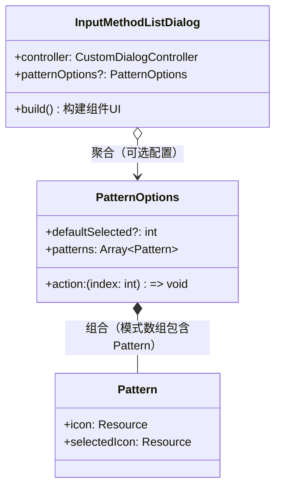
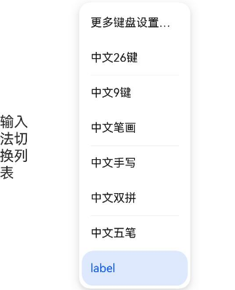

# @ohos.inputMethodList (输入法切换列表控件)
<!--Kit: IME Kit-->
<!--Subsystem: MiscServices-->
<!--Owner: @codexu62-->
<!--Designer: @andeszhang-->
<!--Tester: @murphy84-->
<!--Adviser: @zhang_yixin13-->

**@ohos.inputMethodList**模块是面向系统应用和输入法应用的UI控件模块，提供了输入法切换列表弹窗组件。

本模块是一个声明式UI组件模块，提供`InputMethodListDialog`自定义弹窗组件，用于展示系统默认输入法子类型和第三方输入法应用列表，并可选地提供输入法模式切换入口（如单手模式、全屏模式等）。

通过本模块提供的弹窗组件，用户可以在输入法列表中查看当前系统中已安装的所有输入法，并从默认输入法切换到其他输入法；对于系统预置输入法，还可在列表中展示模式选项（如单手模式、全屏模式），供用户切换输入法键盘的显示模式。

当系统应用或输入法应用需要提供输入法切换入口时使用本模块。典型场景包括：系统设置应用中的输入法管理页面、输入法应用自身的设置界面、或其他需要让用户选择和切换输入法的系统级界面。本组件仅系统应用和输入法应用可调用，`patternOptions`参数仅系统预置输入法支持。

本模块与输入法框架其他模块的关系如下：

— [@ohos.inputMethod](js-apis-inputmethod.md)：面向普通前台应用，提供输入法的控制与管理能力（如显示/隐藏软键盘、切换输入法等），可通过程序化接口`switchInputMethod`切换输入法，适用于无需交互式选择界面的场景。

— [@ohos.inputMethodEngine](js-apis-inputmethodengine.md)：面向输入法应用，提供创建软键盘窗口、插入/删除字符等输入法服务端能力。

— **@ohos.inputMethodList（本模块）**：面向系统应用和输入法应用，提供可视化的输入法切换列表弹窗控件，适用于需要交互式选择界面的场景。

> **说明：**
>
> 该组件从API version 11开始支持。后续版本如有新增内容，则采用上角标单独标记该内容的起始版本。

本模块包含以下关键组件和接口：

| Interface/Struct | 说明 |
|---|---|
| **InputMethodListDialog** | 输入法切换列表弹窗组件，使用`@CustomDialog`装饰器声明。展示输入法列表和可选的模式切换入口，是本模块的核心UI组件。需要传入`CustomDialogController`控制弹窗的打开与关闭，可选传入`PatternOptions`配置模式切换功能。 |
| **PatternOptions** | 输入法模式选项配置接口，定义模式选项的资源数组、默认选中索引和模式切换回调。仅系统预置输入法支持传入此参数。 |
| **Pattern** | 单个输入法模式的图标定义接口，包含默认图标和选中状态图标两个资源属性。 |

使用`InputMethodListDialog`需要多个API组合配合：创建`CustomDialogController` -> 配置`PatternOptions`（可选） -> 在`CustomDialogController`的builder中构建`InputMethodListDialog` -> 通过`CustomDialogController.open()`打开弹窗。

```javascript
// 以下为阐述调用逻辑的伪代码

// 1. 定义模式选项（仅系统预置输入法需要）
let patternOptions = {
  defaultSelected: 1,                              // 默认选中的模式索引
  patterns: [                                       // 模式选项资源数组
    { icon: 手模式图标, selectedIcon: 手模式选中图标 },
    { icon: 全屏模式图标, selectedIcon: 全屏模式选中图标 }
  ],
  action: (index) => {                              // 模式切换回调
    // 处理模式切换逻辑
  }
};

// 2. 创建CustomDialogController，在builder中构建InputMethodListDialog
let listController = new CustomDialogController({
  builder: InputMethodListDialog({ patternOptions: patternOptions }),
  customStyle: true
});

// 3. 在用户交互事件中打开弹窗
listController.open();
```

UML类图如下：



> **说明：**
>
> `InputMethodListDialog`与`PatternOptions`为**聚合关系**（空心菱形◇）：`InputMethodListDialog`持有可选的`patternOptions`属性，`PatternOptions`可以独立存在（非默认输入法时不传入）。
> `PatternOptions`与`Pattern`为**组合关系**（实心菱形◆）：`PatternOptions`的`patterns`数组包含多个`Pattern`对象，`Pattern`作为模式选项的一部分，不能脱离`PatternOptions`单独用于`InputMethodListDialog`。

## 导入模块

```ts
import { InputMethodListDialog } from '@kit.IMEKit';
```

## 子组件

无

## 属性
不支持[通用属性](../apis-arkui/arkui-ts/ts-component-general-attributes.md)

## InputMethodListDialog

InputMethodListDialog({controller: CustomDialogController, patternOptions?: PatternOptions})

输入法切换列表弹窗控件。以弹窗形式展示当前系统中已安装的输入法应用列表，支持用户在输入法之间进行切换；对于默认输入法，还提供键盘模式（如单手模式、全屏模式等）的切换入口。

**使用场景：** 当系统应用或输入法应用需要为用户提供可视化的输入法选择和切换功能时使用此控件。例如，在系统设置应用中允许用户选择不同输入法，或在输入法应用中允许用户切换到其他输入法或切换当前输入法的键盘模式。

**使用后效果：** 调用此控件后，将弹出输入法切换列表弹窗。用户在弹窗中选择输入法后，系统将切换到指定的输入法；若用户选择了默认输入法的模式选项，系统将按指定模式显示键盘布局。

**相似接口差异点及选取原则：** 与[inputMethod.switchInputMethod](js-apis-inputmethod.md#inputmethodswitchinputmethod9)接口相比，本控件提供了可视化的输入法选择界面，适用于需要交互式选择界面的场景；switchInputMethod接口适用于程序化切换输入法的场景，无需用户手动选择。

**装饰器类型：**@CustomDialog

**系统能力：** SystemCapability.MiscServices.InputMethodFramework

**使用限制：** 本组件仅系统应用和输入法应用可调用，patternOptions参数仅系统预置输入法支持。

**注意事项：**
- 前提条件：需先创建[CustomDialogController](../apis-arkui/arkui-ts/ts-methods-custom-dialog-box.md#customdialogcontroller)实例并关联InputMethodListDialog，再通过controller的open()方法打开弹窗。
- 本组件不支持通用属性和通用事件。

**参数：**

| 名称 | 类型 | 必填 | 装饰器类型 | 说明 |
| -------- | -------- | -------- | -------- | -------- |
| controller | [CustomDialogController](../apis-arkui/arkui-ts/ts-methods-custom-dialog-box.md#customdialogcontroller) | 是 | - | 输入法切换列表弹窗控制器，用于控制弹窗的打开和关闭。<br>**使用场景：** 当需要通过代码控制输入法切换列表弹窗的显示与隐藏时，必须提供此参数。<br>**使用后效果：** 设置后，可通过调用controller的[open()](../apis-arkui/arkui-ts/ts-methods-custom-dialog-box.md#open)方法打开弹窗，[close()](../apis-arkui/arkui-ts/ts-methods-custom-dialog-box.md#close)方法关闭弹窗。<br>**说明：** 需先创建CustomDialogController实例并关联InputMethodListDialog，再通过controller.open()打开弹窗。 |
| patternOptions | [PatternOptions](#patternoptions) | 否 | - | 输入法模式选项配置。仅系统预置输入法支持。<br>**使用场景：** 当系统预置输入法需要支持模式切换功能（如单手模式、全屏模式等）时传入此参数，配置模式图标资源和切换回调；不传入时，控件仅显示输入法列表，不提供模式切换功能。<br>**默认值：** 不传入时，控件仅显示输入法列表，不提供模式切换功能。<br>**说明：** 仅系统预置输入法支持此参数，三方输入法应用不可使用此参数。 |

## PatternOptions

输入法模式选项配置，用于定义键盘模式的切换选项。

**系统能力：** SystemCapability.MiscServices.InputMethodFramework

| 名称 | 类型 | 只读 | 可选 | 说明 |
| -------- | -------- | -------- | -------- | -------- |
| defaultSelected | number | 否 | 是 | 默认选择的模式索引，对应patterns数组中的索引值。<br>**使用场景：** 当默认输入法需要预设一个初始选中的键盘模式时使用此参数。<br>**使用后效果：** 设置后，输入法列表弹窗打开时会默认选中该索引对应的模式选项。<br>**取值范围：** [0, patterns.length - 1]。超出此范围时不生效，弹窗打开时不选中任何模式选项。<br>**默认值：** 不设置时，弹窗打开时不选中任何模式选项。<br>**说明：** 该索引值必须在patterns数组的有效范围内，否则设置不生效。 |
| patterns   | Array<[Pattern](#pattern)> | 否 | 否 | 模式选项资源数组，每个Pattern定义一个键盘模式的图标和选中状态图标。<br>**使用场景：** 当默认输入法需要提供多种键盘模式（如单手模式、全屏模式等）供用户选择时，需配置此参数。<br>**使用后效果：** 设置后，输入法切换列表弹窗中会在默认输入法区域展示该数组中定义的所有模式选项供用户选择。<br>**说明：** patterns数组中的每个Pattern的icon和selectedIcon均需为有效的[Resource](../apis-arkui/arkui-ts/ts-types.md#resource)资源引用；建议至少配置2个模式选项以提供有意义的选择功能。 |
| action | (index: number) => void | 否 | 否 | 模式选项改变时的回调函数。<br>**使用场景：** 当需要在用户切换键盘模式时执行相应逻辑（如更新键盘布局、保存用户偏好等）时，需设置此回调。<br>**使用后效果：** 当用户在输入法切换列表弹窗中点击某个模式选项时，系统将调用此回调并传入选中模式在patterns数组中的索引值。<br>**说明：** 回调参数index为选中模式在patterns数组中的索引值，与defaultSelected的取值范围一致。回调中可根据index值更新defaultSelected，以保持下次打开弹窗时选中状态与用户选择一致。 |

## Pattern

输入法模式选项的图标资源定义，用于配置键盘模式在弹窗中的视觉表现。仅当前输入法（即系统预置输入法）可使用。

**系统能力：** SystemCapability.MiscServices.InputMethodFramework

| 名称 | 类型 | 只读 | 可选 | 说明 |
| -------- | -------- | -------- | -------- | -------- |
| icon | [Resource](../apis-arkui/arkui-ts/ts-types.md#resource) | 否 | 否 | 输入法模式选项的默认（未选中）状态图标资源。<br>**使用场景：** 用于标识每个键盘模式在未选中时的视觉表现形式，用户在弹窗中可据此识别不同的模式选项。<br>**使用后效果：** 设置后，弹窗中该模式选项在未选中状态时显示此图标。<br>**说明：** 需使用Resource类型资源引用（如$r('app.media.xxx')），确保工程resource目录中已添加对应的图标资源文件。不支持string和PixelMap类型的图片资源。 |
| selectedIcon | [Resource](../apis-arkui/arkui-ts/ts-types.md#resource) | 否 | 否 | 输入法模式选项的选中状态图标资源。<br>**使用场景：** 用于标识每个键盘模式在选中时的视觉表现形式，与icon形成选中/未选中的视觉区分，帮助用户识别当前选中的模式。<br>**使用后效果：** 设置后，弹窗中该模式选项在选中状态时显示此图标。<br>**相关参数间的配合/制约关系：** selectedIcon应与icon在视觉风格上保持一致，仅在选中状态标识上有所区别（如增加高亮、边框等），以便用户识别当前选中的模式。每个Pattern中的icon和selectedIcon必须同时设置，缺一不可。 |

##  事件

不支持[通用事件](../apis-arkui/arkui-ts/ts-component-general-events.md)

##  示例

```ts
import { PatternOptions, InputMethodListDialog } from '@kit.IMEKit';
import { CustomDialogController } from '@kit.ArkUI';

@Entry
// 设置组件
@Component
struct SettingsItem {
  @State defaultPattern: number = 1;
  private oneHandAction: PatternOptions = {
    defaultSelected: this.defaultPattern,
    patterns: [ // patterns中的图标需要在工程的resource中添加对应图标资源后使用
      {
        icon: $r('app.media.hand_icon'), // 此处为输入法模式选项的图标资源，例如单手模式图标
        selectedIcon: $r('app.media.hand_icon_selected') // 此处为输入法模式选项的图标资源选中状态，例如单手模式选中状态的图标
      },
      {
        icon: $r('app.media.hand_icon1'),
        selectedIcon: $r('app.media.hand_icon_selected1')
      },
      {
        icon: $r('app.media.hand_icon2'),
        selectedIcon: $r('app.media.hand_icon_selected2'),
      }],
    // 模式选项改变时的回调函数
    action: (index: number) => {
      console.info(`pattern is changed, current is ${index}`);
      this.defaultPattern = index; // 更新默认选择的模式
    }
  };
  // 创建自定义对话框控制器
  private listController: CustomDialogController = new CustomDialogController({
    builder: InputMethodListDialog({ patternOptions: this.oneHandAction }), // 构建输入法切换列表弹窗
    customStyle: true,
    maskColor: '#00000000'
  });

  build() {
    Column() {
      Flex({ direction: FlexDirection.Column,
        alignItems: ItemAlign.Center, justifyContent: FlexAlign.Center }) {
        Text('输入法切换列表').fontSize(20)
      }
    }
    .width('13%')
    .id('bindInputMethod')
    .onClick((event?: ClickEvent) => {
      this.listController.open();
    })
  }
}
```

示例效果图：


