# @ohos.sensor (传感器)(系统接口)
<!--Kit: Sensor Service Kit-->
<!--Subsystem: Sensors-->
<!--Owner: @dilligencer-->
<!--Designer: @andeszhang-->
<!--Tester: @liuhaonan2-->
<!--Adviser: @hu-zhiqiong-->

## 模块简介

@system.sensor模块是面向轻量穿戴（Lite Wearable）设备的传感器数据订阅模块，提供对加速度传感器、罗盘传感器、距离传感器、环境光传感器、计步传感器、气压计传感器、心率传感器、设备佩戴状态传感器、设备方向传感器及陀螺仪传感器的数据订阅与取消订阅能力。

该模块用于帮助应用实时获取各类传感器数据变化通知，从而实现运动监测、健康追踪、环境感知、方向识别、屏幕自适应等功能。每种传感器均提供subscribe/unsubscribe配对接口，佩戴状态传感器额外提供getOnBodyState单次查询接口。

该模块适用于轻量穿戴设备场景，需要对应硬件支持且仅支持真机调试。对于非轻量穿戴设备类型，该模块从API version 8起不再维护，建议使用[@ohos.sensor](js-apis-sensor.md)模块替代。同一应用对同一传感器多次调用订阅接口时，仅最后一次调用生效。

## 概述

本模块为@ohos.sensor模块的系统接口补充部分，仅包含COLOR（颜色传感器）和SAR（吸收比率传感器）的系统接口。其余公开接口（如加速度、陀螺仪、环境光等）请参见[@ohos.sensor](js-apis-sensor.md)。

本模块采用"订阅-取消订阅"的使用模式：开发者通过sensor.on接口订阅传感器数据，系统按指定频率通过回调函数上报数据；开发者不再需要数据时，通过sensor.off接口取消订阅。同一类型传感器的on与off接口需配对使用，先调用sensor.on订阅后才能调用sensor.off取消订阅。

从API version 19开始，sensor.off接口新增sensorInfoParam参数，支持指定deviceId和sensorIndex来精确取消订阅某一设备上的特定传感器回调，适用于多设备场景。不传入sensorInfoParam时，默认取消本地设备上的回调。API version 10的sensor.off接口不包含sensorInfoParam参数，仅支持取消本地设备上的回调。

> **说明：**
>
> - 本模块同时支持ArkTS-Dyn、ArkTS-Sta。
>
> - 本模块首批接口从API version 8开始支持。后续版本的新增接口，采用上角标单独标记接口的起始版本。
>
> 本模块为系统接口。

### UML类图

```mermaid
classDiagram

    class Sensor {
        <<class>>
        +static subscribeAccelerometer(subscribeAccelerometerOptions) void
        +static unsubscribeAccelerometer() void
        +static subscribeCompass(SubscribeCompassOptions) void
        +static unsubscribeCompass() void
        +static subscribeHeartRate(SubscribeHeartRateOptions) void
        +static unsubscribeHeartRate() void
        +static getOnBodyState(GetOnBodyStateOptions) void
    }

    class subscribeAccelerometerOptions {
        <<interface>>
        +interval: string
        +success: AccelerometerResponse~void
        +fail: string, number~void
    }

    class AccelerometerResponse {
        <<interface>>
        +x: number
        +y: number
        +z: number
    }

    class SubscribeCompassOptions {
        <<interface>>
        +success: CompassResponse~void
        +fail: string, number~void
    }

    class CompassResponse {
        <<interface>>
        +direction: number
    }

    class SubscribeProximityOptions {
        <<interface>>
        +success: ProximityResponse~void
        +fail: string, number~void
    }

    class ProximityResponse {
        <<interface>>
        +distance: number
    }

    class SubscribeLightOptions {
        <<interface>>
        +success: LightResponse~void
        +fail: string, number~void
    }

    class LightResponse {
        <<interface>>
        +intensity: number
    }

    class SubscribeStepCounterOptions {
        <<interface>>
        +success: StepCounterResponse~void
        +fail: string, number~void
    }

    class StepCounterResponse {
        <<interface>>
        +steps: number
    }

    class SubscribeBarometerOptions {
        <<interface>>
        +success: BarometerResponse~void
        +fail: string, number~void
    }

    class BarometerResponse {
        <<interface>>
        +pressure: number
    }

    class SubscribeHeartRateOptions {
        <<interface>>
        +success: HeartRateResponse~void
        +fail: string, number~void
    }

    class HeartRateResponse {
        <<interface>>
        +heartRate: number
    }

    class SubscribeOnBodyStateOptions {
        <<interface>>
        +success: OnBodyStateResponse~void
        +fail: string, number~void
    }

    class GetOnBodyStateOptions {
        <<interface>>
        +success: OnBodyStateResponse~void
        +fail: string, number~void
        +complete: void~void
    }

    class OnBodyStateResponse {
        <<interface>>
        +value: boolean
    }

    class SubscribeDeviceOrientationOptions {
        <<interface>>
        +interval: string
        +success: DeviceOrientationResponse~void
        +fail: string, number~void
    }

    class DeviceOrientationResponse {
        <<interface>>
        +alpha: number
        +beta: number
        +gamma: number
    }

    class SubscribeGyroscopeOptions {
        <<interface>>
        +interval: string
        +success: GyroscopeResponse~void
        +fail: string, number~void
    }

    class GyroscopeResponse {
        <<interface>>
        +x: number
        +y: number
        +z: number
    }

    Sensor ..> subscribeAccelerometerOptions : Dependency
    Sensor ..> SubscribeCompassOptions : Dependency
    Sensor ..> SubscribeProximityOptions : Dependency
    Sensor ..> SubscribeLightOptions : Dependency
    Sensor ..> SubscribeStepCounterOptions : Dependency
    Sensor ..> SubscribeBarometerOptions : Dependency
    Sensor ..> SubscribeHeartRateOptions : Dependency
    Sensor ..> SubscribeOnBodyStateOptions : Dependency
    Sensor ..> GetOnBodyStateOptions : Dependency
    Sensor ..> SubscribeDeviceOrientationOptions : Dependency
    Sensor ..> SubscribeGyroscopeOptions : Dependency

    subscribeAccelerometerOptions --> AccelerometerResponse : Association
    SubscribeCompassOptions --> CompassResponse : Association
    SubscribeProximityOptions --> ProximityResponse : Association
    SubscribeLightOptions --> LightResponse : Association
    SubscribeStepCounterOptions --> StepCounterResponse : Association
    SubscribeBarometerOptions --> BarometerResponse : Association
    SubscribeHeartRateOptions --> HeartRateResponse : Association
    SubscribeOnBodyStateOptions --> OnBodyStateResponse : Association
    GetOnBodyStateOptions --> OnBodyStateResponse : Association
    SubscribeDeviceOrientationOptions --> DeviceOrientationResponse : Association
    SubscribeGyroscopeOptions --> GyroscopeResponse : Association
```



图中：
- Sensor类通过Dependency关系使用各SubscribeOptions接口作为方法参数。
- 各SubscribeOptions接口通过Association关系持有对应Response接口，作为success回调的参数类型。
- GetOnBodyStateOptions和SubscribeOnBodyStateOptions均关联OnBodyStateResponse。

## 导入模块

```ts
import { sensor } from '@kit.SensorServiceKit';
```

## sensor.on(sensor.SensorId.COLOR)<sup>10+</sup>

on(type: SensorId.COLOR, callback: Callback&lt;ColorResponse&gt;, options?: Options): void

订阅颜色传感器数据变化。通过回调函数异步上报颜色传感器数据，数据格式为ColorResponse对象，包含lightIntensity（光照强度）和colorTemperature（色温）两个number类型字段。

当开发者需要获取环境光照强度和色温信息以实现屏幕自动亮度调节、拍照色温补偿、环境光线监测等功能时，使用此接口。

调用此接口后，系统会按指定的回调频率上报颜色传感器数据；如不传入options参数，默认上报频率为200000000ns（即200ms间隔）。该接口为异步回调方式，传感器数据变化时通过callback回调上报，无Promise返回值。

**ArkTS模式**：该接口仅适用于ArkTS-Dyn。

**相关接口**：该接口对应的接口ArkTS-Sta是[onColorChange](#sensoroncolorchange23)

**系统能力**：SystemCapability.Sensors.Sensor

**系统API**：此接口为系统接口

**ArkTS-Dyn起始版本：** 10

**参数**：

| 参数名   | 类型                                              | 必填 | 说明                                                        |
| -------- | ------------------------------------------------- | ---- | ----------------------------------------------------------- |
| type     | [SensorId](#sensorid9).COLOR                      | 是   | 传感器类型，该值固定为SensorId.COLOR。                      |
| callback | Callback&lt;[ColorResponse](#colorresponse10)&gt; | 是   | 回调函数，异步上报的传感器数据固定为ColorResponse。         |
| options  | [Options](js-apis-sensor.md#options)              | 否   | 可选参数列表，用于设置传感器上报频率。默认值：200000000ns。不传入时使用默认频率。 |

**错误码**：

以下错误码的详细介绍请参见[传感器错误码](errorcode-sensor.md)和[通用错误码](../errorcode-universal.md)。错误码和错误信息会以异常的形式抛出，调用接口时需要使用try catch对可能出现的异常进行捕获操作。

| 错误码ID | 错误信息                                                     |
| -------- | ------------------------------------------------------------ |
| 202      | Permission check failed. A non-system application uses the system API. |
| 401      | Parameter error.Possible causes:1. Mandatory parameters are left unspecified;2. Incorrect parameter types;3. Parameter verification failed. |
| 14500101 | Service exception.Possible causes:1. Sensor hdf service exception;2. Sensor service ipc exception;3.Sensor data channel exception. |

**示例**：

```ts
import { sensor } from '@kit.SensorServiceKit';
import { BusinessError } from '@kit.BasicServicesKit';

try{
  sensor.on(sensor.SensorId.COLOR, (data: sensor.ColorResponse) => {
    console.info('Succeeded in getting the intensity of light: ' + data.lightIntensity);
    console.info('Succeeded in getting the color temperature: ' + data.colorTemperature);
  }, { interval: 100000000 });
  setTimeout(() => {
        sensor.off(sensor.SensorId.COLOR);
  }, 500);
} catch (error) {
  let e: BusinessError = error as BusinessError;
  console.error(`Failed to invoke on. Code: ${e.code}, message: ${e.message}`);
}
```

## sensor.onColorChange<sup>23+</sup>

onColorChange(callback: Callback&lt;ColorResponse&gt;, options?: Options): void

订阅颜色传感器数据变化。通过回调函数异步上报颜色传感器数据，数据格式为ColorResponse对象，包含lightIntensity（光照强度）和colorTemperature（色温）两个number类型字段。

当开发者需要获取环境光照强度和色温信息以实现屏幕自动亮度调节、拍照色温补偿、环境光线监测等功能时，使用此接口。

调用此接口后，系统会按指定的回调频率上报颜色传感器数据；如不传入options参数，默认上报频率为200000000ns（即200ms间隔）。该接口为异步回调方式，传感器数据变化时通过callback回调上报，无Promise返回值。

**ArkTS模式**：该接口适用于ArkTS-Sta。

**相关接口**：该接口对应的接口ArkTS-Dyn是[sensor.on(sensor.SensorId.COLOR)](#sensoronsensorsensoridcolor10)

**系统能力**：SystemCapability.Sensors.Sensor

**系统API**：此接口为系统接口

**ArkTS-Sta起始版本：** 23

**参数**：

| 参数名   | 类型                                              | 必填 | 说明                                                        |
| -------- | ------------------------------------------------- | ---- | ----------------------------------------------------------- |
| callback | Callback&lt;[ColorResponse](#colorresponse10)&gt; | 是   | 回调函数，异步上报的传感器数据固定为ColorResponse。         |
| options  | [Options](js-apis-sensor.md#options)              | 否   | 可选参数列表，用于设置传感器上报频率，默认值为200000000ns。 |

**错误码**：

以下错误码的详细介绍请参见[传感器错误码](errorcode-sensor.md)和[通用错误码](../errorcode-universal.md)。错误码和错误信息会以异常的形式抛出，调用接口时需要使用try catch对可能出现的异常进行捕获操作。

| 错误码ID | 错误信息                                                     |
| -------- | ------------------------------------------------------------ |
| 202      | Permission check failed. A non-system application uses the system API. |
| 14500101 | Service exception.Possible causes:1. Sensor hdf service exception;2. Sensor service ipc exception;3.Sensor data channel exception. |

**示例**：

```ts
import { BusinessError } from '@kit.BasicServicesKit';
import { sensor } from '@kit.SensorServiceKit';

try{
  sensor.onColorChange((data: sensor.ColorResponse) => {
    console.info('Succeeded in getting the intensity of light: ' + data.lightIntensity);
    console.info('Succeeded in getting the color temperature: ' + data.colorTemperature);
  }, { interval: 100000000 });
  setTimeout(() => {
        sensor.offColorChange();
  }, 500);
} catch (error) {
  let e: BusinessError = error as BusinessError;
  console.error(`Failed to invoke onColorChange. Code: ${e.code}, message: ${e.message}`);
}
```

## sensor.on(sensor.SensorId.SAR)<sup>10+</sup>

on(type: SensorId.SAR, callback: Callback&lt;SarResponse&gt;, options?: Options): void

订阅吸收比率传感器数据变化。通过回调函数异步上报SAR传感器数据，数据格式为SarResponse对象，包含absorptionRatio（吸收率）一个number类型字段。

当开发者需要监测设备电磁波吸收率以实现通信安全监测、辐射检测等功能时，使用此接口。

调用此接口后，系统会按指定的回调频率上报SAR传感器数据；如不传入options参数，默认上报频率为200000000ns（即200ms间隔）。该接口为异步回调方式，传感器数据变化时通过callback回调上报，无Promise返回值。

**ArkTS模式**：该接口仅适用于ArkTS-Dyn。

**相关接口**：该接口对应的接口ArkTS-Sta是[onSarChange](#sensoronsarchange23)

**系统能力**：SystemCapability.Sensors.Sensor

**系统API**：此接口为系统接口

**ArkTS-Dyn起始版本：** 10

**参数**：

| 参数名   | 类型                                          | 必填 | 说明                                                        |
| -------- | --------------------------------------------- | ---- | ----------------------------------------------------------- |
| type     | [SensorId](#sensorid9).SAR                    | 是   | 传感器类型，该值固定为SensorId.SAR。                        |
| callback | Callback&lt;[SarResponse](#sarresponse10)&gt; | 是   | 回调函数，异步上报的传感器数据固定为SarResponse。           |
| options  | [Options](js-apis-sensor.md#options)          | 否   | 可选参数列表，用于设置传感器上报频率。默认值：200000000ns。不传入时使用默认频率。 |

**错误码**：

以下错误码的详细介绍请参见[传感器错误码](errorcode-sensor.md)和[通用错误码](../errorcode-universal.md)。错误码和错误信息会以异常的形式抛出，调用接口时需要使用try catch对可能出现的异常进行捕获操作。

| 错误码ID | 错误信息                                                     |
| -------- | ------------------------------------------------------------ |
| 202      | Permission check failed. A non-system application uses the system API. |
| 401      | Parameter error.Possible causes:1. Mandatory parameters are left unspecified;2. Incorrect parameter types;3. Parameter verification failed. |
| 14500101 | Service exception.Possible causes:1. Sensor hdf service exception;2. Sensor service ipc exception;3.Sensor data channel exception. |

**示例**：

```ts
import { sensor } from '@kit.SensorServiceKit';
import { BusinessError } from '@kit.BasicServicesKit';

try {
  sensor.on(sensor.SensorId.SAR, (data: sensor.SarResponse) => {
    console.info('Succeeded in getting specific absorption rate : ' + data.absorptionRatio);
  }, { interval: 100000000 });
  setTimeout(() => {
    sensor.off(sensor.SensorId.SAR);
  }, 500);
} catch (error) {
  let e: BusinessError = error as BusinessError;
  console.error(`Failed to invoke on. Code: ${e.code}, message: ${e.message}`);
}
```

## sensor.onSarChange<sup>23+</sup>

onSarChange(callback: Callback&lt;SarResponse&gt;, options?: Options): void

订阅吸收比率传感器数据变化。通过回调函数异步上报SAR传感器数据，数据格式为SarResponse对象，包含absorptionRatio（吸收率）一个number类型字段。

当开发者需要监测设备电磁波吸收率以实现通信安全监测、辐射检测等功能时，使用此接口。

调用此接口后，系统会按指定的回调频率上报SAR传感器数据；如不传入options参数，默认上报频率为200000000ns（即200ms间隔）。该接口为异步回调方式，传感器数据变化时通过callback回调上报，无Promise返回值。

**ArkTS模式**：该接口适用于ArkTS-Sta。

**相关接口**：该接口对应的接口ArkTS-Dyn是[sensor.on(sensor.SensorId.SAR)](#sensoronsensorsensoridsar10)

**系统能力**：SystemCapability.Sensors.Sensor

**系统API**：此接口为系统接口

**ArkTS-Sta起始版本：** 23

**参数**：

| 参数名   | 类型                                          | 必填 | 说明                                                        |
| -------- | --------------------------------------------- | ---- | ----------------------------------------------------------- |
| callback | Callback&lt;[SarResponse](#sarresponse10)&gt; | 是   | 回调函数，异步上报的传感器数据固定为SarResponse。           |
| options  | [Options](js-apis-sensor.md#options)          | 否   | 可选参数列表，用于设置传感器上报频率，默认值为200000000ns。 |

**错误码**：

以下错误码的详细介绍请参见[传感器错误码](errorcode-sensor.md)和[通用错误码](../errorcode-universal.md)。错误码和错误信息会以异常的形式抛出，调用接口时需要使用try catch对可能出现的异常进行捕获操作。

| 错误码ID | 错误信息                                                     |
| -------- | ------------------------------------------------------------ |
| 202      | Permission check failed. A non-system application uses the system API. |
| 14500101 | Service exception.Possible causes:1. Sensor hdf service exception;2. Sensor service ipc exception;3.Sensor data channel exception. |

**示例**：

```ts
import { BusinessError } from '@kit.BasicServicesKit';
import { sensor } from '@kit.SensorServiceKit';

try {
  sensor.onSarChange((data: sensor.SarResponse) => {
    console.info('Succeeded in getting specific absorption rate : ' + data.absorptionRatio);
  }, { interval: 100000000 });
  setTimeout(() => {
    sensor.offSarChange();
  }, 500);
} catch (error) {
  let e: BusinessError = error as BusinessError;
  console.error(`Failed to invoke onSarChange. Code: ${e.code}, message: ${e.message}`);
}
```

## sensor.off(sensor.SensorId.COLOR)<sup>10+</sup>

off(type: SensorId.COLOR, callback?: Callback&lt;ColorResponse&gt;): void

取消订阅颜色传感器数据。调用后，颜色传感器的回调函数将不再触发。

当开发者不再需要颜色传感器数据时（如页面切换、应用退出），使用此接口取消订阅，以减少系统资源占用。

调用此接口后，之前通过sensor.on(sensor.SensorId.COLOR)注册的回调函数将不再被触发。若传入callback参数，仅取消该指定回调函数的订阅；若不传入callback参数，则取消当前SensorId.COLOR类型的所有回调函数。需先调用sensor.on(sensor.SensorId.COLOR)订阅后，再调用此接口取消订阅。

**系统能力**：SystemCapability.Sensors.Sensor

**系统API**：此接口为系统接口

**参数**：

| 参数名   | 类型                                                     | 必填 | 说明                                                         |
| -------- |--------------------------------------------------------| ---- | ------------------------------------------------------------ |
| type     | [SensorId](#sensorid9).COLOR                           | 是   | 传感器类型，该值固定为SensorId.COLOR。                       |
| callback | Callback&lt;[ColorResponse](#colorresponse10)&gt;      | 否   | 需要取消订阅的回调函数，若无此参数，则取消订阅当前类型的所有回调函数。 |

**错误码**：

以下错误码的详细介绍请参见[通用错误码](../errorcode-universal.md)。错误码和错误信息会以异常的形式抛出，调用接口时需要使用try catch对可能出现的异常进行捕获操作。

| 错误码ID | 错误信息                                                     |
| -------- | ------------------------------------------------------------ |
| 202      | Permission check failed. A non-system application uses the system API. |
| 401      | Parameter error.Possible causes:1. Mandatory parameters are left unspecified;2. Incorrect parameter types;3. Parameter verification failed. |

**示例**：

```ts
import { sensor } from '@kit.SensorServiceKit';
import { BusinessError } from '@kit.BasicServicesKit';

function callback1(data: object) {
  console.info('Succeeded in getting callback1 data: ' + JSON.stringify(data));
}

function callback2(data: object) {
  console.info('Succeeded in getting callback2 data: ' + JSON.stringify(data));
}

try {
  sensor.on(sensor.SensorId.COLOR, callback1);
  sensor.on(sensor.SensorId.COLOR, callback2);
  // 仅取消callback1的注册
  sensor.off(sensor.SensorId.COLOR, callback1);
  // 取消注册SensorId.COLOR的所有回调
  sensor.off(sensor.SensorId.COLOR);
} catch (error) {
  let e: BusinessError = error as BusinessError;
  console.error(`Failed to invoke off. Code: ${e.code}, message: ${e.message}`);
}
```

## sensor.off(sensor.SensorId.COLOR)<sup>19+</sup>

off(type: SensorId.COLOR, sensorInfoParam?: SensorInfoParam, callback?: Callback&lt;ColorResponse&gt;): void

取消订阅颜色传感器数据。与API version 10的off接口相比，新增sensorInfoParam参数，支持通过指定deviceId和sensorIndex来精确取消订阅某一设备上的特定传感器回调，适用于多设备场景。

当开发者需要取消订阅特定设备上的颜色传感器数据时（如多设备连接场景），使用此接口。不传入sensorInfoParam时，默认取消本地设备（deviceId为-1）上的回调。

调用此接口后，指定设备上的颜色传感器回调函数将不再被触发。若传入callback参数，仅取消该指定回调函数的订阅；若不传入callback参数，则取消指定设备上SensorId.COLOR类型的所有回调函数。

**ArkTS模式**：该接口仅适用于ArkTS-Dyn。

**相关接口**：该接口对应的接口ArkTS-Sta是[offColorChange](#sensoroffcolorchange23)

**系统能力**：SystemCapability.Sensors.Sensor

**系统API**：此接口为系统接口

**ArkTS-Dyn起始版本：** 19

**参数**：

| 参数名   | 类型                                                     | 必填 | 说明                                                         |
| -------- |--------------------------------------------------------| ---- | ------------------------------------------------------------ |
| type     | [SensorId](#sensorid9).COLOR                           | 是   | 传感器类型，该值固定为SensorId.COLOR。                       |
| sensorInfoParam | [SensorInfoParam](#sensorinfoparam19) |  否 | 传感器传入设置参数，可指定deviceId和sensorIndex。默认值：deviceId为-1（本地设备），sensorIndex为0（默认传感器）。不传入时默认取消本地设备上的回调。 |
| callback | Callback&lt;[ColorResponse](#colorresponse10)&gt;      | 否   | 需要取消订阅的回调函数，若无此参数，则取消订阅指定设备上当前类型的所有回调函数。 |

**错误码**：

以下错误码的详细介绍请参见[传感器错误码](errorcode-sensor.md)和[通用错误码](../errorcode-universal.md)。错误码和错误信息会以异常的形式抛出，调用接口时需要使用try catch对可能出现的异常进行捕获操作。

| 错误码ID | 错误信息                                                     |
| -------- | ------------------------------------------------------------ |
| 202      | Permission check failed. A non-system application uses the system API. |
| 14500101 | Service exception.Possible causes:1. Sensor hdf service exception;2. Sensor service ipc exception;3.Sensor data channel exception. |

**示例**：

```ts
import { sensor } from '@kit.SensorServiceKit';
import { BusinessError } from '@kit.BasicServicesKit';

enum Ret { OK, Failed = -1 }

// 传感器回调
const sensorCallback = (response: sensor.ColorResponse) => {
  console.info(`callback response: ${JSON.stringify(response)}`);
}
// 传感器监听类型
const sensorType = sensor.SensorId.COLOR;
const sensorInfoParam: sensor.SensorInfoParam = {};

function sensorSubscribe(): Ret {
  let ret: Ret = Ret.OK;
  try {
    // 查询所有的传感器
    const sensorList: sensor.Sensor[] = sensor.getSensorListSync();
    if (!sensorList.length) {
      return Ret.Failed;
    }
    // 根据实际业务逻辑获取目标传感器。
    const targetSensor = sensorList
      // 按需过滤deviceId为1、sensorId为2的所有传感器。此处示例仅做展示，开发者需要自行调整筛选逻辑。
      .filter((sensor: sensor.Sensor) => sensor.deviceId === 1 && sensor.sensorId === 2)
      // 可能存在的多个同类型传感器，选择sensorIndex为0的传感器。
      .find((sensor: sensor.Sensor) => sensor.sensorIndex === 0);
    if (!targetSensor) {
      return Ret.Failed;
    }
    sensorInfoParam.deviceId = targetSensor.deviceId;
    sensorInfoParam.sensorIndex = targetSensor.sensorIndex;
    // 订阅传感器事件
    sensor.on(sensorType, sensorCallback, { sensorInfoParam });
  } catch (error) {
    let e: BusinessError = error as BusinessError;
    console.error(`Failed to invoke sensor.on. Code: ${e.code}, message: ${e.message}`);
    ret = Ret.Failed;
  }
  return ret;
}

function sensorUnsubscribe(): Ret {
  let ret: Ret = Ret.OK;
  try {
    sensor.off(sensorType, sensorInfoParam, sensorCallback);
  } catch (error) {
    let e: BusinessError = error as BusinessError;
    console.error(`Failed to invoke sensor.off. Code: ${e.code}, message: ${e.message}`);
    ret = Ret.Failed;
  }
  return ret;
}
```

## sensor.offColorChange<sup>23+</sup>

offColorChange(sensorInfoParam?: SensorInfoParam, callback?: Callback&lt;ColorResponse&gt;): void

取消订阅颜色传感器数据。调用后，颜色传感器的回调函数将不再触发。

当开发者不再需要颜色传感器数据时（如页面切换、应用退出），使用此接口取消订阅，以减少系统资源占用。

调用此接口后，之前通过sensor.on(sensor.SensorId.COLOR)注册的回调函数将不再被触发。若传入callback参数，仅取消该指定回调函数的订阅；若不传入callback参数，则取消当前SensorId.COLOR类型的所有回调函数。需先调用sensor.on(sensor.SensorId.COLOR)订阅后，再调用此接口取消订阅。

**ArkTS模式**：该接口适用于ArkTS-Sta。

**相关接口**：该接口对应的接口ArkTS-Dyn是[sensor.off(sensor.SensorId.COLOR)](#sensoroffsensorsensoridcolor19)

**系统能力**：SystemCapability.Sensors.Sensor

**系统API**：此接口为系统接口

**ArkTS-Sta起始版本：** 23

**参数**：

| 参数名   | 类型                                                     | 必填 | 说明                                                         |
| -------- |--------------------------------------------------------| ---- | ------------------------------------------------------------ |
| sensorInfoParam | [SensorInfoParam](#sensorinfoparam19) |  否 | 传感器传入设置参数，可指定deviceId、sensorIndex |
| callback | Callback&lt;[ColorResponse](#colorresponse10)&gt;      | 否   | 需要取消订阅的回调函数，若无此参数，则取消订阅当前类型的所有回调函数。 |

**错误码**：

以下错误码的详细介绍请参见[传感器错误码](errorcode-sensor.md)和[通用错误码](../errorcode-universal.md)。错误码和错误信息会以异常的形式抛出，调用接口时需要使用try catch对可能出现的异常进行捕获操作。

| 错误码ID | 错误信息                                                     |
| -------- | ------------------------------------------------------------ |
| 202      | Permission check failed. A non-system application uses the system API. |
| 14500101 | Service exception.Possible causes:1. Sensor hdf service exception;2. Sensor service ipc exception;3.Sensor data channel exception. |

**示例**：

```ts
import { BusinessError } from '@kit.BasicServicesKit';
import { sensor } from '@kit.SensorServiceKit';

enum Ret { OK, Failed = -1 }

// 传感器回调
const sensorCallback = (response: sensor.ColorResponse) => {
  console.info(`callback response: ${JSON.stringify(response)}`);
}
const sensorInfoParam: sensor.SensorInfoParam = { deviceId: -1, sensorIndex: 0 };

function sensorSubscribe(): Ret {
  let ret: Ret = Ret.OK;
  try {
    // 订阅传感器事件
    sensor.onColorChange(sensorCallback);
  } catch (error) {
    let e: BusinessError = error as BusinessError;
    console.error(`Failed to invoke sensor.onColorChange. Code: ${e.code}, message: ${e.message}`);
    ret = Ret.Failed;
  }
  return ret;
}

function sensorUnsubscribe(): Ret {
  let ret: Ret = Ret.OK;
  try {
    sensor.offColorChange(sensorInfoParam, sensorCallback);
  } catch (error) {
    let e: BusinessError = error as BusinessError;
    console.error(`Failed to invoke sensor.offColorChange. Code: ${e.code}, message: ${e.message}`);
    ret = Ret.Failed;
  }
  return ret;
}
```

## sensor.off(sensor.SensorId.SAR)<sup>10+</sup>

off(type: SensorId.SAR, callback?: Callback&lt;SarResponse&gt;): void

取消订阅吸收比率传感器数据。调用后，SAR传感器的回调函数将不再触发。

当开发者不再需要SAR传感器数据时（如页面切换、应用退出），使用此接口取消订阅，以减少系统资源占用。

调用此接口后，之前通过sensor.on(sensor.SensorId.SAR)注册的回调函数将不再被触发。若传入callback参数，仅取消该指定回调函数的订阅；若不传入callback参数，则取消当前SensorId.SAR类型的所有回调函数。需先调用sensor.on(sensor.SensorId.SAR)订阅后，再调用此接口取消订阅。

**系统能力**：SystemCapability.Sensors.Sensor

**系统API**：此接口为系统接口

**参数**：

| 参数名   | 类型                                          | 必填 | 说明                                                         |
| -------- | --------------------------------------------- | ---- | ------------------------------------------------------------ |
| type     | [SensorId](#sensorid9).SAR                    | 是   | 传感器类型，该值固定为SensorId.SAR。                         |
| callback | Callback&lt;[SarResponse](#sarresponse10)&gt; | 否   | 需要取消订阅的回调函数，若无此参数，则取消订阅当前类型的所有回调函数。 |

**错误码**：

以下错误码的详细介绍请参见[通用错误码](../errorcode-universal.md)。错误码和错误信息会以异常的形式抛出，调用接口时需要使用try catch对可能出现的异常进行捕获操作。

| 错误码ID | 错误信息                                                     |
| -------- | ------------------------------------------------------------ |
| 202      | Permission check failed. A non-system application uses the system API. |
| 401      | Parameter error.Possible causes:1. Mandatory parameters are left unspecified;2. Incorrect parameter types;3. Parameter verification failed. |

**示例**：

```ts
import { sensor } from '@kit.SensorServiceKit';
import { BusinessError } from '@kit.BasicServicesKit';

function callback1(data: object) {
  console.info('Succeeded in getting callback1 data: ' + JSON.stringify(data));
}

function callback2(data: object) {
  console.info('Succeeded in getting callback2 data: ' + JSON.stringify(data));
}

try {
  sensor.on(sensor.SensorId.SAR, callback1);
  sensor.on(sensor.SensorId.SAR, callback2);
  // 仅取消callback1的注册
  sensor.off(sensor.SensorId.SAR, callback1);
  // 取消注册SensorId.SAR的所有回调
  sensor.off(sensor.SensorId.SAR);
} catch (error) {
  let e: BusinessError = error as BusinessError;
  console.error(`Failed to invoke off. Code: ${e.code}, message: ${e.message}`);
}
```

## sensor.off(sensor.SensorId.SAR)<sup>19+</sup>

off(type: SensorId.SAR, sensorInfoParam?: SensorInfoParam, callback?: Callback&lt;SarResponse&gt;): void

取消订阅吸收比率传感器数据。与API version 10的off接口相比，新增sensorInfoParam参数，支持通过指定deviceId和sensorIndex来精确取消订阅某一设备上的特定传感器回调，适用于多设备场景。

当开发者需要取消订阅特定设备上的SAR传感器数据时（如多设备连接场景），使用此接口。不传入sensorInfoParam时，默认取消本地设备（deviceId为-1）上的回调。

调用此接口后，指定设备上的SAR传感器回调函数将不再被触发。若传入callback参数，仅取消该指定回调函数的订阅；若不传入callback参数，则取消指定设备上SensorId.SAR类型的所有回调函数。

**ArkTS模式**：该接口仅适用于ArkTS-Dyn。

**相关接口**：该接口对应的接口ArkTS-Sta是[offSarChange](#sensoroffsarchange23)

**系统能力**：SystemCapability.Sensors.Sensor

**系统API**：此接口为系统接口

**ArkTS-Dyn起始版本：** 19

**参数**：

| 参数名   | 类型                                          | 必填 | 说明                                                         |
| -------- | --------------------------------------------- | ---- | ------------------------------------------------------------ |
| type     | [SensorId](#sensorid9).SAR                    | 是   | 传感器类型，该值固定为SensorId.SAR。                         |
| sensorInfoParam | [SensorInfoParam](#sensorinfoparam19) |  否 | 传感器传入设置参数，可指定deviceId和sensorIndex。默认值：deviceId为-1（本地设备），sensorIndex为0（默认传感器）。不传入时默认取消本地设备上的回调。 |
| callback | Callback&lt;[SarResponse](#sarresponse10)&gt; | 否   | 需要取消订阅的回调函数，若无此参数，则取消订阅指定设备上当前类型的所有回调函数。 |

**错误码**：

以下错误码的详细介绍请参见[传感器错误码](errorcode-sensor.md)和[通用错误码](../errorcode-universal.md)。错误码和错误信息会以异常的形式抛出，调用接口时需要使用try catch对可能出现的异常进行捕获操作。

| 错误码ID | 错误信息                                                                                                                                    |
| -------- |-----------------------------------------------------------------------------------------------------------------------------------------|
| 202      | Permission check failed. A non-system application uses the system API.                                                                  |
| 14500101 | Service exception.Possible causes:1. Sensor hdf service exception;2. Sensor service ipc exception;3.Sensor data channel exception. |

**示例**：

```ts
import { sensor } from '@kit.SensorServiceKit';
import { BusinessError } from '@kit.BasicServicesKit';

enum Ret { OK, Failed = -1 }

// 传感器回调
const sensorCallback = (response: sensor.SarResponse) => {
  console.info(`callback response: ${JSON.stringify(response)}`);
}
// 传感器监听类型
const sensorType = sensor.SensorId.SAR;
const sensorInfoParam: sensor.SensorInfoParam = {};

function sensorSubscribe(): Ret {
  let ret: Ret = Ret.OK;
  try {
    // 查询所有的传感器
    const sensorList: sensor.Sensor[] = sensor.getSensorListSync();
    if (!sensorList.length) {
      return Ret.Failed;
    }
    // 根据实际业务逻辑获取目标传感器。
    const targetSensor = sensorList
      // 按需过滤deviceId为1、sensorId为2的所有传感器。此处示例仅做展示，开发者需要自行调整筛选逻辑。
      .filter((sensor: sensor.Sensor) => sensor.deviceId === 1 && sensor.sensorId === 2)
      // 可能存在的多个同类型传感器，选择sensorIndex为0的传感器。
      .find((sensor: sensor.Sensor) => sensor.sensorIndex === 0);
    if (!targetSensor) {
      return Ret.Failed;
    }
    sensorInfoParam.deviceId = targetSensor.deviceId;
    sensorInfoParam.sensorIndex = targetSensor.sensorIndex;
    // 订阅传感器事件
    sensor.on(sensorType, sensorCallback, { sensorInfoParam });
  } catch (error) {
    let e: BusinessError = error as BusinessError;
    console.error(`Failed to invoke sensor.on. Code: ${e.code}, message: ${e.message}`);
    ret = Ret.Failed;
  }
  return ret;
}

function sensorUnsubscribe(): Ret {
  let ret: Ret = Ret.OK;
  try {
    sensor.off(sensorType, sensorInfoParam, sensorCallback);
  } catch (error) {
    let e: BusinessError = error as BusinessError;
    console.error(`Failed to invoke sensor.off. Code: ${e.code}, message: ${e.message}`);
    ret = Ret.Failed;
  }
  return ret;
}
```

## sensor.offSarChange<sup>23+</sup>

offSarChange(sensorInfoParam?: SensorInfoParam, callback?: Callback&lt;SarResponse&gt;): void

取消订阅吸收比率传感器数据。调用后，SAR传感器的回调函数将不再触发。

当开发者不再需要SAR传感器数据时（如页面切换、应用退出），使用此接口取消订阅，以减少系统资源占用。

调用此接口后，之前通过sensor.on(sensor.SensorId.SAR)注册的回调函数将不再被触发。若传入callback参数，仅取消该指定回调函数的订阅；若不传入callback参数，则取消当前SensorId.SAR类型的所有回调函数。需先调用sensor.on(sensor.SensorId.SAR)订阅后，再调用此接口取消订阅。

**ArkTS模式**：该接口适用于ArkTS-Sta。

**相关接口**：该接口对应的接口ArkTS-Dyn是[sensor.off(sensor.SensorId.SAR)](#sensoroffsensorsensoridsar19)

**系统能力**：SystemCapability.Sensors.Sensor

**系统API**：此接口为系统接口

**ArkTS-Sta起始版本：** 23

**参数**：

| 参数名   | 类型                                          | 必填 | 说明                                                         |
| -------- | --------------------------------------------- | ---- | ------------------------------------------------------------ |
| sensorInfoParam | [SensorInfoParam](#sensorinfoparam19) |  否 | 传感器传入设置参数，可指定deviceId、sensorIndex |
| callback | Callback&lt;[SarResponse](#sarresponse10)&gt; | 否   | 需要取消订阅的回调函数，若无此参数，则取消订阅当前类型的所有回调函数。 |

**错误码**：

以下错误码的详细介绍请参见[传感器错误码](errorcode-sensor.md)和[通用错误码](../errorcode-universal.md)。错误码和错误信息会以异常的形式抛出，调用接口时需要使用try catch对可能出现的异常进行捕获操作。

| 错误码ID | 错误信息                                                                                                                                    |
| -------- |-----------------------------------------------------------------------------------------------------------------------------------------|
| 202      | Permission check failed. A non-system application uses the system API.                                                                  |
| 14500101 | Service exception.Possible causes:1. Sensor hdf service exception;2. Sensor service ipc exception;3.Sensor data channel exception. |

**示例**：

```ts
import { BusinessError } from '@kit.BasicServicesKit';
import { sensor } from '@kit.SensorServiceKit';

enum Ret { OK, Failed = -1 }

// 传感器回调
const sensorCallback = (response: sensor.SarResponse) => {
  console.info(`callback response: ${JSON.stringify(response)}`);
}
const sensorInfoParam: sensor.SensorInfoParam = { deviceId: -1, sensorIndex: 0 };

function sensorSubscribe(): Ret {
  let ret: Ret = Ret.OK;
  try {
    // 订阅传感器事件
    sensor.onSarChange(sensorCallback);
  } catch (error) {
    let e: BusinessError = error as BusinessError;
    console.error(`Failed to invoke sensor.onSarChange. Code: ${e.code}, message: ${e.message}`);
    ret = Ret.Failed;
  }
  return ret;
}

function sensorUnsubscribe(): Ret {
  let ret: Ret = Ret.OK;
  try {
    sensor.offSarChange(sensorInfoParam, sensorCallback);
  } catch (error) {
    let e: BusinessError = error as BusinessError;
    console.error(`Failed to invoke sensor.offSarChange. Code: ${e.code}, message: ${e.message}`);
    ret = Ret.Failed;
  }
  return ret;
}
```

## SensorId<sup>9+</sup>

表示当前支持订阅或取消订阅的传感器类型。

**系统能力**：以下各项对应的系统能力均为SystemCapability.Sensors.Sensor

**ArkTS-Dyn起始版本：** 9

**ArkTS-Sta起始版本：** 23

| 名称                | 值   | 说明                                            |
| ------------------- | ---- | ----------------------------------------------- |
| COLOR<sup>10+</sup> | 14   | 颜色传感器。用于订阅/取消订阅颜色传感器数据，上报数据为[ColorResponse](#colorresponse10)对象，包含光照强度和色温信息。     |
| SAR<sup>10+</sup>   | 15   | 吸收比率传感器。用于订阅/取消订阅吸收比率传感器数据，上报数据为[SarResponse](#sarresponse10)对象，包含电磁波吸收率信息。 |

## ColorResponse<sup>10+</sup>

颜色传感器数据，继承于[Response](js-apis-sensor.md#response)。用于表示颜色传感器上报的响应数据，包含光照强度和色温信息。

**系统能力**：以下各项对应的系统能力均为SystemCapability.Sensors.Sensor

**系统API**：此接口为系统接口

**ArkTS-Dyn起始版本：** 10

**ArkTS-Sta起始版本：** 23


| 名称             | 类型   | 只读 | 可选 | 说明                          |
| ---------------- | ------ | ---- | ---- | ----------------------------- |
| lightIntensity   | number | 否   | 否   | 表示光的强度。单位：勒克斯（lux）。取值范围：取值为实际上报物理量，由硬件传感器决定。典型室内环境光强度约为300-500 lux，户外阳光可达10000 lux以上。 |
| colorTemperature | number | 否   | 否   | 表示色温。单位：开尔文（K）。取值范围：取值为实际上报物理量，由硬件传感器决定。典型值：暖白光约2700-3000K，正白光约4000-5000K，冷白光约6500K以上。     |

## SarResponse<sup>10+ </sup>

吸收比率传感器数据，继承于[Response](js-apis-sensor.md#response)。用于表示吸收比率传感器上报的响应数据，包含电磁波吸收率信息。

**系统能力**：以下各项对应的系统能力均为SystemCapability.Sensors.Sensor

**系统API**：此接口为系统接口

**ArkTS-Dyn起始版本：** 10

**ArkTS-Sta起始版本：** 23


| 名称            | 类型   | 只读 | 可选 | 说明                            |
| --------------- | ------ | ---- | ---- | ------------------------------- |
| absorptionRatio | number | 否   | 否   | 表示具体的吸收率。单位：W/kg。取值范围：取值为实际上报物理量，由硬件传感器决定。 |

## SensorInfoParam<sup>19+</sup>

传感器传入设置参数，用于指定目标传感器的设备ID和传感器索引，适用于多设备场景下的精确订阅/取消订阅操作。

**系统能力**：以下各项对应的系统能力均为SystemCapability.Sensors.Sensor

**原子化服务API(仅ArkTS-Dyn)**：从API version 19开始，该接口支持在原子化服务中使用。

**ArkTS-Dyn起始版本：** 19

**ArkTS-Sta起始版本：** 23

| 名称         | 类型     | 只读 | 可选 | 说明                      |
| ----------- | -------- | ---- | ---- | -------------------------- |
| deviceId    | ArkTS-Dyn: number <br> ArkTS-Sta: int   | 否   | 是   | 设备ID：默认值为-1，表示本地设备，设备ID需通过[getSensorList](js-apis-sensor.md#sensorgetsensorlist9)查询或者监听设备上下线接口[sensorStatusChange](js-apis-sensor.md#sensoronsensorstatuschange19)获取。   |
| sensorIndex   | ArkTS-Dyn: number <br> ArkTS-Sta: int | 否   | 是   | 传感器索引：默认值为0，为设备上的默认传感器。其它传感器ID需通过[getSensorList](js-apis-sensor.md#sensorgetsensorlist9)查询或者监听设备上下线接口[sensorStatusChange](js-apis-sensor.md#sensoronsensorstatuschange19)获取。 |