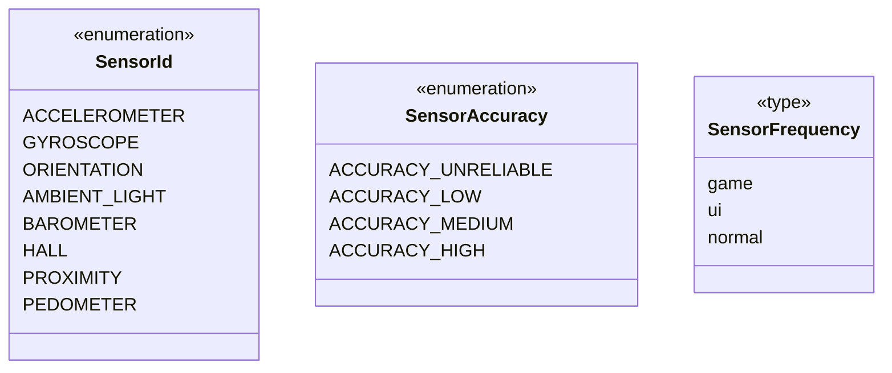
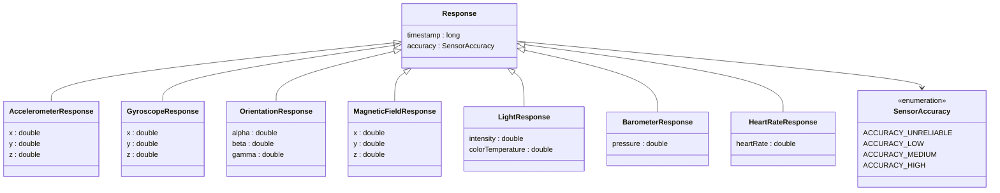
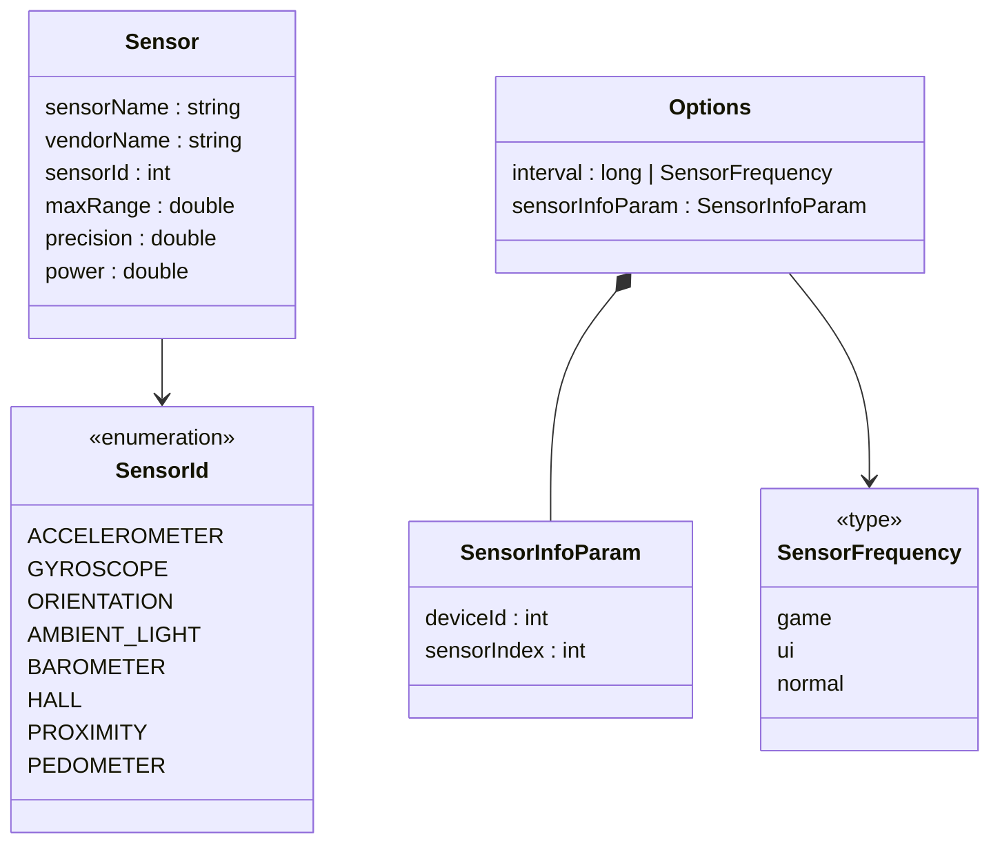
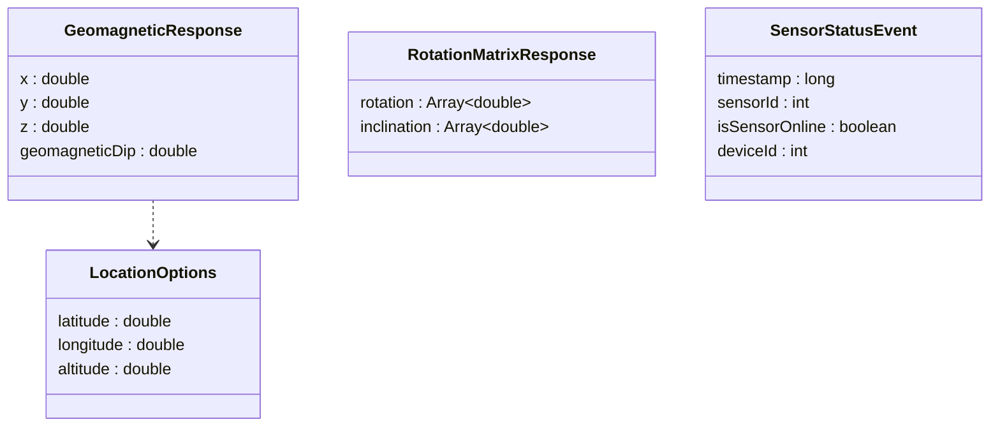

# @ohos.sensor (传感器)
<!--Kit: Sensor Service Kit-->
<!--Subsystem: Sensors-->
<!--Owner: @dilligencer-->
<!--Designer: @andeszhang-->
<!--Tester: @liuhaonan2-->
<!--Adviser: @hu-zhiqiong-->

## 模块简介

**@ohos.sensor** 模块是鸿蒙操作系统提供的传感器服务模块，属于 SensorServiceKit。该模块为开发者提供了统一的传感器数据访问能力，涵盖设备上各类物理传感器的数据订阅、查询以及传感器算法计算。

sensor 模块是传感器数据访问的统一接口，定义了设备上各类物理传感器的订阅、查询和算法计算能力。

当应用需要感知设备运动状态（如摇一摇、翻转）、检测环境条件（如自动调节屏幕亮度、测量气压估算海拔）、获取设备方向（如指南针导航）、监测健康数据（如心率计步）时，应使用本模块订阅对应传感器数据。当需要进行传感器数据相关的数学变换和计算时，应使用传感器算法接口。

> **说明**：
>
> 本模块首批接口从API version 8开始支持。后续版本的新增接口，采用上角标单独标记接口的起始版本。订阅前可使用[getSingleSensor](#sensorgetsinglesensor9)接口获取该传感器的信息，获取该传感器信息成功时可正常订阅传感器，异常情况详见[getSingleSensor](#sensorgetsinglesensor9)错误码说明，具体使用方法可参考[指南开发步骤](https://developer.huawei.com/consumer/cn/doc/harmonyos-guides/sensor-guidelines#开发步骤)；订阅传感器数据时确保on订阅和off取消订阅成对出现。

## 概述

sensor模块提供传感器数据订阅与查询能力，核心使用流程如下：

1. 使用[sensor.getSingleSensor](#sensorgetsinglesensor9)或[sensor.getSensorListSync](#sensorgetsensorlistsync12)查询传感器信息，确认设备支持目标传感器。
2. 使用sensor.on接口订阅传感器数据，持续接收数据回调。
3. 使用sensor.once接口获取一次传感器数据，适用于无需持续监听的场景。
4. 使用sensor.off接口取消订阅，确保on和off成对调用。

sensor.on与sensor.once的区别：

- sensor.on持续订阅传感器数据，通过callback反复上报，适用于需要实时监测的场景。
- sensor.once仅获取一次传感器数据，callback只触发一次后自动取消订阅，适用于单次采集的场景。

注意事项：

- 订阅前建议先使用getSingleSensor确认设备支持该传感器。
- on订阅和off取消订阅必须成对出现，避免资源泄漏。
- 对于需要权限的传感器（加速度、陀螺仪、心率、计步等），须先申请相应权限。

## UML 类图
下图展示了模块内关键 Enum/Interface 之间的关系。所有 Response 子接口继承自 Response 基接口； SensorId 和 SensorAccuracy 为独立枚举； SensorFrequency 为类型别名； 其他接口为独立定义。

### 枚举与类型定义


### 传感器数据 Response 继承体系


### 传感器属性与订阅参数


### 传感器算法与状态事件



> **注意**
>
> 1. 上图中只展示了部分关键Enum/Interface及其关系，完整的Response继承体系包含所有22种传感器数据Response接口，均继承自Response。
> 2. SensorId用于标识传感器类型，在on/once/off函数以及getSingleSensor/getSensorList中作为参数传入；SensorAccuracy用于标识数据精度等级，在Response中作为accuracy字段；SensorFrequency用于标识数据上报频率模式，在Options中作为 interval字段。所有传感器数据Response接口均继承自Response，包含timestamp和accuracy字段。

## 导入模块

```ts
import { sensor } from '@kit.SensorServiceKit';
```

## sensor.on('SensorId.ACCELEROMETER')<sup>9+</sup>

on(type: SensorId.ACCELEROMETER, callback: Callback&lt;AccelerometerResponse&gt;, options?: Options): void

订阅加速度传感器数据。加速度传感器用于测量设备在X、Y、Z三个方向上的加速度，包含重力加速度分量。适用于需要感知设备运动状态、实现屏幕旋转、游戏操控、计步等场景的场景。调用后，系统会按设定频率通过callback持续上报加速度数据。

**需要权限**：ohos.permission.ACCELEROMETER

**原子化服务API**：从API version 11开始，该接口支持在原子化服务中使用。

**系统能力**：SystemCapability.Sensors.Sensor

**参数**：

| 参数名   | 类型                                                         | 必填 | 说明                                                        |
| -------- | ------------------------------------------------------------ | ---- | ----------------------------------------------------------- |
| type     | [SensorId](#sensorid9).ACCELEROMETER                         | 是   | 传感器类型，该值固定为SensorId.ACCELEROMETER。              |
| callback | Callback&lt;[AccelerometerResponse](#accelerometerresponse)&gt; | 是   | 回调函数，异步上报的传感器数据固定为AccelerometerResponse。 |
| options  | [Options](#options)                                          | 否   | 可选参数列表，用于设置传感器上报频率，默认值为200000000ns（即200ms）。 |

**错误码**：

以下错误码的详细介绍请参见[传感器错误码](errorcode-sensor.md)和[通用错误码](../errorcode-universal.md)。错误码和错误信息会以异常的形式抛出，调用接口时需要使用try catch对可能出现的异常进行捕获操作。

| 错误码ID | 错误信息                                                     |
| -------- | ------------------------------------------------------------ |
| 201      | Permission denied.                                           |
| 401      | Parameter error.Possible causes:1. Mandatory parameters are left unspecified;2. Incorrect parameter types;3. Parameter verification failed. |
| 14500101 | Service exception.Possible causes:1. Sensor hdf service exception;2. Sensor service ipc exception;3.Sensor data channel exception. |

**示例**：

```ts
import { sensor } from '@kit.SensorServiceKit';
import { BusinessError } from '@kit.BasicServicesKit';

// 使用try catch对可能出现的异常进行捕获
try {
  // 订阅加速度传感器数据
  sensor.on(sensor.SensorId.ACCELEROMETER, (data: sensor.AccelerometerResponse) => {
    // 输出X、Y、Z坐标分量
    console.info('Succeeded in invoking on. X-coordinate component: ' + data.x);
    console.info('Succeeded in invoking on. Y-coordinate component: ' + data.y);
    console.info('Succeeded in invoking on. Z-coordinate component: ' + data.z);
  }, { interval: 100000000 });
  setTimeout(() => {
    sensor.off(sensor.SensorId.ACCELEROMETER);
  }, 500);
} catch (error) {
  let e: BusinessError = error as BusinessError;
  console.error(`Failed to invoke on. Code: ${e.code}, message: ${e.message}`);
}
```

## sensor.on('SensorId.FUSION_PRESSURE')<sup>22+</sup>

on(type: SensorId.FUSION_PRESSURE, callback: Callback&lt;FusionPressureResponse&gt;, options?: Options): void

订阅融合压力传感器数据。融合压力传感器用于获取经融合算法处理的压力数据，仅适用于智能手表设备。适用于需要获取手腕压力数据的健康监测场景。调用后，系统会按设定频率通过callback持续上报融合压力数据。

**系统能力**：SystemCapability.Sensors.Sensor

**参数**：

| 参数名   | 类型                                                         | 必填 | 说明                                                         |
| -------- | ------------------------------------------------------------ | ---- | ------------------------------------------------------------ |
| type     | [SensorId](#sensorid9).FUSION_PRESSURE            | 是   | 传感器类型，该值固定为SensorId.FUSION_PRESSURE  |
| callback | Callback&lt;[FusionPressureResponse](#fusionpressureresponse22)&gt; | 是   | 回调函数，异步上报的传感器数据固定为FusionPressureResponse。 |
| options  | [Options](#options)                                          | 否   | 可选参数列表，用于设置传感器上报频率，默认值为200000000ns（即200ms）。  |

**错误码**：

以下错误码的详细介绍请参见[传感器错误码](errorcode-sensor.md)和[通用错误码](../errorcode-universal.md)。错误码和错误信息会以异常的形式抛出，调用接口时需要使用try catch对可能出现的异常进行捕获操作。

| 错误码ID | 错误信息                                                     |
| -------- | ------------------------------------------------------------ |
| 401      | Parameter error.Possible causes:1. Mandatory parameters are left unspecified;2. Incorrect parameter types;3. Parameter verification failed. |
| 14500101 | Service exception.Possible causes:1. Sensor hdf service exception;2. Sensor service ipc exception;3.Sensor data channel exception. |

**示例**：

```ts
import { sensor } from '@kit.SensorServiceKit';
import { BusinessError } from '@kit.BasicServicesKit';

// 使用try catch对可能出现的异常进行捕获
try {
  // 订阅融合压力传感器数据
  sensor.on(sensor.SensorId.FUSION_PRESSURE, (data: sensor.FusionPressureResponse) => {
    // 输出融合压力值
    console.info('Succeeded in invoking on. fusionPressure: ' + data.fusionPressure);
  }, { interval: 100000000 });
  setTimeout(() => {
    sensor.off(sensor.SensorId.FUSION_PRESSURE);
  }, 500);
} catch (error) {
  let e: BusinessError = error as BusinessError;
  console.error(`Failed to invoke on. Code: ${e.code}, message: ${e.message}`);
}
```

## sensor.on('SensorId.ACCELEROMETER_UNCALIBRATED')<sup>9+</sup>

on(type: SensorId.ACCELEROMETER_UNCALIBRATED, callback: Callback&lt;AccelerometerUncalibratedResponse&gt;, options?: Options): void

订阅未校准加速度传感器数据。未校准加速度传感器与加速度传感器的区别在于，其上报的偏移值(biasX/biasY/biasZ)未经系统校准补偿，适用于需要获取原始加速度数据或自行实现校准算法的场景。与sensor.on('SensorId.ACCELEROMETER')相比，本接口额外提供偏移值信息，适用于需要分析设备校准偏差的场景。

**需要权限**：ohos.permission.ACCELEROMETER 

**系统能力**：SystemCapability.Sensors.Sensor 

**参数**：

| 参数名   | 类型                                                         | 必填 | 说明                                                         |
| -------- | ------------------------------------------------------------ | ---- | ------------------------------------------------------------ |
| type     | [SensorId](#sensorid9).ACCELEROMETER_UNCALIBRATED            | 是   | 传感器类型，该值固定为SensorId.ACCELEROMETER_UNCALIBRATED。  |
| callback | Callback&lt;[AccelerometerUncalibratedResponse](#accelerometeruncalibratedresponse)&gt; | 是   | 回调函数，异步上报的传感器数据固定为AccelerometerUncalibratedResponse。 |
| options  | [Options](#options)                                          | 否   | 可选参数列表，用于设置传感器上报频率，默认值为200000000ns（即200ms）。  |

**错误码**：

以下错误码的详细介绍请参见[传感器错误码](errorcode-sensor.md)和[通用错误码](../errorcode-universal.md)。错误码和错误信息会以异常的形式抛出，调用接口时需要使用try catch对可能出现的异常进行捕获操作。

| 错误码ID | 错误信息                                                     |
| -------- | ------------------------------------------------------------ |
| 201      | Permission denied.                                           |
| 401      | Parameter error.Possible causes:1. Mandatory parameters are left unspecified;2. Incorrect parameter types;3. Parameter verification failed. |
| 14500101 | Service exception.Possible causes:1. Sensor hdf service exception;2. Sensor service ipc exception;3.Sensor data channel exception. |

**示例**：

```ts
import { sensor } from '@kit.SensorServiceKit';
import { BusinessError } from '@kit.BasicServicesKit';

// 使用try catch对可能出现的异常进行捕获
try {
  // 订阅未校准加速度传感器数据
  sensor.on(sensor.SensorId.ACCELEROMETER_UNCALIBRATED, (data: sensor.AccelerometerUncalibratedResponse) => {
    // 输出X、Y、Z坐标分量和偏移值
    console.info('Succeeded in invoking on. X-coordinate component: ' + data.x);
    console.info('Succeeded in invoking on. Y-coordinate component: ' + data.y);
    console.info('Succeeded in invoking on. Z-coordinate component: ' + data.z);
    console.info('Succeeded in invoking on. X-coordinate bias: ' + data.biasX);
    console.info('Succeeded in invoking on. Y-coordinate bias: ' + data.biasY);
    console.info('Succeeded in invoking on. Z-coordinate bias: ' + data.biasZ);
  }, { interval: 100000000 });
  setTimeout(() => {
    sensor.off(sensor.SensorId.ACCELEROMETER_UNCALIBRATED);
  }, 500);
} catch (error) {
  let e: BusinessError = error as BusinessError;
  console.error(`Failed to invoke on. Code: ${e.code}, message: ${e.message}`);
}
```

## sensor.on('SensorId.AMBIENT_LIGHT')<sup>9+</sup>

on(type: SensorId.AMBIENT_LIGHT, callback: Callback&lt;LightResponse&gt;, options?: Options): void

订阅环境光传感器数据。环境光传感器用于测量周围环境的光照强度，适用于自动调节屏幕亮度、判断环境明暗等场景。调用后，系统会按设定频率通过callback持续上报环境光强度数据。

**系统能力**：SystemCapability.Sensors.Sensor

**参数**：

| 参数名   | 类型                                            | 必填 | 说明                                                        |
| -------- | ----------------------------------------------- | ---- | ----------------------------------------------------------- |
| type     | [SensorId](#sensorid9).AMBIENT_LIGHT            | 是   | 传感器类型，该值固定为SensorId.AMBIENT_LIGHT。              |
| callback | Callback&lt;[LightResponse](#lightresponse)&gt; | 是   | 回调函数，异步上报的传感器数据固定为LightResponse。         |
| options  | [Options](#options)                             | 否   | 可选参数列表，用于设置传感器上报频率，默认值为200000000ns（即200ms）。 |

**错误码**：

以下错误码的详细介绍请参见[传感器错误码](errorcode-sensor.md)和[通用错误码](../errorcode-universal.md)。错误码和错误信息会以异常的形式抛出，调用接口时需要使用try catch对可能出现的异常进行捕获操作。

| 错误码ID | 错误信息                                                     |
| -------- | ------------------------------------------------------------ |
| 401      | Parameter error.Possible causes:1. Mandatory parameters are left unspecified;2. Incorrect parameter types;3. Parameter verification failed. |
| 14500101 | Service exception.Possible causes:1. Sensor hdf service exception;2. Sensor service ipc exception;3.Sensor data channel exception. |

**示例**：

```ts
import { sensor } from '@kit.SensorServiceKit';
import { BusinessError } from '@kit.BasicServicesKit';

// 使用try catch对可能出现的异常进行捕获
try {
  // 订阅环境光传感器数据
  sensor.on(sensor.SensorId.AMBIENT_LIGHT, (data: sensor.LightResponse) => {
    // 输出环境光强度
    console.info('Succeeded in getting the ambient light intensity: ' + data.intensity);
  }, { interval: 100000000 });
  setTimeout(() => {
    sensor.off(sensor.SensorId.AMBIENT_LIGHT);
  }, 500);
} catch (error) {
  let e: BusinessError = error as BusinessError;
  console.error(`Failed to invoke on. Code: ${e.code}, message: ${e.message}`);
}
```

## sensor.on('SensorId.AMBIENT_TEMPERATURE')<sup>9+</sup>

on(type: SensorId.AMBIENT_TEMPERATURE, callback: Callback&lt;AmbientTemperatureResponse&gt;, options?: Options): void

订阅环境温度传感器数据。温度传感器用于测量设备周围的环境温度，适用于环境温度监测、温度补偿等场景。调用后，系统会按设定频率通过callback持续上报温度数据。

**系统能力**：SystemCapability.Sensors.Sensor

**参数**：

| 参数名   | 类型                                                         | 必填 | 说明                                                         |
| -------- | ------------------------------------------------------------ | ---- | ------------------------------------------------------------ |
| type     | [SensorId](#sensorid9).AMBIENT_TEMPERATURE                   | 是   | 传感器类型，该值固定为SensorId.AMBIENT_TEMPERATURE。         |
| callback | Callback&lt;[AmbientTemperatureResponse](#ambienttemperatureresponse)&gt; | 是   | 回调函数，异步上报的传感器数据固定为AmbientTemperatureResponse。 |
| options  | [Options](#options)                                          | 否   | 可选参数列表，用于设置传感器上报频率，默认值为200000000ns（即200ms）。  |

**错误码**：

以下错误码的详细介绍请参见[传感器错误码](errorcode-sensor.md)和[通用错误码](../errorcode-universal.md)。错误码和错误信息会以异常的形式抛出，调用接口时需要使用try catch对可能出现的异常进行捕获操作。

| 错误码ID | 错误信息                                                     |
| -------- | ------------------------------------------------------------ |
| 401      | Parameter error.Possible causes:1. Mandatory parameters are left unspecified;2. Incorrect parameter types;3. Parameter verification failed. |
| 14500101 | Service exception.Possible causes:1. Sensor hdf service exception;2. Sensor service ipc exception;3.Sensor data channel exception. |

**示例**：

```ts
import { sensor } from '@kit.SensorServiceKit';
import { BusinessError } from '@kit.BasicServicesKit';

// 使用try catch对可能出现的异常进行捕获
try {
  // 订阅温度传感器数据
  sensor.on(sensor.SensorId.AMBIENT_TEMPERATURE, (data: sensor.AmbientTemperatureResponse) => {
    // 输出温度值
    console.info('Succeeded in invoking on. Temperature: ' + data.temperature);
  }, { interval: 100000000 });
  setTimeout(() => {
    sensor.off(sensor.SensorId.AMBIENT_TEMPERATURE);
  }, 500);
} catch (error) {
  let e: BusinessError = error as BusinessError;
  console.error(`Failed to invoke on. Code: ${e.code}, message: ${e.message}`);
}
```

## sensor.on('SensorId.BAROMETER')<sup>9+</sup>

on(type: SensorId.BAROMETER, callback: Callback&lt;BarometerResponse&gt;, options?: Options): void

订阅气压计传感器数据。气压计传感器用于测量大气压强，适用于海拔估算、天气预报辅助等场景。调用后，系统会按设定频率通过callback持续上报气压数据。

**系统能力**：SystemCapability.Sensors.Sensor

**参数**：

| 参数名   | 类型                                                    | 必填 | 说明                                                        |
| -------- | ------------------------------------------------------- | ---- | ----------------------------------------------------------- |
| type     | [SensorId](#sensorid9).BAROMETER                        | 是   | 传感器类型，该值固定为SensorId.BAROMETER。                  |
| callback | Callback&lt;[BarometerResponse](#barometerresponse)&gt; | 是   | 回调函数，异步上报的传感器数据固定为BarometerResponse。     |
| options  | [Options](#options)                                     | 否   | 可选参数列表，用于设置传感器上报频率，默认值为200000000ns（即200ms）。 |

**错误码**：

以下错误码的详细介绍请参见[传感器错误码](errorcode-sensor.md)和[通用错误码](../errorcode-universal.md)。错误码和错误信息会以异常的形式抛出，调用接口时需要使用try catch对可能出现的异常进行捕获操作。

| 错误码ID | 错误信息                                                     |
| -------- | ------------------------------------------------------------ |
| 401      | Parameter error.Possible causes:1. Mandatory parameters are left unspecified;2. Incorrect parameter types;3. Parameter verification failed. |
| 14500101 | Service exception.Possible causes:1. Sensor hdf service exception;2. Sensor service ipc exception;3.Sensor data channel exception. |

**示例**：

```ts
import { sensor } from '@kit.SensorServiceKit';
import { BusinessError } from '@kit.BasicServicesKit';

// 使用try catch对可能出现的异常进行捕获
try {
  // 订阅气压计传感器数据
  sensor.on(sensor.SensorId.BAROMETER, (data: sensor.BarometerResponse) => {
    // 输出气压值
    console.info('Succeeded in invoking on. Atmospheric pressure: ' + data.pressure);
  }, { interval: 100000000 });
  setTimeout(() => {
    sensor.off(sensor.SensorId.BAROMETER);
  }, 500);
} catch (error) {
  let e: BusinessError = error as BusinessError;
  console.error(`Failed to invoke on. Code: ${e.code}, message: ${e.message}`);
}
```

## sensor.on('SensorId.GRAVITY')<sup>9+</sup>

on(type: SensorId.GRAVITY, callback: Callback&lt;GravityResponse&gt;, options?: Options): void

订阅重力传感器数据。重力传感器用于测量设备在X、Y、Z三个方向上受到的重力加速度分量，适用于需要分离重力分量进行运动分析的的场景，如游戏操控、运动检测。调用后，系统会按设定频率通过callback持续上报重力分量数据。

**系统能力**：SystemCapability.Sensors.Sensor

**参数**：

| 参数名   | 类型                                                | 必填 | 说明                                                        |
| -------- | --------------------------------------------------- | ---- | ----------------------------------------------------------- |
| type     | [SensorId](#sensorid9).GRAVITY                      | 是   | 传感器类型，该值固定为SensorId.GRAVITY。                    |
| callback | Callback&lt;[GravityResponse](#gravityresponse)&gt; | 是   | 回调函数，异步上报的传感器数据固定为GravityResponse。       |
| options  | [Options](#options)                                 | 否   | 可选参数列表，用于设置传感器上报频率，默认值为200000000ns（即200ms）。 |

**错误码**：

以下错误码的详细介绍请参见[传感器错误码](errorcode-sensor.md)和[通用错误码](../errorcode-universal.md)。错误码和错误信息会以异常的形式抛出，调用接口时需要使用try catch对可能出现的异常进行捕获操作。

| 错误码ID | 错误信息                                                     |
| -------- | ------------------------------------------------------------ |
| 401      | Parameter error.Possible causes:1. Mandatory parameters are left unspecified;2. Incorrect parameter types;3. Parameter verification failed. |
| 14500101 | Service exception.Possible causes:1. Sensor hdf service exception;2. Sensor service ipc exception;3.Sensor data channel exception. |

**示例**：

```ts
import { sensor } from '@kit.SensorServiceKit';
import { BusinessError } from '@kit.BasicServicesKit';

// 使用try catch对可能出现的异常进行捕获
try {
  // 订阅重力传感器数据
  sensor.on(sensor.SensorId.GRAVITY, (data: sensor.GravityResponse) => {
    // 输出X、Y、Z坐标分量
    console.info('Succeeded in invoking on. X-coordinate component: ' + data.x);
    console.info('Succeeded in invoking on. Y-coordinate component: ' + data.y);
    console.info('Succeeded in invoking on. Z-coordinate component: ' + data.z);
  }, { interval: 100000000 });
  setTimeout(() => {
    sensor.off(sensor.SensorId.GRAVITY);
  }, 500);
} catch (error) {
  let e: BusinessError = error as BusinessError;
  console.error(`Failed to invoke on. Code: ${e.code}, message: ${e.message}`);
}
```

## sensor.on('SensorId.GYROSCOPE')<sup>9+</sup>

on(type: SensorId.GYROSCOPE, callback: Callback&lt;GyroscopeResponse&gt;, options?: Options): void

订阅校准的陀螺仪传感器数据。陀螺仪传感器用于测量设备绕X、Y、Z轴的旋转角速度，适用于设备旋转检测、姿态跟踪、游戏操控等场景。调用后，系统会按设定频率通过callback持续上报角速度数据。

**需要权限**：ohos.permission.GYROSCOPE

**原子化服务API**：从API version 11开始，该接口支持在原子化服务中使用。

**系统能力**：SystemCapability.Sensors.Sensor

**参数**：

| 参数名   | 类型                                                    | 必填 | 说明                                                        |
| -------- | ------------------------------------------------------- | ---- | ----------------------------------------------------------- |
| type     | [SensorId](#sensorid9).GYROSCOPE                        | 是   | 传感器类型，该值固定为SensorId.GYROSCOPE。                  |
| callback | Callback&lt;[GyroscopeResponse](#gyroscoperesponse)&gt; | 是   | 回调函数，异步上报的传感器数据固定为GyroscopeResponse。     |
| options  | [Options](#options)                                     | 否   | 可选参数列表，用于设置传感器上报频率，默认值为200000000ns（即200ms）。 |

**错误码**：

以下错误码的详细介绍请参见[传感器错误码](errorcode-sensor.md)和[通用错误码](../errorcode-universal.md)。错误码和错误信息会以异常的形式抛出，调用接口时需要使用try catch对可能出现的异常进行捕获操作。

| 错误码ID | 错误信息                                                     |
| -------- | ------------------------------------------------------------ |
| 201      | Permission denied.                                           |
| 401      | Parameter error.Possible causes:1. Mandatory parameters are left unspecified;2. Incorrect parameter types;3. Parameter verification failed. |
| 14500101 | Service exception.Possible causes:1. Sensor hdf service exception;2. Sensor service ipc exception;3.Sensor data channel exception. |

**示例**：

```ts
import { sensor } from '@kit.SensorServiceKit';
import { BusinessError } from '@kit.BasicServicesKit';

// 使用try catch对可能出现的异常进行捕获
try {
  // 订阅校准的陀螺仪传感器数据
  sensor.on(sensor.SensorId.GYROSCOPE, (data: sensor.GyroscopeResponse) => {
    // 输出X、Y、Z坐标分量
    console.info('Succeeded in invoking on. X-coordinate component: ' + data.x);
    console.info('Succeeded in invoking on. Y-coordinate component: ' + data.y);
    console.info('Succeeded in invoking on. Z-coordinate component: ' + data.z);
  }, { interval: 100000000 });
  setTimeout(() => {
    sensor.off(sensor.SensorId.GYROSCOPE);
  }, 500);
} catch (error) {
  let e: BusinessError = error as BusinessError;
  console.error(`Failed to invoke on. Code: ${e.code}, message: ${e.message}`);
}
```

## sensor.on('SensorId.GYROSCOPE_UNCALIBRATED')<sup>9+</sup>

on(type: SensorId.GYROSCOPE_UNCALIBRATED, callback: Callback&lt;GyroscopeUncalibratedResponse&gt;, options?: Options): void

订阅未校准陀螺仪传感器数据。未校准陀螺仪传感器与陀螺仪传感器的区别在于，其上报的偏移值(biasX/biasY/biasZ)未经系统校准补偿，适用于需要获取原始陀螺仪数据或自行实现校准算法的场景。与sensor.on('SensorId.GYROSCOPE')相比，本接口额外提供偏移值信息，适用于需要分析设备陀螺仪校准偏差的场景。

**需要权限**：ohos.permission.GYROSCOPE 

**系统能力**：SystemCapability.Sensors.Sensor  

**参数**：

| 参数名   | 类型                                                         | 必填 | 说明                                                         |
| -------- | ------------------------------------------------------------ | ---- | ------------------------------------------------------------ |
| type     | [SensorId](#sensorid9).GYROSCOPE_UNCALIBRATED                | 是   | 传感器类型，该值固定为SensorId.GYROSCOPE_UNCALIBRATED。      |
| callback | Callback&lt;[GyroscopeUncalibratedResponse](#gyroscopeuncalibratedresponse)&gt; | 是   | 回调函数，异步上报的传感器数据固定为GyroscopeUncalibratedResponse。 |
| options  | [Options](#options)                                          | 否   | 可选参数列表，用于设置传感器上报频率，默认值为200000000ns（即200ms）。  |

**错误码**：

以下错误码的详细介绍请参见[传感器错误码](errorcode-sensor.md)和[通用错误码](../errorcode-universal.md)。错误码和错误信息会以异常的形式抛出，调用接口时需要使用try catch对可能出现的异常进行捕获操作。

| 错误码ID | 错误信息                                                     |
| -------- | ------------------------------------------------------------ |
| 201      | Permission denied.                                           |
| 401      | Parameter error.Possible causes:1. Mandatory parameters are left unspecified;2. Incorrect parameter types;3. Parameter verification failed. |
| 14500101 | Service exception.Possible causes:1. Sensor hdf service exception;2. Sensor service ipc exception;3.Sensor data channel exception. |

**示例**：

```ts
import { sensor } from '@kit.SensorServiceKit';
import { BusinessError } from '@kit.BasicServicesKit';

// 使用try catch对可能出现的异常进行捕获
try {
  // 订阅未校准陀螺仪传感器数据
  sensor.on(sensor.SensorId.GYROSCOPE_UNCALIBRATED, (data: sensor.GyroscopeUncalibratedResponse) => {
    // 输出X、Y、Z坐标分量和偏移值
    console.info('Succeeded in invoking on. X-coordinate component: ' + data.x);
    console.info('Succeeded in invoking on. Y-coordinate component: ' + data.y);
    console.info('Succeeded in invoking on. Z-coordinate component: ' + data.z);
    console.info('Succeeded in invoking on. X-coordinate bias: ' + data.biasX);
    console.info('Succeeded in invoking on. Y-coordinate bias: ' + data.biasY);
    console.info('Succeeded in invoking on. Z-coordinate bias: ' + data.biasZ);
  }, { interval: 100000000 });
  setTimeout(() => {
    sensor.off(sensor.SensorId.GYROSCOPE_UNCALIBRATED);
  }, 500);
} catch (error) {
  let e: BusinessError = error as BusinessError;
  console.error(`Failed to invoke on. Code: ${e.code}, message: ${e.message}`);
}

```

## sensor.on('SensorId.HALL')<sup>9+</sup>

on(type: SensorId.HALL, callback: Callback&lt;HallResponse&gt;, options?: Options): void

订阅霍尔传感器数据。霍尔传感器用于检测磁场变化，常用于检测翻盖手机或皮套的开合状态。当霍尔事件被触发得较为频繁时，可通过options参数限定事件上报频率。调用后，系统会通过callback持续上报霍尔状态数据。

**系统能力**：SystemCapability.Sensors.Sensor

**参数**：

| 参数名   | 类型                                          | 必填 | 说明                                                         |
| -------- | --------------------------------------------- | ---- | ------------------------------------------------------------ |
| type     | [SensorId](#sensorid9).HALL                   | 是   | 传感器类型，该值固定为SensorId.HALL。                        |
| callback | Callback&lt;[HallResponse](#hallresponse)&gt; | 是   | 回调函数，异步上报的传感器数据固定为HallResponse。           |
| options  | [Options](#options)                           | 否   | 可选参数列表，当霍尔事件被触发的很频繁时，用于设置传感器上报频率，默认值为200000000ns。 |

**错误码**：

以下错误码的详细介绍请参见[传感器错误码](errorcode-sensor.md)和[通用错误码](../errorcode-universal.md)。错误码和错误信息会以异常的形式抛出，调用接口时需要使用try catch对可能出现的异常进行捕获操作。

| 错误码ID | 错误信息                                                     |
| -------- | ------------------------------------------------------------ |
| 401      | Parameter error.Possible causes:1. Mandatory parameters are left unspecified;2. Incorrect parameter types;3. Parameter verification failed. |
| 14500101 | Service exception.Possible causes:1. Sensor hdf service exception;2. Sensor service ipc exception;3.Sensor data channel exception. |

**示例**：

```ts
import { sensor } from '@kit.SensorServiceKit';
import { BusinessError } from '@kit.BasicServicesKit';

// 使用try catch对可能出现的异常进行捕获
try {
  // 订阅霍尔传感器数据
  sensor.on(sensor.SensorId.HALL, (data: sensor.HallResponse) => {
    // 输出霍尔状态
    console.info('Succeeded in invoking on. Hall status: ' + data.status);
  }, { interval: 100000000 });
  setTimeout(() => {
    sensor.off(sensor.SensorId.HALL);
  }, 500);
} catch (error) {
  let e: BusinessError = error as BusinessError;
  console.error(`Failed to invoke on. Code: ${e.code}, message: ${e.message}`);
}

```

## sensor.on('SensorId.HEART_RATE')<sup>9+</sup>

on(type: SensorId.HEART_RATE, callback: Callback&lt;HeartRateResponse&gt;, options?: Options): void

订阅心率传感器数据。心率传感器用于测量用户的心率值，适用于健康监测、运动辅助等场景。调用后，系统会按设定频率通过callback持续上报心率数据。

**需要权限**：ohos.permission.READ_HEALTH_DATA 

**系统能力**：SystemCapability.Sensors.Sensor

**参数**：

| 参数名   | 类型                                                    | 必填 | 说明                                                        |
| -------- | ------------------------------------------------------- | ---- | ----------------------------------------------------------- |
| type     | [SensorId](#sensorid9).HEART_RATE                       | 是   | 传感器类型，该值固定为SensorId.HEART_RATE。                 |
| callback | Callback&lt;[HeartRateResponse](#heartrateresponse)&gt; | 是   | 回调函数，异步上报的传感器数据固定为HeartRateResponse。     |
| options  | [Options](#options)                                     | 否   | 可选参数列表，用于设置传感器上报频率，默认值为200000000ns（即200ms）。 |

**错误码**：

以下错误码的详细介绍请参见[传感器错误码](errorcode-sensor.md)和[通用错误码](../errorcode-universal.md)。错误码和错误信息会以异常的形式抛出，调用接口时需要使用try catch对可能出现的异常进行捕获操作。

| 错误码ID | 错误信息                                                     |
| -------- | ------------------------------------------------------------ |
| 201      | Permission denied.                                           |
| 401      | Parameter error.Possible causes:1. Mandatory parameters are left unspecified;2. Incorrect parameter types;3. Parameter verification failed. |
| 14500101 | Service exception.Possible causes:1. Sensor hdf service exception;2. Sensor service ipc exception;3.Sensor data channel exception. |

**示例**：

```ts
import { sensor } from '@kit.SensorServiceKit';
import { BusinessError } from '@kit.BasicServicesKit';

// 使用try catch对可能出现的异常进行捕获
try {
  // 订阅心率传感器数据
  sensor.on(sensor.SensorId.HEART_RATE, (data: sensor.HeartRateResponse) => {
    // 输出心率值
    console.info('Succeeded in invoking on. Heart rate: ' + data.heartRate);
  }, { interval: 100000000 });
  setTimeout(() => {
    sensor.off(sensor.SensorId.HEART_RATE);
  }, 500);
} catch (error) {
  let e: BusinessError = error as BusinessError;
  console.error(`Failed to invoke on. Code: ${e.code}, message: ${e.message}`);
}
```

## sensor.on('SensorId.HUMIDITY')<sup>9+</sup>

on(type: SensorId.HUMIDITY, callback: Callback&lt;HumidityResponse&gt;, options?: Options): void

订阅湿度传感器数据。湿度传感器用于测量周围环境的相对湿度，适用于环境湿度监测、智能家居联动等场景。调用后，系统会按设定频率通过callback持续上报湿度数据。

**系统能力**：SystemCapability.Sensors.Sensor

**参数**：

| 参数名   | 类型                                                  | 必填 | 说明                                                        |
| -------- | ----------------------------------------------------- | ---- | ----------------------------------------------------------- |
| type     | [SensorId](#sensorid9).HUMIDITY                       | 是   | 传感器类型，该值固定为SensorId.HUMIDITY。                   |
| callback | Callback&lt;[HumidityResponse](#humidityresponse)&gt; | 是   | 回调函数，异步上报的传感器数据固定为HumidityResponse。      |
| options  | [Options](#options)                                   | 否   | 可选参数列表，用于设置传感器上报频率，默认值为200000000ns（即200ms）。 |

**错误码**：

以下错误码的详细介绍请参见[传感器错误码](errorcode-sensor.md)和[通用错误码](../errorcode-universal.md)。错误码和错误信息会以异常的形式抛出，调用接口时需要使用try catch对可能出现的异常进行捕获操作。

| 错误码ID | 错误信息                                                     |
| -------- | ------------------------------------------------------------ |
| 401      | Parameter error.Possible causes:1. Mandatory parameters are left unspecified;2. Incorrect parameter types;3. Parameter verification failed. |
| 14500101 | Service exception.Possible causes:1. Sensor hdf service exception;2. Sensor service ipc exception;3.Sensor data channel exception. |

**示例**：

```ts
import { sensor } from '@kit.SensorServiceKit';
import { BusinessError } from '@kit.BasicServicesKit';

// 使用try catch对可能出现的异常进行捕获
try {
  // 订阅湿度传感器数据
  sensor.on(sensor.SensorId.HUMIDITY, (data: sensor.HumidityResponse) => {
    // 输出湿度值
    console.info('Succeeded in invoking on. Humidity: ' + data.humidity);
  }, { interval: 100000000 });
  setTimeout(() => {
    sensor.off(sensor.SensorId.HUMIDITY);
  }, 500);
} catch (error) {
  let e: BusinessError = error as BusinessError;
  console.error(`Failed to invoke on. Code: ${e.code}, message: ${e.message}`);
}
```

## sensor.on('SensorId.LINEAR_ACCELEROMETER')<sup>9+</sup>

on(type: SensorId.LINEAR_ACCELEROMETER, callback: Callback&lt;LinearAccelerometerResponse&gt;, options?: Options): void

订阅线性加速度传感器数据。线性加速度传感器用于测量设备在X、Y、Z三个方向上的加速度（不含重力加速度分量），适用于需要感知设备纯粹运动加速度的场景，如运动追踪、碰撞检测。与sensor.on('SensorId.ACCELEROMETER')相比，本接口已去除重力分量，适用于仅需设备运动加速度的场景。

**需要权限**：ohos.permission.ACCELEROMETER 

**系统能力**：SystemCapability.Sensors.Sensor 

**参数**：

| 参数名   | 类型                                                         | 必填 | 说明                                                         |
| -------- | ------------------------------------------------------------ | ---- | ------------------------------------------------------------ |
| type     | [SensorId](#sensorid9).LINEAR_ACCELEROMETER                  | 是   | 传感器类型，该值固定为SensorId.LINEAR_ACCELEROMETER。        |
| callback | Callback&lt;[LinearAccelerometerResponse](#linearaccelerometerresponse)&gt; | 是   | 回调函数，异步上报的传感器数据固定为LinearAccelerometerResponse。 |
| options  | [Options](#options)                                          | 否   | 可选参数列表，用于设置传感器上报频率，默认值为200000000ns（即200ms）。  |

**错误码**：

以下错误码的详细介绍请参见[传感器错误码](errorcode-sensor.md)和[通用错误码](../errorcode-universal.md)。错误码和错误信息会以异常的形式抛出，调用接口时需要使用try catch对可能出现的异常进行捕获操作。

| 错误码ID | 错误信息                                                     |
| -------- | ------------------------------------------------------------ |
| 201      | Permission denied.                                           |
| 401      | Parameter error.Possible causes:1. Mandatory parameters are left unspecified;2. Incorrect parameter types;3. Parameter verification failed. |
| 14500101 | Service exception.Possible causes:1. Sensor hdf service exception;2. Sensor service ipc exception;3.Sensor data channel exception. |

**示例**：

```ts
import { sensor } from '@kit.SensorServiceKit';
import { BusinessError } from '@kit.BasicServicesKit';

// 使用try catch对可能出现的异常进行捕获
try {
  // 订阅线性加速度传感器数据
  sensor.on(sensor.SensorId.LINEAR_ACCELEROMETER, (data: sensor.LinearAccelerometerResponse) => {
    // 输出X、Y、Z坐标分量
    console.info('Succeeded in invoking on. X-coordinate component: ' + data.x);
    console.info('Succeeded in invoking on. Y-coordinate component: ' + data.y);
    console.info('Succeeded in invoking on. Z-coordinate component: ' + data.z);
  }, { interval: 100000000 });
  setTimeout(() => {
    sensor.off(sensor.SensorId.LINEAR_ACCELEROMETER);
  }, 500);
} catch (error) {
  let e: BusinessError = error as BusinessError;
  console.error(`Failed to invoke on. Code: ${e.code}, message: ${e.message}`);
}
```

## sensor.on('SensorId.MAGNETIC_FIELD')<sup>9+</sup>

on(type: SensorId.MAGNETIC_FIELD, callback: Callback&lt;MagneticFieldResponse&gt;, options?: Options): void

订阅地磁传感器数据。地磁传感器用于测量设备周围的磁场强度在X、Y、Z三个方向上的分量，适用于指南针、方向检测、金属检测等场景。调用后，系统会按设定频率通过callback持续上报磁场分量数据。

**系统能力**：SystemCapability.Sensors.Sensor 

**参数**：

| 参数名   | 类型                                                         | 必填 | 说明                                                        |
| -------- | ------------------------------------------------------------ | ---- | ----------------------------------------------------------- |
| type     | [SensorId](#sensorid9).MAGNETIC_FIELD                        | 是   | 传感器类型，该值固定为SensorId.MAGNETIC_FIELD。             |
| callback | Callback&lt;[MagneticFieldResponse](#magneticfieldresponse)&gt; | 是   | 回调函数，异步上报的传感器数据固定为MagneticFieldResponse。 |
| options  | [Options](#options)                                          | 否   | 可选参数列表，用于设置传感器上报频率，默认值为200000000ns（即200ms）。 |

**错误码**：

以下错误码的详细介绍请参见[传感器错误码](errorcode-sensor.md)和[通用错误码](../errorcode-universal.md)。错误码和错误信息会以异常的形式抛出，调用接口时需要使用try catch对可能出现的异常进行捕获操作。

| 错误码ID | 错误信息                                                     |
| -------- | ------------------------------------------------------------ |
| 401      | Parameter error.Possible causes:1. Mandatory parameters are left unspecified;2. Incorrect parameter types;3. Parameter verification failed. |
| 14500101 | Service exception.Possible causes:1. Sensor hdf service exception;2. Sensor service ipc exception;3.Sensor data channel exception. |

**示例**：

```ts
import { sensor } from '@kit.SensorServiceKit';
import { BusinessError } from '@kit.BasicServicesKit';

// 使用try catch对可能出现的异常进行捕获
try {
  // 订阅地磁传感器数据
  sensor.on(sensor.SensorId.MAGNETIC_FIELD, (data: sensor.MagneticFieldResponse) => {
    // 输出X、Y、Z坐标分量
    console.info('Succeeded in invoking on. X-coordinate component: ' + data.x);
    console.info('Succeeded in invoking on. Y-coordinate component: ' + data.y);
    console.info('Succeeded in invoking on. Z-coordinate component: ' + data.z);
  }, { interval: 100000000 });
  setTimeout(() => {
    sensor.off(sensor.SensorId.MAGNETIC_FIELD);
  }, 500);
} catch (error) {
  let e: BusinessError = error as BusinessError;
  console.error(`Failed to invoke on. Code: ${e.code}, message: ${e.message}`);
}
```

## sensor.on('SensorId.MAGNETIC_FIELD_UNCALIBRATED')<sup>9+</sup>

on(type: SensorId.MAGNETIC_FIELD_UNCALIBRATED, callback: Callback&lt;MagneticFieldUncalibratedResponse&gt;, options?: Options): void

订阅未校准地磁传感器数据。未校准地磁传感器与地磁传感器的区别在于，其上报的偏移值(biasX/biasY/biasZ)未经系统校准补偿，适用于需要获取原始磁场数据或自行实现校准算法的场景。与sensor.on('SensorId.MAGNETIC_FIELD')相比，本接口额外提供偏移值信息，适用于需要分析设备地磁校准偏差的场景。

**系统能力**：SystemCapability.Sensors.Sensor 

**参数**：

| 参数名   | 类型                                                         | 必填 | 说明                                                         |
| -------- | ------------------------------------------------------------ | ---- | ------------------------------------------------------------ |
| type     | [SensorId](#sensorid9).MAGNETIC_FIELD_UNCALIBRATED           | 是   | 传感器类型，该值固定为SensorId.MAGNETIC_FIELD_UNCALIBRATED。 |
| callback | Callback&lt;[MagneticFieldUncalibratedResponse](#magneticfielduncalibratedresponse)&gt; | 是   | 回调函数，异步上报的传感器数据固定为MagneticFieldUncalibratedResponse。 |
| options  | [Options](#options)                                          | 否   | 可选参数列表，用于设置传感器上报频率，默认值为200000000ns（即200ms）。  |

**错误码**：

以下错误码的详细介绍请参见[传感器错误码](errorcode-sensor.md)和[通用错误码](../errorcode-universal.md)。错误码和错误信息会以异常的形式抛出，调用接口时需要使用try catch对可能出现的异常进行捕获操作。

| 错误码ID | 错误信息                                                     |
| -------- | ------------------------------------------------------------ |
| 401      | Parameter error.Possible causes:1. Mandatory parameters are left unspecified;2. Incorrect parameter types;3. Parameter verification failed. |
| 14500101 | Service exception.Possible causes:1. Sensor hdf service exception;2. Sensor service ipc exception;3.Sensor data channel exception. |

**示例**：

```ts
import { sensor } from '@kit.SensorServiceKit';
import { BusinessError } from '@kit.BasicServicesKit';

// 使用try catch对可能出现的异常进行捕获
try {
  // 订阅未校准地磁传感器数据
  sensor.on(sensor.SensorId.MAGNETIC_FIELD_UNCALIBRATED, (data: sensor.MagneticFieldUncalibratedResponse) => {
    // 输出X、Y、Z坐标分量和偏移值
    console.info('Succeeded in invoking on. X-coordinate component: ' + data.x);
    console.info('Succeeded in invoking on. Y-coordinate component: ' + data.y);
    console.info('Succeeded in invoking on. Z-coordinate component: ' + data.z);
    console.info('Succeeded in invoking on. X-coordinate bias: ' + data.biasX);
    console.info('Succeeded in invoking on. Y-coordinate bias: ' + data.biasY);
    console.info('Succeeded in invoking on. Z-coordinate bias: ' + data.biasZ);
  }, { interval: 100000000 });
  setTimeout(() => {
    sensor.off(sensor.SensorId.MAGNETIC_FIELD_UNCALIBRATED);
  }, 500);
} catch (error) {
  let e: BusinessError = error as BusinessError;
  console.error(`Failed to invoke on. Code: ${e.code}, message: ${e.message}`);
}
```

## sensor.on('SensorId.ORIENTATION')<sup>9+</sup>

on(type: SensorId.ORIENTATION, callback: Callback&lt;OrientationResponse&gt;, options?: Options): void

订阅方向传感器数据。方向传感器用于测量设备绕Z轴旋转的角度(alpha)、绕X轴旋转的角度(beta)和绕Y轴旋转的角度(gamma)，适用于屏幕旋转、指南针、姿态感知等场景。调用后，系统会按设定频率通过callback持续上报方向数据。调用本接口的应用或服务可以通过提示用户使用8字校准法来提高应用获取的方向传感器的精度，此传感器理论误差正负5度，具体的精度根据不同的驱动及算法实现可能存在差异。

> **说明：**
> 
> 调用本接口的应用或服务可以通过提示用户使用8字校准法来提高应用获取的方向传感器的精度，此传感器理论误差正负5度，具体的精度根据不同的驱动及算法实现可能存在差异。

**原子化服务API**：从API version 11开始，该接口支持在原子化服务中使用。

**系统能力**：SystemCapability.Sensors.Sensor 

**参数**：

| 参数名   | 类型                                                        | 必填 | 说明                                                        |
| -------- | ----------------------------------------------------------- | ---- | ----------------------------------------------------------- |
| type     | [SensorId](#sensorid9).ORIENTATION                          | 是   | 传感器类型，该值固定为SensorId.ORIENTATION。                |
| callback | Callback&lt;[OrientationResponse](#orientationresponse)&gt; | 是   | 回调函数，异步上报的传感器数据固定为OrientationResponse。   |
| options  | [Options](#options)                                         | 否   | 可选参数列表，用于设置传感器上报频率，默认值为200000000ns（即200ms）。 |

**错误码**：

以下错误码的详细介绍请参见[传感器错误码](errorcode-sensor.md)和[通用错误码](../errorcode-universal.md)。错误码和错误信息会以异常的形式抛出，调用接口时需要使用try catch对可能出现的异常进行捕获操作。

| 错误码ID | 错误信息                                                     |
| -------- | ------------------------------------------------------------ |
| 401      | Parameter error.Possible causes:1. Mandatory parameters are left unspecified;2. Incorrect parameter types;3. Parameter verification failed. |
| 14500101 | Service exception.Possible causes:1. Sensor hdf service exception;2. Sensor service ipc exception;3.Sensor data channel exception. |

**示例**：

```ts
import { sensor } from '@kit.SensorServiceKit';
import { BusinessError } from '@kit.BasicServicesKit';

// 使用try catch对可能出现的异常进行捕获
try {
  // 订阅方向传感器数据
  sensor.on(sensor.SensorId.ORIENTATION, (data: sensor.OrientationResponse) => {
    // 输出设备绕Z、X、Y轴旋转的角度
    console.info('Succeeded in the device rotating at an angle around the Z axis: ' + data.alpha);
    console.info('Succeeded in the device rotating at an angle around the X axis: ' + data.beta);
    console.info('Succeeded in the device rotating at an angle around the Y axis: ' + data.gamma);
  }, { interval: 100000000 });
  setTimeout(() => {
    sensor.off(sensor.SensorId.ORIENTATION);
  }, 500);
} catch (error) {
  let e: BusinessError = error as BusinessError;
  console.error(`Failed to invoke on. Code: ${e.code}, message: ${e.message}`);
}
```

## sensor.on('SensorId.PEDOMETER')<sup>9+</sup>

on(type: SensorId.PEDOMETER, callback: Callback&lt;PedometerResponse&gt;, options?: Options): void

订阅计步器传感器数据。计步器传感器用于统计用户的步行步数，适用于运动追踪、健康管理等场景。计步传感器数据上报有一定延迟，延迟时间由具体的实现产品决定。调用后，系统会按设定频率通过callback持续上报步数数据。

**需要权限**：ohos.permission.ACTIVITY_MOTION 

**系统能力**：SystemCapability.Sensors.Sensor 

**参数**：

| 参数名   | 类型                                                    | 必填 | 说明                                                        |
| -------- | ------------------------------------------------------- | ---- | ----------------------------------------------------------- |
| type     | [SensorId](#sensorid9).PEDOMETER                        | 是   | 传感器类型，该值固定为SensorId.PEDOMETER。                  |
| callback | Callback&lt;[PedometerResponse](#pedometerresponse)&gt; | 是   | 回调函数，异步上报的传感器数据固定为PedometerResponse。     |
| options  | [Options](#options)                                     | 否   | 可选参数列表，用于设置传感器上报频率，默认值为200000000ns（即200ms）。 |

**错误码**：

以下错误码的详细介绍请参见[传感器错误码](errorcode-sensor.md)和[通用错误码](../errorcode-universal.md)。错误码和错误信息会以异常的形式抛出，调用接口时需要使用try catch对可能出现的异常进行捕获操作。

| 错误码ID | 错误信息                                                     |
| -------- | ------------------------------------------------------------ |
| 201      | Permission denied.                                           |
| 401      | Parameter error.Possible causes:1. Mandatory parameters are left unspecified;2. Incorrect parameter types;3. Parameter verification failed. |
| 14500101 | Service exception.Possible causes:1. Sensor hdf service exception;2. Sensor service ipc exception;3.Sensor data channel exception. |

**示例**：

```ts
import { sensor } from '@kit.SensorServiceKit';
import { BusinessError } from '@kit.BasicServicesKit';

// 使用try catch对可能出现的异常进行捕获
try {
  // 订阅计步器传感器数据
  sensor.on(sensor.SensorId.PEDOMETER, (data: sensor.PedometerResponse) => {
    // 输出步数
    console.info('Succeeded in invoking on. Step count: ' + data.steps);
  }, { interval: 100000000 });
  setTimeout(() => {
    sensor.off(sensor.SensorId.PEDOMETER);
  }, 500);
} catch (error) {
  let e: BusinessError = error as BusinessError;
  console.error(`Failed to invoke on. Code: ${e.code}, message: ${e.message}`);
}
```

## sensor.on('SensorId.PEDOMETER_DETECTION')<sup>9+</sup>

on(type: SensorId.PEDOMETER_DETECTION, callback: Callback&lt;PedometerDetectionResponse&gt;, options?: Options): void

订阅计步检测器传感器数据。计步检测器传感器用于检测用户是否发生了计步事件（如迈步动作），适用于需要实时检测步行状态的场景。与sensor.on('SensorId.PEDOMETER')相比，本接口上报的是计步事件标量而非累计步数，适用于需要检测单步事件的场景。

**需要权限**：ohos.permission.ACTIVITY_MOTION 

**系统能力**：SystemCapability.Sensors.Sensor 

**参数**：

| 参数名   | 类型                                                         | 必填 | 说明                                                         |
| -------- | ------------------------------------------------------------ | ---- | ------------------------------------------------------------ |
| type     | [SensorId](#sensorid9).PEDOMETER_DETECTION                   | 是   | 传感器类型，该值固定为SensorId.PEDOMETER_DETECTION。         |
| callback | Callback&lt;[PedometerDetectionResponse](#pedometerdetectionresponse)&gt; | 是   | 回调函数，异步上报的传感器数据固定为PedometerDetectionResponse。 |
| options  | [Options](#options)                                          | 否   | 可选参数列表，用于设置传感器上报频率，默认值为200000000ns（即200ms）。  |

**错误码**：

以下错误码的详细介绍请参见[传感器错误码](errorcode-sensor.md)和[通用错误码](../errorcode-universal.md)。错误码和错误信息会以异常的形式抛出，调用接口时需要使用try catch对可能出现的异常进行捕获操作。

| 错误码ID | 错误信息                                                     |
| -------- | ------------------------------------------------------------ |
| 201      | Permission denied.                                           |
| 401      | Parameter error.Possible causes:1. Mandatory parameters are left unspecified;2. Incorrect parameter types;3. Parameter verification failed. |
| 14500101 | Service exception.Possible causes:1. Sensor hdf service exception;2. Sensor service ipc exception;3.Sensor data channel exception. |

**示例**：

```ts
import { sensor } from '@kit.SensorServiceKit';
import { BusinessError } from '@kit.BasicServicesKit';

// 使用try catch对可能出现的异常进行捕获
try {
  // 订阅计步检测器传感器数据
  sensor.on(sensor.SensorId.PEDOMETER_DETECTION, (data: sensor.PedometerDetectionResponse) => {
    // 输出计步标量值
    console.info('Succeeded in invoking on. Pedometer scalar: ' + data.scalar);
  }, { interval: 100000000 });
  setTimeout(() => {
    sensor.off(sensor.SensorId.PEDOMETER_DETECTION);
  }, 500);
} catch (error) {
  let e: BusinessError = error as BusinessError;
  console.error(`Failed to invoke on. Code: ${e.code}, message: ${e.message}`);
}
```

## sensor.on('SensorId.PROXIMITY')<sup>9+</sup>

on(type: SensorId.PROXIMITY, callback: Callback&lt;ProximityResponse&gt;, options?: Options): void

订阅接近光传感器数据。接近光传感器用于检测物体与设备的距离状态，常用于通话时自动关闭屏幕以防止误触。当接近光事件被触发得较为频繁时，可通过options参数限定事件上报频率。调用后，系统会通过callback持续上报接近状态数据。

**系统能力**：SystemCapability.Sensors.Sensor

**参数**：

| 参数名   | 类型                                                    | 必填 | 说明                                                         |
| -------- | ------------------------------------------------------- | ---- | ------------------------------------------------------------ |
| type     | [SensorId](#sensorid9).PROXIMITY                        | 是   | 传感器类型，该值固定为SensorId.PROXIMITY。                   |
| callback | Callback&lt;[ProximityResponse](#proximityresponse)&gt; | 是   | 回调函数，异步上报的传感器数据固定为ProximityResponse。      |
| options  | [Options](#options)                                     | 否   | 可选参数列表，用于设置传感器上报频率，默认值为200000000ns。当接近光事件被触发的很频繁时，该参数用于限定事件上报的频率。 |

**错误码**：

以下错误码的详细介绍请参见[传感器错误码](errorcode-sensor.md)和[通用错误码](../errorcode-universal.md)。错误码和错误信息会以异常的形式抛出，调用接口时需要使用try catch对可能出现的异常进行捕获操作。

| 错误码ID | 错误信息                                                     |
| -------- | ------------------------------------------------------------ |
| 401      | Parameter error.Possible causes:1. Mandatory parameters are left unspecified;2. Incorrect parameter types;3.Parameter verification failed. |
| 14500101 | Service exception.Possible causes:1. Sensor hdf service exception;2. Sensor service ipc exception;3.Sensor data channel exception. |

**示例**：

```ts
import { sensor } from '@kit.SensorServiceKit';
import { BusinessError } from '@kit.BasicServicesKit';

// 使用try catch对可能出现的异常进行捕获
try {
  // 订阅接近光传感器数据
  sensor.on(sensor.SensorId.PROXIMITY, (data: sensor.ProximityResponse) => {
    // 输出距离值
    console.info('Succeeded in invoking on. Distance: ' + data.distance);
  }, { interval: 100000000 });
  setTimeout(() => {
    sensor.off(sensor.SensorId.PROXIMITY);
  }, 500);
} catch (error) {
  let e: BusinessError = error as BusinessError;
  console.error(`Failed to invoke on. Code: ${e.code}, message: ${e.message}`);
}
```

## sensor.on('SensorId.ROTATION_VECTOR')<sup>9+</sup>

on(type: SensorId.ROTATION_VECTOR, callback: Callback&lt;RotationVectorResponse&gt;, options?: Options): void

订阅旋转矢量传感器数据。旋转矢量传感器用于表示设备的姿态旋转，数据由X、Y、Z分量和标量W组成，可用于设备姿态估计、AR/VR场景等。调用后，系统会按设定频率通过callback持续上报旋转矢量数据。

**系统能力**：SystemCapability.Sensors.Sensor 

**参数**：

| 参数名   | 类型                                                         | 必填 | 说明                                                         |
| -------- | ------------------------------------------------------------ | ---- | ------------------------------------------------------------ |
| type     | [SensorId](#sensorid9).ROTATION_VECTOR                       | 是   | 传感器类型，该值固定为SensorId.ROTATION_VECTOR。             |
| callback | Callback&lt;[RotationVectorResponse](#rotationvectorresponse)&gt; | 是   | 回调函数，异步上报的传感器数据固定为RotationVectorResponse。 |
| options  | [Options](#options)                                          | 否   | 可选参数列表，用于设置传感器上报频率，默认值为200000000ns（即200ms）。  |

**错误码**：

以下错误码的详细介绍请参见[传感器错误码](errorcode-sensor.md)和[通用错误码](../errorcode-universal.md)。错误码和错误信息会以异常的形式抛出，调用接口时需要使用try catch对可能出现的异常进行捕获操作。

| 错误码ID | 错误信息                                                     |
| -------- | ------------------------------------------------------------ |
| 401      | Parameter error.Possible causes:1. Mandatory parameters are left unspecified;2. Incorrect parameter types;3.Parameter verification failed. |
| 14500101 | Service exception.Possible causes:1. Sensor hdf service exception;2. Sensor service ipc exception;3.Sensor data channel exception. |

**示例**：

```ts
import { sensor } from '@kit.SensorServiceKit';
import { BusinessError } from '@kit.BasicServicesKit';

// 使用try catch对可能出现的异常进行捕获
try {
  sensor.on(sensor.SensorId.ROTATION_VECTOR, (data: sensor.RotationVectorResponse) => {
    console.info('Succeeded in invoking on. X-coordinate component: ' + data.x);
    console.info('Succeeded in invoking on. Y-coordinate component: ' + data.y);
    console.info('Succeeded in invoking on. Z-coordinate component: ' + data.z);
    console.info('Succeeded in invoking on. Scalar quantity: ' + data.w);
  }, { interval: 100000000 });
  setTimeout(() => {
    sensor.off(sensor.SensorId.ROTATION_VECTOR);
  }, 500);
} catch (error) {
  let e: BusinessError = error as BusinessError;
  console.error(`Failed to invoke on. Code: ${e.code}, message: ${e.message}`);
}
```

## sensor.on('SensorId.SIGNIFICANT_MOTION')<sup>9+</sup>

on(type: SensorId.SIGNIFICANT_MOTION, callback: Callback&lt;SignificantMotionResponse&gt;, options?: Options): void

订阅有效运动传感器数据，用于检测用户拿起设备、明显移动或剧烈摇晃等有效运动事件。适用于需要根据用户活动状态唤醒设备、启动应用或切换模式的场景。

**系统能力**：SystemCapability.Sensors.Sensor

**参数**：

| 参数名   | 类型                                                         | 必填 | 说明                                                         |
| -------- | ------------------------------------------------------------ | ---- | ------------------------------------------------------------ |
| type     | [SensorId](#sensorid9).SIGNIFICANT_MOTION                    | 是   | 传感器类型，该值固定为SensorId.SIGNIFICANT_MOTION。          |
| callback | Callback&lt;[SignificantMotionResponse](#significantmotionresponse)&gt; | 是   | 回调函数，异步上报的传感器数据固定为SignificantMotionResponse。 |
| options  | [Options](#options)                                          | 否   | 可选参数列表，用于设置传感器上报频率，默认值为200000000ns（即200ms）。  |

**错误码**：

以下错误码的详细介绍请参见[传感器错误码](errorcode-sensor.md)和[通用错误码](../errorcode-universal.md)。错误码和错误信息会以异常的形式抛出，调用接口时需要使用try catch对可能出现的异常进行捕获操作。

| 错误码ID | 错误信息                                                     |
| -------- | ------------------------------------------------------------ |
| 401      | Parameter error.Possible causes:1. Mandatory parameters are left unspecified;2. Incorrect parameter types;3.Parameter verification failed. |
| 14500101 | Service exception.Possible causes:1. Sensor hdf service exception;2. Sensor service ipc exception;3.Sensor data channel exception. |

**示例**：

```ts
import { sensor } from '@kit.SensorServiceKit';
import { BusinessError } from '@kit.BasicServicesKit';

// 使用try catch对可能出现的异常进行捕获
try {
  sensor.on(sensor.SensorId.SIGNIFICANT_MOTION, (data: sensor.SignificantMotionResponse) => {
    console.info('Succeeded in invoking on. Scalar data: ' + data.scalar);
  }, { interval: 100000000 });
  setTimeout(() => {
    sensor.off(sensor.SensorId.SIGNIFICANT_MOTION);
  }, 500);
} catch (error) {
  let e: BusinessError = error as BusinessError;
  console.error(`Failed to invoke on. Code: ${e.code}, message: ${e.message}`);
}
```

## sensor.on('SensorId.WEAR_DETECTION')<sup>9+</sup>

on(type: SensorId.WEAR_DETECTION, callback: Callback&lt;WearDetectionResponse&gt;, options?: Options): void

订阅佩戴检测传感器数据。佩戴检测传感器用于检测设备是否被用户佩戴，适用于智能手表等可穿戴设备的佩戴状态检测，以便自动切换工作模式。调用后，系统会按设定频率通过callback持续上报佩戴状态数据。

**系统能力**：SystemCapability.Sensors.Sensor

**参数**：

| 参数名   | 类型                                                         | 必填 | 说明                                                        |
| -------- | ------------------------------------------------------------ | ---- | ----------------------------------------------------------- |
| type     | [SensorId](#sensorid9).WEAR_DETECTION                        | 是   | 传感器类型，该值固定为SensorId.WEAR_DETECTION。                          |
| callback | Callback&lt;[WearDetectionResponse](#weardetectionresponse)&gt; | 是   | 回调函数，异步上报的传感器数据固定为WearDetectionResponse。 |
| options  | [Options](#options)                                          | 否   | 可选参数列表，用于设置传感器上报频率，默认值为200000000ns（即200ms）。 |

**错误码**：

以下错误码的详细介绍请参见[传感器错误码](errorcode-sensor.md)和[通用错误码](../errorcode-universal.md)。错误码和错误信息会以异常的形式抛出，调用接口时需要使用try catch对可能出现的异常进行捕获操作。

| 错误码ID | 错误信息                                                     |
| -------- | ------------------------------------------------------------ |
| 401      | Parameter error.Possible causes:1. Mandatory parameters are left unspecified;2. Incorrect parameter types;3.Parameter verification failed. |
| 14500101 | Service exception.Possible causes:1. Sensor hdf service exception;2. Sensor service ipc exception;3.Sensor data channel exception. |

**示例**：

```ts
import { sensor } from '@kit.SensorServiceKit';
import { BusinessError } from '@kit.BasicServicesKit';

// 使用try catch对可能出现的异常进行捕获
try {
  sensor.on(sensor.SensorId.WEAR_DETECTION, (data: sensor.WearDetectionResponse) => {
    console.info('Succeeded in invoking on. Wear status: ' + data.value);
  }, { interval: 100000000 });
  setTimeout(() => {
    sensor.off(sensor.SensorId.WEAR_DETECTION);
  }, 500);
} catch (error) {
  let e: BusinessError = error as BusinessError;
  console.error(`Failed to invoke on. Code: ${e.code}, message: ${e.message}`);
}
```

## sensor.on('sensorStatusChange')<sup>19+</sup>

on(type: 'sensorStatusChange', callback: Callback&lt;SensorStatusEvent&gt;): void

监听传感器上线下线状态的变化，callback返回传感器状态事件数据。适用于需要感知传感器设备动态上下线的场景，如远程传感器连接或断开时自动更新传感器列表或订阅状态。

**系统能力**：SystemCapability.Sensors.Sensor

**参数**：

| 参数名   | 类型                                                         | 必填 | 说明                                                        |
| -------- | ------------------------------------------------------------ | ---- | ----------------------------------------------------------- |
| type     | string         | 是   | 固定传入'sensorStatusChange', 状态监听固定参数。             |
| callback | Callback&lt;[SensorStatusEvent](#sensorstatusevent19)&gt; | 是   | 回调函数，异步上报的传感器事件数据SensorStatusEvent。 |

**错误码**：

以下错误码的详细介绍请参见[传感器错误码](errorcode-sensor.md)。错误码和错误信息会以异常的形式抛出，调用接口时需要使用try catch对可能出现的异常进行捕获操作。

| 错误码ID | 错误信息                                                     |
| -------- | ------------------------------------------------------------ |
| 14500101 | Service exception.Possible causes:1. Sensor hdf service exception;2. Sensor service ipc exception;3.Sensor data channel exception. |

**示例**：

```ts
import { sensor } from '@kit.SensorServiceKit';
import { BusinessError } from '@kit.BasicServicesKit';

// 使用try catch对可能出现的异常进行捕获
try {
  sensor.on('sensorStatusChange', (data: sensor.SensorStatusEvent) => {
    console.info('sensorStatusChange : ' + JSON.stringify(data));
  });
  setTimeout(() => {
    sensor.off('sensorStatusChange');
  }, 5000);
} catch (error) {
  let e: BusinessError = error as BusinessError;
  console.error(`Failed to invoke on. Code: ${e.code}, message: ${e.message}`);
}
```


## sensor.once('SensorId.ACCELEROMETER')<sup>9+</sup>

once(type: SensorId.ACCELEROMETER, callback: Callback&lt;AccelerometerResponse&gt;): void

获取一次加速度传感器数据。适用于无需持续监听、仅需一次性获取当前加速度数据的场景。调用后，callback仅触发一次，自动取消订阅。

**需要权限**：ohos.permission.ACCELEROMETER 

**系统能力**：SystemCapability.Sensors.Sensor

**参数**：

| 参数名   | 类型                                                         | 必填 | 说明                                                        |
| -------- | ------------------------------------------------------------ | ---- | ----------------------------------------------------------- |
| type     | [SensorId](#sensorid9).ACCELEROMETER                         | 是   | 传感器类型，该值固定为SensorId.ACCELEROMETER。              |
| callback | Callback&lt;[AccelerometerResponse](#accelerometerresponse)&gt; | 是   | 回调函数，异步上报的传感器数据固定为AccelerometerResponse。 |

**错误码**：

以下错误码的详细介绍请参见[传感器错误码](errorcode-sensor.md)和[通用错误码](../errorcode-universal.md)。错误码和错误信息会以异常的形式抛出，调用接口时需要使用try catch对可能出现的异常进行捕获操作。

| 错误码ID | 错误信息                                                     |
| -------- | ------------------------------------------------------------ |
| 201      | Permission denied.                                           |
| 401      | Parameter error.Possible causes:1. Mandatory parameters are left unspecified;2. Incorrect parameter types;3. Parameter verification failed. |
| 14500101 | Service exception.Possible causes:1. Sensor hdf service exception;2. Sensor service ipc exception;3.Sensor data channel exception. |

**示例**：

```ts
import { sensor } from '@kit.SensorServiceKit';
import { BusinessError } from '@kit.BasicServicesKit';

// 使用try catch对可能出现的异常进行捕获
try {
  sensor.once(sensor.SensorId.ACCELEROMETER, (data: sensor.AccelerometerResponse) => {
    console.info('Succeeded in invoking once. X-coordinate component: ' + data.x);
    console.info('Succeeded in invoking once. Y-coordinate component: ' + data.y);
    console.info('Succeeded in invoking once. Z-coordinate component: ' + data.z);
  });
} catch (error) {
  let e: BusinessError = error as BusinessError;
  console.error(`Failed to invoke once. Code: ${e.code}, message: ${e.message}`);
}
```

## sensor.once('SensorId.ACCELEROMETER_UNCALIBRATED')<sup>9+</sup>

once(type: SensorId.ACCELEROMETER_UNCALIBRATED, callback: Callback&lt;AccelerometerUncalibratedResponse&gt;): void

获取一次未校准加速度传感器数据。适用于仅需一次性获取原始加速度及偏移数据的场景。调用后，callback仅触发一次，自动取消订阅。

**需要权限**：ohos.permission.ACCELEROMETER 

**系统能力**：SystemCapability.Sensors.Sensor

**参数**：

| 参数名   | 类型                                                         | 必填 | 说明                                                         |
| -------- | ------------------------------------------------------------ | ---- | ------------------------------------------------------------ |
| type     | [SensorId](#sensorid9).ACCELEROMETER_UNCALIBRATED            | 是   | 传感器类型，该值固定为SensorId.ACCELEROMETER_UNCALIBRATED。  |
| callback | Callback&lt;[AccelerometerUncalibratedResponse](#accelerometeruncalibratedresponse)&gt; | 是   | 回调函数，异步上报的传感器数据固定为AccelerometerUncalibratedResponse。 |

**错误码**：

以下错误码的详细介绍请参见[传感器错误码](errorcode-sensor.md)和[通用错误码](../errorcode-universal.md)。错误码和错误信息会以异常的形式抛出，调用接口时需要使用try catch对可能出现的异常进行捕获操作。

| 错误码ID | 错误信息                                                     |
| -------- | ------------------------------------------------------------ |
| 201      | Permission denied.                                           |
| 401      | Parameter error.Possible causes:1. Mandatory parameters are left unspecified;2. Incorrect parameter types;3. Parameter verification failed. |
| 14500101 | Service exception.Possible causes:1. Sensor hdf service exception;2. Sensor service ipc exception;3.Sensor data channel exception. |

**示例**：

```ts
import { sensor } from '@kit.SensorServiceKit';
import { BusinessError } from '@kit.BasicServicesKit';

// 使用try catch对可能出现的异常进行捕获
try {
  sensor.once(sensor.SensorId.ACCELEROMETER_UNCALIBRATED, (data: sensor.AccelerometerUncalibratedResponse) => {
    console.info('Succeeded in invoking once. X-coordinate component: ' + data.x);
    console.info('Succeeded in invoking once. Y-coordinate component: ' + data.y);
    console.info('Succeeded in invoking once. Z-coordinate component: ' + data.z);
    console.info('Succeeded in invoking once. X-coordinate bias: ' + data.biasX);
    console.info('Succeeded in invoking once. Y-coordinate bias: ' + data.biasY);
    console.info('Succeeded in invoking once. Z-coordinate bias: ' + data.biasZ);
  });
} catch (error) {
  let e: BusinessError = error as BusinessError;
  console.error(`Failed to invoke once. Code: ${e.code}, message: ${e.message}`);
}
```

## sensor.once('SensorId.AMBIENT_LIGHT')<sup>9+</sup>

once(type: SensorId.AMBIENT_LIGHT, callback: Callback&lt;LightResponse&gt;): void

获取一次环境光传感器数据。适用于仅需一次性获取当前环境光强度的场景。调用后，callback仅触发一次，自动取消订阅。

**系统能力**：SystemCapability.Sensors.Sensor

**参数**：

| 参数名   | 类型                                            | 必填 | 说明                                                |
| -------- | ----------------------------------------------- | ---- | --------------------------------------------------- |
| type     | [SensorId](#sensorid9).AMBIENT_LIGHT            | 是   | 传感器类型，该值固定为SensorId.AMBIENT_LIGHT。      |
| callback | Callback&lt;[LightResponse](#lightresponse)&gt; | 是   | 回调函数，异步上报的传感器数据固定为LightResponse。 |

**错误码**：

以下错误码的详细介绍请参见[传感器错误码](errorcode-sensor.md)和[通用错误码](../errorcode-universal.md)。错误码和错误信息会以异常的形式抛出，调用接口时需要使用try catch对可能出现的异常进行捕获操作。

| 错误码ID | 错误信息                                                     |
| -------- | ------------------------------------------------------------ |
| 401      | Parameter error.Possible causes:1. Mandatory parameters are left unspecified;2. Incorrect parameter types;3. Parameter verification failed. |
| 14500101 | Service exception.Possible causes:1. Sensor hdf service exception;2. Sensor service ipc exception;3.Sensor data channel exception. |

**示例**：

```ts
import { sensor } from '@kit.SensorServiceKit';
import { BusinessError } from '@kit.BasicServicesKit';

// 使用try catch对可能出现的异常进行捕获
try {
  sensor.once(sensor.SensorId.AMBIENT_LIGHT, (data: sensor.LightResponse) => {
    console.info('Succeeded in invoking once. the ambient light intensity: ' + data.intensity);
  });
} catch (error) {
  let e: BusinessError = error as BusinessError;
  console.error(`Failed to invoke once. Code: ${e.code}, message: ${e.message}`);
}
```

## sensor.once('SensorId.AMBIENT_TEMPERATURE')<sup>9+</sup>

once(type: SensorId.AMBIENT_TEMPERATURE, callback: Callback&lt;AmbientTemperatureResponse&gt;): void

获取一次温度传感器数据。适用于仅需一次性获取当前环境温度的场景。调用后，callback仅触发一次，自动取消订阅。

**系统能力**：SystemCapability.Sensors.Sensor

**参数**：

| 参数名   | 类型                                                         | 必填 | 说明                                                         |
| -------- | ------------------------------------------------------------ | ---- | ------------------------------------------------------------ |
| type     | [SensorId](#sensorid9).AMBIENT_TEMPERATURE                   | 是   | 传感器类型，该值固定为SensorId.AMBIENT_TEMPERATURE。         |
| callback | Callback&lt;[AmbientTemperatureResponse](#ambienttemperatureresponse)&gt; | 是   | 回调函数，异步上报的传感器数据固定为AmbientTemperatureResponse。 |

**错误码**：

以下错误码的详细介绍请参见[传感器错误码](errorcode-sensor.md)和[通用错误码](../errorcode-universal.md)。错误码和错误信息会以异常的形式抛出，调用接口时需要使用try catch对可能出现的异常进行捕获操作。

| 错误码ID | 错误信息                                                     |
| -------- | ------------------------------------------------------------ |
| 401      | Parameter error.Possible causes:1. Mandatory parameters are left unspecified;2. Incorrect parameter types;3. Parameter verification failed. |
| 14500101 | Service exception.Possible causes:1. Sensor hdf service exception;2. Sensor service ipc exception;3.Sensor data channel exception. |

**示例**：

```ts
import { sensor } from '@kit.SensorServiceKit';
import { BusinessError } from '@kit.BasicServicesKit';

// 使用try catch对可能出现的异常进行捕获
try {
  sensor.once(sensor.SensorId.AMBIENT_TEMPERATURE, (data: sensor.AmbientTemperatureResponse) => {
    console.info('Succeeded in invoking once. Temperature: ' + data.temperature);
  });
} catch (error) {
  let e: BusinessError = error as BusinessError;
  console.error(`Failed to invoke once. Code: ${e.code}, message: ${e.message}`);
}
```

## sensor.once('SensorId.BAROMETER')<sup>9+</sup>

once(type: SensorId.BAROMETER, callback: Callback&lt;BarometerResponse&gt;): void

获取一次气压计传感器数据。适用于仅需一次性获取当前气压值的场景。调用后，callback仅触发一次，自动取消订阅。

**系统能力**：SystemCapability.Sensors.Sensor

**参数**：

| 参数名   | 类型                                                    | 必填 | 说明                                                    |
| -------- | ------------------------------------------------------- | ---- | ------------------------------------------------------- |
| type     | [SensorId](#sensorid9).BAROMETER                        | 是   | 传感器类型，该值固定为SensorId.BAROMETER。              |
| callback | Callback&lt;[BarometerResponse](#barometerresponse)&gt; | 是   | 回调函数，异步上报的传感器数据固定为BarometerResponse。 |

**错误码**：

以下错误码的详细介绍请参见[传感器错误码](errorcode-sensor.md)和[通用错误码](../errorcode-universal.md)。错误码和错误信息会以异常的形式抛出，调用接口时需要使用try catch对可能出现的异常进行捕获操作。

| 错误码ID | 错误信息                                                     |
| -------- | ------------------------------------------------------------ |
| 401      | Parameter error.Possible causes:1. Mandatory parameters are left unspecified;2. Incorrect parameter types;3. Parameter verification failed. |
| 14500101 | Service exception.Possible causes:1. Sensor hdf service exception;2. Sensor service ipc exception;3.Sensor data channel exception. |

**示例**：

```ts
import { sensor } from '@kit.SensorServiceKit';
import { BusinessError } from '@kit.BasicServicesKit';

// 使用try catch对可能出现的异常进行捕获
try {
  sensor.once(sensor.SensorId.BAROMETER, (data: sensor.BarometerResponse) => {
    console.info('Succeeded in invoking once. Atmospheric pressure: ' + data.pressure);
  });
} catch (error) {
  let e: BusinessError = error as BusinessError;
  console.error(`Failed to invoke once. Code: ${e.code}, message: ${e.message}`);
}
```

## sensor.once('SensorId.GRAVITY')<sup>9+</sup>

once(type: SensorId.GRAVITY, callback: Callback&lt;GravityResponse&gt;): void

获取一次重力传感器数据。适用于仅需一次性获取当前重力分量的场景。调用后，callback仅触发一次，自动取消订阅。

**系统能力**：SystemCapability.Sensors.Sensor

**参数**：

| 参数名   | 类型                                                | 必填 | 说明                                                  |
| -------- | --------------------------------------------------- | ---- | ----------------------------------------------------- |
| type     | [SensorId](#sensorid9).GRAVITY                      | 是   | 传感器类型，该值固定为SensorId.GRAVITY。              |
| callback | Callback&lt;[GravityResponse](#gravityresponse)&gt; | 是   | 回调函数，异步上报的传感器数据固定为GravityResponse。 |

**错误码**：

以下错误码的详细介绍请参见[传感器错误码](errorcode-sensor.md)和[通用错误码](../errorcode-universal.md)。错误码和错误信息会以异常的形式抛出，调用接口时需要使用try catch对可能出现的异常进行捕获操作。

| 错误码ID | 错误信息                                                     |
| -------- | ------------------------------------------------------------ |
| 401      | Parameter error.Possible causes:1. Mandatory parameters are left unspecified;2. Incorrect parameter types;3. Parameter verification failed. |
| 14500101 | Service exception.Possible causes:1. Sensor hdf service exception;2. Sensor service ipc exception;3.Sensor data channel exception. |

**示例**：

```ts
import { sensor } from '@kit.SensorServiceKit';
import { BusinessError } from '@kit.BasicServicesKit';

// 使用try catch对可能出现的异常进行捕获
try {
  sensor.once(sensor.SensorId.GRAVITY, (data: sensor.GravityResponse) => {
    console.info('Succeeded in invoking once. X-coordinate component: ' + data.x);
    console.info('Succeeded in invoking once. Y-coordinate component: ' + data.y);
    console.info('Succeeded in invoking once. Z-coordinate component: ' + data.z);
  });
} catch (error) {
  let e: BusinessError = error as BusinessError;
  console.error(`Failed to invoke once. Code: ${e.code}, message: ${e.message}`);
}
```

## sensor.once('SensorId.GYROSCOPE')<sup>9+</sup>

once(type: SensorId.GYROSCOPE, callback: Callback&lt;GyroscopeResponse&gt;): void

获取一次陀螺仪传感器数据。适用于仅需一次性获取当前旋转角速度的场景。调用后，callback仅触发一次，自动取消订阅。

**需要权限**：ohos.permission.GYROSCOPE 

**系统能力**：SystemCapability.Sensors.Sensor

**参数**：

| 参数名   | 类型                                                    | 必填 | 说明                                                    |
| -------- | ------------------------------------------------------- | ---- | ------------------------------------------------------- |
| type     | [SensorId](#sensorid9).GYROSCOPE                        | 是   | 传感器类型，该值固定为SensorId.GYROSCOPE。              |
| callback | Callback&lt;[GyroscopeResponse](#gyroscoperesponse)&gt; | 是   | 回调函数，异步上报的传感器数据固定为GyroscopeResponse。 |

**错误码**：

以下错误码的详细介绍请参见[传感器错误码](errorcode-sensor.md)和[通用错误码](../errorcode-universal.md)。错误码和错误信息会以异常的形式抛出，调用接口时需要使用try catch对可能出现的异常进行捕获操作。

| 错误码ID | 错误信息                                                     |
| -------- | ------------------------------------------------------------ |
| 201      | Permission denied.                                           |
| 401      | Parameter error.Possible causes:1. Mandatory parameters are left unspecified;2. Incorrect parameter types;3. Parameter verification failed. |
| 14500101 | Service exception.Possible causes:1. Sensor hdf service exception;2. Sensor service ipc exception;3.Sensor data channel exception. |

**示例**：

```ts
import { sensor } from '@kit.SensorServiceKit';
import { BusinessError } from '@kit.BasicServicesKit';

// 使用try catch对可能出现的异常进行捕获
try {
  sensor.once(sensor.SensorId.GYROSCOPE, (data: sensor.GyroscopeResponse) => {
    console.info('Succeeded in invoking once. X-coordinate component: ' + data.x);
    console.info('Succeeded in invoking once. Y-coordinate component: ' + data.y);
    console.info('Succeeded in invoking once. Z-coordinate component: ' + data.z);
  });
} catch (error) {
  let e: BusinessError = error as BusinessError;
  console.error(`Failed to invoke once. Code: ${e.code}, message: ${e.message}`);
}
```

## sensor.once('SensorId.GYROSCOPE_UNCALIBRATED')<sup>9+</sup>

once(type: SensorId.GYROSCOPE_UNCALIBRATED, callback: Callback&lt;GyroscopeUncalibratedResponse&gt;): void

获取一次未校准陀螺仪传感器数据。适用于仅需一次性获取原始角速度及偏移数据的场景。调用后，callback仅触发一次，自动取消订阅。

**需要权限**：ohos.permission.GYROSCOPE

**系统能力**：SystemCapability.Sensors.Sensor

**参数**：

| 参数名   | 类型                                                         | 必填 | 说明                                                         |
| -------- | ------------------------------------------------------------ | ---- | ------------------------------------------------------------ |
| type     | [SensorId](#sensorid9).GYROSCOPE_UNCALIBRATED                | 是   | 传感器类型，该值固定为SensorId.GYROSCOPE_UNCALIBRATED。      |
| callback | Callback&lt;[GyroscopeUncalibratedResponse](#gyroscopeuncalibratedresponse)&gt; | 是   | 回调函数，异步上报的传感器数据固定为GyroscopeUncalibratedResponse。 |

**错误码**：

以下错误码的详细介绍请参见[传感器错误码](errorcode-sensor.md)和[通用错误码](../errorcode-universal.md)。错误码和错误信息会以异常的形式抛出，调用接口时需要使用try catch对可能出现的异常进行捕获操作。

| 错误码ID | 错误信息                                                     |
| -------- | ------------------------------------------------------------ |
| 201      | Permission denied.                                           |
| 401      | Parameter error.Possible causes:1. Mandatory parameters are left unspecified;2. Incorrect parameter types;3. Parameter verification failed. |
| 14500101 | Service exception.Possible causes:1. Sensor hdf service exception;2. Sensor service ipc exception;3.Sensor data channel exception. |

**示例**：

```ts
import { sensor } from '@kit.SensorServiceKit';
import { BusinessError } from '@kit.BasicServicesKit';

// 使用try catch对可能出现的异常进行捕获
try {
  sensor.once(sensor.SensorId.GYROSCOPE_UNCALIBRATED, (data: sensor.GyroscopeUncalibratedResponse) => {
    console.info('Succeeded in invoking once. X-coordinate component: ' + data.x);
    console.info('Succeeded in invoking once. Y-coordinate component: ' + data.y);
    console.info('Succeeded in invoking once. Z-coordinate component: ' + data.z);
    console.info('Succeeded in invoking once. X-coordinate bias: ' + data.biasX);
    console.info('Succeeded in invoking once. Y-coordinate bias: ' + data.biasY);
    console.info('Succeeded in invoking once. Z-coordinate bias: ' + data.biasZ);
  });
} catch (error) {
  let e: BusinessError = error as BusinessError;
  console.error(`Failed to invoke once. Code: ${e.code}, message: ${e.message}`);
}
```

## sensor.once('SensorId.HALL')<sup>9+</sup>

once(type: SensorId.HALL, callback: Callback&lt;HallResponse&gt;): void

获取一次霍尔传感器数据。适用于仅需一次性检测当前霍尔状态的场景。调用后，callback仅触发一次，自动取消订阅。

**系统能力**：SystemCapability.Sensors.Sensor 

**参数**：

| 参数名   | 类型                                          | 必填 | 说明                                               |
| -------- | --------------------------------------------- | ---- | -------------------------------------------------- |
| type     | [SensorId](#sensorid9).HALL                   | 是   | 传感器类型，该值固定为SensorId.HALL。              |
| callback | Callback&lt;[HallResponse](#hallresponse)&gt; | 是   | 回调函数，异步上报的传感器数据固定为HallResponse。 |

**错误码**：

以下错误码的详细介绍请参见[传感器错误码](errorcode-sensor.md)和[通用错误码](../errorcode-universal.md)。错误码和错误信息会以异常的形式抛出，调用接口时需要使用try catch对可能出现的异常进行捕获操作。

| 错误码ID | 错误信息                                                     |
| -------- | ------------------------------------------------------------ |
| 401      | Parameter error.Possible causes:1. Mandatory parameters are left unspecified;2. Incorrect parameter types;3. Parameter verification failed. |
| 14500101 | Service exception.Possible causes:1. Sensor hdf service exception;2. Sensor service ipc exception;3.Sensor data channel exception. |

**示例**：

```ts
import { sensor } from '@kit.SensorServiceKit';
import { BusinessError } from '@kit.BasicServicesKit';

// 使用try catch对可能出现的异常进行捕获
try {
  sensor.once(sensor.SensorId.HALL, (data: sensor.HallResponse) => {
    console.info('Succeeded in invoking once. Status: ' + data.status);
  });
} catch (error) {
  let e: BusinessError = error as BusinessError;
  console.error(`Failed to invoke once. Code: ${e.code}, message: ${e.message}`);
}
```

## sensor.once('SensorId.HEART_RATE')<sup>9+</sup>

once(type: SensorId.HEART_RATE, callback: Callback&lt;HeartRateResponse&gt;): void

获取一次心率传感器数据。适用于仅需一次性获取当前心率值的场景。调用后，callback仅触发一次，自动取消订阅。

**需要权限**：ohos.permission.READ_HEALTH_DATA 

**系统能力**：SystemCapability.Sensors.Sensor 

**参数**：

| 参数名   | 类型                                                    | 必填 | 说明                                                    |
| -------- | ------------------------------------------------------- | ---- | ------------------------------------------------------- |
| type     | [SensorId](#sensorid9).HEART_RATE                       | 是   | 传感器类型，该值固定为SensorId.HEART_RATE。             |
| callback | Callback&lt;[HeartRateResponse](#heartrateresponse)&gt; | 是   | 回调函数，异步上报的传感器数据固定为HeartRateResponse。 |

**错误码**：

以下错误码的详细介绍请参见[传感器错误码](errorcode-sensor.md)和[通用错误码](../errorcode-universal.md)。错误码和错误信息会以异常的形式抛出，调用接口时需要使用try catch对可能出现的异常进行捕获操作。

| 错误码ID | 错误信息                                                     |
| -------- | ------------------------------------------------------------ |
| 201      | Permission denied.                                           |
| 401      | Parameter error.Possible causes:1. Mandatory parameters are left unspecified;2. Incorrect parameter types;3. Parameter verification failed. |
| 14500101 | Service exception.Possible causes:1. Sensor hdf service exception;2. Sensor service ipc exception;3.Sensor data channel exception. |

**示例**：

```ts
import { sensor } from '@kit.SensorServiceKit';
import { BusinessError } from '@kit.BasicServicesKit';

// 使用try catch对可能出现的异常进行捕获
try {
  sensor.once(sensor.SensorId.HEART_RATE, (data: sensor.HeartRateResponse) => {
    console.info('Succeeded in invoking once. Heart rate: ' + data.heartRate);
  });
} catch (error) {
  let e: BusinessError = error as BusinessError;
  console.error(`Failed to invoke once. Code: ${e.code}, message: ${e.message}`);
}
```

## sensor.once('SensorId.HUMIDITY')<sup>9+</sup>

once(type: SensorId.HUMIDITY, callback: Callback&lt;HumidityResponse&gt;): void

获取一次湿度传感器数据。适用于仅需一次性获取当前环境湿度的场景。调用后，callback仅触发一次，自动取消订阅。

**系统能力**：SystemCapability.Sensors.Sensor 

**参数**：

| 参数名   | 类型                                                  | 必填 | 说明                                                   |
| -------- | ----------------------------------------------------- | ---- | ------------------------------------------------------ |
| type     | [SensorId](#sensorid9).HUMIDITY                       | 是   | 传感器类型，该值固定为SensorId.HUMIDITY。              |
| callback | Callback&lt;[HumidityResponse](#humidityresponse)&gt; | 是   | 回调函数，异步上报的传感器数据固定为HumidityResponse。 |

**错误码**：

以下错误码的详细介绍请参见[传感器错误码](errorcode-sensor.md)和[通用错误码](../errorcode-universal.md)。错误码和错误信息会以异常的形式抛出，调用接口时需要使用try catch对可能出现的异常进行捕获操作。

| 错误码ID | 错误信息                                                     |
| -------- | ------------------------------------------------------------ |
| 401      | Parameter error.Possible causes:1. Mandatory parameters are left unspecified;2. Incorrect parameter types;3. Parameter verification failed. |
| 14500101 | Service exception.Possible causes:1. Sensor hdf service exception;2. Sensor service ipc exception;3.Sensor data channel exception. |

**示例**：

```ts
import { sensor } from '@kit.SensorServiceKit';
import { BusinessError } from '@kit.BasicServicesKit';

// 使用try catch对可能出现的异常进行捕获
try {
  sensor.once(sensor.SensorId.HUMIDITY, (data: sensor.HumidityResponse) => {
    console.info('Succeeded in invoking once. Humidity: ' + data.humidity);
  });
} catch (error) {
  let e: BusinessError = error as BusinessError;
  console.error(`Failed to invoke once. Code: ${e.code}, message: ${e.message}`);
}
```

## sensor.once('SensorId.LINEAR_ACCELEROMETER')<sup>9+</sup>

once(type: SensorId.LINEAR_ACCELEROMETER, callback: Callback&lt;LinearAccelerometerResponse&gt;): void

获取一次线性加速度传感器数据。适用于仅需一次性获取当前线性加速度（不含重力分量）的场景。调用后，callback仅触发一次，自动取消订阅。

**需要权限**：ohos.permission.ACCELEROMETER 

**系统能力**：SystemCapability.Sensors.Sensor 

**参数**：

| 参数名   | 类型                                                         | 必填 | 说明                                                         |
| -------- | ------------------------------------------------------------ | ---- | ------------------------------------------------------------ |
| type     | [SensorId](#sensorid9).LINEAR_ACCELEROMETER                  | 是   | 传感器类型，该值固定为SensorId.LINEAR_ACCELEROMETER。        |
| callback | Callback&lt;[LinearAccelerometerResponse](#linearaccelerometerresponse)&gt; | 是   | 回调函数，异步上报的传感器数据固定为LinearAccelerometerResponse。 |

**错误码**：

以下错误码的详细介绍请参见[传感器错误码](errorcode-sensor.md)和[通用错误码](../errorcode-universal.md)。错误码和错误信息会以异常的形式抛出，调用接口时需要使用try catch对可能出现的异常进行捕获操作。

| 错误码ID | 错误信息                                                     |
| -------- | ------------------------------------------------------------ |
| 201      | Permission denied.                                           |
| 401      | Parameter error.Possible causes:1. Mandatory parameters are left unspecified;2. Incorrect parameter types;3. Parameter verification failed. |
| 14500101 | Service exception.Possible causes:1. Sensor hdf service exception;2. Sensor service ipc exception;3.Sensor data channel exception. |

**示例**：

```ts
import { sensor } from '@kit.SensorServiceKit';
import { BusinessError } from '@kit.BasicServicesKit';

// 使用try catch对可能出现的异常进行捕获
try {
  sensor.once(sensor.SensorId.LINEAR_ACCELEROMETER, (data: sensor.LinearAccelerometerResponse) => {
    console.info('Succeeded in invoking once. X-coordinate component: ' + data.x);
    console.info('Succeeded in invoking once. Y-coordinate component: ' + data.y);
    console.info('Succeeded in invoking once. Z-coordinate component: ' + data.z);
  });
} catch (error) {
  let e: BusinessError = error as BusinessError;
  console.error(`Failed to invoke once. Code: ${e.code}, message: ${e.message}`);
}
```

## sensor.once('SensorId.MAGNETIC_FIELD')<sup>9+</sup>

once(type: SensorId.MAGNETIC_FIELD, callback: Callback&lt;MagneticFieldResponse&gt;): void

获取一次磁场传感器数据。适用于仅需一次性获取当前磁场分量的场景。调用后，callback仅触发一次，自动取消订阅。

**系统能力**：SystemCapability.Sensors.Sensor

**参数**：

| 参数名   | 类型                                                         | 必填 | 说明                                                        |
| -------- | ------------------------------------------------------------ | ---- | ----------------------------------------------------------- |
| type     | [SensorId](#sensorid9).MAGNETIC_FIELD                        | 是   | 传感器类型，该值固定为SensorId.MAGNETIC_FIELD。             |
| callback | Callback&lt;[MagneticFieldResponse](#magneticfieldresponse)&gt; | 是   | 回调函数，异步上报的传感器数据固定为MagneticFieldResponse。 |

**错误码**：

以下错误码的详细介绍请参见[传感器错误码](errorcode-sensor.md)和[通用错误码](../errorcode-universal.md)。错误码和错误信息会以异常的形式抛出，调用接口时需要使用try catch对可能出现的异常进行捕获操作。

| 错误码ID | 错误信息                                                     |
| -------- | ------------------------------------------------------------ |
| 401      | Parameter error.Possible causes:1. Mandatory parameters are left unspecified;2. Incorrect parameter types;3. Parameter verification failed. |
| 14500101 | Service exception.Possible causes:1. Sensor hdf service exception;2. Sensor service ipc exception;3.Sensor data channel exception. |

**示例**：

```ts
import { sensor } from '@kit.SensorServiceKit';
import { BusinessError } from '@kit.BasicServicesKit';

// 使用try catch对可能出现的异常进行捕获
try {
  sensor.once(sensor.SensorId.MAGNETIC_FIELD, (data: sensor.MagneticFieldResponse) => {
    console.info('Succeeded in invoking once. X-coordinate component: ' + data.x);
    console.info('Succeeded in invoking once. Y-coordinate component: ' + data.y);
    console.info('Succeeded in invoking once. Z-coordinate component: ' + data.z);
  });
} catch (error) {
  let e: BusinessError = error as BusinessError;
  console.error(`Failed to invoke once. Code: ${e.code}, message: ${e.message}`);
}
```

## sensor.once('SensorId.MAGNETIC_FIELD_UNCALIBRATED')<sup>9+</sup>

once(type: SensorId.MAGNETIC_FIELD_UNCALIBRATED, callback: Callback&lt;MagneticFieldUncalibratedResponse&gt;): void

获取一次未经校准的磁场传感器数据。适用于仅需一次性获取原始磁场及偏移数据的场景。调用后，callback仅触发一次，自动取消订阅。

**系统能力**：SystemCapability.Sensors.Sensor

**参数**：

| 参数名   | 类型                                                         | 必填 | 说明                                                         |
| -------- | ------------------------------------------------------------ | ---- | ------------------------------------------------------------ |
| type     | [SensorId](#sensorid9).MAGNETIC_FIELD_UNCALIBRATED           | 是   | 传感器类型，该值固定为SensorId.MAGNETIC_FIELD_UNCALIBRATED。 |
| callback | Callback&lt;[MagneticFieldUncalibratedResponse](#magneticfielduncalibratedresponse)&gt; | 是   | 回调函数，异步上报的传感器数据固定为MagneticFieldUncalibratedResponse。 |

**错误码**：

以下错误码的详细介绍请参见[传感器错误码](errorcode-sensor.md)和[通用错误码](../errorcode-universal.md)。错误码和错误信息会以异常的形式抛出，调用接口时需要使用try catch对可能出现的异常进行捕获操作。

| 错误码ID | 错误信息                                                     |
| -------- | ------------------------------------------------------------ |
| 401      | Parameter error.Possible causes:1. Mandatory parameters are left unspecified;2. Incorrect parameter types;3. Parameter verification failed. |
| 14500101 | Service exception.Possible causes:1. Sensor hdf service exception;2. Sensor service ipc exception;3.Sensor data channel exception. |

**示例**：

```ts
import { sensor } from '@kit.SensorServiceKit';
import { BusinessError } from '@kit.BasicServicesKit';

// 使用try catch对可能出现的异常进行捕获
try {
  sensor.once(sensor.SensorId.MAGNETIC_FIELD_UNCALIBRATED, (data: sensor.MagneticFieldUncalibratedResponse) => {
    console.info('Succeeded in invoking once. X-coordinate component: ' + data.x);
    console.info('Succeeded in invoking once. Y-coordinate component: ' + data.y);
    console.info('Succeeded in invoking once. Z-coordinate component: ' + data.z);
    console.info('Succeeded in invoking once. X-coordinate bias: ' + data.biasX);
    console.info('Succeeded in invoking once. Y-coordinate bias: ' + data.biasY);
    console.info('Succeeded in invoking once. Z-coordinate bias: ' + data.biasZ);
  });
} catch (error) {
  let e: BusinessError = error as BusinessError;
  console.error(`Failed to invoke once. Code: ${e.code}, message: ${e.message}`);
}
```

## sensor.once('SensorId.ORIENTATION')<sup>9+</sup>

once(type: SensorId.ORIENTATION, callback: Callback&lt;OrientationResponse&gt;): void

获取一次方向传感器数据。适用于仅需一次性获取当前设备方向的场景。调用后，callback仅触发一次，自动取消订阅。

**系统能力**：SystemCapability.Sensors.Sensor

**参数**：

| 参数名   | 类型                                                        | 必填 | 说明                                                      |
| -------- | ----------------------------------------------------------- | ---- | --------------------------------------------------------- |
| type     | [SensorId](#sensorid9).ORIENTATION                          | 是   | 传感器类型，该值固定为SensorId.ORIENTATION。              |
| callback | Callback&lt;[OrientationResponse](#orientationresponse)&gt; | 是   | 回调函数，异步上报的传感器数据固定为OrientationResponse。 |

**错误码**：

以下错误码的详细介绍请参见[传感器错误码](errorcode-sensor.md)和[通用错误码](../errorcode-universal.md)。错误码和错误信息会以异常的形式抛出，调用接口时需要使用try catch对可能出现的异常进行捕获操作。

| 错误码ID | 错误信息                                                     |
| -------- | ------------------------------------------------------------ |
| 401      | Parameter error.Possible causes:1. Mandatory parameters are left unspecified;2. Incorrect parameter types;3. Parameter verification failed. |
| 14500101 | Service exception.Possible causes:1. Sensor hdf service exception;2. Sensor service ipc exception;3.Sensor data channel exception. |

**示例**：

```ts
import { sensor } from '@kit.SensorServiceKit';
import { BusinessError } from '@kit.BasicServicesKit';

// 使用try catch对可能出现的异常进行捕获
try {
  sensor.once(sensor.SensorId.ORIENTATION, (data: sensor.OrientationResponse) => {
    console.info('Succeeded in the device rotating at an angle around the X axis: ' + data.beta);
    console.info('Succeeded in the device rotating at an angle around the Y axis: ' + data.gamma);
    console.info('Succeeded in the device rotating at an angle around the Z axis: ' + data.alpha);
  });
} catch (error) {
  let e: BusinessError = error as BusinessError;
  console.error(`Failed to invoke once. Code: ${e.code}, message: ${e.message}`);
}
```

## sensor.once('SensorId.PEDOMETER')<sup>9+</sup>

once(type: SensorId.PEDOMETER, callback: Callback&lt;PedometerResponse&gt;): void

获取一次计步器传感器数据。计步传感器数据上报有一定延迟，延迟时间由具体的实现产品决定。适用于仅需一次性获取当前步数的场景。调用后，callback仅触发一次，自动取消订阅。

**需要权限**：ohos.permission.ACTIVITY_MOTION 

**系统能力**：SystemCapability.Sensors.Sensor 

**参数**：

| 参数名   | 类型                                                    | 必填 | 说明                                                    |
| -------- | ------------------------------------------------------- | ---- | ------------------------------------------------------- |
| type     | [SensorId](#sensorid9).PEDOMETER                        | 是   | 传感器类型，该值固定为SensorId.PEDOMETER。              |
| callback | Callback&lt;[PedometerResponse](#pedometerresponse)&gt; | 是   | 回调函数，异步上报的传感器数据固定为PedometerResponse。 |

**错误码**：

以下错误码的详细介绍请参见[传感器错误码](errorcode-sensor.md)和[通用错误码](../errorcode-universal.md)。错误码和错误信息会以异常的形式抛出，调用接口时需要使用try catch对可能出现的异常进行捕获操作。

| 错误码ID | 错误信息                                                     |
| -------- | ------------------------------------------------------------ |
| 201      | Permission denied.                                           |
| 401      | Parameter error.Possible causes:1. Mandatory parameters are left unspecified;2. Incorrect parameter types;3. Parameter verification failed. |
| 14500101 | Service exception.Possible causes:1. Sensor hdf service exception;2. Sensor service ipc exception;3.Sensor data channel exception. |

**示例**：

```ts
import { sensor } from '@kit.SensorServiceKit';
import { BusinessError } from '@kit.BasicServicesKit';

// 使用try catch对可能出现的异常进行捕获
try {
  sensor.once(sensor.SensorId.PEDOMETER, (data: sensor.PedometerResponse) => {
    console.info('Succeeded in invoking once. Step count: ' + data.steps);
  });
} catch (error) {
  let e: BusinessError = error as BusinessError;
  console.error(`Failed to invoke once. Code: ${e.code}, message: ${e.message}`);
}
```

## sensor.once('SensorId.PEDOMETER_DETECTION')<sup>9+</sup>

once(type: SensorId.PEDOMETER_DETECTION, callback: Callback&lt;PedometerDetectionResponse&gt;): void

获取一次计步检测器传感器数据。适用于仅需一次性检测计步事件的场景。调用后，callback仅触发一次，自动取消订阅。

**需要权限**：ohos.permission.ACTIVITY_MOTION 

**系统能力**：SystemCapability.Sensors.Sensor 

**参数**：

| 参数名   | 类型                                                         | 必填 | 说明                                                         |
| -------- | ------------------------------------------------------------ | ---- | ------------------------------------------------------------ |
| type     | [SensorId](#sensorid9).PEDOMETER_DETECTION                   | 是   | 传感器类型，该值固定为SensorId.PEDOMETER_DETECTION。         |
| callback | Callback&lt;[PedometerDetectionResponse](#pedometerdetectionresponse)&gt; | 是   | 回调函数，异步上报的传感器数据固定为PedometerDetectionResponse。 |

**错误码**：

以下错误码的详细介绍请参见[传感器错误码](errorcode-sensor.md)和[通用错误码](../errorcode-universal.md)。错误码和错误信息会以异常的形式抛出，调用接口时需要使用try catch对可能出现的异常进行捕获操作。

| 错误码ID | 错误信息                                                     |
| -------- | ------------------------------------------------------------ |
| 201      | Permission denied.                                           |
| 401      | Parameter error.Possible causes:1. Mandatory parameters are left unspecified;2. Incorrect parameter types;3. Parameter verification failed. |
| 14500101 | Service exception.Possible causes:1. Sensor hdf service exception;2. Sensor service ipc exception;3.Sensor data channel exception. |

**示例**：

```ts
import { sensor } from '@kit.SensorServiceKit';
import { BusinessError } from '@kit.BasicServicesKit';

// 使用try catch对可能出现的异常进行捕获
try {
  sensor.once(sensor.SensorId.PEDOMETER_DETECTION, (data: sensor.PedometerDetectionResponse) => {
    console.info('Succeeded in invoking once. Scalar data: ' + data.scalar);
  });
} catch (error) {
  let e: BusinessError = error as BusinessError;
  console.error(`Failed to invoke once. Code: ${e.code}, message: ${e.message}`);
}
```

## sensor.once('SensorId.PROXIMITY')<sup>9+</sup>

once(type: SensorId.PROXIMITY, callback: Callback&lt;ProximityResponse&gt;): void

获取一次接近光传感器数据。适用于仅需一次性检测当前接近状态的场景。调用后，callback仅触发一次，自动取消订阅。

**系统能力**：SystemCapability.Sensors.Sensor

**参数**：

| 参数名   | 类型                                                    | 必填 | 说明                                                    |
| -------- | ------------------------------------------------------- | ---- | ------------------------------------------------------- |
| type     | [SensorId](#sensorid9).PROXIMITY                        | 是   | 传感器类型，该值固定为SensorId.PROXIMITY。              |
| callback | Callback&lt;[ProximityResponse](#proximityresponse)&gt; | 是   | 回调函数，异步上报的传感器数据固定为ProximityResponse。 |

**错误码**：

以下错误码的详细介绍请参见[传感器错误码](errorcode-sensor.md)和[通用错误码](../errorcode-universal.md)。错误码和错误信息会以异常的形式抛出，调用接口时需要使用try catch对可能出现的异常进行捕获操作。

| 错误码ID | 错误信息                                                     |
| -------- | ------------------------------------------------------------ |
| 401      | Parameter error.Possible causes:1. Mandatory parameters are left unspecified;2. Incorrect parameter types;3. Parameter verification failed. |
| 14500101 | Service exception.Possible causes:1. Sensor hdf service exception;2. Sensor service ipc exception;3.Sensor data channel exception. |

**示例**：

```ts
import { sensor } from '@kit.SensorServiceKit';
import { BusinessError } from '@kit.BasicServicesKit';

// 使用try catch对可能出现的异常进行捕获
try {
  sensor.once(sensor.SensorId.PROXIMITY, (data: sensor.ProximityResponse) => {
    console.info('Succeeded in invoking once. Distance: ' + data.distance);
  });
} catch (error) {
  let e: BusinessError = error as BusinessError;
  console.error(`Failed to invoke once. Code: ${e.code}, message: ${e.message}`);
}
```

## sensor.once('SensorId.ROTATION_VECTOR')<sup>9+</sup>

once(type: SensorId.ROTATION_VECTOR, callback: Callback&lt;RotationVectorResponse&gt;): void

获取一次旋转矢量传感器数据。适用于仅需一次性获取当前设备姿态的场景。调用后，callback仅触发一次，自动取消订阅。

**系统能力**：SystemCapability.Sensors.Sensor

**参数**：

| 参数名   | 类型                                                         | 必填 | 说明                                                         |
| -------- | ------------------------------------------------------------ | ---- | ------------------------------------------------------------ |
| type     | [SensorId](#sensorid9).ROTATION_VECTOR                       | 是   | 传感器类型，该值固定为SensorId.ROTATION_VECTOR。             |
| callback | Callback&lt;[RotationVectorResponse](#rotationvectorresponse)&gt; | 是   | 回调函数，异步上报的传感器数据固定为RotationVectorResponse。 |

**错误码**：

以下错误码的详细介绍请参见[传感器错误码](errorcode-sensor.md)和[通用错误码](../errorcode-universal.md)。错误码和错误信息会以异常的形式抛出，调用接口时需要使用try catch对可能出现的异常进行捕获操作。

| 错误码ID | 错误信息                                                     |
| -------- | ------------------------------------------------------------ |
| 401      | Parameter error.Possible causes:1. Mandatory parameters are left unspecified;2. Incorrect parameter types;3. Parameter verification failed. |
| 14500101 | Service exception.Possible causes:1. Sensor hdf service exception;2. Sensor service ipc exception;3.Sensor data channel exception. |

**示例**：

```ts
import { sensor } from '@kit.SensorServiceKit';
import { BusinessError } from '@kit.BasicServicesKit';

// 使用try catch对可能出现的异常进行捕获
try {
  sensor.once(sensor.SensorId.ROTATION_VECTOR, (data: sensor.RotationVectorResponse) => {
    console.info('Succeeded in invoking once. X-coordinate component: ' + data.x);
    console.info('Succeeded in invoking once. Y-coordinate component: ' + data.y);
    console.info('Succeeded in invoking once. Z-coordinate component: ' + data.z);
    console.info('Succeeded in invoking once. Scalar quantity: ' + data.w);
  });
} catch (error) {
  let e: BusinessError = error as BusinessError;
  console.error(`Failed to invoke once. Code: ${e.code}, message: ${e.message}`);
}
```

## sensor.once('SensorId.SIGNIFICANT_MOTION')<sup>9+</sup>

once(type: SensorId.SIGNIFICANT_MOTION, callback: Callback&lt;SignificantMotionResponse&gt;): void

获取一次有效运动传感器数据。适用于仅需一次性检测有效运动的场景。调用后，callback仅触发一次，自动取消订阅。

**系统能力**：SystemCapability.Sensors.Sensor

**参数**：

| 参数名   | 类型                                                         | 必填 | 说明                                                         |
| -------- | ------------------------------------------------------------ | ---- | ------------------------------------------------------------ |
| type     | [SensorId](#sensorid9).SIGNIFICANT_MOTION                    | 是   | 传感器类型，该值固定为SensorId.SIGNIFICANT_MOTION。          |
| callback | Callback&lt;[SignificantMotionResponse](#significantmotionresponse)&gt; | 是   | 回调函数，异步上报的传感器数据固定为SignificantMotionResponse。 |

**错误码**：

以下错误码的详细介绍请参见[传感器错误码](errorcode-sensor.md)和[通用错误码](../errorcode-universal.md)。错误码和错误信息会以异常的形式抛出，调用接口时需要使用try catch对可能出现的异常进行捕获操作。

| 错误码ID | 错误信息                                                     |
| -------- | ------------------------------------------------------------ |
| 401      | Parameter error.Possible causes:1. Mandatory parameters are left unspecified;2. Incorrect parameter types;3. Parameter verification failed. |
| 14500101 | Service exception.Possible causes:1. Sensor hdf service exception;2. Sensor service ipc exception;3.Sensor data channel exception. |

**示例**：

```ts
import { sensor } from '@kit.SensorServiceKit';
import { BusinessError } from '@kit.BasicServicesKit';

// 使用try catch对可能出现的异常进行捕获
try {
  sensor.once(sensor.SensorId.SIGNIFICANT_MOTION, (data: sensor.SignificantMotionResponse) => {
    console.info('Succeeded in invoking once. Scalar data: ' + data.scalar);
  });
} catch (error) {
  let e: BusinessError = error as BusinessError;
  console.error(`Failed to invoke once. Code: ${e.code}, message: ${e.message}`);
}
```

## sensor.once('SensorId.WEAR_DETECTION')<sup>9+</sup>

once(type: SensorId.WEAR_DETECTION, callback: Callback&lt;WearDetectionResponse&gt;): void

获取一次佩戴检测传感器数据。适用于仅需一次性检测佩戴状态的场景。调用后，callback仅触发一次，自动取消订阅。

**系统能力**：SystemCapability.Sensors.Sensor

**参数**：

| 参数名   | 类型                                                         | 必填 | 说明                                                        |
| -------- | ------------------------------------------------------------ | ---- | ----------------------------------------------------------- |
| type     | [SensorId](#sensorid9)                        | 是   | 传感器类型，该值固定为[SensorId](#sensorid9).WEAR_DETECTION。             |
| callback | Callback&lt;[WearDetectionResponse](#weardetectionresponse)&gt; | 是   | 回调函数，异步上报的传感器数据固定为WearDetectionResponse。 |

**错误码**：

以下错误码的详细介绍请参见[传感器错误码](errorcode-sensor.md)和[通用错误码](../errorcode-universal.md)。错误码和错误信息会以异常的形式抛出，调用接口时需要使用try catch对可能出现的异常进行捕获操作。

| 错误码ID | 错误信息                                                     |
| -------- | ------------------------------------------------------------ |
| 401      | Parameter error.Possible causes:1. Mandatory parameters are left unspecified;2. Incorrect parameter types;3. Parameter verification failed. |
| 14500101 | Service exception.Possible causes:1. Sensor hdf service exception;2. Sensor service ipc exception;3.Sensor data channel exception. |

**示例**：

```ts
import { sensor } from '@kit.SensorServiceKit';
import { BusinessError } from '@kit.BasicServicesKit';

// 使用try catch对可能出现的异常进行捕获
try {
  sensor.once(sensor.SensorId.WEAR_DETECTION, (data: sensor.WearDetectionResponse) => {
    console.info('Succeeded in invoking once. Wear status: ' + data.value);
  });
} catch (error) {
  let e: BusinessError = error as BusinessError;
  console.error(`Failed to invoke once. Code: ${e.code}, message: ${e.message}`);
}
```


## sensor.off('SensorId.ACCELEROMETER')<sup>9+</sup>

off(type: SensorId.ACCELEROMETER, callback?: Callback&lt;AccelerometerResponse&gt;): void

取消订阅加速度传感器数据。当不再需要接收加速度传感器数据时调用此接口取消订阅。off取消订阅必须与on订阅成对出现。

**需要权限**：ohos.permission.ACCELEROMETER

**原子化服务API**：从API version 11开始，该接口支持在原子化服务中使用。

**系统能力**：SystemCapability.Sensors.Sensor

**参数**：

| 参数名   | 类型                                                         | 必填 | 说明                                                         |
| -------- | ------------------------------------------------------------ | ---- | ------------------------------------------------------------ |
| type     | [SensorId](#sensorid9).ACCELEROMETER                         | 是   | 传感器类型，该值固定为SensorId.ACCELEROMETER。               |
| callback | Callback&lt;[AccelerometerResponse](#accelerometerresponse)&gt; | 否   | 需要取消订阅的回调函数，若无此参数，则取消订阅当前类型的所有回调函数。 |

**错误码**：

以下错误码的详细介绍请参见[通用错误码](../errorcode-universal.md)。错误码和错误信息会以异常的形式抛出，调用接口时需要使用try catch对可能出现的异常进行捕获操作。

| 错误码ID | 错误信息                                                     |
| -------- | ------------------------------------------------------------ |
| 201      | Permission denied.                                           |
| 401      | Parameter error.Possible causes:1. Mandatory parameters are left unspecified;2. Incorrect parameter types;3. Parameter verification failed. |

**示例**：

```ts
import { sensor } from '@kit.SensorServiceKit';
import { BusinessError } from '@kit.BasicServicesKit';

function callback1(data: object) {
  console.info('Succeeded in getting callback1 data: ' + JSON.stringify(data));
}

function callback2(data: object) {
  console.info('Succeeded in getting callback2 data: ' + JSON.stringify(data));
}

// 使用try catch对可能出现的异常进行捕获
try {
  sensor.on(sensor.SensorId.ACCELEROMETER, callback1);
  sensor.on(sensor.SensorId.ACCELEROMETER, callback2);
  // 仅取消callback1的注册
  sensor.off(sensor.SensorId.ACCELEROMETER, callback1);
  // 取消SensorId.ACCELEROMETER类型的所有回调
  sensor.off(sensor.SensorId.ACCELEROMETER);
} catch (error) {
  let e: BusinessError = error as BusinessError;
  console.error(`Failed to invoke off. Code: ${e.code}, message: ${e.message}`);
}
```

## sensor.off('SensorId.ACCELEROMETER')<sup>19+</sup>

off(type: SensorId.ACCELEROMETER, sensorInfoParam?: SensorInfoParam, callback?: Callback&lt;AccelerometerResponse&gt;): void

取消订阅加速度传感器数据。当不再需要接收加速度传感器数据时调用此接口取消订阅。off取消订阅必须与on订阅成对出现。

**需要权限**：ohos.permission.ACCELEROMETER

**原子化服务API**：从API version 19开始，该接口支持在原子化服务中使用。

**系统能力**：SystemCapability.Sensors.Sensor

**参数**：

| 参数名                | 类型                                                         | 必填 | 说明                                                         |
|--------------------| ------------------------------------------------------------ | ---- | ------------------------------------------------------------ |
| type               | [SensorId](#sensorid9).ACCELEROMETER                         | 是   | 传感器类型，该值固定为SensorId.ACCELEROMETER。               |
| sensorInfoParam    | [SensorInfoParam](#sensorinfoparam19) |  否 | 传感器传入设置参数，可指定deviceId和sensorIndex，用于取消指定设备上指定传感器的订阅。不传入时默认取消本地设备该类型所有传感器的订阅。|
| callback           | Callback&lt;[AccelerometerResponse](#accelerometerresponse)&gt; | 否   | 需要取消订阅的回调函数，若无此参数，则取消订阅当前类型的所有回调函数。 |

**错误码**：

以下错误码的详细介绍请参见[传感器错误码](errorcode-sensor.md)和[通用错误码](../errorcode-universal.md)。错误码和错误信息会以异常的形式抛出，调用接口时需要使用try catch对可能出现的异常进行捕获操作。

| 错误码ID | 错误信息                                                     |
| -------- | ------------------------------------------------------------ |
| 201      | Permission denied.                                           |
| 14500101 | Service exception.Possible causes:1. Sensor hdf service exception;2. Sensor service ipc exception;3.Sensor data channel exception. |

**示例**：

```ts
import { sensor } from '@kit.SensorServiceKit';
import { BusinessError } from '@kit.BasicServicesKit';

enum Ret { OK, Failed = -1 }

// 传感器回调
const sensorCallback = (response: sensor.AccelerometerResponse) => {
  console.info(`callback response: ${JSON.stringify(response)}`);
}
// 传感器监听类别
const sensorType = sensor.SensorId.ACCELEROMETER;
const sensorInfoParam: sensor.SensorInfoParam = { deviceId: -1, sensorIndex: 0 };

function sensorSubscribe(): Ret {
  let ret: Ret = Ret.OK;
  // 使用try catch对可能出现的异常进行捕获
  try {
    // 查询所有的传感器
    const sensorList: sensor.Sensor[] = sensor.getSensorListSync();
    if (!sensorList.length) {
      return Ret.Failed;
    }
    // 根据实际业务逻辑获取目标传感器。
    const targetSensor = sensorList
      // 按需过滤deviceId为1、sensorId为2的所有传感器。此处示例仅做展示，开发者需要自行调整筛选逻辑。
      .filter((sensor: sensor.Sensor) => sensor.deviceId === 1 && sensor.sensorId === 2)
      // 可能存在的多个同类型传感器，选择sensorIndex为0的传感器。
      .find((sensor: sensor.Sensor) => sensor.sensorIndex === 0);
    if (!targetSensor) {
      return Ret.Failed;
    }
    sensorInfoParam.deviceId = targetSensor.deviceId;
    sensorInfoParam.sensorIndex = targetSensor.sensorIndex;
    // 订阅传感器事件
    sensor.on(sensorType, sensorCallback, { sensorInfoParam });
  } catch (error) {
    let e: BusinessError = error as BusinessError;
    console.error(`Failed to invoke sensor.on. Code: ${e.code}, message: ${e.message}`);
    ret = Ret.Failed;
  }
  return ret;
}

function sensorUnsubscribe(): Ret {
  let ret: Ret = Ret.OK;
  // 使用try catch对可能出现的异常进行捕获
  try {
    sensor.off(sensorType, sensorInfoParam, sensorCallback);
  } catch (error) {
    let e: BusinessError = error as BusinessError;
    console.error(`Failed to invoke sensor.off. Code: ${e.code}, message: ${e.message}`);
    ret = Ret.Failed;
  }
  return ret;
}
```

## sensor.off('SensorId.ACCELEROMETER_UNCALIBRATED')<sup>9+</sup>  

off(type: SensorId.ACCELEROMETER_UNCALIBRATED, callback?: Callback&lt;AccelerometerUncalibratedResponse&gt;): void

取消订阅未校准加速度传感器数据。当不再需要接收未校准加速度传感器数据时调用此接口取消订阅。off取消订阅必须与on订阅成对出现。

**需要权限**：ohos.permission.ACCELEROMETER 

**系统能力**：SystemCapability.Sensors.Sensor

**参数**：

| 参数名   | 类型                                                         | 必填 | 说明                                                         |
| -------- | ------------------------------------------------------------ | ---- | ------------------------------------------------------------ |
| type     | [SensorId](#sensorid9).ACCELEROMETER_UNCALIBRATED            | 是   | 传感器类型，该值固定为SensorId.ACCELEROMETER_UNCALIBRATED。  |
| callback | Callback&lt;[AccelerometerUncalibratedResponse](#accelerometeruncalibratedresponse)&gt; | 否   | 需要取消订阅的回调函数，若无此参数，则取消订阅当前类型的所有回调函数。 |

**错误码**：

以下错误码的详细介绍请参见[通用错误码](../errorcode-universal.md)。错误码和错误信息会以异常的形式抛出，调用接口时需要使用try catch对可能出现的异常进行捕获操作。

| 错误码ID | 错误信息                                                     |
| -------- | ------------------------------------------------------------ |
| 201      | Permission denied.                                           |
| 401      | Parameter error.Possible causes:1. Mandatory parameters are left unspecified;2. Incorrect parameter types;3. Parameter verification failed. |

**示例**：

```ts
import { sensor } from '@kit.SensorServiceKit';
import { BusinessError } from '@kit.BasicServicesKit';

function callback1(data: object) {
  console.info('Succeeded in getting callback1 data: ' + JSON.stringify(data));
}

function callback2(data: object) {
  console.info('Succeeded in getting callback2 data: ' + JSON.stringify(data));
}

// 使用try catch对可能出现的异常进行捕获
try {
  sensor.on(sensor.SensorId.ACCELEROMETER_UNCALIBRATED, callback1);
  sensor.on(sensor.SensorId.ACCELEROMETER_UNCALIBRATED, callback2);
  // 仅取消callback1的注册
  sensor.off(sensor.SensorId.ACCELEROMETER_UNCALIBRATED, callback1);
  // 取消注册SensorId.ACCELEROMETER_UNCALIBRATED类型的所有回调
  sensor.off(sensor.SensorId.ACCELEROMETER_UNCALIBRATED);
} catch (error) {
  let e: BusinessError = error as BusinessError;
  console.error(`Failed to invoke off. Code: ${e.code}, message: ${e.message}`);
}
```

## sensor.off('SensorId.FUSION_PRESSURE')<sup>22+</sup>

off(type: SensorId.FUSION_PRESSURE, sensorInfoParam?: SensorInfoParam, callback?: Callback&lt;FusionPressureResponse&gt;): void

取消订阅融合压力传感器数据。当不再需要接收融合压力传感器数据时调用此接口取消订阅。off取消订阅必须与on订阅成对出现。

**系统能力**：SystemCapability.Sensors.Sensor

**参数**：

| 参数名              | 类型                                                         | 必填 | 说明                                                         |
|------------------| ------------------------------------------------------------ | ---- | ------------------------------------------------------------ |
| type             | [SensorId](#sensorid9).FUSION_PRESSURE            | 是   | 传感器类型，该值固定为SensorId.FUSION_PRESSURE。  |
| sensorInfoParam  | [SensorInfoParam](#sensorinfoparam19) |  否 | 传感器传入设置参数，可指定deviceId和sensorIndex，用于取消指定设备上指定传感器的订阅。不传入时默认取消本地设备该类型所有传感器的订阅。|
| callback         | Callback&lt;[FusionPressureResponse](#fusionpressureresponse22)&gt; | 否   | 取消订阅的回调函数，若无此参数，则取消订阅当前类型的所有回调函数。 |

**错误码**：

以下错误码的详细介绍请参见[传感器错误码](errorcode-sensor.md)和[通用错误码](../errorcode-universal.md)。错误码和错误信息会以异常的形式抛出，调用接口时需要使用try catch对可能出现的异常进行捕获操作。

| 错误码ID | 错误信息                                                     |
| -------- | ------------------------------------------------------------ |
| 401      | Parameter error.Possible causes:1. Mandatory parameters are left unspecified;2. Incorrect parameter types;3. Parameter verification failed. |
| 14500101 | Service exception.Possible causes:1. Sensor hdf service exception;2. Sensor service ipc exception;3.Sensor data channel exception. |

**示例**：

```ts
import { sensor } from '@kit.SensorServiceKit';
import { BusinessError } from '@kit.BasicServicesKit';

enum Ret { OK, Failed = -1 }

// 传感器回调
const sensorCallback = (response: sensor.FusionPressureResponse) => {
  console.info(`callback response: ${JSON.stringify(response)}`);
}
// 传感器监听类型
const sensorType = sensor.SensorId.FUSION_PRESSURE;
const sensorInfoParam: sensor.SensorInfoParam = { deviceId: -1, sensorIndex: 0 };

function sensorSubscribe(): Ret {
  let ret: Ret = Ret.OK;
  // 使用try catch对可能出现的异常进行捕获
  try {
    // 查询所有的传感器
    const sensorList: sensor.Sensor[] = sensor.getSensorListSync();
    if (!sensorList.length) {
      return Ret.Failed;
    }
    // 根据实际业务逻辑获取目标传感器。
    const targetSensor = sensorList
      // 按需过滤deviceId为1、sensorId为2的所有传感器。此处示例仅做展示，开发者需要自行调整筛选逻辑。
      .filter((sensor: sensor.Sensor) => sensor.deviceId === 1 && sensor.sensorId === 2)
      // 可能存在的多个同类型传感器，选择sensorIndex为0的传感器。
      .find((sensor: sensor.Sensor) => sensor.sensorIndex === 0);
    if (!targetSensor) {
      return Ret.Failed;
    }
    sensorInfoParam.deviceId = targetSensor.deviceId;
    sensorInfoParam.sensorIndex = targetSensor.sensorIndex;
    // 订阅传感器事件
    sensor.on(sensorType, sensorCallback, { sensorInfoParam });
  } catch (error) {
    let e: BusinessError = error as BusinessError;
    console.error(`Failed to invoke sensor.on. Code: ${e.code}, message: ${e.message}`);
    ret = Ret.Failed;
  }
  return ret;
}

function sensorUnsubscribe(): Ret {
  let ret: Ret = Ret.OK;
  // 使用try catch对可能出现的异常进行捕获
  try {
    sensor.off(sensorType, sensorInfoParam, sensorCallback);
  } catch (error) {
    let e: BusinessError = error as BusinessError;
    console.error(`Failed to invoke sensor.off. Code: ${e.code}, message: ${e.message}`);
    ret = Ret.Failed;
  }
  return ret;
}
```

## sensor.off('SensorId.ACCELEROMETER_UNCALIBRATED')<sup>19+</sup>

off(type: SensorId.ACCELEROMETER_UNCALIBRATED, sensorInfoParam?: SensorInfoParam, callback?: Callback&lt;AccelerometerUncalibratedResponse&gt;): void

取消订阅未校准加速度传感器数据。当不再需要接收未校准加速度传感器数据时调用此接口取消订阅。off取消订阅必须与on订阅成对出现。

**需要权限**：ohos.permission.ACCELEROMETER

**系统能力**：SystemCapability.Sensors.Sensor

**参数**：

| 参数名              | 类型                                                         | 必填 | 说明                                                         |
|------------------| ------------------------------------------------------------ | ---- | ------------------------------------------------------------ |
| type             | [SensorId](#sensorid9).ACCELEROMETER_UNCALIBRATED            | 是   | 传感器类型，该值固定为SensorId.ACCELEROMETER_UNCALIBRATED。  |
| sensorInfoParam  | [SensorInfoParam](#sensorinfoparam19) |  否 | 传感器传入设置参数，可指定deviceId和sensorIndex，用于取消指定设备上指定传感器的订阅。不传入时默认取消本地设备该类型所有传感器的订阅。|
| callback         | Callback&lt;[AccelerometerUncalibratedResponse](#accelerometeruncalibratedresponse)&gt; | 否   | 需要取消订阅的回调函数，若无此参数，则取消订阅当前类型的所有回调函数。 |

**错误码**：

以下错误码的详细介绍请参见[传感器错误码](errorcode-sensor.md)和[通用错误码](../errorcode-universal.md)。错误码和错误信息会以异常的形式抛出，调用接口时需要使用try catch对可能出现的异常进行捕获操作。

| 错误码ID | 错误信息                                                     |
| -------- | ------------------------------------------------------------ |
| 201      | Permission denied.                                           |
| 14500101 | Service exception.Possible causes:1. Sensor hdf service exception;2. Sensor service ipc exception;3.Sensor data channel exception. |

**示例**：

```ts
import { sensor } from '@kit.SensorServiceKit';
import { BusinessError } from '@kit.BasicServicesKit';

enum Ret { OK, Failed = -1 }

// 传感器回调
const sensorCallback = (response: sensor.AccelerometerUncalibratedResponse) => {
  console.info(`callback response: ${JSON.stringify(response)}`);
}
// 传感器监听类型
const sensorType = sensor.SensorId.ACCELEROMETER_UNCALIBRATED;
const sensorInfoParam: sensor.SensorInfoParam = { deviceId: -1, sensorIndex: 0 };

function sensorSubscribe(): Ret {
  let ret: Ret = Ret.OK;
  // 使用try catch对可能出现的异常进行捕获
  try {
    // 查询所有的传感器
    const sensorList: sensor.Sensor[] = sensor.getSensorListSync();
    if (!sensorList.length) {
      return Ret.Failed;
    }
    // 根据实际业务逻辑获取目标传感器。
    const targetSensor = sensorList
      // 按需过滤deviceId为1、sensorId为2的所有传感器。此处示例仅做展示，开发者需要自行调整筛选逻辑。
      .filter((sensor: sensor.Sensor) => sensor.deviceId === 1 && sensor.sensorId === 2)
      // 可能存在的多个同类型传感器，选择sensorIndex为0的传感器。
      .find((sensor: sensor.Sensor) => sensor.sensorIndex === 0);
    if (!targetSensor) {
      return Ret.Failed;
    }
    sensorInfoParam.deviceId = targetSensor.deviceId;
    sensorInfoParam.sensorIndex = targetSensor.sensorIndex;
    // 订阅传感器事件
    sensor.on(sensorType, sensorCallback, { sensorInfoParam });
  } catch (error) {
    let e: BusinessError = error as BusinessError;
    console.error(`Failed to invoke sensor.on. Code: ${e.code}, message: ${e.message}`);
    ret = Ret.Failed;
  }
  return ret;
}

function sensorUnsubscribe(): Ret {
  let ret: Ret = Ret.OK;
  // 使用try catch对可能出现的异常进行捕获
  try {
    sensor.off(sensorType, sensorInfoParam, sensorCallback);
  } catch (error) {
    let e: BusinessError = error as BusinessError;
    console.error(`Failed to invoke sensor.off. Code: ${e.code}, message: ${e.message}`);
    ret = Ret.Failed;
  }
  return ret;
}
```

## sensor.off('SensorId.AMBIENT_LIGHT')<sup>9+</sup> 

off(type: SensorId.AMBIENT_LIGHT, callback?: Callback&lt;LightResponse&gt;): void

取消订阅环境光传感器数据。当不再需要接收环境光传感器数据时调用此接口取消订阅。off取消订阅必须与on订阅成对出现。

**系统能力**：SystemCapability.Sensors.Sensor

**参数**：

| 参数名   | 类型                                            | 必填 | 说明                                                         |
| -------- | ----------------------------------------------- | ---- | ------------------------------------------------------------ |
| type     | [SensorId](#sensorid9).AMBIENT_LIGHT            | 是   | 传感器类型，该值固定为SensorId.AMBIENT_LIGHT。               |
| callback | Callback&lt;[LightResponse](#lightresponse)&gt; | 否   | 需要取消订阅的回调函数，若无此参数，则取消订阅当前类型的所有回调函数。 |

**错误码**：

以下错误码的详细介绍请参见[通用错误码](../errorcode-universal.md)。错误码和错误信息会以异常的形式抛出，调用接口时需要使用try catch对可能出现的异常进行捕获操作。

| 错误码ID | 错误信息                                                     |
| -------- | ------------------------------------------------------------ |
| 401      | Parameter error.Possible causes:1. Mandatory parameters are left unspecified;2. Incorrect parameter types;3. Parameter verification failed. |

**示例**：

```ts
import { sensor } from '@kit.SensorServiceKit';
import { BusinessError } from '@kit.BasicServicesKit';

function callback1(data: object) {
  console.info('Succeeded in getting callback1 data: ' + JSON.stringify(data));
}

function callback2(data: object) {
  console.info('Succeeded in getting callback2 data: ' + JSON.stringify(data));
}

// 使用try catch对可能出现的异常进行捕获
try {
  sensor.on(sensor.SensorId.AMBIENT_LIGHT, callback1);
  sensor.on(sensor.SensorId.AMBIENT_LIGHT, callback2);
  // 仅取消callback1的注册
  sensor.off(sensor.SensorId.AMBIENT_LIGHT, callback1);
  // 取消注册SensorId.AMBIENT_LIGHT
  sensor.off(sensor.SensorId.AMBIENT_LIGHT);
} catch (error) {
  let e: BusinessError = error as BusinessError;
  console.error(`Failed to invoke off. Code: ${e.code}, message: ${e.message}`);
}
```

## sensor.off('SensorId.AMBIENT_LIGHT')<sup>19+</sup>

off(type: SensorId.AMBIENT_LIGHT, sensorInfoParam?: SensorInfoParam, callback?: Callback&lt;LightResponse&gt;): void

取消订阅环境光传感器数据。当不再需要接收环境光传感器数据时调用此接口取消订阅。off取消订阅必须与on订阅成对出现。

**系统能力**：SystemCapability.Sensors.Sensor

**参数**：

| 参数名              | 类型                                            | 必填 | 说明                                                         |
|------------------| ----------------------------------------------- | ---- | ------------------------------------------------------------ |
| type             | [SensorId](#sensorid9).AMBIENT_LIGHT            | 是   | 传感器类型，该值固定为SensorId.AMBIENT_LIGHT。               |
| sensorInfoParam  | [SensorInfoParam](#sensorinfoparam19) |  否 | 传感器传入设置参数，可指定deviceId和sensorIndex，用于取消指定设备上指定传感器的订阅。不传入时默认取消本地设备该类型所有传感器的订阅。|
| callback         | Callback&lt;[LightResponse](#lightresponse)&gt; | 否   | 需要取消订阅的回调函数，若无此参数，则取消订阅当前类型的所有回调函数。 |

**错误码**：

以下错误码的详细介绍请参见[传感器错误码](errorcode-sensor.md)。错误码和错误信息会以异常的形式抛出，调用接口时需要使用try catch对可能出现的异常进行捕获操作。

| 错误码ID | 错误信息                                                     |
| -------- | ------------------------------------------------------------ |
| 14500101 | Service exception.Possible causes:1. Sensor hdf service exception;2. Sensor service ipc exception;3.Sensor data channel exception. |

**示例**：

```ts
import { sensor } from '@kit.SensorServiceKit';
import { BusinessError } from '@kit.BasicServicesKit';

enum Ret { OK, Failed = -1 }

// 传感器回调
const sensorCallback = (response: sensor.LightResponse) => {
  console.info(`callback response: ${JSON.stringify(response)}`);
}
// 传感器监听类型
const sensorType = sensor.SensorId.AMBIENT_LIGHT;
const sensorInfoParam: sensor.SensorInfoParam = { deviceId: -1, sensorIndex: 0 };

function sensorSubscribe(): Ret {
  let ret: Ret = Ret.OK;
  // 使用try catch对可能出现的异常进行捕获
  try {
    // 查询所有的传感器
    const sensorList: sensor.Sensor[] = sensor.getSensorListSync();
    if (!sensorList.length) {
      return Ret.Failed;
    }
    // 根据实际业务逻辑获取目标传感器。
    const targetSensor = sensorList
      // 按需过滤deviceId为1、sensorId为2的所有传感器。此处示例仅做展示，开发者需要自行调整筛选逻辑。
      .filter((sensor: sensor.Sensor) => sensor.deviceId === 1 && sensor.sensorId === 2)
      // 可能存在的多个同类型传感器，选择sensorIndex为0的传感器。
      .find((sensor: sensor.Sensor) => sensor.sensorIndex === 0);
    if (!targetSensor) {
      return Ret.Failed;
    }
    sensorInfoParam.deviceId = targetSensor.deviceId;
    sensorInfoParam.sensorIndex = targetSensor.sensorIndex;
    // 订阅传感器事件
    sensor.on(sensorType, sensorCallback, { sensorInfoParam });
  } catch (error) {
    let e: BusinessError = error as BusinessError;
    console.error(`Failed to invoke sensor.on. Code: ${e.code}, message: ${e.message}`);
    ret = Ret.Failed;
  }
  return ret;
}

function sensorUnsubscribe(): Ret {
  let ret: Ret = Ret.OK;
  // 使用try catch对可能出现的异常进行捕获
  try {
    sensor.off(sensorType, sensorInfoParam, sensorCallback);
  } catch (error) {
    let e: BusinessError = error as BusinessError;
    console.error(`Failed to invoke sensor.off. Code: ${e.code}, message: ${e.message}`);
    ret = Ret.Failed;
  }
  return ret;
}
```

## sensor.off('SensorId.AMBIENT_TEMPERATURE')<sup>9+</sup> 

off(type: SensorId.AMBIENT_TEMPERATURE, callback?: Callback&lt;AmbientTemperatureResponse&gt;): void

取消订阅温度传感器数据。当不再需要接收温度传感器数据时调用此接口取消订阅。off取消订阅必须与on订阅成对出现。

**系统能力**：SystemCapability.Sensors.Sensor

**参数**：

| 参数名   | 类型                                                         | 必填 | 说明                                                         |
| -------- | ------------------------------------------------------------ | ---- | ------------------------------------------------------------ |
| type     | [SensorId](#sensorid9).AMBIENT_TEMPERATURE                   | 是   | 传感器类型，该值固定为SensorId.AMBIENT_TEMPERATURE。         |
| callback | Callback&lt;[AmbientTemperatureResponse](#ambienttemperatureresponse)&gt; | 否   | 需要取消订阅的回调函数，若无此参数，则取消订阅当前类型的所有回调函数。 |

**错误码**：

以下错误码的详细介绍请参见[通用错误码](../errorcode-universal.md)。错误码和错误信息会以异常的形式抛出，调用接口时需要使用try catch对可能出现的异常进行捕获操作。

| 错误码ID | 错误信息                                                     |
| -------- | ------------------------------------------------------------ |
| 401      | Parameter error.Possible causes:1. Mandatory parameters are left unspecified;2. Incorrect parameter types;3. Parameter verification failed. |

**示例**：

```ts
import { sensor } from '@kit.SensorServiceKit';
import { BusinessError } from '@kit.BasicServicesKit';

function callback1(data: object) {
  console.info('Succeeded in getting callback1 data: ' + JSON.stringify(data));
}

function callback2(data: object) {
  console.info('Succeeded in getting callback2 data: ' + JSON.stringify(data));
}

// 使用try catch对可能出现的异常进行捕获
try {
  sensor.on(sensor.SensorId.AMBIENT_TEMPERATURE, callback1);
  sensor.on(sensor.SensorId.AMBIENT_TEMPERATURE, callback2);
  // 仅取消callback1的注册
  sensor.off(sensor.SensorId.AMBIENT_TEMPERATURE, callback1);
  // 取消注册SensorId.AMBIENT_TEMPERATURE的所有回调
  sensor.off(sensor.SensorId.AMBIENT_TEMPERATURE);
} catch (error) {
  let e: BusinessError = error as BusinessError;
  console.error(`Failed to invoke off. Code: ${e.code}, message: ${e.message}`);
}
```

## sensor.off('SensorId.AMBIENT_TEMPERATURE')<sup>19+</sup>

off(type: SensorId.AMBIENT_TEMPERATURE, sensorInfoParam?: SensorInfoParam, callback?: Callback&lt;AmbientTemperatureResponse&gt;): void

取消订阅温度传感器数据。当不再需要接收温度传感器数据时调用此接口取消订阅。off取消订阅必须与on订阅成对出现。

**系统能力**：SystemCapability.Sensors.Sensor

**参数**：

| 参数名              | 类型                                                         | 必填 | 说明                                                         |
|------------------| ------------------------------------------------------------ | ---- | ------------------------------------------------------------ |
| type             | [SensorId](#sensorid9).AMBIENT_TEMPERATURE                   | 是   | 传感器类型，该值固定为SensorId.AMBIENT_TEMPERATURE。         |
| sensorInfoParam  | [SensorInfoParam](#sensorinfoparam19) |  否 | 传感器传入设置参数，可指定deviceId和sensorIndex，用于取消指定设备上指定传感器的订阅。不传入时默认取消本地设备该类型所有传感器的订阅。|
| callback         | Callback&lt;[AmbientTemperatureResponse](#ambienttemperatureresponse)&gt; | 否   | 需要取消订阅的回调函数，若无此参数，则取消订阅当前类型的所有回调函数。 |

**错误码**：

以下错误码的详细介绍请参见[传感器错误码](errorcode-sensor.md)。错误码和错误信息会以异常的形式抛出，调用接口时需要使用try catch对可能出现的异常进行捕获操作。

| 错误码ID | 错误信息                                                     |
| -------- | ------------------------------------------------------------ |
| 14500101 | Service exception.Possible causes:1. Sensor hdf service exception;2. Sensor service ipc exception;3.Sensor data channel exception. |

**示例**：

```ts
import { sensor } from '@kit.SensorServiceKit';
import { BusinessError } from '@kit.BasicServicesKit';

enum Ret { OK, Failed = -1 }

// 传感器回调
const sensorCallback = (response: sensor.AmbientTemperatureResponse) => {
  console.info(`callback response: ${JSON.stringify(response)}`);
}
// 传感器监听类型
const sensorType = sensor.SensorId.AMBIENT_TEMPERATURE;
const sensorInfoParam: sensor.SensorInfoParam = { deviceId: -1, sensorIndex: 0 };

function sensorSubscribe(): Ret {
  let ret: Ret = Ret.OK;
  // 使用try catch对可能出现的异常进行捕获
  try {
    // 查询所有的传感器
    const sensorList: sensor.Sensor[] = sensor.getSensorListSync();
    if (!sensorList.length) {
      return Ret.Failed;
    }
    // 根据实际业务逻辑获取目标传感器。
    const targetSensor = sensorList
      // 按需过滤deviceId为1、sensorId为2的所有传感器。此处示例仅做展示，开发者需要自行调整筛选逻辑。
      .filter((sensor: sensor.Sensor) => sensor.deviceId === 1 && sensor.sensorId === 2)
      // 可能存在的多个同类型传感器，选择sensorIndex为0的传感器。
      .find((sensor: sensor.Sensor) => sensor.sensorIndex === 0);
    if (!targetSensor) {
      return Ret.Failed;
    }
    sensorInfoParam.deviceId = targetSensor.deviceId;
    sensorInfoParam.sensorIndex = targetSensor.sensorIndex;
    // 订阅传感器事件
    sensor.on(sensorType, sensorCallback, { sensorInfoParam });
  } catch (error) {
    let e: BusinessError = error as BusinessError;
    console.error(`Failed to invoke sensor.on. Code: ${e.code}, message: ${e.message}`);
    ret = Ret.Failed;
  }
  return ret;
}

function sensorUnsubscribe(): Ret {
  let ret: Ret = Ret.OK;
  // 使用try catch对可能出现的异常进行捕获
  try {
    sensor.off(sensorType, sensorInfoParam, sensorCallback);
  } catch (error) {
    let e: BusinessError = error as BusinessError;
    console.error(`Failed to invoke sensor.off. Code: ${e.code}, message: ${e.message}`);
    ret = Ret.Failed;
  }
  return ret;
}
```


## sensor.off('SensorId.BAROMETER')<sup>9+</sup>  

off(type: SensorId.BAROMETER, callback?: Callback&lt;BarometerResponse&gt;): void

取消订阅气压计传感器数据。当不再需要接收气压计传感器数据时调用此接口取消订阅。off取消订阅必须与on订阅成对出现。

**系统能力**：SystemCapability.Sensors.Sensor

**参数**：

| 参数名   | 类型                                                    | 必填 | 说明                                                         |
| -------- | ------------------------------------------------------- | ---- | ------------------------------------------------------------ |
| type     | [SensorId](#sensorid9).BAROMETER                        | 是   | 传感器类型，该值固定为SensorId.BAROMETER。                   |
| callback | Callback&lt;[BarometerResponse](#barometerresponse)&gt; | 否   | 需要取消订阅的回调函数，若无此参数，则取消订阅当前类型的所有回调函数。 |

**错误码**：

以下错误码的详细介绍请参见[通用错误码](../errorcode-universal.md)。错误码和错误信息会以异常的形式抛出，调用接口时需要使用try catch对可能出现的异常进行捕获操作。

| 错误码ID | 错误信息                                                     |
| -------- | ------------------------------------------------------------ |
| 401      | Parameter error.Possible causes:1. Mandatory parameters are left unspecified;2. Incorrect parameter types;3. Parameter verification failed. |

**示例**：

```ts
import { sensor } from '@kit.SensorServiceKit';
import { BusinessError } from '@kit.BasicServicesKit';

function callback1(data: object) {
    console.info('Succeeded in getting callback1 data: ' + JSON.stringify(data));
}

function callback2(data: object) {
    console.info('Succeeded in getting callback2 data: ' + JSON.stringify(data));
}

// 使用try catch对可能出现的异常进行捕获
try {
    sensor.on(sensor.SensorId.BAROMETER, callback1);
    sensor.on(sensor.SensorId.BAROMETER, callback2);
    // 仅取消callback1的注册
    sensor.off(sensor.SensorId.BAROMETER, callback1);
    // 取消注册SensorId.BAROMETER的所有回调
    sensor.off(sensor.SensorId.BAROMETER);
} catch (error) {
    let e: BusinessError = error as BusinessError;
    console.error(`Failed to invoke off. Code: ${e.code}, message: ${e.message}`);
}
```

## sensor.off('SensorId.BAROMETER')<sup>19+</sup>

off(type: SensorId.BAROMETER, sensorInfoParam?: SensorInfoParam, callback?: Callback&lt;BarometerResponse&gt;): void

取消订阅气压计传感器数据。当不再需要接收气压计传感器数据时调用此接口取消订阅。off取消订阅必须与on订阅成对出现。

**系统能力**：SystemCapability.Sensors.Sensor

**参数**：

| 参数名              | 类型                                                    | 必填 | 说明                                                         |
|------------------| ------------------------------------------------------- | ---- | ------------------------------------------------------------ |
| type             | [SensorId](#sensorid9).BAROMETER                        | 是   | 传感器类型，该值固定为SensorId.BAROMETER。                   |
| sensorInfoParam  | [SensorInfoParam](#sensorinfoparam19) |  否 | 传感器传入设置参数，可指定deviceId和sensorIndex，用于取消指定设备上指定传感器的订阅。不传入时默认取消本地设备该类型所有传感器的订阅。|
| callback         | Callback&lt;[BarometerResponse](#barometerresponse)&gt; | 否   | 需要取消订阅的回调函数，若无此参数，则取消订阅当前类型的所有回调函数。 |

**错误码**：

以下错误码的详细介绍请参见[传感器错误码](errorcode-sensor.md)。错误码和错误信息会以异常的形式抛出，调用接口时需要使用try catch对可能出现的异常进行捕获操作。

| 错误码ID | 错误信息                                                     |
| -------- | ------------------------------------------------------------ |
| 14500101 | Service exception.Possible causes:1. Sensor hdf service exception;2. Sensor service ipc exception;3.Sensor data channel exception. |

**示例**：

```ts
import { sensor } from '@kit.SensorServiceKit';
import { BusinessError } from '@kit.BasicServicesKit';

enum Ret { OK, Failed = -1 }

// 传感器回调
const sensorCallback = (response: sensor.BarometerResponse) => {
  console.info(`callback response: ${JSON.stringify(response)}`);
}
// 传感器监听类型
const sensorType = sensor.SensorId.BAROMETER;
const sensorInfoParam: sensor.SensorInfoParam = { deviceId: -1, sensorIndex: 0 };

function sensorSubscribe(): Ret {
  let ret: Ret = Ret.OK;
  // 使用try catch对可能出现的异常进行捕获
  try {
    // 查询所有的传感器
    const sensorList: sensor.Sensor[] = sensor.getSensorListSync();
    if (!sensorList.length) {
      return Ret.Failed;
    }
    // 根据实际业务逻辑获取目标传感器。
    const targetSensor = sensorList
      // 按需过滤deviceId为1、sensorId为2的所有传感器。此处示例仅做展示，开发者需要自行调整筛选逻辑。
      .filter((sensor: sensor.Sensor) => sensor.deviceId === 1 && sensor.sensorId === 2)
      // 可能存在的多个同类型传感器，选择sensorIndex为0的传感器。
      .find((sensor: sensor.Sensor) => sensor.sensorIndex === 0);
    if (!targetSensor) {
      return Ret.Failed;
    }
    sensorInfoParam.deviceId = targetSensor.deviceId;
    sensorInfoParam.sensorIndex = targetSensor.sensorIndex;
    // 订阅传感器事件
    sensor.on(sensorType, sensorCallback, { sensorInfoParam });
  } catch (error) {
    let e: BusinessError = error as BusinessError;
    console.error(`Failed to invoke sensor.on. Code: ${e.code}, message: ${e.message}`);
    ret = Ret.Failed;
  }
  return ret;
}

function sensorUnsubscribe(): Ret {
  let ret: Ret = Ret.OK;
  // 使用try catch对可能出现的异常进行捕获
  try {
    sensor.off(sensorType, sensorInfoParam, sensorCallback);
  } catch (error) {
    let e: BusinessError = error as BusinessError;
    console.error(`Failed to invoke sensor.off. Code: ${e.code}, message: ${e.message}`);
    ret = Ret.Failed;
  }
  return ret;
}
```

## sensor.off('SensorId.GRAVITY')<sup>9+</sup> 

off(type: SensorId.GRAVITY, callback?: Callback&lt;GravityResponse&gt;): void

取消订阅重力传感器数据。当不再需要接收重力传感器数据时调用此接口取消订阅。off取消订阅必须与on订阅成对出现。

**系统能力**：SystemCapability.Sensors.Sensor

**参数**：

| 参数名   | 类型                                                | 必填 | 说明                                                         |
| -------- | --------------------------------------------------- | ---- | ------------------------------------------------------------ |
| type     | [SensorId](#sensorid9).GRAVITY                      | 是   | 传感器类型，该值固定为SensorId.GRAVITY。                     |
| callback | Callback&lt;[GravityResponse](#gravityresponse)&gt; | 否   | 需要取消订阅的回调函数，若无此参数，则取消订阅当前类型的所有回调函数。 |

**错误码**：

以下错误码的详细介绍请参见[通用错误码](../errorcode-universal.md)。错误码和错误信息会以异常的形式抛出，调用接口时需要使用try catch对可能出现的异常进行捕获操作。

| 错误码ID | 错误信息                                                     |
| -------- | ------------------------------------------------------------ |
| 401      | Parameter error.Possible causes:1. Mandatory parameters are left unspecified;2. Incorrect parameter types;3. Parameter verification failed. |

**示例**：

```ts
import { sensor } from '@kit.SensorServiceKit';
import { BusinessError } from '@kit.BasicServicesKit';

function callback1(data: object) {
  console.info('Succeeded in getting callback1 data: ' + JSON.stringify(data));
}

function callback2(data: object) {
  console.info('Succeeded in getting callback2 data: ' + JSON.stringify(data));
}

// 使用try catch对可能出现的异常进行捕获
try {
  sensor.on(sensor.SensorId.GRAVITY, callback1);
  sensor.on(sensor.SensorId.GRAVITY, callback2);
  // 仅取消callback1的注册
  sensor.off(sensor.SensorId.GRAVITY, callback1);
  // 取消注册SensorId.GRAVITY的所有回调
  sensor.off(sensor.SensorId.GRAVITY);
} catch (error) {
  let e: BusinessError = error as BusinessError;
  console.error(`Failed to invoke off. Code: ${e.code}, message: ${e.message}`);
}

```

## sensor.off('SensorId.GRAVITY')<sup>19+</sup>

off(type: SensorId.GRAVITY, sensorInfoParam?: SensorInfoParam, callback?: Callback&lt;GravityResponse&gt;): void

取消订阅重力传感器数据。当不再需要接收重力传感器数据时调用此接口取消订阅。off取消订阅必须与on订阅成对出现。

**系统能力**：SystemCapability.Sensors.Sensor

**参数**：

| 参数名              | 类型                                                | 必填 | 说明                                                         |
|------------------| --------------------------------------------------- | ---- | ------------------------------------------------------------ |
| type             | [SensorId](#sensorid9).GRAVITY                      | 是   | 传感器类型，该值固定为SensorId.GRAVITY。                     |
| sensorInfoParam  | [SensorInfoParam](#sensorinfoparam19) |  否 | 传感器传入设置参数，可指定deviceId和sensorIndex，用于取消指定设备上指定传感器的订阅。不传入时默认取消本地设备该类型所有传感器的订阅。|
| callback         | Callback&lt;[GravityResponse](#gravityresponse)&gt; | 否   | 需要取消订阅的回调函数，若无此参数，则取消订阅当前类型的所有回调函数。 |

**错误码**：

以下错误码的详细介绍请参见[传感器错误码](errorcode-sensor.md)。错误码和错误信息会以异常的形式抛出，调用接口时需要使用try catch对可能出现的异常进行捕获操作。

| 错误码ID | 错误信息                                                     |
| -------- | ------------------------------------------------------------ |
| 14500101 | Service exception.Possible causes:1. Sensor hdf service exception;2. Sensor service ipc exception;3.Sensor data channel exception. |

**示例**：

```ts
import { sensor } from '@kit.SensorServiceKit';
import { BusinessError } from '@kit.BasicServicesKit';

enum Ret { OK, Failed = -1 }

// 传感器回调
const sensorCallback = (response: sensor.GravityResponse) => {
  console.info(`callback response: ${JSON.stringify(response)}`);
}
// 传感器监听类型
const sensorType = sensor.SensorId.GRAVITY;
const sensorInfoParam: sensor.SensorInfoParam = { deviceId: -1, sensorIndex: 0 };

function sensorSubscribe(): Ret {
  let ret: Ret = Ret.OK;
  // 使用try catch对可能出现的异常进行捕获
  try {
    // 查询所有的传感器
    const sensorList: sensor.Sensor[] = sensor.getSensorListSync();
    if (!sensorList.length) {
      return Ret.Failed;
    }
    // 根据实际业务逻辑获取目标传感器。
    const targetSensor = sensorList
      // 按需过滤deviceId为1、sensorId为2的所有传感器。此处示例仅做展示，开发者需要自行调整筛选逻辑。
      .filter((sensor: sensor.Sensor) => sensor.deviceId === 1 && sensor.sensorId === 2)
      // 可能存在的多个同类型传感器，选择sensorIndex为0的传感器。
      .find((sensor: sensor.Sensor) => sensor.sensorIndex === 0);
    if (!targetSensor) {
      return Ret.Failed;
    }
    sensorInfoParam.deviceId = targetSensor.deviceId;
    sensorInfoParam.sensorIndex = targetSensor.sensorIndex;
    // 订阅传感器事件
    sensor.on(sensorType, sensorCallback, { sensorInfoParam });
  } catch (error) {
    let e: BusinessError = error as BusinessError;
    console.error(`Failed to invoke sensor.on. Code: ${e.code}, message: ${e.message}`);
    ret = Ret.Failed;
  }
  return ret;
}

function sensorUnsubscribe(): Ret {
  let ret: Ret = Ret.OK;
  // 使用try catch对可能出现的异常进行捕获
  try {
    sensor.off(sensorType, sensorInfoParam, sensorCallback);
  } catch (error) {
    let e: BusinessError = error as BusinessError;
    console.error(`Failed to invoke sensor.off. Code: ${e.code}, message: ${e.message}`);
    ret = Ret.Failed;
  }
  return ret;
}
```

## sensor.off('SensorId.GYROSCOPE')<sup>9+</sup> 

off(type: SensorId.GYROSCOPE, callback?: Callback&lt;GyroscopeResponse&gt;): void

取消订阅陀螺仪传感器数据。当不再需要接收陀螺仪传感器数据时调用此接口取消订阅。off取消订阅必须与on订阅成对出现。

**需要权限**：ohos.permission.GYROSCOPE

**原子化服务API**：从API version 11开始，该接口支持在原子化服务中使用。

**系统能力**：SystemCapability.Sensors.Sensor

**参数**：

| 参数名   | 类型                                                    | 必填 | 说明                                                         |
| -------- | ------------------------------------------------------- | ---- | ------------------------------------------------------------ |
| type     | [SensorId](#sensorid9).GYROSCOPE                        | 是   | 传感器类型，该值固定为SensorId.GYROSCOPE。                   |
| callback | Callback&lt;[GyroscopeResponse](#gyroscoperesponse)&gt; | 否   | 需要取消订阅的回调函数，若无此参数，则取消订阅当前类型的所有回调函数。 |

**错误码**：

以下错误码的详细介绍请参见[通用错误码](../errorcode-universal.md)。错误码和错误信息会以异常的形式抛出，调用接口时需要使用try catch对可能出现的异常进行捕获操作。

| 错误码ID | 错误信息                                                     |
| -------- | ------------------------------------------------------------ |
| 201      | Permission denied.                                           |
| 401      | Parameter error.Possible causes:1. Mandatory parameters are left unspecified;2. Incorrect parameter types;3. Parameter verification failed. |

**示例**：

```ts
import { sensor } from '@kit.SensorServiceKit';
import { BusinessError } from '@kit.BasicServicesKit';

function callback1(data: object) {
  console.info('Succeeded in getting callback1 data: ' + JSON.stringify(data));
}

function callback2(data: object) {
  console.info('Succeeded in getting callback2 data: ' + JSON.stringify(data));
}

// 使用try catch对可能出现的异常进行捕获
try {
  sensor.on(sensor.SensorId.GYROSCOPE, callback1);
  sensor.on(sensor.SensorId.GYROSCOPE, callback2);
  // 仅取消callback1的注册
  sensor.off(sensor.SensorId.GYROSCOPE, callback1);
  // 取消注册SensorId.GYROSCOPE的所有回调
  sensor.off(sensor.SensorId.GYROSCOPE);
} catch (error) {
  let e: BusinessError = error as BusinessError;
  console.error(`Failed to invoke off. Code: ${e.code}, message: ${e.message}`);
}
```

## sensor.off('SensorId.GYROSCOPE')<sup>19+</sup>

off(type: SensorId.GYROSCOPE, sensorInfoParam?: SensorInfoParam, callback?: Callback&lt;GyroscopeResponse&gt;): void

取消订阅陀螺仪传感器数据。当不再需要接收陀螺仪传感器数据时调用此接口取消订阅。off取消订阅必须与on订阅成对出现。

**需要权限**：ohos.permission.GYROSCOPE

**原子化服务API**：从API version 19开始，该接口支持在原子化服务中使用。

**系统能力**：SystemCapability.Sensors.Sensor

**参数**：

| 参数名              | 类型                                                    | 必填 | 说明                                                         |
|------------------| ------------------------------------------------------- | ---- | ------------------------------------------------------------ |
| type             | [SensorId](#sensorid9).GYROSCOPE                        | 是   | 传感器类型，该值固定为SensorId.GYROSCOPE。                   |
| sensorInfoParam  | [SensorInfoParam](#sensorinfoparam19) |  否 | 传感器传入设置参数，可指定deviceId和sensorIndex，用于取消指定设备上指定传感器的订阅。不传入时默认取消本地设备该类型所有传感器的订阅。|
| callback         | Callback&lt;[GyroscopeResponse](#gyroscoperesponse)&gt; | 否   | 需要取消订阅的回调函数，若无此参数，则取消订阅当前类型的所有回调函数。 |

**错误码**：

以下错误码的详细介绍请参见[通用错误码](../errorcode-universal.md)和[传感器错误码](errorcode-sensor.md)。错误码和错误信息会以异常的形式抛出，调用接口时需要使用try catch对可能出现的异常进行捕获操作。

| 错误码ID | 错误信息                                                     |
| -------- | ------------------------------------------------------------ |
| 201      | Permission denied.                                           |
| 14500101 | Service exception.Possible causes:1. Sensor hdf service exception;2. Sensor service ipc exception;3.Sensor data channel exception. |

**示例**：

```ts
import { sensor } from '@kit.SensorServiceKit';
import { BusinessError } from '@kit.BasicServicesKit';

enum Ret { OK, Failed = -1 }

// 传感器回调
const sensorCallback = (response: sensor.GyroscopeResponse) => {
  console.info(`callback response: ${JSON.stringify(response)}`);
}
// 传感器监听类型
const sensorType = sensor.SensorId.GYROSCOPE;
const sensorInfoParam: sensor.SensorInfoParam = { deviceId: -1, sensorIndex: 0 };

function sensorSubscribe(): Ret {
  let ret: Ret = Ret.OK;
  // 使用try catch对可能出现的异常进行捕获
  try {
    // 查询所有的传感器
    const sensorList: sensor.Sensor[] = sensor.getSensorListSync();
    if (!sensorList.length) {
      return Ret.Failed;
    }
    // 根据实际业务逻辑获取目标传感器。
    const targetSensor = sensorList
      // 按需过滤deviceId为1、sensorId为2的所有传感器。此处示例仅做展示，开发者需要自行调整筛选逻辑。
      .filter((sensor: sensor.Sensor) => sensor.deviceId === 1 && sensor.sensorId === 2)
      // 可能存在的多个同类型传感器，选择sensorIndex为0的传感器。
      .find((sensor: sensor.Sensor) => sensor.sensorIndex === 0);
    if (!targetSensor) {
      return Ret.Failed;
    }
    sensorInfoParam.deviceId = targetSensor.deviceId;
    sensorInfoParam.sensorIndex = targetSensor.sensorIndex;
    // 订阅传感器事件
    sensor.on(sensorType, sensorCallback, { sensorInfoParam });
  } catch (error) {
    let e: BusinessError = error as BusinessError;
    console.error(`Failed to invoke sensor.on. Code: ${e.code}, message: ${e.message}`);
    ret = Ret.Failed;
  }
  return ret;
}

function sensorUnsubscribe(): Ret {
  let ret: Ret = Ret.OK;
  // 使用try catch对可能出现的异常进行捕获
  try {
    sensor.off(sensorType, sensorInfoParam, sensorCallback);
  } catch (error) {
    let e: BusinessError = error as BusinessError;
    console.error(`Failed to invoke sensor.off. Code: ${e.code}, message: ${e.message}`);
    ret = Ret.Failed;
  }
  return ret;
}
```

## sensor.off('SensorId.GYROSCOPE_UNCALIBRATED')<sup>9+</sup> 

off(type: SensorId.GYROSCOPE_UNCALIBRATED, callback?: Callback&lt;GyroscopeUncalibratedResponse&gt;): void

取消订阅未校准陀螺仪传感器数据。当不再需要接收未校准陀螺仪传感器数据时调用此接口取消订阅。off取消订阅必须与on订阅成对出现。

**需要权限**：ohos.permission.GYROSCOPE

**系统能力**：SystemCapability.Sensors.Sensor

**参数**：

| 参数名   | 类型                                                         | 必填 | 说明                                                         |
| -------- | ------------------------------------------------------------ | ---- | ------------------------------------------------------------ |
| type     | [SensorId](#sensorid9).GYROSCOPE_UNCALIBRATED                | 是   | 传感器类型，该值固定为SensorId.GYROSCOPE_UNCALIBRATED。      |
| callback | Callback&lt;[GyroscopeUncalibratedResponse](#gyroscopeuncalibratedresponse)&gt; | 否   | 需要取消订阅的回调函数，若无此参数，则取消订阅当前类型的所有回调函数。 |

**错误码**：

以下错误码的详细介绍请参见[通用错误码](../errorcode-universal.md)。错误码和错误信息会以异常的形式抛出，调用接口时需要使用try catch对可能出现的异常进行捕获操作。

| 错误码ID | 错误信息                                                     |
| -------- | ------------------------------------------------------------ |
| 201      | Permission denied.                                           |
| 401      | Parameter error.Possible causes:1. Mandatory parameters are left unspecified;2. Incorrect parameter types;3. Parameter verification failed. |

**示例**：

```ts
import { sensor } from '@kit.SensorServiceKit';
import { BusinessError } from '@kit.BasicServicesKit';

function callback1(data: object) {
  console.info('Succeeded in getting callback1 data: ' + JSON.stringify(data));
}

function callback2(data: object) {
  console.info('Succeeded in getting callback2 data: ' + JSON.stringify(data));
}

// 使用try catch对可能出现的异常进行捕获
try {
  sensor.on(sensor.SensorId.GYROSCOPE_UNCALIBRATED, callback1);
  sensor.on(sensor.SensorId.GYROSCOPE_UNCALIBRATED, callback2);
  // 仅取消callback1的注册
  sensor.off(sensor.SensorId.GYROSCOPE_UNCALIBRATED, callback1);
  // 取消注册SensorId.GYROSCOPE_UNCALIBRATED的所有回调
  sensor.off(sensor.SensorId.GYROSCOPE_UNCALIBRATED);
} catch (error) {
  let e: BusinessError = error as BusinessError;
  console.error(`Failed to invoke off. Code: ${e.code}, message: ${e.message}`);
}
```

## sensor.off('SensorId.GYROSCOPE_UNCALIBRATED')<sup>19+</sup>

off(type: SensorId.GYROSCOPE_UNCALIBRATED, sensorInfoParam?: SensorInfoParam, callback?: Callback&lt;GyroscopeUncalibratedResponse&gt;): void

取消订阅未校准陀螺仪传感器数据。

**需要权限**：ohos.permission.GYROSCOPE

**系统能力**：SystemCapability.Sensors.Sensor

**参数**：

| 参数名              | 类型                                                         | 必填 | 说明                                                         |
|------------------| ------------------------------------------------------------ | ---- | ------------------------------------------------------------ |
| type             | [SensorId](#sensorid9).GYROSCOPE_UNCALIBRATED                | 是   | 传感器类型，该值固定为SensorId.GYROSCOPE_UNCALIBRATED。      |
| sensorInfoParam  | [SensorInfoParam](#sensorinfoparam19) |  否 | 传感器传入设置参数，可指定deviceId和sensorIndex，用于取消指定设备上指定传感器的订阅。不传入时默认取消本地设备该类型所有传感器的订阅。|
| callback         | Callback&lt;[GyroscopeUncalibratedResponse](#gyroscopeuncalibratedresponse)&gt; | 否   | 需要取消订阅的回调函数，若无此参数，则取消订阅当前类型的所有回调函数。 |

**错误码**：

以下错误码的详细介绍请参见[通用错误码](../errorcode-universal.md)和[传感器错误码](errorcode-sensor.md)。错误码和错误信息会以异常的形式抛出，调用接口时需要使用try catch对可能出现的异常进行捕获操作。

| 错误码ID | 错误信息                                                     |
| -------- | ------------------------------------------------------------ |
| 201      | Permission denied.                                           |
| 14500101 | Service exception.Possible causes:1. Sensor hdf service exception;2. Sensor service ipc exception;3.Sensor data channel exception. |

**示例**：

```ts
import { sensor } from '@kit.SensorServiceKit';
import { BusinessError } from '@kit.BasicServicesKit';

enum Ret { OK, Failed = -1 }

// 传感器回调
const sensorCallback = (response: sensor.GyroscopeUncalibratedResponse) => {
  console.info(`callback response: ${JSON.stringify(response)}`);
}
// 传感器监听类型
const sensorType = sensor.SensorId.GYROSCOPE_UNCALIBRATED;
const sensorInfoParam: sensor.SensorInfoParam = { deviceId: -1, sensorIndex: 0 };

function sensorSubscribe(): Ret {
  let ret: Ret = Ret.OK;
  // 使用try catch对可能出现的异常进行捕获
  try {
    // 查询所有的传感器
    const sensorList: sensor.Sensor[] = sensor.getSensorListSync();
    if (!sensorList.length) {
      return Ret.Failed;
    }
    // 根据实际业务逻辑获取目标传感器。
    const targetSensor = sensorList
      // 按需过滤deviceId为1、sensorId为2的所有传感器。此处示例仅做展示，开发者需要自行调整筛选逻辑。
      .filter((sensor: sensor.Sensor) => sensor.deviceId === 1 && sensor.sensorId === 2)
      // 可能存在的多个同类型传感器，选择sensorIndex为0的传感器。
      .find((sensor: sensor.Sensor) => sensor.sensorIndex === 0);
    if (!targetSensor) {
      return Ret.Failed;
    }
    sensorInfoParam.deviceId = targetSensor.deviceId;
    sensorInfoParam.sensorIndex = targetSensor.sensorIndex;
    // 订阅传感器事件
    sensor.on(sensorType, sensorCallback, { sensorInfoParam });
  } catch (error) {
    let e: BusinessError = error as BusinessError;
    console.error(`Failed to invoke sensor.on. Code: ${e.code}, message: ${e.message}`);
    ret = Ret.Failed;
  }
  return ret;
}

function sensorUnsubscribe(): Ret {
  let ret: Ret = Ret.OK;
  // 使用try catch对可能出现的异常进行捕获
  try {
    sensor.off(sensorType, sensorInfoParam, sensorCallback);
  } catch (error) {
    let e: BusinessError = error as BusinessError;
    console.error(`Failed to invoke sensor.off. Code: ${e.code}, message: ${e.message}`);
    ret = Ret.Failed;
  }
  return ret;
}
```

## sensor.off('SensorId.HALL')<sup>9+</sup> 

off(type: SensorId.HALL, callback?: Callback&lt;HallResponse&gt;): void

取消订阅霍尔传感器数据。当不再需要接收霍尔传感器数据时调用此接口取消订阅。off取消订阅必须与on订阅成对出现。

**系统能力**：SystemCapability.Sensors.Sensor

**参数**：

| 参数名   | 类型                                          | 必填 | 说明                                                         |
| -------- | --------------------------------------------- | ---- | ------------------------------------------------------------ |
| type     | [SensorId](#sensorid9).HALL                   | 是   | 传感器类型，该值固定为SensorId.HALL。                        |
| callback | Callback&lt;[HallResponse](#hallresponse)&gt; | 否   | 需要取消订阅的回调函数，若无此参数，则取消订阅当前类型的所有回调函数。 |

**错误码**：

以下错误码的详细介绍请参见[通用错误码](../errorcode-universal.md)。错误码和错误信息会以异常的形式抛出，调用接口时需要使用try catch对可能出现的异常进行捕获操作。

| 错误码ID | 错误信息                                                     |
| -------- | ------------------------------------------------------------ |
| 401      | Parameter error.Possible causes:1. Mandatory parameters are left unspecified;2. Incorrect parameter types;3. Parameter verification failed. |

**示例**：

```ts
import { sensor } from '@kit.SensorServiceKit';
import { BusinessError } from '@kit.BasicServicesKit';

function callback1(data: object) {
  console.info('Succeeded in getting callback1 data: ' + JSON.stringify(data));
}

function callback2(data: object) {
  console.info('Succeeded in getting callback2 data: ' + JSON.stringify(data));
}

// 使用try catch对可能出现的异常进行捕获
try {
  sensor.on(sensor.SensorId.HALL, callback1);
  sensor.on(sensor.SensorId.HALL, callback2);
  // 仅取消callback1的注册
  sensor.off(sensor.SensorId.HALL, callback1);
  // 取消注册SensorId.HALL的所有回调
  sensor.off(sensor.SensorId.HALL);
} catch (error) {
  let e: BusinessError = error as BusinessError;
  console.error(`Failed to invoke off. Code: ${e.code}, message: ${e.message}`);
}
```

## sensor.off('SensorId.HALL')<sup>19+</sup>

off(type: SensorId.HALL, sensorInfoParam?: SensorInfoParam, callback?: Callback&lt;HallResponse&gt;): void

取消订阅霍尔传感器数据。当不再需要接收霍尔传感器数据时调用此接口取消订阅。off取消订阅必须与on订阅成对出现。

**系统能力**：SystemCapability.Sensors.Sensor

**参数**：

| 参数名              | 类型                                          | 必填 | 说明                                                         |
|------------------| --------------------------------------------- | ---- | ------------------------------------------------------------ |
| type             | [SensorId](#sensorid9).HALL                   | 是   | 传感器类型，该值固定为SensorId.HALL。                        |
| sensorInfoParam  | [SensorInfoParam](#sensorinfoparam19) |  否 | 传感器传入设置参数，可指定deviceId和sensorIndex，用于取消指定设备上指定传感器的订阅。不传入时默认取消本地设备该类型所有传感器的订阅。|
| callback         | Callback&lt;[HallResponse](#hallresponse)&gt; | 否   | 需要取消订阅的回调函数，若无此参数，则取消订阅当前类型的所有回调函数。 |

**错误码**：

以下错误码的详细介绍请参见[传感器错误码](errorcode-sensor.md)。错误码和错误信息会以异常的形式抛出，调用接口时需要使用try catch对可能出现的异常进行捕获操作。

| 错误码ID | 错误信息                                                     |
| -------- | ------------------------------------------------------------ |
| 14500101 | Service exception.Possible causes:1. Sensor hdf service exception;2. Sensor service ipc exception;3.Sensor data channel exception. |

**示例**：

```ts
import { sensor } from '@kit.SensorServiceKit';
import { BusinessError } from '@kit.BasicServicesKit';

enum Ret { OK, Failed = -1 }

// 传感器回调
const sensorCallback = (response: sensor.HallResponse) => {
  console.info(`callback response: ${JSON.stringify(response)}`);
}
// 传感器监听类型
const sensorType = sensor.SensorId.HALL;
const sensorInfoParam: sensor.SensorInfoParam = { deviceId: -1, sensorIndex: 0 };

function sensorSubscribe(): Ret {
  let ret: Ret = Ret.OK;
  // 使用try catch对可能出现的异常进行捕获
  try {
    // 查询所有的传感器
    const sensorList: sensor.Sensor[] = sensor.getSensorListSync();
    if (!sensorList.length) {
      return Ret.Failed;
    }
    // 根据实际业务逻辑获取目标传感器。
    const targetSensor = sensorList
      // 按需过滤deviceId为1、sensorId为2的所有传感器。此处示例仅做展示，开发者需要自行调整筛选逻辑。
      .filter((sensor: sensor.Sensor) => sensor.deviceId === 1 && sensor.sensorId === 2)
      // 可能存在的多个同类型传感器，选择sensorIndex为0的传感器。
      .find((sensor: sensor.Sensor) => sensor.sensorIndex === 0);
    if (!targetSensor) {
      return Ret.Failed;
    }
    sensorInfoParam.deviceId = targetSensor.deviceId;
    sensorInfoParam.sensorIndex = targetSensor.sensorIndex;
    // 订阅传感器事件
    sensor.on(sensorType, sensorCallback, { sensorInfoParam });
  } catch (error) {
    let e: BusinessError = error as BusinessError;
    console.error(`Failed to invoke sensor.on. Code: ${e.code}, message: ${e.message}`);
    ret = Ret.Failed;
  }
  return ret;
}

function sensorUnsubscribe(): Ret {
  let ret: Ret = Ret.OK;
  // 使用try catch对可能出现的异常进行捕获
  try {
    sensor.off(sensorType, sensorInfoParam, sensorCallback);
  } catch (error) {
    let e: BusinessError = error as BusinessError;
    console.error(`Failed to invoke sensor.off. Code: ${e.code}, message: ${e.message}`);
    ret = Ret.Failed;
  }
  return ret;
}
```

## sensor.off('SensorId.HEART_RATE')<sup>9+</sup> 

off(type: SensorId.HEART_RATE, callback?: Callback&lt;HeartRateResponse&gt;): void

取消订阅心率传感器数据。当不再需要接收心率传感器数据时调用此接口取消订阅。off取消订阅必须与on订阅成对出现。

**需要权限**：ohos.permission.READ_HEALTH_DATA 

**系统能力**：SystemCapability.Sensors.Sensor

**参数**：

| 参数名   | 类型                                                    | 必填 | 说明                                                         |
| -------- | ------------------------------------------------------- | ---- | ------------------------------------------------------------ |
| type     | [SensorId](#sensorid9).HEART_RATE                       | 是   | 传感器类型，该值固定为SensorId.HEART_RATE。                  |
| callback | Callback&lt;[HeartRateResponse](#heartrateresponse)&gt; | 否   | 需要取消订阅的回调函数，若无此参数，则取消订阅当前类型的所有回调函数。 |

**错误码**：

以下错误码的详细介绍请参见[通用错误码](../errorcode-universal.md)。错误码和错误信息会以异常的形式抛出，调用接口时需要使用try catch对可能出现的异常进行捕获操作。

| 错误码ID | 错误信息                                                     |
| -------- | ------------------------------------------------------------ |
| 201      | Permission denied.                                           |
| 401      | Parameter error.Possible causes:1. Mandatory parameters are left unspecified;2. Incorrect parameter types;3. Parameter verification failed. |

**示例**：

```ts
import { sensor } from '@kit.SensorServiceKit';
import { BusinessError } from '@kit.BasicServicesKit';

function callback1(data: object) {
  console.info('Succeeded in getting callback1 data: ' + JSON.stringify(data));
}

function callback2(data: object) {
  console.info('Succeeded in getting callback2 data: ' + JSON.stringify(data));
}

// 使用try catch对可能出现的异常进行捕获
try {
  sensor.on(sensor.SensorId.HEART_RATE, callback1);
  sensor.on(sensor.SensorId.HEART_RATE, callback2);
  // 仅取消callback1的注册
  sensor.off(sensor.SensorId.HEART_RATE, callback1);
  // 取消注册SensorId.HEART_RATE的所有回调
  sensor.off(sensor.SensorId.HEART_RATE);
} catch (error) {
  let e: BusinessError = error as BusinessError;
  console.error(`Failed to invoke off. Code: ${e.code}, message: ${e.message}`);
}
```

## sensor.off('SensorId.HEART_RATE')<sup>19+</sup>

off(type: SensorId.HEART_RATE, sensorInfoParam?: SensorInfoParam, callback?: Callback&lt;HeartRateResponse&gt;): void

取消订阅心率传感器数据。当不再需要接收心率传感器数据时调用此接口取消订阅。off取消订阅必须与on订阅成对出现。

**需要权限**：ohos.permission.READ_HEALTH_DATA

**系统能力**：SystemCapability.Sensors.Sensor

**参数**：

| 参数名              | 类型                                                    | 必填 | 说明                                                         |
|------------------| ------------------------------------------------------- | ---- | ------------------------------------------------------------ |
| type             | [SensorId](#sensorid9).HEART_RATE                       | 是   | 传感器类型，该值固定为SensorId.HEART_RATE。                  |
| sensorInfoParam  | [SensorInfoParam](#sensorinfoparam19) |  否 | 传感器传入设置参数，可指定deviceId和sensorIndex，用于取消指定设备上指定传感器的订阅。不传入时默认取消本地设备该类型所有传感器的订阅。|
| callback         | Callback&lt;[HeartRateResponse](#heartrateresponse)&gt; | 否   | 需要取消订阅的回调函数，若无此参数，则取消订阅当前类型的所有回调函数。 |

**错误码**：

以下错误码的详细介绍请参见[传感器错误码](errorcode-sensor.md)和[通用错误码](../errorcode-universal.md)。错误码和错误信息会以异常的形式抛出，调用接口时需要使用try catch对可能出现的异常进行捕获操作。

| 错误码ID | 错误信息                                                     |
| -------- | ------------------------------------------------------------ |
| 201      | Permission denied.                                           |
| 14500101 | Service exception.Possible causes:1. Sensor hdf service exception;2. Sensor service ipc exception;3.Sensor data channel exception. |

**示例**：

```ts
import { sensor } from '@kit.SensorServiceKit';
import { BusinessError } from '@kit.BasicServicesKit';

enum Ret { OK, Failed = -1 }

// 传感器回调
const sensorCallback = (response: sensor.HeartRateResponse) => {
  console.info(`callback response: ${JSON.stringify(response)}`);
}
// 传感器监听类型
const sensorType = sensor.SensorId.HEART_RATE;
const sensorInfoParam: sensor.SensorInfoParam = { deviceId: -1, sensorIndex: 0 };

function sensorSubscribe(): Ret {
  let ret: Ret = Ret.OK;
  // 使用try catch对可能出现的异常进行捕获
  try {
    // 查询所有的传感器
    const sensorList: sensor.Sensor[] = sensor.getSensorListSync();
    if (!sensorList.length) {
      return Ret.Failed;
    }
    // 根据实际业务逻辑获取目标传感器。
    const targetSensor = sensorList
      // 按需过滤deviceId为1、sensorId为2的所有传感器。此处示例仅做展示，开发者需要自行调整筛选逻辑。
      .filter((sensor: sensor.Sensor) => sensor.deviceId === 1 && sensor.sensorId === 2)
      // 可能存在的多个同类型传感器，选择sensorIndex为0的传感器。
      .find((sensor: sensor.Sensor) => sensor.sensorIndex === 0);
    if (!targetSensor) {
      return Ret.Failed;
    }
    sensorInfoParam.deviceId = targetSensor.deviceId;
    sensorInfoParam.sensorIndex = targetSensor.sensorIndex;
    // 订阅传感器事件
    sensor.on(sensorType, sensorCallback, { sensorInfoParam });
  } catch (error) {
    let e: BusinessError = error as BusinessError;
    console.error(`Failed to invoke sensor.on. Code: ${e.code}, message: ${e.message}`);
    ret = Ret.Failed;
  }
  return ret;
}

function sensorUnsubscribe(): Ret {
  let ret: Ret = Ret.OK;
  // 使用try catch对可能出现的异常进行捕获
  try {
    sensor.off(sensorType, sensorInfoParam, sensorCallback);
  } catch (error) {
    let e: BusinessError = error as BusinessError;
    console.error(`Failed to invoke sensor.off. Code: ${e.code}, message: ${e.message}`);
    ret = Ret.Failed;
  }
  return ret;
}
```

## sensor.off('SensorId.HUMIDITY')<sup>9+</sup> 

off(type: SensorId.HUMIDITY, callback?: Callback&lt;HumidityResponse&gt;): void

取消订阅湿度传感器数据。当不再需要接收湿度传感器数据时调用此接口取消订阅。off取消订阅必须与on订阅成对出现。

**系统能力**：SystemCapability.Sensors.Sensor

**参数**：

| 参数名   | 类型                                                  | 必填 | 说明                                                         |
| -------- | ----------------------------------------------------- | ---- | ------------------------------------------------------------ |
| type     | [SensorId](#sensorid9).HUMIDITY                       | 是   | 传感器类型，该值固定为SensorId.HUMIDITY。                    |
| callback | Callback&lt;[HumidityResponse](#humidityresponse)&gt; | 否   | 需要取消订阅的回调函数，若无此参数，则取消订阅当前类型的所有回调函数。 |

**错误码**：

以下错误码的详细介绍请参见[通用错误码](../errorcode-universal.md)。错误码和错误信息会以异常的形式抛出，调用接口时需要使用try catch对可能出现的异常进行捕获操作。

| 错误码ID | 错误信息                                                     |
| -------- | ------------------------------------------------------------ |
| 401      | Parameter error.Possible causes:1. Mandatory parameters are left unspecified;2. Incorrect parameter types;3. Parameter verification failed. |

**示例**：

```ts
import { sensor } from '@kit.SensorServiceKit';
import { BusinessError } from '@kit.BasicServicesKit';

function callback1(data: object) {
  console.info('Succeeded in getting callback1 data: ' + JSON.stringify(data));
}

function callback2(data: object) {
  console.info('Succeeded in getting callback2 data: ' + JSON.stringify(data));
}

// 使用try catch对可能出现的异常进行捕获
try {
  sensor.on(sensor.SensorId.HUMIDITY, callback1);
  sensor.on(sensor.SensorId.HUMIDITY, callback2);
  // 仅取消callback1的注册
  sensor.off(sensor.SensorId.HUMIDITY, callback1);
  // 取消注册SensorId.HUMIDITY的所有回调
  sensor.off(sensor.SensorId.HUMIDITY);
} catch (error) {
  let e: BusinessError = error as BusinessError;
  console.error(`Failed to invoke off. Code: ${e.code}, message: ${e.message}`);
}
```

## sensor.off('SensorId.HUMIDITY')<sup>19+</sup>

off(type: SensorId.HUMIDITY, sensorInfoParam?: SensorInfoParam, callback?: Callback&lt;HumidityResponse&gt;): void

取消订阅湿度传感器数据。当不再需要接收湿度传感器数据时调用此接口取消订阅。off取消订阅必须与on订阅成对出现。

**系统能力**：SystemCapability.Sensors.Sensor

**参数**：

| 参数名              | 类型                                                  | 必填 | 说明                                                         |
|------------------| ----------------------------------------------------- | ---- | ------------------------------------------------------------ |
| type             | [SensorId](#sensorid9).HUMIDITY                       | 是   | 传感器类型，该值固定为SensorId.HUMIDITY。                    |
| sensorInfoParam  | [SensorInfoParam](#sensorinfoparam19) |  否 | 传感器传入设置参数，可指定deviceId和sensorIndex，用于取消指定设备上指定传感器的订阅。不传入时默认取消本地设备该类型所有传感器的订阅。|
| callback         | Callback&lt;[HumidityResponse](#humidityresponse)&gt; | 否   | 需要取消订阅的回调函数，若无此参数，则取消订阅当前类型的所有回调函数。 |

**错误码**：

以下错误码的详细介绍请参见[传感器错误码](errorcode-sensor.md)。错误码和错误信息会以异常的形式抛出，调用接口时需要使用try catch对可能出现的异常进行捕获操作。

| 错误码ID | 错误信息                                                     |
| -------- | ------------------------------------------------------------ |
| 14500101 | Service exception.Possible causes:1. Sensor hdf service exception;2. Sensor service ipc exception;3.Sensor data channel exception. |

**示例**：

```ts
import { sensor } from '@kit.SensorServiceKit';
import { BusinessError } from '@kit.BasicServicesKit';

enum Ret { OK, Failed = -1 }

// 传感器回调
const sensorCallback = (response: sensor.HumidityResponse) => {
  console.info(`callback response: ${JSON.stringify(response)}`);
}
// 传感器监听类型
const sensorType = sensor.SensorId.HUMIDITY;
const sensorInfoParam: sensor.SensorInfoParam = { deviceId: -1, sensorIndex: 0 };

function sensorSubscribe(): Ret {
  let ret: Ret = Ret.OK;
  // 使用try catch对可能出现的异常进行捕获
  try {
    // 查询所有的传感器
    const sensorList: sensor.Sensor[] = sensor.getSensorListSync();
    if (!sensorList.length) {
      return Ret.Failed;
    }
    // 根据实际业务逻辑获取目标传感器。
    const targetSensor = sensorList
      // 按需过滤deviceId为1、sensorId为2的所有传感器。此处示例仅做展示，开发者需要自行调整筛选逻辑。
      .filter((sensor: sensor.Sensor) => sensor.deviceId === 1 && sensor.sensorId === 2)
      // 可能存在的多个同类型传感器，选择sensorIndex为0的传感器。
      .find((sensor: sensor.Sensor) => sensor.sensorIndex === 0);
    if (!targetSensor) {
      return Ret.Failed;
    }
    sensorInfoParam.deviceId = targetSensor.deviceId;
    sensorInfoParam.sensorIndex = targetSensor.sensorIndex;
    // 订阅传感器事件
    sensor.on(sensorType, sensorCallback, { sensorInfoParam });
  } catch (error) {
    let e: BusinessError = error as BusinessError;
    console.error(`Failed to invoke sensor.on. Code: ${e.code}, message: ${e.message}`);
    ret = Ret.Failed;
  }
  return ret;
}

function sensorUnsubscribe(): Ret {
  let ret: Ret = Ret.OK;
  // 使用try catch对可能出现的异常进行捕获
  try {
    sensor.off(sensorType, sensorInfoParam, sensorCallback);
  } catch (error) {
    let e: BusinessError = error as BusinessError;
    console.error(`Failed to invoke sensor.off. Code: ${e.code}, message: ${e.message}`);
    ret = Ret.Failed;
  }
  return ret;
}
```

## sensor.off('SensorId.LINEAR_ACCELEROMETER')<sup>9+</sup> 

off(type: SensorId.LINEAR_ACCELEROMETER, callback?: Callback&lt;LinearAccelerometerResponse&gt;): void

取消订阅线性加速度传感器数据。当不再需要接收线性加速度传感器数据时调用此接口取消订阅。off取消订阅必须与on订阅成对出现。

**需要权限**：ohos.permission.ACCELEROMETER 

**系统能力**：SystemCapability.Sensors.Sensor 

**参数**：

| 参数名   | 类型                                                         | 必填 | 说明                                                         |
| -------- | ------------------------------------------------------------ | ---- | ------------------------------------------------------------ |
| type     | [SensorId](#sensorid9).LINEAR_ACCELEROMETER                  | 是   | 传感器类型，该值固定为SensorId.LINEAR_ACCELEROMETER。         |
| callback | Callback&lt;[LinearAccelerometerResponse](#linearaccelerometerresponse)&gt; | 否   | 需要取消订阅的回调函数，若无此参数，则取消订阅当前类型的所有回调函数。 |

**错误码**：

以下错误码的详细介绍请参见[通用错误码](../errorcode-universal.md)。错误码和错误信息会以异常的形式抛出，调用接口时需要使用try catch对可能出现的异常进行捕获操作。

| 错误码ID | 错误信息                                                     |
| -------- | ------------------------------------------------------------ |
| 201      | Permission denied.                                           |
| 401      | Parameter error.Possible causes:1. Mandatory parameters are left unspecified;2. Incorrect parameter types;3. Parameter verification failed. |

**示例**：

```ts
import { sensor } from '@kit.SensorServiceKit';
import { BusinessError } from '@kit.BasicServicesKit';

function callback1(data: object) {
  console.info('Succeeded in getting callback1 data: ' + JSON.stringify(data));
}

function callback2(data: object) {
  console.info('Succeeded in getting callback2 data: ' + JSON.stringify(data));
}

// 使用try catch对可能出现的异常进行捕获
try {
  sensor.on(sensor.SensorId.LINEAR_ACCELEROMETER, callback1);
  sensor.on(sensor.SensorId.LINEAR_ACCELEROMETER, callback2);
  // 仅取消callback1的注册
  sensor.off(sensor.SensorId.LINEAR_ACCELEROMETER, callback1);
  // 取消注册SensorId.LINEAR_ACCELEROMETER的所有回调
  sensor.off(sensor.SensorId.LINEAR_ACCELEROMETER);
} catch (error) {
  let e: BusinessError = error as BusinessError;
  console.error(`Failed to invoke off. Code: ${e.code}, message: ${e.message}`);
}
```

## sensor.off('SensorId.LINEAR_ACCELEROMETER')<sup>19+</sup>

off(type: SensorId.LINEAR_ACCELEROMETER, sensorInfoParam?: SensorInfoParam, callback?: Callback&lt;LinearAccelerometerResponse&gt;): void

取消订阅线性加速度传感器数据。当不再需要接收线性加速度传感器数据时调用此接口取消订阅。off取消订阅必须与on订阅成对出现。

**需要权限**：ohos.permission.ACCELEROMETER

**系统能力**：SystemCapability.Sensors.Sensor

**参数**：

| 参数名              | 类型                                                         | 必填 | 说明                                                         |
|------------------| ------------------------------------------------------------ | ---- | ------------------------------------------------------------ |
| type             | [SensorId](#sensorid9).LINEAR_ACCELEROMETER                  | 是   | 传感器类型，该值固定为SensorId.LINEAR_ACCELERATION。         |
| sensorInfoParam  | [SensorInfoParam](#sensorinfoparam19) |  否 | 传感器传入设置参数，可指定deviceId和sensorIndex，用于取消指定设备上指定传感器的订阅。不传入时默认取消本地设备该类型所有传感器的订阅。|
| callback         | Callback&lt;[LinearAccelerometerResponse](#linearaccelerometerresponse)&gt; | 否   | 需要取消订阅的回调函数，若无此参数，则取消订阅当前类型的所有回调函数。 |

**错误码**：

以下错误码的详细介绍请参见[传感器错误码](errorcode-sensor.md)和[通用错误码](../errorcode-universal.md)。错误码和错误信息会以异常的形式抛出，调用接口时需要使用try catch对可能出现的异常进行捕获操作。

| 错误码ID | 错误信息                                                     |
| -------- | ------------------------------------------------------------ |
| 201      | Permission denied.                                           |
| 14500101 | Service exception.Possible causes:1. Sensor hdf service exception;2. Sensor service ipc exception;3.Sensor data channel exception. |

**示例**：

```ts
import { sensor } from '@kit.SensorServiceKit';
import { BusinessError } from '@kit.BasicServicesKit';

enum Ret { OK, Failed = -1 }

// 传感器回调
const sensorCallback = (response: sensor.LinearAccelerometerResponse) => {
  console.info(`callback response: ${JSON.stringify(response)}`);
}
// 传感器监听类型
const sensorType = sensor.SensorId.LINEAR_ACCELEROMETER;
const sensorInfoParam: sensor.SensorInfoParam = { deviceId: -1, sensorIndex: 0 };

function sensorSubscribe(): Ret {
  let ret: Ret = Ret.OK;
  // 使用try catch对可能出现的异常进行捕获
  try {
    // 查询所有的传感器
    const sensorList: sensor.Sensor[] = sensor.getSensorListSync();
    if (!sensorList.length) {
      return Ret.Failed;
    }
    // 根据实际业务逻辑获取目标传感器。
    const targetSensor = sensorList
      // 按需过滤deviceId为1、sensorId为2的所有传感器。此处示例仅做展示，开发者需要自行调整筛选逻辑。
      .filter((sensor: sensor.Sensor) => sensor.deviceId === 1 && sensor.sensorId === 2)
      // 可能存在的多个同类型传感器，选择sensorIndex为0的传感器。
      .find((sensor: sensor.Sensor) => sensor.sensorIndex === 0);
    if (!targetSensor) {
      return Ret.Failed;
    }
    sensorInfoParam.deviceId = targetSensor.deviceId;
    sensorInfoParam.sensorIndex = targetSensor.sensorIndex;
    // 订阅传感器事件
    sensor.on(sensorType, sensorCallback, { sensorInfoParam });
  } catch (error) {
    let e: BusinessError = error as BusinessError;
    console.error(`Failed to invoke sensor.on. Code: ${e.code}, message: ${e.message}`);
    ret = Ret.Failed;
  }
  return ret;
}

function sensorUnsubscribe(): Ret {
  let ret: Ret = Ret.OK;
  // 使用try catch对可能出现的异常进行捕获
  try {
    sensor.off(sensorType, sensorInfoParam, sensorCallback);
  } catch (error) {
    let e: BusinessError = error as BusinessError;
    console.error(`Failed to invoke sensor.off. Code: ${e.code}, message: ${e.message}`);
    ret = Ret.Failed;
  }
  return ret;
}
```

## sensor.off('SensorId.MAGNETIC_FIELD')<sup>9+</sup> 

off(type: SensorId.MAGNETIC_FIELD, callback?: Callback&lt;MagneticFieldResponse&gt;): void

取消订阅磁场传感器数据。当不再需要接收磁场传感器数据时调用此接口取消订阅。off取消订阅必须与on订阅成对出现。

**系统能力**：SystemCapability.Sensors.Sensor 

**参数**：

| 参数名   | 类型                                                         | 必填 | 说明                                                         |
| -------- | ------------------------------------------------------------ | ---- | ------------------------------------------------------------ |
| type     | [SensorId](#sensorid9).MAGNETIC_FIELD                        | 是   | 传感器类型，该值固定为SensorId.MAGNETIC_FIELD。              |
| callback | Callback&lt;[MagneticFieldResponse](#magneticfieldresponse)&gt; | 否   | 需要取消订阅的回调函数，若无此参数，则取消订阅当前类型的所有回调函数。 |

**错误码**：

以下错误码的详细介绍请参见[通用错误码](../errorcode-universal.md)。错误码和错误信息会以异常的形式抛出，调用接口时需要使用try catch对可能出现的异常进行捕获操作。

| 错误码ID | 错误信息                                                     |
| -------- | ------------------------------------------------------------ |
| 401      | Parameter error.Possible causes:1. Mandatory parameters are left unspecified;2. Incorrect parameter types;3. Parameter verification failed. |

**示例**：

```ts
import { sensor } from '@kit.SensorServiceKit';
import { BusinessError } from '@kit.BasicServicesKit';

function callback1(data: object) {
  console.info('Succeeded in getting callback1 data: ' + JSON.stringify(data));
}

function callback2(data: object) {
  console.info('Succeeded in getting callback2 data: ' + JSON.stringify(data));
}

// 使用try catch对可能出现的异常进行捕获
try {
  sensor.on(sensor.SensorId.MAGNETIC_FIELD, callback1);
  sensor.on(sensor.SensorId.MAGNETIC_FIELD, callback2);
  // 仅取消callback1的注册
  sensor.off(sensor.SensorId.MAGNETIC_FIELD, callback1);
  // 取消注册SensorId.MAGNETIC_FIELD的所有回调
  sensor.off(sensor.SensorId.MAGNETIC_FIELD);
} catch (error) {
  let e: BusinessError = error as BusinessError;
  console.error(`Failed to invoke off. Code: ${e.code}, message: ${e.message}`);
}
```

## sensor.off('SensorId.MAGNETIC_FIELD')<sup>19+</sup>

off(type: SensorId.MAGNETIC_FIELD, sensorInfoParam?: SensorInfoParam, callback?: Callback&lt;MagneticFieldResponse&gt;): void

取消订阅磁场传感器数据。当不再需要接收磁场传感器数据时调用此接口取消订阅。off取消订阅必须与on订阅成对出现。

**系统能力**：SystemCapability.Sensors.Sensor

**参数**：

| 参数名              | 类型                                                         | 必填 | 说明                                                         |
|------------------| ------------------------------------------------------------ | ---- | ------------------------------------------------------------ |
| type             | [SensorId](#sensorid9).MAGNETIC_FIELD                        | 是   | 传感器类型，该值固定为SensorId.MAGNETIC_FIELD。              |
| sensorInfoParam  | [SensorInfoParam](#sensorinfoparam19) |  否 | 传感器传入设置参数，可指定deviceId和sensorIndex，用于取消指定设备上指定传感器的订阅。不传入时默认取消本地设备该类型所有传感器的订阅。|
| callback         | Callback&lt;[MagneticFieldResponse](#magneticfieldresponse)&gt; | 否   | 需要取消订阅的回调函数，若无此参数，则取消订阅当前类型的所有回调函数。 |

**错误码**：

以下错误码的详细介绍请参见[传感器错误码](errorcode-sensor.md)。错误码和错误信息会以异常的形式抛出，调用接口时需要使用try catch对可能出现的异常进行捕获操作。

| 错误码ID | 错误信息                                                     |
| -------- | ------------------------------------------------------------ |
| 14500101 | Service exception.Possible causes:1. Sensor hdf service exception;2. Sensor service ipc exception;3.Sensor data channel exception. |

**示例**：

```ts
import { sensor } from '@kit.SensorServiceKit';
import { BusinessError } from '@kit.BasicServicesKit';

enum Ret { OK, Failed = -1 }

// 传感器回调
const sensorCallback = (response: sensor.MagneticFieldResponse) => {
  console.info(`callback response: ${JSON.stringify(response)}`);
}
// 传感器监听类型
const sensorType = sensor.SensorId.MAGNETIC_FIELD;
const sensorInfoParam: sensor.SensorInfoParam = { deviceId: -1, sensorIndex: 0 };

function sensorSubscribe(): Ret {
  let ret: Ret = Ret.OK;
  // 使用try catch对可能出现的异常进行捕获
  try {
    // 查询所有的传感器
    const sensorList: sensor.Sensor[] = sensor.getSensorListSync();
    if (!sensorList.length) {
      return Ret.Failed;
    }
    // 根据实际业务逻辑获取目标传感器。
    const targetSensor = sensorList
      // 按需过滤deviceId为1、sensorId为2的所有传感器。此处示例仅做展示，开发者需要自行调整筛选逻辑。
      .filter((sensor: sensor.Sensor) => sensor.deviceId === 1 && sensor.sensorId === 2)
      // 可能存在的多个同类型传感器，选择sensorIndex为0的传感器。
      .find((sensor: sensor.Sensor) => sensor.sensorIndex === 0);
    if (!targetSensor) {
      return Ret.Failed;
    }
    sensorInfoParam.deviceId = targetSensor.deviceId;
    sensorInfoParam.sensorIndex = targetSensor.sensorIndex;
    // 订阅传感器事件
    sensor.on(sensorType, sensorCallback, { sensorInfoParam });
  } catch (error) {
    let e: BusinessError = error as BusinessError;
    console.error(`Failed to invoke sensor.on. Code: ${e.code}, message: ${e.message}`);
    ret = Ret.Failed;
  }
  return ret;
}

function sensorUnsubscribe(): Ret {
  let ret: Ret = Ret.OK;
  // 使用try catch对可能出现的异常进行捕获
  try {
    sensor.off(sensorType, sensorInfoParam, sensorCallback);
  } catch (error) {
    let e: BusinessError = error as BusinessError;
    console.error(`Failed to invoke sensor.off. Code: ${e.code}, message: ${e.message}`);
    ret = Ret.Failed;
  }
  return ret;
}
```

## sensor.off('SensorId.MAGNETIC_FIELD_UNCALIBRATED')<sup>9+</sup> 

off(type: SensorId.MAGNETIC_FIELD_UNCALIBRATED, callback?: Callback&lt;MagneticFieldUncalibratedResponse&gt;): void

取消订阅未校准的磁场传感器数据。当不再需要接收未校准磁场传感器数据时调用此接口取消订阅。off取消订阅必须与on订阅成对出现。

**系统能力**：SystemCapability.Sensors.Sensor 

**参数**：

| 参数名   | 类型                                                         | 必填 | 说明                                                         |
| -------- | ------------------------------------------------------------ | ---- | ------------------------------------------------------------ |
| type     | [SensorId](#sensorid9).MAGNETIC_FIELD_UNCALIBRATED           | 是   | 传感器类型，该值固定为SensorId.MAGNETIC_FIELD_UNCALIBRATED。 |
| callback | Callback&lt;[MagneticFieldUncalibratedResponse](#magneticfielduncalibratedresponse)&gt; | 否   | 需要取消订阅的回调函数，若无此参数，则取消订阅当前类型的所有回调函数。 |

**错误码**：

以下错误码的详细介绍请参见[通用错误码](../errorcode-universal.md)。错误码和错误信息会以异常的形式抛出，调用接口时需要使用try catch对可能出现的异常进行捕获操作。

| 错误码ID | 错误信息                                                     |
| -------- | ------------------------------------------------------------ |
| 401      | Parameter error.Possible causes:1. Mandatory parameters are left unspecified;2. Incorrect parameter types;3. Parameter verification failed. |

**示例**：

```ts
import { sensor } from '@kit.SensorServiceKit';
import { BusinessError } from '@kit.BasicServicesKit';

function callback1(data: object) {
  console.info('Succeeded in getting callback1 data: ' + JSON.stringify(data));
}

function callback2(data: object) {
  console.info('Succeeded in getting callback2 data: ' + JSON.stringify(data));
}

// 使用try catch对可能出现的异常进行捕获
try {
  sensor.on(sensor.SensorId.MAGNETIC_FIELD_UNCALIBRATED, callback1);
  sensor.on(sensor.SensorId.MAGNETIC_FIELD_UNCALIBRATED, callback2);
  // 仅取消callback1的注册
  sensor.off(sensor.SensorId.MAGNETIC_FIELD_UNCALIBRATED, callback1);
  // 取消注册SensorId.MAGNETIC_FIELD_UNCALIBRATED的所有回调
  sensor.off(sensor.SensorId.MAGNETIC_FIELD_UNCALIBRATED);
} catch (error) {
  let e: BusinessError = error as BusinessError;
  console.error(`Failed to invoke off. Code: ${e.code}, message: ${e.message}`);
}
```

## sensor.off('SensorId.MAGNETIC_FIELD_UNCALIBRATED')<sup>19+</sup>

off(type: SensorId.MAGNETIC_FIELD_UNCALIBRATED, sensorInfoParam?: SensorInfoParam, callback?: Callback&lt;MagneticFieldUncalibratedResponse&gt;): void

取消订阅未校准的磁场传感器数据。当不再需要接收未校准磁场传感器数据时调用此接口取消订阅。off取消订阅必须与on订阅成对出现。

**系统能力**：SystemCapability.Sensors.Sensor

**参数**：

| 参数名              | 类型                                                         | 必填 | 说明                                                         |
|------------------| ------------------------------------------------------------ | ---- | ------------------------------------------------------------ |
| type             | [SensorId](#sensorid9).MAGNETIC_FIELD_UNCALIBRATED           | 是   | 传感器类型，该值固定为SensorId.MAGNETIC_FIELD_UNCALIBRATED。 |
| sensorInfoParam  | [SensorInfoParam](#sensorinfoparam19) |  否 | 传感器传入设置参数，可指定deviceId和sensorIndex，用于取消指定设备上指定传感器的订阅。不传入时默认取消本地设备该类型所有传感器的订阅。|
| callback         | Callback&lt;[MagneticFieldUncalibratedResponse](#magneticfielduncalibratedresponse)&gt; | 否   | 需要取消订阅的回调函数，若无此参数，则取消订阅当前类型的所有回调函数。 |

**错误码**：

以下错误码的详细介绍请参见[通用错误码](../errorcode-universal.md)。

| 错误码ID | 错误信息                                                     |
| -------- | ------------------------------------------------------------ |
| 14500101 | Service exception.Possible causes:1. Sensor hdf service exception;2. Sensor service ipc exception;3.Sensor data channel exception. |

**示例**：

```ts
import { sensor } from '@kit.SensorServiceKit';
import { BusinessError } from '@kit.BasicServicesKit';

enum Ret { OK, Failed = -1 }

// 传感器回调
const sensorCallback = (response: sensor.MagneticFieldUncalibratedResponse) => {
  console.info(`callback response: ${JSON.stringify(response)}`);
}
// 传感器监听类型
const sensorType = sensor.SensorId.MAGNETIC_FIELD_UNCALIBRATED;
const sensorInfoParam: sensor.SensorInfoParam = { deviceId: -1, sensorIndex: 0 };

function sensorSubscribe(): Ret {
  let ret: Ret = Ret.OK;
  // 使用try catch对可能出现的异常进行捕获
  try {
    // 查询所有的传感器
    const sensorList: sensor.Sensor[] = sensor.getSensorListSync();
    if (!sensorList.length) {
      return Ret.Failed;
    }
    // 根据实际业务逻辑获取目标传感器。
    const targetSensor = sensorList
      // 按需过滤deviceId为1、sensorId为2的所有传感器。此处示例仅做展示，开发者需要自行调整筛选逻辑。
      .filter((sensor: sensor.Sensor) => sensor.deviceId === 1 && sensor.sensorId === 2)
      // 可能存在的多个同类型传感器，选择sensorIndex为0的传感器。
      .find((sensor: sensor.Sensor) => sensor.sensorIndex === 0);
    if (!targetSensor) {
      return Ret.Failed;
    }
    sensorInfoParam.deviceId = targetSensor.deviceId;
    sensorInfoParam.sensorIndex = targetSensor.sensorIndex;
    // 订阅传感器事件
    sensor.on(sensorType, sensorCallback, { sensorInfoParam });
  } catch (error) {
    let e: BusinessError = error as BusinessError;
    console.error(`Failed to invoke sensor.on. Code: ${e.code}, message: ${e.message}`);
    ret = Ret.Failed;
  }
  return ret;
}

function sensorUnsubscribe(): Ret {
  let ret: Ret = Ret.OK;
  // 使用try catch对可能出现的异常进行捕获
  try {
    sensor.off(sensorType, sensorInfoParam, sensorCallback);
  } catch (error) {
    let e: BusinessError = error as BusinessError;
    console.error(`Failed to invoke sensor.off. Code: ${e.code}, message: ${e.message}`);
    ret = Ret.Failed;
  }
  return ret;
}
```

## sensor.off('SensorId.ORIENTATION')<sup>9+</sup>

off(type: SensorId.ORIENTATION, callback?: Callback&lt;OrientationResponse&gt;): void

取消订阅方向传感器数据。当不再需要接收方向传感器数据时调用此接口取消订阅。off取消订阅必须与on订阅成对出现。

**原子化服务API**：从API version 11开始，该接口支持在原子化服务中使用。

**系统能力**：SystemCapability.Sensors.Sensor

**参数**：

| 参数名   | 类型                                                        | 必填 | 说明                                                         |
| -------- | ----------------------------------------------------------- | ---- | ------------------------------------------------------------ |
| type     | [SensorId](#sensorid9).ORIENTATION                          | 是   | 传感器类型，该值固定为SensorId.ORIENTATION。                 |
| callback | Callback&lt;[OrientationResponse](#orientationresponse)&gt; | 否   | 需要取消订阅的回调函数，若无此参数，则取消订阅当前类型的所有回调函数。 |

**错误码**：

以下错误码的详细介绍请参见[通用错误码](../errorcode-universal.md)。错误码和错误信息会以异常的形式抛出，调用接口时需要使用try catch对可能出现的异常进行捕获操作。

| 错误码ID | 错误信息                                                     |
| -------- | ------------------------------------------------------------ |
| 401      | Parameter error.Possible causes:1. Mandatory parameters are left unspecified;2. Incorrect parameter types;3. Parameter verification failed. |

**示例**：

```ts
import { sensor } from '@kit.SensorServiceKit';
import { BusinessError } from '@kit.BasicServicesKit';

function callback1(data: object) {
  console.info('Succeeded in getting callback1 data: ' + JSON.stringify(data));
}

function callback2(data: object) {
  console.info('Succeeded in getting callback2 data: ' + JSON.stringify(data));
}

// 使用try catch对可能出现的异常进行捕获
try {
  sensor.on(sensor.SensorId.ORIENTATION, callback1);
  sensor.on(sensor.SensorId.ORIENTATION, callback2);
  // 仅取消callback1的注册
  sensor.off(sensor.SensorId.ORIENTATION, callback1);
  // 取消注册SensorId.ORIENTATION的所有回调
  sensor.off(sensor.SensorId.ORIENTATION);
} catch (error) {
  let e: BusinessError = error as BusinessError;
  console.error(`Failed to invoke off. Code: ${e.code}, message: ${e.message}`);
}
```

## sensor.off('SensorId.ORIENTATION')<sup>19+</sup>

off(type: SensorId.ORIENTATION, sensorInfoParam?: SensorInfoParam, callback?: Callback&lt;OrientationResponse&gt;): void

取消订阅方向传感器数据。当不再需要接收方向传感器数据时调用此接口取消订阅。off取消订阅必须与on订阅成对出现。

**原子化服务API**：从API version 19开始，该接口支持在原子化服务中使用。

**系统能力**：SystemCapability.Sensors.Sensor

**参数**：

| 参数名   | 类型                                                        | 必填 | 说明                                                         |
| -------- | ----------------------------------------------------------- | ---- | ------------------------------------------------------------ |
| type     | [SensorId](#sensorid9).ORIENTATION                          | 是   | 传感器类型，该值固定为SensorId.ORIENTATION。                 |
| sensorInfoParam | [SensorInfoParam](#sensorinfoparam19) |  否 | 传感器传入设置参数，可指定deviceId和sensorIndex，用于取消指定设备上指定传感器的订阅。不传入时默认取消本地设备该类型所有传感器的订阅。|
| callback | Callback&lt;[OrientationResponse](#orientationresponse)&gt; | 否   | 需要取消订阅的回调函数，若无此参数，则取消订阅当前类型的所有回调函数。 |

**错误码**：

以下错误码的详细介绍请参见[传感器错误码](errorcode-sensor.md)。错误码和错误信息会以异常的形式抛出，调用接口时需要使用try catch对可能出现的异常进行捕获操作。

| 错误码ID | 错误信息                                                     |
| -------- | ------------------------------------------------------------ |
| 14500101 | Service exception.Possible causes:1. Sensor hdf service exception;2. Sensor service ipc exception;3.Sensor data channel exception. |

**示例**：

```ts
import { sensor } from '@kit.SensorServiceKit';
import { BusinessError } from '@kit.BasicServicesKit';

enum Ret { OK, Failed = -1 }

// 传感器回调
const sensorCallback = (response: sensor.OrientationResponse) => {
  console.info(`callback response: ${JSON.stringify(response)}`);
}
// 传感器监听类型
const sensorType = sensor.SensorId.ORIENTATION;
const sensorInfoParam: sensor.SensorInfoParam = { deviceId: -1, sensorIndex: 0 };

function sensorSubscribe(): Ret {
  let ret: Ret = Ret.OK;
  // 使用try catch对可能出现的异常进行捕获
  try {
    // 查询所有的传感器
    const sensorList: sensor.Sensor[] = sensor.getSensorListSync();
    if (!sensorList.length) {
      return Ret.Failed;
    }
    // 根据实际业务逻辑获取目标传感器。
    const targetSensor = sensorList
      // 按需过滤deviceId为1、sensorId为2的所有传感器。此处示例仅做展示，开发者需要自行调整筛选逻辑。
      .filter((sensor: sensor.Sensor) => sensor.deviceId === 1 && sensor.sensorId === 2)
      // 可能存在的多个同类型传感器，选择sensorIndex为0的传感器。
      .find((sensor: sensor.Sensor) => sensor.sensorIndex === 0);
    if (!targetSensor) {
      return Ret.Failed;
    }
    sensorInfoParam.deviceId = targetSensor.deviceId;
    sensorInfoParam.sensorIndex = targetSensor.sensorIndex;
    // 订阅传感器事件
    sensor.on(sensorType, sensorCallback, { sensorInfoParam });
  } catch (error) {
    let e: BusinessError = error as BusinessError;
    console.error(`Failed to invoke sensor.on. Code: ${e.code}, message: ${e.message}`);
    ret = Ret.Failed;
  }
  return ret;
}

function sensorUnsubscribe(): Ret {
  let ret: Ret = Ret.OK;
  // 使用try catch对可能出现的异常进行捕获
  try {
    sensor.off(sensorType, sensorInfoParam, sensorCallback);
  } catch (error) {
    let e: BusinessError = error as BusinessError;
    console.error(`Failed to invoke sensor.off. Code: ${e.code}, message: ${e.message}`);
    ret = Ret.Failed;
  }
  return ret;
}
```

## sensor.off('SensorId.PEDOMETER')<sup>9+</sup>

off(type: SensorId.PEDOMETER, callback?: Callback&lt;PedometerResponse&gt;): void

取消订阅计步器传感器数据。当不再需要接收计步器传感器数据时调用此接口取消订阅。off取消订阅必须与on订阅成对出现。

**需要权限**：ohos.permission.ACTIVITY_MOTION 

**系统能力**：SystemCapability.Sensors.Sensor

**参数**：

| 参数名   | 类型                                                    | 必填 | 说明                                                         |
| -------- | ------------------------------------------------------- | ---- | ------------------------------------------------------------ |
| type     | [SensorId](#sensorid9).PEDOMETER                        | 是   | 传感器类型，该值固定为SensorId.PEDOMETER。                   |
| callback | Callback&lt;[PedometerResponse](#pedometerresponse)&gt; | 否   | 需要取消订阅的回调函数，若无此参数，则取消订阅当前类型的所有回调函数。 |

**错误码**：

以下错误码的详细介绍请参见[通用错误码](../errorcode-universal.md)。错误码和错误信息会以异常的形式抛出，调用接口时需要使用try catch对可能出现的异常进行捕获操作。

| 错误码ID | 错误信息                                                     |
| -------- | ------------------------------------------------------------ |
| 201      | Permission denied.                                           |
| 401      | Parameter error.Possible causes:1. Mandatory parameters are left unspecified;2. Incorrect parameter types;3. Parameter verification failed. |

**示例**：

```ts
import { sensor } from '@kit.SensorServiceKit';
import { BusinessError } from '@kit.BasicServicesKit';

function callback1(data: object) {
  console.info('Succeeded in getting callback1 data: ' + JSON.stringify(data));
}

function callback2(data: object) {
  console.info('Succeeded in getting callback2 data: ' + JSON.stringify(data));
}

// 使用try catch对可能出现的异常进行捕获
try {
  sensor.on(sensor.SensorId.PEDOMETER, callback1);
  sensor.on(sensor.SensorId.PEDOMETER, callback2);
  // 仅取消callback1的注册
  sensor.off(sensor.SensorId.PEDOMETER, callback1);
  // 取消注册SensorId.PEDOMETER的所有回调
  sensor.off(sensor.SensorId.PEDOMETER);
} catch (error) {
  let e: BusinessError = error as BusinessError;
  console.error(`Failed to invoke off. Code: ${e.code}, message: ${e.message}`);
}
```

## sensor.off('SensorId.PEDOMETER')<sup>19+</sup>

off(type: SensorId.PEDOMETER, sensorInfoParam?: SensorInfoParam, callback?: Callback&lt;PedometerResponse&gt;): void

取消订阅计步器传感器数据。当不再需要接收计步器传感器数据时调用此接口取消订阅。off取消订阅必须与on订阅成对出现。

**需要权限**：ohos.permission.ACTIVITY_MOTION

**系统能力**：SystemCapability.Sensors.Sensor

**参数**：

| 参数名              | 类型                                                    | 必填 | 说明                                                         |
|------------------| ------------------------------------------------------- | ---- | ------------------------------------------------------------ |
| type             | [SensorId](#sensorid9).PEDOMETER                        | 是   | 传感器类型，该值固定为SensorId.PEDOMETER。                   |
| sensorInfoParam  | [SensorInfoParam](#sensorinfoparam19) |  否 | 传感器传入设置参数，可指定deviceId和sensorIndex，用于取消指定设备上指定传感器的订阅。不传入时默认取消本地设备该类型所有传感器的订阅。|
| callback         | Callback&lt;[PedometerResponse](#pedometerresponse)&gt; | 否   | 需要取消订阅的回调函数，若无此参数，则取消订阅当前类型的所有回调函数。 |

**错误码**：

以下错误码的详细介绍请参见[传感器错误码](errorcode-sensor.md)和[通用错误码](../errorcode-universal.md)。错误码和错误信息会以异常的形式抛出，调用接口时需要使用try catch对可能出现的异常进行捕获操作。

| 错误码ID | 错误信息                                                     |
| -------- | ------------------------------------------------------------ |
| 201      | Permission denied.                                           |
| 14500101 | Service exception.Possible causes:1. Sensor hdf service exception;2. Sensor service ipc exception;3.Sensor data channel exception. |

**示例**：

```ts
import { sensor } from '@kit.SensorServiceKit';
import { BusinessError } from '@kit.BasicServicesKit';

enum Ret { OK, Failed = -1 }

// 传感器回调
const sensorCallback = (response: sensor.PedometerResponse) => {
  console.info(`callback response: ${JSON.stringify(response)}`);
}
// 传感器监听类型
const sensorType = sensor.SensorId.PEDOMETER;
const sensorInfoParam: sensor.SensorInfoParam = { deviceId: -1, sensorIndex: 0 };

function sensorSubscribe(): Ret {
  let ret: Ret = Ret.OK;
  // 使用try catch对可能出现的异常进行捕获
  try {
    // 查询所有的传感器
    const sensorList: sensor.Sensor[] = sensor.getSensorListSync();
    if (!sensorList.length) {
      return Ret.Failed;
    }
    // 根据实际业务逻辑获取目标传感器。
    const targetSensor = sensorList
      // 按需过滤deviceId为1、sensorId为2的所有传感器。此处示例仅做展示，开发者需要自行调整筛选逻辑。
      .filter((sensor: sensor.Sensor) => sensor.deviceId === 1 && sensor.sensorId === 2)
      // 可能存在的多个同类型传感器，选择sensorIndex为0的传感器。
      .find((sensor: sensor.Sensor) => sensor.sensorIndex === 0);
    if (!targetSensor) {
      return Ret.Failed;
    }
    sensorInfoParam.deviceId = targetSensor.deviceId;
    sensorInfoParam.sensorIndex = targetSensor.sensorIndex;
    // 订阅传感器事件
    sensor.on(sensorType, sensorCallback, { sensorInfoParam });
  } catch (error) {
    let e: BusinessError = error as BusinessError;
    console.error(`Failed to invoke sensor.on. Code: ${e.code}, message: ${e.message}`);
    ret = Ret.Failed;
  }
  return ret;
}

function sensorUnsubscribe(): Ret {
  let ret: Ret = Ret.OK;
  // 使用try catch对可能出现的异常进行捕获
  try {
    sensor.off(sensorType, sensorInfoParam, sensorCallback);
  } catch (error) {
    let e: BusinessError = error as BusinessError;
    console.error(`Failed to invoke sensor.off. Code: ${e.code}, message: ${e.message}`);
    ret = Ret.Failed;
  }
  return ret;
}
```

## sensor.off('SensorId.PEDOMETER_DETECTION')<sup>9+</sup> 

off(type: SensorId.PEDOMETER_DETECTION, callback?: Callback&lt;PedometerDetectionResponse&gt;): void

取消订阅计步检测器传感器数据。当不再需要接收计步检测器传感器数据时调用此接口取消订阅。off取消订阅必须与on订阅成对出现。

**需要权限**：ohos.permission.ACTIVITY_MOTION 

**系统能力**：SystemCapability.Sensors.Sensor

**参数**：

| 参数名   | 类型                                                         | 必填 | 说明                                                         |
| -------- | ------------------------------------------------------------ | ---- | ------------------------------------------------------------ |
| type     | [SensorId](#sensorid9).PEDOMETER_DETECTION                   | 是   | 传感器类型，该值固定为SensorId.PEDOMETER_DETECTION。         |
| callback | Callback&lt;[PedometerDetectionResponse](#pedometerdetectionresponse)&gt; | 否   | 需要取消订阅的回调函数，若无此参数，则取消订阅当前类型的所有回调函数。 |

**错误码**：

以下错误码的详细介绍请参见[通用错误码](../errorcode-universal.md)。错误码和错误信息会以异常的形式抛出，调用接口时需要使用try catch对可能出现的异常进行捕获操作。

| 错误码ID | 错误信息                                                     |
| -------- | ------------------------------------------------------------ |
| 201      | Permission denied.                                           |
| 401      | Parameter error.Possible causes:1. Mandatory parameters are left unspecified;2. Incorrect parameter types;3. Parameter verification failed. |

**示例**：

```ts
import { sensor } from '@kit.SensorServiceKit';
import { BusinessError } from '@kit.BasicServicesKit';

function callback1(data: object) {
  console.info('Succeeded in getting callback1 data: ' + JSON.stringify(data));
}

function callback2(data: object) {
  console.info('Succeeded in getting callback2 data: ' + JSON.stringify(data));
}

// 使用try catch对可能出现的异常进行捕获
try {
  sensor.on(sensor.SensorId.PEDOMETER_DETECTION, callback1);
  sensor.on(sensor.SensorId.PEDOMETER_DETECTION, callback2);
  // 仅取消callback1的注册
  sensor.off(sensor.SensorId.PEDOMETER_DETECTION, callback1);
  // 取消注册SensorId.PEDOMETER_DETECTION的所有回调
  sensor.off(sensor.SensorId.PEDOMETER_DETECTION);
} catch (error) {
  let e: BusinessError = error as BusinessError;
  console.error(`Failed to invoke off. Code: ${e.code}, message: ${e.message}`);
}
```

## sensor.off('SensorId.PEDOMETER_DETECTION')<sup>19+</sup>

off(type: SensorId.PEDOMETER_DETECTION, sensorInfoParam?: SensorInfoParam, callback?: Callback&lt;PedometerDetectionResponse&gt;): void

取消订阅计步检测器传感器数据。当不再需要接收计步检测器传感器数据时调用此接口取消订阅。off取消订阅必须与on订阅成对出现。

**需要权限**：ohos.permission.ACTIVITY_MOTION

**系统能力**：SystemCapability.Sensors.Sensor

**参数**：

| 参数名              | 类型                                                         | 必填 | 说明                                                         |
|------------------| ------------------------------------------------------------ | ---- | ------------------------------------------------------------ |
| type             | [SensorId](#sensorid9).PEDOMETER_DETECTION                   | 是   | 传感器类型，该值固定为SensorId.PEDOMETER_DETECTION。         |
| sensorInfoParam  | [SensorInfoParam](#sensorinfoparam19) |  否 | 传感器传入设置参数，可指定deviceId和sensorIndex，用于取消指定设备上指定传感器的订阅。不传入时默认取消本地设备该类型所有传感器的订阅。|
| callback         | Callback&lt;[PedometerDetectionResponse](#pedometerdetectionresponse)&gt; | 否   | 需要取消订阅的回调函数，若无此参数，则取消订阅当前类型的所有回调函数。 |

**错误码**：

以下错误码的详细介绍请参见[传感器错误码](errorcode-sensor.md)和[通用错误码](../errorcode-universal.md)。错误码和错误信息会以异常的形式抛出，调用接口时需要使用try catch对可能出现的异常进行捕获操作。

| 错误码ID | 错误信息                                                     |
| -------- | ------------------------------------------------------------ |
| 201      | Permission denied.                                           |
| 14500101 | Service exception.Possible causes:1. Sensor hdf service exception;2. Sensor service ipc exception;3.Sensor data channel exception. |

**示例**：

```ts
import { sensor } from '@kit.SensorServiceKit';
import { BusinessError } from '@kit.BasicServicesKit';

enum Ret { OK, Failed = -1 }

// 传感器回调
const sensorCallback = (response: sensor.PedometerDetectionResponse) => {
  console.info(`callback response: ${JSON.stringify(response)}`);
}
// 传感器监听类型
const sensorType = sensor.SensorId.PEDOMETER_DETECTION;
const sensorInfoParam: sensor.SensorInfoParam = { deviceId: -1, sensorIndex: 0 };

function sensorSubscribe(): Ret {
  let ret: Ret = Ret.OK;
  // 使用try catch对可能出现的异常进行捕获
  try {
    // 查询所有的传感器
    const sensorList: sensor.Sensor[] = sensor.getSensorListSync();
    if (!sensorList.length) {
      return Ret.Failed;
    }
    // 根据实际业务逻辑获取目标传感器。
    const targetSensor = sensorList
      // 按需过滤deviceId为1、sensorId为2的所有传感器。此处示例仅做展示，开发者需要自行调整筛选逻辑。
      .filter((sensor: sensor.Sensor) => sensor.deviceId === 1 && sensor.sensorId === 2)
      // 可能存在的多个同类型传感器，选择sensorIndex为0的传感器。
      .find((sensor: sensor.Sensor) => sensor.sensorIndex === 0);
    if (!targetSensor) {
      return Ret.Failed;
    }
    sensorInfoParam.deviceId = targetSensor.deviceId;
    sensorInfoParam.sensorIndex = targetSensor.sensorIndex;
    // 订阅传感器事件
    sensor.on(sensorType, sensorCallback, { sensorInfoParam });
  } catch (error) {
    let e: BusinessError = error as BusinessError;
    console.error(`Failed to invoke sensor.on. Code: ${e.code}, message: ${e.message}`);
    ret = Ret.Failed;
  }
  return ret;
}

function sensorUnsubscribe(): Ret {
  let ret: Ret = Ret.OK;
  // 使用try catch对可能出现的异常进行捕获
  try {
    sensor.off(sensorType, sensorInfoParam, sensorCallback);
  } catch (error) {
    let e: BusinessError = error as BusinessError;
    console.error(`Failed to invoke sensor.off. Code: ${e.code}, message: ${e.message}`);
    ret = Ret.Failed;
  }
  return ret;
}
```

## sensor.off('SensorId.PROXIMITY')<sup>9+</sup>  

off(type: SensorId.PROXIMITY, callback?: Callback&lt;ProximityResponse&gt;): void

取消订阅接近光传感器数据。当不再需要接收接近光传感器数据时调用此接口取消订阅。off取消订阅必须与on订阅成对出现。

**系统能力**：SystemCapability.Sensors.Sensor

**参数**：

| 参数名   | 类型                                                    | 必填 | 说明                                                         |
| -------- | ------------------------------------------------------- | ---- | ------------------------------------------------------------ |
| type     | [SensorId](#sensorid9).PROXIMITY                        | 是   | 传感器类型，该值固定为SensorId.PROXIMITY。                   |
| callback | Callback&lt;[ProximityResponse](#proximityresponse)&gt; | 否   | 需要取消订阅的回调函数，若无此参数，则取消订阅当前类型的所有回调函数。 |

**错误码**：

以下错误码的详细介绍请参见[通用错误码](../errorcode-universal.md)。错误码和错误信息会以异常的形式抛出，调用接口时需要使用try catch对可能出现的异常进行捕获操作。

| 错误码ID | 错误信息                                                     |
| -------- | ------------------------------------------------------------ |
| 401      | Parameter error.Possible causes:1. Mandatory parameters are left unspecified;2. Incorrect parameter types;3. Parameter verification failed. |

**示例**：

```ts
import { sensor } from '@kit.SensorServiceKit';
import { BusinessError } from '@kit.BasicServicesKit';

function callback1(data: object) {
  console.info('Succeeded in getting callback1 data: ' + JSON.stringify(data));
}

function callback2(data: object) {
  console.info('Succeeded in getting callback2 data: ' + JSON.stringify(data));
}

// 使用try catch对可能出现的异常进行捕获
try {
  sensor.on(sensor.SensorId.PROXIMITY, callback1);
  sensor.on(sensor.SensorId.PROXIMITY, callback2);
  // 仅取消callback1的注册
  sensor.off(sensor.SensorId.PROXIMITY, callback1);
  // 取消注册SensorId.PROXIMITY的所有回调
  sensor.off(sensor.SensorId.PROXIMITY);
} catch (error) {
  let e: BusinessError = error as BusinessError;
  console.error(`Failed to invoke off. Code: ${e.code}, message: ${e.message}`);
}
```

## sensor.off('SensorId.PROXIMITY')<sup>19+</sup>

off(type: SensorId.PROXIMITY, sensorInfoParam?: SensorInfoParam, callback?: Callback&lt;ProximityResponse&gt;): void

取消订阅接近光传感器数据。当不再需要接收接近光传感器数据时调用此接口取消订阅。off取消订阅必须与on订阅成对出现。

**系统能力**：SystemCapability.Sensors.Sensor

**参数**：

| 参数名             | 类型                                                    | 必填 | 说明                                                         |
|-----------------| ------------------------------------------------------- | ---- | ------------------------------------------------------------ |
| type            | [SensorId](#sensorid9).PROXIMITY                        | 是   | 传感器类型，该值固定为SensorId.PROXIMITY。                   |
| sensorInfoParam | [SensorInfoParam](#sensorinfoparam19) |  否 | 传感器传入设置参数，可指定deviceId和sensorIndex，用于取消指定设备上指定传感器的订阅。不传入时默认取消本地设备该类型所有传感器的订阅。|
| callback        | Callback&lt;[ProximityResponse](#proximityresponse)&gt; | 否   | 需要取消订阅的回调函数，若无此参数，则取消订阅当前类型的所有回调函数。 |

**错误码**：

以下错误码的详细介绍请参见[传感器错误码](errorcode-sensor.md)。错误码和错误信息会以异常的形式抛出，调用接口时需要使用try catch对可能出现的异常进行捕获操作。

| 错误码ID | 错误信息                                                     |
| -------- | ------------------------------------------------------------ |
| 14500101 | Service exception.Possible causes:1. Sensor hdf service exception;2. Sensor service ipc exception;3.Sensor data channel exception. |

**示例**：

```ts
import { sensor } from '@kit.SensorServiceKit';
import { BusinessError } from '@kit.BasicServicesKit';

enum Ret { OK, Failed = -1 }

// 传感器回调
const sensorCallback = (response: sensor.ProximityResponse) => {
  console.info(`callback response: ${JSON.stringify(response)}`);
}
// 传感器监听类型
const sensorType = sensor.SensorId.PROXIMITY;
const sensorInfoParam: sensor.SensorInfoParam = { deviceId: -1, sensorIndex: 0 };

function sensorSubscribe(): Ret {
  let ret: Ret = Ret.OK;
  // 使用try catch对可能出现的异常进行捕获
  try {
    // 查询所有的传感器
    const sensorList: sensor.Sensor[] = sensor.getSensorListSync();
    if (!sensorList.length) {
      return Ret.Failed;
    }
    // 根据实际业务逻辑获取目标传感器。
    const targetSensor = sensorList
      // 按需过滤deviceId为1、sensorId为2的所有传感器。此处示例仅做展示，开发者需要自行调整筛选逻辑。
      .filter((sensor: sensor.Sensor) => sensor.deviceId === 1 && sensor.sensorId === 2)
      // 可能存在的多个同类型传感器，选择sensorIndex为0的传感器。
      .find((sensor: sensor.Sensor) => sensor.sensorIndex === 0);
    if (!targetSensor) {
      return Ret.Failed;
    }
    sensorInfoParam.deviceId = targetSensor.deviceId;
    sensorInfoParam.sensorIndex = targetSensor.sensorIndex;
    // 订阅传感器事件
    sensor.on(sensorType, sensorCallback, { sensorInfoParam });
  } catch (error) {
    let e: BusinessError = error as BusinessError;
    console.error(`Failed to invoke sensor.on. Code: ${e.code}, message: ${e.message}`);
    ret = Ret.Failed;
  }
  return ret;
}

function sensorUnsubscribe(): Ret {
  let ret: Ret = Ret.OK;
  // 使用try catch对可能出现的异常进行捕获
  try {
    sensor.off(sensorType, sensorInfoParam, sensorCallback);
  } catch (error) {
    let e: BusinessError = error as BusinessError;
    console.error(`Failed to invoke sensor.off. Code: ${e.code}, message: ${e.message}`);
    ret = Ret.Failed;
  }
  return ret;
}
```

## sensor.off('SensorId.ROTATION_VECTOR')<sup>9+</sup>

off(type: SensorId.ROTATION_VECTOR, callback?: Callback&lt;RotationVectorResponse&gt;): void

取消订阅旋转矢量传感器数据。当不再需要接收旋转矢量传感器数据时调用此接口取消订阅。off取消订阅必须与on订阅成对出现。

**系统能力**：SystemCapability.Sensors.Sensor

**参数**：

| 参数名   | 类型                                                         | 必填 | 说明                                                         |
| -------- | ------------------------------------------------------------ | ---- | ------------------------------------------------------------ |
| type     | [SensorId](#sensorid9).ROTATION_VECTOR                       | 是   | 传感器类型，该值固定为SensorId.ROTATION_VECTOR。             |
| callback | Callback&lt;[RotationVectorResponse](#rotationvectorresponse)&gt; | 否   | 需要取消订阅的回调函数，若无此参数，则取消订阅当前类型的所有回调函数。 |

**错误码**：

以下错误码的详细介绍请参见[通用错误码](../errorcode-universal.md)。错误码和错误信息会以异常的形式抛出，调用接口时需要使用try catch对可能出现的异常进行捕获操作。

| 错误码ID | 错误信息                                                     |
| -------- | ------------------------------------------------------------ |
| 401      | Parameter error.Possible causes:1. Mandatory parameters are left unspecified;2. Incorrect parameter types;3. Parameter verification failed. |

**示例**：

```ts
import { sensor } from '@kit.SensorServiceKit';
import { BusinessError } from '@kit.BasicServicesKit';

function callback1(data: object) {
  console.info('Succeeded in getting callback1 data: ' + JSON.stringify(data));
}

function callback2(data: object) {
  console.info('Succeeded in getting callback2 data: ' + JSON.stringify(data));
}

// 使用try catch对可能出现的异常进行捕获
try {
  sensor.on(sensor.SensorId.ROTATION_VECTOR, callback1);
  sensor.on(sensor.SensorId.ROTATION_VECTOR, callback2);
  // 仅取消callback1的注册
  sensor.off(sensor.SensorId.ROTATION_VECTOR, callback1);
  // 取消注册SensorId.ROTATION_VECTOR的所有回调
  sensor.off(sensor.SensorId.ROTATION_VECTOR);
} catch (error) {
  let e: BusinessError = error as BusinessError;
  console.error(`Failed to invoke off. Code: ${e.code}, message: ${e.message}`);
}
```

## sensor.off('SensorId.ROTATION_VECTOR')<sup>19+</sup>

off(type: SensorId.ROTATION_VECTOR, sensorInfoParam?: SensorInfoParam, callback?: Callback&lt;RotationVectorResponse&gt;): void

取消订阅旋转矢量传感器数据。当不再需要接收旋转矢量传感器数据时调用此接口取消订阅。off取消订阅必须与on订阅成对出现。

**系统能力**：SystemCapability.Sensors.Sensor

**参数**：

| 参数名              | 类型                                                         | 必填 | 说明                                                         |
|------------------| ------------------------------------------------------------ | ---- | ------------------------------------------------------------ |
| type             | [SensorId](#sensorid9).ROTATION_VECTOR                       | 是   | 传感器类型，该值固定为SensorId.ROTATION_VECTOR。             |
| sensorInfoParam  | [SensorInfoParam](#sensorinfoparam19) |  否 | 传感器传入设置参数，可指定deviceId和sensorIndex，用于取消指定设备上指定传感器的订阅。不传入时默认取消本地设备该类型所有传感器的订阅。|
| callback         | Callback&lt;[RotationVectorResponse](#rotationvectorresponse)&gt; | 否   | 需要取消订阅的回调函数，若无此参数，则取消订阅当前类型的所有回调函数。 |

**错误码**：

以下错误码的详细介绍请参见[传感器错误码](errorcode-sensor.md)。错误码和错误信息会以异常的形式抛出，调用接口时需要使用try catch对可能出现的异常进行捕获操作。

| 错误码ID | 错误信息                                                     |
| -------- | ------------------------------------------------------------ |
| 14500101 | Service exception.Possible causes:1. Sensor hdf service exception;2. Sensor service ipc exception;3.Sensor data channel exception. |

**示例**：

```ts
import { sensor } from '@kit.SensorServiceKit';
import { BusinessError } from '@kit.BasicServicesKit';

enum Ret { OK, Failed = -1 }

// 传感器回调
const sensorCallback = (response: sensor.RotationVectorResponse) => {
  console.info(`callback response: ${JSON.stringify(response)}`);
}
// 传感器监听类型
const sensorType = sensor.SensorId.ROTATION_VECTOR;
const sensorInfoParam: sensor.SensorInfoParam = { deviceId: -1, sensorIndex: 0 };

function sensorSubscribe(): Ret {
  let ret: Ret = Ret.OK;
  // 使用try catch对可能出现的异常进行捕获
  try {
    // 查询所有的传感器
    const sensorList: sensor.Sensor[] = sensor.getSensorListSync();
    if (!sensorList.length) {
      return Ret.Failed;
    }
    // 根据实际业务逻辑获取目标传感器。
    const targetSensor = sensorList
      // 按需过滤deviceId为1、sensorId为2的所有传感器。此处示例仅做展示，开发者需要自行调整筛选逻辑。
      .filter((sensor: sensor.Sensor) => sensor.deviceId === 1 && sensor.sensorId === 2)
      // 可能存在的多个同类型传感器，选择sensorIndex为0的传感器。
      .find((sensor: sensor.Sensor) => sensor.sensorIndex === 0);
    if (!targetSensor) {
      return Ret.Failed;
    }
    sensorInfoParam.deviceId = targetSensor.deviceId;
    sensorInfoParam.sensorIndex = targetSensor.sensorIndex;
    // 订阅传感器事件
    sensor.on(sensorType, sensorCallback, { sensorInfoParam });
  } catch (error) {
    let e: BusinessError = error as BusinessError;
    console.error(`Failed to invoke sensor.on. Code: ${e.code}, message: ${e.message}`);
    ret = Ret.Failed;
  }
  return ret;
}

function sensorUnsubscribe(): Ret {
  let ret: Ret = Ret.OK;
  // 使用try catch对可能出现的异常进行捕获
  try {
    sensor.off(sensorType, sensorInfoParam, sensorCallback);
  } catch (error) {
    let e: BusinessError = error as BusinessError;
    console.error(`Failed to invoke sensor.off. Code: ${e.code}, message: ${e.message}`);
    ret = Ret.Failed;
  }
  return ret;
}
```

## sensor.off('SensorId.SIGNIFICANT_MOTION')<sup>9+</sup>

off(type: SensorId.SIGNIFICANT_MOTION, callback?: Callback&lt;SignificantMotionResponse&gt;): void

取消订阅有效运动传感器数据。当不再需要接收有效运动传感器数据时调用此接口取消订阅。off取消订阅必须与on订阅成对出现。

**系统能力**：SystemCapability.Sensors.Sensor

**参数**：

| 参数名   | 类型                                                         | 必填 | 说明                                                         |
| -------- | ------------------------------------------------------------ | ---- | ------------------------------------------------------------ |
| type     | [SensorId](#sensorid9).SIGNIFICANT_MOTION                    | 是   | 传感器类型，该值固定为SensorId.SIGNIFICANT_MOTION。          |
| callback | Callback&lt;[SignificantMotionResponse](#significantmotionresponse)&gt; | 否   | 需要取消订阅的回调函数，若无此参数，则取消订阅当前类型的所有回调函数。 |

**错误码**：

以下错误码的详细介绍请参见[通用错误码](../errorcode-universal.md)。错误码和错误信息会以异常的形式抛出，调用接口时需要使用try catch对可能出现的异常进行捕获操作。

| 错误码ID | 错误信息                                                     |
| -------- | ------------------------------------------------------------ |
| 401      | Parameter error.Possible causes:1. Mandatory parameters are left unspecified;2. Incorrect parameter types;3. Parameter verification failed. |

**示例**：

```ts
import { sensor } from '@kit.SensorServiceKit';
import { BusinessError } from '@kit.BasicServicesKit';

function callback1(data: object) {
  console.info('Succeeded in getting callback1 data: ' + JSON.stringify(data));
}

function callback2(data: object) {
  console.info('Succeeded in getting callback2 data: ' + JSON.stringify(data));
}

// 使用try catch对可能出现的异常进行捕获
try {
  sensor.on(sensor.SensorId.SIGNIFICANT_MOTION, callback1);
  sensor.on(sensor.SensorId.SIGNIFICANT_MOTION, callback2);
  // 仅取消callback1的注册
  sensor.off(sensor.SensorId.SIGNIFICANT_MOTION, callback1);
  // 取消注册SensorId.SIGNIFICANT_MOTION的所有回调
  sensor.off(sensor.SensorId.SIGNIFICANT_MOTION);
} catch (error) {
  let e: BusinessError = error as BusinessError;
  console.error(`Failed to invoke off. Code: ${e.code}, message: ${e.message}`);
}
```

## sensor.off('SensorId.SIGNIFICANT_MOTION')<sup>19+</sup>

off(type: SensorId.SIGNIFICANT_MOTION, sensorInfoParam?: SensorInfoParam, callback?: Callback&lt;SignificantMotionResponse&gt;): void

取消订阅有效运动传感器数据。当不再需要接收有效运动传感器数据时调用此接口取消订阅。off取消订阅必须与on订阅成对出现。

**系统能力**：SystemCapability.Sensors.Sensor

**参数**：

| 参数名              | 类型                                                         | 必填 | 说明                                                         |
|------------------| ------------------------------------------------------------ | ---- | ------------------------------------------------------------ |
| type             | [SensorId](#sensorid9).SIGNIFICANT_MOTION                    | 是   | 传感器类型，该值固定为SensorId.SIGNIFICANT_MOTION。          |
| sensorInfoParam  | [SensorInfoParam](#sensorinfoparam19) |  否 | 传感器传入设置参数，可指定deviceId和sensorIndex，用于取消指定设备上指定传感器的订阅。不传入时默认取消本地设备该类型所有传感器的订阅。|
| callback         | Callback&lt;[SignificantMotionResponse](#significantmotionresponse)&gt; | 否   | 需要取消订阅的回调函数，若无此参数，则取消订阅当前类型的所有回调函数。 |

**错误码**：

以下错误码的详细介绍请参见[传感器错误码](errorcode-sensor.md)。错误码和错误信息会以异常的形式抛出，调用接口时需要使用try catch对可能出现的异常进行捕获操作。

| 错误码ID | 错误信息                                                     |
| -------- | ------------------------------------------------------------ |
| 14500101 | Service exception.Possible causes:1. Sensor hdf service exception;2. Sensor service ipc exception;3.Sensor data channel exception. |

**示例**：

```ts
import { sensor } from '@kit.SensorServiceKit';
import { BusinessError } from '@kit.BasicServicesKit';

enum Ret { OK, Failed = -1 }

// 传感器回调
const sensorCallback = (response: sensor.SignificantMotionResponse) => {
  console.info(`callback response: ${JSON.stringify(response)}`);
}
// 传感器监听类型
const sensorType = sensor.SensorId.SIGNIFICANT_MOTION;
const sensorInfoParam: sensor.SensorInfoParam = { deviceId: -1, sensorIndex: 0 };

function sensorSubscribe(): Ret {
  let ret: Ret = Ret.OK;
  // 使用try catch对可能出现的异常进行捕获
  try {
    // 查询所有的传感器
    const sensorList: sensor.Sensor[] = sensor.getSensorListSync();
    if (!sensorList.length) {
      return Ret.Failed;
    }
    // 根据实际业务逻辑获取目标传感器。
    const targetSensor = sensorList
      // 按需过滤deviceId为1、sensorId为2的所有传感器。此处示例仅做展示，开发者需要自行调整筛选逻辑。
      .filter((sensor: sensor.Sensor) => sensor.deviceId === 1 && sensor.sensorId === 2)
      // 可能存在的多个同类型传感器，选择sensorIndex为0的传感器。
      .find((sensor: sensor.Sensor) => sensor.sensorIndex === 0);
    if (!targetSensor) {
      return Ret.Failed;
    }
    sensorInfoParam.deviceId = targetSensor.deviceId;
    sensorInfoParam.sensorIndex = targetSensor.sensorIndex;
    // 订阅传感器事件
    sensor.on(sensorType, sensorCallback, { sensorInfoParam });
  } catch (error) {
    let e: BusinessError = error as BusinessError;
    console.error(`Failed to invoke sensor.on. Code: ${e.code}, message: ${e.message}`);
    ret = Ret.Failed;
  }
  return ret;
}

function sensorUnsubscribe(): Ret {
  let ret: Ret = Ret.OK;
  // 使用try catch对可能出现的异常进行捕获
  try {
    sensor.off(sensorType, sensorInfoParam, sensorCallback);
  } catch (error) {
    let e: BusinessError = error as BusinessError;
    console.error(`Failed to invoke sensor.off. Code: ${e.code}, message: ${e.message}`);
    ret = Ret.Failed;
  }
  return ret;
}
```

## sensor.off('SensorId.WEAR_DETECTION')<sup>9+</sup>

off(type: SensorId.WEAR_DETECTION, callback?: Callback&lt;WearDetectionResponse&gt;): void

取消订阅佩戴检测传感器数据。当不再需要接收佩戴检测传感器数据时调用此接口取消订阅。off取消订阅必须与on订阅成对出现。

**系统能力**：SystemCapability.Sensors.Sensor

**参数**：

| 参数名   | 类型                                                         | 必填 | 说明                                                         |
| -------- | ------------------------------------------------------------ | ---- | ------------------------------------------------------------ |
| type     | [SensorId](#sensorid9)                        | 是   | 传感器类型，该值固定为[SensorId](#sensorid9).WEAR_DETECTION。              |
| callback | Callback&lt;[WearDetectionResponse](#weardetectionresponse)&gt; | 否   | 需要取消订阅的回调函数，若无此参数，则取消订阅当前类型的所有回调函数。 |

**错误码**：

以下错误码的详细介绍请参见[通用错误码](../errorcode-universal.md)。错误码和错误信息会以异常的形式抛出，调用接口时需要使用try catch对可能出现的异常进行捕获操作。

| 错误码ID | 错误信息                                                     |
| -------- | ------------------------------------------------------------ |
| 401      | Parameter error.Possible causes:1. Mandatory parameters are left unspecified;2. Incorrect parameter types;3. Parameter verification failed. |

**示例**：

```ts
import { sensor } from '@kit.SensorServiceKit';
import { BusinessError } from '@kit.BasicServicesKit';

function callback1(data: object) {
  console.info('Succeeded in getting callback1 data: ' + JSON.stringify(data));
}

function callback2(data: object) {
  console.info('Succeeded in getting callback2 data: ' + JSON.stringify(data));
}

// 使用try catch对可能出现的异常进行捕获
try {
  sensor.on(sensor.SensorId.WEAR_DETECTION, callback1);
  sensor.on(sensor.SensorId.WEAR_DETECTION, callback2);
  // 仅取消callback1的注册
  sensor.off(sensor.SensorId.WEAR_DETECTION, callback1);
  // 取消注册SensorId.WEAR_DETECTION的所有回调
  sensor.off(sensor.SensorId.WEAR_DETECTION);
} catch (error) {
  let e: BusinessError = error as BusinessError;
  console.error(`Failed to invoke off. Code: ${e.code}, message: ${e.message}`);
}
```

## sensor.off('SensorId.WEAR_DETECTION')<sup>19+</sup>

off(type: SensorId.WEAR_DETECTION, sensorInfoParam?: SensorInfoParam, callback?: Callback&lt;WearDetectionResponse&gt;): void

取消订阅佩戴检测传感器数据。当不再需要接收佩戴检测传感器数据时调用此接口取消订阅。off取消订阅必须与on订阅成对出现。

**系统能力**：SystemCapability.Sensors.Sensor

**参数**：

| 参数名              | 类型                                                         | 必填 | 说明                                                         |
|------------------| ------------------------------------------------------------ | ---- | ------------------------------------------------------------ |
| type             | [SensorId](#sensorid9).WEAR_DETECTION                        | 是   | 传感器类型，该值固定为SensorId.WEAR_DETECTION。              |
| sensorInfoParam  | [SensorInfoParam](#sensorinfoparam19) |  否 | 传感器传入设置参数，可指定deviceId和sensorIndex，用于取消指定设备上指定传感器的订阅。不传入时默认取消本地设备该类型所有传感器的订阅。|
| callback         | Callback&lt;[WearDetectionResponse](#weardetectionresponse)&gt; | 否   | 需要取消订阅的回调函数，若无此参数，则取消订阅当前类型的所有回调函数。 |

**错误码**：

以下错误码的详细介绍请参见[传感器错误码](errorcode-sensor.md)。错误码和错误信息会以异常的形式抛出，调用接口时需要使用try catch对可能出现的异常进行捕获操作。

| 错误码ID | 错误信息                                                     |
| -------- | ------------------------------------------------------------ |
| 14500101 | Service exception.Possible causes:1. Sensor hdf service exception;2. Sensor service ipc exception;3.Sensor data channel exception. |

**示例**：

```ts
import { sensor } from '@kit.SensorServiceKit';
import { BusinessError } from '@kit.BasicServicesKit';

enum Ret { OK, Failed = -1 }

// 传感器回调
const sensorCallback = (response: sensor.WearDetectionResponse) => {
  console.info(`callback response: ${JSON.stringify(response)}`);
}
// 传感器监听类型
const sensorType = sensor.SensorId.WEAR_DETECTION;
const sensorInfoParam: sensor.SensorInfoParam = { deviceId: -1, sensorIndex: 0 };

function sensorSubscribe(): Ret {
  let ret: Ret = Ret.OK;
  // 使用try catch对可能出现的异常进行捕获
  try {
    // 查询所有的传感器
    const sensorList: sensor.Sensor[] = sensor.getSensorListSync();
    if (!sensorList.length) {
      return Ret.Failed;
    }
    // 根据实际业务逻辑获取目标传感器。
    const targetSensor = sensorList
      // 按需过滤deviceId为1、sensorId为2的所有传感器。此处示例仅做展示，开发者需要自行调整筛选逻辑。
      .filter((sensor: sensor.Sensor) => sensor.deviceId === 1 && sensor.sensorId === 2)
      // 可能存在的多个同类型传感器，选择sensorIndex为0的传感器。
      .find((sensor: sensor.Sensor) => sensor.sensorIndex === 0);
    if (!targetSensor) {
      return Ret.Failed;
    }
    sensorInfoParam.deviceId = targetSensor.deviceId;
    sensorInfoParam.sensorIndex = targetSensor.sensorIndex;
    // 订阅传感器事件
    sensor.on(sensorType, sensorCallback, { sensorInfoParam });
  } catch (error) {
    let e: BusinessError = error as BusinessError;
    console.error(`Failed to invoke sensor.on. Code: ${e.code}, message: ${e.message}`);
    ret = Ret.Failed;
  }
  return ret;
}

function sensorUnsubscribe(): Ret {
  let ret: Ret = Ret.OK;
  // 使用try catch对可能出现的异常进行捕获
  try {
    sensor.off(sensorType, sensorInfoParam, sensorCallback);
  } catch (error) {
    let e: BusinessError = error as BusinessError;
    console.error(`Failed to invoke sensor.off. Code: ${e.code}, message: ${e.message}`);
    ret = Ret.Failed;
  }
  return ret;
}
```

## sensor.off('sensorStatusChange')<sup>19+<sup>

off(type: 'sensorStatusChange', callback?: Callback&lt;SensorStatusEvent&gt;): void

取消监听传感器上线下线状态的变化。当不再需要感知传感器上下线状态时调用此接口取消监听。off取消监听必须与on监听成对出现。

**系统能力**：SystemCapability.Sensors.Sensor

**参数**：

| 参数名   | 类型                                                         | 必填 | 说明                                                        |
| -------- | ------------------------------------------------------------ | ---- | ----------------------------------------------------------- |
| type     | string         | 是   | 固定传入'sensorStatusChange',状态监听固定参数。             |
| callback | Callback&lt;[SensorStatusEvent](#sensorstatusevent19)&gt; | 否   | sensor.on传入的回调函数，不传则取消所有监听。 |

**错误码**：

以下错误码的详细介绍请参见[传感器错误码](errorcode-sensor.md)。错误码和错误信息会以异常的形式抛出，调用接口时需要使用try catch对可能出现的异常进行捕获操作。

| 错误码ID | 错误信息                                                     |
| -------- | ------------------------------------------------------------ |
| 14500101 | Service exception.Possible causes:1. Sensor hdf service exception;2. Sensor service ipc exception;3.Sensor data channel exception. |

**示例**：

```ts
import { sensor } from '@kit.SensorServiceKit';
import { BusinessError } from '@kit.BasicServicesKit';

// 使用try catch对可能出现的异常进行捕获
try {
  const statusChangeCallback = (data: sensor.SensorStatusEvent) => {
    console.info('sensorStatusChange : ' + JSON.stringify(data));
  }
  const statusChangeCallback2 = (data: sensor.SensorStatusEvent) => {
    console.info('sensorStatusChange2 : ' + JSON.stringify(data));
  }
  // 注册两个设备上线消息监听回调
  sensor.on('sensorStatusChange', statusChangeCallback);
  sensor.on('sensorStatusChange', statusChangeCallback2);
  
  // 3秒后注销第一个监听
  setTimeout(() => {
    sensor.off('sensorStatusChange', statusChangeCallback);
  }, 3000);
  // 5秒后注销所有监听
  setTimeout(() => {
    sensor.off('sensorStatusChange');
  }, 5000);
} catch (error) {
  let e: BusinessError = error as BusinessError;
  console.error(`Failed to invoke on. Code: ${e.code}, message: ${e.message}`);
}
```


## sensor.getSensorListByDeviceSync<sup>19+</sup> 

getSensorListByDeviceSync(deviceId?: number): Array&lt;Sensor&gt; 

同步获取设备的所有传感器信息。

**系统能力**：SystemCapability.Sensors.Sensor

**参数**：

| 参数名          | 类型                                                         | 必填 | 说明     |
| --------------- | ------------------------------------------------------------ | ---- |--------|
| deviceId | number                 | 否   | 设备ID，默认为查询本地设备，默认值为-1，表示本地设备，设备ID需通过[getSensorList](#sensorgetsensorlist9)查询或者监听设备上下线接口[sensorStatusChange](#sensoronsensorstatuschange19)获取。 |


**返回值**：

| 类型                                                       | 说明           |
| ---------------------------------------------------------- | -------------- |
| Array&lt;[Sensor](#sensor9)&gt;           | 传感器属性列表。                  |


**示例**：

```ts
import { sensor } from '@kit.SensorServiceKit';
import { BusinessError } from '@kit.BasicServicesKit';

try {
  const deviceId = 1;
  // 第一个参数deviceId 非必填
  const sensorList: sensor.Sensor[] = sensor.getSensorListByDeviceSync(deviceId);
  console.info(`sensorList length: ${sensorList.length}`);
  console.info(`sensorList: ${JSON.stringify(sensorList)}`);
} catch (error) {
  let e: BusinessError = error as BusinessError;
  console.error(`Failed to get sensorList. Code: ${e.code}, message: ${e.message}`);
}
```


## sensor.getSingleSensorByDeviceSync<sup>19+</sup> 

getSingleSensorByDeviceSync(type: SensorId, deviceId?: number): Array&lt;Sensor&gt;

同步获取指定设备和类型的传感器信息。如果存在外设且未指定设备ID，获取到的传感器将是所有符合指定传感器类型的本地和外设传感器。如果不存在外设，则仅获取本地的传感器。

**系统能力**：SystemCapability.Sensors.Sensor

**参数**：

| 参数名          | 类型                                                         | 必填 | 说明       |
| --------------- | ------------------------------------------------------------ | ---- |----------|
| type     | [SensorId](#sensorid9) | 是   | 指定传感器类型。 |
| deviceId | number                 | 否   | 设备ID，默认为查询本地设备，默认值为-1，表示本地设备，设备ID需通过[getSensorList](#sensorgetsensorlist9)查询或者监听设备上下线接口[sensorStatusChange](#sensoronsensorstatuschange19)获取。 |


**返回值**：

| 类型                                                       | 说明           |
| ---------------------------------------------------------- | -------------- |
| Array&lt;[Sensor](#sensor9)&gt;           | 传感器属性列表。                  |

**示例**：

```ts
import { sensor } from '@kit.SensorServiceKit';
import { BusinessError } from '@kit.BasicServicesKit';

try {
  const deviceId = 1;
  // 第二个参数deviceId 非必填
  const sensorList: sensor.Sensor[] = sensor.getSingleSensorByDeviceSync(sensor.SensorId.ACCELEROMETER, deviceId);
  console.info(`sensorList length: ${sensorList.length}`);
  console.info(`sensorList Json: ${JSON.stringify(sensorList)}`);
} catch (error) {
  let e: BusinessError = error as BusinessError;
  console.error(`Failed to get sensorList. Code: ${e.code}, message: ${e.message}`);
}
```


## sensor.getGeomagneticInfo<sup>9+</sup> 

getGeomagneticInfo(locationOptions: LocationOptions, timeMillis: number, callback: AsyncCallback&lt;GeomagneticResponse&gt;): void

获取某时刻地球上特定位置的地磁场信息，使用Callback异步方式返回结果。

**系统能力**：SystemCapability.Sensors.Sensor

**参数**：

| 参数名          | 类型                                                         | 必填 | 说明                               |
| --------------- | ------------------------------------------------------------ | ---- | ---------------------------------- |
| locationOptions | [LocationOptions](#locationoptions)                          | 是   | 地理位置，包括经度、纬度和海拔高度。                         |
| timeMillis      | number                                                       | 是   | 获取磁偏角的时间，unix时间戳。单位：ms（毫秒）。取值范围：正整数。 |
| callback        | AsyncCallback&lt;[GeomagneticResponse](#geomagneticresponse)&gt; | 是   | 回调函数，异步返回地磁场信息。                 |

**错误码**：

以下错误码的详细介绍请参见[传感器错误码](errorcode-sensor.md)和[通用错误码](../errorcode-universal.md)。错误码和错误信息会以异常的形式抛出，调用接口时需要使用try catch对可能出现的异常进行捕获操作。

| 错误码ID | 错误信息                                                     |
| -------- | ------------------------------------------------------------ |
| 401      | Parameter error.Possible causes:1. Mandatory parameters are left unspecified;2. Incorrect parameter types;3. Parameter verification failed. |
| 14500101 | Service exception.Possible causes:1. Sensor hdf service exception;2. Sensor service ipc exception;3.Sensor data channel exception. |

**示例**：

```ts
import { sensor } from '@kit.SensorServiceKit';
import { BusinessError } from '@kit.BasicServicesKit';

// 使用try catch对可能出现的异常进行捕获
try {
  sensor.getGeomagneticInfo({ latitude: 80, longitude: 0, altitude: 0 }, 1580486400000,
      (err: BusinessError, data: sensor.GeomagneticResponse) => {
    if (err) {
      console.error(`Failed to get geomagneticInfo. Code: ${err.code}, message: ${err.message}`);
      return;
    }
    console.info("Succeeded in getting geomagneticInfo x" + data.x);
    console.info("Succeeded in getting geomagneticInfo y" + data.y);
    console.info("Succeeded in getting geomagneticInfo z" + data.z);
    console.info("Succeeded in getting geomagneticInfo geomagneticDip" + data.geomagneticDip);
    console.info("Succeeded in getting geomagneticInfo deflectionAngle" + data.deflectionAngle);
    console.info("Succeeded in getting geomagneticInfo levelIntensity" + data.levelIntensity);
    console.info("Succeeded in getting geomagneticInfo totalIntensity" + data.totalIntensity);
  });
} catch (error) {
  let e: BusinessError = error as BusinessError;
  console.error(`Failed to get geomagneticInfo. Code: ${e.code}, message: ${e.message}`);
}
```

## sensor.getGeomagneticInfo<sup>9+</sup> 

getGeomagneticInfo(locationOptions: LocationOptions, timeMillis: number): Promise&lt;GeomagneticResponse&gt;

获取某时刻地球上特定位置的地磁场信息，使用Promise异步方式返回结果。

**系统能力**：SystemCapability.Sensors.Sensor

**参数**：

| 参数名          | 类型                                | 必填 | 说明                               |
| --------------- | ----------------------------------- | ---- | ---------------------------------- |
| locationOptions | [LocationOptions](#locationoptions) | 是   | 地理位置，包括经度、纬度和海拔高度。                         |
| timeMillis      | number                              | 是   | 获取磁偏角的时间，unix时间戳。单位：ms（毫秒）。取值范围：正整数。 |

**返回值**：

| 类型                                                       | 说明           |
| ---------------------------------------------------------- | -------------- |
| Promise&lt;[GeomagneticResponse](#geomagneticresponse)&gt; | Promise对象，使用异步方式返回地磁场信息。 |

**错误码**：

以下错误码的详细介绍请参见[传感器错误码](errorcode-sensor.md)和[通用错误码](../errorcode-universal.md)。错误码和错误信息会以异常的形式抛出，调用接口时需要使用try catch对可能出现的异常进行捕获操作。

| 错误码ID | 错误信息                                                     |
| -------- | ------------------------------------------------------------ |
| 401      | Parameter error.Possible causes:1. Mandatory parameters are left unspecified;2. Incorrect parameter types;3. Parameter verification failed. |
| 14500101 | Service exception.Possible causes:1. Sensor hdf service exception;2. Sensor service ipc exception;3.Sensor data channel exception. |

**示例**：

```ts
import { sensor } from '@kit.SensorServiceKit';
import { BusinessError } from '@kit.BasicServicesKit';

// 使用try catch对可能出现的异常进行捕获
try {
  const promise = sensor.getGeomagneticInfo({ latitude: 80, longitude: 0, altitude: 0 }, 1580486400000);
  promise.then((data: sensor.GeomagneticResponse) => {
    console.info("Succeeded in getting geomagneticInfo x" + data.x);
    console.info("Succeeded in getting geomagneticInfo y" + data.y);
    console.info("Succeeded in getting geomagneticInfo z" + data.z);
    console.info("Succeeded in getting geomagneticInfo geomagneticDip" + data.geomagneticDip);
    console.info("Succeeded in getting geomagneticInfo deflectionAngle" + data.deflectionAngle);
    console.info("Succeeded in getting geomagneticInfo levelIntensity" + data.levelIntensity);
    console.info("Succeeded in getting geomagneticInfo totalIntensity" + data.totalIntensity);
  }, (err: BusinessError) => {
    console.error(`Failed to get geomagneticInfo. Code: ${err.code}, message: ${err.message}`);
  });
} catch (error) {
  let e: BusinessError = error as BusinessError;
  console.error(`Failed to get geomagneticInfo. Code: ${e.code}, message: ${e.message}`);
}
```

## sensor.getDeviceAltitude<sup>9+</sup> 

getDeviceAltitude(seaPressure: number, currentPressure: number, callback: AsyncCallback&lt;number&gt;): void

根据气压值获取海拔高度，使用Callback异步方式返回结果。

**系统能力**：SystemCapability.Sensors.Sensor

**参数**：

| 参数名          | 类型                        | 必填 | 说明                                  |
| --------------- | --------------------------- | ---- | ------------------------------------- |
| seaPressure     | number                      | 是   | 海平面气压值，单位为hPa。         |
| currentPressure | number                      | 是   | 指定的气压值，单位为hPa。 |
| callback        | AsyncCallback&lt;number&gt; | 是   | 回调函数，异步返回指定的气压值对应的海拔高度，单位为米。  |

**错误码**：

以下错误码的详细介绍请参见[传感器错误码](errorcode-sensor.md)和[通用错误码](../errorcode-universal.md)。错误码和错误信息会以异常的形式抛出，调用接口时需要使用try catch对可能出现的异常进行捕获操作。

| 错误码ID | 错误信息                                                     |
| -------- | ------------------------------------------------------------ |
| 401      | Parameter error.Possible causes:1. Mandatory parameters are left unspecified;2. Incorrect parameter types;3. Parameter verification failed. |
| 14500101 | Service exception.Possible causes:1. Sensor hdf service exception;2. Sensor service ipc exception;3.Sensor data channel exception. |

**示例**：

```ts
import { sensor } from '@kit.SensorServiceKit';
import { BusinessError } from '@kit.BasicServicesKit';

// 使用try catch对可能出现的异常进行捕获
try {
  let seaPressure = 1013.2;
  let currentPressure = 1500.0;
  sensor.getDeviceAltitude(seaPressure, currentPressure, (err: BusinessError, data: number) => {
    if (err) {
      console.error(`Failed to get altitude. Code: ${err.code}, message: ${err.message}`);
      return;
    }
    console.info('Succeeded in getting altitude: ' + data);
  });
} catch (error) {
  let e: BusinessError = error as BusinessError;
  console.error(`Failed to get altitude. Code: ${e.code}, message: ${e.message}`);
}
```

## sensor.getDeviceAltitude<sup>9+</sup> 

getDeviceAltitude(seaPressure: number, currentPressure: number): Promise&lt;number&gt;

根据气压值获取海拔高度，使用Promise异步方式返回结果。

**系统能力**：SystemCapability.Sensors.Sensor

**参数**：

| 参数名          | 类型   | 必填 | 说明                                  |
| --------------- | ------ | ---- | ------------------------------------- |
| seaPressure     | number | 是   | 海平面气压值，单位为hPa。         |
| currentPressure | number | 是   | 指定的气压值，单位为hPa。 |

**返回值**：

| 类型                  | 说明                                 |
| --------------------- | ------------------------------------ |
| Promise&lt;number&gt; | Promise对象，使用异步方式返回指定的气压值对应的海拔高度，单位为米。 |

**错误码**：

以下错误码的详细介绍请参见[传感器错误码](errorcode-sensor.md)和[通用错误码](../errorcode-universal.md)。错误码和错误信息会以异常的形式抛出，调用接口时需要使用try catch对可能出现的异常进行捕获操作。

| 错误码ID | 错误信息                                                     |
| -------- | ------------------------------------------------------------ |
| 401      | Parameter error.Possible causes:1. Mandatory parameters are left unspecified;2. Incorrect parameter types;3. Parameter verification failed. |
| 14500101 | Service exception.Possible causes:1. Sensor hdf service exception;2. Sensor service ipc exception;3.Sensor data channel exception. |

**示例**：

```ts
import { sensor } from '@kit.SensorServiceKit';
import { BusinessError } from '@kit.BasicServicesKit';

// 使用try catch对可能出现的异常进行捕获
try {
  let seaPressure = 1013.2;
  let currentPressure = 1500.0;
  const promise = sensor.getDeviceAltitude(seaPressure, currentPressure);
  promise.then((data: number) => {
    console.info('Succeeded in getting sensor_getDeviceAltitude_Promise', data);
  }, (err: BusinessError) => {
    console.error(`Failed to get altitude. Code: ${err.code}, message: ${err.message}`);
  });
} catch (error) {
  let e: BusinessError = error as BusinessError;
  console.error(`Failed to get altitude. Code: ${e.code}, message: ${e.message}`);
}
```

## sensor.getInclination<sup>9+</sup> 

getInclination(inclinationMatrix: Array&lt;number&gt;, callback: AsyncCallback&lt;number&gt;): void

根据倾斜矩阵计算地磁倾角，使用Callback异步方式返回结果。

**系统能力**：SystemCapability.Sensors.Sensor

**参数**：

| 参数名            | 类型                        | 必填 | 说明                         |
| ----------------- | --------------------------- | ---- | ---------------------------- |
| inclinationMatrix | Array&lt;number&gt;         | 是   | 倾斜矩阵。               |
| callback          | AsyncCallback&lt;number&gt; | 是   | 回调函数，异步返回地磁倾角，单位为弧度。 |

**错误码**：

以下错误码的详细介绍请参见[传感器错误码](errorcode-sensor.md)和[通用错误码](../errorcode-universal.md)。错误码和错误信息会以异常的形式抛出，调用接口时需要使用try catch对可能出现的异常进行捕获操作。

| 错误码ID | 错误信息                                                     |
| -------- | ------------------------------------------------------------ |
| 401      | Parameter error.Possible causes:1. Mandatory parameters are left unspecified;2. Incorrect parameter types;3. Parameter verification failed. |
| 14500101 | Service exception.Possible causes:1. Sensor hdf service exception;2. Sensor service ipc exception;3.Sensor data channel exception. |

**示例**：

```ts
import { sensor } from '@kit.SensorServiceKit';
import { BusinessError } from '@kit.BasicServicesKit';

// 使用try catch对可能出现的异常进行捕获
try {
  // inclinationMatrix可以为3*3，或者4*4
  let inclinationMatrix = [
    1, 0, 0,
    0, 1, 0,
    0, 0, 1
  ]
  sensor.getInclination(inclinationMatrix, (err: BusinessError, data: number) => {
    if (err) {
      console.error(`Failed to get inclination. Code: ${err.code}, message: ${err.message}`);
      return;
    }
    console.info('Succeeded in getting inclination: ' + data);
  })
} catch (error) {
  let e: BusinessError = error as BusinessError;
  console.error(`Failed to get inclination. Code: ${e.code}, message: ${e.message}`);
}
```

## sensor.getInclination<sup>9+</sup> 

 getInclination(inclinationMatrix: Array&lt;number&gt;): Promise&lt;number&gt;

根据倾斜矩阵计算地磁倾角，使用Promise异步方式返回结果。

**系统能力**：SystemCapability.Sensors.Sensor

**参数**：

| 参数名            | 类型                | 必填 | 说明           |
| ----------------- | ------------------- | ---- | -------------- |
| inclinationMatrix | Array&lt;number&gt; | 是   | 倾斜矩阵。 |

**返回值**：

| 类型                  | 说明                         |
| --------------------- | ---------------------------- |
| Promise&lt;number&gt; | Promise对象，使用异步方式返回地磁倾斜角，单位为弧度。 |

**错误码**：

以下错误码的详细介绍请参见[传感器错误码](errorcode-sensor.md)和[通用错误码](../errorcode-universal.md)。错误码和错误信息会以异常的形式抛出，调用接口时需要使用try catch对可能出现的异常进行捕获操作。

| 错误码ID | 错误信息                                                     |
| -------- | ------------------------------------------------------------ |
| 401      | Parameter error.Possible causes:1. Mandatory parameters are left unspecified;2. Incorrect parameter types;3. Parameter verification failed. |
| 14500101 | Service exception.Possible causes:1. Sensor hdf service exception;2. Sensor service ipc exception;3.Sensor data channel exception. |

**示例**：

```ts
import { sensor } from '@kit.SensorServiceKit';
import { BusinessError } from '@kit.BasicServicesKit';

// 使用try catch对可能出现的异常进行捕获
try {
  // inclinationMatrix可以为3*3，或者4*4
  let inclinationMatrix = [
    1, 0, 0,
    0, 1, 0,
    0, 0, 1
  ]
  const promise = sensor.getInclination(inclinationMatrix);
  promise.then((data: number) => {
    console.info('Succeeded in getting inclination: ' + data);
  }, (err: BusinessError) => {
    console.error(`Failed to get inclination. Code: ${err.code}, message: ${err.message}`);
  });
} catch (error) {
  let e: BusinessError = error as BusinessError;
  console.error(`Failed to get inclination. Code: ${e.code}, message: ${e.message}`);
}
```

## sensor.getAngleVariation<sup>9+</sup>

getAngleVariation(currentRotationMatrix: Array&lt;number&gt;, preRotationMatrix: Array&lt;number&gt;, callback: AsyncCallback&lt;Array&lt;number&gt;&gt;): void

计算两个旋转矩阵之间的角度变化，使用Callback异步方式返回结果。

**系统能力**：SystemCapability.Sensors.Sensor

**参数**：

| 参数名                | 类型                                     | 必填 | 说明                              |
| --------------------- | ---------------------------------------- | ---- | --------------------------------- |
| currentRotationMatrix | Array&lt;number&gt;                      | 是   | 当前旋转矩阵。                |
| preRotationMatrix     | Array&lt;number&gt;                      | 是   | 相对旋转矩阵。                    |
| callback              | AsyncCallback&lt;Array&lt;number&gt;&gt; | 是   | 回调函数，异步返回绕z、x、y轴方向的旋转角度，单位度（°）。 |

**错误码**：

以下错误码的详细介绍请参见[传感器错误码](errorcode-sensor.md)和[通用错误码](../errorcode-universal.md)。错误码和错误信息会以异常的形式抛出，调用接口时需要使用try catch对可能出现的异常进行捕获操作。

| 错误码ID | 错误信息                                                     |
| -------- | ------------------------------------------------------------ |
| 401      | Parameter error.Possible causes:1. Mandatory parameters are left unspecified;2. Incorrect parameter types;3. Parameter verification failed. |
| 14500101 | Service exception.Possible causes:1. Sensor hdf service exception;2. Sensor service ipc exception;3.Sensor data channel exception. |

**示例**：

```ts
import { sensor } from '@kit.SensorServiceKit';
import { BusinessError } from '@kit.BasicServicesKit';

// 使用try catch对可能出现的异常进行捕获
try {
  // 旋转矩阵可以为3*3，或者4*4
  let currentRotationMatrix = [
    1, 0, 0,
    0, 1, 0,
    0, 0, 1
  ];
  let preRotationMatrix = [
    1, 0, 0,
    0, 0.87, -0.50,
    0, 0.50, 0.87
  ];
  sensor.getAngleVariation(currentRotationMatrix, preRotationMatrix, (err: BusinessError, data: Array<number>) => {
    if (err) {
      console.error(`Failed to get angle variation. Code: ${err.code}, message: ${err.message}`);
      return;
    }
    if (data.length < 3) {
      console.error("Failed to get angle variation, length" + data.length);
      return;
    }
    console.info("Z: " + data[0]);
    console.info("X: " + data[1]);
    console.info("Y: " + data[2]);
  })
} catch (error) {
  let e: BusinessError = error as BusinessError;
  console.error(`Failed to get angle variation. Code: ${e.code}, message: ${e.message}`);
}
```

## sensor.getAngleVariation<sup>9+</sup>

getAngleVariation(currentRotationMatrix: Array&lt;number&gt;, preRotationMatrix: Array&lt;number&gt;): Promise&lt;Array&lt;number&gt;&gt; 

得到两个旋转矩阵之间的角度变化，使用Promise异步方式返回结果。

**系统能力**：SystemCapability.Sensors.Sensor

**参数**：

| 参数名                | 类型                | 必填 | 说明               |
| --------------------- | ------------------- | ---- | ------------------ |
| currentRotationMatrix | Array&lt;number&gt; | 是   | 当前旋转矩阵。 |
| preRotationMatrix     | Array&lt;number&gt; | 是   | 相对旋转矩阵。                  |

**返回值**：

| 类型                               | 说明                              |
| ---------------------------------- | --------------------------------- |
| Promise&lt;Array&lt;number&gt;&gt; | Promise对象，使用异步方式返回绕z、x、y轴方向的旋转角度，单位度（°）。 |

**错误码**：

以下错误码的详细介绍请参见[传感器错误码](errorcode-sensor.md)和[通用错误码](../errorcode-universal.md)。错误码和错误信息会以异常的形式抛出，调用接口时需要使用try catch对可能出现的异常进行捕获操作。

| 错误码ID | 错误信息                                                     |
| -------- | ------------------------------------------------------------ |
| 401      | Parameter error.Possible causes:1. Mandatory parameters are left unspecified;2. Incorrect parameter types;3. Parameter verification failed. |
| 14500101 | Service exception.Possible causes:1. Sensor hdf service exception;2. Sensor service ipc exception;3.Sensor data channel exception. |

**示例**：

```ts
import { sensor } from '@kit.SensorServiceKit';
import { BusinessError } from '@kit.BasicServicesKit';

// 使用try catch对可能出现的异常进行捕获
try {
  // 旋转矩阵可以为3*3，或者4*4
  let currentRotationMatrix = [
    1, 0, 0,
    0, 1, 0,
    0, 0, 1
  ];
  let preRotationMatrix = [
    1, 0, 0,
    0, 0.87, -0.50,
    0, 0.50, 0.87
  ];
  const promise = sensor.getAngleVariation(currentRotationMatrix, preRotationMatrix);
  promise.then((data: Array<number>) => {
    if (data.length < 3) {
      console.error("Failed to get angle variation, length" + data.length);
      return;
    }
    console.info("Z: " + data[0]);
    console.info("X: " + data[1]);
    console.info("Y: " + data[2]);
  }, (err: BusinessError) => {
    console.error(`Failed to get angle variation. Code: ${err.code}, message: ${err.message}`);
  });
} catch (error) {
  let e: BusinessError = error as BusinessError;
  console.error(`Failed to get angle variation. Code: ${e.code}, message: ${e.message}`);
}
```

## sensor.getRotationMatrix<sup>9+</sup> 

getRotationMatrix(rotationVector: Array&lt;number&gt;, callback: AsyncCallback&lt;Array&lt;number&gt;&gt;): void

根据旋转矢量获取旋转矩阵，使用Callback异步方式返回结果。

**系统能力**：SystemCapability.Sensors.Sensor

**参数**：

| 参数名         | 类型                                     | 必填 | 说明           |
| -------------- | ---------------------------------------- | ---- | -------------- |
| rotationVector | Array&lt;number&gt;                      | 是   | 旋转矢量。 |
| callback       | AsyncCallback&lt;Array&lt;number&gt;&gt; | 是   | 回调函数，异步返回3*3旋转矩阵。 |

**错误码**：

以下错误码的详细介绍请参见[传感器错误码](errorcode-sensor.md)和[通用错误码](../errorcode-universal.md)。错误码和错误信息会以异常的形式抛出，调用接口时需要使用try catch对可能出现的异常进行捕获操作。

| 错误码ID | 错误信息                                                     |
| -------- | ------------------------------------------------------------ |
| 401      | Parameter error.Possible causes:1. Mandatory parameters are left unspecified;2. Incorrect parameter types;3. Parameter verification failed. |
| 14500101 | Service exception.Possible causes:1. Sensor hdf service exception;2. Sensor service ipc exception;3.Sensor data channel exception. |

**示例**：

```ts
import { sensor } from '@kit.SensorServiceKit';
import { BusinessError } from '@kit.BasicServicesKit';

// 使用try catch对可能出现的异常进行捕获
try {
  let rotationVector = [0.20046076, 0.21907, 0.73978853, 0.60376877];
  sensor.getRotationMatrix(rotationVector, (err: BusinessError, data: Array<number>) => {
    if (err) {
      console.error(`Failed to get rotationMatrix. Code: ${err.code}, message: ${err.message}`);
      return;
    }
    for (let i = 0; i < data.length; i++) {
      console.info('Succeeded in getting data[' + i + ']: ' + data[i]);
    }
  })
} catch (error) {
  let e: BusinessError = error as BusinessError;
  console.error(`Failed to get rotationMatrix. Code: ${e.code}, message: ${e.message}`);
}
```

## sensor.getRotationMatrix<sup>9+</sup>

getRotationMatrix(rotationVector: Array&lt;number&gt;): Promise&lt;Array&lt;number&gt;&gt; 

根据旋转矢量获取旋转矩阵，使用Promise异步方式返回结果。

**系统能力**：SystemCapability.Sensors.Sensor

**参数**：

| 参数名         | 类型                | 必填 | 说明           |
| -------------- | ------------------- | ---- | -------------- |
| rotationVector | Array&lt;number&gt; | 是   | 旋转矢量。 |

**返回值**：

| 类型                               | 说明           |
| ---------------------------------- | -------------- |
| Promise&lt;Array&lt;number&gt;&gt; | Promise对象，使用异步方式返回旋转矩阵。 |

**错误码**：

以下错误码的详细介绍请参见[传感器错误码](errorcode-sensor.md)和[通用错误码](../errorcode-universal.md)。错误码和错误信息会以异常的形式抛出，调用接口时需要使用try catch对可能出现的异常进行捕获操作。

| 错误码ID | 错误信息                                                     |
| -------- | ------------------------------------------------------------ |
| 401      | Parameter error.Possible causes:1. Mandatory parameters are left unspecified;2. Incorrect parameter types;3. Parameter verification failed. |
| 14500101 | Service exception.Possible causes:1. Sensor hdf service exception;2. Sensor service ipc exception;3.Sensor data channel exception. |

**示例**：

```ts
import { sensor } from '@kit.SensorServiceKit';
import { BusinessError } from '@kit.BasicServicesKit';

// 使用try catch对可能出现的异常进行捕获
try {
  let rotationVector = [0.20046076, 0.21907, 0.73978853, 0.60376877];
  const promise = sensor.getRotationMatrix(rotationVector);
  promise.then((data: Array<number>) => {
    for (let i = 0; i < data.length; i++) {
      console.info('Succeeded in getting data[' + i + ']: ' + data[i]);
    }
  }, (err: BusinessError) => {
    console.error(`Failed to get rotationMatrix. Code: ${err.code}, message: ${err.message}`);
  });
} catch (error) {
  let e: BusinessError = error as BusinessError;
  console.error(`Failed to get rotationMatrix. Code: ${e.code}, message: ${e.message}`);
}
```

## sensor.transformRotationMatrix<sup>9+</sup> 

transformRotationMatrix(inRotationVector: Array&lt;number&gt;, coordinates: CoordinatesOptions, callback: AsyncCallback&lt;Array&lt;number&gt;&gt;): void

根据指定坐标系映射旋转矩阵，使用Callback异步方式返回结果。

**系统能力**：SystemCapability.Sensors.Sensor

**参数**：

| 参数名           | 类型                                      | 必填 | 说明                   |
| ---------------- | ----------------------------------------- | ---- | ---------------------- |
| inRotationVector | Array&lt;number&gt;                       | 是   | 旋转矩阵。         |
| coordinates      | [CoordinatesOptions](#coordinatesoptions) | 是   | 指定坐标系方向。       |
| callback         | AsyncCallback&lt;Array&lt;number&gt;&gt;  | 是   | 回调函数，异步返回映射后的旋转矩阵。 |

**错误码**：

以下错误码的详细介绍请参见[传感器错误码](errorcode-sensor.md)和[通用错误码](../errorcode-universal.md)。错误码和错误信息会以异常的形式抛出，调用接口时需要使用try catch对可能出现的异常进行捕获操作。

| 错误码ID | 错误信息                                                     |
| -------- | ------------------------------------------------------------ |
| 401      | Parameter error.Possible causes:1. Mandatory parameters are left unspecified;2. Incorrect parameter types;3. Parameter verification failed. |
| 14500101 | Service exception.Possible causes:1. Sensor hdf service exception;2. Sensor service ipc exception;3.Sensor data channel exception. |

**示例**：

```ts
import { sensor } from '@kit.SensorServiceKit';
import { BusinessError } from '@kit.BasicServicesKit';

// 使用try catch对可能出现的异常进行捕获
try {
  let rotationMatrix = [
    1, 0, 0,
    0, 0.87, -0.50,
    0, 0.50, 0.87
  ];
  sensor.transformRotationMatrix(rotationMatrix, { x: 1, y: 3 }, (err: BusinessError, data: Array<number>) => {
    if (err) {
      console.error(`Failed to transform rotationMatrix. Code: ${err.code}, message: ${err.message}`);
      return;
    }
    for (let i = 0; i < data.length; i++) {
      console.info('Succeeded in getting data[' + i + '] = ' + data[i]);
    }
  })
} catch (error) {
  let e: BusinessError = error as BusinessError;
  console.error(`Failed to transform rotationMatrix. Code: ${e.code}, message: ${e.message}`);
}
```

## sensor.transformRotationMatrix<sup>9+</sup>

transformRotationMatrix(inRotationVector: Array&lt;number&gt;, coordinates: CoordinatesOptions): Promise&lt;Array&lt;number&gt;&gt;

根据指定坐标系映射旋转矩阵，使用Promise异步方式返回结果。

**系统能力**：SystemCapability.Sensors.Sensor

**参数**：

| 参数名           | 类型                                      | 必填 | 说明             |
| ---------------- | ----------------------------------------- | ---- | ---------------- |
| inRotationVector | Array&lt;number&gt;                       | 是   | 旋转矩阵。   |
| coordinates      | [CoordinatesOptions](#coordinatesoptions) | 是   | 指定坐标系方向。 |

**返回值**：

| 类型                               | 说明                   |
| ---------------------------------- | ---------------------- |
| Promise&lt;Array&lt;number&gt;&gt; | Promise对象，使用异步方式返回转换后的旋转矩阵。 |

**错误码**：

以下错误码的详细介绍请参见[传感器错误码](errorcode-sensor.md)和[通用错误码](../errorcode-universal.md)。错误码和错误信息会以异常的形式抛出，调用接口时需要使用try catch对可能出现的异常进行捕获操作。

| 错误码ID | 错误信息                                                     |
| -------- | ------------------------------------------------------------ |
| 401      | Parameter error.Possible causes:1. Mandatory parameters are left unspecified;2. Incorrect parameter types;3. Parameter verification failed. |
| 14500101 | Service exception.Possible causes:1. Sensor hdf service exception;2. Sensor service ipc exception;3.Sensor data channel exception. |

**示例** ：

```ts
import { sensor } from '@kit.SensorServiceKit';
import { BusinessError } from '@kit.BasicServicesKit';

// 使用try catch对可能出现的异常进行捕获
try {
  let rotationMatrix = [
    1, 0, 0,
    0, 0.87, -0.50,
    0, 0.50, 0.87
  ];
  const promise = sensor.transformRotationMatrix(rotationMatrix, { x: 1, y: 3 });
  promise.then((data: Array<number>) => {
    for (let i = 0; i < data.length; i++) {
      console.info('Succeeded in getting data[' + i + ']: ' + data[i]);
    }
  }, (err: BusinessError) => {
    console.error(`Failed to transform rotationMatrix. Code: ${err.code}, message: ${err.message}`);
  });
} catch (error) {
  let e: BusinessError = error as BusinessError;
  console.error(`Failed to transform rotationMatrix. Code: ${e.code}, message: ${e.message}`);
}
```

## sensor.getQuaternion<sup>9+</sup> 

getQuaternion(rotationVector: Array&lt;number&gt;, callback: AsyncCallback&lt;Array&lt;number&gt;&gt;): void 

根据旋转向量计算归一化四元数，使用Callback异步方式返回结果。

**系统能力**：SystemCapability.Sensors.Sensor

**参数**：

| 参数名         | 类型                                     | 必填 | 说明           |
| -------------- | ---------------------------------------- | ---- | -------------- |
| rotationVector | Array&lt;number&gt;                      | 是   | 旋转矢量。 |
| callback       | AsyncCallback&lt;Array&lt;number&gt;&gt; | 是   | 回调函数，异步返回归一化四元数。 |

**错误码**：

以下错误码的详细介绍请参见[传感器错误码](errorcode-sensor.md)和[通用错误码](../errorcode-universal.md)。错误码和错误信息会以异常的形式抛出，调用接口时需要使用try catch对可能出现的异常进行捕获操作。

| 错误码ID | 错误信息                                                     |
| -------- | ------------------------------------------------------------ |
| 401      | Parameter error.Possible causes:1. Mandatory parameters are left unspecified;2. Incorrect parameter types;3. Parameter verification failed. |
| 14500101 | Service exception.Possible causes:1. Sensor hdf service exception;2. Sensor service ipc exception;3.Sensor data channel exception. |

**示例**：

```ts
import { sensor } from '@kit.SensorServiceKit';
import { BusinessError } from '@kit.BasicServicesKit';

// 使用try catch对可能出现的异常进行捕获
try {
  let rotationVector = [0.20046076, 0.21907, 0.73978853, 0.60376877];
  sensor.getQuaternion(rotationVector, (err: BusinessError, data: Array<number>) => {
    if (err) {
      console.error(`Failed to get quaternion. Code: ${err.code}, message: ${err.message}`);
      return;
    }
    for (let i = 0; i < data.length; i++) {
      console.info('Succeeded in getting data[' + i + ']: ' + data[i]);
    }
  })
} catch (error) {
  let e: BusinessError = error as BusinessError;
  console.error(`Failed to get quaternion. Code: ${e.code}, message: ${e.message}`);
}
```

## sensor.getQuaternion<sup>9+</sup>

getQuaternion(rotationVector: Array&lt;number&gt;): Promise&lt;Array&lt;number&gt;&gt;

根据旋转向量计算归一化四元数，使用Promise异步方式返回结果。

**系统能力**：SystemCapability.Sensors.Sensor

**参数**：

| 参数名         | 类型                | 必填 | 说明           |
| -------------- | ------------------- | ---- | -------------- |
| rotationVector | Array&lt;number&gt; | 是   | 旋转矢量。 |

**返回值**：

| 类型                               | 说明         |
| ---------------------------------- | ------------ |
| Promise&lt;Array&lt;number&gt;&gt; | Promise对象，使用异步方式返回归一化四元数。 |

**错误码**：

以下错误码的详细介绍请参见[传感器错误码](errorcode-sensor.md)和[通用错误码](../errorcode-universal.md)。错误码和错误信息会以异常的形式抛出，调用接口时需要使用try catch对可能出现的异常进行捕获操作。

| 错误码ID | 错误信息                                                     |
| -------- | ------------------------------------------------------------ |
| 401      | Parameter error.Possible causes:1. Mandatory parameters are left unspecified;2. Incorrect parameter types;3. Parameter verification failed. |
| 14500101 | Service exception.Possible causes:1. Sensor hdf service exception;2. Sensor service ipc exception;3.Sensor data channel exception. |

**示例**：

```ts
import { sensor } from '@kit.SensorServiceKit';
import { BusinessError } from '@kit.BasicServicesKit';

// 使用try catch对可能出现的异常进行捕获
try {
    let rotationVector = [0.20046076, 0.21907, 0.73978853, 0.60376877];
    const promise = sensor.getQuaternion(rotationVector);
    promise.then((data: Array<number>) => {
        for (let i = 0; i < data.length; i++) {
            console.info('Succeeded in getting data[' + i + ']: ' + data[i]);
        }
    }, (err: BusinessError) => {
        console.error(`Failed to get quaternion. Code: ${err.code}, message: ${err.message}`);
    });
} catch (error) {
    let e: BusinessError = error as BusinessError;
    console.error(`Failed to get quaternion. Code: ${e.code}, message: ${e.message}`);
}
```

## sensor.getOrientation<sup>9+</sup>

getOrientation(rotationMatrix: Array&lt;number&gt;, callback: AsyncCallback&lt;Array&lt;number&gt;&gt;): void 

根据旋转矩阵计算设备方向，使用Callback异步方式返回结果。

**系统能力**：SystemCapability.Sensors.Sensor

**参数**：

| 参数名         | 类型                                     | 必填 | 说明                              |
| -------------- | ---------------------------------------- | ---- | --------------------------------- |
| rotationMatrix | Array&lt;number&gt;                      | 是   | 旋转矩阵。                    |
| callback       | AsyncCallback&lt;Array&lt;number&gt;&gt; | 是   | 回调函数，异步返回围绕z、x、y轴方向的旋转角度，单位度（°）。 |

**错误码**：

以下错误码的详细介绍请参见[传感器错误码](errorcode-sensor.md)和[通用错误码](../errorcode-universal.md)。错误码和错误信息会以异常的形式抛出，调用接口时需要使用try catch对可能出现的异常进行捕获操作。

| 错误码ID | 错误信息                                                     |
| -------- | ------------------------------------------------------------ |
| 401      | Parameter error.Possible causes:1. Mandatory parameters are left unspecified;2. Incorrect parameter types;3. Parameter verification failed. |
| 14500101 | Service exception.Possible causes:1. Sensor hdf service exception;2. Sensor service ipc exception;3.Sensor data channel exception. |

**示例**：

```ts
import { sensor } from '@kit.SensorServiceKit';
import { BusinessError } from '@kit.BasicServicesKit';

// 使用try catch对可能出现的异常进行捕获
try {
  let preRotationMatrix = [
    1, 0, 0,
    0, 0.87, -0.50,
    0, 0.50, 0.87
  ];
  sensor.getOrientation(preRotationMatrix, (err: BusinessError, data: Array<number>) => {
    if (err) {
      console.error(`Failed to get orientation. Code: ${err.code}, message: ${err.message}`);
      return;
    }
    if (data.length < 3) {
      console.error("Failed to get orientation, length" + data.length);
    }
    console.info("Succeeded in getting data. Z: " + data[0]);
    console.info("Succeeded in getting data. X: " + data[1]);
    console.info("Succeeded in getting data. Y: " + data[2]);
  })
} catch (error) {
  let e: BusinessError = error as BusinessError;
  console.error(`Failed to get orientation. Code: ${e.code}, message: ${e.message}`);
}
```

## sensor.getOrientation<sup>9+</sup>

getOrientation(rotationMatrix: Array&lt;number&gt;): Promise&lt;Array&lt;number&gt;&gt;

根据旋转矩阵计算设备的方向，使用Promise异步方式返回结果。

**系统能力**：SystemCapability.Sensors.Sensor

**参数**：

| 参数名         | 类型                | 必填 | 说明           |
| -------------- | ------------------- | ---- | -------------- |
| rotationMatrix | Array&lt;number&gt; | 是   | 旋转矩阵。 |

**返回值**：

| 类型                               | 说明                              |
| ---------------------------------- | --------------------------------- |
| Promise&lt;Array&lt;number&gt;&gt; | Promise对象，使用异步方式返回围绕z、x、y轴方向的旋转角度，单位度（°）。 |

**错误码**：

以下错误码的详细介绍请参见[传感器错误码](errorcode-sensor.md)和[通用错误码](../errorcode-universal.md)。错误码和错误信息会以异常的形式抛出，调用接口时需要使用try catch对可能出现的异常进行捕获操作。

| 错误码ID | 错误信息                                                     |
| -------- | ------------------------------------------------------------ |
| 401      | Parameter error.Possible causes:1. Mandatory parameters are left unspecified;2. Incorrect parameter types;3. Parameter verification failed. |
| 14500101 | Service exception.Possible causes:1. Sensor hdf service exception;2. Sensor service ipc exception;3.Sensor data channel exception. |

**示例**：

```ts
import { sensor } from '@kit.SensorServiceKit';
import { BusinessError } from '@kit.BasicServicesKit';

// 使用try catch对可能出现的异常进行捕获
try {
  let preRotationMatrix = [
    1, 0, 0,
    0, 0.87, -0.50,
    0, 0.50, 0.87
  ];
  const promise = sensor.getOrientation(preRotationMatrix);
  promise.then((data: Array<number>) => {
    for (let i = 0; i < data.length; i++) {
      console.info('Succeeded in getting data[' + i + ']: ' + data[i]);
    }
  }, (err: BusinessError) => {
    console.error(`Failed to getOrientation. Code: ${err.code}, message: ${err.message}`);
  });
} catch (error) {
  let e: BusinessError = error as BusinessError;
  console.error(`Failed to getOrientation Code: ${e.code}, message: ${e.message}`);
}
```

## sensor.getRotationMatrix<sup>9+</sup> 

getRotationMatrix(gravity: Array&lt;number&gt;, geomagnetic: Array&lt;number&gt;, callback: AsyncCallback&lt;RotationMatrixResponse&gt;): void 

根据重力矢量和地磁矢量计算旋转矩阵，使用Callback异步方式返回结果。

**系统能力**：SystemCapability.Sensors.Sensor

**参数**：

| 参数名      | 类型                                                         | 必填 | 说明           |
| ----------- | ------------------------------------------------------------ | ---- | -------------- |
| gravity     | Array&lt;number&gt;                                          | 是   | 重力矢量。 |
| geomagnetic | Array&lt;number&gt;                                          | 是   | 地磁矢量。 |
| callback    | AsyncCallback&lt;[RotationMatrixResponse](#rotationmatrixresponse)&gt; | 是   | 回调函数，异步返回旋转矩阵。 |

**错误码**：

以下错误码的详细介绍请参见[传感器错误码](errorcode-sensor.md)和[通用错误码](../errorcode-universal.md)。错误码和错误信息会以异常的形式抛出，调用接口时需要使用try catch对可能出现的异常进行捕获操作。

| 错误码ID | 错误信息                                                     |
| -------- | ------------------------------------------------------------ |
| 401      | Parameter error.Possible causes:1. Mandatory parameters are left unspecified;2. Incorrect parameter types;3. Parameter verification failed. |
| 14500101 | Service exception.Possible causes:1. Sensor hdf service exception;2. Sensor service ipc exception;3.Sensor data channel exception. |

**示例**：

```ts
import { sensor } from '@kit.SensorServiceKit';
import { BusinessError } from '@kit.BasicServicesKit';

// 使用try catch对可能出现的异常进行捕获
try {
  let gravity = [-0.27775216, 0.5351276, 9.788099];
  let geomagnetic = [210.87253, -78.6096, -111.44444];
  sensor.getRotationMatrix(gravity, geomagnetic, (err: BusinessError, data: sensor.RotationMatrixResponse) => {
    if (err) {
      console.error(`Failed to get rotationMatrix. Code: ${err.code}, message: ${err.message}`);
      return;
    }
    console.info('Succeeded in getting rotationMatrix' + JSON.stringify(data));
  })
} catch (error) {
  let e: BusinessError = error as BusinessError;
  console.error(`Failed to get rotationMatrix. Code: ${e.code}, message: ${e.message}`);
}
```

## sensor.getRotationMatrix<sup>9+</sup> 

getRotationMatrix(gravity: Array&lt;number&gt;, geomagnetic: Array&lt;number&gt;): Promise&lt;RotationMatrixResponse&gt;

根据重力矢量和地磁矢量计算旋转矩阵，使用Promise异步方式返回结果。

**系统能力**：SystemCapability.Sensors.Sensor

**参数**：

| 参数名      | 类型                | 必填 | 说明           |
| ----------- | ------------------- | ---- | -------------- |
| gravity     | Array&lt;number&gt; | 是   | 重力向量。 |
| geomagnetic | Array&lt;number&gt; | 是   | 地磁矢量。 |

**返回值**：

| 类型                                                         | 说明           |
| ------------------------------------------------------------ | -------------- |
| Promise&lt;[RotationMatrixResponse](#rotationmatrixresponse)&gt; | Promise对象，使用异步方式返回旋转矩阵。RotationMatrixResponse对象包含设备的旋转矩阵和倾斜矩阵，可用于计算设备的姿态和方向信息。 |

**错误码**：

以下错误码的详细介绍请参见[传感器错误码](errorcode-sensor.md)和[通用错误码](../errorcode-universal.md)。错误码和错误信息会以异常的形式抛出，调用接口时需要使用try catch对可能出现的异常进行捕获操作。

| 错误码ID | 错误信息                                                     |
| -------- | ------------------------------------------------------------ |
| 401      | Parameter error.Possible causes:1. Mandatory parameters are left unspecified;2. Incorrect parameter types;3. Parameter verification failed. |
| 14500101 | Service exception.Possible causes:1. Sensor hdf service exception;2. Sensor service ipc exception;3.Sensor data channel exception. |

**示例**：

```ts
import { sensor } from '@kit.SensorServiceKit';
import { BusinessError } from '@kit.BasicServicesKit';

// 使用try catch对可能出现的异常进行捕获
try {
  let gravity = [-0.27775216, 0.5351276, 9.788099];
  let geomagnetic = [210.87253, -78.6096, -111.44444];
  const promise = sensor.getRotationMatrix(gravity, geomagnetic);
  promise.then((data: sensor.RotationMatrixResponse) => {
    console.info('Succeeded in getting rotationMatrix' + JSON.stringify(data));
  }, (err: BusinessError) => {
    console.error(`Failed to get rotationMatrix. Code: ${err.code}, message: ${err.message}`);
  });
} catch (error) {
  let e: BusinessError = error as BusinessError;
  console.error(`Failed to get rotationMatrix. Code: ${e.code}, message: ${e.message}`);
}
```

## sensor.getSensorList<sup>9+</sup>

getSensorList(callback: AsyncCallback&lt;Array&lt;Sensor&gt;&gt;): void

获取设备上的所有传感器信息，使用Callback异步方式返回结果。

**系统能力**：SystemCapability.Sensors.Sensor

**参数**：

| 参数名   | 类型                                           | 必填 | 说明             |
| -------- | ---------------------------------------------- | ---- | ---------------- |
| callback | AsyncCallback&lt;Array&lt;[Sensor](#sensor9)&gt;&gt; | 是   | 回调函数，异步返回传感器属性列表。 |

**错误码**：

以下错误码的详细介绍请参见[传感器错误码](errorcode-sensor.md)和[通用错误码](../errorcode-universal.md)。错误码和错误信息会以异常的形式抛出，调用接口时需要使用try catch对可能出现的异常进行捕获操作。

| 错误码ID | 错误信息                                                     |
| -------- | ------------------------------------------------------------ |
| 401      | Parameter error.Possible causes:1. Mandatory parameters are left unspecified;2. Incorrect parameter types;3. Parameter verification failed. |
| 14500101 | Service exception.Possible causes:1. Sensor hdf service exception;2. Sensor service ipc exception;3.Sensor data channel exception. |

**示例**：

```ts
import { sensor } from '@kit.SensorServiceKit';
import { BusinessError } from '@kit.BasicServicesKit';

// 使用try catch对可能出现的异常进行捕获
try {
  sensor.getSensorList((err: BusinessError, data: Array<sensor.Sensor>) => {
    if (err) {
      console.error(`Failed to get sensorList. Code: ${err.code}, message: ${err.message}`);
      return;
    }
    for (let i = 0; i < data.length; i++) {
      console.info('Succeeded in getting data[' + i + ']: ' + JSON.stringify(data[i]));
    }
  });
} catch (error) {
  let e: BusinessError = error as BusinessError;
  console.error(`Failed to get sensorList. Code: ${e.code}, message: ${e.message}`);
}
```

## sensor.getSensorList<sup>9+</sup>

 getSensorList(): Promise&lt;Array&lt;Sensor&gt;&gt;

获取设备上的所有传感器信息，使用Promise异步方式返回结果。

**系统能力**：SystemCapability.Sensors.Sensor

**返回值**：

| 类型                                     | 说明             |
| ---------------------------------------- | ---------------- |
| Promise&lt;Array&lt;[Sensor](#sensor9)&gt;&gt; | Promise对象，使用异步方式返回传感器属性列表。每个Sensor对象包含传感器的类型ID、名称、版本、厂商、最大范围、分辨率、功率等属性信息。 |

**错误码**：

以下错误码的详细介绍请参见[传感器错误码](errorcode-sensor.md)和[通用错误码](../errorcode-universal.md)。错误码和错误信息会以异常的形式抛出，调用接口时需要使用try catch对可能出现的异常进行捕获操作。

| 错误码ID | 错误信息                                                     |
| -------- | ------------------------------------------------------------ |
| 401      | Parameter error.Possible causes:1. Mandatory parameters are left unspecified;2. Incorrect parameter types;3. Parameter verification failed. |
| 14500101 | Service exception.Possible causes:1. Sensor hdf service exception;2. Sensor service ipc exception;3.Sensor data channel exception. |

**示例**：

```ts
import { sensor } from '@kit.SensorServiceKit';
import { BusinessError } from '@kit.BasicServicesKit';

// 使用try catch对可能出现的异常进行捕获
try {
  sensor.getSensorList().then((data: Array<sensor.Sensor>) => {
    for (let i = 0; i < data.length; i++) {
      console.info('Succeeded in getting data[' + i + ']: ' + JSON.stringify(data[i]));
    }
  }, (err: BusinessError) => {
    console.error(`Failed to get sensorList. Code: ${err.code}, message: ${err.message}`);
  });
} catch (error) {
  let e: BusinessError = error as BusinessError;
  console.error(`Failed to get sensorList. Code: ${e.code}, message: ${e.message}`);
}
```

## sensor.getSensorListSync<sup>12+</sup>

getSensorListSync(): Array&lt;Sensor&gt;

获取设备上的所有传感器信息，使用同步方式返回结果。

**系统能力**：SystemCapability.Sensors.Sensor

**返回值**：

| 类型                                    | 说明                             |
| --------------------------------------- | -------------------------------- |
| Array&lt;[Sensor](#sensor9)&gt; | 使用同步方式返回传感器属性列表。 |

**错误码**：

以下错误码的详细介绍请参见[传感器错误码](errorcode-sensor.md)。错误码和错误信息会以异常的形式抛出，调用接口时需要使用try catch对可能出现的异常进行捕获操作。

| 错误码ID | 错误信息           |
| -------- | ------------------ |
| 14500101 | Service exception.Possible causes:1. Sensor hdf service exception;2. Sensor service ipc exception;3.Sensor data channel exception. |

**示例**：

```ts
import { sensor } from '@kit.SensorServiceKit';
import { BusinessError } from '@kit.BasicServicesKit';

// 使用try catch对可能出现的异常进行捕获
try {
  let ret = sensor.getSensorListSync()
  for (let i = 0; i < ret.length; i++) {
    console.info('Succeeded in getting sensor: ' + JSON.stringify(ret[i]));
  }
} catch(error) {
    let e: BusinessError = error as BusinessError;
    console.error(`Failed to get singleSensor . Code: ${e.code}, message: ${e.message}`);
}
```

##  sensor.getSingleSensor<sup>9+</sup>

getSingleSensor(type: SensorId, callback: AsyncCallback&lt;Sensor&gt;): void

获取指定传感器类型的属性信息，使用Callback异步方式返回结果。

**系统能力**：SystemCapability.Sensors.Sensor

**参数**：

| 参数名   | 类型                                    | 必填 | 说明             |
| -------- | --------------------------------------- | ---- | ---------------- |
| type     | [SensorId](#sensorid9)                  | 是   | 指定传感器类型。     |
| callback | AsyncCallback&lt;[Sensor](#sensor9)&gt; | 是   | 回调函数，异步返回指定传感器的属性信息。 |

**错误码**：

以下错误码的详细介绍请参见[传感器错误码](errorcode-sensor.md)和[通用错误码](../errorcode-universal.md)。错误码和错误信息会以异常的形式抛出，调用接口时需要使用try catch对可能出现的异常进行捕获操作。

| 错误码ID | 错误信息                                                     |
| -------- | ------------------------------------------------------------ |
| 401      | Parameter error.Possible causes:1. Mandatory parameters are left unspecified;2. Incorrect parameter types;3. Parameter verification failed. |
| 14500101 | Service exception.Possible causes:1. Sensor hdf service exception;2. Sensor service ipc exception;3.Sensor data channel exception. |
| 14500102 | The sensor is not supported by the device. [since 12]                  |

**示例**：

```ts
import { sensor } from '@kit.SensorServiceKit';
import { BusinessError } from '@kit.BasicServicesKit';

// 使用try catch对可能出现的异常进行捕获
try {
  sensor.getSingleSensor(sensor.SensorId.ACCELEROMETER, (err: BusinessError, data: sensor.Sensor) => {
    if (err) {
      console.error(`Failed to get singleSensor. Code: ${err.code}, message: ${err.message}`);
      return;
    }
    console.info('Succeeded in getting sensor: ' + JSON.stringify(data));
    sensor.on(sensor.SensorId.ACCELEROMETER, (data: sensor.AccelerometerResponse) => {
      console.info('Succeeded in invoking on. X-coordinate component: ' + data.x);
      console.info('Succeeded in invoking on. Y-coordinate component: ' + data.y);
      console.info('Succeeded in invoking on. Z-coordinate component: ' + data.z);
    }, { interval: 100000000 });
    setTimeout(() => {
      sensor.off(sensor.SensorId.ACCELEROMETER);
    }, 500);
  });
} catch (error) {
  let e: BusinessError = error as BusinessError;
  console.error(`Failed to get singleSensor. Code: ${e.code}, message: ${e.message}`);
}
```

##  sensor.getSingleSensor<sup>9+</sup>

 getSingleSensor(type: SensorId): Promise&lt;Sensor&gt;

获取指定类型的传感器信息，使用Promise异步方式返回结果。

**系统能力**：SystemCapability.Sensors.Sensor

**参数**：

| 参数名 | 类型                   | 必填 | 说明         |
| ------ | ---------------------- | ---- | ------------ |
| type   | [SensorId](#sensorid9) | 是   | 传感器类型。 |

**返回值**：

| 类型                              | 说明                         |
| --------------------------------- | ---------------------------- |
| Promise&lt;[Sensor](#sensor9)&gt; | 使用异步方式返回传感器信息。 |

**错误码**：

以下错误码的详细介绍请参见[传感器错误码](errorcode-sensor.md)和[通用错误码](../errorcode-universal.md)。错误码和错误信息会以异常的形式抛出，调用接口时需要使用try catch对可能出现的异常进行捕获操作。

| 错误码ID | 错误信息                                                     |
| -------- | ------------------------------------------------------------ |
| 401      | Parameter error.Possible causes:1. Mandatory parameters are left unspecified;2. Incorrect parameter types;3. Parameter verification failed. |
| 14500101 | Service exception.Possible causes:1. Sensor hdf service exception;2. Sensor service ipc exception;3.Sensor data channel exception. |
| 14500102 | The sensor is not supported by the device. [since 12]                   |

**示例**：

```ts
import { sensor } from '@kit.SensorServiceKit';
import { BusinessError } from '@kit.BasicServicesKit';

// 使用try catch对可能出现的异常进行捕获
try {
  sensor.getSingleSensor(sensor.SensorId.ACCELEROMETER).then((data: sensor.Sensor) => {
    console.info('Succeeded in getting sensor: ' + JSON.stringify(data));
  }, (err: BusinessError) => {
    console.error(`Failed to get singleSensor . Code: ${err.code}, message: ${err.message}`);
  });
} catch (error) {
  let e: BusinessError = error as BusinessError;
  console.error(`Failed to get singleSensor . Code: ${e.code}, message: ${e.message}`);
}
```

## sensor.getSingleSensorSync<sup>12+</sup>

getSingleSensorSync(type: SensorId): Sensor

获取指定类型的传感器信息，使用同步方式返回结果。

**系统能力**：SystemCapability.Sensors.Sensor

**参数**：

| 参数名 | 类型                   | 必填 | 说明         |
| ------ | ---------------------- | ---- | ------------ |
| type   | [SensorId](#sensorid9) | 是   | 传感器类型。 |

**返回值**：

| 类型   | 说明                         |
| ------ | ---------------------------- |
| Sensor | 使用同步方式返回传感器信息。 |

**错误码**：

以下错误码的详细介绍请参见[传感器错误码](errorcode-sensor.md)和[通用错误码](../errorcode-universal.md)。错误码和错误信息会以异常的形式抛出，调用接口时需要使用try catch对可能出现的异常进行捕获操作。

| 错误码ID | 错误信息                                                     |
| -------- | ------------------------------------------------------------ |
| 401      | Parameter error.Possible causes:1. Mandatory parameters are left unspecified;2. Incorrect parameter types;3. Parameter verification failed. |
| 14500101 | Service exception.Possible causes:1. Sensor hdf service exception;2. Sensor service ipc exception;3.Sensor data channel exception. |
| 14500102 | The sensor is not supported by the device.                   |

**示例**：

```ts
import { sensor } from '@kit.SensorServiceKit';
import { BusinessError } from '@kit.BasicServicesKit';

// 使用try catch对可能出现的异常进行捕获
try {
  let ret = sensor.getSingleSensorSync(sensor.SensorId.ACCELEROMETER);
  console.info('Succeeded in getting sensor: ' + JSON.stringify(ret));
} catch (error) {
  let e: BusinessError = error as BusinessError;
  console.error(`Failed to get singleSensor . Code: ${e.code}, message: ${e.message}`);
}
```


## SensorId<sup>9+</sup>

表示当前支持订阅或取消订阅的传感器类型。

**系统能力**：SystemCapability.Sensors.Sensor

| 名称                        | 值   | 说明                                                         |
| --------------------------- | ---- | ------------------------------------------------------------ |
| ACCELEROMETER               | 1    | 加速度传感器类型，用于测量设备的加速度。<br/>**原子化服务API**：从API version 11开始，该接口支持在原子化服务中使用。 |
| GYROSCOPE                   | 2    | 陀螺仪传感器类型，用于测量设备的旋转角速度。<br/>**原子化服务API**：从API version 11开始，该接口支持在原子化服务中使用。 |
| AMBIENT_LIGHT               | 5    | 环境光传感器类型，用于测量环境光照强度。                                               |
| MAGNETIC_FIELD              | 6    | 磁场传感器类型，用于测量设备周围的环境磁场强度。                                                 |
| BAROMETER                   | 8    | 气压计传感器类型，用于测量大气压力。                                               |
| HALL                        | 10   | 霍尔传感器类型，用于检测设备周围是否存在磁力吸引。                                                 |
| PROXIMITY                   | 12   | 接近光传感器类型，用于检测物体与设备显示器的接近程度。                                               |
| HUMIDITY                    | 13   | 湿度传感器类型，用于测量环境的相对湿度。                                               |
| ORIENTATION                 | 256  | 方向传感器类型，用于测量设备的旋转方向角度。<br/>**原子化服务API**：从API version 11开始，该接口在支持原子化服务中使用。 |
| GRAVITY                     | 257  | 重力传感器类型，用于测量设备的重力加速度。                                                 |
| LINEAR_ACCELEROMETER        | 258  | 线性加速度传感器类型，用于测量设备排除重力后的线性加速度。                                           |
| ROTATION_VECTOR             | 259  | 旋转矢量传感器类型，用于描述设备相对于参考方向的旋转状态。                                             |
| AMBIENT_TEMPERATURE         | 260  | 环境温度传感器类型，用于测量环境的温度。                                             |
| MAGNETIC_FIELD_UNCALIBRATED | 261  | 未校准磁场传感器类型，用于测量未校准的环境磁场强度及其偏量。                                           |
| GYROSCOPE_UNCALIBRATED      | 263  | 未校准陀螺仪传感器类型，用于测量未校准的设备旋转角速度及其偏量。                                         |
| SIGNIFICANT_MOTION          | 264  | 有效运动传感器类型，用于检测设备是否存在大幅度运动。                                             |
| PEDOMETER_DETECTION         | 265  | 计步检测传感器类型，用于检测用户的计步动作。                                         |
| PEDOMETER                   | 266  | 计步传感器类型，用于统计用户的行走步数。                                                 |
| HEART_RATE                  | 278  | 心率传感器类型，用于测量用户的心率数值。                                                 |
| WEAR_DETECTION              | 280  | 佩戴检测传感器类型，用于检测设备是否被佩戴。                                               |
| ACCELEROMETER_UNCALIBRATED  | 281  | 未校准加速度传感器类型，用于测量未校准的设备加速度及其偏量。                                       |
| FUSION_PRESSURE<sup>22+</sup>             | 283  | 融合压力传感器类型，用于测量融合压力值。仅智能表有该传感器。                        |


## SensorInfoParam<sup>19+</sup>

传感器传入设置参数，多传感器情况下通过deviceId、sensorIndex控制指定传感器。

**系统能力**：SystemCapability.Sensors.Sensor

**原子化服务API**：从API version 19开始，该接口支持在原子化服务中使用。


| 名称          | 类型     | 只读  | 可选  | 说明             |
|--------------|----------|-------|------|----------------- |
| deviceId    | number    | 否    | 是    | 指定目标传感器所属设备的ID。默认值：-1（表示本地设备）。可通过[sensor.on('sensorStatusChange')](#sensoronsensorstatuschange19)或[getSensorList](#sensorgetsensorlist9)获取远程设备ID。      |
| sensorIndex | number    | 否    | 是    | 指定目标传感器的索引，同一类型传感器可能有多个实例。默认值：0（表示设备上的默认传感器）。其它传感器索引需通过[getSensorList](#sensorgetsensorlist9)或[sensor.on('sensorStatusChange')](#sensoronsensorstatuschange19)获取。 |


## SensorStatusEvent<sup>19+</sup>

设备状态变化事件数据，用于描述传感器上下线事件的信息。

**系统能力**：SystemCapability.Sensors.Sensor

| 名称           | 类型     | 只读 | 可选 | 说明                          |
|----------------|---------|-----|-----|-----------------------------|
| timestamp      | number  | 否  | 否  | 事件发生的时间戳。从设备开机开始计时到事件发生的时间。单位：ms（毫秒）。                   |
| sensorId       | number  | 否  | 否  | 传感器类型ID，对应[SensorId](#sensorid9)枚举值。                      |
| sensorIndex    | number  | 否  | 否  | 传感器索引，同一类型传感器可能有多个实例，通过sensorIndex区分。                      |
| isSensorOnline | boolean | 否  | 否  | 传感器是否上线。true表示传感器上线，false表示传感器下线。 |
| deviceId       | number  | 否  | 否  | 设备ID。-1表示本地设备，其它值表示远程设备。                       |
| deviceName     | string  | 否  | 否  | 设备名称，标识传感器的来源设备。                       |

## SensorAccuracy<sup>11+</sup>

传感器数据的精度挡位。

**原子化服务API**：从API version 11开始，该接口支持在原子化服务中使用。

**系统能力**：SystemCapability.Sensors.Sensor

| 名称    | 值 | 说明                     |
| --------- | ---- | ------------------------ |
| ACCURACY_UNRELIABLE | 0   | 传感器数据不可信，精度挡位最低，数据可靠性无法保证。 |
| ACCURACY_LOW | 1   | 传感器低挡位精度，数据精度较低，仅适用于粗略估算场景。 |
| ACCURACY_MEDIUM | 2   | 传感器中挡位精度，数据精度中等，适用于一般应用场景。 |
| ACCURACY_HIGH | 3   | 传感器高挡位精度，数据精度较高，适用于对精度要求严格的场景。 |

## Response

传感器数据的时间戳与精度信息基类，所有传感器Response类型均继承于此。

**原子化服务API**：从API version 11开始，该接口支持在原子化服务中使用。

**系统能力**：SystemCapability.Sensors.Sensor

| 名称      | 类型   | 只读 | 可选 | 说明                     |
| --------- | ------ | ---- | ---- | ------------------------ |
| timestamp | number | 否   | 否   | 传感器数据上报的时间戳。从设备开机开始计时到上报数据的时间，单位：ns（纳秒）。 |
| accuracy<sup>11+</sup> | [SensorAccuracy](#sensoraccuracy11)<sup>11+</sup> | 否   | 否   | 传感器数据上报的精度挡位值，表示当前上报数据的可信程度。 |

## Sensor<sup>9+</sup>

指示传感器信息。

**系统能力**：SystemCapability.Sensors.Sensor

| 名称                          | 类型      | 只读 | 可选 | 说明               |
|-----------------------------|---------|----|----|------------------|
| sensorName                  | string  | 否  | 否  | 传感器名称，标识传感器的类型和型号。           |
| vendorName                  | string  | 否  | 否  | 传感器厂商名称，标识传感器的制造商。          |
| firmwareVersion             | string  | 否  | 否  | 传感器固件版本号，标识传感器固件的当前版本。         |
| hardwareVersion             | string  | 否  | 否  | 传感器硬件版本号，标识传感器硬件的当前版本。         |
| sensorId                    | number  | 否  | 否  | 传感器类型ID，对应[SensorId](#sensorid9)枚举值。         |
| maxRange                    | number  | 否  | 否  | 传感器最大测量范围。单位：取决于具体传感器类型（如加速度传感器为m/s²）。     |
| minSamplePeriod             | number  | 否  | 否  | 传感器最小采样周期。单位：ns（纳秒）。       |
| maxSamplePeriod             | number  | 否  | 否  | 传感器最大采样周期。单位：ns（纳秒）。       |
| precision                   | number  | 否  | 否  | 传感器精度。单位：取决于具体传感器类型。           |
| power                       | number  | 否  | 否  | 传感器估计功耗。单位：mA（毫安）。 |
| sensorIndex<sup>19+</sup>   | number  | 否  | 是  | 传感器索引，同一类型传感器可能有多个实例，通过sensorIndex区分。默认值：0。           |
| deviceId<sup>19+</sup>      | number  | 否  | 是  | 设备ID，-1表示本地设备。默认值：-1。            |
| deviceName<sup>19+</sup>    | string  | 否  | 是  | 设备名称，标识传感器的来源设备。            |
| isLocalSensor<sup>19+</sup> | boolean | 否  | 是  | 是否为本地传感器。true表示本地传感器，false表示非本地传感器（即远程设备上的传感器）。默认值：true。|
| isMockSensor<sup>23+</sup> | boolean | 否  | 是  | 是否为模拟传感器。true表示模拟传感器，false表示真实传感器。默认值：false。|

## AccelerometerResponse

加速度传感器数据，继承于[Response](#response)。

**原子化服务API**：从API version 11开始，该接口支持在原子化服务中使用。

**系统能力**：SystemCapability.Sensors.Sensor


| 名称 | 类型   | 只读 | 可选 | 说明                                                       |
| ---- | ------ | ---- | ---- | ---------------------------------------------------------- |
| x    | number | 否   | 否   | 施加在设备x轴方向的加速度。单位：m/s²；取值为实际上报物理量。 |
| y    | number | 否   | 否   | 施加在设备y轴方向的加速度。单位：m/s²；取值为实际上报物理量。 |
| z    | number | 否   | 否   | 施加在设备z轴方向的加速度。单位：m/s²；取值为实际上报物理量。 |


## LinearAccelerometerResponse

线性加速度传感器数据，继承于[Response](#response)。

**系统能力**：SystemCapability.Sensors.Sensor


| 名称 | 类型   | 只读 | 可选 | 说明                                     |
| ---- | ------ | ---- | ---- | ---------------------------------------- |
| x    | number | 否   | 否   | 施加在设备x轴方向的线性加速度（排除重力分量）。单位：m/s²。 |
| y    | number | 否   | 否   | 施加在设备y轴方向的线性加速度（排除重力分量）。单位：m/s²。 |
| z    | number | 否   | 否   | 施加在设备z轴方向的线性加速度（排除重力分量）。单位：m/s²。 |


## AccelerometerUncalibratedResponse

未校准加速度传感器数据，继承于[Response](#response)。

**系统能力**：SystemCapability.Sensors.Sensor


| 名称  | 类型   | 只读 | 可选 | 说明                                           |
| ----- | ------ | ---- | ---- | ---------------------------------------------- |
| x     | number | 否   | 否   | 施加在设备x轴方向未校准的加速度。单位：m/s²。     |
| y     | number | 否   | 否   | 施加在设备y轴方向未校准的加速度。单位：m/s²。     |
| z     | number | 否   | 否   | 施加在设备z轴方向未校准的加速度。单位：m/s²。     |
| biasX | number | 否   | 否   | 施加在设备x轴方向未校准的加速度偏量（估计的加速度偏差）。单位：m/s²。 |
| biasY | number | 否   | 否   | 施加在设备y轴方向未校准的加速度偏量（估计的加速度偏差）。单位：m/s²。 |
| biasZ | number | 否   | 否   | 施加在设备z轴方向未校准的加速度偏量（估计的加速度偏差）。单位：m/s²。 |


## FusionPressureResponse<sup>22+</sup>

融合压力传感器数据，继承于[Response](#response)。

**系统能力**：SystemCapability.Sensors.Sensor

| 名称            | 类型   | 只读 | 可选 | 说明                                           |
| -------------- | ------ | ---- | ---- | ---------------------------------------------- |
| fusionPressure | number | 否   | 否   | 融合压力值，表示施加在融合压力传感器上的压力值百分比。单位：%（百分比）。     |


## GravityResponse

重力传感器数据，继承于[Response](#response)。

**系统能力**：SystemCapability.Sensors.Sensor


| 名称 | 类型   | 只读 | 可选 | 说明                                     |
| ---- | ------ | ---- | ---- | ---------------------------------------- |
| x    | number | 否   | 否   | 施加在设备x轴方向的重力加速度。单位：m/s²。 |
| y    | number | 否   | 否   | 施加在设备y轴方向的重力加速度。单位：m/s²。 |
| z    | number | 否   | 否   | 施加在设备z轴方向的重力加速度。单位：m/s²。 |


## OrientationResponse

方向传感器数据，继承于[Response](#response)。

**原子化服务API**：从API version 11开始，该接口支持在原子化服务中使用。

**系统能力**：SystemCapability.Sensors.Sensor


| 名称  | 类型   | 只读 | 可选 | 说明                                                  |
| ----- | ------ | ---- | ---- | ----------------------------------------------------- |
| alpha | number | 否   | 否   | 设备围绕Z轴的旋转角度，即方位角。单位：degree（度）；取值范围：[0, 360]。  |
| beta  | number | 否   | 否   | 设备围绕X轴的旋转角度，即俯仰角。单位：degree（度）；取值范围：[-180, 180]。 |
| gamma | number | 否   | 否   | 设备围绕Y轴的旋转角度，即翻转角。单位：degree（度）；取值范围：[-90, 90]。  |


## RotationVectorResponse

旋转矢量传感器数据，继承于[Response](#response)。

**系统能力**：SystemCapability.Sensors.Sensor


| 名称 | 类型   | 只读 | 可选 | 说明              |
| ---- | ------ | ---- | ---- | ----------------- |
| x    | number | 否   | 否   | 旋转矢量的x轴分量，表示设备旋转状态在x轴方向的投影。 |
| y    | number | 否   | 否   | 旋转矢量的y轴分量，表示设备旋转状态在y轴方向的投影。 |
| z    | number | 否   | 否   | 旋转矢量的z轴分量，表示设备旋转状态在z轴方向的投影。 |
| w    | number | 否   | 否   | 旋转矢量的标量分量，描述设备相对于某个参考方向的旋转状态。单位：弧度（rad）。            |


## GyroscopeResponse

陀螺仪传感器数据，继承于[Response](#response)。

**原子化服务API**：从API version 11开始，该接口支持在原子化服务中使用。

**系统能力**：SystemCapability.Sensors.Sensor


| 名称 | 类型   | 只读 | 可选 | 说明                                                   |
| ---- | ------ | ---- | ---- | ------------------------------------------------------ |
| x    | number | 否   | 否   | 设备x轴方向的旋转角速度。单位：rad/s（弧度/秒）；取值为实际上报物理量。 |
| y    | number | 否   | 否   | 设备y轴方向的旋转角速度。单位：rad/s（弧度/秒）；取值为实际上报物理量。 |
| z    | number | 否   | 否   | 设备z轴方向的旋转角速度。单位：rad/s（弧度/秒）；取值为实际上报物理量。 |


## GyroscopeUncalibratedResponse

未校准陀螺仪传感器数据，继承于[Response](#response)。

**系统能力**：SystemCapability.Sensors.Sensor


| 名称  | 类型   | 只读 | 可选 | 说明                                       |
| ----- | ------ | ---- | ---- | ------------------------------------------ |
| x     | number | 否   | 否   | 设备x轴方向未校准的旋转角速度。单位：rad/s（弧度/秒）。     |
| y     | number | 否   | 否   | 设备y轴方向未校准的旋转角速度。单位：rad/s（弧度/秒）。     |
| z     | number | 否   | 否   | 设备z轴方向未校准的旋转角速度。单位：rad/s（弧度/秒）。     |
| biasX | number | 否   | 否   | 设备x轴方向未校准的旋转角速度偏量（估计的角速度偏差）。单位：rad/s（弧度/秒）。 |
| biasY | number | 否   | 否   | 设备y轴方向未校准的旋转角速度偏量（估计的角速度偏差）。单位：rad/s（弧度/秒）。 |
| biasZ | number | 否   | 否   | 设备z轴方向未校准的旋转角速度偏量（估计的角速度偏差）。单位：rad/s（弧度/秒）。 |


## SignificantMotionResponse

有效运动传感器数据，继承于[Response](#response)。

**系统能力**：SystemCapability.Sensors.Sensor


| 名称   | 类型   | 只读 | 可选 | 说明                                                         |
| ------ | ------ | ---- | ---- | ------------------------------------------------------------ |
| scalar | number | 否   | 否   | 表示剧烈运动程度。取值范围：1（检测到有效运动），表示设备在三个物理轴（x、y和z）上存在大幅度运动时上报为1。 |


## ProximityResponse

接近光传感器数据，继承于[Response](#response)。

**系统能力**：SystemCapability.Sensors.Sensor


| 名称     | 类型   | 只读 | 可选 | 说明                                                       |
| -------- | ------ | ---- | ---- | ---------------------------------------------------------- |
| distance | number | 否   | 否   | 可见物体与设备显示器的接近程度。取值范围：0表示接近（物体靠近设备），大于0表示远离（物体远离设备）。 |


## LightResponse

环境光传感器数据，继承于[Response](#response)。

**系统能力**：SystemCapability.Sensors.Sensor


| 名称                            | 类型   | 只读 | 可选 | 说明                                                         |
| ------------------------------- | ------ | ---- | ---- | ------------------------------------------------------------ |
| intensity                       | number | 否   | 否   | 环境光强度。单位：lux（勒克斯）。                                       |
| colorTemperature<sup>12+</sup>  | number | 否   | 是   | 色温。单位：K（开尔文）。可选参数，如果该参数不支持则返回固定值（固定值由传感器自定义），支持则返回正常数值。 |
| infraredLuminance<sup>12+</sup> | number | 否   | 是   | 红外亮度。单位：cd/m²（坎德拉每平方米）。可选参数，如果该参数不支持则返回固定值（固定值由传感器自定义），支持则返回正常数值。 |


## HallResponse

霍尔传感器数据，继承于[Response](#response)。

**系统能力**：SystemCapability.Sensors.Sensor


| 名称   | 类型   | 只读 | 可选 | 说明                                                         |
| ------ | ------ | ---- | ---- | ------------------------------------------------------------ |
| status | number | 否   | 否   | 霍尔开关状态，表示设备周围是否存在磁力吸引。取值范围：0（无磁力吸引，霍尔开关断开）或大于0（有磁力吸引，霍尔开关闭合）。 |


## MagneticFieldResponse

磁场传感器数据，继承于[Response](#response)。

**系统能力**：SystemCapability.Sensors.Sensor


| 名称 | 类型   | 只读 | 可选 | 说明                         |
| ---- | ------ | ---- | ---- | ---------------------------- |
| x    | number | 否   | 否   | x轴方向的环境磁场强度。单位：μT（微特斯拉）。 |
| y    | number | 否   | 否   | y轴方向的环境磁场强度。单位：μT（微特斯拉）。 |
| z    | number | 否   | 否   | z轴方向的环境磁场强度。单位：μT（微特斯拉）。 |


## MagneticFieldUncalibratedResponse

未校准磁场传感器数据，继承于[Response](#response)。

**系统能力**：SystemCapability.Sensors.Sensor


| 名称  | 类型   | 只读 | 可选 | 说明                                   |
| ----- | ------ | ---- | ---- | -------------------------------------- |
| x     | number | 否   | 否   | x轴方向未校准的环境磁场强度。单位：μT（微特斯拉）。     |
| y     | number | 否   | 否   | y轴方向未校准的环境磁场强度。单位：μT（微特斯拉）。     |
| z     | number | 否   | 否   | z轴方向未校准的环境磁场强度。单位：μT（微特斯拉）。     |
| biasX | number | 否   | 否   | x轴方向未校准的环境磁场强度偏量（估计的磁场偏差）。单位：μT（微特斯拉）。 |
| biasY | number | 否   | 否   | y轴方向未校准的环境磁场强度偏量（估计的磁场偏差）。单位：μT（微特斯拉）。 |
| biasZ | number | 否   | 否   | z轴方向未校准的环境磁场强度偏量（估计的磁场偏差）。单位：μT（微特斯拉）。 |


## PedometerResponse

计步传感器数据，继承于[Response](#response)。

**系统能力**：SystemCapability.Sensors.Sensor


| 名称  | 类型   | 只读 | 可选 | 说明             |
| ----- | ------ | ---- | ---- | ---------------- |
| steps | number | 否   | 否   | 用户的行走步数。单位：步。 |


## HumidityResponse

湿度传感器数据，继承于[Response](#response)。

**系统能力**：SystemCapability.Sensors.Sensor


| 名称     | 类型   | 只读 | 可选 | 说明                                                      |
| -------- | ------ | ---- | ---- | --------------------------------------------------------- |
| humidity | number | 否   | 否   | 环境的相对湿度。单位：%（百分比），表示环境的相对湿度百分比。 |


## PedometerDetectionResponse

计步检测传感器数据，继承于[Response](#response)。

**系统能力**：SystemCapability.Sensors.Sensor


| 名称   | 类型   | 只读 | 可选 | 说明                                                         |
| ------ | ------ | ---- | ---- | ------------------------------------------------------------ |
| scalar | number | 否   | 否   | 计步检测标量。取值范围：1（检测到计步事件，表示用户产生了计步行走的动作）或0（未检测到计步事件，表示用户没有发生运动）。 |


## AmbientTemperatureResponse

温度传感器数据，继承于[Response](#response)。

**系统能力**：SystemCapability.Sensors.Sensor


| 名称        | 类型   | 只读 | 可选 | 说明                       |
| ----------- | ------ | ---- | ---- | -------------------------- |
| temperature | number | 否   | 否   | 环境温度。单位：℃（摄氏度）。 |


## BarometerResponse

气压计传感器数据，继承于[Response](#response)。

**系统能力**：SystemCapability.Sensors.Sensor


| 名称     | 类型   | 只读 | 可选 | 说明                   |
| -------- | ------ | ---- | ---- | ---------------------- |
| pressure | number | 否   | 否   | 大气压力值。单位：hPa（百帕）。 |


## HeartRateResponse

心率传感器数据，继承于[Response](#response)。

**系统能力**：SystemCapability.Sensors.Sensor


| 名称      | 类型   | 只读 | 可选 | 说明                                    |
| --------- | ------ | ---- | ---- | --------------------------------------- |
| heartRate | number | 否   | 否   | 用户的心率数值。单位：bpm（beats per minute，每分钟心跳次数）。 |


## WearDetectionResponse

佩戴检测传感器数据，继承于[Response](#response)。

**系统能力**：SystemCapability.Sensors.Sensor


| 名称  | 类型   | 只读 | 可选 | 说明                                             |
| ----- | ------ | ---- | ---- | ------------------------------------------------ |
| value | number | 否   | 否   | 设备佩戴状态。取值范围：0（未佩戴）或1（已佩戴）。 |


## Options

设置传感器上报频率及传感器选择参数。

**原子化服务API**：从API version 11开始，该接口支持在原子化服务中使用。

**系统能力**：SystemCapability.Sensors.Sensor

| 名称     | 类型                                                        | 只读 | 可选 | 说明                                                                                         |
| -------- | ----------------------------------------------------------- | ---- | ---- |--------------------------------------------------------------------------------------------|
| interval | number\|[SensorFrequency](#sensorfrequency11)<sup>11+</sup> | 否   | 是   | 用于设置传感器数据上报的时间间隔。默认值：200000000ns（即200ms）。单位：ns（纳秒）。取值范围需参考各传感器的minSamplePeriod和maxSamplePeriod，可通过[getSingleSensor](#sensorgetsinglesensor9)查询。建议根据实际业务需求设置合理的上报频率，取值越小上报越频繁。当设置频率大于最大值时以最大值上报数据，小于最小值时以最小值上报数据。 |
| sensorInfoParam<sup>19+</sup> | [SensorInfoParam](#sensorinfoparam19) | 否 | 是 | 传感器传入设置参数，可指定deviceId、sensorIndex，用于多传感器场景下选择目标传感器。<br/>**原子化服务API**：从API version 19开始，该接口支持在原子化服务中使用。                                                         |

## SensorFrequency<sup>11+</sup>

type SensorFrequency = 'game' | 'ui' | 'normal'

传感器上报频率模式，提供预定义的频率档位，方便开发者快速设置常用的上报频率。

**原子化服务API**：从API version 11开始，该接口支持在原子化服务中使用。

**系统能力**：SystemCapability.Sensors.Sensor

| 类型     | 说明                                                         |
| -------- | ------------------------------------------------------------ |
| 'game'   | 游戏模式，用于指定传感器上报频率。频率值：20000000ns（即20ms），适用于对数据延迟敏感的游戏类应用。该频率被设置在硬件支持的频率范围内时会生效，值固定为'game'字符串。 |
| 'ui'     | UI模式，用于指定传感器上报频率。频率值：60000000ns（即60ms），适用于对数据更新有中等要求的UI交互类应用。该频率被设置在硬件支持的频率范围内时会生效，值固定为'ui'字符串。 |
| 'normal' | 普通模式，用于指定传感器上报频率。频率值：200000000ns（即200ms），适用于对数据更新频率要求不高的常规应用。该频率被设置在硬件支持的频率范围内时会生效，值固定为'normal'字符串。 |

## RotationMatrixResponse

设置旋转矩阵响应对象，用于描述旋转矩阵和倾斜矩阵的计算结果。

**系统能力**：SystemCapability.Sensors.Sensor

| 名称        | 类型                | 只读 | 可选 | 说明       |
| ----------- | ------------------- | ---- | ---- | ---------- |
| rotation    | Array&lt;number&gt; | 否   | 否   | 旋转矩阵，长度为9的一维数组，表示设备在三维空间中的旋转状态。 |
| inclination | Array&lt;number&gt; | 否   | 否   | 倾斜矩阵，长度为9的一维数组，表示地磁倾斜变换矩阵。 |


## CoordinatesOptions

设置坐标选项对象，用于指定坐标系的变换方向。

**系统能力**：SystemCapability.Sensors.Sensor

| 名称 | 类型   | 只读 | 可选 | 说明        |
| ---- | ------ | ---- | ---- | ----------- |
| x    | number | 否   | 否   | x坐标方向，用于指定旋转矩阵变换在x轴的方向。 |
| y    | number | 否   | 否   | y坐标方向，用于指定旋转矩阵变换在y轴的方向。 |


## GeomagneticResponse

设置地磁响应对象，用于描述指定地理位置的地磁场信息。

**系统能力**：SystemCapability.Sensors.Sensor

| 名称            | 类型   | 只读 | 可选 | 说明                                               |
| --------------- | ------ | ---- | ---- | -------------------------------------------------- |
| x               | number | 否   | 否   | 地磁场X方向分量（北分量）。单位：nT（纳特斯拉）。                                   |
| y               | number | 否   | 否   | 地磁场Y方向分量（东分量）。单位：nT（纳特斯拉）。                                   |
| z               | number | 否   | 否   | 地磁场Z方向分量（垂直分量）。单位：nT（纳特斯拉）。                                 |
| geomagneticDip  | number | 否   | 否   | 磁倾角，即地球磁场线与水平面的夹角。单位：degree（度）。             |
| deflectionAngle | number | 否   | 否   | 磁偏角，即地磁北方向与正北方向在水平面上的角度。单位：degree（度）。 |
| levelIntensity  | number | 否   | 否   | 水平磁场强度，即地磁场在水平面上的总强度。单位：nT（纳特斯拉）。                                 |
| totalIntensity  | number | 否   | 否   | 总磁场强度，即地磁场三维空间的总强度。单位：nT（纳特斯拉）。                                   |

## LocationOptions

指示地理位置，用于传入经纬度和海拔信息以计算地磁场。

**系统能力**：SystemCapability.Sensors.Sensor

| 名称      | 类型   | 只读 | 可选 | 说明       |
| --------- | ------ | ---- | ---- | ---------- |
| latitude  | number | 否   | 否   | 纬度。取值范围：[-90, 90]。单位：degree（度）。     |
| longitude | number | 否   | 否   | 经度。取值范围：[-180, 180]。单位：degree（度）。     |
| altitude  | number | 否   | 否   | 海拔高度。单位：m（米）。 |

## sensor.on('SensorType.SENSOR_TYPE_ID_ACCELEROMETER')<sup>(deprecated)</sup>

on(type: SensorType.SENSOR_TYPE_ID_ACCELEROMETER, callback: Callback&lt;AccelerometerResponse&gt;,options?: Options): void

监听加速度传感器的数据变化。适用于需要感知设备运动状态、实现屏幕旋转或游戏操控的场景。如果多次调用该接口，仅最后一次调用生效。

> **说明**：
>
> 从API version 8 开始支持，从API version 9 开始废弃，建议使用[sensor.on.ACCELEROMETER](#sensoronsensoridaccelerometer9)替代。

**需要权限**：ohos.permission.ACCELEROMETER

**系统能力**：SystemCapability.Sensors.Sensor

**参数**：

| 参数名   | 类型                                                         | 必填 | 说明                                                         |
| -------- | ------------------------------------------------------------ | ---- | ------------------------------------------------------------ |
| type     | [SensorType](#sensortypedeprecated).SENSOR_TYPE_ID_ACCELEROMETER | 是   | 要订阅的加速度传感器类型为SENSOR_TYPE_ID_ACCELEROMETER。     |
| callback | Callback&lt;[AccelerometerResponse](#accelerometerresponse)&gt; | 是   | 注册加速度传感器的回调函数，上报的数据类型为AccelerometerResponse。 |
| options  | [Options](#options)                                          | 否   | 用于设置传感器上报频率，默认值为200000000ns（即200ms）。  |

**示例**：

```ts
import { sensor } from '@kit.SensorServiceKit';

sensor.on(sensor.SensorType.SENSOR_TYPE_ID_ACCELEROMETER, (data: sensor.AccelerometerResponse) => {
  console.info('Succeeded in invoking on. X-coordinate component: ' + data.x);
  console.info('Succeeded in invoking on. Y-coordinate component: ' + data.y);
  console.info('Succeeded in invoking on. Z-coordinate component: ' + data.z);
},
  { interval: 100000000 }
);
```

## sensor.on('SensorType.SENSOR_TYPE_ID_LINEAR_ACCELERATION')<sup>(deprecated)</sup>

on(type: SensorType.SENSOR_TYPE_ID_LINEAR_ACCELERATION,callback:Callback&lt;LinearAccelerometerResponse&gt;, options?: Options): void

监听线性加速度传感器的数据变化。适用于需要获取排除重力影响的线性加速度数据的场景。如果多次调用该接口，仅最后一次调用生效。

> **说明**：
>
> 从API version 8 开始支持，从API version 9 开始废弃，建议使用[sensor.on.LINEAR_ACCELEROMETER](#sensoronsensoridlinear_accelerometer9)替代。 

**需要权限**：ohos.permission.ACCELEROMETER

**系统能力**：SystemCapability.Sensors.Sensor

**参数**：

| 参数名   | 类型                                                         | 必填 | 说明                                                         |
| -------- | ------------------------------------------------------------ | ---- | ------------------------------------------------------------ |
| type     | [SensorType](#sensortypedeprecated).SENSOR_TYPE_ID_LINEAR_ACCELERATION | 是   | 要订阅的线性加速度传感器类型为SENSOR_TYPE_ID_LINEAR_ACCELERATION。 |
| callback | Callback&lt;[LinearAccelerometerResponse](#linearaccelerometerresponse)&gt; | 是   | 注册线性加速度传感器的回调函数，上报的数据类型为LinearAccelerometerResponse。 |
| options  | [Options](#options)                                          | 否   | 用于设置传感器上报频率，默认值为200000000ns（即200ms）。  |

## sensor.on('SensorType.SENSOR_TYPE_ID_ACCELEROMETER_UNCALIBRATED')<sup>(deprecated)</sup>

on(type: SensorType.SENSOR_TYPE_ID_ACCELEROMETER_UNCALIBRATED,callback: Callback&lt;AccelerometerUncalibratedResponse&gt;, options?: Options): void

监听未校准加速度传感器的数据变化。适用于需要获取包含偏差校准数据的加速度原始数据的场景。如果多次调用该接口，仅最后一次调用生效。

> **说明**：
>
> 从API version 8 开始支持，从API version 9 开始废弃，建议使用[sensor.on.ACCELEROMETER_UNCALIBRATED](#sensoronsensoridaccelerometer_uncalibrated9)替代。

**需要权限**：ohos.permission.ACCELEROMETER

**系统能力**：SystemCapability.Sensors.Sensor

**参数**：

| 参数名   | 类型                                                         | 必填 | 说明                                                         |
| -------- | ------------------------------------------------------------ | ---- | ------------------------------------------------------------ |
| type     | [SensorType](#sensortypedeprecated).SENSOR_TYPE_ID_ACCELEROMETER_UNCALIBRATED | 是   | 要订阅的未校准加速度传感器类型为SENSOR_TYPE_ID_ACCELEROMETER_UNCALIBRATED。 |
| callback | Callback&lt;[AccelerometerUncalibratedResponse](#accelerometeruncalibratedresponse)&gt; | 是   | 注册未校准加速度传感器的回调函数，上报的数据类型为AccelerometerUncalibratedResponse。 |
| options  | [Options](#options)                                          | 否   | 用于设置传感器上报频率，默认值为200000000ns（即200ms）。  |

**示例**：

```ts
import { sensor } from '@kit.SensorServiceKit';

sensor.on(sensor.SensorType.SENSOR_TYPE_ID_ACCELEROMETER_UNCALIBRATED, (data: sensor.AccelerometerUncalibratedResponse) => {
  console.info('Succeeded in invoking on. X-coordinate component: ' + data.x);
  console.info('Succeeded in invoking on. Y-coordinate component: ' + data.y);
  console.info('Succeeded in invoking on. Z-coordinate component: ' + data.z);
  console.info('Succeeded in invoking on. X-coordinate bias: ' + data.biasX);
  console.info('Succeeded in invoking on. Y-coordinate bias: ' + data.biasY);
  console.info('Succeeded in invoking on. Z-coordinate bias: ' + data.biasZ);
},
  { interval: 100000000 }
);

```

## sensor.on('SensorType.SENSOR_TYPE_ID_GRAVITY')<sup>(deprecated)</sup>

on(type: SensorType.SENSOR_TYPE_ID_GRAVITY, callback: Callback&lt;GravityResponse&gt;,options?: Options): void

监听重力传感器的数据变化。适用于需要感知设备重力方向的场景。如果多次调用该接口，仅最后一次调用生效。

> **说明**：
>
> 从API version 8 开始支持，从API version 9 开始废弃，建议使用[sensor.on.GRAVITY](#sensoronsensoridgravity9)替代。

**系统能力**：SystemCapability.Sensors.Sensor

**参数**：

| 参数名   | 类型                                                       | 必填 | 说明                                                        |
| -------- | ---------------------------------------------------------- | ---- | ----------------------------------------------------------- |
| type     | [SensorType](#sensortypedeprecated).SENSOR_TYPE_ID_GRAVITY | 是   | 要订阅的重力传感器类型为SENSOR_TYPE_ID_GRAVITY。            |
| callback | Callback&lt;[GravityResponse](#gravityresponse)&gt;        | 是   | 注册重力传感器的回调函数，上报的数据类型为GravityResponse。 |
| options  | [Options](#options)                                        | 否   | 用于设置传感器上报频率，默认值为200000000ns（即200ms）。 |

**示例**：

```ts
import { sensor } from '@kit.SensorServiceKit';

sensor.on(sensor.SensorType.SENSOR_TYPE_ID_GRAVITY, (data: sensor.GravityResponse) => {
  console.info('Succeeded in invoking on. X-coordinate component: ' + data.x);
  console.info('Succeeded in invoking on. Y-coordinate component: ' + data.y);
  console.info('Succeeded in invoking on. Z-coordinate component: ' + data.z);
},
  { interval: 100000000 }
);
```

## sensor.on('SensorType.SENSOR_TYPE_ID_GYROSCOPE')<sup>(deprecated)</sup>

on(type: SensorType.SENSOR_TYPE_ID_GYROSCOPE, callback: Callback&lt;GyroscopeResponse&gt;, options?: Options): void

监听陀螺仪传感器的数据变化。适用于需要感知设备旋转角速度的场景。如果多次调用该接口，仅最后一次调用生效。

> **说明**：
>
> 从API version 8 开始支持，从API version 9 开始废弃，建议使用[sensor.on.GYROSCOPE](#sensoronsensoridgyroscope9)替代。

**需要权限**：ohos.permission.GYROSCOPE

**系统能力**：SystemCapability.Sensors.Sensor

**参数**：

| 参数名   | 类型                                                         | 必填 | 说明                                                         |
| -------- | ------------------------------------------------------------ | ---- | ------------------------------------------------------------ |
| type     | [SensorType](#sensortypedeprecated).SENSOR_TYPE_ID_GYROSCOPE | 是   | 要订阅的陀螺仪传感器类型为SENSOR_TYPE_ID_GYROSCOPE。         |
| callback | Callback&lt;[GyroscopeResponse](#gyroscoperesponse)&gt;      | 是   | 注册陀螺仪传感器的回调函数，上报的数据类型为GyroscopeResponse。 |
| options  | [Options](#options)                                          | 否   | 用于设置传感器上报频率，默认值为200000000ns（即200ms）。  |

**示例**：

```ts
import { sensor } from '@kit.SensorServiceKit';

sensor.on(sensor.SensorType.SENSOR_TYPE_ID_GYROSCOPE, (data: sensor.GyroscopeResponse) => {
  console.info('Succeeded in invoking on. X-coordinate component: ' + data.x);
  console.info('Succeeded in invoking on. Y-coordinate component: ' + data.y);
  console.info('Succeeded in invoking on. Z-coordinate component: ' + data.z);
},
  { interval: 100000000 }
);
```

## sensor.on('SensorType.SENSOR_TYPE_ID_GYROSCOPE_UNCALIBRATED')<sup>(deprecated)</sup>

on(type: SensorType.SENSOR_TYPE_ID_GYROSCOPE_UNCALIBRATED,callback:Callback&lt;GyroscopeUncalibratedResponse&gt;, options?: Options): void

监听未校准陀螺仪传感器的数据变化。适用于需要获取包含偏差校准数据的陀螺仪原始数据的场景。如果多次调用该接口，仅最后一次调用生效。

> **说明**：
>
> 从API version 8 开始支持，从API version 9 开始废弃，建议使用[sensor.on.GYROSCOPE_UNCALIBRATED](#sensoronsensoridgyroscope_uncalibrated9)替代。

**需要权限**：ohos.permission.GYROSCOPE

**系统能力**：SystemCapability.Sensors.Sensor

**参数**：

| 参数名   | 类型                                                         | 必填 | 说明                                                         |
| -------- | ------------------------------------------------------------ | ---- | ------------------------------------------------------------ |
| type     | [SensorType](#sensortypedeprecated).SENSOR_TYPE_ID_GYROSCOPE_UNCALIBRATED | 是   | 要订阅的未校准陀螺仪传感器类型为SENSOR_TYPE_ID_GYROSCOPE_UNCALIBRATED。 |
| callback | Callback&lt;[GyroscopeUncalibratedResponse](#gyroscopeuncalibratedresponse)&gt; | 是   | 注册未校准陀螺仪传感器的回调函数，上报的数据类型为GyroscopeUncalibratedResponse。 |
| options  | [Options](#options)                                          | 否   | 用于设置传感器上报频率，默认值为200000000ns（即200ms）。  |

**示例**：

```ts
import { sensor } from '@kit.SensorServiceKit';

sensor.on(sensor.SensorType.SENSOR_TYPE_ID_GYROSCOPE_UNCALIBRATED, (data: sensor.GyroscopeUncalibratedResponse) => {
  console.info('Succeeded in invoking on. X-coordinate component: ' + data.x);
  console.info('Succeeded in invoking on. Y-coordinate component: ' + data.y);
  console.info('Succeeded in invoking on. Z-coordinate component: ' + data.z);
  console.info('Succeeded in invoking on. X-coordinate bias: ' + data.biasX);
  console.info('Succeeded in invoking on. Y-coordinate bias: ' + data.biasY);
  console.info('Succeeded in invoking on. Z-coordinate bias: ' + data.biasZ);
},
  { interval: 100000000 }
);
```

## sensor.on('SensorType.SENSOR_TYPE_ID_SIGNIFICANT_MOTION')<sup>(deprecated)</sup>

on(type: SensorType.SENSOR_TYPE_ID_SIGNIFICANT_MOTION, callback: Callback&lt;SignificantMotionResponse&gt;, options?: Options): void

监听有效运动传感器数据变化。适用于需要检测设备是否有显著运动的场景。如果多次调用该接口，仅最后一次调用生效。

> **说明**：
>
> 从API version 8 开始支持，从API version 9 开始废弃，建议使用[sensor.on.SIGNIFICANT_MOTION](#sensoronsensoridsignificant_motion9)替代。

**系统能力**：SystemCapability.Sensors.Sensor

**参数**：

| 参数名   | 类型                                                         | 必填 | 说明                                                         |
| -------- | ------------------------------------------------------------ | ---- | ------------------------------------------------------------ |
| type     | [SensorType](#sensortypedeprecated).SENSOR_TYPE_ID_SIGNIFICANT_MOTION | 是   | 要订阅的有效运动传感器类型为SENSOR_TYPE_ID_SIGNIFICANT_MOTION。 |
| callback | Callback&lt;[SignificantMotionResponse](#significantmotionresponse)&gt; | 是   | 注册有效运动传感器的回调函数，上报的数据类型为SignificantMotionResponse。 |
| options  | [Options](#options)                                          | 否   | 用于设置传感器上报频率，默认值为200000000ns（即200ms）。  |

**示例**：

```ts
import { sensor } from '@kit.SensorServiceKit';

sensor.on(sensor.SensorType.SENSOR_TYPE_ID_SIGNIFICANT_MOTION, (data: sensor.SignificantMotionResponse) => {
  console.info('Succeeded in invoking on. Scalar data: ' + data.scalar);
},
  { interval: 100000000 }
);
```

## sensor.on('SensorType.SENSOR_TYPE_ID_PEDOMETER_DETECTION')<sup>(deprecated)</sup>

on(type: SensorType.SENSOR_TYPE_ID_PEDOMETER_DETECTION, callback: Callback&lt;PedometerDetectionResponse&gt;, options?: Options): void

监听计步检测传感器的数据变化。适用于需要检测用户是否在行走的场景。如果多次调用该接口，仅最后一次调用生效。

> **说明**：
>
> 从API version 8 开始支持，从API version 9 开始废弃，建议使用[sensor.on.PEDOMETER_DETECTION](#sensoronsensoridpedometer_detection9)替代。 

**需要权限**：ohos.permission.ACTIVITY_MOTION

**系统能力**：SystemCapability.Sensors.Sensor

**参数**：

| 参数名   | 类型                                                         | 必填 | 说明                                                         |
| -------- | ------------------------------------------------------------ | ---- | ------------------------------------------------------------ |
| type     | [SensorType](#sensortypedeprecated).SENSOR_TYPE_ID_PEDOMETER_DETECTION | 是   | 要订阅的计步检测传感器类型为SENSOR_TYPE_ID_PEDOMETER_DETECTION。 |
| callback | Callback&lt;[PedometerDetectionResponse](#pedometerdetectionresponse)&gt; | 是   | 注册计步检测传感器的回调函数，上报的数据类型为PedometerDetectionResponse。 |
| options  | [Options](#options)                                          | 否   | 用于设置传感器上报频率，默认值为200000000ns（即200ms）。  |

**示例**：

```ts
import { sensor } from '@kit.SensorServiceKit';

sensor.on(sensor.SensorType.SENSOR_TYPE_ID_PEDOMETER_DETECTION, (data: sensor.PedometerDetectionResponse) => {
  console.info('Succeeded in invoking on. Scalar data: ' + data.scalar);
},
  { interval: 100000000 }
);
```

## sensor.on('SensorType.SENSOR_TYPE_ID_PEDOMETER')<sup>(deprecated)</sup>

on(type: SensorType.SENSOR_TYPE_ID_PEDOMETER, callback: Callback&lt;PedometerResponse&gt;, options?: Options): void

监听计步传感器的数据变化。适用于需要获取用户步数数据的场景。如果多次调用该接口，仅最后一次调用生效。

> **说明**：
>
> 从API version 8 开始支持，从API version 9 开始废弃，建议使用[sensor.on.PEDOMETER](#sensoronsensoridpedometer9)替代。

**需要权限**：ohos.permission.ACTIVITY_MOTION 

**系统能力**：SystemCapability.Sensors.Sensor

**参数**：

| 参数名   | 类型                                                         | 必填 | 说明                                                         |
| -------- | ------------------------------------------------------------ | ---- | ------------------------------------------------------------ |
| type     | [SensorType](#sensortypedeprecated).SENSOR_TYPE_ID_PEDOMETER | 是   | 要订阅的计步传感器类型为SENSOR_TYPE_ID_PEDOMETER。           |
| callback | Callback&lt;[PedometerResponse](#pedometerresponse)&gt;      | 是   | 注册计步传感器的回调函数，上报的数据类型为PedometerResponse。 |
| options  | [Options](#options)                                          | 否   | 用于设置传感器上报频率，默认值为200000000ns（即200ms）。  |

**示例**：

```ts
import { sensor } from '@kit.SensorServiceKit';

sensor.on(sensor.SensorType.SENSOR_TYPE_ID_PEDOMETER, (data: sensor.PedometerResponse) => {
  console.info('Succeeded in invoking on. Steps: ' + data.steps);
},
  { interval: 100000000 }
);
```

## sensor.on('SensorType.SENSOR_TYPE_ID_AMBIENT_TEMPERATURE')<sup>(deprecated)</sup>

on(type: SensorType.SENSOR_TYPE_ID_AMBIENT_TEMPERATURE, callback:Callback&lt;AmbientTemperatureResponse&gt;,  options?: Options): void

监听环境温度传感器的数据变化。适用于需要感知环境温度的场景。如果多次调用该接口，仅最后一次调用生效。

> **说明**：
>
> 从API version 8 开始支持，从API version 9 开始废弃，建议使用[sensor.on.AMBIENT_TEMPERATURE](#sensoronsensoridambient_temperature9)替代。

**系统能力**：SystemCapability.Sensors.Sensor

**参数**：

| 参数名   | 类型                                                         | 必填 | 说明                                                         |
| -------- | ------------------------------------------------------------ | ---- | ------------------------------------------------------------ |
| type     | [SensorType](#sensortypedeprecated).SENSOR_TYPE_ID_AMBIENT_TEMPERATURE | 是   | 要订阅的环境温度传感器类型为SENSOR_TYPE_ID_AMBIENT_TEMPERATURE。 |
| callback | Callback&lt;[AmbientTemperatureResponse](#ambienttemperatureresponse)&gt; | 是   | 注册环境温度传感器的回调函数，上报的数据类型为AmbientTemperatureResponse。 |
| options  | [Options](#options)                                          | 否   | 用于设置传感器上报频率，默认值为200000000ns（即200ms）。  |

**示例**：

```ts
import { sensor } from '@kit.SensorServiceKit';

sensor.on(sensor.SensorType.SENSOR_TYPE_ID_AMBIENT_TEMPERATURE, (data: sensor.AmbientTemperatureResponse) => {
  console.info('Succeeded in invoking on. Temperature: ' + data.temperature);
},
  { interval: 100000000 }
);
```

## sensor.on('SensorType.SENSOR_TYPE_ID_MAGNETIC_FIELD')<sup>(deprecated)</sup>

on(type: SensorType.SENSOR_TYPE_ID_MAGNETIC_FIELD, callback: Callback&lt;MagneticFieldResponse&gt;,options?: Options): void

监听磁场传感器的数据变化。适用于需要感知设备周围磁场强度与方向的场景。如果多次调用该接口，仅最后一次调用生效。

> **说明**：
>
> 从API version 8 开始支持，从API version 9 开始废弃，建议使用[sensor.on.MAGNETIC_FIELD](#sensoronsensoridmagnetic_field9)替代。  

**系统能力**：SystemCapability.Sensors.Sensor

**参数**：

| 参数名   | 类型                                                         | 必填 | 说明                                                         |
| -------- | ------------------------------------------------------------ | ---- | ------------------------------------------------------------ |
| type     | [SensorType](#sensortypedeprecated).SENSOR_TYPE_ID_MAGNETIC_FIELD | 是   | 要订阅的磁场传感器类型为SENSOR_TYPE_ID_MAGNETIC_FIELD。      |
| callback | Callback&lt;[MagneticFieldResponse](#magneticfieldresponse)&gt; | 是   | 注册磁场传感器的回调函数，上报的数据类型为MagneticFieldResponse。 |
| options  | [Options](#options)                                          | 否   | 用于设置传感器上报频率，默认值为200000000ns（即200ms）。  |

**示例**：

```ts
import { sensor } from '@kit.SensorServiceKit';

sensor.on(sensor.SensorType.SENSOR_TYPE_ID_MAGNETIC_FIELD, (data: sensor.MagneticFieldResponse) => {
  console.info('Succeeded in invoking on. X-coordinate component: ' + data.x);
  console.info('Succeeded in invoking on. Y-coordinate component: ' + data.y);
  console.info('Succeeded in invoking on. Z-coordinate component: ' + data.z);
},
  { interval: 100000000 }
);
```

## sensor.on('SensorType.SENSOR_TYPE_ID_MAGNETIC_FIELD_UNCALIBRATED')<sup>(deprecated)</sup>

on(type: SensorType.SENSOR_TYPE_ID_MAGNETIC_FIELD_UNCALIBRATED, callback: Callback&lt;MagneticFieldUncalibratedResponse&gt;, options?: Options): void

监听未校准磁场传感器的数据变化。适用于需要获取包含偏差校准数据的磁场原始数据的场景。如果多次调用该接口，仅最后一次调用生效。

> **说明**：
>
> 从API version 8 开始支持，从API version 9 开始废弃，建议使用[sensor.on.MAGNETIC_FIELD_UNCALIBRATED](#sensoronsensoridmagnetic_field_uncalibrated9)替代。 

**系统能力**：SystemCapability.Sensors.Sensor

**参数**：

| 参数名   | 类型                                                         | 必填 | 说明                                                         |
| -------- | ------------------------------------------------------------ | ---- | ------------------------------------------------------------ |
| type     | [SensorType](#sensortypedeprecated).SENSOR_TYPE_ID_MAGNETIC_FIELD_UNCALIBRATED | 是   | 要订阅的未校准磁场传感器类型为SENSOR_TYPE_ID_MAGNETIC_FIELD_UNCALIBRATED。 |
| callback | Callback&lt;[MagneticFieldUncalibratedResponse](#magneticfielduncalibratedresponse)&gt; | 是   | 注册未校准磁场传感器的回调函数，上报的数据类型为MagneticFieldUncalibratedResponse。 |
| options  | [Options](#options)                                          | 否   | 用于设置传感器上报频率，默认值为200000000ns（即200ms）。  |

**示例**：

```ts
import { sensor } from '@kit.SensorServiceKit';

sensor.on(sensor.SensorType.SENSOR_TYPE_ID_MAGNETIC_FIELD_UNCALIBRATED, (data: sensor.MagneticFieldUncalibratedResponse) => {
  console.info('Succeeded in invoking on. X-coordinate component: ' + data.x);
  console.info('Succeeded in invoking on. Y-coordinate component: ' + data.y);
  console.info('Succeeded in invoking on. Z-coordinate component: ' + data.z);
  console.info('Succeeded in invoking on. X-coordinate bias: ' + data.biasX);
  console.info('Succeeded in invoking on. Y-coordinate bias: ' + data.biasY);
  console.info('Succeeded in invoking on. Z-coordinate bias: ' + data.biasZ);
},
  { interval: 100000000 }
);
```

## sensor.on('SensorType.SENSOR_TYPE_ID_PROXIMITY')<sup>(deprecated)</sup>

on(type: SensorType.SENSOR_TYPE_ID_PROXIMITY, callback: Callback&lt;ProximityResponse&gt;,options?: Options): void

监听接近光传感器的数据变化。适用于需要感知设备前方是否有物体靠近的场景。如果多次调用该接口，仅最后一次调用生效。

> **说明**：
>
> 从API version 8 开始支持，从API version 9 开始废弃，建议使用[sensor.on.PROXIMITY](#sensoronsensoridproximity9)替代。 

**系统能力**：SystemCapability.Sensors.Sensor

**参数**：

| 参数名   | 类型                                                         | 必填 | 说明                                                         |
| -------- | ------------------------------------------------------------ | ---- | ------------------------------------------------------------ |
| type     | [SensorType](#sensortypedeprecated).SENSOR_TYPE_ID_PROXIMITY | 是   | 要订阅的接近光传感器类型为SENSOR_TYPE_ID_PROXIMITY。         |
| callback | Callback&lt;[ProximityResponse](#proximityresponse)&gt;      | 是   | 注册接近光传感器的回调函数，上报的数据类型为ProximityResponse。 |
| options  | [Options](#options)                                          | 否   | 可选参数列表，当接近光事件被触发的很频繁时，用于设置传感器上报频率，默认值为200000000ns（即200ms）。 |

**示例**：

```ts
import { sensor } from '@kit.SensorServiceKit';

sensor.on(sensor.SensorType.SENSOR_TYPE_ID_PROXIMITY, (data: sensor.ProximityResponse) => {
  console.info('Succeeded in invoking on. Distance: ' + data.distance);
},
  { interval: 100000000 }
);
```

## sensor.on('SensorType.SENSOR_TYPE_ID_HUMIDITY')<sup>(deprecated)</sup>

on(type: SensorType.SENSOR_TYPE_ID_HUMIDITY, callback: Callback&lt;HumidityResponse&gt;,options?: Options): void

监听湿度传感器的数据变化。适用于需要感知环境湿度的场景。如果多次调用该接口，仅最后一次调用生效。

> **说明**：
>
> 从API version 8 开始支持，从API version 9 开始废弃，建议使用[sensor.on.HUMIDITY](#sensoronsensoridhumidity9)替代。  

**系统能力**：SystemCapability.Sensors.Sensor

**参数**：

| 参数名   | 类型                                                        | 必填 | 说明                                                         |
| -------- | ----------------------------------------------------------- | ---- | ------------------------------------------------------------ |
| type     | [SensorType](#sensortypedeprecated).SENSOR_TYPE_ID_HUMIDITY | 是   | 要订阅的湿度传感器类型为SENSOR_TYPE_ID_HUMIDITY。            |
| callback | Callback&lt;[HumidityResponse](#humidityresponse)&gt;       | 是   | 注册湿度传感器的回调函数，上报的数据类型为HumidityResponse。 |
| options  | [Options](#options)                                         | 否   | 用于设置传感器上报频率，默认值为200000000ns（即200ms）。  |

**示例**：

```ts
import { sensor } from '@kit.SensorServiceKit';

sensor.on(sensor.SensorType.SENSOR_TYPE_ID_HUMIDITY, (data: sensor.HumidityResponse) => {
  console.info('Succeeded in invoking on. Humidity: ' + data.humidity);
},
  { interval: 100000000 }
);
```

## sensor.on('SensorType.SENSOR_TYPE_ID_BAROMETER')<sup>(deprecated)</sup>

on(type: SensorType.SENSOR_TYPE_ID_BAROMETER, callback: Callback&lt;BarometerResponse&gt;,options?: Options): void

监听气压计传感器的数据变化。适用于需要感知环境气压的场景。如果多次调用该接口，仅最后一次调用生效。

> **说明**：
>
> 从API version 8 开始支持，从API version 9 开始废弃，建议使用[sensor.on.BAROMETER](#sensoronsensoridbarometer9)替代。

**系统能力**：SystemCapability.Sensors.Sensor

**参数**：

| 参数名   | 类型                                                         | 必填 | 说明                                                         |
| -------- | ------------------------------------------------------------ | ---- | ------------------------------------------------------------ |
| type     | [SensorType](#sensortypedeprecated).SENSOR_TYPE_ID_BAROMETER | 是   | 要订阅的气压计传感器类型为SENSOR_TYPE_ID_BAROMETER。         |
| callback | Callback&lt;[BarometerResponse](#barometerresponse)&gt;      | 是   | 注册气压计传感器的回调函数，上报的数据类型为BarometerResponse。 |
| options  | [Options](#options)                                          | 否   | 用于设置传感器上报频率，默认值为200000000ns（即200ms）。  |

**示例**：

```ts
import { sensor } from '@kit.SensorServiceKit';

sensor.on(sensor.SensorType.SENSOR_TYPE_ID_BAROMETER, (data: sensor.BarometerResponse) => {
  console.info('Succeeded in invoking on. Atmospheric pressure: ' + data.pressure);
},
  { interval: 100000000 }
);
```

## sensor.on('SensorType.SENSOR_TYPE_ID_HALL')<sup>(deprecated)</sup>

on(type: SensorType.SENSOR_TYPE_ID_HALL, callback: Callback&lt;HallResponse&gt;, options?: Options): void

监听霍尔传感器的数据变化。适用于需要检测设备翻盖或磁铁状态的场景。如果多次调用该接口，仅最后一次调用生效。

> **说明**：
>
> 从API version 8 开始支持，从API version 9 开始废弃，建议使用[sensor.on.HALL](#sensoronsensoridhall9)替代。

**系统能力**：SystemCapability.Sensors.Sensor

**参数**：

| 参数名   | 类型                                                    | 必填 | 说明                                                         |
| -------- | ------------------------------------------------------- | ---- | ------------------------------------------------------------ |
| type     | [SensorType](#sensortypedeprecated).SENSOR_TYPE_ID_HALL | 是   | 要订阅的霍尔传感器类型为SENSOR_TYPE_ID_HALL。                |
| callback | Callback&lt;[HallResponse](#hallresponse)&gt;           | 是   | 注册霍尔传感器的回调函数，上报的数据类型为&nbsp;HallResponse。 |
| options  | [Options](#options)                                     | 否   | 可选参数列表，当霍尔事件被触发的很频繁时，用于设置传感器上报频率，默认值为200000000ns（即200ms）。 |

**示例**：

```ts
import { sensor } from '@kit.SensorServiceKit';

sensor.on(sensor.SensorType.SENSOR_TYPE_ID_HALL, (data: sensor.HallResponse) => {
  console.info('Succeeded in invoking on. Status: ' + data.status);
},
  { interval: 100000000 }
);
```

## sensor.on('SensorType.SENSOR_TYPE_ID_AMBIENT_LIGHT')<sup>(deprecated)</sup>

on(type: SensorType.SENSOR_TYPE_ID_AMBIENT_LIGHT, callback: Callback&lt;LightResponse&gt;, options?: Options): void

监听环境光传感器的数据变化。适用于需要感知环境光照强度的场景。如果多次调用该接口，仅最后一次调用生效。

> **说明**：
>
> 从API version 8 开始支持，从API version 9 开始废弃，建议使用[sensor.on.AMBIENT_LIGHT](#sensoronsensoridambient_light9)替代。

**系统能力**：SystemCapability.Sensors.Sensor

**参数**：

| 参数名   | 类型                                                         | 必填 | 说明                                                        |
| -------- | ------------------------------------------------------------ | ---- | ----------------------------------------------------------- |
| type     | [SensorType](#sensortypedeprecated).SENSOR_TYPE_ID_AMBIENT_LIGHT | 是   | 要订阅的环境光传感器类型为SENSOR_TYPE_ID_AMBIENT_LIGHT。    |
| callback | Callback&lt;[LightResponse](#lightresponse)&gt;              | 是   | 注册环境光传感器的回调函数，上报的数据类型为LightResponse。 |
| options  | [Options](#options)                                          | 否   | 用于设置传感器上报频率，默认值为200000000ns（即200ms）。 |

**示例**：

```ts
import { sensor } from '@kit.SensorServiceKit';

sensor.on(sensor.SensorType.SENSOR_TYPE_ID_AMBIENT_LIGHT, (data: sensor.LightResponse) => {
  console.info('Succeeded in invoking on. Illumination: ' + data.intensity);
},
  { interval: 100000000 }
);
```

## sensor.on('SensorType.SENSOR_TYPE_ID_ORIENTATION')<sup>(deprecated)</sup>

on(type: SensorType.SENSOR_TYPE_ID_ORIENTATION, callback: Callback&lt;OrientationResponse&gt;, options?: Options): void

监听方向传感器的数据变化。适用于需要感知设备姿态方向的场景。如果多次调用该接口，仅最后一次调用生效。

> **说明**：
>
> 从API version 8 开始支持，从API version 9 开始废弃，建议使用[sensor.on.ORIENTATION](#sensoronsensoridorientation9)替代。

**系统能力**：SystemCapability.Sensors.Sensor

**参数**：

| 参数名   | 类型                                                         | 必填 | 说明                                                         |
| -------- | ------------------------------------------------------------ | ---- | ------------------------------------------------------------ |
| type     | [SensorType](#sensortypedeprecated).SENSOR_TYPE_ID_ORIENTATION | 是   | 要订阅的方向传感器类型为SENSOR_TYPE_ID_ORIENTATION。         |
| callback | Callback&lt;[OrientationResponse](#orientationresponse)&gt;  | 是   | 注册方向传感器的回调函数，上报的数据类型为OrientationResponse。 |
| options  | [Options](#options)                                          | 否   | 用于设置传感器上报频率，默认值为200000000ns（即200ms）。  |

**示例**：

```ts
import { sensor } from '@kit.SensorServiceKit';

sensor.on(sensor.SensorType.SENSOR_TYPE_ID_ORIENTATION, (data: sensor.OrientationResponse) => {
  console.info('Succeeded in the device rotating at an angle around the X axis: ' + data.beta);
  console.info('Succeeded in the device rotating at an angle around the Y axis: ' + data.gamma);
  console.info('Succeeded in the device rotating at an angle around the Z axis: ' + data.alpha);
},
  { interval: 100000000 }
);
```

## sensor.on('SensorType.SENSOR_TYPE_ID_HEART_RATE')<sup>(deprecated)</sup>

on(type: SensorType.SENSOR_TYPE_ID_HEART_RATE, callback: Callback&lt;HeartRateResponse&gt;, options?: Options): void

监听心率传感器的数据变化。适用于需要获取用户心率数据的场景。如果多次调用该接口，仅最后一次调用生效。

> **说明**：
>
> 从API version 8 开始支持，从API version 9 开始废弃，建议使用[sensor.on.HEART_RATE](#sensoronsensoridheart_rate9)替代。

**需要权限**：ohos.permission.HEALTH_DATA 

**系统能力**：SystemCapability.Sensors.Sensor

**参数**：

| 参数名   | 类型                                                         | 必填 | 说明                                                         |
| -------- | ------------------------------------------------------------ | ---- | ------------------------------------------------------------ |
| type     | [SensorType](#sensortypedeprecated).SENSOR_TYPE_ID_HEART_RATE | 是   | 要订阅的心率传感器类型为SENSOR_TYPE_ID_HEART_RATE。          |
| callback | Callback&lt;[HeartRateResponse](#heartrateresponse)&gt;      | 是   | 注册心率传感器的回调函数，上报的数据类型为HeartRateResponse。 |
| options  | [Options](#options)                                          | 否   | 用于设置传感器上报频率，默认值为200000000ns（即200ms）。  |

## sensor.on('SensorType.SENSOR_TYPE_ID_ROTATION_VECTOR')<sup>(deprecated)</sup>

on(type: SensorType.SENSOR_TYPE_ID_ROTATION_VECTOR, callback: Callback&lt;RotationVectorResponse&gt;,options?: Options): void

监听旋转矢量传感器的数据变化。适用于需要感知设备三维空间旋转状态的场景。如果多次调用该接口，仅最后一次调用生效。

> **说明**：
>
> 从API version 8 开始支持，从API version 9 开始废弃，建议使用[sensor.on.ROTATION_VECTOR](#sensoronsensoridrotation_vector9)替代。

**系统能力**：SystemCapability.Sensors.Sensor

**参数**：

| 参数名   | 类型                                                         | 必填 | 说明                                                         |
| -------- | ------------------------------------------------------------ | ---- | ------------------------------------------------------------ |
| type     | [SensorType](#sensortypedeprecated).SENSOR_TYPE_ID_ROTATION_VECTOR | 是   | 要订阅的旋转矢量传感器类型为SENSOR_TYPE_ID_ROTATION_VECTOR。 |
| callback | Callback&lt;[RotationVectorResponse](#rotationvectorresponse)&gt; | 是   | 注册旋转矢量传感器的回调函数，上报的数据类型为RotationVectorResponse。 |
| options  | [Options](#options)                                          | 否   | 用于设置传感器上报频率，默认值为200000000ns（即200ms）。  |

**示例**：

```ts
import { sensor } from '@kit.SensorServiceKit';

sensor.on(sensor.SensorType.SENSOR_TYPE_ID_ROTATION_VECTOR, (data: sensor.RotationVectorResponse) => {
  console.info('Succeeded in invoking on. X-coordinate component: ' + data.x);
  console.info('Succeeded in invoking on. Y-coordinate component: ' + data.y);
  console.info('Succeeded in invoking on. Z-coordinate component: ' + data.z);
  console.info('Succeeded in invoking on. Scalar quantity: ' + data.w);
},
  { interval: 100000000 }
);
```

## sensor.on('SensorType.SENSOR_TYPE_ID_WEAR_DETECTION')<sup>(deprecated)</sup>

on(type: SensorType.SENSOR_TYPE_ID_WEAR_DETECTION, callback: Callback&lt;WearDetectionResponse&gt;,options?: Options): void

监听所佩戴的检测传感器的数据变化。适用于需要检测设备是否被佩戴的场景。如果多次调用该接口，仅最后一次调用生效。

> **说明**：
>
> 从API version 8 开始支持，从API version 9 开始废弃，建议使用[sensor.on.WEAR_DETECTION](#sensoronsensoridwear_detection9)替代。

**系统能力**：SystemCapability.Sensors.Sensor

**参数**：

| 参数名   | 类型                                                         | 必填 | 说明                                                         |
| -------- | ------------------------------------------------------------ | ---- | ------------------------------------------------------------ |
| type     | [SensorType](#sensortypedeprecated).SENSOR_TYPE_ID_WEAR_DETECTION | 是   | 要订阅的佩戴检测传感器类型为SENSOR_TYPE_ID_WEAR_DETECTION。  |
| callback | Callback&lt;[WearDetectionResponse](#weardetectionresponse)&gt; | 是   | 注册佩戴检测传感器的回调函数，上报的数据类型为WearDetectionResponse。 |
| options  | [Options](#options)                                          | 否   | 用于设置传感器上报频率，默认值为200000000ns（即200ms）。  |

**示例**：

```ts
import { sensor } from '@kit.SensorServiceKit';

sensor.on(sensor.SensorType.SENSOR_TYPE_ID_WEAR_DETECTION, (data: sensor.WearDetectionResponse) => {
  console.info('Succeeded in invoking on. Wear status: ' + data.value);
},
  { interval: 100000000 }
);
```


## sensor.once('SensorType.SENSOR_TYPE_ID_ACCELEROMETER')<sup>(deprecated)</sup>

once(type: SensorType.SENSOR_TYPE_ID_ACCELEROMETER, callback: Callback&lt;AccelerometerResponse&gt;): void

监听加速度传感器的数据变化一次。适用于仅需一次性获取当前加速度数据的场景。

> **说明**：
>
> 从API version 8 开始支持，从API version 9 开始废弃，建议使用[sensor.once.ACCELEROMETER](#sensoroncesensoridaccelerometer9)替代。

**需要权限**：ohos.permission.ACCELEROMETER

**系统能力**：SystemCapability.Sensors.Sensor

**参数**：

| 参数名   | 类型                                                         | 必填 | 说明                                                         |
| -------- | ------------------------------------------------------------ | ---- | ------------------------------------------------------------ |
| type     | [SensorType](#sensortypedeprecated).SENSOR_TYPE_ID_ACCELEROMETER | 是   | 加速度传感器类型为SENSOR_TYPE_ID_ACCELEROMETER。             |
| callback | Callback&lt;[AccelerometerResponse](#accelerometerresponse)&gt; | 是   | 注册一次加速度传感器的回调函数，上报的数据类型为AccelerometerResponse。 |

**示例**：

```ts
import { sensor } from '@kit.SensorServiceKit';

sensor.once(sensor.SensorType.SENSOR_TYPE_ID_ACCELEROMETER, (data: sensor.AccelerometerResponse) => {
  console.info('Succeeded in invoking once. X-coordinate component: ' + data.x);
  console.info('Succeeded in invoking once. Y-coordinate component: ' + data.y);
  console.info('Succeeded in invoking once. Z-coordinate component: ' + data.z);
});
```

## sensor.once('SensorType.SENSOR_TYPE_ID_LINEAR_ACCELERATION')<sup>(deprecated)</sup>

once(type: SensorType.SENSOR_TYPE_ID_LINEAR_ACCELERATION, callback:Callback&lt;LinearAccelerometerResponse&gt;): void

监听线性加速度传感器数据变化一次。适用于仅需一次性获取当前线性加速度数据的场景。

> **说明**：
>
> 从API version 8 开始支持，从API version 9 开始废弃，建议使用[sensor.once.LINEAR_ACCELEROMETER](#sensoroncesensoridlinear_accelerometer9)替代。

**需要权限**：ohos.permission.ACCELEROMETER

**系统能力**：SystemCapability.Sensors.Sensor

**参数**：

| 参数名   | 类型                                                         | 必填 | 说明                                                         |
| -------- | ------------------------------------------------------------ | ---- | ------------------------------------------------------------ |
| type     | [SensorType](#sensortypedeprecated).SENSOR_TYPE_ID_LINEAR_ACCELERATION | 是   | 线性加速度传感器类型为SENSOR_TYPE_ID_LINEAR_ACCELERATION。   |
| callback | Callback&lt;[LinearAccelerometerResponse](#linearaccelerometerresponse)&gt; | 是   | 注册一次线性加速度传感器的回调函数，上报的数据类型为LinearAccelerometerResponse。 |

## sensor.once('SensorType.SENSOR_TYPE_ID_ACCELEROMETER_UNCALIBRATED')<sup>(deprecated)</sup>

once(type: SensorType.SENSOR_TYPE_ID_ACCELEROMETER_UNCALIBRATED,callback: Callback&lt;AccelerometerUncalibratedResponse&gt;): void

监听未校准加速度传感器的数据变化一次。适用于仅需一次性获取当前未校准加速度数据的场景。

> **说明**：
>
> 从API version 8 开始支持，从API version 9 开始废弃，建议使用[sensor.once.ACCELEROMETER_UNCALIBRATED](#sensoroncesensoridaccelerometer_uncalibrated9)替代。

**需要权限**：ohos.permission.ACCELEROMETER

**系统能力**：SystemCapability.Sensors.Sensor

**参数**：

| 参数名   | 类型                                                         | 必填 | 说明                                                         |
| -------- | ------------------------------------------------------------ | ---- | ------------------------------------------------------------ |
| type     | [SensorType](#sensortypedeprecated).SENSOR_TYPE_ID_ACCELEROMETER_UNCALIBRATED | 是   | 未校准加速度传感器类型为SENSOR_TYPE_ID_ACCELEROMETER_UNCALIBRATED。 |
| callback | Callback&lt;[AccelerometerUncalibratedResponse](#accelerometeruncalibratedresponse)&gt; | 是   | 注册一次未校准加速度传感器的回调函数，上报的数据类型为AccelerometerUncalibratedResponse。 |

**示例**：

```ts
import { sensor } from '@kit.SensorServiceKit';

sensor.once(sensor.SensorType.SENSOR_TYPE_ID_ACCELEROMETER_UNCALIBRATED, (data: sensor.AccelerometerUncalibratedResponse) => {
  console.info('Succeeded in invoking once. X-coordinate component: ' + data.x);
  console.info('Succeeded in invoking once. Y-coordinate component: ' + data.y);
  console.info('Succeeded in invoking once. Z-coordinate component: ' + data.z);
  console.info('Succeeded in invoking once. X-coordinate bias: ' + data.biasX);
  console.info('Succeeded in invoking once. Y-coordinate bias: ' + data.biasY);
  console.info('Succeeded in invoking once. Z-coordinate bias: ' + data.biasZ);
});
```

## sensor.once('SensorType.SENSOR_TYPE_ID_GRAVITY')<sup>(deprecated)</sup>

once(type: SensorType.SENSOR_TYPE_ID_GRAVITY, callback: Callback&lt;GravityResponse&gt;): void

监听重力传感器的数据变化一次。适用于仅需一次性获取当前重力数据的场景。

> **说明**：
>
> 从API version 8 开始支持，从API version 9 开始废弃，建议使用[sensor.once.GRAVITY](#sensoroncesensoridgravity9)替代。

**系统能力**：SystemCapability.Sensors.Sensor

**参数**：

| 参数名   | 类型                                                       | 必填 | 说明                                                         |
| -------- | ---------------------------------------------------------- | ---- | ------------------------------------------------------------ |
| type     | [SensorType](#sensortypedeprecated).SENSOR_TYPE_ID_GRAVITY | 是   | 重力传感器类型为SENSOR_TYPE_ID_GRAVITY。                     |
| callback | Callback&lt;[GravityResponse](#gravityresponse)&gt;        | 是   | 注册一次重力传感器的回调函数，上报的数据类型为GravityResponse。 |

**示例**：

```ts
import { sensor } from '@kit.SensorServiceKit';

sensor.once(sensor.SensorType.SENSOR_TYPE_ID_GRAVITY, (data: sensor.GravityResponse) => {
  console.info('Succeeded in invoking once. X-coordinate component: ' + data.x);
  console.info('Succeeded in invoking once. Y-coordinate component: ' + data.y);
  console.info('Succeeded in invoking once. Z-coordinate component: ' + data.z);
  });
```

## sensor.once('SensorType.SENSOR_TYPE_ID_GYROSCOPE')<sup>(deprecated)</sup>

once(type: SensorType.SENSOR_TYPE_ID_GYROSCOPE, callback: Callback&lt;GyroscopeResponse&gt;): void

监听陀螺仪传感器的数据变化一次。适用于仅需一次性获取当前陀螺仪数据的场景。

> **说明**：
>
> 从API version 8 开始支持，从API version 9 开始废弃，建议使用[sensor.once.GYROSCOPE](#sensoroncesensoridgyroscope9)替代。

**需要权限**：ohos.permission.GYROSCOPE

**系统能力**：SystemCapability.Sensors.Sensor

**参数**：

| 参数名   | 类型                                                         | 必填 | 说明                                                         |
| -------- | ------------------------------------------------------------ | ---- | ------------------------------------------------------------ |
| type     | [SensorType](#sensortypedeprecated).SENSOR_TYPE_ID_GYROSCOPE | 是   | 陀螺仪传感器类型为SENSOR_TYPE_ID_GYROSCOPE。                 |
| callback | Callback&lt;[GyroscopeResponse](#gyroscoperesponse)&gt;      | 是   | 注册一次陀螺仪传感器的回调函数，上报的数据类型为GyroscopeResponse。 |

**示例**：

```ts
import { sensor } from '@kit.SensorServiceKit';

sensor.once(sensor.SensorType.SENSOR_TYPE_ID_GYROSCOPE, (data: sensor.GyroscopeResponse) => {
  console.info('Succeeded in invoking once. X-coordinate component: ' + data.x);
  console.info('Succeeded in invoking once. Y-coordinate component: ' + data.y);
  console.info('Succeeded in invoking once. Z-coordinate component: ' + data.z);
});
```

## sensor.once('SensorType.SENSOR_TYPE_ID_GYROSCOPE_UNCALIBRATED')<sup>(deprecated)</sup>

once(type: SensorType.SENSOR_TYPE_ID_GYROSCOPE_UNCALIBRATED,callback: Callback&lt;GyroscopeUncalibratedResponse&gt;): void

监听未校准陀螺仪传感器的数据变化一次。适用于仅需一次性获取当前未校准陀螺仪数据的场景。

> **说明**：
>
> 从API version 8 开始支持，从API version 9 开始废弃，建议使用[sensor.once.GYROSCOPE_UNCALIBRATED](#sensoroncesensoridgyroscope_uncalibrated9)替代。

**需要权限**：ohos.permission.GYROSCOPE

**系统能力**：SystemCapability.Sensors.Sensor

**参数**：

| 参数名   | 类型                                                         | 必填 | 说明                                                         |
| -------- | ------------------------------------------------------------ | ---- | ------------------------------------------------------------ |
| type     | [SensorType](#sensortypedeprecated).SENSOR_TYPE_ID_GYROSCOPE_UNCALIBRATED | 是   | 未校准陀螺仪传感器类型为SENSOR_TYPE_ID_GYROSCOPE_UNCALIBRATED。 |
| callback | Callback&lt;[GyroscopeUncalibratedResponse](#gyroscopeuncalibratedresponse)&gt; | 是   | 注册一次未校准陀螺仪传感器的回调函数，上报的数据类型为GyroscopeUncalibratedResponse。 |

**示例**：


```ts
import { sensor } from '@kit.SensorServiceKit';

sensor.once(sensor.SensorType.SENSOR_TYPE_ID_GYROSCOPE_UNCALIBRATED, (data: sensor.GyroscopeUncalibratedResponse) => {
    console.info('Succeeded in invoking once. X-coordinate component: ' + data.x);
    console.info('Succeeded in invoking once. Y-coordinate component: ' + data.y);
    console.info('Succeeded in invoking once. Z-coordinate component: ' + data.z);
    console.info('Succeeded in invoking once. X-coordinate bias: ' + data.biasX);
    console.info('Succeeded in invoking once. Y-coordinate bias: ' + data.biasY);
    console.info('Succeeded in invoking once. Z-coordinate bias: ' + data.biasZ);
});
```

## sensor.once('SensorType.SENSOR_TYPE_ID_SIGNIFICANT_MOTION')<sup>(deprecated)</sup>

once(type: SensorType.SENSOR_TYPE_ID_SIGNIFICANT_MOTION, callback: Callback&lt;SignificantMotionResponse&gt;): void

监听有效运动传感器的数据变化一次。适用于仅需一次性获取当前有效运动数据的场景。

> **说明**：
>
> 从API version 8 开始支持，从API version 9 开始废弃，建议使用[sensor.once.SIGNIFICANT_MOTION](#sensoroncesensoridsignificant_motion9)替代。

**系统能力**：SystemCapability.Sensors.Sensor

**参数**：

| 参数名   | 类型                                                         | 必填 | 说明                                                         |
| -------- | ------------------------------------------------------------ | ---- | ------------------------------------------------------------ |
| type     | [SensorType](#sensortypedeprecated).SENSOR_TYPE_ID_SIGNIFICANT_MOTION | 是   | 有效运动传感器类型为SENSOR_TYPE_ID_SIGNIFICANT_MOTION。      |
| callback | Callback&lt;[SignificantMotionResponse](#significantmotionresponse)&gt; | 是   | 注册一次有效运动传感器的回调函数，上报的数据类型为SignificantMotionResponse。 |

**示例**：

```ts
import { sensor } from '@kit.SensorServiceKit';

sensor.once(sensor.SensorType.SENSOR_TYPE_ID_SIGNIFICANT_MOTION, (data: sensor.SignificantMotionResponse) => {
  console.info('Succeeded in invoking once. Scalar data: ' + data.scalar);
});
```

## sensor.once('SensorType.SENSOR_TYPE_ID_PEDOMETER_DETECTION')<sup>(deprecated)</sup>

once(type: SensorType.SENSOR_TYPE_ID_PEDOMETER_DETECTION, callback: Callback&lt;PedometerDetectionResponse&gt;): void

监听计步检测传感器数据变化一次。适用于仅需一次性获取当前计步检测数据的场景。

> **说明**：
>
> 从API version 8 开始支持，从API version 9 开始废弃，建议使用[sensor.once.PEDOMETER_DETECTION](#sensoroncesensoridpedometer_detection9)替代。

**需要权限**：ohos.permission.ACTIVITY_MOTION

**系统能力**：SystemCapability.Sensors.Sensor

**参数**：

| 参数名   | 类型                                                         | 必填 | 说明                                                         |
| -------- | ------------------------------------------------------------ | ---- | ------------------------------------------------------------ |
| type     | [SensorType](#sensortypedeprecated).SENSOR_TYPE_ID_PEDOMETER_DETECTION | 是   | 计步检测传感器类型为SENSOR_TYPE_ID_PEDOMETER_DETECTION。     |
| callback | Callback&lt;[PedometerDetectionResponse](#pedometerdetectionresponse)&gt; | 是   | 注册一次计步检测传感器的回调函数，上报的数据类型为PedometerDetectionResponse。 |

**示例**：

```ts
import { sensor } from '@kit.SensorServiceKit';

sensor.once(sensor.SensorType.SENSOR_TYPE_ID_PEDOMETER_DETECTION, (data: sensor.PedometerDetectionResponse) => {
  console.info('Succeeded in invoking once. Scalar data: ' + data.scalar);
});
```

## sensor.once('SensorType.SENSOR_TYPE_ID_PEDOMETER')<sup>(deprecated)</sup>

once(type: SensorType.SENSOR_TYPE_ID_PEDOMETER, callback: Callback&lt;PedometerResponse&gt;): void

监听计步器传感器数据变化一次。适用于仅需一次性获取当前计步数据的场景。

> **说明**：
>
> 从API version 8 开始支持，从API version 9 开始废弃，建议使用[sensor.once.PEDOMETER](#sensoroncesensoridpedometer9)替代。

**需要权限**：ohos.permission.ACTIVITY_MOTION

**系统能力**：SystemCapability.Sensors.Sensor

**参数**：

| 参数名   | 类型                                                         | 必填 | 说明                                                         |
| -------- | ------------------------------------------------------------ | ---- | ------------------------------------------------------------ |
| type     | [SensorType](#sensortypedeprecated).SENSOR_TYPE_ID_PEDOMETER | 是   | 计步传感器类型为SENSOR_TYPE_ID_PEDOMETER。                   |
| callback | Callback&lt;[PedometerResponse](#pedometerresponse)&gt;      | 是   | 注册一次计步传感器的回调函数，上报的数据类型为PedometerResponse。 |

**示例**：

```ts
import { sensor } from '@kit.SensorServiceKit';

sensor.once(sensor.SensorType.SENSOR_TYPE_ID_PEDOMETER, (data: sensor.PedometerResponse) => {
  console.info('Succeeded in invoking once. Steps: ' + data.steps);
});
```

## sensor.once('SensorType.SENSOR_TYPE_ID_AMBIENT_TEMPERATURE')<sup>(deprecated)</sup>

once(type: SensorType.SENSOR_TYPE_ID_AMBIENT_TEMPERATURE, callback: Callback&lt;AmbientTemperatureResponse&gt;): void

监听环境温度传感器数据变化一次。适用于仅需一次性获取当前环境温度数据的场景。

> **说明**：
>
> 从API version 8 开始支持，从API version 9 开始废弃，建议使用[sensor.once.AMBIENT_TEMPERATURE](#sensoroncesensoridambient_temperature9)替代。

**系统能力**：SystemCapability.Sensors.Sensor

**参数**：

| 参数名   | 类型                                                         | 必填 | 说明                                                         |
| -------- | ------------------------------------------------------------ | ---- | ------------------------------------------------------------ |
| type     | [SensorType](#sensortypedeprecated).SENSOR_TYPE_ID_AMBIENT_TEMPERATURE | 是   | 环境温度传感器类型为SENSOR_TYPE_ID_AMBIENT_TEMPERATURE。     |
| callback | Callback&lt;[AmbientTemperatureResponse](#ambienttemperatureresponse)&gt; | 是   | 注册一次环境温度传感器的回调函数，上报的数据类型为AmbientTemperatureResponse。 |

**示例**：

```ts
import { sensor } from '@kit.SensorServiceKit';

sensor.once(sensor.SensorType.SENSOR_TYPE_ID_AMBIENT_TEMPERATURE, (data: sensor.AmbientTemperatureResponse) => {
  console.info('Succeeded in invoking once. Temperature: ' + data.temperature);
});
```

## sensor.once('SensorType.SENSOR_TYPE_ID_MAGNETIC_FIELD')<sup>(deprecated)</sup>

once(type: SensorType.SENSOR_TYPE_ID_MAGNETIC_FIELD, callback: Callback&lt;MagneticFieldResponse&gt;): void

监听磁场传感器数据变化一次。适用于仅需一次性获取当前磁场数据的场景。

> **说明**：
>
> 从API version 8 开始支持，从API version 9 开始废弃，建议使用[sensor.once.MAGNETIC_FIELD](#sensoroncesensoridmagnetic_field9)替代。

**系统能力**：SystemCapability.Sensors.Sensor

**参数**：

| 参数名   | 类型                                                         | 必填 | 说明                                                         |
| -------- | ------------------------------------------------------------ | ---- | ------------------------------------------------------------ |
| type     | [SensorType](#sensortypedeprecated).SENSOR_TYPE_ID_MAGNETIC_FIELD | 是   | 磁场传感器类型为SENSOR_TYPE_ID_MAGNETIC_FIELD。              |
| callback | Callback&lt;[MagneticFieldResponse](#magneticfieldresponse)&gt; | 是   | 注册一次磁场传感器的回调函数，上报的数据类型为MagneticFieldResponse。 |

**示例**：

```ts
import { sensor } from '@kit.SensorServiceKit';

sensor.once(sensor.SensorType.SENSOR_TYPE_ID_MAGNETIC_FIELD, (data: sensor.MagneticFieldResponse) => {
  console.info('Succeeded in invoking once. X-coordinate component: ' + data.x);
  console.info('Succeeded in invoking once. Y-coordinate component: ' + data.y);
  console.info('Succeeded in invoking once. Z-coordinate component: ' + data.z);
});
```

## sensor.once('SensorType.SENSOR_TYPE_ID_MAGNETIC_FIELD_UNCALIBRATED')<sup>(deprecated)</sup>

once(type: SensorType.SENSOR_TYPE_ID_MAGNETIC_FIELD_UNCALIBRATED, callback: Callback&lt;MagneticFieldUncalibratedResponse&gt;): void

监听未校准磁场传感器数据变化一次。适用于仅需一次性获取当前未校准磁场数据的场景。

> **说明**：
>
> 从API version 8 开始支持，从API version 9 开始废弃，建议使用[sensor.once.MAGNETIC_FIELD_UNCALIBRATED](#sensoroncesensoridmagnetic_field_uncalibrated9)替代。

**系统能力**：SystemCapability.Sensors.Sensor

**参数**：

| 参数名   | 类型                                                         | 必填 | 说明                                                         |
| -------- | ------------------------------------------------------------ | ---- | ------------------------------------------------------------ |
| type     | [SensorType](#sensortypedeprecated).SENSOR_TYPE_ID_MAGNETIC_FIELD_UNCALIBRATED | 是   | 未校准磁场传感器类型为SENSOR_TYPE_ID_MAGNETIC_FIELD_UNCALIBRATED。 |
| callback | Callback&lt;[MagneticFieldUncalibratedResponse](#magneticfielduncalibratedresponse)&gt; | 是   | 注册一次未校准磁场传感器的回调函数，上报的数据类型为MagneticFieldUncalibratedResponse。 |

**示例**：

```ts
import { sensor } from '@kit.SensorServiceKit';

sensor.once(sensor.SensorType.SENSOR_TYPE_ID_MAGNETIC_FIELD_UNCALIBRATED, (data: sensor.MagneticFieldUncalibratedResponse) => {
  console.info('Succeeded in invoking once. X-coordinate component: ' + data.x);
  console.info('Succeeded in invoking once. Y-coordinate component: ' + data.y);
  console.info('Succeeded in invoking once. Z-coordinate component: ' + data.z);
  console.info('Succeeded in invoking once. X-coordinate bias: ' + data.biasX);
  console.info('Succeeded in invoking once. Y-coordinate bias: ' + data.biasY);
  console.info('Succeeded in invoking once. Z-coordinate bias: ' + data.biasZ);
});
```

## sensor.once('SensorType.SENSOR_TYPE_ID_PROXIMITY')<sup>(deprecated)</sup>

once(type: SensorType.SENSOR_TYPE_ID_PROXIMITY, callback: Callback&lt;ProximityResponse&gt;): void

监听接近光传感器数据变化一次。适用于仅需一次性获取当前接近光数据的场景。

> **说明**：
>
> 从API version 8 开始支持，从API version 9 开始废弃，建议使用[sensor.once.PROXIMITY](#sensoroncesensoridproximity9)替代。

**系统能力**：SystemCapability.Sensors.Sensor

**参数**：

| 参数名   | 类型                                                         | 必填 | 说明                                                         |
| -------- | ------------------------------------------------------------ | ---- | ------------------------------------------------------------ |
| type     | [SensorType](#sensortypedeprecated).SENSOR_TYPE_ID_PROXIMITY | 是   | 接近光传感器类型为SENSOR_TYPE_ID_PROXIMITY。                 |
| callback | Callback&lt;[ProximityResponse](#proximityresponse)&gt;      | 是   | 注册一次接近光传感器的回调函数，上报的数据类型为ProximityResponse。 |

**示例**：

```ts
import { sensor } from '@kit.SensorServiceKit';

sensor.once(sensor.SensorType.SENSOR_TYPE_ID_PROXIMITY, (data: sensor.ProximityResponse) => {
  console.info('Succeeded in invoking once. Distance: ' + data.distance);
}
);
```

## sensor.once('SensorType.SENSOR_TYPE_ID_HUMIDITY')<sup>(deprecated)</sup>

once(type: SensorType.SENSOR_TYPE_ID_HUMIDITY, callback: Callback&lt;HumidityResponse&gt;): void

监听湿度传感器数据变化一次。适用于仅需一次性获取当前湿度数据的场景。

> **说明**：
>
> 从API version 8 开始支持，从API version 9 开始废弃，建议使用[sensor.once.HUMIDITY](#sensoroncesensoridhumidity9)替代。

**系统能力**：SystemCapability.Sensors.Sensor

**参数**：

| 参数名   | 类型                                                        | 必填 | 说明                                                         |
| -------- | ----------------------------------------------------------- | ---- | ------------------------------------------------------------ |
| type     | [SensorType](#sensortypedeprecated).SENSOR_TYPE_ID_HUMIDITY | 是   | 湿度传感器类型为SENSOR_TYPE_ID_HUMIDITY。                    |
| callback | Callback&lt;[HumidityResponse](#humidityresponse)&gt;       | 是   | 注册一次湿度传感器的回调函数，上报的数据类型为HumidityResponse。 |

**示例**：

```ts
import { sensor } from '@kit.SensorServiceKit';

sensor.once(sensor.SensorType.SENSOR_TYPE_ID_HUMIDITY, (data: sensor.HumidityResponse) => {
  console.info('Succeeded in invoking once. Humidity: ' + data.humidity);
});
```

## sensor.once('SensorType.SENSOR_TYPE_ID_BAROMETER')<sup>(deprecated)</sup>

once(type: SensorType.SENSOR_TYPE_ID_BAROMETER, callback: Callback&lt;BarometerResponse&gt;): void

监听气压计传感器数据变化一次。适用于仅需一次性获取当前气压数据的场景。

> **说明**：
>
> 从API version 8 开始支持，从API version 9 开始废弃，建议使用[sensor.once.BAROMETER](#sensoroncesensoridbarometer9)替代。

**系统能力**：SystemCapability.Sensors.Sensor

**参数**：

| 参数名   | 类型                                                         | 必填 | 说明                                                         |
| -------- | ------------------------------------------------------------ | ---- | ------------------------------------------------------------ |
| type     | [SensorType](#sensortypedeprecated).SENSOR_TYPE_ID_BAROMETER | 是   | 气压计传感器类型为SENSOR_TYPE_ID_BAROMETER。                 |
| callback | Callback&lt;[BarometerResponse](#barometerresponse)&gt;      | 是   | 注册一次气压计传感器的回调函数，上报的数据类型为BarometerResponse。 |

**示例**：

```ts
import { sensor } from '@kit.SensorServiceKit';

sensor.once(sensor.SensorType.SENSOR_TYPE_ID_BAROMETER, (data: sensor.BarometerResponse) => {
  console.info('Succeeded in invoking once. Atmospheric pressure: ' + data.pressure);
});
```

## sensor.once('SensorType.SENSOR_TYPE_ID_HALL')<sup>(deprecated)</sup>

once(type: SensorType.SENSOR_TYPE_ID_HALL, callback: Callback&lt;HallResponse&gt;): void

监听霍尔传感器数据变化一次。适用于仅需一次性获取当前霍尔数据的场景。

> **说明**：
>
> 从API version 8 开始支持，从API version 9 开始废弃，建议使用[sensor.once.HALL](#sensoroncesensoridhall9)替代。

**系统能力**：SystemCapability.Sensors.Sensor

**参数**：

| 参数名   | 类型                                                    | 必填 | 说明                                                         |
| -------- | ------------------------------------------------------- | ---- | ------------------------------------------------------------ |
| type     | [SensorType](#sensortypedeprecated).SENSOR_TYPE_ID_HALL | 是   | 霍尔传感器类型为SENSOR_TYPE_ID_HALL。                        |
| callback | Callback&lt;[HallResponse](#hallresponse)&gt;           | 是   | 注册一次霍尔传感器的回调函数，上报的数据类型为HallResponse。 |

**示例**：

```ts
import { sensor } from '@kit.SensorServiceKit';

sensor.once(sensor.SensorType.SENSOR_TYPE_ID_HALL, (data: sensor.HallResponse) => {
  console.info('Succeeded in invoking once. Status: ' + data.status);
});
```

## sensor.once('SensorType.SENSOR_TYPE_ID_AMBIENT_LIGHT')<sup>(deprecated)</sup>

once(type: SensorType.SENSOR_TYPE_ID_AMBIENT_LIGHT, callback: Callback&lt;LightResponse&gt;): void

监听环境光传感器数据变化一次。适用于仅需一次性获取当前环境光数据的场景。

> **说明**：
>
> 从API version 8 开始支持，从API version 9 开始废弃，建议使用[sensor.once.AMBIENT_LIGHT](#sensoroncesensoridambient_light9)替代。

**系统能力**：SystemCapability.Sensors.Sensor

**参数**：

| 参数名   | 类型                                                         | 必填 | 说明                                                         |
| -------- | ------------------------------------------------------------ | ---- | ------------------------------------------------------------ |
| type     | [SensorType](#sensortypedeprecated).SENSOR_TYPE_ID_AMBIENT_LIGHT | 是   | 环境光传感器类型为SENSOR_TYPE_ID_AMBIENT_LIGHT。             |
| callback | Callback&lt;[LightResponse](#lightresponse)&gt;              | 是   | 注册一次环境光传感器的回调函数，上报的数据类型为LightResponse。 |

**示例**：

```ts
import { sensor } from '@kit.SensorServiceKit';

sensor.once(sensor.SensorType.SENSOR_TYPE_ID_AMBIENT_LIGHT, (data: sensor.LightResponse) => {
  console.info('Succeeded in invoking once. Illumination: ' + data.intensity);
});
```

## sensor.once('SensorType.SENSOR_TYPE_ID_ORIENTATION')<sup>(deprecated)</sup>

once(type: SensorType.SENSOR_TYPE_ID_ORIENTATION, callback: Callback&lt;OrientationResponse&gt;): void

监听方向传感器数据变化一次。适用于仅需一次性获取当前方向数据的场景。

> **说明**：
>
> 从API version 8 开始支持，从API version 9 开始废弃，建议使用[sensor.once.ORIENTATION](#sensoroncesensoridorientation9)替代。 

**系统能力**：SystemCapability.Sensors.Sensor

**参数**：

| 参数名   | 类型                                                         | 必填 | 说明                                                         |
| -------- | ------------------------------------------------------------ | ---- | ------------------------------------------------------------ |
| type     | [SensorType](#sensortypedeprecated).SENSOR_TYPE_ID_ORIENTATION | 是   | 方向传感器类型为SENSOR_TYPE_ID_ORIENTATION。                 |
| callback | Callback&lt;[OrientationResponse](#orientationresponse)&gt;  | 是   | 注册一次方向传感器的回调函数，上报的数据类型为OrientationResponse。 |

**示例**：

```ts
import { sensor } from '@kit.SensorServiceKit';

sensor.once(sensor.SensorType.SENSOR_TYPE_ID_ORIENTATION, (data: sensor.OrientationResponse) => {
  console.info('Succeeded in invoking the device rotating at an angle around the X axis: ' + data.beta);
  console.info('Succeeded in invoking the device rotating at an angle around the Y axis: ' + data.gamma);
  console.info('Succeeded in invoking the device rotating at an angle around the Z axis: ' + data.alpha);
});
```

## sensor.once('SensorType.SENSOR_TYPE_ID_ROTATION_VECTOR')<sup>(deprecated)</sup>

once(type: SensorType.SENSOR_TYPE_ID_ROTATION_VECTOR, callback: Callback&lt;RotationVectorResponse&gt;): void

监听旋转矢量传感器数据变化一次。适用于仅需一次性获取当前旋转矢量数据的场景。

> **说明**：
>
> 从API version 8 开始支持，从API version 9 开始废弃，建议使用[sensor.once.ROTATION_VECTOR](#sensoroncesensoridrotation_vector9)替代。  

**系统能力**：SystemCapability.Sensors.Sensor

**参数**：

| 参数名   | 类型                                                         | 必填 | 说明                                                         |
| -------- | ------------------------------------------------------------ | ---- | ------------------------------------------------------------ |
| type     | [SensorType](#sensortypedeprecated).SENSOR_TYPE_ID_ROTATION_VECTOR | 是   | 旋转矢量传感器类型为SENSOR_TYPE_ID_ROTATION_VECTOR。         |
| callback | Callback&lt;[RotationVectorResponse](#rotationvectorresponse)&gt; | 是   | 注册一次旋转矢量传感器的回调函数，上报的数据类型为RotationVectorResponse。 |

**示例**：

```ts
import { sensor } from '@kit.SensorServiceKit';

sensor.once(sensor.SensorType.SENSOR_TYPE_ID_ROTATION_VECTOR, (data: sensor.RotationVectorResponse) => {
  console.info('Succeeded in invoking once. X-coordinate component: ' + data.x);
  console.info('Succeeded in invoking once. Y-coordinate component: ' + data.y);
  console.info('Succeeded in invoking once. Z-coordinate component: ' + data.z);
  console.info('Succeeded in invoking once. Scalar quantity: ' + data.w);
});
```

## sensor.once('SensorType.SENSOR_TYPE_ID_HEART_RATE')<sup>(deprecated)</sup>

once(type: SensorType.SENSOR_TYPE_ID_HEART_RATE, callback: Callback&lt;HeartRateResponse&gt;): void

监听心率传感器数据变化一次。适用于仅需一次性获取当前心率数据的场景。

> **说明**：
>
> 从API version 8 开始支持，从API version 9 开始废弃，建议使用[sensor.once.HEART_RATE](#sensoroncesensoridheart_rate9)替代。

**需要权限**：ohos.permission.HEART_RATE  

**系统能力**：SystemCapability.Sensors.Sensor

**参数**：

| 参数名   | 类型                                                         | 必填 | 说明                                                         |
| -------- | ------------------------------------------------------------ | ---- | ------------------------------------------------------------ |
| type     | [SensorType](#sensortypedeprecated).SENSOR_TYPE_ID_HEART_RATE | 是   | 心率传感器类型为SENSOR_TYPE_ID_HEART_RATE。                  |
| callback | Callback&lt;[HeartRateResponse](#heartrateresponse)&gt;      | 是   | 注册一次心率传感器的回调函数，上报的数据类型为HeartRateResponse。 |

**示例**：


```ts
import { sensor } from '@kit.SensorServiceKit';

sensor.once(sensor.SensorType.SENSOR_TYPE_ID_HEART_RATE, (data: sensor.HeartRateResponse) => {
  console.info("Succeeded in invoking once. Heart rate: " + data.heartRate);
});
```

## sensor.once('SensorType.SENSOR_TYPE_ID_WEAR_DETECTION')<sup>(deprecated)</sup>

once(type: SensorType.SENSOR_TYPE_ID_WEAR_DETECTION, callback: Callback&lt;WearDetectionResponse&gt;): void

监听所佩戴的检测传感器的数据变化一次。适用于仅需一次性获取当前佩戴检测数据的场景。

> **说明**：
>
> 从API version 8 开始支持，从API version 9 开始废弃，建议使用[sensor.once.WEAR_DETECTION](#sensoroncesensoridwear_detection9)替代。

**系统能力**：SystemCapability.Sensors.Sensor

**参数**：

| 参数名   | 类型                                                         | 必填 | 说明                                                         |
| -------- | ------------------------------------------------------------ | ---- | ------------------------------------------------------------ |
| type     | [SensorType](#sensortypedeprecated).SENSOR_TYPE_ID_WEAR_DETECTION | 是   | 佩戴检测传感器类型为SENSOR_TYPE_ID_WEAR_DETECTION。          |
| callback | Callback&lt;[WearDetectionResponse](#weardetectionresponse)&gt; | 是   | 注册一次穿戴检测传感器的回调函数，上报的数据类型为WearDetectionResponse。 |

**示例**：


```ts
import { sensor } from '@kit.SensorServiceKit';

sensor.once(sensor.SensorType.SENSOR_TYPE_ID_WEAR_DETECTION, (data: sensor.WearDetectionResponse) => {
  console.info("Succeeded in invoking once. Wear status: " + data.value);
});
```


## sensor.off('SensorType.SENSOR_TYPE_ID_ACCELEROMETER')<sup>(deprecated)</sup>

off(type: SensorType.SENSOR_TYPE_ID_ACCELEROMETER, callback?: Callback&lt;AccelerometerResponse&gt;): void

取消订阅加速度传感器数据。off取消订阅必须与on订阅成对出现。

> **说明**：
>
> 从API version 8 开始支持，从API version 9 开始废弃，建议使用[sensor.off.ACCELEROMETER](#sensoroffsensoridaccelerometer9)替代。

**需要权限**：ohos.permission.ACCELEROMETER

**系统能力**：SystemCapability.Sensors.Sensor

**参数**：

| 参数名   | 类型                                                         | 必填 | 说明                                                         |
| -------- | ------------------------------------------------------------ | ---- | ------------------------------------------------------------ |
| type     | [SensorType](#sensortypedeprecated).SENSOR_TYPE_ID_ACCELEROMETER | 是   | 要取消订阅的加速度传感器类型为SENSOR_TYPE_ID_ACCELEROMETER。 |
| callback | Callback&lt;[AccelerometerResponse](#accelerometerresponse)&gt; | 否   | 需要取消订阅的回调函数，若无此参数，则取消订阅当前类型的所有回调函数。 |

**示例**：

```ts
import { sensor } from '@kit.SensorServiceKit';

function callback(data: sensor.AccelerometerResponse) {
  console.info('Succeeded in invoking off. X-coordinate component: ' + data.x);
  console.info('Succeeded in invoking off. Y-coordinate component: ' + data.y);
  console.info('Succeeded in invoking off. Z-coordinate component: ' + data.z);
}

sensor.off(sensor.SensorType.SENSOR_TYPE_ID_ACCELEROMETER, callback);
```

## sensor.off('SensorType.SENSOR_TYPE_ID_ACCELEROMETER_UNCALIBRATED')<sup>(deprecated)</sup>

off(type: SensorType.SENSOR_TYPE_ID_ACCELEROMETER_UNCALIBRATED, callback?: Callback&lt;AccelerometerUncalibratedResponse&gt;): void

取消订阅未校准加速度传感器数据。off取消订阅必须与on订阅成对出现。

> **说明**：
>
> 从API version 8 开始支持，从API version 9 开始废弃，建议使用[sensor.off.ACCELEROMETER_UNCALIBRATED](#sensoroffsensoridaccelerometer_uncalibrated9)替代。 

**需要权限**：ohos.permission.ACCELEROMETER

**系统能力**：SystemCapability.Sensors.Sensor

**参数**：

| 参数名   | 类型                                                         | 必填 | 说明                                                         |
| -------- | ------------------------------------------------------------ | ---- | ------------------------------------------------------------ |
| type     | [SensorType](#sensortypedeprecated).SENSOR_TYPE_ID_ACCELEROMETER_UNCALIBRATED | 是   | 要取消订阅的未校准加速度计传感器类型为SENSOR_TYPE_ID_ACCELEROMETER_UNCALIBRATED。 |
| callback | Callback&lt;[AccelerometerUncalibratedResponse](#accelerometeruncalibratedresponse)&gt; | 否   | 需要取消订阅的回调函数，若无此参数，则取消订阅当前类型的所有回调函数。 |

**示例**：

```ts
import { sensor } from '@kit.SensorServiceKit';

function callback(data: sensor.AccelerometerUncalibratedResponse) {
  console.info('Succeeded in invoking off. X-coordinate component: ' + data.x);
  console.info('Succeeded in invoking off. Y-coordinate component: ' + data.y);
  console.info('Succeeded in invoking off. Z-coordinate component: ' + data.z);
  console.info('Succeeded in invoking off. X-coordinate bias: ' + data.biasX);
  console.info('Succeeded in invoking off. Y-coordinate bias: ' + data.biasY);
  console.info('Succeeded in invoking off. Z-coordinate bias: ' + data.biasZ);
}

sensor.off(sensor.SensorType.SENSOR_TYPE_ID_ACCELEROMETER_UNCALIBRATED, callback);
```

## sensor.off('SensorType.SENSOR_TYPE_ID_AMBIENT_LIGHT')<sup>(deprecated)</sup>

off(type: SensorType.SENSOR_TYPE_ID_AMBIENT_LIGHT, callback?: Callback&lt;LightResponse&gt;): void

取消订阅环境光传感器数据。off取消订阅必须与on订阅成对出现。

> **说明**：
>
> 从API version 8 开始支持，从API version 9 开始废弃，建议使用[sensor.off.AMBIENT_LIGHT](#sensoroffsensoridambient_light9)替代。 

**系统能力**：SystemCapability.Sensors.Sensor

**参数**：

| 参数名   | 类型                                                         | 必填 | 说明                                                         |
| -------- | ------------------------------------------------------------ | ---- | ------------------------------------------------------------ |
| type     | [SensorType](#sensortypedeprecated).SENSOR_TYPE_ID_AMBIENT_LIGHT | 是   | 要取消订阅的环境光传感器类型为SENSOR_TYPE_ID_AMBIENT_LIGHT。 |
| callback | Callback&lt;[LightResponse](#lightresponse)&gt;              | 否   | 需要取消订阅的回调函数，若无此参数，则取消订阅当前类型的所有回调函数。 |

**示例**：

```ts
import { sensor } from '@kit.SensorServiceKit';

function callback(data: sensor.LightResponse) {
  console.info('Succeeded in invoking off. Illumination: ' + data.intensity);
}

sensor.off(sensor.SensorType.SENSOR_TYPE_ID_AMBIENT_LIGHT, callback);
```

## sensor.off('SensorType.SENSOR_TYPE_ID_AMBIENT_TEMPERATURE')<sup>(deprecated)</sup>

off(type: SensorType.SENSOR_TYPE_ID_AMBIENT_TEMPERATURE, callback?: Callback&lt;AmbientTemperatureResponse&gt;): void

取消订阅环境温度传感器数据。off取消订阅必须与on订阅成对出现。

> **说明**：
>
> 从API version 8 开始支持，从API version 9 开始废弃，建议使用[sensor.off.AMBIENT_TEMPERATURE](#sensoroffsensoridambient_temperature9)替代。 

**系统能力**：SystemCapability.Sensors.Sensor

**参数**：

| 参数名   | 类型                                                         | 必填 | 说明                                                         |
| -------- | ------------------------------------------------------------ | ---- | ------------------------------------------------------------ |
| type     | [SensorType](#sensortypedeprecated).SENSOR_TYPE_ID_AMBIENT_TEMPERATURE | 是   | 要取消订阅的环境温度传感器类型为SENSOR_TYPE_ID_AMBIENT_TEMPERATURE。 |
| callback | Callback&lt;[AmbientTemperatureResponse](#ambienttemperatureresponse)&gt; | 否   | 需要取消订阅的回调函数，若无此参数，则取消订阅当前类型的所有回调函数。 |

**示例**：

```ts
import { sensor } from '@kit.SensorServiceKit';

function callback(data: sensor.AmbientTemperatureResponse) {
  console.info('Succeeded in invoking off. Temperature: ' + data.temperature);
}

sensor.off(sensor.SensorType.SENSOR_TYPE_ID_AMBIENT_TEMPERATURE, callback);
```

## sensor.off('SensorType.SENSOR_TYPE_ID_BAROMETER')<sup>(deprecated)</sup>

off(type: SensorType.SENSOR_TYPE_ID_BAROMETER, callback?: Callback&lt;BarometerResponse&gt;): void

取消订阅气压计传感器数据。off取消订阅必须与on订阅成对出现。

> **说明**：
>
> 从API version 8 开始支持，从API version 9 开始废弃，建议使用[sensor.off.BAROMETER](#sensoroffsensoridbarometer9)替代。 

**系统能力**：SystemCapability.Sensors.Sensor

**参数**：

| 参数名   | 类型                                                         | 必填 | 说明                                                         |
| -------- | ------------------------------------------------------------ | ---- | ------------------------------------------------------------ |
| type     | [SensorType](#sensortypedeprecated).SENSOR_TYPE_ID_BAROMETER | 是   | 要取消订阅的气压计传感器类型为SENSOR_TYPE_ID_BAROMETER。     |
| callback | Callback&lt;[BarometerResponse](#barometerresponse)&gt;      | 否   | 需要取消订阅的回调函数，若无此参数，则取消订阅当前类型的所有回调函数。 |

**示例**：

```ts
import { sensor } from '@kit.SensorServiceKit';

function callback(data: sensor.BarometerResponse) {
  console.info('Succeeded in invoking off. Atmospheric pressure: ' + data.pressure);
}

sensor.off(sensor.SensorType.SENSOR_TYPE_ID_BAROMETER, callback);
```

## sensor.off('SensorType.SENSOR_TYPE_ID_GRAVITY')<sup>(deprecated)</sup>

off(type: SensorType.SENSOR_TYPE_ID_GRAVITY, callback?: Callback&lt;GravityResponse&gt;): void

取消订阅重力传感器数据。off取消订阅必须与on订阅成对出现。

> **说明**：
>
> 从API version 8 开始支持，从API version 9 开始废弃，建议使用[sensor.off.GRAVITY](#sensoroffsensoridgravity9)替代。  

**系统能力**：SystemCapability.Sensors.Sensor

**参数**：

| 参数名   | 类型                                                       | 必填 | 说明                                                         |
| -------- | ---------------------------------------------------------- | ---- | ------------------------------------------------------------ |
| type     | [SensorType](#sensortypedeprecated).SENSOR_TYPE_ID_GRAVITY | 是   | 要取消订阅的重力传感器类型为SENSOR_TYPE_ID_GRAVITY。         |
| callback | Callback&lt;[GravityResponse](#gravityresponse)&gt;        | 否   | 需要取消订阅的回调函数，若无此参数，则取消订阅当前类型的所有回调函数。 |

**示例**：

```ts
import { sensor } from '@kit.SensorServiceKit';

function callback(data: sensor.GravityResponse) {
  console.info('Succeeded in invoking off. X-coordinate component: ' + data.x);
  console.info('Succeeded in invoking off. Y-coordinate component: ' + data.y);
  console.info('Succeeded in invoking off. Z-coordinate component: ' + data.z);
}

sensor.off(sensor.SensorType.SENSOR_TYPE_ID_GRAVITY, callback);
```

## sensor.off('SensorType.SENSOR_TYPE_ID_GYROSCOPE')<sup>(deprecated)</sup>

off(type: SensorType.SENSOR_TYPE_ID_GYROSCOPE, callback?: Callback&lt;GyroscopeResponse&gt;): void

取消订阅陀螺仪传感器数据。off取消订阅必须与on订阅成对出现。

> **说明**：
>
> 从API version 8 开始支持，从API version 9 开始废弃，建议使用[sensor.off.GYROSCOPE](#sensoroffsensoridgyroscope9)替代。 

**需要权限**：ohos.permission.GYROSCOPE

**系统能力**：SystemCapability.Sensors.Sensor

**参数**：

| 参数名   | 类型                                                         | 必填 | 说明                                                         |
| -------- | ------------------------------------------------------------ | ---- | ------------------------------------------------------------ |
| type     | [SensorType](#sensortypedeprecated).SENSOR_TYPE_ID_GYROSCOPE | 是   | 要取消订阅的陀螺仪传感器类型为SENSOR_TYPE_ID_GYROSCOPE。     |
| callback | Callback&lt;[GyroscopeResponse](#gyroscoperesponse)&gt;      | 否   | 需要取消订阅的回调函数，若无此参数，则取消订阅当前类型的所有回调函数。 |

**示例**：

```ts
import { sensor } from '@kit.SensorServiceKit';

function callback(data: sensor.GyroscopeResponse) {
  console.info('Succeeded in invoking off. X-coordinate component: ' + data.x);
  console.info('Succeeded in invoking off. Y-coordinate component: ' + data.y);
  console.info('Succeeded in invoking off. Z-coordinate component: ' + data.z);
}

sensor.off(sensor.SensorType.SENSOR_TYPE_ID_GYROSCOPE, callback);
```

## sensor.off('SensorType.SENSOR_TYPE_ID_GYROSCOPE_UNCALIBRATED')<sup>(deprecated)</sup>

off(type: SensorType.SENSOR_TYPE_ID_GYROSCOPE_UNCALIBRATED, callback?: Callback&lt;GyroscopeUncalibratedResponse&gt;): void

取消订阅未校准陀螺仪传感器数据。off取消订阅必须与on订阅成对出现。

> **说明**：
>
> 从API version 8 开始支持，从API version 9 开始废弃，建议使用[sensor.off.GYROSCOPE_UNCALIBRATED](#sensoroffsensoridgyroscope_uncalibrated9)替代。

**需要权限**：ohos.permission.GYROSCOPE

**系统能力**：SystemCapability.Sensors.Sensor

**参数**：

| 参数名   | 类型                                                         | 必填 | 说明                                                         |
| -------- | ------------------------------------------------------------ | ---- | ------------------------------------------------------------ |
| type     | [SensorType](#sensortypedeprecated).SENSOR_TYPE_ID_GYROSCOPE_UNCALIBRATED | 是   | 要取消订阅的未校准陀螺仪传感器类型为SENSOR_TYPE_ID_GYROSCOPE_UNCALIBRATED。 |
| callback | Callback&lt;[GyroscopeUncalibratedResponse](#gyroscopeuncalibratedresponse)&gt; | 否   | 需要取消订阅的回调函数，若无此参数，则取消订阅当前类型的所有回调函数。 |

**示例**：

```ts
import { sensor } from '@kit.SensorServiceKit';

function callback(data: sensor.GyroscopeUncalibratedResponse) {
  console.info('Succeeded in invoking off. X-coordinate component: ' + data.x);
  console.info('Succeeded in invoking off. Y-coordinate component: ' + data.y);
  console.info('Succeeded in invoking off. Z-coordinate component: ' + data.z);
}

sensor.off(sensor.SensorType.SENSOR_TYPE_ID_GYROSCOPE_UNCALIBRATED, callback);
```

## sensor.off('SensorType.SENSOR_TYPE_ID_HALL')<sup>(deprecated)</sup>

off(type: SensorType.SENSOR_TYPE_ID_HALL, callback?: Callback&lt;HallResponse&gt;): void

取消订阅霍尔传感器数据。off取消订阅必须与on订阅成对出现。

> **说明**：
>
> 从API version 8 开始支持，从API version 9 开始废弃，建议使用[sensor.off.HALL](#sensoroffsensoridhall9)替代。 

**系统能力**：SystemCapability.Sensors.Sensor

**参数**：

| 参数名   | 类型                                                    | 必填 | 说明                                                         |
| -------- | ------------------------------------------------------- | ---- | ------------------------------------------------------------ |
| type     | [SensorType](#sensortypedeprecated).SENSOR_TYPE_ID_HALL | 是   | 要取消订阅的霍尔传感器类型为SENSOR_TYPE_ID_HALL。            |
| callback | Callback&lt;[HallResponse](#hallresponse)&gt;           | 否   | 需要取消订阅的回调函数，若无此参数，则取消订阅当前类型的所有回调函数。 |

**示例**：

```ts
import { sensor } from '@kit.SensorServiceKit';

function callback(data: sensor.HallResponse) {
  console.info('Succeeded in invoking off. Status: ' + data.status);
}

sensor.off(sensor.SensorType.SENSOR_TYPE_ID_HALL, callback);
```

## sensor.off('SensorType.SENSOR_TYPE_ID_HEART_RATE')<sup>(deprecated)</sup>

off(type: SensorType.SENSOR_TYPE_ID_HEART_RATE, callback?: Callback&lt;HeartRateResponse&gt;): void

取消订阅心率传感器数据。off取消订阅必须与on订阅成对出现。

> **说明**：
>
> 从API version 8 开始支持，从API version 9 开始废弃，建议使用[sensor.off.HEART_RATE](#sensoroffsensoridheart_rate9)替代。

**需要权限**：ohos.permission.HEALTH_DATA 

**系统能力**：SystemCapability.Sensors.Sensor

**参数**：

| 参数名   | 类型                                                         | 必填 | 说明                                                         |
| -------- | ------------------------------------------------------------ | ---- | ------------------------------------------------------------ |
| type     | [SensorType](#sensortypedeprecated).SENSOR_TYPE_ID_HEART_RATE | 是   | 要取消订阅的心率传感器类型为SENSOR_TYPE_ID_HEART_RATE。      |
| callback | Callback&lt;[HeartRateResponse](#heartrateresponse)&gt;      | 否   | 需要取消订阅的回调函数，若无此参数，则取消订阅当前类型的所有回调函数。 |

**示例**：

```ts
import { sensor } from '@kit.SensorServiceKit';

function callback(data: sensor.HeartRateResponse) {
  console.info('Succeeded in invoking off. Heart rate: ' + data.heartRate);
}

sensor.off(sensor.SensorType.SENSOR_TYPE_ID_HEART_RATE, callback);
```

## sensor.off('SensorType.SENSOR_TYPE_ID_HUMIDITY')<sup>(deprecated)</sup>

off(type: SensorType.SENSOR_TYPE_ID_HUMIDITY, callback?: Callback&lt;HumidityResponse&gt;): void

取消订阅湿度传感器数据。off取消订阅必须与on订阅成对出现。

> **说明**：
>
> 从API version 8 开始支持，从API version 9 开始废弃，建议使用[sensor.off.HUMIDITY](#sensoroffsensoridhumidity9)替代。 

**系统能力**：SystemCapability.Sensors.Sensor

**参数**：

| 参数名   | 类型                                                        | 必填 | 说明                                                         |
| -------- | ----------------------------------------------------------- | ---- | ------------------------------------------------------------ |
| type     | [SensorType](#sensortypedeprecated).SENSOR_TYPE_ID_HUMIDITY | 是   | 要取消订阅的湿度传感器类型为SENSOR_TYPE_ID_HUMIDITY。        |
| callback | Callback&lt;[HumidityResponse](#humidityresponse)&gt;       | 否   | 需要取消订阅的回调函数，若无此参数，则取消订阅当前类型的所有回调函数。 |

**示例**：

```ts
import { sensor } from '@kit.SensorServiceKit';

function callback(data: sensor.HumidityResponse) {
  console.info('Succeeded in invoking off. Humidity: ' + data.humidity);
}

sensor.off(sensor.SensorType.SENSOR_TYPE_ID_HUMIDITY, callback);
```

## sensor.off('SensorType.SENSOR_TYPE_ID_LINEAR_ACCELERATION')<sup>(deprecated)</sup>

off(type: SensorType.SENSOR_TYPE_ID_LINEAR_ACCELERATION, callback?: Callback&lt;LinearAccelerometerResponse&gt;): void

取消订阅线性加速度传感器数据。off取消订阅必须与on订阅成对出现。

> **说明**：
>
> 从API version 8 开始支持，从API version 9 开始废弃，建议使用[sensor.off.LINEAR_ACCELEROMETER](#sensoroffsensoridlinear_accelerometer9)替代。

**需要权限**：ohos.permission.ACCELEROMETER

**系统能力**：SystemCapability.Sensors.Sensor

**参数**：

| 参数名   | 类型                                                         | 必填 | 说明                                                         |
| -------- | ------------------------------------------------------------ | ---- | ------------------------------------------------------------ |
| type     | [SensorType](#sensortypedeprecated).SENSOR_TYPE_ID_LINEAR_ACCELERATION | 是   | 要取消订阅的线性加速度传感器类型为SENSOR_TYPE_ID_LINEAR_ACCELERATION。 |
| callback | Callback&lt;[LinearAccelerometerResponse](#linearaccelerometerresponse)&gt; | 否   | 需要取消订阅的回调函数，若无此参数，则取消订阅当前类型的所有回调函数。 |

**示例**：

```ts
import { sensor } from '@kit.SensorServiceKit';

function callback(data: sensor.LinearAccelerometerResponse) {
  console.info('Succeeded in invoking off. X-coordinate component: ' + data.x);
  console.info('Succeeded in invoking off. Y-coordinate component: ' + data.y);
  console.info('Succeeded in invoking off. Z-coordinate component: ' + data.z);
}

sensor.off(sensor.SensorType.SENSOR_TYPE_ID_LINEAR_ACCELERATION, callback);
```

## sensor.off('SensorType.SENSOR_TYPE_ID_MAGNETIC_FIELD')<sup>(deprecated)</sup>

 off(type: SensorType.SENSOR_TYPE_ID_MAGNETIC_FIELD, callback?: Callback&lt;MagneticFieldResponse&gt;): void

取消订阅磁场传感器数据。off取消订阅必须与on订阅成对出现。

> **说明**：
>
> 从API version 8 开始支持，从API version 9 开始废弃，建议使用[sensor.off.MAGNETIC_FIELD](#sensoroffsensoridmagnetic_field9)替代。 

**系统能力**：SystemCapability.Sensors.Sensor

**参数**：

| 参数名   | 类型                                                         | 必填 | 说明                                                         |
| -------- | ------------------------------------------------------------ | ---- | ------------------------------------------------------------ |
| type     | [SensorType](#sensortypedeprecated).SENSOR_TYPE_ID_MAGNETIC_FIELD | 是   | 要取消订阅的磁场传感器类型为SENSOR_TYPE_ID_MAGNETIC_FIELD。  |
| callback | Callback&lt;[MagneticFieldResponse](#magneticfieldresponse)&gt; | 否   | 需要取消订阅的回调函数，若无此参数，则取消订阅当前类型的所有回调函数。 |

**示例**：

```ts
import { sensor } from '@kit.SensorServiceKit';

function callback(data: sensor.MagneticFieldResponse) {
  console.info('Succeeded in invoking off. X-coordinate component: ' + data.x);
  console.info('Succeeded in invoking off. Y-coordinate component: ' + data.y);
  console.info('Succeeded in invoking off. Z-coordinate component: ' + data.z);
}

sensor.off(sensor.SensorType.SENSOR_TYPE_ID_MAGNETIC_FIELD, callback);
```

## sensor.off('SensorType.SENSOR_TYPE_ID_MAGNETIC_FIELD_UNCALIBRATED')<sup>(deprecated)</sup>

 off(type: SensorType.SENSOR_TYPE_ID_MAGNETIC_FIELD_UNCALIBRATED, callback?: Callback&lt;MagneticFieldUncalibratedResponse&gt;): void

取消订阅未校准磁场传感器数据。off取消订阅必须与on订阅成对出现。

> **说明**：
>
> 从API version 8 开始支持，从API version 9 开始废弃，建议使用[sensor.off.MAGNETIC_FIELD_UNCALIBRATED](#sensoroffsensoridmagnetic_field_uncalibrated9)替代。

**系统能力**：SystemCapability.Sensors.Sensor

**参数**：

| 参数名   | 类型                                                         | 必填 | 说明                                                         |
| -------- | ------------------------------------------------------------ | ---- | ------------------------------------------------------------ |
| type     | [SensorType](#sensortypedeprecated).SENSOR_TYPE_ID_MAGNETIC_FIELD_UNCALIBRATED | 是   | 要取消订阅的未校准磁场传感器类型为SENSOR_TYPE_ID_MAGNETIC_FIELD_UNCALIBRATED。 |
| callback | Callback&lt;[MagneticFieldUncalibratedResponse](#magneticfielduncalibratedresponse)&gt; | 否   | 需要取消订阅的回调函数，若无此参数，则取消订阅当前类型的所有回调函数。 |

**示例**：

```ts
import { sensor } from '@kit.SensorServiceKit';

function callback(data: sensor.MagneticFieldUncalibratedResponse) {
  console.info('Succeeded in invoking off. X-coordinate component: ' + data.x);
  console.info('Succeeded in invoking off. Y-coordinate component: ' + data.y);
  console.info('Succeeded in invoking off. Z-coordinate component: ' + data.z);
  console.info('Succeeded in invoking off. X-coordinate bias: ' + data.biasX);
  console.info('Succeeded in invoking off. Y-coordinate bias: ' + data.biasY);
  console.info('Succeeded in invoking off. Z-coordinate bias: ' + data.biasZ);
}

sensor.off(sensor.SensorType.SENSOR_TYPE_ID_MAGNETIC_FIELD_UNCALIBRATED, callback);
```

## sensor.off('SensorType.SENSOR_TYPE_ID_ORIENTATION')<sup>(deprecated)</sup>

 off(type: SensorType.SENSOR_TYPE_ID_ORIENTATION, callback?: Callback&lt;OrientationResponse&gt;): void

取消订阅方向传感器数据。off取消订阅必须与on订阅成对出现。

> **说明**：
>
> 从API version 8 开始支持，从API version 9 开始废弃，建议使用[sensor.off.ORIENTATION](#sensoroffsensoridorientation9)替代。 

**系统能力**：SystemCapability.Sensors.Sensor

**参数**：

| 参数名   | 类型                                                         | 必填 | 说明                                                         |
| -------- | ------------------------------------------------------------ | ---- | ------------------------------------------------------------ |
| type     | [SensorType](#sensortypedeprecated).SENSOR_TYPE_ID_ORIENTATION | 是   | 要取消订阅的方向传感器类型为SENSOR_TYPE_ID_ORIENTATION。     |
| callback | Callback&lt;[OrientationResponse](#orientationresponse)&gt;  | 否   | 需要取消订阅的回调函数，若无此参数，则取消订阅当前类型的所有回调函数。 |

**示例**：

```ts
import { sensor } from '@kit.SensorServiceKit';

function callback(data: sensor.OrientationResponse) {
  console.info('Succeeded in invoking off. The device rotates at an angle around the X axis: ' + data.beta);
  console.info('Succeeded in invoking off. The device rotates at an angle around the Y axis: ' + data.gamma);
  console.info('Succeeded in invoking off. The device rotates at an angle around the Z axis: ' + data.alpha);
}

sensor.off(sensor.SensorType.SENSOR_TYPE_ID_ORIENTATION, callback);
```

## sensor.off('SensorType.SENSOR_TYPE_ID_PEDOMETER')<sup>(deprecated)</sup>

off(type: SensorType.SENSOR_TYPE_ID_PEDOMETER, callback?: Callback&lt;PedometerResponse&gt;): void

取消订阅计步传感器数据。off取消订阅必须与on订阅成对出现。

> **说明**：
>
> 从API version 8 开始支持，从API version 9 开始废弃，建议使用[sensor.off.PEDOMETER](#sensoroffsensoridpedometer9)替代。 

**需要权限**：ohos.permission.ACTIVITY_MOTION

**系统能力**：SystemCapability.Sensors.Sensor

**参数**：

| 参数名   | 类型                                                         | 必填 | 说明                                                         |
| -------- | ------------------------------------------------------------ | ---- | ------------------------------------------------------------ |
| type     | [SensorType](#sensortypedeprecated).SENSOR_TYPE_ID_PEDOMETER | 是   | 要取消订阅的计步传感器类型为SENSOR_TYPE_ID_PEDOMETER。       |
| callback | Callback&lt;[PedometerResponse](#pedometerresponse)&gt;      | 否   | 需要取消订阅的回调函数，若无此参数，则取消订阅当前类型的所有回调函数。 |

**示例**：

```ts
import { sensor } from '@kit.SensorServiceKit';

function callback(data: sensor.PedometerResponse) {
  console.info('Succeeded in invoking off. Steps: ' + data.steps);
}

sensor.off(sensor.SensorType.SENSOR_TYPE_ID_PEDOMETER, callback);
```

## sensor.off('SensorType.SENSOR_TYPE_ID_PEDOMETER_DETECTION')<sup>(deprecated)</sup>

off(type: SensorType.SENSOR_TYPE_ID_PEDOMETER_DETECTION, callback?: Callback&lt;PedometerDetectionResponse&gt;): void

取消订阅计步检测传感器数据。off取消订阅必须与on订阅成对出现。

> **说明**：
>
> 从API version 8 开始支持，从API version 9 开始废弃，建议使用[sensor.off.PEDOMETER_DETECTION](#sensoroffsensoridpedometer_detection9)替代。 

**需要权限**：ohos.permission.ACTIVITY_MOTION

**系统能力**：SystemCapability.Sensors.Sensor

**参数**：

| 参数名   | 类型                                                         | 必填 | 说明                                                         |
| -------- | ------------------------------------------------------------ | ---- | ------------------------------------------------------------ |
| type     | [SensorType](#sensortypedeprecated).SENSOR_TYPE_ID_PEDOMETER_DETECTION | 是   | 要取消订阅的计步检测传感器类型为SENSOR_TYPE_ID_PEDOMETER_DETECTION。 |
| callback | Callback&lt;[PedometerDetectionResponse](#pedometerdetectionresponse)&gt; | 否   | 需要取消订阅的回调函数，若无此参数，则取消订阅当前类型的所有回调函数。 |

**示例**：

```ts
import { sensor } from '@kit.SensorServiceKit';

function callback(data: sensor.PedometerDetectionResponse) {
  console.info('Succeeded in invoking off. Scalar data: ' + data.scalar);
}

sensor.off(sensor.SensorType.SENSOR_TYPE_ID_PEDOMETER_DETECTION, callback);
```

## sensor.off('SensorType.SENSOR_TYPE_ID_PROXIMITY')<sup>(deprecated)</sup>

off(type: SensorType.SENSOR_TYPE_ID_PROXIMITY, callback?: Callback&lt;ProximityResponse&gt;): void

取消订阅接近光传感器数据。off取消订阅必须与on订阅成对出现。

> **说明**：
>
> 从API version 8 开始支持，从API version 9 开始废弃，建议使用[sensor.off.PROXIMITY](#sensoroffsensoridproximity9)替代。 

**系统能力**：SystemCapability.Sensors.Sensor

**参数**：

| 参数名   | 类型                                                         | 必填 | 说明                                                         |
| -------- | ------------------------------------------------------------ | ---- | ------------------------------------------------------------ |
| type     | [SensorType](#sensortypedeprecated).SENSOR_TYPE_ID_PROXIMITY | 是   | 要取消订阅的接近光传感器类型为SENSOR_TYPE_ID_PROXIMITY。     |
| callback | Callback&lt;[ProximityResponse](#proximityresponse)&gt;      | 否   | 需要取消订阅的回调函数，若无此参数，则取消订阅当前类型的所有回调函数。 |

**示例**：

```ts
import { sensor } from '@kit.SensorServiceKit';

function callback(data: sensor.ProximityResponse) {
  console.info('Succeeded in invoking off. Distance: ' + data.distance);
}

sensor.off(sensor.SensorType.SENSOR_TYPE_ID_PROXIMITY, callback);
```

## sensor.off('SensorType.SENSOR_TYPE_ID_ROTATION_VECTOR')<sup>(deprecated)</sup>

off(type: SensorType.SENSOR_TYPE_ID_ROTATION_VECTOR, callback?: Callback&lt;RotationVectorResponse&gt;): void

取消订阅旋转矢量传感器数据。off取消订阅必须与on订阅成对出现。

> **说明**：
>
> 从API version 8 开始支持，从API version 9 开始废弃，建议使用[sensor.off.ROTATION_VECTOR](#sensoroffsensoridrotation_vector9)替代。 

**系统能力**：SystemCapability.Sensors.Sensor

**参数**：

| 参数名   | 类型                                                         | 必填 | 说明                                                         |
| -------- | ------------------------------------------------------------ | ---- | ------------------------------------------------------------ |
| type     | [SensorType](#sensortypedeprecated).SENSOR_TYPE_ID_ROTATION_VECTOR | 是   | 要取消订阅的旋转矢量传感器类型为SENSOR_TYPE_ID_ROTATION_VECTOR。 |
| callback | Callback&lt;[RotationVectorResponse](#rotationvectorresponse)&gt; | 否   | 需要取消订阅的回调函数，若无此参数，则取消订阅当前类型的所有回调函数。 |

**示例**：

```ts
import { sensor } from '@kit.SensorServiceKit';

function callback(data: sensor.RotationVectorResponse) {
  console.info('Succeeded in invoking off. X-coordinate component: ' + data.x);
  console.info('Succeeded in invoking off. Y-coordinate component: ' + data.y);
  console.info('Succeeded in invoking off. Z-coordinate component: ' + data.z);
  console.info('Succeeded in invoking off. Scalar quantity: ' + data.w);
}

sensor.off(sensor.SensorType.SENSOR_TYPE_ID_ROTATION_VECTOR, callback);
```

## sensor.off('SensorType.SENSOR_TYPE_ID_SIGNIFICANT_MOTION')<sup>(deprecated)</sup>

off(type: SensorType.SENSOR_TYPE_ID_SIGNIFICANT_MOTION, callback?: Callback&lt;SignificantMotionResponse&gt;): void

取消订阅有效运动传感器数据。off取消订阅必须与on订阅成对出现。

> **说明**：
>
> 从API version 8 开始支持，从API version 9 开始废弃，建议使用[sensor.off.SIGNIFICANT_MOTION](#sensoroffsensoridsignificant_motion9)替代。

**系统能力**：SystemCapability.Sensors.Sensor

**参数**：

| 参数名   | 类型                                                         | 必填 | 说明                                                         |
| -------- | ------------------------------------------------------------ | ---- | ------------------------------------------------------------ |
| type     | [SensorType](#sensortypedeprecated).SENSOR_TYPE_ID_SIGNIFICANT_MOTION | 是   | 要取消订阅的有效运动传感器类型为SENSOR_TYPE_ID_SIGNIFICANT_MOTION。 |
| callback | Callback&lt;[SignificantMotionResponse](#significantmotionresponse)&gt; | 否   | 需要取消订阅的回调函数，若无此参数，则取消订阅当前类型的所有回调函数。 |

**示例**：

```ts
import { sensor } from '@kit.SensorServiceKit';

function callback(data: sensor.SignificantMotionResponse) {
  console.info('Succeeded in invoking off. Scalar data: ' + data.scalar);
}

sensor.off(sensor.SensorType.SENSOR_TYPE_ID_SIGNIFICANT_MOTION, callback);
```

## sensor.off('SensorType.SENSOR_TYPE_ID_WEAR_DETECTION')<sup>(deprecated)</sup>

off(type: SensorType.SENSOR_TYPE_ID_WEAR_DETECTION, callback?: Callback&lt;WearDetectionResponse&gt;): void

取消订阅佩戴检测传感器数据。off取消订阅必须与on订阅成对出现。

> **说明**：
>
> 从API version 8 开始支持，从API version 9 开始废弃，建议使用[sensor.off.WEAR_DETECTION](#sensoroffsensoridwear_detection9)替代。 

**系统能力**：SystemCapability.Sensors.Sensor

**参数**：

| 参数名   | 类型                                                         | 必填 | 说明                                                         |
| -------- | ------------------------------------------------------------ | ---- | ------------------------------------------------------------ |
| type     | [SensorType](#sensortypedeprecated).SENSOR_TYPE_ID_WEAR_DETECTION | 是   | 要取消订阅的佩戴检测传感器类型为SENSOR_TYPE_ID_WEAR_DETECTION。 |
| callback | Callback&lt;[WearDetectionResponse](#weardetectionresponse)&gt; | 否   | 需要取消订阅的回调函数，若无此参数，则取消订阅当前类型的所有回调函数。 |

**示例**：

```ts
import { sensor } from '@kit.SensorServiceKit';

function accCallback(data: sensor.WearDetectionResponse) {
  console.info('Succeeded in invoking off. Wear status: ' + data.value);
}

sensor.off(sensor.SensorType.SENSOR_TYPE_ID_WEAR_DETECTION, accCallback);
```

## sensor.transformCoordinateSystem<sup>(deprecated)</sup>

transformCoordinateSystem(inRotationVector: Array&lt;number&gt;, coordinates: CoordinatesOptions, callback: AsyncCallback&lt;Array&lt;number&gt;&gt;): void

旋转提供的旋转矩阵，使其可以以不同的方式表示坐标系，使用Callback异步方式返回结果。

> **说明**：
>
> 从API version 8 开始支持，从API version 9 开始废弃，建议使用[sensor.transformRotationMatrix](#sensortransformrotationmatrix9)替代。

**系统能力**：SystemCapability.Sensors.Sensor

**参数**：

| 参数名           | 类型                                      | 必填 | 说明                       |
| ---------------- | ----------------------------------------- | ---- | -------------------------- |
| inRotationVector | Array&lt;number&gt;                       | 是   | 表示旋转矩阵。             |
| coordinates      | [CoordinatesOptions](#coordinatesoptions) | 是   | 表示坐标系方向。           |
| callback         | AsyncCallback&lt;Array&lt;number&gt;&gt;  | 是   | 异步返回转换后的旋转矩阵。 |

**示例**：

```ts
import { sensor } from '@kit.SensorServiceKit';
import { BusinessError } from '@kit.BasicServicesKit';

sensor.transformCoordinateSystem([1, 0, 0, 0, 1, 0, 0, 0, 1], { x: 2, y: 3 }, 
                                 (err: BusinessError, data: Array<number>) => {
  if (err) {
    console.error(`Failed to operate. Code: ${err.code}, message: ${err.message}`);
    return;
  }
  console.info("Succeeded in starting Operation. Data obtained: " + data);
  for (let i = 0; i < data.length; i++) {
    console.info("Succeeded in getting transformCoordinateSystem data[ " + i + "] = " + data[i]);
  }
})
```
## sensor.transformCoordinateSystem<sup>(deprecated)</sup>

transformCoordinateSystem(inRotationVector: Array&lt;number&gt;, coordinates: CoordinatesOptions): Promise&lt;Array&lt;number&gt;&gt;

旋转提供的旋转矩阵，使其可以以不同的方式表示坐标系，使用Promise异步方式返回结果。

> **说明**：
>
> 从API version 8 开始支持，从API version 9 开始废弃，建议使用[sensor.transformRotationMatrix](#sensortransformrotationmatrix9-1)替代。

**系统能力**：SystemCapability.Sensors.Sensor

**参数**：

| 参数名              | 类型                                       | 必填   | 说明       |
| ---------------- | ---------------------------------------- | ---- | -------- |
| inRotationVector | Array&lt;number&gt;                      | 是    | 表示旋转矩阵。  |
| coordinates      | [CoordinatesOptions](#coordinatesoptions) | 是    | 表示坐标系方向。 |

**返回值**：

| 类型                               | 说明                               |
| ---------------------------------- | ---------------------------------- |
| Promise&lt;Array&lt;number&gt;&gt; | 使用异步方式返回转换后的旋转矩阵。 |

**示例**：

```ts
import { sensor } from '@kit.SensorServiceKit';
import { BusinessError } from '@kit.BasicServicesKit';

const promise = sensor.transformCoordinateSystem([1, 0, 0, 0, 1, 0, 0, 0, 1], { x: 2, y: 3 });
promise.then((data: Array<number>) => {
  console.info("Succeeded in starting Operation");
  for (let i = 0; i < data.length; i++) {
    console.info("Succeeded in getting transformCoordinateSystem data[ " + i + "] = " + data[i]);
  }
}).catch((err: BusinessError) => {
  console.error(`Failed to operate.`);
})
```

## sensor.getGeomagneticField<sup>(deprecated)</sup>

getGeomagneticField(locationOptions: LocationOptions, timeMillis: number, callback: AsyncCallback&lt;GeomagneticResponse&gt;): void

获取地球上特定位置的地磁场，使用callback异步方式返回结果。

> **说明**：
>
> 从API version 8 开始支持，从API version 9 开始废弃，建议使用[sensor.getGeomagneticInfo](#sensorgetgeomagneticinfo9)替代。

**系统能力**：SystemCapability.Sensors.Sensor

**参数**：

| 参数名          | 类型                                                         | 必填 | 说明                               |
| --------------- | ------------------------------------------------------------ | ---- | ---------------------------------- |
| locationOptions | [LocationOptions](#locationoptions)                          | 是   | 地理位置。                         |
| timeMillis      | number                                                       | 是   | 表示获取磁偏角的时间，单位为毫秒。 |
| callback        | AsyncCallback&lt;[GeomagneticResponse](#geomagneticresponse)&gt; | 是   | 异步返回磁场信息。                 |

**示例**：

```ts
import { sensor } from '@kit.SensorServiceKit';
import { BusinessError } from '@kit.BasicServicesKit';

sensor.getGeomagneticField({ latitude: 80, longitude: 0, altitude: 0 }, 1580486400000, 
                           (err: BusinessError, data: sensor.GeomagneticResponse) => {
  if (err) {
    console.error(`Failed to operate. Code: ${err.code}, message: ${err.message}`);
    return;
  }
  console.info('Succeeded in getting sensor_getGeomagneticField_callback x: ' + data.x + ',y: ' + data.y + ',z: ' +
  data.z + ',geomagneticDip: ' + data.geomagneticDip + ',deflectionAngle: ' + data.deflectionAngle +
  ',levelIntensity: ' + data.levelIntensity + ',totalIntensity: ' + data.totalIntensity);
});
```
## sensor.getGeomagneticField<sup>(deprecated)</sup>

getGeomagneticField(locationOptions: LocationOptions, timeMillis: number): Promise&lt;GeomagneticResponse&gt;

获取地球上特定位置的地磁场，使用Promise异步方式返回结果。

> **说明**：
>
> 从API version 8 开始支持，从API version 9 开始废弃，建议使用[sensor.getGeomagneticInfo](#sensorgetgeomagneticinfo9-1)替代。

**系统能力**：SystemCapability.Sensors.Sensor

**参数**：

| 参数名             | 类型                                  | 必填   | 说明                |
| --------------- | ----------------------------------- | ---- | ----------------- |
| locationOptions | [LocationOptions](#locationoptions) | 是    | 地理位置。             |
| timeMillis      | number                              | 是    | 表示获取磁偏角的时间，单位为毫秒。 |

**返回值**：

| 类型                                                       | 说明                       |
| ---------------------------------------------------------- | -------------------------- |
| Promise&lt;[GeomagneticResponse](#geomagneticresponse)&gt; | 使用异步方式返回磁场信息。 |

**示例**：

```ts
import { sensor } from '@kit.SensorServiceKit';
import { BusinessError } from '@kit.BasicServicesKit';

const promise = sensor.getGeomagneticField({ latitude: 80, longitude: 0, altitude: 0 }, 1580486400000);
promise.then((data: sensor.GeomagneticResponse) => {
  console.info('Succeeded in getting sensor_getGeomagneticField_promise x: ' + data.x + ',y: ' + data.y + ',z: ' +
  data.z + ',geomagneticDip: ' + data.geomagneticDip + ',deflectionAngle: ' + data.deflectionAngle +
  ',levelIntensity: ' + data.levelIntensity + ',totalIntensity: ' + data.totalIntensity);
}).catch((reason: BusinessError) => {
  console.error(`Failed to operate.`);
})
```

## sensor.getAltitude<sup>(deprecated)</sup>

getAltitude(seaPressure: number, currentPressure: number, callback: AsyncCallback&lt;number&gt;): void

根据气压值获取设备所在的海拔高度，使用Callback异步方式返回结果。

> **说明**：
>
> 从API version 8 开始支持，从API version 9 开始废弃，建议使用[sensor.getDeviceAltitude](#sensorgetdevicealtitude9)替代。

**系统能力**：SystemCapability.Sensors.Sensor

**参数**：

| 参数名          | 类型                        | 必填 | 说明                                   |
| --------------- | --------------------------- | ---- | -------------------------------------- |
| seaPressure     | number                      | 是   | 表示海平面气压值，单位为hPa。          |
| currentPressure | number                      | 是   | 表示设备所在高度的气压值，单位为hPa。  |
| callback        | AsyncCallback&lt;number&gt; | 是   | 异步返回设备所在的海拔高度，单位为米。 |

**示例**：

```ts
import { sensor } from '@kit.SensorServiceKit';
import { BusinessError } from '@kit.BasicServicesKit';

sensor.getAltitude(0, 200, (err: BusinessError, data: number) => {
  if (err) {
    console.error(`Failed to operate. Code: ${err.code}, message: ${err.message}`);
    return;
  }
  console.info("Succeeded in getting getAltitude interface get data: " + data);
});
```

## sensor.getAltitude<sup>(deprecated)</sup>

getAltitude(seaPressure: number, currentPressure: number): Promise&lt;number&gt;

根据气压值获取设备所在的海拔高度，使用Promise异步方式返回结果。

> **说明**：
>
> 从API version 8 开始支持，从API version 9 开始废弃，建议使用[sensor.getDeviceAltitude](#sensorgetdevicealtitude9-1)替代。

**系统能力**：SystemCapability.Sensors.Sensor

**参数**：

| 参数名             | 类型     | 必填   | 说明                   |
| --------------- | ------ | ---- | -------------------- |
| seaPressure     | number | 是    | 表示海平面气压值，单位为hPa。     |
| currentPressure | number | 是    | 表示设备所在高度的气压值，单位为hPa。 |

**返回值**：

| 类型                  | 说明                                             |
| --------------------- | ------------------------------------------------ |
| Promise&lt;number&gt; | 使用异步方式返回设备所在的海拔高度（单位：米）。 |

**示例**：

```ts
import { sensor } from '@kit.SensorServiceKit';
import { BusinessError } from '@kit.BasicServicesKit';

const promise = sensor.getAltitude(0, 200);
promise.then((data: number) => {
  console.info('Succeeded in getting sensor_getAltitude_Promise success', data);
}).catch((err: BusinessError) => {
  console.error(`Failed to operate.`);
})
```


## sensor.getGeomagneticDip<sup>(deprecated)</sup>

getGeomagneticDip(inclinationMatrix: Array&lt;number&gt;, callback: AsyncCallback&lt;number&gt;): void

根据倾斜矩阵计算地磁倾斜角，使用Callback异步方式返回结果。

> **说明**：
>
> 从API version 8 开始支持，从API version 9 开始废弃，建议使用[sensor.getInclination](#sensorgetinclination9)替代。

**系统能力**：SystemCapability.Sensors.Sensor

**参数**：

| 参数名            | 类型                        | 必填 | 说明                             |
| ----------------- | --------------------------- | ---- | -------------------------------- |
| inclinationMatrix | Array&lt;number&gt;         | 是   | 表示倾斜矩阵。                   |
| callback          | AsyncCallback&lt;number&gt; | 是   | 异步返回地磁倾斜角，单位为弧度。 |

**示例**：

```ts
import { sensor } from '@kit.SensorServiceKit';
import { BusinessError } from '@kit.BasicServicesKit';

sensor.getGeomagneticDip([1, 0, 0, 0, 1, 0, 0, 0, 1], (err: BusinessError, data: number) => {
  if (err) {
    console.error(`Failed to register data. Code: ${err.code}, message: ${err.message}`);
    return;
  }
  console.info("Succeeded in getting getGeomagneticDip interface get data: " + data);
})
```

## sensor.getGeomagneticDip<sup>(deprecated)</sup>

getGeomagneticDip(inclinationMatrix: Array&lt;number&gt;): Promise&lt;number&gt;

根据倾斜矩阵计算地磁倾斜角，使用Promise异步方式返回结果。

> **说明**：
>
> 从API version 8 开始支持，从API version 9 开始废弃，建议使用[sensor.getInclination](#sensorgetinclination9-1)替代。

**系统能力**：SystemCapability.Sensors.Sensor

**参数**：

| 参数名               | 类型                  | 必填   | 说明      |
| ----------------- | ------------------- | ---- | ------- |
| inclinationMatrix | Array&lt;number&gt; | 是    | 表示倾斜矩阵。 |

**返回值**：

| 类型                  | 说明                                     |
| --------------------- | ---------------------------------------- |
| Promise&lt;number&gt; | 使用异步方式返回地磁倾斜角，单位为弧度。 |

**示例**：

```ts
import { sensor } from '@kit.SensorServiceKit';
import { BusinessError } from '@kit.BasicServicesKit';

const promise = sensor.getGeomagneticDip([1, 0, 0, 0, 1, 0, 0, 0, 1]);
promise.then((data: number) => {
  console.info('Succeeded in get GeomagneticDip_promise', data);
}).catch((err: BusinessError) => {
  console.error(`Failed to operate.`);
})
```

## sensor. getAngleModify<sup>(deprecated)</sup>

getAngleModify(currentRotationMatrix: Array&lt;number&gt;, preRotationMatrix: Array&lt;number&gt;, callback: AsyncCallback&lt;Array&lt;number&gt;&gt;): void

获取两个旋转矩阵之间的角度变化，使用Callback异步方式返回结果。

> **说明**：
>
> 从API version 8 开始支持，从API version 9 开始废弃，建议使用[sensor.getAngleVariation](#sensorgetanglevariation9)替代。

**系统能力**：SystemCapability.Sensors.Sensor

**参数**：

| 参数名                | 类型                                     | 必填 | 说明                                  |
| --------------------- | ---------------------------------------- | ---- | ------------------------------------- |
| currentRotationMatrix | Array&lt;number&gt;                      | 是   | 表示当前旋转矩阵。                    |
| preRotationMatrix     | Array&lt;number&gt;                      | 是   | 表示旋转矩阵。                        |
| callback              | AsyncCallback&lt;Array&lt;number&gt;&gt; | 是   | 异步返回z、x、y轴方向的旋转角度变化，单位度（°）。 |

**示例**：

```ts
import { sensor } from '@kit.SensorServiceKit';
import { BusinessError } from '@kit.BasicServicesKit';

sensor.getAngleModify([1, 0, 0, 0, 1, 0, 0, 0, 1], [1, 0, 0, 0, 0.87, -0.50, 0, 0.50, 0.87],
                      (err: BusinessError, data: Array<number>) => {
  if (err) {
    console.error(`Failed to register data. Code: ${err.code}, message: ${err.message}`);
    return;
  }
  for (let i = 0; i < data.length; i++) {
    console.info("data[" + i + "]: " + data[i]);
  }
})
```

## sensor. getAngleModify<sup>(deprecated)</sup>

getAngleModify(currentRotationMatrix: Array&lt;number&gt;, preRotationMatrix: Array&lt;number&gt;): Promise&lt;Array&lt;number&gt;&gt;

获取两个旋转矩阵之间的角度变化，使用Promise异步方式返回结果。

> **说明**：
>
> 从API version 8 开始支持，从API version 9 开始废弃，建议使用[sensor.getAngleVariation](#sensorgetanglevariation9-1)替代。

**系统能力**：SystemCapability.Sensors.Sensor

**参数**：

| 参数名                   | 类型                  | 必填   | 说明        |
| --------------------- | ------------------- | ---- | --------- |
| currentRotationMatrix | Array&lt;number&gt; | 是    | 表示当前旋转矩阵。 |
| preRotationMatrix     | Array&lt;number&gt; | 是    | 表示旋转矩阵。   |

**返回值**：

| 类型                               | 说明                                          |
| ---------------------------------- | --------------------------------------------- |
| Promise&lt;Array&lt;number&gt;&gt; | 使用异步方式返回z、x、y轴方向的旋转角度变化，单位度（°）。 |

**示例**：

```ts
import { sensor } from '@kit.SensorServiceKit';
import { BusinessError } from '@kit.BasicServicesKit';

const promise = sensor.getAngleModify([1, 0, 0, 0, 1, 0, 0, 0, 1], [1, 0, 0, 0, 0.87, -0.50, 0, 0.50, 0.87]);
promise.then((data: Array<number>) => {
  console.info('Succeeded in getting AngleModify_promise.');
  for (let i = 0; i < data.length; i++) {
    console.info("Succeeded in getting data[" + i + "]: " + data[i]);
  }
}).catch((reason: BusinessError) => {
  let e: BusinessError = reason as BusinessError;
  console.info("Succeeded in getting promise::catch", e);
})
```

## sensor.createRotationMatrix<sup>(deprecated)</sup>

createRotationMatrix(rotationVector: Array&lt;number&gt;, callback: AsyncCallback&lt;Array&lt;number&gt;&gt;): void

将旋转矢量转换为旋转矩阵，使用Callback异步方式返回结果。

> **说明**：
>
> 从API version 8 开始支持，从API version 9 开始废弃，建议使用[sensor.getRotationMatrix](#sensorgetrotationmatrix9)替代。

**系统能力**：SystemCapability.Sensors.Sensor

**参数**：

| 参数名         | 类型                                     | 必填 | 说明               |
| -------------- | ---------------------------------------- | ---- | ------------------ |
| rotationVector | Array&lt;number&gt;                      | 是   | 表示旋转矢量。     |
| callback       | AsyncCallback&lt;Array&lt;number&gt;&gt; | 是   | 异步返回旋转矩阵。 |

**示例**：

```ts
import { sensor } from '@kit.SensorServiceKit';
import { BusinessError } from '@kit.BasicServicesKit';

sensor.createRotationMatrix([0.20046076, 0.21907, 0.73978853, 0.60376877],
                            (err: BusinessError, data: Array<number>) => {
  if (err) {
    console.error(`Failed to register data. Code: ${err.code}, message: ${err.message}`);
    return;
  }
  for (let i = 0; i < data.length; i++) {
    console.info("Succeeded in getting data[" + i + "]: " + data[i]);
  }
})
```

## sensor.createRotationMatrix<sup>(deprecated)</sup>

createRotationMatrix(rotationVector: Array&lt;number&gt;): Promise&lt;Array&lt;number&gt;&gt;

将旋转矢量转换为旋转矩阵，使用Promise异步方式返回结果。

> **说明**：
>
> 从API version 8 开始支持，从API version 9 开始废弃，建议使用[sensor.getRotationMatrix](#sensorgetrotationmatrix9-1)替代。

**系统能力**：SystemCapability.Sensors.Sensor

**参数**：

| 参数名            | 类型                  | 必填   | 说明      |
| -------------- | ------------------- | ---- | ------- |
| rotationVector | Array&lt;number&gt; | 是    | 表示旋转矢量。 |

**返回值**：

| 类型                               | 说明                       |
| ---------------------------------- | -------------------------- |
| Promise&lt;Array&lt;number&gt;&gt; | 使用异步方式返回旋转矩阵。 |

**示例**：

```ts
import { sensor } from '@kit.SensorServiceKit';
import { BusinessError } from '@kit.BasicServicesKit';

const promise = sensor.createRotationMatrix([0.20046076, 0.21907, 0.73978853, 0.60376877]);
promise.then((data: Array<number>) => {
  console.info('Succeeded in getting createRotationMatrix_promise');
  for (let i = 0; i < data.length; i++) {
    console.info("data[" + i + "]: " + data[i]);
  }
}).catch((reason: BusinessError) => {
  console.info("Succeeded in getting promise::catch", reason);
})
```

## sensor.createQuaternion<sup>(deprecated)</sup>

createQuaternion(rotationVector: Array&lt;number&gt;, callback: AsyncCallback&lt;Array&lt;number&gt;&gt;): void

将旋转矢量转换为四元数，使用Callback异步方式返回结果。

> **说明**：
>
> 从API version 8 开始支持，从API version 9 开始废弃，建议使用[sensor.getQuaternion](#sensorgetquaternion9)替代。

**系统能力**：SystemCapability.Sensors.Sensor

**参数**：

| 参数名         | 类型                                     | 必填 | 说明             |
| -------------- | ---------------------------------------- | ---- | ---------------- |
| rotationVector | Array&lt;number&gt;                      | 是   | 表示旋转矢量。   |
| callback       | AsyncCallback&lt;Array&lt;number&gt;&gt; | 是   | 异步返回四元数。 |

**示例**：

```ts
import { sensor } from '@kit.SensorServiceKit';
import { BusinessError } from '@kit.BasicServicesKit';

sensor.createQuaternion([0.20046076, 0.21907, 0.73978853, 0.60376877],
                        (err: BusinessError, data: Array<number>) => {
  if (err) {
    console.error(`Failed to register data. Code: ${err.code}, message: ${err.message}`);
    return;
  }
  for (let i = 0; i < data.length; i++) {
    console.info("Succeeded in getting data[" + i + "]: " + data[i]);
  }
})
```

## sensor.createQuaternion<sup>(deprecated)</sup>

createQuaternion(rotationVector: Array&lt;number&gt;): Promise&lt;Array&lt;number&gt;&gt;

将旋转矢量转换为四元数，使用Promise异步方式返回结果。

> **说明**：
>
> 从API version 8 开始支持，从API version 9 开始废弃，建议使用[sensor.getQuaternion](#sensorgetquaternion9-1)替代。

**系统能力**：SystemCapability.Sensors.Sensor

**参数**：

| 参数名            | 类型                  | 必填   | 说明      |
| -------------- | ------------------- | ---- | ------- |
| rotationVector | Array&lt;number&gt; | 是    | 表示旋转矢量。 |

**返回值**：

| 类型                               | 说明                     |
| ---------------------------------- | ------------------------ |
| Promise&lt;Array&lt;number&gt;&gt; | 使用异步方式返回四元数。 |

**示例**：

```ts
import { sensor } from '@kit.SensorServiceKit';
import { BusinessError } from '@kit.BasicServicesKit';

const promise = sensor.createQuaternion([0.20046076, 0.21907, 0.73978853, 0.60376877]);
promise.then((data: Array<number>) => {
  console.info('Succeeded in getting createQuaternion_promise');
  for (let i = 0; i < data.length; i++) {
    console.info("data[" + i + "]: " + data[i]);
  }
}).catch((err: BusinessError) => {
  console.error(`Failed to get promise.`);
})
```

## sensor.getDirection<sup>(deprecated)</sup>

getDirection(rotationMatrix: Array&lt;number&gt;, callback: AsyncCallback&lt;Array&lt;number&gt;&gt;): void

根据旋转矩阵计算设备的方向，使用Callback异步方式返回结果。

> **说明**：
>
> 从API version 8 开始支持，从API version 9 开始废弃，建议使用[sensor.getOrientation](#sensorgetorientation9)替代。

**系统能力**：SystemCapability.Sensors.Sensor

**参数**：

| 参数名         | 类型                                     | 必填 | 说明                                  |
| -------------- | ---------------------------------------- | ---- | ------------------------------------- |
| rotationMatrix | Array&lt;number&gt;                      | 是   | 表示旋转矩阵。                        |
| callback       | AsyncCallback&lt;Array&lt;number&gt;&gt; | 是   | 异步返回围绕z、x、y轴方向的旋转角度，单位度（°）。 |

**示例**：

```ts
import { sensor } from '@kit.SensorServiceKit';
import { BusinessError } from '@kit.BasicServicesKit';

sensor.getDirection([1, 0, 0, 0, 1, 0, 0, 0, 1], (err: BusinessError, data: Array<number>) => {
  if (err) {
    console.error(`Failed to register data. Code: ${err.code}, message: ${err.message}`);
    return;
  }
  console.info("Succeeded in getting getDirection interface get data: " + data);
  for (let i = 1; i < data.length; i++) {
    console.info("Succeeded in getting sensor_getDirection_callback" + data[i]);
  }
})
```

## sensor.getDirection<sup>(deprecated)</sup>

getDirection(rotationMatrix: Array&lt;number&gt;): Promise&lt;Array&lt;number&gt;&gt;

根据旋转矩阵计算设备的方向，使用Promise异步方式返回结果。

> **说明**：
>
> 从API version 8 开始支持，从API version 9 开始废弃，建议使用[sensor.getOrientation](#sensorgetorientation9-1)替代。

**系统能力**：SystemCapability.Sensors.Sensor

**参数**：

| 参数名            | 类型                  | 必填   | 说明      |
| -------------- | ------------------- | ---- | ------- |
| rotationMatrix | Array&lt;number&gt; | 是    | 表示旋转矩阵。 |

**返回值**：

| 类型                               | 说明                                          |
| ---------------------------------- | --------------------------------------------- |
| Promise&lt;Array&lt;number&gt;&gt; | 使用异步方式返回围绕z、x、y轴方向的旋转角度，单位度（°）。 |

**示例**：

```ts
import { sensor } from '@kit.SensorServiceKit';
import { BusinessError } from '@kit.BasicServicesKit';

const promise = sensor.getDirection([1, 0, 0, 0, 1, 0, 0, 0, 1]);
promise.then((data: Array<number>) => {
  console.info('Succeeded in getting sensor_getDirection_Promise', data);
  for (let i = 1; i < data.length; i++) {
    console.info("Succeeded in getting sensor_getDirection_promise" + data[i]);
  }
}).catch((err: BusinessError) => {
  console.error(`Failed to get promise.`);
})
```

## sensor.createRotationMatrix<sup>(deprecated)</sup>

createRotationMatrix(gravity: Array&lt;number&gt;, geomagnetic: Array&lt;number&gt;, callback: AsyncCallback&lt;RotationMatrixResponse&gt;): void

根据重力矢量和地磁矢量计算旋转矩阵，使用Callback异步方式返回结果。

> **说明**：
>
> 从API version 8 开始支持，从API version 9 开始废弃，建议使用[sensor.getRotationMatrix](#sensorgetrotationmatrix9-2)替代。

**系统能力**：SystemCapability.Sensors.Sensor

**参数**：

| 参数名      | 类型                                                         | 必填 | 说明               |
| ----------- | ------------------------------------------------------------ | ---- | ------------------ |
| gravity     | Array&lt;number&gt;                                          | 是   | 表示重力向量。     |
| geomagnetic | Array&lt;number&gt;                                          | 是   | 表示地磁矢量。     |
| callback    | AsyncCallback&lt;[RotationMatrixResponse](#rotationmatrixresponse)&gt; | 是   | 异步返回旋转矩阵。 |

**示例**：

```ts
import { sensor } from '@kit.SensorServiceKit';
import { BusinessError } from '@kit.BasicServicesKit';

sensor.createRotationMatrix([-0.27775216, 0.5351276, 9.788099], [210.87253, -78.6096, -111.44444], 
                            (err: BusinessError, data: sensor.RotationMatrixResponse) => {
  if (err) {
    console.error(`Failed to get create rotationMatrix. Code: ${err.code}, message: ${err.message}`);
    return;
  }
  console.info(JSON.stringify(data));
})
```

## sensor.createRotationMatrix<sup>(deprecated)</sup>

createRotationMatrix(gravity: Array&lt;number&gt;, geomagnetic: Array&lt;number&gt;): Promise&lt;RotationMatrixResponse&gt;

根据重力矢量和地磁矢量计算旋转矩阵，使用Promise异步方式返回结果。

> **说明**：
>
> 从API version 8 开始支持，从API version 9 开始废弃，建议使用[sensor.getRotationMatrix](#sensorgetrotationmatrix9-3)替代。

**系统能力**：SystemCapability.Sensors.Sensor

**参数**：

| 参数名         | 类型                  | 必填   | 说明      |
| ----------- | ------------------- | ---- | ------- |
| gravity     | Array&lt;number&gt; | 是    | 表示重力向量。 |
| geomagnetic | Array&lt;number&gt; | 是    | 表示地磁矢量。 |

**返回值**：

| 类型                                                         | 说明                       |
| ------------------------------------------------------------ | -------------------------- |
| Promise&lt;[RotationMatrixResponse](#rotationmatrixresponse)&gt; | 使用异步方式返回旋转矩阵。 |

**示例**：

```ts
import { sensor } from '@kit.SensorServiceKit';
import { BusinessError } from '@kit.BasicServicesKit';

const promise = sensor.createRotationMatrix([-0.27775216, 0.5351276, 9.788099], [210.87253, -78.6096, -111.44444]);
promise.then((data: sensor.RotationMatrixResponse) => {
  console.info(JSON.stringify(data));
}).catch((err: BusinessError) => {
  console.error(`Failed to get promise.`);
})
```

## SensorType<sup>(deprecated)</sup>

表示要订阅或取消订阅的传感器类型。

> **说明**：
>
> 从API version 8 开始支持，从API version 9 开始废弃，建议使用[sensor.SensorId](#sensorid9)替代。

**系统能力**：SystemCapability.Sensors.Sensor

| 名称                                       | 值   | 说明                   |
| ------------------------------------------ | ---- | ---------------------- |
| SENSOR_TYPE_ID_ACCELEROMETER               | 1    | 加速度传感器。         |
| SENSOR_TYPE_ID_GYROSCOPE                   | 2    | 陀螺仪传感器。         |
| SENSOR_TYPE_ID_AMBIENT_LIGHT               | 5    | 环境光传感器。         |
| SENSOR_TYPE_ID_MAGNETIC_FIELD              | 6    | 磁场传感器。           |
| SENSOR_TYPE_ID_BAROMETER                   | 8    | 气压计传感器。         |
| SENSOR_TYPE_ID_HALL                        | 10   | 霍尔传感器。           |
| SENSOR_TYPE_ID_PROXIMITY                   | 12   | 接近光传感器。         |
| SENSOR_TYPE_ID_HUMIDITY                    | 13   | 湿度传感器。           |
| SENSOR_TYPE_ID_ORIENTATION                 | 256  | 方向传感器。           |
| SENSOR_TYPE_ID_GRAVITY                     | 257  | 重力传感器。           |
| SENSOR_TYPE_ID_LINEAR_ACCELERATION         | 258  | 线性加速度传感器。     |
| SENSOR_TYPE_ID_ROTATION_VECTOR             | 259  | 旋转矢量传感器。       |
| SENSOR_TYPE_ID_AMBIENT_TEMPERATURE         | 260  | 环境温度传感器。       |
| SENSOR_TYPE_ID_MAGNETIC_FIELD_UNCALIBRATED | 261  | 未校准磁场传感器。     |
| SENSOR_TYPE_ID_GYROSCOPE_UNCALIBRATED      | 263  | 未校准陀螺仪传感器。   |
| SENSOR_TYPE_ID_SIGNIFICANT_MOTION          | 264  | 有效运动传感器。       |
| SENSOR_TYPE_ID_PEDOMETER_DETECTION         | 265  | 计步检测传感器。       |
| SENSOR_TYPE_ID_PEDOMETER                   | 266  | 计步传感器。           |
| SENSOR_TYPE_ID_HEART_RATE                  | 278  | 心率传感器。           |
| SENSOR_TYPE_ID_WEAR_DETECTION              | 280  | 佩戴检测传感器。       |
| SENSOR_TYPE_ID_ACCELEROMETER_UNCALIBRATED  | 281  | 未校准加速度传感器。 |

