# @system.sensor (传感器)
<!--Kit: Sensor Service Kit-->
<!--Subsystem: Sensors-->
<!--Owner: @dilligencer-->
<!--Designer: @andeszhang-->
<!--Tester: @liuhaonan2-->
<!--Adviser: @hu-zhiqiong-->

## 模块简介

@system.sensor模块是面向轻量穿戴（Lite Wearable）设备的传感器数据订阅模块，提供对加速度传感器、罗盘传感器、距离传感器、环境光传感器、计步传感器、气压计传感器、心率传感器、设备佩戴状态传感器、设备方向传感器及陀螺仪传感器的数据订阅与取消订阅能力。

该模块用于帮助应用实时获取各类传感器数据变化通知，从而实现运动监测、健康追踪、环境感知、方向识别、屏幕自适应等功能。每种传感器均提供subscribe/unsubscribe配对接口，佩戴状态传感器额外提供getOnBodyState单次查询接口。

该模块适用于轻量穿戴设备场景，需要对应硬件支持且仅支持真机调试。对于非轻量穿戴设备类型，该模块从API version 8起不再维护，建议使用@ohos.sensor模块替代。同一应用对同一传感器多次调用订阅接口时，仅最后一次调用生效。

## 概述

本模块采用"订阅-取消订阅"的使用模式：开发者通过subscribe类接口订阅传感器数据，系统在传感器数据变化时通过回调函数将数据上报给开发者；开发者不再需要数据时，通过对应的unsubscribe类接口取消订阅。同一类型的传感器，subscribe与unsubscribe接口需配对使用。

各传感器subscribe接口的回调频率可通过interval参数配置（仅支持加速度传感器、设备方向传感器和陀螺仪传感器），默认频率为"normal"（200ms/次）。针对同一个应用对同一类型传感器的多次subscribe调用，仅最后一次调用生效，前一次订阅的回调函数将被覆盖。

该模块所有接口均需对应硬件支持，仅支持真机调试。且各接口存在设备行为差异，部分接口仅在Lite Wearable设备上可正常调用，部分接口仅在非Lite Wearable设备上可正常调用，具体差异见各接口说明。

> **说明：**
>
> - 模块维护策略：
>     - 对于Lite Wearable设备类型，该模块长期维护，正常使用。
>     - 对于支持该模块的其他设备类型，该模块从API version 8开始不再维护，建议使用新接口[@ohos.sensor](js-apis-sensor.md)替代。
> - 本模块首批接口从API version 3开始支持。后续版本的新增接口，采用上角标单独标记接口的起始版本。
> - 该功能使用需要对应硬件支持，仅支持真机调试。
> - 建议在页面销毁时（即onDestroy回调中），取消数据订阅，避免不必要的性能开销。

### UML类图

```mermaid
classDiagram

    class Sensor {
        <<class>>
        +static subscribeAccelerometer(subscribeAccelerometerOptions) void
        +static unsubscribeAccelerometer() void
        +static subscribeCompass(SubscribeCompassOptions) void
        +static unsubscribeCompass() void
        +static subscribeHeartRate(SubscribeHeartRateOptions) void
        +static unsubscribeHeartRate() void
        +static getOnBodyState(GetOnBodyStateOptions) void
    }

    class subscribeAccelerometerOptions {
        <<interface>>
        +interval: string
        +success: AccelerometerResponse~void
        +fail: string, number~void
    }

    class AccelerometerResponse {
        <<interface>>
        +x: number
        +y: number
        +z: number
    }

    class SubscribeCompassOptions {
        <<interface>>
        +success: CompassResponse~void
        +fail: string, number~void
    }

    class CompassResponse {
        <<interface>>
        +direction: number
    }

    class SubscribeProximityOptions {
        <<interface>>
        +success: ProximityResponse~void
        +fail: string, number~void
    }

    class ProximityResponse {
        <<interface>>
        +distance: number
    }

    class SubscribeLightOptions {
        <<interface>>
        +success: LightResponse~void
        +fail: string, number~void
    }

    class LightResponse {
        <<interface>>
        +intensity: number
    }

    class SubscribeStepCounterOptions {
        <<interface>>
        +success: StepCounterResponse~void
        +fail: string, number~void
    }

    class StepCounterResponse {
        <<interface>>
        +steps: number
    }

    class SubscribeBarometerOptions {
        <<interface>>
        +success: BarometerResponse~void
        +fail: string, number~void
    }

    class BarometerResponse {
        <<interface>>
        +pressure: number
    }

    class SubscribeHeartRateOptions {
        <<interface>>
        +success: HeartRateResponse~void
        +fail: string, number~void
    }

    class HeartRateResponse {
        <<interface>>
        +heartRate: number
    }

    class SubscribeOnBodyStateOptions {
        <<interface>>
        +success: OnBodyStateResponse~void
        +fail: string, number~void
    }

    class GetOnBodyStateOptions {
        <<interface>>
        +success: OnBodyStateResponse~void
        +fail: string, number~void
        +complete: void~void
    }

    class OnBodyStateResponse {
        <<interface>>
        +value: boolean
    }

    class SubscribeDeviceOrientationOptions {
        <<interface>>
        +interval: string
        +success: DeviceOrientationResponse~void
        +fail: string, number~void
    }

    class DeviceOrientationResponse {
        <<interface>>
        +alpha: number
        +beta: number
        +gamma: number
    }

    class SubscribeGyroscopeOptions {
        <<interface>>
        +interval: string
        +success: GyroscopeResponse~void
        +fail: string, number~void
    }

    class GyroscopeResponse {
        <<interface>>
        +x: number
        +y: number
        +z: number
    }

    Sensor ..> subscribeAccelerometerOptions : Dependency
    Sensor ..> SubscribeCompassOptions : Dependency
    Sensor ..> SubscribeProximityOptions : Dependency
    Sensor ..> SubscribeLightOptions : Dependency
    Sensor ..> SubscribeStepCounterOptions : Dependency
    Sensor ..> SubscribeBarometerOptions : Dependency
    Sensor ..> SubscribeHeartRateOptions : Dependency
    Sensor ..> SubscribeOnBodyStateOptions : Dependency
    Sensor ..> GetOnBodyStateOptions : Dependency
    Sensor ..> SubscribeDeviceOrientationOptions : Dependency
    Sensor ..> SubscribeGyroscopeOptions : Dependency

    subscribeAccelerometerOptions --> AccelerometerResponse : Association
    SubscribeCompassOptions --> CompassResponse : Association
    SubscribeProximityOptions --> ProximityResponse : Association
    SubscribeLightOptions --> LightResponse : Association
    SubscribeStepCounterOptions --> StepCounterResponse : Association
    SubscribeBarometerOptions --> BarometerResponse : Association
    SubscribeHeartRateOptions --> HeartRateResponse : Association
    SubscribeOnBodyStateOptions --> OnBodyStateResponse : Association
    GetOnBodyStateOptions --> OnBodyStateResponse : Association
    SubscribeDeviceOrientationOptions --> DeviceOrientationResponse : Association
    SubscribeGyroscopeOptions --> GyroscopeResponse : Association
```



图中：
- Sensor类通过Dependency关系使用各SubscribeOptions接口作为方法参数。
- 各SubscribeOptions接口通过Association关系持有对应Response接口，作为success回调的参数类型。
- GetOnBodyStateOptions和SubscribeOnBodyStateOptions均关联OnBodyStateResponse。

## 导入模块

```ts
import { Sensor } from '@kit.SensorServiceKit';
```

## Sensor

### Sensor.subscribeAccelerometer

 static subscribeAccelerometer(options: subscribeAccelerometerOptions): void

订阅加速度传感器数据变化。通过回调函数获取设备在x、y、z三轴方向上的加速度数据，数据格式为AccelerometerResponse对象，包含x、y、z三个number类型字段。

当开发者需要获取设备加速度信息以实现运动检测、摇一摇等功能时，使用此接口。

调用此接口后，系统会按指定的回调频率上报加速度数据；针对同一个应用，多次调用时，会覆盖前面的调用效果，即仅最后一次调用生效。

> **说明**：
>
> 除Lite Wearable外，从API Version8开始，建议使用[ACCELEROMETER](js-apis-sensor.md#sensoronsensortypesensor_type_id_accelerometerdeprecated)替代。

**系统能力**：SystemCapability.Sensors.Sensor.Lite

**需要权限**：ohos.permission.ACCELEROMETER，该权限为系统权限

**参数**：

| 参数名  | 类型                                                         | 必填 | 说明                                       |
| ------- | ------------------------------------------------------------ | ---- | ------------------------------------------ |
| options | [subscribeAccelerometerOptions](#subscribeaccelerometeroptions) | 是   | 用于设置加速度传感器订阅的参数，包括回调频率和回调函数。 |

**ArkTS示例**：

```ts
import { Sensor, AccelerometerResponse, subscribeAccelerometerOptions } from '@kit.SensorServiceKit';

let accelerometerOptions: subscribeAccelerometerOptions = {
  interval: 'normal',
  success: (ret: AccelerometerResponse) => {
    console.info('Succeeded in subscribing. X-axis data: ' + ret.x);
    console.info('Succeeded in subscribing. Y-axis data: ' + ret.y);
    console.info('Succeeded in subscribing. Z-axis data: ' + ret.z);
  },
  fail: (data: string, code: number) => {
    console.error(`Failed to subscribe. Code: ${code}, data: ${data}`);
  },
};
Sensor.subscribeAccelerometer(accelerometerOptions);
```

**JS示例**：

```js
import Sensor from '@system.sensor';

let subscribeAccelerometerOptions = {
  interval: 'normal',
  success: (ret) => {
    console.info('Succeeded in subscribing. X-axis data: ' + ret.x);
    console.info('Succeeded in subscribing. Y-axis data: ' + ret.y);
    console.info('Succeeded in subscribing. Z-axis data: ' + ret.z);
  },
  fail: (data, code) => {
    console.error(`Failed to subscribe. Code: ${code}, data: ${data}`);
  },
};
Sensor.subscribeAccelerometer(subscribeAccelerometerOptions);
```

```xml
<!-- xxx.hml -->
<div class="container">
  <text class="title">
    {{ title }}
  </text>
  <text class="TextArea">{{ TextContent }}</text>
  <picker-view type="text" range="{{ sensorList }}" selected="
    {{ defaultSelect }}" @change="pickerOnchange" class="pickerText">
  </picker-view>
  <div class="BUTTON">
    <input class="buttonText" type="button" onclick="subscribe">订阅</input>
    <text class="EmptyText"></text>
    <input class="buttonText" type="button" onclick="unsubscribe">取消订阅</input>
  </div>
</div>
```

```css
/* xxx.css */
.container {
  flex-direction: column;
  justify-content: flex-start;
  align-items: flex-start;
  width: 100%;
  height: 100%;
  background-color: #F1F3F5;
}
.title {
  font-size: 20px;
  text-align: center;
  width: 100%;
  height: 50px;
  margin-top: 10px;
  color: black;
}
.pickerText {
  width: 100%;
  height: 60px;
  margin-bottom: 30px;
  margin-top: 30px;
  selected-color: black;
}
.EmptyText {
  width: 30px;
  margin-left: 20px;
}
.TextArea {
  background-color: white;
  border-radius: 0px;
  color: black;
  height: 100px;
  width: 100%;
  font-size: 17px;
  font-weight: bold;
  margin-bottom: 10px;
  margin-top: 10px;
  align-content: center;
  align-items: center;
  text-align: center;
}
.buttonText {
  background-color: blue;
  radius: 30px;
  text-color: white;
  font-size: 25px;
  width: 100px;
  height: 100%;
  margin-top: 5px;
  margin-left: 80px;
  font-weight: bolder;
}
.BUTTON {
  width: 100%;
  height: 60px;
  margin-bottom: 5px;
  margin-top: 5px;
}
```

```js
// xxx.js
import sensor from '@system.sensor';

export default {
  data: {
    TAG: "WearLiteSample:",
    title: "LiteWearableDemo",
    TextContent: "AAA",
    sensorList: ['ACCELEROMETER', 'MAGNETIC_FIELD', 'PROXIMITY',
      'AMBIENT_LIGHT', 'PEDOMETER', 'BAROMETER',
      'HEART_RATE', 'WEAR_DETECTION', 'ORIENTATION', 'GYROSCOPE', 'getOnBodyState'],
    defaultSelect: '',
    currentSelect: 'ACCELEROMETER'
  },

  onInit() {
    this.defaultSelect = 'ACCELEROMETER';
  },


  pickerOnchange(e) {
    console.info(this.TAG + 'current selected:' + e.newValue);
    this.currentSelect = e.newValue;
  },

  subscribe() {
    try {
      switch (this.currentSelect) {
        case "ACCELEROMETER":
          let subscribeAccelerometerOptions = {
            interval: 'normal',
            success: (ret) => {
              console.info(this.TAG + 'Succeeded in subscribing. X-axis data: ' + ret.x);
              console.info(this.TAG + 'Succeeded in subscribing. Y-axis data: ' + ret.y);
              console.info(this.TAG + 'Succeeded in subscribing. Z-axis data: ' + ret.z);
              this.TextContent = JSON.stringify(ret);
            },
            fail: (data, code) => {
              console.error(this.TAG + `Failed to subscribe. Code: ${code}, data: ${data}`);
            },
          };
          sensor.subscribeAccelerometer(subscribeAccelerometerOptions);
          break;
        case "MAGNETIC_FIELD":
          let subscribeCompassOptions = {
            success: (ret) => {
              console.info(this.TAG + 'Succeeded in subscribing. Get data direction:' + ret.direction);
              this.TextContent = JSON.stringify(ret);
            },
            fail: (data, code) => {
              console.error(`Failed to subscribe. Code: ${code}, data: ${data}`);
            },
          };
          sensor.subscribeCompass(subscribeCompassOptions);
          break;
        case "PROXIMITY":
          let subscribeProximityOptions = {
            success: (ret) => {
              console.info(this.TAG + 'Succeeded in subscribing. Get data distance:' + ret.distance);
              this.TextContent = JSON.stringify(ret);
            },
            fail: (data, code) => {
              console.error(`Failed to subscribe. Code: ${code}, data: ${data}`);
            },
          };
          sensor.subscribeProximity(subscribeProximityOptions);
          break;
        case "AMBIENT_LIGHT":
          let subscribeLightOptions = {
            success: (ret) => {
              console.info(this.TAG + 'Succeeded in subscribing. Get data intensity:' + ret.intensity);
              this.TextContent = JSON.stringify(ret);
            },
            fail: (data, code) => {
              console.error(`Failed to subscribe. Code: ${code}, data: ${data}`);
            },
          };
          sensor.subscribeLight(subscribeLightOptions);
          break;
        case "PEDOMETER":
          let subscribeStepCounterOptions = {
            success: (ret) => {
              console.info(this.TAG + 'Succeeded in subscribing. Get step value:' + ret.steps);
              this.TextContent = JSON.stringify(ret);
            },
            fail: (data, code) => {
              console.error(`Failed to subscribe. Code: ${code}, data: ${data}`);
            },
          };
          sensor.subscribeStepCounter(subscribeStepCounterOptions);
          break;
        case "BAROMETER":
          let subscribeBarometerOptions = {
            success: (ret) => {
              console.info(this.TAG + 'Succeeded in subscribing. Get data value:' + ret.pressure);
              this.TextContent = JSON.stringify(ret);
            },
            fail: (data, code) => {
              console.error(`Failed to subscribe. Code: ${code}, data: ${data}`);
            },
            };
            sensor.subscribeBarometer(subscribeBarometerOptions);
            break;
        case "HEART_RATE":
          let subscribeHeartRateOptions = {
            success: (ret) => {
              console.info(this.TAG + 'Succeeded in subscribing. Get heartRate value:' + ret.heartRate);
              this.TextContent = JSON.stringify(ret);
            },
            fail: (data, code) => {
              console.error(`Failed to subscribe. Code: ${code}, data: ${data}`);
            },
          };
          sensor.subscribeHeartRate(subscribeHeartRateOptions);
          break;
        case "WEAR_DETECTION":
          let subscribeOnBodyStateOptions = {
            success: (ret) => {
              console.info(this.TAG + 'Succeeded in subscribing. Get on-body state value:' + ret.value);
              this.TextContent = JSON.stringify(ret);
            },
            fail: (data, code) => {
              console.error(`Failed to subscribe. Code: ${code}, data: ${data}`);
            },
          };
          sensor.subscribeOnBodyState(subscribeOnBodyStateOptions);
          break;
        case "ORIENTATION":
          let subscribeDeviceOrientationOptions = {
            interval: 'normal',
            success: (ret) => {
              console.info(this.TAG + 'Succeeded in subscribing. Alpha data: ' + ret.alpha);
              console.info(this.TAG + 'Succeeded in subscribing. Beta data: ' + ret.beta);
              console.info(this.TAG + 'Succeeded in subscribing. Gamma data: ' + ret.gamma);
              this.TextContent = JSON.stringify(ret);
            },
            fail: (data, code) => {
              console.error(`Failed to subscribe. Code: ${code}, data: ${data}`);
            }
          };
          sensor.subscribeDeviceOrientation(subscribeDeviceOrientationOptions);
          break;
        case "GYROSCOPE":
          let subscribeGyroscopeOptions = {
            interval: 'normal',
            success: (ret) => {
              console.info(this.TAG + 'Succeeded in subscribing. X-axis data: ' + ret.x);
              console.info(this.TAG + 'Succeeded in subscribing. Y-axis data: ' + ret.y);
              console.info(this.TAG + 'Succeeded in subscribing. Z-axis data: ' + ret.z);
              this.TextContent = JSON.stringify(ret);
            },
            fail: (data, code) => {
              console.error(`Failed to subscribe. Code: ${code}, data: ${data}`);
            }
          };
          sensor.subscribeGyroscope(subscribeGyroscopeOptions);
          break;
        case "getOnBodyState":
          let getOnBodyStateOptions = {
            success: (ret) => {
              console.info(this.TAG + 'Succeeded in getting. On body state: ' + ret.value);
              this.TextContent = JSON.stringify(ret);
            },
            fail: (data, code) => {
              console.error(`Failed to subscribe. Code: ${code}, data: ${data}`);
            },
          };
          sensor.getOnBodyState(getOnBodyStateOptions);
          break;
      }
    } catch (e) {
      console.error(this.TAG + `subscribe exception occurred, code: ${e.code}, message: ${e.message}`)
    }
  },

  unsubscribe() {
    try {
      switch (this.currentSelect) {
        case "ACCELEROMETER":
          sensor.unsubscribeAccelerometer();
          break;
        case "MAGNETIC_FIELD":
          sensor.unsubscribeCompass();
          break;
        case "PROXIMITY":
          sensor.unsubscribeProximity()
          break;
        case "AMBIENT_LIGHT":
          sensor.unsubscribeLight()
          break;
        case "PEDOMETER":
          sensor.unsubscribeStepCounter()
          break;
        case "BAROMETER":
          sensor.unsubscribeBarometer();
          break;
        case "HEART_RATE":
          sensor.unsubscribeHeartRate()
          break;
        case "WEAR_DETECTION":
          sensor.unsubscribeOnBodyState()
          break;
        case "ORIENTATION":
          sensor.unsubscribeDeviceOrientation();
          break;
        case "GYROSCOPE":
          sensor.unsubscribeGyroscope();
          break;
        }
        this.TextContent = ""
    } catch (e) {
        console.error(this.TAG + `unsubscribe exception occurred, code: ${e.code}, message: ${e.message}`)
    }
  }
}
```

### Sensor.unsubscribeAccelerometer

unsubscribeAccelerometer(): void

取消订阅加速度传感器数据。调用后，加速度传感器的回调函数将不再触发。

当开发者不再需要加速度数据时（如页面切换、应用退出），使用此接口取消订阅，以减少系统资源占用。

调用此接口后，之前通过subscribeAccelerometer注册的回调函数将不再被触发。如需再次获取数据，需重新调用subscribeAccelerometer。

> **说明**：
>
> 除Lite Wearable外，从API Version8开始，建议使用[ACCELEROMETER](js-apis-sensor.md#sensoroffsensortypesensor_type_id_accelerometerdeprecated)替代。

**系统能力**：SystemCapability.Sensors.Sensor.Lite

**需要权限**：ohos.permission.ACCELEROMETER，该权限为系统权限

**ArkTS示例**：

```ts
Sensor.unsubscribeAccelerometer();
```

**JS示例**：

```js
Sensor.unsubscribeAccelerometer();
```

### Sensor.subscribeCompass

 static subscribeCompass(options: SubscribeCompassOptions): void

订阅罗盘传感器数据变化。通过回调函数获取设备面对的方向度数数据，数据格式为CompassResponse对象，包含direction字段。

当开发者需要获取设备方向信息以实现导航、指南针等功能时，使用此接口。

调用此接口后，系统会在罗盘数据变化时上报方向数据；针对同一个应用，多次调用时，会覆盖前面的调用效果，即仅最后一次调用生效。

> **说明**：
>
> 除Lite Wearable外，从API Version8开始，建议使用[ORIENTATION](js-apis-sensor.md#sensoronsensortypesensor_type_id_orientationdeprecated)替代。

**系统能力**：SystemCapability.Sensors.Sensor.Lite

**参数**：

| 参数名  | 类型                                                | 必填 | 说明                             |
| ------- | --------------------------------------------------- | ---- | -------------------------------- |
| options | [SubscribeCompassOptions](#subscribecompassoptions) | 是   | 当罗盘传感器数据发生变化时调用。 |

**ArkTS示例**：

```ts
import { Sensor, CompassResponse, SubscribeCompassOptions } from '@kit.SensorServiceKit';

let subscribeCompassOptions: SubscribeCompassOptions = {
  success: (ret: CompassResponse) => {
    console.info('Succeeded in subscribing. Get data direction:' + ret.direction);
  },
  fail: (data: string, code: number) => {
    console.error(`Failed to subscribe. Code: ${code}, data: ${data}`);
  },
};
Sensor.subscribeCompass(subscribeCompassOptions);
```

**JS示例**：

```js
import Sensor from '@system.sensor';

let subscribeCompassOptions = {
  success: (ret) => {
    console.info('Succeeded in subscribing. Get data direction:' + ret.direction);
  },
  fail: (data, code) => {
    console.error(`Failed to subscribe. Code: ${code}, data: ${data}`);
  },
};
Sensor.subscribeCompass(subscribeCompassOptions);
```

### Sensor.unsubscribeCompass

static unsubscribeCompass(): void

取消订阅罗盘传感器数据。调用后，罗盘传感器的回调函数将不再触发。

当开发者不再需要罗盘数据时，使用此接口取消订阅。

调用此接口后，之前通过subscribeCompass注册的回调函数将不再被触发。需先调用subscribeCompass订阅后，再调用此接口取消订阅，否则无效果。

> **说明**：
>
> 除Lite Wearable外，从API Version8开始，建议使用[ORIENTATION](js-apis-sensor.md#sensoroffsensortypesensor_type_id_orientationdeprecated)替代。

**系统能力**：SystemCapability.Sensors.Sensor.Lite

**ArkTS示例**：

```ts
Sensor.unsubscribeCompass();
```

**JS示例**：

```js
Sensor.unsubscribeCompass();
```

### Sensor.subscribeProximity

 static subscribeProximity(options: SubscribeProximityOptions): void

订阅距离传感器数据变化。通过回调函数获取可见物体相对于设备显示屏的接近或远离状态数据，数据格式为ProximityResponse对象，包含distance字段。

当开发者需要检测物体与设备屏幕的距离以实现通话时自动息屏、防误触等功能时，使用此接口。

调用此接口后，系统会在距离传感器数据变化时上报数据；针对同一个应用，多次调用时，会覆盖前面的调用效果，即仅最后一次调用生效。

> **说明**：
>
> 从 API version 3开始支持，从API version 8开始废弃。除Lite Wearable外，建议使用[PROXIMITY](js-apis-sensor.md#sensoronsensortypesensor_type_id_proximitydeprecated)替代。

**系统能力**：SystemCapability.Sensors.Sensor.Lite

**设备行为差异**：该接口在Lite Wearable中无效果，在其他设备类型中可正常调用。

**参数**：

| 参数名  | 类型                                                    | 必填 | 说明                             |
| ------- | ------------------------------------------------------- | ---- | -------------------------------- |
| options | [SubscribeProximityOptions](#subscribeproximityoptions) | 是   | 当距离传感器数据发生变化时调用。 |

**ArkTS示例**：

```ts
import { Sensor, ProximityResponse, SubscribeProximityOptions } from '@kit.SensorServiceKit';

let subscribeProximityOptions: SubscribeProximityOptions = {
  success: (ret: ProximityResponse) => {
    console.info('Succeeded in subscribing. Get data distance:' + ret.distance);
  },
  fail: (data: string, code: number) => {
    console.error(`Failed to subscribe. Code: ${code}, data: ${data}`);
  },
};
Sensor.subscribeProximity(subscribeProximityOptions);
```

**JS示例**：

```js
import Sensor from '@system.sensor';

let subscribeProximityOptions = {
  success: (ret) => {
    console.info('Succeeded in subscribing. Get data distance:' + ret.distance);
  },
  fail: (data, code) => {
    console.error(`Failed to subscribe. Code: ${code}, data: ${data}`);
  },
};
sensor.subscribeProximity(subscribeProximityOptions);
```

### Sensor.unsubscribeProximity

static unsubscribeProximity(): void

取消订阅距离传感器数据。调用后，距离传感器的回调函数将不再触发。

当开发者不再需要距离感应数据时，使用此接口取消订阅。

调用此接口后，之前通过subscribeProximity注册的回调函数将不再被触发。需先调用subscribeProximity订阅后，再调用此接口取消订阅，否则无效果。

> **说明**：
>
> 除Lite Wearable外，从API Version8开始，建议使用[PROXIMITY](js-apis-sensor.md#sensoroffsensortypesensor_type_id_proximitydeprecated)替代。

**系统能力**：SystemCapability.Sensors.Sensor.Lite

**设备行为差异**：该接口在Lite Wearable中无效果，在其他设备类型中可正常调用。

**ArkTS示例**：

```ts
Sensor.unsubscribeProximity();
```

**JS示例**：

```js
Sensor.unsubscribeProximity();
```

### Sensor.subscribeLight

 static subscribeLight(options: SubscribeLightOptions): void

订阅环境光传感器数据变化。通过回调函数获取环境光线强度数据，数据格式为LightResponse对象，包含intensity字段（单位：lux）。

当开发者需要获取环境光强度以实现屏幕亮度自动调节、环境光检测等功能时，使用此接口。

再次调用时，会覆盖前一次调用效果，即仅最后一次调用生效。

> **说明**：
>
> 除Lite Wearable外，从API Version8开始，建议使用[AMBIENT_LIGHT](js-apis-sensor.md#sensoronsensortypesensor_type_id_ambient_lightdeprecated)替代。

**系统能力**：SystemCapability.Sensors.Sensor.Lite

**设备行为差异**：该接口在Lite Wearable中无效果，在其他设备类型中可正常调用。

**参数**：

| 参数名  | 类型                                            | 必填 | 说明                               |
| ------- | ----------------------------------------------- | ---- | ---------------------------------- |
| options | [SubscribeLightOptions](#subscribelightoptions) | 是   | 当环境光传感器数据发生变化时调用。 |

**ArkTS示例**：

```ts
import { Sensor, LightResponse, SubscribeLightOptions } from '@kit.SensorServiceKit';

let subscribeLightOptions: SubscribeLightOptions = {
  success: (ret: LightResponse) => {
    console.info('Succeeded in subscribing. Get data intensity:' + ret.intensity);
  },
  fail: (data: string, code: number) => {
    console.error(`Failed to subscribe. Code: ${code}, data: ${data}`);
  },
};
Sensor.subscribeLight(subscribeLightOptions);
```

**JS示例**：

```js
import Sensor from '@system.sensor';

let subscribeLightOptions = {
  success: (ret) => {
    console.info('Succeeded in subscribing. Get data intensity:' + ret.intensity);
  },
  fail: (data, code) => {
    console.error(`Failed to subscribe. Code: ${code}, data: ${data}`);
  },
};
sensor.subscribeLight(subscribeLightOptions);
```

### Sensor.unsubscribeLight

static unsubscribeLight(): void

取消订阅环境光传感器数据。调用后，环境光传感器的回调函数将不再触发。

当开发者不再需要环境光线数据时，使用此接口取消订阅。

调用此接口后，之前通过subscribeLight注册的回调函数将不再被触发。需先调用subscribeLight订阅后，再调用此接口取消订阅，否则无效果。

> **说明**：
>
> 除Lite Wearable外，从API Version8开始，建议使用[AMBIENT_LIGHT](js-apis-sensor.md#sensoroffsensortypesensor_type_id_ambient_lightdeprecated)替代。

**系统能力**：SystemCapability.Sensors.Sensor.Lite

**设备行为差异**：该接口在Lite Wearable中无效果，在其他设备类型中可正常调用。

**ArkTS示例**：

```ts
Sensor.unsubscribeLight();
```

**JS示例**：

```js
Sensor.unsubscribeLight();
```

### Sensor.subscribeStepCounter

 static subscribeStepCounter(options: SubscribeStepCounterOptions): void

订阅计步传感器数据变化。通过回调函数获取计步传感器重启后累计记录的步数数据，数据格式为StepCounterResponse对象，包含steps字段。

当开发者需要获取用户步数以实现计步器、运动追踪、健康监测等功能时，使用此接口。

调用此接口后，系统会在计步数据变化时上报数据；针对同一个应用，多次调用时，会覆盖前面的调用效果，即仅最后一次调用生效。

> **说明**：
>
>  除Lite Wearable外，从API Version8开始，建议使用[PEDOMETER](js-apis-sensor.md#sensoronsensortypesensor_type_id_pedometerdeprecated)替代。

**系统能力**：SystemCapability.Sensors.Sensor.Lite

**需要权限**：ohos.permission.ACTIVITY_MOTION

**参数**：

| 参数名  | 类型                                                        | 必填 | 说明                                   |
| ------- | ----------------------------------------------------------- | ---- | -------------------------------------- |
| options | [SubscribeStepCounterOptions](#subscribestepcounteroptions) | 是   | 当步进计数器传感器数据发生变化时调用。 |

**ArkTS示例**：

```ts
import { Sensor, StepCounterResponse, SubscribeStepCounterOptions } from '@kit.SensorServiceKit';

let subscribeStepCounterOptions: SubscribeStepCounterOptions = {
  success: (ret: StepCounterResponse) => {
    console.info('Succeeded in subscribing. Get step value:' + ret.steps);
  },
  fail: (data: string, code: number) => {
    console.error(`Failed to subscribe. Code: ${code}, data: ${data}`);
  },
};
Sensor.subscribeStepCounter(subscribeStepCounterOptions);
```

**JS示例**：

```js
import Sensor from '@system.sensor';

let subscribeStepCounterOptions = {
  success: (ret) => {
    console.info('Succeeded in subscribing. Get step value:' + ret.steps);
  },
  fail: (data, code) => {
    console.error(`Failed to subscribe. Code: ${code}, data: ${data}`);
  },
};
sensor.subscribeStepCounter(subscribeStepCounterOptions);
```

### Sensor.unsubscribeStepCounter

static unsubscribeStepCounter(): void

取消订阅计步传感器数据。调用后，计步传感器的回调函数将不再触发。

当开发者不再需要计步数据时，使用此接口取消订阅。

调用此接口后，之前通过subscribeStepCounter注册的回调函数将不再被触发。需先调用subscribeStepCounter订阅后，再调用此接口取消订阅，否则无效果。

> **说明**：
>
> 除Lite Wearable外，从API Version8开始，建议使用[PEDOMETER](js-apis-sensor.md#sensoroffsensortypesensor_type_id_pedometerdeprecated)替代。

**系统能力**：SystemCapability.Sensors.Sensor.Lite

**需要权限**：ohos.permission.ACTIVITY_MOTION

**ArkTS示例**：

```ts
Sensor.unsubscribeStepCounter();
```

**JS示例**：

```js
Sensor.unsubscribeStepCounter();
```


### Sensor.subscribeBarometer

static subscribeBarometer(options: SubscribeBarometerOptions): void

订阅气压计传感器数据变化。通过回调函数获取气压值数据，数据格式为BarometerResponse对象，包含pressure字段（单位：帕斯卡）。

当开发者需要获取气压信息以实现海拔估算、天气监测、室内导航等功能时，使用此接口。

调用此接口后，系统会在气压数据变化时上报数据；针对同一个应用，多次调用时，会覆盖前面的调用效果，即仅最后一次调用生效。

> **说明**：
>
> 除Lite Wearable外，从API Version8开始，建议使用[BAROMETER](js-apis-sensor.md#sensoronsensortypesensor_type_id_barometerdeprecated)替代。

**系统能力**：SystemCapability.Sensors.Sensor.Lite

**参数**：

| 参数名  | 类型                                                    | 必填 | 说明                               |
| ------- | ------------------------------------------------------- | ---- | ---------------------------------- |
| options | [SubscribeBarometerOptions](#subscribebarometeroptions) | 是   | 当气压计传感器数据发生变化时调用。 |

**ArkTS示例**：

```ts
import { Sensor, BarometerResponse, SubscribeBarometerOptions } from '@kit.SensorServiceKit';

let subscribeBarometerOptions: SubscribeBarometerOptions = {
  success: (ret: BarometerResponse) => {
    console.info('Succeeded in subscribing. Get data value:' + ret.pressure);
  },
  fail: (data: string, code: number) => {
    console.error(`Failed to subscribe. Code: ${code}, data: ${data}`);
  },
};
Sensor.subscribeBarometer(subscribeBarometerOptions);
```

**JS示例**：

```js
import Sensor from '@system.sensor';

let subscribeBarometerOptions = {
  success: (ret) => {
    console.info('Succeeded in subscribing. Get data value:' + ret.pressure);
  },
  fail: (data, code) => {
    console.error(`Failed to subscribe. Code: ${code}, data: ${data}`);
  },
};
sensor.subscribeBarometer(subscribeBarometerOptions);
```


### Sensor.unsubscribeBarometer

static unsubscribeBarometer(): void

取消订阅气压计传感器数据。调用后，气压计传感器的回调函数将不再触发。

当开发者不再需要气压数据时，使用此接口取消订阅。

调用此接口后，之前通过subscribeBarometer注册的回调函数将不再被触发。需先调用subscribeBarometer订阅后，再调用此接口取消订阅，否则无效果。

> **说明**：
>
> 除Lite Wearable外，从API Version8开始，建议使用[BAROMETER](js-apis-sensor.md#sensoroffsensortypesensor_type_id_barometerdeprecated)替代。

**系统能力**：SystemCapability.Sensors.Sensor.Lite

**ArkTS示例**：

```ts
Sensor.unsubscribeBarometer();
```

**JS示例**：

```js
Sensor.unsubscribeBarometer();
```


### Sensor.subscribeHeartRate

 static subscribeHeartRate(options: SubscribeHeartRateOptions): void

订阅心率传感器数据变化。通过回调函数获取心率值数据，数据格式为HeartRateResponse对象，包含heartRate字段（单位：次/分钟），默认回调频率为5秒/次。

当开发者需要获取用户心率数据以实现健康监测、运动强度评估等功能时，使用此接口。

调用此接口后，系统会以5秒/次的频率上报心率数据；针对同一个应用，多次调用时，会覆盖前面的调用效果，即仅最后一次调用生效。

> **说明**：
>
> 除Lite Wearable外，从API Version8开始，建议使用[HEART_RATE](js-apis-sensor.md#sensoronsensortypesensor_type_id_heart_ratedeprecated)替代。

**系统能力**：SystemCapability.Sensors.Sensor.Lite

**需要权限**：ohos.permission.READ_HEALTH_DATA

**参数**：

| 参数名  | 类型                                                    | 必填 | 说明                             |
| ------- | ------------------------------------------------------- | ---- | -------------------------------- |
| options | [SubscribeHeartRateOptions](#subscribeheartrateoptions) | 是   | 当心率传感器数据发生变化时调用。 |

**ArkTS示例**：

```ts
import { Sensor, HeartRateResponse, SubscribeHeartRateOptions } from '@kit.SensorServiceKit';

let subscribeHeartRateOptions: SubscribeHeartRateOptions = {
  success: (ret: HeartRateResponse) => {
    console.info('Succeeded in subscribing. Get heartRate value:' + ret.heartRate);
  },
  fail: (data: string, code: number) => {
    console.error(`Failed to subscribe. Code: ${code}, data: ${data}`);
  },
};
Sensor.subscribeHeartRate(subscribeHeartRateOptions);
```

**JS示例**：

```js
import Sensor from '@system.sensor';

let subscribeHeartRateOptions = {
  success: (ret) => {
    console.info('Succeeded in subscribing. Get heartRate value:' + ret.heartRate);
  },
  fail: (data, code) => {
    console.error(`Failed to subscribe. Code: ${code}, data: ${data}`);
  },
};
sensor.subscribeHeartRate(subscribeHeartRateOptions);
```


### Sensor.unsubscribeHeartRate

static unsubscribeHeartRate(): void

取消订阅心率传感器数据。调用后，心率传感器的回调函数将不再触发。

当开发者不再需要心率数据时，使用此接口取消订阅。

调用此接口后，之前通过subscribeHeartRate注册的回调函数将不再被触发。需先调用subscribeHeartRate订阅后，再调用此接口取消订阅，否则无效果。

> **说明**：
>
> 除Lite Wearable外，从API Version8开始，建议使用[HEART_RATE](js-apis-sensor.md#sensoroffsensortypesensor_type_id_heart_ratedeprecated)替代。

**系统能力**：SystemCapability.Sensors.Sensor.Lite

**需要权限**：ohos.permission.READ_HEALTH_DATA

**ArkTS示例**：

```ts
Sensor.unsubscribeHeartRate();
```

**JS示例**：

```js
Sensor.unsubscribeHeartRate();
```

### Sensor.subscribeOnBodyState

 static subscribeOnBodyState(options: SubscribeOnBodyStateOptions): void

订阅设备佩戴状态变化。通过回调函数获取设备是否已佩戴的状态数据，数据格式为OnBodyStateResponse对象，包含value字段（boolean类型）。

当开发者需要检测可穿戴设备是否已被用户佩戴以实现佩戴状态检测、自动启停功能等功能时，使用此接口。

调用此接口后，系统会在佩戴状态变化时上报数据；针对同一个应用，多次调用时，会覆盖前面的调用效果，即仅最后一次调用生效。

> **说明**：
>
> 除Lite Wearable外，从API Version8开始，建议使用[WEAR_DETECTION](js-apis-sensor.md#sensoronsensortypesensor_type_id_wear_detectiondeprecated)替代。

**系统能力**：SystemCapability.Sensors.Sensor.Lite

**参数**：

| 参数名  | 类型                                                        | 必填 | 说明                   |
| ------- | ----------------------------------------------------------- | ---- | ---------------------- |
| options | [SubscribeOnBodyStateOptions](#subscribeonbodystateoptions) | 是   | 当穿着状态改变时调用。 |

**ArkTS示例**：

```ts
import { Sensor, OnBodyStateResponse, SubscribeOnBodyStateOptions } from '@kit.SensorServiceKit';

let subscribeOnBodyStateOptions: SubscribeOnBodyStateOptions = {
  success: (ret: OnBodyStateResponse) => {
    console.info('Succeeded in subscribing. Get on-body state value:' + ret.value);
  },
  fail: (data: string, code: number) => {
    console.error(`Failed to subscribe. Code: ${code}, data: ${data}`);
  },
};
Sensor.subscribeOnBodyState(subscribeOnBodyStateOptions);
```

**JS示例**：

```js
import Sensor from '@system.sensor';

let subscribeOnBodyStateOptions = {
  success: (ret) => {
    console.info('Succeeded in subscribing. Get on-body state value:' + ret.value);
  },
  fail: (data, code) => {
    console.error(`Failed to subscribe. Code: ${code}, data: ${data}`);
  },
};
sensor.subscribeOnBodyState(subscribeOnBodyStateOptions);
```

### Sensor.unsubscribeOnBodyState

static unsubscribeOnBodyState(): void

取消订阅设备佩戴状态。调用后，佩戴状态的回调函数将不再触发。

当开发者不再需要佩戴状态数据时，使用此接口取消订阅。

调用此接口后，之前通过subscribeOnBodyState注册的回调函数将不再被触发。需先调用subscribeOnBodyState订阅后，再调用此接口取消订阅，否则无效果。

> **说明**：
>
> 除Lite Wearable外，从API Version8开始，建议使用[WEAR_DETECTION](js-apis-sensor.md#sensoroffsensortypesensor_type_id_wear_detectiondeprecated)替代。

**系统能力**：SystemCapability.Sensors.Sensor.Lite

**ArkTS示例**：

```ts
Sensor.unsubscribeOnBodyState();
```

**JS示例**：

```js
Sensor.unsubscribeOnBodyState();
```

### Sensor.getOnBodyState

 static getOnBodyState(options: GetOnBodyStateOptions): void

获取设备佩戴状态。此接口为一次性获取，不同于subscribeOnBodyState的持续订阅模式，仅返回当前时刻的佩戴状态。

当开发者需要一次性获取设备当前佩戴状态（而非持续监听变化）时，使用此接口。

调用此接口后，系统会通过success回调返回当前佩戴状态数据。此接口不会持续上报数据，仅返回一次结果。

> **说明**：
>
> 除Lite Wearable外，从API Version8开始，建议使用[WEAR_DETECTION](js-apis-sensor.md#sensoronsensortypesensor_type_id_wear_detectiondeprecated)替代。

**系统能力**：SystemCapability.Sensors.Sensor.Lite

**参数**：

| 参数名  | 类型                                            | 必填 | 说明                       |
| ------- | ----------------------------------------------- | ---- | -------------------------- |
| options | [GetOnBodyStateOptions](#getonbodystateoptions) | 是   | 获取传感器所在设备穿戴状态时调用。 |

**ArkTS示例**：

```ts
import { Sensor, OnBodyStateResponse, GetOnBodyStateOptions } from '@kit.SensorServiceKit';

let getOnBodyStateOptions: GetOnBodyStateOptions = {
  success: (ret: OnBodyStateResponse) => {
    console.info('Succeeded in getting. On body state: ' + ret.value);
  },
  fail: (data: string, code: number) => {
    console.error(`Failed to subscribe. Code: ${code}, data: ${data}`);
  },
};
Sensor.getOnBodyState(getOnBodyStateOptions);
```

**JS示例**：

```js
import Sensor from '@system.sensor';

let getOnBodyStateOptions = {
  success: (ret) => {
    console.info('Succeeded in getting. On body state: ' + ret.value);
  },
  fail: (data, code) => {
    console.error(`Failed to subscribe. Code: ${code}, data: ${data}`);
  },
};
sensor.getOnBodyState(getOnBodyStateOptions);
```

### Sensor.subscribeDeviceOrientation<sup>6+</sup>

 static subscribeDeviceOrientation(options: SubscribeDeviceOrientationOptions): void

订阅设备方向传感器数据变化。通过回调函数获取设备方向数据，数据格式为DeviceOrientationResponse对象，包含alpha、beta、gamma三个旋转角度字段（单位：度）。

当开发者需要获取设备方向信息以实现屏幕旋转、游戏方向控制、AR/VR场景等功能时，使用此接口。

针对同一个应用，多次点击调用时，会覆盖前面的调用效果，即仅最后一次调用生效；针对同一个方法内，不支持多次调用。

> **说明**：
>
> 除Lite Wearable外，从API Version8开始，建议使用[ORIENTATION](js-apis-sensor.md#sensoronsensortypesensor_type_id_orientationdeprecated)替代。

**系统能力**：SystemCapability.Sensors.Sensor.Lite

**参数**：

| 参数名  | 类型                                                         | 必填 | 说明                                             |
| ------- | ------------------------------------------------------------ | ---- | ------------------------------------------------ |
| options | [SubscribeDeviceOrientationOptions](#subscribedeviceorientationoptions6) | 是   | 用于监听设备方向传感器数据的回调函数的执行频率。 |

**ArkTS示例**：

```ts
import { Sensor, DeviceOrientationResponse, SubscribeDeviceOrientationOptions } from '@kit.SensorServiceKit';

let subscribeDeviceOrientationOptions: SubscribeDeviceOrientationOptions = {
  interval: 'normal',
  success: (ret: DeviceOrientationResponse) => {
    console.info('Succeeded in subscribing. Alpha data: ' + ret.alpha);
    console.info('Succeeded in subscribing. Beta data: ' + ret.beta);
    console.info('Succeeded in subscribing. Gamma data: ' + ret.gamma);
  },
  fail: (data: string, code: number) => {
    console.error(`Failed to subscribe. Code: ${code}, data: ${data}`);
  }
};
Sensor.subscribeDeviceOrientation(subscribeDeviceOrientationOptions);
```

**JS示例**：

```js
import Sensor from '@system.sensor';

let subscribeDeviceOrientationOptions = {
  interval: 'normal',
  success: (ret) => {
    console.info('Succeeded in subscribing. Alpha data: ' + ret.alpha);
    console.info('Succeeded in subscribing. Beta data: ' + ret.beta);
    console.info('Succeeded in subscribing. Gamma data: ' + ret.gamma);
  },
  fail: (data, code) => {
    console.error(`Failed to subscribe. Code: ${code}, data: ${data}`);
  }
};
sensor.subscribeDeviceOrientation(subscribeDeviceOrientationOptions);
```

### Sensor.unsubscribeDeviceOrientation<sup>6+</sup>

static unsubscribeDeviceOrientation(): void

取消订阅设备方向传感器数据。调用后，设备方向传感器的回调函数将不再触发。

当开发者不再需要设备方向数据时，使用此接口取消订阅。

调用此接口后，之前通过subscribeDeviceOrientation注册的回调函数将不再被触发。需先调用subscribeDeviceOrientation订阅后，再调用此接口取消订阅，否则无效果。

> **说明**：
>
> 除Lite Wearable外，从API Version8开始，建议使用[ORIENTATION](js-apis-sensor.md#sensoroffsensortypesensor_type_id_orientationdeprecated)替代。

**系统能力**：SystemCapability.Sensors.Sensor.Lite

**ArkTS示例**：

```ts
Sensor.unsubscribeDeviceOrientation();
```

**JS示例**：

```js
Sensor.unsubscribeDeviceOrientation();
```

### Sensor.subscribeGyroscope<sup>6+</sup>

 static subscribeGyroscope(options: SubscribeGyroscopeOptions): void

订阅陀螺仪传感器数据变化。通过回调函数获取设备在x、y、z三轴方向的旋转角速度数据，数据格式为GyroscopeResponse对象，包含x、y、z三个number类型字段（单位：rad/s）。

当开发者需要获取设备旋转角速度以实现手势识别、游戏操控、姿态追踪等功能时，使用此接口。

针对同一个应用，多次点击调用时，会覆盖前面的调用效果，即仅最后一次调用生效；针对同一个方法内，不支持多次调用。

> **说明**：
>
> 除Lite Wearable外，从API Version8开始，建议使用[GYROSCOPE](js-apis-sensor.md#sensoronsensortypesensor_type_id_gyroscopedeprecated)替代。

**系统能力**：SystemCapability.Sensors.Sensor.Lite

**需要权限**：ohos.permission.GYROSCOPE，该权限为系统权限

**参数**：

| 参数名  | 类型                                                     | 必填 | 说明                                           |
| ------- | -------------------------------------------------------- | ---- | ---------------------------------------------- |
| options | [SubscribeGyroscopeOptions](#subscribegyroscopeoptions6) | 是   | 用于侦听陀螺仪传感器数据的回调函数的执行频率。 |

**ArkTS示例**：

```ts
import { Sensor, GyroscopeResponse, SubscribeGyroscopeOptions } from '@kit.SensorServiceKit';

let subscribeGyroscopeOptions: SubscribeGyroscopeOptions = {
  interval: 'normal',
  success: (ret: GyroscopeResponse) => {
    console.info('Succeeded in subscribing. X-axis data: ' + ret.x);
    console.info('Succeeded in subscribing. Y-axis data: ' + ret.y);
    console.info('Succeeded in subscribing. Z-axis data: ' + ret.z);
  },
  fail: (data: string, code: number) => {
    console.error(`Failed to subscribe. Code: ${code}, data: ${data}`);
  }
};
Sensor.subscribeGyroscope(subscribeGyroscopeOptions);
```

**JS示例**：

```js
import Sensor from '@system.sensor';

let subscribeGyroscopeOptions = {
  interval: 'normal',
  success: (ret) => {
    console.info('Succeeded in subscribing. X-axis data: ' + ret.x);
    console.info('Succeeded in subscribing. Y-axis data: ' + ret.y);
    console.info('Succeeded in subscribing. Z-axis data: ' + ret.z);
  },
  fail: (data, code) => {
    console.error(`Failed to subscribe. Code: ${code}, data: ${data}`);
  }
};
sensor.subscribeGyroscope(subscribeGyroscopeOptions);
```

### Sensor.unsubscribeGyroscope<sup>6+</sup>

static unsubscribeGyroscope(): void

取消订阅陀螺仪传感器数据。调用后，陀螺仪传感器的回调函数将不再触发。

当开发者不再需要陀螺仪数据时，使用此接口取消订阅。

调用此接口后，之前通过subscribeGyroscope注册的回调函数将不再被触发。需先调用subscribeGyroscope订阅后，再调用此接口取消订阅，否则无效果。

> **说明**：
>
> 除Lite Wearable外，从API Version8开始，建议使用[GYROSCOPE](js-apis-sensor.md#sensoroffsensortypesensor_type_id_gyroscopedeprecated)替代。
**系统能力**：SystemCapability.Sensors.Sensor.Lite

**需要权限**：ohos.permission.GYROSCOPE，该权限为系统权限

**ArkTS示例**：

```ts
Sensor.unsubscribeGyroscope();
```

**JS示例**：

```js
Sensor.unsubscribeGyroscope();
```

## subscribeAccelerometerOptions

用于设置加速度传感器订阅的参数，包括回调频率和回调函数。

**系统能力**：SystemCapability.Sensors.Sensor.Lite

**需要权限**：ohos.permission.ACCELEROMETER

| 名称     | 类型                                            | 只读 | 可选 | 说明                                                         |
| -------- | ----------------------------------------------- | ---- | ---- | ------------------------------------------------------------ |
| interval | string                                          | 否   | 否   | 频率参数，加速度的回调函数执行频率。<br/>默认值：'normal'。<br/>可选值：<br/>-'game'：极高的回调频率，20ms/次，适用于游戏场景。<br/>-'ui'：较高的回调频率，60ms/次，适用于UI更新场景。<br/>-'normal'：普通的回调频率，200ms/次，适用于低功耗场景。 |
| success  | [AccelerometerResponse](#accelerometerresponse) | 否   | 否   | 感应到加速度数据变化后的回调函数，回调参数为AccelerometerResponse对象。                           |
| fail     | Function                                        | 否   | 是   | 接口调用失败的回调函数。回调参数为(data: string, code: number)，其中data为错误信息，code为错误码。不填写时，接口调用失败无回调通知。                                     |

## AccelerometerResponse 

感应到加速度数据变化后的回调函数的响应对象，包含设备在x、y、z三轴方向上的加速度数据。

**系统能力**：SystemCapability.Sensors.Sensor.Lite

**需要权限**：ohos.permission.ACCELEROMETER

| 名称 | 类型   | 只读 | 可选 | 说明                                                       |
| ---- | ------ | ---- | ---- | ---------------------------------------------------------- |
| x    | number | 否   | 否   | 施加在设备x轴的加速度。单位：m/s²。取值范围：取值为实际上报物理量，由硬件传感器决定。 |
| y    | number | 否   | 否   | 施加在设备y轴的加速度。单位：m/s²。取值范围：取值为实际上报物理量，由硬件传感器决定。 |
| z    | number | 否   | 否   | 施加在设备z轴的加速度。单位：m/s²。取值范围：取值为实际上报物理量，由硬件传感器决定。静止状态下z轴加速度约为9.8 m/s²（重力加速度）。 |

## SubscribeCompassOptions

用于设置罗盘传感器订阅的参数，包括回调函数。

**系统能力**：SystemCapability.Sensors.Sensor.Lite

| 名称    | 类型                                | 只读 | 可选 | 说明                           |
| ------- | ----------------------------------- | ---- | ---- | ------------------------------ |
| success | [CompassResponse](#compassresponse) | 否   | 否   | 罗盘数据改变后触发的回调函数，回调参数为CompassResponse对象。 |
| fail    | Function                            | 否   | 是   | 接口调用失败的回调函数。回调参数为(data: string, code: number)，其中data为错误信息，code为错误码。不填写时，接口调用失败无回调通知。       |

## CompassResponse 

罗盘数据改变后的回调函数的响应对象，包含设备面对的方向度数。

**系统能力**：SystemCapability.Sensors.Sensor.Lite

| 名称      | 类型   | 只读 | 可选 | 说明                 |
| --------- | ------ | ---- | ---- | -------------------- |
| direction | number | 否   | 否   | 设备面对的方向度数。单位：度（°）。取值范围：[0, 360)，0表示朝北。取值为实际上报物理量。 |

## SubscribeProximityOptions

用于设置距离传感器订阅的参数，包括回调函数。

**系统能力**：SystemCapability.Sensors.Sensor.Lite

| 名称    | 类型                                    | 只读 | 可选 | 说明                               |
| ------- | --------------------------------------- | ---- | ---- | ---------------------------------- |
| success | [ProximityResponse](#proximityresponse) | 否   | 否   | 距离感应数据改变后调用的回调函数，回调参数为ProximityResponse对象。 |
| fail    | Function                                | 否   | 是   | 接口调用失败的回调函数。回调参数为(data: string, code: number)，其中data为错误信息，code为错误码。不填写时，接口调用失败无回调通知。           |

## ProximityResponse 

距离感应数据改变后的回调函数的响应对象，包含可见物体相对于设备显示屏的接近或远离状态数据。

**系统能力**：SystemCapability.Sensors.Sensor.Lite

| 名称     | 类型   | 只读 | 可选 | 说明                                       |
| -------- | ------ | ---- | ---- | ------------------------------------------ |
| distance | number | 否   | 否   | 可见物体相对于设备显示屏的接近或远离状态。取值说明：0表示物体接近屏幕（近状态），大于0表示物体远离屏幕（远状态）。具体远状态数值由硬件传感器决定。 |

## SubscribeLightOptions

用于设置环境光传感器订阅的参数，包括回调函数。

**系统能力**：SystemCapability.Sensors.Sensor.Lite

| 名称    | 类型                            | 只读 | 可选 | 说明                           |
| ------- | ------------------------------- | ---- | ---- | ------------------------------ |
| success | [LightResponse](#lightresponse) | 否   | 否   | 光线感应数据改变后的回调函数，回调参数为LightResponse对象。 |
| fail    | Function                        | 否   | 是   | 接口调用失败的回调函数。回调参数为(data: string, code: number)，其中data为错误信息，code为错误码。不填写时，接口调用失败无回调通知。       |

## LightResponse 

光线感应数据改变后的回调函数的响应对象，包含环境光线强度数据。

**系统能力**：SystemCapability.Sensors.Sensor.Lite

| 名称      | 类型   | 只读 | 可选 | 说明                  |
| --------- | ------ | ---- | ---- | --------------------- |
| intensity | number | 否   | 否   | 环境光线强度。单位：lux。取值范围：取值为实际上报物理量，由硬件传感器决定。 |

## SubscribeStepCounterOptions

用于设置计步传感器订阅的参数，包括回调函数。

**需要权限**：ohos.permission.ACTIVITY_MOTION

**系统能力**：SystemCapability.Sensors.Sensor.Lite

| 名称    | 类型                                        | 只读 | 可选 | 说明                             |
| ------- | ------------------------------------------- | ---- | ---- | -------------------------------- |
| success | [StepCounterResponse](#stepcounterresponse) | 否   | 否   | 计步传感器数据改变后的回调函数，回调参数为StepCounterResponse对象。 |
| fail    | Function                                    | 否   | 是   | 接口调用失败的回调函数。回调参数为(data: string, code: number)，其中data为错误信息，code为错误码。不填写时，接口调用失败无回调通知。         |

## StepCounterResponse 

计步传感器数据改变后的回调函数的响应对象，包含计步传感器重启后累计记录的步数数据。

**需要权限**：ohos.permission.ACTIVITY_MOTION

**系统能力**：SystemCapability.Sensors.Sensor.Lite

| 名称  | 类型   | 只读 | 可选 | 说明                             |
| ----- | ------ | ---- | ---- | -------------------------------- |
| steps | number | 否   | 否   | 计步传感器重启后累计记录的步数。取值范围：大于等于0的整数，取值为实际上报物理量。传感器重启后步数从0重新开始累计。 |

## SubscribeBarometerOptions

用于设置气压计传感器订阅的参数，包括回调函数。

**系统能力**：SystemCapability.Sensors.Sensor.Lite

| 名称    | 类型                                    | 只读 | 可选 | 说明                             |
| ------- | --------------------------------------- | ---- | ---- | -------------------------------- |
| success | [BarometerResponse](#barometerresponse) | 否   | 否   | 气压计传感器数据改变后的回调函数，回调参数为BarometerResponse对象。 |
| fail    | Function                                | 否   | 是   | 接口调用失败的回调函数。回调参数为(data: string, code: number)，其中data为错误信息，code为错误码。不填写时，接口调用失败无回调通知。         |

## BarometerResponse 

气压计传感器数据改变后的回调函数的响应对象，包含气压值数据。

**系统能力**：SystemCapability.Sensors.Sensor.Lite

| 名称     | 类型   | 只读 | 可选 | 说明                   |
| -------- | ------ | ---- | ---- | ---------------------- |
| pressure | number | 否   | 否   | 气压值。单位：帕斯卡（Pa）。取值范围：取值为实际上报物理量，由硬件传感器决定。标准大气压约为101325 Pa。 |

## SubscribeHeartRateOptions

用于设置心率传感器订阅的参数，包括回调函数。心率数据回调频率固定为5秒/次，不支持通过interval参数配置。

**需要权限**：ohos.permission.READ_HEALTH_DATA 

**系统能力**：SystemCapability.Sensors.Sensor.Lite

| 名称    | 类型                                    | 只读 | 可选 | 说明                                            |
| ------- | --------------------------------------- | ---- | ---- | ----------------------------------------------- |
| success | [HeartRateResponse](#heartrateresponse) | 否   | 否   | 心率传感器数据改变后的回调函数，回调参数为HeartRateResponse对象。回调频率固定为5s/次。 |
| fail    | Function                                | 否   | 是   | 接口调用失败的回调函数。回调参数为(data: string, code: number)，其中data为错误信息，code为错误码。不填写时，接口调用失败无回调通知。                        |

## HeartRateResponse 

心率传感器数据改变后的回调函数的响应对象，包含心率值数据。

**需要权限**：ohos.permission.READ_HEALTH_DATA 

**系统能力**：SystemCapability.Sensors.Sensor.Lite

| 名称      | 类型   | 只读 | 可选 | 说明     |
| --------- | ------ | ---- | ---- | -------- |
| heartRate | number | 否   | 否   | 心率值。单位：次/分钟（bpm）。取值范围：取值为实际上报物理量，由硬件传感器决定。正常成人静息心率约为60-100 bpm。 |

## SubscribeOnBodyStateOptions

用于设置设备佩戴状态订阅的参数，包括回调函数。佩戴状态分为已穿戴和未穿戴两种。

**系统能力**：SystemCapability.Sensors.Sensor.Lite

| 名称    | 类型                                        | 只读 | 可选 | 说明                       |
| ------- | ------------------------------------------- | ---- | ---- | -------------------------- |
| success | [OnBodyStateResponse](#onbodystateresponse) | 否   | 否   | 传感器所在设备穿戴状态改变后的回调函数，回调参数为OnBodyStateResponse对象。 |
| fail    | Function                                    | 否   | 是   | 接口调用失败的回调函数。回调参数为(data: string, code: number)，其中data为错误信息，code为错误码。不填写时，接口调用失败无回调通知。   |

## OnBodyStateResponse 

设备佩戴状态的响应对象，包含设备是否已佩戴的状态数据。

**系统能力**：SystemCapability.Sensors.Sensor.Lite

| 名称  | 类型    | 只读 | 可选 | 说明                                               |
| ----- | ------- | ---- | ---- | -------------------------------------------------- |
| value | boolean | 否   | 否   | 是否已佩戴设备。取值说明：true表示已佩戴，false表示未佩戴。 |

## GetOnBodyStateOptions

获取传感器所在设备穿戴状态时的参数，包括回调函数。此接口为一次性获取，不会持续监听状态变化。

**系统能力**：SystemCapability.Sensors.Sensor.Lite

| 名称     | 类型                                        | 只读 | 可选 | 说明                     |
| -------- | ------------------------------------------- | ---- | ---- | ------------------------ |
| success  | [OnBodyStateResponse](#onbodystateresponse) | 否   | 否   | 接口调用成功的回调函数，回调参数为OnBodyStateResponse对象。 |
| fail     | Function                                    | 否   | 是   | 接口调用失败的回调函数。回调参数为(data: string, code: number)，其中data为错误信息，code为错误码。不填写时，接口调用失败无回调通知。 |
| complete | Function                                    | 否   | 是   | 接口调用结束的回调函数。无论调用成功或失败，此回调都会被执行。不填写时，接口调用结束无回调通知。 |

## SubscribeDeviceOrientationOptions<sup>6+</sup>

用于设置设备方向传感器订阅的参数，包括回调频率和回调函数。

**系统能力**：SystemCapability.Sensors.Sensor.Lite

**设备行为差异**：该接口在Lite Wearable中无效果，在其他设备类型中可正常调用。

| 名称     | 类型                                                     | 只读 | 可选 | 说明                                                         |
| -------- | -------------------------------------------------------- | ---- | ---- | ------------------------------------------------------------ |
| interval | string                                                   | 否   | 否   | 频率参数，设备方向传感器的回调函数执行频率。<br/>默认值：'normal'。<br/>可选值：<br/>-'game'：极高的回调频率，20ms/次，适用于游戏场景。<br/>-'ui'：较高的回调频率，60ms/次，适用于UI更新场景。<br/>-'normal'：普通的回调频率，200ms/次，适用于低功耗场景。 |
| success  | [DeviceOrientationResponse](#deviceorientationresponse6) | 否   | 否   | 感应到设备方向传感器数据变化后的回调函数，回调参数为DeviceOrientationResponse对象。                   |
| fail     | Function                                                 | 否   | 是   | 接口调用失败的回调函数。回调参数为(data: string, code: number)，其中data为错误信息，code为错误码。不填写时，接口调用失败无回调通知。                                     |

## DeviceOrientationResponse<sup>6+</sup> 

设备方向传感器数据变化后的回调函数的响应对象，包含设备方向的三个旋转角度数据。

**系统能力**：SystemCapability.Sensors.Sensor.Lite

| 名称  | 类型   | 只读 | 可选 | 说明                                                         |
| ----- | ------ | ---- | ---- | ------------------------------------------------------------ |
| alpha | number | 否   | 否   | 当设备坐标X/Y和地球X/Y重合时，绕着Z轴转动的夹角。单位：度（°）。取值范围：[0, 360)。 |
| beta  | number | 否   | 否   | 当设备坐标Y/Z和地球Y/Z重合时，绕着X轴转动的夹角。单位：度（°）。取值范围：[-180, 180)。 |
| gamma | number | 否   | 否   | 当设备X/Z和地球X/Z重合时，绕着Y轴转动的夹角。单位：度（°）。取值范围：[-90, 90)。 |

## SubscribeGyroscopeOptions<sup>6+</sup> 

用于设置陀螺仪传感器订阅的参数，包括回调频率和回调函数。

**需要权限**：ohos.permission.GYROSCOPE

**系统能力**：SystemCapability.Sensors.Sensor.Lite

| 名称     | 类型                                     | 只读 | 可选 | 说明                                                         |
| -------- | ---------------------------------------- | ---- | ---- | ------------------------------------------------------------ |
| interval | string                                   | 否   | 否   | 频率参数，陀螺仪的回调函数执行频率。<br/>默认值：'normal'。<br/>可选值：<br/>-'game'：极高的回调频率，20ms/次，适用于游戏场景。<br/>-'ui'：较高的回调频率，60ms/次，适用于UI更新场景。<br/>-'normal'：普通的回调频率，200ms/次，适用于低功耗场景。 |
| success  | [GyroscopeResponse](#gyroscoperesponse6) | 否   | 否   | 感应到陀螺仪数据变化后的回调函数，回调参数为GyroscopeResponse对象。                           |
| fail     | Function                                 | 否   | 是   | 接口调用失败的回调函数。回调参数为(data: string, code: number)，其中data为错误信息，code为错误码。不填写时，接口调用失败无回调通知。                                     |

## GyroscopeResponse<sup>6+</sup> 

陀螺仪传感器数据变化后的回调函数的响应对象，包含设备在x、y、z三轴方向的旋转角速度数据。

**需要权限**：ohos.permission.GYROSCOPE

**系统能力**：SystemCapability.Sensors.Sensor.Lite

| 名称 | 类型   | 只读 | 可选 | 说明              |
| ---- | ------ | ---- | ---- | ----------------- |
| x    | number | 否   | 否   | x轴的旋转角速度。单位：rad/s。取值范围：取值为实际上报物理量，由硬件传感器决定。 |
| y    | number | 否   | 否   | y轴的旋转角速度。单位：rad/s。取值范围：取值为实际上报物理量，由硬件传感器决定。 |
| z    | number | 否   | 否   | z轴的旋转角速度。单位：rad/s。取值范围：取值为实际上报物理量，由硬件传感器决定。 |