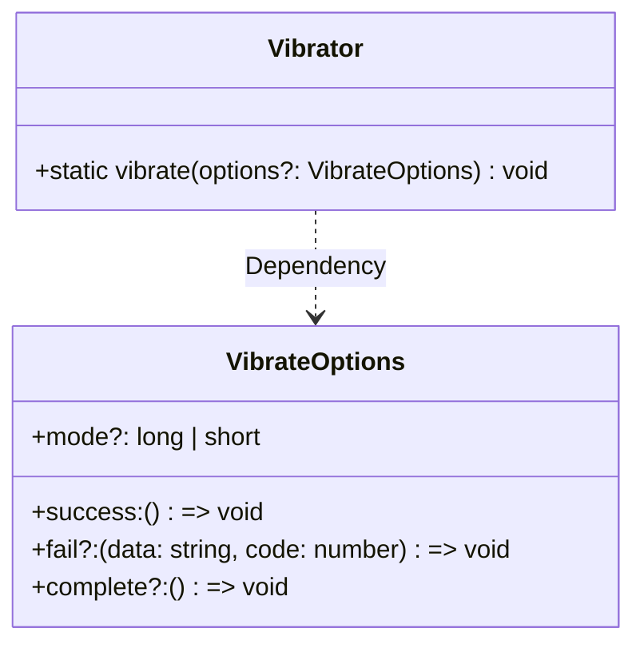

# @system.vibrator (振动)
<!--Kit: Sensor Service Kit-->
<!--Subsystem: Sensors-->
<!--Owner: @dilligencer-->
<!--Designer: @andeszhang-->
<!--Tester: @liuhaonan2-->
<!--Adviser: @hu-zhiqiong-->

 ## 模块简介

@system.vibrator模块提供控制设备马达振动的能力，开发者可以通过该模块触发设备执行长振动或短振动效果，为用户提供触觉反馈。

该模块主要用于闹钟、开关机振动、来电振动等需要触觉提醒的交互场景，帮助应用在关键事件发生时通过振动吸引用户注意力。

@system.vibrator适用于Lite Wearable轻量穿戴设备。对于其他设备类型，自API version 8起该模块不再维护，推荐使用[@ohos.vibrator (振动)](js-apis-vibrator.md)模块提供的更丰富的振动控制能力。该功能需要设备硬件支持，仅支持真机调试。


> **说明：**
>
> - 模块维护策略：
 >   - 对于Lite Wearable设备类型，该模块长期维护，正常使用。 
 >   - 对于支持该模块的其他设备类型，该模块从API version 8开始不再维护，推荐使用新接口[@ohos.vibrator (振动)](js-apis-vibrator.md)。
> - 本模块首批接口从API version 3开始支持。后续版本的新增接口，采用上角标单独标记接口的起始版本。
> - 该功能使用需要对应硬件支持，仅支持真机调试。可通过系统设备信息或相关接口查询设备是否支持振动功能。

## 概述
本模块（@system.vibrator）仅提供触发设备振动的基本接口[Vibrator.vibrate()](#vibratorvibrate)，支持短振动（short）和长振动（long）两种模式。与[@ohos.vibrator (振动)](js-apis-vibrator.md)模块相比，本模块功能较为简单，不支持振动效果查询、振动器列表查询、自定义振动文件等高级功能。对于Lite Wearable设备，本模块持续维护；对于其他设备类型，从API version 8起不再维护，推荐使用[@ohos.vibrator (振动)](js-apis-vibrator.md)模块的[vibrator.startVibration()](js-apis-vibrator.md#vibratorstartvibration9)接口，该替代接口支持更丰富的振动效果（包括指定时长振动[VibrateTime](js-apis-vibrator.md#vibratetime9)、预置效果振动[VibratePreset](js-apis-vibrator.md#vibratepreset9)、自定义文件振动[VibrateFromFile](js-apis-vibrator.md#vibratefromfile10)等），适用于更多设备类型。

### 类图



Vibrator类通过`vibrate()`方法依赖VibrateOptions接口来接收振动配置参数。

该模块主要用于闹钟、开关机振动、来电振动等需要触觉提醒的交互场景，帮助应用在关键事件发生时通过振动吸引用户注意力。

@system.vibrator适用于Lite Wearable轻量穿戴设备。对于其他设备类型，自API version 8起该模块不再维护，推荐使用[@ohos.vibrator (振动)](js-apis-vibrator.md)模块提供的更丰富的振动控制能力。该功能需要设备硬件支持，仅支持真机调试。

## 导入模块


```ts
import { Vibrator } from '@kit.SensorServiceKit';
```

## Vibrator.vibrate

 vibrate(options?: VibrateOptions): void

触发设备振动，根据指定的振动模式执行短振动或长振动效果。该接口通过callback方式返回调用结果。

当开发者需要在Lite Wearable设备上实现闹钟振动、来电振动、开关机振动、按键触觉反馈等场景时，使用此接口触发设备振动。调用后，设备将按照指定的振动模式（短振动或长振动）执行振动效果。若未指定mode参数，设备将执行长振动（mode默认值为'long'）。

除Lite Wearable外，从API version 8开始，推荐使用[vibrator.startVibration()](js-apis-vibrator.md#vibratorstartvibration9)。

**需要权限**：ohos.permission.VIBRATE

**系统能力**：SystemCapability.Sensors.MiscDevice.Lite

**参数**：

| 参数名  | 类型                              | 必填 | 说明       |
| ------- | --------------------------------- | ---- | ---------- |
| options | [VibrateOptions](#vibrateoptions) | 否   | 振动配置参数，用于指定振动模式及回调函数。不传时使用默认配置（mode默认为'long'），此时仅触发success和complete回调（无fail回调场景下）。 |

**ArkTS示例**：

```ts
import { Vibrator, VibrateOptions } from '@kit.SensorServiceKit';

let vibrateOptions: VibrateOptions = {
  mode: 'short',  // 设置振动模式为短振动
  success: () => {
    console.info('Succeed in vibrating');
  },
  fail: (data: string, code: number) => {
    console.error(`Failed to vibrate. Data: ${data}, code: ${code}`);
  },
  complete: () => {
    console.info('vibration completed');
  }
};
Vibrator.vibrate(vibrateOptions);
```

**JS示例**：

```js
import vibrator from '@system.vibrator';

export default {
  data: {
    TAG: "WearLiteSample:",
    result: ''
  },
  vibrate() {
    try {
      let vibrateOptions = {
        mode: 'short',  // 设置振动模式为短振动
        success: () => {
          console.info('Succeeded in vibrating');
          this.result = 'Succeeded in vibrating';
        },
        fail: (data, code) => {
          console.error(`Failed to vibrate. Data: ${data}, code: ${code}`);
          this.result = `Failed to vibrate. Data: ${data}, code: ${code}`;
        },
        complete: () => {
          console.info('vibration completed');
        }
      };
      vibrator.vibrate(vibrateOptions);
    } catch (e) {
      console.error(this.TAG + 'vibrate exception occurred, message:' + JSON.stringify(e));
    }
  }
};
```

```xml
<!-- xxx.hml -->
<div class="container">
  <text class="title">
    {{ result }}
  </text>
  <input class="buttonText" type="button" onclick="vibrate">点击振动</input>
</div>
```

```css
/* xxx.css */
.container {
  width: 100%;
  height: 100%;
  justify-content: center;
  align-items: center;
  flex-direction: column;
  justify-content: center;
}
.title {
  width: 200px;
  font-size: 30px;
  text-align: center;
}
.buttonText {
  background-color: blue;
  radius: 30px;
  text-color: white;
  font-size: 25px;
  width: 150px;
  height:50px;
  margin-top: 20px;
  font-weight: bolder;
  align-items: center;
}
```

## VibrateOptions

定义触发设备振动的配置参数，包括振动模式及接口调用的回调函数。开发者调用[Vibrator.vibrate()](#vibratorvibrate)时，通过VibrateOptions指定振动模式（短振动或长振动）以及监听振动触发成功、失败和完成的回调函数。传入VibrateOptions后，设备将按指定的mode执行相应振动模式，并在振动触发成功时回调success函数，失败时回调fail函数，接口调用结束时回调complete函数。

> **说明：**
>
> 从API version 3开始支持，从API version 8开始废弃。建议使用替代类型[VibrateTime](js-apis-vibrator.md#vibratetime9)。

**需要权限**：ohos.permission.VIBRATE

**系统能力**：SystemCapability.Sensors.MiscDevice.Lite

| 名称     | 类型     | 只读 | 可选 | 说明                                                         |
| -------- | -------- | ---- | ---- | ------------------------------------------------------------ |
| mode     | string   | 否   | 是   | 振动模式，指定设备振动的持续时间类型。取值范围：'long'（长振动）或'short'（短振动）。默认值：'long'。使用场景：开发者可根据实际需求选择振动模式，例如来电提醒使用'long'以持续提醒用户，按键触觉反馈使用'short'以提供即时反馈。不填写此参数时，默认执行长振动。规格限制：仅适用于Lite Wearable设备。 |
| success  | Function | 否   | 否   | 振动触发成功时的回调函数。使用场景：开发者需要监听振动触发成功事件时，通过此回调获取成功通知。使用后效果：振动成功触发后，系统将调用此回调函数，无返回参数。 |
| fail     | Function | 否   | 是   | 振动触发失败时的回调函数。使用场景：开发者需要处理振动触发失败的情况（如权限未授予、设备不支持振动等）时，通过此回调获取错误信息。不填写此参数时，振动触发失败将不会有回调通知。使用后效果：振动触发失败时，系统将调用此回调函数，传入错误信息data和错误码code。回调函数签名：(data: string, code: number) => void，其中data为错误信息字符串描述，code为错误码数字，标识具体的错误类型。 |
| complete | Function | 否   | 是   | 振动接口调用结束时的回调函数。使用场景：开发者需要在振动接口调用完成后（无论成功或失败）执行清理或状态更新操作时，使用此回调。不填写此参数时，接口调用结束将不会有回调通知。使用后效果：无论振动触发成功或失败，系统都会调用此回调函数，无返回参数。 |