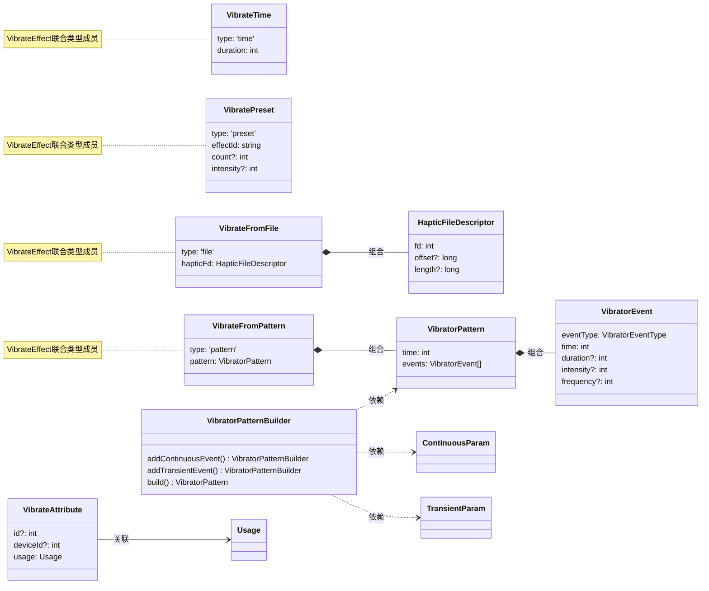

# @ohos.vibrator (振动)
<!--Kit: Sensor Service Kit-->
<!--Subsystem: Sensors-->
<!--Owner: @dilligencer-->
<!--Designer: @andeszhang-->
<!--Tester: @liuhaonan2-->
<!--Adviser: @hu-zhiqiong-->

## 模块简介
   
vibrator模块是设备马达振动的控制模块，属于SensorServiceKit。该模块提供精确控制设备马达振动的能力，支持按指定时长、预置效果、自定义配置文件、自定义振动模式等多种方式触发振动，并支持按指定模式或全部模式停止振动。此外，模块还提供振动效果支持查询、马达设备信息查询、马达上下线状态监听等能力。

vibrator模块主要用于增强用户交互体验，通过触觉感知反馈为应用提供直观的物理反馈能力。典型使用场景包括：
- **交互反馈**：点击、长按、滑动、拖拽等触控操作的短振反馈，推荐使用VibratePreset预置效果以保持与系统整体振感风格一致。
- **通知提醒**：消息通知、来电响铃、闹钟等场景的振动提醒。
- **游戏与多媒体**：游戏操作反馈、表情包拟真效果等复杂场景的精细振动，推荐使用VibrateFromFile或VibrateFromPattern自定义振动效果。
- **多设备协同**：在分布式场景下，通过指定设备ID和马达ID控制远端设备振动。

> **说明：**
> 
> - 本模块同时支持ArkTS-Dyn、ArkTS-Sta。
>
> - 本模块首批接口从API version 8开始支持。后续版本的新增接口，采用上角标单独标记接口的起始版本。


vibrator模块的核心能力围绕"启动振动"和"停止振动"两条主线展开，整体使用流程如下：

**启动振动流程：**

1. 若使用预置振动效果（VibratePreset），建议先调用[vibrator.isSupportEffect](#vibratorissupporteffect10)或[vibrator.isSupportEffectSync](#vibratorissupporteffectsync12)查询当前设备是否支持该效果；若使用自定义振动配置文件（VibrateFromFile），建议先确认设备支持自定义振动模式（可通过[vibrator.isHdHapticSupported](#vibratorishdhapticsupported12)查询是否支持高清振动）；若使用自定义振动模式（VibrateFromPattern），需先通过[VibratorPatternBuilder](#vibratorpatternbuilder18)构建振动序列。
2. 调用[vibrator.startVibration](#vibratorstartvibration9)启动振动，需同时指定振动效果（VibrateEffect）和振动属性（VibrateAttribute）。振动属性中的usage参数决定了振动的场景类型，不同场景类型受系统振动开关管控规则不同。

**停止振动流程：**

- 停止指定时长振动或预置效果振动：调用[vibrator.stopVibration](#vibratorstopvibration9)（API version 9），传入对应的VibratorStopMode。
- 停止自定义振动（VibrateFromFile或VibrateFromPattern）：调用[vibrator.stopVibration](#vibratorstopvibration10-1)（API version 10+，无参数版本）停止所有模式振动。
- 停止所有模式振动：调用[vibrator.stopVibration](#vibratorstopvibration10-1)（无参数版本）或[vibrator.stopVibrationSync](#vibratorstopvibrationsync12)（同步版本）。
- 停止指定设备的马达振动：调用[vibrator.stopVibration](#vibratorstopvibration19)（API version 19+，传入VibratorInfoParam）。

**多马达设备场景：**

从API version 19开始，支持多设备多马达场景。可通过[vibrator.getVibratorInfoSync](#vibratorgetvibratorinfosync19)查询马达信息，通过[vibrator.on](#vibratoronvibratorstatechange19)监听马达上下线事件，以便动态选择合适的马达触发振动。

**振动效果类型对比：**

| 振动效果类型 | 适用场景 | 个性化程度 | 推荐优先级 |
| --- | --- | --- | --- |
| VibratePreset | 交互反馈类的短振场景（点击、长按、滑动、拖拽等） | 低，使用系统预置效果 | 推荐，与系统整体振感反馈体验风格一致 |
| VibrateFromFile | 复杂场景效果（表情包拟真效果、游戏场景/操作反馈） | 高，支持自定义振动配置文件 | 适用于需要精细振动的场景 |
| VibrateFromPattern | 与VibrateFromFile一致，但更灵活 | 高，支持振动事件数组组合 | 适用于需要动态组合振动事件的场景 |
| VibrateTime | 基础时长振动，仅控制启停 | 低，无法调节强度和频率 | 仅满足基础功能需求 |

### UML类图



## vibrator.startVibration<sup>9+</sup>

startVibration(effect: VibrateEffect, attribute: VibrateAttribute, callback: AsyncCallback&lt;void&gt;): void

根据指定的振动效果和振动属性触发马达振动，使用callback异步回调。

适用于为用户交互提供触觉反馈、为通知/闹钟等事件提供振动提醒，或在游戏、多媒体等场景中提供沉浸式振动体验。调用成功后，设备马达将按指定效果和属性开始振动；若同一马达已有正在进行的振动，新请求将按系统优先级规则处理。同功能还提供Promise版本vibrator.startVibration (#vibratorstartvibration9-1)，开发者可根据回调风格偏好选择。


**需要权限**：ohos.permission.VIBRATE

**原子化服务API**：从API version 11开始，该接口支持在原子化服务中使用。

**系统能力**：SystemCapability.Sensors.MiscDevice

**ArkTS-Dyn起始版本：** 9

**ArkTS-Sta起始版本：** 23

**参数**：

| 参数名    | 类型                                   | 必填 | 说明                                                         |
| --------- | -------------------------------------- | ---- | :----------------------------------------------------------- |
| effect    | [VibrateEffect](#vibrateeffect9)       | 是   | 马达振动效果，支持四种：<br>1、[VibratePreset](#vibratepreset9)：按照预置振动效果触发马达振动，适用于交互反馈类的短振场景（如点击长按，滑动，拖拽等），为确保与系统整体振感反馈体验风格一致，推荐使用此接口；<br>2、[VibrateFromFile](#vibratefromfile10)：按照文件形式定制自定义振动效果触发马达振动，适用于匹配复杂场景效果的交互反馈（如表情包触发的拟真效果、游戏场景/操作反馈）；<br>3、[VibrateTime](#vibratetime9)：按照指定时长触发马达振动，仅对振动时长进行启动或停止控制，满足基础功能，无法对振动强度、频率等维度进行个性化设置，此种振动调节不够细腻，无法满足精致体验；<br/>4、[VibrateFromPattern<sup>18+</sup>](#vibratefrompattern18)：按照自定义振动效果触发马达振动。使用场景和VibrateFromFile一致。VibrateFromFile是面向文件中提前定制好的效果，将具体的振动事件以文件描述符形式传递到接口中；VibrateFromPattern提供更加灵活的振动事件排列组合，将振动事件以振动事件数组的形式传递到接口中。<br/> |
| attribute | [VibrateAttribute](#vibrateattribute9) | 是   | 马达振动属性，用于指定马达ID、设备ID和振动使用场景。attribute中的usage参数决定振动的场景类型，不同场景类型受系统振动开关管控规则不同，开发者需根据实际业务场景选择合适的usage值。 |
| callback  | AsyncCallback&lt;void&gt;              | 是   | 回调函数。当马达振动成功，err为undefined；否则为错误对象，包含错误码和错误信息。回调结果可用于确认振动是否成功启动，若启动失败可根据错误码进行相应处理。 |

**错误码**：

以下错误码的详细介绍请参见[振动错误码](errorcode-vibrator.md)和[通用错误码](../errorcode-universal.md)。错误码和错误信息会以异常的形式抛出，调用接口时需要使用try catch对可能出现的异常进行捕获操作。

| 错误码ID | 错误信息                                                     |
| -------- | ------------------------------------------------------------ |
| 201      | Permission denied.                                           |
| 401      | Parameter error.Possible causes:1. Mandatory parameters are left unspecified;2. Incorrect parameter types;3. Parameter verification failed. |
| 801      | Capability not supported.                                    |
| 14600101 | Device operation failed.                                     |

**示例**：

1. 按照预置振动效果触发马达振动：

   ```ts
   import { vibrator } from '@kit.SensorServiceKit';
   import { BusinessError } from '@kit.BasicServicesKit';

   // 使用try catch对可能出现的异常进行捕获
   try {
     // 查询是否支持'haptic.notice.success'
     vibrator.isSupportEffect('haptic.notice.success', (err: BusinessError, state: boolean) => {
       if (err) {
         console.error(`Failed to query effect. Code: ${err.code}, message: ${err.message}`);
          return;
       }
       console.info('Succeed in querying effect');
       if (state) {
         try {
           vibrator.startVibration({
             type: 'preset',
             effectId: 'haptic.notice.success',
             count: 1,
           }, {
             usage: 'notification' // 根据实际选择类型归属不同的开关管控
           }, (error: BusinessError) => {
             if (error) {
               console.error(`Failed to start vibration. Code: ${error.code}, message: ${error.message}`);
         return;
             }
             console.info('Succeed in starting vibration');
          
           });
         } catch (err) {
           let e: BusinessError = err as BusinessError;
       console.error(`An unexpected error occurred. Code: ${e.code}, message: ${e.message}`);
         }
       }
     })
   } catch (error) {
     let e: BusinessError = error as BusinessError;
     console.error(`An unexpected error occurred. Code: ${e.code}, message: ${e.message}`);
   }
   ```

2. 按照自定义振动配置文件触发马达振动：

   ```ts
   import { vibrator } from '@kit.SensorServiceKit';
   import { resourceManager } from '@kit.LocalizationKit';
   import { BusinessError } from '@kit.BasicServicesKit';

   const fileName: string = 'xxx.json';

   @Entry
   @Component
   struct Index {
     uiContext = this.getUIContext();

     build() {
       Row() {
         Column() {
           Button('alarm-file')
             .onClick(() => {
               let rawFd: resourceManager.RawFileDescriptor | undefined = this.uiContext.getHostContext()?.resourceManager.getRawFdSync(fileName);
               if (rawFd != undefined) {
                 try {
                   vibrator.startVibration({
                     type: "file",
                     hapticFd: { fd: rawFd.fd, offset: rawFd.offset, length: rawFd.length }
                   }, {
                     id: 0,
                     usage: 'alarm' // 根据实际选择类型归属不同的开关管控
                   }, (error: BusinessError) => {
                     if (error) {
                       console.error(`Failed to start vibration. Code: ${error.code}, message: ${error.message}`);
                       return;
                     }
                     console.info('Succeed in starting vibration');
                   });
                 } catch (err) {
                   let e: BusinessError = err as BusinessError;
                   console.error(`An unexpected error occurred. Code: ${e.code}, message: ${e.message}`);
                 } finally {
                   vibrator.stopVibration();
                   this.uiContext.getHostContext()?.resourceManager.closeRawFdSync(fileName);
                 }
               }
             })
         }
         .width('100%')
       }
       .height('100%')
     }
   }
   ```

3. 按照指定时长触发马达振动：

   ```ts
   import { vibrator } from '@kit.SensorServiceKit';
   import { BusinessError } from '@kit.BasicServicesKit';

   try {
     vibrator.startVibration({
       type: 'time',
       duration: 1000,
     }, {
       id: 0,
       usage: 'alarm' // 根据实际选择类型归属不同的开关管控
     }, (error: BusinessError) => {
       if (error) {
         console.error(`Failed to start vibration. Code: ${error.code}, message: ${error.message}`);
         return;
       }
       console.info('Succeed in starting vibration');
     });
   } catch (err) {
     let e: BusinessError = err as BusinessError;
     console.error(`An unexpected error occurred. Code: ${e.code}, message: ${e.message}`);
   }
   ```

## vibrator.startVibration<sup>9+</sup>

startVibration(effect: VibrateEffect, attribute: VibrateAttribute): Promise&lt;void&gt;

根据指定的振动效果和振动属性触发马达振动，使用promise异步回调。

适用于交互触觉反馈、事件振动提醒或游戏、多媒体等沉浸式振动场景。调用成功时Promise resolve无返回值；调用失败时Promise reject返回错误对象。若同一马达已有振动正在进行，新请求按系统优先级规则处理。同功能还提供callback版本vibrator.startVibration (#vibratorstartvibration9)，开发者可根据回调风格偏好选择。

**需要权限**：ohos.permission.VIBRATE

**原子化服务API(仅ArkTS-Dyn)**：从API version 11开始，该接口支持在原子化服务中使用。

**系统能力**：SystemCapability.Sensors.MiscDevice

**ArkTS-Dyn起始版本：** 9

**ArkTS-Sta起始版本：** 23

**参数**：

| 参数名    | 类型                                   | 必填 | 说明                                                         |
| --------- | -------------------------------------- | ---- | ------------------------------------------------------------ |
| effect    | [VibrateEffect](#vibrateeffect9)       | 是   | 马达振动效果，支持四种：<br/>1、[VibratePreset](#vibratepreset9)：按照预置振动效果触发马达振动，适用于交互反馈类的短振场景（如点击长按，滑动，拖拽等），为确保与系统整体振感反馈体验风格一致，推荐使用此接口；<br/>2、[VibrateFromFile](#vibratefromfile10)：按照文件形式定制自定义振动效果触发马达振动，适用于匹配复杂场景效果的交互反馈（如表情包触发的拟真效果、游戏场景/操作反馈）；<br/>3、[VibrateTime](#vibratetime9)：按照指定时长触发马达振动，仅对振动时长进行启动或停止控制，满足基础功能，无法对振动强度、频率等维度进行个性化设置，此种振动调节不够细腻，无法满足精致体验；<br/>4、[VibrateFromPattern<sup>18+</sup>](#vibratefrompattern18)：按照自定义振动效果触发马达振动。使用场景和VibrateFromFile一致。VibrateFromFile是面向文件中提前定制好的效果，将具体的振动事件以文件描述符形式传递到接口中；VibrateFromPattern提供更加灵活的振动事件排列组合，将振动事件以振动事件数组的形式传递到接口中。 |
| attribute | [VibrateAttribute](#vibrateattribute9) | 是   | 马达振动属性，用于指定马达ID、设备ID和振动使用场景。attribute中的usage参数决定振动的场景类型，不同场景类型受系统振动开关管控规则不同，开发者需根据实际业务场景选择合适的usage值。 |

**返回值**：

| 类型                | 说明                      |
| ------------------- | ------------------------- |
| Promise&lt;void&gt; | 无返回结果的Promise对象。调用成功时Promise resolve，表示振动成功启动；调用失败时Promise reject，返回错误对象包含错误码和错误信息，可用于排查振动启动失败的原因。 |

**错误码**：

以下错误码的详细介绍请参见[振动错误码](errorcode-vibrator.md)和[通用错误码](../errorcode-universal.md)。错误码和错误信息会以异常的形式抛出，调用接口时需要使用try catch对可能出现的异常进行捕获操作。

| 错误码ID | 错误信息                                                     |
| -------- | ------------------------------------------------------------ |
| 201      | Permission denied.                                           |
| 401      | Parameter error.Possible causes:1. Mandatory parameters are left unspecified;2. Incorrect parameter types;3. Parameter verification failed. |
| 801      | Capability not supported.                                    |
| 14600101 | Device operation failed.                                     |

**示例**：

1. 按照预置振动效果触发马达振动：

   ```ts
   import { vibrator } from '@kit.SensorServiceKit';
   import { BusinessError } from '@kit.BasicServicesKit';
   
   // 使用try catch对可能出现的异常进行捕获
   try {
     // 查询是否支持'haptic.notice.success'
     vibrator.isSupportEffect('haptic.notice.success').then((state: boolean) => {
       console.info('Succeed in querying effect');
       if (state) {
         try {
           vibrator.startVibration({
             type: 'preset',
             effectId: 'haptic.notice.success',
             count: 1,
           }, {
             usage: 'notification' // 根据实际选择类型归属不同的开关管控
           }).then(() => {
             console.info('Succeed in starting vibration');
          
           });
         } catch (err) {
           let e: BusinessError = err as BusinessError;
           console.error(`An unexpected error occurred. Code: ${e.code}, message: ${e.message}`);
         }
       }
     })
   } catch (error) {
     let e: BusinessError = error as BusinessError;
     console.error(`An unexpected error occurred. Code: ${e.code}, message: ${e.message}`);
   }
   ```

2. 按照自定义振动配置文件触发马达振动：

   ```ts
   import { vibrator } from '@kit.SensorServiceKit';
   import { resourceManager } from '@kit.LocalizationKit';
   import { BusinessError } from '@kit.BasicServicesKit';

   const fileName: string = 'xxx.json';

   @Entry
   @Component
   struct Index {
     uiContext = this.getUIContext();

     build() {
       Row() {
         Column() {
           Button('alarm-file')
             .onClick(() => {
               let rawFd: resourceManager.RawFileDescriptor | undefined = this.uiContext.getHostContext()?.resourceManager.getRawFdSync(fileName);
               if (rawFd != undefined) {
                 try {
                   vibrator.startVibration({
                     type: "file",
                     hapticFd: { fd: rawFd.fd, offset: rawFd.offset, length: rawFd.length }
                   }, {
                     id: 0,
                     usage: 'alarm' // 根据实际选择类型归属不同的开关管控
                   }, (error: BusinessError) => {
                     if (error) {
                       console.error(`Failed to start vibration. Code: ${error.code}, message: ${error.message}`);
                       return;
                     }
                     console.info('Succeed in starting vibration');
                   });
                 } catch (err) {
                   let e: BusinessError = err as BusinessError;
                   console.error(`An unexpected error occurred. Code: ${e.code}, message: ${e.message}`);
                 } finally {
                   vibrator.stopVibration();
                   this.uiContext.getHostContext()?.resourceManager.closeRawFdSync(fileName);
                 }
               }
             })
         }
         .width('100%')
       }
       .height('100%')
     }
   }
   ```

3. 按照指定时长触发马达振动：

   ```ts
   import { vibrator } from '@kit.SensorServiceKit';
   import { BusinessError } from '@kit.BasicServicesKit';

   try {
     vibrator.startVibration({
       type: 'time',
       duration: 1000
     }, {
       id: 0,
       usage: 'alarm' // 根据实际选择类型归属不同的开关管控
     }).then(() => {
       console.info('Succeed in starting vibration');
     }, (error: BusinessError) => {
       console.error(`Failed to start vibration. Code: ${error.code}, message: ${error.message}`);
     });
   } catch (err) {
     let e: BusinessError = err as BusinessError;
     console.error(`An unexpected error occurred. Code: ${e.code}, message: ${e.message}`);
   }
   ```

## vibrator.stopVibration<sup>9+</sup>

stopVibration(stopMode: VibratorStopMode, callback: AsyncCallback&lt;void&gt;): void

按照指定模式停止马达振动。调用成功后马达停止对应模式的振动。使用callback异步回调。

stopMode需与启动振动时的VibrateEffect类型对应：VIBRATOR_STOP_MODE_TIME用于停止VibrateTime类型振动，VIBRATOR_STOP_MODE_PRESET用于停止VibratePreset类型振动，否则停止操作可能无效。调用成功后指定模式振动停止，若无对应振动正在进行也会成功返回。此接口无法停止自定义振动（VibrateFromFile和VibrateFromPattern），如需停止自定义振动或所有模式振动，请使用vibrator.stopVibration (#vibratorstopvibration10)。

**需要权限**：ohos.permission.VIBRATE

**系统能力**：SystemCapability.Sensors.MiscDevice

**ArkTS-Dyn起始版本：** 9

**ArkTS-Sta起始版本：** 23

**参数**：

| 参数名   | 类型                                  | 必填 | 说明                                                         |
| -------- | ------------------------------------- | ---- | ------------------------------------------------------------ |
| stopMode | [VibratorStopMode](#vibratorstopmode) | 是   | 指定的停止振动模式，用于停止对应模式的马达振动，支持两种：<br>VIBRATOR_STOP_MODE_TIME：停止[VibrateTime](#vibratetime9)类型的固定时长振动；<br>VIBRATOR_STOP_MODE_PRESET：停止[VibratePreset](#vibratepreset9)类型的预置振动。<br>此接口无法停止自定义振动（[VibrateFromFile](#vibratefromfile10)和[VibrateFromPattern](#vibratefrompattern18)），请使用[vibrator.stopVibration<sup>10+</sup>](#vibratorstopvibration10)。stopMode需与启动振动时的VibrateEffect类型对应，否则停止操作可能无效。 |
| callback | AsyncCallback&lt;void&gt;             | 是   | 回调函数，当马达停止振动成功，err为undefined，否则为错误对象。回调结果可用于确认振动是否成功停止。 |

**错误码**：

以下错误码的详细介绍请参见[通用错误码](../errorcode-universal.md)。错误码和错误信息会以异常的形式抛出，调用接口时需要使用try catch对可能出现的异常进行捕获操作。

| 错误码ID | 错误信息                                                     |
| -------- | ------------------------------------------------------------ |
| 201      | Permission denied.                                           |
| 401      | Parameter error.Possible causes:1. Mandatory parameters are left unspecified;2. Incorrect parameter types;3. Parameter verification failed. |

**示例**：

1. 停止指定时长振动：

   ```ts
   import { vibrator } from '@kit.SensorServiceKit';
   import { BusinessError } from '@kit.BasicServicesKit';

   // 使用try catch对可能出现的异常进行捕获
   try {
     // 按照指定时长振动
     vibrator.startVibration({
       type: 'time',
       duration: 1000,
     }, {
       id: 0,
       usage: 'alarm' // 根据实际选择类型归属不同的开关管控
     }, (error: BusinessError) => {
       if (error) {
         console.error(`Failed to start vibration. Code: ${error.code}, message: ${error.message}`);
         return;
       }
       console.info('Succeed in starting vibration');
     });
   } catch (err) {
     let e: BusinessError = err as BusinessError;
     console.error(`An unexpected error occurred. Code: ${e.code}, message: ${e.message}`);
   }

   try {
     // 按照VIBRATOR_STOP_MODE_TIME模式停止振动
     vibrator.stopVibration(vibrator.VibratorStopMode.VIBRATOR_STOP_MODE_TIME, (error: BusinessError) => {
       if (error) {
         console.error(`Failed to stop vibration. Code: ${error.code}, message: ${error.message}`);
         return;
       }
       console.info('Succeed in stopping vibration');
     })
   } catch (err) {
     let e: BusinessError = err as BusinessError;
     console.error(`An unexpected error occurred. Code: ${e.code}, message: ${e.message}`);
   }
   ```

2. 停止预置振动：

   ```ts
   import { vibrator } from '@kit.SensorServiceKit';
   import { BusinessError } from '@kit.BasicServicesKit';

   try {
     // 按照预置效果振动
     vibrator.startVibration({
       type: 'preset',
       effectId: 'haptic.notice.success',
       count: 1,
     }, {
       id: 0,
       usage: 'notification' // 根据实际选择类型归属不同的开关管控
     }, (error: BusinessError) => {
       if (error) {
         console.error(`Failed to start vibration. Code: ${error.code}, message: ${error.message}`);
         return;
       }
       console.info('Succeed in starting vibration');
     });
   } catch (err) {
     let e: BusinessError = err as BusinessError;
     console.error(`An unexpected error occurred. Code: ${e.code}, message: ${e.message}`);
   }

   try {
     // 按照VIBRATOR_STOP_MODE_PRESET模式停止振动
     vibrator.stopVibration(vibrator.VibratorStopMode.VIBRATOR_STOP_MODE_PRESET, (error: BusinessError) => {
       if (error) {
         console.error(`Failed to stop vibration. Code: ${error.code}, message: ${error.message}`);
         return;
       }
       console.info('Succeed in stopping vibration');
     })
   } catch (err) {
     let e: BusinessError = err as BusinessError;
     console.error(`An unexpected error occurred. Code: ${e.code}, message: ${e.message}`);
   }
   ```

## vibrator.stopVibration<sup>9+</sup>

stopVibration(stopMode: VibratorStopMode): Promise&lt;void&gt;

按照指定模式停止马达的振动。调用成功后马达停止对应模式的振动。使用promise异步回调。

用于停止VibrateTime触发的指定时长振动或VibratePreset触发的预置振动。调用成功返回Promise resolve，失败返回错误对象；若无对应振动正在进行，仍返回成功。此接口无法停止自定义振动（VibrateFromFile和VibrateFromPattern），需使用vibrator.stopVibration (#vibratorstopvibration10-1)。stopMode须与启动振动时的VibrateEffect类型对应，否则停止无效：VibrateTime对应VIBRATOR_STOP_MODE_TIME，VibratePreset对应VIBRATOR_STOP_MODE_PRESET。

**需要权限**：ohos.permission.VIBRATE

**系统能力**：SystemCapability.Sensors.MiscDevice

**ArkTS-Dyn起始版本：** 9

**ArkTS-Sta起始版本：** 23

**参数**：

| 参数名   | 类型                                  | 必填 | 说明                                                         |
| -------- | ------------------------------------- | ---- | ------------------------------------------------------------ |
| stopMode | [VibratorStopMode](#vibratorstopmode) | 是   | 指定的停止振动模式，用于停止对应模式的马达振动，支持两种：<br>VIBRATOR_STOP_MODE_TIME：停止[VibrateTime](#vibratetime9)类型的指定时长振动；<br>VIBRATOR_STOP_MODE_PRESET：停止[VibratePreset](#vibratepreset9)类型的预置振动。<br>此接口无法停止自定义振动（[VibrateFromFile](#vibratefromfile10)和[VibrateFromPattern](#vibratefrompattern18)），请使用[vibrator.stopVibration<sup>10+</sup>](#vibratorstopvibration10-1)。stopMode需与启动振动时的VibrateEffect类型对应，否则停止操作可能无效。 |

**返回值**：

| 类型                | 说明          |
| ------------------- | ------------- |
| Promise&lt;void&gt; | Promise对象。调用成功时Promise resolve，表示振动成功停止；调用失败时Promise reject，返回错误对象包含错误码和错误信息，可用于排查停止失败的原因。 |

**错误码**：

以下错误码的详细介绍请参见[通用错误码](../errorcode-universal.md)。错误码和错误信息会以异常的形式抛出，调用接口时需要使用try catch对可能出现的异常进行捕获操作。

| 错误码ID | 错误信息                                                     |
| -------- | ------------------------------------------------------------ |
| 201      | Permission denied.                                           |
| 401      | Parameter error.Possible causes:1. Mandatory parameters are left unspecified;2. Incorrect parameter types;3. Parameter verification failed. |

**示例**：

1. 停止指定时长振动：

   ```ts
   import { vibrator } from '@kit.SensorServiceKit';
   import { BusinessError } from '@kit.BasicServicesKit';

   // 使用try catch对可能出现的异常进行捕获
   try {
     // 按照指定时长振动
     vibrator.startVibration({
       type: 'time',
       duration: 1000,
     }, {
       id: 0,
       usage: 'alarm' // 根据实际选择类型归属不同的开关管控
     }).then(() => {
       console.info('Succeed in starting vibration');
     }, (error: BusinessError) => {
       console.error(`Failed to start vibration. Code: ${error.code}, message: ${error.message}`);
     });
   } catch (err) {
     let e: BusinessError = err as BusinessError;
     console.error(`An unexpected error occurred. Code: ${e.code}, message: ${e.message}`);
   }

   try {
     // 按照VIBRATOR_STOP_MODE_TIME模式停止振动
     vibrator.stopVibration(vibrator.VibratorStopMode.VIBRATOR_STOP_MODE_TIME).then(() => {
       console.info('Succeed in stopping vibration');
     }, (error: BusinessError) => {
       console.error(`Failed to stop vibration. Code: ${error.code}, message: ${error.message}`);
     });
   } catch (err) {
     let e: BusinessError = err as BusinessError;
     console.error(`An unexpected error occurred. Code: ${e.code}, message: ${e.message}`);
   }
   ```

2. 停止预置振动：

   ```ts
   import { vibrator } from '@kit.SensorServiceKit';
   import { BusinessError } from '@kit.BasicServicesKit';
  
   try {
     // 按照预置效果振动
     vibrator.startVibration({
       type: 'preset',
       effectId: 'haptic.notice.success',
       count: 1,
     }, {
       id: 0,
       usage: 'notification' // 根据实际选择类型归属不同的开关管控
     }).then(() => {
       console.info('Succeed in starting vibration');
     }, (error: BusinessError) => {
       console.error(`Failed to start vibration. Code: ${error.code}, message: ${error.message}`);
     });
   } catch (err) {
     let e: BusinessError = err as BusinessError;
     console.error(`An unexpected error occurred. Code: ${e.code}, message: ${e.message}`);
   }

   try {
     // 按照VIBRATOR_STOP_MODE_PRESET模式停止振动
     vibrator.stopVibration(vibrator.VibratorStopMode.VIBRATOR_STOP_MODE_PRESET).then(() => {
       console.info('Succeed in stopping vibration');
     }, (error: BusinessError) => {
       console.error(`Failed to stop vibration. Code: ${error.code}, message: ${error.message}`);
     });
   } catch (err) {
     let e: BusinessError = err as BusinessError;
     console.error(`An unexpected error occurred. Code: ${e.code}, message: ${e.message}`);
   }
   ```

## vibrator.stopVibration<sup>10+</sup>

stopVibration(callback: AsyncCallback&lt;void&gt;): void

停止所有模式的马达振动。调用成功后马达停止振动。使用callback异步回调。

用于停止设备上所有类型的振动（包括VibrateTime、VibratePreset、VibrateFromFile、VibrateFromPattern），适用于应用退出、页面切换等需立即终止所有振动的场景。与vibrator.stopVibration (#vibratorstopvibration9)（需传入stopMode）不同，本接口无需指定停止模式，可停止包括自定义振动在内的所有振动。

**需要权限**：ohos.permission.VIBRATE

**原子化服务API(仅ArkTS-Dyn)**：从API version 11开始，该接口支持在原子化服务中使用。

**系统能力**：SystemCapability.Sensors.MiscDevice

**ArkTS-Dyn起始版本：** 10

**ArkTS-Sta起始版本：** 23

**参数**：

| 参数名   | 类型                      | 必填 | 说明                                                         |
| -------- | ------------------------- | ---- | ------------------------------------------------------------ |
| callback | AsyncCallback&lt;void&gt; | 是   | 回调函数，当马达停止振动成功，err为undefined，否则为错误对象，包含错误码和错误信息。回调结果可用于确认所有振动是否成功停止。 |

**错误码**：

以下错误码的详细介绍请参见[通用错误码](../errorcode-universal.md)。错误码和错误信息会以异常的形式抛出，调用接口时需要使用try catch对可能出现的异常进行捕获操作。

| 错误码ID | 错误信息           |
| -------- | ------------------ |
| 201      | Permission denied. |

**示例**：

   ```ts
   import { vibrator } from '@kit.SensorServiceKit';
   import { BusinessError } from '@kit.BasicServicesKit';

   // 使用try catch对可能出现的异常进行捕获
   try {
     // 停止所有模式的马达振动
     vibrator.stopVibration((error: BusinessError) => {
       if (error) {
         console.error(`Failed to stop vibration. Code: ${error.code}, message: ${error.message}`);
         return;
       }
       console.info('Succeed in stopping vibration');
     })
   } catch (error) {
     let e: BusinessError = error as BusinessError;
     console.error(`An unexpected error occurred. Code: ${e.code}, message: ${e.message}`);
   }
   ```

## vibrator.stopVibration<sup>10+</sup>

stopVibration(): Promise&lt;void&gt;

停止所有模式的马达振动。调用成功后马达停止振动。使用promise异步回调。

用于停止设备上所有类型的振动（包括VibrateTime、VibratePreset、VibrateFromFile、VibrateFromPattern），适用于应用退出、页面切换等需立即终止所有振动的场景。调用成功返回Promise resolve，失败返回错误对象。与vibrator.stopVibration (#vibratorstopvibration9-1)（需传入stopMode）不同，本接口无需指定停止模式，可停止包括自定义振动在内的所有振动。

**需要权限**：ohos.permission.VIBRATE

**原子化服务API(仅ArkTS-Dyn)**：从API version 11开始，该接口支持在原子化服务中使用。

**系统能力**：SystemCapability.Sensors.MiscDevice

**ArkTS-Dyn起始版本：** 10

**ArkTS-Sta起始版本：** 23

**返回值**：

| 类型                | 说明          |
| ------------------- | ------------- |
| Promise&lt;void&gt; | Promise对象。调用成功时Promise resolve，表示所有振动成功停止；调用失败时Promise reject，返回错误对象包含错误码和错误信息，可用于排查停止失败的原因。 |

**错误码**：

以下错误码的详细介绍请参见[通用错误码](../errorcode-universal.md)。错误码和错误信息会以异常的形式抛出，调用接口时需要使用try catch对可能出现的异常进行捕获操作。

| 错误码ID | 错误信息           |
| -------- | ------------------ |
| 201      | Permission denied. |

**示例**：

   ```ts
   import { vibrator } from '@kit.SensorServiceKit';
   import { BusinessError } from '@kit.BasicServicesKit';

   // 使用try catch对可能出现的异常进行捕获
   try {
     // 停止所有模式的马达振动
     vibrator.stopVibration().then(() => {
       console.info('Succeed in stopping vibration');
     }, (error: BusinessError) => {
       console.error(`Failed to stop vibration. Code: ${error.code}, message: ${error.message}`);
     });
   } catch (error) {
     let e: BusinessError = error as BusinessError;
     console.error(`An unexpected error occurred. Code: ${e.code}, message: ${e.message}`);
   }
   ```

## vibrator.stopVibration<sup>19+</sup>

stopVibration(param?: VibratorInfoParam): Promise&lt;void&gt;

停止指定设备马达振动。不传参默认停止本地设备所有马达的振动。使用promise异步回调。

用于多设备多马达场景下停止指定设备或指定马达的振动。不传参时默认停止本地设备全部马达振动；传入VibratorInfoParam可指定远程设备的特定马达。调用成功返回Promise resolve，失败返回错误对象。与vibrator.stopVibration (#vibratorstopvibration10-1)（无参数版本）相比，本接口新增VibratorInfoParam可选参数，支持精确控制停止范围，前者仅能停止本地设备所有马达振动。

**需要权限**：ohos.permission.VIBRATE

**系统能力**：SystemCapability.Sensors.MiscDevice

**ArkTS-Dyn起始版本：** 19

**ArkTS-Sta起始版本：** 23

**参数**：

| 参数名   | 类型                                                         | 必填 | 说明                                |
| -------- | ------------------------------------------------------------ | ---- |-----------------------------------|
| param     | [VibratorInfoParam](#vibratorinfoparam19)                       | 否   | 指出需要停止振动的设备和马达信息。不传参时默认停止本地设备的全部马达振动。deviceId默认值为-1（本地设备），vibratorId默认值为0（该设备的全部马达）。deviceId和vibratorId可通过[vibrator.getVibratorInfoSync](#vibratorgetvibratorinfosync19)或[vibrator.on](#vibratoronvibratorstatechange19)查询获取。 |

**返回值**：

| 类型                | 说明          |
| ------------------- | ------------- |
| Promise&lt;void&gt; | Promise对象。调用成功时Promise resolve，表示指定设备马达振动成功停止；调用失败时Promise reject，返回错误对象包含错误码和错误信息，可用于排查停止失败的原因。 |

**错误码**：

以下错误码的详细介绍请参见[振动错误码](errorcode-vibrator.md)和[通用错误码](../errorcode-universal.md)。错误码和错误信息会以异常的形式抛出，调用接口时需要使用try catch对可能出现的异常进行捕获操作。

| 错误码ID | 错误信息           |
| -------- | ------------------ |
| 201      | Permission denied. |
| 14600101 | Device operation failed. |

**示例**：

  ```ts
  import { vibrator } from '@kit.SensorServiceKit';
  import { BusinessError } from '@kit.BasicServicesKit';

  function vibratorDemo() {
    // 查询所有马达设备信息。
    const vibratorInfoList: vibrator.VibratorInfo[] = vibrator.getVibratorInfoSync();
    // 根据实际业务逻辑获取目标马达, 例如查找本地马达，此处示例仅做展示，开发者需要自行调整筛选逻辑。
    const targetVibrator = vibratorInfoList.find((vibrator: vibrator.VibratorInfo) => {
      return vibrator.isLocalVibrator;
    });
    if (!targetVibrator) {
      return;
    }
    // 调用 vibrator.startVibration 开始振动。
    // ...

    // 使用try catch对可能出现的异常进行捕获。
    try {
      // 根据实际业务场景停止马达振动。
      vibrator.stopVibration({ deviceId: targetVibrator.deviceId, vibratorId: targetVibrator.vibratorId }).then(() => {
        console.info('Succeed in stopping vibration');
      }, (error: BusinessError) => {
        console.error(`Failed to stop vibration. Code: ${error.code}, message: ${error.message}`);
      });
    } catch (error) {
      let e: BusinessError = error as BusinessError;
      console.error(`An unexpected error occurred. Code: ${e.code}, message: ${e.message}`);
    }
  }
  ```

## vibrator.stopVibrationSync<sup>12+</sup>

stopVibrationSync(): void

停止任何形式的马达振动。调用成功后马达停止振动。此接口为同步接口，会阻塞主线程直到振动停止操作完成，容易影响UI交互，需谨慎使用。

当开发者需要立即停止所有振动且不关心异步回调结果时使用此接口。适用于对实时性要求极高的场景（如紧急中断振动）。调用成功后，设备上所有正在进行的马达振动立即停止。调用失败时会抛出异常，需使用try catch捕获。与异步版本[vibrator.stopVibration](#vibratorstopvibration10-1)相比，本接口为同步接口，直接返回结果无需回调，但会阻塞主线程。建议在非UI线程中使用，或在UI线程中优先使用异步版本以避免影响交互响应。

**需要权限**：ohos.permission.VIBRATE

**原子化服务API(仅ArkTS-Dyn)**：从API version 12开始，该接口支持在原子化服务中使用。

**系统能力**：SystemCapability.Sensors.MiscDevice

**ArkTS-Dyn起始版本：** 12

**ArkTS-Sta起始版本：** 23

**错误码**：

以下错误码的详细介绍请参见[振动错误码](errorcode-vibrator.md)和[通用错误码](../errorcode-universal.md)。错误码和错误信息会以异常的形式抛出，调用接口时需要使用try catch对可能出现的异常进行捕获操作。

| 错误码ID | 错误信息                 |
| -------- | ------------------------ |
| 201      | Permission denied.       |
| 14600101 | Device operation failed. |

**示例**：

   ```ts
   import { vibrator } from '@kit.SensorServiceKit';
   import { BusinessError } from '@kit.BasicServicesKit';

   // 使用try catch对可能出现的异常进行捕获
   try {
     // 停止任何形式的马达振动
     vibrator.stopVibrationSync()
     console.info('Succeed in stopping vibration');
   } catch (error) {
     let e: BusinessError = error as BusinessError;
     console.error(`An unexpected error occurred. Code: ${e.code}, message: ${e.message}`);
   }
   ```

## vibrator.isSupportEffect<sup>10+</sup>

isSupportEffect(effectId: string, callback: AsyncCallback&lt;boolean&gt;): void

查询当前设备是否支持传入的预置振动效果effectId。使用callback异步回调。

当开发者需要在触发预置振动前确认当前设备是否支持指定的振动效果时使用此接口。由于不同设备可能预置不同的振动效果，建议在使用[vibrator.startVibration](#vibratorstartvibration9)的VibratePreset类型前先调用此接口查询，避免在不支持的设备上触发振动效果不佳。调用成功后，通过callback返回boolean结果：返回true表示设备支持该effectId，可直接用于startVibration；返回false表示不支持，此时使用该effectId触发振动可能效果不佳或无法振动。

**系统能力**：SystemCapability.Sensors.MiscDevice

**ArkTS-Dyn起始版本：** 10

**ArkTS-Sta起始版本：** 23

**参数**：

| 参数名   | 类型                         | 必填 | 说明                                                        |
| -------- | ---------------------------- | ---- | ----------------------------------------------------------- |
| effectId | string                       | 是   | 待确认的预置振动效果ID。字符串最大长度64，超出部分截取前64个字符。使用场景：不同设备预置的振动效果可能不同，需传入具体的effectId查询是否支持。取值可参考[EffectId](#effectid)和[HapticFeedback](#hapticfeedback12)中定义的值。 |
| callback | AsyncCallback&lt;boolean&gt; | 是   | 回调函数。返回true表示设备支持该effectId，可用于[startVibration](#vibratorstartvibration9)；返回false表示不支持，使用该effectId触发振动可能效果不佳。 |

**错误码**：

以下错误码的详细介绍请参见[通用错误码](../errorcode-universal.md)。错误码和错误信息会以异常的形式抛出，调用接口时需要使用try catch对可能出现的异常进行捕获操作。

| 错误码ID | 错误信息                                                     |
| -------- | ------------------------------------------------------------ |
| 201      | Permission denied.                                           |
| 401      | Parameter error.Possible causes:1. Mandatory parameters are left unspecified;2. Incorrect parameter types;3. Parameter verification failed. |

**示例**：

   ```ts
   import { vibrator } from '@kit.SensorServiceKit';
   import { BusinessError } from '@kit.BasicServicesKit';

   // 使用try catch对可能出现的异常进行捕获
   try {
     // 查询是否支持'haptic.notice.success'
     vibrator.isSupportEffect('haptic.notice.success', (err: BusinessError, state: boolean) => {
       if (err) {
         console.error(`Failed to query effect. Code: ${err.code}, message: ${err.message}`);
         return;
       }
       console.info('Succeed in querying effect');
       if (state) {
         try {
           // 使用startVibration需要添加ohos.permission.VIBRATE权限
           vibrator.startVibration({
             type: 'preset',
             effectId: 'haptic.notice.success',
             count: 1,
           }, {
             usage: 'unknown' // 根据实际选择类型归属不同的开关管控
           }, (error: BusinessError) => {
             if (error) {
               console.error(`Failed to start vibration. Code: ${error.code}, message: ${error.message}`);
             } else {
               console.info('Succeed in starting vibration');
             }
           });
         } catch (error) {
           let e: BusinessError = error as BusinessError;
           console.error(`An unexpected error occurred. Code: ${e.code}, message: ${e.message}`);
         }
       }
     })
   } catch (error) {
     let e: BusinessError = error as BusinessError;
     console.error(`An unexpected error occurred. Code: ${e.code}, message: ${e.message}`);
   }
   ```

## vibrator.isSupportEffect<sup>10+</sup>

isSupportEffect(effectId: string): Promise&lt;boolean&gt;

查询当前设备是否支持传入的预置振动效果effectId。使用promise异步回调。

当开发者需要在触发预置振动前确认当前设备是否支持指定的振动效果时使用此接口。与callback版本功能一致，开发者可根据异步回调风格偏好选择使用。调用成功时Promise resolve返回boolean结果：返回true表示设备支持该effectId；返回false表示不支持，此时使用该effectId触发振动可能效果不佳或无法振动。

**系统能力**：SystemCapability.Sensors.MiscDevice

**ArkTS-Dyn起始版本：** 10

**ArkTS-Sta起始版本：** 23

**参数**：

| 参数名   | 类型   | 必填 | 说明                   |
| -------- | ------ | ---- | ---------------------- |
| effectId | string | 是   | 待确认的预置振动效果ID。字符串最大长度64，超出部分截取前64个字符。使用场景：不同设备预置的振动效果可能不同，需传入具体的effectId查询是否支持。取值可参考[EffectId](#effectid)和[HapticFeedback](#hapticfeedback12)中定义的值。 |

**返回值**： 

| 类型                   | 说明                                                         |
| ---------------------- | ------------------------------------------------------------ |
| Promise&lt;boolean&gt; | Promise对象。返回true表示设备支持该effectId，可用于[startVibration](#vibratorstartvibration9-1)；返回false表示不支持，使用该effectId触发振动可能效果不佳。 |

**错误码**：

以下错误码的详细介绍请参见[通用错误码](../errorcode-universal.md)。错误码和错误信息会以异常的形式抛出，调用接口时需要使用try catch对可能出现的异常进行捕获操作。

| 错误码ID | 错误信息                                                     |
| -------- | ------------------------------------------------------------ |
| 201      | Permission denied.                                           |
| 401      | Parameter error.Possible causes:1. Mandatory parameters are left unspecified;2. Incorrect parameter types;3. Parameter verification failed. |

**示例**：

   ```ts
   import { vibrator } from '@kit.SensorServiceKit';
   import { BusinessError } from '@kit.BasicServicesKit';

   // 使用try catch对可能出现的异常进行捕获
   try {
     // 查询是否支持'haptic.notice.success'
     vibrator.isSupportEffect('haptic.notice.success').then((state: boolean) => {
       console.info(`The query result is ${state}`);
       if (state) {
         try {
           vibrator.startVibration({
             type: 'preset',
             effectId: 'haptic.notice.success',
             count: 1,
           }, {
             usage: 'unknown' // 根据实际选择类型归属不同的开关管控
           }).then(() => {
             console.info('Succeed in starting vibration');
           }).catch((error: BusinessError) => {
             console.error(`Failed to start vibration. Code: ${error.code}, message: ${error.message}`);
           });
         } catch (error) {
           let e: BusinessError = error as BusinessError;
           console.error(`An unexpected error occurred. Code: ${e.code}, message: ${e.message}`);
         }
       }
     }, (error: BusinessError) => {
       console.error(`Failed to query effect. Code: ${error.code}, message: ${error.message}`);
     })
   } catch (error) {
     let e: BusinessError = error as BusinessError;
     console.error(`An unexpected error occurred. Code: ${e.code}, message: ${e.message}`);
   }
   ```

## vibrator.isSupportEffectSync<sup>12+</sup>

isSupportEffectSync(effectId: string): boolean

查询当前设备是否支持预设的振动效果。此接口为同步接口，会阻塞主线程直到查询完成，容易影响UI交互，需谨慎使用。

当开发者需要在触发预置振动前立即确认当前设备是否支持指定的振动效果时使用此接口。适用于对实时性要求高且查询逻辑简单的场景。返回boolean结果：返回true表示设备支持该effectId，可用于[startVibration](#vibratorstartvibration9)；返回false表示不支持，使用该effectId触发振动可能效果不佳或无法振动。与异步版本[vibrator.isSupportEffect](#vibratorissupporteffect10)相比，本接口为同步接口，直接返回结果无需回调，但会阻塞主线程。建议在非UI线程中使用，或在UI线程中优先使用异步版本以避免影响交互响应。

**系统能力**：SystemCapability.Sensors.MiscDevice

**ArkTS-Dyn起始版本：** 12

**ArkTS-Sta起始版本：** 23

**参数**：

| 参数名   | 类型   | 必填 | 说明                   |
| -------- | ------ | ---- | ---------------------- |
| effectId | string | 是   | 待确认的预置振动效果ID。字符串最大长度64，超出部分截取前64个字符。使用场景：不同设备预置的振动效果可能不同，需传入具体的effectId查询是否支持。取值可参考[EffectId](#effectid)和[HapticFeedback](#hapticfeedback12)中定义的值。 |

**返回值**：

| 类型    | 说明                                                        |
| ------- | ----------------------------------------------------------- |
| boolean | 是否支持高清振动。true表示支持高清振动，可使用VibrateFromFile和VibrateFromPattern类型；false表示不支持，使用自定义振动类型可能返回错误码801或效果不佳。 |

**错误码**：

以下错误码的详细介绍请参见[振动错误码](errorcode-vibrator.md)和[通用错误码](../errorcode-universal.md)。错误码和错误信息会以异常的形式抛出，调用接口时需要使用try catch对可能出现的异常进行捕获操作。

| 错误码ID | 错误信息                                                     |
| -------- | ------------------------------------------------------------ |
| 401      | Parameter error.Possible causes:1. Mandatory parameters are left unspecified;2. Incorrect parameter types;3. Parameter verification failed. |
| 14600101 | Device operation failed.                                     |

**示例**：

   ```ts
   import { vibrator } from '@kit.SensorServiceKit';
   import { BusinessError } from '@kit.BasicServicesKit';

   // 使用try catch对可能出现的异常进行捕获
   try {
     // 查询是否支持预设'haptic.notice.success'
     let ret = vibrator.isSupportEffectSync('haptic.notice.success');
     console.info(`The query result is ${ret}`);
   } catch (error) {
     let e: BusinessError = error as BusinessError;
     console.error(`An unexpected error occurred. Code: ${e.code}, message: ${e.message}`);
   }
   ```

## vibrator.getEffectInfoSync<sup>19+</sup>

getEffectInfoSync(effectId: string, param?: VibratorInfoParam): EffectInfo

通过设备ID和马达ID获取预置振动效果信息，用于判断该预置振动效果是否受指定设备的指定马达支持。

用于多设备多马达场景下确认指定设备的指定马达是否支持某个预置振动效果，不传param时默认查询本地设备。适用于触发振动前确认效果可用性，避免在不支持的设备或马达上触发振动效果不佳。返回EffectInfo对象，isEffectSupported字段指示是否支持该预置振动效果：返回true时可直接用于startVibration (#vibratorstartvibration9)，返回false时使用该effectId触发振动可能效果不佳。

**系统能力**：SystemCapability.Sensors.MiscDevice

**ArkTS-Dyn起始版本：** 19

**ArkTS-Sta起始版本：** 23

**参数**：

| 参数名   | 类型                                                         | 必填 | 说明                          |
| -------- | ------------------------------------------------------------ | ---- |-----------------------------|
| effectId | string | 是   | 待确认的预置振动效果ID。字符串最大长度64，超出部分截取前64个字符。使用场景：不同设备预置的振动效果可能不同，需传入具体的effectId查询是否支持。取值可参考[EffectId](#effectid)和[HapticFeedback](#hapticfeedback12)中定义的值。 |
| param     | [VibratorInfoParam](#vibratorinfoparam19)                       | 否   | 指出需要查询的设备和马达信息。不传param时默认查询本地设备。deviceId默认值为-1（本地设备），vibratorId默认值为0（该设备的全部马达）。deviceId和vibratorId可通过[vibrator.getVibratorInfoSync](#vibratorgetvibratorinfosync19)或[vibrator.on](#vibratoronvibratorstatechange19)查询获取。 |

**错误码**：

以下错误码的详细介绍请参见[振动错误码](errorcode-vibrator.md)。错误码和错误信息会以异常的形式抛出，调用接口时需要使用try catch对可能出现的异常进行捕获操作。

| 错误码ID | 错误信息                 |
| -------- | ------------------------ |
| 14600101 | Device operation failed. |

**返回值**：

| 类型    | 说明                                                      |
| ------- | --------------------------------------------------------- |
| [EffectInfo](#effectinfo19) | 预置振动效果信息。isEffectSupported为true表示支持该效果，可用于[startVibration](#vibratorstartvibration9)；为false表示不支持，使用该effectId触发振动可能效果不佳。 |


**示例**：

   ```ts
   import { vibrator } from '@kit.SensorServiceKit';
   import { BusinessError } from '@kit.BasicServicesKit';

   // 使用try catch对可能出现的异常进行捕获
   try {
     const effectInfo: vibrator.EffectInfo = vibrator.getEffectInfoSync('haptic.clock.timer', { deviceId: 1, vibratorId: 3});
     console.info(`isEffectSupported: ${effectInfo.isEffectSupported}`);
   } catch (error) {
     let e: BusinessError = error as BusinessError;
     console.error(`An unexpected error occurred. Code: ${e.code}, message: ${e.message}`);
   }
   ```


## vibrator.getVibratorInfoSync<sup>19+</sup>

getVibratorInfoSync(param?: VibratorInfoParam): Array&lt;VibratorInfo&gt;;

查询一个或所有设备的马达信息列表。适用于在触发振动前查询设备马达能力和多马达设备的马达ID，以便选择合适的马达触发振动。

不传param时查询所有设备马达信息；传入VibratorInfoParam可查询指定设备或马达。返回VibratorInfo数组，包含deviceId、vibratorId、isHdHapticSupported、isLocalVibrator等属性，可用于startVibration (#vibratorstartvibration9)和stopVibration (#vibratorstopvibration19)中指定马达和设备。

**系统能力**：SystemCapability.Sensors.MiscDevice

**ArkTS-Dyn起始版本：** 19

**ArkTS-Sta起始版本：** 23

**参数**：

| 参数名   | 类型                                      | 必填 | 说明                                |
| -------- |-----------------------------------------| ---- |-----------------------------------|
| param     | [VibratorInfoParam](#vibratorinfoparam19) | 否   | 指出需要查询的设备和马达信息。不传param时默认查询所有设备所有马达的信息。deviceId默认值为-1（查询全部设备），vibratorId默认值为0（查询该设备的全部马达）。 |

**返回值**：

| 类型                            | 说明                                                      |
|-------------------------------| --------------------------------------------------------- |
| Array&lt;[VibratorInfo](#vibratorinfo19)&gt; | 马达设备的信息数组。每个元素包含deviceId、vibratorId、deviceName、isHdHapticSupported、isLocalVibrator等属性，可用于选择合适的马达触发振动或判断设备振动能力。 |


**示例**：

   ```ts
   import { vibrator } from '@kit.SensorServiceKit';
   import { BusinessError } from '@kit.BasicServicesKit';

   try {
     const vibratorInfoList: vibrator.VibratorInfo[] = vibrator.getVibratorInfoSync({ deviceId: 1, vibratorId: 3 });
     console.info(`vibratorInfoList: ${JSON.stringify(vibratorInfoList)}`);
   } catch (error) {
     let e: BusinessError = error as BusinessError;
     console.error(`An unexpected error occurred. Code: ${e.code}, message: ${e.message}`);
   }
   ```


## vibrator.on('vibratorStateChange')<sup>19+</sup>

on(type: 'vibratorStateChange', callback: Callback&lt;VibratorStatusEvent&gt;): void

注册马达上线或下线事件的回调函数。当马达设备上线或下线时触发回调。

当开发者需要实时感知马达设备的上下线状态变化时使用此接口。适用于分布式多设备场景中动态获取马达设备信息，以便在马达上线时及时触发振动或在下线时停止振动。注册成功后，当马达设备上线或下线时，系统将回调VibratorStatusEvent对象，包含设备ID、马达数量、上下线状态等信息。回调中获取的deviceId可用于[startVibration](#vibratorstartvibration9)和[stopVibration](#vibratorstopvibration19)等接口指定目标设备。

注册回调后，需在合适的时机调用[vibrator.off](#vibratoroff19)注销回调，避免内存泄露。同一type重复注册同一callback不会覆盖，需先off再on。

**ArkTS模式**：该接口仅适用于ArkTS-Dyn。

**相关接口**：该接口对应的ArkTS-Sta接口是[onVibratorStateChange](#vibratoronvibratorstatechange23)。

**系统能力**：SystemCapability.Sensors.MiscDevice

**ArkTS-Dyn起始版本：** 19

**参数**：

| 参数名   | 类型                                                         | 必填 | 说明                                                        |
| -------- | ------------------------------------------------------------ | ---- | ----------------------------------------------------------- |
| type     | string                       | 是   | 监听类型，该值固定为vibratorStateChange，表示马达上下线状态变化事件。              |
| callback | Callback&lt;[VibratorStatusEvent](#vibratorstatusevent19)&gt; | 否   | 需要注销的回调函数。不传此参数时注销所有vibratorStateChange类型的回调。使用场景：若仅需注销特定回调则传入对应callback；若需注销全部回调则不传此参数。 |

**错误码**：

以下错误码的详细介绍请参见[振动错误码](errorcode-vibrator.md)。错误码和错误信息会以异常的形式抛出，调用接口时需要使用try catch对可能出现的异常进行捕获操作。

| 错误码ID | 错误信息                 |
| -------- | ------------------------ |
| 14600101 | Device operation failed. |


**示例**：

   ```ts
   import { vibrator } from '@kit.SensorServiceKit';
   import { BusinessError } from '@kit.BasicServicesKit';

   // 回调函数 
   const vibratorStateChangeCallback = (data: vibrator.VibratorStatusEvent) => {
     console.info('vibrator state callback info:', JSON.stringify(data));
   }

   // 使用try catch对可能出现的异常进行捕获
   try {
     // 订阅 vibratorStateChange事件
     vibrator.on('vibratorStateChange', vibratorStateChangeCallback);
   } catch (error) {
     let e: BusinessError = error as BusinessError;
     console.error(`An unexpected error occurred. Code: ${e.code}, message: ${e.message}`);
   }
   ```

## vibrator.onVibratorStateChange<sup>23+</sup>

onVibratorStateChange(callback: Callback&lt;VibratorStatusEvent&gt;): void

注册马达上线或下线事件的回调函数。当马达设备上线或下线时触发回调。

当开发者需要实时感知马达设备的上下线状态变化时使用此接口。适用于分布式多设备场景中动态获取马达设备信息，以便在马达上线时及时触发振动或在下线时停止振动。注册成功后，当马达设备上线或下线时，系统将回调VibratorStatusEvent对象，包含设备ID、马达数量、上下线状态等信息。回调中获取的deviceId可用于[startVibration](#vibratorstartvibration9)和[stopVibration](#vibratorstopvibration19)等接口指定目标设备。

注册回调后，需在合适的时机调用[vibrator.off](#vibratoroff19)注销回调，避免内存泄露。同一type重复注册同一callback不会覆盖，需先off再on。

**ArkTS模式:** 该接口仅适用于ArkTS-Sta。

**相关接口:** 该接口对应的ArkTS-Dyn接口是[on('vibratorStateChange')](#vibratoronvibratorstatechange19)。

**系统能力**：SystemCapability.Sensors.MiscDevice

**ArkTS-Sta起始版本：** 23

**参数**：

| 参数名   | 类型                                                         | 必填 | 说明                                                        |
| -------- | ------------------------------------------------------------ | ---- | ----------------------------------------------------------- |
| callback | Callback&lt;[VibratorStatusEvent](#vibratorstatusevent19)&gt; | 是   | 回调函数，回调参数数据为VibratorStatusEvent。 |

**错误码**：

以下错误码的详细介绍请参见[振动错误码](errorcode-vibrator.md)。错误码和错误信息会以异常的形式抛出，调用接口时需要使用try catch对可能出现的异常进行捕获操作。

| 错误码ID | 错误信息                 |
| -------- | ------------------------ |
| 14600101 | Device operation failed. |


**示例**：

   ```ts
   import { vibrator } from '@kit.SensorServiceKit';
   import { BusinessError } from '@kit.BasicServicesKit';

   // 回调函数 
   const vibratorStateChangeCallback = (data: vibrator.VibratorStatusEvent) => {
     console.info('vibrator state callback info:', JSON.stringify(data));
   }

   // 使用try catch对可能出现的异常进行捕获
   try {
     // 订阅 vibratorStateChange事件
     vibrator.onVibratorStateChange(vibratorStateChangeCallback);
   } catch (error) {
     let e: BusinessError = error as BusinessError;
     console.error(`An unexpected error occurred. Code: ${e.code}, message: ${e.message}`);
   }
   ```

## vibrator.off<sup>19+</sup>

off(type: 'vibratorStateChange', callback?: Callback&lt;VibratorStatusEvent&gt;): void

注销马达上线或下线事件的回调函数。

**ArkTS模式**：该接口仅适用于ArkTS-Dyn。

**相关接口**：该接口对应的ArkTS-Sta接口是[offVibratorStateChange](#vibratoroffvibratorstatechange23)。

**系统能力**：SystemCapability.Sensors.MiscDevice

**ArkTS-Dyn起始版本：** 19

**参数**：

| 参数名   | 类型                                                         | 必填 | 说明                                                        |
| -------- | ------------------------------------------------------------ | ---- | ----------------------------------------------------------- |
| type     | 'vibratorStateChange'                       | 是   | 监听类型，该值固定为vibratorStateChange。              |
| callback | Callback&lt;[VibratorStatusEvent](#vibratorstatusevent19)&gt; | 否   | 回调函数，回调参数数据为VibratorStatusEvent，不填此参数则为注销所有callback |

**错误码**：

以下错误码的详细介绍请参见[振动错误码](errorcode-vibrator.md)。错误码和错误信息会以异常的形式抛出，调用接口时需要使用try catch对可能出现的异常进行捕获操作。

| 错误码ID | 错误信息                 |
| -------- | ------------------------ |
| 14600101 | Device operation failed. |


**示例**：

   ```ts
   import { vibrator } from '@kit.SensorServiceKit';
   import { BusinessError } from '@kit.BasicServicesKit';

   // 回调函数 
   const vibratorStateChangeCallback = (data: vibrator.VibratorStatusEvent) => {
     console.info('vibrator state callback info:', JSON.stringify(data));
   }
   // 使用try catch对可能出现的异常进行捕获
   try {
     // 取消订阅 vibratorStateChange事件
     vibrator.off('vibratorStateChange', vibratorStateChangeCallback);
     // 取消订阅所有 vibratorStateChange事件
     // vibrator.off('vibratorStateChange');
   } catch (error) {
     let e: BusinessError = error as BusinessError;
     console.error(`An unexpected error occurred. Code: ${e.code}, message: ${e.message}`);
   }
   ```

## vibrator.offVibratorStateChange<sup>23+</sup>

offVibratorStateChange(callback?: Callback&lt;VibratorStatusEvent&gt;): void

注销马达上线或下线事件的回调函数。

**ArkTS模式**：该接口仅适用于ArkTS-Sta。

**相关接口**：该接口对应的ArkTS-Dyn接口是[off](#vibratoroff19)。

**系统能力**：SystemCapability.Sensors.MiscDevice

**ArkTS-Sta起始版本：** 23

**参数**：

| 参数名   | 类型                                                         | 必填 | 说明                                                        |
| -------- | ------------------------------------------------------------ | ---- | ----------------------------------------------------------- |
| callback | Callback&lt;[VibratorStatusEvent](#vibratorstatusevent19)&gt; | 否   | 回调函数，回调参数数据为VibratorStatusEvent，不填此参数则为注销所有callback |

**错误码**：

以下错误码的详细介绍请参见[振动错误码](errorcode-vibrator.md)。错误码和错误信息会以异常的形式抛出，调用接口时需要使用try catch对可能出现的异常进行捕获操作。

| 错误码ID | 错误信息                 |
| -------- | ------------------------ |
| 14600101 | Device operation failed. |


**示例**：

   ```ts
   import { vibrator } from '@kit.SensorServiceKit';
   import { BusinessError } from '@kit.BasicServicesKit';

   // 回调函数 
   const vibratorStateChangeCallback = (data: vibrator.VibratorStatusEvent) => {
     console.info('vibrator state callback info:', JSON.stringify(data));
   }
   // 使用try catch对可能出现的异常进行捕获
   try {
     // 取消订阅 vibratorStateChange事件
     vibrator.offVibratorStateChange('vibratorStateChange', vibratorStateChangeCallback);
     // 取消订阅所有 vibratorStateChange事件
     // vibrator.offVibratorStateChange
   } catch (error) {
     let e: BusinessError = error as BusinessError;
     console.error(`An unexpected error occurred. Code: ${e.code}, message: ${e.message}`);
   }
   ```


## VibratorStatusEvent<sup>19+</sup>

振动设备上线、下线状态事件信息。当马达设备上线或下线时，通过[vibrator.on](#vibratoronvibratorstatechange19)回调传递此对象。

**系统能力**：SystemCapability.Sensors.MiscDevice

**ArkTS-Dyn起始版本：** 19

**ArkTS-Sta起始版本：** 23

| 名称               | 类型      | 只读 | 可选 | 说明                               |
|------------------|---------|----|----|----------------------------------|
| timestamp        | number  | 否  | 否  | 报告事件的时间戳。单位：ms。                        |
| deviceId         | number  | 否  | 否  | 设备的ID。可用于[startVibration](#vibratorstartvibration9)和[stopVibration](#vibratorstopvibration19)等接口指定目标设备。                           |
| vibratorCount    | ArkTS-Dyn: number<br/>ArkTS-Sta: int  | 否  | 否  | 设备上的马达的数量。                       |
| isVibratorOnline | boolean | 否  | 否  | 指示设备的上线和下线状态。true表示设备上线，可用于触发振动；false表示设备下线，此时该设备的振动不可用。 |


## VibratorInfoParam<sup>19+</sup>

设备上马达的参数。用于指定需要查询或控制的设备和马达信息。默认情况下，VibratorInfoParam默认为查询或控制本地全部马达。

**系统能力**：SystemCapability.Sensors.MiscDevice

**ArkTS-Dyn起始版本：** 19

**ArkTS-Sta起始版本：** 23


| 名称 | 类型   | 只读 | 可选 | 说明                                                         |
| ---- | ------ | ---- | ---- |------------------------------------------------------------|
| deviceId    | ArkTS-Dyn: number<br/>ArkTS-Sta: int | 否   | 是   | 设备ID：默认值为-1，表示本地设备，API19以后设备ID可以使用[getVibratorInfoSync](#vibratorgetvibratorinfosync19)或设备上下线接口[on('vibratorStateChange')](#vibratoronvibratorstatechange19)查询。 |
| vibratorId    | ArkTS-Dyn: number<br/>ArkTS-Sta: int | 否   | 是   | 马达ID：默认值为0，控制的是该设备的全部马达，API19以后马达ID可以使用[getVibratorInfoSync](#vibratorgetvibratorinfosync19)或设备上下线接口[on('vibratorStateChange')](#vibratoronvibratorstatechange19)查询。     |


## EffectInfo<sup>19+</sup>

查询的预置效果信息。通过[vibrator.getEffectInfoSync](#vibratorgeteffectinfosync19)返回此对象，用于判断预置振动效果是否受指定设备的指定马达支持。

**系统能力**：SystemCapability.Sensors.MiscDevice

**ArkTS-Dyn起始版本：** 19

**ArkTS-Sta起始版本：** 23


| 名称                | 类型      | 必填 | 可选 | 说明                            |
|-------------------|---------|----|----|-------------------------------|
| isEffectSupported | boolean | 是  | 否  | 预置效果是否受支持。true表示支持该预置振动效果，可用于[startVibration](#vibratorstartvibration9)；false表示不支持，使用该effectId触发振动可能效果不佳。 |


## VibratorInfo<sup>19+</sup>

表示查询的马达信息。通过[vibrator.getVibratorInfoSync](#vibratorgetvibratorinfosync19)返回此对象，用于获取设备马达能力和选择合适的马达触发振动。

**系统能力**：SystemCapability.Sensors.MiscDevice

**ArkTS-Dyn起始版本：** 19

**ArkTS-Sta起始版本：** 23

| 名称                  | 类型      | 只读 | 可选 | 说明        |
|---------------------|---------|----|----|-----------| 
| deviceId            | number  | 否  | 否  | 设备ID。可用于[startVibration](#vibratorstartvibration9)和[stopVibration](#vibratorstopvibration19)等接口指定目标设备。     |
| vibratorId          | number  | 否  | 否  | 马达ID。可用于[startVibration](#vibratorstartvibration9)和[stopVibration](#vibratorstopvibration19)等接口指定目标马达。     |
| deviceName          | string  | 否  | 否  | 设备名称。     |
| isHdHapticSupported | boolean | 否  | 否  | 是否支持高清振动。true表示支持高清振动，可使用VibrateFromFile和VibrateFromPattern类型触发振动；false表示不支持，使用自定义振动类型可能效果不佳。 |
| isLocalVibrator     | boolean | 否  | 否  | 是否为本地设备。true表示本地设备，可直接触发振动；false表示远程设备，需在分布式场景下使用。 |


## vibrator.isHdHapticSupported<sup>12+</sup>

isHdHapticSupported(): boolean

查询当前设备是否支持高清振动。

适用于在触发高清振动前确认设备是否支持，避免在不支持的设备上调用VibrateFromFile或VibrateFromPattern类型振动导致振动效果不佳或返回错误码801。返回true表示设备支持高清振动，可使用VibrateFromFile和VibrateFromPattern类型触发振动；返回false表示不支持，使用自定义振动类型将返回错误码801或效果不佳。

**系统能力**：SystemCapability.Sensors.MiscDevice

**ArkTS-Dyn起始版本：** 12

**ArkTS-Sta起始版本：** 23

**返回值**：

| 类型    | 说明                                                      |
| ------- | --------------------------------------------------------- |
| boolean | 返回对象，当返回true表示支持高清振动，返回false不支持。 |

**错误码**：

以下错误码的详细介绍请参见[振动错误码](errorcode-vibrator.md)。错误码和错误信息会以异常的形式抛出，调用接口时需要使用try catch对可能出现的异常进行捕获操作。

| 错误码ID | 错误信息                 |
| -------- | ------------------------ |
| 14600101 | Device operation failed. |

**示例**：

   ```ts
   import { vibrator } from '@kit.SensorServiceKit';
   import { BusinessError } from '@kit.BasicServicesKit';

   // 使用try catch对可能出现的异常进行捕获
   try {
     // 查询是否支持高清振动
     let ret = vibrator.isHdHapticSupported();
     console.info(`The query result is ${ret}`);
   } catch (error) {
     let e: BusinessError = error as BusinessError;
     console.error(`An unexpected error occurred. Code: ${e.code}, message: ${e.message}`);
   }
   ```

## VibratorPatternBuilder<sup>18+</sup>

### vibrator('addContinuousEvent')<sup>18+</sup>

ArkTS-Dyn: addContinuousEvent(time: number, duration: number, options?: ContinuousParam): VibratorPatternBuilder;

ArkTS-Sta: addContinuousEvent(time: int, duration: int, options?: ContinuousParam): VibratorPatternBuilder;

添加长振事件的方法成VibratorPattern对象。

**系统能力**：SystemCapability.Sensors.MiscDevice

**ArkTS-Dyn起始版本：** 18

**ArkTS-Sta起始版本：** 23

**参数**：

| 参数名   | 类型                                  | 必填 | 说明                                                         |
| -------- | ------------------------------------- | ---- | ------------------------------------------------------------ |
| time     | ArkTS-Dyn: number <br> ArkTS-Sta: int                                | 是   | 长振事件的起始时间。单位ms，取值范围[0,1800000]区间内所有整数。 |
| duration | ArkTS-Dyn: number <br> ArkTS-Sta: int                                | 是   | 长振事件的持续时间。单位ms，取值范围(0,5000]区间内所有整数。 |
| options  | [ContinuousParam](#continuousparam18) | 否   | 可选参数，可选参数对象。                                     |

**返回值**：

| 类型                   | 说明                                                 |
| ---------------------- | ---------------------------------------------------- |
| VibratorPatternBuilder | 返回已添加连续振动事件的VibratorPatternBuilder对象。可用于继续链式调用addContinuousEvent或addTransientEvent添加更多振动事件，最终通过[build](#vibratorbuild18)生成VibratorPattern对象。 |

**错误码**：

以下错误码的详细介绍请参见[通用错误码](../errorcode-universal.md)。错误码和错误信息会以异常的形式抛出，调用接口时需要使用try catch对可能出现的异常进行捕获操作。

| 错误码ID | 错误信息         |
| -------- | ---------------- |
| 401      | Parameter error.Possible causes:1. Mandatory parameters are left unspecified;2. Incorrect parameter types;3. Parameter verification failed. |

**示例**：

ArkTS-Dyn示例：

```ts
import { vibrator } from '@kit.SensorServiceKit';
import { BusinessError } from '@kit.BasicServicesKit';

let builder = new vibrator.VibratorPatternBuilder();
// 使用try catch对可能出现的异常进行捕获
try {
  let pointsMe: vibrator.VibratorCurvePoint[] = [
    { time: 0, intensity: 0, frequency: -7 },
    { time: 42, intensity: 1, frequency: -6 },
    { time: 128, intensity: 0.94, frequency: -4 },
    { time: 217, intensity: 0.63, frequency: -14 },
    { time: 763, intensity: 0.48, frequency: -14 },
    { time: 1125, intensity: 0.53, frequency: -10 },
    { time: 1503, intensity: 0.42, frequency: -14 },
    { time: 1858, intensity: 0.39, frequency: -14 },
    { time: 2295, intensity: 0.34, frequency: -17 },
    { time: 2448, intensity: 0.21, frequency: -14 },
    { time: 2468, intensity: 0, frequency: -21 }
  ] // VibratorCurvePoint参数最少设置4个，最大设置16个
  let param: vibrator.ContinuousParam = {
    intensity: 97,
    frequency: 34,
    points:pointsMe,
    index: 0
  }
  builder.addContinuousEvent(0, 2468, param);
  console.info(`addContinuousEvent builder is ${builder.build()}`);
} catch(error) {
  let e: BusinessError = error as BusinessError;
  console.error(`Exception. Code ${e.code}`);
}
```

ArkTS-Sta示例：

```ts
import { vibrator } from '@kit.SensorServiceKit';
import { BusinessError } from '@kit.BasicServicesKit';

let builder = new vibrator.VibratorPatternBuilder();
// 使用try catch对可能出现的异常进行捕获
try {
  let pointsMe: vibrator.VibratorCurvePoint[] = [
    { time: 0, intensity: 0, frequency: -7 },
    { time: 42, intensity: 1, frequency: -6 },
    { time: 128, intensity: 0.94, frequency: -4 },
    { time: 217, intensity: 0.63, frequency: -14 },
    { time: 763, intensity: 0.48, frequency: -14 },
    { time: 1125, intensity: 0.53, frequency: -10 },
    { time: 1503, intensity: 0.42, frequency: -14 },
    { time: 1858, intensity: 0.39, frequency: -14 },
    { time: 2295, intensity: 0.34, frequency: -17 },
    { time: 2448, intensity: 0.21, frequency: -14 },
    { time: 2468, intensity: 0, frequency: -21 }
  ] // VibratorCurvePoint参数最少设置4个，最大设置16个
  let param: vibrator.ContinuousParam = {
    intensity: 97,
    frequency: 34,
    points:pointsMe,
    index: 0
  }
  builder.addContinuousEvent(0, 2468, param);
  console.info(`addContinuousEvent builder is ${builder.build()}`);
} catch(error) {
  let e: BusinessError = error as BusinessError;
  console.error(`Exception. Code ${e.code}`);
}
```

### vibrator('addTransientEvent')<sup>18+</sup>

ArkTS-Dyn: addTransientEvent(time: number, options?: TransientParam): VibratorPatternBuilder;

ArkTS-Sta: addTransientEvent(time: int, options?: TransientParam): VibratorPatternBuilder;

添加短振事件的方法成VibratorPattern对象。

**系统能力**：SystemCapability.Sensors.MiscDevice

**ArkTS-Dyn起始版本：** 18

**ArkTS-Sta起始版本：** 23

**参数**：

| 参数名  | 类型                                | 必填 | 说明                                                         |
| ------- | ----------------------------------- | ---- | ------------------------------------------------------------ |
| time    | number                              | 是   | 短振事件的起始时间。单位：ms。取值范围：[0,1800000]区间内所有整数。使用场景：用于指定短振事件在振动序列中的起始时间点，多个事件间time值不能重叠。 |
| options | [TransientParam](#transientparam18) | 否   | 可选参数，用于指定短振事件的振动强度、频率和通道编号。不填时使用各参数的默认值（intensity默认100，frequency默认50，index默认0）。                                     |

**返回值**：

| 类型                   | 说明                                             |
| ---------------------- | ------------------------------------------------ |
| VibratorPatternBuilder | 返回已添加短振事件的VibratorPatternBuilder对象。可用于继续链式调用addContinuousEvent或addTransientEvent添加更多振动事件，最终通过[build](#vibratorbuild18)生成VibratorPattern对象。 |

**错误码**：

以下错误码的详细介绍请参见[通用错误码](../errorcode-universal.md)。错误码和错误信息会以异常的形式抛出，调用接口时需要使用try catch对可能出现的异常进行捕获操作。

| 错误码ID | 错误信息         |
| -------- | ---------------- |
| 401      | Parameter error.Possible causes:1. Mandatory parameters are left unspecified;2. Incorrect parameter types;3. Parameter verification failed. |

**示例**：

ArkTS-Dyn示例：

```ts
import { BusinessError } from '@kit.BasicServicesKit';
import { vibrator } from '@kit.SensorServiceKit';

let builder = new vibrator.VibratorPatternBuilder();
// 使用try catch对可能出现的异常进行捕获
try {
  let param: vibrator.TransientParam = {
    intensity: 80,
    frequency: 70,
    index: 0
  }
  builder.addTransientEvent(0, param);
  console.info(`addTransientEvent builder is ${builder.build()}`);
} catch(error) {
  let e: BusinessError = error as BusinessError;
  console.error(`An unexpected error occurred. Code: ${e.code}, message: ${e.message}`);
}
```

ArkTS-Sta示例：

```ts
import { BusinessError } from '@kit.BasicServicesKit';
import { vibrator } from '@kit.SensorServiceKit';

let builder = new vibrator.VibratorPatternBuilder();
// 使用try catch对可能出现的异常进行捕获
try {
  let param: vibrator.TransientParam = {
    intensity: 80,
    frequency: 70,
    index: 0
  }
  builder.addTransientEvent(0, param);
  console.info(`addTransientEvent builder is ${builder.build()}`);
} catch(error) {
  let e: BusinessError = error as BusinessError;
  console.error(`An unexpected error occurred. Code: ${e.code}, message: ${e.message}`);
}
```

### vibrator('build')<sup>18+</sup>

build(): VibratorPattern;

构造组合短事件或长事件的振动序列的方法。

**系统能力**：SystemCapability.Sensors.MiscDevice

**ArkTS-Dyn起始版本：** 18

**ArkTS-Sta起始版本：** 23

**返回值**：

| 类型                                  | 说明                               |
| ------------------------------------- | ---------------------------------- |
| [VibratorPattern](#vibratorpattern18) | 构造组合短振或长振的振动序列方法。返回的VibratorPattern对象可作为[VibrateFromPattern](#vibratefrompattern18)的pattern参数传入[startVibration](#vibratorstartvibration9)接口触发振动。 |

**示例**：

   ```ts
   import { vibrator } from '@kit.SensorServiceKit';
   import { BusinessError } from '@kit.BasicServicesKit';

   let builder = new vibrator.VibratorPatternBuilder();
   try {
     let param: vibrator.TransientParam = {
       intensity: 80,
       frequency: 70,
       index: 0
     }
     builder.addTransientEvent(0, param);
     console.info(`addTransientEvent builder is ${builder.build()}`);
   } catch(error) {
     let e: BusinessError = error as BusinessError;
     console.error(`An unexpected error occurred. Code: ${e.code}, message: ${e.message}`);
   }
   try {
     vibrator.startVibration({
       type: "pattern",
       pattern: builder.build()
     }, {
     usage: "alarm", // 根据实际选择类型归属不同的开关管控
     }, (error) => {
     if (error) {
       let e: BusinessError = error as BusinessError;
       console.error(`Vibrate fail. Code: ${e.code}, message: ${e.message}`);
     } else {
       console.info(`vibrate success`);
     }
     });
   } catch(error) {
     let e: BusinessError = error as BusinessError;
     console.error(`An unexpected error occurred. Code: ${e.code}, message: ${e.message}`);
   }
   ```

## EffectId

预置的振动效果。在调用[vibrator.startVibration9+](#vibratorstartvibration9)或[vibrator.stopVibration9+](#vibratorstopvibration9-1)接口下发[VibratePreset](#vibratepreset9)形式振动的时候需要使用此参数类型。此参数值种类多样，'haptic.clock.timer'为其中一种。[HapticFeedback<sup>12+</sup>](#hapticfeedback12)展示了几种常用的EffectId值。

> **说明：**
> 
> 由于设备存在多样性，不同的设备可能预置不同的效果，建议使用预置效果前先使用[vibrator.isSupportEffect](#vibratorissupporteffect10)<sup>10+</sup>或[vibrator.isSupportEffectSync](#vibratorissupporteffectsync12)接口查询当前设备是否支持该预置效果。

**系统能力**：SystemCapability.Sensors.MiscDevice

**ArkTS-Dyn起始版本：** 8

**ArkTS-Sta起始版本：** 23

| 名称        | 值                   | 说明                         |
| ----------- | -------------------- | ---------------------------- |
| EFFECT_CLOCK_TIMER | 'haptic.clock.timer' | 描述用户调整计时器时的振动效果。 |

## HapticFeedback<sup>12+</sup>

简单而通用的振动效果。根据各设备的马达器件不同，同一振动效果的频率会有差异，但效果的频率趋向是统一的。这几种振动效果是EffectId参数的具体值，使用方法参考[vibrator.startVibration9+](#vibratorstartvibration9)或[vibrator.stopVibration9+](#vibratorstopvibration9-1)接口下发[VibratePreset](#vibratepreset9)形式振动的示例代码。

**系统能力**：SystemCapability.Sensors.MiscDevice

**ArkTS-Dyn起始版本：** 12

**ArkTS-Sta起始版本：** 23

| 名称                                | 值                      | 说明                         |
| ----------------------------------- | ----------------------- | ---------------------------- |
| EFFECT_SOFT                         | 'haptic.effect.soft'    | 较松散的振动效果，频率偏低。适用于轻柔触觉反馈场景。 |
| EFFECT_HARD                         | 'haptic.effect.hard'    | 较沉重的振动效果，频率居中。适用于坚定触觉反馈场景。 |
| EFFECT_SHARP                        | 'haptic.effect.sharp'   | 较尖锐的振动效果，频率偏高。适用于警示触觉反馈场景。 |
| EFFECT_NOTICE_SUCCESS<sup>18+</sup> | 'haptic.notice.success' | 表达成功通知的振动效果。适用于操作成功提醒场景。     |
| EFFECT_NOTICE_FAILURE<sup>18+</sup> | 'haptic.notice.fail'    | 表达失败通知的振动效果。适用于操作失败提醒场景。     |
| EFFECT_NOTICE_WARNING<sup>18+</sup> | 'haptic.notice.warning' | 表达警告通知的振动效果。适用于风险警告提醒场景。     |

## VibratorStopMode

停止振动的模式。在调用[vibrator.stopVibration<sup>9+</sup>](#vibratorstopvibration9)或[vibrator.stopVibration<sup>9+</sup>](#vibratorstopvibration9-1)接口时，需要使用此参数类型指定停止的振动模式。停止模式和[VibrateEffect<sup>9+</sup>](#vibrateeffect9)中下发的模式为对应关系：VIBRATOR_STOP_MODE_TIME对应VibrateTime类型，VIBRATOR_STOP_MODE_PRESET对应VibratePreset类型。

**系统能力**：SystemCapability.Sensors.MiscDevice

**ArkTS-Dyn起始版本：** 8

**ArkTS-Sta起始版本：** 23

| 名称                      | 值       | 说明                     |
| ------------------------- | -------- | ------------------------ |
| VIBRATOR_STOP_MODE_TIME   | 'time'   | 停止[VibrateTime](#vibratetime9)类型（duration模式）的振动。需与startVibration时使用的VibrateTime类型对应。 |
| VIBRATOR_STOP_MODE_PRESET | 'preset' | 停止[VibratePreset](#vibratepreset9)类型（预置EffectId模式）的振动。需与startVibration时使用的VibratePreset类型对应。 |

## VibrateEffect<sup>9+</sup>

type VibrateEffect = VibrateTime | VibratePreset | VibrateFromFile | VibrateFromPattern

马达振动效果，支持以下四种：在调用[vibrator.startVibration9+](#vibratorstartvibration9)或[vibrator.startVibration9+](#vibratorstartvibration9-1)接口时，此参数的四种类型表示以四种不同的形式触发振动。

**系统能力**：SystemCapability.Sensors.MiscDevice

**ArkTS-Dyn起始版本：** 9

**ArkTS-Sta起始版本：** 23

| 类型                                  | 说明                                                         |
| ------------------------------------- | ------------------------------------------------------------ |
| [VibrateTime](#vibratetime9)          | 按照指定时长触发马达振动。适用于仅需控制振动时长的基础场景。<br/>**原子化服务API：** 从API version 11开始，该接口支持在原子化服务中使用。 |
| [VibratePreset](#vibratepreset9)      | 按照预置振动类型触发马达振动。适用于交互反馈类的短振场景，推荐使用以确保与系统整体振感反馈体验风格一致。                               |
| [VibrateFromFile](#vibratefromfile10) | 按照自定义振动配置文件触发马达振动。适用于需要精细振动控制的复杂场景。                         |
| [VibrateFromPattern<sup>18+</sup>](#vibratefrompattern18)      | 按照自定义振动效果触发马达振动。适用于需要灵活组合振动事件的场景。                             |

## VibrateTime<sup>9+</sup>

指定时长振动类型。仅对振动时长进行启动或停止控制，满足基础功能，无法对振动强度、频率等维度进行个性化设置。

**原子化服务API(仅ArkTS-Dyn)**：从API version 11开始，该接口支持在原子化服务中使用。

**系统能力**：SystemCapability.Sensors.MiscDevice

**ArkTS-Dyn起始版本：** 9

**ArkTS-Sta起始版本：** 23

| 名称             | 类型      | 只读 | 可选 | 说明                          |
|----------------|---------|----|----|-----------------------------|
| type      | 'time'  | 否  | 否  | 值为'time'，按照指定时长触发马达振动。                   |
| duration       | ArkTS-Dyn: number <br> ArkTS-Sta: int  | 否  | 否  | 马达持续振动时长, 单位ms。取值范围(0,1800000]区间内所有整数。由于实际产品厂商驱动对器件保护设计规格不同，不同设备实际最大振动时长会有差异。单次触发长振动一般建议不超过10秒，以最大化用户体验。 |

## VibratePreset<sup>9+</sup>

预置振动类型。当调用[vibrator.startVibration<sup>9+</sup>](#vibratorstartvibration9)或[vibrator.startVibration<sup>9+</sup>](#vibratorstartvibration9-1)时，[VibrateEffect<sup>9+</sup>](#vibrateeffect9)参数的值可以为VibratePreset，表示触发预置振动类型。适用于交互反馈类的短振场景（如点击、长按、滑动、拖拽等），为确保与系统整体振感反馈体验风格一致，推荐使用此类型。

**系统能力**：SystemCapability.Sensors.MiscDevice

**ArkTS-Dyn起始版本：** 9

**ArkTS-Sta起始版本：** 23

| 名称             | 类型      | 只读 | 可选 | 说明                          |
|----------------|---------|----|----|-----------------------------|
| type      | 'preset'  | 否  | 否  | 值为'preset'，按照预置振动效果触发马达振动。<br/>**ArkTS-Dyn起始版本：** 9<br/>**ArkTS-Sta起始版本：** 23                   |
| effectId       | string  | 否  | 否  | 预置的振动效果ID，字符串最大长度64，超出截取64。<br/>**ArkTS-Dyn起始版本：** 9<br/>**ArkTS-Sta起始版本：** 23                     |
| count       | ArkTS-Dyn: number <br> ArkTS-Sta: int  | 否  | 是  | 可选参数，振动的重复次数，默认值为1。<br/>**ArkTS-Dyn起始版本：** 9<br/>**ArkTS-Sta起始版本：** 23                     |
| intensity<sup>12+</sup>       | ArkTS-Dyn: number <br> ArkTS-Sta: int  | 否  | 是  | 可选参数，振动调节强度，取值范围(0,100]内所有整数，默认值为100。若振动效果不支持强度调节或设备不支持时，则按默认强度振动。<br/>**ArkTS-Dyn起始版本：** 12<br/>**ArkTS-Sta起始版本：** 23                     |

## VibrateFromFile<sup>10+</sup>

自定义振动类型。仅部分设备支持高清振动的设备可用，当设备不支持此振动类型时，返回错误码801。当调用[vibrator.startVibration<sup>9+</sup>](#vibratorstartvibration9)或[vibrator.startVibration<sup>9+</sup>](#vibratorstartvibration9-1)时，[VibrateEffect<sup>9+</sup>](#vibrateeffect9)参数的值可以为VibrateFromFile，表示触发自定义振动类型。适用于匹配复杂场景效果的交互反馈（如表情包触发的拟真效果、游戏场景/操作反馈）。

适用于需要按照振动配置文件定制精细振动效果的交互反馈场景。建议先通过[vibrator.isHdHapticSupported](#vibratorishdhapticsupported12)确认设备是否支持高清振动。

**系统能力**：SystemCapability.Sensors.MiscDevice

**ArkTS-Dyn起始版本：** 10

**ArkTS-Sta起始版本：** 23

| 名称             | 类型      | 只读 | 可选 | 说明                          |
|----------------|---------|----|----|-----------------------------|
| type      | 'file'  | 否  | 否  | 值为'file'，按照振动配置文件触发马达振动。                   |
| hapticFd       | [HapticFileDescriptor](#hapticfiledescriptor10)<sup>10+</sup> | 否  | 否  | 振动配置文件的描述符。                     |

## HapticFileDescriptor<sup>10+</sup>

自定义振动配置文件的描述符，必须确认资源文件可用，其参数可通过[fileIo.open](../apis-core-file-kit/js-apis-file-fs.md#fileioopen)从沙箱路径获取或者通过[getRawFd](../apis-localization-kit/js-apis-resource-manager.md#getrawfd9)从HAP资源获取。使用场景：振动序列被存储在一个文件中，需要根据偏移量和长度进行振动，振动序列存储格式，请参考[振动效果说明](../../device/sensor/vibrator-guidelines.md#振动效果说明)。

**系统能力**：SystemCapability.Sensors.MiscDevice

**ArkTS-Dyn起始版本：** 10

**ArkTS-Sta起始版本：** 23

| 名称             | 类型      | 只读 | 可选 | 说明                          |
|----------------|---------|----|----|-----------------------------|
| fd      | ArkTS-Dyn: number <br> ArkTS-Sta: int  | 否  | 否  | 资源文件描述符。                   |
| offset       | ArkTS-Dyn: number <br> ArkTS-Sta: long | 否  | 是  | 距文件起始位置的偏移量，单位为字节，默认为文件起始位置，不可超出文件有效范围。                     |
| length       | ArkTS-Dyn: number <br> ArkTS-Sta: long | 否  | 是  | 资源长度，单位为字节，默认值为从偏移位置至文件结尾的长度，不可超出文件有效范围。                     |

## VibratorEventType<sup>18+</sup>

振动事件类型。用于[VibratorEvent](#vibratorevent18)的eventType字段指定振动事件的类型。

**系统能力**：SystemCapability.Sensors.MiscDevice

**ArkTS-Dyn起始版本：** 18

**ArkTS-Sta起始版本：** 23

| 名称                                | 值                      | 说明                         |
| ----------------------------------- | ----------------------- | ---------------------------- |
| CONTINUOUS | 0 | 表示长振。适用于需要持续振动反馈的场景（如引擎振动、拉弓振动等）。 |
| TRANSIENT  | 1 | 表示短振。适用于需要短暂振动反馈的场景（如点击、按键反馈等）。 |

## VibratorCurvePoint<sup>18+</sup>

相对事件振动强度的增益。用于[ContinuousParam](#continuousparam18)和[VibratorEvent](#vibratorevent18)的points字段，精细控制振动强度和频率的变化趋势。

**系统能力**：SystemCapability.Sensors.MiscDevice

**ArkTS-Dyn起始版本：** 18

**ArkTS-Sta起始版本：** 23

| 名称             | 类型      | 只读 | 可选 | 说明                          |
|----------------|---------|----|----|-----------------------------|
| time      | ArkTS-Dyn: number <br> ArkTS-Sta: int  | 否  | 否  | 起始时间偏移，单位ms。                   |
| intensity       | ArkTS-Dyn: number <br> ArkTS-Sta: double | 否  | 是  | 可选参数，相对事件振动强度增益，取值范围[0,100%]，省略时默认值为1。                     |
| frequency       | ArkTS-Dyn: number <br> ArkTS-Sta: int | 否  | 是  | 可选参数，相对事件振动频率变化，取值范围[-100,100]内所有整数，省略时默认值为0。                     |

## VibratorEvent<sup>18+</sup>

振动事件。用于[VibratorPattern](#vibratorpattern18)的events数组中定义具体的振动事件。

**系统能力**：SystemCapability.Sensors.MiscDevice

**ArkTS-Dyn起始版本：** 18

**ArkTS-Sta起始版本：** 23

| 名称             | 类型      | 只读 | 可选 | 说明                          |
|----------------|---------|----|----|-----------------------------|
| eventType      | VibratorEventType  | 否  | 否  | 振动起始时间，单位ms。取值范围[0,1800000]区间内所有整数。                   |
| time       | ArkTS-Dyn: number <br> ArkTS-Sta: int | 否  | 否  | 振动起始时间，单位ms。取值范围[0,1800000]区间内所有整数。                     |
| duration       | ArkTS-Dyn: number <br> ArkTS-Sta: int | 否  | 是  | 可选参数，表示振动持续时间，单位ms，取值范围（0,5000]区间所有整数，短振默认值为48，长振默认值为1000                     |
| intensity       | ArkTS-Dyn: number <br> ArkTS-Sta: int | 否  | 是  | 可选参数，表示振动强度，取值范围[0,100]区间所有整数，省略时默认值为100。                     |
| frequency       | ArkTS-Dyn: number <br> ArkTS-Sta: int | 否  | 是  | 可选参数，表示振动频率，取值范围[0,100]区间内所有整数，省略时默认值为50。                     |
| index       | ArkTS-Dyn: number <br> ArkTS-Sta: int | 否  | 是  | 可选参数，表示通道编号，取值范围[0,2]区间内所有整数，省略时默认值为0。                     |
| points       | Array&lt;[VibratorCurvePoint](#vibratorcurvepoint18)&gt; | 否  | 是  | 可选参数，表示振动调节曲线数组。                     |

## VibratorPattern<sup>18+</sup>

马达振动序列，每个events代表一个振动事件。通过[VibratorPatternBuilder.build](#vibratorbuild18)方法生成，作为[VibrateFromPattern](#vibratefrompattern18)的pattern参数传入[startVibration](#vibratorstartvibration9)接口触发振动。

**系统能力**：SystemCapability.Sensors.MiscDevice

**ArkTS-Dyn起始版本：** 18

**ArkTS-Sta起始版本：** 23

| 名称             | 类型      | 只读 | 可选 | 说明                          |
|----------------|---------|----|----|-----------------------------|
| time      | ArkTS-Dyn: number <br> ArkTS-Sta: int  | 否  | 否  | 振动绝对起始时间，单位ms。                   |
| events       | Array&lt;[VibratorEvent](#vibratorevent18)&gt; | 否  | 否  | 振动事件数组，build()方法返回的VibratorPattern对象。                     |

## ContinuousParam<sup>18+</sup>

连续振动参数。用于[VibratorPatternBuilder.addContinuousEvent](#vibratoraddcontinuousevent18)的options参数，指定长振事件的振动强度、频率、振动调节曲线和通道编号。

**系统能力**：SystemCapability.Sensors.MiscDevice

**ArkTS-Dyn起始版本：** 18

**ArkTS-Sta起始版本：** 23

| 名称             | 类型      | 只读 | 可选 | 说明                          |
|----------------|---------|----|----|-----------------------------|
| intensity       | ArkTS-Dyn: number <br> ArkTS-Sta: int | 否  | 是  | 可选参数，表示振动强度，取值范围[0,100]区间所有整数，省略时默认值为100。                     |
| frequency       | ArkTS-Dyn: number <br> ArkTS-Sta: int | 否  | 是  | 可选参数，表示振动频率，取值范围[0,100]区间内所有整数，省略时默认值为50。                     |
| points       | [VibratorCurvePoint](#vibratorcurvepoint18)[] | 否  | 是  | 可选参数，表示振动调节曲线数组。                     |
| index       | ArkTS-Dyn: number <br> ArkTS-Sta: int | 否  | 是  | 可选参数，表示通道编号，取值范围[0,2]区间内所有整数，省略时默认值为0。                     |

## TransientParam<sup>18+</sup>

瞬态振动参数。用于[VibratorPatternBuilder.addTransientEvent](#vibratoraddtransientevent18)的options参数，指定短振事件的振动强度、频率和通道编号。

**系统能力**：SystemCapability.Sensors.MiscDevice

**ArkTS-Dyn起始版本：** 18

**ArkTS-Sta起始版本：** 23

| 名称             | 类型      | 只读 | 可选 | 说明                          |
|----------------|---------|----|----|-----------------------------|
| intensity       | ArkTS-Dyn: number <br> ArkTS-Sta: int | 否  | 是  | 可选参数，表示振动强度，取值范围[0,100]区间所有整数，省略时默认值为100。                     |
| frequency       | ArkTS-Dyn: number <br> ArkTS-Sta: int | 否  | 是  | 可选参数，表示振动频率，取值范围[0,100]区间内所有整数，省略时默认值为50。                     |
| index       | ArkTS-Dyn: number <br> ArkTS-Sta: int | 否  | 是  | 可选参数，表示通道编号，取值范围[0,2]区间内所有整数，省略时默认值为0。                     |

## VibrateFromPattern<sup>18+</sup>

自定义振动效果触发马达振动。适用于需要灵活组合振动事件的交互反馈场景（如表情包拟真效果、游戏场景/操作反馈）。与VibrateFromFile相比，VibrateFromFile是面向文件中提前定制好的效果，将振动事件以文件描述符形式传递；VibrateFromPattern提供更加灵活的振动事件排列组合，将振动事件以振动事件数组的形式传递。

**系统能力**：SystemCapability.Sensors.MiscDevice

**ArkTS-Dyn起始版本：** 18

**ArkTS-Sta起始版本：** 23

| 名称             | 类型      | 只读 | 可选 | 说明                          |
|----------------|---------|----|----|-----------------------------|
| type       | 'pattern' | 否  | 否  | 值为“pattern”，根据组合模式触发电机振动。                     |
| pattern       | VibratorPattern | 否  | 否  | 振动事件数组，build()方法返回的VibratorPattern对象。                     |

## VibrateAttribute<sup>9+</sup>

马达振动属性。用于[startVibration](#vibratorstartvibration9)接口的attribute参数，指定马达ID、设备ID和振动使用场景。

**原子化服务API(仅ArkTS-Dyn)**：从API version 11开始，该接口支持在原子化服务中使用。

**系统能力**：SystemCapability.Sensors.MiscDevice

**ArkTS-Dyn起始版本：** 9

**ArkTS-Sta起始版本：** 23

| 名称             | 类型      | 只读 | 可选 | 说明                          |
|----------------|---------|----|----|-----------------------------|
| id       | ArkTS-Dyn: number <br> ArkTS-Sta: int | 否  | 是  | 马达ID， 默认值为0。<br/>**ArkTS-Dyn起始版本：** 9<br/>**ArkTS-Sta起始版本：** 23                     |
| deviceId<sup>19+</sup>       | ArkTS-Dyn: number <br> ArkTS-Sta: int | 否  | 是  | 设备ID，默认值为-1，表示本地设备，API19以后设备ID可以使用[getVibratorInfoSync](#vibratorgetvibratorinfosync19)或设备上下线接口[on('vibratorStateChange')](#vibratoronvibratorstatechange19)查询。 <br/>**ArkTS-Dyn起始版本：** 19<br/>**ArkTS-Sta起始版本：** 23                    |
| usage       | [Usage](#usage9) | 否  | 否  | 马达振动的使用场景。默认值为'unknown'，取值范围只允许在[Usage](#usage9)提供的类型中选取。<br/>**ArkTS-Dyn起始版本：** 9<br/>**ArkTS-Sta起始版本：** 23                     |

## Usage<sup>9+</sup>

type Usage = 'unknown' | 'alarm' | 'ring' | 'notification' | 'communication' | 'touch' | 'media' | 'physicalFeedback' | 'simulateReality'

振动使用场景。不同usage值对应不同的系统振动开关管控规则，开发者需根据实际业务场景选择合适的usage值。

**原子化服务API(仅ArkTS-Dyn)**：从API version 11开始，该接口支持在原子化服务中使用。

**系统能力**：SystemCapability.Sensors.MiscDevice

**ArkTS-Dyn起始版本：** 9

**ArkTS-Sta起始版本：** 23
<!--RP1-->

| 类型               | 说明                                                    |
| ------------------ | ------------------------------------------------------- |
| 'unknown'          | 没有明确使用场景，最低优先级，值固定为'unknown'字符串。不受特定振动开关管控。 |
| 'alarm'            | 用于警报场景，值固定为'alarm'字符串。受闹钟振动开关管控。                   |
| 'ring'             | 用于铃声场景，值固定为'ring'字符串。受铃声振动开关管控。                    |
| 'notification'     | 用于通知场景，值固定为'notification'字符串。受通知振动开关管控。            |
| 'communication'    | 用于通信场景，值固定为'communication'字符串。受通信振动开关管控。           |
| 'touch'            | 用于触摸场景，值固定为'touch'字符串。受触摸振动开关管控。                   |
| 'media'            | 用于多媒体场景，值固定为'media'字符串。受多媒体振动开关管控。                 |
| 'physicalFeedback' | 用于物理反馈场景，值固定为'physicalFeedback'字符串。受物理反馈振动开关管控。    |
| 'simulateReality'  | 用于模拟现实场景，值固定为'simulateReality'字符串。受模拟现实振动开关管控。     |

<!--RP1End-->

## vibrator.vibrate<sup>(deprecated)</sup>

vibrate(duration: number): Promise&lt;void&gt;

按照指定持续时间触发马达振动。

> **说明：**
>
> 从API version 8 开始支持，从API version 9 开始废弃，建议使用 [vibrator.startVibration](#vibratorstartvibration9-1)<sup>9+</sup>代替。

**ArkTS模式**：该接口仅适用于ArkTS-Dyn。

**需要权限**：ohos.permission.VIBRATE

**系统能力**：SystemCapability.Sensors.MiscDevice

**ArkTS-Dyn起始版本：** 8

**参数**：

| 参数名   | 类型   | 必填 | 说明                                                         |
| -------- | ------ | ---- | ------------------------------------------------------------ |
| duration | number | 是   | 马达振动时长。单位：ms。取值范围：(0,1800000]区间的所有整数。由于实际产品厂商驱动对器件保护设计规格不同，不同设备实际最大振动时长会有差异。建议值：单次触发长振动一般建议不超过10000（10秒），以最大化用户体验。 |

**返回值**： 

| 类型                | 说明          |
| ------------------- | ------------- |
| Promise&lt;void&gt; | Promise对象。调用成功时Promise resolve，表示振动成功启动；调用失败时Promise reject，返回错误对象包含错误码和错误信息。 |

**示例**：

   ```ts
   import { vibrator } from '@kit.SensorServiceKit';
   import { BusinessError } from '@kit.BasicServicesKit';

   vibrator.vibrate(1000).then(() => {
     console.info('Succeed in vibrating');
   }, (error: BusinessError) => {
     console.error(`Failed to vibrate. Code: ${error.code}, message: ${error.message}`);
   });
   ```

## vibrator.vibrate<sup>(deprecated)</sup>

vibrate(duration: number, callback?: AsyncCallback&lt;void&gt;): void

按照指定持续时间触发马达振动。

> **说明：**
>
> 从API version 8 开始支持，从API version 9 开始废弃，建议使用 [vibrator.startVibration](#vibratorstartvibration9)<sup>9+</sup>代替。

**ArkTS模式**：该接口仅适用于ArkTS-Dyn。

**需要权限**：ohos.permission.VIBRATE

**系统能力**：SystemCapability.Sensors.MiscDevice

**ArkTS-Dyn起始版本：** 8

**参数**：

| 参数名   | 类型                      | 必填 | 说明                                                         |
| -------- | ------------------------- | ---- | ------------------------------------------------------------ |
| duration | number                    | 是   | 马达振动时长。单位：ms。取值范围：(0,1800000]区间的所有整数。由于实际产品厂商驱动对器件保护设计规格不同，不同设备实际最大振动时长会有差异。建议值：单次触发长振动一般建议不超过10000（10秒），以最大化用户体验。 |
| callback | AsyncCallback&lt;void&gt; | 否   | 回调函数，当马达振动成功，err为undefined，否则为错误对象。使用场景：不填写时仅触发振动不获取回调结果。   |

**示例**：

   ```ts
   import { vibrator } from '@kit.SensorServiceKit';
   import { BusinessError } from '@kit.BasicServicesKit';

   vibrator.vibrate(1000, (error: BusinessError) => {
     if (error) {
       console.error(`Failed to vibrate. Code: ${error.code}, message: ${error.message}`);
     } else {
       console.info('Succeed in vibrating');
     }
   })
   ```


## vibrator.vibrate<sup>(deprecated)</sup>

vibrate(effectId: EffectId): Promise&lt;void&gt;

按照预置振动效果触发马达振动。

> **说明：**
>
> 从API version 8 开始支持，从API version 9 开始废弃，建议使用 [vibrator.startVibration](#vibratorstartvibration9-1)<sup>9+</sup>代替。

**ArkTS模式**：该接口仅适用于ArkTS-Dyn。

**需要权限**：ohos.permission.VIBRATE

**系统能力**：SystemCapability.Sensors.MiscDevice

**ArkTS-Dyn起始版本：** 8

**参数**：

| 参数名   | 类型                  | 必填 | 说明               |
| -------- | --------------------- | ---- | ------------------ |
| effectId | [EffectId](#effectid) | 是   | 预置的振动效果ID。字符串最大长度64，超出部分截取前64个字符。建议先通过[vibrator.isSupportEffect](#vibratorissupporteffect10)或[vibrator.isSupportEffectSync](#vibratorissupporteffectsync12)查询是否支持。 |

**返回值**：

| 类型                | 说明          |
| ------------------- | ------------- |
| Promise&lt;void&gt; | Promise对象。调用成功时Promise resolve，表示振动成功启动；调用失败时Promise reject，返回错误对象包含错误码和错误信息。 |

**示例**：

   ```ts
   import { vibrator } from '@kit.SensorServiceKit';
   import { BusinessError } from '@kit.BasicServicesKit';

   vibrator.vibrate(vibrator.EffectId.EFFECT_CLOCK_TIMER).then(() => {
     console.info('Succeed in vibrating');
   }, (error: BusinessError) => {
     console.error(`Failed to vibrate. Code: ${error.code}, message: ${error.message}`);
   });
   ```


## vibrator.vibrate<sup>(deprecated)</sup>

vibrate(effectId: EffectId, callback?: AsyncCallback&lt;void&gt;): void

按照指定振动效果触发马达振动。

> **说明**：
>
> 从API version 8 开始支持，从API version 9 开始废弃，建议使用 [vibrator.startVibration](#vibratorstartvibration9)<sup>9+</sup>代替。

**ArkTS模式**：该接口仅适用于ArkTS-Dyn。

**需要权限**：ohos.permission.VIBRATE

**系统能力**：SystemCapability.Sensors.MiscDevice

**ArkTS-Dyn起始版本：** 8

**参数**：

| 参数名   | 类型                      | 必填 | 说明                                                       |
| -------- | ------------------------- | ---- | ---------------------------------------------------------- |
| effectId | [EffectId](#effectid)     | 是   | 预置的振动效果ID。字符串最大长度64，超出部分截取前64个字符。建议先通过[vibrator.isSupportEffect](#vibratorissupporteffect10)或[vibrator.isSupportEffectSync](#vibratorissupporteffectsync12)查询是否支持。                                         |
| callback | AsyncCallback&lt;void&gt; | 否   | 回调函数，当马达振动成功，err为undefined，否则为错误对象。使用场景：不填写时仅触发振动不获取回调结果。 |

**示例**：

   ```ts
   import { vibrator } from '@kit.SensorServiceKit';
   import { BusinessError } from '@kit.BasicServicesKit';

   vibrator.vibrate(vibrator.EffectId.EFFECT_CLOCK_TIMER, (error: BusinessError) => {
     if (error) {
       console.error(`Failed to vibrate. Code: ${error.code}, message: ${error.message}`);
     } else {
       console.info('Succeed in vibrating');
     }
   })
   ```

## vibrator.stop<sup>(deprecated)</sup>

stop(stopMode: VibratorStopMode): Promise&lt;void&gt;

按照指定模式停止马达的振动。

> **说明**：
>
> 从API version 8 开始支持，从API version 9 开始废弃，建议使用 [vibrator.stopVibration](#vibratorstopvibration9-1)替代。

**ArkTS模式**：该接口仅适用于ArkTS-Dyn。

**需要权限**：ohos.permission.VIBRATE

**系统能力**：SystemCapability.Sensors.MiscDevice

**ArkTS-Dyn起始版本：** 8

**参数**：

| 参数名   | 类型                                  | 必填 | 说明                     |
| -------- | ------------------------------------- | ---- | ------------------------ |
| stopMode | [VibratorStopMode](#vibratorstopmode) | 是   | 马达停止指定的振动模式。需与启动振动时的模式对应：VIBRATOR_STOP_MODE_TIME用于停止时长振动，VIBRATOR_STOP_MODE_PRESET用于停止预置效果振动。 |

**返回值**：

| 类型                | 说明          |
| ------------------- | ------------- |
| Promise&lt;void&gt; | Promise对象。调用成功时Promise resolve，表示振动成功停止；调用失败时Promise reject，返回错误对象包含错误码和错误信息。 |

**示例**：

   ```ts
   import { vibrator } from '@kit.SensorServiceKit';
   import { BusinessError } from '@kit.BasicServicesKit';

   // 按照effectId类型启动振动
   vibrator.vibrate(vibrator.EffectId.EFFECT_CLOCK_TIMER, (error: BusinessError) => {
     if (error) {
       console.error(`Failed to vibrate. Code: ${error.code}, message: ${error.message}`);
     } else {
       console.info('Succeed in vibrating');
     }
   })
   // 使用VIBRATOR_STOP_MODE_PRESET模式停止振动
   vibrator.stop(vibrator.VibratorStopMode.VIBRATOR_STOP_MODE_PRESET).then(() => {
     console.info('Succeed in stopping');
   }, (error: BusinessError) => {
     console.error(`Failed to stop. Code: ${error.code}, message: ${error.message}`);
   });
   ```


## vibrator.stop<sup>(deprecated)</sup>

stop(stopMode: VibratorStopMode, callback?: AsyncCallback&lt;void&gt;): void

按照指定模式停止马达的振动。

> **说明**：
>
> 从API version 8 开始支持，从API version 9 开始废弃，建议使用 [vibrator.stopVibration](#vibratorstopvibration9)替代。

**ArkTS模式**：该接口仅适用于ArkTS-Dyn。

**需要权限**：ohos.permission.VIBRATE

**系统能力**：SystemCapability.Sensors.MiscDevice

**ArkTS-Dyn起始版本：** 8

**参数**：

| 参数名   | 类型                                  | 必填 | 说明                                                         |
| -------- | ------------------------------------- | ---- | ------------------------------------------------------------ |
| stopMode | [VibratorStopMode](#vibratorstopmode) | 是   | 马达停止指定的振动模式。需与启动振动时的模式对应：VIBRATOR_STOP_MODE_TIME用于停止时长振动，VIBRATOR_STOP_MODE_PRESET用于停止预置效果振动。                                     |
| callback | AsyncCallback&lt;void&gt;             | 否   | 回调函数，当马达停止振动成功，err为undefined，否则为错误对象。使用场景：不填写时仅停止振动不获取回调结果。 |

**示例**：

   ```ts
   import { vibrator } from '@kit.SensorServiceKit';
   import { BusinessError } from '@kit.BasicServicesKit';

   // 按照effectId类型启动振动
   vibrator.vibrate(vibrator.EffectId.EFFECT_CLOCK_TIMER, (error: BusinessError) => {
     if (error) {
       console.error(`Failed to vibrate. Code: ${error.code}, message: ${error.message}`);
     } else {
       console.info('Succeed in vibrating');
     }
   })
   // 使用VIBRATOR_STOP_MODE_PRESET模式停止振动
   vibrator.stop(vibrator.VibratorStopMode.VIBRATOR_STOP_MODE_PRESET, (error: BusinessError) => {
     if (error) {
       console.error(`Failed to stop. Code: ${error.code}, message: ${error.message}`);
     } else {
       console.info('Succeed in stopping');
     }
   })
   ```