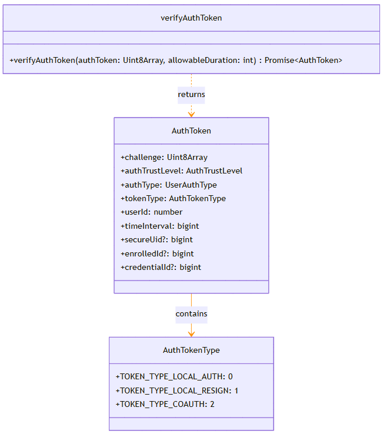

# @ohos.userIAM.userAccessCtrl (用户访问控制)(系统接口)

<!--Kit: User Authentication Kit-->
<!--Subsystem: UserIAM-->
<!--Owner: @WALL_EYE-->
<!--Designer: @lichangting518-->
<!--Tester: @jane_lz-->
<!--Adviser: @zengyawen-->

**userAccessCtrl**模块是OpenHarmony用户身份认证体系（UserIAM）的核心组件，专门用于认证令牌的验证和管理。该模块提供了验证认证令牌（AuthToken）的API，能够解析和验证用户身份认证结果，并返回详细的认证信息。

该模块主要用于以下场景：
- 系统级应用需要验证用户身份认证令牌的有效性。
- 需要获取认证令牌的详细信息（如认证类型、信任级别、用户ID等）。
- 需要基于认证结果进行访问控制决策的场景。


> **说明：**
>
> - 本模块首批接口从API version 18开始支持。后续版本的新增接口，采用上角标单独标记接口的起始版本。
>
> - 本模块为系统接口。

## 关键Class/Interface介绍

### 核心枚举类型

- **[AuthTokenType](#authtokentype)**：定义了认证令牌的类型，包括本地认证、复用认证和协同认证三种类型。

### 核心函数类型

- **[verifyAuthToken](#useraccessctrlverifyauthtoken)**：userAccessCtrl模块的核心验证函数，用于验证认证令牌并返回解析后的认证信息。

### 核心接口类型

- **[AuthToken](#authtoken)**：定义了验证成功后返回的认证令牌数据结构，包含认证挑战、信任级别、认证类型、用户ID等关键信息。



## API组合使用关系说明

使用userAccessCtrl模块的典型流程如下：

```ts
// 以下为阐述调用逻辑的伪代码，仅提供步骤说明，不提供详细的可执行代码。
// 1. 获取待验证的认证令牌（通常从其他认证流程获得）。
let authToken = getAuthTokenFromPreviousAuthFlow();

// 2. 设置令牌允许使用的有效时长（毫秒）。
let allowableDuration = 3600000; // 1小时

// 3. 调用verifyAuthToken验证令牌。
let parsedToken = await userAccessCtrl.verifyAuthToken(authToken, allowableDuration);

// 4. 根据返回的AuthToken信息进行后续处理。
// - 检查authTrustLevel确定信任级别。
// - 检查authType确定认证方式。
// - 检查tokenType确定令牌类型。
// - 使用userId进行用户相关操作。
```

## 导入模块

```ts
import { userAccessCtrl } from '@kit.UserAuthenticationKit';
```

## AuthTokenType

认证令牌类型枚举。该枚举定义了认证令牌的类型，用于标识令牌的签发来源。

**系统能力：** SystemCapability.UserIAM.UserAuth.Core

**系统接口：** 此接口为系统接口。

| 名称                      | 值   | 说明       |
| ------------------------ | ---- | ---------- |
| TOKEN_TYPE_LOCAL_AUTH    | 0    | 本地认证令牌。基于本地认证结果签发的身份验证令牌，表示用户在本设备上完成了身份认证。 |
| TOKEN_TYPE_LOCAL_RESIGN  | 1    | 本地重签令牌。基于复用的身份认证结果重新签发的身份验证令牌，表示本次认证结果是从之前的认证结果复用而来。 |
| TOKEN_TYPE_COAUTH        | 2    | 协同认证令牌。基于多个设备协同认证结果签发的身份验证令牌，表示用户通过多设备协同完成了身份认证。 |

## AuthToken

认证令牌数据。表示校验通过后返回解析的AuthToken数据结果，包含认证的详细信息，如挑战值、认证信任等级、认证类型、用户ID等。

**系统能力：** SystemCapability.UserIAM.UserAuth.Core

**系统接口：** 此接口为系统接口。

| 名称           | 类型                               | 只读 | 可选 | 说明                                       |
| -------------- | ---------------------------------- | ----- | ----- |------------------------------------------------------------ |
| challenge | Uint8Array | 否 | 否 | 认证随机挑战值。用于防重放攻击，认证时传入的挑战值会被包含在AuthToken中，业务可通过验证此字段确认认证结果的有效性。|
| authTrustLevel | [userAuth.AuthTrustLevel](js-apis-useriam-userauth.md#authtrustlevel8) | 否 | 否 | 认证信任等级。表示本次认证达到的安全强度等级，值为ATL1(10000)、ATL2(20000)、ATL3(30000)或ATL4(40000)。等级越高，表示活体检测能力越强、身份识别越精确。|
| authType | [userAuth.UserAuthType](js-apis-useriam-userauth.md#userauthtype8) | 否 | 否  | 身份认证的凭据类型。表示本次认证使用的认证方式，如PIN(1)、FACE(2)、FINGERPRINT(4)等。|
| tokenType | [AuthTokenType](#authtokentype) | 否 | 否 | 认证令牌类型。标识令牌的签发来源，如本地认证、复用认证或协同认证。|
| userId | number | 否 | 否  | 用户ID。表示完成认证的用户标识，为大于等于0的正整数。|
| timeInterval | bigint | 否  | 否  | AuthToken签发后经过的时间。自AuthToken签发至当前的时间间隔，单位为毫秒。|
| secureUid | bigint    | 否  | 是  | 安全用户ID。系统内部用于标识用户的安全标识，仅在特定认证场景下返回。|
| enrolledId | bigint   | 否  | 是  | 凭据注册ID。enrolledState中credentialDigest的原始值，反映了凭据的变更情况。|
| credentialId | bigint | 否  | 是  | 凭据ID。表示本次认证匹配成功的凭据标识，用于关联具体的认证凭据。|


## userAccessCtrl.verifyAuthToken

verifyAuthToken(authToken: Uint8Array, allowableDuration: number): Promise\<AuthToken>

验证认证令牌。该接口用于校验AuthToken的有效性，包括完整性校验和时效性校验，校验通过后返回解析后的AuthToken详细信息。使用Promise异步回调。

**需要权限：** ohos.permission.USE_USER_ACCESS_MANAGER

**系统能力：** SystemCapability.UserIAM.UserAuth.Core

**系统接口：** 此接口为系统接口。

**参数：**

| 参数名     | 类型                        | 必填 | 说明       |
| ---------- | --------------------------- | ---- | ---------- |
| authToken | Uint8Array | 是   | 待验证的认证令牌。最大长度为1024字节，由用户认证通过后返回。令牌中包含用户身份认证的凭证信息，用于后续的安全操作验证。 |
| allowableDuration  | number  | 是   | 允许的认证有效时长。从AuthToken签发起允许使用的最大时间间隔，单位为毫秒。值需大于0且小于等于86400000（24小时）。用于校验令牌的时效性，防止过期令牌被使用。 |

**返回值：**

| 类型                                      | 说明         |
| ----------------------------------------- | ------------ |
| Promise\<[AuthToken](#authtoken)> | Promise对象，验证成功时返回解析后的AuthToken数据，包含挑战值、认证信任等级、认证类型、用户ID等详细信息；验证失败时抛出相应错误码。 |

**错误码：**

以下错误码的详细介绍请参见[通用错误码](../errorcode-universal.md)和[用户认证错误码](errorcode-useriam.md)。

| 错误码ID | 错误信息                                |
| -------- | --------------------------------------- |
| 201      | Permission denied.        |
| 202      | Permission denied. Called by non-system application. |
| 401      | Parameter error. Possible causes: <br>1.Mandatory parameters are left unspecified. <br>2.Incorrect parameter types. <br>3.Parameter verification failed.    |
| 12500002 | General operation error.                |
| 12500015 | AuthToken integrity check failed.     |
| 12500016 | AuthToken has expired.                |

**示例：**

```ts
import { BusinessError } from '@kit.BasicServicesKit';
import { cryptoFramework } from '@kit.CryptoArchitectureKit';
import { userAccessCtrl } from '@kit.UserAuthenticationKit';
import { userAuth } from '@kit.UserAuthenticationKit';

try {
  const rand = cryptoFramework.createRandom();
  const allowableDuration: number = 5000;
  const len: number = 16;
  let randData: Uint8Array | null = null;
  let retryCount = 0;
  while(retryCount < 3){
    randData = rand?.generateRandomSync(len)?.data;
    if(randData){
      break;
    }
    retryCount++;
  }
  if(!randData){
    return;
  }
  const authParam: userAuth.AuthParam = {
    challenge: randData,
    authType: [userAuth.UserAuthType.PIN],
    authTrustLevel: userAuth.AuthTrustLevel.ATL3,
  };
  const widgetParam: userAuth.WidgetParam = {
    title: '请输入密码',
  };

  const userAuthInstance = userAuth.getUserAuthInstance(authParam, widgetParam);
  console.info('get userAuth instance successfully.');
  // 需要调用UserAuthInstance的start()接口，启动认证后，才能通过onResult获取到认证结果。
  userAuthInstance.on('result', {
    onResult (result) {
        if (!result.token) {
            console.error('userAuthInstance callback result.token is null');
            return;
        }
        try {
          // 发起AuthToken验证请求。
          userAccessCtrl.verifyAuthToken(result.token, allowableDuration)
              .then((retAuthToken: userAccessCtrl.AuthToken) => {
                  Object.keys(retAuthToken).forEach((key) => {
                      // 处理业务逻辑。
                      console.info(`retAuthToken key:${key}`);
                  })
              }).catch ((error: BusinessError) => {
                  console.error(`verify authToken failed. Code is ${error?.code}, message is ${error?.message}`);
              })
        } catch (error) {
          const err: BusinessError = error as BusinessError;
          console.error(`verify authToken failed. Code is ${err?.code}, message is ${err?.message}`);
        }
    }
  });
  console.info('auth on successfully.');
  // 启动认证。
  userAuthInstance.start();
  console.info('auth start successfully.');
} catch (error) {
  const err: BusinessError = error as BusinessError;
  console.error(`auth failed. Code is ${err?.code}, message is ${err?.message}`);
}
```